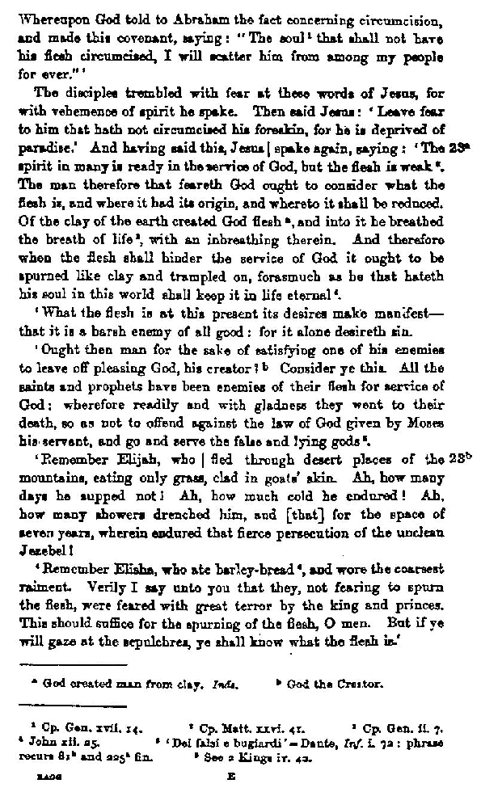
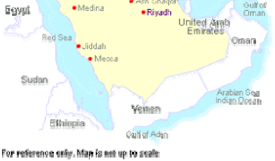
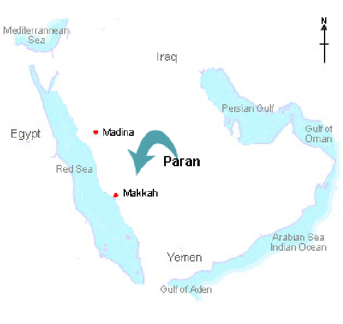
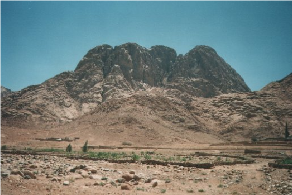
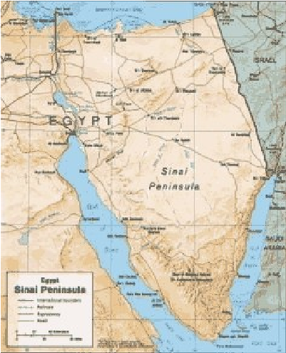
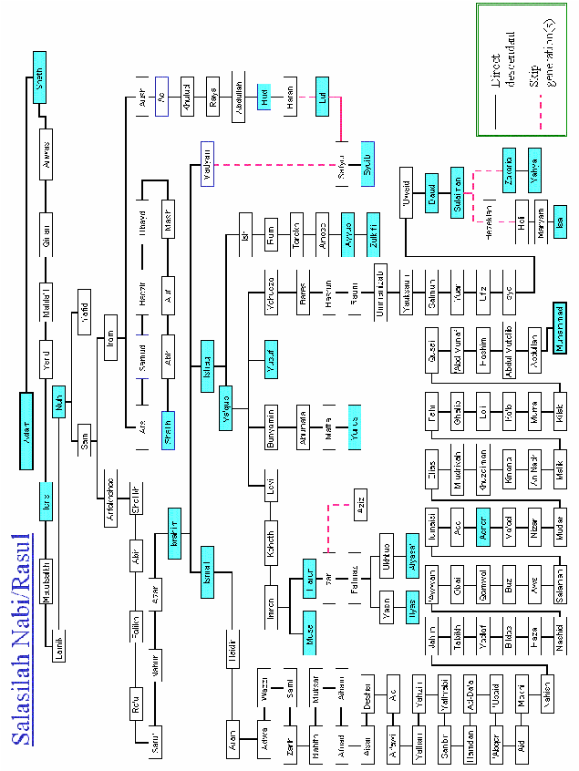

Tahrike Tarsile Qur’an 801-10 5st. Ave Elmhurst NY, New York 11373 (718) 779-6505

AMCA TEL: 00-1-661-872-7856 EMAIL: AMuslimCA@yahoo.com KAIS AL-KALBY

LIBRARY OF CONGRESS CATALOG CARD NUMBER 93-094167 ISBN 0-9638520-2-7 Copyright 1991-2005 Kais Al Kalby All Right Reserved

Permission is granted to use Parts of this book for educational purpose or critical reviews. All other printing purposes are reserved by author for English and translations in all other languages.

2

PROPHET

Muhammad

## The lastMessengerin the

# Bible

Written By: KAIS AL KALBY

Assisted with the English translation

Thomas H. Bandolin, Rebecca Wheeler, PhD Parvez K. Jadum, Nazar Mohammed

USA EIGHTH EDITION 2005

3

In the name of Allah, Most Gracious, Most Merciful

“Please accept our admiration and gratitude for an incisive, thoroughly researched and above all informative discourse on this subject. A subject which is, as I am sure you are aware, of particular interest to Muslim minority group within a larger, predominantly Christian, society.”

The federation of Islamic Association of New Zealand.

“Without knowledge of Middle Eastern Languages, history and geography, Al Kalby argues, American miss a lot of what the Torah and Bible have to say.” The Herald Journal, Logan, Utah

“The book retailed for $25.00, but not long ago the author was offered $100.00 for a used copy –any used copy.

Al Kalby has spent a good share of his time in America appearing on panels, giving interviews and debating issues. When an Islamic point of view is needed by the media or a University, he’s often the one who gets the call.” Desert News, Utah

“Imam Al Kalby is a trained Islamic scholar and Lawyer; and hence a rare and necessary person to have in the United States.”

Masjid Muhammad, Kansas City, MO

“Kais Al Kalby is a deeply religious man, committed to bringing his vision of Muhammad’s truth to the world. This he has done. R. Wheeler, Ph.D. former secretary of President Jimmy Carter’s office

“I read your Book. I found it very beneficial for Dawa among non Muslims”.

4

Mohammed Yunus, M.D., D.A President Islamic Circle of North America

Please be advice that Mr. Kalby is an Islamic Preacher who donates his services include but are not limited to, conducting sermons and lectures and visiting to the various Islamic Communities in the United States of America.

-The Islamic Center of Daytona Beach, Daytona Beach, Florida.

“It was a great surprise for me to know about your wonderful contribution to Islam in the form of your book Prophet Muhammad the last messenger in the Bible”.

Dr. Shamshad Khan Khattak, Pakistan

Mr. Al Kalby was a minister to the people of Gainesville, Georgia for about nine months. He helps to raise the thinking and living conditions of the blacks as well as whites here. Mr. Kais helped raise money to feed and clothe the poor. Muslim Community of Gainesville, GA.

Mr. Al Kalby has been a great asset to humanity through his preaching of peace and love among all people. Logan Islamic Center, Utah

Br. Al Kalby we need more guidance form Scholars in Islam like you. Muslim Community Mosque of Tempe, AZ

Br. Al Kalby I thank you very much for your book. It is very interesting book and indeed you have gathered many different elements and studies in a very challenging way. May Allah bless you and reward you for all the good that you do. Yusuf Islam (Cat Steven), London, England.

5

Br. Kais, after having read your book thoroughly, I must say that it is an excellent book; I have been a student of comparative religion, special of the Bible for more than fifteen years, having studied almost all English written books in relation to Islam and Prophet Muhammad including the classical works of Rahmatallah, “Athhar Al Haq and Abdul Ahad Dawud’s “Muhammad in the Bible”.

Habib Siddiqui, Ph.D., American Muslim Council North American Bangladesh Islamic Community.

Mr. Al Kalby, gifts such as yours help support the University’s teaching, research, and public service mission by strengthening the Library’s collections.

-The University of Kansas.

I read the Book of Mr. Kais Al Kalby and found it to be informative and very interesting. It is a good book for Muslims and non Muslims alike. It is an excellent work. I do encourage every one to read it. Ahmad H. Sakr, PhD. President Foundation for Islamic Knowledge.

6

##### TABLE OF CONTENTS

- Preface I __________________________________ 17
- Preface II__________________________________ 18
- Preface III _________________________________ 19 Letters from the editors_______________________ 21 FOREWORD ______________________________ 29

PART ONE__________________________________ 31

- CHAPTER 1 _______________________________ 32 ALLAH (THE GOD) ________________________ 33 THE ONE AND ONLY SAVIOR ______________ 33 (ONENESS) _______________________________ 33
- CHAPTER 2 _______________________________ 65 WHY DID ALLAH _________________________ 65 CREATE MANKIND?_______________________ 65
- CHAPTER 3 _______________________________ 68 PROPHET JESUS THE LAST MESSENGER TO THE CHILDREN OF ISRAEL ________________ 69

PART TWO _________________________________ 77

- CHAPTER 1 _______________________________ 78 BRIEF HISTORY OF THE ___________________ 79 WORLD BEFORE __________________________ 79 PROPHET MUHAMMAD (PBUH) ____________ 79
- CHAPTER 2 _______________________________ 88 THE GOSPEL OF___________________________ 89 BARNABAS_______________________________ 89
- CHAPTER 3 ______________________________ 113 CULTURAL SITUATIONS__________________ 113 DURING THE LIFE OF_____________________ 113 PROPHET MUHAMMAD (PBUH) ___________ 113
- CHAPTER 4 ______________________________ 115 VIRTUES OF _____________________________ 115 PROPHET MUHAMMAD (pbuh)_____________ 115
- CHAPTER 5 ______________________________ 119

7

THE ARRIVAL OF PROPHET ______________ 119 MUHAMMAD (PBUH) ____________________ 119 CHAPTER 6 _____________________________ 121 THE ROLE OF THE _______________________ 123 COMPANIONS___________________________ 123

PART THREE ______________________________ 127 CHAPTER 1 _____________________________ 128 PROPHECIES OF _________________________ 129 PROPHET MUHAMMAD (pbuh) ____________ 129

PART FOUR _______________________________ 135

- CHAPTER 1 _____________________________ 139 PROPHET MUHAMMAD __________________ 139 (PEACE BE UPON HIM) ___________________ 139 THE LAST MESSENGER IN THE BIBLE _____ 139
- CHAPTER 2 _____________________________ 145 “BIBLICAL VERSES” _____________________ 145 GOD HEARS THEE _______________________ 145 (ABRAHA, ISHMAEL, SARAH, HAGAR) ____ 145
- CHAPTER 3 _____________________________ 165 ABRAHAM (PBUH) WALKS IN THE MIDDLE EAST (ARAB REGION)____________________ 165
- CHAPTER 4 _____________________________ 171 PROPHET MUHAMMAD’S ________________ 171 ORIGINAL PROMISED LAND FROM _______ 171 THE EUPHRATES TO THE NILE ___________ 171
- CHAPTER 5 _____________________________ 185 ISHMAEL’S (PBUH) CHILDREN____________ 185 HAVE ALWAYS BEEN PRINCES IN THE ARAB REGION ________________________________ 185
- CHAPTER 6 _____________________________ 191 PROPHET MUHAMMAD (PBUH)___________ 191 WAS A DIRECT DESCENDANT OF PRINCE KEDAR _________________________________ 191
- CHAPTER 7 _____________________________ 195 PARAN (FARAN) – MAKKAH______________ 195

8

- CHAPTER 8 ______________________________ 201 PARAN IS BACA (MAKKAH)_______________ 201
- CHAPTER 9 ______________________________ 207 SHILOH, PROPHET _______________________ 207 MUHAMMAD THE LAST MESSENGER______ 207 FOR ALL NATIONS _______________________ 207
- CHAPTER 10 _____________________________ 213 PROPHET MUHAMMAD___________________ 213 WAS LIKE MOSES (PBUH) IN RECEIVING GOD’S LAW ____________________________________ 213
- CHAPTER 11 _____________________________ 221 PROPHET MUHAMMAD OPENS PARAN (MAKKAH) ______________________________ 221 WITH TEN- THOUSAND SAINTS IN 630 A.D._ 221
- CHAPTER 12 _____________________________ 229 THE HOLY ONE “PROPHET MUHAMMAD” FROM PARAN (MAKKAH)_________________ 229
- CHAPTER 13 _____________________________ 236 PROPHET MUHAMMAD (PBUH) SPOKE TO THE CHILDREN OF ISRAEL IN THE ARABIC LANGUAGE _____________________________ 237
- CHAPTER 14 _____________________________ 241 PROPHET MUHAMMAD (PBUH) ___________ 241 THE ONLY UNLETTERED (UMMI)__________ 241 PROPHET________________________________ 241
- CHAPTER 15 _____________________________ 251 AN INSPIRATION UP ARABIA _____________ 251 AND THE BATTLE OF BADR (624.A.D)______ 251
- CHAPTER 16 _____________________________ 259 ISLAM __________________________________ 259 THE UNCONQUERABLE POWER ___________ 259
- CHAPTER 17 _____________________________ 264 THE LAW OF ALLAH (QURAN),____________ 265 THROUGH MUHAMMAD (PBUH), __________ 265 FROM THE GENTILES ____________________ 265

9

TO ALL THE NATIONS ___________________ 265

- CHAPTER 18 ____________________________ 281 GOD (ALLAH) THE ONE AND THE ONLY SAVIOR!________________________________ 281
- CHAPTER 19 ____________________________ 287 MAKKAH SOURCE OF LIGHT _____________ 287 FOR ALL THE NATIONS __________________ 287
- CHAPTER 20 ____________________________ 295 PROPHTET MUHAMMAD’S _______________ 295 PROPHECIES CONSTANTINOPLE__________ 295 (ISTANBUL) WILL BE OPENED BY MUSLIMS (1453.A.D)_______________________________ 295
- CHAPTER 21 ____________________________ 299 THE HEBREW WORD (“MAHMAD”)________ 299 DESCRIBES PROPHET MUHAMMAD THE __ 299 LAST PROPHET FOR ALL NATIONS________ 299
- CHAPTER 22 ____________________________ 315 THE ONE NIGHT JOURNEY OF PROPHET MUHAMMAD TO JERUSALEM AND HIS ASCENSION TO HEAVENS 621 A.D. ________ 315
- CHAPTER 23 ____________________________ 342 KINGDOM OF ALLAH (ISLAM) ____________ 343 WILL FINISH THE ROMAN________________ 343 EMPIRE AND OTHER REALMS ____________ 343 (638-1453 A.D.)___________________________ 343
- CHAPTER 24 ____________________________ 359 GOD (ALLAH) RAISES____________________ 361 PROPHET MUHAMMAD’S (pbuh) __________ 361 KINGDOM FOREVER TO ALL NATIONS____ 361
- CHAPTER 25 ____________________________ 364 CALIPHA OMAR RIDES A_________________ 365 DONKEY TO JERUSALEM, 638 A.D. ________ 365
- CHAPTER 26 ____________________________ 375 PROPHET MUHAMMAD BAPTIZE ALL THE NATIONS WITH THE HOLY SPIRIT ________ 377

10

- CHAPTER 27 _____________________________ 387 THE PROPHETHOOD WAS GIVEN TO MUHAMMAD THE “BRETHREN” OF THE CHILDREN OF ISRAEL____________________ 387
- CHAPTER 28 _____________________________ 395 PROPHET JESUS DENIES__________________ 395 BEING THE LAST PROPHET _______________ 395 TO ALL THE NATIONS____________________ 395
- CHAPTER 29 _____________________________ 396 PROPHET MUHAMMAD (PBUH) ___________ 397 WAS THE PROMISED ONE, ________________ 397 AND THE LAST PROPHET _________________ 397 NOT JESUS, NOT ELIAS ___________________ 397
- CHAPTER 30 _____________________________ 401 PROPHET MUHAMMAD (PBUH) ___________ 401 THE PRINCE OF THE WORLD______________ 401
- CHAPTER 31 _____________________________ 407 PROPHET JESUS (PBUH) __________________ 407 FINSHES HIS DUTY_______________________ 407
- CHAPTER 32 _____________________________ 412 THE HEBREW WORD FOR_________________ 413 “SON” TRANSLATES TO ONE______________ 413 WHO IS CLOSE TO GOD___________________ 413
- CHAPTER 33 _____________________________ 421 THE LAST HOURS OF JESUS_______________ 421 ON EARTH BEFORE GOD _________________ 421 RAISED HIM TO HEAVEN _________________ 421

PART FIVE ________________________________ 449

- CHAPTER 1 ______________________________ 450 SCIENCE IN THE _________________________ 451 HOLY QURAN ___________________________ 451
- CHAPTER 2 ______________________________ 453 THE UNIVERSE __________________________ 453

1. CREATION OF THE UNIVERSE, ________ 453 THE BEGINNING OF LIFE, AND THE______ 453

11

ATMOSPHERE (BIG BANG THEORY)_____ 453

- 2. STAGES ____________________________ 454
- 3. EXPANDING THE UNIVERSE__________ 455
- 4. TRAVEL TO THE PLANETS ___________ 456
- 5. SPACE______________________________ 456
- 6. MAGNETIC/GRAVITATIONAL FORCES 457
- 7. COURSE OF THE SUN ________________ 458
- 8. THE SHINING MOON_________________ 459
- 9. MOON WAS CLEFT ASUNDER ________ 459
- 10. THE WEIGHT OF AN ATOM __________ 460
- 11. BALANCE AND IRON _______________ 461
- 12. CLOUDS ___________________________ 461
- 13. RAIN ______________________________ 462
- 14. FRESH WATER _____________________ 463
- 15. THE PROCESS OF THE DAY/NIGHT CYCLE

- ______________________________________ 463

16. DAY AND NIGHT IN THE POLAR REGIONS

- ______________________________________ 464

- CHAPTER 3 _____________________________ 465 EARTH _________________________________ 465

- 1. ZUL – QARNAIN (KING WITH TWO HORNS)

______________________________________ 465

- 2. THE EARTH IS NOT PERFECTLY ROUND467
- 3. MOUNTAINS ________________________ 467
- 4. OCEAN _____________________________ 468
- 5. SYSTEMS OF WATER ________________ 469
- 6. TRACTS ____________________________ 469
- 7. OUTLAYING BORDER________________ 470

- CHAPTER 4 _____________________________ 471 HUMAN FETUS__________________________ 471

- 1. MINGLED SPERM____________________ 471
- 2. PARTLY FORMED AND PARTLY UNFORMED___________________________ 471
- 3. HUMAN SEED _______________________ 472
- 4. MALE SEED (SPERM) ________________ 473

12

- 13
- 5. THE HUMAN EMBRYO________________ 474
- 6. PAIRS_______________________________ 477

- CHAPTER 5 ______________________________ 479 MODERN TRANSPORTATION FACILITIES __ 479
- CHAPTER 6 ______________________________ 481 DISCOVERIES IN THE UNIVERSE __________ 481

- 1. THE LIMIT TO MAN’S ABILITY ________ 481
- 2. THE HUMAN BODY __________________ 481
- 3. OXYGEN ____________________________ 482
- 4. DISCOVERIES OF NEW LANDS AND THE HUMAN CONTROL OVER THE PRODUCE OF THE LANDS ___________________________ 482
- 5. NATURAL RESORUCES _______________ 483
- 6. SCIENTIFIC WONDERS _______________ 484
- 7. FINGER PRINTS ______________________ 485
- 8. BOMBS AND LAND MINES ____________ 486
- 9. THE HEALING PROPERTIES OF HONEY AND THE ANATOMY OF BEES___________ 487

9. THE BODY OF PHARAOH _____________ 488

PART SIX__________________________________ 491 CHAPTER 1 ______________________________ 492 WHY THEY HAVE CHOSEN ISLAM_________ 493

Abraham Khalil Ahmed ___________________ 493 Cat Stevens (Yusuf Islam) _________________ 493 Professor Abdul Ahad Dawud ______________ 494 Edward William Lane_____________________ 494 Al-Hajj Khwaja Kamal-Ud-Din _____________ 503

Why I Accepted Islam ______________________ 506 PART SEVEN ______________________________ 513 GENERAL INFORMATION ABOUT ISLAM_____ 513 [PROPHET MUHAMMAD (pbuh) THE GREATEST TEACHER OF ALL MANKIND] _______________ 513

CHAPTER 1 ______________________________ 514

- 1. THE PARENTS OF PROPHET MUHAMMAD _______________________________________ 515

- 2. JARJES (BUHAIRA) AND______________ 515 PROPHET MUHAMMAD (pbuh) __________ 515
- 3. KHADIJAH THE WIFE OF PROPHET MUHAMMAD _________________________ 515
- 4. THE CHILDREN OF PROPHET MUHAMMAD ______________________________________ 516
- 5. PROPHET MUHAMMAD’S REJECTION OF WORDLY POSSESSIONS________________ 517
- 6. PROPHET MUHAMMAD’S (pbuh) MISSION

- ______________________________________ 518

- 7. THE FIRST FOLLOWERS OF PROPHET MUHAMMAD (pbuh)____________________ 518
- 8. PROPHET MUHAMMAD AND HIS CLOSE FRIEND ABY BAKR IN CAVE (THOR) 622 A.D.

- ______________________________________ 519

- 9. SURRENDER OF BENI KHENEKAH (Children of Levi) _______________________________ 519
- 10. BATTLE OF KHAYBAR (Children of Levi) 627 A.D._______________________________ 520
- 11. PROPHET MUHAMMAD’S (pbuh) PROPHECY TO OPEN MAKKAH, (630 A.D.) 520
- 12. THE RLATIONSHIP BETWEEN PROPHET MUHAMMAD AND THE CHRISTIANS ____ 521
- 13. ASHAMA; THE KING OF EITHIOPIA __ 522
- 14. WIVES OF PROPHET MUHAMMAD (pbuh) ______________________________________ 523
- 15. THE DEMISE OF PROPHET MUHAMMAD (pbuh)_________________________________ 526
- 16. THE PROTECTION OF PROPHET MUHAMMAD’S BODY _________________ 527
- 17. ALL CHILDREN OF THE WORLD BORN AS MUSLIMS! ____________________________ 528

CHAPTER 2 _____________________________ 529 1. ISLAM TREATS EVERYONE EQUALLY 529

14

- 2. MUSLIMS USED THEIR OWN WEALTH TO SPREAD ISLAM ________________________ 530
- 3. ISLAM IN BELGIUM __________________ 532
- 4. MILITARY BATTLES AND ETHICS _____ 532

- CHAPTER 3 ______________________________ 534

- 1. ISLAMIC RELIGION FROM THREE SOURCES: QURAN, HADITH AND LIFE OF PROPHET MUHAMMAD (pbuh)___________ 534
- 2. AL HAJER AL ASWAD THE (BLACK STONE) OF THE KAABAH_______________________ 535
- 3. THE STONING OF SHAITANS DURING THE HAJJ (PILGRIMAGE) ____________________ 536
- 4. THE STYLE OF THE QURAN___________ 536
- 5. THE FIRST SURA FROM THE QURAN REVEALED TO PROPHET MUHAMMAD (PBUH) 610 A.D. ________________________ 537

- CHAPTER 4 ______________________________ 538

- 1. RIGHTS OF WOMEN IN ISLAM_________ 538
- 2. POLYGAMY _________________________ 548
- 3. MEHR (DOWRY) _____________________ 549
- 4. ALLAH (GOD) CHOSE THE WIVES OF PROPEHT MUHAMMAD (pbuh)___________ 550

- CHAPTER 5 ______________________________ 555 APPENDIX_______________________________ 555

- 1. NAME OF PEOPLE____________________ 555
- 2. WHAT DO THEY SAY ABOUT ISLAM___ 556
- 3. PROPEHT ISHMAEL (pbuh) ____________ 556
- 4. CHRONOLOGY OF ISLAMIC HISTORY__ 557
- 5. PARACLETE MEANS AHMED IN THE GOSPEL OF JOHN 14-15-16 ______________ 559
- 6. JESUS STATES THAT HE IS NOT THE MESSIAH, AND NOT THE SON OF GOD ___ 559
- 7. THE NIACIN CREED: 325 A.D.__________ 560
- 8. JESUS WAS NOT KILLED! _____________ 560
- 9. PRACLETE __________________________ 561 16

15

- 10. HOW MUSLIMS TREATED JEWS AND CHRISTIANS __________________________ 561
- 11. JAFAR IN ETHOPIA _________________ 562
- 12. PARACLETE _______________________ 562
- 13. JEWISH BELIEFS ABOUT THE NEW TESTAMENT __________________________ 563
- 14. FALSE PROPHETS OF THE JEWS _____ 564
- 15. ARABIC, ISLAMIC AND OTHER REFERENCES _________________________ 583

###### S A L A M

###### Preface I

In the name of Allah, the most Beneficent, the most Merciful, peace be upon Prophet Muhammad and his followers until the last Day of Judgment. We ask Allah to protect us from evil. We thank Allah for his guidance.

I am a witness that there is only one God (Allah), and Prophet Muhammad (peace be upon him) is the last messenger and prophet of Allah. I also witness that Muhammad (pbuh) was sent by Allah as a covenant for the world. I believe in all of Allah’s prophets up to Jesus(pbuh), son of Mary and the last messenger for the(bani Israel) and all of Allah’s books(Torah to Mosses); (Injeel to Jesus); (Zabor (psalm) to David); (Qur’an to Muhammad(pbuh) and all the revelations of the Prophets(pbut).

###### Preface II

The purpose of the first edition of this book was twofold. The first and foremost is to serve the truth about religion and other matters. The second was to see how this subject would be received by Muslims around the world, by American Muslims, and by Americans who are not Muslims. The majority of commentators from these three groups found the subject matter well- researched and of considerable interest. Some recommended that the book needed improvement.

With these comments in mind, I decided to make the needed changes in the book. In order to better serve the truth about Allah’s world, I have tried to improve this edition. To do this I have tried to provide a more detailed explanation of the historical events and people described herein. In this way, I hope to give more clarity and evidence to the claims about the true meaning of the Biblical verses. This second edition also contains part 5 titles (General Information About Islam). I hope it answers the most important questions that have been raised.

17

18

###### Preface III

The first edition of the book was distributed in a very short time. There was pressing demand from readers, who were willing to pay any price for such a book. The media, radio, TV and newspaper took notice of the book and gave it publicity. The LDS Institute of Religion for the Mormons in Logan, Utah used this as a reference book; historical and religious lessons were given from the book. The fruit of the first edition along with second edition appeared very favorable when a number of people in the U.S and outside converted to Islam after reading the book. Thanks to Almighty Allah.

For the second edition 5000 copies were printed and were distributed completely. The book has gone to the individuals, to religious institutions, to churches and to other teaching institutes. As a result of this I received many invitations from the various denominations of Christianity.

During the Hajj or pilgrimage of 1993 I was invited by the Muslim League (Rabitat el Aalam el Islami) of Saudi Arabia for a lecture where most of the attendants were from the different Muslim countries including various religious and political leaders. There was a tremendous appreciation of the subject matter of the book.

Saudi Government and other Muslim governments showed their keen interest in the book’s translation in Arabic and as well as in other languages.

The wide circulation of the second edition brought in many encouraging comments.

19

The Christian and some Israeli scholars whom I met agree that Muhammad (pbuh) is the last prophet. The book attracted them to the numerous quotations of verses from the Bible, which, as a result led them ponder upon the verses a one step further, Many of them are still in touch with me, Insha Allah(God Willing) the results will be beyond my expectations.

There has been a clear demand for the third edition. The financial constraints have been the hurdles. I was also in need of a Muslim brother to help me produce a Revised Version. To my fortune Allah the Greatest granted me another Pakistani brother, as also happened in the case of the first edition Nazar Muhammad an Engineer who was here on a visit, met me in Logan Islamic Center. He stated that he had seen this book. I invited him to my place. When I listened to his point of view, I was quiet fascinated. His encouraging talk and my positive response paved the way for the third revised edition. Nazar Muhammad went through the entire book to revise the language with some suggestions and spent more than a month with me.

20

###### Letters from the editors

I was born into Catholicism in 1953. It was not until 1978 that I was introduced to Islam while in Malaysia. After I had seen, heard, and felt some extraordinary events related to Islam, and discussed Islam with many understanding and patient Malaysian Muslims, I also became a Muslim. Since those days, Islam has been the most important influence in my life.

I met Kais Al-Kalby in Logan, Utah, during the summer of 1989. We discussed his ideas for this book and I decided to help him with the writing and edition. Assisting kais has taught me many things about Islam, the history of Prophet Muhammad (pub), his times, and the holy prophets, which came before him I thank Allah for allowing me this opportunity to learn.

This book is an interesting presentation of the Holy Scriptures with an interpretation of their historical and prophetic contents. The objective in writing the narrative is an attempt to present the information in a simple and easy to understand way. As an American, I have come to realize that Americans have very little knowledge of the history relative to the coming of Islam and Islam itself. They also have very little knowledge of the history relative to their own religious beliefs. With this book, kais has attempted to bring insight and knowledge of the truth relative to Allah’s will and laws, as well as the purpose and teachings of Allah’s prophets, I am totally convinced that Prophet Muhammad (pub) is mentioned numerous times in the Bible as the last and greatest Messenger and Prophet of Allah.

21

It is my hope, if it be the will of Allah, that this book will help people of all beliefs come closer to Allah through the true and most complete religion, Islam. It is also my hope that after reading this book, people will study the Qur’an and the teaching of the Holy Prophet Muhammad (pbuh) and become Muslims, the servants to Allah’s will.

Thomas Kamal Reduan Bandolin Former Chapter President – American Muslim Cultural Association Washington, DC, U.S.A

22

American Muslim Cultural Association August 14, 1990 Why I converted to Islam: By Michael Decker

In order of you to understand this testimony, I feel it is important to tell you a little about my past. I am the fifth generation grandson of Mormon prophet and Governor of Utah, Brigham Young, from his first marriage. I was born in Utah but educated in three states. I am also related to Ed Decker, who founded Saints Alive, the maker of the film “God Makers” and the author of many books and pamphlets about Mormonism. I have had very strong ties to the Mormon Church for many years.

I converted to Christianity in 1978. Before converting to Christianity, I explored Catholic, Lutheran, Protestant, and a few others, but to no avail, I came to a point that found myself at a crossroad and remained confused about religion seemingly forever. In July 1990, after a long recovery from surgery, I returned to my job. They had replaced me, so I was placed in different department. There I met Kais al- Kalby. Over the course of two and a half months, day after day Kais would talk to me about Islam. He would bring copy of passages from the Bible and the Qur’an and literature from a book Kais al Kalby is presently writing called Prophet Muhammad, the Last Messenger in the Bible. With all the patience and diligence he continued to present Biblical and scientific facts from the Bible and the Qur’an, examining all the fundamental differences between Islam and

23

Christianity. But still I remained unsure though the facts were clearly evident.

About a week before conversion to Islam I had a dream, a dream like no other I had ever had. In my dream I in the dark but I see before me light. As I walk into light, it is the most peaceful screen light I have ever seen. The ground was covered with very variant flowers as far as the eye could see. The birds were singing and butterflies flying about gracefully. Ahead of me I could see many children, all sitting among the flowers. In front of the children also sitting down was Kais al Kalby. He was dressed all in white. As I looked around I could see children of every creed. The children were all looking at Kais so very attentive to his every creed. The children were all looking a Kais so very attentive to his every word. In his hand he was holding the Qur’an and reading from it. I looked around at the beauty and it seemed like Paradise, I woke up from this dream wishing to return. In the morning I went to work and told kais of my dream. He explained this was Islam and the beauty of belonging and being Muslim. What a wonderful dream it was. One week later, in the home of an American Muslim, Mr. Thomas, I accepted Islam.

It was through Kais- al Kalby and the American Muslim Cultural Association, I have become Muslim. I personally invite anyone interested in Islam or feeling unsure about religion to call or write to Kais al – Kalby.

Thank you for allowing me to share my testimony with you.

Sincerely, Michael Decker (Ahmed)

24

Letter from the First Editor

I met Mr. Kais al Kalby a week after I came from Pakistan and during the first meeting I was greatly impressed by his knowledge of Christianity, Judaism, and especially Islam. We had frequent meetings and we discussed his forthcoming book. I became interested in the book when I observed that Mr. Kais had done intensive study of the Bible, Torah (Old Testament), and Qur’an, and was proving scientifically and logically that the Bible and Torah had given ample prophecies regarding the advent of the Prophet Muhammad (pbuh).

I had the honor of compiling, translating, and editing the research done by Mr. Kais and I would like to say that the facts extracted from the Bible and Torah ( Old Testament) are extremely conclusive of the fact that these two books of God had made it very clear that the next prophet to come was Muhammad(pbuh).

I have no doubt that his all- important work of Mr. Kais will go a long way in clearing the concept of all people who have faith in God; that the prophet promised in the Bible and Torah was no other than Muhammad(pbuh).

I wish all success to Mr. Kais and pray that God may give him more strength and perseverance in pursuing the goal of truth and righteousness.

I am thankful to God that he gave me the chance to do my part in the completion of this great work of research. Eng. Parvez Khan Jadum. Pakistan

Dated Feb.14th, 1990

25

RECOMMENDATION

The Qur’an says, “And when Jesus, son of Mary, said “O children of Israel Lo! I am the Messenger of Allah unto you, confirming that which was (revealed before me in the torah, and bringing good tidings of a messenger who cometh after me whose name is Ahmad.” (Sura as-Saff: 6). All Muslims, therefore, believe that Esa (Jesus) did foretell the advent of Muhammad Ahmad alMustafa Sallal –Lahu alaihe wa sallam (SAWS) peace and blessings be upon him – the last messenger of God. Yet any knowledgeable Christian or Jew would deny such.

Their denial has further invigorated the Muslim position that the Bible we have today in neither the Torah revealed to Moses or the Gospel (Injil) revealed to Jesus Alaihum al salam, respectively, but that the Bible has been edited or corrupted by both deletions and additions at the hands of tribes who did not fear God. E.G White, in her Bible Commentary, volume 1 wrote: “The Bible we read today is the work of many copyists who have in most instances done their work with marvelous accuracy. But copyists have not seen fit to preserve them altogether from error in transcribing. Yet when copies of it were few, learned men had in some instances changed the words, thinking that they were making it plain, when in reality they were my satisfying that which was plain, by causing it to lean to their established views, which were governed by tradition”.

Biblical researchers have now established that the most of the books of the Torah (Jewish Bible) were not written by the people that these were ascribed to and that the so –called canonical books of the New Testament are

26

nothing but pseudepigraphical books. It is a prerequisite of believing in a certain book as divinely revealed that it is proved through infallible arguments that the book in question was revealed through a Prophet and that it has been conveyed to us precisely in the same order without any change through an uninterrupted chain of narrators. It is not at all sufficient to attribute a book to a certain prophet on the basis of suppositions and conjectures. Muslim scholars have always demanded from the renowned Jewish and Christian scholars to produce the names of the whole chain of narrators right from the author of the book to prove their claim but they were unable to do so. It is, however, possible that bits and pieces of prophetic traditions did reach the scribes, who mixed such with their own writings to agree or lean towards certain notions or views of the community that they represented.

Kais al Kalby’s voluminous work “Prophet Muhammad the last messenger of God in the Bible” follows the trail left by Professor Abdul Ahad Dawud through his important work of scholarship “Muhammad in the Bible, both written in the English language. Al Kalby, like his predecessor, shows that despite the inherent corruptions at the hands of the scribes, the Bible contains many prophecies concerning the event of Prophet Muhammad (SAWS). In this effort, Al Kalby, does a superb work and cites across of verses in the Hebrew/Greek/Arabic/ English languages, for the benefit of interested readers with scholarly explanations.

I have been a student of comparative religion for the last fifteen years and have been a frequent speaker on the subject for more than a decade. My knowledge on this important subject of prophecies concerning the advent of

27

the prophet of Islam would have remained incomplete had I not the opportunity of studying Al Kalby’s work. I honestly believe that his work would enlighten the believers of Abrahim’s faiths, ie. Judaism, Christianity and Islam and foster an understanding of cooperation and commonality. I strongly recommend this book to all those who are interested about the Semitic religions relations.

Habib Siddiqui, Ph.D. Member of American Muslim Council Member, North American Bangladesh Islamic Community.

28

###### FOREWORD

During my stay in Lebanon in 1971 I studied Christianity and worked for Islam while attending law school. In 1979, I founded the American Islamic Cultural Center in San Antonio, Texas.

During the process of research for the material for my book, many people and agencies relating to Christians as well as to the people of Jewish faith helped me in my quest for knowledge. Rabbi Jacob (an Israeli settler) is a very respected and well-known Jewish Rabbi whom I met in Salt Lake City. We discussed verse by verse the chapters of the old Testament in Hebrew which I have accounted for in my during the course of this discussion, he wept out of love for God and said categorically that there is no doubt that Muhammad (pbuh) is the prophet of God and is similar in many ways to Moses, the Prophet of God.

I discussed my book with Mr. Jerry Kent, who is a scholar of Islam, Christianity, and Judaism. He agreed with me about the prophecies mentioned in several chapters.

Mr. Kent said in a letter to me concerning Isaiah 42:1-

- 7, “I think these verses work well as a prophecy of Muhammad (pbuh). They do not work as well for the Christian claim that they refer to Jesus (pbuh) because Jesus came for the Jews not implies that the cults of graven images will suffer loss and it might be claimed that Muhammad (pbuh) did the better job of eradicating those cults.”

Mr. Kent’s youngest son is now a Muslim. He helped me in the translation from Hebrew to English.

Steve Siporin, a professor of History and English at Utah State University and of Jewish descent, with whom I had many sittings, was surprised when the details of the chapter

29

“Malachi 3” came to his notice and he agreed to the revelations therein.

The course of my research took me to many agencies and libraries in Salt Lake City, Logan, and USA. I met many high-ranking scholars of the Mormon religion, and I had the pleasure to discuss these matters, and all of them agreed that Muhammad (pbuh) was a great prophet. I received help from these agencies in getting relevant maps and other documentary proof for the subject matter of my book.

I had the chance to exchange views, through letters, with Anis Sharoosh, who is a professor at St. Alive Church, and with Ed Decker, who is famous for his film “God Makers.”

While writing this book I have tried my best to be as simple as possible for my general readers so as to make the point home.

30

### PART ONE

###### Only Allah, the creator, deserves worship. He is the only God, and none are partners with him.

31

32

###### CHAPTER 1

###### ALLAH (THE GOD) THE ONE AND ONLY SAVIOR (ONENESS)

Allah is the proper name for the Creator in Arabic and in English the only proper word is (The God). The word Allah (AlElah) means the only mabbood, the only God to be worshipped. It only Him to be worshipped.

Allah is the one and the only God, Isaiah 46:9, 44:6. Sura 21:22, Sura 23:91 & Sura 3:18 Allah has no partner or equal, Isaiah 46:5,6,14 and Micah 7:18-19, Sura 42:11. Allah is the creator of everything. Allah is the only one who can give and take life away, Sura 25:58, Sura 3:156. He is the only one who can raise the dead and he is the only savior, Deut. 32 (39-40), Isaiah 43 (11),Sura 39:36, Sura 39:44. All worship is to Allah alone, Deut 6:13, Isaiah 45:5, 614, Sura 20:14. No one’s eyes had ever nor can anyone ever see Allah, John 1:18, nor can we imagine or conceptualize Allah (Matthew 23:9), Sura 42:51, Sura 6:103and Sura 43:84. Allah sees and knows everything. Allah is the best example of everything that is good. Allah is the better than any thing that a human being is capable of describing. Sura 6:80. Allah is the creator of time and space; therefore, He is not affected by time or space. Sura 4:126. Allah never changes but can change every thing. Sura 2:255 and Sura 112: 1-4. He remembers everything, and forgets nothing.

Allah never gets tired and never needs rest, Isaiah 40:28. Allah has no obligations and does not adhere to any natural or man made laws, Numbers 23:19. Allah, not humans, chose which men would be His Messenger and His Prophet. Allah has created all that is good. Allah has shown us the difference between good and evil, and guides us towards the good. He permits us to make the choice between good and evil and that we are responsible for our decisions and actions. Allah is all forgiving and merciful to all who repent, by His will starting from Adam to the last day of judgment, Sura 2:37, Sura 74:38, Sura 31:33 Sura 42:25 and Sura 39:53, Micah 7:1819,Ezekiel 18:20-33,Exodus 34:6-8.

Allah should be loved totally and absolutely from our hearts and souls, Deuteronomy 13(1-4). No one will ask Allah what He does, but Allah will ask us what we do, Sura 21:23. Allah describes

33

Himself as mentioned in His Scriptures (Bible and Qur’an). We are not allowed to add or to omit anything from his description. No one will share with Allah, His name or His actions. Allah has prohibited worshipping any graven image, even those that Allah had praised, Exodus 20(1-9). There is no mediator in worshipping Allah.

###### Allah is The One and the Only God. Isaiah 46: 5-9

#### .הֶמְדִנְו , יִנוּלִשְׁמַתְו ;וּוְשַׁתְו , יִנוּיְמַּדְת יִמְל ה

- 5 To whom will ye liken Me, and make Me equal, and compare Me, that we may be like?

; וּלֹקְשִׁי הֶנָקַּבּ ףֶסֶכְו , סיִכִּמ בָהָז םיִלָזַּה ו

-ףאַ וּדְגְּסִי ,לֵא וּהֵשֲׂעַיְו ףֵרוֹצ וּרְכְּשִׂי

.וּוֲחַתְּשִׁי

- 6 Ye that lavish gold out of the bag, and weigh silver in the balance; ye that hire a goldsmith, that he make it a god, to fall down thereto, yea, to worship.

ויָתְּחַת וּהֻחיִנַּיְו וּהֻלְבְּסִי ףֵתָכּ- לַע וּהֻאָשִּׂי ז קַעְצִי-ףאַ ;שׁיִמָי אֹל ,וֹמוֹקְמּמִ-- דֹמֲעַיְו

.וּנֶּעיִשׁוֹי אֹל וֹתָרָצּמִ , הֶנֲעַי אֹלְו ויָלֵא

- 7 He is borne upon the shoulder, he is carried, and set in his place, and he standeth, from his place he doth not remove; yea, though one cry unto him, he cannot answer, nor save him out of his trouble.

וּביִשָׁה ;וּשָׁשֹׁאְתִהְו ,תאֹז- וּרְכִז ח

.בֵל-לַע , םיִעְשׁוֹפ

- 8 Remember this, and stand fast; bring it to mind, O ye transgressors.

34

לֵא יִכֹנאָ יִכּ :םָלוֹעֵמ , תוֹנֹשׁאִר וּרְכִז ט

.יִנוֹמָכּ סֶפֶאְו םיִהֹלֱא ,דוֹע ןיֵאְו

9 Remember the former things of old: that I am God, and there is none else; I am God, and there is none like Me;

(9 - 5) 46 ﺎﻴﻌﺷأ نﻮ   ﻏﺮﻔﻳ ﻦﻳﺬ   ﻟا (6 . ﻪﺑﺎ   ﺸﺘﻨﻟ ﻲﻨﻧﻮ   ﻠﺜﻤﺗو ﻲﻨﻧوﻮ   ﺴﺗو ﻲﻨﻧﻮﻬﺒ   ﺸﺗ ﻦ   ﻤﺑ ( 5 ﻰ ﻠﻋ ﻪ ﻧﻮﻌﻓﺮﻳ (7 . نوﺮﺟﺄﺘ ﺴﻳ نﻮﻧﺰﻳ ناﺰﻴﻤﻟﺎﺑ ﺔﻀﻔﻟاو ﺲﻴﻜﻟا ﻦﻣ ﺐهﺬﻟا ﻖ ﻋﺰﻳ حﺮ ﺒﻳ ﻻ ﻪﻌ ﺿﻮﻣ ﻦ ﻣ ﻒ ﻘﻴﻟ ﻪ ﻧﺎﻜﻣ ﻲ ﻓ ﻪﻧﻮﻌﻀﻳو ﻪﻧﻮﻠﻤﺤﻳ .ﻒﺘﻜﻟا

ﻻﺎ ﺟر اﻮ ﻧﻮآو اﺬ ه اوﺮ آذا (8 . ﻪ ﺼﻠﺨﻳ ﻻ ﻪﺗﺪ ﺷ ﻦ ﻣ ﺐ ﻴﺠﻳ ﻼﻓ ﻪﻴﻟإ ﺪﺣأ ﺎ ﻧأ ﻲ ﻧﻷ ﻢﻳﺪ ﻘﻟا ﺬ ﻨﻣ تﺎ ﻴﻟوﻷا اوﺮ آذا (9 . ةﺎ ﺼﻌﻟا ﺎ ﻬﻳأ ﻢﻜﺑﻮﻠﻗ ﻲﻓ ﻩوددر

.ﻲﻠﺜﻣ ﺲﻴﻟو ﻪﻟإ ﺮﺧﺁ ﺲﻴﻟو ﷲا

- Isaiah 44: 6

#### וֹלֲאֹגְו לֵאָרְשִׂי-ךְֶלֶמ הָוהְי רַמאָ- הֹכּ ו ןוֹרֲחאַ יִנֲאַו ןוֹשׁאִר יִנֲא : תוֹאָבְצ הָוהְי . םיִהֹלֱא ןיֵא יַדָעְלַבִּמוּ

- 6 Thus saith the LORD, the King of Israel, and his Redeemer the LORD of hosts: I am the first, and I am the last, and beside Me there is no God.

(6) 44 ﺎﻴﻌﺷأ ﺮ ﺧﻵا ﺎﻧأو لوﻷا ﺎﻧأ ، دﻮﻨﺠﻟا بر ﻪﻳدﺎﻓو ﻞﻴﺋاﺮﺳإ ﻚﻠﻣ بﺮﻟا لﻮﻘﻳ اﺬﻜه ( 6

.يﺮﻴﻏ ﻪﻟإ ﻻو

יִל ָהֶכְרְעַיְו הֶָדיִגַּיְו ,אָרְקִי יִנוֹמָכ- יִמוּ ז ,הָנאֹבָתּ רֶשֲׁאַו תוֹיִּתֹאְו ;םָלוֹע-םַע , יִמוּשִּׂמ

.וֹמָל וּדיִגַּי

- 7 And who, as I, can proclaim-let him declare it, and set it in order for Me-since I appointed the ancient people? And the

35

things that are coming, and that shall come to pass, let them declare.

Allah has no partner or equal. Isaiah 46: 6-9, Micah 7: 18-19.

Isaiah 46: 6-9

; וּלֹקְשִׁי הֶנָקַּבּ ףֶסֶכְו , סיִכִּמ בָהָז םיִלָזַּה ו

-ףאַ וּדְגְּסִי ,לֵא וּהֵשֲׂעַיְו ףֵרוֹצ וּרְכְּשִׂי

.וּוֲחַתְּשִׁי

- 6 Ye that lavish gold out of the bag, and weigh silver in the balance; ye that hire a goldsmith, that he make it a god, to fall down thereto, yea, to worship.

ויָתְּחַת וּהֻחיִנַּיְו וּהֻלְבְּסִי ףֵתָכּ- לַע וּהֻאָשִּׂי ז קַעְצִי-ףאַ ;שׁיִמָי אֹל ,וֹמוֹקְמִּמ-- דֹמֲעַיְו

.וּנֶּעיִשׁוֹי אֹל וֹתָרָצּמִ , הֶנֲעַי אֹלְו ויָלֵא

- 7 He is borne upon the shoulder, he is carried, and set in his place, and he standeth, from his place he doth not remove; yea, though one cry unto him, he cannot answer, nor save him out of his trouble.

וּביִשָׁה ;וּשָׁשֹׁאְתִהְו ,תאֹז- וּרְכִז ח

.בֵל-לַע , םיִעְשׁוֹפ

- 8 Remember this, and stand fast; bring it to mind, O ye transgressors.

לֵא יִכֹנאָ יִכּ :םָלוֹעֵמ , תוֹנֹשׁאִר וּרְכִז ט

.יִנוֹמָכּ סֶפֶאְו םיִהֹלֱא ,דוֹע ןיֵאְו

36

- 9 Remember the former things of old: that I am God, and there is none else; I am God, and there is none like Me;

(9 - 5) 46 ﺎﻴﻌﺷأ نﻮ   ﻏﺮﻔﻳ ﻦﻳﺬ   ﻟا (6 . ﻪﺑﺎ   ﺸﺘﻨﻟ ﻲﻨﻧﻮ   ﻠﺜﻤﺗو ﻲﻨﻧوﻮ   ﺴﺗو ﻲﻨﻧﻮﻬﺒ   ﺸﺗ ﻦ   ﻤﺑ ( 5 ﻰ ﻠﻋ ﻪ ﻧﻮﻌﻓﺮﻳ (7 . نوﺮﺟﺄﺘ ﺴﻳ نﻮﻧﺰﻳ ناﺰﻴﻤﻟﺎﺑ ﺔﻀﻔﻟاو ﺲﻴﻜﻟا ﻦﻣ ﺐهﺬﻟا ﻖ ﻋﺰﻳ حﺮ ﺒﻳ ﻻ ﻪﻌ ﺿﻮﻣ ﻦ ﻣ ﻒ ﻘﻴﻟ ﻪ ﻧﺎﻜﻣ ﻲ ﻓ ﻪﻧﻮﻌﻀﻳو ﻪﻧﻮﻠﻤﺤﻳ .ﻒﺘﻜﻟا

ﻻﺎ ﺟر اﻮ ﻧﻮآو اﺬ ه اوﺮ آذا (8 . ﻪ ﺼﻠﺨﻳ ﻻ ﻪﺗﺪ ﺷ ﻦ ﻣ ﺐ ﻴﺠﻳ ﻼﻓ ﻪﻴﻟإ ﺪﺣأ ﺎ ﻧأ ﻲ ﻧﻷ ﻢﻳﺪ ﻘﻟا ﺬ ﻨﻣ تﺎ ﻴﻟوﻷا اوﺮ آذا (9 . ةﺎ ﺼﻌﻟا ﺎ ﻬﻳ أ ﻢﻜﺑﻮﻠﻗ ﻲﻓ ﻩوددر

.ﻲﻠﺜﻣ ﺲﻴﻟو ﻪﻟإ ﺮﺧﺁ ﺲﻴﻟو ﷲا Micah 7: 18 –19

לַע רֵבֹעְו ןֹוָע אֵשֹׂנ ,ךוֹמָ ָ כּ לֵא יִמ חי דַעָל קיִזֱחֶה אֹל :וֹתָלֲחַנ ,תיִרֵאְשִׁל ,עַשֶׁפּ

. אוּה דֶסֶח ץֵפָח יִכּ ,וֹפּאַ

- 18 Who is a God like unto Thee, that pardoneth the iniquity, and passeth by the transgression of the remnant of His heritage? He retaineth not His anger for ever, because He delighteth in mercy.

; וּניֵתֹנֹ וֲע שֹׁבְּכִי , וּנֵמֲחַרְי בוּשָׁי טי .םָתואֹטַּח לָכּ ,םָי תוֹלֻצְמִבּ ְךיִלְשַׁתְו

- 19 He will again have compassion upon us; He will subdue our iniquities; and Thou wilt cast all their sins into the depths of the sea.

(20 - 18) 7 ﺎﺨﻴﻣ ﻆﻔﺤﻳ ﻻ . ﻪﺛاﺮﻴﻣ ﺔﻴﻘﺒﻟ ﺐﻧﺬﻟا ﻦﻋ ﺢﻓﺎﺻو ﻢﺛﻹا ﺮﻓﺎﻏ ﻚﻠﺜﻣ ﻪﻟإ ﻮه ﻦﻣ ( 18 ﺎ  ﻨﻣﺎﺛﺁ سوﺪ  ﻳ ﺎ  ﻨﻤﺣﺮﻳ دﻮ  ﻌﻳ (19 . ﺔ  ﻓأﺮﻟﺎﺑ ﺮ  ﺴ ﻳ ﻪ  ﻧﺈﻓ ﻪﺒ  ﻀﻏ ﺪ  ﺑﻷا ﻰ  ﻟإ بﻮ  ﻘﻌﻴﻟ ﺔ  ﻧﺎﻣﻷا ﻊﻨ  ﺼﺗ (20 . ﻢهﺎ  ﻳﺎﻄﺧ ﻊ  ﻴﻤﺟ ﺮ  ﺤﺒﻟا قﺎ  ﻤﻋأ ﻲ  ﻓ حﺮ  ﻄﺗو .مﺪﻘﻟا مﺎﻳأ ﺬﻨﻣ ﺎﻨﺋﺎﺑﻵ ﺖﻔﻠﺣ ﻦﻴﺘﻠﻟا ﻢﻴهاﺮﺑﻹ ﺔﻓأﺮﻟاو

37

- 38

Allah is the creator of everything. Allah is the only one who can give and take away life. He is the only one who can raise the dead, and He is the only Savior. Deut 32: 39-40, Isaiah 43: 11

Deut 32: 39-40

ןיֵאְו } ,אוּה יִנֲא יִנֲא יִכּ , הָתַּע וּאְר טל } , הֶיַּחֲאַו תיִמאָ יִנֲא :יִדָמִּע ,םיִהֹלֱא

.ליִצַּמ , יִדָיִּמ ןיֵאְו ,אָפְּרֶא יִנֲאַו יִתְּצַחָמ

- 39 See now that I, even I, am He, and there is no god with Me; I kill, and I make alive; I have wounded, and I heal; and there is none that can deliver out of My hand.

יַח , יִתְּרַמאְָו ;יִדָי ,םִיַמָשׁ-לֶא אָשֶּׂא- יִכּ מ .םָלֹעְל יִכֹנאָ

- 40 For I lift up My hand to heaven, and say: As I live for ever,

###### (40 - 39) 32 ﺔﻴﻨﺜﺘﻟا

ﺖﻘﺤ ﺳ . ﻲ ﺣأو ﺖ ﻴﻣأ ﺎ ﻧأ . ﻲ ﻌﻣ ﻪ ﻟإ ﺲﻴ ﻟو ﻮ ه ﺎﻧأ ﺎﻧأ . نﻵا اوﺮﻈﻧا ( 39 يﺪ  ﻳ ءﺎﻤ  ﺴﻟا ﻰ  ﻟإ ﻊ  ﻓرأ ﻲ  ﻧإ (40 .ﺺ  ﻠﺨﻣ يﺪ  ﻳ ﻦ  ﻣ ﺲﻴ  ﻟو ﻲﻔ  ﺷأ ﻲ  ﻧإو ﺪﺑﻷا ﻰﻟإ ﺎﻧأ ﻲﺣ لﻮﻗأو

Isaiah 43: 11

יַדָעְלַבִּמ ןיֵאְו ;הָוהְי ,יִכֹנאָ יכֹנאָ ִ אי

.עיִ ַ שׁוֹמ

11 I, even I, am the LORD; and beside Me there is no saviour.

###### (11)48 ﺎﻴﻌﺷأ

.ﺮﺧﻵ ﺎﻬﻴﻄﻋأ ﻻ ﻲﺘﻣاﺮآو . ﻲﻤﺳا ﺲﻧﺪﻳ ﻻ ﻲﺴﻔﻧ ﻞﺟأ ﻦﻣ ( 11

All worship is to Allah alone. Deut 6: 13, Isaiah 45: 5, 6, 14, and 21.

Deut. 6: 13&14

רֶשֲׁא , םיִטָפְּשִׁמַּהְו םיִקֻּחַה , הָוְצִמַּה תאֹזְו א תוֹשֲׂעַל--םֶכְתֶא דֵמַּלְל ,םֶכיֵהֹלֱא הָוהְי הָוִּצ

.הָּתְּשִׁרְל הָמָּשׁ םיִרְבֹע םֶתּאַ רֶשֲׁא , ץֶראָָבּ

- 1 Now this is the commandment, the statutes, and the ordinances, which the LORD your God commanded to teach you, that ye might do them in the land whither ye go over to possess it--

רֹמְשִׁל ,ךיֶָ הֹלֱא הָוהְי- תֶא אָריִתּ ןַעַמְל ב יִכֹנאָ רֶשֲׁא ויָתֹוְצִמוּ ויָתֹקֻּח-לָכּ-תֶא

--ךיֶָ יַּח יֵמְי לֹכּ ,ךְָנִבּ- ןֶבוּ ָךְנִבוּ הָתּאַ ,ךֶָוַּצְמ

.ךיֶָ מָי ןֻכִרֲאַי ,ןַעַמְלוּ

- 2 that thou mightest fear the LORD thy God, to keep all His statutes and His commandments, which I command thee, thou, and thy son, and thy son's son, all the days of thy life; and that thy days may be prolonged.

רֶשֲׁא , תוֹשֲׂעַל תְָּרַמָשְׁו , לֵאָרְשִׂי ָתְּעַמָשְׁו ג רֶבִּדּ רֶשֲׁאַכּ :דֹאְמ ןוּבְּרִתּ רֶשֲׁאַו ,ךְָל בַטיִי

בָלָח תַבָז ץֶרֶא--ךְָל ,ךיֶ ָ תֹבֲא יֵהֹלֱא הָוהְי

. שָׁבְדוּ

39

- 3 Hear therefore, O Israel, and observe to do it; that it may be well with thee, and that ye may increase mightily, as the LORD, the God of thy fathers, hath promised unto thee--a land flowing with milk and honey.

הָוהְי , וּניֵהֹלֱא הָוהְי :לֵאָרְשִׂי ,עמְ ַשׁ ד

.דחֶָא

- 4 Hear, O Israel: the LORD our God, the LORD is one.

ךְ ָבָבְל- לָכְבּ ,ךיֶָ הֹלֱא הָוהְי תֵא ,תְּ ָבַהאְָו ה

.ךֶָדֹאְמ-לָכְבוּ ,ךְָשְׁפַנ-לָכְבוּ

- 5 And thou shalt love the LORD thy God with all thy heart, and with all thy soul, and with all thy might.

ךְ ָוַּצְמ יִכֹנאָ רֶשֲׁא , הֶלֵּאָה םיִרָבְדַּה וּיָהְו ו

.ךֶָבָבְל-לַע-- םוֹיַּה

- 6 And these words, which I command thee this day, shall be upon thy heart;

ךְ ָתְּבִשְׁבּ ,םָבּ ָתְּרַבִּדְו ,ךיֶ ָ נָבְל םָתְּנַנִּשְׁו ז

.ךֶָמוּקְבוּ ָךְבְּכָשְׁבוּ ,ךְֶרֶדַּב ָךְתְּכֶלְבוּ ָךֶתיֵבְבּ

- 7 and thou shalt teach them diligently unto thy children, and shalt talk of them when thou sittest in thy house, and when thou walkest by the way, and when thou liest down, and when thou risest up.

וּיָהְו ;ךֶָדָי-לַע , תוֹאְל םָתְּרַשְׁקוּ ח

.ךיֶָ ניֵע ןיֵבּ , תֹפָטֹטְל

- 8 And thou shalt bind them for a sign upon thy hand, and they shall be for frontlets between thine eyes.

#### .ךיֶ ָ רָעְשִׁבוּ ,ךֶָתיֵבּ תוֹזֻזְמ- לַע םָתְּבַתְכוּ ט

40

- 9 And thou shalt write them upon the door-posts of thy house, and upon thy gates.

ץֶראָָה- לֶא ,ךיֶָ הֹלֱא הָוהְי ךֲ ָאיִבְי יִכּ הָיָהְו י קָחְצִיְל םָהָרְבאְַל ָךיֶתֹבֲאַל עַבְּשִׁנ רֶשֲׁא

תֹבֹטְו תֹלֹדְגּ םיִרָע :ךְָל תֶתָל-- בֹקֲעַיְלוּ

.תיִָ נָב- אֹל רֶשֲׁא

- 10 And it shall be, when the LORD thy God shall bring thee into the land which He swore unto thy fathers, to Abraham, to Isaac, and to Jacob, to give thee--great and goodly cities, which thou didst not build,

- אֹל רֶשֲׁא ,בוּט- לָכּ םיִאֵלְמ םיִתָּבוּ אי תְָּבַצָח-אֹל רֶשֲׁא םיִבוּצֲח תֹרֹבוּ ,תאֵָ לִּמ תְָּלַכאְָו ;תְָּעָטָנ- אֹל רֶשֲׁא םיִתיֵזְו םיִמָרְכּ

.תְּ ָעָבָשְׂו

- 11 and houses full of all good things, which thou didst not fill, and cisterns hewn out, which thou the didst not hew, vineyards and olive-trees, which thou didst not plant, and thou shalt eat and be satisfied--

רֶשֲׁא ,הָוהְי- תֶא חַכְּשִׁתּ-ןֶפּ ,ךְ ָל רֶמָשִּׁה בי

.םיִדָבֲע תיֵבִּמ ,םִיַרְצִמ ץֶרֶאֵמ ָךֲאיִצוֹה

- 12 then beware lest thou forget the LORD, who brought thee forth out of the land of Egypt, out of the house of bondage.

; דֹבֲעַת וֹתֹאְו ,אָריִתּ ָךיֶהֹלֱא הָוהְי- תֶא גי

.עֵַבָשִּׁתּ ,וֹמשְִׁבוּ

- 13 Thou shalt fear the LORD thy God; and Him shalt thou serve, and by His name shalt thou swear.

41

-- םיִרֵחֲא םיִהֹלֱא יֵרֲחאַ , ןוּכְלֵת אֹל די

.םֶכיֵתוֹביִבְס ,רֶשֲׁא ,םיִמַּעָה ,יֵהֹלֱאֵמ

- 14 Ye shall not go after other gods, of the gods of the peoples that are round about you;

- ןֶפּ :ךֶ ָבְּרִקְבּ ,ךיֶ ָ הֹלֱא הָוהְי אָנַּק לֵא יִכּ וט ךְָדיִמְשִׁהְו ,ךְָבּ ,ךיֶָ הֹלֱא הָוהְי-ףאַ הֶרֱחֶי

. הָמָדֲאָה יֵנְפּ לַעֵמ

- 15 for a jealous God, even the LORD thy God, is in the midst of thee; lest the anger of the LORD thy God be kindled against thee, and He destroy thee from off the face of the earth.

רֶשֲׁאַכּ ,םֶכיֵהֹלֱא הָוהְי-תֶא , וּסַּנְת אֹל זט

.הָסַּמַּבּ ,םֶתיִסִּנ

- 16 Ye shall not try the LORD your God, as ye tried Him in Massah.

הָוהְי תֹוְצִמ-תֶא ,ןוּרְמְשִׁתּ רוֹמשׁ ָ זי

.ךְָוִּצ רֶשֲׁא ,ויָקֻּחְו ויָתֹדֵעְו , םֶכיֵהֹלֱא

- 17 Ye shall diligently keep the commandments of the LORD your God, and His testimonies, and His statutes, which He hath commanded thee.

-- הָוהְי יֵניֵעְבּ ,בוֹטּהְ ַו רָשָׁיַּה ָתיִשָׂעְו חי ץֶראָָה-תֶא ָתְּשַׁרָיְו ָתאָבוּ ,ךְָל בַטיִי ,ןַעַמְל

.ךיֶָ תֹבֲאַל הָוהְי עַבְּשִׁנ- רֶשֲׁא ,הָבֹטַּה

- 18 And thou shalt do that which is right and good in the sight of the LORD; that it may be well with thee, and that thou mayest go in and possess the good land which the LORD swore unto thy fathers,

42

(18 - 1) 6 ﺔﻴﻨﺜﺘﻟا نأ ﻢ  ﻜﻬﻟإ بﺮ  ﻟا ﺮ  ﻣأ ﻲ  ﺘﻟا مﺎ  ﻜﺣﻷاو ﺾﺋاﺮ  ﻔﻟاو ﺎﻳﺎ  ﺻﻮﻟا ﻲ  ه ﻩﺬ  هو ( 1 ﻲ ﻜﻟ (2 . ﺎ هﻮﻜﻠﺘﻤﺘﻟ ﺎ ﻬﻴﻟإ نوﺮﺑﺎ ﻋ ﻢﺘ ﻧأ ﻲ ﺘﻟا ضرﻷا ﻲﻓ ﺎهﻮﻠﻤﻌﺘﻟ ﻢﻜﻤﻠﻋأ ﺖﻧأ ﺎﻬﺑ ﻚﻴﺻوأ ﺎﻧأ ﻲﺘﻟا ﻩﺎﻳ ﺎﺻوو ﻪﻀﺋاﺮﻓ ﻊﻴﻤﺟ ﻆﻔﺤﺗو ﻚﻬﻟإ بﺮﻟا ﻲﻘﺘﺗ ﻞﻴﺋاﺮ ﺳإ ﺎﻳ ﻊﻤﺳﺎﻓ (3 . ﻚﻣﺎﻳأ لﻮﻄﺗ ﻲﻜﻟو ﻚﺗﺎﻴﺣ مﺎﻳأ ﻞآ ﻚﻨﺑا ﻦﺑاو ﻚﻨﺑاو ﻚ ﺋﺎﺑﺁ ﻪ ﻟإ بﺮﻟا ﻚﻤﻠآ ﺎﻤآ ًاﺪﺟ ﺮﺜﻜﺗو ﺮﻴﺧ ﻚﻟ نﻮﻜﻳ ﻲﻜﻟ ﻞﻤﻌﺘﻟ زﺮﺘﺣاو ،

ﺪ ﺣاو بر ﺎ ﻨﻬﻟإ بﺮﻟا ﻞﻴﺋاﺮﺳإ ﺎﻳ ﻊﻤﺳا (4 . ًﻼﺴﻋو ًﺎﻨﺒﻟ ﺾﻴﻔﺗ ضرأ ﻲﻓ (6 . ﻚ ﺗﻮﻗ ﻞ آ ﻦ ﻣو ﻚ ﺴﻔﻧ ﻞ آ ﻦ  ﻣو ﻚ ﺒﻠﻗ ﻞ آ ﻦ ﻣ ﻚ ﻬﻟإ بﺮ ﻟا ﺐﺤﺘﻓ ( 5

ﻰ ﻠﻋ ﺎﻬ ﺼﻗو (7 . ﻚﺒﻠﻗ ﻰﻠﻋ مﻮﻴﻟا ﺎﻬﺑ ﻚﻴﺻوأ ﺎﻧأ ﻲﺘﻟا تﺎﻤﻠﻜﻟا ﻩﺬه ﻦﻜﺘﻟو ﻦﻴ ﺣو ﻖ ﻳﺮﻄﻟا ﻲ ﻓ ﻲ ﺸﻤﺗ ﻦﻴ ﺣو ﻚ ﺘﻴﺑ ﻲ ﻓ ﺲ ﻠﺠﺗ ﻦﻴ ﺣ ﺎﻬﺑ ﻢﻠﻜﺗو كدﻻوأ ﻦﻴ  ﺑ ﺐﺋﺎ  ﺼﻋ ﻦﻜﺘ  ﻟو كﺪ  ﻳ ﻰ  ﻠﻋ ﺔ  ﻣﻼﻋ ﺎ  ﻬﻄﺑرأو (8 . مﻮ  ﻘﺗ ﻦﻴ  ﺣو مﺎ  ﻨﺗ ﻰﺗأ ﻰﺘﻣو (10 .ﻚﺑاﻮ ﺑأ ﻰﻠﻋ و ﻚﺘﻴﺑ باﻮﺑأ ﻢﺋاﻮﻗ ﻰﻠﻋ ﺎﻬﺒﺘآأو (9 .ﻚﻴﻨﻴﻋ نأ بﻮﻘﻌﻳو ﻖﺤﺳاو ﻢﻴهاﺮﺑإ ﻚﺋﺎﺑﻵ ﻒﻠﺣ ﻲﺘﻟا ضرﻷا ﻰﻟإ ﻚﻬﻟإ بﺮﻟا ﻚﺑ ﻢ ﻟ ﺮ ﻴﺧ ﻞ آ ةﺆ ﻠﻤﻣ تﻮ ﻴﺑو (11 . ﺎ ﻬﻨﺒﺗ ﻢ ﻟ ةﺪ ﻴﺟ ﺔ ﻤﻴﻈﻋ نﺪﻣ ﻰﻟإ ﻚﻴﻄﻌﻳ ﺖ  ﻠآأو ﺎﻬ  ﺳﺮﻐﺗ ﻢ  ﻟ نﻮ  ﺘﻳزو موﺮ  آو ﺎ  هﺮﻔﺤﺗ ﻢ  ﻟ ةرﻮ  ﻔﺤﻣ رﺎ  ﺑأو ﺎ  هﻸﻤﺗ ﺮ   ﺼﻣ ضرا ﻦ  ﻣ ﻚ ﺟﺮﺧأ يﺬ  ﻟا بﺮ  ﻟا ﻰ ﺴﻨﺗ ﻼﺌ  ﻟ زﺮﺘﺣﺎ  ﻓ (12 . ﺖﻌﺒ ﺷو ﻻ (14 . ﻒﻠﺤﺗ ﻪﻤﺳﺎﺑو ﺪﺒﻌﺗ ﻩﺎﻳإو ﻲﻘﺘﺗ ﻚﻬﻟإ بﺮﻟا (13 . ﺔﻳدﻮﺒﻌﻟا ﺖﻴﺑ ﻦﻣ بﺮ  ﻟا نﻷ (15 . ﻢﻜﻟﻮ  ﺣ ﻲ  ﺘﻟا ﻢ  ﻣﻻا ﺔ  ﻬﻟﺁ ﻦ  ﻣ ىﺮ  ﺧأ ﺔ  ﻬﻟﺁ ءﺁرو اوﺮﻴ  ﺴﺗ ﻢآﺪ ﻴﺒﻴﻓ ﻢﻜﻴ ﻠﻋ ﻢ ﻜﻬﻟإ بﺮ ﻟا ﺐﻀﻏ ﻲﻤﺤﻳ ﻼﺌﻟ ﻢﻜﻄﺳو ﻲﻓ رﻮﻴﻏ ﻪﻟإ ﻢﻜﻬﻟإ

ٍﺔ  ﺴﻣ ﻲ  ﻓ ﻩﻮ  ﻤﺘﺑﺮﺟ ﺎ  ﻤآ ﻢ  ﻜﻬﻟإ بﺮ  ﻟا اﻮ  ﺑﺮﺠﺗ ﻻ (16 .ضرﻷا ﻪ  ﺟو ﻦ  ﻋ ﺎ ﻬﺑ ﻢآﺎ ﺻوأ ﻲ ﺘﻟا ﻪ ﻀﺋاﺮﻓو ﻪﺗادﺎﻬ ﺷو ﻢ ﻜﻬﻟإ بﺮ ﻟا ﺎﻳﺎﺻو اﻮﻈﻔﺣا ( 17

ﻞﺧﺪ ﺗو ﺮ ﻴﺧ ﻚ ﻟ نﻮ ﻜﻳ ﻲﻜﻟ بﺮﻟا ﻲﻨﻴﻋ ﻲﻓ ﻦﺴﺤﻟاو ﺢﻟﺎﺼﻟا ﻞﻤﻋاو ( 18

.ﻚﺋﺎﺑﻵ بﺮﻟا ﻒﻠﺣ ﻲﺘﻟا ةﺪﻴﺠﻟا ضرﻷا ﻚﻠﺘﻤﺗو

- Isaiah 45: 5, 6, 14, and 21.

; םיִהֹלֱא ןיֵא יִתָלוּז , דוֹע ןיֵאְו הָוהְי יִנֲא ה

.יִנָתְּעַדְי אֹלְו ,ךְָרֶזּאֲַא

- 5 I am the LORD, and there is none else, beside Me there is no God; I have girded thee, though thou hast not known Me;

43

-יִכּ , הָבָרֲעַמִּמוּ שֶׁמֶשׁ-חַרְזִמִּמ , וּעְדֵי ןַעַמְל ו

.דוֹע ןיֵאְו , הָוהְי יִנֲא :יָדָעְלִבּ ,סֶפֶא

- 6 That they may know from the rising of the sun, and from the west, that there is none beside Me; I am the LORD; and there is none else;

םוֹלָשׁ הֶשֹׂע ,ךֶ ְשֹׁח אֵרוֹבוּ רוֹא רֵצוֹי ז .הֶלֵּא-לָכ הֶשֹׂע ,הָוהְי יִנֲא ; עָר אֵרוֹבוּ

- 7 I form the light, and create darkness; I make peace, and create evil; I am the LORD, that doeth all these things.

- וּלְזִּי םיִקָחְשׁוּ , לַעַמִּמ םִיַמָשׁ וּפיִעְרַה ח הָקָדְצוּ ,עַשֶׁי-וּרְפִיְו ץֶרֶא-חַתְּפִתּ ;קֶדֶצ

.ויִתאָרְבּ ,הָוהְי יִנֲא-- דַחַי חיִַ מְצַת

- 8 Drop down, ye heavens, from above, and let the skies pour down righteousness; let the earth open, that they may bring forth salvation, and let her cause righteousness to spring up together; I the LORD have created it.

יֵשְׂרַח-תֶא ,שֶׂרֶח--וֹרְצֹי-תֶא בָר , יוֹה ט הֶשֲׂעַתּ-הַמ וֹרְצֹיְל רֶמֹח רַמאֹיֲה ; הָמָדֲא

.וֹל םִיַדָי- ןיֵא ָךְלָעָפוּ

- 9 Woe unto him that striveth with his Maker, as a potsherd with the potsherds of the earth! Shall the clay say to him that fashioned it: 'What makest thou?' Or: 'Thy work, it hath no hands'?

-הַמ , הָשִּׁאְלוּ ;דיִלוֹתּ-הַמ , באְָל רֵמֹא יוֹה י

.ןיִליִחְתּ

44

- 10 Woe unto him that saith unto his father: 'Wherefore begettest thou?' Or to a woman: 'Wherefore travailest thou?'

: וֹרְצֹיְו ,לֵאָרְשִׂי שׁוֹדְק הָוהְי רַמאָ- הֹכּ אי יַדָי לַעֹפּ-לַעְו יַנָבּ-לַע ,יִנוּל אְָשׁ תוֹיִּתֹאָה

.יִנֻוַּצְתּ

- 11 Thus saith the LORD, the Holy One of Israel, and his Maker: Ask Me of the things that are to come; concerning My sons, and concerning the work of My hands, command ye Me.

; יִתאָרָב היֶָ לָע םָדאְָו , ץֶרֶא יִתיִשָׂע יִכֹנאָ בי

.יִתיֵוִּצ ,םאָָבְצ-לָכְו ,םִיַמָשׁ וּטָנ יַדָי ,יִנֲא

- 12 I, even I, have made the earth, and created man upon it; I, even My hands, have stretched out the heavens, and all their host have I commanded.

ויָכָרְדּ- לָכְו ,קֶדֶצְב וּהִתֹריִעַה יִכֹנאָ גי אֹל--חֵַלַּשְׁי יִתוּלָגְו ,יִריִע הֶנְבִי-אוּה ;רֵשַּׁיֲא .תוֹאָבְצ הָוהְי רַמאָ , דַחֹשְׁב אֹלְו ריִחְמִב

- 13 I have roused him up in victory, and I make level all his ways; he shall build My city, and he shall let Mine exiles go free, not for price nor reward, saith the LORD of hosts.

שׁוּכּ- רַחְסוּ םִיַרְצִמ ַעיִגְי , הָוהְי רַמאָ הֹכּ די ,וּיְהִי ְךָלְו וּרֹבֲעַי ְךִיַלָע ,הָדִּמ יֵשְׁנאַ םיִאָבְסוּ וּוֲחַתְּשִׁי ְךִיַלֵאְו ;וּרֹבֲעַי םיִקִּזַּבּ וּכֵלֵי ְךִיַרֲחאַ סֶפֶא דוֹע ןיֵאְו לֵא ְךָבּ ְךאַ ,וּלָלַּפּתִ ְי ךְִיַלֵא

.םיִהֹלֱא

- 14 Thus saith the LORD: The labour of Egypt, and the merchandise of Ethiopia, and of the Sabeans, men of stature,

45

shall come over unto thee, and they shall be thine; they shall go after thee, in chains they shall come over; and they shall fall down unto thee, they shall make supplication unto thee: Surely God is in thee, and there is none else, there is no other God.

לֵאָרְשִׂי יֵהֹלֱא--רֵתַּתְּסִמ לֵא הָתּאַ , ןֵכאָ וט

.עיִ ַ שׁוֹמ

- 15 Verily Thou art a God that hidest Thyself, O God of Israel, the Saviour.

וּכְלָה וָדְּחַי :םָלֻּכּ ,וּמְלְכִנ- םַגְו וּשׁוֹבּ זט

.םיִריִצ יֵשָׁרָח ,הָמִּלְכַּב

- 16 They shall be ashamed, yea, confounded, all of them; they shall go in confusion together that are makers of idols.

: םיִמָלוֹע תַעוּשְׁתּ , הָוהיַבּ עַשׁוֹנ לֵאָרְשִׂי זי

.דַע יֵמְלוֹע-דַע ,וּמְלָכִּת-אֹלְו וּשֹׁבֵת- אֹל

- 17 O Israel, that art saved by the LORD with an everlasting salvation; ye shall not be ashamed nor confounded world without end.

אוּה םִיַמָשַּׁה אֵרוֹבּ הָוהְי-רַמאָ ה ֹכ יִכּ חי

--הָּנְנוֹכ אוּה הָּשֹׂעְו ץֶראָָה רֵצֹי ,םיִהֹלֱאָה הָוהְי יִנֲא ; הָּרָצְי תֶבֶשָׁל ,הּאָָרְב וּהֹת-אֹל

. דוֹע ןיֵאְו

- 18 For thus saith the LORD that created the heavens, He is God; that formed the earth and made it, He established it, He created it not a waste, He formed it to be inhabited: I am the LORD, and there is none else.

46

-ךֶ ְשֹׁח ץֶרֶא םוֹקְמִבּ , יִתְּרַבִּדּ רֶתֵסַּב אֹל טי ;יִנוּשְׁקַּב וּהֹתּ ,בֹקֲעַי עַרֶזְל יִתְּרַמאָ אֹל-

.םיִרָשׁיֵמ דיִגּמַ , קֶדֶצ רֵבֹדּ הָוהְי יִנֲא

- 19 I have not spoken in secret, in a place of the land of darkness; I said not unto the seed of Jacob: 'Seek ye Me in vain'; I the LORD speak righteousness, I declare things that are right.

יֵטיִלְפּ , וָדְּחַי וּשְׁגַּנְתִה וּאֹבָו וּצְבָקִּה כ ,םָלְסִפּ ץֵע-תֶא םיִאְשֹׂנַּה ,וּעְדָי אֹל ;םִיוֹגַּה

.עיִַ שׁוֹי אֹל לֵא-לֶא ,םיִלְלַפְּתִמוּ

- 20 Assemble yourselves and come, draw near together, ye that are escaped of the nations; they have no knowledge that carry the wood of their graven image, and pray unto a god that cannot save.

יִמ : וָדְּחַי וּצֲעָוִּי ףאַ , וּשׁיִגַּהְו וּדיִגַּה אכ יִנֲא אוֹלֲה ,הָּדיִגִּה זאֵָמ םֶדֶקִּמ תאֹז ַעיִמְשִׁה קיִדַּצ-לֵא--יַדָעְלַבִּמ םיִהֹלֱא דוֹע- ןיֵאְו הָוהְי

.יִתָלוּז ןִיאַ ,עיִַ שׁוֹמוּ

- 21 Declare ye, and bring them near, yea, let them take counsel together: Who hath announced this from ancient time, and declared it of old? Have not I the LORD? And there is no God else beside Me, a just God and a Saviour; there is none beside Me.

(21 ، 15 ، 14 ،6 ، 5 ) 45 ﺎﻴﻌﺷأو ﻲﻜﻟ (6 . ﻲﻨﻓﺮﻌﺗ ﻢﻟ ﺖﻧأو ﻚﺘﻘﻄﻧ ، ياﻮﺳ ﻪﻟإ ﻻ ، ﺮﺧﺁ ﺲﻴﻟو بﺮﻟا ﺎﻧأ ( 5 ﺲﻴ ﻟو بﺮ ﻟا ﺎ ﻧأ ، يﺮ ﻴﻏ ﺲﻴﻟ نأ ﺎﻬﺑﺮﻐﻣ ﻦﻣو ﺲﻤﺸﻟا قﺮﺸﻣ ﻦﻣ اﻮﻤﻠﻌﻳ ووذ نﻮﻴﺌﺒ  ﺴﻟاو شﻮ  آ ةرﺎ  ﺠﺗو ﺮ  ﺼﻣ ﺐ  ﻌﺗ بﺮ  ﻟا لﺎ  ﻗ اﺬ  ﻜه (14 .ﺮ  ﺧﺁ

47

ﻚ  ﻟو ، نوﺮ ﻤﻳ دﻮﻴﻘﻟﺎ ﺑ نﻮ ﺸﻤﻳ ﻚ ﻔﻠﺧ ، نﻮ ﻧﻮﻜﻳ ﻚ ﻟو نوﺮ ﺒﻌﻳ ﻚﻴﻟإ ﺔﻣﺎﻘﻟا ﻪ ﻟإ ﺲﻴ ﻟ ، ﺮ ﺧﺁ ﺲﻴ ﻟو ﷲا كﺪ ﺣو ﻚﻴﻓ ﻦﻴﻠﺋﺎﻗ نﻮﻋﺮﻀﺘﻳ ﻚﻴﻟإ ، نوﺪﺠﺴﻳ

.ﺺﻠﺨﻤﻟا ﻞﻴﺋاﺮﺳإ ﻪﻟإ ﺎﻳ ﺐﺠﺘﺤﻣ ﻪﻟإ ﺎﻳ ﺐﺠﺘﺤﻣ ﻪﻟإ ﺖﻧأ ﺎﻘﺣ ( 15 ﺬ ﻨﻣ ﺎ ﻬﺑ ﺮ ﺒﺧأ ﻢﻳﺪﻘﻟا ﺬﻨﻣ ﻩﺪﻬﺑ ﻢﻠﻋأ ﻦﻣ ًﺎﻌﻣ اوروﺎﺸﺘﻴﻟو اﻮﻣﺪﻗ اوﺮﺒﺧأ (21

.ياﻮﺳ ﺲﻴﻟ ﺺﻠﺨﻣو رﺎﺑ ﻪﻟإ ، يﺮﻴﻏ ﺮﺧﺁ ﻪﻟإ ﻻو بﺮﻟا ﺎﻧأ ﺲﻴﻟأ نﺎﻣز

No one’s eyes had ever, nor can anyone ever see Allah. John: 1: 18

18 θεον ουδεις εωρακεν πωποτε ο μονογενης υιος ο ων εις τον κολπον του πατρος εκεινος εξηγησ ατο 18 No man hath seen God at any time; the only begotten son, which is in the bosom of the Father, he hath declared him.

(18) 1 ﺎﻨﺣﻮﻳ ﻞﻴﺠﻧإ ﺮﺒﺧ ﻮه بﻷا ﻦﻀﺣ ﻲﻓ ﻮه يﺬﻟا ﺪﻴﺣﻮﻟا ﻦﺑﻻا ، ﻂﻗ ﺪﺣأ ﻩﺮﻳ ﻢﻟ ﷲا (18

###### Nor can we imagine or conceptualize Allah Matthew 23: 9

9 και πατερα μη καλεσητε υμων επι της γης ε ις γαρ εστιν ο πατηρ υμων ο εν τοις ουρανοις

9. And call no man your father upon the earth: for one is your Father, which is in heaven.

###### (9)23 ﻰﺘﻣ

تاﻮﻤﺴﻟا ﻲﻓ يﺬﻟا ﺪﺣاو ﻢآﺎﺑأ نﻷ ضرﻷا ﻰﻠﻋ ﺎﺑأ ﻢﻜﻟ اﻮﻋﺪﺗ ﻻو ( 9

###### Allah never gets tired and never needs rest. Isaiah 40: 28

48

יֵהֹלֱא ,תְָּעַמָשׁ אֹל- םִא ָתְּעַדָי אוֹלֲה חכ ףַעיִי אֹל--ץֶראָָה תוֹצְק אֵרוֹבּ הָוהְי םָלוֹע

.וֹתָנוּבְתִל , רֶקֵח ןיֵא : עָגיִי אֹלְו

28 Hast thou not known? hast thou not heard that the everlasting God, the LORD, the Creator of the ends of the earth, fainteth not, neither is weary? His discernment is past searching out.

(28) 40 ﺎﻴﻌﺷأ ﻞ ﻜﻳ ﻻ ضرﻷا فاﺮﻃأ ﻖﻟﺎﺧ بﺮﻟا ﺮهﺪﻟا ﻪﻟإ ﻊﻤﺴﺗ ﻢﻟ مأ ﺖﻓﺮﻋ ﺎﻣأ ( 28

.ﺺﺤﻓ ﻪﻤﻬﻓ ﻦﻋ ﺲﻴﻟ ﺎﻴﻌﻳ ﻻو

Allah has no obligations and does not adhere to any natural or man made laws. Numbers 23: 19-20

; םָחֶנְתִיְו םָדאָ-ןֶבוּ ,בֵזַּכיִו לֵא שׁיִא אֹל טי

.הָנֶּמיִקְי אֹלְו רֶבִּדְו ,הֶשֲׂעַי אֹלְו רַמאָ אוּהַה

- 19 God is not a man, that He should lie; neither the son of man, that He should repent: when He hath said, will He not do it? or when He hath spoken, will He not make it good?

. הָנֶּביִשֲׁא אֹלְו ,ךְֵרֵבוּ ;יִתְּחָקָל ,ךֵ ְרָב הֵנִּה כ

- 20 Behold, I am bidden to bless; and when He hath blessed, I cannot call it back.

(20-19)23 دﺪﻌﻟا و أ ﻞﻌﻔﻳ ﻻو لﻮﻘﻳ ﻞه ، مﺪﻨﻴﻓ نﺎﺴﻧإ ﻦﺑا ﻻو ، بﺬﻜﻴﻓ ًﺎﻧﺎﺴﻧإ ﷲا ﺲﻴﻟ ( 19

.ﻩدرأ ﻼﻓ كرﺎﺑ ﺪﻗ ﻪﻧﺈﻓ ، كرﺎﺑأ نأ تﺮﻣأ ﺪﻗ ﻲﻧإ (20 .ﻲﻔﻳ ﻻو ﻢﻠﻜﺘﻳ

.ُﻩﱡدرأ ﻼﻓ كرﺎﺑ ﺪﻗ ﻪﻧﺈﻓ .كرﺎﺑأ نأ تﺮﻣأ

49

Allah is all forgiving and merciful to all who repent, by His Will starting form Adam to the last Day of Judgment. Micah 7: 18-19, Ezekiel 18: 20-32, Exodus 34: 6-8

Micah 7: 18-19

לַע רֵבֹעְו ןֹוָע אֵשֹׂנ ,ךוֹמָ ָ כּ לֵא יִמ חי דַעָל קיִזֱחֶה אֹל :וֹתָלֲחַנ ,תיִרֵאְשִׁל ,עַשֶׁפּ

. אוּה דֶסֶח ץֵפָח יִכּ ,וֹפּאַ

- 18 Who is a God like unto Thee, that pardoneth the iniquity, and passeth by the transgression of the remnant of His heritage? He retaineth not His anger for ever, because He delighteth in mercy.

; וּניֵתֹנֹ וֲע שֹׁבְּכִי , וּנֵמֲחַרְי בוּשָׁי טי .םָתואֹטַּח לָכּ ,םָי תוֹלֻצְמִבּ ְךיִלְשַׁתְו

- 19 He will again have compassion upon us; He will subdue our iniquities; and Thou wilt cast all their sins into the depths of the sea.

(20 - 18) 7 ﺎﺨﻴﻣ ﻆﻔﺤﻳ ﻻ . ﻪﺛاﺮﻴﻣ ﺔﻴﻘﺒﻟ ﺐﻧﺬﻟا ﻦﻋ ﺢﻓﺎﺻو ﻢﺛﻹا ﺮﻓﺎﻏ ﻚﻠﺜﻣ ﻪﻟإ ﻮه ﻦﻣ ( 18 ﺎ  ﻨﻣﺎﺛﺁ سوﺪ  ﻳ ﺎ  ﻨﻤﺣﺮﻳ دﻮ  ﻌﻳ (19 . ﺔ  ﻓأﺮﻟﺎﺑ ﺮ  ﺴﻳ ﻪ  ﻧﺈﻓ ﻪﺒ  ﻀﻏ ﺪ  ﺑﻷا ﻰ  ﻟإ بﻮ  ﻘﻌﻴﻟ ﺔ  ﻧﺎﻣﻷا ﻊﻨ  ﺼﺗ (20 .ﻢهﺎ  ﻳﺎﻄﺧ ﻊ  ﻴﻤﺟ ﺮ  ﺤﺒﻟا قﺎ  ﻤﻋأ ﻲ  ﻓ حﺮ  ﻄﺗو .مﺪﻘﻟا مﺎﻳأ ﺬﻨﻣ ﺎﻨﺋﺎﺑﻵ ﺖﻔﻠﺣ ﻦﻴﺘﻠﻟا ﻢﻴهاﺮﺑﻹ ﺔﻓأﺮﻟاو

Ezekiel 18: 20-32

- - אֹל ןֵבּ :תוּמָת איִה , תאֵטֹחַה שֶׁפֶנַּה כ
- - ןֵבַּה ןֹוֲעַבּ אָשִּׂי אֹל באְָו , באָָה ןֹוֲעַבּ אָשִּׂי

50

עשר תַעְשׁרְִו , הֶיְהִתּ ויָלָע קיִדַּצַּה תַקְדִצ-

.הֶיְהִתּ ויָלָע (עָשָׁרָה)

- 20 The soul that sinneth, it shall die; the son shall not bear the iniquity of the father with him, neither shall the father bear the iniquity of the son with him; the righteousness of the righteous shall be upon him, and the wickedness of the wicked shall be upon him.

רֶשֲׁא וָתאֹטַּח-לָכִּמ בוּשָׁי יִכּ , עָשָׁרָהְו אכ טָפְּשִׁמ הָשָׂעְו ,יַתוֹקֻח-לָכּ-תֶא רַמָשְׁו ,הָשָׂע

.תוּמָי אֹל , הֶיְחִי הֹיָח--הָקָדְצוּ

- 21 But if the wicked turn from all his sins that he hath committed, and keep all My statutes, and do that which is lawful and right, he shall surely live, he shall not die.

: וֹל וּרְכָזִּי אֹל ,הָשָׂע רֶשֲׁא ויָעָשְׁפּ- לָכּ בכ

.הֶיְחִי ,הָשָׂע- רֶשֲׁא וֹתָקְדִצְבּ

- 22 None of his transgressions that he hath committed shall be remembered against him; for his righteousness that he hath done he shall live.

יָנֹדֲא םֻאְנ , עָשָׁר תוֹמ ץֹפְּחֶא ץֹפָחֶה גכ

.הָיָחְו , ויָכָרְדִּמ וֹבוּשְׁבּ אוֹלֲה :הִוהְי

- 23 Have I any pleasure at all that the wicked should die? saith the Lord GOD; and not rather that he should return from his ways, and live?

#### לֶוָע הָשָׂעְו , וֹתָקְדִצִּמ קיִדַּצ בוּשְׁבוּ דכ ,הֶשֲׂעַי עָשָׁרָה הָשָׂע- רֶשֲׁא תוֹבֵעוֹתַּה לֹכְכּ הָנְרַכָזִּת אֹל הָשָׂע-רֶשֲׁא וָתֹקְדִצ-לָכּ--יָחָו

51

םָבּ אָטָח- רֶשֲׁא וֹתאָטַּחְבוּ לַעָמ-רשֲֶׁא וֹלֲעַמְבּ

.תוּמָי

- 24 But when the righteous turneth away from his righteousness, and committeth iniquity, and doeth according to all the abominations that the wicked man doeth, shall he live? None of his righteous deeds that he hath done shall be remembered; for his trespass that he trespassed, and for his sin that he hath sinned, for them shall he die.

: יָנֹדֲא ךְֶרֶדּ ןֵכָתִּי אֹל , םֶתְּרַמֲאַו הכ ןֵכָתִּי אֹל יִכְּרַדֲה ,לֵאָרְשִׂי תיֵבּ ,אָנ- וּעְמִשׁ

.וּנֵכָתִּי א ֹל םֶכיֵכְרַד אֹלֲה

- 25 Yet ye say: The way of the Lord is not equal. Hear now, O house of Israel: Is it My way that is not equal? is it not your ways that are unequal?

תֵמוּ , לֶוָע הָשָׂעְו וֹתָקְדִצִּמ קיִדַּצ- בוּשְׁבּ וכ

.תוּמָי ,הָשָׂע- רֶשֲׁא וֹלְוַעְבּ :םֶהיֵלֲע

- 26 When the righteous man turneth away from his righteousness, and committeth iniquity, he shall die therefor; for his iniquity that he hath done shall he die.

הָשָׂע רֶשֲׁא וֹתָעְשִׁרֵמ , עָשָׁר בוּשְׁבוּ זכ

.הֶיַּחְי וֹשְׁפַנ-תֶא ,אוּה--הָקָדְצוּ , טָפְּשִׁמ שַׂעַיַּו

- 27 Again, when the wicked man turneth away from his wickedness that he hath committed, and doeth that which is lawful and right, he shall save his soul alive.

ויָעָשְׁפּ- לָכִּמ ,(בָשָׁיַּו) בושיו הֶאְרִיַּו חכ

.תוּמָי אֹל ,הֶיְחִי וֹיחָ--הָשָׂע רֶשֲׁא

52

- 28 Because he considereth, and turneth away from all his transgressions that he hath committed, he shall surely live, he shall not die.

ךֶ ְרֶדּ ןֵכָתִּי אֹל , לֵאָרְשִׂי תיֵבּ וּרְמאְָו טכ

--לֵאָרְשִׂי תיבֵּ , וּנְכָתִּי אֹל יַכָרְדַּה :יָנֹדֲא

. ןֵכָתִּי אֹל ,םֶכיֵכְרַד אֹלֲה

- 29 Yet saith the house of Israel: The way of the Lord is not equal. O house of Israel, is it My ways that are not equal? is it not your ways that are unequal?

תיבּ ֵ , םֶכְתֶא טֹפְּשֶׁא ויָכָרְדִכּ שׁיִא ןֵכָל ל וּביִשָׁהְו וּבוּשׁ :הִוהְי יָנֹדֲא ,םֻאְנ--לֵאָרְשִׂי לוֹשְׁכִמְל םֶכָל הֶיְהִי-אֹלְו ,םֶכיֵעְשִׁפּ- לָכִּמ

. ןֹוָע

- 30 Therefore I will judge you, O house of Israel, every one according to his ways, saith the Lord GOD. Return ye, and turn yourselves from all your transgressions; so shall they not be a stumblingblock of iniquity unto you.

םֶכיֵעְשִׁפּ-לָכּ- תֶא , םֶכיֵלֲעֵמ וּכיִלְשַׁה אל ,שָׁדָח בֵל םֶכָל וּשֲׂעַו ,םָבּ םֶתְּעַשְׁפּ רֶשֲׁא

.לֵאָרְשִׂי תיֵבּ ,וּתֻמָת הָמָּלְו ;הָשָׁדֲח ַחוּרְו

- 31 Cast away from you all your transgressions, wherein ye have transgressed; and make you a new heart and a new spirit; for why will ye die, O house of Israel?

יָנֹדֲא םֻאְנ , תֵמַּה תוֹמְבּ ץֹפְּחֶא אֹל יִכּ בל

.וּיְחִו , וּביִשָׁהְו :הִוהְי

53

32 For I have no pleasure in the death of him that dieth, saith the Lord GOD; wherefore turn yourselves, and live.

(32-19) 18 لﺎﻴﻗﺰﺣ ﻞ ﻌﻓ ﺪ ﻘﻓ ﻦ ﺑﻻا ﺎ ﻣأ . بﻷا ﻢ ﺛإ ﻦ ﻣ ﻦ ﺑﻻا ﻞ ﻤﺤﻳ ﻻ اذﺎ ﻤﻟ نﻮﻟﻮﻘﺗ ﻢﺘﻧأو ( 19 ﻲ ﺘﻟا ﺲﻔﻨ ﻟا (20 . اﻰﻴﺤﻳ ةﺎﻴﺤﻓ ﺎﻬﺑ ﻞﻤﻋو ﻲﻀﺋاﺮﻓ ﻊﻴﻤﺟ ﻆﻔﺣ ﻻﺪﻋو ﺎﻘﺣ

نﻮﻜﻳ ﻪﻴﻠﻋ ﺮﻳﺮﺸﻟا ﺮﺷو نﻮﻜﻳ ﻪﻴﻠﻋ رﺎﺒﻟا ﺮﺑ . ﻦﺑﻻا ﻢﺛإ تﻮﻤ ﺗ ﻲه ﺊﻄﺨﺗ ﻲ ﻀﺋاﺮﻓ ﻞ آ ﻆ ﻔﺣو ﺎ ﻬﻠﻌﻓ ﻲ ﺘﻟا ﻩﺎﻳﺎﻄﺧ ﻊﻴﻤﺟ ﻦﻋ ﺮﻳﺮﺸﻟا ﻊﺟر اذﺈﻓ ( 21 ﻻ ﻪ ﻠﻌﻓ ﻲ ﺘﻟا ﻪﻴ ﺻﺎﻌﻣ ﻞ آ (22 . تﻮ ﻤﻳ ﻻ اﻰ ﻴﺤﻳ ةﺎ ﻴﺤﻓ ﻻﺪ ﻋو ﺎﻘﺣ ﻞﻌﻓو ﺮﻳﺮ ﺸﻟا تﻮ ﻤﺑ ُﺮ ﺳإ ةﺮ ﺴﻣ ﻞه (23 . اﻰﻴﺤﻳ ﻞﻤﻋ يﺬﻟا ﻩﺮﺑ ﻲﻓ ﻪﻴﻠﻋ ﺮآﺬﺗ رﺎ  ﺒﻟا ﻊ ﺟر اذإو (24 . اﻰ ﻴﺤﻴﻓ ﻪ  ﻗﺮﻃ ﻦ ﻋ ﻪ ﻋﻮﺟﺮﺑ ﻻأ بﺮ   ﻟا ﺪﻴ ﺴﻟا ُلﻮ ﻘﻳ

اﻰﻴﺤﻴﻓأ ﺮﻳﺮﺸﻟا ﺎﻬﻠﻌﻔﻳ ﻲﺘﻟا تﺎﺳﺎﺟﺮﻟا ﻞآ ﻞﺜﻣ ﻞﻌﻓو ﺎﻤﺛإ ﻞﻤﻋو ﻩﺮﺑ ﻦﻋ ﺄﻄﺧأ ﻲﺘﻟا ﻪﺘﻴﻄﺧ ﻲﻓو ﺎﻬﻧﺎﺧ ﻲﺘﻟا ﻪﺘﻧﺎﻴﺧ ﻲﻓ . ﺮآﺬﻳ ﻻ ﻪﻠﻤﻋ يﺬﻟا ﻩﺮﺑ ﻞآ نﻵا اﻮﻌﻤ ﺳﺄﻓ . ﺔﻳﻮﺘ ﺴﻣ بﺮﻟا ﻖﻳﺮﻃ ﺖﺴﻴﻟ نﻮﻟﻮﻘﺗ ﻢﺘﻧأو (25 . تﻮﻤﻳ ﺎﻬﺑ

ﺔﻳﻮﺘ ﺴﻣ ﺮ ﻴﻏ ﻢﻜﻗﺮﻃ ﺖﺴﻴﻟأ . ﺔﻳﻮﺘﺴﻣ ﺮﻴﻏ ﻲه ﻲﻘﻳﺮﻃ أ .ﻞﻴﺋاﺮ ﺳإ ﺖﻴﺑ ﺎﻳ ﻪ  ﻠﻤﻋ يﺬ  ﻟا ﻪ  ﻤﺛﺈﺒﻓ ﻪ  ﻴﻓ تﺎ  ﻣو ﺎ  ﻤﺛإ ﻞ  ﻤﻋو ﻩﺮ  ﺑ ﻦ  ﻋ رﺎ  ﺒﻟا ﻊ  ﺟر اذإ ( 26 ﻮ ﻬﻓ ﻻﺪ ﻋو ﺎﻘﺣ ﻞﻤﻋو ﻞﻌﻓ يﺬﻟا ﻩﺮﺷ ﻦﻋ ﺮﻳﺮﺸﻟا ﻊﺟر اذإو (27 .تﻮﻤﻳ ﻻ اﻰ  ﻴﺤﻳ ةﺎ  ﻴﺤﻓ ﺎ  ﻬﻠﻤﻋ ﻲ  ﺘﻟا ﻪﻴ  ﺻﺎﻌﻣ ﻦ  ﻋ ﻊ  ﺟﺮﻓ ىأر (28 .ﻪ  ﺴﻔﻧ ﻰ  ﻴﺤﻳ ﻲ ﻘﻳﺮﻃ أ . ﺔﻳﻮﺘ ﺴﻣ بﺮ ﻟا ﻖ ﻳﺮﻃ ﺖ ﺴﻴﻟ لﻮ ﻘﻳ ﻞﻴ ﺋاﺮﺳإ ﺖﻴﺑو (29 .تﻮﻤﻳ ﻞﺟأ ﻦﻣ (30 . ﺔﻤﻴﻘﺘﺴﻣ ﺮﻴﻏ ﻢﻜﻗﺮﻃ ﺖﺴﻴﻟأ . ﻞﻴﺋاﺮﺳإ ﺖﻴﺑ ﺎﻳ ﺔﻤﻴﻘﺘﺴﻣ ﺮﻴﻏ

بﺮ ﻟا ﺪﻴ ﺴﻟا لﻮ ﻘﻳ ﺔ ﻗﺮﻄآ ﺪ ﺣاو ﻞ آ ﻞﻴﺋاﺮ ﺳإ ﺖ ﻴﺑ ﺎ ﻳ ﻢﻜﻴ ﻠﻋ ﻲﻀﻗأ ﻚﻟذ (31 . ﺔ   ﻜﻠﻬﻣ ﻢ   ﺛﻹا ﻢ   ﻜﻟ نﻮ   ﻜﻳ ﻻو ﻢﻜﻴ   ﺻﺎﻌﻣ ﻞ   آ ﻦ   ﻋ اﻮ   ﻌﺟراو اﻮ  ﺑﻮﺗ

ًاﺪ ﻳﺪﺟ ًﺎ ﺒﻠﻗ ﻢﻜ ﺴﻔﻧﻷ اﻮﻠﻤﻋأو ﺎﻬﺑ ﻢﺘﻴﺼﻋ ﻲﺘﻟا ﻢﻜﻴﺻﺎﻌﻣ ﻞآ ﻢﻜﻨﻋ اﻮﺣﺮﻃا تﻮ ﻤﺑ ﺮ ﺳأ ﻻ ﻲ ﻧﻷ (32 . ﻞﻴﺋاﺮ ﺳإ ﺖ ﻴﺑ ﺎ ﻳ نﻮ ﺗﻮﻤﺗ اذﺎﻤﻠﻓ . ةﺪﻳﺪﺟ ًﺎﺣورو .اﻮﻴﺣأو اﻮﻌﺟرﺄﻓ .بﺮﻟا ﺪﻴﺴﻟا لﻮﻘﻳ تﻮﻤﻳ ﻦﻣ

Exodus 34: 6-8

הָוהְי ,אָרְקִיַּו ,ויָנָפּ- לַע הָוהְי רֹבֲעַיַּו ו

-בַרְו ,םִיַפּאַ ְךֶרֶא--ןוּנַּחְו םוּחַר לֵא ,הָוהְי

.תֶמֱאֶו דֶסֶח

54

- 6 And the LORD passed by before him, and proclaimed: 'The LORD, the LORD, God, merciful and gracious, long-suffering, and abundant in goodness and truth;

עַשֶׁפָו ןֹ וָע אֵשֹׂנ ,םיִפָלֲאָל דֶסֶח רֵצ ֹנ ז

תוֹבאָ ןֹוֲע דֵקֹפּ--הֶקַּנְי אֹל ,הֵקַּנְו ;האָָטַּחְו

-לַעְו םיִשֵׁלִּשׁ-לַע ,םיִנָב יֵנְבּ-לַעְו םיִנָבּ- לַע

.םיִעֵבִּר

- 7 keeping mercy unto the thousandth generation, forgiving iniquity and transgression and sin; and that will by no means clear the guilty; visiting the iniquity of the fathers upon the children, and upon the children's children, unto the third and unto the fourth generation.'

. וּחָתְּשִׁיַּו ,הָצְראַ דֹקִּיַּו ;הֶשֹׁמ , רֵהַמְיַו ח

- 8 And Moses made haste, and bowed his head toward the earth, and worshipped.

( 8 - 6) 34 جوﺮ ﺧو ﺐﻀﻐﻟا ﺊﻄﺑ فؤرو ﻢﻴﺣر ﻪﻟإ بﺮﻟا بﺮﻟا يدﺎﻧو ﻪﻣاﺪﻗ بﺮﻟا زﺎﺘﺟﺎﻓ (6 ﻢ   ﺛﻹا ﺮﻓﺎ   ﻏ فﻮ   ﻟأ ﻰ   ﻟإ نﺎ   ﺴﺣﻹا ﻆﻓﺎ   ﺣ (7 . ءﺎ   ﻓﻮﻟاو نﺎ   ﺴﺣﻹا ﺮ   ﻴﺜآو ءﺎ ﻨﺑﻷا ﻲ ﻓ ءﺎ ﺑﻵا ﻢ ﺛإ ﺪ ﻘﺘﻔﻣ ءاﺮ ﺑإ ئﺮ ﺒﻳ ﻦ ﻟ ﻪ ﻨﻜﻟو . ﺔ ﺌﻴﻄﺨﻟاو ﺔﻴﺼﻌﻤﻟاو ﻰ ﻟإ ﺮ ﺧو ﻰ ﺳ ﻮﻣ عﺮ ﺳﺄﻓ (8 . ﻊ ﺑاﺮﻟاو ﺚ ﻟﺎﺜﻟا ﻞﻴﺠﻟا ﻲﻓ ءﺎﻨﺑﻷا ءﺎﻨﺑأ ﻲﻓو .ﺪﺠﺳو ضرﻷا

Allah should be loved totally and absolutely form our hearts and souls. Deut 13: 2-5

#### ;םוֹלֲח םֵלֹח וֹא ,איִבָנ ָךְבְּרִקְבּ םוּקָי- יִכּ ב . תֵפוֹמ וֹא ,תוֹא ָךיֶלֵא ןַתָנְו

55

- 2 If there arise in the midst of thee a prophet, or a dreamer of dreams--and he give thee a sign or a wonder,

ךיֶָ לֵא רֶבִּדּ-רֶשֲׁא , תֵפוֹמַּהְו תוֹאָה אָבוּ ג רֶשֲׁא ,םיִרֵחֲא םיִהֹלֱא יֵרֲחאַ הָכְלֵנ: רֹמאֵל .םֵדְבָעָנְו--םָתְּעַדְי-אֹל

- 3 and the sign or the wonder come to pass, whereof he spoke unto thee--saying: 'Let us go after other gods, which thou hast not known, and let us serve them';

וֹא ,אוּהַה איִבָנַּה יֵרְבִדּ-לֶא , עַמְשִׁת אֹל ד הָוהְי הֶסַּנְמ יִכּ :אוּהַה , םוֹלֲחַה םֵלוֹח-לֶא םיִבֲהֹא םֶכְשִׁיֲה תַעַדָל ,םֶכְתֶא ,םֶכיֵהֹלֱא - לָכְבוּ םֶכְבַבְל-לָכְבּ ,םֶכיֵהֹלא הֱָ והְי-תֶא

.םֶכְשְׁפַנ

- 4 thou shalt not hearken unto the words of that prophet, or unto that dreamer of dreams; for the LORD your God putteth you to proof, to know whether ye do love the LORD your God with all your heart and with all your soul.

וֹתֹאְו , וּכֵלֵתּ םֶכיֵהֹלֱא הָוהְי יֵרֲחאַ ה וֹלֹקְבוּ וּרֹמְשִׁתּ ויָתֹוְצִמ-תֶאְו; וּאָריִת . ןוּקָבְּדִת וֹבוּ וּדֹבֲעַת וֹתֹאְו ,וּעָמְשִׁת

- 5 After the LORD your God shall ye walk, and Him shall ye fear, and His commandments shall ye keep, and unto His voice shall ye hearken, and Him shall ye serve, and unto Him shall ye cleave.

(4 - 1) 13 ﺔﻴﻨﺜﺘﻟا ﺮﻔﺳ ﻮ ﻟو (2 . ﺔ ﺑﻮﺠﻋأ وأ ﺔ ﻳﺁ كﺎ ﻄﻋأو ﺎ ﻤﻠﺣ ﻢﻟﺎﺣ وأ ﻲﺒﻧ ﻚﻄﺳو ﻲﻓ مﺎﻗ اذإ( 1 ىﺮ ﺧأ ﺔ ﻬﻟإ ءارو ﺐهﺬ ﻨﻟ ﻼﺋﺎ ﻗ ﺎ ﻬﻨﻋ ﻚﻤﻠآ ﻲﺘﻟا ﺔﺑﻮﺠﻋﻷا وأ ﺔﻳﻵا ﺖﺛﺪﺣ

56

نﻷ ﻢ ﻠﺤﻟا ﻚ ﻟذ ﻢﻟﺎﺤﻟا وأ ﻲﺒﻨﻟا ﻚﻟذ مﻼﻜﻟ ﻊﻤﺴﺗ ﻼﻓ (3 . ﺎهﺪﺒﻌﺗو ﺎﻬﻓ ﺮﻌﺗ ﻢﻟ ﻦ ﻣو ﻢﻜﺑﻮﻠﻗ ﻞآ ﻦﻣ ﻢﻜﻬﻟإ بﺮﻟا نﻮﺒﺤﺗ ﻞه ﻢﻠﻌﻳ ﻲﻜﻟ ﻢﻜﻨﺤﺘﻤﻳ ﻢﻜﻬﻟإ بﺮﻟا نﻮ ﻈﻔﺤﺗ ﻩﺎﻳﺎ ﺻوو نﻮﻘﺘﺗ ﻩﺎﻳإو نوﺮﻴﺴﺗ ﻢﻜﻬﻟإ بﺮﻟا ءارو (4 . ﻢﻜﺴﻔﻧأ ﻞآ .نﻮﻘﺼﺘﻠﺗ ﻪﺑو نوﺪﺒﻌﺗ ﻩﺎﻳإو نﻮﻌﻤﺴﺗ ﻪﺗﻮﺻو

Allah has prohibited worshipping any graven image even those that Allah had praised. Exodus 20: 1-9

הֶלֵּאָה םיִרָבְדַּה- לָכּ תֵא , םיִהֹלֱא רֵבַּדְיַו א

.רֹמאֵל

- 1 And God spoke all these words, saying:

ךיִָ תאֵצוֹה רֶשֲׁא ,ךיֶ ָ הֹלֱא הָוהְי יִכֹנאָ ב ךְ ָל הֶיְהִי- אֹל :םיִדָבֲע תיֵבִּמ םִיַרְצִמ ץֶרֶאֵמ

.יָנָפּ- לַע ,םיִרֵחֲא םיִהֹלֱא

- 2 I am the LORD thy God, who brought thee out of the land of Egypt, out of the house of bondage. Thou shalt have no other gods before Me.

רֶשֲׁא ,הָנוּמְתּ-לָכְו ,לֶסֶפ ָךְל הֶשֲׂעַת- אֹל ג רֶשֲׁאַו--תַחָתִּמ ץֶראָָבּ רֶשֲׁאַו ,לַעַמִּמ םִיַמשַָּׁבּ

. ץֶראָָל תַחַתִּמ ,םִיַמַּבּ

- 3 Thou shalt not make unto thee a graven image, nor any manner of likeness, of any thing that is in heaven above, or that is in the earth beneath, or that is in the water under the earth;

#### יִכּ :םֵדְבָעָת אֹלְו ,םֶהָל הֶוֲחַתְּשִׁת- אֹל ד ןֹוֲע דֵקֹפּ--אָנַּק לֵא ,ךיֶָ הֹלֱא הָוהְי יִכֹנאָ

57

םיִעֵבִּר-לַעְו םיִשֵׁלִּשׁ- לַע םיִנָבּ-לַע תֹבאָ

. יאְָנֹשְׂל

- 4 thou shalt not bow down unto them, nor serve them; for I the LORD thy God am a jealous God, visiting the iniquity of the fathers upon the children unto the third and fourth generation of them that hate Me;

,יַבֲהֹאְל--םיִפָלֲאַל , דֶסֶח הֶשֹׂעְו ה

. יָתֹוְצִמ יֵרְמֹשְׁלוּ

- 5 and showing mercy unto the thousandth generation of them that love Me and keep My commandments.

: אְוָשַּׁל ,ךיֶָ הֹלֱא הָוהְי-םֵשׁ- תֶא אָשִּׂת אֹל ו וֹמְשׁ-תֶא אָשִּׂי-רֶשֲׁא תֵא , הָוהְי הֶקַּנְי אֹל יִכּ

.אְוָשַּׁל

- 6 Thou shalt not take the name of the LORD thy God in vain; for the LORD will not hold him guiltless that taketh His name in vain.

.וֹשְׁדַּקְל ,תָבַּשַּׁה םוֹי- תֶא רוֹכָז ז

- 7 Remember the sabbath day, to keep it holy.

- לָכּ תיִָ שָׂעְו , דֹבֲעַתּ םיִמָי תֶשֵׁשׁ ח

.ךֶָתְּכאַלְמ

- 8 Six days shalt thou labour, and do all thy work;

:ךיֶ ָ הֹלֱא הָוהיַל ,תָבַּשׁ--יִעיִבְשַּׁה ,ם וֹיְו ט ךֶָתִּבוּ ָךְנִבוּ הָתּאַ הָכאָלְמ-לָכ הֶשֲׂעַת- אֹל

רֶשֲׁא ,ךְָרֵגְו ,ךֶ ָתְּמֶהְבוּ ָךְתָמֲאַו ךְ ָדְּבַע

.ךיֶָ רָעְשִׁבּ

58

- 9 but the seventh day is a sabbath unto the LORD thy God, in it thou shalt not do any manner of work, thou, nor thy son, nor thy daughter, nor thy man-servant, nor thy maid-servant, nor thy cattle, nor thy stranger that is within thy gates;

(7 - 1) 20 جوﺮﺧ ﻚ ﺟﺮﺧأ يﺬ ﻟا ﻚ ﻬﻟإ بﺮﻟا ﺎﻧأ (2 . ﻼﺋﺎﻗ تﺎﻤﻠﻜﻟا ﻩﺬه ﻊﻴﻤﺠﺑ ﷲا ﻢﻠﻜﺗ ﻢﺛ ( 1

(4 . ﻲﻣﺎ ﻣأ ىﺮ ﺧأ ﺔ ﻬﻟإ ﻚﻟ ﻦﻜﻳ ﻻ (3 . ﺔﻳدﻮﺒﻌﻟا ﺖﻴﺑ ﻦﻣ ﺮﺼﻣ ضرأ ﻦﻣ ﻲ ﻓ ﺎ ﻣو قﻮﻓ ﻦﻣ ءﺎﻤﺴﻟا ﻲﻓ ﺎﻤﻣ ﺎﻣ ةرﻮﺻ ﻻو ﺎﺗﻮﺤﻨﻣ ﻻﺎﺜﻤﺗ ﻚﻟ ﻊﻨﺼﺗ ﻻ ءﺎ ﻤﻟا ﻲ ﻓ ﺎ ﻣو ﺖ ﺤﺗ ﻦ ﻣ ضرﻷا ﻲ ﻓ ﻦ ﻣ ءﺎ ﻤﻟا ﻲﻓ ﺎﻣو ﺖﺤﺗ ﻦﻣ ضرﻷا ﻚ ﻬﻟإ بﺮ ﻟا ﺎ ﻧأ ﻲ ﻧﻷ .ﻦهﺪﺒﻌﺗ ﻻو ﻦﻬﻟ ﺪﺠﺴﺗ ﻻ (5 . ضرﻷا ﻲﻓ ﺖﺤﺗ ﻦﻣ ﻦ  ﻣ ﻊ  ﺑاﺮﻟاو ﺚ  ﻟﺎﺜﻟا ﻞ  ﻴﺠﻟا ﻲ  ﻓ ءﺎ  ﻨﺑﻷا ﻲ  ﻓ ء ﺎ  ﺑﻷا بﻮ  ﻧذ ﺪ  ﻘﺘﻓأ رﻮ  ﻴﻏ ﻪ  ﻟإ

(7 . يﺎﻳﺎ ﺻو ﻲﻈﻓﺎ ﺣو ﻲ ﺒﺤﻣ ﻦﻣ فﻮﻟأ ﻰﻟإ ﺎﻧﺎﺴﺣإ ﻊﻨﺻأو (6 .ﻲﻀﻐﺒﻣ ﻪﻤ  ﺳﺎﺑ ﻖ  ﻄﻧ ﻦ  ﻣ يﺮ ﺒﻳ ﻻ بﺮ  ﻟا نﻷ ، ًﻼﻃﺎ  ﺑ ﻚ ﻬﻟإ بﺮ  ﻟا ﻢ  ﺳﺎﺑ ﻖ ﻄﻨﺗ ﻻ

.ًﻼﻃﺎﺑ

There is no mediator in worshipping Allah. Isaiah 48: 11

; לָחֵי ךיְֵ א יִכּ ,הֶשׂעֶ ֱא יִנֲעַמְל יִנֲעַמְל אי

.ןֵתֶּא-אֹל רֵחאְַל ,יִדוֹבְכוּ

11 For Mine own sake, for Mine own sake, will I do it; for how should it be profaned? And My glory will I not give to another.

###### (11)48 ﺎﻴﻌﺷأ

ﺮﺧﻵ ﺎﻬﻴﻄﻋأ ﻻ ﻲﺘﻣاﺮآو . ﻲﻤﺳا ﺲﻧﺪﻳ ﻻ ﻲﺴﻔﻧ ﻞﺟأ ﻦﻣ ( 11

There are Verses in the Holy Qur’an which are similar to the verses in the Bible regarding above subject. (S) Means Sura of the Holy Qur’an.

Allah is the one and the only God.

59

###### Sura 21: 22, Sura 23: 91, Sura 3: 18. Sura 21

22. If there were, in the heavens and the earth, other gods besides Allah, there would have been confusion in both! but glory to Allah, the Lord of the Throne: (High is He) above what they attribute to Him!

###### Sura 23

91. No son did Allah beget, nor is there any god along with Him: (if there were many gods), behold, each god would have taken away what he had created, and some would have lorded it over others! Glory to Allah. (He is free) from the (sort of) things they attribute to Him!

###### Sura 3

18. There is no god but He: That is the witness of Allah, His angels, and those endued with knowledge, standing firm on justice. There is no god but He, the Exalted in Power, the Wise.

Allah has no partner or equal Sura 42: 11.

Sura 42

11. (He is) the Creator of the heavens and the earth: He has made for you pairs from among yourselves, and pairs among cattle: by this means does He multiply you: there is nothing whatever like unto Him, and He is the One that hears and sees (all things).

Allah is the only one who can give and take life away. Sura 25: 58, Sura 3: 156.

Sura 25

60

58. And put thy trust in Him Who lives and dies not; and celebrate his praise; and enough is He to be acquainted with the faults of His servants;-

###### Sura 3

156. O ye who believe! Be not like the Unbelievers, who say of their brethren, when they are travelling through the Earth or engaged in fighting: "If they had stayed with us, they would not have died, or been slain." This that Allah may make it a cause of sighs and regrets in their hearts. It is Allah that gives Life and Death, and Allah sees well all that ye do.

Allah is the only one who can raise the dead and he is the only Savior. Sura 39: 36, Sura 39: 44.

Sura 39

- 36. Is not Allah enough for his Servant? But they try to frighten thee with other (gods) besides Him! for such as Allah leaves to stray, there can be no guide.

###### Sura 39

44. Say: "To Allah belongs exclusively (the right to grant) intercession: to Him belongs the dominion of the heavens and the earth: In the End, it is to Him that ye shall be brought back."

All worship is to Allah alone. Sura 20: 14.

Sura 20

14. "Verily, I am Allah. There is no god but I: So serve thou Me (only), and establish regular prayer for celebrating My praise.

61

No one’s eyes had ever, nor can anyone every see Allah, nor can we imagine or conceptualize Allah. Sura 42: 51, Sura 6: 103, Sura 43: 84.

- Sura 42

51. It is not fitting for a man that Allah should speak to him except by inspiration, or from behind a veil, or by the sending of a messenger to reveal, with Allah.s permission, what Allah wills: for He is Most High, Most Wise.

Sura 6

103. No vision can grasp Him, but His grasp is over all vision: He is above all comprehension, yet is acquainted with all things.

- Sura 43

84. It is He Who is Allah in heaven and Allah on earth; and He is full of Wisdom and Knowledge.

Allah is better than anything that a mankind is capable of describing. Sura 6: 80

Sura 6

80. His people disputed with him. He said: "(Come) ye to dispute with me, about Allah, when He (Himself) hath guided me? I fear not (the beings) ye associate with Allah. Unless my Lord willeth, (nothing can happen). My Lord comprehendeth in His knowledge all things. Will ye not (yourselves) be admonished?

Allah is the creator of time and space; therefore, He is not affected by time or space. Sura 4: 126.

Sura 4

62

126. But to Allah belong all things in the heavens and on earth: And He it is that Encompasseth all things.

Allah never changes but can change everything. Sura 2: 255; Sura 112: 1-4.

Sura 2

255. Allah. There is no god but He,-the Living, the Selfsubsisting, Eternal. No slumber can seize Him nor sleep. His are all things in the heavens and on earth. Who is there can intercede in His presence except as He permitteth? He knoweth what (appeareth to His creatures as) before or after or behind them. Nor shall they compass aught of His knowledge except as He willeth. His Throne doth extend over the heavens and the earth, and He feeleth no fatigue in guarding and preserving them for He is the Most High, the Supreme (in glory).

###### Sura 31

33. O mankind! do your duty to your Lord, and fear (the coming of) a Day when no father can avail aught for his son, nor a son avail aught for his father. Verily, the promise of Allah is true: let not then this present life deceive you, nor let the chief Deceiver deceive you about Allah. 34. Verily the knowledge of the Hour is with Allah (alone). It is He Who sends down rain, and He Who knows what is in the wombs. Nor does any one know what it is that he will earn on the morrow: Nor does any one know in what land he is to die. Verily with Allah is full knowledge and He is acquainted (with all things).

###### Sura 42

25. He is the One that accepts repentance from His Servants and forgives sins: and He knows all that ye do.

###### Sura 112

1. Say: He is Allah, the One and Only; 2. Allah, the Eternal, Absolute; 3. He begetteth not, nor is He begotten; 4. And there is none like unto Him.

###### Sura 39

53. Say: "O my Servants who have transgressed against their souls! Despair not of the Mercy of Allah. for Allah forgives all sins: for He is Oft-Forgiving, Most Merciful.

No one will ask Allah what He does, but Allah will ask us what we do. Sura 21: 23.

Allah is all forgiving and merciful to all who repent, by His Will starting from Adam to the last Day of Judgment. Sura 2: 37, Sura 74: 38, Sura 31: 33, Sura 42: 25, and Sura 39: 53.

Sura 21

22. If there were, in the heavens and the earth, other gods besides Allah, there would have been confusion in both! but glory to Allah, the Lord of the Throne: (High is He) above what they attribute to Him!

Sura 2

- 37. Then learnt Adam from his Lord words of inspiration, and his Lord Turned towards him; for He is Oft-Returning, Most Merciful. Sura 74
- 38. Every soul will be (held) in pledge for its deeds. 64

63

- CHAPTER 2

WHY DID ALLAH CREATE MANKIND?

We know that Allah created plants to serve animals and Allah created both animals and plants to serve mankind. The purpose of Allah creating mankind is to worship Him through His direction, Sura 39:38. Allah did not create us without giving us guidance. He told us through His direction which is the best way to arrange and lead our lives.

Allah accomplished this by choosing from among us the best people to be His Prophets and messengers; each nation was given the best person among them to carry the message of Allah to the people. Each chosen person spoke the language of his people, Sura 14:4. The chosen one did not follow the wrong practices of his people even before he became a prophet, and already had ideas of the right way, Allah’s way. Many prophets were rejected by their people, Sura 2:87. The prophets never turned against Allah. Allah did not send His Messengers just for believers.

They were sent for Non Believers also, Sura 15:11, After Adam(pbuh), Sura 30:21-22, when the human populations had grown larger, Allah started sending Prophets, Sura 4:163-165. Allah chose Noah (pbuh) to bring His message to Noah’s people to guide them for 950 years, Sura 29:14. The people did not listen to Allah’s message, and so He sent a flood to punish them. This act left Noah (pbuh), his children and followers so that there were always some people who believed in Allah.

Allah created the Universe. Sura 39: 38

Sura 39

38. If indeed thou ask them who it is that created the heavens and the earth, they would be sure to say, "(Allah)". Say: "See ye then? the things that ye invoke besides Allah,- can they, if Allah wills some Penalty for me, remove His Penalty?- Or if He wills some Grace for me, can they keep back his Grace?"

65

Say: "Sufficient is Allah for me! In Him trust those who put their trust."

Each prophet or messenger spoke the language of his people.

- Sura 14: 4

- Sura 14

4. We sent not an apostle except (to teach) in the language of his (own) people, in order to make (things) clear to them. Now Allah leaves straying those whom He pleases and guides whom He pleases: and He is Exalted in power, full of Wisdom.

Many prophets were rejected by their people Sura 2: 87

Sura 2

87. We gave Moses the Book and followed him up with a succession of apostles; We gave Jesus the son of Mary Clear (Signs) and strengthened him with the holy spirit. Is it that whenever there comes to you an apostle with what ye yourselves desire not, ye are puffed up with pride?- Some ye called impostors, and others ye slay!

Allah sent His messengers for Non Believers also.

- Sura 15:11.

- Sura 15

11. Never came an apostle to them they did not mock. Allah made variations of languages and colors. Sura 30: 21-22 Sura 30

21. And among His Signs is this, that He created for you mates from among yourselves, that ye may dwell in

66

tranquillity with them, and He has put love and mercy between your (hearts): verily in that are Signs for those who reflect.

- 22. And among His Signs is the creation of the heavens and the earth, and the variations in your languages and your colours: verily in that are Signs for those who know.

Allah started sending prophets after Adam (pbuh).

- Sura 4: 163-165

- Sura 4

- 163. We have sent thee inspiration, as We sent it to Noah and the Messengers after him: we sent inspiration to Abraham, Isma'il, Isaac, Jacob and the Tribes, to Jesus, Job, Jonah, Aaron, and solomon, and to David We gave the Psalms.
- 164. Of some apostles We have already told thee the story; of others We have not;- and to Moses Allah spoke direct;-
- 165. Messenger. who gave good news as well as warning, that mankind, after (the coming) of the apostles, should have no plea against Allah. For Allah is Exalted in Power, Wise.

Allah chose Noah to bring His message to Noah’s people to guide them for 950 years. Sura 29:14.

Sura 29

14. We (once) sent Noah to his people, and he tarried among them a thousand years less fifty: but the Deluge overwhelmed them while they (persisted in) sin.

67

Thoman Jefferson is known to have been a Unitarian; a believer in three points differing from the majority of Christians: 1) there is only one God (without parteners or a trinity) 2) Each person caries the burden of their own sins, and 3) Each person is judged for themselves by their own deeds to go only to heaven or hell.

68

- CHAPTER 3

PROPHET JESUS THE LAST MESSENGER TO THE CHILDREN OF ISRAEL

Almighty Allah had sent many prophets to the children of Israel from the tribe of Prophet Jacob (pbuh), Sura 45:16. The reason why Allah kept on sending prophets was to keep these people on the right path. Unfortunately they not only deviated from the right path but also killed the prophets who belonged to their own tribes (e.g. Prophet Zachariah (pbuh) and his son, Prophet John the Baptist (pbuh). Numerous times throughout history false prophets arose to confuse the people. During the time of Prophet Jeremiah (pbuh) there was a false prophet named Hanainah.

The Almighty Allah gave them the last chance for guidance from among them, and sent Prophet Jesus (pbuh), Sura 43:81 and

- Sura 5:72-75. This guidance was sent along with strong proof and evidence. Still they rejected this last chance. They tried but failed to kill Prophet Jesus (pbuh) as Allah saved and raised him to heaven Psalm 34:15-23, Psalm 20:6-9, Matthew 4: 6-7, Luke 4: 10-11, Sura 3:55, Allah not only sent them Prophet Jesus (pbuh) to help them correct their false ways, but allowed the Jews and all other nations for 600 years to correct themselves and follow the will of Allah.

After 600 years, Almighty Allah sent the last Prophet, Muhammad (pbuh) - a descendant from Prophet Ishmael (pbuh) to fulfill the religion for all nations. With Prophet Muhammad (pbuh), Allah sent his complete support and guidance until the Day of Judgment. Prophet Jesus (pbuh) delivered Allah’s message to his people, but his (disciples) companions did not preserve all of his teachings. His (disciples) companions were tortured and abused by the Romans and by Jewish leaders.

Psalm 34: 16-23

#### -לֶא ,ויָנְזאְָו; םיִקיִדַּצ-לֶא , הָוהְי יֵניֵע זט . םָתָעְוַשׁ

69

- 16 The eyes of the LORD are toward the righteous, and His ears are open unto their cry.

ץֶרֶאֵמ תיִרְכַהְל; עָר יֵשֹׂעְבּ , הָוהְי יֵנְפּ זי

.םָרְכִז

- 17 The face of the LORD is against them that do evil, to cut off the remembrance of them from the earth.

,םָתוֹרָצ-לָכִּמוּ; עֵַמָשׁ הָוהיַו , וּקֲעָצ חי

.םָליִצִּה

- 18 They cried, and the LORD heard, and delivered them out of all their troubles.

-יֵאְכַּדּ-תֶאְו; בֵל-יֵרְבְּשִׁנְל , הָוהְי בוֹרָק טי

.עיִַ שׁוֹי ַחוּר

- 19 The LORD is nigh unto them that are of a broken heart, and saveth such as are of a contrite spirit.

וּנֶּליִצַּי ,םָלֻּכִּמוּ; קיִדַּצ תוֹעָר , תוֹבַּר כ

.הָוהְי

- 20 Many are the ills of the righteous, but the LORD delivereth him out of them all.

,הָנֵּהֵמ תַחאַ; ויָתוֹמְצַע- לָכּ רֵמֹשׁ אכ

.הָרָבְּשִׁנ אֹל

- 21 He keepeth all his bones; not one of them is broken.

קיִדַּצ יֵאְנֹשְׂו; הָעָר עָשָׁר תֵתוֹמְתּ בכ

. וּמָשְׁאֶי

- 22 Evil shall kill the wicked; and they that hate the righteous shall be held guilty.

70

אֹלְו; ויָדָבֲע שֶׁפֶנ , הָוהְי הֶדֹפּ גכ

.וֹבּ םיִסֹחַה-לָכּ ,וּמְשְׁאֶי

- 23 The LORD redeemeth the soul of His servants; and none of them that take refuge in Him shall be desolate.

15) 34 رﻮﻣﺰﻤﻟاو–(22 بﺮ  ﻟا ﻪ  ﺟو (16 . ﻢﻬﺧاﺮ  ﺻ ﻰ  ﻟإ ﻩﺎ  ﻧذأو ﻦﻴﻘﻳﺪ  ﺼﻟا ﻮ  ﺤﻧ بﺮ  ﻟا ﺎ  ﻨﻴﻋ (15 بﺮ ﻟاو اﻮﺧﺮ ﺻ ﻚ ﺌﻟؤأ (17 . ﻢهﺮآذ ضرﻷا ﻦﻣ ﻊﻄﻘﻴﻟ ﺮﺸﻟا ﻲﻠﻣﺎﻋ ﺪﺿ يﺮ  ﺴﻜﻨﻤﻟا ﻦ  ﻣ بﺮ  ﻟا ﻮ  ه ﺐ  ﻳﺮﻗ (18 . ﻢهﺬ  ﻘﻧأ ﻢهﺪﺋاﺪ  ﺷ ﻞ  آ ﻦ  ﻣو ﻊﻤ  ﺳ ﻦ  ﻣو ﻖﻳﺪ  ﺼﻟا ﺎ  ﻳﻼﺑ ﻲ  ه ةﺮ  ﻴﺜآ (19 .حوﺮ  ﻟا ﻲﻘﺤ  ﺴﻨﻤﻟا ﺺ  ﻠﺨﻳو بﻮ  ﻠﻘﻟا

ﺮ  ﺴﻜﻨﻳ ﻻ ﺎ  ﻬﻨﻣ ﺪ  ﺣاو ، ﻪ  ﻣﺎﻈﻋ ﻊ  ﻴﻤﺟ ﻆ  ﻔﺤﻳ (20 .بﺮ  ﻟا ﻪ  ﻴﺠﻨﻳ ﺎ  ﻬﻌﻴﻤﺟ ىدﺎ  ﻧ بﺮ  ﻟا (22 . نﻮﺒﻗﺎ  ﻌُﻳ ﻖﻳﺪ  ﺼﻟا ﻮ  ﻀﻐﺒﻣو ﺮﻳﺮ  ﺸﻟا ﺖ  ﻴﻤﻳ ﺮ  ﺸﻟا ( 21

.ﺐﻗﺎﻌﻳ ﻻ ﻪﻴﻠﻋ ﻞﻜﺗا ﻦﻣ ﻞآو ﻩﺪﻴﺒﻋ سﻮﻔﻧ Psalm 20: 7-10

:וֹחיִשְׁמ , הָוהְי ַעיִשׁוֹה יִכּ -- יִתְּעַדָי הָתַּע ז עַשֵׁי , תוֹרֻבְגִבּ --וֹשְׁדָק יֵמְשִּׁמ , וּהֵנֲעַי

. וֹניִמְי

- 7 Now know I that the LORD saveth His anointed; He will answer him from His holy heaven with the mighty acts of His saving right hand.

; םיִסוּסַּב הֶלֵּאְו , בֶכֶרָב הֶלֵּא ח

.ריִכְּזַנ וּניֵהֹלֱא הָוהְי- םֵשְׁבּ , וּנְחַנֲאַו

- 8 Some trust in chariots, and some in horses; but we will make mention of the name of the LORD our God.

, וּנְמַקּ וּנְחַנֲאַו ;וּלָפָנְו וּעְרָכּ , הָמֵּה ט

.דָדוֹעְתִנַּו

71

- 9 They are bowed down and fallen; but we are risen, and stand upright.

-םוֹיְב וּנֵנֲעַי ,ךֶ ְלֶמַּה :הָעישׁוֹה הָ ִ והְי י

.וּנֵאְרָק

- 10 Save, LORD; let the King answer us in the day that we call.

(9 - 6) 20 رﻮﻣﺰﻤﻟاو ﻪ   ﺳﺪﻗ ءﺎﻤ   ﺳ ﻦ   ﻣ ﻪﺒﻴﺠﺘ   ﺴﻳ ﻪﺤﻴ   ﺴﻣ ﺺ   ﻠﺨﻣ بﺮ   ﻟا نإ ﺖ   ﻓﺮﻋ نﻵا ( 6 ﻦ ﺤﻧ ﺎ ﻣأ . ﻞ ﻴﺨﻟﺎﺑ ءﻻﺆ هو تﺎ ﺒآﺮﻤﻟﺎﺑ ءﻻﺆه (7 . ﻪﻨﻴﻤﻳ صﻼﺧ توﺮﺒﺠﺑ

(9 . ﺎﻨﺒﺼﺘﻧاو ﺎﻨﻤﻘﻓ ﻦﺤﻧ ﺎﻣأ اﻮﻄﻘﺳو اﻮﻤﺜﺟ ﻢه (8 . ﺮآﺬﻧ ﺎﻨﻬﻟإ بﺮﻟ ا ﻢﺳﺎﻓ

.ﺎﻨﺋﺎﻋد مﻮﻳ ﻲﻓ ﻚﻠﻤﻟا ﺎﻨﻟ ﺐﻴﺠﺘﺴﻳ .ﺺﻠﺧ بر ﺎﻳ Matthew 4: 6-7

6 και λεγει αυτω ει υιος ει του θεου βαλε σεα υτον κατω γεγραπται γαρ οτι τοις αγγελοις αυτου εν τελειται περι σου και επι χειρων αρουσιν σε μηποτε

προσκοψης προς λιθον τον ποδα σου

- 6 And saith unto him, If thou be the Son of God, cast thyself down: for it is written, He shall give his angels charge concerning thee; and in their hands they shall bear thee up, least at any time thou dash thy foot against a stone.

7 εφη αυτω ο ιησους παλιν γεγραπται ουκ εκ πειρασεις κυριον τον θεον σου

- 7. Jesus said unto him, It is written again, Thou shalt not tempt the Lord thy God.

(7 - 6) 4 ﻰﺘﻣو ﻪ  ﻧأ بﻮ  ﺘﻜﻣ ﻪ  ﻧﻷ . ﻞﻔ  ﺳأ ﻰ  ﻟإ ﻚ  ﺴﻔﻧ حﺮﻃﺎ  ﻓ ﷲا ﻦ  ﺑا ﺖ  ﻨآ نإ ﻪ  ﻟ لﺎ  ﻗو ( 6

ﻚ ﻠﺟر ﺮ ﺠﺤﺑ مﺪ ﺼﺗ ﻻ ﻲ ﻜﻟ ﻚ ﻧﻮﻠﻤﺤﻳ ﻢﻬﻳدﺎ ﻳأ ﻰﻠﻌﻓ . ﻚﺑ ﻪﺘﻜﺋﻼﻣ ﻲﺻﻮﻳ

.ﻚﻬﻟإ بﺮﻟا بﺮﺠﺗ ﻻ ﺎﻀﻳأ بﻮﺘﻜﻣ عﻮﺴﻳ ﻪﻟ لﺎﻗ ( 7 Luke 4

72

10 γεγραπται γαρ οτι τοις αγγελοις αυτου εντε λειται περι σου του διαφυλαξαι σε

- 10 For it is written, He shall give his angels charge over thee, to keep thee:

11 και επι χειρων αρουσιν σε μηποτε προσκο ψης προς λιθον τον ποδα σου

- 11 And in their hands they shall bear thee up, lest at any time thou dash thy foot against a stone.

10) 4 ﺎﻗﻮﻟو (11– ﻰ ﻠﻋ ﻢ ﻬﻧأو (11 . كﻮ ﻈﻔﺤﻳ ﻲﻜﻟ ﻚﺑ ﻪﺘﻜﺋﻼﻣ ﻲﺻﻮﻳ ﻪﻧأ بﻮﺘﻜﻣ ﻪﻧﻷ ( 10

.ﻚﻠﺟر ﺮﺠﺤﺑ مﺪﺼﺗ ﻻ ﻲﻜﻟ ﻚﻧﻮﻠﻤﺤﻳ ﻢﻬﻳدﺎﻳأ

Allah had sent many prophets to the children of Israel from the tribe of Prophet Jacob (pbuh). Sura 45: 16.

Sura 45

16. We did aforetime grant to the Children of Israel the Book the Power of Command, and Prophethood; We gave them, for Sustenance, things good and pure; and We favoured them above the nations.

Allah gave the Children of Israel the last chance for guidance from among them and sent Prophet Jesus (pbuh). Sura 43: 81 and Sura 5: 72-75

Sura 43

81. Say: "If ((Allah)) Most Gracious had a son, I would be the first to worship."

- Sura 5

72. They do blaspheme who say: "(Allah) is Christ the son of Mary." But said Christ: "O Children of Israel! worship Allah,

73

my Lord and your Lord." Whoever joins other gods with Allah,- Allah will forbid him the garden, and the Fire will be his abode. There will for the wrong-doers be no one to help. 73. They do blaspheme who say: Allah is one of three in a Trinity: for there is no god except One Allah. If they desist not from their word (of blasphemy), verily a grievous penalty will befall the blasphemers among them. 74. Why turn they not to Allah, and seek His forgiveness? For Allah is Oft- forgiving, Most Merciful. 75. Christ the son of Mary was no more than an apostle; many were the apostles that passed away before him. His mother was a woman of truth. They had both to eat their (daily) food. See how Allah doth make His signs clear to them; yet see in what ways they are deluded away from the truth!

The Children of Israel tried but failed to kill Prophet Jesus (pbuh) as Allah saved and raised him to heaven. Sura 3:55

Sura 3

55. Behold! Allah said: "O Jesus! I will take thee and raise thee to Myself and clear thee (of the falsehoods) of those who blaspheme; I will make those who follow thee superior to those who reject faith, to the Day of Resurrection: Then shall ye all return unto me, and I will judge between you of the matters wherein ye dispute.

###### Prophet Jesus (pbuh), the son of Mary:

In the past, many nations have called their great leaders names such as, king, lord or even God. Even if used were the word God, they do not mean the creator of the Universe. They use the word God, just to describe or show the greatness of that person. These words of greatness are merely a part of a specific language, and were never intended to be the reason or purpose for worship.

In Matthew 12:28, we see the phrase “Spirit of God”. This term is similar to the Hebrew word “Beteyel” which as a place of worship is translated to be “House of God”.

74

Everyone understands that God does not actually live in that place like we do in a house. In Isaiah 7:14 the word “Immanuel” is used. The Hebrew word translates to mean “God with us”. This word is used to show us that God has given Jesus and his followers help, protection, and guidance. And not that God has come to us.

###### Matthew 12: 28

28 ει δε εν πνευματι θεου εγω εκβαλλω τα δαι μονια αρα εφθασεν εφ υμας η βασιλεια του θεου 28 But if I cast out devils by the Spirit of God, then the kingdom of God is come unto you.

(28) 12 ﻰﺘﻣ تﻮ ﻜﻠﻣ ﻢﻜﻴ ﻠﻋ ﻞ ﺒﻗأ ﺪ ﻘﻓ ﻦﻴﻃﺎﻴﺸﻟا جﺮﺧأ ﷲا حوﺮﺑ ﺎﻧأ ﺖﻨآ نإ ﻦﻜﻟو ( 28

.ﷲا

Isaiah 7: 14

#### הֵנִּה :תוֹא--םֶכָל , אוּה יָנֹדֲא ןֵתִּי ןֵכָל די ,וֹמְשׁ תאָרָקְו ,ןֵבּ תֶדֶלֹיְו הָרָה ,הָמְלַעָה . לֵא וּנָמִּע

14 Therefore the Lord Himself shall give you a sign: behold, the young woman shall conceive, and bear a son, and shall call his name Immanuel.

(14) 7 ﺎﻴﻌﺷأ ﻪﻤ ﺳا ﻮﻋﺪ ﺗو ﺎ ﻨﺑا ﺪ ﻠﺗو ﻞ ﺒﺤﺗ ءارﺬ ﻌﻟا ﺎه : ﺔﻳﺁ ﻪﺴﻔﻧ ﺪﻴﺴﻟا ﻢﻜﻴﻄﻌﻳ ﻦﻜﻟو ( 14 ﻞﻴﺋﻮﻧﺎﻤﻋ

(Gods and Government): The Roman government received its authority from religious priests and Roman gods. These beliefs were followed for many generations. This marble Sculpture shows Augustus leading the Romans in sacrifice to the Roman gods (27 B.C.-14 A.D).

75

76

### PART TWO

77

British King Offa was a Muslim (776 A.D)

These coins which belonged to the Anglo Saxon King Offa (757796 A.D) have the inscription in Arabic that there is only one God (Allah) and Muhammad is Messenger of Allah. These coins were found in 1841 A.D. and are on display in the British Museum. Before England was united, Offa ruled the area called Marcia (Middle England). Offa made important pacts with Charlemagne and Pope Andrian the First. Offa’s daughters married the Rulers of Wessex and Saxon which brought strong relations between these areas. Offa also built the famous dam called “Offa Dyke” between Marcia and Welsh.

Our view of his becoming Muslim is that he may have gone to Spain to study the religion or the culture and may have become impressed by the Muslim civilization and its grandeur and as a result, may have accepted Islam by his own choice which he did not proclaim fully until he became the king. Those people who argue about the coins, for them we can raise the question of the inscription of Muslim creed and argue why king Offa put at on his coins at the same time why only this inscription?

78

###### CHAPTER 1

###### BRIEF HISTORY OF THE WORLD BEFORE PROPHET MUHAMMAD (PBUH)

###### ARABIA

Arabia, before Prophet Muhammad (pbuh), consisted of numerous non-united tribes. They were illiterate, and preserved their history by communicated folklore through poetry. Before Muhammad (pbuh) announced his prophetic mission, there were approximately twenty individuals in Makkah that were literate. Prophet Muhammad (pbuh) was also unlettered all his life.1

The tribes of Arabia had no formal relationships with other nations. Neither had they been under the rule of the better organized and powerful Roman, Persians or Jews. Tribal leaders were called prices, the descendants of Ishmael, as is stated in Genesis 17:20. The descendants of the twelve princes mentioned in Genesis 25: 13-17, practiced the teaching of Abraham (pbuh) until the arrival of Omro Ibno Luhy who (Saudi Arabia) to Makkah. For several hundred years after Ishmael (pbuh) there was peace among these tribes.

During the time of Prophet David (pbuh), the Arabian tribes still worshipped Allah alone. David visited Makkah because the Arabs (children of Ishmael) worshiped God since Abraham and for several centuries after David’s time (Psalm84.)

After the Kaabah was built in Makkah by Abraham and his son Ishmael, it was ordered by God to perform the pilgrimage (Hajj) to Makkah, at least once in their lifetime. This order was given to all the descendants (Ishmael, Isaac and six sons from Keturah third wife of Abraham) and followers of Abraham (pbuh) from ten tribes in his time, Gen 15:19-21. All the prophets from the children of Isaac followed this order until the Babylonians captured Palestine and took the Israelis to Babylon (Iraq). These Israelis were enslaved for seventy years and were not given a chance to perform the Hajj- in Makkah. In the meantime the Babylonians also destroyed the torah,

1 A-Haykail, Mohammed Husyen. 1976. The Life of Muhammad. B-Mohammed a mercy to all the nations Jairaz Bhoy London W.G.I 1937.

79

all the manuscripts, and killed most of the Israeli scholars. The Israelis lost their teachings and guidance. After their emancipation, they were unable to follow God’s order since all was destroyed.2 They had lost the right path.

###### PERSIA

The Persians had no understanding or belief in Allah or any of the prophets, they worshipped fire and they were extremely promiscuous. Men were allowed to marry their daughters or their sisters, and sons were allowed to marry their mothers.

A rigid social structure was enforced. Members of a family were not allowed to choose or change professions. Citizens were treated as less than human by members of the royal families.3 At one time, the Persian received prophetic scriptures (500B.C) mentioning that a prophet would rise from the Arab people and that the wise Persians would follow him. They eventually turned away from Allah and these holy scriptures until the time of Prophet Muhammad (pbuh) when they converted to Islam (638-640 A.D.).

###### PROPHECIES ABOUT PROPHET MUHAMMAD IN THE PARSI SCRIPTURE.

The Parsi religion is one of the oldest religions in the world, perhaps as old if not older than the Hinduism. It has two collections of Scriptures – the Dasatir and the Zand Avasta, which may be called respectively the Old and the New Testaments of the Parsi religion. In Dasatir, No.14, which is associated with the name of Sasanll, there is not only a corroboration of the Doctrines and the teachings of Islam, but a clear prophecy as to the Advent of the prophet Muhammad (pbuh). The Prophecy is made in the clearest terms, and is preceded by a vision of a state of extreme disorder and demoralization in Persia. It runs thus:

- 2 a.-Krey, August C. 1958 “The First Crusade”. b- Margolis, Max L. and Mark, Alexander, 1938. A history of the Jewish people p. 249
- 3 Forman, Henry J. and Gammon, Roland, 1937 Truth is one p.122-136.

80

Translation: “When the Persians should sink so low in morality, a man will be born in Arabia whose followers will upset their throne, religion and everything. The might stiff-necked ones of Persia will be overpowered. The house which was built (referring to Abraham building the Kaabah) and in which many idols have been placed will be purged of idols, and people will say their prayers facing towards it. His followers will capture the towns of the Parsis and Taus and Balkh and other big places round about. People will embroil with one another. The wise men of Persia and others will join his followers.”

This prophecy is contained in a book which has ever been in the hands of the Parsis, and its words do not admit of two interpretations. The coming man is to be an Arab. The Persians would join his faith. Fire temples would be destroyed. Idols would be removed. People would say their prayers facing towards the Kaabah. Can this prophecy fit in with any person other than Muhammad?

Conclusion:

81

Thus if on hand, the Holy Prophet Muhammad (pbuh) testified to the truth of all the other Prophets, belonging to all the different nations of the world, and made it a part of his religion, on the other hand, the Scriptures of these previous Prophets are found to contain clear prophecies about the advent of our Holy prophet Muhammad (the Peace and the Blessings of God be upon him). This mutual corroboration, by furnishing a great evidence of the spiritual providence of God for humanity, strengthens people’s faith in religion, in general, and in the religion of Islam, in particular (Extract from Mr. Jairzbhoy’s book “Muhammad: A Mercy to all the nation”).

###### INDIA

The people of India had many different languages and worshipped many different gods. There were some three hundred different religions, most worshipping objects and idols, not God. The social order, better known as the caste system, segregated people and constricted their religious practices. Many of these practices still continue in Present day India. The Indian people were also sent messengers of God and holy scriptures. These scriptures also mentioned an unlettered man named Muhammad (pbuh) who will come as a teacher.4

###### PROPHECIES ABOUT PROPHET MUHAMMAD IN THE HINDU SCRIPTURES.

Likewise in Hindu scriptures too, there are a good many prophecies about the Holy Prophet Muhammad (pbuh). A few of these are in the Purans. The one in the Bhavishya Purana is the clearest of all. The fifth word from left to right is the name of out holy Prophet. It gives even the name of the country of the prophet, “Marusthalnivasinan” denizen of the desert (Arabia). For this reason the Arya Samaj has tried to cast doubt on the authenticity of this Purana. Their argument is that it contains a reference to the Prophet. According to Sanatanist Pandits and the vast bulk of Hindus, nevertheless, it is considered very authentic. The prophecy runs as follows.

4 Muhammad a mercy to all the nations. Jairaz Bhoy, London W.G. 1, 1937

82

Original Sanskrit Text:

Translation:

- 5. “Just the an illiterate man with the epithet Teacher, Muhammad by name, came along with his companions.
- 6. Raja (Bhoja in a vision) to that Great Deva, that denizen of Arabia, purifying with the Ganges water and with the five things of cow offered sandal wood and pay worship to him.
- 7. O denizen of Arabia and Lord of the Holies to thee is my adoration. O, thou who hast found many ways and means to destroy all the devils of the world.
- 8. O pure one from among the illiterates, O, sinless one, the spirit of the truth and absolute master, to thee is my adoration. Accept me at thy fee. “Bhavishya Purana Parv 3, Khand 3, Adhya 3, Shalok 5-8.

83

THE HOLY PROPHET MUHAMMAD FORETOLD Translation “O people, listen this emphatically! The man of praise (Muhammad) will be raised among the people. We take the emigrant in our shelter from sixty thousand and ninety enemies whose conveyances are twenty camels, whose loftiness of position touches the heaven and lowers it. He gave to Manah Rishi hundred of gold coins ten circles, three hundred Arab horses and ten thousand cows.”

Atharva Veda, Kanda 20. Sukia 127, Mantra 1-3.

(Extract from Mr. Jairzbhoy’s book “Muhammad: A Mercy to all the nation”.)

###### CHINA

China and Europe wee entangled in similar social orders and religious systems as the above mentioned nations.5 The

5 A-Forman, Henry, J. and Gammon, Roland. 1937. Truth is one p 32-89. B-Champion, selwyn gurney. 1945. The Eleven Religions. P.142

84

conditions were right for Prophet Muhammad (pbuh) to correct the many problems of all the nations as mentioned in Isaiah 42 (1-21) and 43 (9-12).6

###### THE ROMANS

Three hundred years before Prophet Muhammad (pbuh), during the rule of Constantine, the Romans declared themselves Christians. Constantine mixed many of the Christian beliefs with tradition Roman atheistic beliefs. He also introduced many Roman beliefs into Christianity. He changed the Sabbath (day of rest) from Saturday to Sunday, the day of the sun. All the prophets, up to Jesus (pbuh), respected and never ordered that the Sabbath be changed. Only Allah has the right to change the Sabbath day. Prophet Jesus (pbuh) said that a new law of God would be given to the last prophet to change the Sabbath day. Roman citizens were also forced to pay high taxes to the religious establishment.

John 14:15 –“If ye love me ye will keep my commandments. V.16. And I will pray the Father and he shall give you another Parakletos (Comforter) that he may be with you forever. V. 25. These things have I spoken unto you while yet abiding with you. v. 26. But the Comforter (Parakletos) Which is the spirit of truth whom the Father will sent in my Name he shall teach you all things and bring all things to your remembrance, whatsoever I said unto you.

John 16:7- “Nevertheless I tell you the truth. It is expedient for you that I go away, for if I go not away, the Comforter (Parakletos) will not come unto you, but if I go, I will send him unto you. v. 8. And he, when he is come, will convince the world in respect of sin and of righteousness and of judgment. V.12. I have yet many things to say unto you, but ye cannot bear them now. V.13. Howbeit when he, the Spirit of Truth is come, he shall guide you into all the truth for he shall not speak form himself, but what things so ever he shall

- 6 A- A. Van Lee Vween, Arend Th. 1964, Christianity in the World History. B-Latourette, Kenneth Scott. 1975. History of Christianity Vol. 1.p.237-658

85

hear, these shall he speak and he shall declare unto you the things that are to come.

We have not the least doubt that the word “Perikalutas” rendered in English as “Comforter” was not the one uttered by Jesus Christ, but that it was “Parakletos” meaning “illustrious” or “renowned” answering in every respect to the Arabic word “Ahmad”. Arabic version of the New “Testament” and that Parakletos (illustrious) for “Perikalutas” was forged by some ignorant or designing monk in Muhammad’s time (Muir, Life of Mahomet).

(Extract from Mr. Jairzbhoy’s book “Muhammad: A Mercy to all the nation”.)

SIXTUS V: (16th century), in the Victoria and Albert Museum, London.

Pharaminio found the Gospel of Barnabas in the library of Pope Sixtus V. Pharaminio later converted to Islam after finding the name of Prophet Muhammad (pbuh) in this gospel. Pharminio wrote the Arabic that is on the pages of this gospel that relate to Prophet Muhammad (pbuh).

86

The first page from the first copy of the Italian translations of the Gospel of Barnabas

87

The Italian translations of the Gospel of Barnabas. The Arabic writing on the right side was done by Pharminio, the Catholic priest during the time of pope Sixtus V. The Gospel of Barnabas was found in the 17the century.

88

CHAPTER 2

THE GOSPEL OF BARNABAS

Barnabas mentions Prophet Muhammad (pbuh). Barnabas could not have read the Qur’an since he did not mention that Jesus spoke in the cradle and that Jesus breathed in dust and made a bird. Jesus spoke in the cradle to protect his mother Mary from being accused of adultery.

In the 17th century, copies in Spanish and Italian were found. They had 222 chapters and 420 pages.

Pope Glasius 1 (496 A.D) would not allow anyone to read this Gospel. Popes kept copies in their libraries. In this Gospel, Prophet Muhammad (pbuh) is mentioned as the last and greatest Prophet (Chapter 55 and 56). Prophet Muhammad (pbuh), through this gospel, is strongly recognized, and because of this, the religious leaders in Europe banned the reading of this gospel.

89

90

The Gospel of Barnabas edited and translated from the Italians in the Imperial Library at Vienna by Lonsdale and Laura Ragg.

18. Here is shown forth the persecution of the servants of God by the word, and God’s protection saving them.

Having said this Jesus said: ‘Ye have not chosen me, but I have chosen you, that ye may be my disciples. If then the world shall hate you, ye shall be truly my disciples, for the world hath been ever an enemy of servants of God. Remember the holy prophets that have been slain by the world, even as in the time of Elijah ten thousand prophets, were slain by Jezebel, insomuch that scarcely did poor Elijah escape, and seven thousand sons of prophets who were hidden by the captain of Ahab’s host. Oh, unrighteous world, that knowest not God! Fear not therefore ye, for the hairs of your head are numbered so that they shall not perish. Behold the sparrows and other birds, where of falleth not one feather without the will of God, Shall God, then, have more care of the birds than of man, for whose sake he hath created everything. Is there any man, perchance, who careth more for his shoes than for his own son? Assuredly not. Now how much less ought ye to think God would abandon you, while taking care of the birds! And why speak I of the birds? A leaf of a tree falleth not without the will of God.

‘Believe me, because I tell you the truth, that the world will greatly fear you if ye shall observe my words. For if it feared not to have its wickedness revealed it would not hate you, but it feareth to be revealed, therefore it will hate you and persecute you. If ye shall see your words scorned by the world lay it not to heart, but consider how that God is greater than you: who is in such wise scorned by the world that his wisdom is counted madness. If God endureth the world with patience, wherefore will ye lay it to heart, O dust and clay of the earth?

91 92

In your patience ye shall possess your soul. Therefore if one shall give you a blow on one side of the face, offer him the other that he may smite it. Render not evil for evil, for so do all the worst animals; but render good for evil, and pray God for them that hate you. Fire is not extinguished with fire, but rather with water: even so I say unto you that ye shall not overcome evil with evil, but rather with good. Behold God, who causeth the sun to come upon the good and evil, and likewise the rain. So ought ye to do good to all; for it is written in the law: ‘Be ye holy for I your God am holy; by ye pure, for I am pure: and be ye perfect, for I am perfect.” Verily I say unto you that the servant studieth to please his master, and so he putteth not on any garment that is displeasing to his master. Your garments are your will and your love. Beware, then, not to will or to love a thing that is displeasing to God, our Lord. Be ye sure that God hateth the pomps and lusts of the world, and therefore hate ye the world.’

- 19. Jesus foretelleth his betrayal, and, descending from the mountain, healeth ten lepers. When Jesus had said this, Peter answered O teacher, behold we have left all to follow thee, what shall become of us?’ Jesus answered: ‘Verily ye in the Day of Judgment shall sit beside me, giving testimony against the twelve tribes of Israel.’ And having said this Jesus sighed, saying: ‘O Lord, what thing is this? For I have chosen twelve, and one of them is a devil.’ The disciples were sore grieved at this word; whereupon he who writeth secretly questioned Jesus with tears, saying: ‘O master, will Satan deceive me, and shall I then become reprobate?’ Jesus answered: ‘Be not sore grieved, Barnabas; for those whom God hath chosen before the creation of the world shall not perish. Rejoice, for thy name is written in the book of life. Jesus comforted his disciples, saying: “Fear not, for he who shall hate me is not grieved at my saying, because in him is not the divine feeling.”

93

At his words the chosen were comforted. Jesus made his prayers, and his disciples said: ‘Amen, so be it, Lord God almighty and merciful,’ Having finished his devotions, Jesus came down from the mountain with his disciples and met ten lepers, who from afar off cried out ‘Jesus, son of David, have mercy on us!’ Jesus called them near to him, and said unto them: ‘What will ye of me, O brethren?” They all cried out: ‘Give us health!’ Jesus answered: ‘Ah, wretched that ye are, have ye so lost your reason for that ye say: ‘Give us health!” See ye not me to be a man like yourselves. Call unto our God that hath created you and he that is almighty and merciful will heal you. With tears the lepers answered: ‘We know that thou art man like us, but yet an holy one of God and a prophet of the Lord: wherefore pray thou to God, and he will heal us. Thereupon the disciples prayed Jesus, saying: ‘Lord, have mercy upon them. ‘Then groaned Jesus and prayed to God, saying: ‘Lord Go almighty and merciful, have mercy and hearken to the words of thy servant: and for love of Abraham our father and for thy holy covenant have mercy on the request of these men, and grant them health. ‘Whereupon Jesus, having said this, turned himself to the lepers and said: ‘Go and show yourselves to the priests according to the law of God.’ The lepers departed, and on the way were cleansed. Whereupon one of them, seeing that he was healed, returned to find Jesus, and he was an Ishmaelite. And having found Jesus he bowed himself, doing reverence unto him, and saying: ‘Verily thou art an holy one of God,’ and with thanks he prayed him that he would receive him for servant. Jesus answered: ‘Ten have been cleansed; where are the nine?’ And he said to him that was cleansed: ‘I am not come to be served, but to serve; wherefore go to thine home, and recount how much God hath done in thee, in order that they may know that the promises made to Abraham and his son, with the kingdom of God, are drawing nigh.’ The cleansed leper departed, and having arrived in his own neighborhood recounted how much God through Jesus had wrought in him.

94

- 20. Miracle on the sea wrought by Jesus, and Jesus declares where the prophet is received. Jesus went to the sea of Galilee, and having embarked in a ship sailed to his city of Nazareth; whereupon there was a great tempest in the sea, insomuch that the ship was nigh unto sinking And Jesus was sleeping upon the prow of the ship. Then drew near to him his disciples, and awoke him, saying: ‘O master, save thyself, for we perish!’ They were encompassed with very great fear, by reason of the great wind that was contrary and the roaring of the sea. Jesus arose, and raising his eyes to heaven, said: ‘O Elohim Sabaoth, have mercy upon thy servants.’ Then, when Jesus had said this, suddenly the wind ceased, and the sea became calm. Wherefore the seamen feared, saying: ‘And who is this, that the sea and the wind obey him?’ Having arrived at the city of Nazareth the seamen spread through the city all that Jesus had wrought, whereupon the house where Jesus was, was surrounded by as many as dwelt in the city. And the scribes and doctors having presented themselves unto him, said: ‘We have heard how much thou hast wrought in the sea and Judea: give us therefore some sign here in thine own country.’ Jesus answered: ‘This faithless generation seek a sign, but it shall not be given them, because no prophet is received in his own country. In the time of Elijah there were many widows in Judea but he was not sent to be nourished save unto a widow of Sidon. Many were the lepers in the time of Elisha in Judea, nevertheless only Naaman the Syrian was cleansed.’ Then were the citizens enraged and seized him and carried him on to the top of a precipice to cast him down. But Jesus walking through the midst of them, departed from them.

- 36. The disciples stood in great amazement at the rebellion of the angels. Then said Jesus: ‘Verily I say unto you, that he who maketh not prayer is more wicked than Satan, and shall suffer greater

95

torments. Because Satan had, before his fall, no example of fearing, nor did God so much as send him any prophet to invite him to repentance: but man – now that all the prophets are come except the messenger of God who shall come after me, because so God willeth, and that I may prepare his way and man, I say, albeit he have infinite examples of the justice of God, liveth carelessly without any fear, as though there were no God. Even as of such spake the prophet David: The fool hath said in his heart, there is no God. Therefore are they corrupt and become abominable, without one of them doing good.” ‘Make prayer unceasingly, O my disciples, in order that ye may receive. For he who seeketh findeth, and he who knocketh to him it is opened, and he who asketh receiveth. And in your prayer do not look to much speaking, for God looketh on the heart; as he said through Solomon: “O my servant, give me thine heart.” Verily I say unto you, as God liveth, the hypocrites make much prayer in every party of the city in order to be seen and held for saints by the multitude: but their heart is full of wickedness, and therefore they do not mean that which they ask. It is needful that thou mean thy prayer if thou wilt that God receive it. Now tell me: who would go to speak to the Roman governor or to Herod, except he first have made up his mind to whom he is going, and what he is going to do? Assuredly none. And if man doeth so in order to speak with man, what ought man to do in order to speak with God, and ask of him mercy for his sins, while thanking him for all that he hath given him? Verily I say unto you, that very few make true prayer, and therefore Satan hath power over them, because God willeth not those who honor him with their lips: who in the temple ask (with) their lips for mercy, and their heart crieth out for justice. Even as he saith to Isaiah the prophet, saying ‘Take away this people that is irksome to me, because with their lips they honor me but their heart is far from me.” Verily I say unto you, that he that goeth to make prayer without consideration mocketh God.

96

Now who would go to speak to Herod with his back towards him, and before him speak will of Pilate the governor, whom he hateth to the death? Assuredly none Yet no less doth the man who goeth to make prayer and prepareth not himself. He turneth his back to God and his face to Satan, and speaketh well of him. For in his heart is the love of iniquity, whereof he hath not repented. ‘If one, having injured thee, should with his lips say to thee. “Forgive me,” and With his hands should strike thee a blow, how wouldest thou forgive him? Even so shall God have mercy on those who with their lips say: “Lord, have mercy on us,” and with their heart love iniquity and think on fresh sins.’

- 37. The disciples wept at the words of Jesus and besought him, saying: ‘Lord, teach us to make prayer.’ Jesus answered: ‘Consider what ye would do if the Roman governor seized you to put you to death, and that same do ye when ye go to make prayer. And let your words be these ‘O Lord our God, hallowed be thy holy name, thy kingdom come in us, thy will be done always, and as it is done in heaven so be it done in earth; give us the bread for every day, and forgive us our sins, as we forgive them that sin against us, and suffer us not to fall into temptations, but deliver us from evil, for thou art alone our God, to whom pertaineth glory and Honor forever.’
- 38. Then answered John: ‘Master, let us wash ourselves as God commanded by Moses.’ Jesus said: ‘Think ye that I am come to destroy the law and the prophets? Verily I say unto you, as God liveth, I am not come to destroy it, but rather to observe it. For every prophet hath observed the law of God and all that God by the other prophets hath spoken. As God liveth, in whose presence my soul tandeth no one that breaketh one least precept can be pleasing to God, but shall be least in the kingdom of God, for he shall have no part there. Moreover I say unto you, that one syllable of the law of God cannot be broken without the gravest sin.

97

But I do you to wit that it is necessary to observe that which God saith by Isaiah the prophet, with these words: ‘Wash you and be clean, take away your thoughts from mine eyes.” ‘Verily I say unto you, that all the water of the sea will not wash him who with his heart loveth iniquities. And furthermore I say unto you, that no one will make prayer pleasing to God if he be not washed, but will burden his soul with sin like to idolatry. ‘Believe me, in sooth, that if man should make prayer to God as is fitting, he would obtain all that he should ask. Remember Moses the servant of God, who with his prayer scourged Egypt, opened the Read Sea, and there drowned Pharaoh and his host. Remember Joshua, who made the sun stand still, Samuel, who smote with fear the innumerable host of the Philistines, Elijah, who made the fire to rain from heaven, Elijah raised a dead man, and so many other holy prophets. Who by prayer obtained all that they asked. But those men truly did not seek their own in their matters, but sought only God and his Honor.

###### 39. Then said John: ‘Well hast thou spoken, O master, but we lack to know how man sinned through pride.’

Jesus answered? ‘When God had expelled Satan, and the angel Gabriel had purified that mass of earth whereon Satan spat, God created everything that liveth, both of the animals that fly and of them that walk and swim, and he adorned the world with all that it hath. One day Satan approached unto the gates of paradise, and seeing the horses eating grass, he announced to them that if that mass of earth should receive a soul there would be for them grievous labor; and that therefore it would be to their advantage to trample that piece of earth in such wise that it should be no more good for anything. The horses aroused themselves and impetuously set themselves to run over that piece of earth which lay among lilies and roses. Whereupon God gave spirit to that unclean portion of earth Upon which lay the spittle of Satan, which Gabriel had taken up from the mass: and raised up the dog, who, barking, filled the horses with fear, and they fled. Then God gave his soul to

98

man, while all the holy angels sang: “Blessed be thy holy name, O God our Lord.” ‘Adam, having sprung up upon his feet, saw in the air a writing that shone like the sun, which said: “There is only one God, and Mohammed is the messenger of God.” Whereupon ‘Adam opened his mouth and said: “I thank thee, O Lord my God, that thou hast deigned to create me; but tell me, I pray thee, what meaneth the message of these words: “Mohammed is messenger of God.” Have there been other men before me? ‘Then said God: “Be thou welcome, O my servant Adam, I tell thee that thou art the first man whom I have created. And he whom thou hast seen (mentioned) is thy son, who shall come into the world many years hence, and shall be my messenger, for whom I have created all things; who shall give light to the world when he shall come; whose soul was set in a celestial splendor sixty thousand years before I made anything. ‘Adam besought God, saying: “Lord, grant me this writing upon the nails of the fingers of my hands. Then God gave to the first man upon his thumbs that writing; upon the thumbnail of the right hand it said: “Mohammed is messenger of God Then with fatherly affection the first man kissed those words, and rubbed his eyes and said: “Blessed be that day when thou shalt come to the world.” ‘Seeing the man alone, God said: “It is not well that he should remain alone.” Wherefore he made him to sleep, and took a rib from near his heart, filling the place with flesh. Of that rib made he Eve, and gave her to Adam for his wife. He set the twain of them as Lords of paradise, to whom he said: ‘Behold I give unto you every fruit to eat, except the apples and the corn” where of he said Beware that in no wise ye eat of these fruits, for ye shall become unclean, insomuch that I shall not suffer you to remain here, but shall drive you forth and ye shall suffer great miseries.

- 53. ‘Before that day shall come,’ said Jesus, great destruction shall come upon the world, for there shall be war so cruel and pitiless that the father shall slay the son, and the son shall slay the father by reason of the factions of peoples.

99

Wherefore the cities shall be annihilated, and the country shall become desert. Such pestilences shall come that none shall be found to bear the dead to burial, so that they shall be left as food for beasts. To those who remain upon the earth God shall send such scarcity that bread shall be valued above gold, and they shall eat all manner of unclean things. O miserable age, in which scarce any one shall be heard to say: I have sinned, have mercy on me, O God”; but with horrible voices they shall blaspheme him who is glorious and blessed for ever. After this, as that day draweth nigh, for fifteen days, shall come every day a horrible sign over the inhabitants of the earth. The first day the sun shall run its course in heaven without light but black as the dye of cloth; and it shall give groans as a father who groaneth for a son nearing to death. The second day the moon shall be turned into blood, and blood shall come upon the earth like dew. The third day the stars shall be seen to fight among themselves like an arm of enemies. The fourth day the stones and rocks shall dash against each other as cruel enemies. The fifth day every plant and herb shall weep blood. The sixth day the sea shall rise without leaving its place to the height of one hundred and fifty cubits, and shall stand all day like a wall. The seventh day it shall on the contrary sink so low as scarcely to be seen. The eighth day the birds and the animals of the earth and of the water shall gather themselves close together, and shall give forth roars and cries. The ninth day there shall be a hailstorm so horrible lightning and thunder that the third part of the mountains shall be split and scorched. The eleventh day every river shall run backwards, and shall run blood and not water. The twelfth day every created thing shall groan and cry. The thirteenth day the heaven shall be rolled up like a book, and it shall rain fire, so that every living thing shall did. The fourteenth day there shall be an earthquake so horrible that the tops of the mountains shall fly through the air like birds and all the earth shall become a plain. The fifteenth day the holy angels shall die, and God alone shall remain alive; to whom be honor and glory. And having said this, Jesus smote his face with both his hands, and then smote the ground with his head and having raised his

100

head, he said’ “Cursed be every one who shall insert into my sayings that I am the son of God. ‘At these words the disciples fell down as dead, whereupon Jesus lifted them up, saying; ‘Let us fear God now, if we would not be affrighted in that day.’

- 54. “When these signs be passed, there shall be darkness over the world forty years, God alone being alive, to whom be honor and glory for ever. When the forty years passed, God shall give life to his messenger, who shall rise again like the sun, but resplendent as a thousand suns. He shall sit and shall not speak, for he shall be as it were beside himself. God shall raise again the four angels favoured of God, who shall seek the messenger of God, and having found him, shall station themselves on the four sides of the place to keep watch upon him. Next shall God give life to all the angels, who shall come like bees circling around the messenger of God. Next shall God give life to all his prophets, who, following Adam, shall go every one to kiss the hand of the messenger of God, committing themselves to his protection. Next shall God give life to all the elect, who shall cry out; “O Mohammed, be mindful of us!” At whose cries pity shall awake in the messenger of God, and he shall consider what he ought to do, fearing for their salvation. Next shall God give life to every created thing, and they shall return to their former existence, but every one shall besides possess the power of speech. Next shall God give life to all the reprobates, at whose resurrection, by reason of their hideousness, all the creatures of God shall be afraid, and shall cry; “Let not thy mercy forsake us, O Lord our God.” After this shall God cause Satan to be raised up, at whose aspect every creature shall be as dead, for fear of the horrid form of his appearance. May it please God,’ said Jesus, ‘that I behold not that monster on that day. The messenger of God alone shall not be affrighted by such shapes because he shall fear God only. “Then the angel, at the sound of whose trumpet all shall be raised, shall sound his trumpet again, saying: “Come to the judgment, O creatures, for your Creator willeth to judge you,”

101

Then the messenger of God shall fear, for that he shall perceive that none hath loved God as he should. For he who would get in change a piece of gold must have sixty mites; wherefore, if he have but one mite he cannot change it. But if the messenger of God shall fear, what shall the ungodly do who are full of wickedness?

55. The messenger of God shall go to collect all the prophets, to whom he shall speak, praying them to go with him to pray God for the faithful. And everyone shall excuse himself for fear; nor, as God liveth, would I go there, knowing what I know. Then God, seeing this, shall remind his messenger how he created all things for love of him, and so his fear shall leave him, and he shall go nigh unto the throne with love and reverence, while the angels sing: “Blessed be thy holy name O God, our God.” ‘And when he hath drawn nigh unto the throne, God shall open (his mind) unto his messenger, even as a friend unto a friend when for a long while they have not met. The first to speak shall be the messenger of God, who shall say: “I adore and love thee, O my God, and with all my heart and soul I give thee thanks for that thou didst vouchsafe to create me to be thy servant, and madest all for love of me so that I might love thee for all things and in all things and above all things; therefore let all thy creatures praise thee, O my God.” Then all things created by God shall say: “We give thee thanks, O Lord. And bless thy holy name.” Verily I say unto you, the demons and reprobates with Satan shall then weep so that more water shall flow from the eyes of one of them than is in the river of Jordan. Yet shall they not see God. ‘And God shall speak unto his messenger, saying: “Thou art welcome, O my faithful servant; therefore ask what thou wilt, for thou shalt obtain all.” The messenger of God shall answer, “O Lord, I remember that when thou didst create me, thou saidst that thou hadst willed to make for love of me the world and paradise, and angels and men, that they might glorify thee by me thy servant. Therefore, Lord God, merciful and just. I

102

pray thee that thou recollect thy promise made unto thy servant.” ‘And God shall make answer even as a friend who jesteth with a friend, and shall say: “Hast thou witnesses of this, my friend Mohammed?” And with reverence he shall say: “Yes, Lord.” Then God shall answer: “Go, call them, O Gabriel.” The angel Gabriel shall come to the messenger of God, and shall say: “Lord, who are thy witnesses?” The messenger of God shall answer: “They are Adam, Abraham, Ishmael, Moses, David and Jesus son of Mary.” “Then shall the angel depart, and he shall call the aforesaid witnesses, who with fear shall go thither. And when they are present God shall say unto them: “Remember ye that which my messenger affirmeth?” They shall reply: “What thing, O Lord?” God shall say: “That I have made all things for love of him, so that all things might praise me by him. Then every one of them shall answer: “There are with us three witnesses better than we are, O Lord.” And God shall reply: “Who are these three witnesses?” Then Moses shall say “The book that thou gavest to me in the first”; and David shall say: “The book that thou gavest to me is the second”: and he who speaketh to you shall say: “Lord, the whole world, deceived by Satan, said that I was thy son and they fellow, but the book that thou gavest me said truly that I am thy servant; and that book confesseth that which thy messenger afirmeth.” Then shall the messenger of God speak, and shall say” “Thus saith the book that thou gavest me, O Lord.” And when the messenger of God hath said this, God shall speak, saying: “All that I have now done, I have done in order that every one should know how much I love thee.” And when he hat thus spoken, God shall give unto his messenger a book, in which are written all the names of the elect of God. Wherefore every creature shall do reverence to God, saying: “To thee alone, God, be glory and honor, because thou hast given us to thy messenger.”

APPENDIX I ACTS 12:25

103

“And Barnabas and Saul returned from Jerusalem, when they had fulfilled their ministry, and took with them John, whose surname was Mark.”

- ACTS 13:1 and 2 “And there was in the church that was at Antioch certain prophets and teachers, as Barnabas, and Simeon, that was called niger, and Lucius of cyrene, and Manaen, which had been brought up with Herod the tetrach, and Saul.

“As they ministered to the Lord, and fasted, the Holy Ghost said: Separate me Barnabas and Saul for the work whereunto I have called them.

- ACTS 14:11 to 15 “And when the people saw what Paul had done, they lifted up their voices, saying in the speech of Lycaonia. The gods are come down to us in the likeness of men. “And they called Barnabas Jupiter, and Paul Mercurius. “Then the priest of Jupiter, which was before their city, brought oxen and garlands unto the gates, and would have done sacrifice with the people. “Which when the apostles, Barnabas and Paul, heard of, they rent their clothes, and ran in among the people, crying out. “And saying, Sirs, why do ye these things? We also are men of like passions with you, and preach unto you that ye should turn from these vanities unto the living God, which made heaven, and earth, and the sea, and all things that are thereon.”

###### APPENDIX II LIFE AND MESSAGE OF BARNABAS

“In spite of the efforts of the Christian churches to black out the life and message of Barnabas, the message of Barnabas has survived. How can it be blacked out when his name and activities have been enshrined, although partially, in the Holy Bible?

104

A Jew born in Cypress, his name was Jose, and due to his devotion to the cause of Jesus, the other apostles had given him the surname of Barnabas; this term is variously translated as “Son of Consolation” or “Son of Exhortation”. Any one tormented by the clash of creeds found solace and peace in his company. His eminence as a man who had been close to Jesus had mad him a prominent member of the small group of disciples in Jerusalem who had gathered together after the disappearance of Jesus. They observed the Law of the Prophets, which Jesus had come, not to destroy but, to fulfill (Mathew 5:17). They continued to live as Jews and practiced what Jesus had taught them. That Christianity could ever be regarded as anew religion did not occur to any of them. They were devout and practicing Jews and they were distinguished from their neighbors, only by their faith in the message of Jesus. In the beginning they did not organize themselves as a separate sect and did not have a synagogue of their own. There was nothing in the message of Jesus, as understood by them, to necessitate a break with Judaism. However, they incurred the enmity of the vested interests among the Jewish higher echelon. The conflict between the Jews and the followers of Jesus was started by the Jews because they felt that the Christians would undermine their authority. The gulf progressively began to widen. During the siege of Jerusalem in 70 A.D. the Christians left the city; and refused to take part in the Bar Coachaba rebellion in 132 A.D. These two events brought to the surface the difference between the Christians and the Jews. The question of the origin of Jesus, his nature and relation to God, which later become so important, was not raised among these early disciples. That Jesus was a man supernaturally endowed by God was accepted without question. Nothing in the words of Jesus or the events in his life led them to modify this view. According to Aristides, one of the earliest apologists, the worship of the early Christians was more purely monotheistic even than of the Jews. With the conversion of Paul, a new period opened in Christian Theology. Paul’s theology was based on his personal

105

experience interpreted in the light of contemporary Greek thought. The theory of redemption was the child of his brain, a brief entirely unknown to the disciples of Jesus. Paul’s theory involved the deification of Jesus.

The Pauline period in the history of the Christian Church saw a change of scene and principles. In place of the disciples, who had sat at the feet of Jesus, a new figure, who had not known Jesus, had come to the forefront. In place of Palestine, the Roman Empire became the scene of Christian activity. Instead of being a mere sect of Judaism, Christianity not only became independent of Judaism but also became independent of Jesus himself. Paul was a Jew and an inhabitant of Tarsus. He had spent a long time in Rome and was a Roman citizen. He realized the strong hold which the Roman religion had on the masses. The intellectuals were under the influence of Plato and Aristotle. Paul seems to have felt that it would not be possible to convert the masses in the Roman Empire without making mutual adjustments. But this practical wisdom was not acceptable to those who had seen and heard Jesus. However, in spite of their difference, they decided to work together for the common cause. As recorded in the Acts, Barnabas, represented those who had become personal disciples of Jesus, and Paul cooperated with them for some time. But finally they fell out. Paul wanted to give up the Commandments given through Moses about things to eat; he wanted to give up the Commandments given through Abraham regarding circumcision. Barnabas and the other personal Disciples disagreed. The following sentences in the Acts give a hint of the rift: “And certain men which came down from Judaea taught the brethren, and said, “Except ye be circumcised after the manner of Mosses, ye cannot be saved.” “When therefore Paul and Barnabas had no small dissension and disputations with them, they determined that Paul and

106

Barnabas should go up to Jerusalem unto the apostles and elders about this question”.

###### ACTS 14:1 and 2

- 1. And it came to pass in Iconoum that they went both together into the synagogue of the Jews, and so spake, that a great multitude both of the Jews and also of the Greeks believed.
- 2. But the unbelieving Jews stirred up the Gentiles, and made their minds evil affected against the brethren. After this rift, there was a parting of the ways. In the Acts, Barnabas disappears after the rifts, because the recording of the acts of the Apostles was done by the followers of Paul. Because of Paul’s compromise with Roman beliefs and legends, Pauline Christians grew in number and grew in strength. A stage was later reached when kings were used as pawns to further the ends of the Church. The followers of Barnabas never developed a central organization. Yet due to the devotion of their leaders their numbers increased very fast. These Christians incurred the wrath of the Church and systematic effort was made to destroy them and to obliterate all traces of their existence including books and churches. The lesson of history, however, is that it is very difficult to destroy faith by force. Their lack of organization became a source of strength because it was not so easy to pick them up one by one. Modern research has brought to light odd facts about these Christians. They are like the crests of waves and looking at

- them on can visualize a whole body of ocean not yet visible. We notice that upto the 4th century A.D. there existed a sect known as Hypisistarians who refused to worship God as father. They revered Him as an All Mighty Ruler of the World, He was the Highest of all and no one was equal to Him. Paul of Samasata was a Bishop of Antioch. He was of the view that Christ was not God but a man and a prophet. He differed only in degree from prophets who came before him and that God could not have become man substantially. Then we come across another Bishop of Antioch viz Lucian. As a Bishop his reputation for sanctity was not less than his

107

fame as a scholar. He came down strongly against the belief of Trinity. He deleted all mention of Trinity from the Bible as he believed it to be a later interpolation not found in the earlier Gospels. He was martyred in 312 A.D. Next we come to the famous disciple of Lucian viz Arius (250336 A.D.). He was a Libyan by birth. Peter Bishop of Alexandria ordained him a Deacon but later excommunicated him. Achilles the successor of Peter again ordained Arius as priest. Alexander the next Bishop of Alexandria once again excommunicated him. Arius however had gathered such a large following that he became a headache for the Church. If kept out of Church he could be a great danger to her but he could not be accommodated within the Church as he wanted to establish the unity and simplicity of the Eternal God. He believed that how so every much Christ may surpass other created beings he himself was not of the same substance as God. He was a human being as any other man. The teaching of Arius spread like wild fire and shook the very foundation of the Pauline church. The controversy that was simmering for three hundred years suddenly became a conflagration. No man dared to oppose the organized Church but Arius did, and remained a headache for her whether he was ordained a priest or was excommunicated. During this time two events changed the history of Europe. Emperor Constantine brought a greater part of Europe under his rule and secondly he began to support the Christians without accepting Christianity. To the soldier prince the different creeds within the Christian faith were very confusing. In the Imperial Palace itself the controversy was raging not less fiercely. It appears that perhaps the Queen Mother was inclined towards Pauline Christianity while his sister Princess Constantina was a disciple of Arius. The emperor was wearing between the two faiths. As an administrator he was interested only in uniting all the Christians within one Church. It was at this time that the conflict between Arius and Bishop Alexander became so widespread and so violent that it became a law and order problem. So the Emperor anxious to maintain peace in the newly unified Europe had to intervene.

108

In 325 A.D. a meeting of all denominations of Christianity was called at Nicea (Now Isnik, a village). Bishop Alexander was not able to attend the conference and he deputed his lieutenant Athanasius, who subsequently succeeded Alexander as Bishop of Alexandria. The conference had many prolonged sessions. Emperor Constantine could not grasp the full implications of the ecclesiastical confrontation, but he was very clear in his mind that for maintaining peace in his realm the support and cooperation of the Church was necessary. Accordingly he threw his weight behind Athanasius and banished Arius from the realm. Thus the belief of Trinity became the official religion of the empire. Fearful massacre of Christians who did not believe in Trinity followed. It became a penal offence to posses a Bible not authorized by the Church and according to some estimates as many as 270 different versions of the Bible were burnt. Princess Constantina was not happy at the turn of events. The Emperor ultimately was persuaded to accept the faith of the men he killed. The result was that Arius was called back in 346. The day Arius was scheduled to visit the Cathedral of Constantinople in triumph, he died suddenly. The Church called it a miracle. The Emperor knew it was a murder he banished Athanasius and two other Bishops. The Emperor

- then formally accepted Christianity and was baptized by an Arian bishop. Thus Monotheism became the official religion, Constantine died in 337. The next Emperor Constantanius also accepted the faith of Arius. In 341 a conference was held in Antioch and Monotheism was accepted as a correct interpretation of Christian faith. This view was confirmed by another Council held in Sirmium in 351. As a result Arianism was accepted by an overwhelming majority of Christians St. Jerome wrote in 359 that the whole world groaned and marveled to find itself Arian. In this context the next important figure is that of Pope Honorius. A contemporary of Prophet Mohammed (peace be on him) he saw the rising tide of Islam whose tenets very much resembled those of Arius. As the mutual killings of Christians was still fresh in his memory he perhaps thought of finding a

109

via media between Islam and Christianity. In his letters he began to support the doctrine of one mind, because if God has three independent minds the result would be chaos. The logical conclusion pointed to the belief in the existence of one God. This doctrine was not officially challenged for about half a century. Pope Honorius died in October 638. In 680, i.e. 42 years after his death, a council was held in Constantinople where Pope Honorius was anathematized. This event unique in the history of papacy when a Pope was denounced by a succeeding Pope and the Church. The next two personalities of this faith that deserve mention were members of the same family L. F. M. Sozzini (15251565) was native of Siena. In 1547, he came under the influence of Camillo a Sicilian mystic. His fame spread in Switzerland. He challenged Calvin on the doctrine of Trinity. He amplified the doctrine of original sin and atonement. The object of adoration according to him could only be the one and only one God. He was followed by his nephew F. P. Sozzini (1539-1604). In 1562 he published a work; on St. John’s Gospel denying the divinity of Jesus. In 1547, he went to Klausenburg in Transylvania whose ruler John Sigisumud, was against the doctrine of Trinity. Here Bishop Frances David (1510-1579) was fiercely anti-Trinitarian. This led to the formation of a sect known as Racovian Cateehism. It derives its name from Racow in Poland. This city became the stronghold of the faith of Arius. Among the present day Christians a large number of men and women still believe in one God. They are not always vocal. Due to the crushing power of the churches they cannot express themselves and there is not much communication between them. In the end it will be of interest to quote Athanasius the champion of Trinity. He says that whenever he forced his understanding to meditate on the divinity of Jesus his toilsome and unavailing efforts recoil on themselves, that the more he wrote the less capable was he of expressing his thoughts. At another place he pronounces his creed as:There are not three but “ONE GOD”.

110

APPENDIX III HOW THE GOSPEL OF BARNABAS SURVIVED

The Gospel of Barnabas was accepted as a Canonical Gospel in the Churches of Alexandria till 325 A.D. Iranaeus (130-200) wrote in support of pure monotheism and opposed Paul for injecting into Christianity doctrines of the pagan Roman religion and Platonic philosophy. He had quoted extensively from the Gospel of Barnabas in support of his views. This shows that the Gospel of Barnabas was in circulation in the first and second centuries of Christianity. In 325 A.D., the Nicene Council was held, where it was ordered that all original Gospels in Hebrew script should be destroyed. An Edict was issued that anyone in possession of these Gospels will be put to death. In 383 A.D., the Pope secured a copy of the Gospel of Barnabas and kept it in his private library. In the fourth year of Emperor Zeno (478 A.D.), the remains of Barnabas were discovered and there was found on his breast a copy of the Gospel of Barnabas written by his own hand. (Acia Sanctorum Boland Junii Tom II. Pages 422 and 450. Antwerp 1698). The famous Vulgate Bible appears to be based on this Gospel. Pope Sixtus (1585-90) had a friend, Fra Marino. He found the Gospel of Barnabas in the private library of the Pope. Fra Marino was interested because he had read the writings of Iranaeus where Barnabas had been profusely quoted. The Italian manuscript passed through different hands till it reached “a person of great name and authority” in Amsterdam, “who during his life time was often heard to put a high value

- to this piece". After his death it came in the possession of J. E. Cramer a Councillor of the King of Prussia. In 1713 Cramer presented this manuscript to the famous connoisseur of books, Prince Eugene of Savoy. In 1738 along with the library of the Prince it found its way into Hofbibliothek in Vienna. There it now rests.

111

Toland, in his “Miscellaneous Works” (published posthumously in 1747), in Vol. I, page 380, mentions that the Gospel of Barnabas was still extant. In Chapter XV he refers to the Glasian Decree of 496 A.D. where “Evangelium Barnabe” is included in the list of forbidden books. Prior to that it had been forbidden by Pope Innocent in 465 A.D. and by the Decree of the Western Churches in 382 A.D. The Latin text was translated into English by Mr. And Mrs. Ragg and was printed at the Clarendon Press in Oxford. It was published by the Oxford University Press in 1907. This English translation mysteriously disappeared from the market. Two copies of this translation are known to exist, one in the British Museum and the other in the Library of the Congress Washington. The first edition was from a micro-film copy of the book in the Library of the Congress, Washington, which was received through the courtesy of a friend in U.S.A.

In 496 A.D. the Pope GELASIUS I did not allow the reading of the Gospel of Barnabas. It was on the list of Forbidden books. The name of Muhammad (pbuh) is mentioned in the gospel, and the Romans feared his coming with the knowledge that he would end their empire.

112

- CHAPTER 3

CULTURAL SITUATIONS DURING THE LIFE OF PROPHET MUHAMMAD (PBUH)

- 1. LANGUAGE

Prophet Muhammad (pbuh) and his people spoke only the Arabic language. Prophet Muhammad (pbuh) lived only with one nation. They all had similar ideas and cultural backgrounds since they were all from the tribe of Quraish descendant of Ishmael. Because of the similarities the Arab people had no problems in understanding Prophet Muhammad and understanding his teachings.

- 2. HISTORY

Throughout history we find traces of Prophet Muhammad’s (pbuh) ancestors, and also of his own life (63years). He only lived in two places during his lifetime; Makkah for 53 years and Medina for 10 years. This made it simple for his followers to practice his teachings. They watched and learned from him directly. He also, personally, guided their actions.

###### 3. AUTHORITY

Prophet Muhammad (pbuh) was the leader and judge of his people and his orders were followed by everyone. Prophet Muhammad (pbuh) never worked under anyone else’s rule but Allah.

4. FOLLOWERS

113

At the time of the Prophet Muhammad’s (pbuh) death, there were more than 17 thousand (Sahabah)7 followers in his city of Medina. They followed him without any doubt. Each Muslim is given authority over his/her own practice of Islam which gives them a great feeling of personal satisfaction.

###### 5. WRITERS

There were a total of 48 writers/ recorders of the Qur’an during the 23 years of Muhammad’s (pbuh) mission. Thousands of Muslims memorized the Qur’an by heart; millions of Muslims memorize the Qur’an by heart today.

###### 6. MISSION

Prophet Muhammad (pbuh) taught his students (Sahabah) the teachings and the orders of Allah for twenty three years. Before he died, he finished his duties toward his students, in that they fully understood the complete practices and teachings of Islam, so they would be qualified and prepared to spread the Religion all over the World. The questions and the answers raised in his time were for all nations and all the generations to come.

###### 7 Sahabah: the first great followers who accepted Islam and spent most oftheir lives around the Prophet Muhammad (pbuh).

114

###### CHAPTER 4

###### VIRTUES OF PROPHET MUHAMMAD (pbuh)

Even before Muhammad (pbuh) declared his prophetic mission, his people had strong proof of his virtues. Muhammad (pbuh) never practiced idol worshipping, committed adultery, drank Alcohol, or told a lie. The people of Makkah called him truthful, trustworthy, loving, and they knew that he never lied. People would entrust all their valuables to Muhammad (pbuh) just because of his honesty. Even when Muhammad (pbuh) immigrated from Makkah to Medina, he left his cousin Ali behind to give back the people all of their valued belongings.

`The people of Makkah fully trusted Prophet Muhammad (pbuh). In 605 A.D at the time of his daughter Fatimah’s birth, he was 35 years old, which was five years before his prophethood. A very special event occurred. The people of Makkah were rebuilding the walls of the Kaabah, which had been damaged by a flood. When they raised the wall and were ready to place the black stone (Al Hajar Al Aswad) which came from paradise, each tribe wanted to have the honor of putting it in its place. There was a big argument among the tribes which almost led to a civil war. They later reached a common solution. Whoever would be the first to pass through the gate of Al Suffah,8 would be the arbitrator in this dispute. Muhammad was the first to pass the gate. They were very pleased because they knew they could all agree

With his verdict, Muhammad’s solution was to take his robe and place the black stone in the middle of it. The oldest of each tribe would take a part of the robe. Then they would all lift the robe up. Then Muhammad took the stone and put it in its place. A just solution was found by Muhammad (pbuh).

In the time of Prophet Muhammad (pbuh), the population of Makkah was no more than 10,000 Arabs. No Jews, Christian, or Romans lived there. Of all those, only three men besides Prophet Muhammad (pbuh) worshipped Allah alone: Warqa Bin Noufel, Omro Bin Nafeel, and Zeyed Bin Nafeel, All the others were idolaters.

- 8 Saffah and Marwah are two points between which Hagar, mother of Prophet Ishmael (pbuh), ran to search for help to get the water.

115

During the 23 years of Prophet Muhammad’s (pbuh) rule, there were only three cases of adultery, three divorces, and one robbery.

In one adultery case, a woman from the tribe of Bani Ghamid asked Prophet Muhammad(pbuh) to clear her(carry out the penance) of the sin of adultery. He asked her to come back when the baby was born. After the baby was born, she came back to Muhammad (pbuh) with the same request. He asked her to go and nurse the baby for two years. After two years she came back again with the same request. She insisted that now she should receive the penalty of committing adultery, even though Prophet Muhammad (pbuh) kept putting her off. Finally, Prophet Muhammad (pbuh) ordered her desired penalty, according to Islamic Law.

Another person Maaz Bin Malik came to Prophet Muhammad (pbuh) and told him that he had committed adultery. Prophet Muhammad (pbuh) did not order his punishment right away. He asked him if he was drunk or if he had just kissed the woman. The man replied no to both question.

Muhammad (pbuh) also confirmed this adultery case from his family and tribe. Prophet Muhammad (pbuh) asked if this person was insane. They replied that he was not insane. Maaz Bin Malik insisted on receiving the penalty for his sin.

Then, Prophet Muhammad (pbuh) passed his judgment according to Islamic law.

A woman from the tribe of Bani Maqzoum9 was involved in a stealing incident. The woman was very rich and belonged to a very well known family. Her family did not want her to be punished and tried to hide he in several different ways. When this came to Prophet Muhammad’s (pbuh) attention he ordered he brought to him. He said that if his daughter Fatimah had stolen, he would have ordered her hand to be cut off, too.

The law of Allah is perfect and the judgment of Prophet Muhammad (pbuh) was always just. The Islamic society was very fair and good under his rule.

After Prophet Muhammad’s (pbuh) death, his companions followed his teachings in every aspect of life.

During the time of the second Calipha, Omar Bin Al Khathaab, a trial of a thief was held. Omar asked the thief to say that he did not steal. So Omar asked the thief to answer that, he was not

9 Al Nasai part 3 No (4549) Al Bani: Narrated by Aisha.

116

under any pressure. On the other hand to ensure a just decision to every citizen in the Islamic state irrespective to his belief or religion. But the thief replied that he did steal. Omar had no choice but to order the judgment according to Islamic law.

###### Radio Library in Makkah:

This was the birthplace of the Prophet Muhammad (pbuh) in 570 A.D. The house itself no longer stands, and today it is a radio library. The structure is within short walking distance of the Kaabah.

The Parthian was taken by Sa'ad Bin Abu Waqqas in 637 A.D. This site is in west Baghdad, Iraq.

Persian achievements in art and architecture combined the traditions of the past and infused into them a spirit of magnificence. No other example can be found to illustrate their greatness than the Royal palaces on the site of the old Parthian capital at Ctesiphon, built probably in the middle of the 6th century C.E. when their power was at its height. This enormous structure, of which the main reception hall and one wing of the façade are still standing, is a triumph of architectural engineering – the great vault remains the larges span of un-reinforced brick work in the world. With the support of God, the early Muslims were able to defeat even strong and powerful kingdoms like the Persians and Romans.

117

118

###### CHAPTER 5

###### THE ARRIVAL OF PROPHET MUHAMMAD (PBUH) THE SUITABLE TIME

Allah sent Prophet Muhammad (pbuh) to complete His Message for the guidance of all mankind. Prophet Muhammad (pbuh) received the final orders from Almighty Allah for all nations forever.10

Prophet Muhammad (pbuh) was not only blessed with receiving the Qur’an but that his teachings and conducts were fit for all nations and can be practiced by all generations to come.

In order to preserve the Qur’an which carries the Message in its original form, Almighty Allah protected His book as mentioned in the Qur’an (Sura 15:9). This was never mentioned by Allah in any of the previous Holy Books. Allah also mentioned in the Qur’an that the Revelation,Prophethood of Muhammad and The Religion are final,and for every nation,until the last Day of Judgment.

Before the time of Prophet Muhammad (pbuh) many of the people who had the scriptures did not follow the teachings and laws of Allah. There were many reasons for this. The people lost their scriptures and guidance, as many of their scholars were killed by rulers. Most people were not allowed to practice their beliefs. Many people had worldly desires and temptations that made them deviate from the right path. Sometimes the people even tortured and killed the prophets sent to them by God.11

Sometimes there were big differences between the scholars in the interpretation of the scriptures. This led to the many different versions of the scriptures and guidance, as many of their scholars in the interpretation of the scriptures. This led to the many different versions of the scriptures. With the passage of time the original and correct scriptures were mostly lost.12

As these differences grew, people divided into different religions (Sura 22:17). The Persian, Romans, Greek, Babylonians,

etc. were always trying to control each others religious practices. They used religion to exploit people and to make them rise against other nations. Religion was distorted to prove and justify their deeds. The Persian, like the Arabs before Muhammad (pbuh), had to face very hard social laws, which later became traditions. This destroyed the original religion and these traditions became their new religion thereby losing the right path.

The Hindus had and still have many different scriptures that differ from each other considerably. They remain divided into different religions, each following different scriptures.

The Atheistic Romans tortured and killed many high Christian priests and damaged their religion. The Romans converted to Christianity in 315 A.D. They mixed many Roman traditions with Christian beliefs and traditions.13

After King (prophet) Solomon, his people were divided into the two kingdoms of Israel and Judah. Each kingdom had its own prophets and teachings. This situation continued for about 200 years. The Babylonians destroyed both kingdoms and took the people as slaves. They completely destroyed the Torah. The only Jewish scripture left at that time was the one held by the Samaritan Jews, who were Palestinians. The Israelis, during their slavery, wrote a book from their memories. The book was called Talmud and they started following it. After their emancipation, the prophets sent by God helped the Israelis to recall the old Torah and add the books of the prophets. It took approximately 950 years to complete the Torah. The Torah passed through many different generations and finally reached the version we now have. The Samaritans during the entire period, denied all the prophets. The only scripture they claimed was the Torah of Moses (pbuh). Because of these events and circumstances, mankind started to move away from God. People were no longer qualified to carry His words and they needed Allah’s help. Allah sent his last prophet, Muhammad (pbuh) to guide mankind to the right path so they could lead the best of lives.

###### Allah protected his Book The Qur’an. Sura 15: 9. Sura 15

- 10 Haykail Muhammad Husyen, 1976. The life of Muhammad.
- 11 Van Leeuwen, Arend Th. 1964. Christianity in world History p.226
- 12 Forman, Henry J. and Gammon, Roland. 1937. Truth is One, p. 122-136. 120

13 Champion Selwyn Gurney, 1945. The Eleven Religions, p.142

119

- 9. We have, without doubt, sent down the Message; and We will assuredly guard it (from corruption).

Allah mentioned in the Qur’an that it is The Final Revelation to all mankind. Sura 25: 1, Sura 7: 158.

###### Sura 25

1. Blessed is He who sent down the criterion to His servant, that it may be an admonition to all creatures;-

###### Sura 7

158. Say: "O men! I am sent unto you all, as the Messenger of Allah, to Whom belongeth the dominion of the heavens and the earth: there is no god but He: it is He That giveth both life and death. So believe in Allah and His Messenger, the Unlettered Prophet, who believeth in Allah and His words: follow him that (so) ye may be guided."

121

The open Book shown above is the oldest copy of the Qur’an. It belonged to Calipha Othman Bin Afan, the third Governor of Islamic State 646 A.D., and still exists in Istanbul (Turkey) today. The pages are made from deer skin. The blood stain of Calipha Othman is also found in this Qur’an.

The obverse and reverse of the gold coin of the Mughal Emperor Shah Jahan 1628-1655. The Mohar was minted at Akbarabud (Agra) in 1054 A.H.

122

- CHAPTER 6

THE ROLE OF THE COMPANIONS

As mentioned previously, Prophet Muhammad (pbuh) made great contributions to mankind by bringing Islam and the Qur’an for their welfare. In this regard, the contribution of the companions of Prophet Muhammad (pbuh) is also very significant. These companions were strong followers of Islam and were almost always around Prophet Muhammad (pbuh). These companions belonged to the same tribe as Muhammad (pbuh). They would obey the orders given by Prophet Muhammad (pbuh) no matter how difficult an order was to fulfill. The Qur’an mentions these companions as the best that ever followed the prophets. There were around 12,000 and most of them memorized the Qur’an by heart. They valued the preservation of the Qur’an, the order of Prophet Muhammad (pbuh), his preaching and his own history more than their own lives, properties and moneys. They wanted to make sure that the coming generation would have no doubt about the truthfulness of the Qur’an and the practice as ordered by the Almighty Allah.

The best example of Prophet Muhammad’s brotherhood and obedience is the incident of immigration from Makkah to medina in 622 A.D. This incident is also mentioned in the Bible(this is discussed in part 4, Isaiah 42, Deut 33:2,Habakkuk 3:1-17, Isaiah 60, Isaiah 21: 13-17).

The companions had to leave Makkah because they were mistreated and abused by the Makkans. They immigrated to medina and left behind all their properties, wealth, and goods and entered medina without any means to feed and support themselves. The people of medina accepted Prophet Muhammad’s request to fraternize with one another for the sake of God and to bind themselves together in pairs. They welcomed the companions to their homes and shared their possessions with them.

Since the companions of Prophet Muhammad (pbuh) valued their religion very highly, they were very particular about it and were not ready to listen to anything derogatory about Islam and Prophet Muhammad (pbuh). Even if their own fathers and brothers would say negative things about it, they would fight against them. The

123

companions would never hesitate to defend Islam and Prophet Muhammad (pbuh) and fight for them. They even went to the extent of sacrificing their lives and properties to defend Islam and Prophet Muhammad (pbuh), (e.g. Battle of Badr in 624 A.D. Isaiah 21:1317).

People divided into different religions Sura 22: 17

Sura 22

17. Those who believe (in the Qur'an), those who follow the Jewish (scriptures), and the Sabians, Christians, Magians, and Polytheists,- Allah will judge between them on the Day of Judgment: for Allah is witness of all things.

Because of these events and circumstances, mankind started to move away from God. Sura 87: 16-19.

Sura 87

16. Day (behold), ye prefer the life of this world; 17. But the Hereafter is better and more enduring. 18. And this is in the Books of the earliest (Revelation),- 19. The Books of Abraham and Moses.

124

###### REFERENCES PART 2

- 1. Christianity through the Centuries. Earle E. Metchgan. 1954-1981. Cairns pp. 75, 131, 159, 171, 175, 494.
- 2. Ten Great Religions. James Freeman Clarke. Washington 1899.
- 3. Bodley, Ronald Victor Courtenay, The Messenger, The Life of Muhammad, Garden City, New York, 1946.
- 4. Muhammad A Mercy To All the Nations, Jairaz B. Hoy, 937, 46 Gread Russel Street.
- 5. Christianity through the Centuries: A History of the Christian Church, Earle E. Cairns Metchgan, 1954-1982.
- 6. The Book of Popes, Louise Ropes Loomis, 1916.
- 7. The Horizon History of Christianity, Marshal B. Davidson, 1964, New York.
- 8. History of the Christian Church, Philip Schaff, Michigan 1953.
- 9. The Religions of Mankind, Hans-Joachim Schoeps, Translated from German by Richard and Claru Winston, New York, 1966.
- 10. The Jewish Foundation of Islam, 1967, Charles Cutler Torrey, p.84.
- 11. The Muslim Creed, A. J. Wensinck, Its Genesis and Historical Development, 1965.
- 12. The Worlds Great Scriptures, Lewis Browne, 1946.
- 13. The Bible as History, Werner Keller.
- 14. Concise Encyclopedia of Islam, Cryril Glasse, 1989.
- 15. The Popes, Eric John, M.A., 1964.
- 16. Chistianity in World History, Arend Theodore Van Leeuwen.
- 17. Abraham Was Their Father, Warren Matthews, 1981.
- 18. The First Crusade, August C. Krey, 1958.
- 19. A History of the Christian Church, Qual Ben Nelson, New York, 1958-1933.
- 20. Church History, Sixth General Council, D. D. Milomahan, New York, 1955.
- 21. History of Christianity, 1975, Kenneth Scott Latourette.
- 22. History of Christian Church, Philip Schaff, 1953.

125

126

### PART THREE

127

Prophet Muhammad (pbuh) prophesized that the task of camels to transport humans and materials over long distances would later be taken by another, man-made object.

128

CHAPTER 1

PROPHECIES OF PROPHET MUHAMMAD (pbuh)

- 1. OPEN ISTANBUL AND ROME

Prophet Muhammad predicted that the Muslims would open two cities, Istanbul and Rome. His companions asked him which one would be opened first, he replied Istanbul (present city of Constantinople in Turkey).

The Muslims opened Istanbul in 1453 A. D. after fighting for 55 days. The leader of the Muslims was Muhammad Al Fateh. This ended the powerful empire of Rome. There were two major sects of Christianity: One is based in Rome and the other in Istanbul.14

- 2. MONGOLS AND TARTARS

The Muslims will fight two tribes. The first tribe has face like the hammer (the Mongolians).

The second tribe wears furs and has small eyes [the Tartars (Taimur Lung and Genghis Khan)].15

Both predictions occurred when these tribes destroyed the established Islamic state and captured the territories, except for the Arabian Peninsula. But after a few years, they accepted Islam. There are about 90,000.000 Muslims in China and around 80,000,000 Muslims in the former Republic of Soviet Union.

- 3. END OF CAESAR AND QISRA

Prophet Muhammad (pbuh) said to Caesar and Qisra that after their death there will be no more Caesar and Qisra. And these

- 14 Saheeh Muslim.
- 15 Albany (Al Jameh Al Saqir Part 2 #7426

129

empires joined the Islamic state. This happened in 638 A. D. (during the period of the second Calipha Omar).16

###### 4. JEWISH CONTROL OF PALESTINE

The Muslims and Jews will fight against each other. The Muslims will be on the Eastern side and the Jews will be on the Western side of the Jordan River. We know that the Jewish people captured Palestine and fought against the Arabs. The prophecy in this verse has been fulfilled through the support of the Israeli State by America, Europe and Russia.17

###### 5. PEOPLE PREFER DOGS OVER CHILDREN

He predicted that in the future people will care more for dogs than their children. Today we find couples who do not want to have children and instead prefer to have dogs.18

###### 6. OPEN SEX

Prophet Muhammad (pbuh) predicted that a time will come when people will have open sex in the streets and other public places. We see this in the theater, university campuses.19

###### 7. INTEREST (BANKS)

Prophet Muhammad (pbuh) predicted that a time will come when people everywhere will use interest all over the world and nobody will be able to escape it. Europe and America were against interest until the start of the 19th century when the Vatican started using interest, and then others accepted it.20

- 16 Saheh Muslim Sign of the last days.
- 17 Saheh Muslim
- 18 Saheh Muslim
- 19 By Ahmed.
- 20 By Al Bazzar

130

- 8. MUSLIMS WILL OPEN EGYPT.

Prophet Muhammad told his (Sahabah) followers that God would help the Muslims open Egypt. The Muslims were told to be kind to the Christian people (Themee) and take care of them because they are relatives to me (Prophet Muhammad (pbuh). Under Islamic Law, Themee (Jews and Christians) have every right to participate in any war to defend the Islamic State.

In the 12th century, during the Crusades, many Christian Arabs fought enthusiastically with the Muslims against the European Christians to defend the Islamic State, because they were satisfied with their life under Islamic rule. Egypt now has 70 million Muslims.21

- 9. INCREASE IN TRADING

A wife helps her husband with earning money. The relationship among families and relatives are weakened. Education is improved. The justice system is unfair.22

- 10. THE MUSLIMS WILL FIGHT THE FALSE MESSIAH.

The Muslims on the east of the Jordan River and the false Messiah on the west.23

- 11. NUDES ON THE BEACH.

###### 12. FORTY ISLAMIC STATES

At the time of Prophet Muhammad (pbuh), there was only one Islamic state, the one which was formed by Prophet Muhammad himself. But Prophet Muhammad (pbuh) predicted that a time would come when there would be 40 Islamic states, and they will be controlled by the Anti-Christ. He also predicted that more than 70,000 people from the Old Persian Empire (western Russia and northern Iran, and west of Afghanistan) will follow the Anti-Christ. Many Jews are presently leaving this area and are moving to the Palestine area.25

###### 13. ADDITION OF WESTERN DRESS BY MUSLIMWOMEN

He predicted that a time will come when Muslim women will be wearing Un-Islamic clothing.26

###### 14. AIDS (OR SEXUALITY TRANSMITEDDISEASES)

No nation that ever practiced sodomy and adultery will escape the infliction of diseases, pain and suffering which were unknown to their ancestors.

###### 15. TRANSPORTATION

The rider of camel will pass his brother who has a heavily burdened camel and not offer him a ride. And there will come a time when a person will pass his brother. The camels of devil I have seen but not yet the camels of speed (cars) exist (faster than the speed of horse.). There will come a time on my nations (nation of Islam) when they will ride the great saddles to prayer (cars).27

Prophet Muhammad (pbuh) said that a time will come when the devil will put his throne on the sea and invite people to it. This is the present trend of going to the beaches in nakedness. This trend started after World War I.24

- 21 Al Tabery V 4, P 228.
- 22 By Ahmed.
- 23 By Al Bazzar.
- 24 Saheeh Muslim. 132

- 25 Saheeh Muslim.
- 26 Saheh Al Bukari
- 27 Al Bani (Al Ahadith Al Saheha)

131

- 16. ARABS WILL BE WEALTHY

Omar Bin Al Khataab narrated the word of Prophet Muhammad (pbuh) He said shepherds with no sandals would be builders of tall buildings, and leaders of great countries. The Arabs have now built tall buildings and are presidents and kings.

- 17. ABU AYOOB AL ANSARI WILL DIE OUTSIDE ARABIA

Abu Ayoob died in 674.A.D his remains were later found in 1458. The Muslims built a mosque behind it. Prophet Muhammad lived in Abu Ayoob’s house in Medina when he first immigrated to Medina. Prophet Muhammad made a Prophecy that Abu Ayoob would die outside Arabia. Abu Ayoob died in Istanbul.28

The Vatican Prophet Muhammad (pbuh) prophesied to his companions (625 A.D.) that Muslims will open the cities of Rome and Constantinople (Istanbul). Istanbul was opened by Muslims in 1453 A.D.

28 Saheh Muslim.

133

Prophet Muhammad (pbuh) told a prophecy that Abu Ayoob Al Ansari would die outside of Arabia. He died in Istanbul in 774 A.D. A Masjid was built beside his remains in 1458 A.D.

134

### PART FOUR

135

The Supreme Court of the United States Monday, April 07, 1997 One First Street N E Washington D.C. 20543 Telephone: (202) 479-3000 Fax: (202) 479-3206 Dear Justices of the Supreme Court,

It is with honor and respect that we proceed to convey to you this message and concern by the Muslim Community. It has been brought to our attention that in the halls of the High Court, there is an engraved image of the Prophet Muhammad (peace be upon him). We have received many phone calls, faxes and letters by concerned Muslims. Our effort is to convey to you the exact concerns of the Muslim community. We hope that the court gains a better understanding of this issue and its relevance to the Muslims.

The United States of America is truly a country founded on freedoms, such as the freedoms of speech and religion. These freedoms are what make this country a true democracy. We appreciate the fact that the Supreme Court is actively involved in protecting these rights of the people and continuing to make decisions that uphold our rights as citizens. Truly, the voice of the people is an active force in the United States of America.

We as Muslims, appreciate the fact that the Court has considered the contributions of Islamic Law (Shari’a) in its mural or sculpture. This effort is clearly an attempt by the Court to recognize and credit the law revealed to Muhammad (pbuh) for all people. Islamic law and Muhammad’s teachings forbid carving or sculpting images of individuals or any creature and in particular, of any prophet or messenger of Allah (The God). This is a fundamental aspect of Islamic Law.

The one billion Muslims around the world cannot accept the engraved image of Muhammad (pbuh) as a symbol of Islamic Law, as this would be against his teachings.

136

The following are several points supporting our view:

- 1. Because the High Court has chosen to display the Islamic Law among the greatest laws of humanity; to be just, the court cannot use the image or engraving of Muhammad (pbuh) to represent Islamic Law (the law revealed to him). As we have mentioned before, Islamic Law is strictly against the use of any image, engraving or sculpture of any person.
- 2. In order for the court to be fair and just with Muhammad (pbuh), it must honor his teachings regarding the law he conveyed by removing the image depicting him in the mural. The prophet Muhammad (pbuh) would never allow himself to be portrayed in any image or to be exalted in anyway. Thus, his followers (i.e., the Muslims) are following in his footsteps by asking that his teachings be respected and that the engraving be removed.
- 3. The High Court has always maintained its justness, fairness and honour and the court has always been a protector of the rights and feelings of all ethnic groups, including the Muslims.
- 4. It is impossible for any artist to properly depict Muhammad (pbuh), considering that not a single portrait of him exist, even with his one billion followers around the world.
- 5. An accurate representation of the Islamic law is symbolized best by the Holy Qur’an rather than by the image of Muhammad (pbuh) himself. We hope that the court will consider the Holy Qur’an the symbol for Islamic Law (A picture of an opened Qur’an, revealing Qur’anic verses).

137

In conclusion, we hope that the court will appreciate our voice and the voices of many other Islamic organizations and our true intention regarding this issue. Thank you very much for your time and consideration in this matter.

Yours Truly,

Kais al-Kalby, Former Lawyer and the Founder of the American Muslim Cultural Association. Emad J. Meerza, President of the American Muslim Cultural Association.

American Muslim Cultural Association P. O. Box 901412 Palmdale, CA 93550 Telephone: (805) 5389762 Fax: (805) 266-0450 Email:Ejhim@aol.com

138

###### CHAPTER 1

###### PROPHET MUHAMMAD (PEACE BE UPON HIM) THE LAST MESSENGER IN THE BIBLE

###### INTRODUCTION

While studying the Bible and the revelations therein, I realized that the Bible contains many prophecies about the coming of a great prophet of God. The coming of this prophet is mentioned by Abraham, Moses, John, Jesus and many other prophets (peace be upon them) in the Bible.

Most of these Bible verses mention a great prophet who has yet to come. I have selected only a few of those verses that are very clear and supported by history for discussion.

To discuss all the related material in the Bible would be too lengthy and beyond the scope of this book.

It is expected that the material presented here will clearly show that this prophet, who was to come after Jesus (pbuh), is Muhammad (pbuh) the promised prophet of Allah.

Translating the Old Testament (Hebrew) and the New Testament (Greek) to other languages presents many difficulties. Hebrew has 24 letters, English has 26 letters, and Arabic has 28 letters. Many words that were difficult to translate were either poorly translated, not translated, incorrectly translated, or omitted. Certain words also change meaning from generation to generation. Sometimes the writers of the Bible (or its chapters) changed words from place to place and put them anywhere they fitted according to their thinking. This, they did thinking in their minds that the former writers had made mistakes. Historical records were also changed or lost for numerous reasons. The loss of historical facts and places has also been considerable. For example: the “Wilderness of Paran” which included the west part of the Arabian Desert and Sinai. This area included Makkah and Medina. It is presently called Hejaz. During the time of Prophet Muhammad (pbuh) the area was called Faran.

The other examples are: Genesis 1:2 mentions the spirit, stating that “and the earth was without form and void; and darkness

139

was upon the face of the deep. And the spirit, of God move upon the face of the waters.” In the original Bible which was revealed in Hebrew, the word was (wind) instead of (Spirit). That is how it was translated to English and other Languages. The word in Hebrew was revealed and written (Riah) which means (wind) and it is still there. And the word (Rooh) in Hebrew which means (spirit). Those words (Rooh, Riah) are the same in Hebrew and Arabic. Allah created for the Earth, its atmosphere which is partly made of wind. This is what is meant in the verse, it has no connection whatsoever with Spirit. The water and atmosphere fulfill the requirement of man to be later created on Earth.

We know that a prophet (any prophet) was not allowed to change any of the Revelation sent to him from God, so how is it for any person to change the word of Allah; it would no longer be His word. It is the Christian belief to give support to their claim that Jesus was “Rooh Allah” the spirit of God. They did that to counteract the Jews who did not believe in “Spirit” and they tried to reduce the importance which the Jews were teaching with respect to Jacob (Israel) and David being called sons or close to God in the Bible (Exodus 4:22 and Psalm 2:7). Christians instead of two had the chance to claim three Gods; the God (Allah) the creator, the Holy Spirit and, Jesus. In claiming this; they forget the contents of the Bible elsewhere (Matthew 23:9 where Jesus states…” and call no man your father upon the earth: for ONE is your father which is in heavens.” Here Jesus clearly means he is not God, or the son of God. Islam also supports the belief of Jesus that Allah is above in the Heavens and is the only God to be worshipped. This also clarified through Jesus what the word father means in the Bible that there is ONE and only ONE (not three) God (Allah).

Many Jewish scholars converted to Islam in its early days. They worked very sincerely and became very important in Islamic history. This information was lost to later generations of Jews and Christians. Often, people were not mentioned by name but in descriptive terms. These are often misinterpreted to be names or facts.

Nouns were often confused with verbs and adverbs, like the word “Dan” in Genesis 49:16. In both Hebrew and Arabic the word Dan means “to judge” and it is not a person's name. But a very important concept for the reader to understand is that during the times of the prophets, people who were religious and devout were often called a child of God or son of God. This was meant figuratively, certainly not literally. In Exodus 7:1 God tells Moses

140

(pbuh), that the power God has given Moses is far greater than the power Pharaoh has. Since Pharaoh considered himself a God, then Moses would be a God over Pharaoh. The Jews would never have thought that Moses (pbuh) was God the Creator. This was a description for Moses only. Again in Exodus 4:22 God tells Moses to tell Pharaoh that if Pharaoh kills God’s first born son, Israel (the people), then God will kill Pharaoh’s first born son. The Jews never thought that Jacob was literally the son of God. They understood that the meaning of certain words fit with the context of the conversation. Before the coming of Islam, many Arab countries were under Christian rule. The area south of Iraq was controlled by Persia. The population of Yemen was mostly Jewish, and the people of Arabia were idol worshippers. All of these areas eventually converted to Islam. Christians living outside these areas, especially after the Crusades, would not understand verses in the Bible that were related to Islam, Prophet Muhammad (pbuh), or Arabia. Many of the maps included in the Bible include many misconceptions of place and people which originated from Jewish and Christian interpretations. Two improper translations relating to Prophet Muhammad (pbuh) are found in the Bible. The first is in Haggai 2:7, where Prophet Muhammad’s (pbuh) name is mentioned. Mahmad Hamdduit is found in Hebrew, but no English word can be properly used. Therefore, a close sounding word was used and translated to mean “desire.”

During the sixteenth century, when the King James Version of the Bible was written, the translators were fully aware of the name Mahmad. But they were not ready to accept that prophet Muhammad (pbuh) was this Great Messenger of God and so they decided to change his name to the word “Desire”. Even in Arabic, they still used the word (Desire) in their translations. Such a mistake happened in Isaiah 21:13 where a word was translated to mean “inspiration. “The Bible is full of such errors of translation done from time to time and from place to place. Therefore, I would suggest that the reader carefully examine the difficulties in translating and to not discard certain verses for lack of understanding.

Translating the Old Testament (Hebrew) and the New Testament to other languages presents many difficulties. Certain words also change meanings.

Genesis 1: 1,2

141

#### ,םִיַמָשַּׁה תֵא ,םיִהֹלֱא אָרָבּ , תיִשׁאֵרְבּ א . ץֶראָָה תֵאְו

- 1 In the beginning God created the heaven and the earth.

-לַע ,ךְֶשֹׁחְו ,וּהֹבָו וּהֹת הָתְיָה , ץֶראָָהְו ב יֵנְפּ-לַע תֶפֶחַרְמ ,םיִהֹלֱא ַחוּרְו ;םוֹהְת יֵנְפּ . םִיָמַּה

- 2 Now the earth was unformed and void, and darkness was upon the face of the deep; and the spirit of God hovered over the face of the waters.

(2) 1 ﻦﻳﻮﻜﺘﻟا ﺔ   ﺑﺮﺧ ضرﻷا ﺖ   ﻧﺎآو (2 . ضرﻷاو تاﻮﻤ   ﺴﻟا ﷲا ﻖ   ﻠﺧ ءﺪ   ﺒﻟا ﻲ   ﻓ( 1 ﻪ ﺟو ﻰ ﻠﻋ فﺮ ﻳ ( ﷲا حﺎ ﻳرو) ﷲا حورو ﺔ ﻤﻠﻇ ﺮﻤﻘﻟا ﻪﺟو ﻰﻠﻋو ﺔﻴﻟﺎﺧو .ﻩﺎﻴﻤﻟا

The Jews were showing with respect to Jacob (Israel) and David being called sons of (or close to God) in the Bible Exodus 4:22 and Psalm 2:7

Exodus 4: 22

#### , הָוהְי רַמאָ הֹכּ :הֹעְרַפּ-לֶא ,תְּ ָרַמאְָו בכ .לֵאָרְשִׂי יִרֹכְב יִנְבּ

22 And thou shalt say unto Pharaoh: Thus saith the LORD: Israel is My son, My first-born.

(22 ، 19 ، 16) 4 جوﺮﺧ ًﺎ ﻬﻟإ ُﻪ ﻟ نﻮ ﻜﺗ ﺖ ﻧأو ًﺎ ﻤﻓ ﻚ ﻟ نﻮ ﻜﻳ ﻮ هو ، ﻚ ﻨﻋ ﺐﻌ ﺸﻟا ﻢ ﻠﻜﻳ ﻮهو (16

تﺎﻣ ﺪﻗ ﻪﻧﻷ ، ﺮﺼﻣ ﻰﻟإ ﻊﺟرا ﺐهذا نﺎﻳﺪﻣ ﻲﻓ ﻰﺳﻮﻤﻟ بﺮﻟا لﺎﻗو ( 19

142

لﻮ ﻘﻳ اﺬ ﻜه نﻮ ﻋﺮﻔﻟ لﻮ ﻘﺘﻓ (22 . ﻚ ﺴﻔﻧ ن ﻮ ﺒﻠﻄﻳ اﻮﻧﺎ آ ﻦﻳﺬﻟا مﻮﻘﻟا ﻊﻴﻤﺟ

.ﺮﻜﺒﻟا ﻲﻨﺑا ﻞﻴﺋاﺮﺳإ .بﺮﻟا Psalm 2

#### יִנְבּ יַלֵא רַמאָ , הָוהְי :קֹח-לֶא , הָרְפַּסֲא ז . ךיִָ תְּדִלְי םוֹיַּה ,יִנֲא--הָתּאַ

- 7 I will tell of the decree: the LORD said unto me: 'Thou art My son, this day have I begotten thee.

###### (7) 2 رﻮﻣﺰﻣ

ﻚﺗﺪﻟو مﻮﻴﻟا ﺎﻧأ ، ﻲﻨﺑا ﺖﻧأ ﻲﻟ لﺎﻗ : بﺮﻟا ءﺎﻀﻗ ﺔﻬﺟ ﻦﻣ ﺮﺒﺧأ ﻲﻧإ ( 7

143

These two pictures (one on previous page) are of the shrine of Abraham, Urfa (ancient Edessa), Turkey. Believed to commemorate the casting of Abraham into a fiery furnace.

144

###### CHAPTER 2

###### “BIBLICAL VERSES” GOD HEARS THEE (ABRAHA, ISHMAEL, SARAH, HAGAR) GENESIS 16: 1-16.

The Bible contains discussion of only a few women who were spoken to by Angels of God (Allah). One of these blessed women was Hagar, the mother of Ishmael (pbuh). Hagar, a highly respected woman, was told by an Angel of God that she would have a son whose name would be Ishmael (pbuh). The name “Ishmael” means “God hears thee”.

Only a few Prophets have been named by God. The importance of Ishmael (pbuh) is that he was God’s answer to the prayers of Abraham (pbuh) and his wives Sarah and Hagar, for a son. God blessed them with Ishmael (pbuh). Ishmael was the first born and, therefore, was given the full attention of Abraham, Sarah, and Hagar.

God had not given Sarah a son by Abraham (pbuh). This was a test from God to Sarah, and here reward was to come later. Because she could not bear a son, Sarah persuaded Abraham (pbuh) to marry Hagar. Sarah loved Hagar and Ishmael (pbuh). God blessed Sarah for the great love she showed for Hagar and Ishmael (pbuh) by giving her a son, Isaac (pbuh). Sarah loved Hagar and Ishmael so much, she made no distinction between Ishmael and Isaac, and God blessed all of the Abraham family (Sura 11:71-76). Thus it has become logical for a woman of this world to request here husband to marry another woman if she did not bear a child. And Sarah, a woman full of love for Hagar the new wife of Abraham was rewarded with a son by Hagar, Gen 16:2-3. Allah blessed the whole family with a son (Ishmael). In (Gen 18:18-19 and 17:20) Abraham’s family was blessed due to the said reason: This all this blessing came from Allah due to the first son Ishmael.

As in Gen 25:7-10 Abraham (pbuh) live 175 years and when he was of good age when he died. His sons Isaac and Ishmael buried him in the cave of Macphelah (now called Al Khalil) in Palestine where his first wife Sarah was also buried. This is beside Al Khalil Mosque; where Muslims and Jews pray in separate

145

compartments. The presence of two sons at the time of burial of their father clearly shows the good relation between them and with their father. Ishmael was living generally in Makkah a long distance from Palestine, but they were often visiting each other and keeping family relations.

The younger brother Isaac (pbuh) must have called his elder brother in the sickness of his father sometime earlier such that he (Ishmael) could be present at the time of burial.

The loving father maintained good relations with all his sons from all three wives. He was very old even at the time of birth of his first two sons, but later with the blessing of Allah, he begat six sons from the third wife Keturah. In order to make Children of Abraham the father of big nations as mentioned in Gen 17:4. Ishmael was a Child when he was brought to Makkah by his father Abraham and his Mother Hagar. He grew up into a strong and sturdy man in that land of a desert Gen 16:12, where he married Rahlah Bent Mothath of Bani Jarham by the consent of his father, who was visiting them every now and then.

`The Visitations of Abraham to his son Ishmael (pbut) is clear from the fact that the Kaabah, the House of Allah, was built by both father and son working together. The children of the third wife Keturah were living in Median which is north of Hejaz and south of Aqaba. Thus, it is crystal clear that Prophet Abraham who had to be the greet father of great Muslim nations which was fulfilled and blessed only through Prophet Muhammad. Gen 18.18. Through Prophet Muhammad Gen 17:4; who become Muslims lived a happy social life with peace and justice among the member of Abraham family.

Esau son of Isaac married Mahalath daughter of Ishmael, Gen 28:9 and Moses (pbuh) married Zipporah, Exodus 4:21 from descendants of Keturah, and there are many other examples of inter marriages in the Abraham family.

Not a trace of difference among all brothers, and Allah blessed them in all respects. The main covenants of Allah to Abraham were passed to Isaac, and his Children. They were made responsible to protect the everlasting covenant and they were blessed by ruling the country Palestine, by David and Solomon (pbut), which Allah had fulfilled that promise to Isaac.

In Gen 15:18-21. Allah promised Abraham, the land from the Euphrates to the Nile including Palestine, to his children. Allah had fulfilled that promise through Ishmael by Muhammad the last Prophet and his companions in 638 A.D.

146

When Abraham was 17 years old, he rejected what the people in his time worshipped idols, the sun, the moon, and the stars, etc. He was the only one to worship (the One God) Allah. When he rejected all others, he prayed to the Creator to guide him on the right path and to make him wise. When he destroyed the people’s gods they under the order of King Nimrod put him in fire where he remained for days, Sura 37:83-98. Allah ordered the fire not to harm him, though he preferred this fire in this world by putting his life at stake; compared to being thrown in fire (Hell) in the next world after the Day of Judgment. He was not afraid of the fire and surrendered to Allah. Allah ordered the fire to be cool and peaceful to Abraham. This was the first test and the first sacrifice of Prophet Abraham. Allah rewarded him by saving his life and making him wise.

The second test upon Abraham and his surrender to Allah was in the matter of Sarah, his wife and the king of Egypt. Under the directions of Allah, Abraham left Canaan (Palestine) where the land was dry and there was famine, Gen 12:10, and went to Egypt. The King of Egypt tried to insult his wife Sarah, Gen 12:10-20 he could not do here any harm as she was under the protection of Allah. The King felt ashamed and to compensate Abraham, he offered him the best available lady (Hager) to be slave for Abraham’s wife. As Abraham could not fight the King of Egypt, he solely depended upon Allah for protection of his wife. The reward for this dependence was a great lady (Hager).

She remained in the same house for ten years with Sarah and was tested by her to be the best lady as a wife to her husband Abraham, although Hagar was a slave woman but she was never used by Abraham as was their practice at those times. It was only on the request of Sarah with all passion that Abraham married Hagar, Gen 16:1-3.

Sarah loved the child Ishmael and his mother Hagar and it was after 13 years that she got the reward of this sacrifice over a period of 23 years. Abraham who did not ask Allah for a child all his life, was given a child, in whose progeny a rose the greatest man in the world: The last Prophet Muhammad (pbuh).

Abraham under the order of Allah took his wife Hagar and his the first son Ishmael to Makkah a bare desert at that time, and left them there under Allah’s protection as mentioned in Gen 21:20. And later with the help of this son (Ishmael) built the house of Allah, the Kaabah.

Another great sacrifice by Abraham and his first son Ishmael when Abraham through a vision was asked to slaughter his

147

only son. Now Sarah’s sacrifice for all 23 years and she being happily with the only child from the second wife, and the sacrifice of Hagar, to live in a desert with a child for 13 years, and above all Abraham remaining at peace till his old age without a child and then upon a direction of Allah, and through a vision becomes ready to slaughter his young son. The thirteen year old faithful son is also ready to carry out the vision of his father, and fulfill the order of Allah with patience and with no hesitation.Gen 17:18

By the will of Allah Ishmael remained alive and a sacrifice was accepted through a big slaughtered ram which was sent down from Allah by an angel.

The great sacrifices by all the family brought a fruit, a son (Isaac), who, was granted to Sarah the very next year when Abraham was one hundred years old, Gen 21:5, and 17:17. The sacrifice of Abraham and Ishmael was made a tradition (Sunna) for all times to come, for those who visit Kaabah for hajj. And above all the entire great family was blessed with a son from the children of Ishmael who would be the last Prophet to the world. He would generate a great Muslim nation and a big Islamic State.

Thus all the nations of the world were blessed only through the descendants of Ishmael (pbuh) for all times, to fulfill the promise of Allah to Abraham, Gen 12:2 and 18:18-19. No family or any nation in the world was blessed through Israelis, (the children of Isaac).

Therefore, any person or nation who does not follow the last Prophet Muhammad (pbuh) from the children of Ishmael (pbuh), will get a curse from Allah according to Gen 12:3.

The king of Egypt offered Sarah the best available woman from his people (Hagar) to be her slave. Genesis 12: 15-16, Genesis 20: 6-8

Genesis 12: 15-16

וּלְלַהְיַו , הֹעְרַפ יֵרָשׂ הָּתֹא וּאְרִיַּו וט תיֵבּ ,הָשִּׁאָה חַקֻּתַּו ;הֹעְרַפּ-לֶא הָּתֹא

. הֹעְרַפּ

148

- 15 And the princes of Pharaoh saw her, and praised her to Pharaoh; and the woman was taken into Pharaoh's house.

וֹל-יִהְיַו ;הָּרוּבֲעַבּ , ביִטיֵה םָרְבאְַלוּ זט ,תֹחָפְשׁוּ םיִדָבֲעַו ,םיִרֹמֲחַו ,רָקָבוּ-ןאֹצ

. םיִלַּמְגוּ תֹנֹתֲאַו

- 16 And he dealt well with Abram for her sake; and he had sheep, and oxen, and he-asses, and men-servants, and maidservants, and she-asses, and camels.

15) 12 ﻦﻳﻮﻜﺘﻟا–(16 ﺖ ﻴﺑ ﻰ ﻟإ ةأﺮ ﻤﻟا تﺬ ﺧأُ ، نﻮ ﻋﺮﻓ ىﺪﻟ ﺎهﻮﺣﺪﻣو نﻮﻋﺮﻓ ءﺎﺳؤر ﺎهﺁرو ( 15 ﺮ ﻴ ﻤﺣو ﺮ ﻘﺑو ﻢﻨ ﻏ ُﻪ ﻟ رﺎ ﺻو ، ﺎﻬﺒﺒ ﺴﺑ ًاﺮ ﻴﺧ ماﺮ ﺑإ ﻰ ﻟإ ﻊﻨﺼﻓ (16 .نﻮﻋﺮﻓ .لﺎﻤﺟو ﻦﺗأو ْءﺎﻣإو ﺪﻴﺒﻋو

- Genesis 20: 6-8

#### יִכֹנאָ םַגּ , םֹלֲחַבּ םיִהֹלֱאָה ויָלֵא רֶמאֹיַּו ו ךֹשְְׂ חֶאָו ,תאֹזּ ָתיִשָׂע ָךְבָבְל-םָתְב יִכּ יִתְּעַדָי -אֹל ןֵכּ-לַע ;יִל-וֹטֲחֵמ ,ךְָתוֹא יִכֹנאָ- םַגּ . היֶ ָ לֵא עֹגְַּ נִל ,ךיִָ תַּתְנ

- 6 And God said unto him in the dream: 'Yea, I know that in the simplicity of thy heart thou hast done this, and I also withheld thee from sinning against Me. Therefore suffered I thee not to touch her.

, אוּה איִבָנ-יִכּ שׁיִאָה-תֶשֵׁא בֵשָׁה , הָתַּעְו ז עַדּ--ביִשֵׁמ ָךְניֵא-םִאְו ;הֵיְחֶו ,ךְָדעַַבּ לֵלַּפְּתִיְו . ךְָל-רֶשֲׁא-לָכְו הָתּאַ , תוּמָתּ תוֹמ-יִכּ

- 7 Now therefore restore the man's wife; for he is a prophet, and he shall pray for thee, and thou shalt live; and if thou

149

restore her not, know thou that thou shalt surely die, thou, and all that are thine.'

(8 - 6) 20 ﻦﻳﻮﻜﺘﻟا ، اﺬ ه ﺖ ﻠﻌﻓ ﻚ ﺒﻠﻗ ﺔﻣﻼ ﺴﺑ ﻚ ﻧأ ﺖ ﻤﻠﻋ ًﺎ ﻀﻳأ ﺎ ﻧأ ﻢ ﻠﺤﻟا ﻲﻓ ﷲا ُﻪﻟ لﺎﻘﻓ ( 6 در نﻵﺎ ﻓ (7 . ﺎﻬ ﺴﻤﺗ ﻚﻋدأ ﻢﻟ ﻚﻟﺬﻟ ّﻲﻟإ ﺊﻄﺨﺗ نأ ﻦﻋ ﻚﺘﻜﺴﻣ ًﺎﻀﻳأ ﺎﻧأو ﻢﻠ ﻋﺄ ﻓ ﺎ هدﺮﺗ ﺖ ﺴﻟ ﺖﻨآ نإو . ﺎﻴﺤﺘﻓ ﻚﻠﺟﻷ ﻲﻠﺼﻴﻓ ّﻲﺒﻧ ﻪﻧﺈﻓ ﻞﺟﺮﻟا ةأﺮﻣا ﺎ ﻋدو ﺪ ﻐﻟا ﻲ ﻓ ﻚ ﻟﺎﻤﻴﺑأ ﺮ ﻜﺒﻓ (8 . ﻚ ﻟ ﻦ ﻣ ﻞآو ﻦﻣو ﺖﻧأ تﻮﻤﺗ ًﺎﺗﻮﻣ ﻚﻧأ .ًاﺪﺟ لﺎﺟﺮﻟا فﺎﺨﻓ .ﻢﻬﻌﻣﺎﺴﻣ ﻲﻓ مﻼﻜﻟا اﺬه ﻞﻜﺑ ﻢﻠﻜﺗو ﻩﺪﻴﺒﻋ ﻊﻴﻤﺟ

God hears thee (Abraham, Ishmael, Sarah, Hagar) Gen 16: 1-16.

#### הָּלְו ;וֹל הָדְלָי אֹל , םָרְבאַ תֶשֵׁא יַרָשְׂו א . רָגָה הָּמְשׁוּ ,תיִרצְִמ הָחְפִשׁ

- 1 Now Sarai Abram's wife bore him no children; and she had a handmaid, an Egyptian, whose name was Hagar.

יִנַרָצֲע אָנ-הֵנִּה ,םָרְבאַ- לֶא יַרָשׂ רֶמאֹתַּו ב יַלוּא ,יִתָחְפִשׁ-לֶא אָנ-אֹבּ-- תֶדֶלִּמ הָוהְי . יָרָשׂ לוֹקְל ,םָרְבאַ עַמְשִׁיַּו; הָנֶּמִּמ הֶנָבִּא

- 2 And Sarai said unto Abram: 'Behold now, the LORD hath restrained me from bearing; go in, I pray thee, unto my handmaid; it may be that I shall be builded up through her.' And Abram hearkened to the voice of Sarai.

רָגָה-תֶא ,םָרְבאַ- תֶשֵׁא יַרָשׂ חַקִּתַּו ג תֶבֶשְׁל ,םיִנָשׁ רֶשֶׂע ץֵקִּמ , הָּתָחְפִשׁ תיִרְצִמַּה םָרְבאְַל הָּתֹא ןֵתִּתַּו; ןַעָנְכּ ץֶרֶאְבּ םָרְבאַ

. הָשִּׁאְל וֹל ,הָּשׁיִא

150

- 3 And Sarai Abram's wife took Hagar the Egyptian, her handmaid, after Abram had dwelt ten years in the land of Canaan, and gave her to Abram her husband to be his wife.

,הָתָרָה יִכּ אֶרֵתַּו ;רַהַתַּו ,רָגָה- לֶא אֹבָיַּו ד . היֶָ ניֵעְבּ הָּתְּרִבְגּ לַקֵתַּו

- 4 And he went in unto Hagar, and she conceived; and when she saw that she had conceived, her mistress was despised in her eyes.

--ךיֶָ לָע יִסָמֲח ,םָרְבאַ- לֶא יַרָשׂ רֶמאֹתַּו ה הָתָרָה יִכּ אֶרֵתַּו ,ךֶ ָקיֵחְבּ יִתָחְפִשׁ יִתַּתָנ יִכֹנאָ

. ךיֶָ ניֵבוּ יִניֵבּ ,הָוהְי טֹפְּשִׁי ;היֶ ָ ניֵעְבּ לַקֵאָו

- 5 And Sarai said unto Abram: 'My wrong be upon thee: I gave my handmaid into thy bosom; and when she saw that she had conceived, I was despised in her eyes: the LORD judge between me and thee.'

ךְֵתָחְפִשׁ הֵנִּה ,יַרָשׂ- לֶא םָרְבאַ רֶמאֹיַּו ו , יַרָשׂ ָהֶנַּעְתַּו ;ךְִיָניֵעבּ בוֹטְַּ ה ,הָּל-יִשֲׂע--ךֵ ְדָיְבּ . היֶָ נָפִּמ חַרְבִתַּו

- 6 But Abram said unto Sarai: 'Behold, thy maid is in thy hand; do to her that which is good in thine eyes.' And Sarai dealt harshly with her, and she fled from her face.

--םִיַמַּה ןיֵע-לַע ,הָוה ְי ְךאְַלַמ הּאָָצְמִיַּו ז . רוּשׁ ְךֶרֶדְבּ ,ןִיַעָה- לַע :רָבְּדִמַּבּ

- 7 And the angel of the LORD found her by a fountain of water in the wilderness, by the fountain in the way to Shur.

151

#### --תאָב הֶזִּמ-יֵא יַרָשׂ תַחְפִשׁ רָגָה , רַמאֹיַּו ח ,יִתְּרִבְגּ יַרָשׂ יֵנְפִּמ--רֶמאֹתַּו ;יִכֵלֵת הָנאְָו . תַחַרֹבּ יִכֹנאָ

- 8 And he said: 'Hagar, Sarai's handmaid, whence camest thou? and whither goest thou?' And she said: 'I flee from the face of my mistress Sarai.'

-לֶא יִבוּשׁ , הָוהְי ְךאְַלַמ הָּל רֶמאֹיַּו ט . היֶָ דָי תַחַתּ ,יִנַּעְתִהְו ,ךְֵתְּרִבְגּ

- 9 And the angel of the LORD said unto her: 'Return to thy mistress, and submit thyself under her hands.'

הֶבְּראַ הָבְּרַה , הָוהְי ְךאְַלַמ הָּל רֶמאֹיַּו י . בֹרֵמ ,רֵפָסִּי אֹלְו ,ךְֵעְרַז-תֶא

- 10 And the angel of the LORD said unto her: 'I will greatly multiply thy seed, that it shall not be numbered for multitude.

הָרָה ְךָנִּה , הָוהְי ְךאְַלַמ הָּל רֶמאֹיַּו אי עַמָשׁ-יִכּ ,לאֵעָמְשִׁי וֹמְשׁ תאָרָקְו ,ןֵבּ ְתְּדַלֹיְו . ךְֵיְנָע-לֶא הָוהְי

- 11 And the angel of the LORD said unto her: 'Behold, thou art with child, and shalt bear a son; and thou shalt call his name Ishmael, because the LORD hath heard thy affliction.

דַיְו ,לֹכַּב וֹדָי--םָדאָ אֶרֶפּ , הֶיְהִי אוּהְו בי . ןֹכּשְִׁי ,ויָחֶא-לָכ יֵנְפּ-לַעְו ;וֹבּ לֹכּ

- 12 And he shall be a wild ass of a man: his hand shall be against every man, and every man's hand against him; and he shall dwell in the face of all his brethren.'

152

הָתּאַ ,היֶָ לֵא רֵבֹדַּה הָוהְי- םֵשׁ אָרְקִתַּו גי --יִתיִאָר םֹלֲה םַגֲה , הָרְמאָ יִכּ :יִאֳר לֵא

. יִאֹר יֵרֲחאַ

- 13 And she called the name of the LORD that spoke unto her, Thou art a God of seeing; for she said: 'Have I even here seen Him that seeth Me?'

--יִאֹר יַחַל רֵאְבּ ,רֵאְבַּל אָרָק ןֵכּ- לַע די . דֶרבּ ןיֵָ בוּ ,שֵׁדָק-ןיֵב הֵנִּה

- 14 Wherefore the well was called 'Beer-lahai-roi; behold, it is between Kadesh and Bered.

םָרְבאַ אָרְקִיַּו ;ןֵבּ , םָרְבאְַל רָגָה דֶלֵתַּו וט . לאֵעָמְשִׁי ,רָגָה הָדְלָי-רֶשֲׁא וֹנְבּ-םֶשׁ

- 15 And Hagar bore Abram a son; and Abram called the name of his son, whom Hagar bore, Ishmael.

,םיִנָשׁ שֵׁשְׁו הָנָשׁ םיִנֹמְשׁ-ןֶבּ , םָרְבאְַו זט .םָרְבאְַל ,לאֵעָמְשִׁי-תֶא רָגָה-תֶדֶלְבּ

- 16 And Abram was fourscore and six years old, when Hagar bore Ishmael to Abram.

###### 1) 16 ﻦﻳﻮﻜﺘﻟا –(3

ﺎﻬﻤ ﺳا ﺔﻳﺮ ﺼﻣ ﺔ ﻳرﺎﺟ ﺎ ﻬﻟ ﺖ ﻧﺎآو . ﻪ ﻟ ﺪ ﻠﺗ ﻢ ﻠﻓ ماﺮ ﺑإ ةأ ﺮﻣا يارﺎﺳ ﺎﻣأو (1 ﻞ ﺧدأ . ةدﻻﻮ ﻟا ﻦ ﻋ ﻲﻨﻜ ﺴﻣا ﺪﻗ بﺮﻟا اذﻮه ماﺮﺑﻹ يارﺎﺳ ﺖﻟﺎﻘﻓ (2 .ﺮﺟﺎه تﺬ ﺧﺄﻓ (3 . يرﺎﺳ لﻮﻘﻟ ماﺮﺑإ ﻊﻤﺴﻓ ، ﻦﻴﻨﺑ ﺎﻬﻨﻣ قزرأُ ﻲﻠﻌﻟ . ﻲﺘﻳرﺎﺟ ﻰﻠﻋ ﺔ ﻣﺎﻗﻹ ﻦﻴﻨ ﺳ ﺮ ﺸﻋ ﺪ ﻌﺑ ﻦ ﻣ ﺎ ﻬﺘﻳرﺎﺟ ﺔﻳﺮ ﺼﻤﻟا ﺮﺟﺎ ه ماﺮ ﺑإ ةأﺮ ﻣا يارﺎﺳ

.ُﻪﻟ ﺔﺟوز ﺎﻬﻠﺟر ماﺮﺑﻹ ﺎﻬﺘﻄﻋأو نﺎﻌﻨآ ضرأ ﻲﻓ ماﺮﺑإ

###### 10) 16 ﻦﻳﻮﻜﺘﻟا–(16

لﺎ ﻗو (11 . ةﺮﺜﻜﻟا ﻦﻣ ﺪﻌُﻳ ﻼﻓ ﻚﻠﺴﻧ ﺮﺜآأ ًاﺮﻴﺜﻜﺗ بﺮﻟا كﻼﻣ ﺎﻬﻟ لﺎﻗو ( 10 ﺪ ﻗ بﺮ ﻟا نﻷ ﻞﻴﻋﺎﻤ ﺳإ ﻪﻤ ﺳا ﻦﻴﻋﺪ ﺗو . ًﺎ ﻨﺑا ﻦﻳﺪ ﻠﺘﻓ ﻰ ﻠﺒﺣ ﺖﻧأ ﺎه كﻼﻣ ﺎﻬﻟ

153

ﻊ ﻣ ﻩﺪ ﻳ .( ًارﺎ ﺑ) ًاﺮ ﻴﺜآ ًﺎﻧﺎﺴﻧإ نﻮﻜﻳ ﻪﻧإو (12 .(ﻚﺋﺎﻋﺪﻟ) ﻚﺘﻟﺬﻤﻟ بﺮﻟا ﻊﻤﺳ يﺬ ﻟا بﺮ ﻟا ﻢ ﺳا ﺖﻋﺪﻓ (13 . ﻦﻜﺴﻳ ﻪﺗﻮﺧا ﻊﻴﻤﺟ مﺎﻣأو ﻪﻌﻣ ﻞﻜﻟا ﺪﻳو ﻞﻜﻟا ﻚﻟﺬﻟ (14 . ٍﺔﻳؤر ﺪﻌﺑ ﺖﻳأر ًﺎﻀﻳأ ﺎﻨﻬهﺁ ﺖﻟﺎﻗ ﺎﻬﻧﻷ . ﻲﺋر ﻞﻳأ ﺖﻧأ ﺎﻬﻌﻣ ﻢﻠﻜﺗ ﺮﺟﺎ ه تﺪ ﻟﻮﻓ (15 . درﺎ ﺑو شدﺎ ﻗ ﻦﻴ ﺑ ﻲ ه ﺎ ه . ﻲ ﺋر ﻲ ﺤﻟ ﺮﻴﺑ ﺮﻴﺒﻟا ﺖﻴﻋُد نﺎ آو (16 . ﻞﻴﻋﺎﻤ ﺳإ ﺮﺟ ﺎ ه ﻪ ﺗﺪﻟو يﺬ ﻟا ﻪ ﻨﺑا ﻢ ﺳا ماﺮﺑإ ﺎﻋدو ، ًﺎﻨﺑا ماﺮﺑﻹ

.ماﺮﺑﻹ ﻞﻴﻋﺎﻤﺳإ ﺮﺟﺎه تﺪﻟو ﺎﻤﻟ ﺔﻨﺳ ﻦﻴﻧﺎﻤﺛو ﺖﺳ ماﺮﺑإ

God told Abraham to sacrifice his first born son, Ishmael when he was 14. This happened 1 year before the birth of Isaac. Abraham wishes his son could live Genesis 17: 18

#### וּל :םיִהֹלֱאָה-לֶא ,םָהָרְבאַ רמאֹיַּ ֶ ו חי . ךיֶָ נָפְל הֶיְחִי ,לאֵעָמְשִׁי

18 And Abraham said unto God: 'Oh that Ishmael might live before Thee!'

Abraham lived 175 years and when he was of good age he died. Gen 25: 7-10.

#### :יָח-רֶשֲׁא--םָהרְָבאַ יֵיַּח-יֵנְשׁ יֵמְי , הֶלֵּאְו ז . םיִנָשׁ שֵׁמָחְו , הָנָשׁ םיִעְבִשְׁו הָנָשׁ תאְַמ

- 7 And these are the days of the years of Abraham's life which he lived, a hundred threescore and fifteen years.

ןֵקָז , הָבוֹט הָביֵשְׂבּ םָהָרְבאַ תָמָיַּו עַוְגִיַּו ח . ויָמַּע-לֶא ,ףֶסאֵָיַּו ;עֵַבָשְׂו

- 8 And Abraham expired, and died in a good old age, an old man, and full of years; and was gathered to his people.

154

#### -לֶא, ויָנָבּ , לאֵעָמְשִׁיְו קָחְצִי וֹתֹא וּרְבְּקִיַּו ט -ןֶבּ ןֹרְפֶע הֵדְשׂ- לֶא :הָלֵפְּכַמַּה ,תַרָעְמ . אֵרְמַמ יֵנְפּ-לַע ,רֶשֲׁא, יִתּחִַה ,רַחֹצ

9 And Isaac and Ishmael his sons buried him in the cave of Machpelah, in the field of Ephron the son of Zohar the Hittite, which is before Mamre;

#### -תֵח-יֵנְבּ תֵאֵמ ,םָהָרְבאַ הָנָק- רֶשֲׁא הֶדָשַּׂה י . וֹתְּשִׁא הָרָשְׂו ,םָהרְָבאַ רַבֻּק הָמָּשׁ-

10 the field which Abraham purchased of the children of Heth; there was Abraham buried, and Sarah his wife.

(10-7) 25 ﻦﻳﻮﻜﺘﻟا نﻮﻌﺒ  ﺳو ﺲ  ﻤﺧو ﺔ  ﺌﻣ ، ﺎﻬ  ﺷﺎﻋ ﻲ  ﺘﻟا ﻢﻴهاﺮ  ﺑإ ةﻮ  ﻴﺣ ﻲﻨ  ﺳ مﺎ  ﻳأ ﻩﺬ  هو ( 7 ﻢ ﻀﻧاو ًﺎ ﻣﺎﻳأ نﺎﻌﺒﺷو ًﺎﺨﻴﺷ ﺔﺤﻟﺎﺻ ﺔﺒﻴﺸﺑ تﺎﻣو ﻪﺣور ﻢﻴهاﺮﺑإ (8 .ﺔﻨﺳ ﻞ ﻘﺣ ﻲ ﻓ ﺔ ﻴﻠﻔﻜﻤﻟا ةرﺎ ﻐﻣ ﻲ ﻓ ﻩﺎ ﻨﺑأ ﻞﻴﻋﺎﻤﺳإو ﻖﺤﺳا ﻪﻨﻓدو (9 . ﻪﻣﻮﻗ ﻰﻟإ ﻩاﺮﺘ  ﺷا يﺬ  ﻟا ﻞ  ﻘﺤﻟا (10 . ًاﺮ  ﻤﻣ ﺎ  ﻣأ يﺬ  ﻟا ﻲ  ﺜﺤﻟا ﺮﺣﻮ  ﺻ ﻦﻴ  ﺑ نوﺮ  ﻔﻋ .ﻪﺗأﺮﻣا ةرﺎﺳو ﻢﻴهاﺮﺑإ ﻦﻓد كﺎﻨه ، ﺚﺣ ﻲﻨﺑ ﻦﻣ ﻢﻴهاﺮﺑإ

Esau, son of Isaac married Mahalath, Daughter of Ishmael. Gen 28:9

#### - תֶא חַקִּיַּו ;לאֵעָמְשִׁי-לֶא , וָשֵׂע ְךֶלֵיַּו ט תוֹחֲא םָהָרְבאַ-ןֶבּ לאֵעָמְשִׁי-תַבּ תַלֲחָמ .הָשִּׁאְל וֹל--ויָשָׁנ-לַע, תוֹיָבְנ

9 so Esau went unto Ishmael, and took unto the wives that he had Mahalath the daughter of Ishmael Abraham's son, the sister of Nebaioth, to be his wife.

###### (9) 28 ﻦﻳﻮﻜﺘﻟا

155

ﺐهﺬﻓ (9 .ﻲﺑأ ﻖﺤﺳإ ﻲﻨﻴﻋ ﻲﻓ تاﺮﻳﺮﺷ نﺎﻌﻨآ تﺎﻨﺑ نإ ﻮﺴﻴﻋ ىأر (8 تﻮﺑﺎﻴﻧ ﺖﺧأ ﻢﻴهاﺮﺑإ ﻦﺑ ﻞﻴﻋﺎﻤﺳإ ﺖﻨﺑ ﺔﻠﺤﻣ ﺬﺧأو ﻞﻴﻋﺎﻤﺳإ ﻰﻟإ ﻮﺴﻴﻋ ﻪِﺋﺎﺴﻧ ﻰﻠﻋ ُﻪﻟ ﺔﺟوز

Moses (pbuh) married Zipporah from descendants of Keturah Exodus 4: 15-21

, וֹנְתֹח רֶתֶי- לֶא בָשָׁיַּו הֶשֹׁמ ְךֶלֵיַּו חי יַחאַ-לֶא הָבוּשׁאְָו אָנּ הָכְלֵא וֹל רֶמאֹיַּו ;םיִיַּח םָדוֹעַה ,הֶאְרֶאְו ,םִיַרְצִמְבּ- רֶשֲׁא

. םוֹלָשְׁל ְךֵל , הֶשֹׁמְל וֹרְתִי רֶמאֹיַּו

- 18 And Moses went and returned to Jethro his father-inlaw, and said unto him: 'Let me go, I pray thee, and return unto my brethren that are in Egypt, and see whether they be yet alive.' And Jethro said to Moses: 'Go in peace.'

ךְֵל ,ןָיְדִמְבּ הֶשֹׁמ- לֶא הָוהְי רֶמאֹיַּו טי ,םיִשָׁנֲאָה-לָכּ ,וּתֵמ-יכּ ִ :םִיָרְצִמ בֻשׁ . ךֶָשְׁפַנ-תֶא ,םיִשְׁקַבְמַה

- 19 And the LORD said unto Moses in Midian: 'Go, return into Egypt; for all the men are dead that sought thy life.'

,ויָנָבּ-תֶאְו וֹתְּשִׁא- תֶא הֶשֹׁמ חַקִּיַּו כ

הָצְראַ ,בָשָׁיַּו ,רֹמֲחַה- לַע םֵבִכְּרַיַּו , םיִהֹלֱאָה הֵטַּמ-תֶא הֶשֹׁמ חַקִּיַּו ;םִיָרְצִמ

. וֹדָיְבּ

- 20 And Moses took his wife and his sons, and set them upon an ass, and he returned to the land of Egypt; and Moses took the rod of God in his hand.

156

#### ךְָתְּכֶלְבּ ,השֹׁמֶ -לֶא , הָוהְי רֶמאֹיַּו אכ -רֶשֲׁא םיִתְפֹמַּה-לָכּ הֵאְר , הָמְיַרְצִמ בוּשָׁל יִנֲאַו ; הֹעְרַפ יֵנְפִל םָתיִשֲׂעַו ךֶָדָיְב יִתְּמַשׂ . םָעָה- תֶא חַלַּשְׁי אֹלְו ,וֹבִּל-תֶא קֵזַּחֲא

21 And the LORD said unto Moses: 'When thou goest back into Egypt, see that thou do before Pharaoh all the wonders which I have put in thy hand; but I will harden his heart, and he will not let the people go.

ﻦ ﻣ ﻰ ﺳﻮﻣ بﺮ ﻬﻓ . ﻰ ﺳﻮﻣ ﻞ ﺘﻘﻳ نأ ﺐﻠﻄﻓ ﺮﻣﻷا اﺬه نﻮﻋﺮﻓ ﻊﻤﺴﻓ - 15 نﺎ  آو (16 . ﺮ  ﻴﺒﻟا ﺪ  ﻨﻋ ﺲ  ﻠﺟو نﺎﻳﺪ  ﻣ ضرأ ﻲ  ﻓ ﻦﻜ  ﺳو نﻮ  ﻋﺮﻓ ﻪ  ﺟو

ﻦﻬﻴﺑأ ﻢﻨﻏ ﻦﻴﻘﺴﻴﻟ ناﺮﺟﻷا نﻸﻣو ﻦﻴﻘﺘﺳاو ﻦﻴﺗﺄﻓ .ت ﺎﻨﺑ ﻊﺒﺳ نﺎﻳد ﻦهﺎﻜﻟ ّﻦﻬﻤﻨ  ﻏ ﻰﻘ  ﺳو ّﻦهﺪ  ﺠﻧأو ﻰ  ﺳﻮﻣ ﺾﻬﻨ  ﻓ .ّﻦهودﺮ  ﻃو ةﺎ  ﻋﺮﻟا ﻰﺗﺄ  ﻓ ( 17

ءﻲ  ﺠﻤﻟا ﻲ  ﻓ ّﻦﺘﻋﺮ  ﺳأ ﻦ  ﻜﻠﺑ ﺎ  ﻣ لﺎ  ﻗ ﻦﻬﻴ  ﺑأ ﻞ  ﻴﺋﻮﻋر ﻰ  ﻟإ ﻦﻴ  ﺗأ ﺎ  ﻤﻠﻓ ( 18 ﺎ  ﻨﻟ ﻰﻘﺘ  ﺳا ﻪ  ﻧإو ةﺎ  ﻋﺮﻟا يﺪ  ﻳأ ﻦ  ﻣ ﺎﻧﺬ  ﻘﻧأ يﺮ  ﺼﻣ ﻞ  ﺟر ﻦ  ﻠﻘﻓ (19 .مﻮ  ﻴﻟا أ . ﻞ  ﺟﺮﻟا ﻦﺘآﺮ  ﺗ اذﺎ  ﻤﻟ . ﻮ  ه ﻦ  ﻳأو ﻪ  ﺗﺎﻨﺒﻟ لﺎ  ﻘﻓ (20 . ﻢﻨ  ﻐﻟا ﻰﻘ  ﺳو ًﺎ  ﻀﻳأ ﻰﻄﻋﺄ ﻓ . ﻞ ﺟﺮﻟا ﻊﻣ ﻦﻜﺴﻳ نأ ﻰﺳﻮﻣ ﻰﻀﺗرﺎﻓ (21 . ًﺎﻣﺎﻌﻃ ﻞآﺄﻴﻟ ﻪِﺗﻮﻋد .ﻪﺘﻨﺑا ةرﻮﻔﺻ ﻰﺳﻮﻣ

All Nations of the world were blessed only through the descendants of Ishmael for all times.

- Gen 12: 1-3, Gen 18: 18,19

#### ךְָל-ךְֶל ,םָרְבאַ-לֶא ה ָוהְי רֶמאֹיַּו א -לֶא ,ךיִָ באָ תיֵבִּמוּ ָךְתְּדַלוֹמִּמוּ ָךְצְראֵַמ . ךֶָּאְראַ רֶשֲׁא ,ץֶראָָה

1 Now the LORD said unto Abram: 'Get thee out of thy country, and from thy kindred, and from thy father's house, unto the land that I will show thee.

157

#### הָלְדַּגֲאַו ,ךְָכֶרָבֲאַו ,לוֹדָגּ יוֹגְל ,ךְ ָשֶׂעֶאְו ב . הָכָרְבּ ,הֵיְהֶו ;ךֶָמְשׁ

- 2 And I will make of thee a great nation, and I will bless thee, and make thy name great; and be thou a blessing.

;רֹאאָ ,ךְָלֶלַּקְמוּ ,ךיֶָ כְרָבְמ , הָכְרָבֲאַו ג . הָמָדֲאָה תֹחְפְּשִׁמ לֹכּ ,ךְָב וּכְרְבִנְו

- 3 And I will bless them that bless thee, and him that curseth thee will I curse; and in thee shall all the families of the earth be blessed.'

2) 12 ﻦﻳﻮﻜﺘﻟا –(3 كرﺎ ﺑأو (3 .ًﺔ آﺮﺑ نﻮﻜﺗو . ﻚﻤﺳا ﻢﻈﻋأو كرﺎﺑأو ﺔﻤﻴﻈﻋ ﺔﻣأ ﻚﻠﻌﺟﺄﻓ ( 2

.ضرﻷا ﻞﺋﺎﺒﻗ ﻊﻴﻤﺟ ﻚﻴﻓ كرﺎﺒﺘﺗو ، ﻪﻨﻌﻟا ﻚﻨﻋﻷو ﻚﻴآرﺎﺒﻣ Genesis 18: 18,19

;םוּצָעְו ,לוֹדָגּ יוֹגְל הֶיְהִי וֹיָה-- םָהָרְבאְַו חי

. ץֶראָָה יֵיוֹגּ ,לֹכּ--וֹב-וּכְרְבִנְו

- 18 seeing that Abraham shall surely become a great and mighty nation, and all the nations of the earth shall be blessed in him?

ויָנָבּ-תֶא הֶוַּצְי רֶשֲׁא ןַעַמְל , ויִתְּעַדְי יִכּ טי ,הָוהְי ְךֶרֶדּ וּרְמָשְׁו ,ויָרֲחאַ וֹתיֵבּ- תֶאְו הָוהְי איִבָה ,ןַעַמְל-- טָפְּשִׁמוּ הָקָדְצ תוֹשֲׂעַל

. ויָלָע, רֶבִּדּ-רֶשֲׁא תֵא ,םָהָרְבאַ-לַע

- 19 For I have known him, to the end that he may command his children and his household after him, that they may keep the way of the LORD, to do righteousness and justice; to the end

158

that the LORD may bring upon Abraham that which He hath spoken of him.'

(19-18 )18 ﻦﻳﻮﻜﺘﻟا ضرﻷا ﻢ  ﻣأ ﻊ  ﻴﻤﺟ ِﻪ  ﺑ كرﺎ  ﺒﺘﻳو ﺔ  ﻳﻮﻗو ةﺮ  ﻴﺒآ ﺔ  ﻣأ نﻮ  ﻜﻳ ﻢﻴهاﺮ  ﺑإو ( 18 ﻖ  ﻳﺮﻃ اﻮ  ﻈﻔﺤﻳ نأ ﻩِﺪ  ﻌﺑ ﻦ  ﻣ ﻪ  ُﺘﻴﺑو ﻪ  ِﻴﻨﺑ ﻲ  ﺻﻮﻳ ﻲ  ﻜﻟ ﻪ  ﺘﻓﺮﻋ ﻲ  ﻧﻷ ( 19

.ِﻪﺑ ﻢﻠﻜﺗ ﺎﻤﺑ ﻢﻴهاﺮﺑﻹ بﺮﻟا ﻲﺗﺄﻳ ﻲﻜﻟ ًﻻﺪﻋو ًاﺮﺑ اﻮﻠﻤﻌﻴﻟ بﺮﻟا

The great sacrifice by all the family Of Abraham brought a fruit Genesis 21: 5-8 and 17: 15-20

- Genesis 21: 5-8

#### תֵא ,וֹל דֶלָוִּהְבּ ,הָנָשׁ תאְַמ-ןֶבּ , םָהָרְבאְַו ה . וֹנְבּ קָחְצִי

- 5 And Abraham was a hundred years old, when his son Isaac was born unto him.

:םיִהֹלֱא יִל הָשָׂע ,קֹחְצ-- הָרָשׂ רֶמאֹתַּו ו . יִל-קַחְצִי ,עֵַמֹשַּׁה- לָכּ

- 6 And Sarah said: 'God hath made laughter for me; every one that heareth will laugh on account of me.'

הָקיִניֵה ,םָהָרְבאְַל לֵלִּמ יִמ , רֶמאֹתַּו ז . ויָנֻקְזִל ,ןֵב יִתְּדַלָי- יִכּ :הָרָשׂ ,םיִנָב

- 7 And she said: 'Who would have said unto Abraham, that Sarah should give children suck? for I have borne him a son in his old age.'

#### םָהָרְבאַ שַׂעַיַּו ;לַמָגִּיַּו , דֶלֶיַּה לַדְּגִיַּו ח . קָחְצִי-תֶא לֵמָגִּה םוֹיְבּ ,לוֹדָג הֶתְּשִׁמ

159

8 And the child grew, and was weaned. And Abraham made a great feast on the day that Isaac was weaned.

(8-5)21 ﻦﻳﻮﻜﺘﻟا ﺪ ﻗ ةرﺎﺳ ﺖﻟﺎﻗو ( 6 0 ﻪﻨﺑا ﻖﺤﺳا ﺪﻟو ﻦﻴﺣ ﺔﻨﺳ ﺔﺋﺎﻣ ﻦﺑا ﻢﻴهاﺮﺑإ نﺎآو ( 5 لﺎ  ﻗ ﻦ  ﻣ ﺖ  ﻟﺎﻗو ( 7 0 ﻲ  ﻟ ﻚﺤ  ﻀﻳ ﻊﻤ  ﺴﻳ ﻦ  ﻣ ﻞ  آ ﺎﻜﺤ  ﺿ ﷲا ّﻲ  ﻟإ ﻊﻨ  ﺻ ﺪﻟﻮﻟا ﺮﺒﻜﻓ ( 8 0 ﻪﺘﺧﻮﺨﻴﺷ ﻲﻓ ﺎﻨﺑا تﺪﻟو ﻰﺘﺣ ﻦﻴﻨﺑ ﻊﺿﺮﺗ ةرﺎﺳ ﻢﻴهاﺮﺑﻹ 0ﻖﺤﺳا مﺎﻄﻓ مﻮﻳ ﺔﻤﻴﻈﻋ ﺔﻤﻴﻟو ﻢﻴهاﺮﺑإ ﻊﻨﺻو ﻢﻄﻓو

Genesis 17: 15-20

#### וט יַרָשׂ ,םָהָרְבאַ-לֶא , םיִהֹלֱא רֶמאֹיַּו יִכּ :יָרָשׂ הָּמְשׁ-תֶא אָרְקִת-אֹל ,ךְָתְּשִׁא הָּמְשׁ ,הָרָשׂ.

- 15 And God said unto Abraham: 'As for Sarai thy wife, thou shalt not call her name Sarai, but Sarah shall her name be.

זט ךְָל הָנֶּמִּמ יִתַּתָנ םַגְו , הָּתֹא יִתְּכַרֵבוּ םיִמַּע יֵכְלַמ ,םִיוֹגְל הָתְיָהְו ָהיִתְּכַרֵבוּ ;ןֵבּ

וּיְהִי הָנֶּמִּמ.

- 16 And I will bless her, and moreover I will give thee a son of her; yea, I will bless her, and she shall be a mother of nations; kings of peoples shall be of her.'

זי ;קָחְצִיַּו ,ויָנָפּ- לַע םָהָרְבאַ לֹפִּיַּו רֶמאֹיַּו ,דֵלָוִּי הָנָשׁ-האֵָמ ןֶבְלַּה ,וֹבִּלְבּ

הָרָשׂ-םִאְו, דֵלֵתּ הָנָשׁ םיִעְשִׁתּ-תַבֲה.

- 17 Then Abraham fell upon his face, and laughed, and said in his heart: 'Shall a child be born unto him that is a hundred years old? and shall Sarah, that is ninety years old, bear?'

160

#### חי וּל :םיִהֹלֱאָה-לֶא , םָהָרְבאַ רֶמאֹיַּו ךיֶָ נָפל הְֶ יְחִי ,לאֵעָמְשִׁי.

- 18 And Abraham said unto God: 'Oh that Ishmael might live before Thee!'

טי ךְָתְּשִׁא הָרָשׂ לָבֲא , םיִהֹלֱא רֶמאֹיַּו ךְָל תֶדֶלֹי ;קָחְצִי ,וֹמְשׁ-תֶא ָתאָרָקְו ,ןֵבּ

וֹתִּא יִתיִרְבּ-תֶא יִתֹמִקֲהַו , םָלוֹע תיִרְבִל ויָרֲחאַ וֹעְרַזְל.

- 19 And God said: 'Nay, but Sarah thy wife shall bear thee a son; and thou shalt call his name Isaac; and I will establish My covenant with him for an everlasting covenant for his seed after him.

כ יִתְּכַרֵבּ הֵנִּה--ךיִָ תְּעַמְשׁ , לאֵעָמְשִׁיְלוּ

וֹתֹא ,וֹתֹא יִתיֵבְּרִהְו וֹתֹא יִתיֵרְפהְִו רָשָׂע- םיֵנְשׁ :דֹאְמ דֹאְמִבּ , דיִלוֹי םִאיִשְׂנ

לוֹדָגּ יוֹגְל ויִתַּתְנוּ.

- 20 And as for Ishmael, I have heard thee; behold, I have blessed him, and will make him fruitful, and will multiply him exceedingly; twelve princes shall he beget, and I will make him a great nation.

(20-15) 17 ﻦﻳﻮﻜﺘﻟاو ﺎﻬﻤ ﺳا ﻞ ﺑ يارﺎ ﺳ ﺎﻬﻤﺳا ﻮﻋﺪﺗ ﻻ ﻚﺗأﺮﻣا يارﺎﺳ ﻢﻴهاﺮﺑﻹ ﷲا لﺎﻗو ( 15 كﻮﻠﻣو ًﺎﻤﻣأ نﻮﻜﺘﻓ ﺎﻬآرﺎﺑأ ًﺎﻨﺑا ﺎﻬﻨﻣ ًﺎﻀﻳأ ﻚﻴﻄﻋأو ﺎﻬآرﺎﺑأو (16 .ةرﺎﺳ ﻲ ﻓ لﺎﻗو ، ﻚﺤﺿو ﻪﻬﺟو ﻰﻠﻋ ﻢﻴهاﺮﺑإ ﻂﻘﺴﻓ (17 . نﻮﻧﻮﻜﻳ ﺎﻬﻨﻣ بﻮﻌﺷ

(18 . ﺔﻨ ﺳ ﻦﻴﻌ ﺴﺗ ﺖ ﻨﺑ ﻲ هو ةرﺎ ﺳ ﺪ ﻠﺗ ﻞ هو ﺔﻨﺳ ﺔﺌﻣ ﻦﺑﻻ ﺪﻟﻮﻳ ﻞه ﻪﺒﻠﻗ ةرﺎ  ﺳ ﻞ  ﺑ ﷲا لﺎ  ﻘﻓ (19 . ﻚ  ﻣﺎﻣأ ﺶﻴ  ﻌﻳ ﻞﻴﻋﺎﻤ  ﺳإ ﺖ  ﻴﻟ ﷲ ﻢﻴهاﺮ  ﺑإ لﺎ  ﻗو ًﺎﻳﺪ ﺑأ ًاﺪ ﻬﻋ ُﻪ ﻌﻣ يﺪ ﻬﻋ ﻢﻴ ﻗأو ، ﻖﺤ ﺳا ﻪﻤ ﺳا ﻮﻋﺪ ﺗو ًﺎ ﻨﺑا ﻚ ﻟ ﺪ ﻠﺗ ﻚﺗأﺮﻣا

161

ﻪ آرﺎﺑأ ﺎ ﻧأ ﺎ ه ، ﻪ ﻴ ﻓ ﻚ ﻟ ﺖﻌﻤ ﺳ ﺪ ﻘﻓ ﻞﻴﻋﺎﻤ ﺳإ ﺎ ﻣأو (20 . ﻩﺪ ﻌﺑ ﻦﻣ ﻪﻠﺴﻨﻟ

.ةﺮﻴﺒآ ﺔﻣأ ﻪﻠﻌﺟأو ﺪﻠﻳ ًاﺮﻴﻣأ ﺮﺸﻋ ﻲﻨﺛا ، ًاﺪﺟ ًاﺮﻴﺜآ ﻩﺮﺜآأ ﻩﺮﻤﺛأو

God blessed all of the Prophets in Abraham’s family Sura 11: 71-76.

Sura 11

71. And his wife was standing (there), and she laughed: But we gave her glad tidings of Isaac, and after him, of Jacob. 72. She said: "Alas for me! shall I bear a child, seeing I am an old woman, and my husband here is an old man? That would indeed be a wonderful thing!" 73. They said: "Dost thou wonder at Allah.s decree? The grace of Allah and His blessings on you, o ye people of the house! for He is indeed worthy of all praise, full of all glory!" 74. When fear had passed from (the mind of) Abraham and the glad tidings had reached him, he began to plead with us for Lut's people. 75. For Abraham was, without doubt, forbearing (of faults), compassionate, and given to look to Allah. 76. O Abraham! Seek not this. The decree of thy Lord hath gone forth: for them there cometh a penalty that cannot be turned back!

The Qur’an mentions the sacrifice of Abraham for the sake of Allah. Sura 37: 79-113.

Sura 37

79. "Peace and salutation to Noah among the nations!" 80. Thus indeed do we reward those who do right. 81. For he was one of our believing Servants. 82. Then the rest we overwhelmed in the Flood. 83. Verily among those who followed his Way was Abraham. 84. Behold! he approached his Lord with a sound heart. 85. Behold! he said to his father and to his people, "What is that which ye worship? 86. "Is it a

162

falsehood- gods other than Allah. that ye desire? 87. "Then what is your idea about the Lord of the worlds?" 88. Then did he cast a glance at the Stars. 89. And he said, "I am indeed sick (at heart)!" 90. So they turned away from him, and departed. 91. Then did he turn to their gods and said, "will ye not eat (of the offerings before you)?... 92. "What is the matter with you that ye speak not (intelligently)?" 93. Then did he turn upon them, striking (them) with the right hand. 94. Then came (the worshippers) with hurried steps, and faced (him).

95. He said: "Worship ye that which ye have (yourselves) carved? 96. "But Allah has created you and your handwork!"

97. They said, "Build him a furnace, and throw him into the blazing fire!" 98. (This failing), they then sought a stratagem against him, but We made them the ones most humiliated! 99. He said: "I will go to my Lord! He will surely guide me! 100. "O my Lord! Grant me a righteous (son)!" 101. So We gave him the good news of a boy ready to suffer and forbear. 102. Then, when (the son) reached (the age of) (serious) work with him, he said: "O my son! I see in vision that I offer thee in sacrifice: Now see what is thy view!" (The son) said: "O my father! Do as thou art commanded: thou will find me, if Allah so wills one practising Patience and Constancy!" 103. So when they had both submitted their wills (to Allah., and he had laid him prostrate on his forehead (for sacrifice), 104. We called out to him "O Abraham! 105. "Thou hast already fulfilled the vision!" - thus indeed do We reward those who do right. 106. For this was obviously a trial- 107. And We ransomed him with a momentous sacrifice: 108. And We left (this blessing) for him among generations (to come) in later times: 109. "Peace and salutation to Abraham!" 110. Thus indeed do We reward those who do right. 111. For he was one of our believing Servants. 112. And We gave him the good news of Isaac - a prophet,- one of the Righteous. 113. We blessed him and Isaac: but of their progeny are (some) that do right, and (some) that obviously do wrong, to their own souls.

163

Hebron, Palestine, where Abraham and Isaac lived. Gen 13:18

164

###### CHAPTER 3

###### ABRAHAM (PBUH) WALKS IN THE MIDDLE EAST (ARAB REGION) GENESIS 13: 15-17.

Jacton son of Eber; his descendants lived throughout Arabia before the time of Prophet Abraham (pbuh), Gen 10:25.

Abraham (pbuh) was promised by God that wherever he walks that land would be given to his seed forever, (Ishmael and Isaac and the others from his third wife Keturah).

One day they will own these lands. It is important to note that God’s promise to Abraham for thousands of years was not yet fulfilled.

The descendants of the third wife (Keturah) of Prophet Abraham (pbuh) also lived and are still living in Arabia, Gen 25: 1-4. They were never under the rule of the sons of Prophet Isaac (Israel), but always under the rule of Prophet Ishmael and his children. They never immigrated out of the Arabian region. The children of Isaac (Israel) either lived in Palestine or in other lands, depending on the circumstances. Gen 15: 13-16.

The prophets/kings David and his son, Solomon (pbuh) fulfilled God’s promise for their people to enter (Palestine).

This is the promise that God made to Moses (pbuh), to lead his people from Egypt to Palestine. The people of Moses (pbuh) wandered in the Sinai Desert for 40 years because they had not obeyed God’s order to enter the promised land, Sura 5:20-26. The people of Moses feared the Palestinians and would not enter. David’s generation did surrender to God’s will and were allowed to enter the promised land. With surrender to God’s will, they were chosen to live in the Holy Land as long as they continued to surrender to God’s will, Gen 15:16. When they again disobeyed God, the Babylonians conquered the Israelis and took them as slaves out of Palestine to Iraq.

King Corsh (Cyrus) of Persia, after 70 years regained control, of Palestine. He brought the children of Isaac (sons of Israel) back to Palestine, but they were never allowed to rule Palestine.

King Corsh knew the children of Israel had no right to rule Palestine since God’s promise to them was already fulfilled through

165

Prophet David as in Genesis 15: 13-16. God’s promise to the children of Israel was to let them live in Amorites a small area in Palestine, not to own, not to rule, control, or extend their authority over Palestine.

God allowed the Prophets Davis, Solomon, and their descendants who worshipped God, to be the rulers of Palestine.

When the children of Israel became corrupt, other nations, even nations of atheists were allowed to rule Palestine. The Palestinians accepted the rule of the Prophets David and Solomon (pbuh) because they were just and honorable and never expelled the Palestinians from their land. These Israeli prophets and rulers never tried to replace the Palestinians and expel them from their land.

The Roman Christian and the Crusaders who ruled Palestine always disrupt and expelled the Israelis from Palestine. In 315 A.D, when the Romans converted to Christianity, they expelled and even killed many Jews in Palestine. In 638 A.D. the Arab Christians asked the Muslims to expel the Jews from Palestine, because the Arab Christians knew that the Muslims had the right to have Palestine (Zechariah 9:9-10). Again during the 11th century, the Crusaders tortured the Jews and expelled them from Palestine. All these foreign rulers knew that the only time the Israelis were authorized by God to rule Palestine was during the time of the Prophets Davis and Solomon (pbuh). This prophecy has been fulfilled and, therefore, the Israelis have no current or future rights to own or rule Palestine (Genesis 15: 13-17) though the Israelis have now forcefully occupied all of Palestine through political pressure of western and other government nations.

The Israelis were tortured and expelled from Palestine by the Roman Christian Empire after 300 A.D. and later by the crusades in the 11th century. During their expulsion; they spread throughout in the Islamic state in Spain (Alandalus), Iraq, and Turkey. They preferred to live under Islamic rule, because they were treated well.

The land promised to Abraham([pbuh) by God from the Euphrates to the Nile comprises the area presently by Syria, Jordan, Iraq, Saudi Arabia, Egypt, Sudan and Palestine, Gen 15: 18-21. even during the time of Jesus (pbuh) all this land had yet to come under one people, one religion and one language. During those times, different nations and kingdoms (Romans, Persians, Egyptians, etc.) ruled these lands. Still, God’s promise to Abraham (pbuh) was not yet fulfilled, as in Gen 15: 18-21. Finally, the land promised to Abraham’s seed came under one rule. This great event (638 A.D) occurred under the rule of Muhammad (pbuh), a prophet of God and

166

a descendent (seed) of Abraham (pbuh) through Ishmael. Muhammad (pbuh) is for all people while Moses, Davis, Solomon and Jesus (pbuh) are prophets sent to Israel and were from the seed (descendants) of Isaac (pbuh).

Joctan son of Eber, had descendants that lived throughout Arabia before the time Prophet Abraham(pbuh) Genesis 10: 25

#### דָחֶאָה םֵשׁ :םיִנָב יֵנשְׁ , דַלֻּי רֶבֵעְלוּ הכ ,ויִחאָ םֵשְׁו ,ץֶראָָה הָגְלְפִנ ויָמָיְב יִכּ ,גֶלֶפּ . ןָטְקָי

25 And unto Eber were born two sons; the name of the one was Peleg; for in his days was the earth divided; and his brother's name was Joktan.

(25) 10 ﻦﻳﻮﻜﺘﻟا ، ضرﻷا ﺖﻤ  ﺴﻗ ﻪ  ﻣﺎﻳأ ﻲ  ﻓ نﻷ ﺞﻟﺎ  ﻓ ﺪ  ﺣاﻮﻟا ﻢ  ﺳا ، نﺎ  ﻨﺑا ﺪ  ﻟو ﺮﺑﺎ  ﻌﻟو ( 25 نﺎﻄﻘﻳ ﻪﻴﺧأ ﻢﺳاو

Prophet Abraham (pbuh) walks in the Middle East (Arab Region).

- Gen 13: 15-17.

#### ךְָל ,הֶאֹר הָתּאַ-רֶשֲׁא ץֶראָָה-לָכּ- תֶא יִכּ וט . םָלוֹע-דַע ,ךֲָעְרַזְלוּ ,הָנֶּנְתֶּא

15 for all the land which thou seest, to thee will I give it, and to thy seed for ever.

167

#### רֶשֲׁא :ץֶראָָה רַפֲעַכּ ,ךֲָעְרַז- תֶא יִתְּמַשְׂו זט -םַגּ--ץֶראָָה רַפֲע-תֶא תוֹנְמִל ,שׁיִא לַכוּי-םִא . הֶנָמִּי ,ךֲָעְרַז

- 16 And I will make thy seed as the dust of the earth; so that if a man can number the dust of the earth, then shall thy seed also be numbered.

:הָּבְּחָרְלוּ הָּכְּראְָל , ץֶראָָבּ ְךֵלַּהְתִה םוּק זי . הָנֶּנְתֶּא ,ךְ ָל יִכּ

- 17 Arise, walk through the land in the length of it and in the breadth of it; for unto thee will I give it.'

15) 13 ﻦﻳﻮﻜﺘﻟا–(17 ﺪ  ﺑﻷا ﻰ  ﻟإ ﻚﻠ  ﺴﻨﻟو ﺎ  ﻬﻴﻄﻋأ ﻚ  ﻟ ىﺮ  ﺗ ﺖ  ﻧأ ﻲ  ﺘﻟا ضرﻷا ﻊ  ﻴﻤﺟ نﻷ ( 15 باﺮ ﺗ ﺪ ﻌﻳ نأ ﺪ ﺣأ عﺎﻄﺘ ﺳا اذإ ﻰ ﺘﺣ . ضرﻷا باﺮﺘآ ﻚﻠﺴﻧ ﻞﻌﺟأو ( 16 ﺎﻬ  ﺿﺮﻋو ﺎ  ﻬﻟﻮﻃ ضرﻷا ﻲ  ﻓ ﺶ  ﻣا ﻢ  ﻗ (17 .ﺪ  ﻌﻳ ًﺎ  ﻀﻳأ ﻚﻠ  ﺴﻨﻓ ضرﻷا .ﺎﻬﻴﻄﻋأ ﻚﻟ ﻲﻧﻷ

The descendants of the third wife (Keturah) of Prophet Abraham (pbuh) also lived in Arabia. Always under the rule of Prophet Ishmael’s children. Gen 25: 1-4

#### הָּמְשׁוּ , הָשִּׁא חַקִּיַּו םָהָרְבאַ ףֶסֹיַּו א . הָרוּטְק

- 1 And Abraham took another wife, and her name was Keturah.

,ןָדְמ-תֶאְו ,ןָשְׁקָי-תֶאְו ןָרְמִז-תֶא , וֹל דֶלֵתַּו ב . חוּשַׁ -תֶאְו ,קָבְּשִׁי-תֶאְו--ןָיְדִמ-תֶאְו

- 2 And she bore him Zimran, and Jokshan, and Medan, and Midian, and Ishbak, and Shuah.

168

#### ,ןָדְד יֵנְבוּ ;ןָדְדּ-תֶאְו אָבְשׁ-תֶא , דַלָי ןָשְׁקָיְו ג . םיִמֻּאְלוּ םִשׁוּטְלוּ םִרוּשּׁאַ וּיָה

- 3 And Jokshan begot Sheba, and Dedan. And the sons of Dedan were Asshurim, and Letushim, and Leummim.

,עָדיִבֲאַו ,ךֹנְֲ חַו רֶפֵעָו הָפיֵע , ןָיְדִמ יֵנְבוּ ד . הָרוּטְק יֵנְבּ ,הֶלֵּא-לָכּ ;הָעָדְּלֶאְו

- 4 And the sons of Midian: Ephah, and Epher, and Hanoch, and Abida, and Eldaah. All these were the children of Keturah.

1) 25 ﻦﻳﻮﻜﺘﻟا–(4 ناﺮ  ﻣز ُﻪ  ﻟ تﺪ  ﻟﻮﻓ (2 . ةرﻮ  ﻄﻗ ﺎﻬﻤ  ﺳا ًﺔ  ﺟوز ﺬ  ﺧﺄﻓ ﻢﻴهاﺮ  ﺑإ دﺎ  ﻋو ( 1 ، ناددو ﺎﺒ  ﺷ نﺎ  ﺸﻘﻳ ﺪ  ﻟوو (2. ًﺎﺣﻮ  ﺷو قﺎﺒ  ﺸﻳو نﺎﻳﺪ  ﻣو ناﺪ  ﻣو نﺎ  ﺸﻘﻳو ﺮ  ﻔﻋو ﻪ  ﻔﻴﻋ نﺎﻳﺪ  ﻣ ﻮ  ﻨﺑو (4 .ﻢﻴ  ﻣﻻو ﻢﻴ  ﺷﻮﻄﻟو ﻢﻳرﻮ  ﺷأ نادد ﻮ  ﻨﺑ نﺎ  آو .ةرﻮﻄﻗ ﻮﻨﺑ ءﻻﺆه ﻊﻴﻤﺟ ﺔﻋﺪﻟأو عاﺪﻴﺑأو كﻮﻨﺣو

The people of Moses wandered in the Sinai desert for 40 years because they had not obeyed God’s order to enter the promised land. Sura 5: 20-26.

Sura 5

20. Remember Moses said to his people: "O my people! Call in remembrance the favour of Allah unto you, when He produced prophets among you, made you kings, and gave you what He had not given to any other among the peoples. 21. "O my people! Enter the holy land which Allah hath assigned unto you, and turn not back ignominiously, for then will ye be overthrown, to your own ruin." 22. They said: "O Moses! In this land are a people of exceeding strength: Never shall we enter it until they leave it: if (once) they leave, then shall we enter." 23. (But) among (their) Allah.fearing men were two on whom Allah had bestowed His grace: They said: "Assault them at the (proper) Gate: when once ye are in, victory will be

169

yours; But on Allah put your trust if ye have faith." 24. They said: "O Moses! while they remain there, never shall we be able to enter, to the end of time. Go thou, and thy Lord, and fight ye two, while we sit here (and watch)." 25. He said: "O my Lord! I have power only over myself and my brother: so separate us from this rebellious

Moquam-e-Abraham, Makkah. Foot prints of Prophet Abraham when he was building the Kaabah with his first son Ishmael (pbut).

170

###### CHAPTER 4

###### PROPHET MUHAMMAD’S ORIGINAL PROMISED LAND FROM THE EUPHRATES TO THE NILE

###### GENESIS 15: 1-7, 15: 13-17 And 15: 18-21.

God promised Abraham (pbuh) that wherever he traveled would belong to his descendants forever (Genesis 13:15-17). When God made the promise to Abraham (pbuh), he had not yet fathered any children. Because of God’s promise, Abraham (pbuh) wanted to adopt a son (Eliezer). So he would have a son to fulfill God’s promise. God told Abraham (pbuh) that only a son born from his seed can have this honor, Genesis 15: 1-5. The first born son of Abraham was Ishmael (pbut), (Genesis 16: 1-16 and 17:20). God’s promise was fulfilled through Muhammad (pbuh), who is a direct descendant of Ishmael (pbuh) Gen 15:18-21.

In Genesis 15:13-16, God tells Abraham (pbuh) the descendants of his second son Isaac (pbuh) will be held by Egypt in slavery for 400 years. The verses 13-16 do not mention any name but, historically, it is proved that this happened through Jacob (Israel) son of Isaac. This historical fact has been admitted by everyone.

The verse also states that this land will never be owned by Israelis. God told the Israelis, through Moses (pbuh), to leave Egypt. If Egypt was not part of the promise from the Euphrates to the Nile that God promised Abraham, God would have given the Israelis the authority to stay there.

History has shown us that God’s promise has been fulfilled. Moses (pbuh) will lead the Israelis out of Egypt. He led the Israelis out of Egypt but he never entered the promised land, Amorites, a small piece of land in Palestine. This did not happen until the leadership of Prophet David, when the Israelis finally followed the word of God and entered Palestine.

In verse 16, God tells the Israelis that they can live in this area in Palestine where the Amorites people live. (See map). Genesis 15:19-21, lists the names of the tribes who lived in the promised land from the Euphrates to the Nile. The third wife of Abraham (pbuh), Keturah (Gen 25:14), was an Arab from one of these tribes, and her

171

descendants mixed with the other tribes in the area. Keturah was not a slave. Her descendants were ruled by the children of Ishmael (pbuh). They never left the area and were never under the rule of the children of Isaac.

Even Moses (pbuh) married Zipporah, the daughter of a preacher of Median, Exo 4:25 who was a descendant of the fourth son of Keturah named Median, after whom the area was named. All the maps clearly show the area of Median and it is still called Median. Median was the place from which the prophet Shuaib rose.

In Gen 15:19-21, there were 10 tribes scattered throughout the land where Prophet Abraham (pbuh) walked, beside his six children from Keturah and the children of Ishmael. Many of the cities that they built still exist. The promise of God has been fulfilled through Prophet Muhammad (pbuh) a descendent of Prophet Ishmael in Gen 15:18-21. Gen 15:13-16 show that God’s promise to Abraham (pbuh) is partly fulfilled through the descendants of Isaac, the children of Israel.

In Gen 15:18-21, God tells Abraham (pbuh) that his descendants shall be given the land (Arabia) between the river of the Nile (Egypt, Ethiopia, Sudan) and the river Euphrates (Iraq, Turkey, Syria). Again, history has shown this promise to be fulfilled through Ishmael by Muhammad (pbuh). The Israelis always tried to live in Palestine. There were ten nations between the Euphrates and the Nile who were not the children of Abraham, nor were they Jewish. They became one nation through Muhammad in 638 A.D. God never said that the Arabs are strangers to this land or slaves to any nation, thereby giving it to them forever.

In Deuteronomy 34:1-5, we again see a strong proof of which land was promised by God to the children of Israel. God showed Prophet Moses (pbuh) the land promised to the children of Isaac and Jacob. The lands described are within the bounds of Palestine, not all the land between the Euphrates and the Nile rivers. The land from the Euphrates to the Nile Rivers were clearly given to the descendants of Ishmael as is stated in Genesis 15:18-21. History has shown us that the land shown to Moses in Palestine and God’s promise was fulfilled through Prophet David (pbuh). We also see that God’s promise to the descendants of Prophet Ishmael (pbuh) was fulfilled when Prophet Muhammad (pbuh) and his companions ruled all the land between the Nile and Euphrates Rivers (638 A.D.), because God had promised Abraham (pbuh) the land to his seed between the river Euphrates and the Nile. And they put and end to all

172

the Empires in the region viz. Romans, Persian, Babylonia and Egyptians, etc. as mentioned in Daniel 2:44.

God promised Abraham the land between the river Euphrates and the Nile, Gen 15:19-21. During the time of Abraham (pbuh), this land consisted of ten nations. Along with six tribes who were from the children of Keturah, the third wife of Abraham. This land was divided by different governments, languages, and religions until the time of Prophet Muhammad (pbuh). Then, this promised land was united under one language (Arabic) and one religion (Islam) and one rule (the Islamic State). None of this land was ever promised to the descendants of Isaac.

God’s promise was fulfilled in 638 A.D., when under the rule of Prophet Muhammad (pbuh) these ten nations were united under the flag of Islam. Under the law of inheritance, the first born son is given more than any of the other children (Deut. 21:15-16).

This final covenant gives Palestine to the descendants of Ishmael and expects the descendants of Isaac to be under the rule of Ishmael’s children. The rule of God came through Prophet Muhammad (pbuh), and the children of Israel have the right to live anywhere under the nation of Islam. They have not been given the right to a separate nation inside the region that was promised to the descendants of Prophet Ishmael (pbuh).

Many rulers expelled the Jews from Palestine or the Jews left by their choices, but Muslim leaders have never expelled the children of Israel from this land.

All the land from the Nile to the Euphrates including Palestine came under the rule of Islam to fulfill the promise as in Gen 15:18-21, and all other people viz. Christian, Jews could live under that Muslim State, but could never claim the right to rule any part of it.

In Gen 15:7, it is stated that God brought Abraham out from Ur (Iraq) in order to give this land to him to inherit it. History shows that Abraham never returned to Ur and had no control over its lands. He lived in Palestine with his first wife Sarah, and later in Median with his third wife Keturah. Several times he visited his second wife Hagar and his son Ishmael in Makkah. It is obvious that Isaac and his children, and Keturah’s sons never had the chance to inherit Ur. The descendants of Isaac (Israelis), remained slaves in Egypt for four hundred years, (Gen15:13-17), after the death of Prophet Yousaf (Joseph). They remained under the strict rule of Pharaohs, (Kings of Egypt). In the times of Ramses II and III they were tortured and were treated inhumanly. Their sons were slaughtered but their daughters

173

were allowed to live. It was only in the time of Moses (pbuh) they were rescued and taken to Sinai Desert. Later they were enslaved in Ur, Iraq by the Babylonians when they captured Palestine and destroyed the two separate kingdoms of Israel, where they and their ancestors ruled for about two hundred years. Thus, the Israelis never inherited Ur, or to say, the Euphrates of Iraq. As said earlier, they remained slaves in Egypt thus they never controlled the Nile either. And so, Israel has no right whatsoever to say that all lands from the Nile to the Euphrates belong to them. In fact there never was a verse in the Bible saying anything about an Israel State from the Nile to the Euphrates. It was the right of the (children of Kedar) the second son of Ishmael, Gen 25;13-17, who in the time of his descendant, Prophet Muhammad and his companions would rule all this area from the Nile to the Euphrates, including Ur, and forever. Thus, the promise as in Gen 15:7 to Abraham was fulfilled, not through the descendants of Isaac, but through the descendants of Ishmael (pbuh). The Israelis therefore have no right to rule any of the said area and never Palestine, itself, which was part of the state from the Nile to the Euphrates formed by descendants of Ishmael.

The Kingdom of Israel which was ruled by the Prophets David and Solomon (pbut) remained in Palestine, which was supported by God. This Kingdom was on the right path and had a good chance to rule this land (from the Euphrates to the Nile); especially since they were in control of Yemen. They always made pilgrimage to Makkah and no one opposed them. But this land was promised by God to Prophet Muhammad and their respect for him would not allow them to claim any part of that land. This kingdom was divided into two kingdoms and was only within the bounds of Palestine for about two hundred years. What happened to them is known through history, that they were expelled and tortured by the Babylonians, the Romans and others.

The Islamic State which included all the lands from the Nile to the Euphrates and the areas where the descendants of Prophet Lot (pbuh) lived; and other nations including the Israelis in the surrounding lands, were allowed to live like any other citizens, and free to practice their own religion. We all are to believe in Allah, Christians, Muslims or Jews, and we all have to obey God (Allah) and have to accept the fact of history that this state from the Nile to the Euphrates was formed by the children of Ishmael through Prophet Muhammad (pbuh) and his companions and it belongs to them. The promise to Abraham (pbuh) as in Gen 15:7 was fulfilled.

174

The Arab Christians believed and supported Muslims in that this area from the Nile to the Euphrates including Palestine belongs to the children of Ishmael (the followers of Muhammad (pbuh)). Let us accept the fact; even if it is against our desire.

Prophet Abraham (pbuh) wanted to adopt a son (Eliezer). God told him that only a son born from his seed can fulfill God’s promise. Gen 15: 1-5.

#### הָוהְי-רַבְד הָיָה, הֶלֵּאָה םיִרָבְדַּה רַחאַ א אָריִתּ- לאַ :רֹמאֵל ,הֶזֲחַמַּבּ ,םָרְבאַ-לֶא . דֹאְמ הֵבְּרַה ,ךְָרָכְשׂ--ךְָל ןֵגָמ יִכֹנאָ , םָרְבאַ

- 1 After these things the word of the LORD came unto Abram in a vision, saying: 'Fear not, Abram, I am thy shield, thy reward shall be exceeding great.'

,יִל-ןֶתִּתּ-הַמ הִוהְי יָנֹדֲא , םָרְבאַ רֶמאֹיַּו ב אוּה ,יִתיֵבּ קֶשֶׁמ-ןֶבוּ ;יִריִרֲע ְךֵלוֹה, יִכֹנאְָו . רֶזֶעיִלֱא קֶשֶׂמַּדּ

- 2 And Abram said: 'O Lord GOD, what wilt Thou give me, seeing I go hence childless, and he that shall be possessor of my house is Eliezer of Damascus?'

;עַרָז הָתַּתָנ אֹל ,יִל ןֵה-- םָרְבאַ רֶמאֹיַּו ג . יִתֹא שֵׁרוֹי ,יִתיֵבּ-ןֶב הֵנִּהְו

- 3 And Abram said: 'Behold, to me Thou hast given no seed, and, lo, one born in my house is to be mine heir.'

175

#### אֹל ,רֹמאֵל ויָלֵא הָוהְי- רַבְד הֵנִּהְו ד אוּה ,ךיֶָ עֵמִּמ אֵצֵי רֶשֲׁא םִא- יִכּ :הֶז ָךְשָׁריִי . ךֶָשָׁריִי

- 4 And, behold, the word of the LORD came unto him, saying: 'This man shall not be thine heir; but he that shall come forth out of thine own bowels shall be thine heir.'

אָנ-טֶבַּה רֶמאֹיַּו , הָצוּחַה וֹתֹא אֵצוֹיַּו ה ,לַכוּתּ-םִא--םיִבָכוֹכַּה רֹפְס וּ הָמְיַמָשַּׁה . ךֶ ָעְרַז הֶיְהִי הֹכּ ,וֹל רֶמאֹיַּו ;םָתֹא רֹפְּסִל

- 5 And He brought him forth abroad, and said: 'Look now toward heaven, and count the stars, if thou be able to count them'; and He said unto him: 'So shall thy seed be.'

.הָקָדְצ ,וֹלּ ָהֶבְשְׁחַיַּו ;הָוהיַבּ , ןִמֱאֶהְו ו

- 6 And he believed in the LORD; and He counted it to him for righteousness.

ךיִָ תאֵצוֹה רֶשֲׁא , הָוהְי יִנֲא :ויָלֵא , רֶמאֹיַּו ז ,תאֹזַּה ץֶראָָה-תֶא ָךְל תֶתָל--םיִדְּשַׂכּ רוּאֵמ . הָּתְּשִׁרְל

- 7 And He said unto him: 'I am the LORD that brought thee out of Ur of the Chaldees, to give thee this land to inherit it.'

1) 15 ﻦﻳﻮﻜﺘﻟا–(5 ﻒﺨﺗ ﻻ ، ًﻼﺋﺎﻗ ﺎﻳؤﺮﻟا ﻲﻓ ماﺮﺑإ ﻰﻟإ بﺮﻟا مﻼآ رﺎﺻ رﻮﻣﻷا ﻩﺬه ﺪﻌﺑ ( 1 بﺮ ﻟا ﺪﻴ ﺴﻟا ﺎ ﻬﻳأ ماﺮ ﺑإ ل ﺎ ﻘﻓ (2 . ًاﺪ ﺟ ﺮﻴﺜآ كﺮﺟأ ﻚﻟ سﺮﺗ ﺎﻧأ ، ماﺮﺑإ ﺎﻳ

(3 . ﻲﻘ  ﺸﻣﺪﻟا رزﺎ  ﻌﻴﻟا ﻮ  ه ﻲ  ﺘﻴﺑ ﻚ  ﻟﺎﻣو ًﺎ  ﻤﻴﻘﻋ ٍضﺎ  ﻣ ﺎ  ﻧأو ﻲ  ﻨﻴﻄﻌﺗ اذﺎ  ﻣ اذﺈﻓ (4 . ﻲﻟ ثراو ﻲﺘﻴﺑ ﻦﺑا اذﻮهو ًﻼﺴﻧ ﻲﻨﻴﻄﻌﺗ ﻢﻟ ﻚﻧإ ًﺎﻀﻳأ ماﺮﺑإ لﺎﻗو ﻮ ه ﻚﺋﺎ ﺸﺣأ ﻦ ﻣ جﺮ ﺨﻳ يﺬ ﻟا ﻞ ﺑ ، اﺬ ه ﻚ ﺛﺮﻳ ﻻ : ًﻼﺋﺎ ﻗ ﻪ ﻴﻟإ بﺮﻟا مﻼآ نإ مﻮ ﺠﻨﻟا ّﺪ ﻋو ءﺎﻤ ﺴﻟا ﻰ ﻟإ ﺮ ﻈﻧأ لﺎ ﻗو جرﺎﺧ ﻰﻟإ ﻪﺟﺮﺧأ ﻢﺛ (5 .ﻚﺛﺮﻳ .ﻚﻠﺴﻧ نﻮﻜﻳ اﺬﻜه ُﻪﻟ لﺎﻗو .ﺎهﺪﻌﺗ نإ ﺖﻌﻄﺘﺳا

176

God tells Abraham the descendants of his son (Isaac) will be held by Egypt in slavery for 400 years and God tells the Israelis that they can live in the area of Palestine where the Amorites people live. Gen 15: 13-17.

#### הֶיְהִי רֵג- יִכּ עַדֵתּ ַעֹדָי , םָרְבאְַל רֶמאֹיַּו גי וּנִּעְו ,םוּדָבֲעַו ,םֶהָל אֹל ץֶרֶאְבּ ָךֲעְרַז . הָנָשׁ ,תוֹאֵמ עַבְּראַ-- םָתֹא

- 13 And He said unto Abram: 'Know of a surety that thy seed shall be a stranger in a land that is not theirs, and shall serve them; and they shall afflict them four hundred years;

;יִכֹנאָ ןָדּ ,וּדֹבֲעַי רֶשֲׁא יוֹגַּה- תֶא םַגְו די . לוֹדָגּ שֻׁכְרִבּ ,וּאְצֵי ןֵכ-יֵרֲחאְַו

- 14 and also that nation, whom they shall serve, will I judge; and afterward shall they come out with great substance.

:םוֹלָשְׁבּ ,ךיֶָ תֹבֲא- לֶא אוֹבָתּ הָתּאְַו וט . הָבוֹט הָביֵשְׂבּ , רֵבָקִּתּ

- 15 But thou shalt go to thy fathers in peace; thou shalt be buried in a good old age.

םֵלָשׁ- אֹל יִכּ :הָנּה וּבוּשֵָׁ י , יִעיִבְר רוֹדְו זט . הָנֵּה-דַע , יִרֹמֱאָה ןֹוֲע

- 16 And in the fourth generation they shall come back hither; for the iniquity of the Amorite is not yet full.'

177

#### הֵנִּהְו ;הָיָה הָטָלֲעַו , האָָבּ שֶׁמֶשַּׁה יִהְיַו זי ןיֵבּ ,רַבָע רֶשׁאֲ ,שֵׁא דיִפַּלְו ,ןָשָׁע רוּנַּת . הֶלֵּאָה םיִרָזְגַּה

17 And it came to pass, that, when the sun went down, and there was thick darkness, behold a smoking furnace, and a flaming torch that passed between these pieces.

(16 - 13) 15 ﻦﻳﻮﻜﺘﻟا ﻲﻔﻓ ﻢﻬﻟ ﺖﺴﻴﻟ ضرأ ﻲﻓ ًﺎﺒﻳﺮﻏ نﻮﻜﻴﺳ ﻚﻠﺴﻧ نأ ًﺎﻨﻴﻘﻳ ﻢﻠﻋإ ماﺮﺑﻹ لﺎﻘﻓ ( 13 نوﺪﺒﻌﺘﺴﻳ ﻲﺘﻟا ﺔﻣﻷا ﻢﺛ (14 .ﺔﻨﺳ ﺔﺌﻣ ﻊﺑرأ ﻢﻬﻧﻮﻟﺬﻴﻓ .ﻢﻬﻟ نوﺪﺒﻌﺘﺴُﻳو ﺖﻧأ ﺎﻣأو (15 .ﺔﻠﻳﺰﺟ كﻼﻣﺈﺑ نﻮﺟﺮﺨﻳ ﻚﻟذ ﺪﻌﺑو ، ﺎﻬﻨﻳدأ ﺎﻧأ ﺎﻬﻟ ﻊﺑاﺮﻟا ﻞﻴﺠﻟا ﻲﻓو (16 .ﺔﺤﻟﺎﺻ ٍﺔﺒﻴﺸﺑ ﻦﻓﺪُﺗو مﻼﺴﺑ ﻚﺋﺎﺑﺁ ﻰﻟإ ﻲﻀﻤﺘﻓ

..ًﻼﻣﺎآ نﻵا ﻰﻟإ ﺲﻴﻟ ﻦﻴﻳرﻮﻣﻷا ﺐﻧذ نﻷ ، ﺎﻨﻬه ﻰﻟإ نﻮﻌﺟﺮﻳ

The land shown to Prophet Mosses (pbuh) is within the bounds of Palestine and God’s promise was fulfilled through Prophet David (pbuh) Deut. 34: 1-5

,וֹבְנ רַה-לֶא , באָוֹמ תֹבְרַעֵמ הֶשֹׁמ לַעַיַּו א וּהֵאְרַיַּו; וֹחֵרְי יֵנְפּ-לַע רֶשׁאֲ ,הָגְּסִפַּה שׁאֹר

. ןָדּ-דַע ,דָעְלִגַּה-תֶא ץֶראָָה-לָכּ-תֶא הָוהְי

1 And Moses went up from the plains of Moab unto mount Nebo, to the top of Pisgah, that is over against Jericho. And the LORD showed him all the land, even Gilead as far as Dan;

#### ,םִיַרְפֶא ץֶרֶא-תֶאְו ,יִלָתְּפַנ-לָכּ , תֵאְו ב םָיַּה דַע ,הָדוּהְי ץֶרֶא-לָכּ תֵאְו ;הֶשַּׁנְמוּ . ןוֹרֲחאַָה

178

- 2 and all Naphtali, and the land of Ephraim and Manasseh, and all the land of Judah as far as the hinder sea;

ריִע וֹחֵרְי תַעְקִבּ רָכִּכַּה-תֶאְו ,בֶגֶנַּה- תֶאְו ג . רַעֹצ-דַע--םיִרָמְתַּה

- 3 and the South, and the Plain, even the valley of Jericho the city of palm-trees, as far as Zoar.

רֶשֲׁא ץֶראָָה תאֹז , ויָלֵא הָוהְי רֶמאֹיַּו ד ,רֹמאֵל בֹקעַ ֲיְלוּ קָחְצִיְל םָהָרְבאְַל יִתְּעַבְּשִׁנ הָמָּשְׁו ,ךיֶָ ניֵעְב ָךיִתיִאְרֶה; הָנֶּנְתֶּא ,ךֲָעְרַזְל

. רֹבֲעַת אֹל

- 4 And the LORD said unto him: 'This is the land which I swore unto Abraham, unto Isaac, and unto Jacob, saying: I will give it unto thy seed; I have caused thee to see it with thine eyes, but thou shalt not go over thither.'

ץֶרֶאְבּ ,הָוהְי- דֶבֶע הֶשֹׁמ םָשׁ תָמָיַּו ה . הָוהְי יִפּ-לַע--באָוֹמ

- 5 So Moses the servant of the LORD died there in the land of Moab, according to the word of the LORD.

(5 - 1) 34 ﺔﻴﻨﺜﺘﻟا يﺬﻟا ﺔﺠﺴﻔﻟا سأر ﻰﻟإ ﻮﺒﻧ ﻞﺒﺟ ﻰﻟإ بﺁﻮﻣ تﺎﺑﺮﻋ ﻦﻣ ﻰﺳﻮﻣ ﺪﻌﺻو ( 1 ﻊﻴﻤﺟو (2 .ناد ﻰﻟإ دﺎﻌﻠﺟ ﻦﻣ ضرﻷا ﻊﻴﻤﺟ بﺮﻟا ﻩارﺄﻓ ﺎﺤﻳرأ ﺔﻟﺎﺒﻗ

(3 .ﻲﺑﺮﻐﻟا ﺮﺤﺒﻟا ﻰﻟإ اذﻮﻬﻳ ضرأ ﻊﻴﻤﺟو ﻲﺴﻨﻣو ﻢﻳاﺮﻓإ ضرأو ﻲﻟﺎﺘﻔﻧ

ُﻪﻟ لﺎﻗو (4 .ﺮﻏﻮﺻ ﻰﻟإ ﻞﺤﻨﻟا ﺔﻨﻳﺪﻣ ﺎﺤﻳرأ ﺔﻌﻘﺑ ةﺮﺋاﺪﻟاو بﻮﻨﺠﻟاو ًﻼﺋﺎﻗ بﻮﻘﻌﻳو ﻖﺤﺳإو ﻢﻴهاﺮﺑﻹ ﺖﻤﺴﻗأ ﻲﺘﻟا ضرﻷا ﻲه ﻩﺬه بﺮﻟا تﺎﻤﻓ (5 .ﺮﺒﻌﺗ ﻻ كﺎﻨه ﻚﻨﻜﻟو ﻚﻴﻨﻴﻌﺑ ﺎهﺎﻳإ ﻚﺘﻳرأ ﺪﻗ ﺎﻬﻴﻄﻋأ ﻚﻠﺴﻨﻟ .بﺮﻟا لﻮﻗ ﺐﺴﺣ بﺁﻮﻣ ضرأ ﻲﻓ بﺮﻟا ﺪﺒﻋ ﻰﺳﻮﻣ كﺎﻨه

###### God tells the Prophet Abraham (pbuh) that his descendants shall be given the land (Arabia) between

179

the river of the Nile (Ethiopia, Sudan, Egypt etc.) and the river Euphrates, including the Amorite land. That promise was fulfilled through Prophet Muhammad in 638 A.D. Gen 15: 18-21.

#### --םָרְבאַ- תֶא הָוהְי תַרָכּ , אוּהַה םוֹיַּבּ חי ץֶראָָה-תֶא יִתַּתָנ ,ךֲ ָעְרַזְל :רֹמאֵל תיִרְבּ לֹדָגַּה רָהָנַּה-דַע ,םִיַרְצִמ רַהְנִּמ, תאֹזַּה . תָרְפּ-רַהְנ

- 18 In that day the LORD made a covenant with Abram, saying: 'Unto thy seed have I given this land, from the river of Egypt unto the great river, the river Euphrates;

. יִנֹמְדַקַּה ,תֵאְו ,יִזִּנְקַּה-תֶאְו ,יִניֵקַּה- תֶא טי

- 19 the Kenite, and the Kenizzite, and the Kadmonite,

. םיִאָפְרָה-תֶאְו ,יִזִּרְפַּה-תֶאְו יִתִּחַה- תֶאְו כ

- 20 and the Hittite, and the Perizzite, and the Rephaim,

-תֶאְו ,יִנֲעַנכְַּה-תֶאְו ,יִרֹמֱאָה- תֶאְו אכ .יִסוּבְיַה-תֶאְו ,יִשָׁגְּרִגַּה

- 21 and the Amorite, and the Canaanite, and the Girgashite, and the Jebusite.'

(21 - 18)15 ﻦﻳﻮﻜﺘﻟا ﻲﻔﻓ ﻩﺬه ﻲﻄﻋأ ﻚﻠﺴﻨﻟ ًﻼﺋﺎﻗ ًﺎﻗﺎﺜﻴﻣ ماﺮﺑإ ﻊﻣ بﺮﻟا ﻊﻄﻗ مﻮﻴﻟا ﻚﻟذ ﻲﻓ ( 18 ﻦﻴﻴﻨﻴﻘﻟا (19 .تاﺮﻔﻟا ﺮﻬﻧ ﺮﻴﺒﻜﻟا ﺮﻬﻨﻟا ﻰﻟإ ﺮﺼﻣ ﺮﻬﻧ ﻦﻣ ضرﻷا

ﻦﻴﻴﺋﺎﻓﺮﻟاو ﻦﻴﻳزﺮﻔﻟاو ﻦﻴﻴﺜﻴﺤﻟاو (20 .ﻦﻴﻴﻧﻮﻣﺪﻘﻟاو ﻦﻴﻳﺰﻨﻘﻟاو

.ﻦﻴﻴﺳﻮﺒﻴﻟاو ﻦﻴﺷﺎﺟﺮﺠﻟاو ﻦﻴﻴﻧﺎﻌﻨﻜﻟاو ﻦﻴﻳرﻮﻣﻷاو( 21

###### Under the law of Inheritance the firstborn son was given more than any of the other children of

180

Abraham. This final covenant gives Palestine to the descendants of Ishmael. The rule of God came through Prophet Muhammad (pbuh). Deut 21: 15-17.

תַחאַָה, םיִשָׁנ יֵתְּשׁ שׁיִאְל ָןיֶיְהִת- יִכּ וט

,םיִנָב וֹל-וּדְלָיְו ,האָוּנְשׂ תַחאַָהְו הָבוּהֲא ,רֹכְבַּה ןֵבַּה הָיָהְו ; האָוּנְשַּׂהְו הָבוּהֲאָה

. האָיִנְשַּׂל

- 15 If a man have two wives, the one beloved, and the other hated, and they have borne him children, both the beloved and the hated; and if the first-born son be hers that was hated;

- -רֶשֲׁא תֵא ,ויָנבָּ-תֶא וֹליִחְנַה םוֹיְבּ , הָיָהְו זט
- -ןֶבּ-תֶא רֵכַּבְל ,לַכוּי אֹל--וֹל, הֶיְהִי

. רֹכְבַּה ,האָוּנְשַּׂה- ןֶב יֵנְפּ-לַע ,הָבוּהֲאָה

- 16 then it shall be, in the day that he causeth his sons to inherit that which he hath, that he may not make the son of the beloved the first-born before the son of the hated, who is the first-born;

תֶתָל ,ריִכַּי האָוּנְשַּׂה-ןֶבּ רֹכְבַּה- תֶא יִכּ זי אוּה- יִכּ :וֹל ,אֵצָמִּי-רֶשֲׁא לֹכְבּ , םִיַנְשׁ יִפּ וֹל

. הָרֹכְבַּה טַפְּשִׁמ וֹל ,וֹנֹא תיִשׁאֵר

- 17 but he shall acknowledge the first-born, the son of the hated, by giving him a double portion of all that he hath; for he is the first-fruits of his strength, the right of the first-born is his.

###### (17 - 15) 21 ﺔﻴﻨﺜﺘﻟا

181

ﺎﺗﺪﻟﻮﻓ ﺔهوﺮﻜﻣ ىﺮﺧﻷاو ﺔﺑﻮﺒﺤﻣ ﺎﻤهاﺪﺣإ نﺎﺗأﺮﻣا ﻞﺟﺮﻟ نﺎآ اذإ (15 مﻮﻴﻓ (16 .ﺔهوﺮﻜﻤﻠﻟ ﺮﻜﺒﻟا ﻦﺑﻻا نﺎآ نﺈﻓ ، ﺔهوﺮﻜﻤﻟاو ﺔﺑﻮﺒﺤﻤﻟا ﻦﻴﻨﺑ ُﻪﻟ ﻦﺑا ﻰﻠﻋ ًاﺮﻜﺑ ﺔﺑﻮﺒﺤﻤﻟا ﻦﺑا مﺪﻘﻳ نأ ﻪﻟ ﻞﺤﻳ ﻻ ﻪﻟ نﺎآ ﺎﻣ ﻪﻴﻨﺒﻟ ﻢﺴﻘﻳ ﻦﻴﻨﺛﻻا ﺐﻴﺼﻧ ﻪﻴﻄﻌﻴﻟ ًاﺮﻜﺑ ﺔهوﺮﻜﻤﻟا ﻦﺑا فﺮﻌﻳ ﻞﺑ (17 .ﺔهوﺮﻜﻤﻟا

.ﺔﻳرﻮﻜﺒﻟا ﻖﺣ ُﻪﻟ ﻪﺗرﺪﻗ لوأ ﻮه ﻪﻧﻷ ﻩﺪﻨﻋ ﺪﺟﻮﻳ ﺎﻣ ﻞآ ﻦﻣ

In the Qur’an, God told the Israelis through Moses to leave Egypt and Moses led them, but never entered the promised land, Palestine, and they wandered in Sinai desert for 40 years. Sura 5; 20-26.

Sura 5

20. Remember Moses said to his people: "O my people! Call in remembrance the favour of Allah unto you, when He produced prophets among you, made you kings, and gave you what He had not given to any other among the peoples. 21. "O my people! Enter the holy land which Allah hath assigned unto you, and turn not back ignominiously, for then will ye be overthrown, to your own ruin." 22. They said: "O Moses! In this land are a people of exceeding strength: Never shall we enter it until they leave it: if (once) they leave, then shall we enter." 23. (But) among (their) Allah.fearing men were two on whom Allah had bestowed His grace: They said: "Assault them at the (proper) Gate: when once ye are in, victory will be yours; But on Allah put your trust if ye have faith." 24. They said: "O Moses! while they remain there, never shall we be able to enter, to the end of time. Go thou, and thy Lord, and fight ye two, while we sit here (and watch)." 25. He said: "O my Lord! I have power only over myself and my brother: so separate us from this rebellious people!" 26. Allah said: "Therefore will the land be out of their reach for forty years: In distraction will they wander through the land: But sorrow thou not over these rebellious people.

182

Masjid Al-Khaleel (bottom) in the city of Al-Khaleel in Palestine. This is the grave of the beloved Prophet Abraham [(pbuh) above].

183

Safa and Marwah. Hagar, mother of Ishmael (pbuh) walked between these small mounts, seven times looking for water Gen 16:1-20.

184

###### CHAPTER 5

###### ISHMAEL’S (PBUH) CHILDREN HAVE ALWAYS BEEN PRINCES IN THE ARAB REGION GENESIS 17: 19-20

In verse 19, it is stated that Abraham will get a son from Sarah (Isaac), “God will establish covenant with him (Isaac) for an everlasting covenant and with his seed after him.” Covenant means a solemn agreement or a contract. The Old and new Testaments of the Bible means: God’s promises to man. In this particular case it means Prophet Abraham and his sons Ishmael, Isaac (pbuh) and the other six sons of Abraham.

In Gen 17: 7 when God said “And I will establish my covenant between me and thee and in thy seed and after thee in their generations for all an everlasting covenant, to be a God unto thee and to thy seed after thee.” God meant there will be prophet from all the sons of Abraham, from all the three wives. This clearly shows the belief that “Yahweh” (God) is only meant for the Israel children is incorrect; it clearly means God is for all the children of Abraham (pbuh). In verse 8, when God says, “And I will give unto thee, and to thy seed after thee, the land wherein thou art a stranger, all the land of Canaan, for an everlasting possession; and I will be their God.” In verse 18 “Abraham stated unto God that Ishmael might live before thee.” To fulfill these covenants.

Until this time Isaac (pbuh) was not born yet. It was only a promise of Allah as in verse 16 and 17 that will bear a son from Sarah. In verse19, Allah clearly told Abraham that Sarah although she was 90 years old and he 100 years old will get a child to be named Isaac and God will make covenant with him, an everlasting covenant and with his seed afterwards.

In General it will be seen that the followings were the main covenant of God with the seed of Abraham;

- 1. Worshipping Allah (God) only.
- 2.To accept and follow all the Prophets.
- 3.To spread the religion; the word of Allah

185

4.Provided they carry out 1-3 mentioned above, they will have the land from the Nile to the Euphrates (Including Canaan land, Palestine).

God had established covenant with Ishmael (verse7). The children of Ishmael were supposed to carry them out but worshipped other gods (Idols) beside Allah. Although, they were not sent any prophets in their time after Ishmael in their area, they were supposed to follow Abraham and Ishmael to believe in one and only one God. In the beginning they were on the right path, but later they worshipped idols beside Allah and thus, they were not worthy to have all the area promised by Allah to Abraham as in Gen 15: 18-21.

Similarly the children of Isaac or the Israelis did not carry out all the covenant of Allah, though they believed in God as one. They did not accept all the prophets neither follow them; rather they killed some, like Prophet Zechariah, John the Baptist and others. They did not obey Jesus either instead tried to kill him. They also restricted the religion to themselves, and did not spread it to other people even their brethren (children of Ishmael) and children of Keturah as required under the covenant. Thus, they were not worthy to rule the promised land either. Rather they were destroyed by Allah and were expelled from the area and scattered all over the world. As for Keturah’s descendants, they were not worthy either for the same reason, neither were the children of Ishmael before Prophet Muhammad.

The right time had come for the promised prophet and the last to rise by Allah from the seed of Ishmael in Holy Baca (Makkah), land of Arabia Prophet Muhammad (pbuh). He carried out the covenant of Allah and his companions and followers faithfully followed him to spread the words of Allah all over the promised land and beyond. Thus, they were given and ruled the promised land from the Nile to the Euphrates including Canaan (Palestine as in Gen.15:18-21), which they deserved and until today still maintain. Today, Israel occupies Palestine through political and other supports of Christian and atheist governments, but will not be able to maintain this for long and their dream of a greater Israel will never be fulfilled.

To conclude, as in verse 19, God had established a covenant with the children of Isaac, the everlasting covenant, which the Israelis, who claim to be the descendants of Isaac, are supposed to carry out in full. They believed in one God but did not accept all the prophets, rather killed some of them. Not only did they not spread

186

the words of Allah, but changed them from their right places and forgot a good part of the message that was sent to them. For those reasons the prophethood ended in their line and was given to another line (their brethren, the children of Ishmael). When the last Prophet of Allah (Muhammad) came, the Jews did not accept him, rather opposed him and his followers even until today. Unless they obey the covenant of Allah, they will not flourish. They can be rescued only if they follow the last Messenger and Prophet of God (Allah); the last Messenger in the Bible, Muhammad (pbuh) otherwise, they will perish. They would be doomed forever unless they accept and believe the Prophets Zechariah, John the Baptist (Yahya), Jesus, and the last Prophet Muhammad (pbuh), and embrace Islam and become true Muslims.

God promises that He will make Ishmael (pbuh) fruitful and his descendants. Sura 19: 54-55.God will bless Ishmael (pbuh) with 12 princes and make a great nation of Ishmael’s (pbuh) seed. History has shown this promise had been fulfilled. The places where the seed of Ishmael (pbuh) shall live (Makkah and medina) have never come under any foreign power. These areas have always been independent. Sura 106:1-4. Allah supported Prophet Muhammad (pbuh) to make one nation from the Euphrates to the Nile as promised by God in Genesis 15(18-21). All the Bible maps show the areas where they lived. The children of Ishmael (pbuh) scattered throughout Arabia, as shown in the Bible verses and maps. They started in Sinai and south of Palestine, and then to southern Syria, southern Iraq, and western Iran (Arabistan tribe of Bani Kaib)

During the early days of the Islamic movement the children of Ishmael moved into other areas (Syria, Palestine, Egypt, Morocco, Sudan, and Libya) to spread Islam. They intermarried with all the people of these new areas. Today most of these people are considered the children of Ishmael. The area from the Atlantic ocean to the Arabian Gulf contain the children of Ishmael. God’s promise to Abraham (pbuh) that his children will inherit the land from the Euphrates to the Nile river has been fulfilled (Genesis 15:18-21). In Genesis 17:20, God promises that Ishmael (pbuh) will have twelve princes. If Ishmael’s sons are princes then he must be a king. God also says he will make him a great nation. The descendants of Prophet Ishmael (pbuh) will continue to be princes since God has called them princes from the beginning. History has shown us that the children of Ishmael have never been under the rule of other nations.

187

The reason that Allah ordered Abraham to take his son Ishmael (pbuh) to a land which did not belong to anyone (Hejaz which was a wilderness at that time) and to let him be the ruler of this area and his children would be princes. Allah selected this desert for Ishmael and his children so as not to create any attraction for the Romans, Persians or others, and would be independent and not under any kind of influence. When Islam came, the Children of Ishmael embraced it with purity, because they were never under any influence of other religions, nations, or cultures, unlike other religions such as Christianity and Judaism.

If Ishmael’s sons are Princes then he must be a King. Gen. 17: 19-20

ךְ ָתְּשִׁא הָרָשׂ לָבֲא , םיִהֹלֱא רֶמאֹיַּו טי ; קָחְצִי ,וֹמְשׁ-תֶא ָתאָרָקְו ,ןֵבּ ָךְל תֶדֶלֹי

,םָלוֹע תיִרְבִל וֹתִּא יִתיִרְבּ-תֶא יִתֹמִקֲהַו . ויָרֲחאַ וֹעְרַזְל

- 19 And God said: 'Nay, but Sarah thy wife shall bear thee a son; and thou shalt call his name Isaac; and I will establish My covenant with him for an everlasting covenant for his seed after him.

וֹתֹא יִתְּכַרֵבּ הֵנִּה--ךיִָ תְּעַמְשׁ , לאֵעָמְשִׁיְלוּ כ

דֹאְמִבּ , וֹתֹא יִתיֵבְּרִהְו וֹתֹא יִתיֵרְפִהְו ויִתַּתְנוּ , דיִלוֹי םִאיִשְׂנ רָשָׂע- םיֵנְשׁ :דֹאְמ

. לוֹדָגּ יוֹגְל

- 20 And as for Ishmael, I have heard thee; behold, I have blessed him, and will make him fruitful, and will multiply him exceedingly; twelve princes shall he beget, and I will make him a great nation.

(20) 17 ﻦﻳﻮﻜﺘﻟا ﻩﺮ  ﺜآأو ﻩﺮ  ﻤﺛأو ﻪ  آرﺎﺑأ ﺎ  ﻧأ ﺎ  ه . ﻪ  ﻴﻓ ﻚ  ﻟ ﺖﻌﻤ  ﺳ ﺪ  ﻘﻓ ﻞﻴﻋﺎﻤ  ﺳإ ﺎ  ﻣإو ( 20

.ةﺮﻴﺒآ ﻪﻣأ ﻪﻠﻌﺟأو ﺪﻠﻳ ًاﺮﻴﻣا ﺮﺸﻋ ﻲﻨﺛإ .ًاﺪﺟ ًاﺮﻴﺜآ

188

Prophet Ishmael was fruitful as mentioned in the Qur’an. Sura 19: 54-55.

Sura 19

54. Also mention in the Book (the story of) Isma'il: He was (strictly) true to what he promised, and he was an apostle (and) a prophet. 55. He used to enjoin on his people Prayer and Charity, and he was most acceptable in the sight of his Lord.

###### The places where the seed of Prophet Ishmael shall live (Makkah) has never come under any foreign power and has always remained independent. Sura 106: 1-4.

1. For the covenants (of security and safeguard enjoyed) by the Quraish, 2. Their covenants (covering) journeys by winter and summer,- 3. Let them adore the Lord of this House, 4. Who provides them with food against hunger, and with security against fear (of danger).

189

A rocky statue of the wife of Prophet Loot, recently discovered near the Dead Sea, Jordan.

Sinai Desert, Egypt. Some of the descendants of Kedar, the second son of Prophet Ishmael (pbuh), they still live in the Sinai Desert.

190

- CHAPTER 6

PROPHET MUHAMMAD (PBUH) WAS A DIRECT DESCENDANT OF PRINCE KEDAR GENESIS 25: 13-18.

This chapter tells of the cities in the promised land that will bear the names of the children of Ishmael (pbuh). The cities started in Arabia and most of them still exist. The first born son of Ishmael (pbuh) was Nebajoth, who later settled in Medina, and the second son was Kedar who settled in Makkah, Sura 42:7. The descendants of Kedar are called the Quraish,29 and Prophet Muhammad (pbuh) is a direct descendant of Kedar. Quthum, the grandson of Kedar, ruled the area from Shur Sinai to Havilah during the time of David, Gen 25:18. The children of Kedar worshipped God and followed the teachings of Abraham (pbuh) during this time.

In Genesis 25:18, the Bible states that Prophet Ishmael (pbuh) died in Havilah in the presence of his brethren. The brethren mentioned here refer to the children of Keturah, the third wife of Prophet Abraham (pbuh) (see maps for locations of these areas). In verse17, the Bible states that Ishmael (pbuh) “died and was gathered unto his people,” which means he was their king. Prophet Ishmael (pbuh) died in Makkah, Sura 14:35-37.

Verse 18 shows the children of Ishmael lived, in Shur Sinai to Havilah, the Arabian Peninsula as in the Bible’s maps, and they were never expelled or thrown out from their lands. The children of Ishmael were promised by God to fulfill the contents of Gen 15:1821. Through Prophet Muhammad they united the land from the Nile to the Euphrates.

###### The second son of Ishmael was Kedar who settled in Makkah. Prophet Muhammad (pbuh) was a direct descendant of Kedar. Gen 25: 12-18.

29 Tittle (Fihr Ibn Malik) 9th grandfather of Prophet Muhammad (pbuh).

191

:םָהָרְבאַ-ןֶבּ , לאֵעָמְשִׁי תֹדְלֹתּ הֶלֵּאְו בי --הָרָשׂ תַחְפִשׁ , תיִרְצִמַּה רָגָה הָדְלָי רֶשֲׁא

. םָהָרְבאְַל

- 12 Now these are the generations of Ishmael, Abraham's son, whom Hagar the Egyptian, Sarah's handmaid, bore unto Abraham.

,םָתֹמְשִׁבּ ,לאֵעָמְשִׁי יֵנְבּ תוֹמשְׁ , הֶלֵּאְו גי רָדֵקְו , תֹיָבְנ לאֵעָמְשִׁי רֹכְבּ :םָתֹדְלוֹתְל

. םָשְׂבִמוּ לֵאְבְּדאְַו

- 13 And these are the names of the sons of Ishmael, by their names, according to their generations: the first-born of Ishmael, Nebaioth; and Kedar, and Adbeel, and Mibsam,

. אָשַּׂמוּ , הָמוּדְו עָמְשִׁמוּ די

- 14 and Mishma, and Dumah, and Massa;

. הָמְדֵקָו שׁיִפָנ רוּטְי , אָמיֵתְו דַדֲח וט

- 15 Hadad, and Tema, Jetur, Naphish, and Kedem;

,םָתֹמְשׁ הֶלֵּאְו , לאֵעָמְשִׁי יֵנְבּ םֵה הֶלֵּא זט ,םִאיִשְׂנ רָשָׂע-םיֵנְשׁ--םָתֹריִטְבוּ ,םֶהיֵרְצַחְבּ

. םָתֹמֻּאְל

- 16 these are the sons of Ishmael, and these are their names, by their villages, and by their encampments; twelve princes according to their nations.

הָנָשׁ תאְַמ--לאֵעָמְשִׁי יֵיַּח יֵנְשׁ , הֶלֵּאְו זי ,תָמָיַּו עַוְגִיַּו ;םיִנָשׁ עַבֶשְׁו , הָנָשׁ םיִשֹׁלְשׁוּ

. ויָמַּע- לֶא ףֶסאֵָיַּו

192

- 17 And these are the years of the life of Ishmael, a hundred and thirty and seven years; and he expired and died; and was gathered unto his people.

יֵנְפּ-לַע רֶשֲׁא ,רוּשׁ-דַע הָליִוֲחֵמ וּנְכְּשִׁיּ ַו חי ,ויָחֶא-לָכ יֵנְפּ-לַע ;הָרוּשּׁאַ ,הָכֲאֹבּ ,םִיַרְצִמ

.לָפָנ

- 18 And they dwelt from Havilah unto Shur that is before Egypt, as thou goest toward Asshur: over before all his brethren he did settle.

13) 25 ﻦﻳﻮﻜﺘﻟا–(18 ﺮ ﻜﺑ تﻮﺑﺎ ﻴﻧ . ﻢهﺪ ﻴﻟاﻮﻣ ﺐ ﺴﺣ ﻢﻬﺋﺎﻤ ﺳﺄﺑ ﻞﻴﻋﺎﻤ ﺳإ ﻲ ﻨﺑ ءﺎﻤﺳأ ﻩﺬهو ( 13

(15 . ﺄ   ﺴﻣو ﺔ   ﻣودو عﺎﻤ   ﺸﻣو (14 . مﺎ   ﺴﻣو ﻞ   ﺒﻳدأو راﺪ   ﻴﻗو ﻞﻴﻋﺎﻤ   ﺳإ ﻩﺬ هو ﻞﻴﻋﺎﻤ ﺳإ ﻮ ﻨﺑ ﻢه ءﻻﺆه (16 . ﺔﻣﺪﻗو ﺶﻴﻓﺎﻧو رﻮﻄﻳو ﺎﻤﻴﺗو راﺪﺣو ةﺎ ﻴﺣ ﻮﻨﺳ ﻩﺬهو (17 . ﻢﻬﻠﺋﺎﺒﻗ ﺐﺴﺣ ًاﺮﻴﻣا ﺮﺸﻋ ﺎﻨﺛا . ﻢﻬﻧﻮﺼﺣو ﻢهؤﺎﻤﺳأ ﻰ  ﻟإ ﻢ  ﻀﻧاو تﺎ ﻣو ﻪ  ﺣور ﻢﻠ ﺳأو ، ﺔﻨ  ﺳ نﻮ  ﺛﻼﺛو ﻊﺒ ﺳو ﺔ  ﺌﻣ ، ﻞﻴﻋﺎﻤ ﺳإ ﻮ ﺤﻧ ﻲﺠﺗ ﺎﻤﻨﻴﺣ ﺮﺼﻣ مﺎﻣأ ﻲﺘﻟا رﻮﺷ ﻰﻟإ ﺔﻠﻳﻮﺣ ﻦﻣ اﻮﻨﻜﺳو (18 .ﻪﻣﻮﻗ .لﺰﻧ ﻪﺗﻮﺧا ﻊﻴﻤﺟ مﺎﻣأ رﻮﺷأ

The second son of Ishmael was Kedar who settled in Makkah and Prophet Muhammad was his descendant. Sura 42:7.

- 7. Thus have We sent by inspiration to thee an Arabic Qur'an: that thou mayest warn the Mother of Cities and all around her,and warn (them) of the Day of Assembly, of which there is no doubt: (when) some will be in the Garden, and some in the Blazing Fire.

Prophet Ishmael lived and died in Makkah. Sura 14: 35-37.

Sura 14

193

35. Remember Abraham said: "O my Lord! make this city one of peace and security: and preserve me and my sons from worshipping idols. 36. "O my Lord! they have indeed led astray many among mankind; He then who follows my (ways) is of me, and he that disobeys me,- but Thou art indeed Oftforgiving, Most Merciful. 37. "O our Lord! I have made some of my offspring to dwell in a valley without cultivation, by Thy Sacred House; in order, O our Lord, that they may establish regular Prayer: so fill the hearts of some among men with love towards them, and feed them with fruits: so that they may give thanks.

Remains of the Sumerian city of Ur (Nasriah, South Iraq). The birth place of Prophet Abraham (pbuh).

194

###### CHAPTER 7PARAN (FARAN) – MAKKAH

###### GENESIS 21: 17-21.

Hebrew is only a dialect of old Arabic. Most of the words are the same or similar since they share a common root in Haber. The fifth grandfather of Prophet Abraham (pbuh) was Haber. Abraham, Ishmael, and Isaac (pbuh) must have surely spoken the same language.

Ishmael (pbuh) lived in Paran, which today is the city of Makkah. The descendants of Ishmael (pbuh) live in Hejaz which is located on the west side of Saudi Arabia, Sura 21:126-129. The Hebrew word Paran (Arabic Faran) means “two people, Ishmael and Hagar (pbut) leaving their family.” In Arabic, Faran means two persons that run away. In Arabic, this does not mean leaving because of fear. It means separating yourself from the others.

The word Faran in Arabic in this case means “Running to Allah,” but is better understood to mean immigration. Prophet Ishmael and his mother Hagar were following the plan of God. They were sent to the wilderness of Makkah to start a new nation on land that no one owned or permanently occupied. When Ishmael was still a baby, Abraham and Hagar (pbut) arrived in Makkah together. Hagar asked Abraham (pbuh) if it was God’s will that he leaves them there alone. Abraham (pbuh) responded yes. Hager then said if it was God’s will, then God would take care of them.

If Ishmael was fifteen years old, Hagar would certainly not be able to carry him (according to the writer of the Bible!). God provided water for them. God also made Makkah a holy place so people would travel there for religious purposes Prophet Ishmael (pbuh) and his children would always be the leaders of this area. God promised Ishmael a great nation and twelve sons who will be princes (Genesis 17:20). This promise has been fulfilled. God raised a great prophet from this area to bring people from all over the world to visit Makkah everyday. This great prophet is Prophet Muhammad (pbuh).

Thus the promise from God to Abraham (pbuh) as in Gen 12:2-3, that those who follow Abraham will be blessed and those who reject the prophets the children of Abraham (Zechariah, John the Baptist, Jesus and Muhammad (pbut) will be cursed, Gen 18:18-19.

195

All the nations cannot be blessed unless they follow all the Prophets including Prophet Muhammad the last messenger and repent for the forgiveness from Allah. There is no such place in the world for worshipping Allah like Makkah.

As in Gen. 12:2-3, God promised Abraham that all the nations will be blessed by him, which would be fulfilled through his Children and those who follow them. Already God blessed Ishmael as in Gen, 17:20 and made him a great nation, which was and still is blessed by Allah. This blessing of the great nation began by the Prophet Muhammad, as we mentioned before that the Children of Keturah followed the Children of Ishmael (Prophet Muhammad). Now there are two lines left, the Children of Ishmael (Prophet Muhammad), and the Children of Isaac.

No nation followed Judaism in all History, because the Jews consider themselves above the rest of the world (The chosen Nation). Then it is obvious that the promise of Allah to Abraham of blessed nations by his Children was fulfilled by Muhammad the last prophet (Islam).

The Islamic belief is that it is for all humans, which means that everyone is equal. The proof of these blessed nations through Abraham and Ishmael is when they gather everyday in Makkah the center for worshipping Allah and receive blessings from Him. All you who consider yourselves faithful to God (Allah) don’t lose this blessing, but attain it by becoming Muslims. The rough life of the desert made the Muslims move powerfully, independently and fearlessly to spread the word of Allah (Islam). With the coming of one of them, the prince of the world, Prophet Muhammad (pbuh), the children of Ishmael have always ruled the Islamic nation of this area according to John 16:11.

###### Ishmael lived in Paran which is the city of Makkah. Gen 21: 17-21.

אָרְקִיַּו, רַעַנַּה לוֹק-תֶא , םיִהֹלֱא עַמְשִׁיַּו זי רֶמאֹיַּו ,םִיַמָשַּׁה-ןִמ רָגָה-לֶא םיִהֹלֱא ְךאְַלַמ עַמָשׁ-יִכּ ,יִאְריִתּ-לאַ ;רָגָה ְךָלּ- הַמ הָּל

. םָשׁ- אוּה רֶשֲׁאַבּ רַעַנַּה לוֹק-לֶא םיִהֹלֱא

196

- 17 And God heard the voice of the lad; and the angel of God called to Hagar out of heaven, and said unto her: 'What aileth thee, Hagar? fear not; for God hath heard the voice of the lad where he is.

ךְֵדָי-תֶא יִקיִזֲחַהְו ,רַעַנַּה- תֶא יִאְשׂ יִמוּק חי . וּנֶּמיִשֲׂא ,לוֹדָגּ יוֹגְל- יִכּ :וֹבּ

- 18 Arise, lift up the lad, and hold him fast by thy hand; for I will make him a great nation.'

רֵאְבּ אֶרֵתַּו ,היֶָ ניֵע- תֶא םיִהֹלֱא חַקְפִיַּו טי ,קְְשַׁתַּו ,םִיַמ ,תֶמֵחַה-תֶא אֵלַּמְתַּו ְךֶלֵתַּו ;םִיָמ

. רַעָנַּה-תֶא

- 19 And God opened her eyes, and she saw a well of water; and she went, and filled the bottle with water, and gave the lad drink.

,בֶשֵׁיַּו ;לָדְּגִיַּו ,רַעַנַּה- תֶא םיִהֹלֱא יִהְיַו כ . תָשַּׁק הֶבֹר ,יִהְיַו ,רָבְּדִמַּבּ

- 20 And God was with the lad, and he grew; and he dwelt in the wilderness, and became an archer.

וֹמִּא וֹל-חַקִּתַּו ;ןָראָפּ רַבְּדִמְבּ , בֶשֵׁיַּו אכ .םִיָרְצִמ ץֶרֶאֵמ ,הָשִּׁא

- 21 And he dwelt in the wilderness of Paran; and his mother took him a wife out of the land of Egypt.

17) 21 ﻦﻳﻮﻜﺘﻟا–(21 ﻚ ِﻟﺎﻣ لﺎ ﻗو ءﺎﻤﺴﻟا ﻦﻣ ﺮﺟﺎه ﷲا كﻼﻣ ىدﺎﻧو ، مﻼﻐﻟا تﻮﺻ ﷲا ﻊﻤﺴﻓ ( 17 ﻲﻣﻮ  ﻗ (18 .ﻮ  ه ﺚ  ﻴﺣ مﻼ  ﻐﻟا تﻮ  ﺼﻟ ﻊﻤ  ﺳ ﺪ  ﻗ ﷲا نﻷ ﻲﻓﺎ  ﺨﺗ ﻻ ، ﺮﺟﺎ  ه ﺎ  ﻳ ﷲا ﺢﺘ  ﻓو (19 . ﺔ  ﻤﻴﻈﻋ ًﺔ  ﻣأ ﻪﻠﻌﺟﺄ  ﺳ ﻲ  ﻧﻷ ، ﻪ  ﺑ كﺪ  ﻳ يﺪ  ﺷو مﻼ  ﻐﻟا ﻲ  ﻠﻤﺣا

(21 . مﻼ ﻐﻟا ﺖﻘ ﺳو ًءﺎ ﻣ ﺔ ﺑﺮﻘﻟا تﻸ ﻣو ﺖﺒهﺬ ﻓ ، ءﺎ ﻣ ﺮ ﻴﺑ تﺮ ﺼﺑﺄﻓ ﺎﻬﻴﻨﻴﻋ

.ﺮﺼﻣ ضرأ ﻦﻣ ﺔﺟوز ﻪﻣأ ُﻪﻟ تﺬﺧأو ، نارﺎﻓ ﺔﻳﺮﺑ ﻲﻓ ﻦﻜﺳو

197

Those who follow Abraham will be blessed and those who reject the Prophets (Zechariah, John the Baptist, Jesus and Muhammad will be cursed. Gen 12: 1-3 and Gen 18: 18-19.

Genesis 12: 1-3

#### ךְָל-ךְֶל ,םָרְבאַ-לא הָ ֶ והְי רֶמאֹיַּו א -לֶא ,ךיִָ באָ תיֵבִּמוּ ָךְתְּדַלוֹמִּמוּ ָךְצְראֵַמ . ךֶָּאְראַ רֶשֲׁא ,ץֶראָָה

- 1 Now the LORD said unto Abram: 'Get thee out of thy country, and from thy kindred, and from thy father's house, unto the land that I will show thee.

הָלְדַּגֲאַו ,ךְָכֶרָבֲאַו ,לוֹדָגּ יוֹגְל ,ךְ ָשֶׂעֶאְו ב . הָכָרְבּ ,הֵיְהֶו ;ךֶָמְשׁ

- 2 And I will make of thee a great nation, and I will bless thee, and make thy name great; and be thou a blessing.

;רֹאאָ ,ךְָלֶלַּקְמוּ ,ךיֶָ כְרָבְמ , הָכְרָבֲאַו ג . הָמָדֲאָה תֹחְפְּשִׁמ לֹכּ ,ךְָב וּכְרבְִנְו

- 3 And I will bless them that bless thee, and him that curseth thee will I curse; and in thee shall all the families of the earth be blessed.'

2) 12 ﻦﻳﻮﻜﺘﻟا –(3 ( 3 . ﺔ   آﺮﺑ نﻮ   ﻜﺗو ، ﻚﻤ   ﺳا ﻢ   ﻈﻋأو كرﺎ   ﺑأو ﺔ   ﻤﻴﻈﻋ ﺔ   ﻣأ ﻚ   ﻠﻌﺟﺄﻓ ( 2

.ضرﻷا ﻞﺋﺎﺒﻗ ﻊﻴﻤﺟ ﻚﻴﻓ كرﺎﺒﺘﺗو ، ﺔﻨﻌﻟا ﻚﻨﻋﻷو ﻚﻴآرﺎﺒﻣ كرﺎﺑأو Genesis 18: 18, 19

198

#### ;םוּצָעְו ,לוֹדָגּ יוֹגְל הֶיְהִי וֹיָה-- םָהָרְבאְַו חי . ץֶראָָה יֵיוֹגּ ,לֹכּ--וֹב-וּכְרְבִנְו

- 18 seeing that Abraham shall surely become a great and mighty nation, and all the nations of the earth shall be blessed in him?

ויָנָבּ-תֶא הֶוַּצְי רֶשֲׁא ןַעַמְל , ויִתְּעַדְי יִכּ טי

,הָוהְי ְךֶרֶדּ וּרְמָשְׁו ,ויָרֲחאַ וֹתיֵבּ- תֶאְו הָוהְי איִבָה ,ןַעַמְל-- טָפְּשִׁמוּ הָקָדְצ תוֹשֲׂעַל

. ויָלעָ, רֶבִּדּ-רֶשֲׁא תֵא ,םָהָרְבאַ-לַע

- 19 For I have known him, to the end that he may command his children and his household after him, that they may keep the way of the LORD, to do righteousness and justice; to the end that the LORD may bring upon Abraham that which He hath spoken of him.'

(19-18 )18 ﻦﻳﻮﻜﺘﻟا ضرﻷا ﻢ  ﻣأ ﻊ  ﻴﻤﺟ ِﻪ  ﺑ كرﺎ  ﺒﺘﻳو ﺔ  ﻳﻮﻗو ةﺮ  ﻴﺒآ ﺔ  ﻣأ نﻮ  ﻜﻳ ﻢﻴهاﺮ  ﺑإو ( 18 ﻖ  ﻳﺮﻃ اﻮ  ﻈﻔﺤﻳ نأ ﻩِﺪ  ﻌﺑ ﻦ  ﻣ ﻪ  ُﺘﻴﺑو ﻪ  ِﻴﻨﺑ ﻲ  ﺻﻮﻳ ﻲ  ﻜﻟ ﻪ  ﺘﻓﺮﻋ ﻲ  ﻧﻷ ( 19

.ِﻪﺑ ﻢﻠﻜﺗ ﺎﻤﺑ ﻢﻴهاﺮﺑﻹ بﺮﻟا ﻲﺗﺄﻳ ﻲﻜﻟ ًﻻﺪﻋو ًاﺮﺑ اﻮﻠﻤﻌﻴﻟ بﺮﻟا

The descendants of Ishmael live in Hejaz which is the west part of Saudi Arabia

- Sura 2:126-129.

- Sura 2

126. And remember Abraham said: "My Lord, make this a City of Peace, and feed its people with fruits,-such of them as believe in Allah and the Last Day." He said: "(Yea), and such as reject Faith,-for a while will I grant them their pleasure, but will soon drive them to the torment of Fire,- an evil destination (indeed)!" 127. And remember Abraham and Isma'il raised the

199

foundations of the House (With this prayer): "Our Lord! Accept (this service) from us: For Thou art the All-Hearing, the All-knowing. 128. "Our Lord! make of us Muslims, bowing to Thy (Will), and of our progeny a people Muslim, bowing to Thy (will); and show us our place for the celebration of (due) rites; and turn unto us (in Mercy); for Thou art the Oft-Returning, Most Merciful. 129. "Our Lord! send amongst them an Messenger of their own, who shall rehearse Thy Signs to them and instruct them in scripture and wisdom, and sanctify them: For Thou art the Exalted in Might, the Wise."

Modern day Arabia. The Prophet Muhammad (pbuh) came from Makkah (Paran) to the south of Palestine.

200

###### CHAPTER 8PARAN IS BACA (MAKKAH)

###### PSALM 84: 1-7.

Some religious scholars say that the contents of the Psalms are for David. While other scholars say the Psalms are for other prophets and their followers and poets.

In this chapter 84: 1-7, David says that his soul longs to go to the House of God, outside his city of Jerusalem (verse2). David was saying this while he was in Jerusalem.

It would appear that he wants to go somewhere else to the House of God. That House is in Baca. In both the Bible and QURAN, the word “Baca” is mentioned only once (Sura 3:95-97). In Arabic and Hebrew “Baca” comes from the word Bucca which means crying. When mentioned in this verse, it is describing a place, a valley (Psalm 84:6) means “crying valley” (some Bibles translate it as weeping valley), which refers to the crying of Ishmael and Hagar (pbuh). It has become a tradition that during the pilgrimage (Hajj), Muslims cry and plead to Allah for forgiveness of their sins. Allah makes their wishes true and let them enter Paradise. When Ishmael and Hagar (pbuh) became thirsty, God created a spring of water for them to drink from. The well was named Zam–Zam because Hagar told Ishmael to move away (Zam-Zam) from the water coming up at his feet (verse6). This water spring, till today, provides clean water for the people of Makkah, and for those who come for Hajj. The pool that is fed by the spring water is mentioned in verse6, as the pool Zam-Zam.

The Zam-Zam well was closed and never used for many generations. At the time of Prophet Muhammad’s birth his grandfather, Abdul Mutalib was guided by Allah through a dream to the location of the Zam-Zam well. The next day he followed the dream along with his son Al-Harith and found the well. They became in charge of it, besides being the caretaker of Kaabah.

The grandfather of Prophet Muhammad promised God that he would sacrifice one of his sons if God gave him ten sons.

He played a common game of chance (Gambling) which told him to sacrifice his son Abdullah. The people of Makkah did not want him to set a precedent for sacrificing their children. They convinced him to play another game until the game told him ten

201

times in arrow to sacrifice one hundred camels instead of his son Abdullah. A hundred camels were sacrificed30 and Abdullah was saved, who was the father of Prophet Muhammad (pbuh

Just as before them when the same thing happened to Abraham and his son Ishmael (pbuh). God told Abraham to sacrifice his first born son, Ishmael. This happened 13 years before the birth of Isaac and before the birth of Keturah’s six children. Keturah was Abraham’s third wife. Since this event, the people of Makkah made an annual sacrifice of animals before Islam.

When Prophet Muhammad (pbuh) opened Makkah 630 A.D, he found the horns of the ram which Abraham sacrificed instead of Ishmael inside the Kaabah. The Arabs were very proud to follow the tradition and part of the religion for all the Muslims all over the world, especially during Hajj, for those who are financially able.

Ishmael (pbuh) is directly related to the Israeli lineage through Abraham (pbuh) Ishmael (pbuh) and his descendants developed a different dialogue. Historical facts show that Ishmael (pbuh) traveled to and lived in Paran (Makkah – Arabia). He learned the pure Arabic from the tribes who were scattered all over that area. Verse 7 shows that the Muslims, after they finished their pilgrimage (hajj) in Makkah, continued to Zion (Jerusalem). This was a tradition of Muslims. This practice stopped in 1967 when Israelis occupied Jerusalem by force and without any right.

They stopped the Muslims who follow the great Prophets Abraham, Isaac, etc. (pbuh). All the children and prophets from Abraham followed this tradition until the Babylonians captured the Israelis(586 B.C) Sura 3: 113-115. Prophet Muhammad(pbuh) revived this tradition when he traveled to Jerusalem(Isra and Miraj) and lead all the prophets in prayer in the temple(Aqsa Mosque) before he ascended to the heaven (621 A.D) as in Malachi 3:”1-4.

In 632 A.D, Prophet Muhammad (pbuh) did not go to Jerusalem during his pilgrimage (hajj) because it was under the rule of Romans who worshipped idols. In his prophecies he told the Muslims that they will open Syria (Al Sham), including Jerusalem. Prophet Muhammad (pbuh) told the Muslims that in their pilgrimage they should go to Makkah, and he encouraged them to go to Mosque in Medina and Jerusalem. Makkah was twice as valuable as visiting Jerusalem. He also told them that praying in Masjid Al Aqsa (Jerusalem) was fifty times more valuable than praying in his

30 They made a big Feast of it. And this was a great celebration historically.

202

Mosque in Medina. When they completed the pilgrimage in this way, they would have a very strong relationship with God as mentioned in Psalm 84:7.

David says: his soul longeth to go to the house of God outside his city of Jerusalem, that house in Baca (Makkah). Verse 6 Psalm 84: 1-8

#### . רוֹמְזִמ חַרֹק-יֵנְבִל ;תיִתִּגַּה- לַע ַחֵצַּנְמַל א

1 For the Leader; upon the Gittith. A Psalm of the sons of Korah.

#### . תוֹאָבְצ הָוהְי --ךיֶָ תוֹנְכְּשִׁמ תוֹדיִדְיּ- הַמ ב

2 How lovely are Thy tabernacles, O LORD of hosts!

#### תוֹרְצַחְל --יִשְׁפַנ ,התְָלָכּ- םַגְו הָפְסְכִנ ג :הָוהְי .יָח-לֵא לֶא , וּנְנַּרְי -- יִרָשְׂבוּ יִבִּל

- 3 My soul yearneth, yea, even pineth for the courts of the LORD; my heart and my flesh sing for joy unto the living God.

-- הָּל ןֵק רוֹרְדוּ ,תִיַב האְָצָמ רוֹפִּצ- םַגּ ד :היֶָ חֹרְפֶא הָתָשׁ- רֶשֲׁא , יִכְּלַמ --תוֹאָבְצ הָוהְי ,ךיֶָ תוֹחְבְּזִמ- תֶא

.יָהֹלאֵו

- 4 Yea, the sparrow hath found a house, and the swallow a nest for herself, where she may lay her young; Thine altars, O LORD of hosts, my King, and my God--.

203

ךוּלְָ לַהְי , דוֹע --ךֶָתיֵב יֵבְשׁוֹי , יֵרְשׁאַ ה

.הָלֶסּ

- 5 Happy are they that dwell in Thy house, they are ever praising Thee. Selah

, תוֹלִּסְמ ;ךְָב וֹל-זוֹע , םָדאָ יֵרְשׁאַ ו

.םָבָבְלִבּ

- 6 Happy is the man whose strength is in Thee; in whose heart are the highways.

; וּהוּתיִשְׁי ןָיְעַמ --אָכָבַּה קֶמֵעְבּ , יֵרְבֹע ז

. הֶרוֹמ הֶטְעַי ,תוֹכָרְבּ- םַגּ

- 7 Passing through the valley of Baca they make it a place of springs; yea, the early rain clotheth it with blessings.

- לֶא הֶאָרֵי ;לִיָח-לֶא לִיַחֵמ , וּכְלֵי ח

.ןוֹיִּצְבּ םיִהֹלֱא

- 8 They go from strength to strength, every one of them appeareth before God in Zion.

1) 84 رﻮﻣﺰﻤﻟا–(7 رﺎ ﻳد ﻰ ﻟإ ﻲ ﺴﻔﻧ قﻮ ﺘﺗ ﻞﺑ قﺎﺘﺸﺗ (2 . دﻮﻨﺠﻟا بر ﺎﻳ ﻚﻨآﺎﺴﻣ ﻰﻠﺣأ ﺎﻣ ( 1 ًﺎ ﺘﻴﺑ ﺪ ﺟو ًﺎ ﻀﻳأ رﻮﻔ ﺼﻌﻟا (3 . ّﻲ ﺤﻟا ﻪ ﻟﻹﺎﺑ نﺎ ﻔﺘﻬﻳ ﻲ ﻤﺤﻟو ﻲﺒﻠﻗ ، بﺮﻟا ﻲ ﻜﻠﻣ دﻮ ﻨﺠﻟا برﺎ ﻳ ﻚﺤﺑاﺬ ﻣ ﺎ ﻬﺧاﺮﻓأ ﻊ ﻀﺗ ﺚ ﻴﺣ ﺎﻬ ﺴﻔﻨﻟ ًﺎﺸﻋ ﺔﻧﻮﻨﺴﻟاو ﻰﺑﻮ  ﻃ (5 . ةﻼ  ﺻ ﻚﻧﻮﺤﺒ  ﺴﻳ ًاﺪ  ﺑأ ﻚ  ﺘﻴﺑ ﻲ  ﻓ ﻦﻴﻨآﺎ  ﺴﻠﻟ ﻰﺑﻮ  ﻃ (4 .ﻲ  ﻬﻟإو ءﺎ ﻜﺒﻟا يداو ﻲ ﻓ ﻦﻳﺮﺑﺎ ﻋ (6 . ﻢﻬﺑﻮ ﻠﻗ ﻲ ﻓ ﻚ ﺘﻴﺑ قﺮ ﻃ ، ﻚﺑ ﻢهﺰﻋ سﺎﻧﻷ ﻰ ﻟإ ةﻮ ﻗ ﻦﻣ نﻮﺒهﺬﻳ (7 . ةرﻮﻣ نﻮﻄﻐﻳ تﺎآﺮﺒﺑ ًﺎﻀﻳأ ، ًﺎﻋﻮﺒﻨﻳ ﻪﻧوﺮﻴﺼﻳ

.نﻮﻴﻬﺻ ﻲﻓ ﷲا ماﺪﻗ نوﺮﻳ ةﻮﻗ

In both the Bible and the Qur’an the word Baca is mentioned only once, which is the city of Makkah. Sura 3: 95-97.

204

###### Sura 3

95. Say: "(Allah) speaketh the Truth: follow the religion of Abraham, the sane in faith; he was not of the Pagans." 96. The first House (of worship) appointed for men was that at Bakka: Full of blessing and of guidance for all kinds of beings: 97. In it are Signs Manifest; (for example), the Station of Abraham; whoever enters it attains security; Pilgrimage thereto is a duty men owe to Allah,- those who can afford the journey; but if any deny faith, Allah stands not in need of any of His creatures.

All the children and Prophets from Abraham followed him until the Babylonians captured the Israelis as mentioned in the Qur’an

- Sura 3: 113-115

Sura 3

113. Not all of them are alike: Of the People of the Book are a portion that stand (For the right): They rehearse the Signs of Allah all night long, and they prostrate themselves in adoration. 114. They believe in Allah and the Last Day; they enjoin what is right, and forbid what is wrong; and they hasten (in emulation) in (all) good works: They are in the ranks of the righteous. 115. Of the good that they do, nothing will be rejected of them; for Allah knoweth well those that do right.

Well of Zam-Zam The spring that feeds this well started at Ishmael’s feet when Allah (God) heard the cries of Ishmael (pbuh) and his mother, Hagar. Psalm 84 (6) mentions this well in the city of Baca (Makkah).

Traditionally Muslims pilgrimage (Hajj) to Makkah and then travel to Jerusalem Psalm 84 (7), Pilgrimage to Jerusalem.

The prophet and King Solomon (Sulaiman), the son of Prophet David wanted the areas surrounding Palestine to worship God as he did. Solomon, as David did, went to Makkah for pilgrimage (Hajj).

205

Solomon is related to the Makkans through Ishmael and Isaac (pbuh) who are the sons of Abraham (pbuh). Solomon married the Queen of Sheba and the people of Sheba agreed and followed Solomon’s belief in God, to forsake their earlier practice of sun worship. As shown in this Bible map, Solomon would go to the pilgrimage in Makkah on his way to Sheba. Solomon controlled Sheba but never ruled Makkah because he knew that Ishmael held a higher position than he did.

This map shows Paran being in the Arabian area of Makkah. This is the land where Ishmael lived and where Muhammad (pbuh) was born and lived according to Genesis 21: 21.

206

###### CHAPTER 9

###### SHILOH, PROPHET MUHAMMAD THE LAST MESSENGER FOR ALL NATIONS GENSIS 49: 10

“Israel” is another name for “Jacob”. The same name in Arabic is “Abdullah”, which means “Servant of God”.

Jacob (pbuh) in a conversation with his sons tells Judah31 that the prophethood will go to his descendants and will remain with his descendants and will remain with his descendants for many generations. This includes Prophet Jesus (pbuh). Eventually, the scepter of prophethood will go to Shiloh, and all the people will gather around Shiloh, Sura 2:133. Shiloh is mentioned only twice in the Bible, once as a place and in this chapter as a person which means the Messenger of Allah (Rassol Allah). In Hebrew, Shiloh from Shiluakh means “very important messenger”. Genesis 49:10 states that the scepter will go to the messenger who will receive a new law.

Shiloh has power in his own time to renew and establish a kingdom, and this kingdom is forever (Islam). Shiloh has military forces, Daniel 2:44, Mathew 21:43.

Shiloh is not from the descendants of Judah, but still from the descendants of Abraham (Ishmael) Gen 17:20. Prophet Muhammad spread God’s word under Islamic law to unite the nations. All Muslims obeyed Muhammad (pbuh) with love and respect, but never raised him to God’s equal. Because Qur’an is the word of God, not that of Muhammad, and he followed the word of God. Muhammad has never been worshipped.

If the Israelis denied that Muhammad is Shiloh, then either Shiloh came without notice, or Judah never existed. Shiloh will solve problems for all nations, not just for the Israelis. Muhammad is the only prophet to do this for all nations.

31 Judah: Son of Jacob Juda Makapi: The leader of Jewish revolution against Romans in 165 B.C. Judas: a traitor; also was crucified instead of Prophet Jesus (pbuh).

207

The new law was meant to supersede the law that God had given in the past. Before Islam the laws of Moses (pbuh) were sent to the children of Israel to gather the Israeli tribes and guide them. The new laws sent to Prophet Muhammad (pbuh) were meant for all people and for all times. According to this verse, the new law is meant for all generations and to gather all the nations together. Islam came to the world at the correct time.

As is stated in the QURAN (Sura 2:143), it was a time of balance among civilizations, cultures, and languages in the Middle East.

Once Prophet Muhammad (pbuh) had proven to the people that the QURAN was the word of God, it served as proof for all the other prophets which came before him. Prophet Muhammad (pbuh) served as the teacher for all generations that came after him. This is part of the balance mentioned in the QURAN.

This prophet will be for all people, not just for Israel. Muhammad (pbuh) received a new through the QURAN and also gathered all the people of the land God promised to Abraham (pbuh) Genesis 15:19-21, and Isaiah 43:9-12.

Prophet Jesus (pbuh) did not receive a new law, but followed and taught from the Book of teachings of Moses (pbuh). He also corrected and remembered what the children of Israel had lost. Jesus (pbuh) received authority from God to remove what had forbidden or what served as a penalty in the past.

The Jews say the Messiah will be a king and extend the kingdom of Israel from the Euphrates to the Nile. The Bible says the Messiah will be a king for the entire world, which is a fulfillment of the prophecy, Gen 15:18-21, to unite the land between the Euphrates and the Nile.

Jerusalem was not the center of religion for the ten tribes of Israel because the Jews were divided into two kingdoms.

Neither kingdom lasted forever. Each kingdom had its own prophets who did not fulfill this prophecy.

###### DAN- JUDGE OR RULER GENESIS 49(16)

The word Dan is a verb, which in Arabic and Hebrew means to judge. Here, it means a Ruler. This verse is saying that

208

Shiloh will judge his people as one of the tribes of Israel. This shows that Shiloh’s people will not be from the children of Israel. The people of Israel had been sent many prophets.

This was the first time that the descendants of Ishmael (pbuh) had been honored by a prophet, who was Muhammad (pbuh).

This Ruler judged his people like any prophet or king from the Israel.

If we knew that Shiloh or ruler is outside from the children of Israel according to this verse, then it can not be outside from children of Ishmael because he was already blessed, Gen 17:20. His children will always be Princes. Then the Prince of the world in the Islamic Nation, (Dan or Shiloh) will be Prophet Muhammad.

###### ISRAEL BECOMES WICKED EZEKIEL 21 (30)

Ezekiel says to the descendants of Israel, that they have become wicked and so the prophethood (scepter) will go away from

- them. The line of prophethood will go out from Israel. The promise made by God to Abraham (pbuh) was fulfilled when Muhammad (pbuh) became the prophet of God who was a descendent of Ishmael.

GIVE THE NEW LAW TO THE RIGHTFUL ONE, PROPHET MUHAMMAD (PBUH)

EZHEKIEL 21 (32)

Ezekiel says that after the ruining (the passing) of many generations, the prophethood will go to a person who has the right to it (Shiloh).

The children of Israel knew that the prophethood would be taken away from them when the last Prophet (Messiah) from their line was sent to them. And when his time came and they knew his time had arrived, they didn’t know his name, only that he was called the Messiah. The children of Israel didn’t recognize him and were confused of who he was. Therefore, they were not on the best of terms with him. At that time the Israeli society was corrupted and divided into two groups; the Pharisees and Sadducees.

209

God raised Jesus the messiah from the Pharisees, and when they rejected him, the Sadducees automatically felt no obligation to him. And that’s why John the Baptist described them as vipers, as in Matthew 3:7. They also knew of the promise that God had made to Abraham. Having understood this principle, the children of Israel (Levi) left their lush Palestine and immigrated to the barren desert of Madinah, there to await the coming of Prophet Muhammad, as mentioned in Gen. 49:10 and in Isaiah 21: 13-17. They did not want to lose their last chance, the last messenger for all nations, and they hurried to follow and support him (Muhammad), but they still hoped God would raise this prophet from them. The people of madinah readily accepted Prophet Muhammad (pbuh) and Islam because the children of Israel had told them of Muhammad’s prophethood.

Shiloh will be for all people, not just for the children of Israel. Muhammad received (the Qur’an) a new law from God, to gather the people as in Gen 15: 19-21.

Genesis 49

#### ןיֵבִּמ קֵקֹחְמוּ ,הָדוּהיִמ טֶבֵשׁ רוּסָי- אֹל י תַהְקִּי וֹלְו ,הֹליִשׁ אֹבָי-יִכּ דַע ,ויָלְגַר . םיִמַּע

10 The sceptre shall not depart from Judah, nor the ruler's staff from between his feet, as long as men come to Shiloh; and unto him shall the obedience of the peoples be.

(10) 49 ﻦﻳﻮﻜﺘﻟا ﻩﻮﻠﻴﺷ ﻲﺗﺄﻳ ﻰﺘﺣ ﻪﻴﻠﺟر ﻦﻴﺑ ﻦﻣ عﺮﺘﺸﻣو اذﻮﻬﻳ ﻦﻣ ﺐﻴﻀﻗ لوﺰﻳ ﻻ ( 10

.بﻮﻌﺷ عﻮﻀﺧ نﻮﻜﻳ ﻪﻟو (نﻮﻠﻴﺷ)

The word Dan means a Ruler or a Judge and that Shiloh will judge his people as one of the tribes of Israel. That means Shiloh’s people will not be from

210

the children of Israel, but from the children of Ishmael (Prophet Muhammad). Gen 49: 16.

#### . לֵאָרְשִׂי יֵטְבִשׁ ,דַחאְַכּ--וֹמַּע ןיִדָי , ןָדּ זט

16 Dan shall judge his people, as one of the tribes of Israel.

(16) 49 ﻦﻳﻮﻜﺘﻟا .ﻞﻴﺋاﺮﺳإ طﺎﺒﺳأ ﺪﺣﺄآ ﻪﺒﻌﺷ ﻦﻳﺪﻳ ناد ( 16

Ezekiel says to the descendants of Israel, that they have become wicked and so the prophethood (scepter) will go away from them to the person who has the right to it (Shiloh). Ezekiel 21: 30-32

#### -רֶשֲׁא ,לֵאָרְשִׂי איִשְׂנ ,עָשָׁר לָלָח התּאְַ ָ ו ל . ץֵק ןֹוֲע תֵעְבּ ,וֹמוֹי אבָּ

- 30 And thou, O wicked one, that art to be slain, the prince of Israel, whose day is come, in the time of the iniquity of the end;

,תֶפֶנְצִמַּה ריִסָה ,הִוהְי יָנֹדֲא , רַמאָ הֹכּ אל הָלָפָשַּׁה--תאֹז-אֹל תאֹז ; הָרָטֲעָה םיִרָהְו

. ליִפְּשַׁה הֹּבַָ גַּהְו ,הֵַּבְּגַה

- 31 thus saith the Lord GOD: The mitre shall be removed, and the crown taken off; this shall be no more the same: that which is low shall be exalted, and that which is high abased.

אֹל תאֹז-םַגּ ;הָנֶּמיִשֲׂא הָוַּע , הָוַּע הָוַּע בל .ויִתַּתְנוּ טָפְּשׁמִַּה וֹל-רֶשֲׁא אֹבּ-דַע ,הָיָה

- 32 A ruin, a ruin, a ruin, will I make it; this also shall be no more, until he come whose right it is, and I will give it him.

211

(25) 21 لﺎﻴﻗﺰﺣ ﻲ ﻓ ﻪ ﻣﻮﻳ ءﺎ ﺟ ﺪ ﻗ يﺬ ﻟا ﻞﻴﺋاﺮ ﺳإ ﺲﻴ ﺋر ﺮﻳﺮ ﺸﻟا ﺲﺠﻨ ﻟا ﺎ ﻬﻳأ ﺖﻧأو ( 25 جﺎ ﺘﻟا ﻊ ﻓرا ، ﺔﻣﺎﻤﻌﻟا عﺰﻧا ، بﺮﻟا ﺪﻴﺴﻟا لﺎﻗ اﺬﻜه (26 . ﺔﻳﺎﻬﻨﻟا ﻢﺛإ ﻦﻣز .ﻊﻴﻓﺮﻟا ﻊﺿو ﻊﻴﺿﻮﻟا ﻊﻓرا ، ﻚﻠﺗ ﻻ ﻩﺬه ،

(27) 21 لﺎﻴﻗﺰﺣ ﻪ ﻟ يﺬ ﻟا ﻲ ﺗﺄ ﻳ ﻰ ﺘﺣ نﻮ ﻜﻳ ﻻ ًﺎ ﻀﻳأ اﺬ ه ، ﻪ ﻠﻌﺟأ ًﺎ ﺒﻠﻘﻨﻣ ًﺎ ﺒﻠﻘﻨﻣ ًﺎﺒﻠﻘﻨﻣ (27

.ﻩﺎﻳإ ﻪﻴﻄﻋﺄﻓ ﻢﻜﺤﻟا

Jacob in a conversation with his sons, when death appeared before him. Sura 2: 133.

133. Were ye witnesses when death appeared before Jacob? Behold, he said to his sons: "What will ye worship after me?" They said: "We shall worship Thy Allah and the Allah of thy fathers, of Abraham, Isma'il and Isaac,- the one (True) Allah. To Him we bow (in Islam)."

Islam came to the world at the correct time. It was a time of balance between civilization, culture, and language. Prophet Muhammad (pbuh) served as the teacher for all generations which came after him as is stated in the Qur’an Sura 2

143. Thus, have We made of you an Ummat justly balanced, that ye might be witnesses over the nations, and the Messenger a witness over yourselves; and We appointed the Qibla to which thou wast used, only to test those who followed the Messenger from those who would turn on their heels (From the Faith). Indeed it was (A change) momentous, except to those guided by Allah. And never would Allah Make your faith of no effect. For Allah is to all people Most surely full of kindness, Most Merciful.

212

###### CHAPTER 10

###### PROPHET MUHAMMAD WAS LIKE MOSES (PBUH) IN RECEIVING GOD’S LAW DEUTERONOMY 18; 18- 19

In this verse, it states that a great prophet will arise from among the brethren of Israel. What is meant by the phrase, “from among the brethren of Israel”? In Isaiah 66:20, the difference between brethren and children is made very clear. If this new prophet was to come from the descendants of Israel, the word children would have been used instead of brethren. The brethren of Israel, therefore, means the descendants of Ishmael (pbuh) who is the brother of Isaac (pbuh).

Isaiah 51:4 states that a new law will come to all the people from a great Prophet that is similar to Moses (pbuh). Moses is an old Egyptian name from the word “mis” which means son, boy, child. The wife of Pharaoh gave Moses his name. All the Prophets from Israel were sent to and for the children of Israel. The last prophet from the children of Israel was Jesus (pbuh). Prophet Muhammad (pbuh) was sent to all people (nations) as mentioned in Genesis 15:19-21, and he arose from the children of Kedar, the second son of Ishmael, Gen: 25:13-17. It was also said that the new prophet would speak the words of God and would be like Moses (pbuh). If no other prophet from the children of Israel is like Moses, Sura 7: 143-144,

- then the prophet similar to Moses must be from outside the children of Israel (Deut.34:10).

Muslims and Christians already believe Jesus (pbuh) as the last prophet for children of Israel. The Jews on the other hand are still awaiting the last prophet for them to come from heaven to be their savior (Elias). Elias already came centuries before Jesus. Both Elias and Jesus (pbuh) were from the children of Israel and both followed the law of Moses; they could not be equal to Moses according to Deut 34:1`0. Moses told the tribes of Israel that a Prophet will come from among their brethren, who will be like him. And those brethren were absent at that time, (the children of Ishmael and Keturah’s children) and it is already known that the coming prophet will not be like Jesus or Elias. Thus, from where will that

213

prophet come from and who will he be? .Certainly from among those who were absent at the time of Moses (the children of Ishmael). This prophet, who came, as the last messenger of Allah, is Prophet Muhammad (pbuh).

Then the Prophet similar to Moses must be from outside the children of Israel, Deut 34:10.According to all Muslims and many Christians, Jesus was the last Prophet to come from the children of Israel. Moses spoke with God and received the laws from Him. All the prophets from Israel followed the laws given to Moses (pbuh), but none of them spoke with God as Moses did. Although Muhammad (pbuh) did not speak with God, he is the only prophet from whose mouth the words of God were spoken (Deuteronomy 18:19)

According to the Islamic religion, the words and pronunciation of those words which make up the QURAN came directly from God. These words simply came through Prophet Muhammad’s (pbuh) mouth as in Isaiah 28: 11-12 and Deuteronomy 18:18-19. Words of God were spoken (Deuteronomy 18:19)

The other important similarity between prophets Muhammad and Moses (pbuh) is that they were both given law by God. Therefore, this Prophet must be a descendant of Abraham. Muhammad is a descendant of Abraham through Ishmael.

(Isaiah 66: 19 –21) clearly states that the Israelis will come to Palestine with force and power, as in verse 20. The children of Ishmael through Prophet Muhammad will come to Palestine on horse, chariots etc. with big pump and shaw, with big force and power, and Israelis will become clean specially after the some(Israelis) will purify themselves by embracing Islam,verse 21. When this happens, God said: pick up Priests and Levites, means big religious persons and scholars from Muslims as in (verse 21). God would raise from the companions and followers of Prophet Muhammad (pbuh) scholars instead of priests and Levites. This event mentioned in these verses occurred in 638 A.D. when the companions of Muhammad (pbuh) were led by the just ruler Calipha Omar in freeing Palestine.

God revealed his laws in two different occasions. The first laws revealed to Moses in Sinai were for the Israelis and for their generation, which was practiced by Jews only, because they wanted to benefit themselves only. When this happened, the other nations

214

and the rest of the world also needed a comprehensive law from God

- to guide and benefit them. That is when God sent his mercy onto

- them by choosing and sending Prophet Muhammad (pbuh), the last messenger at the suitable time, to complete all the religion of God by revealing the second and the everlasting law to fit all times and benefit all nations and generations.

This is the light which is coming from God to all the nations; as mentioned in (Isaiah 51:4), God tells the people: He will a judgment to rest for light of the people and He uses the word ‘O my nation. In case of Prophet Moses (pbuh), Allah gave him the law for the people of which Moses belonged (Bani Israel) but in this case He is talking of all the nation i.e. The entire humanity, ie. All maters of the world. This was the law given to the last prophet of Allah (God) Muhammad (pbuh), who spread to all nations directly, then after through his followers. If the Israelis think this verse, for Messiah which they are hopping belong to them, Verses in the Bible discuss was fit for the Messiah for to all the nations been waiting is Prophet Muhammad (pbuh).

The brethren of Israel therefore means the descendants of Ishmael who is the brother of Isaac in Isaiah 66:20. The difference between brethren and children is made very clear. Isaiah 66: 19-21

םֶהֵמ יִתְּחַלִּשְׁו , תוֹא םֶהָב יִתְּמַשְׂו טי יֵכְשֹׁמ דוּלְו לוּפּ שׁיִשְׁרַתּ םִיוֹגַּה-לֶא םיִטיֵלְפּ רֶשֲׁא , םיִקֹחְרָה םיִיִּאָה :ןָוָיְו לַבֻתּ-- תֶשֶׁק -יִדוֹבְכּ-תֶא וּאָר-אֹלְו יִעְמִשׁ- תֶא וּעְמָשׁ-אֹל . םִיוֹגַּבּ, יִדוֹבְכּ-תֶא וּדיִגִּהְו-

19 And I will work a sign among them, and I will send such as escape of them unto the nations, to Tarshish, Pul and Lud, that draw the bow, to Tubal and Javan, to the isles afar off, that have not heard My fame, neither have seen My glory; and they shall declare My glory among the nations.

215

הָחְנִמ םִיוֹגַּה-לָכִּמ םֶכיֵחֲא-לָכּ- תֶא וּאיִבֵהְו כ םיִדָרְפַּבוּ םיִבַּצַּבוּ בֶכֶרָבוּ םיִסוּסַּבּ הָוהיַל רַמאָ-- םִַלָשׁוּרְי יִשְׁדָק רַה לַע ,תוֹרָכְּרִכַּבוּ הָחְנִמַּה- תֶא לֵאָרְשִׂי יֵנְב וּאיִבָי רֶשֲׁאַכּ :הָוהְי

. הָוהְי תיֵבּ ,רוֹהָט יִלְכִבּ

- 20 And they shall bring all your brethren out of all the nations for an offering unto the LORD, upon horses, and in chariots, and in fitters, and upon mules, and upon swift beasts, to My holy mountain Jerusalem, saith the LORD, as the children of Israel bring their offering in a clean vessel into the house of the LORD.

רַמאָ ,םִיִּוְלַל םיִנֲהֹכַּל חַקֶּא םֶהֵמ- םַגְו אכ . הָוהְי

- 21 And of them also will I take for the priests and for the Levites, saith the LORD.

20) 66 ﺎﻴﻌﺷأ–(21 ﻞ  ﻴﺧ ﻰ  ﻠﻋ بﺮ  ﻠﻟ ﻪ  ﻣﺪﻘﺗ ﻢ  ﻣﻷا ﻞ  آ ﻦ  ﻣ ﻢﻜﺗ ﻮ  ﺧإ ﻞ  آ نوﺮ  ﻀﺤﻳو ( 20 بﺮ ﻟا لﺎ ﻗ ﻢﻴﻠ ﺷروأ ﻲ ﺳﺪﻗ ﻞ ﺒﺟ ﻰ ﻟإ ﻦ ﺠهو لﺎ ﻐﺑو جداﻮ ﻬﺑو تﺎﺒآﺮﻤﺑو ﺬﺨﺗأو (21 . بﺮﻟا ﺖﻴﺑ ﻰﻟإ ﺮهﺎﻃ ءﺎﻧإ ﻲﻓ ﻪﻣﺪﻘﺗ ﻞﻴﺋاﺮﺳإ ﻮﻨﺑ ﺮﻀﺤﻳ ﺎﻤآ .بﺮﻟا لﺎﻗ ﻦﻴﻳوﻻو ﺔﻨﻬآ ﻢﻬﻨﻣ ًﺎﻀﻳأ

A new law will come to all the people by the last prophet that is similar to Prophet Moses (pbuh) as stated in Isaiah 51: 4-5.

216

: וּניִזֲאַה יַלֵא יִמּוּאְלוּ , יִמַּע יַלֵא וּביִשְׁקַה ד םיִמַּע רוֹאְל ,יִטָפְּשִׁמוּ ,אֵצֵת יִתִּאֵמ , הָרוֹת יִכּ

. עיִ ַ גְּראַ

- 4 Attend unto Me, O My people, and give ear unto Me, O My nation; for instruction shall go forth from Me, and My right on a sudden for a light of the peoples.

םיִמַּע יַעֹרְזוּ , יִעְשִׁי אָצָי יִקְדִצ בוֹרָק ה . ןוּלֵחַיְי יִעֹרְז-לֶאְו ,וּוַּקְי םיִיִּא יַלֵא ;וּטֹפְּשִׁי

- 5 My favour is near, My salvation is gone forth, and Mine arms shall judge the peoples; the isles shall wait for Me, and on Mine arm shall they trust.

4) 51 ﺎﻴﻌﺷأ–(5 ﻲ ﻘﺣو جﺮﺨﺗ يﺪﻨﻋ ﻦﻣ ﺔﻌﻳﺮﺷ نﻷ ّﻲﻟإ ﻲﻐﺻإ ﻲﺘﻣأ ﺎﻳو ّﻲﻟإ اﻮﺘﺼﻧا ( 4 بﻮﻌ ﺸﻠﻟ يﺎﻋارذو ﻲﺻﻼﺧ زﺮﺑ ﺪﻗ يﺮﺑ ﺐﻳﺮﻗ (5 . بﻮﻌﺸﻠﻟ ًارﻮﻧ ﻪﺘﺒﺛأ .ﻲﻋارذ ﺮﻈﺘﻨﺗو ﺮﺋاﺰﺠﻟا اﻮﺟﺮﺗ يﺎﻳإ ،

If no other prophet from the children of Israel is like Moses, then the prophet similar to Moses must be from outside the children of Israel. Then will be Muhammad from Ishmael. Deut. 34: 10

#### ,הֶשֹׁמְכּ ,לֵאָרשְִׂיְבּ דוֹע איִבָנ םָק- אֹלְו י . םיִנָפּ-לֶא םיִנָפּ ,הָוהְי וֹעָדְי רֶשֲׁא

10 And there hath not arisen a prophet since in Israel like unto Moses, whom the LORD knew face to face;

###### (10) 34 ﺔﻴﻨﺜﺘﻟا

ﻪﺟﻮﻟ ﺎﻬﺟو بﺮﻟا ﻪﻓﺮﻋ يﺬﻟا ﻰﺳﻮﻣ ﻞﺜﻣ ﻞﻴﺋاﺮﺳإ ﻲﻓ ﻲﺒﻧ ﺪﻌﺑ ﻢﻘﻳ ﻢﻟو ( 10

217

Moses spoke with God. From Muhammad's mouth the words of God were spoken. Moses and Muhammad (pbut) both received the law from God. Deut. 18: 18-19

#### ;ךוֹמָָ כּ , םֶהיֵחֲא בֶרֶקִּמ םֶהָל םיִקאָ איִבָנ חי -לָכּ תֵא ,םֶהיֵלֲא רֶבִּדְו ,ויִפְבּ ,יַרָבְד יִתַּתָנְו . וּנֶּוַּצֲא רֶשׁאֲ

18 I will raise them up a prophet from among their brethren, like unto thee; and I will put My words in his mouth, and he shall speak unto them all that I shall command him.

-לֶא עַמְשִׁי-אֹל רֶשֲׁא שׁיִאָה , הָיָהְו טי שֹׁרְדֶא ,יִכֹנאָ--יִמְשִׁבּ ,רֵבַּדְי רֶשֲׁא ,יַרָבְדּ

. וֹמִּעֵמ

19 And it shall come to pass, that whosoever will not hearken unto My words which he shall speak in My name, I will require it of him.

18) 18 ﺔﻴﻨﺜﺘﻟا–(19 ﻞ ﻜﺑ ﻢﻬﻤﻠﻜﻴ ﻓ ﻪﻤﻓ ﻲﻓ ﻲ ﻣﻼآ ﻞﻌﺟاو ﻚﻠﺜﻣ ﻢﻬﺗﻮﺧا ﻂﺳو ﻦﻣ ًﺎﻴﺒﻧ ﻢﻬﻟ ﻢﻴﻗأ ( 18 ﻪ ﺑ ﻢﻠﻜﺘ ﻳ يﺬ ﻟا ﻲ ﻣﻼﻜﻟ ﻊﻤ ﺴﻳ ﻻ يﺬ ﻟا نﺎﺴﻧﻹا نأ نﻮﻜﻳو (19 . ﻪﺑ ﻪﻴﺻوأ ﺎﻣ ﻪﺒﻟﺎﻃأ ﺎﻧأ ﻲﻤﺳﺎﺑ

Moses spoke with God and received the law from him as stated in the Qur’an. Sura 7: 143-144.

Sura 7

143. When Moses came to the place appointed by Us, and his Lord addressed him, He said: "O my Lord! show (Thyself) to

218

me, that I may look upon thee." Allah said: "By no means canst thou see Me (direct); But look upon the mount; if it abide in its place, then shalt thou see Me." When his Lord manifested His glory on the Mount, He made it as dust. And Moses fell down in a swoon. When he recovered his senses he said: "Glory be to Thee! to Thee I turn in repentance, and I am the first to believe." 144. ((Allah)) said: "O Moses! I have chosen thee above (other) men, by the mission I (have given thee) and the words I (have spoken to thee): take then the (revelation) which I give thee, and be of those who give thanks."

According to all Muslims and Christians, Jesus was the last Prophet from Israel who followed the laws given to Moses. Sura 5: 44 and 46.

Sura 5

44. It was We who revealed the law (to Moses): therein was guidance and light. By its standard have been judged the Jews, by the prophets who bowed (as in Islam) to Allah.s will, by the rabbis and the doctors of law: for to them was entrusted the protection of Allah.s book, and they were witnesses thereto: therefore fear not men, but fear me, and sell not my signs for a miserable price. If any do fail to judge by (the light of) what

Allah hath revealed, they are (no better than) Unbelievers. 45. We ordained therein for them: "Life for life, eye for eye, nose for nose, ear for ear, tooth for tooth, and wounds equal for equal." But if any one remits the retaliation by way of charity, it is an act of atonement for himself. And if any fail to judge by (the light of) what Allah hath revealed, they are (No better than) wrong-doers. 46. And in their footsteps We sent Jesus the son of Mary, confirming the Law that had come before him: We sent him the Gospel: therein was guidance and light, and confirmation of the Law that had come before him: a guidance and an admonition to those who fear Allah.

219

Mount Sinai: This is where the covanent with God was made with Moses and where the revealations occurred (Torah). And this is also where the Israeli children wandered for 40 years. Deut 18: 18

220

###### CHAPTER 11

###### PROPHET MUHAMMAD OPENS PARAN (MAKKAH) WITH TEN- THOUSAND SAINTS IN 630 A.D. DEUTERONOMY 33:2

God has said that he spoke with Moses (pbuh) in Sinai, Sura 28:43-46, and then a prophet will rise from Seir (Jesus) (pbuh), and another prophet will rise from Mount Paran. Never has Sinai or Seir been called Paran, Sura 95:1-3 and no Prophet from Israel has ever come from Paran.

All the prophets from the children of Israel were from either Palestine or from Babylon while they were enslaved there. Never did they come from Arabia or from any Arabic tribes. Prophet Muhammad (pbuh) is the only prophet from Arabia as mentioned in Isaiah 21:13-17.

In Deuteronomy 33:2, God describes how he gave us His holy words like the sun rising and shining on all people. At first God gave his word to Prophet Moses (pbuh) in Sinai which is depicted as the first light of dawn, Sura 28:43-46. Then he sent Prophet Jesus (pbuh) who came from Mount Paran and “shined forth” like the sun at its highest point in the sky to give light (The Islamic Religion) throughout the entire world.

This last Prophet came from Baca (Makkah) which is inside the larger area called Paran. Ishmael (pbuh) lived in Makkah. The names Sinai and Seir are still used today, but the name Paran is no longer used. The word Paran is a Hebrew word, and since this area was never under the rule of the children of Israel, the Arab inhabitants used their own word (Hejaz) to name this area.

God also tells us through this verse that the last and most important prophet will enter Makkah with ten thousand Saints. The new law was sent from God to be used by people. These saints were people and not angles because angels do not require written law. Historical record shows that Prophet Muhammad (pbuh) entered Makkah in 630 A.D with ten thousand companions.

The Bible also states that this prophet will receive a new law. God’s law, revealed to the Prophet Muhammad (pbuh), was

221

spread by his preaching and teaching without force, and Islam always calls for peace and the welfare of the people. But sometimes the Muslims were compelled to use the sword to defend themselves and protect the religion. When you read the Islamic History, that’s what you will find.

That’s why this prophet was made to enter numerous battles. We know that Moses (pbuh) never entered Palestine, Sura 5: 19-26, and that neither Moses nor Jesus (pbuh) had ten thousand companions or were ever involved in a war as the Prophet Muhammad (pbuh) was.

The night before, Prophet Muhammad (pbuh) and his companions entered Makkah, and each one set his own fire. This showed the Makkhans how many followers had accompanied Prophet Muhammad (pbuh). When God gave Moses (pbuh) the commandments, he told Moses to choose seventy of the best people form the twelve tribes of Israel. These seventy men were to witness the covenant that God had just made with them, Sura 7: 155. These witnesses were to be responsible for carrying the teaching of the twelve tribes and following the law of God for all generations to come, Sura 5:12. Also, they were supposed to follow Prophets Jesus and Muhammad (pbuh) as part of this covenant. Most of these seventy, eventually, went against the guidance of Moses, Sura 7:46. Prophet Jesus (pbuh) had only eleven close and faithful followers. Jesus (pbuh) was sent to the Israelis children only to reaffirm the law that God had given to Moses.

`Prophet Muhammad (pbuh) entered Makkah with 10,000 companions, Sura 48:27-29. They were so devout that God called them saints. These saints were the best people from all of Arabia and they were given the responsibility to spread the word of God throughout the world. Sura 48:27-29. They never disobeyed Prophet Muhammad (pbuh). This verse proves that the last Prophet (Muhammad) brought the law of God from Medina from where “he came” to the people of Makkah, “for them”. Prophet Moses (pbuh) received God’s law in Sinai and gave the law to the children of Israel in Sinai, Sura 5:44. Prophet Moses (pbuh) never entered Palestine. Seir, where Prophet Jesus (pbuh) was born is in the eastern half of Palestine, and Prophet Moses (pbuh) never entered that area.

When this verse Deut 33:2, was translated from Hebrew to English, the Phrase “10,000 Saints” was kept the same. But when this verse was translated from Hebrew to Arabic the phrase 10,000 saints was intentionally changed to “holy valley” why?

222

God first spoke to Moses in Sinai. Jesus was born in an area called Seir. The Light of God shone forth from Paran (Makkah) and Muhammad came with ten-thousand Saints. Deut 33: 1-2

#### שׁיִא הֶשֹׁמ ְךַרֵבּ רֶשֲׁא , הָכָרְבַּה תאֹזְו א . וֹתוֹמ , יֵנְפִל :לֵאָרְשִׂי יֵנְבּ-תֶא--םיִהֹלֱאָה

- 1 And this is the blessing wherewith Moses the man of God blessed the children of Israel before his death.

ריִעֵשִּׂמ חַרָזְו אָבּ יַניִסִּמ הָוהְי , רַמאֹיַּו ב תֹבְבִרֵמ הָתאְָו ,ןָראָפּ רַהֵמ ַעיִפוֹה-- וֹמָל . וֹמָל (תָדּ שֵׁא) תדשא, וֹניִמיִמ ;שֶׁדֹק

- 2 And he said: The LORD came from Sinai, and rose from Seir unto them; He shined forth from mount Paran, and He came from the myriads holy, at His right hand was a fiery law unto them.

(2) 33 ﺔﻴﻨﺜﺘﻟا لﺎ ﺒﺟ ﻦ ﻣ ﻷﻸ ﺗو ﺮﻴﻌ ﺳ ﻦ ﻣ ﻢ ﻬﻟ قﺮ ﺷأو ءﺎﻨﻴ ﺳ ﻦ ﻣ ّبﺮ ﻟا ءﺎ ﺟ لﺎﻘﻓ ( 2 ﻪ ﻨﻴﻤﻳ ﻦ ﻋو ( سﺪ ﻘﻟا تاﻮ ﺑر ﻦ ﻣ ﻲ ﺗﺁو) ﺲﻳﺪ ﻗ فﻻﺁ ةﺮ ﺸﻋ ﻪ ﻌﻣو نارﺎﻓ .ﻢﻬﻟ ﺔﻌﻳﺮﺷ رﺎﻧ

The Qur’an mentions three Prophets: Moses in Sinai, Jesus from Seir and Prophet Muhammad from Makkah. Sura 95:1-3.

Sura 95

1. By the Fig and the Olive, 2. And the Mount of Sinai,

- 3. And this City of security,-

223

God has said that He spoke with Moses (pbuh) in Sinai. Sura 28:43-46

Sura 28

43. We did reveal to Moses the Book after We had destroyed the earlier generations, (to give) Insight to men, and guidance and Mercy, that they might receive admonition. 44. Thou wast not on the Western side when We decreed the Commission to Moses, nor wast thou a witness (of those events). 45. But We raised up (new) generations, and long were the ages that passed over them; but thou wast not a dweller among the people of Madyan, rehearsing Our Signs to them; but it is We Who send apostles (with inspiration). 46. Nor wast thou at the side of (the Mountain of) Tur when we called (to Moses). Yet (art thou sent) as Mercy from thy Lord, to give warning to a people to whom no warner had come before thee: in order that they may receive admonition.

We know that Moses (pbuh) Never entered Palestine Sura 5:19-26

Sura 5

19. warner (from evil)": O People of the Book! Now hath come unto you, making (things) clear unto you, Our Messenger, after the break in (the series of) our apostles, lest ye should say: "There came unto us no bringer of glad tidings and no But now hath come unto you a bringer of glad tidings and a warner (from evil). And Allah hath power over all things. 20. Remember Moses said to his people: "O my people! Call in remembrance the favour of Allah unto you, when He produced prophets among you, made you kings, and gave you what He had not given to any other among the peoples. 21. "O my people! Enter the holy land which Allah

224

hath assigned unto you, and turn not back ignominiously, for

- then will ye be overthrown, to your own ruin." 22. They said: "O Moses! In this land are a people of exceeding strength: Never shall we enter it until they leave it: if (once) they leave, then shall we enter." 23. (But) among (their) Allah.fearing men were two on whom Allah had bestowed His grace: They said: "Assault them at the (proper) Gate: when once ye are in, victory will be yours; But on Allah put your trust if ye have faith." 24. They said: "O Moses! while they remain there, never shall we be able to enter, to the end of time. Go thou, and thy Lord, and fight ye two, while we sit here (and watch)."

25. He said: "O my Lord! I have power only over myself and my brother: so separate us from this rebellious people!" 26. Allah said: "Therefore will the land be out of their reach for forty years: In distraction will they wander through the land: But sorrow thou not over these rebellious people.

Prophet Moses chose seventy men from the tribes of Israel to be witnesses of the covenant that God had just made with them. Sura 7: 155.

Sura 7

155. And Moses chose seventy of his people for Our place of meeting: when they were seized with violent quaking, he prayed: "O my Lord! if it had been Thy will Thou couldst have destroyed, long before, both them and me: wouldst Thou destroy us for the deeds of the foolish ones among us? this is no more than Thy trial: by it Thou causest whom Thou wilt to stray, and Thou leadest whom Thou wilt into the right path. Thou art our Protector: so forgive us and give us Thy mercy; for Thou art the best of those who forgive.

225

The twelve tribes of Israel were to be taught and follow the law of God for all generations as stated in the Qur’an. Sura 5: 12.

Sura 5

12. Allah did aforetime take a covenant from the Children of Israel, and we appointed twelve captains among them. And Allah said: "I am with you: if ye (but) establish regular prayers, practise regular charity, believe in my apostles, honour and assist them, and loan to Allah a beautiful loan, verily I will wipe out from you your evils, and admit you to gardens with rivers flowing beneath; but if any of you, after this, resisteth faith, he hath truly wandered from the path or rectitude."

Prophet Muhammad was the only Prophet who had the best people as companions, and they were given the responsibility to spread the word of God throughout the world as mentioned in Qur’an. Sura 48: 27-29

Sura 48

27. Truly did Allah fulfil the vision for His Messenger. ye shall enter the Sacred Mosque, if Allah wills, with minds secure, heads shaved, hair cut short, and without fear. For He knew what ye knew not, and He granted, besides this, a speedy victory. 28. It is He Who has sent His Messenger with Guidance and the Religion of Truth, to proclaim it over all religion: and enough is Allah for a Witness. 29. Muhammad is the apostle of Allah. and those who are with him are strong against Unbelievers, (but) compassionate amongst each other. Thou wilt see them bow and prostrate themselves (in prayer), seeking Grace from Allah and (His) Good Pleasure. On their

226

faces are their marks, (being) the traces of their prostration. This is their similitude in the Taurat; and their similitude in the Gospel is: like a seed which sends forth its blade, then makes it strong; it then becomes thick, and it stands on its own stem, (filling) the sowers with wonder and delight. As a result, it fills the Unbelievers with rage at them. Allah has promised those among them who believe and do righteous deeds forgiveness, and a great Reward.

Samaritan Jews praying. These Jews claim that the way they pray is the way that Prophet Moses (pbuh) taught his people to pray. They prostrate themselves the same way Muslims do to show their submission to God. The Samaritan priests prostrate themselves on rugs, Oriental style, while saying their prayers on their major holiday festival: the Passover. The Samaritans live only according to the laws of the ancient and traditional Five Books of Moses. Prophet Muhammad was similar to Moses (pbut). Isaiah 51:4 and Deut 18:18-19.

227

Lineage of the prophets coming from Adam.

228

###### CHAPTER 12

###### THE HOLY ONE “PROPHET MUHAMMAD” FROM PARAN (MAKKAH) HABAKKUK 3:1-16.

Prophet Habakkuk (pbuh) says that a prophet will come from Teman, in the near future, and he will be the last prophet from the children of Israel (Jesus). Teman is a large area in the south of Palestine which includes the areas of Seir and Sinai. Teman is the son of Esau, Gen 36:1-13 the brother of Jacob. Teman is now called Addum. Bethlehem is inside Teman; the place where Prophet Jesus (pbuh) was born. He also states that the Holy One, another great prophet will come from Mount Paran (verse 3).

When Habakkuk says in verse 3 that the Holy One will come from Mount Paran, he is stating that this prophet will be from outside the children of Israel. This Holy One is so described as to be the last Great prophet. God will give him support from both the angels in heaven, and his followers from all over the world.

We know that prophet Muhammad (pbuh) lived in Makkah and he received his prophethood while in the Mount near Makkah, Mount Paran (Hera). Starting in 628 A.D., the people from the area around Makkah and Medina embraced Islam, Sura 60:7. From there it spread throughout the world.

Prophet Habakkuk came after Prophet Moses; therefore, he was describing the two prophets that will come after Him, Who are, Jesus and Muhammad. In Verse 4, the light is describing God’s law (QURAN) and Prophet Muhammad (pbuh) has been given the authority to practice and spread Islam.

- In verse 5, the “pestilence” is describing those who opposed

Islam and were pushed aside, and the “burning coals” describes that anywhere Prophet Muhammad(pbuh) walked would come under his control (Genesis 15(18-21,13(15-17).

- In verse 6, the land which belongs to the children of Ishmael

through Prophet Muhammad (pbuh) is described (Genesis 13:15-17, 15:18-21, and Daniel 2 (44). As in Haggai 2: 7-9, he will shake all the nations, and change them to God’s religion forever.

- In verse 7, Cushan are the tribes of Afghanistan, Pakistan,

and Beluchistan. Some tribes in Afghanistan were from the children

229

of Israel, and when they accepted Islam, they spread it throughout the Indian subcontinent(7th century).Midian (north-west Saudi Arabia) was once under the rule of Romans, Persians, Babylonians, and Egyptians, but no longer came under any other rule after Islam.

In verse, 8, the people of the land of the rivers, the Nile, Tigris, Euphrates, and the rivers of India as well as all the seas spread the word of Allah (Islam). The Muslims loaded horses inside the ships and crossed the Mediterranean Sea to Spread Islam (711.A.D) to the countries of Spain, Cyprus, Malta, etc.

In verse 15, Bahrain used to belong to Persia. Abu Al Ala Al Hathramy, a companion of Prophet Muhammad (pbuh)

He and his soldiers had no ships to cross the sea to enter Bahrain. Abu Al Ala prayed and asked God to help them. The Muslim soldiers were able to cross the sea on their horses without any harm. This can not be related to Moses and his people because they did not use horses. This verse also describes soldiers, not ordinary people who would have been carrying all their belongings. The crossing of the sea by Moses was on dry land of the Passage formed in the sea by the use of his (Assa) staff bestowed upon him by Allah. This verse describes a crossing of water by horses. Abu Hurierah, one of these soldiers, related this story from his won eyewitness experience.

This prophecy was fulfilled in 633 A.D by Abu AL Ala Al Hathramy and his soldiers. No one else has ever used horses to cross the sea. Neither Jewish nor Christian history describes such an event.

###### Habakkuk 3: 1-16

#### .תוֹנֹיְגִשׁ ,לַע--איִבָנַּה קוּקַּבֲחַל , הָלִּפְתּ א

- 1 A prayer of Habakkuk the prophet. Upon Shigionoth.

ךְָלָעָפּ הָוהְי--יִתאֵרָי ָךֲעְמִשׁ יִתְּעַמָשׁ , הָוהְי ב ;עיִַ דוֹתּ םיִנָשׁ בֶרֶקְבּ , וּהיֵיַּח םיִנָשׁ בֶרֶקְבּ . רוֹכְּזִתּ םֵחַר ,זֶגֹרְבּ

- 2 O LORD, I have heard the report of Thee, and am afraid; O LORD, revive Thy work in the midst of the years, in the midst of the years make it known; in wrath remember compassion.

230

#### ןָראָפּ-רַהֵמ שׁוֹדָקְו , אוֹבָי ןָמיֵתִּמ ַהּוֹלֱא ג האְָלָמ וֹתָלִּהְתוּ ,וֹדוֹה םִיַמָשׁ הָסִּכּ ;הָלֶס . ץֶראָָה

- 3 God cometh from Teman, and the Holy One from mount Paran. Selah His glory covereth the heavens, and the earth is full of His praise.

,םָשְׁו ;וֹל וֹדָיִּמ םִיַנְרַק , הֶיְהִתּ רוֹאָכּ הַּגֹנְו ד . הֹזֻּע ןוֹיְבֶח

- 4 And a brightness appeareth as the light; rays hath He at His side; and there is the hiding of His power.

. ויָלְגַרְל ,ףֶשֶׁר אֵצֵיְו ;רֶבָדּ ְךֶלֵי , ויָנָפְל ה

- 5 Before him goeth the pestilence, and fiery bolts go forth at His feet.

,םִיוֹגּ רֵתַּיַּו האָָר ,ץֶרֶא דֶד ֹמְיַו דַמָע ו ;םָלוֹע תוֹעְבִגּ וּחַשׁ ,דַע-יֵרְרַה וּצְצֹפְּתִיַּו . וֹל ,םָלוֹע תוֹכיִלֲה

- 6 He standeth, and shaketh the earth, He beholdeth, and maketh the nations to tremble; and the everlasting mountains are dashed in pieces, the ancient hills do bow; His goings are as of old.

,ןוּזְגְּרִי ;ןָשׁוּכ יֵלֳהאָ יִתיִאָר , ןֶואָ תַחַתּ ז . ןָיְדִמ ץֶרֶא תוֹעיִרְי

- 7 I see the tents of Cushan in affliction; the curtains of the land of Midian do tremble.

231

#### , ךֶָפּאַ םיִרָהְנַּבּ םאִ--הָוהְי הָרָח , םיִרָהְנִבֲה ח ,ךיֶָ סוּס- לַע בַכְּרִת יִכּ :ךֶָתָרְבֶע םָיַּבּ-םִא . הָעוּשְׁי ךיֶָ תֹבְכְּרַמ

- 8 Is it, O LORD, that against the rivers, is it that Thine anger is kindled against the rivers, or Thy wrath against the sea? that Thou dost ride upon Thy horses, upon Thy chariots of victory?

רֶמֹא תוֹטַּמ תוֹעֻבְשׁ ,ךֶ ָתְּשַׁק רוֹעֵת הָיְרֶע ט . ץֶראָ-עַקַּבְתּ ,תוֹרָהְנ ;הָלֶס

- 9 Thy bow is made quite bare; sworn are the rods of the word. Selah Thou dost cleave the earth with rivers.

ןַתָנ ;רָבָע םִיַמ םֶרֶז ,םיִרָה וּליִח ָי ָךוּאָר י . אָשָׂנ וּהיֵדָי םוֹר ,וֹלוֹק םוֹהְתּ

- 10 The mountains have seen Thee, and they tremble; the tempest of waters floweth over; the deep uttereth its voice, and lifteth up its hands on high.

ךיֶָ צִּח רוֹאְל ;הָלֻבְז דַמָע ,חֵ ַרָי שֶׁמֶשׁ אי . ךֶָתיִנֲח קַרְבּ הַּגֹנְל ,וּכֵלַּהְי

- 11 The sun and moon stand still in their habitation; at the light of Thine arrows as they go, at the shining of Thy glittering spear.

. םִיוֹגּ שׁוּדָתּ ,ףאְַבּ ;ץֶראָ-דַעְצִתּ , םַעַזְבּ בי

- 12 Thou marchest through the earth in indignation, Thou threshest the nations in anger.

#### ;ךֶָחיִשְׁמ-תֶא עַשֵׁיְל ,ךֶ ָמַּע עַשֵׁיְל ָתאָצָי גי -דַע דוֹסְי תוֹרָע ,עָשָׁר תיֵבִּמ שׁאֹרּ ָתְּצַחָמ .הָלֶס ראָוַּצ

232

- 13 Thou art come forth for the deliverance of Thy people, for the deliverance of Thine anointed; Thou woundest the head out of the house of the wicked, uncovering the foundation even unto the neck. Selah

וּרֲעְסִי , וָזָרְפּ שׁאֹר ויָטַּמְב ָתְּבַקָנ די יִנָע לֹכֱאֶל-וֹמְכּ ,םָתֻציִלֲע ;יִנֵציִפֲהַל . רָתְּסִמַּבּ

- 14 Thou hast stricken through with his own rods the head of his rulers, that come as a whirlwind to scatter me; whose rejoicing is as to devour the poor secretly.

. םיִבַּר םִיַמ ,רֶמֹח ;ךיֶָ סוּס , םָיַּב ָתְּכַרָדּ וט

- 15 Thou hast trodden the sea with Thy horses, the foaming of mighty waters.

- יַתָפְשׂ וּלְלָצ לוֹקְל , יִנְטִבּ זַגְּרִתַּו יִתְּעַמָשׁ זט רֶשֲׁא :זָגְּרֶא יַתְּחַתְו ,יַמָצֲעַבּ בָקָר אוֹבָי. וּנֶּדוּגְי םַעְל תוֹלֲעַל , הָרָצ םוֹיְל חוּנאַָ

- 16 When I heard, mine inward parts trembled, my lips quivered at the voice; rottenness entereth into my bones, and I tremble where I stand; that I should wait for the day of trouble, when he cometh up against the people that he invadeth.

3) 3 قﻮﻘﺒﺣ–(15 ﻰ  ﻄﻏ ﻪ  ﻟﻺﺟ ةﻼ  ﺳ ، نارﺎ  ﻓ ﻞ  ﺒﺟ ﻦ  ﻣ سوﺪ  ﻘﻟاو نﺎ  ﻤﻴﺗ ﻦ  ﻣ ءﺎ  ﺟ ﷲا ( 3 ﻦ ﻣ ﻪ ﻟ ، رﻮﻨﻟﺎآ نﺎﻌﻤﻟ نﺎآو (4 . ﻪﺤﻴﺒﺴﺗ ﻦﻣ تﻸﺘﻣا ضرﻷاو تاﻮﻤﺴﻟا ﻪ  ﻴﻠﺟر ﺪ  ﻨﻋو ﺎ  ﺑﻮﻟا ﺐ  هذ ﻪ  ﻣاﺪﻗ (5 . ﻪ  ﺗرﺪﻗ رﺎﻨﺘ  ﺳا كﺎ  ﻨهو عﺎﻌ  ﺷ ﻩﺪ  ﻳ ﺖ  ّآدو ﻢ  ﻣﻷا ﺖ  ﻔﺟﺮﻓ ﺮ  ﻈﻧ ، ضرﻷا سﺎ  ﻗو ﻒ  ﻗو (6 .ﻰ  ﻤﺤﻟا ﺖ  ﺟﺮﺧ مﺎ ﻴﺧ ﺖ ﻳار (7 . ﻪ ﻟ لزﻷا ﻚﻟﺎ ﺴﻣ . مﺪ ﻘﻟا مﺎ آأ ﺖﻔ ﺴﺧو ، ﺔ ﻳﺮهﺪﻟا لﺎﺒﺠﻟا ﻰﻤﺣ رﺎﻬﻧﻷا ﻰﻠﻋ ﻞه (8 . نﺎﻳﺪﻣ ضرأ ﻖﻘﺷ ﺖﻔﺟر ، ٍﺔﻴﻠﺑ ﺖﺤﺗ نﺎﺷﻮآ ﺖ ﺒآر ﻚ ﻧأ ﻰ ﺘﺣ ﻚﻄﺨ ﺳ ﺮﺤﺒﻟا ﻰﻠﻋ وأ ﻚﺒﻀﻏ رﺎﻬﻧﻷا ﻰﻠﻋ ﻞه بر ﺎﻳ تﺎﻴﻋﺎﺒ ﺳ ، ﺔ ﻳﺮﻌﺗ ﻚ ﺳﻮﻗ ﺖ ﻳّﺮﻋ(9 . صﻼ ﺨﻟا تﺎ ﺒآﺮﻣ ﻚ ﺗﺎﺒآﺮﻣ ﻚ ﻠﻴﺧ ﺖ   ﻋﺰﻔﻓ تﺮ   ﺼﺑأ (10 .ًارﺎ   ﻬﻧأ ضرﻷا ﺖﻘﻘ   ﺷ ، ﻩﻼ   ﺳ ، ﻚ   ﺘﻤﻠآ مﺎﻬ   ﺳ

233

ءﻼﻌﻟا ﻰﻟإ ﺎﻬﻳﺪﻳ ﺖﻌﻓر ، ﺎﻬﺗﻮﺻ ﺔﺠﻠﻟا ﺖﻄﻋأ ًﺎﻤﻃ ﻩﺎﻴﻤﻟا ﻞﻴﺳ ، لﺎﺒﺠﻟا قﺮ ﺑ نﺎﻌﻤﻠﻟ ةﺮﺋﺎﻄﻟا ﻚﻣﺎﻬﺳ رﻮﻨﻟ ﺎﻤﻬﺟوﺮﺑ ﻲﻓ ﺎﻔﻗو ﺮﻤﻘﻟاو ﺲﻤﺸﻟا ( 11

(13 . ﻢ  ﻣﻷا ﺖ  ﺳد ﻂﺨ  ﺴﺑ ، ضرﻷا ﻲ  ﻓ تﺮ  ﻄﺧ ﺐ  ﻀﻐﺑ (12 .كﺪ  ﺠﻣ ﺮﻳﺮ  ﺸﻟا ﺖ  ﻴﺑ سأر ﺖﻘﺤ  ﺳ ، ﻚﺤﻴ  ﺴﻣ صﻼ  ﺨﻟ ﻚﺒﻌ  ﺷ صﻼ  ﺧإ ﺖ  ﺟﺮﺧ ، ﻪ  ﻠﺋﺎﺒﻗ سأر ﻪﻣﺎﻬ  ﺴﺑ ﺖ  ﺒﻘﺛ (14 . ﻩﻼ  ﺳ ، ﻖ  ﻨﻌﻟا ﻰ  ﺘﺣ سﺎ  ﺳﻷا ًﺎ  ﻳﺮﻌﻣ ﺖﻜﻠ  ﺳ(15 . ﺔ  ﻴﻔﺨﻟا ﻲ  ﻓ ﻦﻴﻜ  ﺴﻤﻟا ﻞ  آﻷ ﺎ  ﻤآ ﻢﻬﺟﺎ  ﻬﺘﺑا ﻲﺘﻴﺘ  ﺸﺘﻟ ًاﻮﻔ  ﺼﻋ .ةﺮﻴﺜﻜﻟا ﻩﺎﻴﻤﻟا مﻮآ ﻚﻠﻴﺨﺑ ﺮﺤﺒﻟا

The people of Makkah and Median and the surrounding area embraced Islam. Sura 60: 7.

7. It may be that Allah will grant love (and friendship) between you and those whom ye (now) hold as enemies. For Allah has power (over all things); And Allah is Oft-Forgiving, Most Merciful.

Cave at Qumran where the Dead Sea Scrolls were found in the late 1940s. It was also found that there were more chapters in Habakkuk and one additional Pslam.

234

This map shows the area Kushan and its people will become Muslims, who some of them are from the tribes of Israel, Habakkuk 3:7.

235

Centuries ago, ten of the twelve tribes of Israel were lost. Through my deep studies of the Bible, I found that these tribes had traveled east into the region of Pakistan and Afghanistan, and were known as the Bishton. Many of their cultural values and practices are still with-held in their society (this includes language and dress). They quickly accepted Islam when it reached their area in the 8th century, and spread the message passionately. We have hope that the other three tribes will follow their brothers’ example with the support of God. Habakkuk 3:7.

236

- CHAPTER 13

PROPHET MUHAMMAD (PBUH) SPOKE TO THE CHILDREN OF ISRAEL IN THE ARABIC LANGUAGE

- ISAIAH 28: 11-16

Verses 11: God tells us that a prophet will speak to the children of Israel through another language (Arabic). Muhammad (pbuh) was the only prophet from outside the children of Israel who spoke to them in Arabic. Muhammad (pbuh) is the prophet who, speaks in Arabic. The revelation of the Qur’an addresses the children of Israel on many occasions, and tells several incidents related to them, which they could not deny or not know about them. And when they came to Prophet Muhammad with many questions at different times the Qur’an answered them, Sura 27:76

- Verse 12 states that what the Prophet Muhammad says is

the rest and the final word which means the Qur’an is the last revelation from Allah, and Muhammad would be the last Prophet, Sura 5:48. As the situations and the need arose, the Prophet was given new laws. These verses also state that the companions of Muhammad (pbuh) will open Jerusalem, and the residents of Jerusalem who do not become Muslim will either accept and respect Islamic rule, Sura 13:36, or have to leave Jerusalem. The children of Israel were allowed to govern themselves by the Torah as long as they did not involve Muslims war, and this was the agreement with Prophet Muhammad in Medina and his companions.

- Verse 13 states that the words of God were revealed to

Muhammad (pbuh) in stages, and in different places, primarily Makkah and Medina and in different occasions, Sura 59:21.

Verses 14 and 15 tell how the leaders of Jerusalem lied and cheated.

Verse 16 states that Muhammad (pbuh) has to rule Jerusalem and establish a strong foundation and an Islamic Government (638 A.D).

237

Prophet Muhammad spoke to the children of Israel through another language (Arabic) as in verse 11. Verse 12 states that the Qur’an is the rest and the final word of Allah. Isaiah 28: 11-16.

#### ,רֵבַּדְי ,תֶרֶחאַ ןוֹשָׁלְבוּ , הָפָשׂ יֵגֲעַלְבּ יִכּ אי . הֶזַּה םָעָה-לֶא

- 11 For with stammering lips and with a strange tongue shall it be spoken to this people;

וּחיִנָה הָחוּנְמַּה תאֹז , םֶהיֵלֲא רַמאָ רֶשֲׁא בי . עוֹמְַ שׁ ,אוּבאָ אֹלְו ;הָעֵגְּרַמַּה ,תאֹזְו ,ףֵיָעֶל

- 12 To whom it was said: 'This is the rest, give ye rest to the weary; and this is the refreshing'; yet they would not hear.

וַק וָצָל וַצ וָצָל וַצ ,הָוהְי- רַבְדּ םֶהָל הָיָהְו גי ןַעַמְל--םָשׁ ריֵעְז ,םָשׁ ריֵעְז , וָקָל וַק וָקָל ,וּשְׁקוֹנְו ,וּרָבְּשִׁנְו, רוֹחאָ וּלְשָׁכְו וּכְלֵי

.וּדָכְּלִנְו

- 13 And so the word of the LORD is unto them precept by precept, precept by precept, line by line, line by line; here a little, there a little; that they may go, and fall backward, and be broken, and snared, and taken.

--ןוֹצָל יֵשְׁנאַ ,הָוהְי- רַבְד וּעְמִשׁ ןֵכָל די . םִָלָשׁוּריִבּ רֶשֲׁא ,הֶזַּה םָעָה יֵלְשֹׁמ

- 14 Wherefore hear the word of the LORD, ye scoffers, the ballad-mongers of this people which is in Jerusalem:

#### ,תֶוָמ-תֶא תיִרְב וּנְתַרָכּ ,םֶתּרַ ְמֲא יִכּ וט ףֵטוֹשׁ (טוֹשׁ) טיש ;הֶזֹח וּניִשָׂע, לוֹאְשׁ-םִעְו

238

#### בָזָכ וּנְמַשׂ יִכּ, וּנֵאוֹבְי אֹל (רֹבֲעַי) רבע-יִכּ .וּנְרָתְּסִנ רֶקֶשַּׁבוּ וּנֵסְחַמ

- 15 Because ye have said: 'We have made a covenant with death, and with the nether-world are we at agreement; when the scouring scourge shall pass through, it shall not come unto us; for we have made lies our refuge, and in falsehood have we hid ourselves';

דַסִּי יִנְנִה ,הִוהְי יָנֹדֲא רַמאָ הֹכּ , ןֵכָל זט דָסוּמ ,תַרְקִי תַנִּפּ ןַחֹבּ ןֶבאֶ ;ןֶבאָ, ןוֹיִּצְבּ

. שׁיִחָי אֹל ,ןיִמֲאַמַּה--דָסּוּמ

- 16 Therefore thus saith the Lord GOD: Behold, I lay in Zion for a foundation a stone, a tried stone, a costly corner-stone of sure foundation; he that believeth shall not make haste.

11) 28 ﺎﻴﻌﺷأ–(16 ﻩﺬ ه ﻢ ﻬﻟ لﺎ ﻗ ﻦﻳﺬ ﻟا (12 . ﺐﻌ ﺸﻟا اﺬ ه ﻢ ﻠﻜﻳ ﺮ ﺧﺁ نﺎ ﺴﻠﺑو ءﺎﻨﻜﻟ ﺔﻔﺸﺑ ﻪﻧإ ( 11

اﻮﻌﻤ  ﺴﻳ نأ اؤﺎ  ﺸﻳ ﻢ  ﻟ ﻦ  ﻜﻟو نﻮﻜ  ﺴﻟا ﻮ  ه اﺬ  هو حزاﺮ  ﻟا اﻮ  ﺤﻳرأ . ﺔ  ﺣاﺮﻟا ﻲ ه ضﺮ ﻓ ﻰ ﻠﻋ ًﺎ ﺿﺮﻓ ، ﺮﻣأ ﻰﻠﻋ ًاﺮﻣأ ﺮﻣأ ﻰﻠﻋ ًاﺮﻣأ بﺮﻟا لﻮﻗ ﻢﻬﻟ نﺎﻜﻓ ( 13 ءارﻮ ﻟا ﻰ ﻟإ اﻮﻄﻘ ﺴﻳو اﻮﺒهﺬ ﻳ ﻲ ﻜﻟ ًﻼﻴ ﻠﻗ كﺎ ﻨه ًﻼﻴ ﻠﻗ ﺎﻨه ، ضﺮﻓ ﻰﻠﻋ ًﺎﺿﺮﻓ ءﺰ ﻬﻟا لﺎ ﺟر ﺎ ﻳ بﺮ ﻟا مﻼ آ اﻮﻌﻤﺳا ﻚﻟﺬﻟ (14 . اوﺬﺧﺆﻴﻓ اودﺎﺼﻳو اوﺮﺴﻜﻨﻳو .ﻢﻴﻠﺷروأ ﻲﻓ يﺬﻟا ﺐﻌﺸﻟا اﺬه ةﻻو طﻮ ﺴﻟا ﺔ ﻳوﺎﻬﻟإ ﻊ ﻣ ًﺎ ﻗﺎﺜﻴﻣ ﺎﻨﻌﻨ ﺻو تﻮ ﻤﻟا ﻊ ﻣ ًاﺪﻬﻋ ﺎﻧﺪﻘﻋ ﺪﻗ ﻢﺘﻠﻗ ﻢﻜﻧﻷ (15

(16 .ﺎﻧﺮﺘﺘ  ﺳإ ﺶﻐﻟﺎ  ﺑو ﺎ  ﻧﺄﺠﻠﻣ بﺬ  ﻜﻟا ﺎ  ﻨﻠﻌﺟ ﺎ  ﻨﻧﻷ ﺎ  ﻨﻴﺗﺄﻳ ﻻ ﺮ  ﺒﻋ اذإ فرﺎ  ﺠﻟا نﺎ ﺤﺘﻣا ﺮ ﺠﺣ ًاﺮ ﺠﺣ نﻮﻴﻬ ﺻ ﻲﻓ ﺲﺳؤأ اﺬﻧأﺎه . بﺮﻟا ﺪﻴﺴﻟا لﻮﻘﻳ اﺬﻜه ﻚﻟﺬﻟ

.بﺮﻬﻳ ﻻ ﻦﻣﺁ ﻦﻣ ًﺎﺴﺳﺆﻣ ًﺎﺳﺎﺳأ ًﺎﻤﻳﺮآ ﺔﻳواز ﺮﺠﺣ

The Qur’an, revealed to Prophet Muhammad in Arabic, spoke about the children of Israel. Sura 27:76.

67. The Unbelievers say: "What! when we become dust,- we and our fathers,- shall we really be raised (from the dead)?

239

###### The Qur’an is the rest and final word of Allah. Sura 5:48.

48. To thee We sent the Scripture in truth, confirming the scripture that came before it, and guarding it in safety: so judge between them by what Allah hath revealed, and follow not their vain desires, diverging from the Truth that hath come to thee. To each among you have we prescribed a law and an open way. If Allah had so willed, He would have made you a single people, but (His plan is) to test you in what He hath given you: so strive as in a race in all virtues. The goal of you all is to Allah. it is He that will show you the truth of the matters in which ye dispute;

###### The residents of Jerusalem who do not become Muslims will either accept or respect Islamic rule. Sura 13:36.

36. Those to whom We have given the Book rejoice at what hath been revealed unto thee: but there are among the clans those who reject a part thereof. Say: "I am commanded to worship Allah, and not to join partners with Him. Unto Him do I call, and unto Him is my return."

###### Qur’an was revealed to Prophet Muhammad (pbuh) in stages and in different places primarily in Makkah and Madinah. Sura 59:21

21. Had We sent down this Qur'an on a mountain, verily, thou wouldst have seen it humble itself and cleave asunder for fear of Allah. Such are the similitudes which We propound to men, that they may reflect.

240

###### CHAPTER 14

###### PROPHET MUHAMMAD (PBUH) THE ONLY UNLETTERED (UMMI) PROPHET

###### ISAIAH 29: 11-18

Verse 11 states that this book (Holy QURAN) was also brought to other prophets in a vision as words of Allah in a book, but they could not read it. The book was “sealed” for them because it was revealed in Arabic, Sura 41:44 and Sura 39:28.

Each prophet knew this book was meant for the last Prophet and they all knew they were not the last. All the prophets before Muhammad were given the law of God that was fit for their nations. This includes all the prophets from Israel. The Holy Qur’an contains a new and final law for all future generations and all nations (Sura 11; 1).

The only prophet from the descendants of Prophet Abraham and Ishmael (pbuh) who spoke the Arabic language was Prophet Muhammad (pbuh).

In verse 12, God said that His words will be brought to an unlettered prophet, Sura 29:48. The angel will tell him to read. The prophet will answer the angel by saying that he does not know how

- to read. This unlettered prophet knew that he must do God’s will. This event between Prophet Muhammad (pbuh) and the Angel Gabriel took place in 10 August, 610 A. D. Sura 42:52.

In mountain (Hera) in the city of Makkah, Angel Gabriel came to Prophet Muhammad(pbuh) on a Monday night in Ramadan, Sura 2;185. When he was worshipping Allah as Abraham did (pbuh), Angel Gabriel said “Read” three times, after each time Prophet Muhammad (pbuh) replied that he could not read. After the third time, Gabriel recited the first five verses from Sura 96 which he wanted Prophet Muhammad (pbuh) to recite. The day was hot, but Prophet Muhammad started shivering.32 The Prophet asked his wife

- 32 Sometimes, Prophet Muhammad (pbuh) would hear the sound of a bell in his ear and the angel would speak to him. The friends of the prophet would see him start to sweat and understood that the angel was talking to him.

241

to cover him. There was never a prophet of God, except Muhammad (pbuh), which was asked by an angel to read, as in Deut 18:18-19. No other prophet ever gave such an answer. The Prophet mentioned in verse 12, is clearly Muhammad (pbuh) the last Prophet in the Bible.

- In verse 13, God says that the children of Israel will not

receive this final book because they only respect God’s law and prophets in words, not with their hearts, because they killed some Prophets and rejected others. This final revelation was given to a prophet and people who were unable to read, to show this revelation (The Qur’an) came directly from God, and this nation never produced any kind of book before Prophet Muhammad.

- In verse 14, the “marvelous work” that God is doing for the

children of Israel by sending them this great Prophet Muhammad (pbuh) with God’s word, the QURAN. This will help them again to follow the right path. Some will accept God’s new laws and others will not. The readers may refer to Malachi 3; 1-4 to see what happened between the children of Levi and Prophet Muhammad (pbuh).

In Isaiah 29(14) we are told that the wisdom of the people of Israel will perish.

The understanding of their prudent men will be hidden because someone who is much wiser will come. The children of Israel consider themselves the wisest men.

Verse 16 states that the people of the scriptures have turned upside down the Holy Book they were given. Because of this, another book will be sent form God, and this book (Holy QURAN) is sent for all people through Prophet Muhammad (pbuh). The Holy Qur’an will be kept by people who will not turn it upside down, and no man can produce three similar verses to the QURAN, Sura 17:88, Sura 44:3 and Sura 36:69.

In verse 15 God knows that the religious leaders and teachers from the children of Israel are hiding his word from their people for their own selfish benefit, Sura 5: 15-16. God also knows that they have twisted and veiled many of his words. God also knows that they think no one is able to see the evil they doing.

During the time of Prophets John the Baptist and Jesus (pbuh) the religious leaders of Israel had very strong influence and power over the children of Israel. This is why most of the people did

Sometimes, when the prophet was riding a camel the angel came and the camel would kneel.

242

not follow these two prophets, John and Jesus. The majority of the children of Israel wanted to follow John the Baptist and Jesus (pbuh), but they were afraid of the power of the religious leaders.

God sent Prophet Muhammad (pbuh) from Arabia with the authority and power from God, to stop the evil that these leaders were doing, and set all the nations on the right path again.

In verse 18, God is saying that Prophet Muhammad (pbuh) will tell these ignorant (deaf and blind) people what God has revealed in this book, the QURAN.

The leaders of the children of Israel did not teach their people or the people of other nations what was in their scriptures. To maintain their own power and authority over the people, they made the people deaf and blind to the word of God.

This was why God sent Prophet Jesus (pbuh) to correct this correct society and expose their leaders. Jesus (pbuh) did not have enough support among the people of his time. These people were familiar with the corrupt teachings of their religious leaders. When they heard the truth, they had very little background to justify and accept the prophet’s teachings. Those who were ready to sacrifice themselves and their wealth to follow the truth did not have accurate scriptures to follow. Many who set out to preach did so only with their limited knowledge, Sura 25:33. This led to divisions and sects even among the early Christians. As for prophet Muhammad God sent many strong and unified supporters to help the Prophet Spread God’s word that was hidden for many generations by the leaders of the children of Israel.

In verse 11, in a vision God brought to all the literate prophets a book (The Qur’an) and asked them to read it. They all answered that they could not read it, because it was in Arabic, and they knew that they were not that last Prophet. The Holy Qur’an was revealed to Prophet Muhammad (pbuh) with the command by the Angel Gabriel” read it” Muhammad replied “I am not learned” 610 A.D. as in verse 12. Verse 16 states that the people of the Scriptures (children of Israel) have turned upside down their Holy Book.

243

###### Isaiah 29: 11-18.

#### רֶפֵסַּה יֵרְבִדְכּ , לֹכַּה תוּזָח םֶכָל יִהְתַּו אי רפסה ַעֵדוֹי-לֶא וֹתֹא וּנְתִּי-רֶשֲׁא ,םוּתָחֶה אֹל רַמאְָו ;הֶז-אָנ אָרְק ,רֹמאֵל) רֶפֵס) . אוּה םוּתָח יִכּ ,לַכוּא

- 11 And the vision of all this is become unto you as the words of a writing that is sealed, which men deliver to one that is learned, saying: 'Read this, I pray thee'; and he saith: 'I cannot, for it is sealed';

רֶפֵס עַדָי-אֹל רֶשֲׁא לַע , רֶפֵסַּה ןַתִּנְו בי יִתְּעַדָי אֹל ,רַמאְָו ;הֶז-אָנ אָרְק--רֹמאֵל

.רֶפֵס

- 12 and the writing is delivered to him that is not learned, saying: 'Read this, I pray thee'; and he saith: 'I am not learned.'

,הֶזַּה םָעָה שַׁגִּנ יִכּ ןַעַי , יָנֹדֲא רֶמאֹיַּו גי --יִנֶּמִּמ קַחִר וֹבִּלְו , יִנוּדְבִּכּ ויָתָפְשִׂבוּ ויִפְבּ . הָדָמֻּלְמ םיִשָׁנֲא תַוְצִמ , יִתֹא םָתאְָרִי יִהְתַּו

- 13 And the Lord said: Forasmuch as this people draw near, and with their mouth and with their lips do honour Me, but have removed their heart far from Me, and their fear of Me is a commandment of men learned by rote;

-הֶזַּה-םָעָה-תֶא איִלְפַהְל ףִסוֹי יִנְנהִ , ןֵכָל די תַניִבוּ ,ויָמָכֲח תַמְכָח הָדְבאְָו ; אֶלֶפָו אֵלְפַה-

.רָתַּתְּסִתּ ויָנֹבְנ

- 14 Therefore, behold, I will again do a marvellous work among this people, even a marvellous work and a wonder; and

244

the wisdom of their wise men shall perish, and the prudence of their prudent men shall be hid.

#### ;הָצֵע רִתְּסַל , הָוהְיֵמ םיִקיִמֲעַמַּה יוֹה וט יִמ ,וּרְמאֹיַּו ,םֶהיֵשֲׂעַמ ,ךְָשְׁחַמְב הָיָהְו . וּנֵעְדֹי יִמוּ וּנֵאֹר

- 15 Woe unto them that seek deep to hide their counsel from the LORD, and their works are in the dark, and they say: 'Who seeth us? and who knoweth us?'

:בֵשָׁחֵי ,רֵצֹיַּה רֶמֹחְכּ-םִא-- םֶכְכְּפַה זט רֶצֵיְו , יִנָשָׂע אֹל וּהֵשֹׂעְל הֶשֲׂעַמ רַמאֹי- יִכּ

. ןיִבֵה אֹל וֹרְצֹיְל רַמאָ

- 16 O your perversity! Shall the potter be esteemed as clay; that the thing made should say of him that made it: 'He made me not'; or the thing framed say of him that framed it: 'He hath no understanding?'

ןוֹנָבְל בָשְׁו ,רָעְזִמ טַעְמ דוֹע- אוֹלֲה זי . בֵשָׁחֵי רַעַיּלַ ,לֶמְרַכַּהְו ;לֶמְרַכַּל

- 17 Is it not yet a very little while, and Lebanon shall be turned into a fruitful field, and the fruitful field shall be esteemed as a forest?

-יֵרְבִדּ ,םיִשְׁרֵחַה אוּהַה- םוֹיַּב וּעְמָשְׁו חי םיִרְוִע יֵניֵע ,ךְֶשֹׁחֵמוּ לֶפֹאֵמוּ ;רֶפֵס . הָניֶאְרִתּ

- 18 And in that day shall the deaf hear the words of a book, and the eyes of the blind shall see out of obscurity and out of darkness.

###### 11) 29 ﺎﻴﻌﺷأ–(18

245

ﻪ  ﻧﻮﻌﻓﺪﻳ يﺬ  ﻟا مﻮ  ﺘﺨﻤﻟا ﺮﻔ  ﺴﻟا مﻼ  آ ﻞ  ﺜﻣ ﻞ  ﻜﻟا ﺎ  ﻳؤر ﻢ  ﻜﻟ ترﺎ  ﺻو (11 وأ (12 . مﻮ  ﺘﺨﻣ ﻪ  ﻧﻷ ﻊﻴﻄﺘ  ﺳأ ﻻ لﻮ  ﻘﻴﻓ اﺬ  ه أﺮ   ﻗا ﻦﻴﻠﺋﺎ  ﻗ ﺔ  ﺑﺎﺘﻜﻟا فرﺎ  ﻌﻟ فﺮ  ﻋأ ﻻ لﻮ  ﻘﻴﻓ اﺬ  ه أﺮ  ﻗا ﻪ  ﻟ لﺎ  ﻘﻳو ﺔ  ﺑﺎﺘﻜﻟا فﺮ  ﻌﻳ ﻻ ﻦ  ﻤﻟ بﺎ  ﺘﻜﻟا ﻊﻓﺪ  ﻳ ﻲ  ﻨﻣﺮآأو ﻪ ﻤﻔﺑ ّﻲ  ﻟإ بﺮ ﺘﻗا ﺪ  ﻗ ﺐﻌ ﺸﻟا اﺬ  ه نﻷ ﺪﻴ ﺴﻟا لﺎ  ﻘﻓ (13 . ﺔ ﺑﺎﺘﻜﻟا

ﺔ ﻤﻠﻌﻣ سﺎﻨﻟا ﺔﻴﺻو ﻲﻨﻣ ﻢﻬﺘﻓﺎﺨﻣ ترﺎﺻو ﻲﻨﻋ ﻩﺪﻌﺑﺄﻓ ﻪﺒﻠﻗ ﺎﻣأو ﻪﻴﺘﻔﺸﺑ ﺔ  ﻤﻜﺣ ﺪ  ﻴﺒﺘﻓ ًﺎ  ﺒﻴﺠﻋو ًﺎ  ﺒﺠﻋ ﺐﻌ  ﺸﻟا اﺬ  ﻬﺑ ﻊﻨ  ﺻ أ دﻮ  ﻋأ اﺬ  ﻧﺄه ﻚﻟﺬ  ﻟ ( 14 ﻦ ﻋ ﻢ ﻬﻳأر اﻮ ﻤﺘﻜﻴﻟ نﻮﻘﻤﻌﺘﻳ ﻦﻳﺬﻠﻟ ﻞﻳو (15 . ﻪﺋﺎﻤﻬﻓ ﻢﻬﻓ ﻲﻔﺘﺨﻳو ﻪﺋﺎﻤﻜﺣ

(16 . ﺎﻨﻓﺮﻌﻳ ﻦﻣو ﺎﻧﺮﺼﺒﻳ ﻦﻣ نﻮﻟﻮﻘﻳو ﺔﻤﻠﻈﻟا ﻲﻓ ﻢﻬﻟﺎﻤﻋأ ﺮﻴﺼﺘﻓ بﺮﻟا ﻦ  ﻋ عﻮﻨ  ﺼﻤﻟا لﻮ  ﻘﻳ ﻰ  ﺘﺣ ﻦﻴﻄﻟﺎ  آ ﻞ  ﺑﺎﺠﻟا ﺐ  ﺴﺤﻳ ﻞ  ه ، ﻢﻜﻔﻳﺮ  ﺤﺘﻟ ﺎ  ﻳ ﻲ ﻓ ﺲﻴ ﻟأ (17 . ﻢ ﻬﻔﻳ ﻢ ﻟ ﺎ ﻬﻠﺑﺎﺟ ﻦ ﻋ ﺔﻠﺒﺠﻟا لﻮﻘﺗ وأ ، ﻲﻨﻌﻨﺼﻳ ﻢﻟ ﻪﻌﻧﺎﺻ ﻊﻤ ﺴﻳو (18 . ًاﺮ ﻋو ﺐ ﺴﺤﻳ نﺎﺘ ﺴﺒﻟاو ًﺎﻧﺎﺘﺴﺑ نﺎﻨﺒﻟ لﻮﺤﺘﻳ ًاﺪﺟ ةﺮﻴﺴﻳ ةﺪﻣ .ﻲﻤﻌﻟا نﻮﻴﻋ ﺔﻤﻠﻈﻟاو مﺎﺘﻘﻟا ﻦﻣ ﺮﻈﻨﺗو ﺮﻔﺴﻟا لاﻮﻗأ ﻢﺼﻟا مﻮﻴﻟا ﻚﻟذ ﻲﻓ

Isaiah 29 describes the book that was (sealed) which is The Qur’an Sura 85: 21-22.

Sura 85

21. Nay, this is a Glorious Qur'an, 22. (Inscribed) in a Tablet Preserved!

The Qur’an was revealed to Prophet Muhammad (pbuh) in Arabic. Sura 41: 44 and Sura 39: 28.

Sura 41

44. Had We sent this as a Qur'an (in the language) other than Arabic, they would have said: "Why are not its verses explained in detail? What! (a Book) not in Arabic and (a Messenger an Arab?" Say: "It is a Guide and a Healing to those who believe; and for those who believe not, there is a deafness in their ears, and it is blindness in their (eyes): They are (as it were) being called from a place far distant!"

###### Sura 39

246

28. (It is) a Qur'an in Arabic, without any crookedness (therein): in order that they may guard against Evil.

The Qur’an contains a new and final law for all generations and to all the nations Sura 11:1.

Sura 11

1. A. L. R. (This is) a Book, with verses basic or fundamental (of established meaning), further explained in detail,- from One Who is Wise and Well-acquainted (with all things):

Qur’an revealed to unlettered Prophet Muhammad (pbuh) by Angel Gabriel in Makkah, 610 A.D. Sura 29: 48-49.

Sura 29

48. And thou wast not (able) to recite a Book before this (Book came), nor art thou (able) to transcribe it with thy right hand: In that case, indeed, would the talkers of vanities have doubted. 49. Nay, here are Signs self-evident in the hearts of those endowed with knowledge: and none but the unjust reject Our Signs.

Angel Gabriel came to Prophet Muhammad (pbuh) on the night of Ramadan.

- Sura 2:185 and Sura 42:52.

- Sura 2

185. Ramadhan is the (month) in which was sent down the Qur'an, as a guide to mankind, also clear (Signs) for guidance and judgment (Between right and wrong). So every one of you who is present (at his home) during that month should spend it in fasting, but if any one is ill, or on a journey, the prescribed period (Should be made up) by days later. Allah intends every facility for you; He does not want to put to difficulties. (He

247

wants you) to complete the prescribed period, and to glorify Him in that He has guided you; and perchance ye shall be grateful.

###### Sura 42

52. And thus have We, by Our Command, sent inspiration to thee: thou knewest not (before) what was Revelation, and what was Faith; but We have made the (Qur'an) a Light, wherewith We guide such of Our servants as We will; and verily thou dost guide (men) to the Straight Way,-

The first time Angel Gabriel appeared to Prophet Muhammad (pbuh) and told him to recite the first five verses of this Sura 96: 1-5.

Sura 96

1. Proclaim! (or read!) in the name of thy Lord and Cherisher, Who created- 2. Created man, out of a (mere) clot of congealed blood: 3. Proclaim! And thy Lord is Most Bountiful,- 4. He Who taught (the use of) the pen,- 5. Taught man that which he knew not.

The Qur’an will be kept by people who will not turn it upside down and no man can produce three similar verses to the Qur’an. Sura 17: 88, Sura 44: 3 and Sura 36: 69

Sura 17

88. Say: "If the whole of mankind and Jinns were to gather together to produce the like of this Qur'an, they could not produce the like thereof, even if they backed up each other with help and support.

###### Sura 44

248

3. We sent it down during a Blessed Night: for We (ever) wish to warn (against Evil).

###### Sura 36

69. We have not instructed the (Prophet) in Poetry, nor is it meet for him: this is no less than a Message and a Qur'an making things clear:

The religious leaders and teachers from the children of Israel are hiding the word of God from their people for their own self benefit. Sura 5:15 and 16

Sura 5

15. O people of the Book! There hath come to you our Messenger, revealing to you much that ye used to hide in the Book, and passing over much (that is now unnecessary). There hath come to you from Allah a (new) light and a perspicuous Book,- 16. Wherewith Allah guideth all who seek His good pleasure to ways of peace and safety, and leadeth them out of darkness, by His will, unto the light,- guideth them to a path that is straight.

Many who set out to preach did so only with their limited knowledge as Sura 25: 33

Sura 25

- 33. And no question do they bring to thee but We reveal to thee the truth and the best explanation (thereof).

249

Throughout the world, Muslim children are taught to read and memorize the Qur’an. The tradition is for each generation to learn the Qur’an in its original form. Since Prophet Muhammad’s time, millions have memorized the Qur’an in order to save the book of God forever as is promised by God in the Qur’an. To save the word of God as it was originally received, the Qur’an is always learned in its original language (Arabic). The Qur’an is translated into other languages so that Muslims all over the world can

understand the meaning. Out of respect for God’s word, the Qur’an is always recited in Arabic. If the Qur’an is not recited in its original form, it cannot be considered the word of God. Any translation is only the word of the translator. This can be compared to the singing of a song. When the words of the song are translated and sung in another language, the song will not sound the same as when it was in its original language. Since we love God, we also love how God sent the Qur’an to us. The Qur’an is it its same original form all around the world and is recited the same by all Muslims.

250

###### CHAPTER 15

###### AN INSPIRATION UP ARABIA AND THE BATTLE OF BADR (624.A.D) ISAIAH 21: 13-17

Verse 13, the word “burden” is understood to mean the “burden of responsibility.” The responsibility was given to Prophet Muhammad (pbuh) to spread the word of God to the Arabs and to the people of all nations. The word “burden” is used in other places in the Bible to describe the “inspiration” that prophets received when angels brought them the word of God.

In these verses we find that the prophet will come to the Forest of Arabia. This place is Medina and the surrounding area, which served as the Capital of Prophet Muhammad’s (pbuh) Islamic State. The children of Israel, from the tribes of Levi were fully aware of these verses. They immigrated to Medina and the surrounding areas of Tema, Khayber, and Fedouk to await this prophet. Those from the tribe of Levi knew from the scriptures (Genesis 49: 10) that the last prophet would come from outside the children of Israel, and outside the tribe of Judah. The levities told the people of Medina (Aws and Khazraj), the children of Nebajoth as in Genesis 25: 1317,( the first child of Ishmael )that they were awaiting the prophet who will solve all their problems and land disputes. The Levities hoped this prophet would be from their tribe. They kept moving closer to Medina from the surrounding areas. With great enthusiasm, the people of Medina waited for this prophet, and readily accepted Prophet Muhammad (pbuh) upon his arrival (622 A.D), Sura 9:40.

The Arabs of Medina had already accepted Prophet Muhammad (pbuh) as a messenger of God before he immigrated to their city. The children of Israel had thoroughly explained to them that the prophet was coming soon and he would be from Arabia.

Before Prophet Muhammad (pbuh) went to Medina, a Jewish Rabbi Bin Al Haban left Syria and moved to Medina. He told the people of Medina that he left Syria because he was waiting for a prophet that would be raised from Arabia. Some young people heard Bin Al Haban and when Prophet Muhammad came to Medina they immediately followed him. The children of Israel did not accept Prophet Muhammad (pbuh) because he was not one of them.

251

The children of Israel had a long history of not accepting their prophets of God. They killed Zachariah and John the Baptist and tried to kill Jesus (pbuh). Jesus (pbuh) was from among them and they were waiting for the Messiah and Jesus brought all proofs in forms of miracles by the will of Allah, but they refused to accept him. These prophets were raised from among their own tribes. It is easy to understand why they refused to accept Prophet Muhammad when he arrived at Medina. They moved from Palestine to live in Medina and kept waiting for the last Prophet (Muhammad) but when he came they refused to follow him.

They called this last prophet the “praised one”, which in Hebrew is pronounced “MAH-MAD”.

During the time when Prophet Muhammad (pbuh) received his prophethood, there were three men in and around Makkah who hoped that they would be this prophet. One was Omeyah Bin Al Sult who was from the city of Taif which is 48 kilometers south of Makkah. Omeyah generally followed the teachings of Prophet Abraham (pbuh). He believed in Allah like Muslims and accepted Muhammad as a Prophet but did not want to be under his rule. He wanted to be a prophet and so out of pride and jealousy had a difficult time accepting Prophet Muhammad (pbuh). Omeyah considered himself a Muslim but never followed Prophet Muhammad (pbuh).

Another man, Warqa Bin Noffel, was an old and wise man, and one of the learned men in Makkah who believed in Moses, Jesus and other prophets in the Bible. Warqa was a close relative of Prophet Muhammad (pbuh). He knew of the prophet that would come from Arabia. He had a strong feeling that Muhammad (pbuh) might be this prophet, but he never told him or others until the Angel Gabriel came to Muhammad (pbuh). Warqa was the cousin and guardian to Khadijah, the first wife of Prophet Muhammad and he arranged their marriage, because of the strong feeling he had that Muhammad would be the prophet. After seeing Gabriel in Hera, Prophet Muhammad (pbuh) told Khadijah of what happened. The next day Khadijah took him to visit Warqa to tell him what had happened. Warqa knew immediately that Muhammad (pbuh) had been chosen to be the messenger of God from Arabia. He told Muhammad (pbuh) that he would immigrate from Makkah and would join many battles. Warqa wanted to support Prophet Muhammad (pbuh) in these battles, but died after two months.

252

And Qais Bin Alsormah who was an important leader and a Christian from Medina. He immediately accepted Islam when Muhammad (pbuh) arrived in Medina.

The surviving children of these Leaders (Kedar) were Khalid son of Al Waleed Bin Almogerah, Omer son of Alass Bin Wael Alsahmi, Akremah son of Abu Jahel, and others became strong Muslims and defenders of Islam and the Prophet.

These three men were all very important leaders in their cities and they knew the scriptures. They also had relationships with the Jews and Christians in their cities and through their travels. They were all aware of and eagerly a waited the prophet from Arabia. They each hoped that they would be chosen to be this prophet. There were others, but we have mentioned only three from the time of Prophet Muhammad (pbuh).

The verses of Isaiah 21: 13-17 explained above will show clearly about the Prophet who fought the battle of Badr. A question arises to all the believers of the world (especially those who believe in the Bibles, the Christians and Jews) who is this Prophet from Arabia? Jesus was the last prophet from the tribe of Israel and after him his followers have been waiting for the Messiah, who, according to them, is Jesus, to come again. The Israelis are also waiting for a Messiah (not Jesus) and think that their Messiah would be the last Prophet. But the prophet who has fulfilled all the conditions which were required for such a prophet as contained in the Bible, as in Daniel 2:44, Mathew 21: 43 and Gen 15:18-21 is Prophet Muhammad.

The children of Kedar (Quraish) from Makkah, wanted to put an end to Islam and kill Muhammad (pbuh) even though he was from their tribe. They collected arms and 750 fighters with 200 well armed horsemen. These were the best that Makkah could offer. This army included all the leaders of Kedar, except Abu Lahab, the uncle of Prophet Muhammad (pbuh) Sura 111: 1-5. The leaders of Makkah told their people that victory was assured and that after this battle; they will be feared throughout Arabia. Muhammad (pbuh) had 313 fighters with 2 horses and only three swords. The two horsemen were Al Zobair Bin Alawam, and Almoqdad Bin Al Esawad.

Thus, all the nations of the world, especially those who read the Bible should read it carefully to find out about the last Prophet to rise from Arabia and find who he is. Those who were his companions gave a lesson of believing in One God, a lesson to believe in all the Prophets, a lesson of peace and establishing an Islamic State from the Nile to the Euphrates to fulfill the prophecies of the Bible, Gen. 15:18-21.

Many of his fighters were slaves, and young men from Makkah, and were from the children of Kedar (Quraish) and so had to fight very close relatives such as their fathers, uncles, sons, and brothers for the sake of Religion.

Before the battle of Badr, no one had ever defeated the leaders of Kedar, Sura 3:123-126. According to Sura 54:45 when Prophet Muhammad (pbuh) was still in Makkah he prophesied that there would be a battle and he would be victorious.

The Battle of Badr took place when Prophet Muhammad (pbuh) and his companions filled-up 6 of the 7 wells (water sources) in the area with rocks. Only one was left open which forced the children of Kedar to use this water source. When they went to the well, the Prophet’s companions attacked with bow and arrow. The children of Kedar were taken by surprise and fled to Tema and the tribes of Dedanim. Isaiah 21:13-17 describes the Battle of Badr. On the 17th day of the holy month(Ramadan), on Friday, one year after Muhammad(pbuh) immigrated to Medina, on the 16th of September 622 A. D. all the leaders of Kedar died in that battle.33

The aunt of Prophet Muhammad (pbuh), Atekah, had a dream in which she saw a man. He said, “What three days for a big warning to the people of Makkah”. In her dream, she saw stones come down from the sky pelting the valley of Makkah below.

The next day she told her brother Al Abbas of the dream and he told Al Waleed Bin Otibah Bin Rabiah of the dream and asked him not to tell anyone. Al Waleed Bin Otibah told Abu Jahel about this dream. Abu Jahel, who was the uncle of Prophet Muhammad, said to Al Abbas, “we know there is a prophet from your men but does it come from your women also?’. He also said, “We wait three days and write that you are the worst liars in the whole Arabia”.

The Makkhan leaders that died in the Battle of Badr were: Otebeh Bin Rabeha, Shaebah Bin Rabeha, Abu Al Bakhtari Bin Hesham, Nofel Bin Khoild, Al Hareth Bin Amer, Toaimah Bin Aday, Abu Jahel Bin Hesham, Omeyh Bin Khalif, Moneheah Bin Al Hejaj, and others.

Then after three days, Thum Thum Bin Amro Al Ghalfary came to the city of Makkah and told them that Muhammad had surrounded the caravan of Abu Sofian. That meant there would be

- 33 Al-Termathey 254

253

war against Muhammad, which did happen and all the Kedar leaders were killed by the sword of Muhammad (pbuh) in 624 A. D. as in Isaiah 21:13-17.

Also Jethem Hesham Bin Makrema Bin Abdul Mutaleb was in the caravan of Abu Sofian and he had a dream.34 In the dream a man told him that Otibah Bin Rabiah, Shaiba Bin Rabiah, Abu Al Hakem Bin Hesham, Umeah Bin Khalef, and other leraders of Makkah would die. Right away, Abu Jahel said,” Oh, another prophet? Well, we will see tomorrow who will be killed.” The next day, all those named were killed in the battle of Badr in 624 A.D Isaiah 21:13-17.

Prophet Muhammad (pbuh) told his companions by pointing to the exact spots where each leader pf Kedar (Quraish) would die. Fourteen Muslims received martyrdom, seventy Makkans died, and seventy others were captured. In this battle Sura 8 was revealed to Prophet Muhammad.35

Verse 13; the Prophet will come to the forest of Arabia, city of Medina served as the Capital of Prophet Muhammad’s (pbuh) Islamic State. This chapter describes the battle of Badr 624 A.D. in which the leaders of Kedar were kill in the battle. Isaiah 21: 13-17.

#### , וּניִלָתּ בַרְעַבּ רַעַיַּבּ :בָרְעַבּ , אָשַּׂמ גי . םיִנָדְדּ תוֹחְרֹא

13 The burden upon Arabia. In the thickets in Arabia shall ye lodge, O ye caravans of Dedanites.

- 34 The caravan of Abu Sofian included one thousand camels, money, goods, and forty men. The distance between Badr and Madinah is 160 kilometers.
- 35 This Sura was revealed to Prophet Muhammad while he was still in Makkah. The leaders of Makkah were surprised since there was no fighting, and Prophet Muhammad (pbuh) had very few followers at that time. The prophecy was fulfilled with this battle.

255

#### ץֶרֶא יֵבְשֹׁי ;םִיָמ וּיָתֵה , אֵמָצ תאַרְקִל די . דֵדֹנ וּמְדִּק וֹמְחַלְבּ ,אָמיֵתּ

- 14 Unto him that is thirsty bring ye water! The inhabitants of the land of Tema did meet the fugitive with his bread.

בֶרֶח יֵנְפִּמ ;וּדָדָנ ,תוֹבָרֲח יֵנְפִּמ- יִכּ וט דֶבֹכּ ,יֵנְפִּמוּ ,הָכוּרְדּ תֶשֶׁק יֵנְפִּמוּ ,הָשׁוּטְנ .הָמָחְלִמ

- 15 For they fled away from the swords, from the drawn sword, and from the bent bow, and from the grievousness of war.

הָנָשׁ דוֹעְבּ :יָלֵא ,יָנֹדֲא רַמאָ הֹכ- יִכּ זט . רָדֵק דוֹבְכּ-לָכּ הָלָכְו ,ריִכָשׂ יֵנְשִׁכּ

- 16 For thus hath the Lord said unto me: 'Within a year, according to the years of a hireling, and all the glory of Kedar shall fail;

,רָדֵק-יֵנְב יֵרוֹבִּגּ תֶשֶׁק- רַפְּסִמ ראְָשׁוּ זי .רֵבִּדּ ,לֵאָרְשִׂי- יֵהֹלֱא הָוהְי יִכּ :וּטָעְמִי

- 17 and the residue of the number of the archers, the mighty men of the children of Kedar, shall be diminished; for the LORD, the God of Israel, hath spoken it.'

13)21 ﺎﻴﻌﺷأ–(17 ﺎ ﻳ ﻦﻴ ﺘﻴﺒﺗ بﺮ ﻌﻟا دﻼ ﺑ ﻲ ﻓ ﺮﻋﻮ ﻟا ﻲ ﻓ ، بﺮ ﻌﻟا دﻼ ﺑ ﺔ ﻬﺟ ﻦ ﻣ ْﻲﺣو ( 13 ءﺎ  ﻤﻴﺗ ضرأ نﺎﻜ  ﺳ ﺎ  ﻳ نﺎ  ﺸﻄﻌﻟا ةﺎ  ﻗﻼﻤﻟ ًءﺎ  ﻣ اﻮﺗﺎ  ه (14 .ﻦﻴﻴﻧادﺪ  ﻟا ﻞ  ﻓاﻮﻗ مﺎ  ﻣأ ﻦ  ﻣ اﻮ  ﺑﺮه ﺪ  ﻗ فﻮﻴ  ﺴﻟا مﺎ  ﻣأ ﻦ  ﻣ ﻢﻬﻧﺈ  ﻓ (15 .ﻩﺰ  ﺒﺨﺑ برﺎ  ﻬﻟإ اﻮ  ﻓأو

(16 . بﺮ ﺤﻟا ةﺪ ﺷ مﺎ ﻣأ ﻦ ﻣو ةدوﺪ ﺸﻤﻟا سﻮ ﻘﻟا مﺎﻣأ ﻦﻣو لﻮﻠﺴﻤﻟا ﻒﻴﺴﻟا راﺪ ﻴﻗ ﺪ ﺠﻣ ﻞ آ ﻰ ﻨﻔﻳ ﺮ ﻴﺟﻷا ﺔﻨ ﺴآ ﺔﻨ ﺳ ةﺪ ﻣ ﻲ ﻓ ﺪﻴ ﺴﻟا ﻲﻟ لﺎﻗ اﺬﻜه ﻪﻧﺈﻓ

ﻞﻴﺋاﺮﺳإ ﻪﻟإ بﺮﻟا نﻷ ّﻞﻘﺗ راﺪﻴﻗ ﻲﻨﺑ لﺎﻄﺑأ (ﻲﺼﻗ) ْﻲﺴﻗ دﺪﻋ ﺔﻴﻘﺑو ( 17

.ﻢﻠﻜﺗ ﺪﻗ

256

With great enthusiasm, the people of Madinah waited for this prophet, and readily accepted Prophet Muhammad (pbuh) upon his arrival 622 A.D. with his very closed friend Abu Bakr Sura 9:40

Sura 9

40. If ye help not (your leader), (it is no matter): for Allah did indeed help him, when the Unbelievers drove him out: he had no more than one companion; they two were in the cave, and he said to his companion, "Have no fear, for Allah is with us": then Allah sent down His peace upon him, and strengthened him with forces which ye saw not, and humbled to the depths the word of the Unbelievers. But the word of Allah is exalted to the heights: for Allah is Exalted in might, Wise.

Leaders of Kedar joined the battle of Badr except Abu Lahab, and uncle of Prophet Muhammad (pbuh). Sura 111: 1-5.

Sura 111

1. Perish the hands of the Father of Flame! Perish he! 2. No profit to him from all his wealth, and all his gains! 3. Burnt soon will he be in a Fire of Blazing Flame! 4. His wife shall carry the (crackling) wood - As fuel!- 5. A twisted rope of palm-leaf fibre round her (own) neck!

Prophet Muhammad (pbuh) victorious in the battle of Badr, Allah sported him by angels.

- Sura 3: 123-126.

- Sura 3

123. Allah had helped you at Badr, when ye were a contemptible little force; then fear Allah. thus May ye show your gratitude. 124. Remember thou saidst to the Faithful: "Is it not enough for you that Allah should help you with three

257

thousand angels (Specially) sent down? 125. "Yea, - if ye remain firm, and act aright, even if the enemy should rush here on you in hot haste, your Lord would help you with five thousand angels Making a terrific onslaught. 126. Allah made it but a message of hope for you, and an assurance to your hearts: (in any case) there is no help except from Allah. The Exalted, the Wise:

On the same day of Prophet Muhammad’s Victory in Badr 624 A.D. the Romans defeated the Persians according to the prophecies of Prophet Muhammad (pbuh) in 615 A.D. Sura 30:1-6.

Sura 30

1. A. L. M. 2. The Roman Empire has been defeated- 3. In a land close by; but they, (even) after (this) defeat of theirs, will soon be victorious- 4. Within a few years. With Allah is the Decision, in the past and in the Future: on that Day shall the Believers rejoice- 5. With the help of Allah. He helps whom He will, and He is exalted in might, most merciful. 6. (It is) the promise of Allah. Never does Allah depart from His promise: but most men understand not.

This verse was revealed to Prophet Muhammad (pbuh) before the Battle of Badr, while he was in Makkah. Sura 54: 45.

Sura 54

45. Soon will their multitude be put to flight, and they will show their backs.

258

###### CHAPTER 16

###### ISLAM THE UNCONQUERABLE POWER ISAIAH 30: 6-17

Isaiah 30 verse 6; is a description of a trading caravan from Makkah. The area surrounding Makkah is described as a wilderness. This caravan is going to Syria during summer to trade, and to Yemen during winter, Sura 106:1-4. This verse also says that the Makkhans will not “profit” from the people of Syria which means they will not be taught anything about the word of God from those who have the Scriptures or from the idol worshippers.

Verse 8-12; God is saying that those who hold the Scriptures and the idol-worshipers have refused to hear the law of God. Therefore, God’s word will be given to another prophet, the “Holy One”, Muhammad (pbuh).

Verse13; describes the coming of Islam as an unstoppable Power suddenly beating on them. The people holding the Scriptures and the idol worshippers were weak and unable to stop this, (also see Haggai 2:6-9).

Verse 14 and 15; describe the wall of Islam, within the 30 years of Muhammad’s mission, he and his companions spread the religion of Islam. They ended all the kingdoms of the Arab region as described in Daniel 2:44 and Mathew 21:43.

Verse 16 and 17 describe how the children of Israel will flee Arabia from the force of Islam but will not be able to escape as mentioned in Malachi 3:1-4.

###### Verse 6 is a description of a trading caravan from Makkah going to Syria during summer. Isaiah 30: 6-17.

#### הָקוּצְו הָרָצ ץֶרֶאְבּ :בֶגֶנ תוֹמֲהַבּ , אָשַּׂמ ו ,ףֵפוֹעְמ ףָרָשְׂו הֶעְפֶא ,םֶהֵמ שִׁיַלָו איִבָל

259

#### תֶשֶׁבַּדּ-לַעְו םֶהֵליֵח םיִרָיֲע ףֶתֶכּ- לַע וּאְשִׂי . וּליִעוֹי אֹל םַע-לַע, םָתֹרְצוֹא םיִלַּמְגּ

- 6 The burden of the beasts of the South. Through the land of trouble and anguish, from whence come the lioness and the lion, the viper and flying serpent, they carry their riches upon the shoulders of young asses, and their treasures upon the humps of camels, to a people that shall not profit them.

יִתאָרָק ןֵכָל ;וּרֹזְעַי קיִרָו לֶבֶה ,םִיַרְצִמ וּ ז . תֶבָשׁ םֵה בַהַר ,תאֹזָל

- 7 For Egypt helpeth in vain, and to no purpose; therefore have I called her arrogancy that sitteth still.

- -לַעְו--םָתִּא ַחוּל-לַע הָּבְתָכ אוֹבּ , הָתַּע ח
- -דַע דַעָל ,ןוֹרֲחאַ םוֹיְל יִהְתוּ ;הָּקֻּח רֶפֵס

. םָלוֹע

- 8 Now go, write it before them on a tablet, and inscribe it in a book, that it may be for the time to come for ever and ever.

,םיִנָבּ ;םיִשָׁחֶכּ םיִנָבּ , אוּה יִרְמ םַע יִכּ ט . הָוהְי תַרוֹתּ ַעוֹמְשׁ וּבאָ-אֹל

- 9 For it is a rebellious people, lying children, children that refuse to hear the teaching of the LORD;

,וּאְרִת אֹל , םיִאֹרָל וּרְמאָ רֶשֲׁא י וּנָל-וּרְבַּדּ ;תוֹחֹכְנ וּנָל-וּזֱחֶת אֹל ,םיִזֹחַלְו . תוֹלַּתֲהַמ וּזֲח ,תוֹקָלֲח

- 10 That say to the seers: 'See not,' and to the prophets: 'Prophesy not unto us right things, speak unto us smooth things, prophesy delusions;

260

#### ;חַרֹא-יֵנִּמ ,וּטַּה ,ךְֶרֶד-יֵנִּמ , וּרוּס אי .לֵאָרְשִׂי שׁוֹדְק-תֶא ,וּניֵנָפִּמ וּתיִבְּשַׁה

- 11 Get you out of the way, turn aside out of the path, cause the Holy One of Israel to cease from before us.'

ןַעַי ,לֵאָרְשִׂי שׁוֹדְק רַמאָ הֹכּ , ןֵכָל בי ,זוֹלָנְו קֶשֹׁעְבּ וּחְטְבִתַּו ;הֶזַּה רָבָדַּבּ, םֶכְסאָָמ

. ויָלָע וּנֲעָשִּׁתַּו

- 12 Wherefore thus saith the Holy One of Israel: because ye despise this word, and trust in oppression and perverseness, and stay thereon;

, לֵפֹנ ץֶרֶפְכּ , הֶזַּה ןֹוָעֶה םֶכָל הֶיְהִי , ןֵכָל גי ,עַתֶפְל םֹאְתִפּ-רֶשֲׁא--הָבָגְּשִׂנ הָמוֹחְבּ הֶעְבִנ . הָּרְבִשׁ אוֹבָי

- 13 Therefore this iniquity shall be to you as a breach ready to fall, swelling out in a high wall, whose breaking cometh suddenly at an instant.

אֹל--תוּתָכּ , םיִרְצוֹי לֶבֵנ רֶבֵשְׁכּ הָּרָבְשׁוּ די תוֹתְּחַל ,שֶׂרֶח ,וֹתָתִּכְמִב אֵצָמִּי-אֹלְו; לֹמְחַי

.אֶבֶגִּמ םִיַמ ףֹשְׂחַלְו, דוּקָיִּמ שֵׁא

- 14 And He shall break it as a potter's vessel is broken, breaking it in pieces without sparing; so that there shall not be found among the pieces thereof a sherd to take fire from the hearth, or to take water out of the cistern.

,לֵאָרְשִׂי שׁוֹדְק הִוהְי יָנֹדֲא רַמאָ- הֹכ יִכּ וט ,הָחְטִבְבוּ טֵקְשַׁהְבּ-- ןוּעֵשָׁוִּתּ תַחַנָו הָבוּשְׁבּ

. םֶתיִבֲא ,אֹלְו; םֶכְתַרוּבְגּ הֶיְהִתּ

261

- 15 For thus said the Lord GOD, the Holy One of Israel: in sitting still and rest shall ye be saved, in quietness and in confidence shall be your strength; and ye would not.

ןֵכּ-לַע ,סוּנָנ סוּס-לַע יִכ- אֹל וּרְמאֹתַּו זט וּלַּקִּי ןֵכּ-לַע ,בָכְּרִנ לַק-לַעְו ;ןוּסוּנְתּ . םֶכיֵפְדֹר

- 16 But ye said: 'No, for we will flee upon horses'; therefore shall ye flee; and: 'We will ride upon the swift'; therefore shall they that pursue you be swift.

תַרֲעַגּ יֵנְפִּמ--דָחֶא תַרֲעַגּ יֵנְפִּמ , דָחֶא ףֶלֶא זי -לַע ןֶרֹתַּכּ ,םֶתְּרַתוֹנ- םִא דַע :וּסֻנָתּ , הָשִּׁמֲח

. הָעְבִגַּה-לַע ,סֵנַּכְו, רָהָה שׁאֹר

- 17 One thousand shall flee at the rebuke of one, at the rebuke of five shall ye flee; till ye be left as a beacon upon the top of a mountain, and as an ensign on a hill.

6) 30 ﺎﻴﻌﺷأ–(17 ةﺆ  ﺒﻠﻟا ﻢﻬﻨ ﻣ ﺔﻘﻴ  ﺿو ةّﺪ ﺷ ضرأ ﻲ ﻓ ، بﻮ  ﻨﺠﻟا ﻢﺋﺎ ﻬﺑ ﺔ  ﻬﺟ ﻦ ﻣ ْﻲ ﺣو ( 6 ﺮ  ﻴﻤﺤﻟا فﺎ  ﺘآأ ﻰ  ﻠﻋ نﻮ  ﻠﻤﺤﻳ رﺎ  ﻴﻄﻟا مﺎ  ﺴﻟا نﺎ  ﺒﻌﺜﻟاو ﻰ  ﻌﻓﻷاو ﺪ  ﺳﻷاو ﺮ ﺼﻣ نﺈ ﻓ (7 . ﻊ ﻔﻨﻳ ﻻ ﺐﻌ ﺷ ﻰ ﻟإ ﻢهزﻮ ﻨآ لﺎﻤﺠﻟا ﺔﻤﻨﺳأ ﻰﻠﻋو ﻢﻬﺗوﺮﺛ اﺬ ه ﺐ ﺘآأ نﻵا لﺎ ﻌﺗ (8 . سﻮ ﻠﺠﻟا ﺐهر ﺎﻬﺗﻮﻋد ﻚﻟﺬﻟ ًﺎﺜﺒﻋو ًﻼﻃﺎﺑ ﻦﻴﻌﺗ

رﻮهﺪ ﻟا ﻰ ﻟإ ﺪ ﺑﻸﻟ تﺁ ﻦﻣﺰ ﻟ نﻮ ﻜﻴﻟ ﺮﻔ ﺳ ﻲ ﻓ ﻪﻤ ﺳراو حﻮﻟ ﻰﻠﻋ ﻢهﺪﻨﻋ ﺔﻌﻳﺮ  ﺷ اﻮﻌﻤ  ﺴﻳ نأ اوؤﺎ  ﺸ ﻳ ﻢ  ﻟ دﻻوأ ﺔ  ﺑﺬآ دﻻوأ دﺮ  ﻤﺘﻣ ﺐﻌ  ﺷ ﻪ  ﻧﻷ ( 9 ﺎ  ﻨﻟ اوﺮ  ﻈﻨﺗ ﻻ ﻦﻳﺮﻇﺎ  ﻨﻠﻟو اوﺮ  ﺗ ﻻ ﻦﻴﺋاﺮ  ﻠﻟ نﻮ  ﻟﻮﻘﻳ ﻦﻳﺬ  ﻟا (10 .بﺮ  ﻟا ﻦ   ﻋ اوﺪ   ﻴﺣ (11 . تﺎ   ﻋدﺎﺨﻣ اوﺮ   ﻈﻧا تﺎ   ﻤﻋﺎﻨﻟﺎﺑ ﺎ   ﻧﻮﻤﻠآ ، تﺎﻤﻴﻘﺘ   ﺴﻣ اﺬ ﻜه ﻚﻟﺬ ﻟ (12 . ﻞﻴﺋاﺮﺳإ سوﺪﻗ ﺎﻨﻣﺎﻣأ اﻮﻟﺰﻋأ ﻞﻴﺒﺴﻟا ﻦﻋ اﻮﻠﻴﻣ ﻖﻳﺮﻄﻟا ﻢ  ﻠﻈﻟا ﻰ  ﻠﻋ ﻢﺘﻠآﻮ  ﺗو لﻮ  ﻘﻟا اﺬ  ه ﻢﺘ  ﻀﻓر ﻢ  ﻜﻧﻷ ، ﻞﻴﺋاﺮ  ﺳإ سوﺪ  ﻗ لﻮ  ﻘﻳ عﺪ  ﺼآ ﻢ  ﺛﻹا اﺬ  ه ﻢ  ﻜﻟ نﻮ  ﻜﻳ ﻚﻟﺬ  ﻟ (13 . ﺎ  ﻬﻴﻠﻋ ﻢﺗﺪﻨﺘ  ﺳاو جﺎ  ﺟﻮﻋﻻاو ﺮ  ﺴﻜﻳو (14 . ﺔ  ﻈﺤﻟ ﻲ  ﻓ ﺔ  ﺘﻐﺑ ةﺪ  ُه ﻲﺗﺎ  ﻳ ﻊ  ﻔﺗﺮﻣ راﺪ  ﺟ ﻲ  ﻓ ﺊﺗﺎ  ﻧ ﺾﻘﻨ  ﻣ ﺔﻘﻔ ﺷ قﻮﺤ ﺴﻣ ﻲ ﻓ ﺪ ﺟﻮﻳ ﻻ ﻰ ﺘﺣ ﺔﻘﻔﺷ ﻼﺑ ًﺎﻗﻮﺤﺴﻣ ﻦﻴﻓاّﺰﺨﻟا ءﺎﻧإ ﺮﺴﻜآ ﺪﻴ ﺴﻟا لﺎ ﻗ اﺬ ﻜه ﻪ ﻧﻷ (15. ﺐ ﺠﻟا ﻦﻣ ءﺎﻣ فﺮﻐﻟ وأ ةﺪﻗﻮﻤﻟا ﻦﻣ رﺎﻧ ﺬﺧﻷ

262

ﺔ ﻨﻴﻧﺄﻤﻄﻟاو ءوﺪ ﻬﻟﺈﺑ نﻮ ﺼﻠﺨﺗ نﻮﻜ ﺴﻟاو عﻮﺟﺮﻟﺎ ﺑ ﻞﻴﺋاﺮﺳإ سوﺪﻗ بﺮﻟا ﻚﻟﺬ  ﻟ ، بﺮ ﻬﻧ ﻞ ﻴﺨﻟا ﻰ  ﻠﻋ ﻞ ﺑ ﻻ ﻢﺘ ﻠﻗو (16 . اوؤﺎ  ﺸﺗ ﻢ ﻠﻓ ، ﻢﻜﺗﻮ ﻗ نﻮ ﻜﺗ بﺮ ﻬﻳ (17 . ﻢآودرﺎ ﻃ عﺮ ﺴﻳ ﻚﻟﺬ ﻟ ﺐ آﺮﻧ ﺔﻌﻳﺮ ﺳ ﻞ ﻴﺧ ﻰ ﻠﻋو نﻮﺑﺮﻬﺗ نﻮ  ﻘﺒﺗ ﻢ  ﻜﻧإ ﻰ  ﺘﺣ ، نﻮ  ﺑﺮﻬﺗ ﺔ  ﺴﻤﺧ ةﺮ  ﺟز ﻦ  ﻣ ﺪ  ﺣاو ةﺮ  ﺟز ﻦ  ﻣ ﻒ  ﻟأ .ﺔﻤآأ ﻰﻠﻋ ﺔﻳاﺮآو ﻞﺒﺟ سار ﻰﻠﻋ ﺔﻳرﺎﺴآ

The Qur’an mentions Quraish’s (Kedar) journey from Makkah to Syria during summer and to Yemen during winter. Sura 106: 1-4.

Sura 106

- 1. For the covenants (of security and safeguard enjoyed) by the Quraish, 2. Their covenants (covering) journeys by winter and summer,- 3. Let them adore the Lord of this House, 4. Who provides them with food against hunger, and with security against fear (of danger).

Allah protected his Book The Qur’an. Sura 15: 9.

Sura 15

9. We have, without doubt, sent down the Message; and We will assuredly guard it (from corruption).

263

This is a field in the area of which the Battle of Badr occurred in 624 A.D. The Muslims were victorious in this battle.

Mountain of Thor: about three miles south of Makkah, Prophet Muhammad (pbuh) hid here for three days with his close friend Abu Bakr while fleeing from Makkah in 622 A.D.

264

###### CHAPTER 17

###### THE LAW OF ALLAH (QURAN), THROUGH MUHAMMAD (PBUH), FROM THE GENTILES TO ALL THE NATIONS

###### ISAIAH 42: 1-21

In this chapter, in the first verse, God says: behold my servant in whom my soul is delighted, Sura 14:1. Since the time of Muhammad (pbuh), Muslims have known Muhammad (pbuh), through the Holy QURAN, as the servant of God. Muhammad (pbuh) is also called “Al Mustafa” which means the “chosen one”. Before Prophet Muhammad (pbuh), the word Mustafa was only used in a descriptive manner. Ever since Muslims used this word to describe their prophet, it has become a very common name.

This chapter also states that this “chosen one” will bring truth and judgment to the Gentiles, Sura 7:152. During these times, the Jews only referred to the Arabs as Gentiles, Sura 62:2. The prophets from the children of Israel were only for them and for no other nations.

The Jewish and Christian scholars never claimed that Paul, because they know these verses only fit a prophet from the Gentiles and that Prophet is Prophet Muhammad (pbuh).

- Verse 2 describes the character of Muhammad (pbuh). His

good qualities and characters were well known in Makkah, even before his prophethood. Muhammad (pbuh) was considered and was addressed as the most truthful and honest (as described in Part 11, chapter 4 virtues Prophet Mohammad (pbuh).

- Verse 3 means that Prophet Muhammad (pbuh) will be safe

from harm so that he can spread the truth. In The Qur’an 5:67, when this verse was revealed to him, Prophet Muhammad no longer needed the protection of his companions from his flame that cannot be extinguished. God also describes him in a similar way in the QURAN, Sura 33; 45 –46.

- Verse 4 means that the Prophet will not die until the

revelation of the QURAN is complete finish his duty, and a good foundation is laid for his companions to take care of the Islamic religion forever. No other Prophet laid such a foundation for future

265

generations. Moses never entered the Holy Land, and no Gospel of Jesus was ever saved except through verbal history. The new Law of God will be set forth on the lands for all nations, not as the Law that was given to Moses (pbuh) which was practiced by the children of Israel only (verses describe that). On the 85th day (Friday) before Prophet Muhammad’s (pbuh) death (632 A.D), he was in Makkah for his last pilgrimage (Hajj). More than 100,000 Muslims from all over Arabia came to Makkah for this pilgrimage, Sura 110:1-3. Prophet Muhammad (pbuh) told his companions and the followers that God has now completed their religion with the last verses of Sura 5:3. Prophet Muhammad (pbuh) also told them that he would not be with them much longer, Sura 39:30.

- Verse 6 states that God, the One and only, has chosen

Muhammad (pbuh) to carry his message. God will also protect Muhammad (pbuh) from his enemies. Muhammad (pbuh) never had guards to protect him after the guarantee was given to him by Allah, Sura 5:67. God also tells that the Prophet will bring a covenant to the Gentiles, and be a light for them and that Prophet was Muhammad (pbuh)

- Verse 7 states that Muhammad (pbuh) will bring the people

from all the nations out of oppression from unjust rulers. He will also restore their devotion to God alone, and not to other men such as kings and prophets.

- Verse 8 states that there is only one God, with one name

which is not to be used for any of the 360 idols (gods) that were worshipped at that time by the people of Makkah. This name is also not to be used for the highest people, Angels, or prophets, not even Prophet Muhammad (pbuh). Though Prophet Muhammad (pbuh) all the people in all the nations are to believe in Allah (God) alone, not only the children of Israel who called Allah (Yahweh of Israel). Yahweh is not to be confused with the Hebrew word “Aloheim” which is a descriptive word meaning “master of”. This word was used to describe Moses (pbuh) as he was the master of the Pharaoh of Egypt (Exodus 7:1).

The first part of verse 9; describes the Bible prophecies that were fulfilled from the time of Moses until Muhammad (pbuh). The second part described the prophecies brought by Prophet Muhammad (pbuh) through the QURAN. For his time and through all future generations to the last Day of Judgment.

Verse 10 describes that before Prophet Muhammad (pbuh), those who praised God, did so in Hebrew. After Prophet Muhammad (pbuh) “a new song” (Arabic), will sing the praises of God through

266

the Quran, Sura 39:28. In the year 660 A.D, the Muslims (including the children of Kedar) made their first trip by the sea to Tarshish to spread the word of Allah (Islam). According to the maps in the Bible, most of the islands in the Mediterranean Sea were called Tarshish. The Muslims opened Spain and Portugal in 711 A.D. as they spread Islam.

Verse 11 means that the places where the children of Kedar (Makkah) live will be glorified by the sounds of the words of Allah from the mountains and villages as it is traditionally done during the Hajj.

In verse, 11, the name of the mountain is not mentioned in the King James Version of the Bible. But in the Hebrew and Arabic versions, the mountain is named, “Sela,” This mountain is right next to the city of Medina and the name “Sela” is still used today.

This is the only mountain to have this name any where. Three companions of Prophet Muhammad (pbuh) did not accompany him into the Battle of Tabuk. These three companions; Kaeb Bin Malik, Hilal Bin Omeyah, and Maraeh Bin Al Rabeeh, were very sorry for their actions showed the people that they truly wanted to repent. After 55 days, God accepted their repentance and revealed to Prophet Muhammad (pbuh) Sura 9: 117-118 to show that God forgave these companions. Prophet Muhammad (pbuh) sent some other companions to the top of mount Sela. They declared that God had accepted this repentance. The children of Kedar will praise Allah, and spread the word of Islam to all the continents. (verse12).

Verse 13 means that Prophet Muhammad (pbuh) will conquer all his enemies with the help of God. The word jealousy is used here to show that God will only be with Muhammad (pbuh), by sending angels to support him in all his battles, and he will always be victorious for the sake of Allah’s final Religion.

Verse 16; explains that the children of Kedar never traveled outside Arabia. To spread the word of God (Islam), Allah will guide them through Persia, Egypt, etc. in the year 638 A.D., Sura 98:1-4. God promises to never forsake them.

The companions were slaves, shepherds and barefooted who through their strong faith in Allah, and His support were able to end the great kingdoms and empires as in Daniel 2:44 and Matthew 21:43.

Verse 17 means that Muhammad (pbuh) will put and end to all forms of idols worship. All idols will be destroyed and the people will obey and worship only one God. For many years, the children of

267

Kedar, descendants of Abraham (pbuh), worshipped idols. Through Muhammad (pbuh) they returned to worship only one God.

In 630 A.D Muhammad (pbuh) opened Makkah and destroyed the 360 idols by pointing his staff at them which caused them to fall down and break. The children of Kedar were surprised at how easily Prophet Muhammad (pbuh) destroyed these idols, and were convinced that Muhammad (pbuh) was sent by God.

Verse 17 describes a prophet from the Gentiles who will destroy idols. Isaiah came after Moses and is describing a future event. All these verses describe a great Prophet who will destroy idols. Finally, in verse 21, God says that with this new, strong law, He has created these people (Muslims) to praise God.

Prophet Abraham (pbuh) destroyed the idols of his people only, while Prophet Muhammad (pbuh) destroyed the idols of his own people and many other empires (Romans, Persians, etc.) Sura 21:57-58. Those were the only two prophets who destroyed idols.

The last speech given by Prophet Muhammad (pbuh) in Arafat (Makkah) on Friday, 632 A.D More that 100,000 Muslims were gathered for this pilgrimage (Hajj). Prophet Muhammad died 85 days later. During this Khutba was revealed to him

Sura 5:3-5.

###### FAREWELL KHUTBA

“O' people! Listen well to my words, for I do not know whether I shall meet you again on such an occasion in the future.

O’ people! Your lives and your property shall be inviolate until you meet your Lord. The safety of your lives and of your property shall be as inviolate as this holy day and holy month. Remember that you will indeed meet your Lord, and that He will reckon your deeds. Thus do I warn you. Whoever of you is keeping a trust of someone else shall return that trust to its rightful owner. All interest obligation shall henceforth be waived. Your capital, however, is yours to keep. You will neither inflict

268

nor suffer inequity. God has judged that there shall be no interest and that all the interest due to ‘Abbas Bin ‘Abdul Muttalib shall henceforth be waived. Every right arising out of homicide in pre-Islamic days is henceforth waived. And the first such right that, I waive is that arising from the murder of Rabi’ah bin al Harith bin A’bd al Muttalib.

O’ people! The devil has lost all hope of ever being worshipped in this land of yours. Nevertheless, he still is anxious to determine the lesser of your deeds. Beware of him, therefore, for the safety of your religion.

O’ people! Intercalation or tampering with the calendar is evidence of great unbelief and confirms the unbelievers in their misguidance. They indulge in it one year and forbid it the next in order to make permissible that which God forbade, and to forbid that which God has made permissible. The pattern according to which the time is reckoned is always the same. With God, the months are twelve in number. Four of them are holy. Three of these are successive and one occurs singly between the months of Jumada and Sha’ban.

O’ people! To you a right belongs with respect to your women and to your women a right with respect to you. It is your right that they not fraternize with any one of whom you do not approve, as well as never to commit adultery. But if they do, then God has permitted you to isolate them within their homes and to chastise them without cruelty. But if they abide by your right, then to them belongs the right to be fed and clothed in kindness. Do treat your women well and be kind to them, for they are your partners and committed helpers. Remember that you have taken them as your wives and enjoyed their flesh only under God’s trust and with His permission.

269

Reason well, therefore, O people, and ponder my works which I now convey to you. I am leaving you with the Book of God and the Sunna of His Prophet. If you follow them, you will never go astray.

O’ people! Harken well to my words. Learn that every Muslim is a brother to every Muslim and that the Muslim constitute one brotherhood. Nothing shall be legitimate to a given freely and willingly. Do not, therefore, do injustice to your own selves. O God, have I conveyed Your message?”

Verse 1; God says “behold my servant.” Muslims have known Muhammad (pbuh), through the Qur’an, as the servant of God, and called (Al Mustafa) which means the “chosen one”. This chapter reveals many covenants, God made to the Gentiles, as well as relating God’s promises to the events of the Prophet Muhammad’s life, and his holy work. Muhammad was indeed a light for the world. He did destroy idols, 630 A.D. and he did bring praise to one God (Allah).

From verse 11-13, the inhabitants of Kedar under the rule of Muhammad shall prosper as they give praise to God throughout the world (Islands). Isaiah 42: 1-21.

#### ;יִשְׁפַנ הָתְצָר יִריִחְבּ ,וֹבּ-ךָ ְמְתֶא יִדְּבַע ןֵה א . איִצוֹי םִיוֹגַּל טָפְּשִׁמ ,ויָלָע יִחוּר יִתַּתָנ

1 Behold My servant, whom I uphold; Mine elect, in whom My soul delighteth; I have put My spirit upon him, he shall make the right to go forth to the nations.

#### עיִַ מְשַׁי-אֹלְו ;אָשִּׂי אֹלְו , קַעְצִי אֹל ב . וֹלוֹק ,ץוּחַבּ

270

- 2 He shall not cry, nor lift up, nor cause his voice to be heard in the street.

אֹל הָהֵכ הָתְּשִׁפוּ , רוֹבְּשִׁי אֹל ץוּצָר הֶנָק ג . טפְָּשִׁמ איִצוֹי ,תֶמֱאֶל ;הָנֶּבַּכְי

- 3 A bruised reed shall he not break, and the dimly burning wick shall he not quench; he shall make the right to go forth according to the truth.

ץֶראָָבּ םיִשָׂי-דַע , ץוּרָי אֹלְו הֶהְכִי אֹל ד .וּלֵחַיְי םיִיִּא ,וֹתָרוֹתְלוּ ;טָפְּשִׁמ

- 4 He shall not fail nor be crushed, till he have set the right in the earth; and the isles shall wait for his teaching.

םִיַמָשַּׁה אֵרוֹבּ ,הָוהְי לֵאָה רַמאָ- הֹכּ ה ןֵתֹנ ;היֶָ אָצֱאֶצְו ,ץֶראָָה עַקֹר, םֶהיֵטוֹנְו . הָּבּ םיִכְלֹהַל חוּרְַ ו ,היֶָ לָע םָעָל הָמָשְׁנ

- 5 Thus saith God the LORD, He that created the heavens, and stretched them forth, He that spread forth the earth and that which cometh out of it, He that giveth breath unto the people upon it, and spirit to them that walk therein:

;ךֶָדָיְבּ קֵזְחאְַו ,קֶדֶצְב ָךיִת אָרְק הָוהְי יִנֲא ו . םִיוֹגּ רוֹאְל--םָע תיִרְבִל ָךְנֶתֶּאְו ,ךְָרָצֶּאְו

- 6 I the LORD have called thee in righteousness, and have taken hold of thy hand, and kept thee, and set thee for a covenant of the people, for a light of the nations;

רֵגְּסַמִּמ איִצוֹהְל ;תוֹרְוִע םִיַניֵע ,חֹקְ ַ פִל ז . ךְֶשֹׁח יֵבְשֹׁי אֶלֶכּ תיֵבִּמ ,ריִסּאַ

- 7 To open the blind eyes, to bring out the prisoners from the dungeon, and them that sit in darkness out of the prison-house.

271

#### -אֹל רֵחאְַל יִדוֹבְכוּ ;יִמְשׁ אוּה , הָוהְי יִנֲא ח . םיִליִסְפַּל יִתָלִּהְתוּ ,ןֵתֶּא

- 8 I am the LORD, that is My name; and My glory will I not give to another, neither My praise to graven images.

יִנֲא תוֹשָׁדֲחַו ;וּאָב-הֵנִּה , תוֹנֹשׁאִרָה ט .םֶכְתֶא ַעיִמשׁאַ הְָ נְחַמְצִתּ םֶרֶטְבּ ,דיִגַּמ

- 9 Behold, the former things are come to pass, and new things do I declare; before they spring forth I tell you of them.

הֵצְקִמ וֹתָלִּהְתּ , שָׁדָח ריִשׁ הָוהיַל וּריִשׁ י . םֶהיֵבְשֹׁיְו םיִיִּא ,וֹאֹלְמוּ םָיַּה יֵדְרוֹי ;ץֶראָָה

- 10 Sing unto the LORD a new song, and His praise from the end of the earth; ye that go down to the sea, and all that is therein, the isles, and the inhabitants thereof.

;רָדֵק בֵשֵׁתּ םיִרֵצֲח , ויָרָעְו רָבְּדִמ וּאְשִׂי אי . וּחָוְצִי םיִרָה שׁאֹרֵמ ,עַלֶס יֵבְשֹׁי וּנֹּרָי

- 11 Let the wilderness and the cities thereof lift up their voice, the villages that Kedar doth inhabit; let the inhabitants of Sela exult, let them shout from the top of the mountains.

םיִיּאִָבּ ,וֹתָלִּהְתוּ ;דוֹבָכּ , הָוהיַל וּמיִשָׂי בי . וּדיִגַּי

- 12 Let them give glory unto the LORD, and declare His praise in the islands.

#### ריִעָי תוֹמָחְלִמ שׁיִאְכּ , אֵצֵי רוֹבִּגַּכּ הָוהְי גי ,ויָבְיֹא-לַע--חיִַ רְצַי-ףאַ ,עיִַ רָי ;האְָנִק .רָבַּגְּתִי

272

- 13 The LORD will go forth as a mighty man, He will stir up jealousy like a man of war; He will cry, yea, He will shout aloud, He will prove Himself mighty against His enemies.

;קָפּאְַתֶא ,שׁיִרֲחאַ--םָלוֹעֵמ , יִתיֵשֱׁחֶה די . דַחָי ףאְַשֶׁאְו םֹשֶּׁא ,הֶעְפֶא הָדֵלוֹיַּכּ

- 14 I have long time held My peace, I have been still, and refrained Myself; now will I cry like a travailing woman, gasping and panting at once.

םָבְּשֶׂע-לָכְו , תוֹעָבְגוּ םיִרָה ביִרֲחאַ וט םיִמַּגֲאַו ,םיִיִּאָל תוֹרָהְנ יִתְּמַשְׂו ;שׁיִבוֹא

. שׁיִבוֹא

- 15 I will make waste mountains and hills, and dry up all their herbs; and I will make the rivers islands, and will dry up the pools.

--וּעָדָי אֹל ְךֶרֶדְבּ , םיִרְוִע יִתְּכַלוֹהְו זט ךְָשְׁחַמ םיִשׂאָ ;םֵכיִרְדאַ ,וּעְדָי- אֹל תוֹביִתְנִבּ הֶלֵּא--רוֹשׁיִמְל םיִשַּׁקֲעַמוּ, רוֹאָל םֶהיֵנְפִל

. םיִתְּבַזֲע אֹלְו םִתיִשֲׂע ,םיִרָבְדַּה

- 16 And I will bring the blind by a way that they knew not, in paths that they knew not will I lead them; I will make darkness light before them, and rugged places plain. These things will I do, and I will not leave them undone.

םיִחְטֹבַּה , תֶשֹׁב וּשֹׁבֵי רוֹחאָ וּגֹסָנ זי .וּניֵהֹלֱא םֶתּאַ ,הָכֵסַּמְל םיִרְמֹאָה ;לֶסָפַּבּ

- 17 They shall be turned back, greatly ashamed, that trust in graven images, that say unto molten images: 'Ye are our gods.'

273

#### וּטיִבַּה ,םיִרְוִעַהְו ;וּעָמְשׁ , םיִשְׁרֵחַה חי . תוֹאְרִל

- 18 Hear, ye deaf, and look, ye blind, that ye may see.

יִכאְָלַמְכּ שֵׁרֵחְו ,יִדְּבַע- םִא יִכּ רֵוִּע יִמ טי . הָוהְי דֶבֶעְכּ רֵוִּעְו ,םָלֻּשְׁמִכּ רֵוִּע יִמ ;חָלְשֶׁא

- 19 Who is blind, but My servant? Or deaf, as My messenger that I send? Who is blind as he that is wholehearted, and blind as the LORD'S servant?

;רֹמְשִׁת אֹלְו ,תוֹבַּר (תוֹאָר) תיאר כ . עָמְשִׁי אֹלְו ,םִיַנְזאָ ַחוֹקָפּ

- 20 Seeing many things, thou observest not; opening the ears, he heareth not.

,הָרוֹתּ ליִדְּגַי ;וֹקְדִצ ןַעַמְל , ץֵפָח הָוהְי אכ . ריִדְּאַיְו

- 21 The LORD was pleased, for His righteousness' sake, to make the teaching great and glorious..

1) 42 ﺎﻴﻌﺷأ–(21 ﺖﻌ ﺿو ، ﻲ ﺴﻔﻧ ﻪ ﺑ تّﺮ  ﺳ يﺬ ﻟا يرﺎ ﺘﺨﻣ ﻩﺪ ﻀﻋأ يﺬ ﻟا يﺪﺒﻋ اذ ﻮه ( 1 ﻲ ﻓ ﻊﻤ ﺴﻳ ﻻو ﻊ ﻓﺮﻳ ﻻو ﺢﻴ ﺼﻳ ﻻ (2 . ﻦﻴﻴﻣﻸﻟ ﻖﺤﻟا جﺮﺨﻴﻓ ﻪﻴﻠﻋ ﻲﺣور ، ﺊ ﻔﻄﻳ ﻻ ةﺪ ﻣﺎﺧ ﺔﻠﻴﺘﻓو ﻒﺼﻘﻳ ﻻ ﺔﺿﻮﺿﺮﻣ ﺔﺒﺼﻗ (3 . ﻪﺗﻮﺻ عرﺎﺸﻟا ﻲ  ﻓ ﻖ  ﺤﻟا ﻊ  ﻀﻳ ﻰ  ﺘﺣ ﺮ  ﺴﻜﻨﻳ ﻻو ﻞ  ﻜﻳ ﻻ (4 . ﻖ  ﺤﻟا جﺮ  ﺨﻳ نﺎ  ﻣﻷا ﻰ  ﻟإ ﻖﻟﺎ    ﺧ بﺮ    ﻟا ﷲا لﻮ    ﻘﻳ اﺬ    ﻜه (5 .ﻪﺘﻌﻳﺮ    ﺷ ﺮ    ﺋاﺰﺠﻟا ﺮ    ﻈﺘﻨﺗو ضرﻷا ﺔﻤ  ﺴﻧ ﺎ  ﻬﻴﻠﻋ ﺐﻌ  ﺸﻟا ﻲ  ﻄﻌﻣ ﺎ  ﻬﺠﺋﺎﺘﻧو ضرﻷا ﻂ  ﺳﺎﺑ ﺎهﺮ  ﺷﺎﺑو تاﻮﻤ  ﺴﻟا ﻚﻈﻔﺣأو كﺪﻴﺑ ﻚﺴﻣﺄﻓ ﺮﺒﻟﺎﺑ ﻚﺗﻮﻋد ﺪﻗ بﺮﻟا ﺎﻧأ (6 . ﺎﺣور ﺎﻬﻴﻓ ﻦﻴﻨآﺎﺴﻟاو ﻲ  ﻤﻌﻟا نﻮ  ﻴﻋ ﺢﺘ  ﻔﺘﻟ (7 .(ﻦﻴ  ﻴﻣﻸﻟ) ﻢ  ﻣﻸﻟ ًارﻮ  ﻧو ﺐﻌ  ﺸﻠﻟ ًاﺪ  ﻬﻋ ﻚ  ﻠﻌﺟأو

- (8 . ﺔ ﻤﻠﻈﻟا ﻲ ﻓ ﻦﻴ ﺴﻟﺎﺠﻟا ﻦﺠ ﺴﻟا ﺖ ﻴﺑ ﻦ ﻣ ﻦﻳرﻮﺳﺄﻤﻟا ﺲﺒﺤﻟا ﻦﻣ جﺮﺨﺘﻟ
- (9 . تﺎ ﺗﻮﺤﻨﻤﻠﻟ ﻰﻴﺤﻴﺒﺴﺗ ﻻو ﺮﺧﻵ ﻪﻴﻄﻋأ ﻻ يﺪﺠﻣو ﻲﻤﺳا اﺬه بﺮﻟا ﺎﻧأ ﺎ ﻬﺑ ﻢ ﻜﻤﻠﻋأ ﺖ ﺒﻨﺗ نأ ﻞﺒﻗ ﺎﻬﺑ ﺮﺒﺨﻣ ﺎﻧأ تﺎﺜﻳﺪﺤﻟاو ﺖﺗأ ﺪﻗ تﺎﻴﻟوﻷا اذ ﻮه

ﺎ    ﻬﻳأ . ضرﻷا ﻰ    ﺼﻗأ ﻦ    ﻣ ﺔﺤﻴﺒ    ﺴﺗ ةﺪ    ﻳﺪﺟ ﺔ    ﻴﻨﻏأ بﺮ    ﻠﻟ اﻮ    ﻨﻏ ( 10

274

ﺔ   ﻳﺮﺒﻟا ﻊ   ﻓﺮﺘﻟ (11 . ﺎﻬﻧﺎﻜ   ﺳو ﺮ   ﺋاﺰﺠﻟاو ﻩﺆ   ﻠﻣو ﺮ   ﺤﺒﻟا ﻲ   ﻓ نورﺪ   ﺤﻨﻤﻟا سوؤر ﻦ ﻣ ﻊﻠ ﺳ نﺎﻜ ﺳ ﻢﻧﺮ ﺘﺘﻟ ، راﺪ ﻴﻗ ﺎﻬﻨﻜ ﺳ ﻲ ﺘﻟا رﺎﻳﺪﻟا ﺎﻬﺗﻮﺻ ﺎﻬﻧﺪﻣو

ﺮ ﺋاﺰﺠﻟا ﻲ ﻓ ﻪﺤﻴﺒ ﺴﺘﺑ اوﺮ ﺒﺨﻳو ًاﺪ ﺠﻣ بﺮ ﻟا اﻮﻄﻌﻴﻟ (12 . اﻮﻔﺘﻬﻴﻟ لﺎﺒﺠﻟا خﺮﺼﻳو ﻒﺘﻬﻳ ، ﻪﺗﺮﻴﻏ ﺾﻬﻨﻳ بوﺮﺣ ﻞﺟﺮآ جﺮﺨﻳ رﺎﺒﺠﻟﺎآ بﺮﻟا ( 13

.ﻪﺋاﺪﻋأ ﻰﻠﻋ يﻮﻘﻳو (15 . ًﺎ ﻌﻣ ﺮﺨﻧاو ﺦﻔﻧا ﺢﻴﺻأ ةﺪﻟاﻮﻟﺎآ تﺪﻠﺠﺗ ﺖﻜﺳ ﺮهﺪﻟا ﺬﻨﻣ ﺖﻤﺻ ﺪﻗ (14 ﻒ  ﺸﻧأو ًﺎ  ﺴﺒﻳ رﺎ  ﻬﻧﻷا ﻞ  ﻌﺟأو ﺎﻬﺒ  ﺸﻋ ﻞ  آ ﻒ  ﻔﺟأو مﺎ  آﻵاو لﺎ  ﺒﺠﻟا بﺮ  ﺧأ ﺎهوروﺪ  ﻳ ﻢ  ﻟ ﻚﻟﺎ  ﺴﻣ ﻲ  ﻓ ﺎ  هﻮﻓﺮﻌﻳ ﻢ  ﻟ ﻖ  ﻳﺮﻃ ﻲ  ﻓ ﻲ  ﻤﻌﻟا ﺮﻴ  ﺳأو (16 .مﺎ  ﺟﻵا رﻮ  ﻣﻷا ﻩﺬ  ه ، ﺔﻤﻴﻘﺘ  ﺴﻣ تﺎ  ﺟﻮﻌﻤﻟاو ًارﻮ  ﻧ ﻢﻬﻣﺎ  ﻣأ ﺔ  ﻤﻠﻈﻟا ﻞ  ﻌﺟأ ، ﻢﻬﻴ  ﺸﻣأ ﻰ ﻠﻋ نﻮ ﻠﻜﺘﻤﻟا ًﺎ ﻳﺰﺧ يﺰ ﺨﻳ ، ءارﻮ ﻟا ﻰ ﻟإ اوﺪﺗرا ﺪﻗ (17 . ﻢﻬآﺮﺗأ ﻻو ﺎﻬﻠﻌﻓا ﺎ  ﻬﻳأ ، اﻮﻌﻤ  ﺳا ﻢ  ﺼﻟا ﺎ  ﻬﻳأ (18 .ﺎ  ﻨﺘﻬﻟإ ّﻦﺘ  ﻧأ تﺎآﻮﺒ  ﺴﻤﻠﻟ نﻮﻠﺋﺎ  ﻘﻟا تﺎ  ﺗﻮﺤﻨﻤﻟا يﺬ ﻟا ﻲﻟﻮ ﺳﺮآ ﻢ ﺻأو يﺪﺒﻋ ّﻻإ ﻰﻤﻋأ ﻮه ﻦﻣ (19 . اوﺮﺼﺒﺘﻟ اوﺮﻈﻧا ﻲﻤﻌﻟا ًاﺮ   ﻴﺜآ ﺮﻇﺎ   ﻧ (20 .بﺮ   ﻟا ﺪ   ﺒﻌآ ﻰ   ﻤﻋأو ﻞ   ﻣﺎﻜﻟﺎآ ﻰ   ﻤﻋأ ﻮ   ه ﻦ   ﻣ ، ﻪﻠ   ﺳرأ ﻢ  ﻈﻌﻳ ﻩﺮ  ﺑ ﻞ  ﺟأ ﻦ  ﻣ ّﺮ  ﺳ ﺪ  ﻗ بﺮ  ﻟا (21 .ﻊﻤ  ﺴﻳ ﻻو ﻦﻴ  ﻧذﻷا حﻮ  ﺘﻔﻣ ﻆ  ﺣﻼﺗو ﺎﻬﻣﺮﻜﻳو ﺔﻋﺮﺸﻟا

Verse 1 of Isaiah 42 from the Bible is similar to this Sura in the Qur’an. Sura 14: 1.

Sura 14

1. A. L. R. A Book which We have revealed unto thee, in order that thou mightest lead mankind out of the depths of darkness into light - by the leave of their Lord - to the Way of (Him) the Exalted in power, worthy of all praise!-

In Isaiah 42:1 the (chosen one) from the Gentiles was Prophet Muhammad who came to bring the truth to the Gentiles and to all the nations. Sura 7: 157-158.

Sura 7

157. "Those who follow the apostle, the unlettered Prophet, whom they find mentioned in their own (scriptures),- in the law and the Gospel;- for he commands them what is just and

275

forbids them what is evil; he allows them as lawful what is good (and pure) and prohibits them from what is bad (and impure); He releases them from their heavy burdens and from the yokes that are upon them. So it is those who believe in him, honour him, help him, and follow the light which is sent down with him,- it is they who will prosper." 158. day: "O men! I am sent unto you all, as the Messenger of Allah, to Whom belongeth the dominion of the heavens and the earth: there is no god but He: it is He That giveth both life and death. So believe in Allah and His Messenger, the Unlettered Prophet, who believeth in Allah and His words: follow him that (so) ye may be guided."

The Qur’an describes the virtues of Prophet Muhammad (pbuh) as stated in Isaiah 42: Verse 2 Sura 68: 4.

Sura 68

4. And thou (standest) on an exalted standard of character. The Jews refer to the Arabs as Gentiles and so does the Qur’an. Sura 62: 2 Sura 62

2. It is He Who has sent amongst the Unlettered an apostle from among themselves, to rehearse to them His Signs, to sanctify them, and to instruct them in Scripture and Wisdom,although they had been, before, in manifest error;-

Verse 3 of Isaiah 42 from the Bible and these verses from the Qur’an describe Prophet Muhammad (pbuh) as a flame that can not be extinguished. Sura 33: 45-46.

Sura 33

276

45. O Prophet! Truly We have sent thee as a Witness, a Bearer of Glad Tidings, and Warner,- 46. And as one who invites to Allah.s (grace) by His leave, and as a lamp spreading light.

- Isaiah 42:6 and the Qur’an mention that God protected Prophet Muhammad (pbuh) from his enemies. Sura 5: 67.

Sura 5

67. O Messenger. proclaim the (message) which hath been sent to thee from thy Lord. If thou didst not, thou wouldst not have fulfilled and proclaimed His mission. And Allah will defend thee from men (who mean mischief). For Allah guideth not those who reject Faith.

On the 85th day (Friday) before Prophet Muhammad’s death, he told the Muslims that he would not be with them much longer, 632 A.D. and the Qur’an tells he will die. Sura 39: 30.

Sura 39

30. Truly thou wilt die (one day), and truly they (too) will die (one day).

81 daya before Prophet Muhammad’s death, this Sura was revealed to him while he was leaving Makkah to Medina after Hajj. Sura 110: 1-3.

Sura 110

1. When comes the Help of Allah, and Victory, 2. And thou dost see the people enter Allah.s Religion in crowds, 3.

277

Celebrate the praises of thy Lord, and pray for His Forgiveness: For He is Oft-Returning (in Grace and Mercy).

Isaiah 42:10; describes the revelation to Prophet Muhammad and the praising of God in Arabic (The Qur’an). Sura 39: 28.

Sura 39

28. (It is) a Qur'an in Arabic, without any crookedness (therein): in order that they may guard against Evil.

Allah will guide the Muslims to spread His word to Persia, Egypt, Yemen, etc. As in Isaiah 42 and the Qur’an. Sura 98: 1-4.

Sura 98

- 1. Those who reject (Truth), among the People of the Book and among the Polytheists, were not going to depart (from their ways) until there should come to them Clear Evidence,-
- 2. An apostle from Allah, rehearsing scriptures kept pure and holy: 3. Wherein are laws (or decrees) right and straight. 4. Nor did the People of the Book make schisms, until after there came to them Clear Evidence.

Isaiah 42:2, named Mountain (Sela), near Medina. God revealed to Prophet Muhammad these verses from Sura 9 of accepting the repentance of his three companions. Sura 9: 117-118.

Sura 9

278

117. Allah turned with favour to the Prophet, the Muhajirs, and the Ansar,- who followed him in a time of distress, after that the hearts of a part of them had nearly swerved (from duty); but He turned to them (also): for He is unto them Most Kind, Most Merciful. 118. (He turned in mercy also) to the three who were left behind; (they felt guilty) to such a degree that the earth seemed constrained to them, for all its spaciousness, and their (very) souls seemed straitened to them,- and they perceived that there is no fleeing from Allah (and no refuge) but to Himself. Then He turned to them, that they might repent: for Allah is Oft-Returning, Most Merciful.

Only Prophet Muhammad and Prophet Abraham (pbut) destroyed idols, Isaiah 42:17 Sura 21: 57-58.

Sura 21

57. "And by Allah, I have a plan for your idols - after ye go away and turn your backs".. 58. So he broke them to pieces, (all) but the biggest of them, that they might turn (and address themselves) to it

Isaiah praying in the same fashion as the Muslims do. According to Islam, all prophets prayed in the same way and Muhammad (pbuh) practiced the same prayer as all other prophets. Isaiah prophesized the coming of the last prophet (Muhammad).

279

The only known Photograph of the old tomb of the prophet Muhammad (pbuh).

280

###### CHAPTER 18

###### GOD (ALLAH) THE ONE AND THE ONLY SAVIOR! ISAIAH 43: 9 –12

Verse 9; God says that all the nations will be gathered under one religion and under one flag, Sura 49:13. This started in 638 A. D, when all the people throughout the Middle East came under the banner of Islam.

Before Prophet Muhammad (pbuh) this Arab region consisted of numerous tribes who often fought against each other, and were subject to outside rulers (Persia, Rome, Greece). When Muhammad (pbuh) came, he defeated and expelled these foreign rulers (Daniel 2:44, Matthew 21:43).

Today throughout the world, all Muslims can be identified with one law, which God had stated in the QURAN. No matter what language they speak, they feel unified under one common rule, the QURAN. All Muslims strive for World unity under Islam.

All these nations are gathered together under Islam. Those who understand the laws of God, which were given in the Scriptures before the QURAN, never went out to spread God’s word to the Gentiles, because they felt that God was just for their tribes. They will have no witnesses on the last Day of Judgment to prove that they worked to spread the word of God. Because they did not spread the word of God, God gave His word “THE QURAN” to the children of Ishmael, through Prophet Muhammad (pbuh) to spread to all the nations.

Isaiah 42:1, it is mentioned that a prophet will be raised from among the Gentiles (from Kedar) and for the Gentiles. This must be Prophet Muhammad (pbuh) because Jesus never went to the Gentiles, and Paul went to the Gentiles but he was not a prophet and was not from the Gentiles.

This verse cannot be used to describe the children of Israel. The children of Israel had a prominent belief that they were the chosen nation and the Scriptures sent through their prophets were just for their tribes, of course, the chosen people are not necessarily the best ones. They never left their nation to spread the word of God or to gather other nations under one religion to be their equal.

281

With the coming of Islam, Prophet Muhammad (pbuh) unified all people and nations in the region under one flag and one religion (Genesis 15:19-21). Any nation that accepted Islam and came under the rule of Islam was treated as an equal to all other Islamic nations. There was no distinction between nations based on race, language, or culture, Sura 49:13. The Jews and Christians would not be forced to become Muslims, but were allowed to remain in the Islamic State, and practice their religion.

Verse 10 states that these nations (the Gentiles) will come under the rule of Islam. They, in turn, become witnesses for God and spread his word. In the past each prophet was witness for those who came before him. Since Prophet Muhammad (pbuh) was the last prophet, all Muslims must witness for God’s word and Prophet Muhammad (pbuh). God’s chosen servant, Prophet Muhammad (pbuh) is the same one as mentioned in Isaiah 42(1). Though God’s servant, Prophet Muhammad(pbuh),you will understand everything about God with a true understanding that God has no equal partners before Him, with Him, or after Him(refer to Part 1). This prohibits all nations from practicing idols worshiping, Sura 3:79 and Sura 109:1-61.

In verse 11, God very clearly and categorically states that He is the only Savior. No one else, neither prophet nor angel, nor Holy Spirit, nor any one else no matter how close he is to God, can be a savior or share the power with God according to this verse.

In Deuteronomy 32:39-40 God makes it extremely clear of who He is and what He can do God says, “He is the only ONE, not two, not three, not one God in three or three gods in one”. None can be equal to the God, Sura 112: 1-4. Only God can give life and take life away.

No one can do anything unless it is God’s will, Sura 31:34. God finally and definitively says that He lives forever. God has never died, not even for a fraction of a second on a cross, three days in a tomb, anytime or anywhere.

In Isaiah 43:10, God is very clearly stating that He has chosen one servant/prophet to be for all the nations. God did not say that this prophet will be from the children of Israel, or from among you, i.e., specific group or nation. All the prophets from the children of Israel were clearly for only the children of Israel.

###### Verse 9; God says that all the Nations will be gathered under one religion. The Muslims throughout

282

the Middle East came under the banner of the Islamic State in 638 A.D. Verse 10; States these Nations (the Gentiles) will come under the rule of Islam.

Verse 11; God very clearly and categorically states that He is the only Savior. No one else, neither Prophet, Angel, Holy Spirit, nor anyone else no matter how close to God can be a Savior or share the power with God.

- Isaiah 43: 9-12 and Deut 32: 39-40

Isaiah 43: 9-12

#### --םיִמֻּאְל וּפְסאֵָיְו, וָדְּחַי וּצְבְּקִנ םִיוֹגַּה- לָכּ ט ; וּנֻעיִמְשַׁי תוֹנֹשׁאִרְו ,תאֹז דיִגַּי םֶהָב יִמ . תֶמֱא וּרְמאֹיְו וּעְמְשִׁיְו ,וּקָדְּצִיְו םֶהיֵדֵע וּנְתִּי

- 9 All the nations are gathered together, and the peoples are assembled; who among them can declare this, and announce to us former things? Let them bring their witnesses, that they may be justified; and let them hear, and say: 'It is truth.'

רֶשֲׁא יִדְּבַעְו ,הָוהְי- םֻאְנ יַדֵע םֶתּאַ י ,וּניִבָתְו יִל וּניִמֲאַתְו וּעְדֵתּ ןַעַמְל: יִתְּרָחָבּ יַרֲחאְַו ,לֵא רַצוֹנ- אֹל יַנָפְל--אוּה יִנֲא-יִכּ

.הֶיְהִי אֹל

- 10 Ye are My witnesses, saith the LORD, and My servant whom I have chosen; that ye may know and believe Me, and understand that I am He; before Me there was no God formed, neither shall any be after Me.

#### ,יַדָעְלַבִּמ ןיֵאְו ;הָוהְי , יִכֹנאָ יִכֹנאָ אי . עיִַ שׁוֹמ

283

- 11 I, even I, am the LORD; and beside Me there is no saviour.

--יִתְּעַמְשִׁהְו , יִתְּעַשׁוֹהְו יִתְּדַגִּה יִכֹנאָ בי -יִנֲאַו ,הָוהְי-םֻאְנ יַדֵע םֶתּאְַו ;רָז ,םֶכָבּ ןיֵאְו . לֵא

- 12 I have declared, and I have saved, and I have announced, and there was no strange god among you; therefore ye are My witnesses, saith the LORD, and I am God.

9) 43 ﺎﻴﻌﺷأ–(11 ﺎ   ﻨﻤﻠﻌﻳو اﺬ   ﻬﺑ ﺮ   ﺒﺨﻳ ﻢﻬﻨ   ﻣ ﻦ   ﻣ ، ﻞ   ﺋﺎﺒﻘﻟا ﻢﺌ   ﺘﻠﺘﻟو ﻢ   ﻣﻷا ﻞ   آ ﺎ   ﻳ اﻮ   ﻌﻤﺘﺟا ( 9 ﻢﺘ  ﻧأ (10 . قﺪ  ﺻ اﻮ  ﻟﻮﻘﻴﻓ اﻮﻌﻤ  ﺴﻴﻟ وأ اوﺮ  ﺒﺘﻳو ﻢهدﻮﻬ  ﺷ اﻮﻣﺪ  ﻘﻴﻟ تﺎ  ﻴﻟوﻷﺎﺑ اﻮ ﻤﻬﻔﺗو ، ﻲ ﺑ اﻮﻨﻣﺆﺗو اﻮﻓﺮﻌﺗ ﻲﻜﻟ ﻪﺗﺮﺘﺧا يﺬﻟا يﺪﺒﻋو بﺮﻟا لﻮﻘﻳ يدﻮﻬﺷ ﺲﻴ  ﻟو بﺮ  ﻟا ﺎ  ﻧأ ﺎ  ﻧأ (11 . نﻮ  ﻜﻳ ﻻ يﺪ  ﻌﺑو ﻪ  ﻟإ رﻮ  ﺼﻳ ﻢ  ﻟ ﻲ  ﻠﺒﻗ ﻮ  ه ﺎ  ﻧأ ﻲ  ﻧإ ﺺﻠﺨﻣ يﺮﻴﻏ

Deuteronomy 32: 39-40

#### ןיֵאְו ,אוּה יִנֲא יִנֲא יִכּ ,התַּ ָע וּאְר טל , הֶיַּחֲאַו תיִמאָ יִנֲא :יִדָמִּע ,םיִהֹלֱא .ליִצַּמ , יִדָיִּמ ןיֵאְו , אָפְּרֶא יִנֲאַו יִתְּצַחָמ

- 39 See now that I, even I, am He, and there is no god with Me; I kill, and I make alive; I have wounded, and I heal; and there is none that can deliver out of My hand.

יַח , יִתְּרַמאְָו ;יִדָי ,םִיַמָשׁ-לֶא אָשֶּׂא- יִכּ מ .םָלֹעְל יִכֹנאָ

- 40 For I lift up My hand to heaven, and say: As I live for ever,

39) 32 ﺔﻴﻨﺜﺘﻟا–(4 ﺖﻘﺤ ﺳ ، ﻲ ﻴﺣأو ﺖ ﻴﻣأ ﺎ ﻧأ ، ﻲ ﻌﻣ ﻪ  ﻟإ ﺲﻴ ﻟو ﻮ ه ﺎ ﻧأ ﺎ ﻧأ ، نﻵا اوﺮﻈﻧا ( 39 ﺎ ﻧأ ْﻲﺣ لﻮﻗأو ءﺎﻤﺴﻟا ﻰﻟإ ﻊﻓرأ ﻲﻧإ (40 . ﺺﻠﺨﻣ يﺪﻳ ﻦﻣ ﺲﻴﻟو ﻲﻔﺷأ ﻲﻧإو ﺪﺑﻷا ﻰﻟإ

284

All the nations will be gathered under one religion. Any nation that accepted Islam and came under the rule of Islam will be treated as equal to all other Islamic nations. There is no distinction between nations based on race, language, culture Verse 13 in the Qur’an is similar to Isaiah 43:9 Sura 49: 13.

Sura 49

13. O mankind! We created you from a single (pair) of a male and a female, and made you into nations and tribes, that ye may know each other (not that ye may despise (each other). Verily the most honoured of you in the sight of Allah is (he who is) the most righteous of you. And Allah has full knowledge and is well acquainted (with all things).

Isaiah 43:10; and the Qur’an mention, all Muslims must witness for God’s word and his last Prophet, “Muhammad”. Sura 16: 89

Sura 16

89. One day We shall raise from all Peoples a witness against them, from amongst themselves: and We shall bring thee as a witness against these (thy people): and We have sent down to thee the Book explaining all things, a Guide, a Mercy, and Glad Tidings to Muslims.

All the Prophets of God came to prohibit all nations from practicing idol worshipping and to worship God alone. Sura 3: 79 and Sura 109: 1-6.

Sura 3

285

79. It is not (possible) that a man, to whom is given the Book, and Wisdom, and the prophetic office, should say to people: "Be ye my worshippers rather than Allah.s": on the contrary (He would say) "Be ye worshippers of Him Who is truly the Cherisher of all: For ye have taught the Book and ye have studied it earnestly."

###### The Disbelievers, Atheists Surah 109

1. Say : O ye that reject Faith! 2. I worship not that which ye worship, 3. Nor will ye worship that which I worship. 4. And I will not worship that which ye have been wont to worship, 5. Nor will ye worship that which I worship. 6. To you be your Way, and to me mine.

.

###### God (Allah) says he is the only ONE, not two, not three, not one God in three or three Gods in one. None can be equal to God. Sura 112: 1-4.

1. Say: He is Allah, the One and Only; 2. Allah, the Eternal, Absolute; 3. He begetteth not, nor is He begotten; 4. And there is none like unto Him.

###### No one can do anything unless it is God’s will, only God can give life and take life away. Sura 31: 34

34. Verily the knowledge of the Hour is with Allah (alone). It is He Who sends down rain, and He Who knows what is in the wombs. Nor does any one know what it is that he will earn on the morrow: Nor does any one know in what land he is to die. Verily with Allah is full knowledge and He is acquainted (with all things

286

###### CHAPTER 19

###### MAKKAH SOURCE OF LIGHT FOR ALL THE NATIONS ISAIAH 60: 1-12

Verse 1: God is referring to Makkah. The people of Makkah worshipped God from the time of Abraham (pbuh) until the time of Omro Bin Luhay who started idol worshipping there. Omro Bin Luhay traveled north to Dumah Al Jundel, there he found the people of Dumah (see map) worshipping idols. Dumah was the sixth son of Prophet Ishmael (pbuh). Omro carried some idols back with him to Makkah. This darkness stayed over Makkah until Prophet Muhammad(pbuh) went to mount Hera, which is the place where Prophet Muhammad(pbuh) received his prophethood (the light),from God in 610 A.D.

After Muhammad (pbuh) saw the Angel Gabriel on mount Hera, the people of Makkah called it An Noor (the light versel) (Isaiah 29:12). This place cannot be Jerusalem, because Jerusalem always had some children of Israel who worshipped God.

- Verse 2 describes how most of the people on Earth were in

darkness they had not been sent a prophet since Jesus (pbuh). Once the light had been sent to Prophet Muhammad (pbuh) in Makkah, and the people of Makkah returned to glorifying God, and started spreading his word (Isaiah 42).

- Verse 3 describes how people from different nations shall

become Muslims. Traditionally, kings or rulers of the Islamic nations during the time of Hajj (pilgrimage) go to Makkah to worship together, resolve, differences, and work towards unity.

Only one place in the world “Makkah” does such an event occur every year.

Verse 5 means that only Gentiles (Muslims) can enter Makkah for the Hajj (pilgrimage). No Christian, Jews, or a member of any other religions except Islam can enter Makkah. Makkah grew in size and wealth to the point where today the Mosque can hold more than 2 million pilgrims at a time “The abundance of the sea” refers to the wealth that Petroleum has given to Arabia (Saudi Arabia).

287

- Verse 6 describes the area where the children of Keturah

(the third wife of Abraham (pbuh) lived. The people living in that area became Muslims and brought charity and made their pilgrimage to Makkah. The children of Keturah had never gone to Jerusalem for pilgrimage. They have traditionally been going to Makkah, even before the coming of Islam. Muslims, as Islam requires, must journey to Makkah at least once in their life time to perform (Hajj) if they can afford it. They perform pilgrimage as free people to show forth the praises of the Lord (Allah), Sura 2: 197 and Sura 3: 96-97.

- Verse 7 explains how the children of Kedar (Makkans) will

be the devoted companions of Prophet will be the devoted companions of Prophet Muhammad (pbuh). “The Rams” (leaders) of Nebajoth (the descendants of Nebajoth, the first son of Ishmael who lived in Medina) Genesis 25:13-17 shall serve and accept Prophet Muhammad and his companions (Makkans immigrants – Muhajareen) when they immigrated to Medina (622 A.D). The Medians shall become Muslims. Prophet Muhammad asked the People of Medina to become united (Taahki) with the Makkan immigrants in the house of Ans Bin Malik,36 Sura 59:8-10. The Muslims of Medina shared their homes, farms, businesses, and other properties with their new brothers in Islam from Makkah. This unity established a very strong foundation for Islam. We have never seen an event such as this accomplished by any other prophet before Muhammad.

Traditionally, Arabs sacrifice animals during the pilgrimage. Before these people became Muslims, their sacrifices were not accepted by God because they worshipped and sacrificed for idols. After they became Muslims, their sacrifices were again accepted by God as in the time of Abraham (pbuh). Because these people returned to worshiping God (Allah), He bestowed enormous wealth and beauty upon Makkah.

- Verse 8; in the time of Muhammad, people used camels to

make the journey to Makkah (verse6). Verse 8; shows that in the future, pilgrims will use airplanes for the journey to Makkah and to return to their homes.

- Verse 9; even the barbarians of Tarshish (Spanish and

Portages) waited for the coming of the religion of Islam. After they became Muslims they traveled to Makkah and brought many offerings (silver and gold) as charity. They converted to islam in 711 A.D.

36 The story of this event in the Book “Zad Al Mead”.

288

Verse 10, the capital of the Islamic State (12th century) was Baghdad. The Mongols and Tartars from China and Russia captured and destroyed Baghdad. After many years, they embraced Islam when they realized the truth and fruit of the Islamic religion, and regretted their actions of destructions, which made them return back to their countries and left every thing to the Children of Ishmael to take over. In the 12th century the Turkish people, who are Muslims, ruled all the Islamic nations, and many parts of Eastern Europe.

Verse 10, explains about the Muslim Turkish rulers, who were not of Ishmael descendant people of the city built a wall around Kaabah (end of the 17th century) and were caretakers of Makkah until 1919 A.D.

Verse11; this verse states that the gates of Makkah shall never be closed. Muslims from all over the world, from the common man to kings will go to Makkah for Hajj. Since Prophet Muhammad again made Makkah a place to worship God, till today, Makkah has always been open for Muslims to pray. Prophet Muhammad (pbuh) opened Makkah in 630 A.D., with the forces of the Gentiles. This allowed all Muslims during and after the time of Prophet Muhammad (pbuh) to come to Makkah and pray to Allah.

Verse 12, this verse tells how any nation that does not accept Islam will be destroyed (Daniel) 2:44). After Prophet Muhammad (pbuh) opened Makkah, all the kingdoms of that area that did not accept Islam were ended by the Islamic forces.

Muslims, as Islam requires, must journey to Makkah if they can afford it, at least once in their life time to perform Hajj as free people to show forth the praises of the Lord (Allah). The Muslims of Medina shared their homes, farms, businesses, and other properties with their brothers in Islam from Makkah. We have never seen any even such as this accomplished by any other prophet before Prophet Muhammad (pbuh). Isaiah 60

#### ,הָוהְי דוֹבְכוּ ;ךְֵרוֹא אָב יִכּ , יִרוֹא יִמוּק א . חָרָז ְךִיַלָע

289

- 1 Arise, shine, for thy light is come, and the glory of the LORD is risen upon thee.

לֶפָרֲעַו ,ץֶרֶא-הֶסַּכְי ְךֶשֹׁחַה הֵנִּה- יִכּ ב ךְִיַלָע וֹדוֹבְכוּ ,הָוהְי חַרְזִי ְךִיַלָעְו ;םיִמֻּאְל . הֶאָרֵי

- 2 For, behold, darkness shall cover the earth, and gross darkness the peoples; but upon thee the LORD will arise, and His glory shall be seen upon thee.

הַּגֹנְל ,םיִכָלְמוּ ;ךְֵרוֹאְל , םִיוֹג וּכְלָהְו ג . ךְֵחְרַז

- 3 And nations shall walk at thy light, and kings at the brightness of thy rising.

וּצְבְּקִנ ,םָלֻּכּ--יִאְרוּ ,ךְִיַניֵע ביִבָס- יִאְשׂ ד -לַע ְךִיַתוֹנְבוּ ,וּאֹבָי קוֹחָרֵמ ְךִיַנָבּ ;ךְָל- וּאָב . הָנַמאֵָתּ דַצ

- 4 Lift up thine eyes round about, and see: they all are gathered together, and come to thee; thy sons come from far, and thy daughters are borne on the side.

- יִכּ :ךְֵבָבְל בַחָרְו דַחָפוּ ,תְּ ְרַהָנְו יִאְרִתּ זאָ ה . ךְָל וּאֹבָי םִיוֹגּ ליֵח ,םָי ןוֹמֲה ְךִיַלָע ְךֵפָהֵי

- 5 Then thou shalt see and be radiant, and thy heart shall throb and be enlarged; because the abundance of the sea shall be turned unto thee, the wealth of the nations shall come unto thee.

-- הָפיֵעְו ןָיְדִמ יֵרְכִבּ ,ךֵ ְסַּכְתּ םיִלַּמְגּ תַעְפִשׁ ו , וּאָשִּׂי הָנוֹבְלוּ בָהָז ;וּאֹבָי אָבְשִּׁמ ,םָלֻּכּ

. וּרֵשַּׂבְי הָוהְי תֹלִּהְתוּ

290

- 6 The caravan of camels shall cover thee, and of the young camels of Midian and Ephah, all coming from Sheba; they shall bring gold and incense, and shall proclaim the praises of the LORD.

תוֹיָבְנ יֵליֵא ,ךְָל וּצְבָקִּי רָדֵק ןאֹצ- לָכּ ז תיֵבוּ ,יִחְבְּזִמ ןוֹצָר-לַע וּלֲעַי ;ךְֶנוּתְרָשְׁי . רֵאָפֲא יִתְּראְַפִתּ

- 7 All the flocks of Kedar shall be gathered together unto thee, the rams of Nebaioth shall minister unto thee; they shall come up with acceptance on Mine altar, and I will glorify My glorious house.

-לֶא ,םיִנוֹיַּכְו ;הָניֶפוּעְתּ בָעָכּ ,הֶלֵּא- יִמ ח . םֶהיֵתֹבֻּרֲא

- 8 Who are these that fly as a cloud, and as the doves to their cotes?

שׁיִשְׁרַתּ תוֹיִּנֳאָו ,וּוַּקְי םיִיִּא יִל- יִכּ ט םָפְּסַכּ ,קוֹחָרֵמ ְךִיַנָב איִבָהְל ,הָנ ֹשׁאִרָבּ

שׁוֹדְקִלְו ,ךְִיַהֹלֱא הָוהְי םֵשְׁל-- םָתִּא םָבָהְזוּ . ךְָרֲאֵפ יִכּ לֵאָרְשִׂי

- 9 Surely the isles shall wait for Me, and the ships of Tarshish first, to bring thy sons from far, their silver and their gold with them, for the name of the LORD thy God, and for the Holy One of Israel, because He hath glorified thee.

#### םֶהיֵכְלַמוּ ,ךְִיַתֹמֹח רָכֵנ- יֵנְב וּנָבוּ י יִנוֹצְרִבוּ ,ךיִ ְ תיִכִּה יִפְּצִקְב יִכּ :ךְֶנוּתְרָשְׁי . ךיְִ תְּמַחִר

291

- 10 And aliens shall build up thy walls, and their kings shall minister unto thee; for in My wrath I smote thee, but in My favour have I had compassion on thee.

אֹל , הָלְיַלָו םָמוֹי דיִמָתּ ְךִיַרָעְשׁ וּחְתִּפוּ אי םֶהיֵכְלַמוּ , םִיוֹגּ ליֵח ְךִיַלֵא איִבָהְל :וּרֵגָסִּי . םיִגוּהְנ

- 11 Thy gates also shall be open continually, day and night, they shall not be shut; that men may bring unto thee the wealth of the nations, and their kings in procession.

,ךוּדְְ בַעַי-אֹל רֶשֲׁא הָכָלְמַמַּהְו יוֹגַּה- יִכּ בי . וּבָרֱחֶי בֹרָח ,םִיוֹגַּהְו ;וּדֵבאֹי

- 12 For that nation and kingdom that will not serve thee shall perish; yea, those nations shall be utterly wasted.

1) 60 ﺎﻴﻌﺷأ–(12 ﺎ ه ﻪ ﻧﻷ (2 . ﻚ ﻴﻠﻋ قﺮ ﺷأ بﺮﻟا ﺪﺠﻣو كرﻮﻧ ءﺎﺟ ﺪﻗ ﻪﻧﻷ يﺮﻴﻨﺘﺳا ﻲﻣﻮﻗ ( 1 بﺮ ﻟا قﺮ ﺸﻤﻓ ﻚ ﻴﻠﻋ ﺎ ﻣأ . ﻢ ﻣ ﻷا ﺲﻣاﺪ ﻟا مﻼ ﻈﻟاو ضرﻷا ﻲ ﻄﻐﺗ ﺔﻤﻠﻈﻟا ﻲه ءﺎﻴ ﺿ ﻲ ﻓ كﻮ ﻠﻤﻟاو كرﻮ ﻧ ﻲ ﻓ (ﻦﻴﻴﻣﻷا) ﻢﻣﻷا ﺮﻴﺴﺘﻓ (3 . ىﺮﻳ ﻚﻴﻠﻋ ﻩﺪﺠﻣو ، ﻚ ﻴﻟإ اوؤﺎﺟ ﻢﻬﻠآ اﻮﻌﻤﺘﺟا ﺪﻗ ، يﺮﻈﻧاو ﻚﻴﻟاﻮﺣ ﻚﻴﻨﻴﻋ ﻲﻌﻓرا (4 .ﻚﻗاﺮﺷإ ﻦﻳﺮ ﻴﻨﺗو ﻦﻳﺮ ﻈﻨﺗ ﺬ ﺌﻨﻴﺣ (5 . يﺪ ﻳﻷا ﻰ ﻠﻋ ﻚ ﺗﺎﻨﺑ ﻞ ﻤﺤُﺗو ﺪ ﻴﻌﺑ ﻦﻣ كﻮﻨﺑ ﻲﺗﺄﻳ وأ دﺎ ﻤﺤﻣ) ﻲ ﻨﻏ ﻚ ﻴﻟإ ﻲﺗﺄﻳو ﺮﺤﺒﻟا ةوﺮﺛ ﻚ ﻴﻟإ لﻮﺤﺘﺗ ﻪﻧﻷ ﻊﺴﺘﻳو ﻚﺒﻠﻗ ﻖﻔﺨﻳو ناﺮ  ﻜﺑ لﺎ  ﻤﺠﻟا ةﺮ  ﺜآ ﻚ  ﻴﻄﻐﺗ (6 .(ﻦﻴ  ﻴﻣﻷا) ﻢ  ﻣﻷا (ثوﺪ  ﻤﺣ وأ ﺖﻳدوﺪ  ﻤﻤﺣ

(7 . بﺮ ﻟا ﺢﻴﺑﺎ ﺴﺘﺑ ﺮ ﺸﺒﺗو ًﺎ ﻧﺎﺒﻟو ﺎﺒهذ ﻞﻤﺤﺗ . ﺎﺒﺷ ﻦﻣ ﻲﺗﺄﺗ ﺎﻬﻠآ ﻪﻔﻴﻋو نﺎﻳﺪﻣ ﻲﺤﺑﺬ ﻣ ﻰﻠﻋ ﺔﻟﻮﺒﻘﻣ ﺪﻌﺼﺗ ، ﻚﻣﺪﺨﺗ تﻮﺑﺎﻴﻧ شﺎﺒآ ﻚﻴﻟإ ﻊﻤﺘﺠﺗ راﺪﻴﻗ ﻢﻨﻏ ﻞآ

ﺎ ﻬﺗﻮﻴﺑ ﻰ ﻟإ مﺎ ﻤﺤﻟﺎآو بﺎﺤ ﺴآ نوﺮﺋﺎ ﻄﻟا ءﻻﺆ ه ﻦ ﻣ (8 ﻲﻟﺎﻤﺟ ﺖﻴﺑ ﻦﻳزأو ﺪ  ﻴﻌﺑ ﻦ  ﻣ ﻚ  ﻴﻨﺒﺑ ﻲﺗﺄ  ﺘﻟ لوﻷا ﻲ  ﻓ ﺶﻴ  ﺷﺮﺗ ﻦﻔ  ﺳو ﻲ  ﻧﺮﻈﺘﻨﺗ ﺮ  ﺋاﺰﺠﻟا نإ ( 9

كﺪ ﺠﻣ ﺪ ﻗ ﻪ ﻧﻷ ﻞﻴﺋاﺮ ﺳإ سوﺪ ﻗو ﻚ ﻬﻟﻹ بﺮ ﻟا ﻢ ﺳﻻ ﻢﻬﻌﻣ ﻢﻬﺒهذو ﻢﻬﺘﻀﻓو ﻚﺘﺑﺮ ﺿ ﻲﺒﻀﻐﺑ ﻲﻧﻷ . ﻚﻧﻮﻣﺪﺨﻳ ﻢﻬآﻮﻠﻣو كراﻮﺳا نﻮﻨﺒﻳ ﺐﻳﺮﻐﻟا ﻮﻨﺑو ( 10 ﻰﺗﺆ ﻴﻟ ، ﻖﻠﻐﺗ ﻻ ًﻼﻴﻟو ًارﺎﻬﻧ ، ًﺎﻤﺋاد ﻚﺑاﻮﺑا ﺢﺘﻔﻨﺗو (11 . ﻚﺘﻤﺣر ﻲﻧاﻮﺿﺮﺑو

ﻢﻬآﻮ ﻠﻣ دﺎ ﻘﺗو ( ﻦﻴ ﻴﻣﻷا) ﻢ ﻣﻷا ( ﺖﻳودﺪ ﻤﺣ وأ ثوﺪ ﻤﺣ وأ دﺎﻤﺤﻣ) ﻲﻨﻐﺑ ﻚﻴﻟإ ﻢﻣﻷا بﺮﺨﺗ ًﺎﺑاﺮﺧو ﺪﻴﺒﺗ ﻚﻣﺪﺨﺗ ﻻ ﻲﺘﻟا ﺔﻜﻠﻤﻤﻟاو ﺔﻣﻷا نﻷ ( 12

292

Muslims, as Islam requires, must journey to Makkah if they can afford it, at least once in their life time to perform Hajj as free people to show forth the praises of the Lord (Allah). Sura 3: 96-97 and Sura 2: 197-199.

Sura 3

- 96. The first House (of worship) appointed for men was that at Bakka: Full of blessing and of guidance for all kinds of beings:
- 97. In it are Signs Manifest; (for example), the Station of Abraham; whoever enters it attains security; Pilgrimage thereto is a duty men owe to Allah,- those who can afford the journey; but if any deny faith, Allah stands not in need of any of His creatures.

###### Sura 2

197. For Hajj are the months well known. If any one undertakes that duty therein, Let there be no obscenity, nor wickedness, nor wrangling in the Hajj. And whatever good ye do, (be sure) Allah knoweth it. And take a provision (With you) for the journey, but the best of provisions is right conduct. So fear Me, o ye that are wise. 198. It is no crime in you if ye seek of the bounty of your Lord (during pilgrimage). Then when ye pour down from (Mount) Arafat, celebrate the praises of Allah at the Sacred Monument, and celebrate His praises as He has directed you, even though, before this, ye went astray. 199. Then pass on at a quick pace from the place whence it is usual for the multitude so to do, and ask for Allah.s forgiveness. For Allah is Oft-forgiving, Most Merciful.

The Muslims of Medina shared their homes, farms, businesses, and other properties with their brothers in Islam from Makkah. We have never seen any even such as this accomplished by any other prophet before Prophet Muhammad (pbuh).

293

###### Sura 59

8. (Some part is due) to the indigent Muhajirs, those who were expelled from their homes and their property, while seeking Grace from Allah and (His) Good Pleasure, and aiding Allah and His Messenger. such are indeed the sincere ones:- 9. But those who before them, had homes (in Medina) and had adopted the Faith,- show their affection to such as came to them for refuge, and entertain no desire in their hearts for things given to the (latter), but give them preference over themselves, even though poverty was their (own lot). And those saved from the covetousness of their own souls,- they are the ones that achieve prosperity. 10. And those who came after them say: "Our Lord! Forgive us, and our brethren who came before us into the Faith, and leave not, in our hearts, rancour (or sense of injury) against those who have believed. Our Lord! Thou art indeed Full of Kindness, Most Merciful."

Throne of Sheba: this queen converted to Islam through the influence of Prophet Solomon who was making the Pilgrimage to Makkah at the time. This is according to Psalm 84: 17. Traditionally, Muslims visit three mosques during their Pilgrimage (Hajj) they are in Makkah, Madina, and Jerusalem.

294

###### CHAPTER 20

###### PROPHTET MUHAMMAD’S PROPHECIES CONSTANTINOPLE (ISTANBUL) WILL BE OPENED BY MUSLIMS (1453.A.D) PSALM 120: 1-7

Verse5; it says that in the area called (Mesech), no one is obeying God’s law. Either before, during, or after the rule of the Roman Empire, God will send a prophet to correct this situation. This prophet will be the descendant of Kedar.

This prophet’s people live in the deserts of Arabia in tents and will fight against the Romans in Mesech (Constantinople) (see maps for the area called Mesech). Mesech is a Hebrew word which was never translated. It means “to pull”. This means that the children of Kedar will be pulled from their tents to go to this area and invite the people to be at peace with God (to enter Islam) as in verse 6. Prophet Muhammad had spoken the prophecy to the Muslims, who would open Constantinople first and later would open Rome.

During the time prophet Muhammad (pbuh), there were two factions of Romans. One was led by the Pope who lived and rule in Rome, and the other was led by Constantinople. Even when most of the Arab countries were controlled by Constantinople (Romans), Hejaz (northwest to south Arabia) was ruled by the children of Ishmael (pbuh).

The Muslims (children of Kedar) fulfilled the first prophecy when sultan Mohammad Al Fateh conquered Constantinople in 1453 A.D. and changed the name of the city to Istanbul (Islamic City), Sura 21:105.

Verse 7, God says that He calls for peace but He ordered the Muslims in the Qur’an to go to war for His sake and spread His word to compel the people to be at peace with Allah (to be Muslims)Sura 10:25.

Then the Muslims to bring forth Justices and establish rights regardless of how high the cost,even if it means risking their own lives. Muslims will be faced with harrowing conflicts, allowing them to raise their swords in sefense against conflicting swords. The cause of victory will come from Allah, and Allah alone.

295

Only Prophet Muhammad (pbuh) can bring peace to all the lands by uniting all nations under Islam. Jesus never protected Israel from outside aggression, Matthew 10:34-36 and Luke 12:49-53, “Don’t think I came to make peace in the earth”.

The children of Kedar (the descendants of Adnan) lived in the area of Makkah and Medina during the time of Moses. Some of them lived in Damascus as rulers. Some lived in southern Iraq and were called Maddans. Some can still be found today.

Verse 5; stated that the people of Mesech (Constantinople) did not obey God’s Law either before, during, or after the rule of the Roman Empire. This Prophet will be from the descendant of Kedar (Prophet Muhammad) his followers opened Mesech to invite its people to be at peace with God (Allah), verse 6. The Muslim fulfilled the prophecy in 1453 A.D. in verse 7. Psalm 120: 1-7

###### Psalm 120

:תוֹלֲעַמַּה , ריִשׁ א

. יִנֵנֲעַיַּו , יִתאָרָק --יִלּ הָתָרָצַּבּ ,הָוהְי- לֶא

- 1 A Song of Ascents. In my distress I called unto the LORD, and He answered me.

:רֶקֶשׁ-תַפְשִּׂמ ,יִשְׁפַנ הָליִצַּה-- הָוהְי ב

. הָיִּמְר ןוֹשָׁלִּמ

- 2 O LORD, deliver my soul from lying lips, from a deceitful tongue.

ןוֹשָׁל --ךְָל ףיִסֹיּ-הַמוּ ,ךְָל ןֵתִּיּ- הַמ ג

.הָיִּמְר

296

- 3 What shall be given unto thee, and what shall be done more unto thee, thou deceitful tongue?

.םיִמָתר יְֵ לֲחַגּ , םִע ; םיִנוּנְשׁ רוֹבִּג יֵצִּח ד

- 4 Sharp arrows of the mighty, with coals of broom.

-םִע , יִתְּנַכָשׁ ;ךְֶשֶׁמ יִתְּרַג-יִכּ ,יִל- הָיוֹא ה

.רָדֵק יֵלֳהאָ

- 5 Woe is me, that I sojourn with Meshech, that I dwell beside the tents of Kedar!

אֵנוֹשׂ , םִע --יִשְׁפַנ הָּלּ-הָנְכָשׁ , תַבַּר ו

.םוֹלָשׁ

- 6 My soul hath full long had her dwelling with him that hateth peace.

. הָמָחְלִמַּל , הָמֵּה ;רֵבַּדֲא יִכְו ,םוֹלָשׁ- יִנֲא ז

- 7 I am all peace; but when I speak, they are for war.

1) 120 رﻮﻣﺰﻣ–(7 ﻩﺎﻔ ﺷ ﻦ ﻣ ﻲ ﺴﻔﻧ ﺞ ﻧ بر ﺎ ﻳ (2 . ﻲ ﻟ بﺎﺠﺘ ﺳﺎﻓ ﺖﺧﺮ ﺻ ﻲﻘﻴﺿ ﻲﻓ بﺮﻟا ﻰﻟإ مﺎﻬ ﺳ (4 . ﺶ ﻐﻟا نﺎ ﺴﻟ ﻚ ﻟ ﺪ ﻳﺰﻳ اذﺎﻣو ﻚﻴﻄﻌﻳ اذﺎﻣ (3 . ﺶﻏ نﺎﺴﻟ ﻦﻣ بﺬﻜﻟا مﺎ ﻴﺧ ﻲ ﻓ ﻲﻨﻜ ﺴﻟ ﻚ ﺷ ﺎ ﻣ ﻲ ﻓ ﻲ ﺘﺑﺮﻐﻟ ﻲﻠﻳو (5 . ﻢﺗﺮﻟا ﺮﻤﺟ ﻊﻣ ﺔﻧﻮﻨﺴﻣ رﺎﺒﺟ ﺎ ﻤﻨﻴﺣو مﻼ ﺳ ﺎ ﻧأ (7 . مﻼ ﺴﻟا ﺾﻐﺒ ﻣ ﻊ ﻣ ﺎﻬﻨﻜ ﺳ ﻲ ﺴﻔﻧ ﻰ ﻠﻋ لﺎ ﻃ (6 .راﺪﻴﻗ بﺮﺤﻠﻟ ﻢﻬﻓ ﻢﻠﻜﺗأ

The Muslims fulfilled the first prophecy of Prophet Muhammad (pbuh), when they opened Constantinople (Istanbul) in 1453 A.D.

Sura 21

105. Before this We wrote in the Psalms, after the Message (given to Moses): My servants the righteous, shall inherit the earth."

297

God says “He calls for peace” Sura 10: 25.

Sura 10

25. But Allah doth call to the Home of Peace: He doth guide whom He pleaseth to a way that is straight.

Sultan Muhammad Al-Fateh, who opened Constantinople (Istanbul) 1453 and finished the Roman Empire. Within 5 years, he was accepted by the Eastern European peoples in areas including Bosnia and its surroundings, fulfilling the prophecies of Muhammad (pbuh) and Psalm 120: 1-7.

298

###### CHAPTER 21

###### THE HEBREW WORD (“MAHMAD”) DESCRIBES PROPHET MUHAMMAD THE LAST PROPHET FOR ALL NATIONS HAGGAI 2: 6-9

Verse 6, tells us that only once, for a short period of time, will God allow these idol worshipers and corrupt religious kingdoms (Daniel 7) to exist and control the earth. Then, God will send angels from Heaven (shake the Heavens). These angels will help and support Muslims as they spread Islam throughout the world in their work for the sake of God.

The course of history will take a new direction because Islam will guide people’s actions as they return faithfully to the worship of only one God (Allah).

The corrupt kingdoms (Romans, Persians) were finished by Prophet Muhammad (pbuh) and his companions. These corrupt kingdoms were forced from the region within seven years after Prophet Muhammad’s (pbuh) death. Also mentioned in Daniel 2:44.

The sea and land will be under the rule of Islam. The kings and emperors that ruled this area one after another, never worked for the sake of God, therefore, were never given support from God. This verse is clear that, this will happen only once. God promised the children of Israel a kingdom. This promise was fulfilled through the covenant with Abraham (pbuh), Genesis 15:16, when David (pbuh), the king and prophet, established state of Israel in Palestine for the sake of God.

David (pbuh) was a just ruler who followed the word of God. The Palestinians were never expelled by David (pbuh) and they accepted his rule. After the death of Solomon (pbuh), David’s (pbuh) kingdom was divided into two kingdoms, Judah and Israel. After 200 years these two kingdoms were conquered by the Babylonians. None of the Israeli prophets finished the kingdoms mentioned in Daniel 7 and Daniel 2:44.

Only one Prophet, Muhammad (pbuh), and his companions accomplished this. Once this happened, God makes it clear that it will not happen again.

299

Once and for all, those Empires of the Romans and Persians were perished forever.

When Prophet Jesus (pbuh) came the first time, the region was under the rule of Rome and Persia. When Jesus (pbuh) or the messiah comes the second time, all the kingdoms mentioned in Daniel 7 and Daniel 2:44 will have already been finished by Prophet Muhammad (pbuh) and his companions in 638 A.D. Once this has happened, it will never happen again.

Prophet Muhammad (pbuh) described the situation and reason for the second coming of Prophet Jesus (pbuh). He will be sent by Allah from heaven accompanied by two angels to the Umayyah Mosque in Damascus, the burial site of John the Baptist (pbuh).

The Umayyah Mosque was originally a church, which was converted to a Mosque when the priests accepted Islam and became Muslims. Although Jesus will be asked to lead the prayer, he will pray the morning prayer behind the Imam of the Muslims.

The purpose for Jesus’ (pbuh) second coming is to show that he and all the prophets before him follow one teaching of God (Allah).

Jesus (pbuh), and all the other prophets if allowed to return, would follow Prophet Muhammad (pbuh). Prophet Muhammad(pbuh) is the prophet of the Covenant(the Holy One) as mentioned in Isaiah 42, Habakkuk 3:3, John 14:30(The Prince of the World), Malachi 3:1(Covenant), and in Matthew 3:11 as Prophet John the Baptist(pbuh) stated. For more information on the second coming of Jesus (pbuh) read the teachings of Prophet Muhammad (pbuh) (Hadith).37

Verse 7 Prophet Muhammad (pbuh) is the only prophet who went outside his nation, and had kings and their nations follow him. Prophet Muhammad (pbuh) and his companions “shook” all the nations as described in Daniel 7 and Daniel 2:44, Sura 34:28.

In 626 A.D, Prophet Muhammad (pbuh) ruled only Medina and had less than 12,000 companions. In same year, he sent letters to all the kings in the region. Most of the kings in Arabia were Christians but accepted Prophet Muhammad (pbuh) and became Muslims. They knew through the Bible that the last prophet for all nations would come from Arabia and from the children of Ishmael.

37 Al Bukhari, Muslim, Tarmthi, Bin Majah, Masned Ahmed, Mutah Mali, Abu Dawad, Al Nasai, Al Tabrani, Etc.

300

Prophet Muhammad sent his companion Abdullah Bin Hothafa with a letter to the king of Persia (Perwaize). When Perwaize received the letter, he tore it up immediately and was in rage. He instructed the Jewish King (Bathan) of Yemen to send two men to escort Prophet Muhammad to him. These two men who one of them was a Persian named Murduwae and the other was an Arab from Yemen, went to Medina and asked Prophet Muhammad to come with them.

Prophet Muhammad told them that Sherwah, the son of Perwaize, had killed his father. He also told them on which night this happened. These two men returned back to Yemen and told King Bathan what Prophet Muhammad had told them. A short time later, Bathan received a letter from Sherwah stating that he had killed his father and he instructed Bathan to bring Prophet Muhammad to him. Bathan refused to follow Sherwah’s order, and he and the people of Yemen embraced Islam.

In the time of the Calipha Omar, Persia (Iran) was under the control of a king named Khusro who had a daughter by the name of Shahnaz. When the Muslims opened Persia, Shahnaz was supposed to marry Abdullah, the son of Omar. Calipha Omar said to his adviser Ali, “This would be a wife chosen for Hussein, the son of Ali, the forth Calipha who was the son –in law of Prophet Muhammad (pbuh). Shahnaz had a son named Ali Bin Al Hussein, who became a Muslim scholar. Through out history Persia had produced many great Muslim scholars. One of them was Abu Hanifa, born approximately 690 A.D. He had the chance to meet the last four companions of Prophet Muhammad (pbuh).

The second letter carried by Umro Bin Umayah Al Thamri went to the King of Ethiopia (Ashama Bin Alhur-his name in Arabic is Atiah) who was also a Christian priest, and had already accepted Muhammad as a prophet, Sura 5:82-85. In this letter, Prophet Muhammad told Ashama that he is now part of the Islamic society and should arrange a marriage for him. Ashama was instructed to arrange this marriage with Ramleh (Um Habibah), the daughter of Abu Sofian who was the leader of Makkah. Prophet Muhammad asked Ashama to arrange this marriage. Ramleh’s agent for this marriage was Khaled Bin Saaid, who was her close relative.

In 631 A.D, Ashama died and before word had reached Medina, Prophet Muhammad received word from God through the angel of Ashma’s death. Prophet Muhammad told his companions of Ashama’s death and they prayed for him, Sura 47:2.

301

The third letter was sent to the Romans and was carried by Dihyah Khalifa Al Kalby to Caesar who was visiting Damascus, at that time. After reading the letter, Caesar called a meeting with his priests to discuss it. This letter shook the Roman Empire. Caesar also requested to see a close relative of prophet Muhammad, Abu Sofian, a leader of Makkah, and also a cousin of Prophet Muhammad, who was at the same time trading in Damascus. Caesar asked Abu Sofian many questions about Prophet Muhammad. Abu Sofian was not a Muslim yet.

Caesar then went to his priests for more information. They had expected the Holy One to come from Arabia but they were hoping this prophet would be from the children of Israel, so there was much arguing among these priests. After this Caesar told his priests that they knew another prophet was coming, and they knew the time was close. Caesar compared Abu Sofian’s answers to what Caesar knew about prophets.

Caesar also told them that one day Muhammad and his companions would rule Damascus. Caesar secretly told Dihyah that he accepted Prophet Muhammad as the Messenger of God and gave money to Dihyah to give to Prophet Muhammad. Prophet Muhammad gave the money to the poor and said that Caesar was lying and he did not follow him or Islam.

Another letter (in 627 A.D) was carried by Hateeb Bin Beltah to Mokaucus in Alexandria who was the king and Christian priest of Egypt, his name was Goreg Bin Mattah.38 Mokaucus kissed the letter and immediately accepted Muhammad as a prophet. Mokaucus was expecting a prophet to come from Ishmael. He sent many presents and a letter to Prophet Muhammad. The letter expressed his acceptance and feelings as well as an explanation of his presents. With these presents he sent slaves, a white mule that Prophet Muhammad named Dandel, and two sisters, Maria and Sireen.

Dandel died in about 662 A.D during the time of Hassan Bin Ali, son Fatimah, the daughter of Prophet Muhammad (pbuh).

Maria and Sireen were the daughters of a famous Egyptian priest, who was also from the same tribe of Hagar, the mother of Ishmael (pbuh). Hagar was from the city of Haffin in Egypt. Sireen Married Hassan Bin Thabit and delivered a boy who was named

38 Book of (Rahmat Ul-Alamin) by Al-Mansourfory.

302

Abdul Rahman. In 637 A.D., a companion of Prophet Muhammad named Obadeh Bin Al Sammit opened Egypt. He built a Mosque at the site of the house where Maria was brought up.

Mokaucus had sent these gifts to Prophet Muhammad to establish good relations with him. Prophet Muhammad married Maria, who delivered a son named Ibrahim. Ibrahim died when he was 18 months, just two years before the death of Prophet Muhammad.

All these letters sent at the same time from Prophet Muhammad, and as mentioned by God in verse 7, “I will shake all the nations.” All the kings that knew the scriptures were expecting a prophet and all accepted Muhammad as that prophet. Perwaize, King of Persia, who was neither Jew nor Christian, did not accept Prophet Muhammad.

All the Arab Christian kings accepted and followed the rule of Prophet Muhammad (pbuh).

Muhammad was the only prophet who communicated directly with kings to ask them to accept him as prophet and come under the rule of Islam. These kings felt threatened by Prophet Muhammad and felt their kingdoms shaken by him. These kings are mentioned in Daniel 7, and God will raise a new kingdom (Islamic state) to takeover all these kingdoms as in Daniel 2:44 and Mathew 21:43.

The name Muhammad in Hebrew means the praised one (Hemddeat, Hamad, Mahmad) Prophet Muhammad is mentioned in Hebrew verse 7 as Fiyafoo Hemddeat, Col Hoiajeem. The name Muhammad is also translated to mean “desire”. This fits with Prophet Muhammad, as he is the desire of all nations as shown in Isaiah 60:5 and Sura 7:157. Anyone who is praised is also desired and wanted, Sura 21:107.

Before Prophet Muhammad’s birth, his grandfather, Abdul Mutalib, wanted to name him Qithum.39 Prophet Muhammad’s father had died two months before his birth so it was his grandfather’s responsibility to name him. His mother, Aminah Bint Wahab, was told in a dream that she must name him Muhammad. No Prophet or

39 Qithum was a king and grandson of Kedar son of Ishmael. (144 B.C.). He controlled the area from Jerusalem to south of Makkah, and from the Nile to Judah (south Palestine), and the length of the Red Sea, north of Yemen. He would not allow a wall to be built around Jerusalem. He lived during the time of prophet Nehemiah.

303

person since Adam to Muhammad, was ever given this name, Sura 17:79.

In verse 7, God says He will glorify this house in Makkah (Kaabah). In the year 570 A.D., the year of Prophet Muhammad’s birth, the King of Yemen, Abraha Ashram Bin Al Sabah, marched towards Makkah. Abraha had built a church in Yemen to which he wanted all those living in this area to come to this church. All the people refused to come because they knew that the Kaabah, built by Abraham, in Makkah was the holiest place to worship God. An Arab from Makkah put dirt inside his Church.40 Abraha became angry and decided to destroy the Kaabah.41 Abraha assembled 4,000 soldiers and two strong elephants to destroy the Kaabah. When they reached Wadi (valley) Muhasser, which was five km from Makkah, the elephants stopped. They could not make the elephants continue.

The elephants dropped to hisknees every time they were forced towards Makkah. When allowed to face away from Makkah, the elephants tried to run away. Abdul Mutalib, grandfather of Prophet Muhammad (pbuh) and leader of Makkah, went to Wadi Muhasser because Abraha had looted 100 of his camels.

Abdul Mutalib asked for his camels and told Abraha that the people of Makkah would not fight him because God (Allah) had promised Abraham to protect the Kaabah. Allah made Makkah a peaceful place. Abdul Mutalib returned to Makkah and told his people to go to the top of the hills around Makkah to watch what Allah would do to Abraha and his army. The Arab of Makkah always left idol worshipping and returned to God (Allah) whenever they were faced with big crisis which endangered them. Form these hills the people watched the fate of Abraha and his troops. They saw birds coming from direction of the Red Sea. Each bird carried a stone in its break. The birds dropped the stones on Abraha and his troops and killed them all. One soldier was allowed to escape. Once he returned to Yemen and told the others what happened, he was later killed too by a stone from a bird that had followed him all the way from Makkah to Yemen, Sura 105:1-5.

The women and children that came with Abraha were spared and became slaves to the people of Makkah. The Makkans greatly increased their wealth with the valuables from Abraha’s army. The Makkahns also increased their respect of the Kaabah. Arabs came from other areas to praise the Makkahns as special

- 40 Malik Bin Kenanah (the story in Book of Bin Hesha).
- 41 The elephant named (Mahmood) Book Bin Hesham.

304

people and called them the Family of Allah, because of this event. The daughter of Abraha later married Bilal Bin Rabah, who was also a slave from Ethiopia and a close companion of Prophet Muhammad. Bilal was the one who always performed the call for prayer (Athan) during the time of Prophet Muhammad. Bilal later became the governor of Syria and today many black American Muslims call themselves Bilalians.

- Verse 8; this verse describes how pilgrims to Makkah

always give charity to the people of Makkah. The Makkahns use this charity to take care of the Kaabah, the city, the pilgrims, and the poor.

- Verse 9; Abraham was ordered by God to established two

places for His worship. One in Jerusalem and one in Makkah. Abraham built the Kaabah with his oldest son Ishmael (pbuh). And pilgrims (Jews and Arab) call their journey Hajj. All Jews, many Christians and Muslims used to face Jerusalem while praying. Originally Prophet Muhammad also faced Jerusalem to pray, but had a desire to face Makkah (Qibla). While he was in Medina he requested Allah to allow the Muslims to do so.

After seventeen months of Prophet Muhammad’s immigration to Medina, Allah ordered him that all Muslims in the world will face the Kaabah (Qibla) in Makkah during their prayers. The Jews came to Prophet Muhammad, Roofaah Bin Kais, Mordam Bin Omro, Kaab Bin Al Ashraf, Al Rabea and Kenda Bin Al Rabeea told the Prophet if he faced towards Jerusalem to pray, they would follow him even the Muslims in Jerusalem face Makkah to pray, Sura 2:142-145. This event for the change of the Qibla took place in Masjid of Al Qiblatain in Medina, while Prophet Muhammad was praying the noon prayer (Thuhur).

The original temple built by David in the place chosen by Abraham is now a Mosque. Since Prophet Muhammad opened Makkah, in 630 A.D. (Deuteronomy 33:2, Isaiah 60:12), it has always been at peace. Jerusalem has never been at peace. It had been conquered by the Romans in 70 A.D., who burned the temple. It was also conquered by the Persians and Babylonians. Even today, there is no peace in Jerusalem. Through this direction of prayer to the Kaabah, the latter house has been glorified by God and remains peaceful.

305

Verse 7, Muhammad is the only Prophet who went outside his nation and convinced kings and their nations to follow the order of Allah. He and his companions “shook” all the nations. The name Muhammad means the praised one in Hebrew “Mahmad”. They translated it to mean (desire). This fits Prophet Muhammad who is the only one desired by all the nations. God says that He will glorify this latter house and it will remain peaceful, this is the Kaabah in Makkah. Haggai 2: 6-9.

טַעְמ תַחאַ דוֹע , תוֹאָבְצ הָוהְי רַמאָ הֹכ יִכּ ו , ץֶראָָה-תֶאְו םִיַמָשַּׁה-תֶא שׁיִעְרַמ ,יִנֲאַו ;איִה

. הָבָרָחֶה-תֶאְו ,םָיַּה-תֶאְו

- 6 For thus saith the LORD of hosts: Yet once, it is a little while, and I will shake the heavens, and the earth, and the sea, and the dry land;

תַדְּמֶח ,וּאָבוּ ,םִיוֹגַּה-לָכּ-תֶא , יִתְּשַׁעְרִהְו ז --דוֹבָכּ ,הֶזַּה תִיַבַּה-תֶא יִתאֵלִּמוּ ;םִיוֹגַּה- לָכּ . תוֹאָבְצ הָוהְי ,רַמאָ

- 7 and I will shake all nations, and the choicest things of all nations shall come, and I will fill this house with glory, saith the LORD of hosts.

. תוֹאָבְצ הָוהְי ,םֻאְנ--בָהָזַּה יִלְו , ףֶסֶכַּה יִל ח

- 8 Mine is the silver, and Mine the gold, saith the LORD of hosts.

306

#### -ןִמ, ןוֹרֲחאַָה הֶזַּה תִיַבַּה דוֹבְכּ הֶיְהִי לוֹדָגּ ט הֶזַּה םוֹקָמַּבוּ ;תוֹאָבְצ הָוהְי ,רַמאָ--ןוֹשׁאִרָה .תוֹאָבְצ הָוהְי םֻאְנ , םוֹלָשׁ ןֵתֶּא

9 The glory of this latter house shall be greater than that of the former, saith the LORD of hosts; and in this place will I give peace, saith the LORD of hosts.'

6) 2 ﻲﺟﺎﺣ–(9 ضرﻷاو تاﻮﻤﺴﻟا لﺰﻟزﺄﻓ ﻞﻴﻠﻗ ﺪﻌﺑ ةﺮﻣ ﻲه ، دﻮﻨﺠﻟا بر لﺎﻗ اﺬﻜه ﻪﻧﻷ ( 6 وأ ﺖﻳودﺪ  ﻤﺣ وأ (دﺎ  ﻤﺣﺎﻣ) ﻲﺗﺄ  ﻳو ﻢ  ﻣﻷا ﻞ  آ لﺰ  ﻟزأو (7 . ﺔ  ﺴﺑﺎﻴﻟاو ﺮ  ﺤﺒﻟاو ﻲ ﻟ (8 . دﻮﻨﺠﻟا بر لﺎﻗ ًاﺪﺠﻣ ﺖﻴﺒﻟا اﺬه ًﻼﻣﺄﻓ ﻢﻣﻷا ﻞآ ﻰﻬﺘﺸﻣ 000ثوﺪﻤﺣ ﻢ ﻈﻋأ نﻮ ﻜﻳ ﺮ ﻴﺧﻷا ﺖﻴﺒﻟا اﺬه ﺪﺠﻣ (9 . دﻮﻨﺠﻟا بر لﻮﻘﻳ ﺐهﺬﻟا ﻲﻟو ﺔﻀﻔﻟا بر لﻮ  ﻘﻳ مﻼ  ﺴﻟا ﻰ  ﻄﻋأ نﺎ  ﻜﻤﻟا اﺬ  ه ﻲ  ﻓو دﻮ  ﻨﺠﻟا بر لﺎ  ﻗ لوﻷا ﺪ  ﺠﻣ ﻦ  ﻣ دﻮﻨﺠﻟا

Jerusalem has never been at peace. It had been conquered by the Romans in 70 A.D, who burned the temple. It was also conquered by the Persians and Babylonians. Even today, there is no peace in Jerusalem. Matthew 10: 34-35 and Luke 12: 49-52

Matthew 10: 34-35

34 μη νομισητε οτι ηλθον βαλειν ειρηνην επι την γην ουκ ηλθον βαλειν ειρηνην αλλα μαχαιραν

- 34. "Do not think that I came to bring peace on earth. I did not come to bring peace but a sword.

35 ηλθον γαρ διχασαι ανθρωπον κατα του πα τρος αυτου και θυγατερα κατα της μητρος αυτης κα ι νυμφην κατα της πενθερας αυτης

- 35. "For I have come to 'set a man against his father, a daughter against her mother, and a daughter-in-law against her mother-in-law';

307

34) 10 ﻰﺘﻣ–(35 . ًﺎﻔﻴ ﺳ ﻞ ﺑ ًﺎﻣﻼ ﺳ ﻰ ﻘﻟﻷ ﺖ ﺌﺟ ﺎ ﻣ ، ضرﻷا ﻰ ﻠﻋ ًﺎﻣﻼ ﺳ ﻰ ﻘﻟﻷ ﺖ ﺌﺟ ﻲﻧإ اﻮﻨﻈﺗ ﻻ ( 34

.ﺎﻬﺗﺎﻤﺣ ﺪﺿ ﺔﻨﻜﻟاو ﺎﻬﻣأ ﺪﺿ ﺔﻨﺑﻻاو ﻪﻴﺑأ ﺪﺿ نﺎﺴﻧﻹا قﺮﻓﻷ ﺖﺌﺟ ﻲﻧﺈﻓ (35

###### Luke 12: 49-52

49 πυρ ηλθον βαλειν εις την γην και τι θελω ει ηδη ανηφθη

- 49. "I came to send fire on the earth, and how I wish it were already kindled!

50 βαπτισμα δε εχω βαπτισθηναι και πως σ υνεχομαι εως ου τελεσθη

- 50. "But I have a baptism to be baptized with, and how distressed I am till it is accomplished!

51 δοκειτε οτι ειρηνην παρεγενομην δουναι εν τη γη ουχι λεγω υμιν αλλ η διαμερισμον

- 51. "Do [you] suppose that I came to give peace on earth? I tell you, not at all, but rather division.

52 εσονται γαρ απο του νυν πεντε εν οικω ε νι διαμεμερισμενοι τρεις επι δυσιν και δυο επι τρ ισιν

- 52. "For from now on five in one house will be divided: three against two, and two against three.

(52-49)12 ﺎﻗﻮﻟو ﺔﻐﺒﺻ ﻲﻟو ( 50 0 ﺖﻣﺮﻄﺿا ﻮﻟ ﺪﻳرا اذﺎﻤﻓ 0ضرﻷا ﻰﻠﻋ ارﺎﻧ ﻲﻘﻟﻷ ﺖﺌﺟ ( 49 ﺪﺣاو ﺖﻴﺑ ﻲﻓ ﺔﺴﻤﺧ نﻵا ﻦﻣ نﻮﻜﻳ ﻪﻧﻻ (51 ﻞﻤﻜﺗ ﻰﺘﺣ ﺮﺼﺤﻧا ﻒﻴآو ﺎﻬﻐﺒﻄﺻأ ﻰﻠﻋ ﻦﺑﻻاو ﻦﺑﻻا ﻰﻠﻋ بﻷا ﻢﺴﻘﻨﻳ ( 52 0ﺔﺜﻠﺛ ﻰﻠﻋ نﺎﻨﺛاو ﻦﻴﻨﺛا ﻰﻠﻋ ﺔﺜﻠﺛ ﻦﻴﻤﺴﻘﻨﻣ 0ﺎﻬﺗﺎﻤﺣ ﻰﻠﻋ ﺔﻨﻜﻟاو ﺎﻬﺘﻨآ ﻰﻠﻋ ةﺎﻤﺤﻟاو 0مﻷا ﻰﻠﻋ ﺖﻨﺒﻟاو ﺖﻨﺒﻟا ﻰﻠﻋ مﻷاو 0بﻷا

###### Jesus tells a woman that the direction and mountain of prayer will come to be in a place other than Jerusalem or Samaria [(Mt. Gerizim in Nablis) referring to Haggai 2: 9] John 4: 19-23

308

19 λεγει αυτω η γυνη κυριε θεωρω οτι προφητ ης ει συ

###### 19. The woman said to Him, "Sir, I perceive thatYou are a prophet.

20 οι πατερες ημων εν τω ορει τουτω προσεκυ νησαν και υμεις λεγετε οτι εν ιεροσολυμοις εστιν ο τοπος οπου δει προσκυνειν

###### 20. "Our fathers worshiped on this mountain, andyou [Jews] say that in Jerusalem is the place whereone ought to worship."

21 λεγει αυτη ο ιησους γυναι πιστευσον μοι ο τι ερχεται ωρα οτε ουτε εν τω ορει τουτω ουτε εν ιερ οσολυμοις προσκυνησετε τω πατρι

###### 21. Jesus said to her, "Woman, believe Me, thehour is coming when you will neither on thismountain, nor in Jerusalem, worship the Father.

22 υμεις προσκυνειτε ο ουκ οιδατε ημεις προ σκυνουμεν ο οιδαμεν οτι η σωτηρια εκ των ιουδαιω ν εστιν

###### 22. "You worship what you do not know; we knowwhat we worship, for salvation is of the Jews.

23 αλλ ερχεται ωρα και νυν εστιν οτε οι αλη

θινοι προσκυνηται προσκυνησουσιν τω πατρι εν πν ευματι και αληθεια και γαρ ο πατηρ τοιουτους ζητε ι τους προσκυνουντας αυτον

###### 23. "But the hour is coming, and now is, when thetrue worshipers will worship the Father in spiritand truth; for the Father is seeking such to worshipHim.

309

Prophet Muhammad (pbuh) and his companions “shook” all the nations as described in Daniel 7. Sura 34: 28.

Sura 34

28. We have not sent thee but as a universal (Messenger) to men, giving them glad tidings, and warning them (against sin), but most men understand not.

The King of Ethiopia (Ashama) who was a Christian priest accepted Prophet Muhammad as the last messenger of Allah. Sura 5:82-85

Sura 5

83. And when they listen to the revelation received by the Messenger, thou wilt see their eyes overflowing with tears, for they recognise the truth: they pray: "Our Lord! we believe; write us down among the witnesses. 84. "What cause can we have not to believe in Allah and the truth which has come to us, seeing that we long for our Lord to admit us to the company of the righteous?" 85. And for this their prayer hath Allah rewarded them with gardens, with rivers flowing underneath,- their eternal home. Such is the recompense of those who do good

Prophet Muhammad (pbuh) told his companions of Ashama’s death and they prayed for him. Sura 47: 2.

Sura 47

2. But those who believe and work deeds of righteousness, and believe in the (Revelation) sent down to Muhammad - for it is the Truth from their Lord,- He will remove from them their ills and improve their condition.

310

The name Muhammad is also translated to mean “desire” (Mahmad). This fit only to Prophet Muhammad, as he is the desire of all nations Sura 7: 157

Sura 7

157. "Those who follow the apostle, the unlettered Prophet, whom they find mentioned in their own (scriptures),- in the law and the Gospel;- for he commands them what is just and forbids them what is evil; he allows them as lawful what is good (and pure) and prohibits them from what is bad (and impure); He releases them from their heavy burdens and from the yokes that are upon them. So it is those who believe in him, honour him, help him, and follow the light which is sent down with him,- it is they who will prosper."

Prophet Muhammad who is a praised one is also desired or wanted. Sura 21: 107. Sura 21

107. We sent thee not, but as a Mercy for all creatures No person from Adam to Muhammad (pbut) was ever given this name (Muhammad). Sura 17:79. Sura 17

79. And pray in the small watches of the morning: (it would be) an additional prayer (or spiritual profit) for thee: soon will thy Lord raise thee to a Station of Praise and Glory!

###### Allah protected Makkah from Abraha the Christian king of Yemen, who tried to destroy the Kaabah. Allah sent a flock of birds carrying stones to kill

311

Abraha and his troops. Allah glorified this house and kept it peaceful. Sura 105: 1-5.42

Sura 105

1. Seest thou not how thy Lord dealt with the Companions of the Elephant? 2. Did He not make their treacherous plan go astray? 3. And He sent against them Flights of Birds, 4. Striking them with stones of baked clay. 5. Then did He make them like an empty field of stalks and straw, (of which the corn) has been eaten up.

Allah ordered all the Muslims in the world to face (Qibla) the Kaabah in Makkah. Sura 2: 142-145

Sura 2

142. The fools among the people will say: "What hath turned them from the Qibla to which they were used?" Say: To Allah belong both east and West: He guideth whom He will to a Way that is straight. 143. Thus, have We made of you an Ummat justly balanced, that ye might be witnesses over the nations, and the Messenger a witness over yourselves; and We appointed the Qibla to which thou wast used, only to test those who followed the Messenger from those who would turn on their heels (From the Faith). Indeed it was (A change)

42 Sura 105; refers to an event that happened in the year of the birth of our holy Prophet, 570 A.D. Yemen was then under the rule of the Abyssinians (Christians), who had driven out the Jewish Himyar rulers. Abraha Ashram was the Abyssinian governor. Intoxicated with power and fired by religious fanaticism, he led a big expedition against Makkah, intending to destroy the Kaabah. He had two elephants in his train. But his sacrilegious intentions were defeated by a miracle by Allah. No defense was offered by the custodians of the Kaabah as the army was too strong for them. But a shower of stones, thrown by flocks of birds, destroyed the invading army almost to a man.

312

momentous, except to those guided by Allah. And never would Allah Make your faith of no effect. For Allah is to all people Most surely full of kindness, Most Merciful. 144. We see the turning of thy face (for guidance to the heavens: now Shall We turn thee to a Qibla that shall please thee. Turn then Thy face in the direction of the sacred Mosque: Wherever ye are, turn your faces in that direction. The people of the Book know well that that is the truth from their Lord. Nor is Allah unmindful of what they do. 145. Even if thou wert to bring to the people of the Book all the Signs (together), they would not follow Thy Qibla; nor art thou going to follow their Qibla; nor indeed will they follow each other's Qibla. If thou after the knowledge hath reached thee, Wert to follow their (vain)

Letter of the prophet Muhammad to Mokaucus, King of Egypt, 627 A.D. discovered by M. Etiene Barthelemy; believed by several scholars to be the actual document referred to in the text. Mokaucus responded to the letter and agreed that Muhammad was a prophet. Mokaucus send many presents, one of which was Maria, she later became the wife of Prophet Muhammad (pbuh). Maria bore a son named Abraham, who died at the age of 18 months, before prophet Muhammad died, in 632 A.D.

313

This letter of Prophet MUHAMMAD in 627 A.D, Was sent to the Caesar of Rome. It was written on deer skin. This letter is now in the possession of King Hussein of Jordan who is from the same tribe as Prophet Muhammad (Hashim).

Translation of the Prophet Muhammad’ letter to Caesars.

In the name of God. From the slave and the prophet of God, Muhammad, and peace to all who follow guidance (Allah). To Hercules the Great Roman. You will become safe if you convert to Islam. God will protect and twice reward you. If you refuse to do so, then by your refusal you are responsible for what happened to Arius and his followers, and that weight will be on your shoulders.” O people of the Book! Come to compromise as between us and you: That we worship none but Allah; that we associate no partners with him; that we erect not, from among ourselves, Lords and patrons other than Allah. If then they turn back, say ye: “Bear witness that we (at least o are Muslims (bowing to Allah’s will)”.

314

###### CHAPTER 22

###### THE ONE NIGHT JOURNEY OF PROPHET MUHAMMAD TO JERUSALEM AND HIS ASCENSION TO HEAVENS 621 A.D. MALACHI 3:1-15

Malachi (MALAK’KI) in both Hebrew and Arabic means my (God’s) angel. The angel Gabriel (holy spirit) was the angel God sent in verse 1. Gabriel was sent to great Prophets only who carried great messages. Gabriel is the highest of all angels. In this verse God says that “He” will send Angel Gabriel to prepare the way for Prophet Muhammad to ascend into Heaven.

As we mentioned Moses made his covenant with Allah in Sinai for the sake of the children of Israel, but as mentioned in this chapter Prophet Muhammad ascended into Heavens to make covenant with Allah to show that Prophet Muhammad is the leader and the last of all the Prophets. And that this covenant is the greatest and the last of all the covenants for all nations and all times.

God also says that His messenger will suddenly visit His temple. The only temple at that time was in Jerusalem. The people of Makkah have never called the Kaabah a temple. Angel Gabriel had not been sent by God to contact anyone since Jesus was saved and raised to Heaven, until Gabriel was sent to tell Muhammad (pbuh) of God’s revelation in the mount of Hera 610 A.D. This is why the word “will” is used in the verse to describe the future event.

The word “suddenly” is used to describe the coming of the Prophet to Jerusalem from far away, and Allah made this journey very quick, Sura 17:1. All the prophets that came from the children of Israel lived and worshipped in Jerusalem. The word “Lord” in the verse is translated from Hebrew and Arabic to mean Master, not God. In this verse the phrase “His temple” is used to describe the temple of Jerusalem built by David (pbuh).

In Psalm 110 verse 1, “A Psalm of David”, God (The Lord Yahweh) is talking about the Master (Lord Aloheem-a description of a man who is greater than David). The word Aloheem is describing Prophet Muhammad, not Jesus (pbut). Jesus himself states that he is

315

not the Aloheem. Jesus says that he is the son of David, then how could Jesus be the Lord of David? (Mark 12:35-37).

Verse 1; the phrase “whom ye seek”, is the great messenger who is like Moses (pbuh) Deut. 18:18. There were no prophets from the children of Israel like Moses (pbuh) Deut. 34:10. This prophet that God promised is from the brethren (Ishmael) of the children of Israel, (Prophet Muhammad). The “Messenger of the Covenant” refers to the Angel Gabriel who will bring the final law and message to the last prophet.

The phrase “whom ye delight in” refers to the coming of Prophet Muhammad (pbuh) who is the mercy from God for the guidance of mankind in general for all ages, and the people of scriptures that were earnestly awaiting this prophet who had been foretold in their scriptures. But the companions of the prophet including the Christians and Jews were the best qualified people for this reward who were happy to obey and sacrifice themselves for God, to spread His word through the QURAN and the teachings of the Prophet.

After the death of Prophet Muhammad’s wife Khadijah, and his uncle Abu Talib who was the leader of Kaabah and a very strong supporter of Prophet Muhammad (pbuh) against the people of Makkah, God showed the prophet a great miracle. In the year 621 A.D., 13 months before his immigration to Medina, the Angel Gabriel woke Prophet Muhammad (pbuh) to bring him to Jerusalem for the even of Isra and Miraj (ascension into heaven), Sura 53:1-18. Angel Gabriel brought a special animal, the Boraq, for Prophet Muhammad (pbuh) to make the journey, Deut 33:17, “His glory is like the firstling of his bullock, and his horns are like the horns of unicorns: with them he shall push the people together to the ends of the earth: and they are the ten thousands of E’phra-im, and they are the thousands of Ma-nas’seh.” Boraq means lightning in both Hebrew and Arabic which is much faster than the speed of sound. In the Jerusalem Temple, Prophet Muhammad (pbuh) led all the prophets who were sent before him, in prayer. After the prayer, Prophet Muhammad (pbuh) was raised by Angel Gabriel through the seven levels of heaven, where he saw Angel Gabriel in his true form, not in his human image.

It was also here that Prophet Muhammad (pbuh), through Angel Gabriel, made his great covenant with God (Allah). He was then returned to Jerusalem, and using the Boraq, returned to Makkah. This miracle occurred all in one night. Prophet Abraham (pbuh) was allowed to use the Boraq to visit his son Ishmael (pbuh) in Makkah.

316

These two Prophets were the only ones that ever used that special animal. The Jews also believe that Prophet Abraham (pbuh) was allowed to use the Boraq.

Next morning after the great miracle, Prophet Muhammad (pbuh) told the event to the people of Makkah. Some did not believe this story and asked him for proof. He told the people that on his way to Jerusalem, he saw a caravan returning to Makkah and drank from its water. On his way back from Jerusalem to Makkah, Prophet Muhammad guided the same caravan with his voice to find a lost camel. He also told them that this caravan will enter Makkah in 15 days. The caravan did reach Makkah in 15 days. He told them the caravan would arrive at sunrise and the leading camel (Al Auraq), which he described, would be at a place called Altaneem. When the caravan arrived, the people of Makkah asked many questions of those in the caravan. They said that 15 days earlier, someone had drank their water and a voice had guided them to find their lost camel. Because of this proof, some of the people accepted Islam.

- Verse 2 relates to Prophet Muhammad (pbuh) in battle. He

was supported by God in such a way that no one will be able to stand against him as described in Isaiah 21:16 and Isaiah 42:13. No one can be victorious (stand) against Prophet Muhammad (pbuh). The fire refers to those who oppose God’s will and the soap refers to those who accept Islam. They will either be killed or become Muslims, and the good people who fight or strive for God’s sake either survive the battle or die and go to heaven.

- Verse 3; God describes the fate of the sons of Levi.43 There

were three Israeli tribes: Bani-Khuraida, Bani-Nadir and BaniKenekah at the time of the coming of Islam and Prophet Muhammad (pbuh). As previously described in the explanation of Isaiah 21:1317, the sons of Levi lived in the places called Fadouk, Medina, Khyber and Tema, and were waiting for the last Prophet from Arabia. These tribes of Levi made a pact with Prophet Muhammad (pbuh) in which the Levities will rule themselves, and the Prophet would not interfere with the religious, political, social, and economic systems. Their agreement also contained a mutual defense clause in which the companions of Prophet Muhammad (pbuh) would defend

43 Genealogy of Levi,

Stribes, Kurzah Al Nather Alnafam Amro, Hedel son of Sareh, Alisha, Saad, Levi, Kaher, Najah, Tanhoom, Aliza, Azzera, Heran, Umran, Yashor, Kaheth, Levi son of Jacob.

317

the sons of Levi if they were attacked. The Levities would defend the sons of Levi if they were attacked. The Levities would often ask Prophet Muhammad (pbuh) to mediate their disputes. He would ask them to first consult their laws as written in the Torah. If it did not settle the dispute, he would serve as the judge and make a decision to settle the dispute.

After Prophet Muhammad’s (pbuh) victory at the battle of Badr (624 AD), a Rabbi, Abdullah Bin Salaam of Bani Kenekah tribe of Medina, accepted Islam and Prophet Muhammad (pbuh), Sura 46:10. Abdullah Bin Salam, who died in 665 A.D., understood that Prophet Muhammad (pbuh) was the great prophet that the sons of Levi had been waiting for to fulfill the prophecy stated in Isaiah 21:13-17. Abdullah Bin Salam was on top of a date tree when he saw Prophet Muhammad (pbuh) arriving to Median and cried” Allah-huAkbar”. His aunt Khalida Bint Al Hareth said to him, “if you saw Moses the son of Umran, you wouldn’t have said “Allah-hu-Akbar”. He said, “By Allah, he is Moses’ brother.” She asked, “Is he the prophet we are waiting for?” He said, “Yes.” And she and everyone in his family became Muslims.

He was one of many Israeli that attended the reception of Prophet Muhammad upon his arrival to Medina 622 A.D., and Bin Salam said that by just looking at the prophet’s face, he knew Prophet Muhammad (pbuh) was not a liar. Abdullah Bin Salam narrated the first words spoken by the Prophet which were,” You people say your Salam (peace), feed the people, and pray at night while the others are asleep; you will enter paradise with peace.”44 Soon after, another Rabbi, Mekharik from the same tribe, accepted Islam and followed Prophet Muhammad (pbuh). Rabbi Mekharik gave seven farms to Prophet Muhammad (pbuh) to help the poor Muslims. Both Rabbis strongly advised their people to accept Islam and Prophet Muhammad (pbuh).

After the battle of Badr, Bani Kenekah conspired with the non-Muslims of Makkah to kill Prophet Muhammad (pbuh), Sura 26:197. The Prophet learned of the plot, 624 A.D. The Muslims of Medina fought and controlled the people of Beni-Kenekah. Some people of the tribe accepted Islam and others did not. The people of Makkah had a mutual defense agreement with this tribe, and wanted revenge for those Makkahns who died in the battle of Badr. They attacked Prophet Muhammad (pbuh) and his 900 companions with

44 Books of Termethie, Bin Maja, Ahmed

318

3,000 Makkans at the battle of Uhud. Uhud is a mount near Medina. Prophet Muhammad (pbuh) was again victorious.

The Rabbi Mekharik, who was a Muslim, became a martyr in this battle. And before the battle he had convinced his tribes to be Muslims because this prophet will be victorious on Saturday, (the Sabbath day for the Jews).

On three separate occasions, members of these tribes broke the terms of the agreement with Prophet Muhammad (pbuh). They wanted to keep the agreement only when it served their purpose. The first occasion (624 A.D.) was when a Muslim woman went to a jeweler of Bani-Kenekah to purchase some jewelry; the jeweler lifted her clothing to expose her private parts and made fun of her. She became angry and a Muslim man came to her defense. The Jewish men killed him, and later challenged the Muslims to a fight. Prophet Muhammad (pbuh) sieged them for 15 days and nights. The Jews finally surrendered and came under the rule of Prophet Muhammad (pbuh).

The second incident occurred in August 626 A.D. with members of Bani-Nadir. Prophet Muhammad went to their place to solve a dispute, because a Muslim (Amoro Bin Umayyah Althomery) had killed two persons from Medina (Beni-Amar) by mistake. Prophet Muhammad (pbuh) went to the leaders of Beni-Nadir to ask

- them to serve as mediators in this matter. He requested that they try and convince Beni-Amar to accept a compensation of payment for the accidental death of these two men. Omro Bin Juhash designed a plan to kill Prophet Muhammad (pbuh). Omro was on the roof and planned to drop a large stone on the head of Prophet Muhammad (pbuh). planned to drop a large Salaam Bin Mushkim told Omro not to make this attempt because Allah will tell Prophet Muhammad (pbuh) because he is a great prophet.

The Angel told the Prophet that someone was trying to kill him. He quickly left the place and returned to Medina. He came back with his army and surrounded Beni-Nadir. They asked Prophet Muhammad (pbuh) to let them leave Medina. They moved to Syria and Tema. The brother of Omro Bin Juhash became a Muslim and remained behind. Yamin Bin Omro and Abu Said Bin Wahab also became Muslims and remained in Medina.

The third incident that occurred was by a woman, Zaynab Bent Al Hareth, from Khyber (Beni-Nadir), and wife of Salaam Bin Mushkim. She invited Prophet Muhammad (pbuh) and his friend (Al Busher Bin Buraa Bin Maror) to eat at her home. She had poisoned

319

the meat. Prophet Muhammad (pbuh) ate a small piece of meat, and said that this bone had told him that it had been poisoned. When he told her that the meat was poisoned she accepted this as proof that he is a prophet and she became a Muslim. Prophet Muhammad (pbuh) asked her why she tried to kill him. She answered that if he was a prophet, the poison would not harm him. If he was a king he would have died and they would be sure that he was not the prophet they were waiting for. Later, the friend of the Prophet, who had also eaten the meat died, and Zaynab was executed for killing him.45 When the leaders of Beni-Nadir heard what had happened to the other tribes, they challenged Prophet Muhammad (pbuh) and his companions.

The people of Khyber had an agreement with the nonMuslim Arab tribe of Gotfan. If the Gotfan tribe helped to defend Khyber, the farmers of Khyber would give them half of their harvest. Soon after the soldiers from Gotfan left their village, they heard voices coming from their village, and thought Prophet Muhammad (pbuh) and his companions had attacked the village. They returned to their village and did not go to Khyber. It took the Muslims fifteen days to capture and control the city of Khyber. The leaders of Khyber made an agreement with Prophet Muhammad (pbuh) that the Khyber people could remain on their land but would pay him 36% of their harvest each year.

Safia was the daughter of the king Hoyey Bin Ahtab of Bani Nadir. Safia was first married to Salaam Bin Mushkim and later married Kanana Bin Al Rabee. Before Prophet Muhammad (pbuh) captured Khyber, Safia had a dream. In her dream, she saw the moon had fallen from the sky and into her lap. She told her husband of her dream, which he interpreted to mean that she would marry Prophet Muhammad (pbuh). Her husband became very angry and beat her until a green mark was left on her face, and divorced her. Safia did marry Prophet Muhammad (pbuh) and later told him that she had overheard a conversation that her father had with her uncle Yasser. During this conversation, the two men admitted that Muhammad (pbuh) was the prophet they have been waiting for. She died in 671 A.D.

When Prophet Muhammad (pbuh) immigrated to Medina, each tribe of the children of Israel that lived in Arabia sent members to see if this prophet was the one they were waiting for. Many of them returned to their tribes and reported that Muhammad (pbuh)

45 Sonnan Al Daramy, part I (narrated by Muhammad Bin Omer Al Lethi.

320

was the prophet mentioned in their Scriptures. Safia’s father and uncle were among those who went to Medina.

The story of Safia is told in the Bible, Malachi 2:14-17. Malachi 2:8-13 also relate to the children of Levi, and the reason why Prophet Muhammad (pbuh) was sent to them.

In verse 4, those children of Israel who became Muslims would again be accepted by God, as they were “in the days of old.” God once again will accept (through Islam) Judah and Jerusalem, once the Muslims had taken care of this area from the other powers (Romans, Persia etc.) that ruled there. This will be accepted by God “as in former years” the time of David. (Also read Malachi 3:7, 9, and 14.)

The tribe of Bani Khuraida, the largest tribe of the Levites, lived in Fadouk and Khyber and Wadi Al Qura. Khyber was their largest and strongest city with a stone will and doors. The king of Beni-Khuraida was Khab Bin Asaad. King Hoyey Bin Ahtab of Beni-Nadir and Kanana Bin Al Rabee went to Khab to try and persuade him to join them and fight Prophet Muhammad. The reason why King Hoyey and Kanana went to Khab was because of the 627 A.D. defeat of the coalition of Jewish/Non-Muslim Arab tribes at the battle of Al Ahzab.

To defeat this coalition, Prophet Muhammad (pbuh) and his companions went into Mount Sela, which is just outside Medina (Isaiah 42:11), and used the mount as an advantage point and as a shield. Khab told his people that all they knew that Prophet Muhammad (pbuh) was the prophet they were all waiting for. Khab also said that they should follow Prophet Muhammad (pbuh). They told Khab that they would not follow Prophet Muhammad (pbuh). Khab then suggested that they kill all their women and children and fight Prophet Muhammad (pbuh). He knew through the Bible that they will lose the battle with this prophet as in Malachi 3:14.

They refused to kill their women and children but still decided to join the coalition and fight the Prophet. Before Prophet Muhammad (pbuh) even received a challenge, he prepared himself and his soldiers. The Muslims surrounded the Levites. Prophet Muhammad (pbuh) told them that they knew he was the Prophet mentioned in the Torah. They did not deny this, but they would not accept Prophet Muhammad (pbuh) because they wanted that prophet to be form among them. The Levites decided to fight.

After 21 days, on a Saturday, Muslims defeated the Levites. Prophet Muhammad (pbuh) gave the Levites three choices. They could have Sa'ad Bin Moath, a Muslim from Median who had a

321

mutual defense pact with the Levites to judge them, or they could have the Torah judge them, or they could have Prophet Muhammad (pbuh) be their judge. They picked Sa'ad Bin Moath. Sa'ad decided to kill the Levite fighters. Prophet Muhammad (pbuh) said to Sa'ad, and in front of everyone, that Sa'ad’s judgment was according to God, as mentioned in the Torah (Deuteronomy 20:10-16). Some of these Levites converted to Islam. Mohammed Bin Khab Al Khuraadi, who became a Muslim, later became a scholar. Prophet Muhammad (pbuh) was again victorious on Saturday.

In Isaiah 65:11, God is talking about the children of Levi. God says they have forgotten and cheated God as mentioned in Malachi 3:3. In verse 12, God says he will sent a sword (Prophet Muhammad (pbuh)) to kill them, because they did not accept to follow Prophet Muhammad (pbuh) and they chose to make a relationship with idol worshippers against him (pbuh), Sura 3:72, and 78 and 110.

Verse 13 says that the Muslims will take all of the children of Levi’s possessions, and leave them with nothing. God calls the Muslims his servants who have joy in their pure hearts (verse 14).

In verse 15 God says that He has cursed the children of Levi, and calls the Muslims His pious believers.

In Proverbs 12:1-21, God explains what will be the reward for those who understand and follow God’s instructions, and the punishments for those who disobey God’s laws.

Verse 1; God says that Prophet Muhammad (pbuh) will come to Jerusalem suddenly. And make this journey very quickly. God showed him a great miracle occurred all on one night, 621 A.D. Verse 3; God describes the fate of the sons of Levi, to purify them and subjugate them under the rule of Prophet Muhammad (pbuh). Malachi 3: 1-14.

#### ;יָנָפְל ְךֶרֶד-הָנִּפוּ, יִכאְָלַמ ַחֵלֹשׁ יִנְנִה א םֶתּאַ- רֶשֲׁא ןוֹדאָָה וֹלָכיֵה-לֶא אוֹבָי םֹאְתִפוּ

322

#### םיִצֵפח םֲֶ תּאַ-רֶשֲׁא תיִרְבַּה ְךאְַלַמוּ ,םיִשְׁקַבְמ . תוֹאָבְצ הָוהְי ,רַמאָ--אָב- הֵנִּה

- 1 Behold, I send My messenger, and he shall clear the way before Me; and the Lord, whom ye seek, will suddenly come to His temple, and the messenger of the covenant, whom ye delight in, behold, he cometh, saith the LORD of hosts.

דֵמֹעָה יִמוּ ,וֹאוֹבּ םוֹי- תֶא לֵכְּלַכְמ יִמוּ ב תיִרֹבְכוּ ,ףֵרָצְמ שֵׁאְכּ אוּה- יִכּ :וֹתוֹאָרֵהְבּ

. םיִסְבַּכְמ

- 2 But who may abide the day of his coming? And who shall stand when he appeareth? For he is like a refiner's fire, and like fullers' soap;

-תֶא רַהִטְו ,ףֶסֶכּ , רֵהַטְמוּ ףֵרָצְמ בַשָׁיְו ג ,וּיָהְו ;ףֶסָכַּכְו בָהָזַּכּ , םָתֹא קַקִּזְו יִוֵל-יֵנְבּ

. הָקָדְצִבּ , הָחְנִמ יֵשׁיִגַּמ ,הָוהיַל

- 3 And he shall sit as a refiner and purifier of silver; and he shall purify the sons of Levi, and purge them as gold and silver; and there shall be they that shall offer unto the LORD offerings in righteousness.

,הָדוּהְי תַחְנִמ ,הָוהיַל , הָבְרָעְו ד . תֹיִּנֹמְדַק םיִנָשְׁכוּ ,םָלוֹע יֵמיִכּ--םִָלָשׁוּריִו

- 4 Then shall the offering of Judah and Jerusalem be pleasant unto the LORD, as in the days of old, and as in ancient years.

#### דֵע יִתיִיָהְו ,טָפְּשִׁמַּל , םֶכיֵלֲא יִתְּבַרָקְו ה םיִעָבְּשִׁנַּבוּ , םיִפֲאָנְמַבוּ םיִפְשַּׁכְמַבּ רֵהַמְמ

323

#### םוֹתָיְו הָנָמלאַ ריְִ כָשׂ-רַכְשׂ יֵקְשֹׁעְבוּ; רֶקָשַּׁל . תוֹאָבְצ הָוהְי ,רַמאָ-- יִנוּאֵרְי אֹלְו ,רֵג-יֵטַּמוּ

- 5 And I will come near to you to judgment; and I will be a swift witness against the sorcerers, and against the adulterers, and against false swearers; and against those that oppress the hireling in his wages, the widow, and the fatherless, and that turn aside the stranger from his right, and fear not Me, saith the LORD of hosts.

-יֵנְבּ םֶתּאְַו ;יִתיִנָשׁ אֹל , הָוהְי יִנֲא יִכּ ו . םֶתיִלְכ אֹל ,בֹקֲעַי

- 6 For I the LORD change not; and ye, O sons of Jacob, are not consumed.

אֹלְו , יַקֻּחֵמ םֶתְּרַס םֶכיֵתֹבֲא יֵמיִמְל ז רַמאָ ,םֶכיֵלֲא הָבוּשׁאְָו יַלֵא וּבוּשׁ-- םֶתְּרַמְשׁ . בוּשָׁנ הֶמַּבּ ,םֶתְּרַמֲאַו; תוֹאָבְצ הָוהְי

- 7 From the days of your fathers ye have turned aside from Mine ordinances, and have not kept them. Return unto Me, and I will return unto you, saith the LORD of hosts. But ye say: 'Wherein shall we return?'

םיִעְבֹק םֶתּאַ יִכּ , םיִהֹלֱא םָדאָ עַבְּקִיֲה ח , רֵשֲׂעַמַּה :ךוּנֲָ עַבְק הֶמַּבּ ,םֶתְּרַמֲאַו ,יִתֹא . הָמוּרְתַּהְו

- 8 Will a man rob God? Yet ye rob Me. But ye say: 'Wherein have we robbed Thee?' In tithes and heave-offerings.

םֶתּאַ יִתֹאְו , םיִראֵָנ םֶתּאַ הָרֵאְמַּבּ ט . וֹלֻּכּ ,יוֹגַּה--םיִעְבֹק

- 9 Ye are cursed with the curse, yet ye rob Me, even this whole nation.

324

,רָצוֹאָה תיֵבּ-לֶא רֵשֲׂעַמַּה-לָכּ- תֶא וּאיִבָה י רַמאָ ,תאֹזָבּ אָנ יִנוּנָחְבוּ , יִתיֵבְבּ ףֶרֶט יִהיִו תֵא ,םֶכָל חַתְּפֶא אֹל-םִא: תוֹאָבְצ הָוהְי -דַע , הָכָרְבּ םֶכָל יִתֹקיִרֲהַו ,םִיַמָשַּׁה תוֹבֻּרֲא

. יָד-יִלְבּ

- 10 Bring ye the whole tithe into the store-house, that there may be food in My house, and try Me now herewith, saith the LORD of hosts, if I will not open you the windows of heaven, and pour you out a blessing, that there shall be more than sufficiency.

םֶכָל תִחְשַׁי-אֹלְו ,לֵכֹאָבּ םֶכָל יתְּ ִרַעָגְו אי ןֶפֶגַּה םֶכָל לֵכַּשְׁת-אֹלְו ; הָמָדֲאָה יִרְפּ-תֶא . תוֹאָבְצ הָוהְי רַמאָ ,הֶדָשַּׂבּ

- 11 And I will rebuke the devourer for your good, and he shall not destroy the fruits of your land; neither shall your vine cast its fruit before the time in the field, saith the LORD of hosts.

וּיְהִת- יִכּ :םִיוֹגַּה-לָכּ , םֶכְתֶא וּרְשִּׁאְו בי .תוֹאָבְצ הָוהְי רַמאָ ,ץֶפֵח ץֶרֶא םֶתּאַ

- 12 And all nations shall call you happy; for ye shall be a delightsome land, saith the LORD of hosts.

;הָוהְי רַמאָ , םֶכיֵרְבִדּ יַלָע וּקְזָח גי . ךיֶָ לָע וּנְרַבְּדִנּ-הַמ ,םֶתְּרַמֲאַו

- 13 Your words have been all too strong against Me, saith the LORD. Yet ye say: 'Wherein have we spoken against thee?'

325

-הַמוּ ;םיִהֹלֱא דֹבֲע אְוָשׁ , םֶתְּרַמֲא די וּנְכַלָה יִכְו , וֹתְּרַמְשִׁמ וּנְרַמָשׁ יִכּ ,עַצֶבּ

. תוֹאָבְצ הָוהְי יֵנְפִּמ ,תיִנַּרֹדְק

- 14 Ye have said: 'It is vain to serve God; and what profit is it that we have kept His charge, and that we have walked mournfully because of the LORD of hosts?

וּנְבִנ-םַגּ ;םיִדֵז םיִרְשּׁאְַמ וּנְחַנֲא , הָתַּעְו וט . וּטֵלָמִּיַּו םיִהֹלֱא וּנֲחָבּ םַגּ ,הָעְשִׁר יֵשֹׂע

- 15 And now we call the proud happy; yea, they that work wickedness are built up; yea, they try God, and are delivered.'

###### 1) 3 ﻲﺧﻼﻣ– 6 ، 4 –(14 ، 9

ﻪ ﻠﻜﻴه ﻰﻟإ ﺔﺘﻐﺑ ﻲﺗﺄﻳ فﻮﺳو ﻲﻣﺎﻣأ ﻖﻳﺮﻄﻟا ﺊﻴﻬﻴﻓ ﻲآﻼﻣ ﻞﺳرأ اﺬﻧأ ﺎه (1 بر لﺎ  ﻗ ﻲﺗﺄ  ﻳ اذﻮ  ه ﻪ  ﺑ نوﺮ  ﺴﺗ يﺬ  ﻟا ﺪ  ﻬﻌﻟا كﻼ  ﻣو ﻪ  ﻧﻮﺒﻠﻄﺗ يﺬ  ﻟا ﺪﻴ  ﺴﻟا رﺎ ﻧ ﻞ ﺜﻣ ﻪ ﻧﻷ ، ﻩرﻮ ﻬﻇ ﺪﻨﻋ ﺖﺒﺜﻳ ﻦﻣو ﻪﺌﻴﺠﻣ مﻮﻳ ﻞﻤﺘﺤﻳ ﻦﻣو (2 .دﻮﻨﺠﻟا ﻲ  ﻘﻨﻴﻓ ﺔ  ﻀﻔﻠﻟ ًﺎ   ﻴﻘﻨﻣو ًﺎ  ﺼﺤﻤﻣ ﺲﻠﺠﻴ ﻓ (3 . رﺎ  ﺼﻘﻟا نﺎﻨ  ﺷأ ﻞ  ﺜﻣو ﺺ ﺤﻤﻤﻟا . ﺮﺒﻟﺎ ﺑ ﻪ ﻣﺪﻘﺗ بﺮ ﻠﻟ ﻦﻴﺑﺮ ﻘﻣ اﻮ ﻧﻮﻜﻴﻟ ﺔ ﻀﻔﻟاو ﺐهﺬ ﻟﺎآ ﻢﻬﻴﻔ ﺼﻳو يوﻻ ﻲﻨﺑ ﻲ ﻓ ﺎ ﻤآو مﺪ ﻘﻟا مﺎ ﻳأ ﻲ ﻓ ﺎ ﻤآ بﺮﻟا ﺔﻴﺿﺮﻣ ﻢﻴﻠﺷرأو اذﻮﻬﻳ ﻪﻣﺪﻘﺗ نﻮﻜﺘﻓ (4 (7 . اﻮ ﻨﻔﺗ ﻢ ﻟ بﻮﻘﻌﻳ ﻲﻨﺑ ﺎﻳ ﻢﺘﻧﺄﻓ ﺮﻴﻐﺗأ ﻻ بﺮﻟا ﺎﻧأ ﻲﻧﻷ (6 . ﺔﻤﻳﺪﻘﻟا ﻦﻴﻨﺴﻟا ﻢﻜﻴ ﻟإ ﻊ ﺟرأ ّﻲ ﻟإ اﻮ ﻌﺟرا ﺎ هﻮﻈ ﻔﺤﺗ ﻢ ﻟو ﻲ ﻀﺋاﺮﻓ ﻦ ﻋ ﻢﺗﺪ ﺣ ﻢﻜﺋﺎﺑﺁ مﺎﻳأ ﻦﻣ (14 . ﺎ ﻬﻠآ ﺔ ﻣﻷا ﻩﺬ ه نﻮﺒﻟﺎﺻ ﻢﺘﻧأ يﺎﻳإو ًﺎﻨﻌﻟ ﻢﺘﻨﻌﻟ ﺪﻗ (9 . دﻮﻨﺠﻟا بر لﺎﻗ نﺰﺤﻟﺎ ﺑ ﺎﻨﻜﻠ ﺳ ﺎﻨﻧإو ﻩﺮﺋﺎﻌﺷ ﺎﻨﻈﻔﺣ ﺎﻨﻧإ ﻦﻣ ﺔﻌﻔﻨﻤﻟا ﺎﻣو ﺔﻠﻃﺎﺑ ﷲا ةدﺎﺒﻋ ﻢﺘﻠﻗ

.دﻮﻨﺠﻟا بر ماﺪﻗ

Psalm 110: 1, God (The Lord Yahweh) is talking about the master (lord Aloheem) who is Prophet Muhammad, not Jesus (pbut).

Psalm 110

326

#### :רוֹמְזִמ , דִוָדְל א - דַע ;יִניִמיִל בֵשׁ--יִנֹדאַל , הָוהְי םֻאְנ . ךיֶָ לְגַרְל םֹדֲה ,ךיֶָ בְיֹא תיִשׁאָ

1 A Psalm of David. The LORD saith unto my lord: 'Sit thou at My right hand, until I make thine enemies thy footstool.'

(1) 110 رﻮﻣﺰﻣ ًﺎ ﻨﻃﻮﻣ ﻚﺋاﺪ ﻋأ ﻊ ﺿأ ﻰﺘﺣ ﻲﻨﻴﻤﻳ ﻦﻋ ﺲﻠﺟا (يﺪﻴﺴﻟ) ﻲﺑﺮﻟ بﺮﻟا لﺎﻗ ( 1

.ﻚﻴﻣﺪﻘﻟ

Jesus himself states that he is not the Aloheem. Jesus says that he is the son of David, how could then, Jesus be the Lord of David? Mark 12: 35-37

35 και αποκριθεις ο ιησους ελεγεν διδασκων

εν τω ιερω πως λεγουσιν οι γραμματεις οτι ο χριστος υιος εστιν δαυιδ

- 35 And Jesus answered and said, while he taught in the temple, How say the scribes that Christ is the Son of David?

36 αυτος γαρ δαυιδ ειπεν εν πνευματι αγιω λε γει ο κυριος τω κυριω μου καθου εκ δεξιων μου εως αν θω τους εχθρους σου υποποδιον των ποδων σου

- 36 For David himself said by the Holy Ghost, The LORD said to my Lord, Sit thou on my right hand, till I make thine enemies thy footstool.

37 αυτος ουν δαυιδ λεγει αυτον κυριον και π οθεν υιος αυτου εστιν και ο πολυς οχλος ηκουεν αυ του ηδεως

- 37 David therefore himself calleth him Lord; and whence is he

- then his son? And the common people heard him gladly.

327

35) 12 ﺺﻗﺮﻣ–(38 ﺢﻴ ﺴﻤﻟا نإ ﺔ ﺒﺘﻜﻟا لﻮ ﻘﻳ ﻒﻴآ ﻞﻜﻴﻬﻟإ ﻲﻓ ﻢﻠﻌﻳ ﻮهو لﺎﻗو عﻮﺴﻳ بﺎﺟأ ﻢﺛ ( 35

( يﺪﻴ ﺴﻟ) ﻲ ﺑﺮﻟ بﺮ ﻟا لﺎ ﻗ سﺪ ﻘﻟا حوﺮﻟﺎ ﺑ لﺎﻗ ﻪﺴﻔﻧ دواد نﻷ (36 . دواد ﻦﺑا ﻩﻮﻋﺪ ﻳ ﻪ ﺴﻔﻧ دواﺪ ﻓ(37 . ﻚﻴﻣﺪ ﻘﻟ ًﺎ ﺌﻃﻮﻣ ﻚﺋاﺪ ﻋأ ﻊ ﺿأ ﻰﺘﺣ ﻲﻨﻴﻤﻳ ﻦﻋ ﺲﻠﺟا

( 38 . روﺮ  ﺴﺑ ﻪﻌﻤ  ﺴﻳ ﺮ ﻴﺜﻜﻟا ﻊ  ﻤﺠﻟا نﺎ آو ، ُﻪ  ﻨﺑا ﻮ ه ﻦ  ﻳأ ﻦ ﻤﻓ ، (ًاﺪﻴ  ﺳ) ًﺎ ﺑر ﺔ  ﺴﻟﺎﻴﻄﻟﺎﺑ ﻲ  ﺸﻤﻟا نﻮ  ﺒﻏﺮﻳ ﻦﻳﺬ  ﻟا ﺔ  ﺒﺘﻜﻟا ﻦ  ﻣ اوزّﺮ  ﺤﺗ ﻪ  ﻤﻴﻠﻌﺗ ﻲ  ﻓ ﻢ  ﻬﻟ لﺎ  ﻗو قاﻮﺳﻷا ﻲﻓ تﺎﻴﺤﺘﻟاو

The story of Safia is told in Malachi 2:14-17 and 8-13, relate to the children of Levi, and the reason why Prophet Muhammad was sent to them. Malachi 2: 8-17

#### םיִבַּר םֶתְּלַשְׁכִה ,ךְֶרֶדַּה-ןִמ םֶתְּרַס םֶתּאַ ְו ח הָוהְי רַמאָ ,יִוֵלַּה תיִרְבּ םֶתַּחִשׁ ;הָרוֹתַּבּ . תוֹאָבְצ

- 8 But ye are turned aside out of the way; ye have caused many to stumble in the law; ye have corrupted the covenant of Levi, saith the LORD of hosts.

-- םיִלָפְשׁוּ םיִזְבִנ ,םֶכְתֶא יִתַּתָנ יִנֲא- םַגְו ט - תֶא םיִרְמֹשׁ םֶכְניֵא רֶשֲׁא , יִפְכּ :םָעָה-לָכְל

.הָרוֹתַּבּ ,םיִנָפּ םיִאְשֹׂנְו ,יַכָרְדּ

- 9 Therefore have I also made you contemptible and base before all the people, according as ye have not kept My ways, but have had respect of persons in the law.

דָחֶא לֵא אוֹלֲה , וּנָלֻּכְל דָחֶא באָ אוֹלֲה י ,לֵלַּחְל--ויִחאְָבּ שׁיִא דַגְּבִנ ,עוּדַַּ מ ;וּנאָָרְבּ

. וּניֵתֹבֲא תיִרְבּ

328

- 10 Have we not all one father? Hath not one God created us? Why do we deal treacherously every man against his brother, profaning the covenant of our fathers?

לֵאָרְשִׂיְב הָתְשֶׂעֶנ הָבֵעוֹתְו , הָדוּהְי הָדְגָבּ אי הָוהְי שֶׁדֹק , הָדוּהְי לֵלִּח יִכּ : םִָלָשׁוּריִבוּ . רָכֵנ לֵא-תַבּ ,לַעָבוּ, בֵהאָ רֶשֲׁא

- 11 Judah hath dealt treacherously, and an abomination is committed in Israel and in Jerusalem; for Judah hath profaned the holiness of the LORD which He loveth, and hath married the daughter of a strange god.

רֵע , הָנֶּשֲׂעַי רֶשֲׁא שׁיִאָל הָוהְי תֵרְכַי בי הָוהיַל ,הָחְנִמ שׁיִגַּמוּ ;בֹקֲעַי ,יֵלֳהאֵָמ , הֶנֹעְו .תוֹאָבְצ

- 12 May the LORD cut off to the man that doeth this, him that calleth and him that answereth out of the tents of Jacob, and him that offereth an offering unto the LORD of hosts.

-תֶא הָעְמִדּ תוֹסַּכּ--וּשֲׂעַתּ תיִנֵשׁ , תאֹזְו גי תוֹנְפּ ,דוֹע ןיֵאֵמ ;הָקָנֲאַו יִכְבּ , הָוהְי חַבְּזִמ

. םֶכְדֶיִּמ ,ןוֹצָר תַחַקָלְו, הָחְנִמַּה-לֶא

- 13 And this further ye do: ye cover the altar of the LORD with tears, with weeping, and with sighing, insomuch that He regardeth not the offering any more, neither receiveth it with good will at your hand.

דיִעֵה הָוהְי- יִכּ לַע :הָמ-לַע , םֶתְּרַמֲאַו די הָתְּדַגָבּ הָתּאַ רֶשֲׁא ,ךיֶ ָ רוּעְנ תֶשֵׁא ןיֵבוּ ךְָניֵבּ

. ךֶָתיִרְבּ תֶשֵׁאְו ,ךְ ָתְּרֶבֲח איִהְו ,הָּבּ

- 14 Yet ye say: 'Wherefore?' Because the LORD hath been witness between thee and the wife of thy youth, against whom

329

thou hast dealt treacherously, though she is thy companion, and the wife of thy covenant.

המוָּ ,וֹל ַחוּר ראְָשׁוּ ,הָשָׂע דָחֶא- אֹלְו וט ,םֶתְּרַמְשִׁנְו ;םיִהֹלֱא עַרֶז שֵׁקַּבְמ, דָחֶאָה

. דֹגְּבִי-לאַ ,ךיֶ ָ רוּעְנ תֶשֵׁאְבוּ ,םֶכֲחוּרְבּ

- 15 And not one hath done so who had exuberance of spirit! For what seeketh the one? a seed given of God. Therefore take heed to your spirit, and let none deal treacherously against the wife of his youth.

יֵהֹלֱא הָוהְי רַמאָ ,חַלַּשׁ אֵנָשׂ- יִכּ זט הָוהְי רַמאָ ,וֹשׁוּבְל-לַע סָמָח הָסִּכְו, לֵאָרְשִׂי .וּדֹגְּבִת אֹלְו , םֶכֲחוּרְבּ םֶתְּרַמְשִׁנְו ;תוֹאָבְצ

- 16 For I hate putting away, saith the LORD, the God of Israel, and him that covereth his garment with violence, saith the LORD of hosts; therefore take heed to your spirit, that ye deal not treacherously.

הָמַּבּ םֶתְּרַמֲאַו , םֶכיֵרְבִדְבּ הָוהְי םֶתְּעַגוֹה זי יֵניֵעְבּ בוֹט עָר הֵשֹׂע-לָכּ , םֶכְרָמֱאֶבּ : וּנְעָגוֹה יֵהֹלֱא ,הֵיּאַ וֹא , ץֵפָח אוּה םֶהָבוּ הָוהְי

. טָפְּשִׁמַּה

- 17 Ye have wearied the LORD with your words. Yet ye say: 'Wherein have we wearied Him?' In that ye say: 'Every one that doeth evil is good in the sight of the LORD, and He delighteth in them; or where is the God of justice?'

8) 2 ﻲﺧﻼﻣ– 14 ، 9 –(17 ﺪ  ﻬﻋ ﻢﺗﺪ  ﺴﻓأ ، ﺔﻌﻳﺮ  ﺸﻟﺎﺑ ﻦﻳﺮ  ﻴﺜآ ﻢﺗﺮ  ﺜﻋأو ﻖ  ﻳﺮﻄﻟا ﻦ  ﻋ ﻢﺗﺪ  ﺤﻓ ﻢﺘ  ﻧأ ﺎ  ﻣأ ( 8 ﻞ  آ ﺪ  ﻨﻋ ﻦﻴ  ﺌﻴﻧدو ﻦﻳﺮ  ﻘﺘﺤﻣ ﻢﻜﺗﺮﻴ  ﺻ ًﺎ  ﻀﻳأ ﺎ  ﻧﺄﻓ (9 .دﻮ  ﻨﺠﻟا بر لﺎ  ﻗ يوﻻ ، اذﺎ ﻤﻟ ﻢﺘ ﻠﻘﻓ (14 . ﺔﻌﻳﺮ ﺸﻟ ا ﻲﻓ ﻢﺘﻴﺑﺎﺣ ﻞﺑ ﻲﻗﺮﻃ اﻮﻈﻔﺤﺗ ﻢﻟ ﻢﻜﻧأ ﺎﻤآ ﺐﻌﺸﻟا

330

ﻲ هو ﺎ ﻬﺑ ترﺪﻏ ﺖﻧأ ﻲﺘﻟا ﻚﺑﺎﺒﺷ ةأﺮﻣا ﻦﻴﺑو ﻚﻨﻴﺑ ﺪهﺎﺸﻟا ﻮه بﺮﻟا ﻞﺟأ ﻦﻣ ﺪ ﺣاﻮﻟا اذﺎ ﻤﻟو ، حوﺮ ﻟا ﺔ ﻴﻘﺑ ُﻪ ﻟو ﺪﺣاو ﻞﻌﻔﻳ ﻢﻠﻓأ (15 . كﺪﻬﻋ ةأﺮﻣاو ﻚﺘﻨﻳﺮﻗ ﻪ  ﻧﻷ (16 . ﻪﺑﺎﺒ  ﺷ ةأﺮﻣﺈ  ﺑ ﺪ  ﺣأ رﺪ  ﻐﻳ ﻻو ﻢﻜﺣوﺮ  ﻟ اورﺬ  ﺣﺎﻓ ، ﷲا عرز ًﺎ  ﺒﻟﺎﻃ بر لﺎ  ﻗ ﻪ  ﺑﻮﺜﺑ ﻢ  ﻠﻈﻟا ﺪ  ﺣأ ﻲ  ﻄﻐﻳ نأو ﻞﻴﺋاﺮ  ﺳإ ﻪ  ﻟإ بﺮ  ﻟا لﺎ  ﻗ قﻼ  ﻄﻟا ﻩﺮ  ﻜﻳ ﻢﺘ ﻠﻗو ، ﻢ ﻜﻣﻼﻜﺑ بﺮ ﻟا ﻢﺘﺒﻌﺗأ ﺪﻘﻟ 179 . اورﺪﻐﺗ ّﻼﺌﻟ ﻢﻜﺣوﺮﻟ اورﺬﺣﺎﻓ دﻮﻨﺠﻟا ﻢ ﻬﺑ ّﺮﺴﻳ ﻮهو بﺮﻟا ﻲﻨﻴﻋ ﻲﻓ ﺢﻟﺎﺻ ﻮﻬﻓ ﺮﺸﻟا ﻞﻌﻔﻳ ﻦﻣ ﻞآ ﻢﻜﻟﻮﻘﺑ ﻩﺎﻨﺒﻌﺗأ ﻢﺑ لﺪﻌﻟا ﻪﻟإ ﻦﻳأ وأ ،

Prophet Muhammad gave the Levites three choices after the Muslims defeated them, they chose Sa’ad Bin Moath to be the judge, and his judgment was according to God (Torah). Deut 20: 10-16

#### --היֶָ לָע םֵחָלִּהְל ,ריִע-לֶא בַרְקִת- יִכּ י . םוֹלָשְׁל ,היֶָ לֵא ָתאָרָקְו

- 10 When thou drawest nigh unto a city to fight against it, then proclaim peace unto it.

:ךְָל הָחְתָפוּ ,ךְָנַעַתּ םוֹלָשׁ- םִא הָיָהְו אי --סַמָל ָךְל וּיְהִי ,הָּב-אָצְמִנַּה םָעָה- לָכּ הָיָהְו . ךוּדָָ בֲעַו

- 11 And it shall be, if it make thee answer of peace, and open unto thee, then it shall be, that all the people that are found therein shall become tributary unto thee, and shall serve thee.

ךְָמִּע הָתְשָׂעְו ,ךְָמִּע םיִלְשַׁת אֹל- םִאְו בי . היֶָ לָע ,תְָּרַצְו--הָמָחְלִמ

- 12 And if it will make no peace with thee, but will make war against thee, then thou shalt besiege it.

331

#### -תֶא ָתיִכִּהְו ;ךֶָדָיְבּ ,ךיֶ ָ הֹלֱא הָוהְי הָּנָתְנוּ גי . בֶרָח-יִפְל ,הָּרוּכְז-לָכּ

- 13 And when the LORD thy God delivereth it into thy hand, thou shalt smite every male thereof with the edge of the sword;

רֶשֲׁא לֹכְו הָמֵהְבַּהְו ףַטַּהְו םיִשׁ ָנַּה קַר די תְָּלַכאְָו ;ךְָל זֹבָתּ--הָּלָלְשׁ-לָכּ , ריִעָב הֶיְהִי ךיֶָ הֹלֱא הָוהְי ןַתָנ רֶשֲׁא, ךיֶָ בְיֹא לַלְשׁ-תֶא

. ךְָל

- 14 but the women, and the little ones, and the cattle, and all that is in the city, even all the spoil thereof, shalt thou take for a prey unto thyself; and thou shalt eat the spoil of thine enemies, which the LORD thy God hath given thee.

ךְָמִּמ תֹקֹחְרָה ,םיִרָעֶה- לָכְל הֶשֲׂעַתּ ןֵכּ וט . הָנֵּה ,הֶלֵּאָה-םִיוֹגַּה יֵרָעֵמ-אֹל רֶשֲׁא ,דֹאְמ

- 15 Thus shalt thou do unto all the cities which are very far off from thee, which are not of the cities of these nations.

הָוהְי רֶשֲׁא ,הֶלֵּאָה םיִמַּעָה יֵרָעֵמ , קַר זט -לָכּ ,הֶיַּחְת אֹל--הָלֲחַנ ָךְל ןֵתֹנ ,ךיֶָ הֹלֱא

. הָמָשְׁנ

- 16 Howbeit of the cities of these peoples, that the LORD thy God giveth thee for an inheritance, thou shalt save alive nothing that breatheth,

10) 20 ﺔﻴﻨﺜﺘﻟا–(16 نﺈ ﻓ (11 . ﺢﻠ ﺼﻟا ﻰ ﻟإ ﺎﻬﻋﺪﺘ ﺳا ﺎ ﻬﺑرﺎﺤﺗ ﻲ ﻜﻟ ﺔ ﻨﻳﺪﻣ ﻦ ﻣ بﺮﻘﺗ ﻦﻴﺣ ( 10 ﻚ   ﻟ نﻮ  ﻜﻳ ﺎ  ﻬﻴﻓ دﻮ  ﺟﻮﻤﻟا ﺐﻌ  ﺸﻟا ﻞ  ﻜﻓ ﻚ  ﻟ ﺖ  ﺤﺘﻓو ﺢﻠ  ﺼﻟا ﻰ  ﻟإ ﻚ  ﺘﺑﺎﺟأ ًﺎ   ﺑﺮﺣ ﻚ   ﻌﻣ ﺖ   ﻠﻤﻋ ﻞ   ﺑ ﻚﻤﻟﺎ   ﺴﺗ ﻢ   ﻟ نإو (12 . ﻚ   ﻟ ﺪﺒﻌﺘ   ﺴﻳو ﺮﻴﺨﺘ   ﺴﻤﻟ ﺎ هرﻮآذ ﻊ ﻴﻤﺟ بﺮ ﺿﺎﻓ كﺪ ﻳ ﻰ ﻟإ ﻚﻬﻟإ بﺮﻟا ﺎﻬﻌﻓد اذإو (13 .ﺎهﺮﺻﺎﺤﻓ

332

ﻞ آ ﺔ ﻨﻳﺪﻤﻟا ﻲ ﻓ ﺎ ﻣ ﻞ آو ﻢﺋﺎ ﻬﺒﻟاو لﺎ ﻔﻃﻷاو ءﺎﺴﻨﻟا ﺎﻣأو (14 . ﻒﻴﺴﻟا ﺪﺤﺑ اﺬ ﻜه (15 . ﻚ ﻬﻟإ بﺮ ﻟا كﺎ ﻄﻋأ ﻲﺘﻟا ﻚﺋاﺪﻋأ ﺔﻤﻴﻨﻏ ﻞآﺄﺗو ﻚﺴﻔﻨﻟ ﺎﻬﺘﻤﻴﻨﻏ

ﺎ ﻨه ﻢ ﻣﻷا ءﻻﺆ ه نﺪ ﻣ ﻦﻣ ﺖﺴﻴﻟ ﻲﺘﻟا ًاﺪﺟ ﻚﻨﻣ ةﺪﻴﻌﺒﻟا نﺪﻤﻟا ﻊﻴ ﻤﺠﺑ ﻞﻌﻔﺗ ﻖﺒﺘ ﺴﺗ ﻼ ﻓ ًﺎﺒﻴ ﺼﻧ ﻚ ﻬﻟإ بﺮﻟا ﻚﻴﻄﻌﻳ ﻲﺘﻟا بﻮﻌﺸﻟا ءﻻﺆه نﺪﻣ ﺎﻣأو ( 16

.ﺎﻣ ﺔﻤﺴﻧ ﺎﻬﻨﻣ

God says he will send a sword (Prophet Muhammad)

- to kill them, because they did not obey God (Torah), instead conspired with the idol worshippers, for which God had cursed the children of Levites. Deut 4: 25-27, Isaiah 65: 11-15

Deut 4: 25-27

#### םֶתְּנַשׁוֹנְו, םיִנָב יֵנְבוּ םיִנָבּ דיִלוֹת- יִכּ הכ תַנוּמְתּ לֶסֶפּ םֶתיִשֲׂעַו ,םֶתַּחְשִׁהְו ;ץֶראָָבּ ,ךיֶָ הֹלֱא-הָוהְי יֵניֵעְבּ עַרָה םֶתיִשֲׂעַו , לֹכּ . וֹסיִעְכַהְל

- 25 When thou shalt beget children, and children's children, and ye shall have been long in the land, and shall deal corruptly, and make a graven image, even the form of any thing, and shall do that which is evil in the sight of the LORD thy God, to provoke Him;

-תֶאְו םִיַמָשַּׁה- תֶא םוֹיַּה םֶכָב יִתֹדיִעַה וכ לַעֵמ ,רֵהַמ ןוּדֵבאֹתּ דֹבאָ-יִכּ, ץֶראָָה הָמָּשׁ ןֵדְּרַיַּה- תֶא םיִרְבֹע םֶתּאַ רֶשֲׁא ,ץֶראָָה יכִּ, היֶָ לָע םיִמָי ןֻכיִרֲאַת- אֹל :הָּתְּשִׁרְל

. ןוּדֵמָשִּׁתּ דֵמָשִּׁה

- 26 I call heaven and earth to witness against you this day, that ye shall soon utterly perish from off the land whereunto ye go

333

over the Jordan to possess it; ye shall not prolong your days upon it, but shall utterly be destroyed.

#### ,םֶתְּראְַשִׁנְו ;םיִמַּעָבּ , םֶכְתֶא הָוהְי ץיִפֵהְו זכ םֶכְתֶא הָוהְי גֵהַנְי רֶשֲׁא ,םִיוֹגַּבּ ,רָפְּסִמ יֵתְמ . הָמָּשׁ

27 And the LORD shall scatter you among the peoples, and ye shall be left few in number among the nations, whither the LORD shall lead you away.

Isaiah 65: 11-15

רַה-תֶא םיִחֵכְשַּׁה , הָוהְי יֵבְזֹע םֶתּאְַו אי םיִאְלַמְמַהְו ,ןָחְלֻשׁ דַגַּל םיִכְרֹעַה--יִשְׁדָק

. ךְָסְמִמ יִנְמַל

- 11 But ye that forsake the LORD, that forget My holy mountain, that prepare a table for Fortune, and that offer mingled wine in full measure unto Destiny,

חַבֶטַּל םֶכְלֻּכְו , בֶרֶחַל םֶכְתֶא יִתיִנָמוּ בי יִתְּרַבִּדּ ,םֶתיִנֲע אֹלְו יִתאָרָק ןַעַי-- וּעָרְכִתּ

רֶשֲׁאַבוּ ,יַניֵעְבּ עַרָה וּשֲׂעַתַּו ; םֶתְּעַמְשׁ אֹלְו . םֶתְּרַחְבּ יִתְּצַפָח-אֹל

- 12 I will destine you to the sword, and ye shall all bow down to the slaughter; because when I called, ye did not answer, when I spoke, ye did not hear; but ye did that which was evil in Mine eyes, and chose that wherein I delighted not.

#### יַדָבֲע הֵנִּה ,הִוהְי יָנֹדֲא רמאַָ - הֹכּ ןֵכָל גי ,וּתְּשִׁי יַדָבֲע הֵנִּה-- וּבָעְרִתּ םֶתּאְַו וּלֵכאֹי

334

#### םֶתּאְַו ,וּחָמְשִׂי יַדָבֲע הֵנִּה; וּאָמְצִתּ םֶתּאְַו . וּשֹׁבֵתּ

- 13 Therefore thus saith the Lord GOD: Behold, My servants shall eat, but ye shall be hungry; Behold, My servants shall drink, but ye shall be thirsty; Behold, My servants shall rejoice, but ye shall be ashamed;

םֶתּאְַו ;בֵל בוּטִּמ , וּנֹּרָי יַדָבֲע הֵנִּה די . וּליִלֵיְתּ ַחוּר רֶבֵשִּׁמוּ ,בֵל בֵאְכִּמ וּקֲעְצִתּ

- 14 Behold, My servants shall sing for joy of heart, but ye shall cry for sorrow of heart, and shall wail for vexation of spirit.

#### , יַריִחְבִל הָעוּבְשִׁל םֶכְמִשׁ םֶתְּחַנִּהְו וט םֵשׁ ,אָרְקִי ויָדָבֲעַלְו ;הִוהְי יָנֹדֲא ָךְתיִמֱהֶו . רֵחאַ

15 And ye shall leave your name for a curse unto Mine elect: 'So may the Lord GOD slay thee'; but He shall call His servants by another name;

11) 65 ﺎﻴﻌﺷأ –16 ) ﺮ ﺒآﻷا ﺪﻌ ﺴﻠﻟ اﻮ ﺒﺗرو ﻲ ﺳﺪﻗ ﻞ ﺒﺟ اﻮ ﺴﻧو بﺮ ﻟا اﻮآﺮﺗ ﻦﻳﺬﻟا ﻢﺘﻧأ ﺎﻣأ ( 11 ﻒﻴ  ﺴﻠﻟ ﻢﻜﻨ  ّﻴﻋأ ﻲﻧﺈ  ﻓ (12 . ﺔ  ﺟوﺰﻤﻣ ًاﺮ  ﻤﺧ ﺮﻐ  ﺻﻷا ﺪﻌ  ﺴﻠﻟ اﻮ  ﺌﻠﻣو ةﺪ  ﺋﺎﻣ ﻢﺘ ﻠﻤﻋ ﻞ ﺑ اﻮﻌﻤ ﺴﺗ ﻢ ﻠﻓ ﺖ ﻤﻠﻜﺗ اﻮﺒﻴﺠﺗ ﻢﻠﻓ تﻮﻋد ﻲﻧﻷ ﺢﺑﺬﻠﻟ ﻢﻜﻠآ نﻮﺜﺠﺗو بﺮ ﻟا ﺪﻴ ﺴﻟا لﺎ ﻗ اﺬ ﻜه ﻚﻟﺬ ﻟ (13 . ﻪ ﺑ ﺮ ﺳأ ﻢ ﻟ ﺎ ﻣ ﻢﺗﺮﺘﺧاو ّﻲﻨﻴﻋ ﻲﻓ ﺮﺸﻟا ﻢﺘ   ﻧاو نﻮﺑﺮ   ﺸﻳ يﺪ   ﻴﺒﻋ اذ ﻮ   ه ، نﻮ  ﻋﻮﺠﺗ ﻢﺘ   ﻧاو نﻮﻠآﺄ   ﻳ يﺪ   ﻴﺒﻋ اذ ﻮ  ه يﺪ  ﻴﺒﻋ اذ ﻮ  ه (14 . نﻮ  ﻧﺰﺤﺗ ﻢﺘ  ﻧأو نﻮ  ﺣﺮﻔﻳ يﺪ  ﻴﺒﻋ اذ ﻮ  ه ، نﻮ  ﺸﻄﻌﺗ رﺎ ﺴﻜﻧا ﻦ ﻣو ، ﺐ ﻠﻘﻟا ﺔ ﺑﺂآ ﻦ ﻣ نﻮﺧﺮ ﺼﺗ ﻢﺘ ﻧاو ﺐﻠ ﻘﻟا ﺔﺒﻴﻃ ﻦﻣ نﻮﻤﻧﺮﺘﻳ بﺮ ﻟا ﺪﻴ ﺴﻟا ﻚ ﺘﻴﻤﻴﻓ يرﺎﺘﺨﻤﻟ ﺔﻨﻌﻟ ﻢﻜﻤﺳا نﻮﻔﻠﺨﺗو (15 , نﻮﻟﻮﻟﻮﺗ حوﺮﻟا يﺬ ﻟاو ﻖ ﺤﻟا ﻪ ﻟﺈﺑ ضرﻷا ﻲ ﻓ كﺮ ﺒﺘﻳ يﺬﻟﺎﻓ (16 ﺮﺧﺁ ًﺎﻤﺳا ﻩﺪﻴﺒﻋ ﻲﻤﺴﻳو ﺎ   ﻬﻧﻷو ﺖﻴ   ﺴﻧ ﺪ   ﻗ ﻰ   ﻟوﻷا تﺎﻘﻴ   ﻀﻟا نﻷ ﻖ   ﺤﻟا ﻪ   ﻟﺈﺑ ضرﻷا ﻲ   ﻓ ﻒ   ﻠﺤﻳ .ّﻲﻨﻴﻋ ﻦﻋ تﺮﺘﺘﺳا

335

God explains what will be the reward for those who understand and follow God’s instruction, and the punishments for those who disobey his laws. Proverbs 12: 1-18.

#### אֵנוֹשְׂו ;תַעָדּ בֵהֹא , רָסוּמ בֵהֹא א . רַעָבּ תַחַכוֹת

- 1 Whoso loveth knowledge loveth correction; but he that is brutish hateth reproof.

תוֹמִּזְמ שׁיִאְו ;הָוהְיֵמ ,ןוֹצָר קיִפָי-- בוֹט ב

.עיִַ שְׁרַי

- 2 A good man shall obtain favour of the LORD; but a man of wicked devices will He condemn.

שֶׁרֹשְׁו ;עַשֶׁרְבּ םָדאָ ןוֹכִּי- אֹל ג

.טוֹמִּי-לַבּ ,םיִקיִדַּצ

- 3 A man shall not be established by wickedness; but the root of the righteous shall never be moved.

בָקָרְכוּ ;הָּלְעַבּ תֶרֶטֲע ,לִיַח- תֶשֵׁא ד

.הָשׁיִבְמ ויָתוֹמְצַעְבּ

- 4 A virtuous woman is a crown to her husband; but she that doeth shamefully is as rottenness in his bones.

תוֹלֻבְּחַתּ ; טָפְּשִׁמ םיִקיִדַּצ תוֹבְשְׁחַמ ה

.הָמְרִמ םיִעָשְׁר

- 5 The thoughts of the righteous are right; but the counsels of the wicked are deceit.

, םיִרָשְׁי יִפוּ ;םָדּ- בָרֱא םיִעָשְׁר יֵרְבִדּ ו

.םֵליִצַּי

336

- 6 The words of the wicked are to lie in wait for blood; but the mouth of the upright shall deliver them.

םיִקיִדַּצ תיֵבוּ ; םָניֵאְו םיִעָשְׁר ְךוֹפָה ז

.דֹמֲעַי

- 7 The wicked are overthrown, and are not; but the house of the righteous shall stand.

,בֵל- הֵוֲעַנְו ;שׁיִא-לַלֻּהְי ,וֹלְכִשׂ- יִפְל ח

.זוּבָל הֶיְהִי

- 8 A man shall be commended according to his intelligence; but he that is of a distorted understanding shall be despised.

, דֵבַּכְּתִמִּמ --וֹל דֶבֶעְו , הֶלְקִנ בוֹט ט

.םֶחָל-רַסחֲַו

- 9 Better is he that is lightly esteemed, and hath a servant, than he that playeth the man of rank, and lacketh bread.

יֵמֲחַרְו ;וֹתְּמֶהְבּ שֶׁפֶנ , קיִדַּצ ַעֵדוֹי י

.יִרָזְכאַ ,םיִעָשְׁר

- 10 A righteous man regardeth the life of his beast; but the tender mercies of the wicked are cruel.

ףֵדַּרְמוּ ;םֶחָל-עַבְּשִׂי , וֹתָמְדאַ דֵבֹע אי

.בֵל-רַסֲח םיִקיֵר

- 11 He that tilleth his ground shall have plenty of bread; but he that followeth after vain things is void of understanding.

שֶׁרֹשְׁו ;םיִעָר דוֹצְמ ,עָשָׁר דַמָח בי

.ןֵתִּי םיִקיִדַּצ

- 12 The wicked desireth the prey of evil men; but the root of the righteous yieldeth fruit.

337

אֵצֵיַּו ;עָר שֵׁקוֹמ , םִיַתָפְשׂ עַשֶׁפְבּ גי

.קיִדַּצ הָרָצִּמ

- 13 In the transgression of the lips is a snare to the evil man; but the righteous cometh out of trouble.

לוּמְגוּ ;בוֹט-עַבְּשִׂי ,שׁיִא- יִפ יִרְפִּמ די

.וֹל (ביִשָׁי) בושי ,םָדאָ-יֵדְי

- 14 A man shall be satisfied with good by the fruit of his mouth, and the doings of a man's hands shall be rendered unto him.

ַעֵמֹשְׁו ;ויָניֵעְבּ רָשָׁי , ליִוֱא ְךֶרֶדּ וט

.םָכָח הָצֵעְל

- 15 The way of a fool is straight in his own eyes; but he that is wise hearkeneth unto counsel.

ןוֹלָק הֶסֹכְו ;וֹסְעַכּ עַדָוִּי ,םוֹיַּבּ-- ליִוֱא זט

.םוּרָע

- 16 A fool's vexation is presently known; but a prudent man concealeth shame.

םיִרָקְשׁ דֵעְו ;קֶדֶצ דיִגַּי , הָנוּמֱא ַחיִפָי זי

.הָמְרִמ

- 17 He that breatheth forth truth uttereth righteousness; but a false witness deceit.

ןוֹשְׁלוּ ;בֶרָח תוֹרְקְדַמְכּ , הֶטוֹבּ שֵׁי חי

.אֵפְּרַמ םיִמָכֲח

- 18 There is that speaketh like the piercings of a sword; but the tongue of the wise is health.

###### 1) 12 لﺎﺜﻣأ–(21

338

ﺢﻟﺎﺼﻟا (2 . ﺪﻴﻠﺑ ﻮﻬﻓ ﺦﻴﺑﻮﺘﻟا ﺾﻐﺒﻳ ﻦﻣو ﺔﻓﺮﻌﻤﻟا ﺐﺤﻳ ﺐﻳدﺎﺘﻟا ﺐﺤﻳ ﻦﻣ (1 نﺎ ﺴﻧﻹا ﺖ ﺒﺜﻳ ﻻ (3 . ﻪ ﻴﻠﻋ ﻢﻜﺤﻴﻓ ﺪ ﻳﺎﻜﻤﻟا ﻞﺟر ﺎﻣأ بﺮﻟا ﻞﺒﻗ ﻦﻣ ﻰﺿر لﺎﻨﻳ ﺎ  ﻣأ ، . ﺎ  ﻬﻠﻌﺒﻟ جﺎ  ﺗ ﺔﻠ  ﺿﺎﻔﻟا ةأﺮ  ﻤﻟا (4 . ﻞ  ﻘﻠﻘﺘﻳ ﻼ  ﻓ ﻦﻴﻘﻳﺪ  ﺼﻟا ﻞ  ﺻأ مأ ﺮ  ﺸﻟﺎﺑ راﺮ  ﺷﻷا ﺮﻴﺑاﺪ  ﺗ ، لﺪ  ﻋ ﻦﻴﻘﻳﺪ  ﺼﻟا رﺎ  ﻜﻓأ (5 . ﻪ  ﻣﺎﻈﻋ ﻲ  ﻓ ﺮ  ﺨﻨﻤﻜﻓ ﺔ  ﻳﺰﺨﻤﻟا ﺐ  ﻠﻘﻨﺗ (7 . ﻢﻬﻴ  ﺠﻨﻴﻓ ﻦﻴﻤﻴﻘ  ﺴﻤﻟا ﻢ  ﻓ ﺎ  ﻣأ مﺪ  ﻠﻟ ْنﻮ  ﻤآ راﺮ  ﺷﻷا مﻼ  آ (6 .ﺶ  ﻏ ﺪ ﻤﺤﻳ ﻪ ﺘﻨﻄﻓ ﺐ ﺴﺤﺑ (18 . ﺖ ﺒﺜﻴﻓ ﻦﻴﻘﻳﺪ ﺼﻟا ﺖ ﻴﺑ ﺎ  ﻣأ ، نﻮﻧﻮﻜﻳ ﻻو راﺮﺷﻷا ﺪ ﻤﺠﺘﻤﻟا ﻦ ﻣ ﺪ ﺒﻋ ُﻪ ﻟو ﺮ ﻴﻘﺤﻟا (9 . ناﻮﻬﻠﻟ نﻮﻜﻴﻓ ﺐﻠﻘﻟا يﻮﺘﻠﻤﻟا ﺎﻣأ ، نﺎﺴﻧﻹا راﺮ  ﺷﻷا ﻢﺣاﺮ  ﻣ ﺎ  ﻣأ ، ﻪ  ﺘﻤﻴﻬﺑ ﺲ  ﻔﻧ ﻲ  ﻋاﺮﻳ ﻖﻳﺪ  ﺼﻟا (10 . ﺰ  ﺒﺨﻟا ﻩزﻮ  ﻌﻳو

ﻢﻬﻔﻟا ﻢﻳﺪﻋ ﻮﻬﻓ ﻦﻴﻟﺎﻄﺒﻟا ﻊﺑﺎﺗ ﺎﻣأ ، ًاﺰﺒﺧ ﻊﺒﺸﻳ ﻪﻠﻘﺤﺑ ﻞﻐﺘﺸﻳ ﻦﻣ (11 .ﺔﻴﺳﺎﻘﻓ ﺔﻴﺼﻌﻣ ﻲﻓ (13 . يﺪﺠﻳ ﻦﻴﻘﻳﺪﺼﻟا ﻞﺻأو راﺮﺷﻷا ﺪﻴﺻ ﺮﻳﺮﺸﻟا ﻰﻬﺘﺷا ( 12 ﻊﺒ ﺸﻳ نﺎ ﺴﻧﻹا (14 . ﻖﻴ ﻀﻟا ﻦﻣ جﺮﺨﻴﻓ ﻖﻳﺪﺼﻟا ﺎﻣأ ، ﺮﻳﺮﺸﻟا كﺮﺷ ﻦﻴﺘﻔﺸﻟا ﻢﻴﻘﺘ ﺴﻣ ﻞ هﺎﺠﻟا ﻖ ﻳﺮﻃ (15 . ﻪ ﻟ دﺮﺗ نﺎﺴﻧﻹا يﺪﻳ ﺔﺌﻓﺎﻜﻣو ﻪﻤﻓ ﺮﻤﺛ ﻦﻣ ًاﺰﺒﺧ ﻲ ﻓ فﺮ ﻌﻳ ﻞ هﺎﺠﻟا ﺐ ﻀﻏ (16 . ﻢﻴ ﻜﺣ ﻮ ﻬﻓ ةرﻮ ﺸﻤﻟا ﻊﻣﺎ ﺳ ﺎ ﻣأ ، ﻪ ﻴﻨﻴﻋ ﻲﻓ ﺪهﺎ ﺸﻟاو لﺪ ﻌﻟا ﺮﻬﻈﻳ ﻖﺤﻟﺎﺑ ﻩﻮﻔﺘﻳ ﻦﻣ (17 . ّﻲآذ ﻮﻬﻓ ناﻮﻬﻟإ ﺮﺋﺎﺳ ﺎﻣأ ﻪﻣﻮﻳ نﺎ  ﺴﻟ ﺎ  ﻣأ ، ﻒﻴ  ﺴﻟا ﻦ  ﻌﻃ ﻞ  ﺜﻣ رﺬ  ﻬﻳ ﻦ  ﻣ ﺪ  ﺟﻮﻳ (18 . ًﺎ  ﺸﻏ ﺮ  ﻬﻈﻳ بذﺎ  ﻜﻟا ﻰ ﻟإ ﻮ ه ﺎ ﻤﻧإ بﺬ ﻜﻟا نﺎ ﺴﻟو ﺪﺑﻷا ﻰﻟإ ﺖﺒﺜﺗ قﺪﺼﻟا ﺔﻔﺷ (19 . ءﺎﻔﺸﻓ ءﺎﻤﻜﺤﻟا نوﺮﻴ  ﺸﻤﻟا ﺎ  ﻣأ ﺮ  ﺸﻟا ﻲ  ﻓ نوﺮ  ﻜﻔﻳ ﻦﻳﺬ  ﻟا ﺐ  ﻠﻗ ﻲ  ﻓ ﺶ  ﻐﻟا (20 .ﻦﻴ  ﻌﻟا ﺔ  ﻓﺮﻃ نوﺆ  ﻠﺘﻤﻴﻓ راﺮ  ﺷﻷا ﺎ  ﻣأ ، ﺮ  ﺷ ﻖﻳﺪ  ﺼﻟا ﺐﻴ  ﺼﻳ ﻻ (21 . حﺮ  ﻓ ﻢ  ﻬﻠﻓ مﻼ  ﺴﻟﺎﺑ ًاءﻮﺳ

The word “Suddenly” in Malachi used to describe the coming of the Prophet Muhammad to Jerusalem quickly from Makkah in same night and return back Sura 17: 1

Sura 17

1. Glory to ((Allah)) Who did take His servant for a Journey by night from the Sacred Mosque to the farthest Mosque, whose precincts We did bless,- in order that We might show him some of Our Signs: for He is the One Who heareth and seeth (all things).

The event of Isra and Miraj Prophet Muhammad (ascend to heavens) Sura 53: 1-18

339

Sura 53

1. By the Star when it goes down,- 2. Your Companion is neither astray nor being misled. 3. Nor does he say (aught) of (his own) Desire. 4. It is no less than inspiration sent down to him: 5. He was taught by one Mighty in Power, 6. Endued with Wisdom: for he appeared (in stately form); 7. While he was in the highest part of the horizon: 8. Then he approached and came closer, 9. And was at a distance of but two bowlengths or (even) nearer; 10. So did ((Allah)) convey the inspiration to His Servant- (conveyed) what He (meant) to convey. 11. The (Prophet's) (mind and) heart in no way falsified that which he saw. 12. Will ye then dispute with him concerning what he saw? 13. For indeed he saw him at a second descent, 14. Near the Lote-tree beyond which none may pass: 15. Near it is the Garden of Abode. 16. Behold, the Lote-tree was shrouded (in mystery unspeakable!) 17. (His) sight never swerved, nor did it go wrong! 18. For truly did he see, of the Signs of his Lord, the Greatest!

Rabbi, Abdullah Bin Salam from Israeli tribe of Bani Kenekah accepted Islam and Prophet Muhammad (pbuh) Sura 46: 10

Sura 46

10. Say: "See ye? If (this teaching) be from Allah, and ye reject it, and a witness from among the Children of Israel testifies to its similarity (with earlier scripture), and has believed while ye are arrogant, (how unjust ye are!) truly, Allah guides not a people unjust."

###### The religious leader of Bani Kenekah conspired with the Non-Muslims of Makkah to kill Prophet

340

Muhammad, knowing that he was the prophet they were waiting for. Sura 26: 197.

Sura 26

197. Is it not a Sign to them that the Learned of the Children of Israel knew it (as true)?

The Israelis (Levites) make relationship with Idol worshippers against Prophet Muhammad (pbuh) Sura 3: 72, 78 and 110

Sura 3

72. A section of the People of the Book say: "Believe in the morning what is revealed to the believers, but reject it at the end of the day; perchance they may (themselves) Turn back;

78. There is among them a section who distort the Book with their tongues: (As they read) you would think it is a part of the Book, but it is no part of the Book; and they say, "That is from Allah," but it is not from Allah. It is they who tell a lie against Allah, and (well) they know it!

110. Ye are the best of peoples, evolved for mankind, enjoining what is right, forbidding what is wrong, and believing in Allah. If only the People of the Book had faith, it were best for them: among them are some who have faith, but most of them are perverted transgressors.

341

Al-Boraq wall: this is the place where Prophet Muhammad (pbuh) tied the heavenly animal which he rode from Makkah to Jerusalem and back. This wall is outside the Dome of the Rock where Muhammad (pbuh) met all other prophets and then ascended into the heavens (Miraj), 621 A.D. Prophet Muhammad (pbuh) reached Jerusalem “suddenly” as stated in Malachi

###### Information about the Dome of the Rock:

The farthest Mosque must refer to the site of the Temple of Solomon is Jerusalem on the hill of Moriah, at or near which stands the Dome of the Rock, called also the Mosque of Omar. This and the Mosque known as the Farthest Mosque (Masjid-ul-Aqsa) were completed by the Amir Abd-ulMalik in A.H. 68. Farthest, because it was the place of worship farthest west which was known to the Arabs in the time of the holy Prophet Muhammad: it was a sacred place to both Jews and Christians, but the Christians then had the upper hand, as it was included in the Byzantine (Roman) Empire, which maintained a Patriarch at Jerusalem. The chief dates in connection with the Temple are: it was finished by Solomon about B.C. 1004; destroyed by the Babylonians under Nebuchadnezzar about 586 B.C.D; rebuilt under Ezra and Nehemiah about 515 B.C.; turned into a heathen idol temple by one of Alexander’s successors, Antiochus Epiphandes, 167 B.C.; restored by Herod, B.C. 17 to A.D. 29; and completely razed to the ground by the Emperor Titus in A.D. 70. These ups and downs are among the greater Signs in religious history.

342

###### CHAPTER 23

###### KINGDOM OF ALLAH (ISLAM) WILL FINISH THE ROMAN EMPIRE AND OTHER REALMS (638-1453 A.D.) DANIEL 7: 1-28

Verse 16; Daniel says that he received an interpretation of his dreams. In verse 17, Daniel mentions four great kingdoms described as animals that will rule the earth. The first one is Persia as described in verse 4. Daniel says that for many generations the Persian ruled this area. Finally the wings of the beast are plucked, and made to stand like a man and given a heart. This described the coming of Islam and conversion of this Empire (Pakistan, Afghanistan, Southern Iraq, Turkistan, Iran, Southern Russia, and West China) to an Islamic state.

This was also described in the Persian Scriptures, which relate of how the wise people of Persia will accept Islam (refer to Part I of this book).

Verse 5; the second kingdom is Assyria. Verse 6; the third kingdom, is Babylon.

- Verse 7; the fourth kingdom is the Roman Empire, which is

stronger and is very different from the first three kingdoms mentioned above. The beast with “ten horns” is describing the 10 atheist emperors of the Roman Empire.

- Verse 8; Daniel first thought that the Roman Empire would

be destroyed after the ten emperors were overthrown. The eleventh Roman emperor, Constantine, who would make many changes in the laws and customs of the early Jewish Christians. Here Daniel describes how Constantine, the first Christian Roman emperor will change this empire to Christianity by force and killing, in doing so the empire will become more like a human being and less like the beast earlier described.

The three little horns mentioned here describe three kings within the Roman Empire did not follow Constantine’s acceptance of Christianity. Because these three kings wanted to remain atheist, Constantine killed them. They were Maqcetuis, king of Rome and

343

king of the East (Syria) was Alanius and the third king was never mentioned.

Verse 8 should be followed by verses 11 – 12 and verses 9, 10 and 13 fit together and appear to be out of place here. Verse 11 describes how the Roman Empire was slowly destroyed through wars (burning flame) by the Muslims from the time of Prophet Muhammad (pbuh) until 1453 A.D., the downfall of Constantinople, which came under the rule of the Muslims and was named Istanbul.

Verse 12 describes the other rulers of the area between the time of the Roman Empire and the coming of Islam (approximately 300 years). The word “season” here is used to describe a short period of historical time.

In 165 B.C. a Jewish revolution was lead by Juda Makabi. He wanted to be the Messiah who would expel the Romans from Jerusalem. He led a small resistance group for three and a half years. Other small revolutions were attempted by the Israelis, but none were ever successful in defeating the Romans.

Verse 9; Daniel sees that the four idol worshipping and atheistic empires will be overthrown, and will be replaced by the pure religion, Islam (garment white as snow) of the ancient times whose rulers will be like pure wool though the QURAN, like those who worshipped God alone.

In verse 10, the throne of God will send fourth an unending and overgrowing fiery stream of light (Islam) to thousands of followers who spread Islam through the QURAN (as the books were opened), by learning, teaching and practicing.

This also applies to hidden scriptures, misinterpreted scriptures, and prophecies fulfilled either from the Bible, QURAN, or Prophet Muhammad (pbuh).

The stream or river is ever flowing as the Muslims spread Islam throughout the world until today. There are more than one billion Muslims in the world.

Verse 13 shows that the religion of the ancient times was very humanistic (humanitarian); in contrast to the 4 other empires which were beasts. Constantine’s empire is described as half beast/half human, because Constantine mixed atheistic beliefs with the message of Jesus. The “son of man” is describing the ruler Muhammad (pbuh) of the fifth and last kingdom (Islam) to rule the area.

The first 4 kingdoms were shown as beasts because they did not accept God’s revelations that were sent through the Prophets. Beasts are not capable of understanding and accepting God’s

344

revelations, because the Ruler [Muhammad (pbuh)] of the fifth kingdom totally accepted God’s revelations, he is described as a complete man, son of Abraham (pbuh), who was the father of most prophets.

In verse 14, Daniel describes how the fifth kingdom, Islam, will be everlasting, shall not be destroyed and will last until the end of the world. This kingdom will be made up of people from all nations who worship God through one language, Arabic, the language in which the QURAN is revealed and written.

The Muslims, through out the world, pray in the same language. The Muslims worship God as the master of this kingdom, whereas the human rulers of the previous four kingdoms were worshipped by their people.

Verse 13 shows how the Ruler (Muhammad (pbuh)) was given help from God through the “Clouds of Heaven” which described the multitudes of angels sent to support him and the Muslims during their battles, for the sake of God’s Kingdom (Islam).

Verses 18 and 22 are very important verses, which describe how the Muslims (saints of the most high) will finally expel the Roman from all Arabic countries (Genesis 15:18 – 21). The Muslims opened Persia in 639 A.D. and ended the Roman Empire in the Islam region in 1453 A.D. when the Romans were forced out of Istanbul forever, (Mathew 21:43).

The fourth empire, the half-man /half-beast Romans were never expelled by any other kingdom except when the Muslims defeated them in 1453 A.D. forever as described in Daniel 7:18.

Verses 19, 20, 21 and 23 describe the power and might of the Roman Empire. Verses 24 and 25 describe the ten horns (kings) of the Roman kingdom.

Constantine-Flaverius Valerius Aurelius (272-337 A.D.) will be different from those emperors before him, as he was the first Christian emperor of Rome. Constantine held a conference in Nicaea (325 A.D.) with 1800 priests.

Constantine accepted Jesus as a God, and killed the high priest Nostorious and Arious because they believed that Jesus (pbuh) was a prophet. Constantine changed the Sabbath (day of rest) to Sunday, allowed Christians to eat pork, named the days of the week and months of the year after Roman idols, etc. Constantine mixed many atheist beliefs with the laws of Moses (pbuh).

345

Jewish and Christian preachers never became kings to expel the Romans. Prophet Muhammad’s companions became kings (Caliphas).

God’s kingdom on earth has the strongest believers in God. Persian Christians were only happy under the Islamic State. Some Arabs like Omiah Bin As Salt and Warqa Bin Noffel and others from Ethiopia and Yemen became Christians. They learned to read and write and became scholars. They never claimed to the prophets, but always hoped to become prophets. Muhammad (pbuh) could not read or write but did claim to be a prophet with the power of God. Muhammad went only twice in his life to Syria for trade and on each trip he stayed one month. He never converted to any religion. He was already following all of the known traditions and beliefs of Prophet Abraham. He did not read from the Bible.

Some Arabs became Christian, because they read in the Bible that the last prophet to all people will be from the Arabs, they had hoped to be that prophet like the two men mentioned above. Because the Pope is still in Rome and has power and influence, the Jews consider the Roman Empires still exists; because they believe any strong Christian country or state is the continuance of the Roman Empire.

The Jews also believe that they are the people responsible for ending the Roman Empire by waiting for the Messiah (their savior) and try to destroy it by various means. That is why Jews are trying by various means to flourish Zionism and Masonism for the preparation of the coming of the Anti-Christ.

The Muslims opened a city called Testar (called now Shshter, in the north of Ahoaz city in Iran) in 640 A.D. They found the grave of Prophet Daniel which contained money, a stick, a ring and book. The book was read by Kab Al Ahbar, a Jew who had converted to Islam. He said that in this book (The Bible) Daniel had written the name of Prophet Muhammad (pbuh) and mentioned his companions. Omar, the second Calipha ordered his governor Abu Musa Al Ashary of Kufa in Iraq that thirteen graves be dug all in the same night and the body of Daniel was buried in one of them so that the people would not know which grave as Daniel’s.

Daniel was a prophet and an advisor of Persian kings. Omar did this so that the people would not worship Daniel or his grave.

The Sibylline Revelation, which was composed after the last collapse of Jerusalem by the Roman armies, states that “the Son of Man” will appear and destroy the Roman Empire and deliver the Believers in one God. This book was written at least 80 years before

346

Jesus Christ. (Muhammad in the Bible by Rev. David Benjamin Keldani former Bishop of Uramiah who converted to Islam in 1904. His Muslim name was Abdul-Ahad Dawud.).

The Lord of the Sabbath. (The Prophet will change the Sabbath). Only Prophet Muhammad was authorized by God to change it to Friday, and finished the Roman Empire 638 A.D. – 1453 A.D. Allah made Friday a holy day easy for Muslims (Jews don’t work on the Sabbath). Muslims worship God and practice Islam every day. Muslims meet and pray everyday but the Friday gathering and prayer are mandatory.

The Crusade wars controlled by the Western Christian army had a profound influence on all peoples including Christians and Jews, and not just Muslims. They killed and expelled thousands of Muslims. The Christians changed the Mosque to church and changed the Arab Orthodox Christian Church to Latin (Catholic) Church. Jews were collected and put into Jewish temples and burned.

In 1189 A.D. Salah Aldeen Al-Ayobi, the leader of the Muslim army, fought back and expelled seven European Kings, and returned Palestine back to its rightful people “The Muslims”. He let the European Christians leave by sea.

“Son of Man” is Muhammad (pbuh) because he came after Constantine and not before him like Jesus and other prophets. Nor was he Juda Makabi because Juda had influence only for three and a half years, and didn’t change the history for the Jews or the world.

There were four great kingdoms, Persia, Assyria, Babylon and the Roman Empire. Constantine accepted that Jesus was God, and killed the high priests Nostorious and Arious because they believed that Jesus was a Prophet. The Dominions and Kingdoms of Rome, Persia, Egypt, Iraq, Pakistan, and Afghanistan were all united into an Islamic State. 638 A.D. Daniel 7: 1-28.

347

, לֶבָבּ ְךֶלֶמ רַצַּשׁאְלֵבְל , הָדֲח תַנְשִׁבּ א ;הֵּבְכְּשִׁמ- לַע הֵּשׁאֵר יֵוְזֶחְו ,הָזֲח םֶלֵח לאֵיִּנָדּ

. רַמֲא ןיִלִּמ שׁאֵר ,בַתְכ אָמְלֶח ןִיַדאֵבּ

- 1 In the first year of Belshazzar king of Babylon Daniel had a dream and visions of his head upon his bed; then he wrote the dream and told the sum of the matters.

-םִע יִוְזֶחְבּ תיֵוֲה הֵזָח , רַמאְָו לאֵיִּנָד הֵנָע ב ,ןָחיִגְמ ,אָיַּמְשׁ יֵחוּר עַבְּראַ ,וּרֲאַו ;אָיְליֵל . אָבַּר אָמַּיְל

- 2 Daniel spoke and said: I saw in my vision by night, and, behold, the four winds of the heaven broke forth upon the great sea.

,ןָיְנָשׁ ,אָמַּי-ןִמ ןָקְלָס , ןָבְרְבַר ןָויֵח עַבְּראְַו ג . אָדּ-ןִמ אָדּ

- 3 And four great beasts came up from the sea, diverse one from another.

הֵזָח ;הַּל רַשְׁנ-יִדּ ןיִפַּגְו , הֵיְראְַכ אָתְיָמְדַק ד -ןִמ תַליִטְנוּ (הַּפַּג) היפג וּטיִרְמּ- יִדּ דַע תיֵוֲה

בַבְלוּ ,תַמיִקֳה שָׁנֱאֶכּ ןִיַלְגַר-לַעְו, אָעְראַ . הַּל ביִהְי ,שָׁנֱא

- 4 The first was like a lion, and had eagle's wings; I beheld till the wings thereof were plucked off, and it was lifted up from the earth, and made stand upon two feet as a man, and a man's heart was given to it.

#### , בֹדְל הָיְמָדּ הָנָיְנִת יִרֳחאָ הָויֵח וּרֲאַו ה ןיֵבּ ,הַּמֻּפְבּ ןיִעְלִע תָלְתוּ ,תַמִקֳה דַח-רַטְשִׂלְו

348

#### יִלֻכֲא יִמוּק ,הַּל ןיִרְמאָ ןֵכְו ;(הַּנִּשׁ (הינש . איִגַּשׂ רַשְׂבּ

- 5 And behold another beast, a second, like to a bear, and it raised up itself on one side, and it had three ribs in its mouth between its teeth; and it was said thus unto it: 'Arise, devour much flesh.'

,רַמְנִכּ יִרֳחאָ וּרֲאַו ,תיֵוֲה הֵזָח הָנְדּ רַתאָבּ ו ;(הַּבַּגּ) היבג-לַע ,ףוֹע- יִדּ עַבְּראַ ןיִפַּגּ הַּלְו . הַּל ביִהְי ןָטְלָשְׁו , אָתְויֵחְל ןיִשׁאֵר הָעְבְּראְַו

- 6 After this I beheld, and lo another, like a leopard, which had upon the sides of it four wings of a fowl; the beast had also four heads; and dominion was given to it.

וּרֲאַו , אָיְליֵל יֵוְזֶחְבּ תיֵוֲה הֵזָח הָנְדּ רַתאָבּ ז

יִנָתְמיֵאְו הָליִחְדּ (האָָעיִבְר) היעיבר הָויֵח ,ןָבְרְבַר הַּל לֶזְרַפ- יִדּ ןִיַנִּשְׁו הָריִתַּי אָפיִקַּתְו (הַּלְגַרְבּ) הילגרב אָראְָשׁוּ ,הָקֱדַּמוּ הלְָכאָ יִדּ אָתָויֵח-לָכּ-ןִמ ,הָיְנַּשְׁמ איִהְו ;הָסְפָר

. הַּל ,רַשֲׂע ןִיַנְרַקְו ,(הַּמָדָק) הימדק

- 7 After this I saw in the night visions, and behold a fourth beast, dreadful and terrible, and strong exceedingly; and it had great iron teeth; it devoured and broke in pieces, and stamped the residue with its feet; and it was diverse from all the beasts that were before it; and it had ten horns.

יִרֳחאָ ןֶרֶק וּלֲאַו , אָיַּנְרַקְבּ תיֵוֲה לַכַּתְּשִׂמ ח

- -ןִמ תָלְתוּ ,(ןֵהיֵניֵבּ) ןוהיניב תָקְלס הָ ִ ריֵעְז
- -ןִמ (הָרַקֲעְתֶא) ורקעתא , אָתָיָמְדַק אָיַּנְרַק

349

#### , אָשָׁנֲא יֵנְיַעְכּ ןיִנְיַע וּלֲאַו ;(הַּמָדֳק) הימדק . ןָבְרְבַר לִלַּמְמ ,םֻפוּ ,אָד-אָנְרַקְבּ

- 8 I considered the horns, and, behold, there came up among them another horn, a little one, before which three of the first horns were plucked up by the roots; and, behold, in this horn were eyes like the eyes of a man, and a mouth speaking great things.

קיִתַּעְו ,ויִמְר ןָוָסְרָכ יִדּ דַע , תיֵוֲה הֵזָח ט רַעְשׂוּ ,רָוִּח גַלְתִכּ הֵּשׁוּבְל ;בתְִי, ןיִמוֹי ,רוּנ-יִדּ ןיִבִבְשׁ הֵּיְסְרָכּ, אֵקְנ רַמֲעַכּ הֵּשׁאֵר

. קִלָדּ רוּנ יִהוֹלִּגְּלַגּ

- 9 I beheld till thrones were placed, and one that was ancient of days did sit: his raiment was as white snow, and the hair of his head like pure wool; his throne was fiery flames, and the wheels thereof burning fire.

ףֶלֶא ,יִהוֹמָדֳק-ןִמ קֵפָנְו דֵגָנ ,רוּנ- יִדּ רַהְנ י ןובר וֹבִּרְו ,הֵּנּוּשְׁמַּשְׁי (ןיִפְלאַ (םיפלא ןיִרְפִסְו ,בִתְי אָניִדּ ; ןוּמוּקְי יִהוֹמָדָק (ןָבְבִר)

. וּחיִתפְּ

- 10 A fiery stream issued and came forth from before him; thousand thousands ministered unto him, and ten thousand times ten thousand stood before him; the judgment was set, and the books were opened.

#### אָיַּלִּמ לָק-ןִמ ןִיַדאֵבּ-- תיֵוֲה הֵזָח אי דַע תיֵוֲה הֵזָח ; הָלֱלַּמְמ אָנְרַק יִדּ ,אָתָבְרְבַר

350

#### ,תַביִהיִו , הַּמְשִׁגּ דַבוּהְו ,אָתְויֵח תַליִטְק יִדּ . אָשֶּׁא תַדֵקיִל

- 11 I beheld at that time because of the voice of the great words which the horn spoke, I beheld even till the beast was slain, and its body destroyed, and it was given to be burned with fire.

;ןוֹהְנָטְלָשׁ ,ויִדְּעֶה ,אָתָויֵח , ראְָשׁוּ בי . ןָדִּעְו ןַמְז-דַע ,ןוֹהְל תַביִהְי ןיִיַּחְב הָכְראְַו

- 12 And as for the rest of the beasts, their dominion was taken away; yet their lives were prolonged for a season and a time.

יֵנָנֲע-םִע וּרֲאַו ,אָיְליֵל יֵוְזֶחְבּ , תיֵוֲה הֵזָח גי קיִתַּע-דַעְו ;אָוֲה הֵתאָ שָׁנֱא רַבְכּ , אָיַּמְשׁ . יִהוּבְרְקַה יִהוֹמָדְקוּ, הָטְמ אָיַּמוֹי

- 13 I saw in the night visions, and, behold, there came with the clouds of heaven one like unto a son of man, and he came even to the Ancient of days, and he was brought near before Him.

לֹכְו ,וּכְלַמוּ רָקיִו , ןָטְלָשׁ בִהְי הֵּלְו די הֵּנָטְלָשׁ ;ןוּחְלְפִי הֵּל , אָיַּנָשִּׁלְו אָיַּמֻּא אָיַּמְמַע אָל-יִדּ ,הֵּתוּכְלַמוּ ,הֵדְּעֶי אָל-יִדּ, םַלָע ןָטלְָשׁ

.לַבַּחְתִת

- 14 And there was given him dominion, and glory, and a kingdom, that all the peoples, nations, and languages should serve him; his dominion is an everlasting dominion, which shall not pass away, and his kingdom that which shall not be destroyed.

#### ;הֶנְדִנ וֹגְבּ , לאֵיִּנָד הָנֲא יִחוּר תַיִּרְכְּתֶא וט . יִנַנֻּלֲהַבְי ,יִשׁאֵר יֵוְזֶחְו

351

- 15 As for me Daniel, my spirit was pained in the midst of my body, and the visions of my head affrighted me.

אָביִצַּיְו ,אָיַּמֲאָק-ןִמ דַח-לַע , תֵבְרִק זט רַשְׁפוּ ,יִל-רַמֲאַו ;הָנְדּ-לָכּ-לַע ,הֵּנִּמ- אֵעְבֶא . יִנַנִּעְדוֹהְי אָיַּלִּמ

- 16 I came near unto one of them that stood by, and asked him the truth concerning all this. So he told me, and made me know the interpretation of the things:

--עַבְּראַ ןיִנִּא יִדּ , אָתָבְרְבַר אָתָויֵח ןיֵלִּא זי . אָעְראַ-ןִמ ןוּמוּקְי ,ןיִכְלַמ הָעְבְּראַ

- 17 'These great beasts, which are four, are four kings, that shall arise out of the earth.

;ןיִנוֹיְלֶע ,יֵשׁיִדַּק ,אָתוּכלְַמ , ןוּלְבַּקיִו חי םַלָע דַעְו ,אָמְלָע-דַע אָתוּכְלַמ ןוּנְסְחַיְו . אָיַּמְלָע

- 18 But the saints of the Most High shall receive the kingdom, and possess the kingdom for ever, even for ever and ever.'

אָתְויֵח-לַע אָבָצַּיְל תיִבְצ , ןִיַדֱא טי ןוהלכ-ןִמ ,הָיְנָשׁ תָוֲה-יִדּ, אָתְיָעיִבְר -יִדּ (הַּנִּשׁ (הינש , הָריִתַּי הָליִחְדּ :(ןֵהְלָּכּ)

הָלְכאָ ,שָׁחְנ-יִדּ (הַּרְפִטְו) הירפטו לֶזְרַפ . הָסְפָר (הַּלְגַרְבּ) הילגרב אָראְָשׁוּ , הָקְדַּמ

- 19 Then I desired to know the truth concerning the fourth beast, which was diverse from all of them, exceeding terrible, whose teeth were of iron, and its nails of brass; which devoured, brake in pieces, and stamped the residue with its feet;

352

יִדּ יִרֳחאְָו ,הַּשׁאֵרְב יִדּ ,רַשֲׂע אָיַּנְרַק- לַעְו כ

(הַּמָדֳק) הימדק-ןִמ (הָלַפְנוּ) ולפנו ,תַקְלס ִ לִלַּמְמ םֻפוּ , הַּל ןיִנְיַעְו ןֵכִּד אָנְרַקְו ;תָלְתּ

. הַּתָרְבַח- ןִמ בַר ,הַּוְזֶחְו ,ןָבְרְבַר

- 20 and concerning the ten horns that were on its head, and the other horn which came up, and before which three fell; even that horn that had eyes, and a mouth that spoke great things, whose appearance was greater than that of its fellows.

בָרְק אָדְבָע ,ןֵכִּד אָנְרַקְו-- תיֵוֲה הֵזָח אכ . ןֹהְל ,הָלְכָיְו ;ןיִשׁיִדַּק-םִע

- 21 I beheld, and the same horn made war with the saints, and prevailed against them;

, בִהְי אָניִדְו ,אָיַּמוֹי קיִתַּע ,הָתֲא- יִדּ דַע בכ אָתוּכְלַמוּ ,הָטְמ אָנְמִזְו ;ןיִנוֹיְלֶע יֵשׁיִדַּקְל . ןיִשׁיִדַּק וּנִסֱחֶה

- 22 until the Ancient of days came, and judgment was given for the saints of the Most High; and the time came, and the saints possessed the kingdom.

וּכְלַמ ,אָתְיָעיִבְר אָתְויֵח ,רַמֲא , ןֵכּ גכ אֵנְשִׁת יִדּ אָעְראְַב אֵוֱהֶתּ (האָָעיִבְר (היעיבר ,אָעְראַ-לָכּ ,לֻכאֵתְו; אָתָוְכְלַמ-לָכּ-ןִמ

. הַּנִּקְדַּתְו ,הַּנִּשׁוּדְתוּ

- 23 Thus he said: 'The fourth beast shall be a fourth kingdom upon earth, which shall be diverse from all the kingdoms, and shall devour the whole earth, and shall tread it down, and break it in pieces.

353

#### הרְָשַׂע ,אָתוּכְלַמ הַּנִּמ-- רַשֲׂע אָיַּנְרַקְו דכ אוּהְו ,ןֹהיֵרֲחאַ םוּקְי ןָרֳחאְָו ; ןוּמֻקְי ןיִכְלַמ . לִפְּשַׁהְי ,ןיִכְלַמ הָתָלְתוּ, אֵיָמְדַק-ןִמ אֵנְשִׁי

- 24 And as for the ten horns, out of this kingdom shall ten kings arise; and another shall arise after them; and he shall be diverse from the former, and he shall put down three kings.

,לִלַּמְי (האָָלִּע) אילע דַצְל , ןיִלִּמוּ הכ הָיָנְשַׁהְל ,רַבְּסִיְו ;אֵלַּבְי , ןיִנוֹיְלֶע יֵשׁיִדַּקְלוּ ןיִנָדִּעְו ןָדִּע-דַע ,הֵּדיִבּ ןוּבֲהַיְתִיְו, תָדְו ןיִנְמִז

. ןָדִּע גַלְפוּ

- 25 And he shall speak words against the Most High, and shall wear out the saints of the Most High; and he shall think to change the seasons and the law; and they shall be given into his hand until a time and times and half a time.

הָדָמְשַׁהְל ,ןוֹדְּעַהְי הֵּנָטְלָשְׁו ;בִתִּי , אָניִדְו וכ . אָפוֹס-דַע הָדָבוֹהְלוּ

- 26 But the judgment shall sit, and his dominions shall be taken away, to be consumed and to be destroy unto the end.

תָוְכְלַמ יִדּ , אָתוּבְרוּ אָנָטְלָשְׁו אָתוּכְלַמוּ זכ יֵשׁיִדַּק םעְַל ,תַביִהְי ,אָיַּמְשׁ- לָכּ תוֹחְתּ לֹכְו ,םַלָע תוּכְלַמ, הֵּתוּכְלַמ ;ןיִנוֹיְלֶע

. ןוּעְמַּתְּשִׁיְו ןוּחְלְפִי הֵּל ,אָיַּנָטְלָשׁ

- 27 And the kingdom and the dominion, and the greatness of the kingdoms under the whole heaven, shall be given to the people of the saints of the Most High; their kingdom is an everlasting kingdom, and all dominions shall serve and obey them.'

354

#### לאֵיִּנָד הָנֲא ;אָתְלִּמ-יִד אָפוֹס ,הָכּ- דַע חכ ,יַלֲע ןוֹנַּתְּשִׁי יַויִזְו , יִנַנֻּלֲהַבְי יַנוֹיְעַר איִגַּשׂ .תֵרְטִנ יִבִּלְבּ, אָתְלִּמוּ

28 Here is the end of the matter. As for me Daniel, my thoughts much affrighted me, and my countenance was changed in me; but I kept the matter in my heart.

1) 7 لﺎﻴﻧاد–(27 ﻰ ﻠﻋ ﻪ ﺳأر يوُرو ًﺎ ﻤﻠﺣ لﺎﻴﻧاد ىأر ﻞﺑﺎﺑ ﻚﻠﻣ ﺮﺻﺎﺸﺒﻴﻟ ﻰﻟوﻷا ﺔﻨﺴﻟا ﻲﻓ ( 1 ، لﺎ  ﻗو لﺎ  ﻴﻧاد بﺎ  ﺟأ (2 . مﻼ  ﻜﻟا سأﺮ  ﺑ ﺮ  ﺒﺧأو ﻢ  ﻠﺤﻟ ا ﺐ  ﺘآ ﺬ  ﺌﻨﻴﺣ ، ﻪ  ﺷاﺮﻓ ﺮ  ﺤﺒﻟا ﻰ  ﻠﻋ ﺖ  ﻤﺠه ءﺎﻤ  ﺴﻟا حﺎ  ﻳر ﻊﺑرﺄ  ﺑ اذإو ًﻼﻴ  ﻟ يﺎ  ﻳؤر ﻲ  ﻓ ىرأ ﺖ  ﻨآو

(4 .كاذ ﻒﻟﺎ  ﺨﻣ اﺬ  ه ﺔ  ﻤﻴﻈﻋ تﺎ  ﻧاﻮﻴﺣ ﺔ  ﻌﺑرأ ﺮ  ﺤﺒﻟا ﻦ  ﻣ ﺪﻌ  ﺻو (3 .ﺮ  ﻴﺒﻜﻟا ﺐ  ﺼﺘﻧاو ﻩﺎ ﺣﺎﻨﺟ ﻒ ﺘﺘﻧا ﻰ ﺘﺣ ﺮ ﻈﻧأ ﺖ  ﻨآو ، ﺮ ﺴﻧ ﺎ ﺣﺎﻨﺟ ﻪ ﻟو ﺪ ﺳﻷﺎآ لوﻷا اذإو (5 .نﺎ   ﺴﻧإ ﺐ   ﻠﻗ ﻲ   ﻄﻋأو نﺎ   ﺴﻧﺈآ ﻦﻴ   ﻠﺟر ﻰ   ﻠﻋ ﻒ   ﻗوأو ضرﻷا ﻦ   ﻋ ﻦﻴ ﺑ ﻊﻠﺿأ ثﻼﺛ ﻪﻤﻓ ﻲﻓو ﺪﺣ ﺐﻨﺟ ﻰﻠﻋ ﻊﻔﺗرﺎﻓ بﺪﻟﺎﺑ ﻪﻴﺒﺷ ٍنﺎﺛ ﺮﺧﺁ ناﻮﻴﺤﺑ ﺮﺧﺂ ﺑ اذإو ىرأ ﺖ ﻨآ اﺬ ه ﺪ ﻌﺑو (6 . ًاﺮ ﻴﺜآ ًﺎ ﻤﺤﻟ ﻞ آ ﻢ ﻗ اﺬﻜه ﻪﻟ اﻮﻟﺎﻘﻓ ﻪﻧﺎﻨﺳأ سوؤر ﺔ ﻌﺑرأ ناﻮﻴﺤﻠﻟ نﺎآو ، ﺮﺋﺎﻃ ﺔﺤﻨﺟأ ﺔﻌﺑرا ﻩﺮﻬﻇ ﻰﻠﻋ ﻪﻟو ﺮﻤﻨﻟا ﻞﺜﻣ ﻊ  ﺑار ناﻮ  ﻴﺤﺑ اذإو ﻞ  ﻴﻠﻟا يؤر ﻲ  ﻓ ىرأ ﺖ  ﻨآ اﺬ  ه ﺪ  ﻌﺑ (7 .ًﺎﻧﺎﻄﻠ  ﺳ ﻲ  ﻄﻋأو سادو ﻖﺤ  ﺳو ﻞ  آأ ، ةﺮ  ﻴﺒآ ﺪ  ﻳﺪﺣ ﻦ  ﻣ نﺎﻨ  ﺳأ ﻪ  ﻟو ًاﺪ  ﺟ ﺪﻳﺪ  ﺷو يﻮ  ﻗو ﻞ  ﺋﺎه

(8 . نوﺮ ﻗ ةﺮ ﺸﻋ ﻪﻟو ﻪﻠﺒﻗ ﻦﻳﺬﻟا تﺎﻧاﻮﻴﺤﻟا ﻞﻜﻟ ًﺎﻔﻟﺎﺨﻣ نﺎآو ، ﻪﻴﻠﺟﺮﺑ ﻲﻗﺎﺒﻟا ﻦ  ﻣ ﺔ  ﺛﻼﺛ ﺖ  ﻌﻠﻗو ﺎ  ﻬﻨﻴﺑ ﻊ  ﻠﻃ ﺮﻴﻐ  ﺻ ﺮ  ﺧﺁ نﺮ  ﻘﺑ اذإو نوﺮﻘﻟﺎ  ﺑ ًﻼﻣﺄ  ﺘﻣ ﺖ  ﻨآ ﻢﻠﻜﺘ ﻣ ﻢﻓو نﺮﻘﻟا اﺬه ﻲﻓ نﺎﺴﻧﻹا نﻮﻴﻌآ نﻮﻴﻌﺑ اذإو ﻪﻣاﺪﻗ ﻦﻣ ﻰﻟ وﻷا نوﺮﻘﻟا ﺾﻴ ﺑأ ﻪ ﺳﺎﺒﻟ مﺎ ﻳﻷا ﻢﻳﺪ ﻘﻟا ﺲ ﻠﺟو شوﺮﻋ ﺖﻌﺿو ﻪﻧإ ىرأ ﺖﻨآ (9 .ﻢﺋﺎﻈﻌﺑ

ةﺪ ﻘﺘﻣ رﺎ ﻧ ﻪ ﺗاﺮﻜﺑو رﺎ ﻧ ﺐ ﻴﻬﻟ ﻪ ﺷﺮﻋو ﻲ ﻘﻨﻟا فﻮ ﺼﻟﺎآ ﻪﺳأر ﺮﻌﺷو ﺞﻠﺜﻟﺎآ تاﻮ ﺑر تاﻮ ﺑرو ﻪ ﻣﺪﺨﺗ فﻮ ﻟأ فﻮﻟأ ، ﻪﻣاﺪﻗ ﻦﻣ جﺮﺧو ىﺮﺟ رﺎﻧ ﺮﻬﻧ ( 10 ﻞ ﺟأ ﻦ ﻣ ﺬ ﺌﻨﻴﺣ ﺮﻈﻧأ ﺖﻨآ (11 . رﺎﻔﺳﻷا ﺖﺤﺘﻓو ﻦﻳﺪﻟا ﺲﻠﺠﻓ ، ﻪﻣ اﺪﻗ فﻮﻗو ناﻮ ﻴﺤﻟا ﻞﺘﻗ نأ ﻰﻟإ ىرأ ﺖﻨآ ، نﺮﻘﻟا ﺎﻬﺑ ﻢﻠﻜﺗ ﻲﺘﻟا ﺔﻤﻴﻈﻌﻟا تﺎﻤﻠﻜﻟا تﻮﺻ ﻢﻬﻨ  ﻋ عﺰ  ﻨﻓ تﺎ  ﻧاﻮﻴﺤﻟا ﻲﻗﺎ  ﺑ ﺎ  ﻣأ (12 . رﺎ  ﻨﻟا ﺪ  ﻴﻗﻮﻟ ﻊ  ﻓُدو ﻪﻤ  ﺴﺟ ﻚ  ﻠهو ، ﺎ ﻳؤر ﻲ ﻓ ىرأ ﺖ ﻨآ (13 . ﺖﻗوو نﺎﻣز ﻰﻟإ ةﺎﻴﺣ لﻮﻃ اﻮﻄﻋأ ﻦﻜﻟو ﻢﻬﻧﺎﻄﻠﺳ ﻩﻮ ﺑﺮﻘﻓ مﺎ ﻳﻷا ﻢﻳﺪ ﻗ ﻰ ﻟإ ءﺎﺟو ﻰﺗأ نﺎﺴﻧإ ﻦﺑا ﻞﺜﻣ ءﺎﻤﺴﻟا ﺐﺤﺳ ﻊﻣ اذإو ﻞﻴﻠﻟا ﻢ  ﻣﻷاو بﻮﻌ  ﺸﻟا ﻞ  آ ﻪ  ﻟ ﺪ  ﺒﻌﺘﺘﻟ ًﺎ  ﺗﻮﻜﻠﻣو ًاﺪ  ﺠﻣو ًﺎﻧﺎﻄﻠ  ﺳ ﻲﻄﻋﺄ  ﻓ (14 .ﻪ  ﻣاﺪِﻗ ﺎﻣأ (15 . ضﺮﻘﻨﻳ ﻻ ﺎﻣ ﻪﺗﻮﻜﻠﻣو لوﺰﻳ ﻦﻟ ﺎﻣ يﺪﺑأ نﺎﻄﻠﺳ ﻪﻧﺎﻄﻠﺳ ، ﺔﻨﺴﻟﻷاو

(16 .ﻲ  ﺳ أر ىؤر ﻲ  ﻨﺘﻨﻋﺰﻓأو ﻲﻤ  ﺴﺟ ﻂ  ﺳو ﻲ  ﻓ ﻲ  ﺣور ﺖ  ﻧﺰﺤﻓ لﺎ  ﻴﻧاد ﺎ  ﻧأ

355

ﻲﻧﺮﺒﺧﺄ ﻓ ، اﺬ ه ﻞ آ ﻲ ﻓ ﺔ ﻘﻴﻘﺤﻟا ﻪ ﻨﻣ ﺖ ﺒﻠﻃو فﻮ ﻗﻮﻟا ﻦﻣ ٍﺪﺣاو ﻰﻟإ ﺖﺑﺮﺘﻗﺎﻓ ﺔ  ﻌﺑرأ ﻲ  ه ﻲ  ﺘﻟا ﺔ  ﻤﻴﻈﻌﻟا تﺎ  ﻧاﻮﻴﺤﻟا ءﻻﺆ  ه (17 . رﻮ  ﻣﻷا ﺮﻴ  ﺴﻔﺗ ﻲ  ﻨﻓّﺮﻋو ﻲ   ﻠﻌﻟا اﻮ   ﺴﻳﺪﻗ ﺎ   ﻣأ (18 . ضرﻷا ﻰ   ﻠﻋ نﻮ   ﻣﻮﻘﻳ كﻮ   ﻠﻣ ﺔ   ﻌﺑرأ ﻲ   ه كﻮ   ﻠﻣ ﺬ ﺌﻨﻴﺣ ( 19 . ﻦﻳﺪ ﺑﻵا ﺪ ﺑأ ﻰ ﻟإو ﺪ ﺑﻷا ﻰ ﻟإ ﺔ ﻜﻠﻤﻤﻟا نﻮ ﻜﻠﺘﻤﻳو ﺔﻜﻠﻤﻤﻟا نوﺬﺧﺄﻴﻓ ، ًاﺪ ﺟ ًﻼﺋﺎ هو ﺎ ﻬﻠﻜﻟ ًﺎ ﻔﻟﺎﺨﻣ نﺎ آ يﺬ ﻟا ﻊ ﺑاﺮﻟا ناﻮﻴﺤﻟا ﺔﻬﺟ ﻦﻣ ﺔﻘﻴﻘﺤﻟا ﺖﻣُر

ﻪ ﻴﻠﺟﺮﺑ ﻲﻗﺎ ﺒﻟا سادو ﻖﺤ ﺳو ﻞ آأ ﺪﻗو سﺎﺤﻧ ﻦﻣ ﻩﺮﻓﺎﻇأو ﺪﻳﺪﺣ ﻦﻣ ﻪﻧﺎﻨﺳأو ﻪ ﻣاﺪﻗ ﺖﻄﻘ ﺴﻓ ﻊ ﻠﻃ يﺬ ﻟا ﺮﺧﻵا ﻦﻋو ﻪﺳأﺮﺑ ﻲﺘﻟا ةﺮﺸﻌﻟا نوﺮﻘﻟا ﻦﻋو ( 20

(21 . ﻪ ﻗﺎﻓر ﻦ ﻣ ﺪ ﺷأ ﻩﺮ ﻈﻨﻣ و ﻢﺋﺎ ﻈﻌﺑ ﻢﻠﻜﺘ ﻣ ﻢ ﻓو نﻮ ﻴﻋ ﻪﻟ نﺮﻘﻟا اﺬهو ﺔﺛﻼﺛ ﻢﻳﺪ ﻘﻟا ءﺎ ﺟ ﻰ ﺘﺣ (22 . ﻢﻬﺒ ﻠﻐﻓ ﻦﻴ ﺴﻳﺪﻘﻟا برﺎ ﺤﻳ نﺮ ﻘﻟا اﺬه اذإو ﺮﻈﻧأ ﺖﻨآو

ﺔ  ﻜﻠﻤﻤﻟا نﻮ  ﺴﻳﺪﻘﻟا ﻚ  ﻠﺘﻣﺎﻓ ﺖ  ﻗﻮﻟا ﻎ  ﻠﺑو ﻲ  ﻠﻌﻟا ﻲ  ﺴﻳﺪﻘﻟ ﻦﻳﺪ  ﻟا ﻰ  ﻄﻋأو مﺎ  ﻳﻷا ضرﻷا ﻰ  ﻠﻋ ﺔ  ﻌﺑار ﺔ  ﻜﻠﻤﻣ نﻮ  ﻜﺘﻓ ﻊ  ﺑاﺮﻟا ناﻮ  ﻴﺤﻟا ﺎ  ﻣأ ، اﺬ  ﻜه لﺎ  ﻘﻓ ( 23 نوﺮ ﻘﻟاو (24 . ﺎﻬﻘﺤ ﺴﺗو ﺎﻬ ﺳوﺪﺗو ﺎﻬﻠ آ ضرﻷا ﻞآﺄﺘﻓ ﻚﻟﺎﻤﻤﻟا ﺮﺋﺎﺴﻟ ﺔﻔﻟﺎﺨﻣ ﻮ هو ﺮ ﺧﺁ ﻢهﺪ ﻌﺑ مﻮ ﻘﻳو نﻮ ﻣﻮﻘﻳ كﻮ ﻠﻣ ةﺮ ﺸﻋ ﻲ ه ﺔ ﻜﻠﻤﻤﻟا ﻩﺬ ه ﻦ ﻣ ةﺮﺸﻌﻟا ﻲﺴﻳﺪﻗ ﻲﻠﺒﻳو ﻲﻠﻌﻟا ﺪﺿ مﻼﻜﺑ ﻢﻠﻜﺘﻳو (25 . كﻮﻠﻣ ﺔﺛﻼﺛ لﺬﻳو ﻦﻴﻟوﻷا ﻒﻟﺎﺨﻣ ﺔ  ﻨﻣزأو نﺎ  ﻣز ﻰ  ﻟإ ﻩﺪ  ﻴﻟ نﻮﻤﻠ  ﺴﻳو ﺔﻨ  ﺴﻟاو تﺎ  ﻗوﻷا ﺮ  ﻴﻐﻳ ﻪ  ﻧأ ﻦ  ﻈﻳو ﻲ  ﻠﻌﻟا ﻰ ﻟإ اوﺪ ﻴﺒﻳو اﻮ ﻨﻔﻴﻟ ﻪﻧﺎﻄﻠ ﺳ ﻪ ﻨﻋ نﻮﻋﺰﻨﻳ و ﻦﻳﺪﻟا ﺲﻠﺠﻴﻓ (26 . نﺎﻣز ﻒﺼﻧو ﻰ   ﻄﻌﺗ ءﺎﻤ   ﺴﻟا ﺖ   ﺤﺗ ﺔ   ﻜﻠﻤﻤﻟا ﺔ   ﻤﻈﻋو نﺎﻄﻠ   ﺴﻟاو ﺔ   ﻜﻠﻤﻤﻟاو (27 .ﻰ   ﻬﺘﻨﻤﻟا نوﺪ  ﺒﻌﻳ ﻩﺎ  ﻳإ ﻦﻴﻃﻼ  ﺴﻟا ﻊ  ﻴﻤﺟو يﺪ  ﺑأ تﻮ  ﻜﻠﻣ ﻪ  ﺗﻮﻜﻠﻣ ، ﻲ  ﻠﻌﻟا ﻲ  ﺴﻳﺪﻗ ﺐﻌ  ﺸﻟ نﻮﻌﻴﻄﻳو

It was the Roman Empire that changed the Sabbath without authority or direction from God to Sunday, therefore disobeying the commandments, while Jesus followed the law of Moses Genesis 17: 9-14 and Exodus 20:8-10

Genesis 17: 9-14

#### -תֶא הָתּאְַו ,םָהָרְבאַ- לֶא םיִהֹלֱא רֶמאֹיַּו ט ,ךיֶָ רֲחאַ ָךֲעְרַזְו הָתּאַ--רֹמְשִׁת יִתיִרְבּ . םָתֹרֹדְל

9 And God said unto Abraham: 'And as for thee, thou shalt keep My covenant, thou, and thy seed after thee throughout their generations.

356

#### ,םֶכיֵניֵבוּ יִניֵבּ , וּרְמְשִׁתּ רֶשֲׁא יִתיִרְבּ תאֹז י . רָכָז-לָכּ , םֶכָל לוֹמִּה :ךיֶָ רֲחאַ ,ךֲָעְרַז ןיֵבוּ

- 10 This is My covenant, which ye shall keep, between Me and you and thy seed after thee: every male among you shall be circumcised.

הָיָהְו ;םֶכְתַלְרָע רַשְׂבּ תֵא , םֶתְּלַמְנוּ אי . םֶכיֵניֵבוּ יִניֵבּ ,תיִרְבּ תוֹאְל

- 11 And ye shall be circumcised in the flesh of your foreskin; and it shall be a token of a covenant betwixt Me and you.

--רָכָז- לָכּ םֶכָל לוֹמִּי ,םיִמָי תַנֹמְשׁ- ןֶבוּ בי לֹכִּמ ףֶסֶכּ-תַנְקִמוּ-- תִיָבּ דיִלְי :םֶכיֵתֹרֹדְל . אוּה ָךֲעְרַזִּמ אֹל רֶשֲׁא ,רָכֵנ- ןֶבּ

- 12 And he that is eight days old shall be circumcised among you, every male throughout your generations, he that is born in the house, or bought with money of any foreigner, that is not of thy seed.

;ךֶָפְּסַכּ תַנְקִמוּ ,ךְ ָתיֵבּ דיִלְי לוֹמִּי לוֹמִּה גי . םָלוֹע תיִרְבִל ,םֶכְרַשְׂבִבּ יִתיִרְב הָתְיָהְו

- 13 He that is born in thy house, and he that is bought with thy money, must needs be circumcised; and My covenant shall be in your flesh for an everlasting covenant.

רַשְׂבּ-תֶא לוֹמִּי-אֹל רֶשֲׁא , רָכָז לֵרָעְו די :היֶָ מַּעֵמ ,אוִהַה שֶׁפֶנַּה הָתְרְכִנְו--וֹתלְָרָע .רַפֵה ,יִתיִרְבּ- תֶא

- 14 And the uncircumcised male who is not circumcised in the flesh of his foreskin, that soul shall be cut off from his people; he hath broken My covenant.'

###### 9) 17 ﻦﻳﻮﻜﺘﻟا–(14

357

اﺬ ه (10 . ﻢﻬﻟﺈ ﻴﺟأ ﻲﻓ كﺪﻌﺑ ﻦﻣ ﻚﻠﺴﻧو ﺖﻧأ ، يﺪﻬﻋ ﻆﻔﺤﺘﻓ َﺖﻧأ ﺎﻣأو ﻢﻴهاﺮﺑﻹ ﷲا لﺎﻗو (9

(11 . ﺮ آذ ﻞ آ ﻢﻜﻨ ﻣ ﻦﺘ ﺨﻳ ، كﺪ ﻌﺑ ﻦ ﻣ ﻚﻠ ﺴﻧ ﻦﻴ ﺑو ﻢﻜﻨ ﻴﺑو ﻲ ﻨﻴﺑ ﻪ ﻧﻮﻈﻔﺤﺗ يﺬﻟا يﺪﻬﻋ ﻮه ﻞآ ﻚﻨﻣ ﻦﺘﺨﻳ مﺎﻳأ ﺔﻴﻧﺎﻤﺛ ﻦﺑا (12 .ﻢﻜﻨﻴﺑو ﻲﻨﻴﺑ ﺪﻬﻋ ﺔﻣﻼﻋ نﻮﻜﻴﻓ ﻢﻜﺘﻟﺮﻏ ﻢﺤﻟ ﻲﻓ نﻮﻨﺘﺘﺨﺘﻓ ﻦﺘ ﺨﻳ (13 . ﻚﻠ ﺴﻧ ﻦ ﻣ ﺲﻴ ﻟ ﺐ ﻳﺮﻏ ﻦ ﺑا ﻞ آ ﻦ ﻣ ﺔﻀﻔﺑ عﺎﺘﺒﻤﻟاو ﺖ ﻴﺒﻟا ﺪﻴﻟو ﻢﻜﻟﺎﻴﺟأ ﻲﻓ ﺮآذ ﺮآﺬ  ﻟا ﺎ  ﻣأو (14 .ًﺎﻳﺪ  ﺑأ ًاﺪ  ﻬﻋ ﻢ  ﻜﻤﺤﻟ ﻲ  ﻓ يﺪ  ﻬﻋ نﻮ  ﻜﻴﻓ .ﻚﺘ  ﻀﻔﺑ عﺎ  ﺘﺒﻤﻟاو ﻚ  ﺘﻴﺑ ﺪ  ﻴﻟو ًﺎ  ﻧﺎﺘﺧ يﺪﻬﻋ ﺚﻜﻧ ﺪﻗ ﻪﻧإ ، ﺎﻬﺒﻌﺷ ﻦﻣ ﺲﻔﻨﻟا ﻚﻠﺗ ﻊﻄﻘُﺘﻓ ﻪﺘﻟﺮﻏ ﻢﺤﻟ ﻲﻓ ﻦﺘﺨﻳ ﻻ يﺬﻟا ﻒﻠﻏﻷا

###### Exodus 20: 8-10

#### -לָכּ ָתיִשָׂעְו , דֹבֲעַתּ םיִמָי תֶשֵׁשׁ ח . ךֶָתְּכאַלְמ

###### 8 Six days shalt thou labour, and do all thy work;

: ךיֶָ הֹלֱא הָוהיַל ,תָבַּשׁ--יִעיִבְשַּׁה , םוֹיְו ט ,ךֶָתִּבוּ ָךְנִבוּ הָתּאַ הָכאָלְמ-לָכ הֶשֲׂעַת-אֹל רֶשֲׁא ,ךְָרֵגְו ,ךֶ ָתְּמֶהְבוּ ָךְתָמֲאַו ךְָדְּבַע . ךיֶָ רָעְשִׁבּ

###### 9 but the seventh day is a sabbath unto the LORD thy God, init thou shalt not do any manner of work, thou, nor thy son, northy daughter, nor thy man-servant, nor thy maid-servant, northy cattle, nor thy stranger that is within thy gates;

םִיַמָשַּׁה-תֶא הָוהְי הָשָׂע םיִמָי-תֶשׁשׁ יִ ֵ כּ י ,םָבּ-רֶשֲׁא-לָכּ-תֶאְו םָיַּה-תֶא ,ץֶראָָה- תֶאְו

-תֶא הָוהְי ְךַרֵבּ ,ןֵכּ-לַע ; יִעיִבְשַּׁה םוֹיַּבּ ,חַנָיַּו .וּהֵשְׁדַּקְיַו-- תָבַּשַּׁה םוֹי

###### 10 for in six days the LORD made heaven and earth, the sea,and all that in them is, and rested on the seventh day;wherefore the LORD blessed the sabbath day, and hallowed it.

8) 20 جوﺮﺨﻟا –( 10 ﻪ ﻴﻔﻓ ﻊﺑﺎ ﺴﻟا مﻮ ﻴﻟا ﺎ ﻣأو (10 . ﻚ ﻠﻤﻋ ﻊﻴﻤﺟ ﻊﻨﺼﺗو مﺎﻳأ ﺔﺘﺳ (9 . ﻪﺳﺪﻘﺘﻟ ﺖﺒﺴﻟا مﻮﻳ ﺮآذا (8 يﺬﻟا ﻚﻠﻳﺰﻧو ﻚﺘﻤﻴﻬﺑو ﻚﺘﻣأو كﺪﺒﻋو ﻚﺘﻨﺑاو ﻚﻨﺑاو ﺖﻧأ ﺎﻣ ًﻼﻤﻋ ﻊﻨﺼﺗ ﻻ ،ﻚﻬﻟإ بﺮﻠﻟ ﺖﺒﺳ كﻮﺑأ ﻞﺧاد

358

The four empires Mentioned in Daniel 7: Assyria, Persia, Babylonia, and the Roman. These empires were defeated by Muslims in 638 A.D. and the end of the Roman Empire was in 1453 in Constantinople: Daniel 2: 44 & Matthew 21: 43

359

The maps of these empires show that the cities of Makkah and Medina were never under the control of these empires, but were always under the control of the children of Ishmael both before and after the coming of Islam. This is because they were always princes as mentioned in Genesis 17: 2.

360

- CHAPTER 24

GOD (ALLAH) RAISES PROPHET MUHAMMAD’S (pbuh) KINGDOM FOREVER TO ALL NATIONS DANIEL 2: 24

Verse 44, Daniel describes the downfall of the kingdoms of Babylon (Iraq), Persia (Iran, Afghanistan, Pakistan, etc), Egypt, Rome and the lesser kingdoms in that area. God will also setup a kingdom that will rule the region. This new Islamic kingdom will rule forever and will never be replaced by any other. Once Prophet Muhammad (pbuh) and his companions had destroyed the last of these kingdoms in 638 A.D. and forced the Romans out of Constantinople in 1453 A.D. (Daniel 7), thus an Islamic state was established, non other kingdom has ever risen to replace it. Since this kingdom will last forever, the prophecy revealed to Daniel had been fulfilled, and it is unwise to wait for another kingdom to replace it, Jesus also stated this even as in Mathew 21:43.

Daniel is describing what will happen to the kingdoms that ruled the area during his time, and the two that will rule the area in the future. The first three (Assyria, Babylon, Persia-the three beasts) existed during Daniel’s time. The Roman Empire (half beast, half man) came after Daniel’s time. The fifth and final kingdom in the area is the Islamic state which is described as a whole man. Prophet Daniel (pbuh) realized that the first four kingdoms did not come to the area to spread the word of God. They came together material wealth, power, and influence. The fifth kingdom’s only purpose was to spread the word and the law of God.

Kursh, the king of Persia did not destroy these kingdoms, but was one of the kings in the kingdoms. His kingdom did not last forever and other kingdoms took its place. Those kingdoms perished by the kingdom of Muhammad (Islamic State). This is the LORD’s kingdom which finished the kingdoms that would not follow the word of God.

361

Daniel 2: 44

הָּלֱא םיִקְי , ןוּנִּא אָיַּכְלַמ יִדּ ןוֹהיֵמוֹיְבוּ דמ

,לַבַּחְתִת אָל ןיִמְלָעְל יִדּ וּכְלַמ אָיַּמְשׁ קִדַּתּ ;קִבְתְּשִׁת אָל ןרֳָחאָ םַעְל, הָתוּכְלַמוּ םוּקְתּ איִהְו , אָתָוְכְלַמ ןיֵלִּא-לָכּ ףיֵסָתְו

. אָיַּמְלָעְל

44 And in the days of those kings shall the God of heaven set up a kingdom, which shall never be destroyed; nor shall the kingdom be left to another people; it shall break in pieces and consume all these kingdoms, but it shall stand for ever.

(44) 2 لﺎﻴﻧاد ﺎ ﻬﻜﻠﻣو ًاﺪﺑأ ضﺮﻘﻨﺗ ﻦﻟ ﺔﻜﻠﻤﻣ تاﻮﻤﺴﻟا ﻪﻟإ ﻢﻴﻘﻳ كﻮﻠﻤﻟا ءﻻﺆه مﺎﻳأ ﻲﻓو ( 44 ﺪﺑﻷا ﻰﻟإ ﺖﺒﺜﺗ ﻲهو ﻚﻟﺎﻤﻤﻟا ﻩﺬه ﻞآ ﻰﻨﻔﺗو ﻖﺤﺴﺗو ﺮﺧﺁ ٍﺐﻌﺸﻟ كﺮﺘﻳ ﻻ

Church Iasaphia in Istanbul: Roman emperor Constantine built this church called Haggai Sophia (Wisdom of God) in 532 A.D. It was converted into a Masjid in 1453 with the opening of Istanbul to Muslims and fall of the Roman Empire.

362

Tomb of King Kursh (Cyrus). He was a good king who was mentioned in the Bible. He believed in God and helped the children of Israel to freedom from Babylonian control. He gave them the choice of staying or leaving. His wife Ester later became Jewish and

ruled Persia.

This map shows the area called Meshech as in Psalm 120.

363

This Map shows the names of the cities of children of Ishmael in Arabia. 1. Yathrib: Son of Nebajoth the first son of Ishmael. Called Medina city by Prophet Muhammad 622 A.D. 2.Dedan: Son of Jokson, son of Keturah, the third wife of Prophet Abraham. 3. Tema: The ninth son of Ishmael. 4. Dumah: The fourth son of Ishmael.

364

###### CHAPTER 25

###### CALIPHA OMAR RIDES A DONKEY TO JERUSALEM, 638 A.D. ZECHARIAH 9: 9-10

Verse 9; the use of the word daughter has two meanings. During the time of Zechariah, even during the time of Prophet Muhammad (pbuh), it was a tradition to start speaking, in a poetical style by addressing cities and its peoples as daughters.

The second meaning of daughter is that when a conquering king entered a city, if the people accepted the new ruler, the women would be in the front of the crowd to greet and cheer him. Zechariah is telling the people of Palestine and Jerusalem to be happy because after centuries of being under the rule of unjust kings (Romans, Egyptians, Babylonians, Assyrians and Persians), who made slaves of the women, they will finally be under the rule of a just king.

This “Just King” is described as the Prophet Muhammad (pbuh). This Just King will establish the fifth kingdom (Islam) which will demolish all the kingdoms which came before it, as mentioned in Daniel 2:44 and Matthew 21:43. This Chapter mentions that this king will come to them, not from among any of the people that live in Jerusalem no matter who they were, and he will be just and victorious.

The original Hebrew word is better translated to mean victorious, not salvation. Jesus is from this area (Palestine and the children of Israel) but he did not rule or demolish the Romans. This king which in Hebrew simply means ruler that will come from outside the area of Zion, arrived in 638 A.D., when Omar, the second Calipha after Prophet Muhammad (pbuh), entered Jerusalem. Omar was victorious against the Romans. Many people in the area of Jerusalem rode mules and donkeys which does not mean that every one riding a donkey is a king including Jesus (pbuh).

The Scriptures describe a great, just and humble king coming to Jerusalem. For a king to come a great distant on just one animal proved to the people of Jerusalem that Omar was not interested in taking the material wealth from Jerusalem. Omar was there to establish justice according to God’s law. Because of this event, the people of Jerusalem will “rejoice” as they accepted Islam

365

and the rule of Islamic leader. “Rejoice greatly, O daughter of Zion,” because the Islamic leader will be just, and therefore, different from all the unjust rulers which came before Omar.

`The people living in these cities gladly accepted Islam because the Muslims were the only rulers who did not destroy the city or kill the women and children, or take them as slaves. This is why Zechariah’s prophecies are telling “daughters of Zion” and Jerusalem to rejoice. These people happily invited and accepted the Muslim soldiers and accepted Omar as their new leader.

Verse 10 the Muslims defeated the Romans at Ephraim, which is the area north of Jerusalem (Jabel Al Mukaber). The kingdom of the Arab/Muslims had now spread from the Atlantic Ocean to the Arabian Sea and from the Euphrates to the Nile rivers. In this verse, it says that he (Omar) shall speak peace (Islamic religion) unto the heathen.

The word heathen is better translated to mean nations, in reference to the Gentiles, Jews, and non-believers. This historical event fulfills the prophecies of Genesis 15: 18-21.

When the Muslim army under the leadership of Abu Ubaida Amir Al Jarah surrounded Jerusalem, the head priest of Jerusalem, Snaifors, informed the Muslims that they wanted to surrender, but would not hand over the key of the city to them unless, their leader Omar the companion of Prophet Muhammad (pbuh) himself comes from Medina.

Snaifors in fact wanted to verify the contents of their old scriptures which clearly, mentioned about the coming of Omar to Jerusalem to rule it peacefully. Abu Ubaida informed Omar the Calipha in Medina about the demand of the priest, and according to Islamic Law, it was essential to negotiate before entering a city. This was to avoid bloodshed and attain peaceful entry without killing women, children and people of old age and without destructions.

When Omar received the letter, he called a conference with his advisors. The majority agreed to Ali’s advice, which was for Calipha Omar to go to Jerusalem, to show their respect for this holy city and to let its people rejoice.

Omar appointed Ali till his return to take his position and left Median with only one companion. They left with one camel and took turns to riding. This was the type of the simplicity of the Muslim rulers (Caliphas) at that time. The road they adopted was through Riala and to Basra in Syria, where they were welcomed by the Christians Roman king of Basra who had already became a Muslim by reading the Bible, this king had been persuading Snaifors

366

to accept Islam, but Snaifors was not convinced, he preferred to be under the Islamic rule.

In Elaia, Omar was given a big reception by the leading priest Qums, whose daughter Maria prepared a robe (Kames) for the Calipha and sought permission from her father to offer it to the great Arab leader coming to them. She also stated that if Omar permitted her, she would like to wash his feet as mentioned in the New Testament with perfume like Maria-Magdelin did for Jesus (pbuh).

When the Calipha reached (Al Jabiah), the Muslim army received him with honor and respect. The next day a horse was given to Omar to ride to Jerusalem but this horse showed signs of sickness. Then they brought him Burthon, a strong mule which they had taken from the Romans. It was thought that it would be a respectable ride for the Calipha. The Calipha thought that riding this strong and beautiful animal while entering Jerusalem would show too much price. The Calipha asked for an ordinary donkey which he rode to the wall of Jerusalem.

The head priest with his companions received the Calipha with great honor at the gate of Jerusalem, and when he saw him riding a donkey with such humbleness, it was further proof to the head priest that this Calipha was the king mentioned in the Bible, and they all rejoiced. From the gate of Jerusalem they brought him his camel he entered the city and tied the camel near the Boraq wall (Jews call it the Wailing Wall) the same place where Prophet Muhammad (pbuh) tied the Boraq before his ascension to the Heavens (Meraj) in 621 A.D.

At the time of noon prayer (Thuhur), Snaifors showed the Calipha Maria’s Church and welcomed him to pray inside the Church, but the Calipha declined the invitation, because this would become a cause for the Muslims to take over the church. Listening, Snaifors bowed down before him for his gesture of good will, but the Calipha told him not to do so for we all are human beings alike and we all bow before Allah (The one and only God).

The Omar prayed at a place near the Church. Later Snaifors and the other priests offered Omar and his companions to eat lunch and celebrate this great event, but Omar was fasting. This came as a big surprise to the priest and his followers. This was on a Monday, Omar was fasting and he purposely avoided entering the city on Sunday which was a day of prayers for the Christians.

The Calipha asked Abdullah Bin Salam, a (Rabbi from Bani Keankah from the Levites of Medina who became a Muslim to show

367

him the Mehrab (Chamber) of Prophet David (pbuh) which was the same place from where Prophet Muhammad (pbuh) ascended to the Heavens.

It was in this place that Prophet Muhammad (pbuh) had lead in the prayer 124,000 prophets (pbuh) before ascending to heaven (Meraj) where later Omar built a Mosque called Masjid Al Aqsa as in Sura 17.

They asked Bilal Bin Rabah Al Habashi to call Athan but he declined stating he would not do it after the demise of Prophet Muhammad (pbuh), but when they reminded him that this was the place where the Prophet led a prayer of all the prophets, he agreed to call Athan.

Omar remained in Jerusalem for 10 days and entered into an agreement with the Christian priest (Snaifors). The priest insisted that the agreement should remove all Jews and the thieves from Jerusalem.

When the agreement was being discussed, the priest insisted to send out Kaab Al Ahbar, who was a Jew and embraced Islam, but the priest doubted his faith. Omar was surprised at this.

Then the priest asked Kaab if he made any contacts with Jews inside Jerusalem. Kaab replied that the Jews contacted him and this was a proof that Kaab had contacts with Jews and he was sent out. He kept listening from outside and interrupted them when they were discussing the expelling of the Jews from Jerusalem. Kaab said, “Let Jews also benefit from the Islamic rule”.

In the agreement, Omar had to agree that this Islamic state would protect the Christians of Jerusalem. The reason why Snaifors wanted this agreement was because in 614 A.D., the Persians took control of Palestine, and Damascus from the Romans.

They Jews helped the Persians, and in return the Jews bought many Christians from the Persians and massacred.

After nine years, the Romans won back these cities from the Persians. They massacred Jews because they helped the Persians nine years earlier.

In 624 A.D., the Muslims were victorious at the Battle of Badr as God promised. In the same day the Romans defeated the Persians as mentioned in the Qur’an, Sura 30:1-6. These verses were revealed to Prophet Muhammad (pbuh) in 614 A.D., before he immigrated to Medina in 622 A.D.

God is promising the Muslims that after the Romans defeated the Persians in land of the Dead Sea, the Muslims will be

368

victorious over both of them. The prophecy was fulfilled by Calipha Omar in 638 A.D.

This way the agreement was accomplished in an atmosphere of peace, without shedding a drop of blood. The Muslims did this as they were to enter a holy place.

The peaceful entry to Jerusalem resemble the peaceful entry to Makkah in 630 A.D. by Prophet Muhammad, with 10,000 companions without any bloodshed and place is as holy as Jerusalem.

The agreement was signed for the Muslims’ side, by The Calipha Omar, Khaled Bin Al Waleed, Omer Bin Al Aas, AbdulRahman Bin Auf, Mauawaiah Bin Abu Sofian, 638 A.D.

During the Roman occupation, several other Jews had risen to revolt and try to expel the Romans. The Romans had heard from the Jews that another king will come to expel them from Jerusalem. The Romans questioned Jesus to find out if he was this king that will lead a revolution against them.

Jesus stated that, as mentioned in the Bibles, his duty was to teach and guide the children of Israel back to the way of God, and he said “give to Caesar what belongs to Caesar, and give to God what belongs to God”.

Jesus knew that another prophet, the last Messenger [Muhammad (pbuh)], would finish the Roman Empire.

If Jesus (pbuh) knew that he was to destroy the Romans, he certainly could have accomplished this with the support he had from God.

Through the miracles which God allowed Jesus to perform, we know the God had supported him. Jesus never said that the Romans would be Christians and therefore did not want to destroy them.

But Jesus knew that to expel the Romans was not his duty. Jesus knew and stated that, “The kingdom of God shall be taken away from you, and given to a nation bringing forth the fruit (God’s words) thereof” (Matthew 21:43).

In 165 B.C. one Israeli named Judah Makabi had lead a revolution against the Romans but failed.

The Romans were satisfied that Jesus was not this king. This was why Pilate, the Roman governor of Jerusalem washed his hands and said Jesus is not the king that will finish the Romans. (St. Matthew 27:24).

Jews and Christians, throughout history, who lived under the Muslim rulers were happy because they were treated fairly, justly

369

and were given protection. During the crusades, the Arab Christians helped the Muslims fight against the European Christians, but the Muslims have generally been treated badly, even tortured, by Jews and Christians during their ruling.

The Israelis need not wait for the Messiah to come________________________ _______________________________!

###### A prophecy fulfilled; the second Muslim leader (Calipha) Omar entered Jerusalem in 638 A.D. riding a donkey. The city rejoiced at his coming. Zechariah 9: 9-10.

תַבּ יִעיִרָה ,ןוֹיִּצ- תַבּ דֹאְמ יִליִגּ ט עָשׁוֹנְו קיִדַּצ ,ךְָל אוֹבָי ךְֵכְּלַמ הֵנִּה , םִַלָשׁוּרְי -ןֶבּ רִיַע-לַעְו ,רוֹמֲח-לַע בֵכֹרְו יִנָע; אוּה

. תוֹנֹתֲא

- 9 Rejoice greatly, O daughter of Zion, shout, O daughter of Jerusalem; behold, thy king cometh unto thee, he is triumphant, and victorious, lowly, and riding upon an ass, even upon a colt the foal of an ass.

, םִַלָשׁוּריִמ סוּסְו ,םִיַרְפֶאֵמ בֶכֶר- יִתַּרְכִהְו י ;םִיוֹגַּל םוֹלָשׁ רֶבִּדְו ,הָמָחְלִמ תֶשֶׁק הָתְרְכִנְו . ץֶראָ-יֵסְפאַ-דַע רָהָנִּמוּ ,םָי- דַע םָיִּמ וֹלְשָׁמוּ

- 10 And I will cut off the chariot from Ephraim, and the horse from Jerusalem, and the battle bow shall be cut off, and he shall speak peace unto the nations; and his dominion shall be from sea to sea, and from the River to the ends of the earth.

370

(10-9) 9 ﺎﻳﺮآز ﻲﺗﺄ ﻳ ﻚ ﻜﻠﻣ اذ ﻮ ه ، ﻢﻴﻠ ﺷروأ ﺖ ﻨﺑ ﺎ ﻳ ﻲ ﻔ ﺘها نﻮﻴﻬ ﺻ ﺔﻨﺑا ﺎﻳ ًاﺪﺟ ﻲﺠﻬﺘﺑا ( 9

نﺎ ﺗأ ﻦ ﺑا ﺶ ﺤﺟ ﻰ ﻠﻋو رﺎ ﻤﺣ ﻰ ﻠﻋ ﺐ آارو ﻊ ﻳدو رﻮ ﺼﻨﻣو لدﺎﻋ ﻮه ﻚﻴﻟإ ، بﺮ ﺤﻟا سﻮ ﻗ ﻊ ﻄﻘﺗو ﻢﻴﻠﺷروأ ﻦﻣ سﺮﻔﻟاو ﻢﻳاﺮﻓإ ﻦﻣ ﺔﺒآﺮﻤﻟا ﻊﻄﻗاو ( 10 ﻲ ﺻﺎﻗأ ﻰ ﻟإ ﺮ ﻬﻨﻟا ﻦ ﻣو ﺮ ﺤﺒﻟا ﻰ ﻟإ ﺮﺤﺒﻟا ﻦﻣ ﻪﻧﺎﻄﻠﺳو ﻢﻣﻸﻟ مﻼﺴﻟﺎﺑ ﻢﻠﻜﺘﻳو ضرﻷا

An Israeli named Judah Makabi in 165 B.C. had lead a revolution against the Roman but failed. The Romans were satisfied. The governor of Jerusalem washed his hands because Jesus is not the King that will lead a revolution against the Roman Empire. Matthew 27: 24-25.

24 ιδων δε ο πιλατος οτι ουδεν ωφελει αλλα μ αλλον θορυβος γινεται λαβων υδωρ απενιψατο τας χειρας απεναντι του οχλου λεγων αθωος ειμι απο το υ αιματος του δικαιου τουτου υμεις οψεσθε

- 24 When Pilate saw that he could prevail nothing, but that rather a tumult was made, he took water, and washed his hands before the multitude, saying, I am innocent of the blood of this just person: see ye to it.

25 και αποκριθεις πας ο λαος ειπεν το αιμα α υτου εφ ημας και επι τα τεκνα ημων

- 25 Then answered all the people, and said, His blood be on us, and on our children.

(24) 27 ﻰﺘﻣ ﻪ ﻳﺪﻳ ﻞ ﺴﻏو ًءﺎﻣ ﺬﺧأ ﺐﻐﺷ ثﺪﺤﻳ يﺮﺤﻟﺎﺑ ﻞﺑ ًﺎﺌﻴﺷ ﻊﻔﻨﻳ ﻻ ﻪﻧإ ىأر ﺎﻤﻠﻓ ( 24 ﻊ  ﻴﻤﺟ بﺎ ﺟﺄﻓ ، ﻢﺘ  ﻧأ اوﺮ ﺼﺑأ ّرﺎ  ﺒﻟا اﺬ ه مد ﻦ  ﻣ ءيﺮ ﺑ ﻲ  ﻧإ ًﻼﺋﺎ ﻗ ﻊ  ﻤﺠﻟا ماﺪ ﻗ ﺎﻧدﻻوأ ﻰﻠﻋو ﺎﻨﻴﻠﻋ ﻪﻣد اﻮﻟﺎﻗو ﺐﻌﺸﻟا

371

The Muslims defeated the Romans 638 A.D. The Islamic State was spread from the Atlantic to the Arabian Sea and from the Euphrates to the Nile. Sura 24: 55

Sura 24

55. Allah has promised, to those among you who believe and work righteous deeds, that He will, of a surety, grant them in the land, inheritance (of power), as He granted it to those before them; that He will establish in authority their religion the one which He has chosen for them; and that He will change (their state), after the fear in which they (lived), to one of security and peace: 'They will worship Me (alone) and not associate aught with Me. 'If any do reject Faith after this, they are rebellious and wicked.

Omar shall speak peace (Islamic Religion) unto the Heathen (the Gentiles and the others). Sura 29: 46.

Sura 29

46. And dispute ye not with the People of the Book, except with means better (than mere disputation), unless it be with those of them who inflict wrong (and injury): but say, "We believe in the revelation which has come down to us and in that which came down to you; Our Allah and your Allah is one; and it is to Him we bow (in Islam)."

The disappearance of the Temple of Solomon is a fulfillment of the prophecy in the Bible, and since the beginning of the search for the temple in 1948, not one physical proof has been found II Chronicles 7: 16-22

372

#### תִיַבַּה- תֶא יִתְּשַׁדְּקִהְו יִתְּרַחָבּ , הָתַּעְו זט יַניֵע וּיָהְו ;םָלוֹע-דַע ,םָשׁ יִמְשׁ-תוֹיְהִל ,הֶזַּה . םיִמָיַּה-לָכּ , םָשׁ יִבִּלְו

- 16 For now have I chosen and hallowed this house, that My name may be there for ever; and Mine eyes and My heart shall be there perpetually.

דיִוָדּ ְךַלָה רֶשֲׁאַכּ ,יַנָפְל ְךֵלֵתּ- םִא הָתּאְַו זי יַקֻּחְו ;ךיִָ תיִוִּצ רֶשֲׁא לֹכְכּ ,תוֹשֲׂעַלְו ,ךיִ ָ באָ

. רוֹמְשִׁתּ , יַטָפְּשִׁמוּ

- 17 And as for thee, if thou wilt walk before Me as David thy father walked, and do according to all that I have commanded thee, and wilt keep My statutes and Mine ordinances;

רֶשֲׁאַכּ :ךֶָתוּכְלַמ אֵסִּכּ תֵא , יִתוֹמיִקֲהַו חי ךְָל תֵרָכִּי-אֹל ,רֹמאֵל ָךיִבאָ דיִוָדְל , יִתַּרָכּ

. לֵאָרְשִׂיְבּ לֵשׁוֹמ ,שׁיִא

- 18 then I will establish the throne of thy kingdom, according as I covenanted with David thy father, saying: There shall not fail thee a man to be ruler in Israel.

יַתוֹקֻּח םֶתְּבַזֲעַו--םֶתּאַ ןוּבוּשְׁתּ- םִאְו טי ,םֶתְּכַלֲהַו ;םֶכיֵנְפִל יִתַּתָנ רֶשֲׁא , יַתֹ וְצִמוּ

,םֶתיִוֲחַתְּשִׁהְו , םיִרֵחֲא םיִהֹלֱא םֶתְּדַבֲעַו . םֶהָל

- 19 But if ye turn away, and forsake My statutes and My commandments which I have set before you, and shall go and serve other gods, and worship them;

373

, םֶהָל יתִַּתָנ רֶשֲׁא יִתָמְדאַ לַעֵמ , םיִתְּשַׁתְנוּ כ

,יִמְשִׁל יִתְּשַׁדְּקִה רֶשֲׁא הֶזַּה תִיַבַּה-תֶאְו ,הָניִנְשִׁלְו לָשָׁמְל וּנֶּנְתֶּאְו ; יָנָפּ לַעֵמ ְךיִלְשׁאַ

. םיִמַּעָה-לָכְבּ

- 20 then will I pluck them up by the roots out of My land which I have given them; and this house, which I have hallowed for My name, will I cast out of My sight, and I will make it a proverb and a byword among all peoples.

-לָכְל , ןוֹיְלֶע הָיָה רֶשֲׁא הֶזַּה תִיַבַּהְו אכ הָוהְי הָשָׂע הֶמַּבּ ,רַמאְָו ; םֹשִּׁי ויָלָע רֵבֹע . הֶזּה תִַ יַבַּלְו, תאֹזַּה ץֶראָָל ,הָכָכּ

- 21 And this house, which is so high, every one that passeth by it shall be astonished, and shall say: Why hath the LORD done thus unto this land, and to this house?

יֵהֹלֱא הָוהְי-תֶא וּבְזָע רֶשֲׁא לַע , וּרְמאְָו בכ ,םִיַרְצִמ ץֶרֶאמ םאָיִ ֵ צוֹה רֶשֲׁא םֶהיֵתֹבֲא םֶהָל וּוֲחַתְּשִׁיַּו, םיִרֵחֲא םיִהֹלאֵבּ וּקיִזֲחַיַּו - לָכּ תֵא ,םֶהיֵלֲע איִבֵה ןֵכּ-לַע ;םוּדְבַעַיַּו

.תאֹזַּה הָעָרָה

- 22 And they shall answer: Because they forsook the LORD, the God of their fathers, who brought them forth out of the land of Egypt, and laid hold on other gods, and worshipped them, and served them; therefore hath He brought all this evil upon them.'

374

This document between the Christians in Jerusalem and the Calipha Omar. The document is still preserved in Jerusalem by the Naseebah family the meaning of the document is as follows: Omar will keep the people, their property, and their churches safe and no one will be forced to convert to Islam. It is guaranteed that no Jewish people will live in this city (answering to Christian request). The Christians are exempt from military service and they will be protected by Muslims. The Romans are free to stay as citizens or to leave without harm. The document was witnessed by Omar Bin Khataab, Khalid Bin AlWaleed, Omar Bin AlAss, Abdulrahman Bin Oof, and Moawiah Bin Sofian.

375

Sari Nasiba

A prophecy fulfilled: the second Muslim Calipha Omar Bin Khataab entered Jerusalem in 638 A.D. riding a donkey. The city rejoiced at his coming Zachariah 9: 9-10. A Palestinian descendant of the family who received the responsibility to take care of the Holy Sepulcher.

###### The Holy Sepulcher:

This Church belongs to many different sects of Christians. The Christians insisted the Omar and his companions prayed inside, but Omar rejected, fearing a future misuse of the church as a Masjid. Instead, he prayed right outside.

376

###### CHAPTER 26

###### PROPHET MUHAMMAD BAPTIZE ALL THE NATIONS WITH THE HOLY SPIRIT ST. MATTHEW 3: 2-12

Zechariah was from the family of Imran which by tradition was the religious leader who took care of the temple in Jerusalem. Mary, mother of Jesus, was also from the same family.46 Mary’s mother became pregnant with Mary, but before Mary’s birth, her father died. Mary’s mother offered to God, that the child born to her will take care of the temple. When Mary was born, the Israeli elders said that a woman cannot take care of the temple by herself since this was traditionally a man’s job. Zechariah being husband of Mary’s aunt became Mary’s guardian.

Zechariah would bring food to Mary while she was at the temple. He would always find that Mary already had food. This food was specially prepared in such a way that it was not known to the people of the area. Zechariah knew this special food was not from ordinary people but from God, and Mary told Zechariah so. Zechariah entered the Chamber and secretly prayed to God for a son, since he was old and didn’t have an heir. Immediately the angels appeared to Zechariah and told him he would have a son, and his name would be John (Yahya, which means alive) this name was never used before by anyone. Therefore, he was named by God. Since Zechariah was old, and his wife was barren, the people respected John because his family’s prayers were answered by God. John studied the Holy Scriptures and had many followers.

John’s disciples, as missionaries, brought many people who wanted to repent and be ready after what John had said, in verse 2, that the kingdom of heaven is coming to them soon. The Jews at that time were under the rule of the atheistic Romans.

The Kingdom of God is the Islamic State established by Prophet Muhammad (pbuh) which drove the Romans out of

46 The name of Mary’s father was Imran and the father of Moses was also Imran. Moses, Zacheriah, Mary, and Jesus were all the family of Imran the great father (Sura Al-Amran) in the Holy Qur’an.

377

Jerusalem as mentioned in Daniel 2:44 John’s followers went to the Jordan River to show God that they wanted to establish a new relationship with him. Since John was a pious man, he would serve as their witness in front of God to show their sincerity.

In verse 7 and 8; John is telling the children of Israel that the leaders from the religious sects of Pharisees and Sadducees47 are like vipers (snakes). They do not come to repent because they have not shown John that they are changing their bad deeds (fruit).

During the time of Prophets John and Jesus (pbut), the society was corrupt and had lost the right path to God. The pious people of those times would go to the mountain areas to study the Holy Scriptures.

For 18 years the writers of the Bible didn’t write about what happened to Jesus until he was thirty years old and began his mission.

When they were ready, they left these mountain retreats to be missionaries. This was what John and Jesus did.

We believe that Jesus spent about 18 years studying the scriptures in the mountains. The people of Jerusalem readily accepted John and Jesus. They listened to these prophets’ teachings and followed them because the people knew that these prophets had more knowledge about religion than anyone else. It was the corrupt religious and political establishments that were afraid of the prophets and tried to kill them. We believe that Judah Makabi, who led a revolt against the Roman Empire (165 B.C.), was also among those who studied the scriptures in the mountains and cave retreats.

The discovery of the Dead Sea Scrolls in 1947 in a cave called Qumran was believed to be from one of these missionary schools. Study tables and writing materials were also found in these caves. These missionaries separated themselves from the city people because of the great corruption the society was involved in. These missionaries even used different clothing and ate different foods to separate themselves from society (Mathew 3:4).

47 A- Pharisees is the largest group of Jews. They believe Paridise isonly for them. They strictly observe their law and separate themselves from anyone outside their group. B- Sadducees is a group that denied all the Old Testament teachings. This group started in 280 B.C. they loved the material world. Sadok was the man that founded this group and they opposed the Pharisees and formed the Jewish aristocracy.

378

After the age of 12, both Jesus and John lived in these mountain retreats. The Bible has no account of the friends of these two prophets as they were growing up, because the writers of the New Testament were neither friends nor companions of Jesus. When Jesus and John returned to the cities, the only friends they had were each other. John and Jesus had to establish all their relationships.

Verse 9; John tells the same people that just because they are children of Abraham, does not mean they will be saved. God will raise the children of Abraham, those in Makkah, who are worshipping idols (stones), but will accept Islam and become righteous again; the same practice that of Abraham (pbuh).

John is telling the children of Israel that they are no longer the people chosen to carry the word of God. In the past, the children of Israel were chosen to carry the message of God through their prophets. The word chosen does not mean the “best”, but those who are worthy to receive and spread God’s message. John and Jesus were the last prophets from the children of Israel. These two prophets were also rejected by their people (Jews) and so the prophethood was given to the other children of Abraham through Ishmael to Muhammad (pbuh).

- Verse 10; describes the time of the prophet, who will be

raised from the people of Makkah and who will fight them until they accept Islam (630 A.D.) John is saying that this axe (Muhammad) will destroy the unrighteous people from each tribe (trees). Those that fight against following Islam will be cut down and sent to hell (fire).

- Verse 11; John is describing a prophet that will come to

them in the future. Jesus, son of Mary and cousin of John, was also of John’s time. This future prophet is much greater that John and will wear shoes that will be tied. Jesus always walked bare footed. John says that I baptize the people with water, but this future Prophet (Muhammad) will baptize them with the Holy Ghost (Angel Gabriel who brought the QURAN) and fire (the battles that Prophet Muhammad (pbuh) fought against those who tried to destroy Islam and the Muslims.) Jesus was never involved in war. John did not stop baptizing even when Jesus came, nor told the people that Jesus was this last prophet that John was describing.

The “Kingdom of Heaven” (verse 2) is the kingdom of God that will finish all the other kingdoms in the region as described in Daniel 2:44 and Matthew 21:43. Many of the prophets including John and Jesus spoke of the kingdom of God. They were describing a

379

kingdom or nation on this Earth that would be supported by God, and would work for and spread the word and law of God. Only the kingdom brought by Prophet Muhammad (pbuh) works for God to bring justice. All the other kingdoms of this region brought suffering to the people and prophets.

Thus, they were all awaiting the coming of the “Kingdom of God” which the Jews of Yemen, Iran, Afghanistan, and Ethiopia and most Arab Christians who would become Muslims. They accepted Islam through the words of John and Jesus who prepared the people for the coming of the “Kingdom of Heaven”. John did not follow Jesus nor ordered his followers to follow Jesus. Till today, Christians use water to baptize and not with the Holy Ghost and fire!! Jesus never baptized anyone nor did he give anyone permission to baptize. Jesus (pbuh), as described in the Gospels, washed the feet of his disciples. He never requested his disciples to baptize anyone; neither did his disciples baptize anyone.

Verse 12; John says this future prophet will have the sign of a king (Fan). Jesus was under the rule of Romans, and his duty was to teach the children of Israel to repent and follow God’s laws. Jesus told the children of Israel to appease the Romans so that they would not be harmed by them. Jesus (pbuh) wanted his people to follow God and not be concerned about the Romans or be harmed by them.

Jesus did not judge anyone (Luke 12:14). Those who follow Prophet Muhammad (pbuh) and accept Islam will gather unto him (wheat in to the garner), and those who do not follow him (the chaff) will be doomed to hell (unquenchable fire) in the last Day of Judgment.

The followers of John moved to Syria, Iran, and southern Iraq (city of Omarah). They always lived close to rivers to baptize themselves. John’s followers never became Christians. They became Muslims with the coming of Prophet Muhammad. Today these followers of John, several thousands, are called Sabin, which means (to baptize) in Arabic. A Sabin is a person who is sturdy, erect, and pouring water over his head and body.

Even before they became Muslims, they used the name Hammed, Mahmoud, because John must have been given a clue as to the description of the future Prophet (Muhammad).

My teacher, Hammed Al Leaibi converted to Islam in 1961, by reading the Qur’an. He was also from the Sabin people.

Verse 2; The Kingdom of Heaven was the Islamic State, established by Prophet Muhammad (pbuh), which expelled the

380

Romans from Jerusalem. Verses 7 and 8; John describes the Israelis as Vipers.

Verse 9 and 10; God will raise those in Makkah who worship idols (stones) but will accept Islam through Prophet Muhammad (The axe) will finish the evils from each tribe (trees).

Verse 11; Prophet Muhammad, wearing shoes (sandals) that will be tied), will baptize the people with the Holy Ghost, Qur’an and fire, the battles that Prophet Muhammad fought against those who tried to destroy Islam). Matthew 3: 1-12.

1 εν δε ταις ημεραις εκειναις παραγινεται ιω αννης ο βαπτιστης κηρυσσων εν τη ερημω της ιουδ αιας

- 1 In those days came John the Baptist, preaching in the wilderness of Judaea,

2 και λεγων μετανοειτε ηγγικεν γαρ η βασιλει α των ουρανων

- 2 And saying, Repent ye: for the kingdom of heaven is at hand.

3 ουτος γαρ εστιν ο ρηθεις υπο ησαιου του π ροφητου λεγοντος φωνη βοωντος εν τη ερημω ετοιμ ασατε την οδον κυριου ευθειας ποιειτε τας τριβους αυτου

- 3 For this is he that was spoken of by the prophet E-Saias, saying, The voice of one crying in the wilderness, Prepare ye the way of the Lord, make his paths straight.

4 αυτος δε ο ιωαννης ειχεν το ενδυμα αυτου απο τριχων καμηλου και ζωνην δερματινην περι τη ν οσφυν αυτου η δε τροφη αυτου ην ακριδες και μελ ι αγριον

381

- 4 And the same John had his raiment of camel’s hair, and a leathern girdle about his loins; and his meat was locusts and wild honey.

5 τοτε εξεπορευετο προς αυτον ιεροσολυμα κ αι πασα η ιουδαια και πασα η περιχωρος του ιορδα νου

- 5 Then went out to him Jerusalem, and all Judaea, and all the region round about Jordan,

- 6 και εβαπτιζοντο εν τω ιορδανη υπ αυτου εξ

ομολογουμενοι τας αμαρτιας αυτων 6 And were baptized of him in Jordan, confessing their sins.

- 7 ιδων δε πολλους των φαρισαιων και σαδδο

υκαιων ερχομενους επι το βαπτισμα αυτου ειπεν αυ τοις γεννηματα εχιδνων τις υπεδειξεν υμιν φυγειν α πο της μελλουσης οργης

7 But when he saw many of the Pharisees and Sad-du-cees come to his baptism, he said unto them, O generation of vipers, who hath warned you to flee from the wrath to come?

- 8 ποιησατε ουν καρπον αξιον της μετανοιας

8 Bring forth therefore fruits meet for repentance;

- 9 και μη δοξητε λεγειν εν εαυτοις πατερα εχο

- 9 And think not to say within yourselves, We have Abraham to our father: for I say unto you, that God is able of these stones to raise up children unto Abraham.

- 10 ηδη δε και η αξινη προς την ριζαν των δεν

δρων κειται παν ουν δενδρον μη ποιουν καρπον καλ ον εκκοπτεται και εις πυρ βαλλεται

10 And now also the axe is laid unto the root of the trees therefore every tree which bringeth not forth good fruit is hewn down, and cast into the fire.

- 11 εγω μεν βαπτιζω υμας εν υδατι εις μετανοι

μεν τον αβρααμ λεγω γαρ υμιν οτι δυναται ο θεος εκ των λιθων τουτων εγειραι τεκνα τω αβρααμ

αν ο δε οπισω μου ερχομενος ισχυροτερος μου εστι

382

ν ου ουκ ειμι ικανος τα υποδηματα βαστασαι αυτος υμας βαπτισει εν πνευματι αγιω

11 I indeed baptize you with water unto repentance: but he that cometh after me is mightier than I, whose shoes I am not worthy to bear: he shall baptize you with the Holy Ghost, and with fire:

12 ου το πτυον εν τη χειρι αυτου και διακαθ αριει την αλωνα αυτου και συναξει τον σιτον αυτο υ εις την αποθηκην το δε αχυρον κατακαυσει πυρι ασβεστω

12 Whose fan is in his hand, and he will thoroughly purge his floor, and gather his wheat into the garner; but he will burn up the chaff with unquenchable fire.

2) 3 ﻰﺘﻣ–(12 ﻞ ﻴﻗ يﺬ ﻟا ﻮ ه اﺬ ه نﺈ ﻓ (3 . تاﻮﻤ ﺴﻟا تﻮ ﻜﻠﻣ بﺮ ﺘﻗا ﺪ ﻗ ﻪ ﻧﻷ اﻮﺑﻮﺗ ًﻼﺋﺎﻗ ( 2 ، بﺮ  ﻟا ﻖ  ﻳﺮﻃ اوﺪ  ﻋأ ﺔ  ﻳﺮﺒﻟا ﻲ  ﻓ خرﺎ  ﺻ تﻮ  ﺻ ﻞ  ﺋﺎﻘﻟا ﻲ  ﺒﻨﻟا ءﺎﻴﻌ  ﺷﺄﺑ ﻪ  ﻨﻋ ﻰ  ﻠﻋو ﻞ  ﺑﻹا ﺮ  ﺑو ﻦ  ﻣ ﻪ  ﺳﺎﺒﻟ نﺎ  آ اﺬ  ه ﺎ  ﻨﺣﻮﻳو (4 . ﺔﻤﻴﻘﺘ  ﺴﻣ ﻪﻠﺒ  ﺳ اﻮﻌﻨ  ﺻا ﻪﻴﻟإ جﺮﺧ ﺬﺌﻨﻴﺣ (5 . ًﺎﻳﺮﺑ ًﻼﺴﻋو ًاداﺮﺟ ﻪﻣﺎﻌﻃ نﺎآو ، ﺪﻠﺟ ﻦﻣ ﺔﻘﻄﻨﻣ ﻪﻳﻮﻘﺣ ﻪ ﻨﻣ اوﺪ ﻤﺘﻋاو (6 . ندرﻷﺎ ﺑ ﺔ ﻄﻴﺤﻤﻟا ةرﻮ ﻜﻟا ﻊ ﻴﻤﺟو ﺔ ﻳدﻮﻬﻴﻟا ﻞآو ﻢﻴﻠﺷروأ ﻦﻴ    ﺴﻳﺮﻔﻟا ﻦ    ﻣ ﻦﻳﺮ    ﻴﺜآ ىأر ﺎ    ﻤﻠﻓ (7 . ﻢهﺎ    ﻳﺎﻄﺨﺑ ﻦﻴﻓﺮ    ﺘﻌﻣ ندرﻷا ﻲ    ﻓ نأ ﻢ  آارأ ﻦ  ﻣ ﻲﻋﺎ  ﻓﻷا دﻻوأ ﺎ  ﻳ ﻢ  ﻬﻟ لﺎ  ﻗ ﻪ  ﺘﻳدﻮﻤﻌﻣ ﻰ  ﻟإ نﻮﺗﺄ  ﻳ ﻦﻴﻗوّﺪ  ﺼﻟاو اوﺮ ﻜﺘﻔﺗ ﻻو (9 . ﺔ ﺑﻮﺘﻟﺎﺑ ﻖ ﻴﻠﺗ ًارﺎ ﻤﺛأ اﻮﻌﻨﺻﺎﻓ (8 . ﻲﺗﻵا ﺐﻀﻐﻟا ﻦﻣ اﻮﺑﺮﻬﺗ ﻢﻴ ﻘﻳ نأ ﻰ ﻠﻋ ردﺎﻗ ﷲا نأ ﻢﻜﻟ لﻮﻗأ ﻲﻧﻷ ، ًﺎﺑأ ﻢﻴهاﺮﺑإ ﺎﻨﻟ ﻢﻜﺴﻔﻧأ ﻲﻓ اﻮﻟﻮﻘﺗ نأ ﻞ ﺻا ﻰ ﻠﻋ سﺄ ﻔﻟا ﺖﻌ ﺿُو ﺪ ﻗ نﻵاو (10 . ﻢﻴهاﺮ ﺑﻹ ادﻻوأ ةرﺎ ﺠﺤﻟا ﻩﺬه ﻦﻣ ﺎ  ﻧأ (11 . رﺎ  ﻨﻟا ﻲ  ﻓ ﻰ  ﻘﻠﺗو ﻊ  ﻄﻘُﺗ ًاﺪ  ﻴﺟ ًاﺮ  ﻤﺛ ﻊﻨ  ﺼﺗ ﻻ ةﺮﺠ  ﺷ ﻞ  ﻜﻓ ، ﺮﺠ  ﺸﻟا ًﻼ هأ ﺖ ﺴﻟ يﺬ ﻟا ﻲ ﻨﻣ ىﻮ ﻗأ ﻮ ه يﺪﻌﺑ ﻲﺗﺄﻳ يﺬﻟا ﻦﻜﻟو ، ﺔﺑﻮﺘﻠﻟ ءﺎﻤﺑ ﻢآﺪّﻤﻋأ ﻩﺪ ﻳ ﻲ ﻓ ﻪ ﺸﻓر يﺬ ﻟا (12 . رﺎ ﻧو سﺪ ﻘﻟا حوﺮﻟﺎ ﺑ ﻢآﺪﻤﻌﻴﺳ ﻮه ﻪﺋاﺬﺣ ﻞﻤﺣأ نأ ﺄﻔﻄﺗ ﻻ رﺎﻨﺑ ﻪﻗﺮﺤﻴﻓ ﻦﺒﺘﻟا ﺎﻣأو ، نﺰﺨﻤﻟا ﻰﻟإ ﻪﺤﻤﻗ ﻊﻤﺠﻳو ﻩرﺪﻴﺑ ﻲﻘﻨﻴﺳو

St. Luke 3: 15-17

15 προσδοκωντος δε του λαου και διαλογιζομ ενων παντων εν ταις καρδιαις αυτων περι του ιωαν νου μηποτε αυτος ειη ο χριστος

383

- 15 And as the people were in expectation, and all men mused in their hearts of John, whether he were the Christ, or not;

16 απεκρινατο ο ιωαννης απασιν λεγων εγω μ εν υδατι βαπτιζω υμας ερχεται δε ο ισχυροτερος μο υ ου ουκ ειμι ικανος λυσαι τον ιμαντα των υποδημ ατων αυτου αυτος υμας βαπτισει εν πνευματι αγιω και πυρι

- 16 John answered, saying unto them all, I indeed baptize you with water; but one mightier than I cometh, the latchet of whose shoes I am not worthy to unloose: he shall baptize you with the Holy Ghost and with fire:

17 ου το πτυον εν τη χειρι αυτου και διακαθ

αριει την αλωνα αυτου και συναξει τον σιτον εις τη ν αποθηκην αυτου το δε αχυρον κατακαυσει πυρι α σβεστω

17 Whose fan is in his hand, and he will thoroughly purge his floor, and will gather the wheat into his garner; but the chaff he will burn with fire unquenchable.

St Mark 1: 7-8

- 7 και εκηρυσσεν λεγων ερχεται ο ισχυροτερο

ς μου οπισω μου ου ουκ ειμι ικανος κυψας λυσαι το ν ιμαντα των υποδηματων αυτου

- 7 And preached saying, There cometh one mightier than I after me, the latchet of whose shoes I am not worthy to stoop down and unloose.

8 εγω μεν εβαπτισα υμας εν υδατι αυτος δε β απτισει υμας εν πνευματι αγιω

- 8 I indeed have baptized you with water: but he shall baptize you with the Holy Ghost.

Jesus did not judge anyone. Those who follow Prophet Muhammad will gather unto him (wheat into the garner)

384

and those who do not follow him (the chaff) will be doomed to hell. St. Luke 12: 14.

14 ο δε ειπεν αυτω ανθρωπε τις με κατεστησε ν δικαστην η μεριστην εφ υμας

- 14 And he said unto him, Man, who made me a judge or a divider over you?

###### (14) 12 ﺎﻗﻮﻟ

.ًﺎﻤﺴﻘﻣ وأ ًﺎﻴﺿﺎﻗ ﺎﻤﻜﻴﻠﻋ ﻲﻨﻣﺎﻗأ ﻦﻣ نﺎﺴﻧإ ﺎﻳ ﻪﻟ لﺎﻘﻓ ( 14

The followers of John moved to Syria, Iran, and Southern Iraq. They lived close to rivers to baptize themselves. John’s followers never became Christian. They became Muslims with the coming of Prophet Muhammad. Sura 5: 68-69.

Sura 5

68. Say: "O People of the Book! ye have no ground to stand upon unless ye stand fast by the Law, the Gospel, and all the revelation that has come to you from your Lord." It is the revelation that cometh to thee from thy Lord, that increaseth in most of them their obstinate rebellion and blasphemy. But sorrow thou not over (these) people without Faith. 69. Those who believe (in the Qur'an), those who follow the Jewish (scriptures), and the Sabians and the Christians,- any who believe in Allah and the Last Day, and work righteousness,- on

- them shall be no fear, nor shall they grieve.

385

Petra (Mount Seir) Bethlehem, the birthplace of Prophet Jesus (pbuh) is found in the area called Petra. This area was once ruled by the Children of Ishmael (pbuh), Nebajoth, and Kedar: Deuteronomy 33 (2).

Nablis (Mount Gerizim), Palestine. The Samaritans Jews believed this is the holy mountains instead of Zion for the Israelis, but Jesus (pbuh) said that it is in another place (Makkah) John 4:19-23.

386

- CHAPTER 27

THE PROPHETHOOD WAS GIVEN TO MUHAMMAD THE “BRETHREN” OF THE CHILDREN OF ISRAEL ST. MATTHEW 21: 43

Verse 43, Jesus is talking to all the people of his time, and especially the children of Israel. First he mentions the kingdom of God. All kingdoms of God (religions) rose from prophets and kings that represented a set of God’s religious laws and teachings. Jesus says that God’s kingdom “Shall be taken from you.” “You” is describing those living in the area during Jesus time. Jesus is saying that he is the last prophet to come from the children of Israel, so after Jesus, another Prophet (Muhammad) and king will arise from another nation. Jesus is telling this to the Romans, children of Israel, the first Christians, etc. Daniel 2:44.

Then Jesus says that God’s kingdom will be given to another nation. God promised Abraham that the kingdom will be given to his children, the descendents of Isaac, Ishmael, and the six children of Keturah, the third wife of Abraham. The children of Keturah became Muslims in 638 A.D. as stated in Genesis 15: 18-21.

Then this Kingdom was given to Prophet Muhammad who was a descendant of Ishmael. Of the whole world, only one nation, that of Ishmael, raised a Prophet (Muhammad) and a book (The QURAN) that mentions the prophets (descendants of Abraham) and their stories including Jesus. The fruit that will come from this nation will be the teachings of God – Islam – through Prophet Muhammad and his companions.

The fruit which is raised (ripen) through Islam gives benefits to those who raise it and those who come in contact with it. The followers of Prophet Muhammad carried with them the fruit of Islam to all the other nations in the area. These other nations upon their acceptance of Islam also benefited from it. The fruit which all Muslims who surrender to the will of God enjoy is a more wholesome life style on this earth, and the promise of Paradise after this life. In Matthew 7:15-20, Jesus is telling his disciples that after him many false prophets will come except for one true prophet of God (Muhammad).

387

Jesus says that the people can recognize the true prophet by the fruits that he brings. The fruit represents the true word of God, and good deeds. Jesus never said that he was the last prophet of the covenant. (See Matthew 3:2-12, Mark 1:7-8, John 1:19-26, Luke 7:19-20, John 14:16-30, John 16:5-13, John 15-26-27, Matthew 21:39-46, these verses are descriptions of the last true prophet of God, Muhammad (pbuh)).

Verse 42; When Jesus talks about the stone, he is describing the Kaabah in Makkah. The builders (children of Israel) are those who built the temple in Jerusalem, and rejected the Kaabah built by Abraham and Ishmael. Jesus also says that God will raise the Kaabah as the head of the corner (glorify) above the other stones (temples of God). Jesus is asking these followers why they haven’t read this in the Scriptures, as mentioned in Malachi 2:6-7, Psalm 84:1-7, Isaiah 60:1-12, and Haggai 2:7-9.

The followers of Prophet Muhammad (pbuh) carried with them the fruit of Islam to the rest of the nations in the world. Matthew 21: 28-46

28 τι δε υμιν δοκει ανθρωπος ειχεν τεκνα δυο

και προσελθων τω πρωτω ειπεν τεκνον υπαγε σημερ ον εργαζου εν τω αμπελωνι μου

- 28 But what think ye? A certain man had two sons; and he came to the first, and said, Son, go work to day in my vineyard.

29 ο δε αποκριθεις ειπεν ου θελω υστερον δε μεταμεληθεις απηλθεν

- 29 He answered and said, I will not: but afterward he repented, and went.

30 και προσελθων τω δευτερω ειπεν ωσαυτως ο δε αποκριθεις ειπεν εγω κυριε και ουκ απηλθεν

- 30 And he came to the second, and said likewise. And he answered and said, I go, Sir: and went not.

31 τις εκ των δυο εποιησεν το θελημα του πα τρος λεγουσιν αυτω ο πρωτος λεγει αυτοις ο ιησους

388

αμην λεγω υμιν οτι οι τελωναι και αι πορναι προαγ ουσιν υμας εις την βασιλειαν του θεου

- 31 Whether of them twain did the will of his father? They say unto him, the first. Jesus saith unto them, Verily I say unto you, that the publicans and the harlots go into the kingdom of God before you.

32 ηλθεν γαρ προς υμας ιωαννης εν οδω δικα

ιοσυνης και ουκ επιστευσατε αυτω οι δε τελωναι κα ι αι πορναι επιστευσαν αυτω υμεις δε ιδοντες ου μετ εμεληθητε υστερον του πιστευσαι αυτω

- 32 For John came unto you in the way of righteousness, and ye believed him not; but the publicans and the harlots believed him: and ye, when ye had seen it, repented not afterward, that ye might believe him.

- 33 αλλην παραβολην ακουσατε ανθρωπος [τι

ς] ην οικοδεσποτης οστις εφυτευσεν αμπελωνα και φραγμον αυτω περιεθηκεν και ωρυξεν εν αυτω ληνο ν και ωκοδομησεν πυργον και εξεδοτο αυτον γεωργο ις και απεδημησεν

33 Hear another parable; there was a certain householder, which planted a vineyard, and hedged it round about, and digged a winepress in it, and built a tower and let it out to husbandmen, and went into far country;

- 34 οτε δε ηγγισεν ο καιρος των καρπων απεστ

- 34 And when the time of the fruit drew near, he sent his servants to the husbandmen, that they might receive the fruits of it.

35 και λαβοντες οι γεωργοι τους δουλους αυτ ου ον μεν εδειραν ον δε απεκτειναν ον δε ελιθοβολη σαν

- 35 And the husbandmen took his servants, and beat one, and killed another, and stoned another.

ειλεν τους δουλους αυτου προς τους γεωργους λαβει ν τους καρπους αυτου

389

36 παλιν απεστειλεν αλλους δουλους πλειον ας των πρωτων και εποιησαν αυτοις ωσαυτως

- 36 Again, he sent other servants more than the first: and they did unto them likewise.

37 υστερον δε απεστειλεν προς αυτους τον υι ον αυτου λεγων εντραπησονται τον υιον μου

- 37 But last of all he sent unto them his son saying, they will reverence my son.

38 οι δε γεωργοι ιδοντες τον υιον ειπον εν εαυ τοις ουτος εστιν ο κληρονομος δευτε αποκτεινωμεν αυτον και κατασχωμεν την κληρονομιαν αυτου

- 38 But when the husbandmen saw the son, they said among themselves, this is the heir; come, let us kill him, and let us seize on his inheritance.

39 και λαβοντες αυτον εξεβαλον εξω του αμπ ελωνος και απεκτειναν

- 39 And they caught him, and cast him out of the vineyard, and slew him.

- 40 οταν ουν ελθη ο κυριος του αμπελωνος τι

ποιησει τοις γεωργοις εκεινοις 40 When the lord therefore of the vineyard cometh, what will he do unto those husbandmen?

- 41 λεγουσιν αυτω κακους κακως απολεσει α

- 41 They “say unto him, He will miserably destroy those wicked men, and will let out his vineyard unto other husbandmen, which shall render him the fruits in their seasons.

υτους και τον αμπελωνα εκδωσεται αλλοις γεωργοις

οιτινες αποδωσουσιν αυτω τους καρπους εν τοις κα ιροις αυτων

42 λεγει αυτοις ο ιησους ουδεποτε ανεγνωτε ε ν ταις γραφαις λιθον ον απεδοκιμασαν οι οικοδομο υντες ουτος εγενηθη εις κεφαλην γωνιας παρα κυριο υ εγενετο αυτη και εστιν θαυμαστη εν οφθαλμοις η μων

390

- 42 Jesus saith unto them, did ye never read in the scriptures, the stone which the builders rejected, the same is become the head of the corner: this is the Lord’s doing, and it is marvelous in our eyes?

43 δια τουτο λεγω υμιν οτι αρθησεται αφ υμω ν η βασιλεια του θεου και δοθησεται εθνει ποιουντι

τους καρπους αυτης

- 43 Therefore say I unto you, the kingdom of God shall be taken from you, and given to a nation bringing forth the fruits thereof.

44 και ο πεσων επι τον λιθον τουτον συνθλα σθησεται εφ ον δ αν πεση λικμησει αυτον

- 44 And whosoever shall fall on this stone shall be broken: but on whomsoever it shall fall, it will grind him to powder.

45 και ακουσαντες οι αρχιερεις και οι φαρισ αιοι τας παραβολας αυτου εγνωσαν οτι περι αυτων λεγει

- 45 And when the chief priests and Pharisees had heard his parables, they perceived that he spake of them.

46 και ζητουντες αυτον κρατησαι εφοβηθησ αν τους οχλους επειδη ως προφητην αυτον ειχον

- 46 But when they sought to lay hands on him, they feared the multitude, because they took him for a prophet.

###### 42) 21 ﻰﺘﻣ–(46

ﺪ ﻗ ﻮ ه نوؤﺎ ﻨﺒﻟا ﻪ ﻀﻓر يﺬ ﻟا ﺮ ﺠﺤﻟا ، ﺐ ﺘﻜﻟا ﻲ ﻓ ﻂﻗ ﻢﺗأﺮﻗ ﺎَﻣأ عﻮﺴﻳ ﻢﻬﻟ لﺎﻗ ( 32 لﻮ ﻗأ ﻚﻟﺬ ﻟ (43 . ﺎ ﻨﻴﻴﻋأ ﻲ ﻓ ﺐ ﻴﺠﻋ ﻮهو اﺬه نﺎآ بﺮﻟا ﻞﺒﻗ ﻦﻣ ﺔﻳواﺰﻟا سار رﺎﺻ اﺬ ه ﻰ ﻠﻋ ﻂﻘ ﺳ ﻦ ﻣو (44 . ﻩرﺎ ﻤﺛأ ﻞﻤﻌﺗ ﺔﻣﻷ ﻲﻄﻌﻳو ﻢﻜﻨﻣ عﺰﻨﻳ ﷲا تﻮﻜﻠﻣ نأ ﻢﻜﻟ ﺔ  ﻨﻬﻜﻟا ءﺎ  ﺳؤر ﻊﻤ  ﺳ ﺎ  ﻤﻟو (45 . ﻪﻘﺤ  ﺴﻳ ﻪ  ﻴﻠﻋ ﻮ  ه ﻂﻘ  ﺳ ﻦ  ﻣو ﺾ  ﺿﺮﺘﻳ ﺮ  ﺠﺤﻟا اﻮﻓﺎ ﺧ ﻩﻮﻜ ﺴﻤﻳ نأ نﻮﺒﻠﻄﻳ اﻮﻧﺎآ اذإو (46 . ﻢﻬﻴﻠﻋ ﻢﻠﻜﺗ ﻪﻧأ اﻮﻓﺮﻋ ﻪﻟﺎﺜﻣأ نﻮﻴﺴﻳﺮﻔﻟاو ﻲﺒﻧ ﻞﺜﻣ ﻢهﺪﻨﻋ نﺎآ ﻪﻧﻷ عﻮﻤﺠﻟا ﻦﻣ

The fruit, which all Muslims who surrender to the will of God enjoy, is the more wholesome life style on this Earth and the promise of Paradise after this life. Matthew 7: 15-20.

391

15 προσεχετε δε απο των ψευδοπροφητων οιτι νες ερχονται προς υμας εν ενδυμασιν προβατων εσ ωθεν δε εισιν λυκοι αρπαγες

- 15 Beware of false prophets, which come to you in sheep’s clothing, but inwardly they are ravening wolves

16 απο των καρπων αυτων επιγνωσεσθε αυτο υς μητι συλλεγουσιν απο ακανθων σταφυλην η απο

τριβολων συκα

- 16 Ye shall know them by their fruits. Do men gather grapes of thorns, or figs of thistles?

17 ουτως παν δενδρον αγαθον καρπους καλο υς ποιει το δε σαπρον δενδρον καρπους πονηρους π οιει

- 17 Even so every good tree bringeth forth-good fruit; but a corrupt tree bringeth forth-evil fruit.

- 18 ου δυναται δενδρον αγαθον καρπους πονη

ρους ποιειν ουδε δενδρον σαπρον καρπους καλους ποιειν 18 A good tree cannot bring forth evil fruit; neither can a corrupt tree bring forth good fruit.

- 19 παν δενδρον μη ποιουν καρπον καλον εκκ

- 19 Every tree that bringeth not forth good fruit is hewn down, and cast into the fire.

20 αραγε απο των καρπων αυτων επιγνωσεσθ ε αυτους

- 20 Wherefore by their fruits ye shall know them.

οπτεται και εις πυρ βαλλεται

###### 15) 7 ﻰﺘﻣ–(20

. ﺔ ﻔﻃﺎﺧ بﺎ ﺋذ ﻞ ﺧاد ﻦ ﻣ ﻢﻬﻨ ﻜﻟو نﻼ ﻤﺤﻟا بﺎ ﻴﺜﺑ ﻢﻜﻧﻮﺗﺄ ﻳ ﻦﻳﺬ ﻟا ﺔﺑﺬﻜﻟا ءﺎﻴﺒﻧﻷا ﻦﻣ اوزﺮﺘﺣا ( 14 ةﺮﺠ ﺷ ﻞ آ اﺬ ﻜه (17 . ًﺎﻨﻴﺗ ﻚﺴﺤﻟا ﻦﻣ وأ ًﺎﺒﻨﻋ كﻮﺸﻟا ﻦﻣ نﻮﻨﺘﺠﻳ ﻞه ﻢﻬﻧﻮﻓﺮﻌﺗ ﻢهرﺎﻤﺛ ﻦﻣ (16 نأ ةﺪ ﻴﺟ ةﺮﺠ ﺷ رﺪ ﻘﺗ ﻻ (18 . ﺔ ﻳدر ًارﺎﻤﺛأ ﻊﻨﺼﺘﻓ ﺔﻳدﺮﻟا ةﺮﺠﺸﻟا ﺎﻣأو ، ةﺪﻴﺟ ًارﺎﻤﺛأ ﻊﻨﺼﺗ ةﺪﻴﺟ اﺪ ﻴﺟ ًاﺮ ﻤﺛ ﻊﻨ ﺼﺗ ﻻ ةﺮﺠ ﺷ ﻞ آ (19 . ةﺪ ﻴﺟ ًارﺎ ﻤﺛأ ﻊﻨﺼﺗ نأ ﺔﻳدر ةﺮﺠﺷ ﻻو ﺔﻳدر ًارﺎﻤﺛأ ﻊﻨﺼﺗ

.ﻢﻬﻧﻮﻓﺮﻌﺗ ﻢهرﺎﻤﺛ ﻦﻣ اذﺈﻓ (20 .رﺎﻨﻟا ﻲﻓ ﻰﻘﻠﺗو ﻊﻄﻘﺗ

392

Masjid of the Ascension: this is said to be the place from which Jesus (pbuh) rose to heaven from earth. It is said to contain the footprint of Jesus and is within the area of a mosque. It is also said that Jesus spent most of his prayers here.

.John the Baptist would baptize those willing to repent and stay faithful in the Jordan River.

393

The Ummauay Mosque, Damascus. Grave of John the Baptist and where he was executed by a Jewish King. When the leaders of these four churches embraced Islam, they converted it to a Mosque. According to the prophecies of Muhammad (pbuh), Jesus will make his descent from the heavens here carried by two angels in order to fight the Anti-Christ. He will kill the antiChrist in the city of Led, Palestine.

394

- CHAPTER 28

PROPHET JESUS DENIES BEING THE LAST PROPHET TO ALL THE NATIONS ST. LUKE 7: 16-20

The people knew from the Scriptures that the last and greatest prophet was coming. John knew that the last and greatest prophet was not Jesus and nor in John’s time. When the people and John’s disciples heard that Jesus had performed miracles, they asked John if Jesus was the last prophet to all the nations.

John already knew Jesus. John, in person, sent two of his disciples to ask Jesus if he is the last prophet that they are all waiting for, LUKE 7:20. Jesus never answered their question, but Jesus did answer the question in John 14:15-16. If Jesus had answered that he was the last prophet for all the nations, John’s disciples would have followed Jesus. We know from history that John’s followers never became Christians but did become Muslims.

St. Luke 7: 16-20

16 ελαβεν δε φοβος παντας και εδοξαζον τον θεον λεγοντες οτι προφητης μεγας εγηγερται εν ημιν και οτι επεσκεψατο ο θεος τον λαον αυτου

- 16 And there came a fear on all: and they glorified God, saying, that a great prophet is risen up among us; and, That God has visited his people.

17 και εξηλθεν ο λογος ουτος εν ολη τη ιουδα ια περι αυτου και εν παση τη περιχωρω

- 17 And this rumour of him went forth throughout all Judaea, and throughout all the region round about.

18 και απηγγειλαν ιωαννη οι μαθηται αυτου περι παντων τουτων

- 18 And the disciples of John showed him of all these things.

395

19 και προσκαλεσαμενος δυο τινας των μαθη των αυτου ο ιωαννης επεμψεν προς τον ιησουν λεγω ν συ ει ο ερχομενος η αλλον προσδοκωμεν

19 And John calling unto him two of his disciples sent them to Jesus, saying, Art thou he that should come? Or look we for another?

20 παραγενομενοι δε προς αυτον οι ανδρες ει πον ιωαννης ο βαπτιστης απεσταλκεν ημας προς σε λεγων συ ει ο ερχομενος η αλλον προσδοκωμεν

20 When the man were come unto him they said John Baptized hath sent us unto three, saying, Art, thou he that should come? Or look we for another.

19) 7 ﺎﻗﻮﻟ–(20 ﻲﺗﻵا ﻮه ﺖﻧأ ًﻼﺋﺎﻗ عﻮﺴﻳ ﻰﻟإ ﻞﺳرأو ﻩﺬﻴﻣﻼﺗ ﻦﻣ ﻦﻴﻨﺛا ﺎﻨﺣﻮﻳ ﺎﻋﺪﻓ ( 19 ﺎﻨﻠﺳرأ ﺪﻗ ناﺪﻤﻌﻤﻟا ﺎﻨﺣﻮﻳ ﻻﺎﻗ نﻼﺟﺮﻟا ﻪﻴﻟإ ءﺎﺟ ﺎﻤﻠﻓ (20 .ﺮﺧﺁ ﺮﻈﺘﻨﻧ مأ ﺮﺧﺁ ﺮﻈﺘﻨﻧ مأ ﻲﺗﻵا ﻮه ﺖﻧأ ًﻼﺋﺎﻗ ﻚﻴﻟإ

Said to be the tomb of Zachariah (pbuh) in Palestine.

396

- CHAPTER 29

PROPHET MUHAMMAD (PBUH) WAS THE PROMISED ONE, AND THE LAST PROPHET NOT JESUS, NOT ELIAS ST. JOHN 1: 19-27

These verses are describing the purpose of Prophet John’s teaching. John had two purposes, the first was to tell the children of Israel (verse 23) to correct their bad ways and follow the straight path as God has shown them through Prophet Elias, Sura 37: 123126.

The second purpose of John was to tell the children of Israel of the coming of the greatest prophet and to follow him. In verse 27, John says this great prophet will come after me. The time of Elias had already passed, and Jesus was at the same time as of John. John cannot be talking of Jesus or Elias. John also describes this great prophet as one who wears laced shoes. Jesus did not wear any shoes or sandals, but Prophet Muhammad did wear laced shoes (sandals).

The Jewish priests and Levites that came to question John asked him about three very important prophets. They asked him of Christ, Elias, and the future prophet. The Levites were especially interested in the third prophet, because the Levites knew from Malachi (3:1-4) that this prophet will deal very harshly with them. The Levites wanted to know if John was that prophet. If not, they wanted information from John about this prophet. John denied being the Messiah; neither did he insist that they should follow Jesus. John and his followers never followed Jesus. John never told the Levites to follow Jesus.

There was zion mountion in Jerusalem and it was significant for worship of JEWS BUT ANOTHER JEWiSH sect Samoritans who are in small number lived in the city of nablis, they took the mountion Gerizim in their city of nablis. They did not belive the Israeli state and they rejected all the prophets after Moses(pubh). In

397

John 4:19-23 Juses clarified that the worship well be a way from these tow mountions i.e. in Paran mountion in Makkah(kabbah) Deut 33:2.

St. John 1: 19-27

19 και αυτη εστιν η μαρτυρια του ιωαννου ο τε απεστειλαν οι ιουδαιοι εξ ιεροσολυμων ιερεις κα ι λευιτας ινα ερωτησωσιν αυτον συ τις ει

- 19 And this is the record of John, when the Jews sent priests and Levites from Jerusalem to ask him, Who art thou?

20 και ωμολογησεν και ουκ ηρνησατο και ωμ ολογησεν οτι ουκ ειμι εγω ο χριστος

- 20 And he confessed, and denied not; but confessed, I am not the Christ.

21 και ηρωτησαν αυτον τι ουν ηλιας ει συ κα ι λεγει ουκ ειμι ο προφητης ει συ και απεκριθη ου

- 21 And they asked him, What then? Art thou E-lias? And he said, I am not. Art thou that prophet? And he answered, No.

22 ειπον ουν αυτω τις ει ινα αποκρισιν δωμεν τοις πεμψασιν ημας τι λεγεις περι σεαυτου

- 22 Then said they unto him, Who art Thou? That we may give an answer to them that sent us. What sayest thou of thyself?

- 23 εφη εγω φωνη βοωντος εν τη ερημω ευθυν

ατε την οδον κυριου καθως ειπεν ησαιας ο προφητη ς

23 He said, I am the voice of one crying in the wilderness, Make straight the way of the Lord, as said the prophet Esai’as.

- 24 και οι απεσταλμενοι ησαν εκ των φαρισαι

ων 24 And they which were sent were of the Pharisees.

- 25 και ηρωτησαν αυτον και ειπον αυτω τι ου

ν βαπτιζεις ει συ ουκ ει ο χριστος ουτε ηλιας ουτε ο προφητης

398

- 25 And they asked him, and said unto him, Why baptizest thou

then, if thou be not that Christ, nor E-li’as, neither that prophet?

26 απεκριθη αυτοις ο ιωαννης λεγων εγω βαπ τιζω εν υδατι μεσος δε υμων εστηκεν ον υμεις ουκ ο ιδατε

- 26 John answered them, saying, I baptize with water; but there standeth one among you, whom ye know not;

27 αυτος εστιν ο οπισω μου ερχομενος ος εμπ ροσθεν μου γεγονεν ου εγω ουκ ειμι αξιος ινα λυσω αυτου τον ιμαντα του υποδηματος

- 27 He it is, who coming after me is preferred before me, whose shoe’s latchet I am not worthy to unloose.

19) 1 ﺎﻨﺣﻮﻳ–(27 ﺔ   ﻨﻬآ ﻢﻴﻠ   ﺷروأ ﻦ  ﻣ دﻮ   ﻬﻴﻟا ﻞ  ﺳرأ ﻦﻴ   ﺣ ﺎ   ﻨﺣﻮﻳ ةدﺎﻬ  ﺷ ﻲ   ه ﻩﺬ  هو ( 19 ﺖ  ﺴﻟ ﻲ  ﻧأ ﺮ  ﻗأو ﺮ  ﻜﻨﻳ ﻢ  ﻟو فﺮﺘﻋﺎ  ﻓ (20 . ﺖ  ﻧأ ﻦ  ﻣ ﻩﻮﻟﺄ  ﺴﻴﻟ ﻦﻴ  ﻳوﻻو ، ﺖ ﻧأ ﻲ ﺒﻨﻟا ، ﺎ ﻧأ ﺖ ﺴﻟ ﻞ ﻗﺎﻓ ، ﺖ ﻧأ ﺎ ﻴﻠﻳإ ، اذﺎ ﻣ اذإ ﻩﻮﻟﺄﺴﻓ (21 .ﺢﻴﺴﻤﻟا اذﺎ  ﻣ ، ﺎﻧﻮﻠ  ﺳرأ ﻦﻳﺬ  ﻠﻟ ًﺎ  ﺑ اﻮﺟ ﻲ  ﻄﻌﻨﻟ ﺖ  ﻧأ ﻦ  ﻣ ﻪ  ﻟ اﻮﻟﺎ  ﻘﻓ (22 .ﻻ بﺎ  ﺟﺄﻓ ﻖ  ﻳﺮﻃ اﻮ  ﻣّﻮﻗ ﺔ  ﻳﺮﺒﻟا ﻲ  ﻓ خرﺎ  ﺻ تﻮ  ﺻ ﺎ  ﻧأ لﺎ  ﻗ (23 .ﻚ  ﺴﻔﻧ ﻦ  ﻋ لﻮ  ﻘﺗ (25 . ﻦﻴﻴ ﺴﻳﺮﻔﻟا ﻦ ﻣ نﻮﻠ ﺳﺮﻤﻟا نﺎ آو (24 . ﻲ ﺒﻨﻟا ﺎﻴﻌ ﺷأ لﺎ ﻗ ﺎ ﻤآ بﺮ ﻟا . ﻲ ﺒﻨﻟا ﻻو ﺎ ﻴﻠﻳإ ﻻو ﺢﻴ ﺴﻤﻟا ﺖﺴﻟ ﺖﻨآ نإ ﺪّﻤﻌﺗ ﻚﻟﺎﺑ ﺎﻤﻓ ُﻪﻟ اﻮﻟﺎﻗو ﻩﻮﻟﺄﺴﻓ ﻢﺘ ﺴﻟ يﺬﻟا ﻢﺋﺎﻗ ﻢﻜﻄﺳو ﻲﻓ ﻦﻜﻟو ، ءﺎﻤﺑ ﺪّﻤﻋأ ﺎﻧأ ًﻼﺋﺎﻗ ﺎﻨﺣﻮﻳ ﻢﻬﺑﺎﺟأ (26 ُﺖ   ﺴﻟ يﺬ   ﻟا ﻲﻣاّﺪ   ﻗ رﺎ   ﺻ يﺬ   ﻟا يﺪ   ﻌﺑ ﻲﺗﺄ   ﻳ يﺬ   ﻟا ﻮ   ه (27 .ﻪ   ﻧﻮﻓﺮﻌﺗ

.ﻚﺋاﺬﺣ رﻮﻴﺳ ّﻞﺣأ نأ ﻖﺤﺘﺴﻤﺑ

John told the Israelis that to correct their wicked deeds and follow the straight path as God has shown them through Prophet Elias. Sura 37: 123-126.

- 123. So also was Elias among those sent (by Us).
- 124. Behold, he said to his people, "Will ye not fear ((Allah))?
- 125. "Will ye call upon Baal and forsake the Best of Creators,-
- 126. "(Allah), your Lord and Cherisher and the Lord and Cherisher of your fathers of old?"

399

This is the mountain in Mina near which Abraham took his first son to be sacrificed but was stopped by the Angel Gabriel when he descended from the mountain carrying a large ram. The ram was sacrificed instead of Ishmael. Since then, Muslims have commemorated this by sacrificing an animal on this mountain.

Mount Hara where Prophet Muhammad (pbuh) first encountered the angel Gabriel in 610 A.D. as mentioned in Isaiah 29:12.

400

###### CHAPTER 30

###### PROPHET MUHAMMAD (PBUH) THE PRINCE OF THE WORLD ST. JOHN 14: 16, 25, 26, 30

“Paraclete” in Hebrew means “praised one.” The Greek word “Uduika” is the Hebrew word Mahmad, Muhmud. This translates to Paraclete. Hamad was often used in the Old Testament Scripture, which is from the same source of Arabic words: Muhammad, Hamad, Mahmoud, and Hamid.

Manhmia (Syriac Language) from Paraclete translates to Muhammad.

The Gospel of St. John according to St. John was accepted by the European Christians 300 years after the time of Jesus. The first copy that was found was written in the Coptic language and then translated to the Greek language because by that time the Greeks had become Christians. We don’t know what language John wrote this Gospel in. This was the only Gospel ever written in Greek during that time.

Many Christian scholars believe that the Gospel according

- to John was not written until one hundred years after the birth of Jesus. The first copy was found in Egypt written in the Coptic language, and a copy in the Greek language was found in Europe during the forth century.

Starting with verse 15, Jesus is saying that true believers must follow God’s laws. In verse 16, Jesus says that God will send to the people another prophet (comforter). Here, Jesus (pbuh) is saying that the last prophet, the comforter, will bring a law (the QURAN) and leave his teaching (Hadith) for the people for all times.

The “Greek” word that is translated to mean comforter is “Paraclete.” This word is translated from the Hebrew words “farcat” and “Lete.” These Hebrew words are best translated to mean “the praised one”. This Hebrew word is similar in meaning to the Greek and Arabic nouns; Hamad which means giving more praises continuously. The word has exactly the same meaning in Greek as in Arabic (Ahmad) “the most praised one.” This is similar to the word Muhammad which means one who was praised in the past, and will be praised forever, Sura 61: 6.

401

The word Muhammad is a combination of these two words (Hamad and Ahmad). The word Ahmad was never used by the Jews nor Greeks nor the Arabs as a person’s name. Prophet Muhammad was the first person to ever have this name.

Verse 16, shows that Jesus knows he is not the last prophet. Jesus tells the people that he will pray to thank God and show his appreciation to God for sending this comforter (prophet). Jesus is telling the people that this next prophet will be the last one to all the nations, and he will be with you forever. Jesus was praised and he in turn is calling another prophet the praised one.

- Verse 25 Jesus is talking to his disciples. Jesus himself is

telling the people of this future prophet because of his importance. The people have been told by Jesus, so they will have no excuse not to listen to or follow this prophet.

- Verse 26, Jesus mentions this next prophet (comforter) and

calls him the Holy Ghost. The term Holy Ghost was used to describe, Angel, or scripture, that was sent from God. It was never used to describe one particular thing or person. Even today, people describe other people as animals to describe a person’s action or habit such as Richard the Lionheart.

Jesus says that the father “God” will send this prophet (Holy Ghost). Jesus also says that this prophet will teach you things and mention my name. Prophet Muhammad and his companions had no previous knowledge of the Bible Scriptures, yet Prophet Muhammad (pbuh) related the story of Jesus in the QURAN. Jesus also says that prophet Muhammad will tell you everything that I have said to you.

Prophet Muhammad (pbuh) described in detail important events and facts about Jesus (pbuh) that were not in the New Testament. The QURAN mentions stories that the Christians did not know or could not deny.

No Jew or any nation ever mentioned the name of Jesus, as the Muslims did, to tell Christians to become Muslims as Jesus said in this verse 26 (in my name).

Verse 30, Jesus is saying that he does not have to explain much of God’s law to the people because the next prophet, “the prince of the world” (Muhammad) will teach you everything. Jesus also says that this future prophet is not him (“and hath nothing in me”).

###### St. John 14: 16, 25, 26, 30

402

- 15 εαν αγαπατε με τας εντολας τας εμας τηρη

σατε 15 If ye love me, keep my commandments.

- 16 και εγω ερωτησω τον πατερα και αλλον π

αρακλητον δωσει υμιν ινα μενη μεθ υμων εις τον αι ωνα

- 16 And I will pray the Father, and he shall give you another Comforter, that he may abid with you forever;

17 το πνευμα της αληθειας ο ο κοσμος ου δυ ναται λαβειν οτι ου θεωρει αυτο ουδε γινωσκει αυτ ο υμεις δε γινωσκετε αυτο οτι παρ υμιν μενει και εν υμιν εσται

- 17 Even the Spirit of truth; whom the world cannot receive, because it seeth him not, neither knoweth him: but ye know him: for he dwelleth with you, and shall be in you.

- 18 ουκ αφησω υμας ορφανους ερχομαι προς

υμας 18 I will not leave you comfortless: I will come to you.

- 19 ετι μικρον και ο κοσμος με ουκετι θεωρει

- 19 Yet a little while, and the world seeth me no more; but ye see me: because I live, ye shall live also.

20 εν εκεινη τη ημερα γνωσεσθε υμεις οτι εγω εν τω πατρι μου και υμεις εν εμοι και εγω εν υμιν

- 20 At that day ye shall know that I am in my father, and ye in me, and I in you.

21 ο εχων τας εντολας μου και τηρων αυτας εκεινος εστιν ο αγαπων με ο δε αγαπων με αγαπηθη σεται υπο του πατρος μου και εγω αγαπησω αυτον κ αι εμφανισω αυτω εμαυτον

- 21 He that hath my commandments, and keepeth them, he it is that loveth me: and he that me shall be loved of my Father, and I will love him, and will manifest myself to him.

υμεις δε θεωρειτε με οτι εγω ζω και υμεις ζησεσθε

403

22 λεγει αυτω ιουδας ουχ ο ισκαριωτης κυριε και τι γεγονεν οτι ημιν μελλεις εμφανιζειν σεαυτον

και ουχι τω κοσμω

- 22 Judas saith unto him, not Iscariot, Lord, how is it that thou wilt manifest thyself unto us, and not unto the world?

23 απεκριθη ιησους και ειπεν αυτω εαν τις α γαπα με τον λογον μου τηρησει και ο πατηρ μου αγ απησει αυτον και προς αυτον ελευσομεθα και μονη ν παρ αυτω ποιησομεν

- 23 Jesus answered and said unto him, If a man love me, he will keep my words: and my Father will love him, and we will come unto him, and make our abode with him.

24 ο μη αγαπων με τους λογους μου ου τηρει και ο λογος ον ακουετε ουκ εστιν εμος αλλα του πε μψαντος με πατρος

- 24 He that loveth me not keepeth not my sayings: and the word which ye hear is not mine, but the Father’s which sent me.

25 ταυτα λελαληκα υμιν παρ υμιν μενων

- 25 These things have I spoken unto you, being yet present with you.

26 ο δε παρακλητος το πνευμα το αγιον ο πεμ ψει ο πατηρ εν τω ονοματι μου εκεινος υμας διδαξει

παντα και υπομνησει υμας παντα α ειπον υμιν

- 26 But the Comforter, which is the Holy Ghost, whom the Father will send in my name, he shall teach you all things, and bring all things to your remembrance, whatsoever I have said unto you.

27 ειρηνην αφιημι υμιν ειρηνην την εμην διδ ωμι υμιν ου καθως ο κοσμος διδωσιν εγω διδωμι υμι ν μη ταρασσεσθω υμων η καρδια μηδε δειλιατω

- 27 Peace I leave with you, my peace I give unto you: not as the world giveth, give I unto you, Let not your heart be troubled, neither let it be afraid.

404

28 ηκουσατε οτι εγω ειπον υμιν υπαγω και ερ

χομαι προς υμας ει ηγαπατε με εχαρητε αν οτι ειπον πορευομαι προς τον πατερα οτι ο πατηρ μου μειζων μου εστιν

- 28 Ye have heard how I said unto you, I go away, and come again unto you. If ye loved me, ye would rejoice, because I said, I go unto the Father: for my Father is greater than I.

29 και νυν ειρηκα υμιν πριν γενεσθαι ινα οτα ν γενηται πιστευσητε

- 29 And now I have told you before it come to pass, that, when it is come to pass, ye might believe.

30 ουκετι πολλα λαλησω μεθ υμων ερχεται γ αρ ο του κοσμου αρχων και εν εμοι ουκ εχει ουδεν

- 30 Hereafter I will not talk much with you: for the prince of this world cometh, and hath nothing in me.

31 αλλ ινα γνω ο κοσμος οτι αγαπω τον πατε ρα και καθως ενετειλατο μοι ο πατηρ ουτως ποιω εγ ειρεσθε αγωμεν εντευθεν

- 31 But that the world may know that I love the Father; and as the Father gave me commandment, even so I do. Arise, let us go hence.

(30 ، 26 - 25 ، 16) 14 ﺎﻨﺣﻮﻳ (ﺪ  ﻤﺣأ ، ﻂﻴﻠﻗرﺎ  ﺑ ، اﺪ  ﻳﺆﻣ ، ًﺎ  ﻳﺰﻌﻣ) ﻢﻜﻴ  ﻄﻌﻴﻓ بﻷا ﻦ  ﻣ ﺐ  ﻠﻃأ ﺎ  ﻧأو ( 16 اﺬ  ﻬﺑ (25 . ﻢآﺪ  ﻨﻋ ﺎ  ﻧأو ﻢﻜﺘ  ﻤﻠآ اﺬ  ﻬﺑ (25 . ﺪ  ﺑﻷا ﻰ  ﻟإ ﻢ  ﻜﻌﻣ ﺚ  ﻜﻤﻴﻟ ﺮ  ﺧﺁ يﺬ  ﻟا سﺪ  ﻘﻟا حوﺮ  ﻟا (ﻂﻴﻠﻗرﺎ  ﺒﻟا) يﺰ  ﻌﻤﻟا ﺎ  ﻣأو (26 . ﻢآﺪ  ﻨﻋ ﺎ  ﻧأو ﻢﻜﺘ ﻤﻠآ . ﻢ ﻜﻟ ﻪ ﺘﻠﻗ ﺎ ﻣ ﻞ ﻜﺑ ﻢآﺮآﺬ ﻳو ءﻲ ﺷ ﻞ آ ﻢ ﻜﻤﻠﻌﻳ ﻮ ﻬﻓ ﻲﻤﺳﺎﺑ بﻷا ﻪﻠﺳﺮﻴﺳ ﻲ ﻓ ﻪ ﻟ ﺲﻴ ﻟو ﻲﺗﺄ ﻳ ﻢﻟﺎ ﻌﻟا اﺬ ه ﺲﻴ ﺋر نﻷ ًاﺮﻴﺜآ ﻢﻜﻌﻣ ًﺎﻀﻳأ ﻢﻠﻜﺗأ ﻻ (30

.ءﻲﺷ

“Paraclete” mean “the most praised one” this is similar to the word Muhammad which means one who was praised in the past, and will be praised forever.

405

###### Sura 61: 6 Sura 61

6. And remember, Jesus, the son of Mary, said: "O Children of Israel! I am the apostle of Allah (sent) to you, confirming the Law (which came) before me, and giving Glad Tidings of an Messenger to come after me, whose name shall be Ahmad." But when he came to them with Clear Signs, they said, "this is evident sorcery!"

This map shows how much of the world is under majority Islamic influence today. There are currently almost 2 billion Muslims in the world, and that number is rapidly growing. All of these are under the teachings of the Prince of the World, Muhammad (pbuh).

406

###### CHAPTER 31

###### PROPHET JESUS (PBUH) FINSHES HIS DUTY ST. JOHN 16: 5-14

Verse 5, Prophet Jesus (pbuh) says he is leaving the people he is speaking to, and is leaving to go to the One Who chose him to be a messenger. Jesus also tells his disciples that they don’t know where he is going and Jesus cannot describe the place that he is going to.

Verse 7, Prophet Jesus (pbuh) says it is better for the people that Jesus leave because the comforter will bring the truth, and the completed religion. Jesus also tells the people that the comforter is a stronger and more potent prophet than him, when he says, “It is expedient for you that I go away.” Jesus is also saying that in his departure is the reason for this next prophet’s coming, not the Jesus personally will send the comforter. Jesus says that he must leave because, “The comforter (praised one – Ahmad) will not come unto you until I leaves.”

If Prophet Jesus (pbuh) was responsible for sending the next prophet, then it would not be necessary for Jesus to leave. Jesus is describing God’s plan in which Jesus is an event in a chain of events leading to the coming of Prophet Muhammad (pbuh). Jesus (pbuh) said he has finished his duty and therefore, he must leave.

Verse 8, Jesus (pbuh) says when the comforter (Praised oneAhmad) comes he will convict sins and praise righteousness. Prophet Muhammad (pbuh) was given the authority from God to rule in order to purify and improve society by teaching his companions (who make up the society). Prophet Muhammad (pbuh) also praised righteousness by promising Paradise to those who submit themselves to God’s will (Deut. 18: 18-19).

In verse 9, this comforter is a real person, not a Holy Spirit, a symbol, not an untouchable, unspeakable idea or word. Jesus says those from any nation who do not accept the prophecies of Jesus as being the Word of God, that Jesus is the Son of Mary, the perfect and pure, and those who do not believe that Jesus is a prophet of God are making a mistake. God has told us through the QURAN, the Jesus is a prophet of God.

407

In verse 11, Jesus says that Muhammad has already been judged by God. Muhammad (pbuh) is the servant of God that God has chosen (Isaiah 42:1-12).

Muhammad is the chosen one to be the Judge of this World as shown in Genesis 49:10 and 16.

Verse 13, Jesus says that the Spirit of Truth will guide you from what he hears and therefore these truths do not come from himself but from God through the Angel Gabriel. Also that Prophet Muhammad will tell you many prophecies of future things. The description of how Prophet Muhammad will be given the QURAN is also described in Deuteronomy 18:18-19. Verse 13, is describing a living person walking among the people and bringing the QURAN (the Word of God) to them.

In verse 14, Jesus is describing how Prophet Muhammad, through the QURAN, will tell his companions that Jesus is a prophet and relate the true story of what happened to Jesus.

Verse 10, Prophet (pbuh) Jesus is saying what he has done is righteous and this is what God has told him to do. Now that Jesus has finished his duty, he will be raised to heaven and be closer to God. He will not be seen again by the people of his time, yet Jesus will return, after the time of the comforter (Praised one – Ahmad) to bear witness that Prophet Muhammad is also a messenger of God, as Prophet Muhammad is a witness through the QURAN that Jesus is a messenger of God (John, 15:26-27).

In verse 26, Jesus says that the comforter (Praised on – Ahmad) who will be sent by God after Jesus has left will testify that Jesus is a Prophet of God.

Verse 27 states that Jesus’ disciples will also bear witness that Jesus is a messenger of God.

###### Prophet Jesus (pbuh) says, “He must leave because the comforter (praised one-Ahmad) will not come unto you”, until Jesus leaves. John 16: 5-14.

5 νυν δε υπαγω προς τον πεμψαντα με και ου δεις εξ υμων ερωτα με που υπαγεις 5 But now I go my way to him that sent me: and none of you asketh me, Whither goest thou?

408

6 αλλ οτι ταυτα λελαληκα υμιν η λυπη πεπλ ηρωκεν υμων την καρδιαν

- 6 But because I have said these things unto you, sorrow hath filled your heart.

7 αλλ εγω την αληθειαν λεγω υμιν συμφερει

υμιν ινα εγω απελθω εαν γαρ εγω μη απελθω ο παρα κλητος ουκ ελευσεται προς υμας εαν δε πορευθω πε μψω αυτον προς υμας

- 7 Nevertheless I tell you the truth; It is expedient for you that I go away: for if I go not away, the Comforter will not come unto you; but if I depart, I will send him unto you.

8 και ελθων εκεινος ελεγξει τον κοσμον περι αμαρτιας και περι δικαιοσυνης και περι κρισεως

- 8 And when he is come, he will reprove the world of sin, and of righteousness, and of judgment:

9 περι αμαρτιας μεν οτι ου πιστευουσιν εις ε με

- 9 Of sin, because they believe not on me; 10 περι δικαιοσυνης δε οτι προς τον πατερα μ

ου υπαγω και ουκετι θεωρειτε με

- 10 Of “righteousness, because I go to my father, and ye see me no more;

11 περι δε κρισεως οτι ο αρχων του κοσμου τ ουτου κεκριται

- 11 Of judgment, because the prince of this world is judged. 12 ετι πολλα εχω λεγειν υμιν αλλ ου δυνασθε

βασταζειν αρτι

- 12 I have yet many things to say unto you, but ye cannot bear them now.

13 οταν δε ελθη εκεινος το πνευμα της αληθε ιας οδηγησει υμας εις πασαν την αληθειαν ου γαρ λ αλησει αφ εαυτου αλλ οσα αν ακουση λαλησει και τα ερχομενα αναγγελει υμιν

409

- 13 How be it when he, the Spirit of truth, is come, he will guide you into all truth: for he shall not speak of himself; but whatsoever he shall hear, that shall he speak: and he will shew you things to come.

14 εκεινος εμε δοξασει οτι εκ του εμου ληψετ αι και αναγγελει υμιν

- 14 He shall glorify me; for he shall receive of mine, and shall shew it unto you.

5) 16 ﺎﻨﺣﻮﻳ–(14 ﻢﻜﻴﺗﺄ ﻳ ﻻ ﻖ ﻠﻄﻧأ ﻢ ﻟ نإ ﻪ ﻧﻷ ﻖ ﻠﻄﻧأ نأ ﻢ ﻜﻟ ﺮ ﻴﺧ ﻪ ﻧإ ّﻖ ﺤﻟا ﻢ ﻜﻟ لﻮﻗا ﻲﻨﻜﻟ ( 7 كاذ ءﺎ ﺟ ﻰ ﺘﻣو (8 . ﻢﻜﻴ ﻟإ ُﻪﻠﺳرأ ُﺖﺒهذ نإ ﻦﻜﻟو ( ﺪﻤﺣأ ، ﻂﻴﻠﻗرﺎﺒﻟا) يّﺰﻌﻤﻟا ﻻ ﻢ ﻬﻧﻸﻓ ﺔ ﻴﻄﺧ ﻰﻠﻋ ﺎﻣأ (9 .ﺔﻧﻮﻨﻳ د ﻰﻠﻋو ﺮﺑ ﻰﻠﻋو ﺔﻴﻄﺧ ﻰﻠﻋ ﻢﻟﺎﻌﻟا ﺖﻜﺒﻳ

(11 . ًﺎ ﻀﻳأ ﻲﻨﻧوﺮﺗ ﻻو ﻲﺑأ ﻰﻟإ ﺐهاذ ﻲﻧﻸﻓ ﺮﺑ ﻰﻠﻋ ﺎﻣأو (10 . ﻲﺑ نﻮﻨﻣﺆﻳ ةﺮ  ﻴﺜآ ًارﻮ  ﻣأ ﻲ  ﻟ نأ (12 . ﻦ  ﻳد ﺪ  ﻗ ﻢﻟﺎ ﻌﻟا اﺬ  ه ﺲﻴ  ﺋر نﻸ  ﻓ ٍﺔ  ﻧﻮﻨﻳد ﻰ  ﻠﻋ ﺎ ﻣأو ءﺎ ﺟ ﻰ ﺘﻣ ﺎ ﻣأو (13 . نﻵا اﻮ ﻌﻤﺘﺠﺗ نأ نﻮﻌﻴﻄﺘ ﺴﺗ ﻻ ﻦ ﻜﻟو ﻢ ﻜﻟ لﻮ ﻗﻷ ًﺎﻀﻳأ ﺎﻣ ﻞآ ﻞﺑ ﻪﺴﻔﻧ ﻦﻣ ﻢﻠﻜﺘﻳ ﻻ ﻪﻧﻷ ﻖﺤﻟا ﻊﻴﻤﺟ ﻰﻟإ ﻢآﺪﺷ ﺮﻳ ﻮﻬﻓ ﻖﺤﻟا حور كاذ ﻲ  ﻟ ﺎ  ﻤﻣ ﺬ  ﺧﺄﻳ ﻪ  ﻧﻷ ﻲﻧﺪ  ﺠﻤﻳ كاذ (14 . ﺔ  ﻴﺗﺁ رﻮﻣﺄ  ﺑ ﻢآﺮ  ﺒﺨﻳو ﻪ  ﺑ ﻢﻠﻜﺘ  ﻳ ﻊﻤ  ﺴﻳ ﻢآﺮﺒﺨﻳو

Jesus says that after his leaving to Heaven, the comforter (praised one-Ahmad) will be sent by God. John 15: 26-27

26 οταν δε ελθη ο παρακλητος ον εγω πεμψω υμιν παρα του πατρος το πνευμα της αληθειας ο πα ρα του πατρος εκπορευεται εκεινος μαρτυρησει περ ι εμου

- 26 But “when the Comforter is come, who I will send unto you from the Father, even the Spirit of truth, which proceedeth from the father, he shall testify of me:

27 και υμεις δε μαρτυρειτε οτι απ αρχης μετ ε μου εστε

- 27 And ye also shall bear witness, because ye have been with me from the beginning.

###### 26) 15 ﺎﻨﺣﻮﻳ–(27

410

ﻦ ﻣ ﻢﻜﻴ ﻟإ ﺎ ﻧأ ﻪﻠ ﺳرﺄﺳ يﺬ ﻟا ( ﺪﻤﺣأ ، ﻂﻴﻠﻗرﺎﺒﻟا) يّﺰﻌﻤﻟا ءﺎﺟ ﻰﺘﻣو (26 ﻢﺘ ﻧأ نوﺪﻬ ﺸﺗو (27 . ﻲﻟ ﺪﻬﺸﻳ ﻮﻬﻓ ﻖﺜﺒﻨﻳ بﻷا ﺪﻨﻋ ﻦﻣ ﻖﺤﻟا حور بﻷا

.ءاﺪﺘﺑﻻا ﻦﻣ ﻲﻌﻣ ﻢﻜﻧﻷ ًﺎﻀﻳأ

411

The spread of Islam was prophesized by Prophet Muhammad (pbuh) and mentioned in Genesis 15: 18-21 by ending the Persian and Roman Empires. The expansion of Islam was very rapid as shown above, but it took less than 15 years to fulfill the prophesies in the Bible (from Euphrates to Nile).

412

###### CHAPTER 32

###### THE HEBREW WORD FOR “SON” TRANSLATES TO ONE WHO IS CLOSE TO GOD

###### PSALM 2: 6-7 AND EXODUS 4: 16-23

It is important to remember that the word “son” as used in the Hebrew language, is used to describe a person that is very close to God. In Psalm 2 verse 7, God is saying that He has chosen David to be His messenger for that period of time. Here, “begotten” is used to mean chosen not as we would use it in the sense of a mother and father having a child. Even today, those who use the Hebrew language understand the use of the word “son” to mean one who is close to God. Again in Exodus 4 verse 22, God is describing Israel as His son and firstborn, meaning he is the first one to be the prophet from this children.

Exodus 4: 22, God is also challenging Pharaoh. Pharaoh considered himself a God. God tells Pharaoh that He will protect the children of Israel through Moses. If Pharaoh does not allow the Israeli children to go in peace, Pharaoh will not be able to protect his first-born son from God.

Neither the Jews nor the Christians ever accepted David, Israel, or Jacob (the father and the first prophet of the children of Israel) as the Son of God. The Bible describes many persons as the Son of God, but it was never meant to describe that person as God, or an equal to God.

###### ALOHEEM (JESUS) NOT GOD (YAHWEH) EXODUS 4: 16-23 AND ACT 14: 11

In the Hebrew language, a person given great power from God (Yahweh) is also called God or Lord (Aloheem) as shown in Exodus 7:1, in the description of Moses. God is describing Moses

413

(pbuh) as being superior to Pharaoh because Moses (pbuh) received power from God. If Pharaoh considered himself God because of the power he had, then Moses had higher power than Pharaoh. Moses was given power to change the river’s water into blood by God’s permission. Moses also parted the sea so the children of Israel could pass, and closed it again so as to drown Pharaoh and his soldiers. This is how to understand that Moses (pbuh) was a God to Pharaoh, above and more powerful than Pharaoh.

In Acts 14: 11, Paul and Barnabas were called gods by the People, as was customary for the people of that time to describe anyone with power from God. This also happened to Jesus, and Jesus denied it as Paul and Barnabas did.

In John 16:32, Jesus tells his followers that the time for him to leave is now, and Jesus sent them away.

In verse 33, Jesus says not to feel sorry for him since he is in peace, because God is with him. No one was allowed to see Jesus taken up into heaven.

The Bible describes several persons as the sons of God, but it was never meant to describe these persons as God, an equal to God, or begotten by God. Psalm 2: 6-7, Exodus 4: 16-23

###### Psalm 2: 6-7

#### -רַה ,ןוֹיִּצ- לַע :יִכְּלַמ יִתְּכַסָנ , יִנֲאַו ו . יִשְׁדָק

6 'Truly it is I that have established My king upon Zion, My holy mountain.'

#### יִנְבּ יַלֵא רַמאָ , הָוהְי :קֹח-לֶא , הָרְפַּסֲא ז . ךיִָ תְּדִלְי םוֹיַּה ,יִנֲא--הָתּאַ

414

7 I will tell of the decree: the LORD said unto me: 'Thou art My son, this day have I begotten thee.

(7) 2 رﻮﻣﺰﻣ ﻚﺗﺪﻟو مﻮﻴﻟا ﺎﻧأ ، ﻲﻨﺑا ﺖﻧأ ﻲﻟ لﺎﻗ : بﺮﻟا ءﺎﻀﻗ ﺔﻬﺟ ﻦﻣ ﺮﺒﺧأ ﻲﻧإ ( 7 Exodus 4: 16-23

#### אוּה הָיָהְו ;םָעָה-לֶא ,ךְָל אוּה- רֶבִּדְו זט . םיִהֹלאֵל וֹלּ-הֶיהְִתּ הָתּאְַו ,הֶפְל ָךְלּ-הֶיְהִי

- 16 And he shall be thy spokesman unto the people; and it shall come to pass, that he shall be to thee a mouth, and thou shalt be to him in God's stead.

רֶשֲׁא ,ךֶָדָיְבּ חַקִּתּ ,הֶזַּה הֶטַּמַּה- תֶאְו זי .תֹתֹאָה-תֶא ,וֹבּ-הֶשֲׂעַתּ

- 17 And thou shalt take in thy hand this rod, wherewith thou shalt do the signs.'

,וֹנְתֹח רֶתֶי- לֶא בָשָׁיַּו הֶשֹׁמ ְךֶלֵיַּו חי יַחאַ- לֶא הָבוּשׁאְָו אָנּ הָכְלֵא וֹל רֶמאֹיַּו ;םיִיַּח םָדוֹעַה, הֶאְרֶאְו ,םִיַרְצִמְבּ-רֶשֲׁא

. םוֹלָשְׁל ְךֵל ,הֶשֹׁמְל וֹרְתִי רֶמאֹיַּו

- 18 And Moses went and returned to Jethro his father-in-law, and said unto him: 'Let me go, I pray thee, and return unto my brethren that are in Egypt, and see whether they be yet alive.' And Jethro said to Moses: 'Go in peace.'

בֻשׁ ְךֵל ,ןָיְדִמְבּ הֶשֹׁמ- לֶא הָוהְי רֶמאֹיַּו טי ,םיִשְׁקַבְמַה ,םיִשָׁנֲאָה-לָכּ ,וּתֵמ- יִכּ :םִיָרְצִמ

. ךֶָשְׁפַנ-תֶא

415

- 19 And the LORD said unto Moses in Midian: 'Go, return into Egypt; for all the men are dead that sought thy life.'

,ויָנָבּ-תֶאְו וֹתְּשִׁא-תֶא השֹׁמ חַ ֶ קִּיַּו כ ;םִיָרְצִמ הָצְראַ ,בָשָׁיַּו ,רֹמֲחַה- לַע םֵבִכְּרַיַּו . וֹדָיְבּ , םיִהֹלֱאָה הֵטַּמ-תֶא הֶשֹׁמ חַקִּיַּו

- 20 And Moses took his wife and his sons, and set them upon an ass, and he returned to the land of Egypt; and Moses took the rod of God in his hand.

ךְָתְּכֶלְבּ ,הֶשֹׁמ-לֶא , הָוהְי רֶמאֹיַּו אכ -רֶשֲׁא םיִתְפֹמַּה-לָכּ הֵאְר , הָמְיַרְצִמ בוּשָׁל יִנֲאַו ; הֹעְרַפ יֵנְפִל םָתיִשֲׂעַו ךֶָדָיְב יִתְּמַשׂ

. םָעָה- תֶא חַלַּשְׁי אֹלְו ,וֹבִּל-תֶא קֵזַּחֲא

- 21 And the LORD said unto Moses: 'When thou goest back into Egypt, see that thou do before Pharaoh all the wonders which I have put in thy hand; but I will harden his heart, and he will not let the people go.

, הָוהְי רַמאָ הֹכּ :הֹעְרַפּ-לֶא ,תְּ ָרַמאְָו בכ . לֵאָרְשִׂי יִרֹכְב יִנְבּ

- 22 And thou shalt say unto Pharaoh: Thus saith the LORD: Israel is My son, My first-born.

,יִנֵדְבַעַיְו יִנְבּ-תֶא חַלַּשׁ ,ךיֶ ָ לֵא רַמֹאָו גכ ךְָנִבּ-תֶא ,גֵרֹה יִכֹנאָ הֵנִּה--וֹחְלַּשְׁל ,ןֵאָמְתַּו . ךֶָרֹכְבּ

- 23 And I have said unto thee: Let My son go, that he may serve Me; and thou hast refused to let him go. Behold, I will slay thy son, thy first-born.'

416

###### (22 ، 19 ، 16) 4 جوﺮﺧ

ًﺎ ﻬﻟإ ُﻪ ﻟ نﻮ ﻜﺗ ﺖ ﻧأو ًﺎ ﻤﻓ ﻚ ﻟ نﻮ ﻜﻳ ﻮ هو ، ﻚ ﻨﻋ ﺐﻌ ﺸﻟا ﻢﻠﻜﻳ ﻮهو (16 تﺎ ﻣ ﺪ ﻗ ﻪ ﻧﻷ ﺮﺼﻣ ﻰﻟإ ﻊﺟرا ﺐهذا نﺎﻳﺪﻣ ﻲﻓ ﻰﺳﻮﻤﻟ بﺮﻟا لﺎﻗو ( 19 لﻮ ﻘﻳ اﺬ ﻜه نﻮ ﻋﺮﻔﻟ لﻮ ﻘﺘﻓ (22 . ﻚ ﺴﻔﻧ نﻮ ﺒﻠﻄﻳ اﻮﻧﺎآ ﻦﻳﺬﻟا مﻮﻘﻟا ﻊﻴﻤﺟ .ﺮﻜﺒﻟا ﻲﻨﺑا ﻞﻴﺋاﺮﺳإ ، بﺮﻟا

If Pharaoh considered himself God because of the power he had, and Moses had power to do more than Pharaoh, he is a god in comparison to Pharaoh. Exodus 7: 1

#### ךיִָ תַּתְנ הֵאְר ,הֶשֹׁמ- לֶא הָוהְי רֶמאֹיַּו א הֶיְהִי ,ךיִָ חאָ ןֹרֲהאְַו ;הֹעְרַפְל םיִהֹלֱא .ךֶָאיִבְנ

1 And the LORD said unto Moses: ‘See, I have made thee a god to Pharaoh: and Aaron thy brother shall be thy prophet.

(1) 7 جوﺮﺧ نﻮﻜﻳ كﻮﺧأ نوﺮهو ، نﻮﻋﺮﻔﻟ ًﺎﻬﻟإ ﻚﺘﻠﻌﺟ ﺎﻧأ ، ﺮﻈﻧا ﻰﺳﻮﻤﻟ بﺮﻟا لﺎﻘﻓ ( 1 ﻚﻴﺒﻧ

Paul and Barnabas were called gods by the people, as was customary for the people of that time to describe anyone with power from God. This also happened to Jesus, and he denied it as Paul and Barnabas did. The Acts 14: 10-17

- 10 ειπεν μεγαλη τη φωνη αναστηθι επι τους π οδας σου ορθως και ηλλετο και περιεπατει

- 10 Said with a loud voice, Stand up-right on thy feet. And he leaped and walked.

- 11 οι δε οχλοι ιδοντες ο εποιησεν ο παυλος επ ηραν την φωνην αυτων λυκαονιστι λεγοντες οι θεοι ομοιωθεντες ανθρωποις κατεβησαν προς ημας

417

- 11 And when the people saw what Paul had done, they lifted up their voices, saying in the speech of Ly-ca-o-ni-a, The gods are come down to us in the likeness of men.

- 12 εκαλουν τε τον μεν βαρναβαν δια τον δε π

αυλον ερμην επειδη αυτος ην ο ηγουμενος του λογο υ 12 And they called Barnabas, Jupiter; and Paul, Mer-cu-ri-us, because he was the chief speaker.

- 13 ο δε ιερευς του διος του οντος προ της πολ

- 13 Then the priest of Jupiter, which was before their city, brought oxen and garlands unto the gates, and would have done sacrifice with the people.

- 14 ακουσαντες δε οι αποστολοι βαρναβας κα

ι παυλος διαρρηξαντες τα ιματια αυτων εισεπηδησ αν εις τον οχλον κραζοντες

14 Which when the apostles, Barnabas and Paul, heard of, they rent their clothes, and ran in among the people, crying out,

- 15 και λεγοντες ανδρες τι ταυτα ποιειτε και η

- 15 And saying, Sirs, why do ye these things? We also are men of like passions with you, and preach unto you that ye should turn from these vanities unto the living God, which made heaven, and earth, and the sea, and all things that are therein:

16 ος εν ταις παρωχημεναις γενεαις ειασεν π αντα τα εθνη πορευεσθαι ταις οδοις αυτων

- 16 Who in times past suffered all nations to walk in their own ways.

εως αυτων ταυρους και στεμματα επι τους πυλωνας ενεγκας συν τοις οχλοις ηθελεν θυειν

μεις ομοιοπαθεις εσμεν υμιν ανθρωποι ευαγγελιζομ ενοι υμας απο τουτων των ματαιων επιστρεφειν επι τον θεον τον ζωντα ος εποιησεν τον ουρανον και τη ν γην και την θαλασσαν και παντα τα εν αυτοις

418

17 καιτοιγε ουκ αμαρτυρον εαυτον αφηκεν α γαθοποιων ουρανοθεν υμιν υετους διδους και καιρο υς καρποφορους εμπιπλων τροφης και ευφροσυνης τ ας καρδιας ημων

17 Nevertheless he left not himself without witness, in that he did good and gave us rain from heaven and fruitful season, filling our hearts with food and gladness.

11) 14 لﺎﻤﻋأ–(15 ﻦﻴﻠﺋﺎﻗ ﺔﻴﻧوﺎﻜﻴﻟ ﺔﻐﻠﺑ ﻢﻬﺗﻮﺻ اﻮﻌﻓر ﺺﻟﻮﺑ ﻞﻌﻓ ﺎﻣ وأر ﺎﻤﻟ عﻮﻤﺠﻟﺎﻓ ( 11 ﺲ ﻓز ﺎ ﺑﺎﻧﺮﺑ ن ﻮﻋﺪ ﻳ اﻮﻧﺎ ﻜﻓ (12 . ﺎ ﻨﻴﻟإ اﻮ ﻟﺰﻧو سﺎ ﻨﻟﺎﺑ اﻮﻬﺒﺸﺗ ﺔﻬﻟﻹا نأ ﺲ  ﻓز ﻦهﺎ  آ ﻰﺗﺎ  ﻓ (13 . مﻼ  ﻜﻟا ﻲ  ﻓ مﺪ  ﻘﺘﻤﻟا ﻮ  ه نﺎ  آ ذأ ﺲﻣﺮ  ه ﺲﻟﻮ  ﺑو نﺎ آو عﻮ ﻤﺠﻟا ﻊ ﻣ باﻮ ﺑﻷا ﺪ ﻨﻋ ﻞ ﻴﻟﺎآأو ناﺮ ﻴﺜﺑ ﺔ ﻨﻳﺪﻤﻟا ماﺪ ﻗ نﺎآ يﺬﻟا ﺎ  ﻤﻬﺑﺎﻴﺛ ﺎ  ﻗﺰﻣ ﺲﻟﻮ  ﺑو ﺎ  ﺑﺎﻧﺮﺑ نﻻﻮ  ﺳﺮﻟا ﻊﻤ  ﺳ ﺎ  ﻤﻠﻓ (14 . ﺢﺑﺬ  ﻳ نأ ﺪ  ﻳﺮﻳ اﺬه نﻮﻠ ﻌﻔﺗ اذﺎﻤﻟ لﺎﺟﺮﻟا ﺎﻬﻳأ ﻦﻴﻠﺋﺎﻗو (15 . ﻦﻴﺧرﺎﺻ ﻊﻤﺠﻟا ﻰﻟإ ﺎﻌﻓﺪﻧاو ﻞ ﻴﻃﺎﺑﻷا ﻩﺬ ه ﻦ ﻣ اﻮﻌﺟﺮﺗ نأ ﻢآﺮﺸﺒﻧ ﻢﻜﻠﺜﻣ مﻷا ﺖﺤﺗ ﺮﺸﺑ ًﺎﻀﻳأ ﻦﺤﻧ ، .ﺎﻬﻴﻓ ﺎﻣ ﻞآو ﺮﺤﺒﻟاو ضرﻷاو ءﺎﻤﺴﻟا ﻖﻠﺧ يﺬﻟا ﻲﺤﻟا ﻪﻟﻹا ﻰﻟإ

Jesus says not to feel sorry for him since he is in peace, because God is with him. No one was allowed to see Jesus taken up into heaven.

- St. John 16: 32-33

- 32 ιδου ερχεται ωρα και νυν εληλυθεν ινα σκ

ορπισθητε εκαστος εις τα ιδια και εμε μονον αφητε και ουκ ειμι μονος οτι ο πατηρ μετ εμου εστιν

32 Behold, the hour cometh, yea is now come, that ye shall be scattered, every man to his own, and shall leave me alone: and yet I am not alone, because the Father is with me.

- 33 ταυτα λελαληκα υμιν ινα εν εμοι ειρηνην

εχητε εν τω κοσμω θλιψιν εχετε αλλα θαρσειτε εγω νενικηκα τον κοσμον

- 33 These things I have spoken unto you, that in me ye might have peace. In the world ye shall have tribulation: but be of good cheer; I have overcome the world.

419

32) 16 ﺎﻨﺣﻮﻳ–(33 ﻰ  ﻟإ ﺪ  ﺣاو ﻞ  آ ﺎ  ﻬﻴﻓ نﻮ  ﻗﺮﻔﺘﺗ نﻵا ﺖ  ﺗأ ﺪ  ﻗو ﺔﻋﺎ  ﺴﻟا ﻲﺗﺄ  ﺗ اذ ﻮ  ه ( 32 ﺪ ﻗ (33 . ﻲ ﻌﻣ بﻷا نﻷ يﺪ ﺣو ﺖ ﺴﻟ ﺎ ﻧأو ، يﺪ ﺣو ﻲﻧﻮ آﺮﺘﺗو ﻪﺘﺻﺎﺧ ﻦ ﻜﻟو ، ﻖﻴ ﺿ ﻢ ﻜﻟ نﻮﻜﻴ ﺳ ﻢﻟﺎ ﻌﻟا ﻲ ﻓ ، مﻼ ﺳ ّﻲ ﻓ ﻢﻜﻟ نﻮﻜﻴﻟ ا ﺬﻬﺑ ﻢﻜﺘﻤﻠآ .ﻢﻟﺎﻌﻟا ﺖﺒﻠﻏ ﺪﻗ ﺎﻧأ اﻮﻘﺛ

Jesus the son of Mary was a man and a messenger of Allah with a mission, therefore, not God, or the Son of God. Sura 4: 171-172

171. O People of the Book! Commit no excesses in your religion: Nor say of Allah aught but the truth. Christ Jesus the son of Mary was (no more than) an apostle of Allah, and His Word, which He bestowed on Mary, and a spirit proceeding from Him: so believe in Allah and His apostles. Say not "Trinity" : desist: it will be better for you: for Allah is one Allah. Glory be to Him: (far exalted is He) above having a son. To Him belong all things in the heavens and on earth. And enough is Allah as a Disposer of affairs. 172. Christ disdaineth nor to serve and worship Allah, nor do the angels, those nearest (to Allah.: those who disdain His worship and are arrogant,-He will gather them all together unto Himself to (answer).

420

###### CHAPTER 33

###### THE LAST HOURS OF JESUS ON EARTH BEFORE GOD RAISED HIM TO HEAVEN

###### JOHN 17: 1-15

In chapter 17, Jesus is explaining all the things that God expected him to do. This chapter speaks of the last hours of Jesus’ time on Earth, before he was raised to Heaven.

- In verse 1, Jesus is saying that God has glorified him by

choosing him as one of God’s messengers to do God’s will, which has glorified God.

- In verse 2, Jesus tells that all that he has been able to do

(miracles) have been authorized by God. Jesus (pbuh) also states that his power to work miracles comes from God as he says in Matthew 12:28. In this verse Jesus says he “cast out devils by the spirit of God.” Other prophets were allowed to perform miracles with the authorization of God, in 1 Kings 17:20-24 is the story of how Prophet Elijah (pbuh) prayed and asked God to bring a boy back to life.

Moses (pbuh) and many other prophets worked miracles, but the children of Israel who had the Torah never considered them God. Many people in the past and in the future will perform acts that appear to be miracles. The chapters in the Bible called Act describe “miracles” performed by people who never called themselves prophets or God (Acts 19:11-13). Both Christians and Muslims believe that the false Messiah, the Anti-Christ, will perform many “miracles” but of course they will not be authorized by God. These “miracles” will not make the false Messiah a Prophet or God.

Those who do God’s will and follow God’s teaching will be given eternal life in Paradise.

In verse 3, Jesus is teaching his followers that there is only one true God, and Jesus is a messenger that God has sent to them (John 9:17).

Again in verse 4, Jesus says that by completing the work that God has given him, Jesus has told the people of God’s glory.

421

In verse 5, Jesus is asking God for his reward since Jesus is one part of God’s plan, which God had made before He created the Universe.

In verse 12, Jesus is saying that while he was on Earth he kept the believers (that God gave him) praising God alone, except Judas (Son of Perdition) who was crucified because he was unfaithful to Jesus. This was written in God’s plan, (Psalms 34:1921).

Verse 12 describes Judas’ betrayal of Jesus. When each prophet spoke, he used the language of his people that they are all familiar with. This means their words and meanings. Prophets also taught in the language of their people so no special interpretation was need. In John 20:17, Jesus (pbuh) makes his relationship with God very clear. Jesus (pbuh) is saying that he is a human being as they are, as they share the same “father” and “God”. He is describing the word father to also mean God.

God promised, “For it is written”, Matthew 4:6, that the angels will protect Jesus totally from harm. In this verse, it says that the angels will protect Jesus so that even his foot will not be harmed by a stone. In Psalm 34:15-20, God shows how complete His protection will be of Jesus and how complete will be His punishment of those who will not obey God (see also Proverbs 21:18). In Psalm 34:15, God promises that He will see the righteous and hear their cries. God heard Jesus as related to us in John 17 and raised Jesus to heaven.

In Psalm 34:16, God says that He will not listen to the cries of those who do evil just as He did; not help Judas when he was on the cross and he asked God “why have you forsaken me.” Psalm 34:17 is again related to Jesus, as God saved him from those who wanted to crucify him. In Psalm 34:18, Jesus felt sorrow for so many people of his time; because they were saying that Jesus was God or the Son of God. Jesus tried to convince the people that he was prophet and not God. Jesus did not have any sins and was not broken hearted because he had not made mistakes, but Jesus was broken hearted and felt sorrowful for those who were not following God’s laws. Psalm 34:20 shows how God will protect Jesus and let no one break any of his bones. Nailing someone to the cross would break bones.

In Psalm 34:21, the evil deed of Judas was responsible for his own crucifixion because Judas wanted to have Jesus crucified. As in verse 22, God saved Jesus and punished Judas. This verse is not

422

just for Jesus, but states that all of God’s servants shall be saved and those who do evil shall be punished. Again in Psalm 20:6, God clearly says that He will save “His anointed (messenger). God will hear him (Jesus) and God will save Jesus with His (God’s) right hand. In John 17 verse 13, Jesus says he is going to heaven very soon (“now”) and that all who obey God will receive the same reward as Jesus has received (“my joy fulfilled in themselves”).

This Chapter speaks of the last hours of Jesus’ time on Earth, before he is raised to Heaven. In Verse 12; Jesus is saying that while he was on Earth he kept the believers (that God gave him) praising God alone, except Judas (Son of Perdition) who was crucified, because he was unfaithful to Jesus.

- St. John 17: 1-15

1 ταυτα ελαλησεν ο ιησους και επηρεν τους

οφθαλμους αυτου εις τον ουρανον και ειπεν πατερ ε ληλυθεν η ωρα δοξασον σου τον υιον ινα και ο υιος

σου δοξαση σε

- 1 These words spake Jesus, and lifted his eyes to heaven, and said, Father, the hour is come; glorify thy Son, that thy Son also may glorify thee:

2 καθως εδωκας αυτω εξουσιαν πασης σαρκ ος ινα παν ο δεδωκας αυτω δωσει αυτοις ζωην αιων ιον

- 2 As thou has given him power over all flesh, that he should give eternal life to as many as thou has given him.

3 αυτη δε εστιν η αιωνιος ζωη ινα γινωσκωσι ν σε τον μονον αληθινον θεον και ον απεστειλας ιη σουν χριστον

- 3 And this is life eternal, that they might know thee the only true God, and Jesus Christ, whom thou hast sent.

4 εγω σε εδοξασα επι της γης το εργον ετελειω σα ο δεδωκας μοι ινα ποιησω

423

- 4 I have glorified thee on the earth: I have finished the work which thou gavest me to do.

5 και νυν δοξασον με συ πατερ παρα σεαυτω τη δοξη η ειχον προ του τον κοσμον ειναι παρα σοι

- 5 And now, O Father, glorify thou me with thine own self with the glory which I had with thee before the world was.

6 εφανερωσα σου το ονομα τοις ανθρωποις ο υς δεδωκας μοι εκ του κοσμου σοι ησαν και εμοι αυ τους δεδωκας και τον λογον σου τετηρηκασιν

- 6 I have manifested thy name unto the men which thou gavest me out of the world: thine they were, and thou gavest them me, and they have kept thy word.

7 νυν εγνωκαν οτι παντα οσα δεδωκας μοι πα ρα σου εστιν

- 7 Now they have known that all things whatsoever thou hast given me are of thee.

8 οτι τα ρηματα α δεδωκας μοι δεδωκα

αυτοις και αυτοι ελαβον και εγνωσαν αληθ ως οτι παρα σου εξηλθον και επιστευσαν οτι συ με απεστειλας

- 8 For I have given unto them the words which thou gavest me; and they have received them, and have known surely that I came out from thee, and they have believed that thou didst send me.

9 εγω περι αυτων ερωτω ου περι του κο σμου ερωτω αλλα περι ων δεδωκας μοι οτι σο ι εισιν

- 9 I pray for them: I pray not for the world, but for them which thou hast given me; for they are thine.

10 και τα εμα παντα σα εστιν και τα σα εμα και δεδοξασμαι εν αυτοις

- 10 And all mine are thine, and thine are mine; and I am glorified in them.

424

- 425
- 11 και ουκετι ειμι εν τω κοσμω και ουτοι εν τ

ω κοσμω εισιν και εγω προς σε ερχομαι πατερ αγιε τ ηρησον αυτους εν τω ονοματι σου ω δεδωκας μοι ιν α ωσιν εν καθως ημεις

11 And now I am no more in the world, but these are in the world, and I come to thee. Holy father kept through thine own name those whom thou hast given me, that they may be one, as we are.

- 12 οτε ημην μετ αυτων εν τω κοσμω εγω ετηρ

ουν αυτους εν τω ονοματι σου ους δεδωκας μοι εφυ λαξα και ουδεις εξ αυτων απωλετο ει μη ο υιος της απωλειας ινα η γραφη πληρωθη

12 While I was with them in the world, I kept them in thy name: those that thou gavest me I have kept, and none of them is lost, but the son of perdition; that the Scripture might be fulfilled.

- 13 νυν δε προς σε ερχομαι και ταυτα λαλω εν

τω κοσμω ινα εχωσιν την χαραν την εμην πεπληρω μενην εν αυτοις

- 13 And now come I to thee; and these things I speak in the world, that they might have my joy fulfilled in themselves.

14 εγω δεδωκα αυτοις τον λογον σου και ο κο σμος εμισησεν αυτους οτι ουκ εισιν εκ του κοσμου καθως εγω ουκ ειμι εκ του κοσμου

- 14 I have given them thy word; and the world hath hated them, because they are not of the world, even as I am not of the world.

15 ουκ ερωτω ινα αρης αυτους εκ του κοσμο υ αλλ ινα τηρησης αυτους εκ του πονηρου

- 15 I pray not that thou shouldest take them out of the world, but that thou shouldest keep them from the evil.

1) 17 ﺎﻨﺣﻮﻳ–(15

ﺔﻋﺎ ﺴﻟا ﺖ ﺗأ ﺪ ﻗ بﻷا ﺎ ﻬﻳأ لﺎ ﻗو ءﺎﻤﺴﻟا ﻮﺤﻧ ﻪﻴﻨﻴﻋ ﻊﻓرو اﺬﻬﺑ عﻮﺴﻳ ﻢﻠﻜﺗ (1 ﻲ ﻄﻌﻴﻟ ﺪ ﺴﺟ ﻞ آ ﻰ ﻠﻋ ًﺎﻧﺎﻄﻠ ﺳ ﻪ ﺘﻴﻄﻋأ ذإ(2 . ًﺎ ﻀﻳأ ﻚ ﻨﺑا كﺪ ﺠﻤﻴﻟ ﻚ ﻨﺑا ﺪﺠﻣ ﻪ ﻟﻹا ﺖﻧأ كﻮﻓﺮﻌﻳ نأ ﺔﻳﺪﺑﻷا ةﺎﻴﺤﻟا ﻲه ﻩﺬهو (3 . ﻪﺘﻴﻄﻋأ ﻦﻣ ﻞﻜﻟ ﺔﻳﺪﺑأ ةﺎﻴﺣ ، ضرﻷا ﻰ ﻠﻋ ﻚﺗﺪ ﺠﻣ ﺎ ﻧأ (4 . ﻪﺘﻠ ﺳرأ يﺬ ﻟا ﺢﻴﺴﻤﻟا عﻮﺴﻳو كﺪﺣو ﻲﻘﻴﻘﺤﻟا ﺪ ﻨﻋ بﻷا ﺎ ﻬﻳأ ﺖ ﻧأ ﻲﻧﺪﺠﻣ نﻵاو (5 . ﻪﺘﻠﻤآأ ﺪﻗ ﻞﻤﻋﻷ ﻲﻨﺘﻴﻄﻋأ يﺬﻟا ﻞﻤﻌﻟا سﺎﻨﻠﻟ ﻚﻤﺳا تﺮﻬﻇأ ﺎﻧأ (6 . ﻢﻟﺎﻌﻟا نﻮآ ﻞﺒﻗ كﺪﻨﻋ ﻲﻟ نﺎآ يﺬﻟا ﺪﺠﻤﻟﺎﺑ ﻚﺗاذ

(7 .ﻚ  ﻣﻼآ اﻮ ﻈﻔﺣ ﺪ ﻗو ﻲ ﻟ ﻢﻬﺘ ﻴﻄﻋأو ﻚ ﻟ اﻮﻧﺎ آ . ﻢﻟﺎ ﻌﻟا ﻦ ﻣ ﻲ ﻨﺘﻴﻄﻋأ ﻦﻳﺬ ﻟا ﻲ ﻨﺘﻴﻄﻋأ يﺬﻟا مﻼﻜﻟا نﻷ (8 . كﺪﻨﻋ ﻦﻣ ﻮه ﻲﻨﺘﻴﻄﻋأ ﺎﻣ ﻞآ نأ اﻮﻤﻠﻋ نﻵاو ﺖ ﻧأ ﻚ ﻧإ اﻮ ﻨﻣﺁو كﺪ ﻨﻋ ﻦ ﻣ ﺖ ﺟﺮﺧ ﻲ ﻧأ ًﺎ ﻨﻴﻘﻳ اﻮﻤﻠﻋو اﻮﻠﺒﻗ ﻢهو ﻢﻬﺘﻴﻄﻋأ ﺪﻗ ﻞ ﺟأ ﻦ ﻣ ﻞ ﺑ ﻢﻟﺎ ﻌﻟا ﻞ ﺟأ ﻦ ﻣ لﺄ ﺳأ ﺖ ﺴﻟ ، لﺄ ﺳأ ﺎ ﻧأ ﻢ ﻬﻠﺟأ ﻦﻣ (9 .ﻲﻨﺘﻠﺳرأ ﻲ ﻟ ﻮ ﻬﻓ ﻚ ﻟ ﻮه ﺎﻣو ، .ﻚ ﻟ ﻮﻬﻓ ﻲﻟ ﻮه ﺎﻣ ﻞآو (10 . ﻚﻟ ﻢﻬﻧﻷ ﻲﻨﺘﻴﻄﻋأ ﻦﻳﺬﻟا ﺎ ﻧأو ﻢﻟﺎ ﻌﻟا ﻲ ﻓ ﻢﻬﻓ ءﻻﺆه ﺎﻣأو ﻢﻟﺎﻌﻟا ﻲﻓ ﺪﻌﺑ ﺎﻧأ ﺖﺴﻟو (11 . ﻢﻬﻴﻓ ﺪﺠﻤﻣ ﺎﻧأو اﻮ  ﻧﻮﻜﻴﻟ ﻲ  ﻨﺘﻴﻄﻋأ ﻦﻳﺬ  ﻟا ﻚﻤ  ﺳا ﻲ  ﻓ ﻢ  ﻬﻈﻔﺣأ سوﺪ  ﻘﻟا بﻷا ﺎ  ﻬﻳأ ، ﻚ  ﻴﻟإ ﻲ  ﺗﺁ ﻚﻤ  ﺳا ﻲ  ﻓ ﻢ  ﻬﻈﻔﺣأ ﺖ  ﻨآ ﻢﻟﺎ  ﻌﻟا ﻲ  ﻓ ﻢ  ﻬﻌﻣ ﺖ  ﻨآ ﻦﻴ  ﺣ (12 .ﻦ  ﺤﻧ ﺎ  ﻤآ ًاﺪ  ﺣاو

(13 . بﺎ ﺘﻜﻟا ﻢﺘ ﻴﻟ كﻼ ﻬﻟإ ﻦ ﺑا ّﻻإ ﺪﺣأ ﻢﻬﻨﻣ ﻚﻠﻬﻳ ﻢﻟو ﻢﻬﺘﻈﻔﺣ ﻲﻨﺘﻴﻄﻋأ ﻦﻳﺬﻟا ﻢﻬﻴ ﻓ ًﻼﻣﺎ آ ﻲ ﺣﺮﻓ ﻢﻬﻟ نﻮﻜﻴﻟ ﻢﻟﺎﻌﻟا ﻲﻓ اﺬﻬﺑ ﻢﻠﻜﺗأو ، ﻚﻴﻟإ ﻲﺗﺁ ﻲﻧﺈﻓ نﻵا ﺎﻣأ

ﻲ ﻧأ ﺎ ﻤآ ﻢﻟﺎ ﻌﻟا ﻦ ﻣ اﻮ ﺴﻴﻟ ﻢ ﻬﻧﻷ ﻢﻬ ﻀﻐﺑأ ﻢﻟﺎﻌﻟاو ﻚﻣﻼآ ﻢﻬﺘﻴﻄﻋأ ﺪﻗ ﺎﻧأ ( 14 ﻦ  ﻣ ﻢ ﻬﻈﻔﺤﺗ نأ ﻞ  ﺑ ﻢﻟﺎ ﻌﻟا ﻦ  ﻣ ﻢهﺬ ﺧﺄﺗ نأ لﺄ  ﺳأ ﺖ ﺴﻟ (15 . ﻢﻟﺎ  ﻌﻟا ﻦ ﻣ ﺖ ﺴﻟ ﺮﻳﺮﺸﻟا

Other Prophets also were allowed to perform Miracles with the authorization of God 1 Kings 17: 20-24

#### -- יָהֹלֱא הָוהְי :רַמאֹיַּו ,הָוהְי- לֶא אָרְקִיַּו כ הָּמִּע רֵרוֹגְּתִמ יִנֲא-רֶשֲׁא הָנָמְלאַָה-לַע םַגֲה . הָּנְבּ-תֶא תיִמָהְל ,תוֹעֵ ָ רֲה

20 And he cried unto the LORD, and said: 'O LORD my God, hast Thou also brought evil upon the widow with whom I sojourn, by slaying her son?'

426

#### ,םיִמָעְפּ שֹׁלָשׁ דֶלֶיַּה- לַע דֵדֹמְתִיַּו אכ , יָהֹלֱא הָוהְי :רַמאֹיַּו הָוהְי- לֶא אָרְקִיַּו . וֹבְּרִק- לַע הֶזַּה דלֶֶיַּה-שֶׁפֶנ אָנ בָשָׁתּ

- 21 And he stretched himself upon the child three times, and cried unto the LORD, and said: 'O LORD my God, I pray thee, let this child's soul come back into him.'

-שֶׁפֶנ בָשָׁתַּו ;וּהָיִּלֵא לוֹקְבּ , הָוהְי עַמְשִׁיַּו בכ . יִחֶיַּו ,וֹבְּרִק-לַע דלֶֶיַּה

- 22 And the LORD hearkened unto the voice of Elijah; and the soul of the child came back into him, and he revived.

- ןִמ וּהֵדִרֹיַּו ,דֶלֶיַּה- תֶא וּהָיִּלֵא חַקִּיַּו גכ , רֶמאֹיַּו ;וֹמִּאְל ,וּהֵנְתִּיַּו ,הָתְיַבַּה הָיִּלֲעָה

. ךְֵנְבּ יַח ,יִאְר ,וּהָיִּלֵא

- 23 And Elijah took the child, and brought him down out of the upper chamber into the house, and delivered him unto his mother; and Elijah said: 'See, thy son liveth.'

הֶז הָתַּע ,וּהָיִּלֵא-לֶא , הָשִּׁאָה רֶמאֹתַּו דכ הָוהְי-רַבְדוּ ;הָתּאָ םיִהֹלֱא שׁיִא יִכּ ,יִתְּעַדָי .תֶמֱא ,ךיִָ פְבּ

- 24 And the woman said to Elijah: 'Now I know that thou art a man of God, and that the word of the LORD in thy mouth is truth.'

22) 17 لوﻷا كﻮﻠﻤﻟا–(24

427

(23 . شﺎ  ﻌﻓ ﻪ  ﻓﻮﺟ ﻰ  ﻟإ ﺪ  ﻟﻮﻟا ﺲ  ﻔ ﻧ ﺖ  ﻌﺟﺮﻓ ﺎ  ﻴﻠﻳإ تﻮ  ﺼﻟ بﺮ  ﻟا ﻊﻤ  ﺴﻓ (22 يﺮ ﻈﻧا ﺎﻴﻠﻳإ لﺎﻗو ، ﻪﻣﻷ ﻪﻌﻓدو ﺖﻴﺒﻟا ﻰﻟإ ﺔﻴﻠﻌﻟا ﻦﻣ ﻪﺑ لﺰﻧو ﺪﻟﻮﻟا ﺎﻴﻠﻳإ ﺬﺧﺄﻓ مﻼ آ نإو ﷲا ﻞ ﺟر ﻚ ﻧأ ﺖﻤﻠﻋ ﺖﻗﻮﻟا اﺬه ﺎﻴﻠﻳﻹ ةأﺮﻤﻟا ﺖﻟﺎﻘﻓ (24 . ﻲﺣ ﻚﻨﺑا ﻖﺣ ﻚﻤﻓ ﻲﻓ بﺮﻟا

Acts 19, describe “Miracles” performed by people who never called themselves prophets or God. Acts 19: 11-12.

11 δυναμεις τε ου τας τυχουσας εποιει ο θεος δια των χειρων παυλου

- 11 And God wrought special miracles by the hands of Paul: 12 ωστε και επι τους ασθενουντας επιφερεσθ

αι απο του χρωτος αυτου σουδαρια η σιμικινθια κα ι απαλλασσεσθαι απ αυτων τας νοσους τα τε πνευμ ατα τα πονηρα εξερχεσθαι απ αυτων

- 12 So that from his body were brought unto the sick handkerchiefs or aprons, and the diseased departed from them, and the evil spirits went out of them.

(11-12)19 لﺎﻤﻋﻷا نﺎآ ﻰﺘﺣ 12 0 ةدﺎﺘﻌﻤﻟا ﺮﻴﻏ تاﻮﻗ ﺲﻟﻮﺑ يﺪﻳ ﻰﻠﻋ ﻊﻨﺼﻳ ﷲا نﺎآو( 11 ضاﺮ ﻣﻷا ﻢﻬﻨ ﻋ لوﺰ ﺘﻓ ﻰ ﺿﺮﻤﻟا ﻰ ﻟإ رﺰﺌﻣ وأ ﻞﻳدﺎﻨﻤﺑ ﻩﺪﺴﺟ ﻦﻋ ﻰﺗﻮﻳ 0ﻢﻬﻨﻣ ةﺮﻳﺮﺸﻟا حاورﻷا جﺮﺨﺗو

Jesus is teaching his followers that there is only one true God, (Allah) and Jesus is a messenger that God has sent to them John 9: 17-19

17 λεγουσιν τω τυφλω παλιν συ τι λεγεις περι αυτου οτι ηνοιξεν σου τους οφθαλμους ο δε ειπεν οτ ι προφητης εστιν

428

- 17 They say unto the blind man again, What sayest thou of him, that he hath opened thine eyes? He said, He is prophet.

18 ουκ επιστευσαν ουν οι ιουδαιοι περι αυτο υ οτι τυφλος ην και ανεβλεψεν εως οτου εφωνησαν τους γονεις αυτου του αναβλεψαντος

- 18 But the Jews did not believe concerning him, that he had been blind, and received his sight, until they called the parents of him that had received his sight.

19 και ηρωτησαν αυτους λεγοντες ουτος εστι ν ο υιος υμων ον υμεις λεγετε οτι τυφλος εγεννηθη π ως ουν αρτι βλεπει

- 19 And they asked them, saying, Is this your son, who ye say was born blind? How then doth he now see?

17) 9 ﺎﻨﺣﻮﻳ–(19 ﺢﺘ  ﻓ ﻪ ﻧأ ﺚ  ﻴﺣ ﻦ ﻣ ﻪ ﻨﻋ ﺖ  ﻧأ لﻮ ﻘﺗ اذﺎ  ﻣ لﻮ ﻘﺗ اذﺎ ﻣ ﻰ  ﻤﻋﻸﻟ ًﺎ ﻀﻳأ اﻮﻟﺎ ﻗ ( 17 ﺮ ﺼﺑﺄﻓ ﻰ ﻤﻋأ نﺎ آ ﻪ ﻧأ ﻪ ﻨﻋ دﻮ ﻬﻴﻟا قّﺪ ﺼﻳ ﻢ ﻠﻓ (18 . ﻲ ﺒﻧ ﻪ ﻧإ لﺎ ﻘﻓ ، ﻚﻴﻨﻴﻋ ﻪ ﻧأ نﻻﻮ ﻘﺗ يﺬ ﻟا ﺎ ﻤﻜﻨﺑا اﺬ ه أ ﻦﻴﻠﺋﺎ ﻗ ﺎﻤهﻮﻟﺄ ﺴﻓ ﺮ ﺼﺑا يﺬﻟا يﻮﺑأ اﻮﻋد ﻰﺘﺣ نﻵا ﺮﺼﺒﻳ ﻒﻴﻜﻓ ، ﻰﻤﻋأ ﺪﻟُو

Judas (son of Perdition) was crucified because he was unfaithful to Jesus. This was written in God’s plan. Psalms 34: 19-21.

#### , הָוהְי תאְַרִי ;יִל-וּעְמִשׁ ,םיִנָב- וּכְל בי . םֶכְדֶמַּלֲא

12 Come, ye children, hearken unto me; I will teach you the fear of the LORD.

#### , םיִמָי בֵהֹא ;םיִיַּח ץֵפָחֶה ,שׁיִאָה- יִמ גי . בוֹט תוֹאְרִל

429

- 13 Who is the man that desireth life, and loveth days, that he may see good therein?

רֵבַּדִּמ ,ךיֶ ָ תָפְשׂוּ ; עָרֵמ ָךְנוֹשְׁל רֹצְנ די . הָמְרִמ

- 14 Keep thy tongue from evil, and thy lips from speaking guile.

םוֹלָשׁ שֵׁקַּבּ ;בוֹט-הֵשֲׂעַו , עָרֵמ רוּס וט .וּהֵפְדָרְו

- 15 Depart from evil, and do good; seek peace, and pursue it.

-לֶא , ויָנְזאְָו ;םיִקיִדַּצ-לֶא , הָוהְי יֵניֵע זט . םָתָעְוַשׁ

- 16 The eyes of the LORD are toward the righteous, and His ears are open unto their cry.

ץֶרֶאֵמ תיִרְכַהְל ;עָר יֵשֹׂעְבּ , הָוהְי יֵנְפּ זי . םָרְכִז

- 17 The face of the LORD is against them that do evil, to cut off the remembrance of them from the earth.

,םָתוֹרָצ- לָכִּמוּ ;עֵַמשׁ הָָ והיַו , וּקֲעָצ חי . םָליִצִּה

- 18 They cried, and the LORD heard, and delivered them out of all their troubles.

430

#### -יֵאְכַּדּ- תֶאְו ;בֵל-יֵרְבְּשִׁנְל , הָוהְי בוֹרָק טי . עיִַ שׁוֹי ַחוּר

- 19 The LORD is nigh unto them that are of a broken heart, and saveth such as are of a contrite spirit.

וּנֶּליִצַּי , םָלֻּכִּמוּ ;קיִדַּצ תוֹעָר , תוֹבַּר כ . הָוהְי

- 20 Many are the ills of the righteous, but the LORD delivereth him out of them all.

, הָנֵּהֵמ תַחאַ ;ויָתוֹמְצַע- לָכּ רֵמֹשׁ אכ . הָרבְָּשִׁנ אֹל

- 21 He keepeth all his bones; not one of them is broken.

קיִדַּצ יֵאְנֹשְׂו ; הָעָר עָשָׁר תֵתוֹמְתּ בכ . וּמָשְׁאֶי

- 22 Evil shall kill the wicked; and they that hate the righteous shall be held guilty.

אֹל ְו ;ויָדָבֲע שֶׁפֶנ , הָוהְי הֶדֹפּ גכ . וֹבּ םיִסֹחַה-לָכּ ,וּמְשְׁאֶי

- 23 The LORD redeemeth the soul of His servants; and none of them that take refuge in Him shall be desolate.

15) 34 رﻮﻣﺰﻣ–(22 ﺪ ﺿ بﺮ ﻟا ﻪ ﺟو (16 . ﻢﻬﺧاﺮ ﺻ ﻰ ﻟإ ﻩﺎ ﻧذأو ﻦﻴﻘﻳﺪ ﺼﻟا ﻮﺤﻧ بﺮﻟا ﺎﻨﻴﻋ ( 15 ﻊﻤ  ﺳ بﺮ ﻟاو اﻮﺧﺮ ﺻ ﻚ  ﺌﻟؤأ (17 .ﻢه ﺮ آذ ضرﻷا ﻦ ﻣ ﻊ  ﻄﻘﻴﻟ ﺮ ﺸﻟا ﻲﻠﻣﺎ ﻋ

431

بﻮ  ﻠﻘﻟا يﺮ  ﺴﻜﻨﻤﻟا ﻦ  ﻣ بﺮ  ﻟا ﻮ  ه ﺐ  ﻳﺮﻗ (18 . ﻢهﺬ  ﻘﻧأ ﻢهﺪﺋاﺪ  ﺷ ﻞ  آ ﻦ  ﻣو ﻪ ﻴﺠﻨﻳ ﺎﻬﻌﻴﻤﺟ ﻦﻣو ﻖﻳﺪﺼﻟا ﺎﻳﻼﺑ ﻲه ةﺮﻴﺜآ (19 . حوﺮﻟا ﻲﻘﺤﺴﻨﻤﻟا ﺺﻠﺨﻳو ﺖ  ﻴﻤﻳ ﺮ  ﺸﻟا (21 . ﺮ  ﺴﻜﻨﻳ ﻻ ﺎ  ﻬﻨﻣ ﺪ  ﺣاو . ﻪ  ﻣﺎﻈﻋ ﻊ  ﻴﻤﺟ ﻆ  ﻔﺤﻳ (20 .بﺮ  ﻟا ﻦ ﻣ ﻞ آو ﻩﺪ ﻴﺒﻋ سﻮ ﻔﻧ يدﺎ  ﻓ بﺮﻟا (22 . نﻮﺒﻗﺎﻌُﻳ ﻖﻳﺪﺼﻟا ﻮﻀﻐﺒﻣو ﺮﻳﺮﺸﻟا ﺐﻗﺎﻌﻳ ﻻ ﻪﻴﻠﻋ ﻞﻜﺗا

Jesus is saying that he is a human being as they are, as they share the same “father” and “God”. He is describing the word father which also means God. John 20: 16-17.

16 λεγει αυτη ο ιησους μαρια στραφεισα εκει νη λεγει αυτω ραββουνι ο λεγεται διδασκαλε

- 16 Jesus saith unto her, Mary. She turned herself, and saith unto him, Rab-bo-ni; which is to say, Master.

17 λεγει αυτη ο ιησους μη μου απτου ουπω γ

αρ αναβεβηκα προς τον πατερα μου πορευου δε προ ς τους αδελφους μου και ειπε αυτοις αναβαινω προς τον πατερα μου και πατερα υμων και θεον μου και θεον υμων

- 17 Jesus saith unto her, Touch me not; for I am not yet ascended to my Father: but go to my brethren, and say unto them, I ascend unto my father and your Father; and to my God, and your God.

16) 20 ﺎﻨﺣﻮﻳ–(17 ﻩﺮﻴ ﺴﻔﺗ يﺬ ﻟا ﻲﻧﻮ ﺑر ﻪﻟ ﺖﻟﺎﻗو ﻚﻠﺗ ﺖﺘﻔﺘﻟﺎﻓ ، ﻢﻳﺮﻣ ﺎﻳ عﻮﺴﻳ ﺎﻬﻟ لﺎﻗ ( 16 ﻦ ﻜﻟو ﻲﺑأ ﻰﻟإ ﺪﻌﺑ ﺪﻌﺻأ ﻢﻟ ﻲﻧﻷ ﻲﻨﻴﺴﻤﻠﺗ ﻻ عﻮﺴﻳ ﺎﻬﻟ لﺎﻗ (17 . ﻢﻠﻌﻣ ﺎﻳ

.ﻢﻜﻬﻟإو ﻲﻬﻟإو ﻢﻜﻴﺑأو ﻲﺑأ ﻰﻟإ ﺪﻌﺻأ ﻲﻧإ ﻢﻬﻟ ﻲﻟﻮﻗو ﻲﺗﻮﺧا ﻰﻟإ ﻲﺒهذا John 8: 39-40

39 απεκριθησαν και ειπον αυτω ο πατηρ ημω ν αβρααμ εστιν λεγει αυτοις ο ιησους ει τεκνα του αβρααμ ητε τα εργα του αβρααμ εποιειτε [αν]

432

- 39 They answered and said unto him, Abraham is our father. Jesus saith unto them, If ye were Abraham’s children, ye would do the works of Abraham.

40 νυν δε ζητειτε με αποκτειναι ανθρωπον ος την αληθειαν υμιν λελαληκα ην ηκουσα παρα του

θεου τουτο αβρααμ ουκ εποιησεν

- 40 But now ye seek to kill me, a man that hath told you the truth, which I have heard of god; this did not Abraham.

God promised that, the angels will protect Jesus totally from harm St. Matthew 4: 6

6 και λεγει αυτω ει υιος ει του θεου βαλε σεα υτον κατω γεγραπται γαρ οτι τοις αγγελοις αυτου εν τελειται περι σου και επι χειρων αρουσιν σε μηποτε

προσκοψης προς λιθον τον ποδα σου

- 6 And saith unto him, If thou be the Son of God, cast thyself down: for it is written, He shall give his angels charge concerning thee: and in their hands they shall bear thee up, lest at any time thou dash thy foot against a stone.

7 εφη αυτω ο ιησους παλιν γεγραπται ουκ εκ πειρασεις κυριον τον θεον σου

- 7 Jesus said unto him, It is written again, Thou shalt not tempt the Lord thy God.

6) 4 ﻰﺘﻣ–(7 ﻪ ﻧأ بﻮ ﺘﻜﻣ ﻪ ﻧﻷ ، ﻞﻔ ﺳأ ﻰ ﻟإ ﻚ ﺴﻔﻧ حﺮﻃﺎ ﻓ ﷲا ﻦﺑا ﺖﻨآ نإ ُﻪﻟ لﺎﻗو ( 6 . ﻚ ﻠﺟر ﺮ ﺠﺤﺑ مﺪ ﺼﺗ ﻻ ﻲ ﻜﻟ ﻚﻧﻮﻠﻤﺤﻳ ﻢﻬ ﻳدﺎﻳأ ﻰﻠﻌﻓ . ﻚﺑ ﻪﺘﻜﺋﻼﻣ ﻲﺻﻮﻳ

.ﻚﻬﻟإ بﺮﻟا بّﺮﺠﺗ ﻻ ًﺎﻀﻳأ بﻮﺘﻜﻣ عﻮﺴﻳ ﻪﻟ لﺎﻗ (7

God shows how complete His protection will be of Jesus, and how complete will he His punishment of those who will not obey God. Proverbs 21: 18.

433

#### םיִרָשְׁי תַחַתְו ; עָשָׁר קיִדַּצַּל רֶפֹכּ חי . דֵגוֹבּ

18 The wicked is a ransom for the righteous; and the faithless cometh in the stead of the upright.

(18) 21 لﺎﺜﻣأ

ردﺎﻐﻟا ﻦﻴﻤﻴﻘﺘﺴﻤﻟا نﺎﻜﻣو ﻖﻳﺪﺼﻟا ﺔﻳﺪﻓ ﺮﻳﺮﺸﻟا ( 18

God clearly says that He will save “His anointed” (Messenger)!! God will hear him (Jesus) and will save him with His (God’s) right hand. Psalms 20: 7-10.

#### :וֹחיִשְׁמ , הָוהְי ַעיִשׁוֹה יִכּ -- יִתְּעַדָי הָתַּע ז עַשֵׁי , תוֹרֻבְגִבּ --וֹשְׁדָק יֵמְשִּׁמ , וּהֵנֲעַי . וֹניִמְי

- 7 Now know I that the LORD saveth His anointed; He will answer him from His holy heaven with the mighty acts of His saving right hand.

; םיִסוּסַּב הֶלֵּאְו , בֶכֶרָב הֶלֵּא ח . ריִכְּזַנ וּניֵהֹלֱא הָוהְי- םֵשְׁבּ , וּנְחַנֲאַו

- 8 Some trust in chariots, and some in horses; but we will make mention of the name of the LORD our God.

, וּנְמַקּ וּנְחַנֲאַו ;וּלָפָנְו וּעְרָכּ , הָמֵּה ט . דָדוֹעְתִנַּו

- 9 They are bowed down and fallen; but we are risen, and stand upright.

434

#### -םוֹיְב וּנֵנֲעַי ,ךֶ ְלֶמַּה : הָעיִשׁוֹה הָוהְי י . וּנֵאְרָק

- 10 Save, LORD; let the King answer us in the day that we call.

6) 20 رﻮﻣﺰﻣ–(9 صﻼ ﺧ توﺮ ﺒﺠﺑ ﻪ ﺳﺪﻗ ءﺎﻤ ﺳ ﻦ ﻣ ﻪﺤﻴ ﺴﻣ ﺺﻠﺨﻣ بﺮﻟا نأ ﺖﻓﺮﻋ نﻵا ( 6 ﺎ  ﻨﻬﻟإ بﺮ  ﻟا ﻢ  ﺳﺎﻓ ﻦ  ﺤﻧ ﺎ  ﻣأ ، ﻞ  ﻴﺨﻟﺎﺑ ءﻻﺆ  هو تﺎ  ﺒآﺮﻤﻟﺎﺑ ءﻻﺆ  ه (7 .ﻪ  ﻨﻴﻤﻳ ، ﺺ  ﻠﺧ بر ﺎ  ﻳ (9 . ﺎﻨﺒ  ﺼﺘﻧاو ﺎ  ﻨﻤﻘﻓ ﻦ  ﺤﻧ ﺎ  ﻣأ اﻮﻄﻘ  ﺳو اﻮ  ﺜﺟ ﻢ  ه (8 .ﺮآﺬ  ﻧ ﺎﻨﺋﺎﻋد مﻮﻳ ﻲﻓ ﻚﻠﻤﻟا ﺎﻨﻟ ﺐﻴﺠﺘﺴﻳ

Jesus states that his power to work miracles comes from God as he says Matthew 12: 28

28 ει δε εν πνευματι θεου εγω εκβαλλω τα δαι μονια αρα εφθασεν εφ υμας η βασιλεια του θεου 28 But if I cast out devils by the Spirit of God, then the kingdom of God is come unto you.

THE STORIES OF ZECHARIAH, JOHN THE BAPTIST, MARY AND JESUS (PBUH) ARE MENTIONED IN THE QURAN Sura 3: 35-68

35. Behold! a woman of 'Imran said: "O my Lord! I do dedicate unto Thee what is in my womb for Thy special service: So accept this of me: For Thou hearest and knowest all things." 36. When she was delivered, she said: "O my Lord! Behold! I am delivered of a female child!"- and Allah knew best what she brought forth- "And no wise is the male Like the female. I have named her Mary, and I commend her

435

and her offspring to Thy protection from the Evil One, the Rejected." 37. Right graciously did her Lord accept her: He made her grow in purity and beauty: To the care of Zakariya was she assigned. Every time that he entered (Her) chamber to see her, He found her supplied with sustenance. He said: "O Mary! Whence (comes) this to you?" She said: "From Allah. for Allah Provides sustenance to whom He pleases without measure." 38. There did Zakariya pray to his Lord, saying: "O my Lord! Grant unto me from Thee a progeny that is pure: for Thou art He that heareth prayer! 39. While he was standing in prayer in the chamber, the angels called unto him: "(Allah) doth give thee glad tidings of Yahya, witnessing the truth of a Word from Allah, and (be besides) noble, chaste, and a prophet,- of the (goodly) company of the righteous." 40. He said: "O my lord! How shall I have a son seeing I am very old and my wife is barren?" "Thus" was the answer "doth Allah accomplish whatt He willeth."41. He said: "O my Lord! Give me a Sign!" "Thy Sign," was the answer, "Shall be that thou shalt speak to no man for three days but with signals. Then celebrate the praises of thy Lord again and again, and glorify Him in the evening and in the morning." 42. Behold! the angels said: "O Mary! Allah hath chosen thee and purified thee- chosen thee above the women of all nations. 43. "O Mary! worship Thy Lord devoutly: Prostrate thyself, and bow down (in prayer) with those who bow down." 44. This is part of the tidings of the things unseen, which We reveal unto thee (O Messenger.) by inspiration: Thou wast not with them when they cast lots with arrows, as to which of them should be charged with the care of Mary: Nor wast thou with them when they disputed (the point). 45. Behold! the angels said: "O Mary! Allah giveth thee glad tidings of a Word from Him: his name will be Christ Jesus, the son of Mary, held in honour in this world and the Hereafter and of (the company of) those nearest to Allah. 46. "He shall speak to the people in childhood and in maturity. And he shall be (of the company) of the righteous." 47. She said: "O my Lord! How shall I have a son when no man hath touched me?" He said: "Even so: Allah

436

createth what He willeth: When He hath decreed a plan, He but saith to it, 'Be,' and it is! 48. "And Allah will teach him the Book and Wisdom, the Law and the Gospel, 49. "And (appoint him) an apostle to the Children of Israel, (with this message): "'I have come to you, with a Sign from your Lord, in that I make for you out of clay, as it were, the figure of a bird, and breathe into it, and it becomes a bird by Allah.s leave: And I heal those born blind, and the lepers, and I quicken the dead, by Allah.s leave; and I declare to you what ye eat, and what ye store in your houses. Surely therein is a Sign for you if ye did

believe; 50. "'(I have come to you), to attest the Law which was before me. And to make lawful to you part of what was (Before) forbidden to you; I have come to you with a Sign

from your Lord. So fear Allah, and obey me. 51. "'It is Allah Who is my Lord and your Lord; then worship Him. This is a Way that is straight.'" 52. When Jesus found Unbelief on their part He said: "Who will be My helpers to (the work of) Allah." Said the disciples: "We are Allah.s helpers: We believe in Allah, and do thou bear witness that we are Muslims. 53. "Our Lord! we believe in what Thou hast revealed, and we follow the Messenger. then write us down among those who bear witness." 54. And (the unbelievers) plotted and planned, and Allah too planned, and the best of planners is Allah. 55. Behold! Allah said: "O Jesus! I will take thee and raise thee to Myself and clear thee (of the falsehoods) of those who blaspheme; I will make those who follow thee superior to those who reject faith, to the Day of Resurrection: Then shall ye all return unto me, and I will judge between you of the matters wherein ye dispute. 56. "As to those who reject faith, I will punish them with terrible agony in this world and in the Hereafter, nor will they have anyone to help." 57. "As to those who believe and work righteousness, Allah will pay them (in full) their reward; but Allah loveth not those who do wrong." 58. "This is what we rehearse unto thee of the Signs and the

Message of Wisdom." 59. The similitude of Jesus before Allah is as that of Adam; He created him from dust, then said to him: "Be". And he was. 60. The Truth (comes) from Allah alone; so

437

be not of those who doubt. 61. If any one disputes in this matter with thee, now after (full) knowledge Hath come to thee, say: "Come! let us gather together,- our sons and your sons, our women and your women, ourselves and yourselves: Then let us earnestly pray, and invoke the curse of Allah on those who lie!" 62. This is the true account: There is no god except Allah. and Allah.He is indeed the Exalted in Power, the Wise. 63. But if they turn back, Allah hath full knowledge of those who do mischief. 64. Say: "O People of the Book! come to common terms as between us and you: That we worship none but Allah. that we associate no partners with him; that we erect not, from among ourselves, Lords and patrons other than Allah." If then they turn back, say ye: "Bear witness that we (at

least) are Muslims (bowing to Allah.s Will). 65. Ye People of the Book! Why dispute ye about Abraham, when the Law and the Gospel Were not revealed Till after him? Have ye no

understanding? 66. Ah! Ye are those who fell to disputing (Even) in matters of which ye had some knowledge! but why dispute ye in matters of which ye have no knowledge? It is Allah Who knows, and ye who know not! 67. Abraham was not a Jew nor yet a Christian; but he was true in Faith, and bowed his will to Allah.s (Which is Islam), and he joined not gods with Allah. 68. Without doubt, among men, the nearest of kin to Abraham, are those who follow him, as are also this Messenger and those who believe: And Allah is the Protector of those who have faith.

###### Sura 4: 155-159 Sura 4

155. (They have incurred divine displeasure): In that they broke their covenant; that they rejected the signs of Allah. that they slew the Messengers in defiance of right; that they said, "Our hearts are the wrappings (which preserve Allah.s Word; We need no more)";- Nay, Allah hath set the seal on their

438

hearts for their blasphemy, and little is it they believe;- 156. That they rejected Faith; that they uttered against Mary a grave false charge; 157. That they said (in boast), "We killed Christ Jesus the son of Mary, the Messenger of Allah.;- but they killed him not, nor crucified him, but so it was made to appear to them, and those who differ therein are full of doubts, with no (certain) knowledge, but only conjecture to follow, for of a surety they killed him not:- 158. Nay, Allah raised him up unto Himself; and Allah is Exalted in Power, Wise;- 159. And there is none of the People of the Book but must believe in him before his death; and on the Day of Judgment he will be a witness against them;-

Sura 5: 17-18 Sura 5

17. In blasphemy indeed are those that say that Allah is Christ the son of Mary. Say: "Who then hath the least power against Allah, if His will were to destroy Christ the son of Mary, his mother, and all every - one that is on the earth? For to Allah belongeth the dominion of the heavens and the earth, and all that is between. He createth what He pleaseth. For Allah hath power over all things." 18. (Both) the Jews and the Christians say: "We are sons of Allah, and his beloved." Say: "Why then doth He punish you for your sins? Nay, ye are but men,- of the men he hath created: He forgiveth whom He pleaseth, and He punisheth whom He pleaseth: and to Allah belongeth the dominion of the heavens and the earth, and all that is between: and unto Him is the final goal (of all)"

###### Sura 5: 72-75 Sura 5

439

- 72. They do blaspheme who say: "(Allah) is Christ the son of Mary." But said Christ: "O Children of Israel! worship Allah, my Lord and your Lord." Whoever joins other gods with Allah,- Allah will forbid him the garden, and the Fire will be his abode. There will for the wrong-doers be no one to help.
- 73. They do blaspheme who say: Allah is one of three in a Trinity: for there is no god except One Allah. If they desist not from their word (of blasphemy), verily a grievous penalty will befall the blasphemers among them. 74. Why turn they not to Allah, and seek His forgiveness? For Allah is Oft- forgiving, Most Merciful. 75. Christ the son of Mary was no more than an apostle; many were the apostles that passed away before him. His mother was a woman of truth. They had both to eat their (daily) food. See how Allah doth make His signs clear to them; yet see in what ways they are deluded away from the truth! Sura 5: 109-110 Sura 5

109. One day will Allah gather the apostles together, and ask: "What was the response ye received (from men to your teaching)?" They will say: "We have no knowledge: it is Thou Who knowest in full all that is hidden." 110. Then will Allah say: "O Jesus the son of Mary! Recount My favour to thee and to thy mother. Behold! I strengthened thee with the holy spirit, so that thou didst speak to the people in childhood and in maturity. Behold! I taught thee the Book and Wisdom, the Law and the Gospel and behold! thou makest out of clay, as it were, the figure of a bird, by My leave, and thou breathest into it and it becometh a bird by My leave, and thou healest those born blind, and the lepers, by My leave. And behold! thou bringest forth the dead by My leave. And behold! I did restrain the Children of Israel from (violence to) thee when thou didst show them the clear Signs, and the unbelievers among them said: 'This is nothing but evident magic.'

440

Sura 5: 112-118 Sura 5

112. Behold! the disciples, said: "O Jesus the son of Mary! can thy Lord send down to us a table set (with viands) from heaven?" Said Jesus: "Fear Allah, if ye have faith." 113. They said: "We only wish to eat thereof and satisfy our hearts, and to know that thou hast indeed told us the truth; and that we

ourselves may be witnesses to the miracle." 114. Said Jesus the son of Mary: "O Allah our Lord! Send us from heaven a table set (with viands), that there may be for us - for the first and the last of us - a solemn festival and a sign from thee; and provide for our sustenance, for thou art the best Sustainer (of

our needs)." 115. Allah said: "I will send it down unto you: But if any of you after that resisteth faith, I will punish him with a penalty such as I have not inflicted on any one among

all the peoples." 116. And behold! Allah will say: "O Jesus the son of Mary! Didst thou say unto men, worship me and my mother as gods in derogation of Allah.?" He will say: "Glory to Thee! never could I say what I had no right (to say). Had I said such a thing, thou wouldst indeed have known it. Thou knowest what is in my heart, Thou I know not what is in Thine. For Thou knowest in full all that is hidden. 117. "Never said I to them aught except what Thou didst command me to say, to wit, 'worship Allah, my Lord and your Lord'; and I was a witness over them whilst I dwelt amongst them; when Thou didst take me up Thou wast the Watcher over them, and Thou art a witness to all things. 118. "If Thou dost punish them, they are Thy servant: If Thou dost forgive them, Thou art the Exalted in power, the Wise."

Sura 9: 30-31 Sura 9

441

30. The Jews call 'Uzair a son of Allah, and the Christians call Christ the son of Allah. That is a saying from their mouth; (in this) they but imitate what the unbelievers of old used to say. Allah.s curse be on them: how they are deluded away from the Truth! 31. They take their priests and their anchorites to be their lords in derogation of Allah, and (they take as their Lord) Christ the son of Mary; yet they were commanded to worship but One Allah. there is no god but He. Praise and glory to Him: (Far is He) from having the partners they associate (with Him).

###### Sura 9: 34 Sura 9

34. O ye who believe! there are indeed many among the priests and anchorites, who in Falsehood devour the substance of men and hinder (them) from the way of Allah. And there are those who bury gold and silver and spend it not in the way of Allah. announce unto them a most grievous penalty-

###### Sura Maryam 19 Ayat 1-36

1. Kaf. Ha. Ya. 'Ain. Sad. 2. (This is) a recital of the Mercy of thy Lord to His servant Zakariya. 3. Behold! he cried to his Lord in secret, 4. Praying: "O my Lord! infirm indeed are my bones, and the hair of my head doth glisten with grey: but never am I unblest, O my Lord, in my prayer to Thee! 5. "Now I fear (what) my relatives (and colleagues) (will do) after me: but my wife is barren: so give me an heir as from Thyself,- 6. "(One that) will (truly) represent me, and represent the posterity of Jacob; and make him, O my Lord! one with whom Thou art well-pleased!" 7. (His prayer was answered): "O Zakariya! We give thee good news of a son: His name shall be Yahya: on none by that name have We conferred distinction before." 8. He said: "O my Lord! How shall I have a son,

442

when my wife is barren and I have grown quite decrepit from old age?" 9. He said: "So (it will be) thy Lord saith, 'that is easy for Me: I did indeed create thee before, when thou hadst been nothing!'" 10. (Zakariya) said: "O my Lord! give me a Sign." "Thy Sign," was the answer, "Shall be that thou shalt speak to no man for three nights, although thou art not dumb."

- 11. So Zakariya came out to his people from him chamber: He told them by signs to celebrate Allah.s praises in the morning and in the evening. 12. (To his son came the command): "O Yahya! take hold of the Book with might": and We gave him Wisdom even as a youth, 13. And piety (for all creatures) as from Us, and purity: He was devout, 14. And kind to his parents, and he was not overbearing or rebellious. 15. So Peace on him the day he was born, the day that he dies, and the day that he will be raised up to life (again)! 16. Relate in the Book (the story of) Mary, when she withdrew from her family to a place in the East. 17. She placed a screen (to screen herself) from them; then We sent her our angel, and he appeared before her as a man in all respects. 18. She said: "I seek refuge from thee to ((Allah)) Most Gracious: (come not near) if thou dost fear Allah." 19. He said: "Nay, I am only a messenger from thy Lord, (to announce) to thee the gift of a holy son. 20. She said: "How shall I have a son, seeing that no man has touched me, and I am not unchaste?" 21. He said: "So (it will be): Thy Lord saith, 'that is easy for Me: and (We wish) to appoint him as a Sign unto men and a Mercy from Us':It is a matter (so) decreed." 22. So she conceived him, and she retired with him to a remote place. 23. And the pains of childbirth drove her to the trunk of a palm-tree: She cried (in her anguish): "Ah! would that I had died before this! would that I had been a thing forgotten and out of sight!" 24. But (a voice) cried to her from beneath the (palm-tree): "Grieve not! for thy Lord hath provided a rivulet beneath thee; 25. "And shake towards thyself the trunk of the palm-tree: It will let fall fresh ripe dates upon thee. 26. "So eat and drink and cool (thine) eye. And if thou dost see any man, say, 'I have vowed a

443

fast to ((Allah)) Most Gracious, and this day will I enter into not talk with any human being'" 27. At length she brought the (babe) to her people, carrying him (in her arms). They said: "O Mary! truly an amazing thing hast thou brought! 28. "O sister of Aaron! Thy father was not a man of evil, nor thy mother a woman unchaste!" 29. But she pointed to the babe. They said: "How can we talk to one who is a child in the cradle?" 30. He said: "I am indeed a servant of Allah. He hath given me revelation and made me a prophet; 31. "And He hath made me blessed wheresoever I be, and hath enjoined on me Prayer and Charity as long as I live; 32. "(He) hath made me kind to my mother, and not overbearing or miserable; 33. "So peace is on me the day I was born, the day that I die, and the day that I shall be raised up to life (again)"! 34. Such (was) Jesus the son of Mary: (it is) a statement of truth, about which they (vainly) dispute. 35. It is not befitting to (the majesty of) Allah that He should beget a son. Glory be to Him! when He determines a matter, He only says to it, "Be", and it is. 36. Verily Allah is my Lord and your Lord: Him therefore serve ye: this is a Way that is straight.

Sura 21: 89-91 Sura 21

89. And (remember) Zakariya, when he cried to his Lord: "O my Lord! leave me not without offspring, though thou art the best of inheritors." 90. So We listened to him: and We granted him Yahya: We cured his wife's (Barrenness) for him. These (three) were ever quick in emulation in good works; they used to call on Us with love and reverence, and humble themselves before Us. 91. And (remember) her who guarded her chastity: We breathed into her of Our spirit, and We made her and her son a sign for all peoples.

Sura 23: 50

444

50. And We made the son of Mary and his mother as a Sign: We gave them both shelter on high ground, affording rest and security and furnished with springs.

Sura 57: 27

27. Then, in their wake, We followed them up with (others of) Our apostles: We sent after them Jesus the son of Mary, and bestowed on him the Gospel; and We ordained in the hearts of those who followed him Compassion and Mercy. But the Monasticism which they invented for themselves, We did not prescribe for them: (We commanded) only the seeking for the Good Pleasure of Allah. but that they did not foster as they should have done. Yet We bestowed, on those among them who believed, their (due) reward, but many of them are rebellious transgressors.

Sura 66: 12

- 12. And Mary the daughter of 'Imran, who guarded her chastity; and We breathed into (her body) of Our spirit; and she testified to the truth of the words of her Lord and of His Revelations, and was one of the devout (servants).

###### MIRACLES OF GOD CONTINUE THROUGH ALL GENERATIONS ON DIFFERENT TIMES, OCCASIONS & NATIONS

On 14th May 1939 there was a miracle in “Lima” the capital of Republic of Peru (South America) in which the 5-year-old girl “Lina Madina” who was Indian American who did not have teeth also Gave birth to baby girl by caesarean operation. The weight of the baby was 6 pounds and both mother and baby were in good condition.

445

Peruvian five-year-old Lina Medina (R), accompanied by her 11-month-old son Gerardo, and Doctor Lozada, who attended her son's birth, are shown in this 1939 file photo taken in Lima´s hospital. Aged five years, seven months and 21 days old when her child was born by Caesarean section in May 1939, Medina made medical history, and is still the youngest known mother in the world. — Reuters

###### REFERENCE PART FOUR

- 1. The influence of Greek Ideas on Christianity, Edwin Hatch, 1957.
- 2. The Church in the Roman Empire, Erwin R. Goodenouch, 1931.
- 3. The world’s Great Scriptures, Lewis Browne, 1946.
- 4. A History of the Christian Church, Qual Ben Nelson, 1858-1933.
- 5. History of Christianity, Vol.1., Kenneth Scott Latourette, 1975.
- 6. A history of the Christian Church, Willison Walken, 1930.
- 7. History of Christian Church, Henry Sheldon, 1984.
- 8. History of Christian Church, Phili Schaff, 1953.
- 9. Paganism to Christianity in the Roman Empire, Walter Hyde, 1946.
- 10. The First Crusade, August C. Krey, 1958.

446

- 11. The Great Religious Leader, Charles Francis Potter, 1958.
- 12. Historical Atlas of the Religions of the World, Ismail Ragial Farugi and David E.Spher.
- 13. The International Standard Bible Encyclopedia. James Orr, M.A., M.A., D.D.General 1950.
- 14. The life of Muhammad by Muhammad Husayn Haykal, By Ismail Al Farugi, 1976.
- 15. Abraham Was Their Father, Warren Mathews, 1981.
- 16. Concise Encyclopedia of Islam, Cyril Glasse, New York, 1989.
- 17. Christianity in World History, Arend Theodoor Van Leeuwen, N.Y. 1964.
- 18. The Prophets and the Rise of Judaism, Adolphe Loos, 1937.
- 19. Hebrew Myths the Book of Genesis, Robert Graves/Raphael Patai, 1966.
- 20. The Horizon History of Christianity, Marshal B.Davidson, N.Y. 1964.
- 21. Book of All Religions From the Earliest Ages to the Present Time, John E.Potter, Philadelphia, PA, 1893.
- 22. The Religions of Mankind, Hans-Joachim Schoeps, Translated from German by Richard and Claru Winston, New York, 1966.
- 23. Seven great Bibles, Alfred W.Martin, New York, 1930.
- 24. History of the Jews, Professor H.Graetz, Vol. 111, 1894.
- 25. The Archaeology of World Religions, Jack Finegan, New Jersey, 1952.
- 26. Muhammad A Mercy to All the Nations, Jairaz Bhoy, London, WGI, 1937.
- 27. Christianity Through the Centuries: A History of the Christian Church, Earle E. Carins, 1954, Michigan.
- 28. The world of Islamic Civilization, Gustave LeBon, translated by David Macrae, 1974.
- 29. Orpheus: A History of Religions from the French of Salomon Reinach, Florence Simmonds, New York, 1930.

447

- 30. The Religions of Man, Huston Smith, New York, 1958.
- 31. World Fellowship of Faiths, Charles Fredrick Weller, New York 1935
- 32. Islam and the west by Norman Daniel 1960 Edin Burch University UK.
- 33. Islam, Philosophy and Science 1981 N.J. Four Public Lectures Jean Jolivet, Jacoues Berque.
- 34. The Precious peart By Nicholas L.Heer N.Y. 1979.
- 35. A History of Islamic Law By N.J.Coulson M.A. 1964 University of London.
- 36. Islam By Alfred Guillawme 1954 London.
- 37. Islam in Modern History by Wilfred Contwell Smith 1957 New Jersey.
- 38. Islam By John Alden Williams. 1961, New York.

448

### PART FIVE

449

It is part of Islam to study and gain knowledge for the benefit of mankind. This Map was made by an early Muslim named al-Edrisi.

450

###### CHAPTER 1SCIENCE IN THE HOLY QURAN

###### INTRODUCTION:

The Qur’an is the only Holy Book from Allah (God) which encompasses and discusses events from the “day of creation” to “the day of Judgment”. Almighty Allah has asked the Arabs to produce any other book which could come close to the revelation of the Holy Qur’an which is in the pure Arabic language, Sura 2:23. No one could come with, anywhere in the world up to date, near three verses that would compare to the Holy Qur’an, even though the Arabs of Arabia at the time of Prophet Muhammad were the master of the language. Another aspect which is very obvious is that the Qur’an has the capacity and the depth of meaning which allows people to get answers for any question they have for anytime and for all the nations in the world.

During the time of Muhammad (pbuh), the great majority of people were illiterate. We know that, throughout human history, each prophet showed miracles to the people of his time. This was generally done so that people would believe in that prophet as the true prophet sent by God (Allah).

Prophet Muhammad (pbuh) showed the people in his time physical miracles; whenever they asked him or were in need of proof. Prophets Moses, Jesus, and other prophets also performed many miracles in their times. All the miracles performed by all other prophets except Muhammad (pbuh) ended when they died. In the case of Prophet Muhammad (pbuh), we still have the biggest living miracle, the Qur’an. The Qur’an is full of many signs that were not known yet at that time when the Qur’an was revealed to Muhammad (pbuh). The people at that time did not have the knowledge needed to understand those signs. With the passage of time human knowledge expanded, the people started to understand such signs.

Muslims, at the time of Prophet Muhammad (pbuh) had very strong faith, belief, and trust in him. They accepted all the revelations of God, even though some verses were not addressed to them but for the generations to come.

There are many scientific facts mentioned in the Qur’an. Some of these facts have now been proven by modern science. Western researchers and explorers have discovered numerous facts

451

that matched the descriptions mentioned in the Qur’an. Dr. Maurice Bucaille, a Frenchman, is the author of The Bible, The Quran, and Science which compares Holy Scriptures in the light of modern thought and knowledge. In the concluding section of his book, Dr. Bucaille contends. “At the end of this study, a fact that stands forth very clearly is that the predominant opinion held in the West on the texts of the Holy Scriptures we possess today is hardly very realistic. We have seen the conditions, times and ways in which the elements constituting the Old Testament, the Gospels and the Qur’an were colleted and written down: the circumstances attendant upon the birth of the Scriptures for these three Revelations differed widely in each case, a fact which had extremely important consequences concerning the authenticity of the texts and certain aspects of their contents.

The Old Testament represents a vast number of literary works written over a period of roughly nine hundred years. It forms a highly disparate mosaic whose pieces have, in the course of centuries, been changed by man. Some parts were added to what already existed, so that today it is sometimes very difficult indeed to identify where they came from originally.

Through an account of Jesus’ words and deeds, the Gospels were intended to make known to men the teachings he wished to leave them on completion of his earthly mission. Unfortunately, the authors of the Gospels were not eyewitnesses of the data they recorded. They were spokesmen who expressed data that were quite simply the information that had been preserved by the various JudeoChristian communities on Jesus’ public life, passed down by oral traditions or writings which no longer exist today, and which constituted an intermediate stage between the oral tradition and the definitive texts.” Dr. Bucaille converted to Islam after his book was published.

###### No one can produce a single verse close to the Holy Qur’an let alone the whole book! Sura 2: 23.

23. And if ye are in doubt as to what We have revealed from time to time to Our servant, then produce a Sura like thereunto; and call your witnesses or helpers (If there are any) besides Allah, if your (doubts) are true.

452

###### CHAPTER 2

###### THE UNIVERSE

1. CREATION OF THE UNIVERSE,

THE BEGINNING OF LIFE, AND THE ATMOSPHERE (BIG BANG THEORY)

###### Sura 21: 30-32

Verse 30, describes the universe starting from one big body which was broken up into smaller parts, thus forming the stars and the planets. Scientists have only recently explored this theory of the “Big Bang.” It is also described that life started in water and that life cannot exist without water, and this fact has been accepted that life on the Earth started in inter-tidal water.

Verse 32 also states that the atmosphere (canopy) around the Earth protects this planet and the life on it from the harmful radiation of the sun and burns up the continuous bombardment of meteorites. The properties of the atmosphere are a recent discovery, although we have been told about this about 1,400 years ago.

Verse 30, Allah tells us here how he created everything in the universe and how everything was once joined together. This gives credibility to the “big bang theory” which states the universe was once a great mass. An explosion divided this mass into all the parts we now know.

This also tells us that life originated in the waters, and in the universe there is no life where there is no water.

Verse 32, Allah says He has created a canopy around the Earth. This describes the Earth’s atmosphere which protects (well guarded) the Earth from meteorites, harmful radiation, of the sun, etc.

453

Verses 30 and 32 are clear challenge to the “unbelievers” of future generations. The early Muslims had no knowledge that every thing in the universe was once one mass. Neither did they know about the atmosphere as described in verse 32. They early Muslims knew that God created the Earth but they did not know how the Earth began. Verse 31 describes how the mountains hold back the oceans from covering the land. The Arabs knew very little about geology and geography.

###### Sura 21: 30 and 32 Sura 21

30. Do not the Unbelievers see that the heavens and the earth were joined together (as one unit of creation), before we clove them asunder? We made from water every living thing. Will they not then believe? 31. And We have set on the earth mountains standing firm, lest it should shake with them, and We have made therein broad highways (between mountains)

for them to pass through: that they may receive Guidance. 32. And We have made the heavens as a canopy well guarded: yet do they turn away from the Signs which these things (point to)!

###### 2. STAGES

###### Sura 71: 14-16.

Verse 14: Allah is describing humans in many ways. The “Stages” can relate to the many changes that a sperm and an egg go through to produce a human. This can also relate to the diversity of how humans have adapted to different natural environments. The stages can also describe how human cultures and thoughts have changed over generations.

Verse 15: The word “heavens” may also be describing layers of the Earth’s atmosphere and beyond. The Arabic word for heavens is Sama, which means anything that is above relative to the Earth.

454

Verse 16: The moon as “a light in the midst” is describing how the light from the moon is a reflection, not a source. The sun is “as a lamp” which is a burning source of light.

Verses 14 and 16 are directed towards the present generations. Allah is telling us that even though we can see, explore, and understand “the seven heavens one above another” and we see and understand the relationship between the moon and the sun, people in the time of Prophet Muhammad had no knowledge about the scientific facts described in these verses. Many still do not worship and depend solely on Allah.

###### Sura 71

14. "'Seeing that it is He that has created you in diverse stages? 15. "'See ye not how Allah has created the seven heavens one above another, 16. "'And made the moon a light in their midst, and made the sun as a (Glorious) Lamp?

###### 3. EXPANDING THE UNIVERSE

###### Sura 51: 47-49.

Allah has said in the Holy Qur’an that He has created a Universe that is continuously expanding. This has been accepted as a scientifically proven fact, because Allah has unlimited power of knowledge and creation. People at the time of Prophet Muhammad (pbuh) had no knowledge about the expansion of the Universe.

Verse 47: Allah (God) is telling us that He has created everything. “The firmament” is not just describing the earth, or the universe, but all these Creations together.

Verse 49; the “pairs” may relate to positive and negative, to male and female, and to good and bad. The “pairs” do not necessarily mean two of the same kind.

Sura 51

455

46. So were the People of Noah before them for they wickedly transgressed. 47. With power and skill did We construct the Firmament: for it is We Who create the vastness of pace. 48. And We have spread out the (spacious) earth: How excellently We do spread out! 49. And of every thing We have created pairs: That ye may receive instruction

- 4. TRAVEL TO THE PLANETS Sura 12: 105.

Verse 105 relates how people will travel through the Universe and reach out to other planets. This verse describes how humans will pass by many signs of God’s greatness, both on this Earth and when humans travel into space. The early Muslims knew that this verse was for the future since they did not know of space travel. Their strong faith would not have allowed them to “turn their faces away” from God’s signs. Today many people who do not put their faith in God would not even relate the signs they see to God’s greatness.

Allah (God) mentions that humans would explore the Universe. The phrase “Do they pass by” is the key to this verse. It means that man will pass by many wonderful signs in the Universe. Future space travel is being described in this verse.

The first Muslims had no idea that one day man would be able to travel in space and see God’s signs. Allah is showing us that the Qur’an is for all of mankind and not for Muslims alone.

Sura 12

105. And how many Signs in the heavens and the earth do they pass by? Yet they turn (their faces) away from them!

- 5. SPACE Sura 55: 33-35

456

Verse 33: Allah (God) is describing many hazards which will stop space traveling at certain points. During the time of Prophet Muhammad (pbuh) they had no knowledge that man could one day leave the Earth and travel into space. They also could not understand the hazards that God describes.48 Today Allah gives the ability to travel into space and understand the hazards we will encounter. The Muslims of Prophet Muhammad’s (pbuh) time accepted these verses even though they did not understand them because of the many miracles they witnessed from Prophet Muhammad during his mission.

###### Sura 55

33. O ye assembly of Jinns and men! If it be ye can pass beyond the zones of the heavens and the earth, pass ye! not without authority shall ye be able to pass! 34. Then which of the favours of your Lord will ye deny? 35. On you will be sent (O ye evil ones twain!) a flame of fire (to burn) and a smoke (to choke): no defence will ye have:

###### 6. MAGNETIC/GRAVITATIONAL FORCES

###### Sura 13: 2

Allah’s word is directed to the modern generations when He says, “that you can see”. We now understand how the forces of magnetism maintain the balances and movements of all bodies in this universe. We understand other laws of physics and that all stars, planets, moons etc., have a beginning and an end. God is also saying that He

- 48 As mentioned in the Qur’an Sura 55: 35-55, as human beings and jinn leave the protection of the earth to explore space, they can only travel so far. This is because in deep space they will encounter fire, intense heat or cold, smoke, meteorites, etc., that will destroy them or force them to return to Earth. Jinn can travel into space by themselves, but humans need space crafts. Once humans learned to fly, they encountered the same problems with the same dangers of space travel.

457

has explained all the laws of nature to us so that we will believe in His greatness beyond any doubt.

###### Sura 13

2. Allah is He Who raised the heavens without any pillars that ye can see; is firmly established on the throne (of authority); He has subjected the sun and the moon (to his Law)! Each one runs (its course) for a term appointed. He doth regulate all affairs, explaining the signs in detail, that ye may believe with certainty in the meeting with your Lord

###### 7. COURSE OF THE SUN

###### Sura 36: 38-40

Verse 38, the sun is constantly following a prescribed course for its time. The time period has a beginning and an end.

The laws of God have kept the sun and moon separate. Through these systems sun and moon are set in their own orbits and cannot run into each other. In verse 39, we can interpret two very important aspects of the moon. The first is that it will serve as a stopover station (mansions) for astronauts to use on their way to other planets (to traverse). The second is that it is dry and, therefore, cannot sustain life (old and withered), because life needs water and oxygen.

###### Sura 36

38. And the sun runs his course for a period determined for him: that is the decree of (Him), the Exalted in Might, the AllKnowing. 39. And the Moon,- We have measured for her mansions (to traverse) till she returns like the old (and withered) lower part of a date-stalk. 40. It is not permitted to the Sun to catch up the Moon, nor can the Night outstrip the Day: Each (just) swims along in (its own) orbit (according to Law).

458

###### 8. THE SHINING MOONSURA 10: 5

It is stated that the light of the moon is not its own, but rather it reflects the light of the sun.

During Prophet Muhammad’s (pbuh) time, people thought that the moon was a source of light. Here God tells us that the moon reflects the sun’s light. The last sentence of this verse is directed towards scientists and those with enough knowledge to understand the scientific miracles of Allah’s creations.

Sura 10

5. It is He Who made the sun to be a shining glory and the moon to be a light (of beauty), and measured out stages for her; that ye might know the number of years and the count (of time). Nowise did Allah create this but in truth and righteousness. (Thus) doth He explain His Signs in detail, for those who understand

###### 9. MOON WAS CLEFT ASUNDER49

Sura 54: 1-4

Scientists now have seen a line which splits the moon (“moon was cleft asunder”). The moon is described as a measure of time through its phases. The moon is also described as a house that will be visited, but the visitors will not stay there (to traverse). The visitors will not stay because the moon is as dry as the “lower part of a date stalk.”

- 49 In 614 A.D. the moon once appeared cleft asunder two distinct parts in the valley of Makkah with sight of the Prophet Muhammad (pbuh), his companions, and some un-believers. The un-believers acknowledged the unusual appearance, but called it magic. They do not therefore profit by the spiritual lesson.

459

Sura 54

1. The Hour (of Judgment) is nigh, and the moon is cleft asunder. 2. But if they see a Sign, they turn away, and say, "This is (but) transient magic." 3. They reject (the warning) and follow their (own) lusts but every matter has its appointed time. 4. There have already come to them Recitals wherein there is (enough) to check (them),

###### 10. THE WEIGHT OF AN ATOM

Sura 10: 61

Allah Almighty says that He sees and knows everything, even the smallest unseen particles like the protons, neutrons and electrons of the atom. The Arabic word “thorah” here is used to describe the atom. It means things unseen. Prophet Muhammad (pbuh) and his companions knew nothing of atomic sized particles. “And not the least” is describing the smallest parts of the atom which has substance and weight. The Arab used this word to describe the smallest things.

Here God is also telling us of his greatness. A being that is capable of knowing about the smallest parts of atoms is beyond our human understanding. God must, therefore, be beyond comparison with anything in this universe. God cannot be compared with angels, spirits, or men.

Sura 10

61. In whatever business thou mayest be, and whatever portion thou mayest be reciting from the Qur'an,- and whatever deed ye (mankind) may be doing,- We are witnesses thereof when ye are deeply engrossed therein. Nor is hidden from thy Lord (so much as) the weight of an atom on the earth or in heaven. And not the least and not the greatest of these things but are recorded in a clear record.

460

###### 11. BALANCE AND IRONSura 57: 25

In this verse, we have a description of the “Book” God’s Revelations. The “Balance” is all the Laws of God as the scales which weigh the right from the wrong.

God also tells how He sent Iron to Earth (meteorites) to give this useful material to humans. Today, iron is used in almost every aspect of our lives. It is indispensable. Scientists now understand that Iron has come to Earth (sent down) through meteorites in ancient time when Allah created the Earth.

Sura 57

25. We sent aforetime our apostles with Clear Signs and sent down with them the Book and the Balance (of Right and Wrong), that men may stand forth in justice; and We sent down Iron, in which is (material for) mighty war, as well as many benefits for mankind, that Allah may test who it is that will help, Unseen, Him and His apostles: For Allah is Full of Strength, Exalted in Might (and able to enforce His Will).

###### 12. CLOUDS

- Sura 24: 41-43

Allah describes the process of clouds. Artists, or lovers of nature, or observers of clouds will appreciate this description of cloud effects, thin clouds floating about in fantastic shapes, joining together and taking body and substance, then emerging as heavy clouds heaped up, which condense and pour forth their rain. Then the heavy dark clouds in the upper regions, the bring hail, how distinct and yet how similar! They are truly like mountain masses! And when the hailstones fall, how local their area! It hits some localities and leaves free others almost interlaced! And the lightning how blinding flashes come from thunderous clouds! In this Book of Nature can we

461

not see the powerful and beneficent Allah? His power, wisdom, and goodness are shown no less in the regular phenomena of nature like the succession of Day and Night, then in the seasonal or seemingly irregular movements of clouds, rain, hail and lightning. Those who have the spiritual vision can read this book of Allah with delight and instruction.

Sura 24

41. Seest thou not that it is Allah Whose praises all beings in the heavens and on earth do celebrate, and the birds (of the air) with wings outspread? Each one knows its own (mode of) prayer and praise. And Allah knows well all that they do. 42. Yea, to Allah belongs the dominion of the heavens and the earth; and to Allah is the final goal (of all). 43. Seest thou not that Allah makes the clouds move gently, then joins them together, then makes them into a heap? - then wilt thou see rain issue forth from their midst. And He sends down from the sky mountain masses (of clouds) wherein is hail: He strikes therewith whom He pleases and He turns it away from whom He pleases, the vivid flash of His lightning well-nigh blinds the sight.

###### 13. RAIN

Sura 30: 48

Allah describes the process of rain. How the wind takes water vapor to make clouds and then thunder to produce the rain. God also controls where the clouds to move and where the rains to fall.

Sura 30

48. It is Allah Who sends the Winds, and they raise the Clouds: then does He spread them in the sky as He wills, and break them into fragments, until thou seest rain-drops issue

462

from the midst thereof: then when He has made them reach such of his servants as He wills behold, they do rejoice!-

###### 14. FRESH WATER

Sura 56: 68-70

The Sodium chloride and other salts make the ocean and sea water unfit for humans’ consumption. God, by evaporating water from the oceans and leaving sodium chloride behind, has made the water fit for us to drink. Modern generation would understand this verse because of better understanding of the evaporation / transpiration process. God is saying look at the ways He has purified the water that we drink. Allah is the One Who has brought water down from the clouds, not us. We are now aware of how expensive and difficult it is for us to purify water to make it fit for drinking. Some countries do not have rivers and very few fresh water sources. They have had to spend large amount of money to meet their fresh water needs. Countries with rivers and natural springs should be very thankful to Allah. After all that God has done for us, we do not thank Him? Why?

Sura 56

68. See ye the water which ye drink? 69. Do ye bring it down

(in rain) from the cloud or do We? 70. Were it Our Will, We could make it salt (and unpalatable): then why do ye not give thanks?

###### 15. THE PROCESS OF THE DAY/NIGHT CYCLESura 39: 5

God Almighty has said that the day and night overlap, meaning that the earth is rotating around its own axis and at the same time it is revolving around the sun. This fact was acknowledged by scientists a long time after God had revealed it in his Holy Qur’an.

463

When Galileo proved that the Earth was round, people did not believe him. The non-Muslims religious establishment turned against him, and finally he was put on a trial for his ideas.

Verse 5: God reveals how the Earth is round and is spinning to create 24 hour day and night cycle, one running into the other. When this information was revealed to the Prophet Muhammad through the Qur’an, the people of that time had no idea about these physical laws of nature.

###### Sura 39

5. He created the heavens and the earth in true (proportions): He makes the Night overlap the Day, and the Day overlap the Night: He has subjected the sun and the moon (to His law): Each one follows a course for a time appointed. Is not He the Exalted in Power - He Who forgives again and again?

###### 16. DAY AND NIGHT IN THE POLAR REGIONS

###### Sura 18: 90

Allah is describing the polar regions where there are extremely long days and nights. At that time, the people of Arabia had no idea of these places, thus it was the knowledge of God and not of any human being.

###### Sura 18

90. Until, when he came to the rising of the sun, he found it rising on a people for whom We had provided no covering protection against the sun.

464

###### CHAPTER 3

###### EARTH

###### 1. ZUL – QARNAIN (KING WITH TWO HORNS)Sura 18: 90

Zul-Qarnain, who traveled to the northern regions. These regions have six months of daylight (sun) and six months of night which we interpret from the verse. These northern regions have very thin atmospheric ozone layers which cannot filter out the harmful rays of the sun. People of Prophet Muhammad’s (pbuh) days knew nothing of these regions or of their atmosphere.

Zul – Qarnain is a descriptive term which means in Arabic, “The two-horned one,” Or a king with a two horned helmet. This description could also be used to the rising and setting of the sun at the two horizons. Prophet Muhammad (pbuh) also described the rising and the setting of the sun as one horn for the rising, and one horn for the setting. Verses 83-98 describe the travel and work of this king that seem to have taken Zul – Qarnain great distances.

In Iran, there is a statue of Cyrus wearing a two-horned helmet with the name Zul-Qurnain written beneath it.

In the year 615 A.D., the people of Makkah wanted to verify whether or not Muhammad (pbuh) was really a prophet. The Makkans sent Al Nather Bin Al Hareth and Oqbah Bin Moaett to ask the Jews living in Medina how to settle this matter. The Jews who had settled in Medina knew that the last prophet would come from Arabia and they wanted this prophet to come from their tribe (see Isaiah 21:13-17) in part # 4. The Jews told the two Makkans to ask Prophet Muhammad (pbuh) three questions.

- 1) What is the spirit (Al Ruh)?
- 2) Tell us the story of the young boys who left home.
- 3) Tell us the story of the Great Traveler.

Prophet Muhammad (pbuh) received a revelation that answered these three questions. The Great Traveler was Zul-Qurnain.

465

Throughout the human history, Allah has given special powers and abilities to those whom He has chosen to carry His message. Zul-Qurnain was given the means of transportation and God’s support to travel great distances. Prophet Muhammad (pbuh) used a special animal (Boraq) to carry him from Makkah to Jerusalem. From Jerusalem Allah ascended him to the heavens and returned him back to Jerusalem. The Boraq carried him back to Makkah all in the same night.

Allah gave Prophet Solomon (pbuh) the ability to use the wind on his command whenever he needed it to transport himself to Yemen.

Prophet Moses (pbuh) was also given the ability by Allah to use his wooden staff (Assa) to perform Miracles when Allah ordered him. When he led his people out of Egypt, he used his stick to make 12 paths in the Red Sea for the 12 tribes of Israel.

Prophet Jesus (pbuh) was also given the ability to do Miracles by curing people over and above the capabilities modern medicine.

Prophet David (pbuh) was given a submarine like ship that he used for the under-water travel.

God supports who He chooses to be able to go beyond the developments of their times. This is why the people who lived during the times of these prophets believed and accepted the Holy Scriptures.

In the past, the righteous people were able to do things, as we can in modern times, with the help of God.

+Today with modern technology we can easily do these things that were miracles in the past. God supported His prophets to convince the people that the scriptures were indeed from Him. Today with all that God has given us we must thank Him for his blessings.

###### Sura 18

466

90. Until, when he came to the rising of the sun, he found it rising on a people for whom We had provided no covering protection against the sun.

- 2. THE EARTH IS NOT PERFECTLY ROUND Sura 79: 30

God created the Earth in its final form to be in the shape of an egg. This is a very recent discovery. This fact was also stated by Prophet Muhammad (pbuh) in his Ahadeeths.

God tell us of the shape and motion of the Earth. For the shape, the word (Dihyah) is best translated to mean egg. The motion is described like that of an object rolling. Prophet Muhammad (pbuh) used to describe the Earth as a rolling ball such as children commonly play with except that the Earth keeps rotating around its fixed axis.

Sura 79

30. And the earth, moreover, hath He extended (to a wide expanse);

- 3. MOUNTAINS

Sura 27: 88

God describes how the mountains are not as stationary as they appear. The theory of continental drift explains how mountains are pushed up as the continental movement slows down. We now know that mountains wear down. God is telling the early Muslims what all they see they do not understand and that He will be giving that knowledge to future generations.

Sura 27

88. Thou seest the mountains and thinkest them firmly fixed: but they shall pass away as the clouds pass away: (such is) the

467

artistry of Allah, who disposes of all things in perfect order: for he is well acquainted with all that ye do.

###### 4. OCEAN

Sura 24: 39-40

Allah is telling us of the ocean (bigger than the sea) its depth and its darkness. Muslims, during the days of Prophet Muhammad (pbuh), had never been to the ocean and would not understand the characteristics of the ocean. These early Muslims only understood the desert environments. Prophet Muhammad (pbuh) and his immediate companions never traveled by sea.

Prophet Muhammad (pbuh) encouraged his companions to use the sea. He also prophesied that some of them would travel by the sea after his death. When Prophet Muhammad (pbuh) told this to his companions, Um Haram, the wife of Obadeh Bin Alsamit said that she hoped to travel by sea, and Prophet Muhammad told her she would be one of them. The prophecies of Prophet Muhammad have been fulfilled in 664 A.D. Um Haram traveled by sea to Cyprus. She died before reaching Cyprus.

Sura 24

39. But the Unbelievers,- their deeds are like a mirage in sandy deserts, which the man parched with thirst mistakes for water; until when he comes up to it, he finds it to be nothing: But he finds Allah (ever) with him, and Allah will pay him his account: and Allah is swift in taking account. 40. Or (the Unbelievers' state) is like the depths of darkness in a vast deep ocean, overwhelmed with billow topped by billow, topped by (dark) clouds: depths of darkness, one above another: if a man stretches out his hands, he can hardly see it! for any to whom Allah giveth not light, there is no light!

468

###### 5. SYSTEMS OF WATER

Sura 25: 53

Allah describes the system of water throughout the Earth. Constant rain provides us with drinkable water would make life impossible on Earth. In some places, there is not enough rain therefore God created rivers, springs, etc. to provide fresh water for all our needs.

The barrier which keeps seas and rivers separate is gravity. No one at the time of Prophet Muhammad (pbuh) had knowledge of the system that keeps the rivers pure but the early Muslims understood that from the Qur’an (Word of Allah). The Arabic words, Hajarn and Mahjura are here translated as the word “forbidden”. Scientifically, it would be better to translate these words as “separate” or “quarantine”. Gravity, solutions, densities, and temperature all work together to separate seawater from river water. This verse was meant for the present generation to prove the Glory of the Creator (Allah).

Sura 25

53. It is He Who has let free the two bodies of flowing water: One palatable and sweet, and the other salt and bitter; yet has He made a barrier between them, a partition that is forbidden to be passed.

###### 6. TRACTS

Sura 13: 4

We understand from this verse how the land on Earth is divided into continents (tracts). The water circulates around the Earth (around the land?) and is basically the same everywhere. Each continent produces different quality of foods due to the differences in soil and climate.

Sura 13

469

4. And in the earth are tracts (diverse though) neighbouring, and gardens of vines and fields sown with corn, and palm trees

- growing out of single roots or otherwise: watered with the same water, yet some of them We make more excellent than others to eat. Behold, verily in these things there are signs for those who understand!

###### 7. OUTLAYING BORDER

Sura 13: 41

God is describing how the landmasses will get smaller and smaller. As the polar ice caps melt, as they are doing today, the oceans will contain more water. The ocean levels will rise and cover the land. The “outlaying border” is the land at the seashores. This verse is a proof for this generation. At the time of Prophet Muhammad, all the landmasses on Earth had not yet been discovered; therefore, many lands were not under human control. Secondly, the early Muslims could not have understood the mechanism that God would use to reduce the landmasses. Only in modern times have scientists from many different disciplines had the knowledge and equipment needed to measure the changes in landmasses.

Sura 13

41. See they not that We gradually reduce the land (in their control) from its outlying borders? (Where) Allah commands, there is none to put back His Command: and He is swift in calling to account.

470

###### CHAPTER 4

###### HUMAN FETUS

- 1. MINGLED SPERM Sura 76: 2

Until recently humans did not know that semen contained many sperm cells. Allah (God) is telling human that by saying “mingled sperm” which shows many sperms are put together to make semen. From this very small drop, God creates a being that can see, hear, and think. The “hearing and sigh” may also refer to the ability that God gave us to make scientific instruments (microscope) which have allowed us to see each individual sperm cell in the mass of semen. Again God has revealed this verse for future generations to understand that Allah is the Creator. This information was beyond the grasp of the 7th Century Arabs.

Sura 76

- 2. Verily We created Man from a drop of mingled sperm, in order to try him: So We gave him (the gifts), of Hearing and Sight. 3. We showed him the Way: whether he be grateful or ungrateful (rests on his will).

###### 2. PARTLY FORMED AND PARTLY UNFORMED

###### Sura 22: 5

In the beginning of this verse God is directing all of mankind, all generations, to carefully examine the rest of this verse. God describes our creation inside the womb. With sperm and egg we first look like a “leech-like clot.” We then develop into a “morsel of flesh” which resembles a piece of meat that has been chewed on. At this stage of development God says He decides who will continue the

471

development and who will be expelled from the womb (partly formed, and partly unformed) as in the case of miscarriage.

###### Sura 22

5. O mankind! if ye have a doubt about the Resurrection, (consider) that We created you out of dust, then out of sperm, then out of a leech-like clot, then out of a morsel of flesh, partly formed and partly unformed, in order that We may manifest (our power) to you; and We cause whom We will to rest in the wombs for an appointed term, then do We bring you out as babes, then (foster you) that ye may reach your age of full strength; and some of you are called to die, and some are sent back to the feeblest old age, so that they know nothing after having known (much), and (further), thou seest the earth barren and lifeless, but when We pour down rain on it, it is stirred (to life), it swells, and it puts forth every kind of beautiful growth (in pairs).

###### 3. HUMAN SEED

###### Sura 56: 58-59

We can interpret and understand that even though men have the sperm which is the essential part of the child’s creation, God is the one who creates the sperm and the child. Here God is challenging those who will say they have been able to create children using modern technology (test-tube babies). God is not saying that people cannot make babies with technology, but God is asking who created the sperm. This question that God asked also is meant to challenge the people of today who think they have the power to create human life. The revelation of the Qur’an was for all generation. During the time of the revelation of the Qur’an, people were unaware of the existence of the chromosomes in the sperm. Only with the invention of the microscope did we learn of the existence of the chromosomes.

The children of Israel (Levites of Medina) asked Prophet Muhammad (pbuh) how the sex of the unborn child is determined. Prophet Muhammad (pbuh) stated that if the “water” of the man is

472

“over” (top, above) the woman, the child will be a boy, and if the “water” of the woman is “over” the man, the child will be a girl. This answer appears to be leading us to a scientific description, but we are not fully aware of all the factors which determine the sex of an unborn child.

###### Sura 56

58. Do ye then see?- The (human Seed) that ye throw out,- 59. Is it ye who create it, or are We the Creators? 60. We have decreed Death to be your common lot, and We are not to be frustrated

###### 4. MALE SEED (SPERM)

###### Sura 53: 45-47

Science has discovered now that it is the male sperm which is responsible for fertilizing the egg. This fact was related to us in Sura 53: 46 many centuries ago. These verses (in Sura 53: 45, 46, 47) are showing us the three stages in the creation and development of the human fetus. God started with two humans, male and female, as Stage 1 in verse 45.

- In stage 2, the sperm, which contains both the male and female chromosomes, enters the egg. After the egg is fertilized, it is lodged in the uterus of the female, verse 46.
- In stage 3, the fertilized egg produces a “second creation,” a child, as well as the child’s death and raising on the Day of Judgment, verse

47. The Qur’an describes the creation of the universe occurring in 6 stages, not six days of earth time. Allah created the sun and the moon to establish time zones for us, not for Himself.

###### Sura 53

45. That He did create in pairs,- male and female, 46. From a seed when lodged (in its place); 47. That He hath promised a Second Creation (Raising of the Dead);

473

###### 5. THE HUMAN EMBRYO

###### Sura 23: 8-16

Allah has described in details the various stages which occur during the creation of the human embryo inside the womb.

###### Dr. Keith Moore: “Qur’an tells of embryonic development stages.” MUSLIM SCHOLORS AMAZED AS EXPERT ON EMBRYO GROWTH EXPLAINS QURANIC MYSTERY By Zuhair Kashmeri

For two years, a leading embryologist from the University of Toronto flew to and from Saudi Arabia on an unusual scientific mission to see if he could help explain some verses from the Qur’an. Dr. Keith Moore’s findings, corroborated by test-tube baby pioneer Dr. Robert Edwards, have left Muslim scholars amazed at what the two experts found in the verses that Islamic worshippers have memorized and recited for about 1,300 years. What they found was an accurate description of the human embryo’s stage-by-stage development, which was proposed by Western experts in 1940 and most of which was proved only in about the past 15 years. “I am amazed at the scientific accuracy of these statements which were made in the seventh century.” Dr. Moore, the chairman of U of T’s anatomy department said in a paper he wrote after examining the verses.

Muslims believe that the QURAN was revealed to the Prophet Muhammad by God in the seventh century, after which he propounded Islam, a religion that now has the second-largest following in the world after Christianity. Dr. Moore, a member of the United Church and the son of a clergyman, said in an interview that he is happy with being a Christian and has no intention of converting to Islam. He said he subsequently examined both the old and new testaments, but could find no parallel to the QURANIC verses.

474

Dr. Moore, whose two books on embryology are standard texts and have been translated into several foreign languages, said some of the QURANIC descriptions of the embryo in its first 28 days of development were so graphic that he was amazed. He believes that the verses, along with some of the sayings of the Prophet, “may help to close the gap between science and religion which has existed for so many years.” Asked whether the descriptions may have resulted from crude dissections, Dr. Moore said that at this stage the embryo is about one-tenth of a millimeter long and would appear like a little dot to the human eye. To discern its shape would require a powerful microscope and microscopes were not developed until the seventeenth century, he said. Dr. Moore was invited to the King Abdul Aziz University in Jeddah, near Makkah, two years ago along with Dr. Edwards whose research at Cambridge University led to the birth of the first test-tube baby in 1978. Dr. T. V. N. Persuade from Winnipeg and Dr. Marshal Johnson from the Jefferson Medical Center in Philadelphia were also invited. He said Islamic scholars at the university presented the four with English translations of several different Qur’an verses to determine if they had scientific meaning. The verses they interpreted read: “God makes you in the wombs of your mothers in stages, one after another, within three veils of darkness.” Dr. Moore said the three veils could reasonably be interpreted to mean the mother’s abdominal wall, the wall of the uterus, and the uinochorlonic membrane. Another verse read: “Thereafter, we created of the drop a think which clings, a leech-like structure.” Dr. Moore and the others found that the Arab leech bears a striking resemblance to the embryo at 24 days, and Dr. Moore said the embryo does cling to the wall of the uterus at this stage. A subsequent verse says “the leech-like dot appears later like a chewed substance.” Dr. Moore shaped some plasticene like the embryo at 28 days and put his own teeth marks into it. His chewed plasticene was the carbon copy of the embryo at this stage with pairs of bead-like marks similar to the teeth marks. Among the colleted saying of the Prophet that Dr. Moore explained was one that said that 42 days after conception, God sends an angel to give the dot-like substance human features such as eyes and ears.

475

“Embryonic research shows that at 42 days the eyes and ears are clearly visible”, Dr. Moore said. The angel, according to Muhammad, asks God each time; “Oh, God (is this) a male or a female?” Again, modern research has shown that the sex is not distinguishable until the 12th week, Dr. Moore said. Dr. Moore believes it is quite reasonable for Muslims to believe that these verses are revelations from God and hence so accurate. His interpretations have started Muslims in general. According to Said Zafar, president of the Markaz Dawia Al Islami or Islamic propagation center of Ontario. The verse noted that only some parts of the substance are distinguishable at this stage and, in fact, the heart and eye lens are, Dr. Moore said. He said verses describe the semen “gushing” from the male upon ejaculation but fertilizing sperm being derived from only a small portion of the semen. Dr. Moore said in his paper: “It was not until the eighteenth century that Spallanzani showed experimentally that both male and female sex products were necessary for the initiation of development…It is difficult not to interpret the mixed drop mentioned in the Qur’an in the seventh century as a reference to the mingling of the male and female sex cells described 11 centuries later.” Another verse talks of the minute, dot-like (nutfa, in Arabic) amount of sperm containing a plan or blueprint for future characteristics and features.

###### Sura 23

12. Man We did create from a quintessence (of clay); 13. Then We placed him as (a drop of) sperm in a place of rest, firmly fixed; 14. Then We made the sperm into a clot of congealed blood; then of that clot We made a (foetus) lump; then we made out of that lump bones and clothed the bones with flesh; then we developed out of it another creature. So blessed be Allah, the best to create! 15. After that, at length ye will die 16. Again, on the Day of Judgment, will ye be raised up.

476

###### 6. PAIRS

###### Sura 51: 47-49

The “pairs” may relate to positive and negatives, to male and female, and to good and bad. The “pairs” do not mean two of the same kind.

- In verse 48, God is describing how wonderful He has made the earth for us. He says the earth has been given a canopy to protect us, and the surface is a mattress for us. Beyond abed, since God cares about us so much, that the earth is made like a baby’s cradle for us. A mother always makes a cradle very comfortable for her baby. From the mattress to the canopy, God has filled the earth with everything we need to live, and the atmosphere to protect us. When the baby cries, its mother is always there to comfort the child. God is always there to help and comfort us when we need His help.
- In verse 49, God says he has created everything in pairs like male and female, positive and negative, etc. I feel that the last sentence is better translated to read, “That ye may remember.” Sura 51

47. With power and skill did We construct the Firmament: for it is We Who create the vastness of pace. 48. And We have spread out the (spacious) earth: How excellently We do spread out! 49. And of every thing We have created pairs: That ye may receive instruction.

Many mysteries of the earth are discussed in the Qur’an.

477

478

###### CHAPTER 5MODERN TRANSPORTATION FACILITIES

###### Sura 36: 41-42 Sura 16: 8

In Sura 36:41, 42 we see the prophecy that mankind will have many means of transportation in the air, on land and on sea. Mankind has now invented those things which Allah had visualized for us centuries ago.

Verse 41 and 42 in the Qur’an describe the ship used by Prophet Noah (pbuh). Before this ship (art) no other ship had been built with

- 3 levels. Nor had any ship been built that could withstand the forces of the ocean: flood tides, and hurricanes.

Here God is telling us that He will also give us the ability to make ship vessels that are similar to Prophet Noah’s (pbuh), ships that will carry many people and things. The verses also indicate ships for air (airplanes) and space travel (rockets) as we have seen in earlier verse. These Verses could only be meant for modern generations.

###### Sura 36

###### 41. And a Sign for them is that We bore their race (through the Flood) in the loaded Ark; 42. And We have created for them similar (vessels) on which they ride.

Sura 16:8 describes how God has envisaged other means of transportation for people, but will develop for us these much later in future time. God has created different animals for humans to ride and to show. The people of Prophet Muhammad’s (pbuh) time had no idea that in the future man would be able to use things other than animals for transportation. That is why God is saying “things of which ye have no knowledge” as the people of that time could not have understood the modern means of transportation (cars, planes, spacecraft etc.). Throughout history, people have been able to

479

develop new modes of transportation with the knowledge given by Allah.

###### Sura 16

###### 8. And (He has created) horses, mules, and donkeys, for you to ride and use for show; and He has created (other) things of which ye have no knowledge.

Modern transportation was prophesized in the Qur’an and by the Prophet Muhammad (pbuh).

480

###### CHAPTER 6DISCOVERIES IN THE UNIVERSE

###### 1. THE LIMIT TO MAN’S ABILITYSura 22: 73

Here God is telling us that humans can never create any form of life. Man is so weak that if a fly takes something from him, he cannot even take it back from such a small creature as a fly.

Sura 22

73. O men! Here is a parable set forth! listen to it! Those on whom, besides Allah, ye call, cannot create (even) a fly, if they all met together for the purpose! and if the fly should snatch away anything from them, they would have no power to release it from the fly. Feeble are those who petition and those whom they petition!

###### 2. THE HUMAN BODYSura 41: 53

In this verse Allah has stated very clearly that people will find new discoveries in the realms of the universe as well as new scientific discoveries in the human body itself. The promise of Allah has been fulfilled as people have reached into the realms of space as well as the mechanism of the human body.

`God is not talking about the time of Prophet Muhammad (pbuh). God says He will show us signs of His creation from the Earth, the Universe and even inside our bodies. ; Because our faith is not strong enough to remember that God encompasses everything. He must always send us “signs” as proof of His existence.

Sura 41

481

53. Soon will We show them our Signs in the (furthest) regions (of the earth), and in their own souls, until it becomes manifest to them that this is the Truth. Is it not enough that thy Lord doth witness all things?

- 3. OXYGEN Sura 6: 125

This verse describes how as we move away from the surface of the earth it becomes difficult to breath. As you move upwards in the atmosphere, the quantity of oxygen becomes less until a stage comes when there is not enough oxygen to sustain life, 60 miles above sea level. This fact was not known to anyone during the time of the revelation of the Qur’an. The key for understanding this verse are these words (Climb Up). This scientific fact could only have come from Allah and nobody else.

Sura 6

125. Invite (all) to the Way of thy Lord with wisdom and beautiful preaching; and argue with them in ways that are best and most gracious: for thy Lord knoweth best, who have strayed from His Path, and who receive guidance.

- 4. DISCOVERIES OF NEW LANDS AND THE HUMAN CONTROL OVER THE PRODUCE OF THE LANDS

Sura 10: 24

Long before the discovery of the Americas and Australia, Sura 10:24 describes how other lands will be discovered and the produce of the lands will be controlled by humans by means of modern technology. In this verse God describes the path of civilization. Her God is describing how people will learn how to use the resources of the Earth and make it beautiful. God is describing how the Earth was, both before and after the time of Prophet Muhammad. This verse is for the people of our modern times. Allah

482

also says in this verse that people will start thinking that they are all powerful when the Day of Judgment draws closer. The words “by day or by night” mean the whole Earth, the side with day and the side with night will be affected. The concept of having day and night, at the same time, in different parts of the world was realized when explorers discovered that other lands and people exist. Human beings now have control over many things on the earth. People have started to think that they are superior and have the power to do whatever they wish. This attitude has taken people away from Allah. They have stopped acknowledging and appreciating that all their knowledge and power comes from Allah. He reminds us to think about His signs.

###### Sura 10: Yunus

24. The likeness of the life of the present is as the rain which We send down from the skies: by its mingling arises the produce of the earth- which provides food for men and animals: (It grows) till the earth is clad with its golden ornaments and is decked out (in beauty): the people to whom it belongs think they have all powers of disposal over it: There reaches it Our command by night or by day, and We make it like a harvest clean-mown, as if it had not flourished only the day before! thus do We explain the Signs in detail for those who reflect.

- 5. NATURAL RESORUCES Sura 86: 11-12

Verse 11: The firmament describes the ionosphere which reflects radio and television signals and, therefore, keeps many things Earth bond. Today many signals, modes of travel, etc., are sent upward first and then down to their intended destination, which we have found to be the shortest distance which overcomes the roundness of the Earth. Gravity also keeps most things Earthbound. Verse 12: The “opens out” also refers to the many resources which humans have learned to use which come from inside the Earth: minerals, petroleum, natural gas, steam, etc.

483

In the time of Prophet Muhammad (pbuh) people understood about springs and the sprouting of vegetation. Modern generations understand that as pressure builds deep inside the Earth, the earth opens out in the form of earthquakes and volcanoes. These events create mountains and new lands by releasing what is deep within the Earth.

###### Sura 86

11. By the Firmament which returns (in its round), 12. And by the Earth which opens out (for the gushing of springs or the sprouting of vegetation),-

###### 6. SCIENTIFIC WONDERS

###### Sura 27: 93

God is telling us that in the future He will show humans many signs through scientific discoveries. When God says that He will show us His signs, and that He knows all that we do, He is describing how people will do scientific research to discover scientific miracles.

These early Muslims readily accepted the verses that were meant for future generations even though they had no way of understanding these scientific discoveries. Today’s generation has been shown many scientific miracles mentioned in the Qur’an. We in turn, upon accepting the scientific discoveries should also accept the miracles shown to the early Muslims through Prophet Muhammad (pbuh). Prophet Muhammad (pbuh) is not here to show us miracles, but instead we have the Qur’an to tell us of the many scientific wonders in the Universe.

###### Sura 27

484

93. And say: "Praise be to Allah, Who will soon show you His Signs, so that ye shall know them"; and thy Lord is not unmindful of all that ye do.

- 7. FINGER PRINTS Sura 75: 1-4

From the resulting interpretation of verse 1-4, we understand that every human being has separate fingerprints and that not one print, either from finger to finger or from person to person, is like another.

God reveals in Verse 4; that each person is given distinct finger prints. Scientists have now discovered that no two persons have ever been found to have identical fingerprints. The people of Prophet Muhammad’s (pbuh) time did not know this. Allah gave us this verse as a sign for future generations. The Qur’an is for all times.

We can also see a connection in these verses when Allah will resurrect every human being. Since our bodies are “returned to dust” after death, God has the ability to reconstruct us “in perfect order” even down to “the very tips of his fingers.” Verse 3 poses a very simple question to people. Allah is saying that it is a simple thing for Allah to assemble “his bones”’ which is impossible for people to do. Allah can reconstruct something as difficult and diverse as the human fingerprints.

Even after thousands of generations Allah has total knowledge of every atom in this vast Universe, which is far beyond all our abilities and imaginations. If a person can accept verses 3 and 4 in a scientific sense, then it is logical that we can accept the resurrection day. The companions of Prophet Muhammad (pbuh) asked him how Allah can resurrect people after they were long dead. The prophet’s response was that everything in our body returns to dust except the very tip of our spine (tail bone). From this very small piece, Allah will reconstruct each person.

In Sura 2:260, Allah can bring the dead back to life anytime. Prophet Abraham (pbuh) asked Allah to show him how He can raise the dead.

485

Allah told him to take four tamed birds that can respond to a name. Prophet Abraham (pbuh) was told to cut the four birds into pieces and scatter them atop the mountains. He was then asked to call out their names. When the prophet called out to the birds, Allah gave the birds back their lives and they flew back to Prophet Abraham (pbuh).50

###### Sura 75

3. Does man think that We cannot assemble his bones? 4. Nay, We are able to put together in perfect order the very tips of his fingers.

###### 8. BOMBS AND LAND MINES

###### Sura 56: 65-67

Here we interpret that God is explaining the wars that humans will experience. Bombs from above the ground (from war planes) and from below the ground (land mines) “or to cover you” like chemical and biological weapons.

For every message told to us in the Qur’an, there is a time for it to happen in the future. The companions of Prophet Muhammad (pbuh) already knew that God could punish them. They were surprised that God would punish them after they had already surrendered to His will. Prophet Muhammad (pbuh) said that they would not be punished but that it is punishment for future generations. Islamic scholars, from the time of Prophet Muhammad (pbuh) until World War I were already interpreting the verse for future generations and Prophet Muhammad said this prophecy will come true. Muslims now feel this prophecy has been fulfilled. The weapons used would be very different than they had or knew of.

50 A- Blassingame, Wyatt. Science Cathces the Criminal. Dadd, 1975

- B- Millimaki, Robert H. The Making of a Detective. Lippinicott, 1976
- C- Water, John F. Crime Labs: The Science of Forensic Medicine. Watts, 1979
- D-World Book Encyclopaedia “Fingerprinting” World Book Childcraft. 1981 Vol. 7, Pg.108

486

- Verse 67 states that each prophecy in the Qur’an is for a certain time. God says that “you will know” which is relative to future generations. Sura 6

65. Were it Our Will, We could crumble it to dry powder, and ye would be left in wonderment, 66. (Saying), "We are indeed left with debts (for nothing): 67. "Indeed are we shut out (of the fruits of our labour)"

9. THE HEALING PROPERTIES OF HONEY AND THE ANATOMY OF BEES

Sura 16: 68-69

Allah says that honey has great healing properties and that bees have many stomachs in which honey is produced. This fact has only recently been understood by modern science but Almighty Allah said that in His Holy Book the Qur’an 1,400 year ago. Verse 66: God tells how He separated milk from blood and other bodily excretions to make it pure and drinkable.

- Verse 68: God tells us the story of the honeybees. The bees can build a hive in many different places so they will always have a place to return to.
- Verse 69: God has taught the bee to eat the nectar of many different types of vegetation (blossom). The word “bodies” is better translated as stomachs. The bee has six stomachs which produce different colors and flavors of honey. God is also telling us that honey is healthy for people. Prophet Muhammad’s (pbuh) people did not know of this scientific discovery.

###### Sura 16

68. And thy Lord taught the Bee to build its cells in hills, on trees, and in (men's) habitations; 69. Then to eat of all the

487

produce (of the earth), and find with skill the spacious paths of its Lord: there issues from within their bodies a drink of varying colours, wherein is healing for men: verily in this is a Sign for those who give thought.

###### 9. THE BODY OF PHARAOH

###### Sura 10: 90-92

Verse 92: God has said that the body of Pharaoh will be preserved as a Sign for future generations. Today, this body is perfectly preserved. It is to be noted that at the time of Prophet Muhammad (pbuh) people did not know of Pharaoh’s body.

Verse 90: God is describing how He saved the children of Israel from Pharaoh (Ramses III—Minftah I) and his army. This Pharaoh and his army were drowned in the Sea.

Verse 92: God is telling us how He saved the body of Ramses III and allowed the Egyptians to find it and mummify the body as a Sign for future generations (those who come after thee).

###### Sura 10: 90-92

90. We took the Children of Israel across the sea: Pharaoh and his hosts followed them in insolence and spite. At length, when overwhelmed with the flood, he said: "I believe that there is no god except Him Whom the Children of Israel believe in: I am of those who submit (to Allah in Islam)." 91. (It was said to him): "Ah now!- But a little while before, wast thou in rebellion!- and thou didst mischief (and violence)! 92. "This day shall We save thee in the body, that thou mayest be a sign to those who come after thee! but verily, many among mankind are heedless of Our Signs!"

488

In Cairo, 1898, the mummified body of Ramses III was discovered; salt from the Red Sea was still on his skin. Prophet Muhammad (pbuh) and his companions had no way of knowing of these events; only through The Qur’an. Prophet Muhammad had never been to Egypt during his lifetime. Only Muslims are aware of God’s sings. All the bodies of Egyptian Pharaohs were buried in the Valley of Kings, Teba. It was discovered in the 19th century by the British explorer Loret. The son of Ramses II, Ramses III, the Pharaoh who chased Moses (pbuh), was drowned in the Sea, and his body God saved to be a sign for God’s words in the Qur’an. Elliott Smith (July 8, 1907) took off the warps of Ramses III. He found salt from the Sea still on his skin. The mummy of Ramses II lies in Cairo museum in a perfect state of preservation. The Egyptian government allowed Maurice Buacille to examine the body of Pharaoh. He found salt from the Red Sea still there. Neither The Bible, nor any historical records had ever mentioned that the Pharaoh’s body was saved and preserved. They believed that he died of natural causes in his palace and not by drowning in the Sea. The Qur’an, fourteen centuries ago, had corrected this misconception. The nineteenth century discovery verified what the Qur’an states. Allah saved a Pharaoh’s body to be a Sign for future generations.

489

A rocket and Maglev train, two of today’s fastest froms of transportation.

490

### PART SIX

491

492

###### CHAPTER 1 WHY THEY HAVE CHOSEN ISLAM

Since World War II, Westerners have come face to face with Muslims at home. New Muslims communities have grown in their midst.

Since the beginning of Islam, Muslims and Christians have discussed their beliefs in order to better understand each other. Many Christian scholars throughout history have become Muslims. In 1985 at Albert Hall, London, Jamal Bedoui, Ahmad Deedat, and Dr. Floyd Clark participated in discussion about Christianity and Islam.

Abraham Khalil Ahmed

###### (Filibus)

A former professor of a religious institute. An Egyptian Christian Scholar who became a Muslim. Before he became Muslim, he wrote numerous books against Islam. He worked with the American military during World War II. He wrote a book titled “Muhammad in the Bible.”

Cat Stevens (Yusuf Islam)

A famous British Muslim and a former popular songwriter and singer, who now works to improve the lives of Muslims around the world. When Cat Stevens tried to enter Palestine, his passport was stamped by Israeli government to indicate that he could not ever enter the country. Mr. Stevens said, “There is no peace in this Holy land while the Israelis control Palestine. They are not qualified to protect the Holy Land.” And he stated, “If Jesus were to come to the Holy Land to help the weak and the poor of this country, he would be imprisoned for helping the Palestinians.

493

Professor Abdul Ahad Dawud

The book “Muhammad in The Bible” by Prof. Abdul Ahad former bishop of Uramiah. Professor Abdul Ahad Dawud B.D., the writer of the present series of articles is the former Reverend David Benjamin Keldain B.D., a Roman Catholic priest of the United – Chaldean sect. a brief sketch of his biography appears elsewhere. When asked how he came to Islam he wrote: “My conversion to Islam can not be attributed to any cause other than the gracious direction of the Almighty Allah. Without this Divine guidance all learning, search and other efforts to find the Truth may lead one astray. The moment I believed in the Absolute Unity of God His holy apostle Muhammad became the pattern of my conduct and behavior.

A great Rabbi- Israel Bin Shomeal Al Orshelemy

Al Orshelemy converted to Islam after studying the Bible for both the Jewish and Christian faith. He found that Prophet Muhammad (pbuh) was mentioned in the Bible as the last messenger (Aligeh). Rabbi Orshelemy then wrote a book about this messenger called “Al Rasaleh Al Sabeah”. In the book he explained that the Law of Moses was only meant to be kept until the chosen one (Aligeh) comes and brings the new covenant for the World. The Israelis were surprised to find out about Rabbi Orshelemy’s conversion to Islam. He explained that in the Gospel of John the word farclite is the old Greek word for Muhammad. The word was translated to the word “comforter”.

Edward William Lane

A British Muslim, born in 1801 in Harvard, London. Lane studied the Language (Arabic) and culture of the Muslims. In 1836 he wrote a book called “Habits and Manners of Modern Egyptians.” Lane tried to correct all the false ideas that had spread throughout Europe about Muslims and Islam. He wrote

494

and English – Arabic Dictionary which took the last 30 years of his life to accomplish. It is still used today as a major source for translations. He became a Muslim in 1825 and married an Egyptian woman. Lane’s Muslim name was Sheik Mansor. Lane translated the meaning of some parts of the Qur’an and had numerous debates with Thomas Carlile who spoke against Islam and the Arabic culture.

###### Islam my Choice By George Fowler

Ladies and Gentlemen,

Today is one of the happiest days of my life, in that, I have just had the privilege and pleasure of declaring my faith and belief in Islam, on this anniversary of the Prophet’s birth. I made this declaration be before you all, in all seriousness and joy, realizing that I was joining many millions of people, of every race and color, throughout the whole world, who worship God alone, and respect equally all prophets.

I was brought up in a strict Methodist household my father being a local preacher and my mother an ardent Church worker. I have always honored them for their beliefs, and although I agree with the precepts put forward by Jesus, I do not and cannot accept the idea of the Trinity. This nonacceptance caused me to withdraw from the Christian religion and left me feeling somewhat perplexed.

Just before the last war, I came in contact with an older man whom I respected, who clarified religion for me and give me a much clearer understanding of God. I joined the Spiritualist Church because the Universal Brotherhood of Man was taught and people of all races, colours and creeds were welcomed. This seemed to be much better.

Having come to reside in Woking, I eventually became President of the Spiritualist Church here, insisting that the

495

teaching of the unity of mankind, as spoken by all the prophets throughout the ages, was an integral part of the teaching of the Church. It was during this time that I met Mr. S. Muhammad Tufail, the Imam of the Shah Jehan Mosque, Woking, and asked him if he would kindly address the congregation of the church on the subject of Islam. He very readily consented and all who heard him enjoyed his talk immensely. Since then I have attended the prayers at the mosque fairly regularly and heave received a great deal of benefit by so doing. Also enjoyed the social gatherings which followed, meeting many interesting and delightful people Mr. And Mrs. Tufil are extremely kind and untiring host, and they have become true and personal friends of mine. Needless to say I have asked many and no doubt wearying questions, but I have always met with tolerance and good humour.

As you can readily understand, it was no quick decision which made me join Islam. I have given the matter very serous thought for quite a long time, but having reached that decision I wanted to make my declaration of faith in the presence of my friend Dr. M. W. A. Qureshi. He has shown me great understanding and love, and I recognize in him a true and sincere brother. Also our host today, Dr. S. M. John. He is not a new fried; I met him during the winter at the Mosque at Woking and more recently when he was accompanied by his wife and daughter.

In Conclusion, I would like to say that it is my earnest desire to help in any way that, I can to further the cause of Islam. If I can be of assistance in any capacity, then I shall be delighted.

May God bless you all.

###### How I became interested in Islam By Margaret Marcus (Maryam Jamilah)

I trace the beginning of my interest in Islam when as a child of ten, while attending a reform Jewish Sunday School, I became

496

fascinated in the historical relationship between the Jews and the Arabs. From my Jewish textbooks, I learned that Abraham was the father of the Arabs as well as the Jews. In these same books, I read how centuries later when in medieval Europe, Christian persecution made their lives intolerable, the Jews were welcome in Muslim Spain, and that it was this same Arabic-Islamic civilization which stimulated Hebrew culture to reach its highest peak of achievement. At that time, completely unaware of the true nature of Zionism, I naively thought the Jews were returning to Palestine to strengthen their close ties of kinship in religion and culture with their Semitic cousins. Together I believed the Jews and the Arabs would co-operate and achieve another Golden Age of culture in the Middle East.

Despite my fascination with the study of Jewish history, I was extremely unhappy at the Sunday School. At this time I identified myself strongly with the Jewish people and their horrible fate under the Nazis and I was shocked and pained that none of my fellow classmates took their religion seriously. For instance, during religious services at the synagogue the children would read comic strips hidden in their prayer books and make fun of the rituals. The children were so noisy and disorderly the teachers found it almost impossible to conduct the classes. Meanwhile I delved into the stories of Jesus in the New Testament and was puzzled why so greet a prophet who led such beautiful and noble life had been rejected by his own people. Perhaps my classmates’ complete lack of respect for their teachers was justified. I found them narrow-minded and bigoted, emphasizing their hatred and fear of Christians far more than their love of Judaism.

At home the atmosphere for religious observance was scarcely more congenial. On the Jewish High Holy Days instead of attending synagogue I felt it blasphemous that my sister and I were taken out of school to go out on picnics and parties. When I told my parents how miserable I was at the reform Jewish Sunday School, they joined an agnostic humanistic organization known as the Ethical Culture Movement.

497

The Ethical Culture Movement was founded in the late 19th century by Felix Adler. While studying for the rabbinate, Felix Adler became convinced that devotion to ethical values as relative and man-made regarding any supernaturalism or theology as irrelevant, constitute the only religion fit for the modern world. I attended the Ethical Culture School for five years. Here I grew into complete accord with the ideas of the movement and look upon all traditional organized religions with scorn.

Throughout my adolescence I remained under the influence of humanistic philosophy until after graduation from secondary school, when I choose to study at the university a course entitled “Judaism in Islam”. My professor was a Rabi who tried to convince his students – all Jews – that Islam was derived from Judaism. Our textbook took each verse from the Quran, painstakingly tracing it to its allegedly Jewish sources. His lectures were liberally illustrated with films and coloured slides in praise of Zionism and the State of Israel. Although his real aim was to prove to his students the superiority of Judaism over Islam, he convinced me of just the opposite As I plunged deeper and deeper into the study of the Old testament and the Quran, the contrast between the two scriptures became increasingly evident. In a sense The old Testament could almost be considered a history of the Jews as God’s special chosen people. Although the Quran was revealed in Arabic to an Arab Prophet its message is a universal on directed to the entire human race.

When my professor explained that the divine right of the Jews to Palestine has always been a central theme of Judaism. I was instantly repelled by such a narrow-minded conception of God. Does not the Quran say that “to God belongs the East and the West; wherever ye turn there is His face?” Did not the Prophet Muhammad say that the whole earth is a mosque? Zionism preaches that only in Palestine can the Jew feel at home and elsewhere he is living in exile. The claim of my professor that

498

only in Palestine could the Jews make their contribution to human civilization seemed baseless when I pondered over the fact that Moses received his revelation in Egypt, the most important parts of the Talmud were written in what is now Iraq and some of the most beautiful Hebrew poetry was composed in Muslims Spain. The rigid exclusiveness of Judaism, I felt had a great of connection with the persecutions the Jews have suffered throughout their history. Perhaps this would never have happened if the Jews had competed vigorously with the other faiths for converts. Zionism is a combination of the racist tribalistic aspects of Judaism with modern secular nationalism. Zionism was further discredited in my eyes when I discovered that Israeli leader such as David Ben-Gurion are not observant Jews and that perhaps nowhere in the world is Orthodox Judaism regarded with such contempt as in Israel! The Zionists have made the worst aspects of Western materialistic philosophy their very own. Only a complete rejection of all moral and spiritual values could account for such a systematic uprooting of an entire people from their homeland and an utter disregard of any sense of justice. When I found that nearly all important Jewish leaders supported Zionism and felt not the slightest twinge of conscience for the terrible wrong inflicted on the Arabs, I could no longer consider myself a Jew at heart.

At the same time my professor convinced me that ethical values had a divine origin and were the absolute eternal truth. I could not understand how people like my parents could cherish moral and spiritual values and then consider their theological foundations irrelevant. If morals were purely man-made, they could be changed at will according to whim, convenience or circumstance. Belief in the Hereafter I came to fell as essential not merely because it was comforting. If ethical and spiritual values are of divine origin, we are directly responsible to God for developing our highest potentialities. Each one of us will be called upon to render an account of our life on earth and be rewarded or punished accordingly. Therefore one who has a firm faith in the Hereafter is willing to sacrifice transitory pleasures and endure hardship to attain lasting good.

499

As I studied the beliefs of all the major faiths, I came to the conclusion that originally all the great religions were one, but as time passed they became corrupted. Idol worship, the idea of reincarnation and the caste system began to permeate Hinduism, passivity became characteristic of Buddhism. Ancestor worship of Confucianism, the doctrine of original sin, the Trinity, the divinity of Jesus resulting in an anthropomorphic conception of God and the atonement by the death on the cross, of Christianity and the exclusive chosen people idea of Judaism. All these ideas which so repelled me were not to be found in Islam. Increasingly I began to feel that Islam was the original religion that alone had retained its purity. Other religions were only partially true. Only Islam contained the whole truth. Above all, Islam provided its adherents with a complete comprehensive way of life in which the relation of the individual to society and the material to the spiritual were balanced into a perfect harmony.

Although I wanted to become a Muslim, my family managed to argue me out of it. I was warned that Islam would complicate my life since the faith is no part of the American scene. I was told that Islam would alienate me from my family and isolate me from the community. At that time my faith was not sufficiently strong to withstand these pressures. I became so ill, I had to discontinue my college for a long time, I remained at home under private medical care, steadily growing worse. In desperation, my parents had me confined to a hospital, where I stayed for more than two years. While in the hospital, I vowed that, if I recovered, I would become a Muslim.

After I was finally allowed to go home discharged, I investigated all the opportunities for meeting Muslims in New York City and making friendships, and it was my pleasure to make the acquaintance of some of the finest people that anyone could ever hope to meet. I also began to write articles

500

for Muslim magazines and to carry on an extensive correspondence with Muslim leaders all over the world.

As Ramadhan approached my desire to embrace Islam grew so strong, that I began to practice the five daily prayers, and I am now undertaking the fast for the first time. I am doing this with a firm belief that nothing but good can result in living according to my deepest convictions.

###### Mrs. Malika Frances Citrine, A Roman Catholic in the fold of Islam

“I was indeed amazed to discover in Islam a monotheistic faith of pure and fervent devotion to God, prescribing a complete and practical discipline for all to follow, and my means of which the religious spirit is constantly deepened and developed. Here in Islam the simple essentials of true faith had been surprisingly well preserved from the complicated additions and elaborations which have been superimposed upon other religions, making them difficult to accept or to follow sincerely. Above all this was a faith which commanded belief in all of God’s prophets, not claiming to be a rival and exclusive depository of Truth, but a remainder and confirmation of the original core of true guidance which had been given by all of God’s previous Messengers to the different nations of mankind”

Many European shave been drawn to Islam as a result of visiting Islamic countries and being impressed by the devotion and fervour of Muslim peoples, which forms such a sharp contract to the religious indifference of the Western world. Yet this was not so in my case, for I have never yet visited an Islamic country, nor did I even meet any Muslims until after I had accepted Islam in my heart. It was simply through personal study that I was able to travel through many realms of the spirit until I finally came to the end of the journey in the house of Islam.

501

Quest of the Spirit By Malika Frances Citrine

I was born and brought up in a Roman Catholic family, and educated in a convent school. Yet some time before I left this school I had begun to doubt the truth of many of the Church’s doctrines, since they seemed to me to be not only irrational and sometimes harmful in their effects, but were not even truly substantiated by the Gospels themselves. Above all, I felt very strongly that if God existed and was good and just, He would not have given the whole of His Truth to one community only, leaving all the rest of humanity in total error and darkness. It therefore seemed to me that there were two possibilities: either that all the great religions were true in their fundamentals, or that they were all equally false and meaningless. Since it is apparent that all religious belief must hinge upon the conviction that the spirit of man survives the death of the body, and since spiritualists claim to be able to prove this survival, I began by studying their claims. Among several others, the work in particular of Sir Oliver Lodge, the notable scientist who had turned his attention to this subject, convinced me that the soul of man does indeed survive the grave. Of course there is much fraud and deception in this field, but there is certainly also a core of truth which cannot be ignored.

HINDU FAITH Having satisfied myself on this point I began to study the religions of the Eastern world, and since the teachings of the Hindu Vedanta and Yoga have received considerable publicity in the West, I started with these. I became familiar with the Upanishads, the yoga-Sutras of Patanjali, and above all the Bhagavad-Gita, from which I gained much inspiration and delight. For a number of years I lived by the light of this philosophy and the regular practice of meditation. Although. I realized that the Hindu faith as popularly practiced is marred by caste, by superstition, and even crude idolatry, I felt without

502

doubt that the higher reaches of Hindu thought could be seen to bear the imprint of Divine inspiration. Yet philosophy, however, noble, is not religious practice, and tends to remain an intellectual rather than a living force in one’s life.

Why Islam is My Only Choice

A Study of the Contents of the Vedos, the Bible and the Qur’an. A Discussion of the Articles, Of Faith in Islam By the late

Al-Hajj Khwaja Kamal-Ud-Din

The historicity of faiths and their founders

All religions are a matter of history. Event with Islam, the latest of all, more than thirteen hundred years have passed since its birth, and if a man must look to some Holy scripture for the light he has to receive from a religion, no religion should claim our allegiance unless its record is absolutely unimpeachable on the score of authenticity. In this respect Islam seems to me to posses’s merits of its own merits which attach to no other religion. For example, the Scriptures of all other religions have now been found, as is even admitted by their respective adherents, to be waiting in genuineness. Even Rabbis and high dignitaries of the Church are today ceasing to believe in the authenticity of the Holy Bible. The followers of Zarathustra can only point to five or six verses that have come to them in their original purity, out of all the revealed mass ascribed to that great prophet of Persia. Vedicism, popularly known as Hinduism, presents another insurmountable difficulty. The Holy Vedas were written in a language now obsolete and what we should call “dead”; no one in India

503

speaks it or understands it. The Vedic verses are susceptible to contradictory interpretations; they have given rise to innumerable sects, who differ from each other even in the fundamentals of their religion while they all receive their inspiration from the same Book. There are atheists, theists, agnostics and deists, image-worshippers and image-breakers, among Hindus, but they all take the same book as the authority to substantiate their respective views. The translation of the Vedas given by one class of Hindus is condemned by the others. On the other hand, the Qur’an, the Holy Book of Islam, is admitted by friend and foe to be the very words revealed to Muhammad It has maintained its purity till now. Fortunately we live in times when reliable criticism has established the above facts, and its verdict has not been questioned. Now whatever may be the worth of the teachings of a religion, I think I could not consider or accept its claims when the very source of our information with respect to it is of a dubious character. From this point of view I think I am justified in saying that there is no comparison between Islam and other religions.

I was constrained to come to the same conclusion as to the Founders of the various religious systems. The Vedic religion is the oldest of all; but we know nothing about the authors or recipients of Vedic revelations excepting their names, and these are but incidentally mentioned at the beginning of the different Vedic mantras (hymns). Similarly, the strictly historical aspect of the Lord of Christianity is not free from doubt and suspicion. Even if Jesus may be admitted to be an historic character, we know very little of him. Mary, we read, gave birth to the illustrious Nazarene: but soon after the event she and her husband fled from Judaea with the child, and after some twelve years Jesus seen in synagogues finding fault with the Rabbis and joining issue with the teachers of Judaism. Then the curtain drops again. Another gap of some eighteen years, and the Master comes out of an Essence monastery and is seen on the banks of the River Jordan. But his ministry was too short for him to become our perfect specimen and guide in

504

the manifold and divine walks of human life. A few sermons, a few miracles, a few prayers accompanied by a few curses, are not enough to give humanity a religion. His movements are of a meteoric character and present few incidents of note and consequence, excepting his Crucifixion. Moses was not doubt a great law-givers, an historic character, liberator of his nation from its bondage in Egypt, worker of wonders and performer of miracles, but not an example for practical purposes in real life. In a word, the life of all these founders is enshrouded in much mystery.

###### Why I accepted Islam By Fatimah J. B. Katergi – Van Der Grijn

Born a Dutch Christian, lived in Indonesia several years before and after the Second World War, where I made acquaintance with Muslim people. Gradually, I saw the Islamic conception of life and the difference between Islam and other religions. Islam reveals itself as the solution of the spiritual and social problems in our divided world. Not only is Islam a religion in the spiritual sense, but in the practical sense as well. God is not a reserved god for a religious service, but God is always and everywhere within ourselves and around us. God’s light warms our heart world.

Why should the Prophet Jesus be better than the Prophet Buddha? When I can accept the Prophet Jesus, why should, I not accept also prophets of other religions, as bringers of divine light? There was again Islam, which saved me in my profound confusion. Only Islam bestows honours upon all the prophets, who had been sent to the world with a part of the divine truth, till the coming of the great Prophet Muhammad, who received the complete divine revelations. Islam is a religion of progress and has a universal character.

Islam appeals directly to human nature and is able to provide us with contentment, which is so necessary for our restless souls.

505

I was wondering whether a person living in one of the darkest places of our earth – up till now unaware of any religion – would be able to enter into the Paradise of God or not, and what about the proceeding inhabitants of the world? We know there are several religions, one against the other. I did not believe that – when judging his deeds – God would first ask the name of the religion of a person. It was God who gave the answer to this burning question by means of the Qur’an. Every good deed of every person is never in vain.

I thought that all the prophets had their task in this. The Qur’an, which contains the true and complete revelations of God, is a source of divine light and offers beauty and spiritual richness to us. Gradually the change took place in myself; I studied and discussed a lot of questions with persons, who gave me their help to find the right path, and finally on 9th march 1955 I embraced Islam at the hands of Mr. S. M. Tufail M.A., whom I cannot thank enough for his; guidance.

When seeking the light of God, I never acted under compulsion. I embraced Islam by my own free will and felt that it is true!

“We have indeed revealed clear messages! And God guides whom He pleases to the right way”. (The Qur’an 24:26).

###### Why I Accepted Islam By H. F. Fellowes

I have spent most of my life in the Royal Navy, which includes service at sea in both the 1914 and 1939 wars.

At sea you cannot escape from the immense forces of nature even with powerful and efficient twentieth century machinery and apparatus. Simple examples are fog and gales. In wartime there are additional hazards.

506

There is a book in constant use called Queen’s Regulations and Admiralty Instructions. This book defines the duties of every officer and man. It specifies the rewards in the form of promotion, award for good conduct, pay and pensions.

It details the maximum punishments for offences against naval discipline and it covers every other aspect of life within the service. By obeying the instructions contained in this book a large number of men have been united to form a happy, efficient and discipline service.

If I may say so without disrespect or irreverence, the Qur’an is a similar book but on an immeasurably higher plane. It is the instructions of Almighty god to every man, woman and child on this earth.

For the past eleven years I have been a flower grower. This happens to be another occupation which demonstrates man’s dependence on God. If you work in accordance with God’s orders He helps you and your plants prosper. If you disregard His laws, plant failures are the reward. Trained men issue weather forecasts but not infrequently they prove incorrect.

I am convinced that the Qur’an is the Word of God and that he chose the Prophet Muhammad to repeat His Word to the whole world.

Islam harmonizes with the life in this world. It is simple and straightforward, free from elaborations which cannot be believed. This form of worship reflects this honest sincerity. Even so, born and bred a Christian in a Christian country, the Christian tradition becomes so firmly embedded that to for sake it requires considerable persuasion. In this connection I must make it clear that the persuasion came from within myself. Although my questions were answered, nobody ever even suggested that I should become a Muslim.

507

The Fundamental beliefs of both Islam and Christianity are the same. A further examination is therefore necessary. Because martin Luther believed that the Christian Church had retained many pagan rites and beliefs he started a revolt which held to the Reformation and the foundation of the Protestant Church.

When her country was threatened by Roman Catholic Spain and, at the same time, Central Europe was threatened by the advancing Ottoman Empire, Queen Elizabeth I identified the cause of Islam with that of Protestantism on the ground of their common hostility to idolatry.

It would not be correct to maintain that Martin Luther was unaware or ignorant of the fact that some nine centuries earlier, under Divine guidance, the Prophet Muhammad had reformed, purified and perfected not only the Christian religion but also all other revealed religions. Martin Luther had studied the Qur’an.

Yet the Reformation by no means eliminated all the pagan beliefs and ceremonies from Christianity. What it did was to inaugurate a period of cruelty and intolerance which to some extent endures to the present day.

It is noteworthy that at a time when the Spanish Inquisition was most vicious, Islam demonstrated its tolerance. The Turks gave asylum to persecuted Jews in Spain.

Jesus said that we were to obey the Ten Commandments given to Moses on Mount Sinai. The First commandment. ‘I am the Lord my God, thou shalt have none other gods but Me,” is comprised by the Doctrine of Atonement. Loyalty to Jesus Christ is prized more highly than loyalty to God because Jesus Christ can intercede for us on the Day of Resurrection. Yet Christians believe that Jesus Christ is God Incarnate. My conception of God has always been that He directs everything, knows everything and that he is infinitely Kind, Forgiving,

508

Merciful and Just. Man can therefore be absolutely sure that he will be fairly judged and that all extenuating circumstances will be considered.

In this life you expect to be held responsible for your own behavior. If you are an accountant and falsify your employer’s accounts you will be sent to prison. If you drive a motorcar too fast on a twisting slippery road you will have an accident and so on. To blame somebody else for your own misdeeds is considered to be cowardly. I do not believe that we were born miserable sinners. It is my experience that normal people like to please others unless they come across an unpleasant individual. Children value the opinion of their parents and schoolteacher. Adults who are respected by their fellows also respect the responsibilities of those in authority over them, and they take pleasure in helping their neighbors. There are times when for some reason or another we are seized by a mutinous impulse and inflict damage on somebody or something. The frequency and degree of these outbreaks varies. When we do this we sin. Organized games are another example. If a player breaks a rule the referee penalizes him.

Bearing these considerations in mind the Doctrine of Atonement becomes confusing and incomprehensible. The Second Commandment starts: “Thou shalt not make for thyself any graven image”’ and later it says “Thou shalt not bow down nor worship them”. There are churches and cathedrals littered with images before which some people actually bow down.

I have often wondered why the life, death and Resurrection of Jesus made no immediate impression at the time Turkish waters. This stimulated an interest in Islam. The elemental declaration “There is no god but God and Muhammad is His Messenger” compels attention. I bought books about it. Most of them were prejudiced against Islam. The behavior of the Caliphas during the previous three centuries and the corruption of Turkish politician and government officials cast an

509

unfavorable light on Islam. Gradually I let the matter drop. I retained a profound faith in God but it was entirely passive.

A year or so ago I began investigating the subject again. I wrote to the Woking Muslim Mission at Woking and I was supplied with books by Muslim authors. These books exposed Western misconceptions, distortions and inventions and explained why and how they had arisen. They showed that Islam is reawakening and that there are constructive movements actively restoring Islam to its original purity in the light of present-day progress and scientific knowledge with which Islam is in complete harmony.

Recently newspapers have been reporting statements by philosophers and authors to the effect that present religions are obsolete. This reflects the skepticism of the mass of Western people in the complexities and ambiguities of the Christian religion. These would-be reformers are again making the same mistake as Martin Luther. Islam, the complete answer, is still here.

It is a paradox that if you never go near a church nobody thinks anything about it. If you become a Muslim, you are liable to be considered eccentric, to say the least.

To sum up, I have become a Muslim because Islam is the only true religion in theory, in practice and in all other respects. Doubts and misgivings are swept away by a feeling inside me that Islam is unquestionable “the Right Path” on which we ask God “to guide us” and that it will remain eternally the Right Path.

###### Why I accepted Islam By Reverend R. J. Flowers

Rev. J. R. Flowers and his wife. Mr. Flowers was a Methodist Clergyman before accepting Islam.

510

The reason for my change from Orthodox Western so-called Christian Church to “Islam” or a proclaimed Eastern Religious faith is a very serious and vital one. This is not an act of impulse, but one of long and due deliberation, meditation and prayer. I am not a youth living in a world of fantasy but an aged, full, mature man who has served 13 years with H. M. Forces, seen much of the world in all its aspects, and from youth brought up in a dominating Western Orthodox and Unorthodox so-called Christian home and atmosphere.

My service with the Crown Forces and wide travels brought me in contact with Eastern countries and the people themselves, which naturally enough had religious beliefs other than the Western dogmas creeds, etc. The actions and attitudes of our Western races under the cloak of so-called Christianity caused me much revulsion, and in disgust I became a freethinker. In consequence of this decision, I decided to investigate the truth and sincerity of Orthodox Christian teachings, practice and actions generally; again an investigation into unorthodox movements likewise, and in both cases proved them a mass of fabrication and hypocrisy. Yes, full of pomp, vanity, party malice and racial discriminations, all too often carried out by intrigue, or alibis on grounds of hierarchy ruling, but in truth class distinction.

After my ordination I gave up church work and devoted my time to welfare work among all ages and races, no matter their creed or color, and do so today. A great deal of my time is devoted to visiting the sick, needy and infirm, and in faith healing and animal welfare work. Here again I tested and proved the sincerity of Orthodox and Unorthodox Churches as to the welfare side of their movements. Alas, the sad same story, dogmas and creeds must be the first consideration.

The simplicity of truth and the sincerity of the Muslim people and Islamic doctrine has finally brought me to my decision to change to the Islamic faith. I gladly give up all association with Western so-called Christianity, and have only one aim,

511

that of complete and utmost service to humanity of all life in and through the one and only God. Praise be to God for this vital decision, and, by the Grace of Allah, I hope to be of service to the Islamic faith and people I am but a humble servant devoted to that sincere cause of Universal Brotherhood in the Fatherhood of the One and only God, and to Universal Humanity to All Life.

I herewith publicly proclaim that no influence or pressure has ever been used, and that my decision is one of absolute free will from the depths of my heart to the glory of God and Truth.

President Eisenhower celebrates the opening of the Masjid in Washington D.C. in 1957.

512

### PART SEVEN

GENERAL

INFORMATION ABOUT ISLAM

[PROPHET MUHAMMAD (pbuh) THE GREATEST TEACHER OF ALL MANKIND]

513

The Masjid of the Prophet Muhammad (pbuh) in Madina.

514

###### CHAPTER 1

###### 1. THE PARENTS OF PROPHET MUHAMMAD

Abdullah Bin Abdul Mutalib from Makkah and the tribe of Quraish and the descendant of Prophet Ishmael (pbuh) died in Medina at age 25 and was buried in the house of Nabegaha Al Juidy, on his way back from a trading trip. His wife Aminah Bint Wahab was two months pregnant. Later she gave birth to a son (Muhammad), who later became a Prophet. His mother was from Medina and from Bani Al Nejjar tribe.

###### 2. JARJES (BUHAIRA) ANDPROPHET MUHAMMAD (pbuh)

Jarjes was a wise Christian priest, who lived in the city of Basra, south of Syria, in 582 A.D., he insisted on inviting an Arab caravan from Makkah for a meal. Prophet Muhammad (age 12) was on his first trip to Syria in that caravan with his uncle Abu Talib when he met Jarjes. Jarjes saw the pattern of a fist on Muhammad’s back, between the shoulder blades, which was the seal of the last Prophet and said, “This is the one we were waiting for”, as shown in Isaiah 9:6.

During the second trip that Prophet Muhammad (pbuh) made in 595 A.D. at the age of 25, he never met him again because Jarjes died around 590 A.D. Therefore Jarjes could not have taught anything to Prophet Muhammad. Prophet Muhammad met Jarjes only one day in all his life.

###### 3. KHADIJAH THE WIFE OF PROPHET MUHAMMAD

Khadijah was a widow and a wealthy businesswoman. She hired Muhammad to manage her business (trade caravan to Syria in 595 A.D.). He was a man of great honesty and generosity. One of her servants (Maysarah) told her of his wisdom and virtues. She came to trust and respect him. She spoke to her friend, Nafeesa Bint Menbih,

515

of her desire to marry Muhammad. She told Nafeesa to ask him to propose marriage to her. He went to his uncle Abu Talib to ask his advice upon marrying Khadijah. His uncle advised him to marry her. Khadijah’s guardian Waraqa Bin Nofal, was the only Christian in Makkah, arranged the wedding for them.

###### 4. THE CHILDREN OF PROPHET MUHAMMAD

Prophet Muhammad had five children from his first wife Khadijah. One son, Al Qasim died when he was still a baby, and four daughters: Zaynab, Ruqayah, Fatimah, and Um Kulthoom. The last child, a boy Ibrahim was born 628 A.D. and died 630 A.D. He was the only child born to the Prophet after Prophet Muhammad knew that he was to be a Messenger of God. His mother was Maria, an Egyptian whom the king of Egypt sent to Prophet Muhammad as a handmaid servant and Prophet Muhammad married her in 627.

Zaynab married her cousin Al’Ass Ibn Al-Rabeah. Zaynab had only one child who died as a baby. Zaynab died in 630 A.D.

Ruqayah was the wife of Othman Bin Affan. She had one boy who died possibly from an infection after a rooster pecked his eye. She died in 624 A.D. She died on the same day of the battle of Badr.

Um Kolthoom was also married to Othman after Ruqayah’s death. She had no children. She died in 631 A.D.

Fatimah married Ali Bin Abu Talib who was the cousin of the Prophet and who later became the fourth Calipha. He died in 662 A.D. They had two sons, Al Hassan and Al Hussein and one daughter Um Kolthoom. Fatimah died in 632 A.D.

Al Hassan was seven years old, and Al Hussein was six when Prophet Muhammad died in 632 A.D. The Prophet loved them very much. There were even some prophecies about them. Al Hassan became Calipha in 662 A.D. He resigned after five months and passed his leadership to Mouawiah Bin Abu Sofian. Prophet Muhammad prophesied that a man named Muhammad Bin Abdullah (Al Mahdy). A descendant of Al Hassan, would one day work with

516

Prophet Jesus (pbuh) to kill the Anti-Christ and establish an Islamic state. Al Hussein died in 682 A.D.

Most of Al Hussein’s children were killed in the wars. Only two children survived after Al Hussein death. The daughter of Fatimah, Um Kolthoom married Omar Bin Al Khataab, the second Calipha. She had a boy named Zayd. Zayd fought along with his uncle Al Hussein, in the battle of Karbellah. The descendants of Al Hussein and Zayd still exist today.

Fatimah died a few months after the death of Prophet Muhammad (pbuh). The Prophet prophesied that Fatimah would be the first of his family to die after him, and it would be soon.

###### 5. PROPHET MUHAMMAD’S REJECTION OF WORDLY TEMPTATONS:

Utba Bin Rabeah, one of the leaders of Makkah, told the other leaders of Makkah that he would make a proposal to Muhammad, which would make him stop telling them to give up their idol worshipping. The proposal was as follows:

- 1) They would make Prophet Muhammad (pbuh) their king

if he so desired.

- 2) They would make Muhammad (pbuh) the leader with

more authority than any other leader, and should seek his permission for all decisions to be made

- 3) They would collect their money and give it to Prophet

Muhammad (pbuh) so that he would be the wealthiest man in Arabia.

- 4) If Muhammad was sick they would bring doctors from all

parts of the known world to cure him.

- 5) They would bring the ten most beautiful women they

could find for Muhammad to marry.

At the end of the fifth item, Prophet Muhammad (pbuh) asked Utba if he had finished. When he replied that he was finished, the Prophet started to recite Sura 41, Fussilat. After hearing the Sura, Utba told the people to leave Muhammad to himself. Utba told them of the Sura he had heard and stated that these were not the words of a human being.

517

The people of Makkah then went to Abu Taleb, the uncle of Prophet Muhammad (pbuh). Abu Talib had been a protector of the prophet. The Makkans asked Abu Talib to convince Muhammad to stop condemning their gods. The Prophet told Abu Talib that if these people put the sun in his right hand and the moon in his left hand, he would not stop his duty to Allah (God), to complete his religion, Islam, until he dies.

###### 6. PROPHET MUHAMMAD’S (pbuh) MISSION

When Allah (God) ordered Prophet Muhammad (pbuh) to declare the coming of Islam and invite people to become Muslims, Prophet Muhammad (pbuh) called out the name of each tribe to the Kaabah. They all came in a rush to see what was happening. He asked them a question, while standing on top of the Saffah a small mount near the Kaabah. He asked, “If I told you that an army of an enemy was in a nearby valley waiting to attack you, would you believe me?” They answered yes, because they had never heard him lie, ever. He said that he was the Messenger of Allah (God) to them. They should believe and worship in only one God (Allah) and should reject all others.

###### 7. THE FIRST FOLLOWERS OF PROPHET MUHAMMAD(pbuh)

- 1) Khadijah, Prophet Muhammad’s (pbuh) wife.
- 2) Abu Bakr, a friend also the first Calipha (leader).

Abu Bakr helped the following men in accepting Islam; Othman Bin Affan, Sa'ad Bin Abu Waqas, Alzobeir Bin Al Awam, Abed Al Rahman Bin Off, Talha Bin Abyad Allah.

- 3) Ali Bin Abu Talib, the fourth Calipha, who also was the cousin of the Prophet, converted to Islam when he was 8 years old.
- 4) Zayd Bin Haretheh Al Kalby, a Christian and servant of Khadijah, had been lost from his family when he was a child. Then his family heard that he was in Makkah and they went to bring him back. But when they arrived the Prophet gave Zayed a choice to go or to stay with him, Zayed said that he did not want to

518

go with them, since he considered and preferred to stay with Prophet Muhammad (pbuh). Prophet Muhammad (pbuh) said he would adopt him. Zayd’s family agreed and left Makkah.

###### 8. PROPHET MUHAMMAD AND HIS CLOSE FRIEND ABYBAKR IN CAVE (THOR) 622 A.D.

Abdullah Bin Uraiket wasn’t a Muslim, but he was the Prophet’s guide from Makkah to a safe place on the road to Medina, to a hiding place, from the Makkans. The people of Makkah failed to find the prophet because of the spider web on the entrance of the cave. Esmah, daughter of Abu Bakr, used to wrap the food around her midsection and take it to the Prophet and her father, while they were in hiding inside the cave of Thor.

Amir Bin Fahere was the shepherd for Abdullah Bin Abu Bakr who covered the tracks of the Prophet and his friend. This was mentioned in Isaiah 21: 13-17.

Bin Uraiket brought the prophet and his friend Abu Bakr two camels after they left Thor (the cave) which is three miles from Makkah. The detailed story is in the Book “Life of Muhammad” by Haykal.

###### 9. SURRENDER OF BENI KHENEKAH (Children of Levi)

When Prophet Muhammad (pbuh) went to Beni Khenekah to make them surrender, he left Abu Lubabeh Bin Abed Almonther in charge of Medina. The Prophet always left someone behind to be in charge of the Muslims. Prophet Muhammad (pbuh) trusted all of these close companions so that any one of them could assume the role of Calipha if he died. The prophet kept changing the companions, whenever he left Medina so that all the companions gained experience and none felt superior over the Muslims. The companions never questioned the position given to another companion because each one knew they must perform their duties to Islam as a soldier or a Calipha (leader).

519

###### 10. BATTLE OF KHAYBAR (Children of Levi) 627 A.D.

When Prophet Muhammad (pbuh) left Medina to fight in the battle of Khaybar, he left Subaa Bin Orfotah Al Gafary behind to be in charge until Prophet Muhammad (pbuh) returned. The best fighters form Bani Nadir were Marhab, who was killed by Ali Bin Abu Talib, and Yasser the brother of Marhab, was killed by Al Zober Bin Alawam.

###### 11. PROPHET MUHAMMAD’S (pbuh) PROPHECY TO OPEN MAKKAH, (630 A.D.)

Hateb Bin Baltah, a companion of Prophet Muhammad (pbuh) wrote a secret letter to the people of Makkah. Hateb did not tell the Prophet. The letter told the people of Makkah that the Prophet would come to Makkah with a large army (10,000) (Deuteronomy 3:2). Prophet Muhammad (pbuh) would be like the rain. Even if the Prophet went to Makkah alone he would be victorious because God had promised him a victory.

Before the letter arrived to Makkah, Prophet Muhammad (pbuh) told Ali Bin Abu Talib, Al Moqdad Bin Al Aswad, and Al Zober Bin Alawam to go to a place called Rothat Khah where they would find a woman. She would have a letter. They went to Rothat Khah and found the woman. They told her to give them the letter, but she denied having a letter. Ali said the prophet could not tell a lie. They told her that they would search if she refuses to give them the letter. She had hidden the letter in one of the curls of her hair and gave it to them.

When Prophet Muhammad (pbuh) received the letter, he asked Hateb why he had written it. Hateb told the prophet that he wanted the people of Makkah to accept Islam without fighting.

When Prophet Muhammad (pbuh) went to open Makkah, he left Abdullah Bin Um Maktoom who was blind behind in Medina to be in charge. Abdullah did the call to prayer (Athan) for Prophet Muhammad (pbuh) and also led the prayer. Abdullah carried the flag into the Battle of Alqadeseah in Iraq (637 A.D.) against the Persian Empire. Abdullah died in the battle.

520

###### 12. THE RLATIONSHIP BETWEEN PROPHET MUHAMMAD AND THE CHRISTIANS

In 632 A.D., the leader of Najran came to see Prophet Muhammad with a request. There were 60 visitors. Their leaders were Al Asqaf, Al Aquib Abdul Messiah, Abu Allquama, and his brother Kurz who later became a Muslim. The Jews and the Christians met with the Prophet and argued about Prophet Abraham (pbuh). The Jews said he was a Jew and the Christians said he was a Christian; Sura 3: 80 (Al Imran) describes this event.

CHRISTIANS OF NIJRAN SIGN A PEACEFUL PACT WITH PROPHET MUHAMAMD (pbuh):

The Christians of Najran (south of Makkah) visited the Prophet in Medina in 632 A.D. He allowed the Christians to pray in his Mosque. These Christians prayed facing the east. They accepted to be under the rule of the Prophet and the Muslims. In the pact they would be protected and allowed to practice their religion. At a later time, they became Muslims because of the teachings of Islam and the fair treatment they had received. The Prophet and five of his companions signed the pact with his seal. They were: Abu Sofian, Gelan Bin Omro, Malek Bin Off, Alaqraeh Bin Habes, and Al Mogerah Bin Shobah. Read Sura 3:55-71.

When the Christians of Najran visited him in Medina, Prophet Muhammad (pbuh) removed his outer robe and placed it on the floor for his visitors to sit on. He always used to greet his guests in this manner. Still today Muslims follow his teachings and tradition. These Christians slept in Prophet Muhammad’s Mosque for three days and he fed them. Prophet Muhammad (pbuh) borrowed money from Jewish people, and even ate the food that Christians and the Jewish “Themies” people offered the prophet. The “Themy” are the Jews and Christians living under the protection of the Islamic State.

During the time of Prophet Muhammad (pbuh), a Muslim killed a Christian. The Prophet held a trial and the Muslim confessed to the murder. The Prophet ordered that the Muslim be put to death. During the time of Calipha Omar, another Muslim murdered a

521

Christian. After providing the man’s guilt, Omar turned the guilty Muslim over to the Christians. The Christians put the man to death.

During the time Ali the fourth Calipha, a Muslim from the tribe of Bani Buker killed a Christian from the area called Al Haerah. Ali had enough evidence to know that the Muslim was guilty and the punishment was death. The brother of the Christian victim said not to put the Muslim to death. Ali asked him twice if someone had threatened him, and he answered no. Then Ali told the victim’s brother that he was responsible for this decision, to spare the Muslim’s life.

When Calipha Omar entered Jerusalem in 638 A.D., the patriarch (a Christian religious leader) of the Christian church invited Omar to pray in the church. Omar said he would like to pray in the church but was concerned that after he died, the Muslims would say they had the right to change the church to a Mosque because Omar had prayed there. Therefore, Omar decided that he would pray outside the church.

Calipha Omar once saw an old Jewish man in Medina asking Muslims for money. Omar asked him why he was begging. The old man said he was poor, old and needed money because the Jewish and the Christian people under Islamic rule had to pay a compensation tax (Jezia). Omar said the tax was to be used for protection and as a pension to help the old Christians and Jews. Then Omar ordered welfare benefits for him and all the Christians and the Jews that were eligible.

Muslims are not allowed to destroy wine stores or kill pigs that belong to the Christians and the Muslim history testifies to that. But these things were allowed in the houses belonging to the Christians and churches only. If Muslims destroyed any of these, they had to pay compensation to the Christians who owned them.

###### 13. ASHAMA; THE KING OF EITHIOPIA

The people of Makkah(disbelivers) wanted the Muslims who Prophet Muhammad (pbuh) had sent to live in Ethiopia returned so they could punish them. They sent Omer Bin Al Aass and Omareah Bin Alwaleed with a present to Ashama, the king of

522

Ethiopia, to ask that he return the Muslims to Makkah. When these two men arrived, Ashama summoned the Muslims to his palace. When Ashama entered the room everyone except the Muslims bowed to him. Ashama asked why they did not bow and the Muslims said they only bow to the Creator of the universe and the One Who gave Ashama his kingdom. Ashama asked the Muslims to explain their religion. Jafar, cousin of Prophet Muhammad (pbuh) started reciting Sura 29 and 30 from the Qur’an. Ashama, upon hearing the Suras, started to cry and asked Jafar to recite more. Jafar then recited Sura 18.

Omero saw that Ashama was moved by what the Muslims had said. Omero told Ashama that the Muslims had said bad things about Jesus (pbuh) and his mother Mary. Jafar immediately recited Sura 19 which describes Jesus (pbuh) and Mary. Ashama said that what Jafar had just recited was the truth. At that point, Ashama gave the Makkans back their gift and stated that these Muslims were under his protection. Ashama accepted Muhammad (pbuh) and recommend that the Arabs convert to Islam. Ashama died as a Muslim in 631 A.D. Omero did convert and later became the Muslim governor of Egypt.

###### 14. WIVES OF PROPHET MUHAMMAD (pbuh)

- 1) KHADIJAH: She was 40 years old when she proposed to marry the Prophet when he was 25 years old. After 15 years of their marriage he became a prophet. She had been married twice before she married Prophet Muhammad (pbuh). Her first husband was Abu Haleh Al Tamemy and her second husband was Oteaq Almakzomy. They had both died leaving Khadijah a widow. Khadijah died in 621 A.D. This was the same year the Prophet ascended into heaven (Meraj).
- 2) SODEAH BINT ZAMAAH AL AMREA: Her first husband was Al Sakran Bin Omro Bin Abed Shamz. He died within a few days after his return from Ethiopia. She was 65 years old, poor, and had no one to care for her. This was why Prophet Muhammad (pbuh) married her.

523

- 3) AISHA: A woman name Kholeah Bint Hakeem suggested that Prophet Muhammad (pbuh) marry Aishah, the daughter of Abu Bakr, to form a close relationship with Abu Bakr’s family. She was already engaged to Jober Bin Al Moteam Bin Oday. At this time Jober was not yet a Muslim. The people of Makkah did not object to Aishah becoming married because although she was young, she was mature enough to understand the responsibility of marriage. Prophet Muhammad (pbuh) was engaged to Aishah for 2 years before he married her. Abu Bakr was the first leader after Prophet Muhammad’s (pbuh) death.
- 4) HAFSAH: She was the daughter of Omar, the second Calipha. Omar asked Othman to marry Hafsah. Othman refused because his wife had recently died and Othman did not want to remarry. Omar then went to Abu Bakr but he also refused to marry Hafsah. Abu Bakr knew that the prophet had already considered marrying Hafsah. Omar then went to Prophet Muhammad (pbuh) and complained that Othman and Abu Bakr did not want to marry his daughter. The Prophet told Omar that his daughter will marry and Othman will also remarry. Othman married the daughter of Prophet Muhammad (pbuh), Um Kolthoom, and Hafsah married the Prophet. This made Omar and Othman both happy.
- 5) ZAYNAB BINT KOZAMEH: Her husband died in the battle of Uhud, leaving her poor and with several children. She was old when Prophet Muhammad (pbuh) married her. She died 3 months after she married the Prophet 625 A.D.
- 6) HEND BINT OMEAH IBN ALMOGEREAH (OMSALAMEAH): Her husband, Abud Allah Abud Al Asaad Bin Al Mogherah, died leaving Hend poor and with many children. Hend was at least 65 years old at the time. Abu Bakr and several others asked her to marry them, but because she

524

loved her husband very much, she refused the marriage offers. But finally she accepted Prophet Muhammad’s offer to marry her and take care of her children.

- 7) ZAYNAB BENT JAHISH: She was the daughter of Prophet Muhammad’s aunt, Omameh Bint Abud Almutaleb. The Prophet arranged for Zaynab to marry Zayed Bin Hareathah Al Kalby. This marriage did not last, and the Prophet received a verse in the Qur’an which stated that if they became divorced, then the Prophet must marry Zaynab (Sura 33:37).
- 8) JUAYREAH BINT AL HAREATH: Her first husband’s name was Masafeah Bin Safuan. Prophet Muhammad (pbuh) wanted Juayreah’s tribe (Beni Al Mostalag) to convert to Islam. Juayreah became a prisoner after the Muslims won the Battle of Al Mostalaq. Juayreah’s father came to the Prophet and offered a payment for her return. The Prophet asked her father to give her a choice. When she was given a choice she said she accepted Islam and Prophet Muhammad as the last God’s Messenger. The Prophet then married her. Her tribe of Beni Almostalag accepted Islam.
- 9) SAFIA BINT HOYAH IBN AHTAB: She was from the tribe of Beni Nadir, who were from the children of Levi (Israel). She was married twice before, and then she married Prophet Muhammad (pbuh). Her first husband was Salam Bin Moshkem, and her second husband was Kenanah Bin Al Rabeeah. The story of how Safia came to marry Prophet Muhammad (pbuh) can be found in Part 4 of this book, Malachi 2:9-14.
- 10) RAMELAH BINT ABY SOFIAN (OM HABEBAH): Her first husband was Aubed Allah Bin Jahish. He was the son of the aunt of Prophet Muhammad (pbuh). Aubed Allah died in Ethiopia. The king of Ethiopia arranged the marriage of

525

Ramelah to Prophet Muhammad (pbuh). This story is found in Part 4 of this book, Haggai 2:6-9.

- 11) MARIA: She was sent to Prophet Muhammad (pbuh) as a handmaid servant from the king of Egypt. Maria had a son from the Prophet. His name was Ibrahim. This story is found in Part 4 of this book, Haggai 2:6-9.
- 12) Maymonah Bent Al Hareath: She was 26 years old when she married Prophet Muhammad (pbuh). Her first husband was Abu Rahma Bin Abed Alzey. When the Prophet opened Makkah in 630 A.D., she came to the Prophet, accepted Islam and proposed to marry him. Her actions encouraged many Makkahans to accept Islam and Prophet Muhammad (pbuh).

###### 15. THE DEMISE OF PROPHET MUHAMMAD (pbuh)

Prophet Muhammad (pbuh) became sick on Wednesday the 7th of Rabiul Awal 632 A.D. He visited his wives to ask their permission to stay in Aishah’s room, all of them agreed. The Prophet demised on Monday and his body was not laid to rest until the night of Wednesday. His body was buried at the same spot he died which was done to the Prophet’s request. According to Prophet Muhammad’s prophecies the area between Aishah’s room and the Member is sacred and holy. This is the reason why he requested to be in her room at the time of his death. God (Allah) also fulfilled his last desire, and made him depart from this world in peace and harmony. He was very happy and relaxed during his last moments and wanted to depart quickly so that he could be close to Allah. The reason he was relaxed and happy to leave the world was because he knew that he had finished his duty as the last messenger of Allah, in the most efficient manner.

On Friday, Prophet Muhammad (pbuh) gave his last Kutbah (lecture) at his last Jumma (Friday) prayer. Because he was very weak, two of his companions, Al Fathel Bin Al Abbas and Ali Bin Abu Talib helped him to walk. After the Kutbah, the Prophet went to the left side of Abu Bakr to lead him and Abu Bakr led the Muslims.

526

In a way, the Prophet was telling the Muslims that Abu Bakr would be their next leader (Calipha) after his death.

Some of the companions wanted to ask Prophet Muhammad (pbuh) who would be their leader after his death. Al Abbas, the uncle of the Prophet was ready to ask the question. Ali Bin Abu Talib, who was the son-in-law of Prophet Muhammad (pbuh), told Al Abbas not to ask the question.

Even when Prophet Muhammad (pbuh) was very weak and close to death he went to the Mosque to pray and be among his companions. He never asked for any special doctors to help extend his life. This is a true sign of a great leader and Messenger of God that he would be more concerned with his people and his duty even when he was so close to death. Even his companions carried on their normal daily duties during this time. He never mentioned that his successor must become from his relatives. The Prophet had trust in his companions that they would choose a leader that would work for Justice and spread Islam, not be interested in personal power and wealth.

The Muslims already knew who Prophet Muhammad (pbuh) had chosen to be his successors. The Muslims always chose the most qualified person to be their leader. The Prophet knew that God would take care of Islam and guide his companions in their choice of leaders. Abu Bakr was selected as the first Calipha followed by Omar Bin Al Khataab, Othman Bin Affan and Ali Bin Abu Talib.

###### 16. THE PROTECTION OF PROPHET MUHAMMAD’S BODY

###### (Story told in the book of Bin Katheer book)

During the 12th century, Sultan Nordeen Manhmood Bin Al Zinkee of Damascus, who was the uncle of Selah Alden Al Ayobe, had a dream about Prophet Muhammad (pbuh) continuously for three nights. In the dream, Prophet Muhammad showed Nordeen two fair haired men and said that they were trying to harm him. Nordeen asked his adviser about his dream. They advised him to go to Medina.

Nordeen informed all the people of Medina to meet him in order to discuss their problems. Upon their gathering, he asked if every one in Medina had come and they told him that two men did

527

not attend. Nordeen then went to their house and recognized them from his dream. These two men were from Al Andalos (Spain) and said they were in Medina to pray. Nordeen did not believe them and had them beaten. They admitted that they were digging a tunnel to damage Prophet Muhammad’s body. Nordeen had the two men killed. He then ordered molten lead to be filled all around the grave to protect the body of Prophet Muhammad.

The successful Caliphas, Abu Bakr and Omar Bin Al Khataab were also buried on the left side of the Prophet’s grave. Later, the Turks built the green dome on the grave of Prophet Muhammad (pbuh).

###### 17. ALL CHILDREN OF THE WORLD BORN AS MUSLIMS!

Islam does not believe killing children, women, old men, or religious and peaceful persons. Islam believes that all children are born as Muslims and thus to be respected, loved and kept in peace. Muslims never killed children during battles, On the other hand, no religion or ruler, neither in the past nor in the present protect the children of Islam (Muslims) and such examples of many countries and nations can be stated. Muslims never tortured people in the manner which occurred in India, Bosnia, Israelis in Palestine, Russians in Afghanistan and had non Muslims crusaded in Islamic countries including Spain and other parts of the Muslims world. According to the Prophet Muhammad (pbuh) teachings, every child is considered a Muslim, no matter which religion his family belongs to. Thus, the killing of a child in any case is the killing of a Muslim. Islam is a peaceful religion from Allah (God). Please accept this belief for the sake of children, women, weak and peaceful human beings and live and let others live in peace and harmony under the peaceful law of Allah. We should sacrifice our temptations, prejudice, politics, and our racial differences and come to the right path of Allah. We should save humanity from disasters and be one under the banner of Islam.

528

###### CHAPTER 2

###### 1. ISLAM TREATS EVERYONE EQUALLY

When Muslim rulers went to other nations, they went to spread the Word of God (Allah). They did not go to enslave the people, to snatch their resources or wealth. Prophet Muhammad (pbuh) taught that all the different people of this earth are like the teeth of a comb. No nation is better than another. When Muslim rulers conquered other nations, many of the slaves and other groups considered low in social status quickly accepted Islam.

Under Islam they were equal with everyone else. Prophet Muhammad (pbuh) taught us that all people are from Prophet Adam (pbuh), and Adam was made from dust(clay). Therefore, Arabs are no better than anyone else. The only difference before Allah is how close a person is to Allah, and how righteous he is. Sura 49:13.

Muslims never bought, sold, or traded Africans as slaves like other nations did. The Muslim conquerors did not expel the native people from their land as happened in North America, South Africa and Australia. Many nations like China, Egypt, Rome, Persia etc. built their civilizations on slave labor.

Even today a large number of people follow teachings from religious books that have not outlawed slavery, and state that some people are better than other groups. This is not the word of God and has led to a lot of embarrassment for those who profess that faith.

No Islamic nation can rule another nation. But should unite all the Muslim nations under the rule of the Qur’an and the teaching of Prophet Muhammad – (Hadith). Prophet Muhammad said, “All of you are from Adam and Adam from the clay; there is no pretence for an Arab over a foreigner or white over red or red over Black.” To the Muslims the nationality of the ruler is not important as much as the ruling under the laws of Allah, and African whether he is an American, Indian, Arabian, or be he American or any other nationality. Any Muslim may qualify to be a ruler of any nation, because all races are considered equal and should not rule to serve his political party, or ideas, nor nationality but to serve under the Islamic requirements. And every Muslim believes in this regardless

529

of their nationalities. The Islamic history is a witness of this fact which is the opposite of the history of the Greeks, Romans, Persians, and other emperors and countries of the past century such as France, England and others. Many early Jewish and Christian groups felt that people with black skin were only fit to be slaves and should shake with fear from their masters.

The Queen of England, Elizabeth the First, owned 192 slave trading ships and each could carry about 150 slaves. One of these ships was named Messiah.

On the other hand, according to the Qur’an and Prophet Muhammad’s (pbuh) teachings, slaves are to be released and he even ordered to finish the Slavery. The last words of the Prophet while departing from this world were pray five times daily and servants are your best companions.

###### MUSLIMS FAIR AND JUST

In the year 711 A.D., the people of Samerkand complained to the Calipha Omar Bin Abdulaziz that Qutaibah entered the city without negotiations first. Omar Bin Abdulaziz told the Muslims to leave Samerkand within one day. While the Muslim army was preparing to leave, the people of Samerkand met and decided to ask the Muslims to stay. The people of Samerkand realized that if the Muslims were willing to leave because they disobeyed one of their own rules, then they are a fair and just people. Both the Muslims and the people of Samerkand were happy with this decision. An even such as this has never occurred before. The people of Samerkand agreed to the Muslim Army’s ruling and great scholars rose from this land.

###### 2. MUSLIMS USED THEIR OWN WEALTH TO SPREAD ISLAM

Prophet Muhammad (pbuh) and his companions never used any of their resources or wealth for personal comfort. When they were being persecuted in Makkah, they left all their possessions

530

behind when they immigrated to Medina. They became very poor in order to preserve and practice Islam. Even when Prophet Muhammad (pbuh) and his companions were given gifts, or they captured wealth from enemies after battles, they always used this wealth to spread Islam.

In 636 A.D. the Muslim army, along with a negotiator Al Mogherah Bin So’abah entered Persia. The leader of the Persian army, Rostom, arranged a meeting with Al Mogherah. Rostom told Al Mogherah that if he led the Muslims back to Arabia, the Persians would give the Muslims an annual amount of money so they would no longer be poor. Al Mogerah told Rostom that they came to spread Islam, not to gather wealth.

For nine years, Prophet Muhammad (pbuh) and his companions were engaged with the people of Arabia. They never fought to obtain wealth, but only to protect themselves and spread Islam. For a thousand years before the time of Prophet Muhammad (pbuh), the Arabs never joined together to fight the Romans or Persians. These Arabs were afraid to fight these empires though they were poor and needed money badly. With Islam, these poor Arab Muslims joined together and fought against these great Empires, because they always knew they had support from God, and therefore were victorious.

When Prophet Muhammad (pbuh) wrote letters to kings of other countries, he never asked them to send money or gift, but to accept Islam and continue to rule their nations. They used any wealth they obtained to go far and wide to spread Islam. These journeys cost the Muslims all their wealth for support as well as losing many lives. If the Muslims were only looking for wealth, they would have found enough when they opened Egypt, Iraq and Syria. But instead they used their wealth to continue the spread of Islam. They continued beyond Arabia because they knew that Islam is for all nations.

Let us try to understand Islam. Muslims were never after wealth rather they brought the Word of Allah to the mankind. They did not come for power or to destroy but to establish the rule of The Mighty (Allah).

531

###### 3. ISLAM IN BELGIUM

In the 15th century, Muslims (Turkish) were spreading Islam in Europe. One Muslim was put in prison and sentenced to death by handing in Belgium. A Christian priest came to this Muslim to try to convince him with hopes of converting him to Christianity. Even though the Muslim was close to death, he explained Islam to the priest in hopes of the priest accepting Islam. The priest was so impressed with this Muslim’s devotion to Islam that the priest became a Muslim. This is the way Islam entered Belgium.

Many Europeans and Americans converted to Islam through Muslims who were also prisoners or through Muslim lecturers talking to prisoners. In 1986, while I was living in Georgia, I had the invitation to speak to prisoners of Daytona Beach, Florida. I spoke to more than fifty prisoners about Islam, Prophet Muhammad (pbuh), and scientific discoveries in the Qur’an, etc. At the end of the lecture, all of these men stated that they accept that Prophet Muhammad (pbuh) was the last Messenger of God, and six men accepted and immediately started practicing Islam.

###### 4. MILITARY BATTLES AND ETHICS

Prophet Muhammad (pbuh) never initiated a battle. He was always provoked into fighting. In 630 A.D., the Prophet sent a messenger, Shoja’a Bin Waheb Al Asady, to the king of the Arab Christian, Al Hareath Bin Shomer Al Ghasany, who was under the Roman rule. Al Hareath killed Shoja’a. This act pushed the Prophet to the Battle of Moutah, near Jordan, where the Muslims defeated Alhareath’s army. The Prophet fought this battle to preserve the tradition of not harming the messengers (any messenger, not necessarily a messenger of God.)

In 631 A.D., Prophet Muhammad (pbuh) learned that the Romans were gathering Arab tribes to march against the Muslims in

532

Medina. The Prophet asked the Muslims in Medina to go and fight rather than wait for the enemy to invade Medina. He led the Muslims in victory at the Battle of Tabuk. Under the rule of the Islamic state, no one is forced to become a Muslim. Non-Muslims pay a compensation tax (Jizya) because the Non-Muslims do not serve in the army. They receive protection, religious freedom, and many other rights under the Islamic rule. Prophet Muhammad (pbuh) said that on the last Day of Judgment, he will defend any Christian or Jew (Themmy) who was treated unfairly or abused while under the Islamic rule.

Prophet Muhammad (pbuh), his companions, and other Muslim leaders developed a code of ethics for all Muslim soldiers.

Soldiers are commanded not to be traitors, not to steal, not to attack without warning, to leave the dead bodies of the enemy alone, not to kill women, children, or old people, not to burn or destroy farmers crop properties, not to kill animals except for food, not to bother anyone who is inside a church or temple, not to kill religious people, not to starve the enemy, declare war before a fight, and before you to declare war ask for peace and negotiations.

533

###### CHAPTER 3

###### 1. ISLAMIC RELIGION FROM THREE SOURCES: QURAN, HADITH AND LIFE OF PROPHET MUHAMMAD (pbuh)

I have read numerous books and essays written by nonMuslims on the subjects of Islam and Prophet Muhammad (pbuh). All but a few contain misconceptions or untrue statements. Many of these authors learned from other who had a prejudiced viewpoint or took verses or stories out of context.

If anyone wants to learn the truth about Islam and Prophet Muhammad (pbuh), the best way is to learn from a well studied Muslim. For all matters related to Islam, most Muslims depend on three sources.

The first is the Qur’an which is the Word of God revealed to Prophet Muhammad (pbuh) through the Angel Gabriel as is. All Muslims, no matter which sect or school they are from, never question or doubt any of the words in the Qur’an.

All copies of the Qur’an are the same down to the very word, no matter where in the world it is found.

The second source is the Hadiths, the practices and teachings of Prophet Muhammad (pbuh). Islamic stories also came from the first generation of the companions of the Prophet. Many of the Hadiths were checked from several credible sources before being accepted as the final version. Hadiths were all checked along side the Qur’an and the style and way that Prophet Muhammad (pbuh) conducted himself.

The third source is a record of the history of Prophet Muhammad (pbuh) starting other historical facts from Prophet Adam (pbuh) up to Prophet Muhammad (pbuh). These historical records are in a book that was written by Ibn Hisham, who was from the tribe of the Prophet (Quraish). He wrote these records 70 years after the death of Prophet Muhammad (pbuh). These historical facts were checked by many qualified individuals before they were considered accurate and acceptable. They were also checked along side with the

534

Qur’an and the Hadiths during the time of Ibn Hisham when he wrote this book.

It is not logical that a Non-Muslim would write the history of Islam for Muslims. The three sources mentioned above were all written at or very close to the time of the actual occurrence of these events.

This insured the utmost accuracy. A non Muslim interpreting Islam is just like a person of Chinese descent living in China interpreting and teaching Americans about the Constitution of the United States.

I feel it is logical for me to relate how Prophet Muhammad (pbuh) is mentioned in the Bible.

When I started my research on this subject in the Middle East, I had teachers and scholars who had converted to Islam from the Christian and Jewish faith. They well understood the JudeoChristian heritage. These teachers were also from the region where these Prophets lived and all the historical events took place. They also had a good understanding of places, names, customs, etc. of that region.

###### 2. AL HAJER AL ASWAD THE (BLACK STONE) OF THEKAABAH

Before the coming of Prophet Muhammad (pbuh), the people of Makkah were worshipping stone idols. These idol worshippers did not worship the Black Stone of the Kaabah.

When these people of Makkah converted to Islam there was no precedence for them to worship the Black Stone. The stone was kept out of respect since it was part of the original Kaabah built by Prophet Abraham and his first son Prophet Ishmael (pbuh).

Prophet Abraham (pbuh) wanted the black stone to be retained at the Kaabah as a sign for all of his descendants to remember his teachings.

535

Prophet Muhammad (pbuh) kept Al Hajar Al Aswad to show people the connection between his teachings and the teachings of Prophet Abraham (pbuh).

The Black Stone is very different from the stones that the idol worshippers of Makkah used, this Stone was brought to Kaabah by Angel Gabriel from Heaven and was white pyrite but gradually fainted and now became black, through the touching and kissing by human beings full of sins.

###### 3. THE STONING OF SHAITANS DURING THE HAJJ(PILGRIMAGE)

It is important to understand that the ritual performed during the Pilgrimage (Hajj) of stoning the Devil relates back to the time of Prophet Abraham (pbuh).

This ritual is similar to a soldier practicing to fight an enemy. The soldier can use various objects made from different materials to sharpen his fighting skills and to be ready when the real enemy comes to face him.

The pilgrim, in this ritual, is preparing himself to fight the devil whenever he comes to tempt the pilgrim. This is also to show that the pilgrim is willingly committing himself to fight temptations.

By following the tradition of Prophet Abraham (pbuh), the Muslims show their rejection of worshipping stone idols.

The people of Makkah, even when they worshipped stone idols, practiced this tradition. The tradition comes from the rejection by Prophet Abraham to the insidious ways of the Devil not to slaughter his first son Ishmael (pbuh) that Allah had ordered him to do through a vision. He threw stones in the direction of the Devil. And that is how the stoning of the Shaitans became a ritual during Hajj.

###### 4. THE STYLE OF THE QURAN

536

The style in which the Qur’an is written is very different from the Prophet Muhammad (pbuh) spoke. We know this from the teachings and traditions (Hadiths) of Prophet Muhammad (pbuh).

Although Prophet Muhammad (pbuh) was an unlettered man, he was an excellent speaker who was able to convey a message in a clear, logical and strong way.

Even with Prophet Muhammad’s (pbuh) many talents, no one could compose a book like the Qur’an which addresses issues of social economic, and political systems, historical and future events, scientific wonders and discoveries, and religious practices.

###### 5. THE FIRST SURA FROM THE QURAN REVEALED TO PROPHET MUHAMMAD (PBUH) 610 A.D.

The first Sura which was revealed to Prophet Muhammad (pbuh) was the Pen (Sura 96); Allah gave knowledge to mankind through use of Pen. The best way for people to receive and transfer Knowledge is to use written words. The best way to preserve and collect the written words is through a book. This why the Qur’an was very carefully written and preserved.

537

###### CHAPTER 4

###### 1. RIGHTS OF WOMEN IN ISLAM

Women in Roman civilization had no rights and were considered slaves. In Greek civilization, women were considered property to be bought and sold, and women were and unclean product of the devil’s work. Indian civilization valued a woman’s life only as it was tied to her husband, when he died, the wife was burned with him.

The Arab idol worshippers would bury their daughters alive. Some of the early Jewish and Christian peoples believed that women were so terrible that they were feared worse than death. Many held these beliefs up until the Middle Ages, and they made it part of their religion.

In France during the late 15th century, a conference was held to discuss if women were human beings or not. The conference participants decided that women were human beings but their only purpose was to serve men. It wasn’t until 1938 that French women were given the rights to own property and money. It wasn’t until 1882 that English women were given the right to own property.

Through the word of Allah (God) in the Qur’an and also through the teachings of Prophet Muhammad (pbuh), women and men are equal except for a few instances of physiological differences.

- Sura 3, verse 195. In Islam the equal status of the sexes is not only recognized but insisted upon; if Sex distinction, which is a distinction in nature, does not count in spiritual matters.
- Sura 4, verse 124 states: “If any do deeds of righteousness, be they male or female and have faith, they will enter heaven, and not the least injustice will be done to them.”

Sura 40, verse 40 states: “and he that work a righteous deed whether male or female and is a believer such will enter the garden (of bliss): there in will they have abundance without measure.”

538

In Sura 14, verse 97 we see that males and females will receive same reward in this life and the next life: “Whoever works righteousness male or female, and has faith verily, to him will we give a new life, as life that is good and pure, and we will bestow on such their reward according to the best of their actions.”

Also read: Sura 9:68, 71,72; Sura 33:35,58,73; Sura 85:10; Sura 24:23; Sura 47:19; Sura 48:5,6; Sura 57:12,13; Sura 78:28.

Some of the rights given to women are described in the following verses: Sura 2: 222,223,228,229,230,231,232,233,234,235,236,237,240,241.

In the Qur’an we see great respect is given to women. God chose Mary to be the mother of Jesus (pbuh). In Sura 3:42 we read: Behold! The angels said: “O Mary! God hath chosen thee and purified Thee-chosen Thee above the women of all nations...”

Islam has always given the utmost respect for women, and praises them as great people, In Sura 3:42 we see that God has raised Mary to as high a level of praise as a prophet without her actually being a prophet.

In Sura 17:23 and 24, Allah (God) tells us to respect our parents, that both mother and father deserve the same and equal amount of respect and kindness as stated in these verses.

Sura 17:23; “Thy Lord hath decreed that ye worship none but Him, and that ye be kind to parents, Whether one or both of them attain old age in thy life say not to them a word of contempt, nor rebel them, but address them in terms of honor.”

24;”And, out of kindness lower to them the wing of humility, and say: my Lord! Bestow on them Thy mercy even as they cherished me in childhood.”

Sura 29:8 and Sura 31:14; Allah tells children to respect their parents.

Sura 19:32; Allah tells children to treat their mothers kindly. Prophet Muhammad (pbuh) was asked by a companion who was the

539

closest person to him (the companion). Prophet Muhammad (pbuh) told him your mother is the closest to you.

The companion asked the Prophet who is the second closest, and the Prophet said, “Your mother.” The companion asked; “Who is the third closest to me; “and the prophet said, “Your mother.” The companion asked; “Who else is close to me, “and the Prophet said, “Your father”.

Prophet Muhammad (pbuh) said that “heaven lies underneath mothers’ feet.”

One occasion, some companions came to Prophet Muhammad (pbuh) and said there was a dying boy who was unable to speak and say; “I believe there is only One God, Allah and Muhammad is his Messenger”. Prophet Muhammad (pbuh) went to see the boy and asked the companions where the boy’s mother was. The companions said the mother was angry at the boy. The companions were told to bring the mother. When she arrived, Prophet Muhammad (pbuh) told the men to build a fire. When the fire was built, the Prophet said to put the boy in the fire. The mother cried out to stop them and Prophet Muhammad (pbuh) asked her if she would again accept her son. The mother had said yes, and the boy was able to say; “I believe there is only One God, Allah and Muhammad is his Messenger”.

The boy then died peacefully and Prophet Muhammad (pbuh) had said if his mother had not accepted her son, he would not be allowed to enter heaven (Paradise).

In Sura 31:14, Allah (God) tells children to be good and show gratitude to their parents.

In verse 15, Allah states that even if their parents are of a different religion, they must still respect and care for them with kindness and financial support. Sura 29:8 again states the need for us to respect our parents.

In Sura 45:15; Allah (God) is describing a period of thirty months for a mother to carry the child (the pregnancy) to the weaning time of him.

540

During the time of Calipha Omar, a woman delivered a child after being pregnant for only 6 months. Her husband was very confused and he wanted to find an answer through Islam. He took her to Calipha Omar and asked Omar to explain this to him. Omar called Ali, who was the judge for the city of Medina. Ali said that it was alright for a woman to deliver a child early, because the thirty months would still allow for a full two years of breast feeding.

In Sura 28:7; we see the story of how Prophet Moses (pbuh) came to live with Pharaoh, and Allah (God) showed us how important the mother of Moses was. We are told how God relieved the grief of Moses’ mother by sending her and inspiration (also see Sura 20:38-39).

After the wife of Pharaoh took Moses as her own son, God sent the sister of Moses (pbuh) to watch over him and be the eyes for his mother. In this way his mother would be comforted and not to grieve since she would know everything that would happen to Moses (verses 11, 12, 13).

Sura 19:14; shows us that Prophet John the Baptists (pbuh) was “kind to his parents”. Through all these verses of the Qur’an we learn, that women are to be treated equally and respectfully, and that our parents are also to be treated with kindness and support.

In the Qur’an, several women are described to show how important women have been and are in our lives. The Qur’an also states how women can also be given wisdom from God and that they are partners to men in this life.

In Sura 27:32-44, we see that the words of Belquis, Queen of Sheeba, are so important that her words became verses in the Qur’an. The queen was endowed with wisdom. She said that the letter from Solomon (pbuh) was worthy of respect. It takes a person of wisdom to recognize that another person also has great wisdom. When the council said they would support her in war, she decided to send a gift to answer Solomon’s letter in hope that Solomon would not attack her country.

In verse 34, she states, “Kings, when they enter a country, despoil it.” This queen finally realizes the truth of God and accepts Islam as Solomon (pbuh) had (verse 44).

541

In Sura 24:32, God states that He will bless anyone that is virtuous no matter what their status in society is. In Sura 3, we see how much faith virtuous women put in God. Through the Qur’an we see that God listened to the prayers of these women and answered them.

`The mother of Mary – mother of Jesus (pbuh) said, “Dedicate unto Thee what is in my womb for Thy special service.” (Verse 35) In verse 37 we read, “Right graciously did her Lord accept her: He made her grow in purity and beauty.”

In Sura 4, verses 127,128.129 we are told to always be kind and just when dealing with women, orphans and children. God tells us to give orphans the amount of money, property etc. which God has prescribed (verse 127).

In verse 128 God is telling men that if there is a divorce there should be a just settlement and that they must practice selfrestraint and do good. In verse 129, men are to treat women in a fair and just manner.

In Sura 66: 10, 11 we see examples of both good and bad women and men. We are told that the wife of Prophet Noah (pbuh) and the wife of Prophet Lot (pbuh) were “false to their husbands”.

The wife of Pharaoh was a good woman who put her faith in God. We are not to judge a man or woman by the deeds of their spouse.

In Sura 11:71-73 we read the story of how Sarah, the wife of Prophet Abraham (pbuh) was visited by an angel. Because Sarah was such a good woman, God sent the angel to tell her that she would have a son, Isaac and a grandson Jacob (pbuh). Although Sarah had been praying for children, she thought she was at an age that she could not bear children.

In verse 73 God says that He is blessing all the members of the house which would include Abraham, Sarah and his son Isaac, Hagar the second wife of Abraham and their son Ishmael (the first born of Abraham) and Keturah the third wife of Abraham and all their children.

542

Prophet Abraham received messages from God through angels or dreams, but here God sent an angel to Sarah and all of those in the house, to bless them and to make them happy.

In Sura 28, we read the story of how Prophet Moses (pbuh) married his first wife. Before Moses became a prophet, he had an unfortunate incident where he killed an Egyptian man. When he heard that other Egyptians wanted to kill him, Moses fled to Median. Moses came upon two women (verse 23) who were having difficulty watering their flock of sheep. Moses brought their flock to the water. The older of the two women went to their father and told him how Moses had helped her. She requested that her father hire Moses because he was strong and trust worthy (verse 26). Her father understood that she would like to marry Moses because of his good qualities. Her father offered Moses a job and said he would like one of his daughters to marry Moses. Because the oldest daughter was very shy and well mannered, Moses asked to marry her and she accepted (verse 27).

In verse 27, we are told that since Moses did not have a dowry to marry the woman, to offer for the marriage her father proposed an arrangement. The dowry would be paid by Moses by working for eight years for him. Moses would also receive wages. Here God provided for all these people because they were righteous and put their faith in God.

The wife of Moses, Zipporah, was a very good woman and is mentioned in the Qur’an as an example to all Muslims. Zipporah was a direct descendant of the fourth son of Keturah (the third wife of Prophet Abraham). Keturah’s fourth son was Median (Gen 25:2). Zipporah (Exodus 4:25) was therefore an Arab and a distant cousin to Moses.

- In Sura 3:42, 43 we see how Mary, mother of Jesus, was

chosen and purified by God. Mary was pure girl, raised by God above the women of all nations. God told Mary to worship Him as her prayers were very good and God accepted her prayers. Only through the teachings of the Holy Qur’an and of Prophet Muhammad (pbuh), the special women of the different times (including the women before Islam) are raised to a higher level of respect.

- In Sura 4:156, Mary was so important that God said that

anyone who spoke against Mary does not have his/her faith accepted

543

by God and will be punished. In Sura 24:23, we are told that anyone who speaks badly of chaste women will suffer grave punishment.

- In Sura 4:171 God makes it clear that Mary was still just a

human being who received God’s word.

- In Sura 5:110 and Sura 23:50 God says that Jesus (pbuh)

and Mary have been blessed by God. In Sura 3:36 Mary’s mother asks God to protect Mary from evil.

In Sura 7:8 and Sura 27:55 we are also told that women are made for men and men are made for women on an equal basis. That is why those who practice homosexuality are described as ignorant and will be punished for leaving the bounds of nature.

In Sura 49:11 God is telling men and women not to ridicule others because in God’s eyes we are all equal. People try to place themselves above others because of physical appearance, material wealth, family status etc. This is why God is telling us not to laugh at others, because these comparisons are not truthful or just.

In Sura 58 we see that God is sending laws to protect the women from men who treat them unjustly. In verse 1-4 the woman, Khaula Bint Thalaba, and ordinary woman, raised a complaint against her husband (Aus Bin Al Samit) who had divorced her unjustly. Though in Islam, he divorced her by an old Arab custom: the formula was known as thihar and consisted of the words “Thou art to me as the back of my mother.”

This was held by Arab custom to imply a divorce and freed the husband from any responsibility for conjugal duties. Such a custom was in any case degrading to a woman. It was particularly hard on Khaula, for she loved her husband and pleaded that she had little children whom she had no resources herself to support. Khaula’s complaint to the Prophet Muhammad (pbuh) was answered immediately by God. This woman had rights and God revealed the law to take the place of tradition immediately to protect her and all women. Khaula’s husband was strictly punished by God for his unjust actions toward his wife. He was told he had to either free a slave, or fast for two consecutive months before he was allowed to touch his wife again, or he had to feed 60 poor people. Through these laws God is showing men how strictly He will punish them if they treat women unjustly and to let all people know the rights of all women.

In Sura 33:35 we again see the emphasis being placed on the equality of men and women in the rewards they receive from God. In Sura 33:36 we see the start of the story of Zaid and his wife

544

Zainab. In this verse God makes it clear that men and women who are believers must obey God and Prophet Muhammad (pbuh).

Verse 37 explains the situation behind this marriage. Zaid was once a slave that was freed and later adopted by Prophet Muhammad (pbuh). Zainab, the daughter of Prophet Muhammad’s aunt considered herself of a higher social status than Zaid. Both Zaid and Zainab were good people who always obeyed Prophet Muhammad (pbuh). The Prophet initiated the marriage and Zaid and Zainab accepted it. After a time, Zaid realized that Zainab was not happy being married to him. He went to Prophet Muhammad (pbuh) to tell him that he wanted to give Zainab a divorce. Zaid was told to stay married but Zaid insisted. An angel was sent to tell the Prophet that if these two became divorced then Prophet Muhammad (pbuh) must marry Zainab. This was an order from God which the prophet obeyed. It is stated in this verse that this order was given by God in order to let the people know that the divorced wife of an adopted son could be married to the father after a proper divorce. This story is also telling us that a woman has the right to ask for and be granted a divorce if she is not happy with her marriage. Both Zaid and Zainab wanted this divorce.

If a man called another’s son “his son”, it might create complications with natural and normal relationships if taken too literally. It is pointed out that it is only in men’s mouth, and should not be taken literally. The truth is the truth and cannot be altered by men’s adopting “son”. “Adoption” in the technical sense is not allowed in Islamic Law. Those who have been “wives” of your sons proceeding from your loins are within the Prohibited Degrees of marriage; but this does not apply to “adopted” sons. Prophet Muhammad (pbuh) did not make up these rules by himself, but they clearly came to him as an order from God.

Prophet Muhammad (pbuh) never had a desire to marry Zainab. If he had, it is doubtful that he would have arranged the marriage for Zaid. Zainab was very happy being married to Prophet Muhammad (pbuh) when she realized her marriage was ordained by God and recorded in the Qur’an. Both the Muslims and the Arabs were happy with this event because it clarified and established a rule and tradition fro them to follow concerning these matters.

In Sura 30:21 and Sura 7:189 we see how God has made men for women and women for men so that they may live together happily, in peace and tranquility.

545

In any marriage arrangement, either directly ordained by God or the choice of people, there is blessing from God if the rules of marriage are followed and the couple are happy with the arrangement. Sura 16:72 describes the fruits which come from a blessed marriage (see Sura 43:70, Sura 13:23, Sura 48:8, 9).

In Genesis 28:1 we see that Isaac told his son Jacob to marry women from the tribes that were believers of God and of Prophet Abraham (pbuh). In this way, all of his descendants would be related to Abraham (pbuh). In Genesis 28:9 we see that Esau, the brother of Jacob goes to his uncle Ishmael to marry one of his daughters.

In Genesis 30:4, 10 we see that Jacob had two wives that were originally slaves, Bilhah and Zilpah. The two wives of Jacob had sons whose descendants became great leaders and prophets from the twelve tribes of Israel. Just because their mothers were originally slaves did not change the fact that God promised this blessing for the descendants of Prophet Abraham (pbuh). It would therefore be illogical not to recognize that Prophet Ishmael (pbuh) and his descendants were also leaders and prophets, just because Ishmael’s mother, Hagar, was originally a slave until she became the second wife of Prophet Abraham (pbuh). Up until the time when the Babylonians invaded their region, there were a lot of intermarrying between the descendants of Prophets Ishmael and Isaac (pbuh). These Prophets always followed the laws of God, not the laws of men.

Sura 4:19-21 presents laws from God with protect married women’s freedom and rights. The old customs often treated women as property. Many women would also be forced into asking for a divorce so that the men could take back part of the wedding dowry. These laws of God insure that married women are treated justly, fairly and without harshness.

Verses 20 and 21 tell men that treating married women unjustly is a great sin after they have received benefits from the marriage, and entered into the solemn agreement of marriage. A divorce cannot be effective if the husband is drunk or angry, or the wife is menstruating. There are many ways prescribed to save a marriage from divorce.

Sura 4 contains laws and prescriptions concerning marriage and divorce. In verses 34 God says that men are fully responsible to protect and provide for their women. Not to give men more rights or

546

to treat women as less important than men, but to make men the organizer and supporter of the family.

A man is told how to treat his wife if he perceives that she is causing problems in their marriage. The light beating is understood to be with a small twig, like a pencil, which carries with it more humor than pain.

Prophet Muhammad (pbuh) told men to never hit their wives’ faces. The best husband is the one who is kind, well mannered and never hits his wife. It is very wrong and embarrassing for a man to beat his wife brutally during the day and then have sexual intercourse with her at night (drag her to bed.) The prophet also told men that if they feed and cloth themselves they must do the same for their wives.

If a husband has an argument with his wife he should not leave the house even if he does not want to be intimate with her in bed. In verse 35 a family council, one from her family and one from his family, is prescribed to try and save the marriage.

Prophet Muhammad (pbuh) taught Al Mogherah that before a man decides to marry a woman, he must observe her. He should observe her and talk with her until both man and woman feel comfortable with each other. The Prophet also taught us not to force a maiden to get married without her permission. A woman who has been married before has enough knowledge through her previous marriage and therefore can decide on a suitable arrangement for herself. It is prescribed that a woman have an agent to discuss the marriage arrangements. A young woman was being forced into marriage by her father. She went to Prophet Muhammad (pbuh) and asked if her father had the right to do that without her permission. The Prophet said no her father did not have that right. The young woman then gave her consent to the marriage because she loved her father and considered his; wish but wanted the other young women to know and understand their right, (such teaching from Prophet Muhammad is for everyone).

Prophet Muhammad (pbuh) arranged a marriage for the daughter of his uncle, Omamah Bint Hamzah. Omamah’s father was killed in the Battle of Uhud. Prophet Muhammad (pbuh) arranged for Omamah to marry Omro Bin Abu Salamah. Since Omamah was still young the Prophet wanted someone to be responsible and take care of her. He (pbuh) also stated that when Omamah matured, she had the right to dissolve the marriage if she wanted to.

Prophet Muhammad (pbuh) arranged many marriages for Muslims of lower social status with those of high social status, even

547

among members of his family. Three such marriages were arranged between Haleh, the sister of Abud Al Rahman Bin Oof, and Bilal the Ethiopian; between Fatimah Bint Kais to Osamah; and between Thobaha Bent Al Zoubair Bin Abud Al Mutaleb and Al Mogdad Bin Al Swad.

Jamilah Bint Sahel, the wife of Thabeet Bin Kais, went to Prophet Muhammad (pbuh) and told him that even though Thabeet was well mannered and a good Muslim, she did not want to stay married to him. She asked if she had the right to request a divorce. Prophet Muhammad (pbuh) told Jamilah that she had the right and asked her if she would return Thabeet’s dowry which was, a land (garden). Jamilah said she would give Thabeet back the land plus more. The Prophet said to just give him his land back. Prophet Muhammad (pbuh) then told Thabeet to divorce Jamilah only once which meant they could remarry each other if they wanted without a wedding and new dowry (refer to Sura 2: 229, 230).

Women have very solid rights in whom they choose to marry. When Omar was the second Calipha (leader) after Prophet Muhammad (pbuh), he wanted to marry Um Kolthoom Bint Abu Bakr. Um Kolthoom said she did not want to marry Omar because she felt he was a harsh man. Omar also asked to marry Obaneh Bint Otobah. She also refused because she said that Omar was always preoccupied with the affairs of the Muslim community and was too serious for her.

###### 2. POLYGAMY

Martin Luther, the founder of the Lutheran Church in 1555, said that polygamy was not forbidden as he understood through the Bible. Up until the seventeenth century, even the Catholic Church did not prohibit polygamy.

In 1948 the International Youth Convention was held in Germany. The members of this convention decided that since so many men had died during World War II, that polygamy should be allowed to help the women find husbands.

Polygamy was commonly practiced in the past and the Bible mentions that most prophets had more than one wife. The reasons for polygamy were many:

1) A woman who was sick would not be divorced because she could not work in the house or for the

548

family. This way the husband could support and protect her in their house.

- 2) In many nations, for various reasons, there were more women than men. With polygamy, a woman who wanted to be married could find a husband. This kept women from turning to prostitution, etc. for support. Polygamy must be practiced in a fair and just manner with good reason in order to solve problems.
- 3) During war time, polygamy would ease the problems of widows and orphaned children. Polygamy could help ease the hardships of those who lost family in the wars.
- 4) Polygamy can also help older and disadvantaged women so they may have a home and someone to take care of them.

The Qur’an lays down the rules of polygamy: that a man could marry two, three, or four provided he is just among them, otherwise only one, Sura 4:2. The Qur’an has also fixed shares for a woman in property of her parents at half of the son and detailed rules are described in the Qur’an protecting the rights of women. Before Islam a woman was not given shares in her father’s property and even now some ignorant people do not observe these rights. Allah in this way has protected the rights of woman through Islamic laws. Let the women of today’s world realize these laws and let them adopt the law of Allah and make use of it.

###### 3. MEHR (DOWRY)

Mehr or Dowry is a property (cash, ornament or article) which is given only by the husband to the bride at the time of marriage.

The parents of the daughter may give anything to their daughter while sending her to the new house of another family as a gesture of good will. This act is totally voluntary and in no case an obligation according to the order of Allah in the Qur’an.

Those husbands or parents of the husbands who make unnecessary demands are in the wrong and do against Allah’s law. Also demanding too much of Mehr from the husband that is beyond his means is also undesirable because Mehr is responsible for

549

distributing the financial balance among the society. Allah has proposed that if society is doing anything against the said principles, it must stop and abide the law of Allah and the teachings of Prophet Muhammad (pbuh).

There are many reasons for a dowry to be as part of a marriage arrangement. The dowry always comes from the man and is given to the women. The woman’s father may ask for a dowry of his daughter to show the value of his daughter. The future husband brings a dowry to show that he values his future wife and by bringing a dowry he proves that he can responsible for the support of his future family.

The woman receiving a dowry then has some material wealth that she can use as she wishes. She can also save the dowry in case her family becomes poor, or she loses her husband through death or divorce.

Many societies value a woman when she receives a dowry. The dowry established by God as part of a marriage arrangement and was practiced by all the prophets when they wanted to marry. God established this practice to show how valuable women are to their husbands and to society.

My ex-wife, born and raised in America, converted to Islam three years before I married her. She became a Muslim on her own, after she read Sura 4, The Women and Sura 65, Divorce.

Since 1979, I have shown these Suras to women who are interested in learning about Islam. Sixty five American women have become Muslims after I asked them to read these Suras.

###### 4. ALLAH (GOD) CHOSE THE WIVES OF PROPEHT MUHAMMAD (pbuh)

All the wives of Prophet Muhammad (pbuh) were widows and mostly old or poor ladies, some of them were over 65 years old. Except his third wife Aishah, daughter of the first Calipha Abu Bakr, was the youngest. His first wife Khadijah who was also a widow, was 40 years of age when she married Prophet Muhammad, it was only through her that five children were born to him and only one son from another wife, Maria.

The Prophet did not marry any women during the life time of Khadijah. Later he married most of the widows that were either poor and had no support and some were prisoners of war like

550

Juayriah, Safia and Rehana. Some of the previous husbands of these ladies were martyrs in different battles and during their lifetime, they were well loved and respected by the prophet. The families of these men no longer had supporters, had to be properly and respectfully accommodated. Marrying the Prophet (pbuh) himself was a big Honor to them and also to their husbands, who had given their lives for the sake of their religion.

It was a tradition in Arabia that if a Muslim wife lost her husband, she was allowed to re-marry someone of their choice under the circumstances.

Similarly the widows who were prisoners of war were also daughters of tribe leaders. It is well known how the prisoners of war especially the common folk, were treated by the conquerors.

The Prophet who was the mercy to all mankind arranged to accommodate all women prisoners of war properly and peacefully. He himself took part in this permanent settlement campaign and married prisoner ladies as stated above.

When the Prophet was offered all possible worldly temptations, he refused and showed his determination to carry out his mission given to him by Allah.

One of the offers was that they would bring him 10 of the most beautiful women for him to marry when he was still young, at the age of 40. He declined the offer, because his great desire was to fulfill this important and great mission to Glorify Allah. Therefore, all of the worldly possessions were of no consequence. His rejection shows his; sincerity, honesty and selflessness to spread God’s message to all mankind. His character was very well known, that the Makkhans proposed to him the greatest offers in the land for the rest of his life in the hope of persuading him to leave his mission. Such offers any man would leap at the chance to obtain any of them. His answer was that he was ready to sacrifice his life for the cause of God (Allah). This action can only be done by a prophet.

It will be seen that every marriage had a useful purpose and generally created contacts with unfortunate tribes, persons or to accommodate the widows or prisoners of war. The other purpose was to create a class among the woman folk for teaching, learning and the spread of Islam. This institution worked very well among the women masses. Some of the ladies became the “Islamic institution” for all times to come. Take the case of Aishah the daughter of his close friend Abu Bakr, because of her young age, she learned and listened to the Qur’an from the Prophet, carefully remembered his sayings (Sunna).

551

Aishah was only nine years old when her father, Abu Bakr, the first Sahabi (companion) of the Prophet, was ready to give his young daughter to him in marriage. Why would such a father do that? Because Abu Bakr knew that there was nothing wrong with this. However this was the great and last Prophet of Allah and he desired that this would be a great honor for him and his daughter and there was no objection from the society since this was a common practice in most nations. Other such marriage was with Maria, a daughter of a leading priest in Egypt, sent as a gift to the Prophet in response to his letter to accept Islam. She came along with her sister Sireen and the prophet married her in gratitude to the King of Egypt who noted his actions showed a response to the Prophet’s letter. The Prophet took Maria as a wife, not as a slave.

The writers of the Bible mention that Prophets David and Solomon married a number of women without any limitation, 700 as wives and 300 as slaves. They married ladies of different ages, some of them under 9 years of age and their actions were accepted. Christians or Jews without any objection accept the details in their Books written by the different writers about the early prophets getting married to women by force or by cheating or even by adultery! Still they consider David and Solomon aright.

Muslims however, believe these Prophets and others were righteous and they never committed sins and were pure in their conducts and were very dignified in manners without the lust or temptation and are chosen by Allah; thus are directly guided by His divine inspiration.

Now we come to answer the question raised by “ignorant” folks about Prophet Muhammad’s (pbuh) marriages. If the marriages of prophet David (pbuh) and prophet Solomon (pbuh) are accepted then why not accept the actions of Prophet Muhammad which he did to teach the people and thus followed Allah’s commandments as they were followed by the earlier prophets.

Thus it may be seen that the Prophet was doing this for a great purpose. According to the traditions of that time multiple wives were permissible and what the Prophet Muhammad (pbuh) did was, accepted that tradition (legalized by God) for the sole purpose of creating contacts with tribes, with important personalities for spreading Islam by creating an Institution in his home, for future generations. However, a principal was laid down by the Holy Qur’an to marry two, three or four wives provided you could do them justice. The Prophet (pbuh) did not marry any other woman afterwards (Sura 4: 2-3 and also in Sura 33: 52.)

552

Now to see if the Prophet did justice. Did he force women to marry him? He did justice and did not force women into marriage. During 23 years of his mission, he remained very busy with the establishment of Allah’s law through teaching and through fighting back the most barbaric tribes of Arabia that one shudders to imagine how he accomplished all this in such a short period of time. He received the Holy Qur’an from Allah and memorized it by heart, dictated it to his companions, corrected them and put the chapters and verses in order, in spite of the fact that he himself could neither read nor write. He sent letters to the kings and emperors and invited all surrounding tribes to comply with Allah’s Law or face the consequences. In his old age he lead the newly formed Islamic army and defeated great empires (Romans, Persian, etc.) which outnumbered his men and were well equipped, thereby taking these empires into a total surprise. In this short period, he united all of Arabia and put his companions on the right track that later promulgated Islam in all directions. During this period of 23 years he entered into battles only to protect Islam and to defend his followers. He preferred staying hungry than asking anybody for anything. Once he took out a date of charity from the month of his grandson (Al Hassan Bin Ali Abu Talib) stating that charity was illegal towards his family. In this case he did not give chance to his family to use the charity for themselves and shows the prophet very honest and faithful. He would sleep on a rough bed on the floor, did everything by himself, and repaired his shoes and helped his family members in day to day affairs. He spent most of his time teaching his companions and in 10 years in Medina brought complete constitution for an Islamic State and one day declared that the Word of Allah is complete. Has there been any such personality in the world who was a teacher, a law maker, a reformer, a guide and at the same time a brave soldier, a good general and great conqueror?

The fruit of his teaching is a legacy that he left behind in the form of the Islamic state which was initially governed by the four rightly guided Caliphas for almost 30 years. All of his wives were very appreciative of his kind treatment and loved him dearly.

Allah’s last messenger’s truthfulness and honesty speaks for itself. In the honor of the wives of the prophet Allah was mentioned them as the Mothers of all the Muslims and ordered the Muslims not to marry any one of them after the prophet’s (pbuh) demise. The reader should study the detailed life sketch of this great prophet. Take these lessons and look at the false Propaganda of enemies of

553

Islam who under the guidance of an evil source have gone astray, and are causing readers to go astray. Life is short and the moment we shut our eyes and depart from this life, we shall be starting the life in hereafter and will be completely at the mercy of Allah, the All Mighty, the creator of this Universe who will accept only our submission to Him alone and the fulfillment of his commandments with good faith in this world...

Mount Arafat, Makkah. This is where Muslims gather here yearsly for one day to repent and ask forgiveness from Allah. Eighty-five days before the death of Prophet Muhammad (pbuh) on a Friday, 632 A.D. he gave his last speech in front of 100,000 Muslims to remind them of what they must do after his death and he received the last law from Allah on this day.

554

###### CHAPTER 5

###### APPENDIX

###### 1. NAME OF PEOPLE

The word “Hebrew” comes from Ebar who was the great grandfather of Prophet Abraham. Then all Children of Abraham (Isaac, Ishmael, and the Children of Keturah) are of one family.

RAHLAH – the wife of Ishmael (pbuh) and daughter of Mudath Bin Omar Al Jerhamee. From the tribe of Yectan.

MAADIBN ADNAN – Prophet Muhammad (pbuh) is a direct descendant of Maad Bin Adnan who lived during the time of Prophet Moses (pbuh).

THE MADDANS – who in the present day live in southern Iraq, are also descendants of Maad Bin Adnan. Prophet Abraham (pbuh) was born in the city of Ur in the south of Iraq, now called Nasriah.

###### THE PROPEHT ABRAHAM (PBUH) SPOKE THE OLD ARABIC LANGUAGE

All children of Abraham, Ishmael, Isaac and six children of Keturah, the third wife of Abraham and the children of Jacob spoke the same language and lived in the same area. We know this area now as the area of the Arab nations. The word “Hebrew” is the name of Abraham’s great grandfather Haber or Ebar. In ancient times the word “Arab” meant any person who lived in the desert or outside the cities. The Arabs have their own language and their own writing within the bounds of their nation which extended from the Euphrates River to the Nile up to the south of present day Saudi Arabia.

Prophet Joseph (pbuh) and the Prophet Moses (pbuh) were raised and lived in the house of Pharaohs, speaking the Egyptian language. When Joseph’s family of 34 individuals came to Egypt Gen 46; it is logical that they learned and spoke the Egyptian language. After 400 years they were still small in number. Jethro, the father-in-law of Moses, was an Arab Bedouin, a descendant of

555

Abraham (Children of Keturah). Moses did not find it difficult to talk to him in his language.

In what language did Moses receive revelation from God and write the first five books (Torah) in the Bible? In the language that he knew and in the language of his people, Old Arabic. Today this language is called Hebrew by Israelis. The pronunciation of many of the words in both languages is similar but they are written differently. The Israelis are the only group that still use the old Arabic (Hebrew), the other people of the area use the Qur'anic Arabic. This fulfills the prophecy of the Bible in Genesis 15:18-21 and 13:17-18. All ten nations occupying the area described in the Bible, descendants of Abraham’s first born Ishmael are united through Prophet Muhammad (pbuh) in Islam as a united Arab nation with the Israelis and Jews including, the others from the six sons of Keturah 638 A.D.

###### 2. WHAT DO THEY SAY ABOUT ISLAM

- 1) The British philosopher, Bernard Shaw, said that one day the West will accept Islam. Up until this time the West had always seen Islam in a negative way through the media. But since the meaning of the Qur’an has now been translated, the people of the West could now understand its message.
- 2) The British member of Parliament, Burke, stated that Islam states the most logical and merciful law that mankind has ever known.
- 3) The French poet, Louie Martin said that Prophet Muhammad (pbuh) was less than God but greater than other men, therefore he must be a prophet.
- 4) The German poet, Gita, stated that if this is Islam, then we are all Muslims.

###### 3. PROPEHT ISHMAEL (pbuh)

556

Prophet Ishmael’s first wife was Rahlah Bint Mothath Bin Omro Al Jarhamy. She is from the tribe of Bint Jurham Bin Qahtan Bin Hood. Hood is an old Arab prophet who lived thousands of years before Prophet Abraham (pbuh).

###### 4. CHRONOLOGY OF ISLAMIC HISTORY

570 A.D. The birth of Prophet Muhammad (pbuh) into the illustrious clan (Quraish) charged with guarding the Kaabah, Makkah’s sacred shrine; Yemenite king, Abraha tries to destroy Kaabah. God kills Abraham and destroys his army.

610 A.D. After receiving divine revelation on Mt. Hera, Prophet Muhammad (pbuh) begins his prophetic mission.

622 A.D. (Hejira) the Migration to Medina by the Prophet and his companions.

624 A.D. 313 Muslims defeat 950 Makkans army at oasis of Badr.

628 A.D. Treaty of Hudaybiya grants Prophet Muhammad (pbuh) the performance of Hajj, (pilgrimage to Makkah), in the following year.

630 A.D. Prophet Muhammad’s (pbuh) Peaceful Opening of Makkah by 10,000 companions (Deut 33:2).

632-661 A.D. Orthodox Caliphate, Al Khulafa Al Rashidoon (the Four Caliphas).

- 634 A.D. Abu Bakr, the first Calipha, demised and is

succeeded by Omar.

- 635 A.D. Khalid opens Syria, and then opens Iraq (637).

638 A.D. The Peaceful Opening of Jerusalem by Muslims (Zechariah 9:9-10).

557

642 A.D. Final defeat of the Persians; capitulation of Egypt to Muslims.

644-656 A.D. Othman orders official production of copies

of the Qur’an and presents copies to major Mosques. 661-750 A.D. Omayyad Caliphate. 711-715 A.D. Conquest of Spain by Muslim Moors. 732 A.D. French army under Charles Martel defeats Abdul

Al-Rahman, governor of Spain, in battle of Tours, checking Muslim advance into Europe.

755-1100 A.D. Abbasid Caliphate. 755-785 A.D. Reign of Calipha Al-Mahdi, who imports

pillars from Egypt to form colonnade around Kaabah.

786-809A.D.Haroun Al-Rashid, the most spectacular of Abbasid Caliphas and subject of many Arabian Nights tales, makes nine pilgrimages to Makkah from Calipha the capital of Baghdad, contributes pulpit to Sacred Mosque.

1096-1250 A.D. Period of the Crusades. 1183-1185 A.D. Bin Jubayr makes journey to Makkah for

(Hajj) from Moorish Spain.

1258 A.D. Mongols sack Baghdad; Abbasid dynasty collapses.

1260 A.D. Victory of Mamelukes at Ain Jalut checks Mongol advance and preserves Egypt as last refuge of Muslim culture.

1291 A.D. Salah Al Deen Al Ayobi consolidates power over Egypt, Nubia, Yemen and the Hejaz.

1326 A.D. Rise of Ottoman Turks in northwest Anatolia.

558

1453 A.D. The opening of Constantinople by Mohammed Al Fateh, true founder of Ottoman Empire, ending 1,000 years of Byzantine rule (Dissolution of the Roman Empire).

1503 A.D. Ludovico Bartema visits Makkah from native

Italy via Syria, traveling with caravan of 40,000 pilgrims. 1529 First siege of Vienna by Turks. 1900-1908 A.D. Construction of the Hejaz Railroad, linking

Baghdad and Makkah.

1917 A.D. Balfour Declaration proposes creation of state of Israel in Palestine; Bolshevik government reveals that Britain has made conflicting promises to Hussein, the Jews and to the French.

1968 A.D. Construction of Saudi Mosque, which encircles older Ottoman structure.

###### 5. PARACLETE MEANS AHMED IN THE GOSPEL OFJOHN 14-15-16

Many legends cluster around the birth of Muhammad and the Qur’an itself contains a passage (LXI, 6) in which Jesus is stated to have predicted his coming; “Jesus, son of Mary, said: ‘O Children of Israel, I am Allah’s messenger to you, confirming the Torah which was before me and announcing the good tidings of a messenger who will come after me, bearing the name Ahmed.” The possible basis for this is John 16:7 where in Greek the word for Comforter (napaknros) is very similar to the word for “renowned” (neprkavros), the latter being the meaning of the names Ahmed and Muhammad.

1. The Archeology of World Religions. By Jack Finegan. 1952. New Jersey. Pp. 494-495.

###### 6. JESUS STATES THAT HE IS NOT THE MESSIAH,AND NOT THE SON OF GOD

559

Despite the differences between the texts of Mark and Matthew the two do present very much the same story, especially in their account of the ‘Passion’, the trial and execution of Jesus and the events that immediately precede and follow it. But there is one significant difference. When the High Priest asks Jesus if he claims to be the Messiah, the Son of God, Jesus answers not ‘I am’ as in Mark but ‘The words are yours’ – that is, you have said it, not me, and ambiguous reply such as Jesus gives Pilate in Mark.

2. Founders of Faith. By Humphrey Carpenter. Oxford University Press. New York. 1986. p. 195.

###### 7. THE NIACIN CREED: 325 A.D.

The results of Nicaea were very significant:

1. The Church was given its first written creed, the Nicene Creed – the basis of all later creeds, Greek, Latin and Evangelical. This was the first official definition of the Trinity and has continued to be the orthodox interpretation. The Nicene Creed contains all the cardinal Christian doctrines. It was universally proclaimed as imperial law.

3. The Rise of the Medieval Church. By Alexander Clarence Flick. PhD. Litt. D. New York. 1909. pp. 142-144.

###### 8. JESUS WAS NOT KILLED!

The angels said: O Mary, God has singled you out among all the women of the world and purified you. Be obedient to your Lord, kneel and prostrate yourself with the worshipers. … He sends you glad tidings of a son whose name shall be the messiah, Jesus, son of Mary. He shall be honored in this world and in the next. (3:42) Mary preserved her chastity. We breathed into her of our spirit and made her and her son a lesson unto mankind. (21:92) God taught Jesus the scripture and wisdom, the Torah and the Eungel and sent him a prophet of the children of Israel. Jesus said to them: I bring to

560

you a sign from your lord . . . curing the blind and the leprous, resuscitating the dead by God’s permission, confirming the Torah, making legitimate some of that which was forbidden to you. . . Fear God, therefore and obey me. God is your Lord and my Lord, let us worship Him. That is the straight path. (3:48) The Jews . . . Accused Mary falsely of a great crime, and claimed that they killed the Messiah, Jesus, son of Mary, the prophet of God. But they did not kill him, nor did they crucify him. It only seemed so to them. Those who contend in this matter are themselves in doubt regarding it. Having no certain knowledge of the matter, they only conjecture. None is certain they killed him. God, the Glorious and Wise raised Jesus unto Him. (4: 156-58)

4. The Great Asian Religions an Anthology. Compiled by Wing-tsit Chan-Ismail Farugi – Joseph M. Kitagana. P. T. Raju. 1969. MacMillan Canada, Toronto, Ontario. P.325.

###### 9. PRACLETE

5. Book of all religions from the earliest ages to the present time. Philadelphia, PA. 1893. Compiled from their own publications and viewed from their own standpoint. P.327.

###### 10. HOW MUSLIMS TREATED JEWS AND CHRISTIANS

Those who acknowledged Allah and his prophet became one with the conquerors and those who paid tribute often obtained some return for their money, which the Roman Empire rarely gave and were assured of protection from their enemies by the hosts of Islam. Moreover, not only did the conquerors refuse to impose their religion on any one; they respected the convictions of all their subjects and orthodox and schismatically Christians enjoyed equal privileges, while the Jew was tolerated and even honored.

561

6. An Introduction to the history of Christianity A.D. 590-1314.By F. J. Foakes Jackson. 1921. New York. MacMillan Company. Pp. 145-146.

###### 11. JAFAR IN ETHOPIA

The Najashi summoned the refugees and said to them, What is this religion for which you have abandoned your people and yet have neither adopted mine nor any other known religion?’ Ja’far B. Abu Talib answered in words which, though apocryphal, reflect the early message of Islam and show the moral revolution wrought by Muhammad upon pagan Arab life:

O King, we were a barbarous nation, worshipping idols, eating carrion, committing shameful deeds, killing our bloodrelations, forgetting our duty towards our neighbors, the strong amongst us devouring the weak. Such was our state until God sent us an apostle, from amongst ourselves, with whose lineage, integrity, trustworthiness and purity of life we were acquainted. He summoned us to God, to believe in His unity, to worship Him and abandon the stones and idols which we and our fathers had worshipped in His stead. He commanded us to speak the truth, to be faithful in our trusts, to observe our duties to our kinfolks and neighbors, to refrain from forbidden things and bloodshed, from committing immoralities and deceits, from consuming the property of orphans and from slandering virtuous women. He ordered us to worship God and associate no other with Him, to offer prayer, give alms and fast. (Then after enumerating the duties of Islam he said): So we trusted in his word and followed the teachings he brought us from God . . . Wherefore our countrymen turned against us and persecuted us to try and seduce us from our faith, that we might abandon the worship of God and return to the worship of idols.

7. Islam in Ethiopia. By J. Spencer Trimingham. Frank Cass and Co. Ltd. 1952. p. 45.

###### 12. PARACLETE

562

God has sent prophets such as Adam, Abraham, Moses and Jesus. But the greatest of them all is Muhammad, the Paraclete promised by Jesus.

8. A History of the Christian Church. By Lars P. Qualben, New York 1964, P. 145.

###### 13. JEWISH BELIEFS ABOUT THE NEW TESTAMENT

The first three Gospels, however, portray Jesus as a Jew who was faithful to the current practice of the law. On the matter of washing hands (Mark 7:5), and plucking ears of corn the Sabbath (Mark 2:23 ff.)., It was the disciples, not the master, who were less strict in their observance of the law. According to the Synoptic Gospels, Jesus did not heal by physical means on the Sabbath but only by words, healing through speech having always been permitted on the Sabbath, even when the illness was not dangerous.

The Gospels provide sufficient evidence to the effect that Jesus did not oppose any prescription of the Written or Oral Mosaic Law and that he even performed Jewish religious commandments. That Jesus had seen himself as a prophet Nazarenes, JewishChristian sects, both ranked Jesus among the prophets and stressed his prophetic role. Jesus himself apparently never used the word “Messiah.” And always spoke of the” Son of Man” in the third person, as though he himself were not identical with that person. The “Son of Man” originally appears in the Book of Daniel (7:9-14) as the manlike judge of the Last Days. Jesus based his account of the “Son of Man” on the original biblical description of a superhuman, heavenly sublimity, who, seated upon the throne of God, will judge the whole human race. In Jewish literature of the Second Commonwealth, the “Son of Man” is frequently identified with the Messiah and it is probable that Jesus used the phrase in this way too. In his own lifetime, it is certain that Jesus became accepted by many as the Messiah. The substance of many sayings make it obvious that Jesus did not always refer to the coming “Son of Man” in the third person simply to conceal his identity, but because Jesus actually did not believe himself to be the Messiah.

563

9. Encyclopedia Judaica Jerusalem, Israel 1971, Keter Publishing House v. 10.

###### 14. FALSE PROPHETS OF THE JEWS

For over 2000 years, the Jews had a number of false Messiahs. They have already lost Jesus and the last Messenger Muhammad. They are still waiting for a Messiah and none is to come. Jesus will come again but as a follower to Prophet Muhammad (pbuh).

Rabbi Diskin.

"The rabbis of the generation should gather together and issue a writ of excommunication against the Zionists and eject them from the Jewish People, and make decrees against their bread and wine, and to forbid marrying with them, JUST LIKE OUR SAGES DID WITH THE SAMARITANS."

564

The most influential of the 17th century false prophets. This portrait is of Sabbatai Sevi. When the Sultan of Turkey, Murad the fourth, discovered that Sevi had over 100,000 Jewish Christian followers (because he had claimed to be the messiah and king of the world), Murad have him the choice of converting to Islam and becoming his doorman, or being killed. So Sevi because Muslim and named himself Muhammad Al Booab. Most of his followers converted to Islam and their descendants still live in Turkey.

565

The 17th century false Messiah: Sevi sitting in a throne, under a celestial crown carried by angels bearing the inscription “Crown of Sevi” Below that is the ten tribes studying the Torah with this “Messiah.”

566

Another of the 17th century false prophets who considered himself the Messiah. These people falsely believed that the Messiah has yet to come. The promised one, the Messiah had already come, when Prophet Muhammad (pbuh) fulfilled the prophecy mentioned in Genesis 49: 10, 16 and Daniel 2: 44. Prophet Muhammad is Shiloh, who will gather all people to Islam. The last prophet sent to the children of Israel was Jesus. Jesus said in Matthew 21:43 that he had come to prepare for the coming of the last prophet. The Israelis who are still waiting for the Messiah have also lost the last prophet from their people, and not just Muhammad (Shiloh).

567

This Jewish Rabbi openly denounced the prophethood of Sabbatai Sevi. This portrait of Rabbi Jacob Sasportas, the adversary of Sevi, was painted by Isaack Luttichuijs in the late 1600s. Even today, there are people who consider themselves the Messiah.

568

###### BISMILLAH AL-RAHMAN AL-RAHEEM

Response by Kais Al-Kalby to the questions raised by the national president of the Zionist Organization of America

(Morton Klein), through the interview with Mr. Muhammad Saleh journalist for Al-Mujala based on London, England.

1. Quran was written after the Prophet Muhammad (PBUH):

In a Hadith related to Islamic history, it explains in detail how to collect, gather and organize the Holy Qur’an.

Prophet Muhammad (pbuh), in his 23 years of Prophethood, had with him 48 scribes (writers), who together wrote the Qur’an directly from the mouth of the Prophet (pbuh). One of his writers was with him at all times, his name Zaid Bin Thabit Al-Ansary. Prophet Muhammad (pbuh) was the unlearned (did not read or write) prophet written about in the Bible in Isaiah 29, verse 11-18 (12 – And the book is delivered to him that is not learned, saying, Read this, I pray thee: and he saith, I am not learned). The book (Qur’an) was revealed to Prophet Muhammad (pbuh); it was sealed to all the other prophets (pbuh). He spoke to the children of Israel in another tongue (Arabic) as mentioned in Isaiah 28, verse 11 (For with stummering lips and another tongue will he speak to this people). The Qur’an was revealed in stages as needed in the life of Prophet Muhammad (pbuh) to answer all the questions of his day and for all time. The material that had been used by the scribes to record the Qur’an was deerskin, shoulder blades of the camel and it was memorized by Prophet Muhammad (pbuh) and his companions (pbuh). Thousands of his companions memorized the Qur’an for recitation and for preservation. Angel Gabriel (pbuh) visited Prophet Muhammad (pbuh) every year in the Holy month of Ramadan to rehearse the Qur’an. The year of the Prophet’s death, the

569

Angel came to him twice in order to rehearse with him the Qur’an. Gabriel (pbuh), instructed the Prophet (pbuh) how to organize the Qur’an, all the verses and the chapters, Prophet Muhammad then instructed his followers how to organize the Qur’an. Prophet Muhammad and his companions (pbuh) practiced the Qur’an daily in their worship and Prophet Muhammad (pbuh) had kept one copy of the Qur’an, written on different materials, in his wife Hafsa’s room. When Prophet Muhammad died, Abu Baker, the first Calipha after Prophet Muhammad (pbuh), gathered all that was written in the hand of the companions. Abu Baker then had it written in one material, deerskin, and organized it as he was instructed to by Prophet Muhammad (pbuh). This first volume was compared with the original copy that was kept with Hafsa in the house of the Prophet (pbuh). Abu Baker did this in 632 A.D., several months after the Prophet’s (pbuh) death. In 645 A.D, the third Calipha Uthman Bin Afphan, due to the increase in the Islamic state, as evidenced by all the nations that had entered the Islam during and shortly after the death of Prophet Muhammad (pbuh), i.e. Russia, Persia, Africa, etc., needed to produce many copies of the Qur’an so that these nations could properly learn and recipe the Qur’an. This evidence supports the fact that the Qur’an was written in the time of Prophet Muhammad (pbuh), and Uthman’s copies were produced shortly after the death of the prophet (pbuh). Until today there remains only one Qur’an, identical all over the world, not a single word varies in all the books.

Today, we know that the Torah of Moses (pbuh) was destroyed in the time the Babylonians captured and enslaved the Jewish people, in 586 B.C. According to the Jewish, Ezra was enlightened by God and received the Torah miraculously. After which, the Torah was reproduced by Ezra’s memory. Still today we find two Torahs written in Hebrew, but differ in some areas. The Samaritan Jews, who live in Naplis, deny all the Prophets after Moses (pbuh) except Joshua (pbuh) and they claim that their Torah is the original Law of Moses. The Samaritan Jews reject the state of Israel. The other Jewish sect,

570

who support the state of Israel, claim that their Torah is the original, written by the hand of Moses (pbuh).

2. Prophet Muhammad (PBUH) changed the Qibla because he couldn’t convince the Jewish:

Prophet Muhammad (pbuh), while living in Makkah, during his prayer faced Masjid Al-Aqsa in Jerusalem by the Command of Allah (SWF). Between him and Masjid Al Aqsa, stood the Kaabah. In Makkah, there were no Jewish people. When Prophet Muhammad (pbuh) migrated to Madinah, for 17 months he still faced Jerusalem in his prayers. This action greatly upset the Arab Pagans, who used this against the Prophet, stating that he had abandoned the home of his father, Prophet Ibrahim (pbuh). At the same time, the Levies living in Madinah were pleased to see that Prophet Muhammad (pbuh) was still acknowledging Masjid Al-Aqsa in Jerusalem, as the House of Allah. Allah (SWT), in order to glorify Kaabah, ordered Prophet Muhammad and his followers (including those in Jerusalem), to direct their prayers to Kaabah in Makkah and changed Qibla for all time. This included the Israelites as mentioned in Haggie 2, verses 6 – 9. This was a test from Allah (SWT), to the people of the Book (Bible), the followers of Prophet Muhammad (pbuh) and all of humanity.

3. Surah Bani Israel, Al-Isra is related to Masjid Al-Aqsa not Jerusalem:

The event of Isra and Mirage in 621 A.D., is thus acknowledged by the Zionist, who believe that Prophet Muhammad (pbuh) suddenly came to Masjid Al-Aqsa in Jerusalem and returned to Makkah in the same night as mentioned in Malachi 3, verses 1 –14. In this event Prophet Muhammad (pbuh) led all the prophets of Allah in prayer. Thus, all the nations on earth were blessed by Allah (SWT) as promised to prophet Ibrahim (pbuh) as mentioned in Genesis 18, 18 and 19. Genesis 12, verse 3 states, “And I will bless them that bless thee, and curse him that curseth thee; and in thee shall al families of the earth be blessed”. The significance of Isra and Mirage is that it enabled the prophet (pbuh) to

571

fulfill the prophecy in Genesis 15, 18-21, establishing the Islamic state from Euphrates to Nile which includes Palestine.

4. Al-Madinah Al-Munuarra used to be Jewish should divided:

6000 years prior to the time of Prophet Ibrahim (pbuh), many various Arab tribes lived in the Arabian Peninsula. By Allah’s command, Ishmael (pbuh) was brought to this area 13 years old before Isaac (pbuh) was born. Ishmael’s children would become princes in this area as mentioned in Genesis 17, verse 20. The first son of Ishmael, Nebajoth, became the prince of the city of Madinah, as mentioned in Genesis 25, verses 13 – 18. One of his descendants was named Prince Yathrob and eventually Al-Madinah became known as Yathrob. Later in history, another descendant of Ishmael (pbuh), Prophet Muhammad (pbuh), changed the name of Yathrob to AlMadinah Al-Munuarra (The City Of Light). In 315 A.D., when the Roman Empire converted to Christianity, the Levi Tribe of Israel migrated hastily and urgently from the Holy Land of Palestine to the barren desert of Arabia. They migrated to this region, awaiting the coming of the last Prophet or Messenger of Allah from Arabia, as mentioned in Isaiah 21, verses 13-17. They settled in Madinah, and their hope was that the last Prophet would arise from among them. While living in Madinah, the Levis taught the descendants of Ishmael (pbuh) about the coming of the final messenger as foretold in the Torah. When Prophet Muhammad arrived in Madinah, the descendants of Ishmael (pbuh) accepted him and rejoiced at his coming, although the majority of the Levies chose not to follow him. Their decision mirrored their reluctance to follow Jesus Son of Mary (pbuh). Prophet Muhammad (pbuh) was from their brethren, the descendants of Ishmael (pbuh) as mentioned in Deuteronomy 18, verses 18 & 19. The Levies were disappointed that he was not a descendant of Isaac (pbuh) and they chose to leave Madinah. Clearly, the Levies were not the original inhabitants of Madinah, nor did they ever govern Madinah, but merely lived there for a time awaiting Allah’s final Messenger. Their departure also supports their temporary interest in this part of the world.

572

5. Al-Jihad with the Muslims is for the sake of Jerusalem and Israel:

The word Jihad means to struggle to give and to sacrifice in the cause of Allah (SWT) sacrificing oneself for the sake of Islam (a just and right cause) is the ultimate from of Jihad (SWT). Jihad is justified when needed to defend the Islam from its enemies or to fight those who drive you out of your land, as mentioned in the Holy Qur’an, in Surat Al Mumtahana, Ayahs 8 and 9. These are the conditions required for Jihad. As Stated in the Holy Qur’an, in Surat Al-Baqara, Ayah 190, “Fight in the cause of Allah Those who fight you, But do not transgress limits, For Allah loveth not transgressors” Thus, the Muslims are fulfilling the order of God as mentioned in the Bible in Ezekiel 21, verses 25-27 (And thou, profane wicked prince of Israel, whose day is come when iniquity shall have an end…), and Isaiah 65, verse 11 – 16 (Therefore will I number you to the sword and ye shall all bow down to the slaughter: because when I spake, ye did not hear; but did evil before mine eyes and did choose that wherein I delighted not…), as well as in the Qur’an in Surat Bani Israel. The followers of Prophet Muhammad (pbuh) will be led by Jesus Son of Mary and Muhammad Al-Mahdi, who will kill the Antichrist, (The False Messiah), in the city of Ledd in Palestine and will establish peace in Palestine as mentioned in the prophesies of Prophet Muhammad (pbuh).

6. Al-Shahid with Muslims struggled and died for Jerusalem and Israel:

Prophet Muhammad (pbuh) described the five types of Shahid in Islam. The highest type is that in which a person sacrifices his life for the sake of Allah (SWT). According to the sayings of Prophet Muhammad (pbuh), any righteous Muslim who dies fighting for his land or his family or his wealth/property, is considered a Shahid. The Palestinian Muslims have not exceeded these limits as set forth by the Qur’an.

573

7. Who is the first in Jerusalem the Jewish or the Muslim?

The first people who lived in Jerusalem were the four Arab tribes of Amorites, Canaanites, Jebusites and Girgashites. These tribes lived in Jerusalem before Prophet Ibrahim (pbuh) immigrated to Palestine. They were rulers and kings in this region, according to Genesis 15, verses 18-21. Prophet Muhammad (pbuh), fulfilled this prophesy when he united all the ten tribes mentioned in the Bible, under the banner of Islam and established the Islamic State from Euphrates to Nile, this included Palestine.

8. Jerusalem was never mentioned in the Qur’an but mentioned in the Torah 600 times:

According to the Jewish the Torah means the five books revealed to Moses (pbuh) in Mt Sinai. The Bible contains the Torah and the book of the Prophets. The Torah itself never mentions Jerusalem or the Holy Land; it has been mentioned not by name but as the “Promised Land”. The first name given to the city Jerusalem was Jebus, it was named after the tribe of Jebusites who came from the Arabian Peninsula. The name Jerusalem is related to the God of Canaanites (Arabs), which means God of peace, this name is not related to the children of Israel. The Torah mentions Palestine five times in Genesis 26 and Exodus 13 and 23. The important issue is not how many times the word is mentioned in the Torah or the Qur’an, but goes back to the meaning, occasion, purpose, reason, etc. Jerusalem in the time of Prophet Muhammad (pbuh) was known as Eilia. It has been mentioned in the Holy Qur’an as the Holy Land or the Blessed Land. Those who read the Qur’an know this relates to Jerusalem and the region around it. The Holy Land means that it is related to God, that God made it Holy and that it is not related to any nation or people. God gives this land to any people he chooses according to his plan and takes it away at any time. Although Jerusalem is not mentioned in the Qur’an, it does not imply that it is related to the Jewish, or that it is not to be considered Holy to the Muslims. For example, the prophet Joshua (pbuh) is mentioned

574

in the Torah but not in the Qur’an, yet the Muslims were told to believe in his prophethood. In Genesis 16 and 25, it mentions the names of the three wives of Prophet Ibrahim (pbuh); Sarah, Hagar and Keturah. Though these names are not mentions in the Qur’an, the Muslims still accept them as stated in the Torah. The Torah mentions in different places the description about Prophet Muhammad (pbuh), the last messenger who will unite the ten tribes under one banner (Islamic State) as in Genesis 15 verses 18-21 and Genesis 49 verse 10. This Prophet will open Makkah (Paran) in the year 630 A.D., accompanying him 10,000 saints (companions) as mentioned Deuteronomy 33, verse 2.

575

In The Name of Allah (God), The Most Gracious, The Most Merciful

###### “The Tunnel of King Je-hoia-chin and Its Religious Significance”

The patriarch of all the believers of Allah (God), i.e. Jews, Christian and Muslims is Prophet Ibrahim (PBUH). He built the Kaabah in Makkah with his firstborn son Ishmael (PBUH). This was an order from Allah (SWT) that Ibrahim and Ishmael (PBUH) construct this holy house of Allah (SWT) as a place of worship for all the believers on earth. Ishmael (PBUH) was 17 at the time he and his father built the Kaabah. Prophet Muhammad (PBUH), a descendent of the Prophet Ishmael (PBUH), would come nearly 2,500 years after the Kaabah was built and re-purify it as a holy place of worship according to the teachings of the Prophet Ibrahim (PBUH). As stated in the Torah and in the Holy Qur’an “all the generations will be blessed through Ibrahim (PBUH)” (Genesis 12 and 18 Holy Bible, Ch 2 Verses 123-141 Holy Qur’an).

In Jerusalem, Prophet Ibrahim (PBUH) also established a place of worship. This place would later be known as The House Of Allah (God), or Beteyel. 40 years after the construction of Kaabah, Prophet Ibrahim expanded this place of worship. Isaac (PBUH), Prophet Ibrahim’s younger son, worshipped in Beteyel, but also made journeys to Kaabah in Makkah for hajj (Pilgrimage) as did Ibrahim (PBUH). Jacob (PBUH) the second son of Isaac (PBUH) extended Beteyel as a place of worship for all the believers of Allah (God) in the region. The natives of the land, the Palestinians, believers in the teachings of the Prophet Ibrahim (PBUH), also worshipped in Beteyel or The House Of Allah (God). Ibrahim (PBUH), referred to Beteyel as “Masjid AlAqsa”, which means the farthest place of worship of the One God. Prophet Ibrahim (PBUH) was stating that Masjid AlAqsa was the farthest place of worship west of Kaabah in Makkah.

576

Some years later, Prophet Joseph (PBUH), the son of Jacob (PBUH) attained a high position of power in Egypt, he sent for all of his family to come live with him in Egypt away from the poverty of Palestine. There were 33 in all, Jacob (PBUH), his children and his grandchildren (Genesis 46 in the Torah). Because there was no one left from Jacob’s (PBUH) tribe to care for Beteyel, Jacob (PBUH), entrusted care of Beteyel or Masjid Al-Aqsa to the natives of the area, the Palestinians. This was acceptable due to the fact that the natives were also followers of the patriarch, the Prophet Ibrahim (PBUH). The Israelites remained in Egypt for four hundred years as slaves to the Egyptians with no connection to Palestine, the land from which they immigrated (Genesis 15 Verses 13-14). This choice was not forced on them; they simply chose to leave Palestine for the sake of the wealth and riches in Egypt.

In the time of Prophet Moses (PBUH), the Israelites were still slaves to the Egyptians. Allah (God) ordered Moses (PBUH), after freeing the Israelites from bondage, to lead them to Palestine. The Israelites rejected this order from Allah (God), and preferred to live in the desert of Sinai, rather than to sacrifice themselves for the sake of Allah (God). They believed this land belonged to the Palestinians, the natives of the area.

For forty years, the Israelites wandered in the desert of Sinai. A new generation was born and from it came forth Prophet David (PBUH); he would lead this generation of believers to Palestine. Prophet David (PBUH) established his kingdom in part of Palestine and controlled Jerusalem. His son, Prophet Soloman (King Solomon) (PBUH) rebuilt Masjid Al-Aqsa with the help of the natives and next to it he built the ruler’s palace. After Prophet Solomon’s death, his two sons divided his kingdom amongst themselves. Each son established his own kingdom and each had its own capital. From both of these kingdoms, Allah (God) raised prophets. According to Jewish history, these kingdoms existed for nearly two hundred years.

577

In 586 B.C., King Je-hoia-chin of Jerusalem saw that he might lose his kingdom. He was the last Jewish king who tried to resist the Babylonians in Jerusalem. In his struggle, his kingdom was surrounded by the Babylonians who cut off supplies from the outside world. When the inhabitants of Jerusalem ran out of food and water, the king made a tunnel to enable his soldiers to escape and retrieve supplies from the outside world. Part of the tunnel collapsed, the resistance led by King Je-hoia-chin was defeated and the Babylonians took over Jerusalem.

The tunnel used by King Je-hoia-chin, is the same tunnel being excavated today in Jerusalem. After the Babylonians conquered Jerusalem, they took its inhabitants as slaves to Babylon.

The Babylonian King Nebuchadnezzar destroyed what King Solomon had built in Jerusalem (Kings 2 Chapters 24 and 25 of the Bible). According to the word of God in the Torah, the Israelites were made to be slaves in both the Nile and in the Euphrates.

After seventy years of slavery in Babylon, King Cyrus of Persia gave the Israelites their freedom. At that time very few of the Israelites returned to Palestine. These few Israelites worshipped only in The House Of Allah. For generations, the Israelites took care of Beteyel or Masjid Al-Aqsa. During the period when the Roman Empire was in constant battle with the Persian Empire, the Israelites aided the Persians and benefited when the Persians had control of Jerusalem. Because the Israelites supported the Persian Empire as spies and in other ways, the Romans treated them as enemies of the Roman Empire.

In 70 A.D., the Romans destroyed (burned) Beteyel and converted it into a place of Roman idol worship (Jupiter etc.). In 315 A.D., when the Roman Emperor Constantine converted to Christianity, the Romans had no regard for Beteyel. It became a place were the inhabitants of Jerusalem, including the Jews threw their garbage. The Jews no longer considered Beteyel a Holy Shrine.

578

The Persian Empire defeated the Romans in 614 A.D., the Jews were now able to worship where they wished, but chose not to worship in Beteyel or Masjid Al-Aqsa. The Persians controlled Jerusalem until 624 A.D. The Jews, who were in a position of power during this period, tortured the Arab Christians. Jerusalem was in need of a just ruler. Both the Christians and the Jews had suffered under different empires and both knew that the Holy Scriptures promised the coming of a ruler to save them from all this unjust torture and aggression.

The Israelites were awaiting the coming of the Messiah, who would be king and ruler and would defeat all the evil empires, as promised by Allah (God). The only prophet in history to have accomplished this task was Prophet Muhammad (PBUH). Prophet Muhammad (PBUH) and his followers defeated all the empires of the time, establishing the Kingdom Of God (Islamic State) throughout the region. This included Jerusalem as promised by Allah to the Muslims (Daniel 2 Verse 44 and Mathew 21 Verse 43). The Israelites had tried to fulfill this prophecy in 165 B.C., under the leadership of Judah Makabi. Within three years, he was defeated by the Romans, who regained complete control of Jerusalem, Prophet Jesus (PBUH), was also unable to accomplish this task mentioned in the Holy Scriptures. It was the prophet from Arabia, Prophet Muhammad (PBUH) who fulfilled this prophecy.

In 621 A.D., the Prophet Muhammad (PBUH) ascended to the heavens in the night known as Israa and Mirage to the Muslims (Malachi 3 Verse 1-14). In that night, Prophet Muhammad (PBUH) led all the prophets of Allah (PBUH) in prayer in the Holy Mosque (Masjid Al-Aqsa), For this reason, Masjid Al-Aqsa is a holy place of worship for the Muslims, along with Kaabah in Makkah and the Prophet’s (PBUH) Mosque in Medina. These are the three most important Mosques to the Muslims.

In 637 A.D, the Christian leader of Jerusalem, Snaifors, realized through the holy Scriptures (Zakariah 9 Verses 9 and 10), that the second leader of the Islamic State,

579

Umar Bin Al-Khatab, fits the description of the one who would open Jerusalem and free it from the evil empires, Snaifors surrendered peacefully. Umar Bin al-Khatab and the Muslims, after securing Jerusalem, again established Masjid Al-Aqsa as a holy place of worship. Both the Christians and the Jews were pleased with the arrival of Umar and the Muslims, and with the just rule under the Islamic State.

In the eleventh century, the European Christians in the crusades tortured the Jews and the Muslims. They burned the Jews in their Temples and they burned the Muslims in Masjid Al-Aqsa. The European Christians even tortured the Arab Christians and destroyed their churches. The Jews fled to Indulis (Spain), to receive protection under Islamic rule or a Muslim society.

In 1189 A.D, the leader of the Muslim army, Salah Aldeen Al-Ayobi expelled the European Christians from Jerusalem, and returned Jerusalem to Islamic rule. The Christian, Jews and Muslims lived in harmony under Islamic rule.

In 1948, with the help of the western powers, the Jews were able to fulfill the promise of the British foreign minister, Bill Ford. This promise was made in 1917 regarding the Jews return to the holy land, Palestine. In the time of Moses (PBUH), when ordered by Allah (God) to return to Palestine, the Israelites disobeyed the will of Allah (God). Once the Jews again controlled Jerusalem, they expelled and tortured the natives of Palestine from their land and the area returned to a state of unrest (Haggie 2 Verse 7-9).

In the 1980’s, the Israelis started an archaeological project in the area of the Dome of the Rock (Masjid Al-Aqsa). They began excavation claiming that they were searching for the Temple Of King Solomon. They were unable to locate the Temple of King Solomon as in 2 Chronicles 7 (16-23), but in the process discovered the tunnel of King Je-hoia-chin. The Israelis claimed that the search was a success only because they discovered the collapsed tunnel of King Je-hoia-chin, which is in no way related to the Temple of King Solomon.

580

This tunnel has no religious significance, it only has historical significance. The entrance was then sealed and today has been reopened without justification. The significance to the Muslims is well understood, they fear for Masjid Al-Aqsa and its foundation and that in some way this excavation can damage the Holy Mosque. The significance of this dig to the Jews is not yet understood, clearly there is no religious significance. Prime Minister Netanyahu has said this openly is his news conference at the White House. The question thus remains, why if this archaeological dig can lead to so much unrest, do the Israelis insist that it remain open?

###### “Conclusion”

============ First – all the children of Israel left Jerusalem in the time of Jacob by their own will. Second – they were unwilling to support Moses (PBUH) and return to the holy land for the sake of Allah (God). Third – King Je-hoia-chin’s tunnel has no religious significance to the Jews; it is merely a historical site. The Israelis continued excavation of the tunnel, may result in damage to Masjid al-Aqsa. Fourth – the Israelites abandoned Beteyel in 614 A.D., while under Persian rule. Fifth – they took Palestine by force and aggression in 1948, and subsequently tortured many Palestinians in the process. Finally – the Jews do not appreciate all the just treatment that they received from the Muslims throughout history and as we see today, the Israelis have little concern for the Muslim people, their places of worship and their property.

For more information you can obtain the book titled, “Prophet Muhammad The last Messenger in The Bible”’ written by Kais Al-Kalby. This can be ordered by mail, fax, or phone. Write to P. O. Box 901412 Palmdale, CA 93550.

581

Fax: (805) 266-0450, Phone: (805) 538-9762.

Please, we ask anyone who receives this article, to distribute it to whomever may be interested in reading it or benefit from it. If you are able to publish it, please know that you have the author’s permission to do so. With everyone’s help, we hope that this information can be read by many. May it please Allah (SWT). Peace, mercy and the blessings of Allah be upon you all! ALLAH: The One God SWT: The Glorified And The Exalted PBUH: Peace Be Upon Him PBUT: Peace Be Upon Them

References – The Old Testament, The New Testament, and The Holy Qur’an.

582

###### 15. ARABIC, ISLAMIC AND OTHER REFERENCES

- 1.Holy Qur’an Translation and Commentary by A.Yusuf Ali. Lahore. 1934.
- 2.King James version. 1&11
- 3.The Interlinear Bible (Hebrew. Greek. English) by Jay P.Green, Sr. General Editor and Translator. Grand Rapids, Michigan. 1981. The English translation in the side column, the King James II version.
- 4.Arabic 10 The Bible societies in the Near East, 1971, Beirut, Lebanon. (T.O.).
- 5.Sahih Al-Bukhari
- 6.Sahih Muslim
- 7.Musnad Ahmed
- 8.Al Ta Brani.
- 9.Aben Taymeh (the right answer)
- 10.Ahmed Sqar (alqrutebah)
- 11.Ahmed Shaleby (The Christianity)
- 12.Alserah (Aben Hesham) by Mohammed Abed Al Hamed
- 13.Fegeh Al Serah (by Mohammad Al jazali)
- 14.Searah Al Rassul (by Mohammed Abin Abed Al Wahab)
- 15.Tafsser Abn Abass
- 16.Tafsser Abn Kather
- 17.Tafsser Saed Quteb
- 18.Islamic Review (London)
- 19..Mohammed Marrduke Pickthall. Holy Quran, 4 1977, translation in to English

583

###### INDEX

Abu Ayoub 131, 132 Abu Al Ala Al Hathrmy 228 Abdul Ahad Dawad 27, 345 Abu Baker 516-623 Abraha 302 Adam 65 Afghanistan 130, 227, 341-358 Ahmad 26, 86, 399 Aids 130 Alandalus 164 Alcohol 114 Alexandria 111 Al Hassan 514 Ali 114, 300, 519-520 Al Mahdy 514 Amorites 169-170 America 528 Amsterdam 111 Anti-Christ 129

Bahrain 228 Baghdad 287 Beach 152 Beni Ghamid 116 Beni Maqzoum 116 Beluchistan 228 Belgium 530 Big Bang 451 Bombs 484 British 112 Barnabas 87-112

Cairo 487 Camel 130 Cars 130 China 84-85, 127, 287, 345

584

Clouds 459 Comforter 85, 399-400, 405 Cyprus 228

David 79

Egg 465 Elijah 419 Embryo 472 Ethiopia 170 Elias 515 Ephraim 364

Fatimah 116, 513-514 Fetus 469 Finger 483 Fly 479 France 529

Gelileo 461 Gentiles 263, 287 Glasius 89,112

Hagar 171-172, 300 Hanainah 69 Hassan Bin Ali 300 Hindu 80-84, 119 Holy Ghost 400

India 82 Istanbul 127, 131 Italian 87-89

Jacob Sasportus 566 Jihad 571 Juda Makabi 342 Judas 419-420

585

Keturah 79, 169-172, 286, 385 King Offa 78 King Jehoiachin 574

Levi 316-317, 517 Lot (Lut) 172

Mary 375-377 Manhmia 399 Mesech 293 Mohammad Al Fateh 296 Mormon 30 Moon 457 Morton Klein 567

Noah 65, 477 Nudes 129 Ocean 466 Oxford 111 Oxygen 480 Perikalutas 86 Persia 80 Peru 446 Pharmino 112 Pope 87 Rabbi Jacob 29 Rain 462 Rameses 489 Red Sea 304 Riah 139-140 Richard 402 Rockets 479 Rooh 139-140 Russia 345

586

Salah Aldeen AlAyobi 347 Samaritan 120, 227 Sanskrit 83-84 Sex 130 Sixtus V 112 Snaifors 365-369 Sperm 473 Supreme Court 136-138

Talmud 120 Tartars 129, 289 Tigris 230 Tracts 469 Turkish 289 Turkistan 343 Tunnel 576 Two Horns 465

Ur 194 Vatican 133 Vienna 111 Wind 139-140 Yousaf (Joseph) 173 Zionist 564-582 Zipporah 146

587

