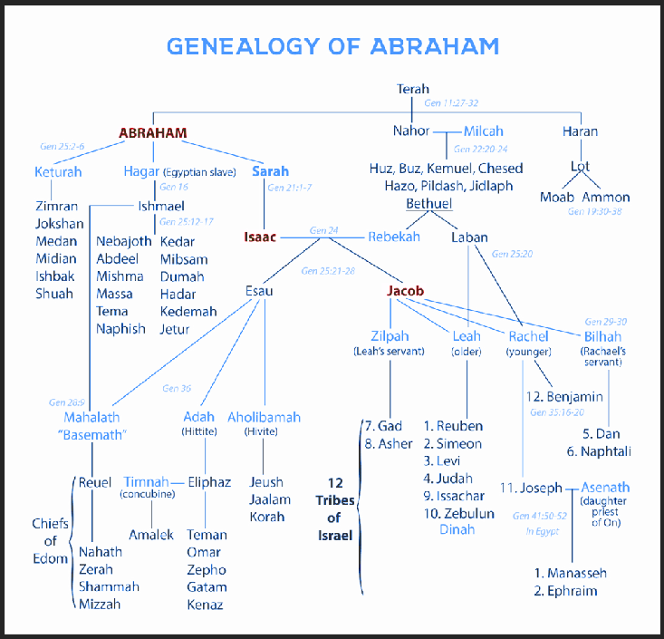
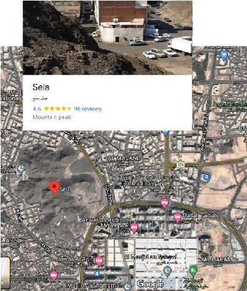

#### Table of Contents

Introduction . . 2

Short Biography of Prophet Muhammad ﷺ . . . 6

Appendices:

Frequently Asked Questions about Muhammadﷺ . . 25

Frequently Asked Questions about Islām . . . 31 To Believe or Not: There’s No Question . . . 58 Introduction to the Study of the Qur’ān . . . 74 Preservation and Literary Challenge of the Qur’ān . . 84 Scientific Miracles in the Qur’ān . . . . . 92 The Old and New Testaments, Prophecies, and Muhammadﷺ 118

Edited and Compiled by Muddaththir ‘Ismāʻīl ibn Dāniyāl al-Amrīkī

##### In the Name of God, the Most Gracious, the Most Merciful

|I bear witness to God, who there is no God but He, the Eternal, the Holy Peace ensured Dominant, and I bear witness that Jesus is His Prophet —a Word sent of His Speech, a Spirit from God; created by Him in similar likeness to that of Adamdelivered to the Virgin Mary, the pure refuge and maidservant, whom came to bear the Messiah Jesus. (peace and blessings be upon them)|
|---|

###### Come to the Kingdom which submits to the Will of God Almighty, which worships the One God;

so that we may instruct you and perhaps make you understand the certainty and accuracy of theology, its excellence & superiority,

the systematic classification of the proofs and what they imply, and the rules governing demonstrations and what they result in,

to remove all foolishness from your soul and to cleanse your heart from what soils it, so that you may see truth plain & evident and religion strong & clear. Peace be upon those who follow righteous guidance,

and mercy be upon those established on reason and clear evidence from our Lord.

###### I remind you of God, and to be mindful of Him.

I invite you with the invitation of truth & peace, the appeal of Islam; I summon you with the appeal of establishing peace through

voluntary submission to the Will of the One God, to worship and devotion accompanied by love and veneration; a personal and direct relationship with God— do this and you shall have peace.

Submit to God Almighty alone, as a Muslim. Indeed, to God we belong, and to Him is our return. God Almighty says:

“ Glorious is the One to Whom belongs the Kingdom of the heavens and the earth and whatever lies between them.

With Him is the knowledge of the Hour; and towards Him you are to be returned. ” (Qur’ān 43:85) Categorically, belief in His Oneness

- 1) it means affirming Him as One & Unique with regards to His actions (such as creation, sovereignty, control, provision, giving life & death, and so on);
- 2) and it means devoting all acts of worship, both inward & outward, in word & deed, to Him alone, and not worshipping anything or anyone other than God, no matter who else that is;
- 3) and it means affirming the Names and Attributes of Him, which He has affirmed for Himself or that His Prophet affirmed,

and denying that He has any faults and denying any shortcomings that He has denied Himself

(thus He has affirmed that there is none like unto Him, and denied that He bears any resemblance to His creation, and affirmed that He alone has all the Attributes of Perfection in a manner that befits Him, may He be glorified).

God Almighty says:

“ Come unto an equal arrangement between us and you,

that we should serve none save God, associating nothing with Him, and not taking one another for Lords besides God. And if ye decline, then bear witness that we have submitted our will to God. ” (Qur’ān 3:64)

###### All thanks and praise is due to God.

###### We seek His help and forgiveness, and we seek refuge in God from the evil within ourselves,

and the consequences of our evil deeds, and the evil of the accursed Satan. Whoever God guides will never be led astray, and whoever God leads astray will never find guidance.

|I bear witness there is no deity and nothing worthy of worship but God Almighty, Who is One, alone without any partners, and I bear witness that Muhammad (peace and blessings be upon him)  is His Servant and His Messenger.|
|---|

God Almighty says:

“ O believers! Be mindful of God Almighty in the way He deserves, and do not die except in a state of full submission to Him ” (Qur’ān 3:102)

I say this saying of mine, and I seek forgiveness from God for me and for you, and for the rest of those who submit to Him.

###### So ask Him for forgiveness, He is the Mighty Forgiver, the Most Merciful.

To proceed with the subject of “the naming of The Religion”; of which are several names,

including ‘The Natural Religion’, ‘the innate disposition', ‘submission to the Will of God’, ‘the Straight way’, ‘the Religion of the Prophets’, ‘Islam’.

We affirm of the self-evident Creator what He taught us to affirm, and we deny what He taught us to deny. The Creator affirmed for us, in His Book and by His Prophet,

that the purpose of our creation is to submit to Him and worship Him alone, developing a relationship and understanding with Him through this complete submission, and He ordered us to propagate this Message to others (of worship solely for the Creator alone).

In Arabic, this word for “Submitting to the Will of the Creator” is Islam, coming from the root word for "submission" (silm, aslama) and "peace" (salaam). In English, when someone does something, like “walk”, or “breath”, we add an “-er” at the end, to say that someone is doing that thing (walker, talker); in Arabic, we add “mu-“ at the beginning. Thus, someone who does submit to the Will of the Creator, is someone who does Islam,

and in Arabic is referred to as “Muslim”.

Similar as no person invented walking, or breathing — no person invented Islam, or gave a name to Islam; Muhammad did not claim to innovate a new religion, but announced himself as the Last Prophet, with the same religion and teaching of all of the Prophets of the Most High, peace be upon them all.

Think about it. When a baby is born, does it decide its nature, or does it submit to its instincts? It submits to its instincts — and Who instilled those instincts? The Creator, the same Creator who gives us the names of what He creates and ordains.

Accordingly, we are all born Muslim, and even the planets submit to the decree of The Creator which sets them in motion; the stars, plants, trees, animals are all Muslim.

To be Muslim and accept the religion of God, which was practiced and propagated by His Prophets, is indeed what God Almighty ordered us to in His Book, and has affirmed for us in the teachings of His Prophets, peace be upon all of them.

What else should we claim ourselves to be? The first record of the term “Christianity” in any ancient source appears first

in the writings of Ignatius, in the year 110CE. This teaching and naming did not come from Jesus,

but was named by people who came after him, and named about him.

Indeed, even in the Bible, the anonymous author claims in the book of Acts, chapter11,

that the first use of “Christian” was long after Jesus, in the town of Antioch. This name was not coined by the followers of Jesus, but rather by non-Christians.

Because there is no clear affirmation of this name from God or His Prophets as being The Religion, but rather is a term given by those without clear & evident authority from God Almighty – we do not see any sense in claiming this title for ourselves.

Nor can we be sure why this anonymous author writes that the disciples allegedly went on to adopt this term which describes a religion about Jesus, and we cannot be sure what defines “Christianity”, or its followers.

In its modern form and orthodoxy, Christianity teaches unreasonable doctrines with logical problems, professing absences from what it claims to be scripture; necessitating a certainly false premise, an emotional preference to their claim of 'revelation' due to its conflict with reason.

In the face of so many departures from the theology of the Messiah they prefer over God, what could we possibly reason "Christian" to mean to the Christianities?

Surely, if “Christian” means follower of Jesus, then the religion of Islam is more Christian than Christianity.

Truly, the religion of Jesus is not possibly a religion about Jesus (as “Christianity” developed into);

and likewise, Abraham certainly shared the religion of Jesus, peace be upon them both. Abraham, peace be upon him, could not have adopted the term “Christian”,

for similar reasons that he could not have adopted the term “Jew” or described himself as one. The term “Jew” & the religion of Judaism come long after his descendants.

Therefore, Abraham, could not have described himself as a Christian, or a Jew; rather, he was one who was righteously devout and voluntarily submitted to the Will of the One, Almighty God.

Abraham, peace be upon him, was united upon One religion, as are all Prophets of God Almighty; that is Islam, confirmed by the final Prophet of God Almighty, Muhammad, and by God Almighty in His perfectly preserved Book: the Holy Qur'an, the last revelation.

Throughout history, God has sent Prophets and Messengers to different nations and tribes,

instructing them all in bearing the same essential message: God Almighty says: “O my people! Worship God. You have no other god but Him.” (Qur’ān 7:59)

The final Messenger, the Prophet Muhammad ﷺ , was sent to all of humankind to

reaffirm this message of God's Oneness and to guide them back to His worship based on the revelation he received.

This worship requires humility before the Creator and sincere submission to His Will, which is the essential meaning of the word "Islam". Due to clear affirmation of this name of Islam and its descriptions from God and His Prophet as being

The Religion from God Almighty—we do not see any sense in claiming any other title or religion for ourselves.

Thus we affirm His religion which He perfected, completed and named, "Islam",

that is described by Him as submission to His Will; likewise, we deny falsehood, false gods, and false worship as He taught us to deny. The human heart experiences peace and serenity when its desires and inclinations

are finally aligned in accordance with revelation. Further perseverance in the path of worship yields a delight and sweetness whose taste produces an attachment and yearning for the Beloved.

###### He alone is sufficient for us & our salvation; He is our Lord and to Him is our final return.

This is the purpose which God has revealed He intended us in our creation, and which He has called to all peoples—to each having sent Guides; the Way, the Truth, the Life through which to come to Him, which He ordained and sustains.

###### For God Almighty sent His Last Prophet as a Mercy for all worlds; that whosoever believe & follow him shall not perish, but have eternal life.

Indeed, “If anyone desires a religion other than Islam (submission to the Will of God Almighty), never will it be accepted of him; and in the hereafter he shall be one of the losers.” (Qur’ān 3:85)

To proceed with the subject of the certainly false premise of

###### “it is possible for reason to conflict with the revelation, so we must prefer one over the other”;

###### there can be no contradiction between reason and revelation.

With the reality of competing theological claims to the Absolute, we must rely ourselves not upon the supposed advancements of spirits, and we must not adjudicate belief by our emotions– only by theological reasoning may the truth be exalted & confirmed, with falsehood effaced and made to perish.

While the innate emotional belief in the Creator is natural in every human being,

the emotions are a path which neither leads to trustworthy results, nor to stability, if left alone. We are compelled, then, not to leave emotions as the only way to belief. We must rely ourselves upon demonstration by the mind with the emotions. Reason leads to understanding revelation, though it can never take its place;

both are together, performing different roles.

It is necessary to ascertain belief and the fullness of faith by thinking, study, and contemplation – to ponder, and use the rational mind as the governance of belief – excellence which must, by God's Mercy and Guidance, lead to assured conviction and pure faith.

Sincerity in adopting belief – be it or be it not belief from our forefathers – is fully acquired through investigation & scrutiny, not blind imitation. This directing of the intellectual faculties as the arbitrator of the emotions is the certain way to personal confidence in belief.

We confirm that revelation is true because of our faculties (including our reasoning); indeed, revelation commands the utilisation of reason.

Consider that belief is an individual's affirmation of an existence,

which is either true or false, and corroborated through some justification; credulity is believing without evidence; delusion is affirmation in light of overwhelming evidence to the contrary; and knowledge is a true, justified & certain belief that matches reality.

If one is certain in a belief, and this belief is true in reality, then this belief is knowledge.

Conclusively, the true faith perfected by the Creator – this faith of complete submission to God Almighty – is an expression of the entire individual. Faith, in Islam, is not a blind belief without rationality; rather, its reality entails sincere affirmation of that rationality and basis from which belief springs forth.

- As an ideal of revelation, certainty of faith does not arise as an expression of the whole individual except with voluntary submission, and the necessity of its reasoning & intellect in the attaining of understanding.

Such faith is without doubt, and with no intellectual justification in abandoning; we are faced with the choice of surrendering to the Truth, or being in denial of the empirically evident.

Truly, God Almighty says:

“Can those ˹believers˺ who stand on clear proof from their Lord be like those whose evil deeds are made appealing to them and ˹only˺ follow their desires?” (Qur’ān 47:14)

We ask God to turn our hearts favourably to Him and to His religion. Indeed, He is the Turner of Hearts. And God Almighty certainly knows best.

|Whosoever confesses thepreviously highlighted text has embraced Islam.  Benefits include: Achieving Inner Peace and Contentment of the Soul Having a Direct Relationship with God Discovering Your Purpose in Life All Previous Sins Forgiven Eternal Bliss in Paradise (Heaven)|
|---|

## Short Biography of Prophet Muhammad ﷺ

###### “ Sure you can deny God, but how can you deny the glory of the Prophet ?”

Although we can find God by reflecting upon natural phenomena, we need a Prophet to learn why we were created, where we came from, where we are going, and how to worship our Creator properly. Prophets guided people, through personal conduct and the heavenly religions they conveyed, to develop their inborn capacities and directed them toward the purpose of their creation. Had it not been for them, humanity would have been left to decay.

- As humanity needs social justice as much as it needs private inner peace, the Prophets taught the laws of life and established the rules for a perfect social life based on justice.

Thus, Prophets were sent throughout history and whenever humanity would fall into darkness, God would send another one to enlighten them again. This continued until the coming of the Last Prophet.

###### The Prophet’s Birth

Muhammad, son of Abdullah, son of Abdul Muttalib, of the tribe of Quraysh, was born in Makkah in the year 571 C.E. His father died before he was born, and he was raised first by his grandfather, Abdul Muttalib, and after his grandfather’s death, by his uncle Abu Talib.

- As a young boy he travelled with his uncle in the merchants’ caravan to Syria, and some years later made the same journey in the service of a wealthy widow named Khadījah. So faithfully he conducted her business, and so excellent was the report of his behaviour, which she received from her old servant who had accompanied him, that she soon afterwards married her young agent; and the marriage proved a very happy one, though she was fifteen years older than he was. Throughout the twenty-six years of their life together he remained devoted to her; and after her death, when he took other wives, he always mentioned her with the greatest love and reverence. This marriage gave him rank among the notables of Makkah, while his conduct earned for him the title al–Amin, the “ trustworthy. ”

Physical Description One of the most comprehensive and detailed descriptions we have of the Prophet Muhammad came from a Bedouin woman who would take care of travellers who passed by her tent. The Prophet once stopped by her with his companions for food and rest. The Prophet asked her if they could buy some meat or dates from her

but she could not find anything. The Prophet looked towards a sheep next to the tent. He asked her, “ What is wrong with this sheep? ” She replied, “ The sheep is fatigued and is weaker than the other sheep. ” The Prophet asked, “ Does it milk? ” She replied, “ I swear by your mother and father, if I saw milk from it then I would milk it. ” He then called the sheep and moved his hand over its udder;

he pronounced the name of God and praised Him. Then he called the woman when the sheep steadied its feet and its udder filled.

He asked for a large container and milked it until it was filled. The woman drank until full as did his companions. Then it was milked for a second time

until the container was full and they left her and continued on their journey. After a short while, the husband of the Bedouin woman returned from herding goats. He saw the milk and said to his wife, “ Where did you get this milk from? ”

She replied, “ I swear by God, a blessed man came to us today ” He said, “ Describe him to me. ”

She began; “ I saw him to be a man of evident splendour. Fine in figure. His face handsome. Slim in form. His head not too small, elegant and good looking. His eyes large and black [and] his eye lids long. His voice deep. Very intelligent. His brows high and arched [and] his hair in plaits. His neck long and his beard thick. He gave an impression of dignity when silent and of high intelligence when he talked. His words were impressive and his speech decisive, not trivial nor trite. His ideas like pearls moving on their string. He seemed the most splendid and fine looking man from a distance and the very best of all from close by. Medium in height, the eye not finding him too tall, nor too short. A tree branch as it were between two others, but he was the finest looking of the three. The best proportioned. His companions would surround him, when he spoke, they would listen attentively to his speech... ”

###### The First Revelation

The Makkans claimed descent from Abraham through Ishmael and tradition stated that their temple, the Ka’bāh, had been built by Abraham for the worship of the One God. It was still called the House of God, but the chief objects of worship here were a number of idols, which were called “daughters” of God and intercessors.

It was the practice of the Prophet to retire often to a cave in the desert for meditation. His place of retreat was Hira, a cave in a mountain called the Mountain of Light not far from Makkah, and his chosen month was Ramadhān, the month of heat.

Following extensive preparation from the Most High throughout his life, and 6 months of truthful visions in dreams as prelude — it was there in Hira, one night towards the end of this quiet month that the first revelation of Qur’ān came to him when he was forty years old. He heard a voice say: “ Read! ” He said: “ I cannot read. ” The voice again said: “ Read! ” He said: “ I cannot read. ” A third time the voice, more terrible, commanded: “ Read! ” He said: “ What can I read? ” The voice said:

“Recite in the name of your Lord Who created – Created the human being from a clinging substance. Recite, and your Lord is the Most Generous – Who taught by the pen – Taught the human being that which he knew not.” (Qur’ān 96:1-5)

###### The Vision of Cave Hira

He went out of the cave on to the hillside and heard the same awe–inspiring voice say:

“ O Muhammad! Thou art God’s messenger, and I am Gabriel. ” Then he raised his eyes and saw the angel standing in the sky above the horizon. And again the voice said: “ O Muhammad! Thou art God’s messenger, and I am Gabriel. ”

Muhammad stood quite still, turning away his face from the brightness of the vision, but wherever he turned his face, there stood the angel confronting him. He remained thus a long while till at length the angel vanished, when he returned in great distress of mind to his wife Khadījah.

She did her best to reassure him, saying that his conduct had been such that God would not let a harmful spirit come to him and that it was her hope that he was to become the Prophet of his people. On his return to Makkah, she took him to her cousin Waraqat ibn Nawfal, a very old man, “ who knew the Scriptures of the Jews and Christians, ” who declared his belief that the heavenly messenger who came to Moses of old had come to Muhammad, and that he was chosen as the Prophet of his people.

###### Message of Islām

Most of the people of Makkah who had acclaimed him as the trustworthy (al–Amīn) and the trustful (as–Sadīq) could not bring themselves to believe in him. Nor could most of the Jews and Christians who had for so long been living in expectation of his arrival. Not that they doubted his truthfulness or integrity but they were not prepared to turn their whole established way of living upside down by submitting to his simple but radical message.

He would tell them:

“ When I recite the Qur’ān, I find the following clear instruction: God is He who has created you, and the heavens and the earth, He is your only Lord and Master. He is your only Lord and Master. Surrender your being and your lives totally to Him Alone, and worship and serve no one but Him.

Let God be the Only God.

The words I speak, He places in my mouth, and I speak on His authority, Obey me and forsake all false claimants to human obedience. Everything in the heavens and on earth belongs to God; no person has a right to be master of another person, to spread oppression and corruption on earth.

An eternal life beyond awaits you; where you will meet God face to face, and your life will be judged; for that you must prepare. ”

This simple message shook the very foundations of Makkan society,

- as well as the seventh-century world. That world, as today, lived under the yoke of many false gods, kings and emperors, priests and monks, feudal lords and rich businessmen, soothsayers and spell-binders who claimed to know what others knew not, and who all lorded over the human beings. The Prophet’s message challenged them all, exposed them all and threatened them all. His immediate opponents in Makkah could do no better than brand him unconvincingly as a liar, a poet, soothsayer and a man possessed.

But, how could he who was illiterate, he who had never composed a single verse, who has shown no inclination to lead people, suddenly have words flowing from his lips so full of wisdom and light, morally so uplifting, specifically so enlivening, so beautiful and powerful, that they began to change the hearts and minds and lives of the hearer? His detractors and opponents had no answer. When challenged to produce anything even remotely similar to the words Muhammad claimed he was receiving from God, they could not match God’s words.

###### Stages of the Call

First privately, then publicly, the Prophet continued to proclaim his message. He himself had an intense, living relationship with God, totally committed to the message and mission entrusted to him. Slowly and gradually, people came forward and embraced Islām. They came from all walks of life – chiefs & slaves, businessmen & artisans, men & women – most of them young. Some simply heard the Qur’ān, and that was enough to transform them. Some saw the Prophet, and were immediately captivated by the light of mercy, generosity and humanity that was visible in his manner and morals, in his words and works and also in his face. The opposition continued to harden and sharpen. It grew furious and ferocious. Those who joined the Prophet were tortured in innumerable ways; they were mocked, abused, beaten, flogged, imprisoned and boycotted. Some were subjected to severe inhumane torture; made to lie on burning coal fires until the melting body fat extinguished them, or were dragged over burning sand and rocks. Yet such was the strength of their faith that none of them gave it up in the face of such trials and tribulation.

###### The Flight to Abyssinia

However, as the persecutions became unbearable, the Prophet advised those who could, to migrate to Abyssinia. It turned out that there, the Christian king gave the Muslims full protection despite the pleading of the emissaries sent by the Quraysh chiefs. This was the first emigration of Islām. In the meantime, the Prophet and his Companions continued to nourish their souls and intellect and strengthen their character and resolve for the great task that lay ahead. They met regularly, especially

- at a house near the Ka’bāh called Dār al-Arqam, to read and study the Qur’ān, to worship and pray and to forge the ties of brotherhood. In Makkah

Years passed and the people of Makkah would not give their allegiance to the Prophet’s message nor showed any sign of any easing in their persecution.

- At the same time, the Prophet lost his closest companion, his wife Khadījah,

- as well as his uncle Abu Talib, his chief protector in the tribal world of Makkah. The Prophet now decided to carry his message to the people of the nearby town of Tā’if known for its wealth. In Tā’if, too, the tribal leaders mocked and ridiculed him and rejected his message. They also stirred up their slaves and youth to insult him, mock him and pelt stones at him.

Thus he was stoned until he bled and was driven out of Tā’if, and when God placed at his command the Angel of Mountains to crush the Valley of Tā’if if he so wished, he only prayed for them to be guided. Such was the mercy and compassion of the one who is the ‘mercy for all the worlds.’ This year is known by historians as the ‘Year of Sorrow’ due to the grief which the Prophet suffered as a result of all these worldly setbacks. However, as the Qur’ān states that after hardship there is ease, the Prophet was to be blessed with an amazing journey culminating with a meeting with Almighty God Himself.

One night the Prophet was awoken and taken, in the company of the Angel Gabriel, first to Jerusalem. There he was met by all the Prophets, who gathered together behind him as he prayed on the Rock at the centre of the site of Masjid Aqsa, the spot where the Dome of the Rock stands today. From the Rock, led by the Archangel, he ascended through the seven heavens and beyond. Thus, he saw whatever God made him see, the heavenly worlds which no human eye can see, and which were the focus of this message and mission. It was also during this journey God ordained on the Believers the five daily prayers.

###### Joy After Sorrow

In quick succession, the Prophet had suffered the terrible loss of his wife Khadījah, his intimate and beloved companion for 25 years, and of Abu Talib, his guardian and protector against the bloodthirsty Makkan foes, and encountered the worst ever rejection, humiliation and persecution at nearby Tā’if. As the Prophet reached the lowest point in his vocation, God bought him comfort and solace. On the one hand, spiritually, He took him during the Night of Ascension to the Highest of Highs, realities and Divinities, face to face with the Unseen. And on the other, materially, he opened the hearts of the people of Yathrib to the message and mission of Prophet Muhammad. The message that Makkah and Tā’if rejected, found responsive hearts in Yathrib, a small oasis of about four hundred kilometres to the north of Makkah. Now known as Madīnah tunnabī (the city of the Prophet), or Madīnatun Munawwarah (the radiant city), it was destined to be the centre of the Divine light that was to spread to all parts of the world for all time to come.

###### The Men of Madīnah (Yathrib)

Soon after Prophet Muhammad’s return from Tā’if and the Night Journey, at the time of the pilgrimage, six men from Yathrib embraced Islām. They delivered the message of Islām to as many as they could, and at the time of the next pilgrimage in the year 621 C.E., 12 people came. They pledged themselves to the Prophet, that they would make no god besides God, that they would neither steal nor commit fornication, nor slay their infants, nor utter slanders, nor disobey him in that which is right.

The Prophet said; ‘If you fulfill this pledge, then Paradise is yours.’

This time the Prophet sent Mus’ab ibn ‘Umayr with them to teach them the Qur’ān and Islām and to spread the message of Islām. More and more people over the course of a year – tribal leaders, men and women – became Muslims.

- At the time of the next pilgrimage, they decided to send a delegation to the Prophet, make a pledge to him, and invited him and all Muslims in Makkah to Madīnah as a sanctuary and as a base for spreading the Divine message of Islām. In all, 73 men and two women came. They met the Prophet at Aqabah. They pledged to protect the Prophet as they would protect their own women and children, and to fight against all men, red and black, even if their nobles were killed and they suffered the loss of all their possessions. When asked what would be their return if they fulfilled their pledge, the Prophet said; ‘Paradise.’ Thus the beginning was made, the foundations of the Islāmic society, state, & civilisation were set.

The road was now open for the persecuted and tortured followers of the Prophet to come to the Land of Islām, which was to be Madīnah. Gradually most of the Believers found their way to Madīnah. Their Makkan foes could not bear to see the Muslims living in peace. They knew the power of the Prophet’s message, they knew the strength of those dedicated Believers who cared about nothing for the age-old Arab customs and ties of kinship, and who if they had to, would fight for their faith. The Makkans sensed the danger that the Muslims’ presence in Madīnah posed for their northern trade caravan routes. They saw no other way to stop all this but to kill the Prophet.

###### Plot to Murder the Prophet

Hence, they hatched a conspiracy; one strong and well-connected young man was to be nominated by each clan, and all of them were to pounce upon and kill the Prophet one morning

- as he came out of his house, so that his blood would be on all the clans’ hands. Thus, the Prophet’s clan would have to accept blood money in place of revenge. Informed of the plot by the Angel Gabriel, and instructed to leave Makkah for Madīnah, the Prophet went to Abu Bakr’s house to finalise the travel arrangements. Abu Bakr was overjoyed at having been chosen for the honour and blessing of being the Prophet’s companion on this blessed, momentous, sacred and epoch-making journey. He offered his she-camel to the Prophet, but the Prophet insisted on paying its price.

On the fateful night, as darkness fell, the youths selected by the Quraysh leaders to kill the Prophet surrounded his house. They decided to pounce on him when he came out of his house for the dawn prayer. Meanwhile, the Prophet handed over all the money left by the Makkans with him for safe-keeping to Ali. Ali offered to lie in the Prophet’s bed. The Prophet slipped out of his house, threw a little dust in their direction, and walked past his enemies, whose eyes were still on the house. He met Abu Bakr at his house, and they both travelled to a nearby cave. When the Quraysh realised that the Prophet had evaded them, they were furious. They looked for him everywhere to no success and then announced a reward of 100 she-camels for anybody who would bring them the Prophet, dead or alive. A tribal chief, Surāqah, sighted the Prophet and followed him, hoping to earn the reward. The Prophet, with bloodthirsty foes in pursuit and an uncertain future ahead of him in Madīnah, told Surāqah; ‘A day will soon come when Kisra’s golden bracelets will be in Surāqah’s hands.’

Thereafter, Surāqah retreated, and the Prophet proceeded towards Madīnah.

Four stages of the Prophets life in Makkah The Makkan period can be summarized in four stages:

- 1. The first stage began with his appointment as a Messenger and ended with the proclamation of Prophethood three years later. During this period the Message was given secretly to some selected persons only but the common people of Makkah were not aware of it.
- 2. The second stage lasted for two years after the proclamation of his Prophethood. It began with opposition by individuals: then it took the shape of antagonism, ridicule, derision, accusation, abuse and false propaganda then gangs were formed to persecute those Muslims who were comparatively poor, weak and helpless.
- 3. The third stage lasted for about six years from the beginning of the persecution to the death of Abu Talib and Khadījah in the tenth year of Prophethood. During this period the persecution of the Muslims became so savage and brutal that many of them were forced to migrate to Abyssinia while social and economic boycott was applied against the remaining Believers.
- 4. The fourth stage lasted for about three years from the tenth to the thirteenth year of Prophethood. This was a period of hard trials and grievous sufferings for the Prophet and his followers. Life had become unendurable at Makkah and there appeared to be no place of refuge even outside it. So much so that when the Prophet went to Tā’if, it offered no shelter or protection. Besides this, on the occasion of Hajj, he would appeal to each and every Arab clan to accept his invitation to Islām but was met with blank refusal from every quarter. At the same time, the people of Makkah were holding counsels to get rid of him by killing or imprisoning or banishing him from their city. It was at that most critical time that God opened for Islām the hearts of the People of Yathrib where he migrated at their invitation.

###### The Hijrah (622 C.E.)

This was the year the Prophet migrated from Makkah to Madīnah — a small distance in space, a mighty leap in history, an event that was to become a threshold in the shaping of the Islāmic Ummah. This is why the Muslims date their calendar from the Hijrah and not from start of revelation or from the birth of the Prophet.

In Qubah, 10 kilometres outside Madīnah, the Prophet made his first stopover. Here he built the first Masjid. Here he also made his first public address; ‘Spread peace among yourselves, give away food to the needy, pray while people sleep

- – and you will enter Paradise, the house of peace.’ Three days later, the Prophet entered Madīnah. Men, women, children, the entire populace came out on the streets and jubilantly welcomed him. Never was there a day of greater rejoicing and happiness. ‘The Prophet has come! The Prophet has come!’ sang the little children.

The first thing the Prophet did after arriving in Madīnah was to weld the Muhājirs or Emigrants and the hosts, called the Ansār or Helpers into one brotherhood.

Still today this brotherhood remains the hallmark of the Muslims. One person from the Emigrants was made the brother of one from among the Helpers

- – creating a bond stronger than blood. The Helpers offered to share equally all that they possessed with their new brothers.

###### Brotherhood

So, the Muslims were forged into a close-knit community of faith and brotherhood, and the structure of their society was being built. The first structure was also raised. This was the Masjid, the building dedicated to the worship of One God called Masjid al-Nabi, the Prophet’s Masjid. Since then the Masjid has also remained the hallmark of the Muslims’ collective and social life, the convenient space for the integration of the religious and political dimension of Islām, a source of identification, a witness to Muslim existence.

- At the same time, steps were taken and required institutions built to integrate the entire social life around the centre and pivot of the worship of One God. For this purpose, five daily prayers in congregation were established. Ramadhān, fasting every day from dawn to sunset for an entire month, was also prescribed. Similarly, to establish ‘giving’ as the way of life, Zakāh, a percentage of one’s wealth to be given in the way of God, was made obligatory. The Jews and the Hypocrites

In the first year of his reign at Madīnah the Prophet made a solemn treaty with the Jewish tribes, which secured to them rights of citizenship and full religious liberty in return for their support of the new state. But their idea of a Prophet was one who would give them dominion, not one who made the Jews who followed him, brothers of every Arab who might happen to believe as they did. When they realised that they could not use the Prophet for their own ends, they tried to shake his faith and his Mission and to seduce his followers, behaviour in which they were encouraged secretly by some professing Muslims who considered they had reason to resent the Prophet’s coming, since it robbed them of their local influence. In the Madīnan Sūrahs there is frequent mention of these Jews and Hypocrites.

###### The First Expeditions

The Prophet’s first concern as ruler was to establish public worship and lay down the constitution of the State: but he did not forget that the Quraysh had sworn to make an end to his religion, nor that he had received command to fight against them till they ceased from persecution. After twelve months in Madīnah, several small expeditions went out, led either by the Prophet himself, or other migrants for the purpose of reconnoitring and of dissuading other tribes from siding with Quraysh. One of the other purposes of those expeditions may have been to accustom the Makkan Muslims to engage with enemy forces. For thirteen years they had been strict pacifists, and it is clear, from several passages of the Qur’ān, that many of them disliked the idea of fighting and had to be inured to it.

###### The Campaign of Badr

In the second year after Hijrah, the Makkan merchants’ caravan [which had the confiscated possessions of what the Muslims had left in Makkah] was returning from Syria as usual by a road which passed not far from Madīnah.

- As its leader Abu Sufyan approached the territory of Madīnah, he heard of the Prophet’s plan to capture the caravan.
- At once, he sent a camel-rider towards Makkah, who arrived in a worn-out state and shouted frantically from the valley to Quraysh to hasten to the rescue unless they wished to lose both wealth and honour.

A force of a thousand strong was soon on its way to Madīnah: less, it would seem, with the hope of saving the caravan than with the idea of punishing the raiders, since the Prophet might have taken the caravan before the relief force started from Makkah.

Did the Prophet ever intend to raid the caravan? In Ibn Hisham, in the account of the Tabuk expedition, it is stated that the Prophet on that one occasion did not hide his real objective. The caravan was the pretext in the campaign of Badr; the real objective was the Makkan army.

He had received command to fight his persecutors, and with the promise of victory, he was prepared to venture against any odds, as was well seen at Badr. But the Muslims, ill-equipped for war, would have despaired if they had known from the first instance that they were to face a well-armed force three times their number. The army of Quraysh had advanced more than half-way to Madīnah before the Prophet set out.

All three parties – the army of Quraysh, the Muslim army and the caravan – were heading for the water of Badr. Abu Sufyan, the leader of the caravan, heard from one of his scouts that the Muslims were near the water, and turned back to the coast-plain leaving the Muslims to meet the army of Quraysh by the well of Badr.

Before the battle, the Prophet was prepared — yet still further increasing the odds against him, he gave leave to all the natives of Madīnah (The Ansār) to return to their homes un-reproached. Their oath did not include the duty of fighting in the field, but the Ansār were only hurt by the suggestion that they could possibly desert him

- at a time of danger. The battle went at first against the Muslims, but against the odds with a much weaker army they were victorious.

The victory of Badr gave the Prophet new prestige among the Arab tribes; but thenceforth there was the feud of blood between Quraysh and the Islāmic State, in addition to the old religious hatred. Those passages of the Qur’ān which refer to the Battle of Badr give warning of much greater struggles yet to come.

In the following year, an army of three thousand came from Makkah to destroy Madīnah. The Prophet’s first idea was merely to defend the city, a plan of which Abdullah ibn Ubayy, the leader of “ the Hypocrites ” (‘ Muslims by name only ’), strongly approved. But the men who had fought at Badr and believed that God would help them against any odds thought it a shame that they should linger behind walls.

###### The Battle on Mount Uhud

The Prophet, approving of their faith and zeal, gave way to them, and set out with an army of one thousand men toward Mt. Uhud, where the enemy were encamped. Abdullah ibn Ubayy was much offended by the change of plan. He thought it unlikely that the Prophet really meant to give battle in conditions so adverse to the Muslims, and was unwilling to take part in a mere demonstration designed to flatter the Muslims. So he withdrew with his men, a fourth or so of the army.

Despite the heavy odds, the battle on Mt. Uhud would have been an even greater victory than that at Badr for the Muslims – but for the disobedience of a band of fifty archers whom the Prophet set to guard a pass against the enemy cavalry. Seeing their comrades victorious, these men left their post, fearing to lose their share of the spoils. The cavalry of Quraysh rode through the gap and fell on the exultant Muslims.

The Prophet himself was wounded and the cry arose that he was slain, till someone recognized him and shouted that he was still living; a shout to which the Muslims rallied. Gathering round the Prophet, they retreated, leaving many dead on the hillside.

On the following day the Prophet again ventured forth with what remained of the army, with the intention that the Quraysh might hear that he was in the field and so might perhaps be deterred from attacking the city. The stratagem succeeded, thanks to the behaviour of a friendly Bedouin, who met the Muslims and conversed with them and afterwards met the army of Quraysh. Questioned by Abu Sufyan, he said that Muhammad was in the field, stronger than ever, and thirsting for revenge for yesterday’s affair. On that information, Abu Sufyan decided to return to Makkah.

###### Massacre of Muslims

The reverse which they had suffered on Mt. Uhud lowered the prestige of the Muslims with the Arab tribes and also with the Jews of Madīnah. Tribes which had inclined toward the Muslims now inclined toward the Quraysh. The Prophet’s followers were attacked and murdered when they went abroad in little companies. Khubayb, one of his envoys, was captured by a desert tribe and sold to Quraysh, who tortured him to death in Makkah publicly.

###### Expulsion of Banu-Nadheer

The Jews, despite their treaty, now hardly concealed their hostility. They even went so far in flattery of Quraysh as to declare the religion of the pagan Arabs superior to Islām. The Prophet was obliged to take punitive action against some of them. The tribe of Banu-Nadheer were besieged in their strong towers, subdued and forced to emigrate. The Hypocrites had sympathized with the Jews and secretly egged them on.

###### The War of the Trench

In the fifth year of the Hijrah the idolaters made a great effort to destroy Islām in the War of the Clans or War of the Trench, as it is variously called; when Quraysh with all their clans and the great desert tribe of Ghatafan with all their clans, an army of ten thousand men rode against Madīnah. The Prophet (by the advice of Salman the Persian) caused a deep trench to be dug before the city, and himself led the work of digging it.

The army of the clans was stopped by the trench, a novelty in Arab warfare. It seemed impassable for cavalry, which formed their strength. They camped in sight of it and daily showered their arrows on its defenders. While the Muslims were awaiting the assault, news came that Banū Quraythah, a Jewish tribe from Madīnah which had till then been loyal, had gone over to the enemy. The case seemed desperate. But the delay caused by the trench had dampened the zeal of the clans, and one who was secretly a Muslim managed to sow distrust between Quraysh and their Jewish allies, so that both hesitated to act. Then came a bitter wind from the sea, which blew for three days and nights so terribly that not a tent could be kept standing, not a fire lighted, not a pot boiled. The tribesmen were in utter misery. At length, one night the leader of Quraysh decided that the torment could be borne no longer nd gave the order to retire. When Ghatafan awoke the next morning, they found Quraysh had gone and they too took up their baggage and retreated.

###### Punishment of Banū Quraythah

On the day of the return from the trench the Prophet ordered war on the treacherous Banū Quraythah, who, conscious of their guilt, had already taken to their towers of refuge. After a siege of nearly a month they had to surrender unconditionally. They only begged that they might be judged by a member of the Arab tribe of which they were adherents. The Prophet granted their request. But the judge, upon whose favour they had counted, condemned their fighting men to death, their women and children to slavery.

Early in the sixth year of the Hijrah the Prophet led a campaign against the Bani al-Mustaliq, a tribe who were preparing to attack the Muslims.

Al-Hudaybiyah In the same year the Prophet had a vision in which he found himself entering the holy place

- at Makkah unopposed, therefore he was determined to attempt the pilgrimage. Attired as pilgrims, and taking with them the customary offerings, a company of fourteen hundred men journeyed to Makkah. As they drew near the holy valley they were met by a friend from the city, who warned the Prophet that Quraysh had put on their leopards-skins (the badge of valour) and had sworn to prevent his entering the sanctuary; their cavalry was on the road before him. On that, the Prophet ordered a detour through mountain gorges and the Muslims were tired out when they came down at last into the valley of Makkah and encamped at a spot called Al-Hudaybiyah; from here he tried to open negotiations with Quraysh, to explain that he came only as a pilgrim.

The first messenger he sent towards the city was maltreated and his camel hamstrung. He returned without delivering his message. Quraysh on their side sent an envoy which was threatening in manner, and very arrogant.

Another of their envoys was too familiar and had to be reminded sternly of the respect due to the Prophet. It was he who, on his return to the city, said: “ I have seen Caesar and Chosroes in their pomp, but never have I seen a man honoured as Muhammad is honoured by his comrades. ”

The Prophet sought some messenger who would impose respect. Uthman was finally chosen because of his kinship with the powerful Umayyad family. While the Muslims were awaiting his return the news came that he had been murdered. It was then that the Prophet, sitting under a tree in Al-Hudaybiyah, took an oath from all his comrades that they would stand or fall together. After a while, however, it became known that Uthman had not been murdered. A troop that came out from the city to molest the Muslims in their camp was captured before they could do any hurt and brought before the Prophet, who forgave them on their promise to renounce hostility.

###### Truce of Al-Hudaybiyah

Then proper envoys came from Quraysh. After some negotiation, the truce of Al-Hudaybiyah was signed. For ten years there were to be no hostilities between the parties. The Prophet was to return to Madīnah without visiting the Ka’bāh, but in the following year he might perform the pilgrimage with his comrades, Quraysh promising to evacuate Makkah for three days to allow of his doing so. Deserters from Quraysh to the Muslims during the period of the truce were to be returned; not so deserters from the Muslims to Quraysh. Any tribe or clan who wished to share in, the treaty as allies of the Prophet might do so, and any tribe or clan who wished to share in the treaty as allies of Quraysh might do so. There was dismay among the Muslims at these terms. They asked one another: “ Where is the victory that we were promised? ” It was during the return journey from al-Hudaybiyah that the Sūrah entitled “ The Conquest ” (Sūrah 48) was revealed. This truce proved, in fact, to be the greatest victory that the Muslims had till then achieved. War had been a barrier between them and the idolaters, but now both parties met and talked together, and the religion spread more rapidly. In the two years which elapsed between the signing of the truce and the fall of Makkah, the number of reverts was greater than the total number of all previous reverts. The Prophet travelled to Al-Hudaybiyah with 1400 men. Two years later, when the Makkans broke the truce, he marched against them with an army of 10,000.

###### The Campaign of Khaybar

In the seventh year after the Hijrah, the Prophet led a campaign against Khaybar, the stronghold of the Jewish tribes in North Arabia, which had become a hornets’ nest of his enemies. The forts of Khaybar were reduced one by one, and the Jews of Khaybar became thenceforth tenants of the Muslims until the expulsion of the Jews from Arabia in the ‘Caliphate of Umar.’ On the day when the last fort surrendered Ja’far son of Abu Talib, the Prophet’s first cousin, arrived with all who remained of the Muslims who had fled to Abyssinia to escape from persecution in the early days. They had been absent from Arabia for fifteen years. It was at Khaybar that a Jewess prepared for the Prophet poisoned meat, of which he only tasted a morsel without swallowing it, and then warned his comrades that it was poisoned. One Muslim, who had already swallowed a mouthful, died immediately, and the Prophet himself, from the mere taste of it, derived the illness which remained until his eventual death, years later. The woman who had cooked the meat was brought before him. When she said that she had done it on account of the humiliation of her people, he forgave her.

###### Pilgrimage to Makkah

In the following year the Prophet’s vision was fulfilled: he visited the holy place at Makkah unopposed. In accordance with the terms of the truce, the idolaters evacuated the city, and from the surrounding heights watched the procedure of the Muslims. At the end of the stipulated three days, the chiefs of Quraysh sent a reminder to the Prophet that the time was up. He then withdrew, and the idolaters reoccupied the city.

###### Mu’tah Expedition

In the eighth year of the Hijrah, hearing that the Byzantine emperor was gathering a force in Syria for the destruction of Islām, the Prophet sent three thousand men to Syria under the command of his freed slave Zayd. The campaign was unsuccessful, except that it impressed the Syrians with a notion of the reckless valour of the Muslims. The three thousand did not hesitate to join battle with a hundred thousand. When all the three leaders appointed by the Prophet had been killed, the survivors under the command of Khalid ibn al-Walid, who, by his strategy and courage, managed to preserve a remnant and return with them to Madīnah.

###### Truce Broken by Quraysh

In the same year, Quraysh broke the truce by attacking a tribe that was in alliance with the Prophet and massacring them even in the sanctuary at Makkah. Afterwards, they were afraid because of what they had done. They sent Abu Sufyan to Madīnah to ask for the existing treaty to be renewed and, its term prolonged. They hoped that he would arrive before the tidings of the massacre. But a messenger from the injured tribe had been before him, and his embassy was fruitless.

###### Conquest of Makkah

Then the Prophet summoned all the Muslims capable of bearing arms and marched to Makkah. The Quraysh were overawed. Their cavalry put up a show of defence before the town, but were routed without bloodshed; and the Prophet entered his native city on horseback with his head humbled before God as conqueror. The inhabitants expected vengeance for their past misdeeds. The Prophet proclaimed a general amnesty. Only a few known criminals were proscribed, and most of those were in the end forgiven. In their relief and surprise, the whole population of Makkah hastened to swear allegiance. The Prophet caused all the idols which were in the sanctuary to be destroyed, saying: “ Truth has come; darkness has vanished away; ” and the Muslim call to prayer was heard in Makkah.

###### Battle of Hunayn

In the same year there was an angry gathering of pagan tribes eager to regain the Ka’bāh. The Prophet led twelve thousand men against them. At Hunayn, in a deep ravine, his troops were ambushed by the enemy and almost put to flight. It was with difficulty that they were rallied to the Prophet and his bodyguard of faithful comrades who alone stood firm. But the victory, when it came, was complete and the booty enormous, for many of the hostile tribes had brought out with them everything that they possessed.

###### Conquest of Tā’if

The tribe of Thaqif was among the enemy at Hunayn. After that victory, their city of Tā’if was besieged by the Muslims, and finally reduced. Then the Prophet appointed a governor of Makkah, and himself returned to Madīnah to the boundless joy of the Ansār, who had feared lest, now that he had regained his native city, he might forsake them and make Makkah the capital.

###### The Tabuk Expedition

In the ninth year of the Hijrah, hearing that an army was again being mustered in Syria, the Prophet called on all the Muslims to support him in a great campaign. The far distance, the hot season, the fact that it was harvest time and the prestige of the enemy caused many to excuse themselves and many more to stay behind without excuse. Those defaulters are denounced in the Qur’ān. But the campaign ended peacefully. The army advanced to Tabuk, on the confines of Syria, and then learnt that the enemy had not yet gathered.

###### The Declaration of Immunity

Although Makkah had been conquered and its people were now Muslims, the official order of the pilgrimage had not been changed; the pagan Arabs performing it in their manner, and the Muslims in their manner. It was only after the pilgrims’ caravan had left Madīnah in the ninth year of the Hijrah, when Islām was dominant in North Arabia, that the Declaration of Immunity, as it is called, was revealed (Sūrah 9). The Prophet sent a copy of it by messenger to Abu Bakr, leader of the pilgrimage, with the instruction that Ali was to read it to the multitudes at Makkah. Its declaration was that after that year, Muslims only were to make the pilgrimage, exception being made for such of the idolaters as had a treaty with the Muslims and had never broken their treaty nor supported anyone against them. Such were to enjoy the privileges of their treaty for the term thereof, but when their treaty expired they would be as other idolaters. That proclamation marks the end of idol-worship in Arabia.

###### The Year of Deputations

The ninth year of the Hijrah is called the Year of Deputations, because from all parts of Arabia deputations came to Madīnah to swear allegiance to the Prophet and to hear the Qur’ān. The Prophet had become, in fact, the Ruler of Arabia, but his way of life remained as simple as before. He personally controlled every detail of organisation, judged every case and was accessible to every supplicant. In the last ten years he destroyed idolatry in Arabia; raised women from the status of a cattle to legal equity with men; effectually stopped the drunkenness and immorality which had till then disgraced the Arabs; made men in love with faith, sincerity and honest dealing; transformed tribes who had been for centuries content with ignorance into a people with the greatest thirst for knowledge; and for the first time in history made universal human brotherhood a fact and principle of common law. And his support and guide in all that work was the Qur’ān.

###### The Farewell Pilgrimage

In the tenth year of the Hijrah, the Prophet Muhammad went to Makkah as a pilgrim for the last time – his “ pilgrimage of farewell ” as it is called – when from Mt. Arafat he preached to an enormous throng of pilgrims. He reminded them of all the duties Islām enjoined upon them, and that they would one day have to meet their Lord, who would judge each one of them according to his work.

He said:

“ O People, listen well to my words, for I do not know whether, after this year, I shall ever be amongst you again. Therefore, listen to what I am saying to you very carefully and take these words to those who could not be present here today.

O People, just as you regard this month, this day, this city as Sacred, so regard the life and property of every Muslim as a sacred trust.

Return the goods entrusted to you to their rightful owners. Treat others justly so that no one would be unjust to you.

Remember that you will indeed meet your Lord, and that He will indeed reckon your deeds. God has forbidden you to take usury (riba), therefore all riba obligation

shall henceforth be waived. Your capital, however, is yours to keep. ...

... You will neither inflict nor suffer inequity ...

... Beware of the devil, for the safety of your religion. He has lost all hope that he willever be able to lead you astray in big things,

so beware of following him in small things.

O People, it is true that you have certain rights over your women, but they also have rights over you. Remember that you have taken them as your wives only under God’s trust and with His permission.

If they abide by your right then to them belongs the right to be fed and clothed in kindness. Treat your women well and be kind to them, for they are your partners and committed helpers. It is your right that they do not make friends with anyone of whom you do not approve,

as well as never to be unchaste...

O People, listen to me in earnest, worship God (The One Creator of the Universe), perform your five daily prayers (Salah), fast during the month of Ramadhān, and give your financial obligation (zakāh) of your wealth. Perform Hajj if you can afford to.

All mankind are from Adam and Eve an Arab has no superiority over a non-Arab, nor a non-Arab has any superiority over an Arab; also a white has no superiority over a black, nor a black has any superiority over white, except by piety and good action.

Learn that every Muslim is a brother to every Muslim and that the Muslims constitute one brotherhood. Nothing shall be legitimate to a Muslim which belongs to a fellow Muslim unless it was given freely and willingly.

Do not, therefore, do injustice to yourselves. Remember, one day you will appear before God (The Creator) and you will answer for your deeds. So beware, do not stray from the path of righteousness after I am gone. O People, no prophet or messenger will come after me and no new faith will be born. Reason well, therefore, O People, and understand words which I convey to you. I am leaving you with the Book of God (the Qur’ān) and my Sunnah (practices),

if you follow them you will never go astray. All those who listen to me shall pass on my words to others and those to others again;

and may the last ones understand my words better than those who listen to me directly. Be my witness O God, that I have conveyed your message to your people. ”

###### Illness and Death of the Prophet

It was during that last pilgrimage that the Sūrah entitled ‘Victory’ (Sūrah 110) was revealed, which he received as an announcement of approaching death. Soon after his return to Madīnah he fell ill. The news of his illness caused dismay throughout Arabia and anguish to the folk of Madīnah, Makkah and Tā’if, the hometowns. At early dawn on the last day of his earthly life, he came out from his room beside the masjid at Madīnah and joined the public prayer, which Abu Bakr had been leading since his illness. And there was great relief among the people, who supposed him well again. When, later in the day, the rumour grew that he was dead.

Umar threatened those who spread the rumour with dire punishment, declaring it a crime to think that the Messenger of God could die. He was storming at the people in that strain when Abu Bakr came into the mosque and overheard him. Abu Bakr went to the chamber of his daughter Aisha, where the Prophet lay, having ascertained the fact, kissed the Prophet’s forehead and went back into the mosque. The people were still listening to Umar, who was saying that he rumour was a wicked lie, that the Prophet who was all in all to them could not be dead.

Abu Bakr went up to Umar and tried to stop him by a whispered word. Then, finding he would pay no heed, Abu Bakr called to the people, who, recognizing his voice, left Umar and came crowding round him. He first gave praise to God, and then said: “ O people! Lo! As for him who worshipped Muhammad, Muhammad is dead. But as for him who worships God, God is Alive and dies not. ”

He then recited the verse of the Qur’ān: “ Muhammad is not but a messenger. [Other] messengers have passed on before him.

So if he was to die or be killed, would you turn back on your heels [to unbelief]? And he who turns back on his heels will never harm Allah at all;

but Allah will reward the grateful. ” (Qur’ān 3:144)

“ And, ” says the narrator: an eye-witness, “ it was as if the people had not known that such a verse had been revealed till Abu Bakr recited it. ”

And another witness tells how Umar used to say: “ when I heard Abu Bakr recite that verse my feet were cut from beneath me and I fell to the ground, for I knew that God’s messenger was dead, May God bless him! ”

The final messenger sent to humanity died at the age of 63 years old in the 10th year of the Hijrah (migration) – 632 C.E.

Such is Prophet Muhammad.

According to every standard by which human greatness can be measured, he was m a t c h l e s s ; no person was ever greater.

###### In Summary

- • The Prophet Muhammad is the most documented man in history. We know more about him than any other person who ever lived.
- • In a very oppressive elitist society, he established a just society that gave rights to the poor, women and people of all races.
- • His fundamental message was to call people to the worship of the one true God, without any partners or equals.
- • The early Muslims were tortured and persecuted by the people of Makkah. The response of the Prophet Muhammad, along with his followers,

was to bear this persecution with patience and forbearance. This period of the Prophet Muhammad’s life lasted thirteen years.

- • In the Makkan period, the Prophet Muhammad was physically harmed. He had camel intestines thrown on him during the prayer,

was pelted with rocks until he bled profusely and even some of his followers were tortured to death. Yet, the Prophet did not take any personal revenge.

- • When he conquered the city of Makkah, contrary to other conquerors who kill and plunder, the Prophet demonstrated one of the greatest acts of mercy and clemency in the history of humanity, by forgiving the very people that had fought him and thousands of lives were spared that day.

###### Reflections about the Prophet’s life

Rev. Bosworth Smith, Mohammed and Mohammadanism, London 1874;

“ He was Caesar and Pope in one; but he was Pope without Pope’s pretensions, Caesar without the legions of Caesar: without a standing army, without a bodyguard, without a palace, without a fixed revenue; if ever any man had the right to say that he ruled by the right divine, it was Muhammad, for he had all the power without its instruments and without its supports. ”

George Bernard Shaw, The Genuine Islām, 1936;

“ I believe if a man like him were to assume the dictatorship of the modern world he would succeed in solving its problems in a way that would bring much needed peace and happiness... I have studied him – the man and in my opinion is far from being an anti–Christ. He must be called the Saviour of Humanity. ”

Alphonse de Lamartine, Histoire de la Turquie, 1854;

“ If greatness of purpose, smallness of means, and astounding results are the three criteria of human genius, who could dare to compare any great man in modern history with Muhammad? The most famous men created arms, laws and empires only. They founded, if anything at all, no more than material powers which often crumbled away before their eyes. This man moved not only armies, legislations, empires, peoples and dynasties, but millions of men in one-third of the then inhabited world.... Philosopher, orator, apostle, legislator, warrior, conqueror of ideas, restorer of rational dogmas, of a cult without images; the founder of twenty terrestrial empires and of one spiritual empire, that is Muhammad. As regards all standards by which human greatness may be measured, we may well ask, is there any man greater than he? ”

Mahatma Gandhi, Young India, 1924;

“ I wanted to know the best of the life of one who holds today an undisputed sway over the hearts of millions of mankind.... I became more than ever convinced that it was not the sword that won a place for Islām in those days... it was the rigid simplicity, the utter self-effacement of the Prophet — the scrupulous regard for pledges, his intense devotion to his friends and followers, his intrepidity, his fearlessness, his absolute trust in God and in his own mission... When I closed the second volume (of the Prophet’s biography), I was sorry there was not more for me to read of that great life. ”

Michael H. Hart, The 100: A Ranking of the Most Influential Persons in History, 1978;

“ My choice of Muhammad to lead the list of the world’s most influential persons may surprise some readers and may be questioned by others, but he was the only man in history who was supremely successful on both the religious and secular level. ”

Source: A.B. al-Mehri. Edited from following sources –

- - ‘Introduction – The Glorious Qur’ān’ by M. Pickthall.
- - ‘Who is Muhammad?’ by K. Murrad. - ‘Tafhim al-Qur’ān’ by M. Mawdudi.

###### Further Reading:

- - ‘The Life of the Prophet Muhammad’ [4 vol.] by Ibn Kathir.
- - ‘The Noble Life of the Prophet’ [3 vol.] by Dr. Ali Muhammad as-Sallaabee.
- - ‘Muhammad: Man and Prophet’ by Adil Salahi.
- - ‘Zad al-Maad’ [Provisions for the Hereafter] by Ibn Qayyim al- Jawziyyah.

# APPENDICES

## Frequently Asked Questions about Prophet Muhammad ﷺ

###### — Brief Answers —

Q: What was his name? He is Muhammad, the son of Abdullah. Q: What was his lineage?

Muhammad, the son of Abdullah, the son Abdul Mutallib, the son of Hāshim. Hāshim was from the tribe of Quraysh. The Quraysh are from the Arabs, who are the descendants of Prophet Ismaīl, the son of Prophet Ibrahīm.

May the peace and blessing of God Almighty be upon all the Prophets. Q: Who were his parents?

His Father was: Abdullah Ibn Abdul Mutallib, he died before the birth of the Prophet. His Mother was: Aaminah bint Wahb, she died when the Prophet was only 6 years old. So, the Prophet was born and grew up as an orphan, without a father or a mother.

Q: When was he born? The exact date of the birth of the Prophet is not known,

however, we know he was born in the Year of the Elephant, a year in history wherein a great army, with elephants, came to conquer Makkah.

This was approximately 570 of the Christian era i.e. 570 years after the supposed birth of Prophet Jesus. Q: Where was he born? He was born in the sacred city of Makkah, in Saudi Arabia. Q: Where did he migrate and where did he die? Due to persecution, he and his followers left Makkah

and moved to the city of Madīnah in which he lived and died. When he moved to Madīnah, the first project he assumed was the building of a Masjid,

this was even before building his own home. Q: Did he have brothers and sisters? Prophet Muhammad did not have any blood brothers or sisters., however he had step-brothers

and step-sisters who were related to him through sharing the same suckling mother(s). They include:

Step Brothers: Step Sisters:

- •Abu Salamah Abdullah Ibn Abdul-Asad • Ash-Shaimaa bint al-Haarith
- •Hamzah ibn Abdil-Matullab • Unaysah bint al-Haarith
- •Abdullah Ibn al-Haarith

Frequently Asked Questions about Muhammad ﷺ 25.

Q: Who were his wives, and why did they marry? The wives of the Prophet are all considered Mothers of the Believers (Ummuhāt Al-Muminīn).

They are:

- 1. Khadījah Bint Khuwaylid: He married her when he was 25 years old and she was 40 years old. She bore all his children except one son. He did not marry any other woman whilst being married to her.
- 2. Sawda Bint Zam’a: She was a widow and a mother of six children. Her friend called Khawlah Bint Hakeem approached the Prophet encouraging him to marry Sawda. He married her when he was 50 years old.
- 3. ‘Aaisha Bint Abi Bakr as-Siddīq: She was the only virgin he married; she was the daughter of his best friend. She grew up to be a great scholar, teacher and authority of knowledge in Islam.
- 4. Hafsah Bint Umar: She was a widow whose husband was martyred in the Battle of Uhud. After the death of her husband, her father Umar ibn al-Khattāb searched for an appropriate man to marry her. They were overjoyed when the Prophet accepted the proposal.
- 5. Zaynab al-Hilāliyyah: She was a widow whose husband died in the battle of Badr. The Prophet married her when he 56 years old. He married her out of concern for her welfare and to take care of her after the death of her husband.
- 6. Umm Salamah: She was one of the earliest people to accept Islam along with her husband. They both migrated to Abyssinia then Madīnah. In Madīnah her husband died, leaving her behind with children. The Prophet married her in her old age and he was even older.
- 7. Zaynab Bint Jahsh: She was the cousin of the Prophet. She had two previous husbands, one who had died before Islam and the other was the adopted son of the Prophet, a freed slave. It was the custom of the Arabs that an adopted son would be considered to be one’s real blood son. However, Islam abolished this concept and maintained the rights of the real blood parents of a child, even after adoption to somebody else.
- 8. Juwairiyyah Bint al-Hārith: She was a noble woman who was captured and enslaved in war. She came to the Prophet complaining of her situation and asking the Prophet to help her to free herself by paying her ransom. The Prophet paid her ransom and then married her.
- 9. Safiyyah Bint Huyayy: A woman of Jewish descent, she was a taken as a war captive. The Prophet freed her and called her to Islam. Upon accepting Islam, the Prophet married her.
- 10. Umm Habībah Ramlah: She migrated to Abyssinia along with her husband who had accepted Islam, however her husband went back to disbelief and died whilst drinking alcohol. She was alone with a young child in a foreign country. The Prophet heard of her plight and requested the Abyssinian king to send her to Madīnah so he could marry her.
- 11. Māriah al-Qubtiyah: She was a Coptic Christian who was sent as a gift from the King of Egypt at that time. Upon her accepting Islam, the Prophet married her and freed her from being a captive.
- 12. Zaynab Bint Khuzaymah: She was known as Umm al-Masākīn (the Mother of the Poor) due to her care and concern for the poor and needy. She was a widow, who had been married to 2 men. They either died or divorced her before the Prophet chose to marry her.
- 13. Maymūnah Bint al-Hārith: She was the last wife of the Prophet. She had been widowed previous to her marriage to the Prophet.

Q: Did he have any children? All the sons of the Prophet died in their infancy. They are:

- 1. Qāsim
- 2. Abdullah
- 3. Ibrahīm

His daughters lived during his lifetime:

- 1. Zaynab: She was the eldest daughter of the Prophet and was born ten years before Prophethood i.e., when the Prophet was 30 years old. She was delayed in her migration to Madīnah, in the 8th year of Hijrah. She was 31 years old.
- 2. Ruqayyah: She was three years younger than her older sister Zaynab and was also married to Uthman ibn Affān after being divorced by her husband due to her Islam. She migrated to Madīnah however died very early on, during the battle of Badr. She was only 21 years old.
- 3. Umm Kulthūm: She was born 6 years before the Prophethood i.e. when the Prophet was 34 years old.

She was married to the distinguished Companion Uthman Ibn ‘Affān after his first wife Ruqayyah – her sister – passed away. Umm Kalthūm died a year before the death of the Prophet in the 9th year of Hijrah – when the Prophet was 62 years old.

- 4. Fātimah: She was the youngest daughter of the Prophet; she was born 5 years before his Prophethood i.e., when he was 35 years old. She married his cousin Ali Ibn Abi Tālib and together they had 2 children, Hassan and Hussayn. She died six months after the death of the Prophet, she was only 29 years old.

All his children were from his first wife Khadījah, except Ibrahīm who was from Maria al-Qubtiah. Q: What type of house did he live in? What was his lifestyle? In his ten years as the leader of Madīnah, the leader of an Ummah,

the commander of an army and the treasurer of much war booty, the Prophet never lived in a house. Rather he lived in Hujaraat – rooms which were approximately 2mx2m in size. During his ten years, he never ‘upgraded’ his accommodation. He died in the Hujrah of ‘Aaishah.

During his life in Madīnah, he never lived like a king, He never used to allow people to stand up for him if he entered a room, nor remain standing if he was sitting. Often he could not be distinguished from the rest of his companions. If a stranger walked in upon the Prophet and his companions, he would need to ask:

‘who amongst you is Muhammad, the messenger of Allah?’

All people were equal in front of the Prophet, he never gave preferential treatment to the rich and he never overlooked the rights of the weak and poor. In fact, he preferred the companionship of the poor, weak and freed slaves. His clothing, shoes, lifestyle, accommodation and food was no better

than most of his companions, and often worse off – may peace and blessings be upon him.

###### Q: What was his message and mission?

The core of his mission was the same as every other Prophet and Messenger. He was sent with a glad tiding, a warning and as a witness. God (the Most High) said about him:

“ O Prophet, indeed We have sent you as a witness, a bringer of good tidings and a warner. ” (Qur’ān 33:45)

He called to the worship of God alone (Tawhīd), that mankind should be sincere and truthful to their Creator. He urged the people to appreciate the many blessings of their Lord and to show gratitude to Him through their sincere worship of Him.

He warned against turning away from God, and associating partners to God in worship (Shirk). After teaching the people who their Lord is through Imān in His names and attributes,

he then taught the people how to worship Him and the manners and morals we should assume in relation to other creation.

He was a witness over all of mankind, that the message of God has been conveyed to all. He said about his own message, “ Indeed I have only been sent to perfect the noble manners. ” God (the Most Merciful) said about him:

###### “We did not send you except as a Mercy to Mankind.” (Qur’ān 21:107) Q: What were the struggles that he went through?

The Prophet was born without a father, and his mother died young; so he grew up as an orphan. He was then placed in the care of his grandfather Abdul Mutallib who also died whilst

the Prophet was young. Finally, he was placed under the care of his uncle Abu Taalib.

Both his uncle Abu Tālib, as well as his beloved wife Khadījah died in the same year – the 10th year of his Prophethood. All the children of the Prophet passed away during his lifetime, apart from his daughter who died 6 months after his death.

The Quraysh also harmed him through mockery, nicknames and lies as well as physical harm. They would plot to kill him in Makkah, and as he was migrating from Makkah, they chased him to kill him. To harm the Prophet, the Quraysh would torture his companions and kill some of them. The Prophet could not do anything to prevent this in Makkah. When he finally reached Madīnah, his struggles did not cease. The Munāfiqūn (hypocrites), Jews and Christians would constantly plot and persecute him, they poisoned his food, they tried to assassinate him by dropping a boulder on him, they broke all the treaties of peace, and the Quraysh continued their wars.

Whilst living in Madīnah, he never filled his stomach for more than two nights consecutively, most of his diet consisted of dates, water and bread.

Many weeks would pass by and a fire would not be lit in his house to cook. Meat, vegetables, milk and fruits were a rare luxury, as opposed to a staple.

Q: Did he perform any miracles? Apart from the greatest miracle given to him, the Qur’ān, the Prophet performed many physical miracles

witnessed by his contemporaries numbering in hundreds, and in some cases thousands. The miracle reports have reached us by reliable and strong methods of transmission

unmatched in world history – the hadīth. It is as if the miracles were performed in front of our eyes. These miracles were witnessed by thousands of believers and sceptics,

following which portions of the Qur’ān were revealed mentioning the supernatural events. The Qur’ān made some miracles eternal by etching them in the conscious of the Believers. The ancient detractors would simply remain silent when these verses were recited. Through these events, the Believers grew more certain of the truth of Prophet Muhammad and the Qur’ān. The Prophet Muhammad, through prayer or invoking blessings from God, was seen:

Splitting the Moon asunder and returning it to its shape. Bringing milk to the udders of dry sheep. Transforming camels virtually too weary to walk into the fastest and most energetic of the bunch. Transforming a stick of wood into a sword for soldier whose sword had broken. Feeding and watering the masses from miniscule quantities;

Scores of hungry poor were fed from a bowl of milk which appeared sufficient for only one. an entire army numbering more than a thousand were fed from a measure of flour and pot of meat so small as to be thought sufficient for only ten persons at the ‘Battle of the Trench,’ after which the flour and the meat seemed undiminished. So much was left over that a gift of food was made to the neighbour of the house in which the meal was prepared. Another army of 1,400, headed for the Battle of Tabuk, was fed from a few handfuls of mixed foodstuffs, over which the Prophet invoked blessings and the increase was sufficient to fill not only the stomachs of the army, but their depleted saddlebags as well.

Evil spirits [Jinn] were exorcised. The broken leg of Abdullah ibn Ateeq and the war-wounded leg of Salama ibn Aqwa

were healed on the spot [each on separate occasions]. The bleeding wound of al-Harith ibn Aws cauterized and healed instantly. The poisonous sting of Abu Bakr’s foot quieted The vision of a blind man restored. On a separate occasion, Qatadah ibn an-Nu’man was wounded,

in the Battle of Badr, so severely that his eye prolapsed into his cheek. His companions wanted to cut off the remaining attachments, but the Prophet supplicated over the eye, replaced it and from that day on Qatadah could not tell which was the injured eye and which was not.

When called to wrestle Rukanah, an unbeaten champion, the Prophet won miraculously. Merely touching Rukanah on the shoulder, he fell down, defeated. In rematch, the miracle was repeated. A third challenge brought the same result.

When asked to call for rain, he did and rain fell. When requested to feed the people, his supplications brought sustenance,

from where, the people did not know. When interceding as a healer, wounds and injuries disappeared.

###### In short, the prayers and supplications of the Prophet brought relief and blessings to the Believers and yet, whether being stoned on Tā’if, starved at Makkah, beaten in front of the Ka’bāh, or humiliated amidst his tribe and loved ones, the Prophet’s example appears to have been one of facing personal trials, of which there was an abundance, by relying upon internal patience to calling for divine intervention.

________________________________________________________________________________________________________________________________________________________________________________________________________________

Edited from, The First and Final Commandment, Dr. Laurence B. Brown.

Q: How did he deal with these struggles, difficulties, and persecution? Despite all these struggles, the Prophet remained patient upon the harms of the people and the distress of

life and poverty, he had no attachment to the luxuries of this worldly life, and he never forgot his past.

For this reason, he would give special consideration and care to orphans – because he himself grew up as an orphan. He was always relaxed and open minded, happy and pleased with the decree of God, optimistic and not fearing the blame of the people.

He never sought revenge for himself, in fact his pleasure and anger was only for the sake of God, he did not allow his personal interests to interfere with this. He would assume a cheerful attitude, always smiling in front of the people,

being playful with children, caring towards the sick and respectful towards elders. He would advise the woman and advocate the rights of the poor and the slaves. He would follow the funeral procession, and often ask about a companion if he was absent. He remained focused and steadfast upon his mission and the reward of the Hereafter,

and he was not deterred by his worldly struggles. He did not care much for the luxuries of the world,

he never allowed them to distract him from his responsibility of guiding the people. Q: When did he die, and how many years did he live for?

The Prophet lived for 63 years, 40 years before Prophethood and then 23 years as a Prophet and Messenger. Of these 23 years, he lived 13 in Makkah and 10 in Madīnah, wherein he died.

He died 632 of the Common Era, i.e., 632 years after the supposed birth of Prophet Jesus (Īsa).

May peace and blessings be upon the Prophet of Islām and all his followers. May God reward the Prophet on our behalf and on behalf of Islām. May God enlighten those who are ignorant regarding the Prophet, and guide those who are misguided.

________________________________________________________________________________________________________________________________________________________________________________________________________________

Source: Ayaaz, Abul Abbaas Naveed. A Basic Sirah of the Prophet of Islam

###### Frequently Asked Questions about Islam

###### — Brief Answers —

###### Q: What is Islām?

A: Islām means submission to the Will of God. Islām teaches belief in only one God, the Day of Judgment and individual accountability for actions. One who submits to God is called a Muslim – this being the precondition to enter Paradise.

###### Q: Who is Allāh?

A: Allāh is simply the Arabic word for God, the same God worshiped by Christians and Jews. It is the God of Abraham and Moses, not a different God. Christian Arabs also refer to God as Allāh. He is the Causer of existence, the One and Only Who needs no one or anything,

yet everyone and everything needs Him to exist and to continue to exist. He is the Independent, the Self-Sufficient, the Necessary Being. Q: What is the Qur’ān/Koran? A: The Qur’ān is the holy book of Islām, the word of the Ever-living God;

it has been sent down to guide humanity for all times to come. No book can be like it. As you come to the Qur’ān, God speaks to you. To read the Qur’ān is to hear Him, converse with Him and

to walk in His ways. It is the encounter of life with the Life-Giver. Muslims believe that the Qur’ān is not created, but was divinely revealed and is the last testament of God. The Qur’ān is preserved in its original Arabic form and is unanimously accepted that it has never been altered – preserved both orally and in written form.

God’s Speech (kalam) is always with Him. He revealed the Qur’ān in three stages, the first was when He decreed it to the Preserved Tablet (al-Lawh al-Mahfooth) to record, the second was on the Night of Power (Laylatul Qadr) when it was revealed to the Last Sky (Baytul Izzah), and then the third was to the Prophet Muhammad; the Qur’an didn’t begin with the Prophet.

###### Q: What are the foundations of Islām?

- A1: There are the Five Pillars of Islām:

- a. Declaration of the Faith (shahādah): To testify that there is no deity worthy of worship except God, Who is One and without partner and testify that Muhammad is the Servant and Messenger of God.
- b. Prayer(salah) : Allah has enjoined upon every sane Muslim 5 daily prayers, which are done for the sake of Allah, according to the Messenger of Allah, in a state of physical and spiritual purity, in the direction of Makkah.
- c. Charity(zakat) : An alms-tax, to regularly donate a portion of savings to the poor, if eligible.
- d. Fasting(sawm) : During the month of Ramadhān, refrain from food, drink and having relations with your spouses from dawn until sunset, a spiritual acknowledgment of our needing Allah.
- e. Pilgrimage(hajj) : Allah has enjoined upon every physically and financially capable Muslim a set of obligated rituals that symbolize sincere devotion, including a visit to Makkah.

These Five Pillars of Islām are built on the Six Pillars of Faith (Īmān).

- A2: There are Six Pillars of Faith (Īmān) :

- 1) God: There is only one God, with no associate or partner. All that happened in the past, is happening now and is going to happen in the future is by the Will of God. There is none worthy of worship except God, alone.
- 2) Angels: Angels are created from light and execute the commands of God without question.
- 3) Books of God: These include the Torah revealed to Moses, the Psalms revealed to David, The Gospel revealed to Jesus and the Qur’ān revealed to Muhammad.
- 4) Prophets of God: There were thousands of prophets who preached God’s message. Completing God’s message, Prophet Muhammad was the last prophet for all humanity.
- 5) Day of Judgment: On this Day, at the end of time, all mankind will be raised back to life and judged by God. Those whose good deeds outweigh their bad deeds will be allowed to enter Paradise and those whose bad deeds outweigh their good deeds will be condemned to Hell, except whom God has mercy on. All deeds will be revealed, and everyone judged justly. Everlasting Paradise is guaranteed for those who die submitting to God and worshipping Him alone — not due by their deeds alone, but by God’s Mercy.
- 6) Predestination and the Divine Decree: God’s knowledge and awareness encompasses all things. He created humans with free will. He has determined and decreed everything, He created everything and wrote all destinies. He controls everything that occurs, and knows what will occur and what has occurred. Whatever He Wills, takes place; whatever He does not Will, does not take place. He alone is the Creator, Who gives life and causes death and decrees both for every soul.

The foundation of the Faith of Islām is pure monotheism (Tawhīd), or belief in the Oneness of God.

- A3: Categorically, pure monotheism (Tawhīd), or belief in the Oneness of God:

- i) it means affirming Him as One & Unique with regards to His actions (such as creation, sovereignty, control, provision, giving life & death, and so on);
- ii) and it means devoting all acts of worship, both inward & outward, in word & deed, to Him alone, and not worshipping anything or anyone other than God, no matter who else that is;
- iii) and it means affirming the Names and Attributes of Him, which He has affirmed for Himself or that His Prophet ﷺ affirmed, and denying that He has any faults and any shortcomings that He has denied Himself,

( thus He has affirmed that there is none like unto Him, and denied that He bears any resemblance to His creation, and affirmed that He has all the attributes of perfection in a manner that befits Him, may He be glorified )

###### Q: Why do Muslims pray five times a day?

A: Muslims pray five times a day because God prescribed it. Those who do not know the values of prayer may think it is too much. Those who practice the prayer take solace in it as they are praising, glorifying and talking to the Greatest. Hence, at five times during the day, no matter what circumstances surround them,

they focus back to God and the true realities of life. Indeed, some prefer to pray more in order to attain happiness, peace and tranquility.

###### Q: In order to pray you perform the ablution. Why do you do such a ritual? Can’t you pray without ablution?

A: For every activity in life, there are rules and regulations. Sometimes there are pre-requisites to the general requirements too. In Islām, there are also some rules and regulations for the systems that God has legislated. In schools, each teacher has his requirements for every course that he/she teaches. Through their knowledge and wisdom, they have designed the course and the requirement so that

the students will be able to pass the course. The prayer (Salah) in Islām has its rules and regulations.

It has its spiritual and physical dimensions – spiritually, any minor sins that have been accumulated since the previous ablution are cleansed, and physically, it removes and cleans the body from all types of impurities. Islām also encourages the use of a toothstick to clean our teeth and apply scent –

all in preparation for the Believer to presents him/herself before the King of kings, God Himself. Q: Why do Muslims have to pray towards the Ka’bāh in Makkah? A: The Ka’bāh is the first house built for the worship of God on earth. It was originally built by Adam and then rebuilt by Abraham and his son Ishmael. God has chosen the Ka’bāh as a focal point of unity of pray for all the Believers all over the world. Q: What is a Mosque/Masjid?

A: A Mosque or Masjid is a place of worship for Muslims. Muslims pray in a masjid in the same way that Christians pray in a church.

###### Q: I know Muslims fast in Ramadhan. Why do you fast the whole month not eating and drinking anything during the day?

A: Fasting the whole month of Ramadan is the fourth pillar in Islām. This month is the 9th lunar month

of the Islāmic calendar and is the month in which the Qur’ān was revealed. For the whole month, Muslims fast from dawn until sunset. During the Prophet’s life, the Angel Gabriel would descend every night of the month

and go over the verses that had been revealed up to that point with him. In additional to the spiritual cleansing of the soul, fasting has many religious, social, cultural,

economic and educational benefits to all – including the control of egos, appetites and lusts. Fasting has also been prescribed on other people before Islām too, like the Jews and Christians.

Q: What is Hajj? A: The pilgrimage to Makkah (the Hajj) is an obligation only for those who are physically and financially able to do so. Nevertheless, over two million people go to Makkah each year from every corner of the globe providing a unique opportunity for those of different nations to meet one another.

The annual Hajj begins in the twelfth month of the Islāmic year. Pilgrims wear special clothes: simple garments that strip away distinctions of class and culture, so that all stand equal before God.

The rites of the Hajj, which are of Abrahamic origin, include going around the Ka’bāh seven times, and going seven times between the hills of Safā and Marwah as did Hagar (Abraham’s wife) during her search for water. The pilgrims later stand together on the wide plains of Arafat (a large expanse of desert outside Makkah) and join in prayer for God’s forgiveness, in what is often thought as a preview of the Day of Judgment.

The close of the Hajj is marked by a festival, the Eid al Adha, which is celebrated with prayers and the exchange of gifts in Muslim communities everywhere. This and the Eid al Fitr, a festive day celebrating the end of Ramadan, are the two holidays of the Islāmic calendar.

###### Q: Who was the Prophet Muhammad?

A: Prophet Muhammad was the last and final prophet sent by God. He completed the lineage of prophets which included Adam, Noah, Abraham, Ishmael, Isaac, Moses and Jesus. He was born in Makkah in the year 570 C.E., during the period of history Europeans

call the Middle Ages. The Prophet Muhammad was the son of Abdullah, a noble from the tribe of the Quraysh. His father died before his birth and his mother, Aminah died shortly afterwards.

He was then raised by his uncle, Abu Talib. As he grew up, Muhammad became known for

his truthfulness, generosity and sincerity, earning the title of al-Amin, the trustworthy one. He was of a contemplative nature and had long detested the decadence of his society. It became his habit to retreat from time to time in the Cave of Hira, at

the summit of the ‘Mountain of Light’ near Makkah. Q: Is it true that Muslims worship Muhammad?

A: Not at all! Muslims only worship God alone. For this reason, they are not called Muhammadans. For example, Christians worship Christ and are hence called Christians. It is the greatest sin in Islām to worship anybody or anything else alongside God.

###### Q: I thought that Muslims believe only in Muhammad as their Prophet. Is this true?

A: No! Muslims believe in all of the Prophets and Messengers that God sent to mankind from the days of Adam to the days of the Prophet Muhammad. God sent over 124,000 Prophets in the history of mankind. However, God mentioned 25 names in the Qur’ān some of them being: Adam, Enoch, Noah, Abraham, Lot, Ishmael, Isaac, Jacob, Joseph, Job, Moses, Aaron, King David, King Solomon, Jonah, Zechariah, John the Baptist, Jesus and Muhammad. Muslims believe in all of them and do not differentiate in their missions –

all of whom were calling to the worship of one God. Any time any Prophet’s name is mentioned, Muslims say peace be upon him (pbuh).

Q: I was surprised to know that Muslims believe in Jesus and Mary? A: Muslims are obligated to believe in Jesus and Mary. They deeply respect them and consider them

to be amongst the greatest of human beings with Jesus being one of the greatest Messengers of God, and his mother, the greatest of all women.

In the Qur’ān there is one chapter (Sūrah) in the name of Mary herself – Sūrah 19. No other woman’s name was revealed explicitly in the Qur’ān except that of Mary.

Q: I am also surprised to know that Muslims believe in Moses. I thought Moses was the Prophet of the Jews only.

A: Moses was not the Prophet of the Jews. He was the Prophet of God to the children of Israel. He was sent to save them from the persecution of Pharaoh of Egypt. However, Moses was a Muslim. He preached the Message of God and taught them to believe in God, the Creator of the Universe. He instructed them to pray, fast and pay charity as well. Muslims believe in Prophet Moses inasmuch

as they believe in all the other Prophets and Messengers without any discrimination.

###### Q: Is it true that Muhammad is the last Prophet and the last Messenger? If yes, how come?! Do you think that Prophethood has ended?

A: Yes! Muhammad is the last Prophet and the last Messenger of God to all mankind. His teachings are meant for Christians, Jews, Buddhists, Hindus and others.

originality, totality and authenticity of the Qur’ān are well documented and proved to be intact. The teachings of Islām are meant for all human beings. This was not true to the previous Prophets who

came for a particular tribe, nation, or even for a particular era and area. The Qur’ān was revealed as the last testament to mankind,

and the Prophet Muhammad is the seal of the Prophets, completing God’s message for all people. Q: How did Muhammad become a prophet and messenger of God? A: At the age of 40, while engaged in a meditative retreat, he received his first revelation of verses from

God through the Archangel Gabriel. This revelation, which continued for twenty-three years, is known as the Qur’ān. The Prophet Muhammad began to recite the words he heard from Gabriel and to preach the truth which God had revealed to him. The people of Makkah were steeped in their ways of ignorance and opposed him and his small group of followers in every way.

These early Muslims suffered bitter persecution. In the year 622 C.E., God gave the Muslim community the command to emigrate. This event, the Hijrah or migration, in which they left Makkah for the city of Madīnah,

some 260 miles to the North, marks the beginning of the Muslim calendar. Madīnah provided the Prophet Muhammad and the Muslims the safe and nurturing haven

in which the Muslim community grew and here he established the Islāmic state. After several years, the Prophet and his followers returned as peaceful conquerors. He was now supreme ruler of Arabia cleansing the land from idolatry and dedicated the Ka’bāh

to the worship of the One God. He died at the age of 63 and within a century of his death, Islām had spread to Spain in the west and as far east as China.

Q: Christians believe that we were born sinful and therefore we have to be baptised. What does Islām say about original sin?

A: In Islām, every person is born free of sin. It would be inhumane and unjust that God would create us with sins. God is the Most Merciful. He created us as pure as crystal ice.

It is only after the age of puberty that one will be accounted for his deeds and actions preceded by intention. At that time, we will be rewarded ten times for any good deeds and we will be charged once for every bad deed. If we ask forgiveness from God, He will forgive us. Because we are born free of sins, we do not need to be baptised. We are already born as Muslims.

###### Q: In Christianity, one must believe in Jesus as our personal Saviour to enter Paradise. What does Islām say about Salvation?

A: Salvation in Islām does not depend on someone else to do it for us. We are responsible for our deeds and actions preceded by our good intentions. Therefore, everyone has to work hard with good intention. Our intention as Muslims is to please the Creator. Whoever believes in God; in all the Prophets and Messengers that God sent to mankind;

in the Day of Judgment; and does good deeds without personal ego or without exploitation; then and only then God assures us eternal Salvation, not by our deeds, but by His Mercy.

Through His Mercy, Forgiveness and Blessings, people will be given Salvation.

Q: Once I was talking to a Muslim saying to him that Christians believe in the Unity of God. He informed me that Muslims do not believe in the Unity of God but in the Oneness of God. I got confused. Would you kindly elaborate the difference for me?

A: Thank you very much for raising a very fundamental principle in Islām. Muslims believe in the Oneness of God. They do not believe in the concept of Unity of God. The word unity may give a wrong impression about the concept of God. It may mean two gods in one, or three gods in one. Christians believe in three gods in one: God the father, god the son and god the holy spirit. Three in One. This is the concept of Unity of God. Muslims do not subscribe to this concept. God is the only One. He is One-in-One. He begets no one; and no one has begotten Him. He is the Creator of the whole universe. No one shares with Him His Sovereignty.

###### Q: During Christmas, I realised that Muslims do not participate in this celebration. Since Muslims believe in Jesus, why then do they not celebrate Christmas?

A: Muslims believe in the Prophet Jesus. He was one of the five Mightiest Messengers of God. However, Muslims do not celebrate the birth of any Prophet. Even those Prophets did not celebrate their own birthdays. Its origins lie in Pagan feasts and the innovations of the Roman Empire, not in any prophetic teaching.

Q: Where can I learn more about Islām? A: Online at https://bit.ly/islampillpdf — you will find relevant audio, video, books and articles

which will expand on all the above questions.

Q: Does Islām consider Christians and Jews as Believers? A: Jews and Christians are referred to in the Qur’ān as the ‘People of the Book’ – meaning

their origins lie in scripture revealed by God. However, these scriptures have not remained untouched by human insertions, and have been distorted.

When each prophet was sent, the people of that era were obliged to follow him and would be defined as people of the truth or simply ‘Muslims’

– so when Moses came – people were obliged to follow him and these Jews were Believers.

When Jesus came, people were obligated to now accept him as the Prophet of God and not doing so would remove them from being defined as Believers – even though they may have accepted Moses as a prophet.

These Christians were now the Believers till the time the Prophet Muhammad was sent. After which any person claiming to submit to the Will of God would have to accept the prophethood

of Muhammad, and not doing so would separate them from being a true Believer in God. Q: How many Muslims are there? A: There are currently 1.6 Billion Muslims in the world, with about 2-3 million living in

the United Kingdom. Contrary to popular perception, only 20% of Muslims are Arabs and live in the Middle East. The countries with the largest Muslim populations are India and Indonesia with about 175 million Muslims each.

###### Q: Is it true that all Arabs are Muslims, and that all Muslims are Arabs?

A: No! Any person who reads, writes and speaks the Arabic language is called an Arab. There are about 1.6 billion Muslims in the world. 20% are considered Arabs while the rest are non-Arabs. Among the Arab people there are about 8% who are non-Muslims, such as Christians, Jews, Assyrians, Atheists, Agnostics, etc. However, every Muslim has to study and learn the Arabic language so that

he/she will be able to pray daily and to read Qur’ān and the Arabic language. Q: What are the legal sources of Islām? A: The sources of Islām are the Qur’ān, the hadith (sayings of the Prophet) and

the Unanimous decisions of the early Muslim scholars. Q: What is the difference between Hadith and Sunnah?

A: Hadith is the exact sayings of the Prophet with quote and unquote. The Sunnah of the Prophet are his deeds, actions and his tacit approval,

i.e. actions done by others in his presence which he did not comment. Q: What is a Fatwa? A: A Fatwa is a religious ruling to a question based on Islāmic law and issued by Islāmic scholars.

###### Q: If everything is pre-ordained and decided, where is the free will?

- A1: The question of ‘fate and freewill’ has baffled people for many centuries; but Islām has given a clear answer. The first point to be noted in this respect is that the Islāmic concept of Qadar and Qadha’ is quite different from fatalism, determinism and predestination, as understood by most people. In Arabic, the words Qadar and Qadha are often used for fate & destiny.

The word, Qadha means to decide; to settle; to judge. A Qadhi is a judge who decides a matter between disputants.

From the Islāmic view, the events of the world take place within God’s Knowledge and Will. Read the following verses:

- 1. “ And not an atom’s weight in the earth or in the sky escapes your Lord, nor what is less than that or greater than that, but it is (written) in a clear Book. ” (Qur’ān 10:61)
- 2. “ No disaster strikes upon the earth or among yourselves except that it is in a register before We bring it into being – indeed that, for God, is easy – In order that you not despair over what has eluded you and not exalt [in pride] over what He has given you. And God does not like everyone self-deluded and boastful. ” (Qur’ān 57:22-23)

The above verses speak of God Almighty’s power and control over His creation, as well as of His Will and plan. This is one aspect of His Qadar. There is also another aspect of Qadar, which is concerned with human freewill.

- A2: On human freedom and responsibility read the following verses:

- 1. “ Corruption has appeared throughout the land and sea by [reason of] what the hands of people have earned so He [i.e., God] may let them taste part of [the consequence of] what they have done

that perhaps they will return [to righteousness]. ” (Qur’ān 30:41)

- 2. “ ...The truth is from your Lord, so whoever wills–let him believe; and whoever wills–let him disbelieve. ” (Qur’ān 18:29)

The above verses speak of the special status of humans as beings with a role and mission. God’s power over His creation and His fore-knowledge of all our actions and their results

do not preclude that status. God’s Qadar and Qadha – which could be loosely rendered as ‘Divine decree and human destiny’ – include a certain amount of freedom for humans.

We may say that God Almighty has willed that we must have the freedom to choose between good and bad and take the course of action we decide, i.e., to the extent we are permitted.

It is God Who created us with all our talents and gifts and if we do not have the freedom to use them, what would be the meaning of those blessings? And remember that God gave us, not merely our intellectual faculties but also the power of moral judgment. And what is more, He sent us His Guidance through His chosen Prophets and Books, to help us make the right choices.

So, in Islām, there is no contradiction between belief in Divine Preordainment on the one hand and the freedom of man on the other. They are together, not mutually exclusive.

Q: I heard that there is something called Sīrah. Would you kindly tell me what it is? A: Generally speaking, Sīrah means the life history of someone. Any time Muslims talk about the Sīrah, they mean the biography of Prophet Muhammad. Muslims are to study the Sīrah of the Prophet so that they will be able to imitate him, emulate him, and benefit from his wisdom and his teachings.

The early followers of Islām have written a series of books about the Sīrah of

the Prophet Muhammad to act as a guide to all the new generations to come. Q: What does Jihād mean – linguistically and practically? A: Jihād linguistically means the process of ‘exerting the best efforts,’ involving some form of ‘struggle’

and ‘resistance’ to achieve a particular goal. In the Qur’ān this word has been used in different connotations – entailing to struggle in the way of God, verbally, monetarily and physically. In the context of war, the Qur’ān legislates the performance of Jihād in order to make His Word the highest in the land, defend or establish the religion, remove oppression from weak men, women and children and to remove turmoil and corruption.

A point to note – there are strict laws governing the engagement of the enemy and the treatment of

prisoners of war – all of which was laid down by God and demonstrated by His Prophet. Q: What is Logic? A: Logic is that science, as prehistoric as the human mind, which prevents a person from making a mistake when he is defining a thing or when he is using it as an evidence; its purpose is to correct one's thinking and contemplating.

As a system of rules and guidelines regarding correct thinking, logic covers such topics as how to make proper definitions (al-ḥadd) and propositions (al-qaḍīyah) and how to construct correct arguments in the form of syllogisms (al-qiyās).

Logic in the Islāmic intellectual tradition serves as a principal tool for scientific discourse and discovery, which guarantees a certain precision in scientific reasoning and a safeguard against hidden assumptions and logical fallacies. This precision is in examining the underlying premises of a provided argumentsuch as how is it conceptualized (taṣawwur).

In examining, we also see to verify (taṣdīq) our conceptualisation so that are correct definitions and propositions being used. Logic secures a rational basis when we must know exactly the meaning of a term, and when needing a precise definition to ensure we are speaking about a mutual idea.

Logic as a system for proper reasoning and eliminating unwarranted beliefs, hasty conjectures, or

fallacious arguments can provide rational guidance in our modern world of fake news and misinformation. Logic is, in fact, part of a larger toolkit in the Islāmic tradition for

“ thinking straight ” (i.e., proper reasoning) in all intellectual endeavors. This toolkit includes, besides logic, the sciences of dialectics (ʿilm al-baḥth wa-al-munāẓarah), rhetoric (ʿilm al-balāghah), and semantics (ʿilm al-waḍʿ).

Together, these are called the “instrumental sciences” (ʿulūm al-ālah), which were fundamental prerequisite studies for the student of sacred knowledge (ṭālib al-ʿilm) to master before moving on to the so-called “higher sciences” (ʿulūm al-ʿāliyah), such as Islāmic law (fiqh), legal philosophy (uṣūl al-fiqh), Qur’ānic exegesis (tafsīr), or philosophical theology (kalām).

Q: What is epistemology? A: Epistemology is the technical term for the theory of human knowledge, its nature, origin, and limits. It is in a sense the first science of all other sciences. ‘What is knowing, and how do we know?’ Greek philosophy understood it to be part of the discussion on psychology, the human mind,

and this is also how it came to be studied within Islāmic philosophy and its wider intellectual history. The question of how we can know things has a deep significance for theology as well. How can we know God, that He exists, what He wants from us, and that He communicates to us?

Classical epistemology is therefore discussed both in works on dogma and philosophical theology (‘aqīdah and ‘ilm al-kalām) and philosophy of law (uṣūl al-fiqh), wherein they were labeled “causes of knowledge” (asbāb al-‘ilm) or “sources of knowing” (maṣādir al-ma’rifa).

These causes are summarized in the famous 13th-century Māturīdī creedal tract ‘Aqāid al-Nasafī as:

- (1.) sound sense perception (al-ḥawāss al-salīmah),
- (2.) reliable reports (al-khabar al-ṣādiq),
- (3.) intellect/reasoning (al-‘aql).

So, theologians started to divide up different forms and causes of knowledge. The physical world and its physical workings are observable with the senses (ḥiss),

understandable through the intellect (ʿaql) which is aided by the imagination, the heart, and the primordial nature (fitrah), which all together can direct us towards truth and goodness.

These constitute empirical, rational, and deductive knowledge (al-‘ilm al-naẓarī wa-al-istidlālī). Humans also create knowledge, customs, and technology; i.e., cultural knowledge. Some natural and cultural knowledge is continually generated anew (“innovation”), other forms are lost but,

in general, there is a form of knowledge accumulation within cultures that is shared through “reports,” i.e., related or transmitted knowledge (al-‘ilm al-naqlī). Some reports are doubtful, others trustworthy.

So, there are grades of trustworthiness of related knowledge, in the same way prophetic traditions (ḥadīth) were graded and the people relating them were judged on reliability (the science of ‘ilm al-rijāl), whereby unknown and lying persons were not accepted.

You can have general reports which generate speculative or possible knowledge (ẓannī), and undeniable or certain knowledge (al-ʿilm al-ḍarūrī)—for example, knowledge of the existence of a major city like London or a major historical figure such as Alexander the Great.

So, we have constant newly generated knowledge about the world around us and shared accumulated knowledge, both of which provide us several possibilities for how to explain the world.

But does this provide us with a total explanation of the world? Is there existence beyond the physical? How do we attain certain knowledge about the non-physical world? Is there a purpose to the world and can we know its end? Kalām theologians believed a certain ‘minimal’ theology and ethics were knowable to humans

through senses, intellect, and shared knowledge without the assistance of revelation. But to fully know our ethical responsibility, what God expects from us,

how to be in this world, we need help. We need prophets!

But how do we know what information is truly from God? Many people claim prophethood. There are many religions. To know who is sent by God, to know his information is truly from God,

we need signs of authenticity only God could generate. Miracles, supernatural events, could only be generated by the Controller of the World. How do we recognize them and know about these signs?

We end up again with our human limitations of senses (observe miracles), intellect (recognize true from false and think about their meaning), and shared knowledge (we tell others about them).

Also, prophets bring information, i.e., revelation, which we need to maximize our theology. So, we also then need to distinguish possible from certain knowledge in relation to

the shared knowledge going around about prophets and their revelations. We need to check if they fit with our minimal theology and we need to grade the shared reports. The shared reports need to be graded from unreliable to possible to certain knowledge,

as different aspects of our lives demand different levels of certainty. If a certain act must be punished with the death penalty,

we want to have maximum certainty God said this and meant this.

So, the level of certainty required of the attained knowledge is equal to the impact it has on our lives. So minimal theology is dependent on empiricism, historicity, reason, and logic,

and so does maximal theology also depend on them. We therefore need to use these three sources of knowledge in all things and use them critically,

as we are responsible for what we accept as knowledge, especially knowledge that is the basis of our acts. We therefore also need to know how we can critically examine the contents of both

the shared knowledge and the reasoning applied to it. Here again, the Islāmic tradition has provided us with a lifeline. Information on Islām, world politics, or even on social media, can have immense impact on our lives. It therefore requires high reliability before this type of information is accepted,

applied, and shared around with others. Q: How does Islām view human rights? A: Freedom of conscience is laid down by the Qur’ān itself:

“ There shall be no compulsion in [acceptance of] the religion. ” (Qur’ān 2:256) The life, honour and property of all citizens in an Islāmic state are

considered sacred whether the person is Muslim or not. We affirm the rights endowed and expounded upon by God, not those invented by peoples.

“ O mankind, indeed We have created you from male and female and made you peoples and tribes that

you may know one another. Indeed, the most noble of you in the sight of God is the most righteous of you. Indeed, God is Knowing and Acquainted. ” (Qur’ān 49:13)

Q: In secular countries, the Pledge of Allegiance is to the flag of the country. How do Muslims look at such a pledge?

A: Any person who makes his Pledge of Allegiance to the flag of his country, is legally responsible to defend that country according to what the political leaders decide. The leaders may decide to invade other countries and commit various types of injustices, atrocities, and crime.

A Muslim’s loyalty is to God. He will never obey political leaders unless they themselves obey God. Partaking in unjust wars is amongst greatest of crimes. Therefore, the masses as well as the leaders should make a Pledge of Allegiance to God, the Creator of the Universe.

###### Q: Since the Pledge of Allegiance of Muslims is only to God, what is that Pledge, and whatdoes it mean?

A: Yes, the Pledge of Allegiance of Muslims is only to God, the Creator of the Universe. Muslims have to say daily the Pledge in the language of the Qur’ān, i.e., Arabic. They have to recite it vocally individually and collectively. They may pronounce it verbally, privately, and silently too. The Pledge goes as follows:

“Ashhadu Anla ilaha Illa Allāh...Wa Ashhadu Anna Muhammadan RasooluAllāh.” “I bear witness that there is no one worthy of worship except God (Allāh) ... And I bear witness that Prophet Muhammad is the Messenger of God.”

Q: Can you explain the Shariah and secularism in Islām? A: Islām teaches that the Believer cannot make any agreement with any person or government

to displease God; they cannot make any deal with any group to decide any matter against what God has already decided. In Islām, State and Religion are to abide their total life according to the teachings of God. No one has the right to separate the state from religion — otherwise, we are creating two gods:

One god for our daily life and one god for the spiritual life. This type of approach is totally rejected and unacceptable. In Islām, God created the whole universe. He is the Real Legislator of all systems of life for us

and He knows exactly what we need. He legislated the Shariah (Islāmic Law) — that we should abide by. Then and only then we will live in peace and harmony in this life and the hereafter. Q: Why do Muslim women cover themselves? A: They do so in submission to God. He has asked them to hide their beauty except to those whom

He permits. Any woman who does so fulfills the command that God has placed on her.

God has legislated for all members of society and each individual will be judged according to commands that were ordained for him or her. The rights a wife has on her husband, or a son on his mother or a brother to his sister all vary – and although they are different, quintessentially our submission to God is judged according to how we observe them.

In addition, however, their Hijab (covering) protects them and demands respect from men who otherwise would have judged them by their looks as opposed to what they say or do. The concept of keeping a women’s beauty hidden is not unique to Islām but exists in many other faiths, including Christian Nuns who wear similar attire to some Muslim women.

Q: Why do bad things happen? A: First of all, God has not made this a permanent world. This is a temporary world and everything here

has a time limit. Neither the good things of this world are forever, nor the bad things eternal. We are here for a short time and we are being tested – those who pass the test will

find an eternal world that is perfect and permanent.

“ And when We let the people taste mercy, they rejoice therein, but if evil afflicts them for what their hands have put forth, immediately they despair. ” (Qur’ān 30:36)

A number of reasons why bad things may happen:

- 1. As a punishment where the laws of God have been violated as in the case of the people of Noah and Lot:

“ Has there not reached them the news of those before them — the people of Noah, and [the tribes of] ‘Aad and Thamūd, and the people of Abraham, and the companions [i.e., dwellers] of Madyan, and the towns overturned? Their messengers came to them with clear proofs. And God would never have wronged them, but they were wronging themselves. ” (Qur’ān 9:70)

- 2. Sometimes God allows people to be afflicted by the consequences of their actions as a sign and reminder in order that they have the opportunity to repent and reform themselves.

“ Corruption has appeared throughout the land and sea by [reason of] what the hands of people have earned so He [i.e., God] may let them taste part of [the consequence of] what they have done that perhaps they will return [to righteousness]. ” (Qur’ān 30:41)

“ And whatever strikes you of disaster – it is for what your hands have earned; but He pardons much. ”

(Qur’ān 42:30)

- 3. Suffering can also be a test and trial for some people. God allows some people to suffer in order to test their patience and steadfastness. Even God’s Prophets and Messengers were made to suffer. Prophet Job is mentioned in the Qur’ān as a Prophet who was very patient. Through these trials and tribulations, one has the opportunity to draw closer to God.
- 4. God sometimes allows some people to suffer to test others, how they react to them. When you see a person who is sick, poor and needy,

then you are tested by God to test your charity and faith. God says in a hadith qudsi [revelation transmitted by Muhammad], “Verily, Allāh will say to his slave when He will be taking account of him on the Day of Judgement, ‘O son of Adam, I was hungry and you did not feed me.’ He will answer: ‘How could I feed you? You are the Lord of the worlds!’ He will say: ‘Did you not know that my slave so and so who is the son of so and so felt hunger, and you

did not feed him. Alas, had you fed him you would have found that (i.e. reward) with Me.’ ‘O son of Adam, I was thirsty and you gave Me nothing to drink.’ He will reply: ‘How could I give You drink? You are the Lord of the worlds!’ He will say: ‘Did you not know that my slave so and so, the son of so and so felt thirsty, and you

did not give him drink. Alas, if you had given him, you would have found that (i.e. reward) with me.’ ‘O son of Adam, I became sick and you did not visit Me.’ He will answer: ‘How can I visit You? You are the Lord of the worlds!’ He will say: ‘Did you not know that my slave so and so, the son of so and so became sick, and you

did not visit him. Alas, had you visited him, you would have found Me with him.”

###### Q: Do Muslims follow the Qur’ān alone? Is it feasible?

A: No! There are two primary sources for Islamic teachings. First, is theQurʾānwhich is the direct word of God, inspired to the Prophet Muhammad. The second source is the Prophet’s teachings. These teachings include his words, actions, and things he approved of. The Prophet’s teachings are calledSunnah. The Sunnah is found in texts called ḥadīth (pl. aḥadīth). A ḥadīth (meaning ‘report’; pl. aḥadīth) is a statement of the Prophet,

which was narrated and recorded by his companions, and subsequently narrated to the next generation, until these sayings were compiled in ḥadīth collections.

Linguistically qualifying as aḥadīth, the Qur’ān itself is narrated by the Archangel Gabriel from God,

to the Prophet, and then narrated to his companions and subsequent generations. However, the Qur’ān is not what is meant by ‘ḥadīth’ in the Religious and Legal Framework of Islam. The Prophet Muhammad was sent as the final messenger to all of humankind. With his death, the message of Islam was completed. The preservation of scripture is not limited to the text of the Qur’ān, but also its meaning and application. All Muslims agree that aḥadīth are essential to understanding Islam. The Companions of the Prophet memorised his statements and actions. In addition to memorisation, many Companions wrote these aḥadīth down in their personal collections. These aḥadīth were passed down to the students of the Companions and subsequently down to their students. Several Muslim scholars collected these aḥadīth into compilations

which have become widespread and are the main sources of aḥadīth until today. In order to ensure that aḥadīth were authentic and not fabricated,

scholars developed a unique and critical method. This consisted of two components:

The first criteria used by scholars scrutinized the people who were narrating the ḥadīth. They ensured that everyone in the chain of transmission met each other

and was free from any disqualifying characteristics. These disqualifying characteristics include lying, indulging in major sins, or having a known or obvious motive to fabricate any ḥadīth.

The second criteria they used was to measure and grade the memory of the narrations. This was done empirically by comparing the narrations of different students,

to see who might have made a mistake. Obedience of the Prophet, as God orders to in the Qur’ān, is maintained through adherence to the Sunnah

(which has been preserved and authentically transmitted), living hand-in-hand with the Qur’ān. The statements of the Prophet Muhammad are the second source of Islamic knowledge and law. Thus, Muslims are called to obey God and the Messenger, and remain upon what Muhammad urged to –

to the Congregation (jamā’ah) and the leading scholars, and to the Pious Predecessors (al-salaf al-ṣāliḥ): the first generation, the Prophet’s Companions (Ṣaḥābah); the second generation, the generation after the Companions – the Successors (Tābi‘ūn); and the third generation, the generation after the Successors (Tābiʿū al-Tābʿīn).

The Muslims are people of the Sunnah and the Congregation, or in Arabic:

Ahlus–Sunnah wal–Jamā’ah, and this is commonly shortened to “Sunni”. It is obligatory to follow the Pious Predecessors, or the “Salaf”, and those who do are known as “Salafi”. Thus, a Sunni is a Salafi, and a Salafi is a Sunni.

###### Q: I’ve heard Muslims say that God has two hands, or a face. What does this mean?

A: The People of the Sunnah and Congregation, the Ahlus–Sunnah wal–Jamā’ah, affirm that God has what He and His Prophet have affirmed in a literal sense, as they affirm all other divine attributes of God,

affirming that He, may He be exalted, has two Eyes, two Hands, and two Feet. But these are not parts of God. These cannot be separated from God. Correct belief is based upon the Qur’ān and Sunnah,

as understood by the Pious Predecessors (Salaf) and the leading scholars.

They were unanimously agreed that the Divine Attributes mentioned in the Qur’ān and Sunnah are to be affirmed, in a literal sense, without likening Him to His Creation, without denying the reality of any His Attributes, without distorting them, without twisting their meaning, and without discussing “how” – or the modality (kayfiyyah) – of an Attribute.

The meaning of the attribute itself is not relegated to God alone (what is known as tafweedh) – rather, the meaning of the Attribute is affirmed – in a manner befitting His Majesty – whilst we relegate the modality to God. Every authentically transmitted Divine Attribute is affirmed.

We do not differentiate between any of His Attributes, no matter what category they come under. We deny that anything resembles God, and deny any faults and shortcomings He has denied Himself.

The Prophet conveyed the Qur’an in word and in meaning, and not a single letter was narrated from him to suggest any divine attribute should be interpreted in any way different from its apparent meaning, or that its apparent meaning is not intended, or that it likens Him to His Creation.

The approach of the Salaf is to affirm the Attributes without interpreting them in a way that is different

from the apparent meaning, and this proves they are not to be understood in a metaphorical sense. Q: Does Islam teach to follow the Bible? Does Islam teach that that the Bible has been preserved? A: No. Islam confirms the original revelations given to the prophets, and

affirms belief in all of the previous prophets and messengers, and affirms belief in all of God’s books.

However, the Qur’an confirms that these previous revelations have not been preserved, and sternly warns and condemns that many corruptions and fabrications have been falsely sold, as being from God.

These errors are patent and manifest throughout the Bible, but are absent from the Qur’an. God affirms that this would not be so for His Book:

“ Then do they not reflect upon the Qur’ān? If it had been from [any] other than God , they would have found within it much contradiction. ” (Qur’ān 4:82)

These such contradictions and errors are prevalent in the Old and New Testament,

alongside many fabricated verses, and even anonymous (or forged) books. Such problems are no secret to modern Biblical scholarship. Indeed, this is a powerful consensus driving many Christians to apostasy, and even hatred of Religion.

“ So woe to those who write the ‘scripture’ with their own hands, then say, ‘This is from God,’ in order to exchange it for a small price. Woe to them for what their hands have written, and woe to them for what they earn. ” (Qur’ān 2:79)

God has given us a pure Revelation from Him, the Qur’ān, so that we can know and distinguish the Truth from falsehood, the Judge and Watcher overseeing the previous scriptures. Our belief in Islam is not contingent on the Bible; the Qur’ān is the best confirmation for the previous prophets and scriptures, and the Truth preserved in the Bible.

Q: What does it mean that Muslims consider the Qur’ān to be inimitable? The Qur’ān is miraculously inimitable because it has come forth with the most eloquent words,

compounded in the most beautiful composition, containing the most valid ideas, such as: believing in the absolute unity of God, declaring Him to be Transcendent in His qualities, calling (humanity) to His obedience, elucidating the way of worshipping Him, as well as prescribing what is permitted and what is prohibited, what is forbidden and what is allowed, in addition to admonishing and correcting, commanding what is good and forbidding what is evil, and guiding to good qualities and restraining from bad ones.

In all this, it has put every one of these things in its place, which cannot be substituted by a more appropriate one, and nothing can be imagined that is more suitable than it.

Among the facets of the miraculous nature of the Qur’ān are the following: The inimitability of the Qur’an, the literary miracle of the Qur’ān, the preservation of the Qur’ān Predictions about the future, lost knowledge of the past Knowledge about the natural world, elucidations about the origins of life The existence of God, His Names, and His Attributes Universal laws, objective morals, and guidance The ease by which the Qur’an is memorised The lack of errors and contradictions within it Personal experiences related to the Qur’an

The basis for the agreed-upon doctrine of the miraculous nature of the Qur'an is found in the Qur’an itself on six different occasions, such as when the adversaries of Prophet Muhammad denied his prophethood and declared the Qur’an to be fabricated; the Qur’an itself challenged those who denied it to “produce something like it … if you are truthful [in your claim].”

These verses pose what is known as the eternal taḥaddī (challenge), or collectively as the Verses of the Challenge (āyāt at-taḥaddī);

thus, anyone who denies the Qur’an’s divine origins is challenged to produce something like it if they believe it to be man-made (i.e., not originating from God). Although this challenge was presented to the greatest Arab poets who were known for their eloquence

and mastery of the Arabic language, the challenge remains open and active until the end of time. The famous scholar as-Suyūtī (d. 911/1505) summarizes the history of the challenge as follows: “… when the Prophet brought [the challenge] to them, they were the most eloquent rhetoricians,

so he challenged them to produce the [entire] likes [of the Qur’an] and many years passed, and they were unable to do so,

as God says, “Let them then produce a recitation similar to it if indeed they are truthful.” Then, [the Prophet] challenged them to produce ten chapters like it where God says, “Say, bring then ten chapters like it and call upon whomever you can besides God if you are truthful.”

Then, he challenged them to produce a single [chapter] where God says, “Or do they say he [i.e., the Prophet] has forged it? Say, bring a chapter like it and call upon whomever you can besides God, if you are truthful…” When the [Arabs] were unable to produce a single chapter like [the Qur’an],

despite there being the most eloquent rhetoricians amongst them, [the Prophet] openly announced the failure and inability [to meet the challenge] and declared the inimitability of the Qur’an. Then God said, “Say: if all of humankind and the jinn gathered together to produce the like of the Qur’an, they could not produce it—even if they helped one another...” The Qur’ān in many places challenges the people to produce a surah/chapter like it.

###### Q: What is meant by ‘Surah/chapter like it’ with respect to the Arabic prose and poetry?

To begin with; the Arabic language and Arab speech are divided into two branches. One of them is rhymed poetry. It is a speech with metre and rhyme,

which means every line of it ends upon a definite letter, which is called the ‘rhyme’. This rhymed poetry is again divided into metres or what is called as al-Bihar, literally meaning 'The Seas'. This is so called because of the way the poetry moves according to the rhythmic patterns. There are sixteen al-Bihar:

at-Tawil, al-Bassit, al-Wafir, al-Kamil, ar-Rajs, al-Khafif, al-Hazaj, al-Muttakarib, al-Munsarih,

al-Muktatab, al-Muktadarak, al-Madid, al-Mujtath, al-Ramel, al-Khabab and as-Saria’. Each one rhymes differently. The other branch of Arabic speech is prose, which is non-metrical speech. The prose may be a rhymed prose. Rhymed prose consists of cola ending on the same rhyme throughout, or of sentences rhymed in pairs. This is called “rhymed prose” or saj. Prose may also be straight prose (mursal). In straight prose, the speech goes on and is not divided in cola, but is continued straight through without any divisions, either of rhyme or of anything else. Prose is employed in sermons and prayers and in speeches intended to encourage or frighten the masses. So, the challenge is to produce in Arabic, three lines, that do not fall into one of these sixteen Bihar,

that is not rhyming prose, nor like the speech of soothsayers, and not normal speech, that it should contain at least a comprehensible meaning and rhetoric, i.e., not gobbledygook.

Now I think at least the Christian's "Holy Spirit" that makes you talk in tongues, part of your “Tri-Unity” of God should be able to inspire one of you with that!

The Qur’ān is not verse, but it is rhythmic. The rhythm of some verses resemble the regularity of saj, and both are rhymed, while some verses have a similarity to Rajaz in its vigour and rapidity. But it was recognized by Quraysh critics to belong to neither one nor the other category.

It is interesting to know that all the pre-Islam and post-Islamic poetry collected by Louis Cheikho falls in the above sixteen metres or al-Bihar.

Indeed, the pagans of Makkah repeated accuse Prophet Muhammad for being a forger, a soothsayer, etc. The Arabs, who were at the pinnacle of their poetry and prose during the time of revelation of the Qur’ān

could not even produce the smallest surah of its like. The Qur’ān's form did not fit into any of the above-mentioned categories. It was this that made the Qur’ān inimitable, and left the pagan Arabs at a loss as to how they might combat it,

as Alqama bin Abd al-Manaf confirmed when he addressed their leaders, the Quraysh: “Oh Quraysh, a new calamity has befallen you. Muhammad was a young man the most liked among you, most truthful in speech, and most trustworthy,

until, when you saw gray hairs on his temple, and he brought you his message, you said that he was a sorcerer, but he is not, for we seen such people and their spitting and their knots; you said a diviner, but we have seen such people and their behavior, and we have heard their rhymes; you said a soothsayer, but he is not a soothsayer, for we have heard their rhymes; you said a poet, but he is not a poet, for we have heard all kinds of poetry; you said he was possessed, but he is not for we have seen the possessed,

and he shows no signs of their gasping and whispering and delirium. Oh those of Quraysh, look to your affairs, for by God, a serious thing has befallen you.”

Q: Muslims sacrifice animals? Don’t they believe in Jesus, who put an end to sacrifices? A. The sacrificing of an animal on the Islamic holiday of Eid al-Adha (Holiday of Sacrifice) is

one of the rituals of Islam prescribed in the Book of God and the Sunnah of His Messenger Muhammad, and according to the consensus of the Muslims.

Islam has two primary holidays. The first holiday is called Eid al-Fitr (Holiday of the Feast) and takes place at the end of the month of Ramadan. The second holiday is called Eid al-Adha (Holiday of Sacrifice) and is considered the holier of the two holidays.

The origins of this second holiday stem from the pilgrimage and following in the footsteps of Abraham. Muslims throughout the world celebrate by sacrificing animals

in honoring of Prophet Abraham’s willingness to sacrifice his son in obedience to God’s command. Instead of allowing Abraham to sacrifice his son, God sent a ram to be slaughtered instead. The meat of the animals that Muslims sacrifice is divided into three parts:

one third is given to the poor and needy, another third given to friends, relatives, and neighbors, the last third is kept for personal consumption.

The animal is supposed to be slaughtered according to Islamic law, which insists that it must be done as humanely as possible.

This includes laws such as giving the animal water and food to drink, sharpening the knife and not allowing the animal to see it, and not slaughtering the animal in front of other animals.

The act of sacrificing an animal is often misunderstood by those who are not Muslim. God has allowed us to eat meat, but only if His name is mentioned when slaughtering the animal. This is to remind us that although this is a necessary part of survival, life is sacred. This meat is a blessing from God and to be shared with those who are less fortunate. It is a reminder that we are in need of God, and that He is the Lord of Mercy, free of needs and imperfection.

God commands this sacrifice, and we obey Him and His commands, keeping His rites and remembrance. Eid al-Adha symbolises the sacrifice Abraham was willing to make by sacrificing his son. Despite his great love for his son, Abraham chose God over everything else. The command to slaughter one’s child was limited to Abraham,

but the lessons to be drawn from it remain valid for others. In our lives, we will be faced with choices and we must be willing to make sacrifices for God and the truth. We must sometimes give up what we love, something fun, or something we think is good for us

and choose something better for the sake of pleasing God. The word Islam means submission, and a true Muslim is one who submits to God and puts God before

his or her wants and desires. It is this strength, purity of heart, and sacrifice that God wants to see from us. Humans will always make mistakes, but if God sees the effort on our part, He will forgive those mistakes and shower us with His love and compassion. God certainly grants pardon and forgiveness to those who seek it from Him. The Prophet Muhammad said, “Be conscious of God wherever you are.

Follow the bad deed with a good one to erase it, and engage others with beautiful character.” There are many non-Muslims who hold the misconception

that God does not exercise forgiveness except with the shedding of blood.

We find, however, that the Prophets of God have always taught that God is compassionate and gracious, slow to anger, abounding in loving devotion and faithfulness, maintaining loving devotion to a thousand generations, forgiving iniquity, transgression, and sin.

With the exception of some forms of Christianity, the world religions likewise affirm

that forgiveness from God is freely available to all who repent. This is true within the Tanakh of Judaism, the Bhagavad Gita of Hinduism, and the Qur’an of Islam. We begin to see the Christian misconception that God in the Old Testament requires blood

for forgiveness and remission of sins, is just that: a misconception.

In fact, Judaism, like Islam, has many routes for the atonement of sin: Primarily and necessarily is repentance, without which there is no forgiveness;

the giving of charity; and the performing of sacrifice, some of which is animal sacrifice (and none of which is human sacrifice, an ‘abomination’ before God).

Reflecting on “forgiveness” – just as it is not appropriate to pay off a debt and refer to it as a “forgiven debt”, so too is a sin atoned for by a sacrifice not “forgiven”. Thus, if God requires a blood sacrifice for the atonement of all sins, then it is not appropriate to say that God forgives. This is the striking difference between mainstream Christianity, and other world faiths:

while others, such as Islam and Judaism affirm that God forgives, and is the Most Forgiving – modern Christianity denies that God is forgiving, instead only satiated by blood,

with Jesus’ blood as the ultimately satiating ransom for the dues imposed by our sins.

Perhaps Christian theologian Prof. John Hick said it best in The Metaphor of God Incarnate: “...they have no room for divine forgiveness! For a forgiveness that has to be bought by the bearing of a just punishment, or the giving of an adequate satisfaction, or the offering of a sufficient sacrifice, is not forgiveness at all but merely an acknowledgement that the debt has been paid in full. But in the recorded teachings of Jesus there is, in contrast, genuine divine forgiveness for those who are truly penitent ... In the Lord's Prayer we are taught to address God directly ... to ask for forgiveness for our sins ... There is no suggestion of the need for a mediator through whom to approach God or of an atoning death to enable God to forgive. ... Jesus came to bring sinners to a penitent acceptance of God's mercy ... This was fully in accord with contemporary Judaic understanding. E.P. Sanders, in his authoritative work on Jesus’ Jewish background, says that ‘the forgiveness of repentant sinners is a major motif in virtually all of the Jewish material which is still available from that period;’... In Islam there is an essentially similar view ... This sense of divine mercy is indeed found throughout the world's monotheistic faiths, with the Latin Christian belief in the need for an atoning death standing out as exceptional.”

With such a beautiful relationship available from our Creator and conveyed in His Laws – in which forgiveness is always available to those who turn to Him in repentance – we see that the need for an ‘ultimately satiating ransom’ is simply absent from any prophetic prescription or description.

The Law of Moses never intended, or had any room, for such a problem. When we behold the divine forgiveness God makes freely available, the alleged death of Jesus is laid bare

###### as a failed attempt at providing a solution for a problem that does not exist.

This reality, of seeking forgiveness and performing animal sacrifices, was known well and affirmed by the Disciples of Jesus – who continued to seek God's forgiveness, and practice animal sacrifices.

How could it be that Jesus, who said “I have come not to abolish the Law”, and whose Disciples he instructed for years and who were sanctified by the Holy Spirit at Pentecost, brought an end to the sacrifices of the Law?

After Jesus’ departure, those same Disciples continued to preach and practice the Law, and perform animal sacrifices in the Temple. We find also in the last chapters of the Book of Ezekiel, that the Third Temple will have an altar upon which there will be animal sacrifices.

It is clear that if Jesus did end sacrifices, or teach against keeping the Law, then his Disciples would not have continued sacrifices and keeping the Law, nor would the Third Temple have such place for it.

Standing in contrast with the forgiveness and theology seen in the Law and practiced by the Disciples, is

this teaching that the Messiah’s death is required as sacrifice to reconcile the state of humankind with God, from the transgression of Adam that imbued humans with “original sin” and suffering them to eternal hell.

Rather than developed by the Disciples, this theology and preaching at the core of mainstream Christianity is from a movement separate from that of Jesus and his Disciples – it is from the movement of Paul, someone who never saw Jesus or heard him speak, but who persecuted Jesus’ followers.

Where, then, is Paul’s claim to authority from God? Paul claims that this new theology was revealed to him in the wilderness of Damascus,

by the very Jesus who lived with the Disciples and instructed them for years. Spreading before the writings of what came to be known as the “Gospels of Matthew/Mark/Luke/John”,

Paul was preaching an end to the Law that the Disciples continued since Jesus’ departure, contriving the (previously unknown to the Jews) thoughts of “original sin” and a “cursed Messiah”, and citing ‘fulfilled prophecies’ to those unfamiliar with the Law and unable to recognise such fabrication (such as the Scriptures having ‘written’ that the Messiah must die and resurrect on the third day).

Central to this new theology of Paul is that salvation is in believing that the Messiah died for our salvation, putting an end to the Law and its sacrifices. As established prior, this is a failed attempt at providing a solution to a problem that the Law does not have: God wants you to turn to Him and seek His forgiveness, and He makes His forgiveness freely available to those who repent.

Upon the Disciples hearing rumours that Paul had begun such a theology – a teaching against the Law – it is to no surprise that James and the elders at the Temple of Jerusalem, in an authority over Paul, summoned Paul to the Temple. The Disciples, who lived with Jesus for years, learned from Jesus in his ministry, and were taught by Jesus directly, wanted Paul to address these rumours, eager to hear from Paul that he is not teaching a new theology against the Law and sacrifices.

With such appalling rumours that he was teaching against the Law,

the Disciples offered Paul a fair chance to convince them that the rumours were false: “Take the Nazarite vow to the Law; and perform a sacrifice with the others. Then, everyone will know these rumours are false.” What did Paul say or do? We find in the exchange in Acts 21:17-26,

that Paul did not say, “It is true, I have been given revelation from Jesus, and told to proclaim it”. Nor did Paul confirm, “It is true, I have been teaching the Jews not to keep the Law”. And Paul certainly did not say, “It is true, I have been a new message

that Jesus didn’t teach you when he was with you for years and as you loved him. You wouldn’t have got it then, but Jesus met me once and I got it all and as I hated him.”

Instead of affirming, “It is true, and thus I will not perform any sacrifice. Jesus was the final and ultimate sacrifice. Believe.” Paul took the vow to the Law, purified himself along with them and participated in the sacrifices. The same sacrifices and Law that the Disciples heard that Paul was teaching against,

and that Paul then went on to continue teaching against, as the basis of a separate movement from that of Jesus and the Disciples – a deception of the very elect.

Which, in reality, should be called ‘Paulinism’, a theology and movement separate from Jesus and the Disciples. Paul’s deceitful practices to the Disciples, and intentionally malformed portrayal of the Tanakh and Messiah

were meant to take advantage of those who were ignorant of the Law. These teachings fall flat and fail for those who are acquainted with the teachings of the Tanakh. They were never meant for them.

They were intended to take advantage of those ignorant of the Law, and of the forgiveness, justice and mercy offered by God wherein remission of sin is always available to those who repent; intended to train blind acceptance of the idea that the Most Merciful needs a son, or blood, sacrificed for mercy.

Q: Do Muslims believe God is love? Why do Muslims fear God if He is loving? A. A well known, but mistaken notion, is

“we do not worship God for fear of His Hellfire, or hope for His Paradise; rather, we worship Him out of love for Him”

Some of them say it differently, suggesting that “if anyone worships God out of fear of His Hellfire, this is the worship of a slave”; and “if anyone worships Him out of hope for Paradise, this is the worship of a trader”;

and they claim that “the true worshipper is one who worships Him out of love for Him”, may He be exalted! However it is worded, or whatever form it appears in that conveys that meaning, and no matter who says it,

it is mistaken and is contrary to the noble teachings of Islam.

There is no contradiction between love, fear and hope, such that you could want to worship your Lord out of love for Him only, because the one who fears Him, and puts hope in Him, is not devoid of love for God; indeed, he may have greater love for Him than most of those who claim to love Him.

The worship of the Prophets, scholars, and pious people is based on fear and hope, and it is not devoid of love of God Almighty. Whoever wants to worship God in only one of these ways is an innovator, and the matter may go as far as disbelief. According to the people of the Sunnah, correct Islamic worship must be based on love and veneration;

love generates hope and veneration generates fear. Ibn Jareer at-Tabari (may God have mercy on him) said:

“What is meant by the word ‘hope’ is that they used to worship Him, seeking that which they hoped for of His mercy and grace. And ‘fear’ means dread of His punishment and penalty, if they failed to worship Him and committed sin.”

Four things are essential to the etiquette of the people of the Sunnah: following the example of the Messenger of God (blessings and peace of Allah be upon him); expressing one’s need for God, may He be exalted; seeking the help of Allah; and being steadfast in following that path until death.

Taqiy ad-Deen as-Subki (may God have mercy on him) said:

“With regard to the one who bases his relationship with Allah on love only, and worships Allah on the basis of love only, he has gone to extremes in his ignorance and has started to believe that he has a high status that has raised him from the level of servitude and its insignificance, which is humiliating and brings one low, but he has been raised (or so he believes) to the highest level of love, as if he feels that he himself is safe and has a covenant with his Lord to make him among those brought near to Allah, let alone those on the Right Hand (who are safe from the punishment of Allah).

Nay; rather he will be reduced to the lowest of the low. What one must do is observe proper etiquette with Allah, show humility before Him,

feel very insignificant and small before Him, fear the punishment of Allah, not feel secure against the plan of Allah, hope for Allah’s grace, seek His help to discipline oneself, and then say, after striving hard in worship: “We have not worshipped You as You deserve.”

He should admit his shortcomings, pray for forgiveness following the prayers, acknowledging his shortcomings in worship; he should pray for forgiveness in the last hours of the night, before dawn, acknowledging his shortcomings even after having stayed up all night in prayer, so how about the one who does not get up and pray at night?”

Shaykh ibn Al-Qayyim (may God have mercy on him) said: “The heart on its journey towards Allah the exalted is like that of a bird. Love is its head, and fear and hove are its two wings. When the head is healthy, then the two wings will fly well. When the head is cut off, the bird will die. When either of the two wings is damaged, the bird becomes vulnerable to every hunter and predator.” While God is the Most Loving, (in Arabic, al-Wadud), He is the most deserving of our hope and fear;

and what is a greater fear than losing the love of Who you love most?

###### Q: What are the obstacles in reading the Qur’ān?

A. In addition to the language of the Qur’ān, the form of the Qur’ān is unique. It differs somewhat from previous revelations — and not just because it is in Arabic. When people (even Muslims) who have never read the Qur’ān in their lives, start to read it

with concentration, their first reaction is often one of surprise and even confusion. Some people cannot seem to make sense of it at all. This is because there are obstacles to overcome in reading the Qur’ān. These obstacles are not difficult to overcome, but it helps to be aware of them.

In fact, there are three kinds of obstacles that prevent people from understanding the Qur’ān. These are (1) obstacles in the act of reading;

(2) obstacles in the reader; and (3) obstacles in the Qur’ānic text itself.

- As regards (1) obstacles in the act of reading, we should briefly consider the following: (a) The Qur’ān is in Classical Arabic in the tribe of Quraysh (notwithstanding a few

well-known words of non-Arabic origin). It is not the same as colloquial or Modern Standard Arabic. Because of its linguistic richness, it cannot be translated properly (its 'translations' are only 'interpretations'). Qur’ānic Arabic has to be learned anew even by native Arabic speakers. Nevertheless, this is usually a question of a limited number of Arabic words.

- (b) The Qur’ān was an oral revelation, set in an oral culture. Without hearing it read aloud according to its own rules of recitation, the reader misses not only the melody of the verses but also the power and resonance of the words—as well as their inner connections with each other.
- (c) Modern education leads people to expect to read simple, short texts,

which immediately offer up all their information and which are nothing more than they appear. Usually, these also have even simpler executive summaries of their important points. But the Qur’ān must be read slowly and in depth, because the Author is Omniscient and so

all the different linguistic possible meanings of the words are pre-intended by the Author. Also, it is full of symbols, similes, metaphors, allegories, hints, leads, allusions, & internal references. This is perhaps because certain truths cannot be fully conveyed by the surfaces of words alone. Moreover, it is not a short text—600 pages in most Arabic editions—and needs time and patience to even begin to contemplate it. Indeed, most devout Muslims learn it in childhood (anywhere between one to 10 million Muslims know the Qur’ān by heart) and spend between 30 minutes and an hour every day of their lives reading it.

(d) The Qur’ān is not a 'chronological' or 'linear' text. The Bible is basically a historical, chronologically arranged text. It starts with the beginning (the Book of Genesis) and goes right through to the end of the Hebrew Prophets — notwithstanding an interlude of timeless 'wisdom books' such as the (Psalms). Then the New Testament tells the story of Jesus, then his disciples, and it ends with the Book of Revelation, looking 'forward', as it were.

But the Qur’ān is not arranged in the order it was revealed and does not refer to events chronologically. It does not seek to tell a history—even a sacred one. Rather, it is atemporal, or at least achronological. So, it often returns to the same themes, again and again. Equally, it is not a systemic exposition of philosophy (like Plato's Dialogues);

nor of morality and theology (like Plotinus's Enneads); nor finally of cosmology and logic (like Aristotle's Metaphysics and his Organon).

Rather, it contains different kinds of wisdom scattered throughout; the reader has to piece them together. (e) The Qur’ān is an operative text, not a speculative text. Reading it is meant to be transformative and informative. It has to be approached like

a student begging for knowledge, not a film critic passing judgment on a pastime. Without this attitude and intention— different from when reading a normal book—

the Qur’ān does not transform, or even really, inform. It merely confirms the reader's prejudices.

God says:

###### “ And indeed, We have explained things in various ways in thisQur’ān, so that they may remember,

###### but it only increases them in aversion. ”

(Qur’ān 17:41) As regards (2) obstacles in the reader, these come from:

- (a) The difference in time, place culture, circumstance, experience, and context

between the reader and the Qur’ānic revelation.

- (b) Distraction, ‘scatteredness’, lack of concentration, wandering imagination,

interruption by bodily functions and needs, lack of patience, improper intentions, lack of openness, lack of humility, and blindness to spiritual truths, all of which lead to an inability to contemplate the Qur’ān and an inability to meditate upon it.

Now God calls upon people to ‘contemplate’

(‘tafakkur fi’, see: 16:43-44; 59:21; 13:3; 3:190-192) His signs (‘ayat’) in the Qur’ān and ‘meditate’ upon the Qur’ān

(‘tadabbur’, see 4:82; 23:68; 38:29; 47:24; see also 50:37).

The difference between the two is that ‘contemplation’ (‘tafakkur fi’) is active, (it requires having ‘an image in the mind’ according to Raghib al-Isfahani’s Mu’jam Mufradat Alfazh al-Qur’ān)

whereas 'meditation' (‘tadabbur’) is more passive but more profound. (‘dubur’ literally means ‘the bottom’ of something, and therefore ‘tadabbur’ means to ‘turn one's back’, but also to ‘get to the back of something’)

Nevertheless, both can set off in the heart of the listener either a rainfall of startling and luminous intuitions or even a kind of internal silent flash of understanding so that he or she instantly understands dozens of things at once with their multiple connections.

God says in the Qur’ān: “ Is he whose breast God has opened to Islām, so that he follows a light from his Lord [like he who disbelieves]? So woe to those whose hearts have been hardened against the remembrance of God. Such are in manifest error.

| God has revealed the most beautiful of teachings, a Scripture that is consistent and draws comparisons; that causes the skins of those who fear their Lord to quiver; then their skins and their hearts soften to the remembrance of God.

That is God's guidance, by which He guides whomever He wishes;

and whomever God leads astray, for him there is no guide. ” (Qur’ān 39:22-23) (c) The demands that the Qur’ān makes upon people:

the Qur’ān urges not only laws but also ethical principles and they can be quite demanding. So, there is bound to be something in the soul that shrinks from these. This is because the ego does not want to be told what to do or leave its ‘comfort zone’, much less to have to change its ways completely.

Finally, as regards (3) obstacles in the Qur’ānic text itself, there are providentially a number of these and they take some getting used to. They include:

(a) The constant shifts (in Arabic called ‘iltifat’), not only in subject but also of narrative tone. Even the pronominal narrative voice chances: God sometimes refers to Himself as ‘He’;

sometimes as ‘I’; sometimes as 'We', and sometimes by His Divine Names. God clearly cannot be limited or contained by pronouns or by a single point of view, each of these shifts contains a secret and a meaning.

Sometimes the Qur’ān also shifts whom it is talking to: sometimes it is the Prophet, sometimes it is believers, sometimes disbelievers, and sometimes everybody.

Each of these shifts draws attention to something new, in so doing it shocks the reader (or listener) out of his or her mental habits in order to show them something about themselves.

- (b) The Qur’ān at first seems to contain a number of apparent obscurities, repetitions,

interrupted sentences, abridgments, and ellipses. These too each have certain secrets and meanings that have to be penetrated. They force people to stop and think deeply, and that is perhaps part of the reason they are there. They are like geodes—rocks that look plain from the outside, but once they are cracked open, reveal a pattern of unexpected and beautiful crystals.

- (c) There are also a number of things that can seem strange and unlikely to the modern reader,

such as the explicit descriptions of the afterlife, shari’ah, jihad, and ‘the heart’. Some of them seem to reflect the context of seventh century CE Arabia (such as descriptions of the natural desert environment, tales of ancient Arabian and Biblical prophets, and even business imagery).

The important thing to bear in mind is that the Qur’ān seeks to address every possible human mentality, motif and level of education and sophisticationnot to mention every spiritually-relevant subject.

So, it contains something that speaks to every kind of person.

Edited from: Prince Ghazi Bin Muhammad, A Thinking Persons Guide to Islam: The Essence of Islam in Twelve Verses from the Qur’ān

Q: What are the matters and things every Muslim is obligated to know? A: We are obligated to learn four matters:

First: Knowledge, which means: awareness of Allah, awareness of His Prophet, and awareness of the Religion of Islām, based on evidences. Second: Acting on this. Third: Calling to it. Fourth: Patience with the harm that befalls due to it.

And it is obligatory upon every Muslim male & female to learn & act upon the following three things:

First: That God created us, provided sustenance for us, and did not leave us neglected. Rather, He sent a Messenger to us. So, whoever obeys him will enter Paradise, whereas whoever disobeys him will enter the Hellfire.

Second: Allah is not pleased with anyone being mixed into worship with Him

– neither an angel brought close nor a prophet that was sent.

Third: Whoever obeys the Messenger (i.e., Muhammad) and singles God out (in worship), it is not permissible for him to take as allies those who oppose God and His Messenger, not even if they are close relatives.

The Religion of Ibrahim (Abraham) is that you worship God alone, making the religion sincerely (i.e., solely) for Him.

This is what God ordered all of mankind to do, and this is the purpose for which He created them.

###### Q: What is “ Disbelieving in Tāghūt ” ?

Ibn Al-Qayyim, may God have mercy on him, said: “ The meaning of Tāghūt is someone or thing for whose sake a worshipper

transgresses limits, such as those who are worshipped, followed or obeyed. ” The Falsehoods (Tawāghīt, pl. of Tāghūt) are many, but their heads are five:

- (1) Iblīs (the Devil), may God curse him;

- (2) whoever is worshipped while being pleased with that;

- (3) whoever calls the people to worship himself;

- (4) whoever claims to have knowledge of the Unseen, and

- (5) whoever rules by other than what God has revealed.

The Testimony of Faith means disbelieving in Tāghūt and believing in God. Q: What are the fundamental principles that mankind is obligated to know?

- A0: We servants must know our Lord, our Religion, and our Prophet Muhammadﷺ.
- A1: The first fundamental principle is knowing our Lord, Who is Allah, the One who nurtured us, and nurtured all of creation through His favours; the One Whom we worship, there being to us no (false) deity worshipped that is equal to Him.

He is the Lord of All creation, and we are part of that creation. We come to know of our Lord by way of His is signs and His creations. And among His signs are the night and the day, and the sun and the moon. And among His creations are the seven (levels of) heaven and the seven (levels of) earth,

as well as whoever [and whatever] lies in them and between them. “ Lord ” means one who should be worshipped,

and the Creator of these things is the One Who truly deserves to be worshipped. The types of worship that God commanded, such as Islām, īmān and Ihsān, which includes:

Supplication (Du’aa), Fear (Khawf), Hope (Rajaa), Reliance (Tawakkul), Longing (Raghbah), Dreading (Rahbah), Submissiveness (Khushoo’), Awe (Khashyah), Repentance (Inaabah), Seeking Assistance (Isti’aanah), Making Oaths (Nadhar), Seeking Refuge (Isti’aadhah), Asking for Help (Istighaathah), Offering Sacrifices (Dhabah), and all of the other types of worship that God commanded –

all of these belong to God, alone. Whoever directs any part of these (acts of worship) to other than God, then he is a polytheist, a disbeliever.

- A2: The second fundamental principle is knowing our religion, which is Islām, based on evidences. Islām means means submitting to God by way of Monotheism (Tawhīd, or the Oneness of God), surrendering one’s (full) obedience to Him, and absolving oneself from Shirk and its people.

This can be divided into three levels:

- 1. Islām

- 2. Īmān, and

- 3. Ihsān Each one of these levels has its own pillars.

The Level of Islām: The Pillars of Islām are five:

- i. Testimony that there is no deity that has the right to be worshipped except God, and that Muhammad is the Messenger of God;

- ii. Establishing the Prayer ;

- iii. Giving the Zakāt ;

- iv. Fasting in Ramadhān ;

- v. Performing Hajj to God’s Sacred House.

The meaning of Testimony is There is no one that has the right to be worshipped except God, alone. Laa Ilaaha negates everything that is worshipped besides Allaah, while IllaaAllaah affirms the worship of only Allaah, free from any partner being mixed in with His worship,

just as there is no partner mixed in with His Dominion.

The Level of Īmān: Īmān consists of more than seventy branches. The highest of them is saying Laa Ilaaha IllaaAllaah , i.e. testifying that There is no one that has the right to be worshipped except God, alone. The lowest of them is moving a harmful object from the road. Among the branches from īmān is modesty (hayaa), an important branch;

obscenity and vulgarity are not a part of Islām. The Pillars of Īmān are six:

- 1. That you believe in God,

- 2. His Angels,

- 3. His Books,

- 4. His Messengers,

- 5. the Last Day, and that you believe in

- 6. Divine Pre-Decree (Al-Qadar) – the good of it and the bad of it.

The Level of Ihsān: Ihsān is one Pillar, which means:

To worship God as if you see Him, but even if you don’t see Him, He indeed sees you.

- A3: The third fundamental principle is knowing our Prophet Muhammad.

He is Muhammad the son of Abdullah, the son of Abdul Muttalib, the son of Hāshim. Hāshim was from the tribe of Quraysh, and Quraysh was from the Arabs. The Arabs are from the offspring of Prophet Ismael, son of Prophet Ibrahim.

May God send peace and blessings upon Ibrahim and his family, and on our Prophet Muhammadﷺ He lived for 63 years, 40 were prior to his prophethood, 23 as a prophet and messenger. His homeland was Makkah, and he later emigrated to Madīnah. God sent him to warn against polytheism (shirk) and call to pure monotheism (Tawhīd). He remained doing this for 10 years, calling people to Islām. After ten years, he was ascended up to heaven, where the five daily prayers were made obligatory on him. He prayed in Makkah for three years after, and was ordered to make the migration (Hijrah) to Madīnah.

Hijrah means moving from a land of shirk to a land of Islām. It is obligatory upon this Ummah to migrate from a land of Shirk to a land of Islām,

and this is everlasting until the Final Hour is established.

When Muhammad settled in Madīnah, he commanded all of the remaining Laws of Islām, such as Zakāt, Fasting, Hajj, Adhan, Jihād, commanding good and forbidding evil, as well as the other laws of Islām.

He remained doing this for ten years. God Almighty sent him to all of humankind,

and He made it an obligation upon everyone from the two species of Jinn and mankind to obey him. God perfected His religion through Muhammad;

he completed his life at 63 years of age, and passed away; may God’s peace and blessings be upon him.

HisﷺReligion remained.

This was his Religion – there was no good except that he directed his Ummah towards it,

and there was no evil except that he warned them against it. The good that he directed his ummah to was: Tawhīd, and everything that God loves and is pleased with. The evil that he warned his ummah about was: Shirk, and everything that God hates and rejects.

When people die, they will be resurrected. After being resurrected, they will be judged and recompensed for their actions. Whoever rejects the resurrection, disbelieves.

God sent all of the messengers, giving good tidings and warning. The first of them was Noah and the last of them was Muhammad, who was the Seal of the Prophets. Every nation that God sent a messenger to, from Noah up to Muhammad, the messenger would command them to worship God alone and forbid them from worshipping falsehood (Tāghūt). God obligated all of His servants to disbelieve in the Tāghūt and believe in God. There is no one that has the right to be worshipped except God, alone. This is the meaning of Laa Ilaaha IllaaAllaah.

May God send His peace and blessings upon Muhammad, his family and his companions. And God Almighty certainly knows best.

###### To Believe or Not: There’s No Question

There have been few, if any, personages in history more revered than the Holy Prophet: it is true that Buddha, Moses and Jesus are revered by their followers in greater or lesser degree, with some of them equating these great men with God Himself. But unlike Muhammad, these personages were only semi-historical. In other words, a large accumulation of myths, legends and fables augment these personages in the form they have been handed to us. But in the case of Muhammad, we have his life as it was lived by a man of flesh and blood. Even Philip K. Hitti had to admit this when he willy-nilly remarked:

Muhammad was born in the full light of history (Hitti 9).

Muhammad’s birth was most unceremonious. He did not have any royal lineage like Buddha; he was not heir to any priestly tradition the way Jesus was; nor did enjoy the comforts of a courtly life as Moses did. His was the most unlikely circumstance for a man to make his mark on history. Born an orphan, he lived a poor man for most part of his life (barring a brief spell) and died a poor man. Most of the time, his stomach was empty and he survived consuming nothing but water and dates; he slept on coarse mattresses made of palm fronds that left their mark on his skin; with his wives, most of them widows and over-aged, he lived in thatched huts equipped with flimsy cloth curtains. But more than a thousand and five hundred years after his death, his name echoes from across the globe: it has become a mantra that can arouse and sway millions of people. In fact, Muhammad’s life is itself a testimony to the truth of the message that he preached. The ready alternative for someone who does not accept the prophecy of Muhammad, is the opposite one of considering him a dissembler, and not a minor one: for they will have to admit that he single-handedly deceived a huge chunk of humanity.

- As everybody knows, when Muhammad started his mission, he was alone; it was with great trepidation that he revealed his message even to the closest of his associates. So, the choices are: we have to either accept Muhammad as a messenger or a dissembler.

Of course, there are people who willingly or not admit to the greatness of the Prophet without necessarily subscribing to his prophecy, but this stance is nebulous and smacks of escapism. They are unwilling to confront the real issue of prophecy with the seriousness that it deserves.

A dissembler will certainly have his motives: money, fame, empire etc. In the case of Muhammad, none of these could be attributed as motives. He was a successful businessman at the age of forty when he first announced his mission. His claim of prophecy only weakened him financially as he must have anticipated himself: for he was demanding a complete overhaul of the system which earned him more enemies than friends. Fame could not have been his motive either.

- At the beginning of his mission, he lived under constant threat to his own person.

It was only God’s miraculous interventions (and this is something that the dissembler theorists cannot buy) that saved his life.

Will any sane person posit himself in a totally antagonistic position vis-à-vis his family, tribe and community to seek fame that was nowhere within sight?

The initial reaction that the Prophet’s announcement of his mission was something he expected. His closest family and tribe turned against him.

Abu Lahab, who was not only his uncle but the father-in-law of his two daughters, publicly abused him and forced his sons to divorce Muhammad’s daughters.

Will a dissembler seeking fame embark upon a course that appears so destructive and bring nothing but collateral damage to him and his family?

It was not only threats and vicious propaganda that Muhammad had to put up with. Having realized that threats and persecutions were not going to deter Muhammad, the Quraysh tried to woo him by offering everything that a dissembler might be tempted to accept.

If he wanted to be the king, they were ready to accept him as their unquestioned monarch; if it was money that he was hankering after, they were ready to give him as much as he wanted; if he wanted to marry the most beautiful girl among them, they would even make provision for that.

What was Muhammad’s reply to these offers? He was emphatic: even if they place the sun in my right palm and the moon on my left, I won’t relinquish this mission.

Are these words a dissembler will ever speak? It should be remembered that Muhammad declined these offers at a time when the prospect of his movement were fraught with all conceivable obstacles. For all these offers, the Quraysh only wanted one concession from Muhammad: he should not question the authority of their gods; even his favorite uncle and guardian Abu Talib pleaded with him but to no avail. Those who consider Muhammad to be a great social reformer, but not as a Prophet with a definite mandate from God, have something to ponder here: if social reformation was his only intention, he could have made at least some compromise over the issue of monotheism; but it was precisely on this score, he refused to budge the least. When the Quraysh realized neither persecution nor temptation could work, they resorted to the most agonizing kind of social boycott imaginable. They banned all commerce and transaction with the Prophet and his kinsmen belonging to the Banu Hashim; not only could anybody buy from or sell to them but nobody could marry their girls. This boycott lasted for three years during which Muhammad and his companions suffered the most harrowing experiences in their lives. They survived on leaves and brambles and went without food for months on end; but nothing could shatter their resolve. The impact of this was so hard that it precipitated the deaths of Abu Talib and Khadījah, the beloved wife of the Holy Prophet. Can we imagine a man who didn’t have an express command from God to remain so steadfast in his mission against such odds and obstacles? The dissembler theorists will have to explain. The world has never had any shortage of bogus divinities: ‘holy men’ who claimed miraculous abilities and an enviable proximity with the upper realms. All such men and women were keen on placing themselves at a certain remove from the people. They always sought to emphasize their difference from the mob to augment their holy status. How different was Muhammad from such holy men? He always lived in the thick of the crowd: he ate, slept, fought, and died in the company of the people who believed in him. He always made it a point to stress his likeness with his fellow humans and dismiss off any suggestions of divine attributes.

Is this something that any bogus holy men do? Doesn’t he or she seclude himself/herself from the mob and seek the company of a select clique composed of his or her cronies and parasites?

One thing that the Prophet expressly forbade was giving him undue reverence. Once his companions stood up as he entered a majlis (a place where people sit and talk). It was a simple token of respect, but the Prophet reprimanded them severely even warning them of hellfire. He admonished them not to admire him the way Christians admire Jesus. Such reverence was due only to God and not to his human messenger who had no claim to divinity. Once a group of girls singing his praises chanted that they had a prophet among them who knew the future. Muhammad immediately corrected them by saying he was nothing but a mortal and knew nothing about the future other than what Almighty let him know. There was a lunar eclipse on the day his son Ibrahim died. People of Madīnah were quick to attribute it to the death of the messenger’s son. But Muhammad was quick to scotch the rumors stating that such cosmic occurrences had nothing to do with anybody’s birth or death. Isn’t this the kind of occasion any fake messenger would have seized upon to buttress his claims?

Anyone studying the life of the Prophet will be impressed by the nature of Muhammad’s mission and the way he fulfilled it. Until being commissioned a prophet at the age of forty he hadn’t written even a single verse, in a city where the gift of poety was accorded the highest honor. And then on a fine day, he started ‘creating’ the finest verses known to Arab tongue.

Its charm was so overwhelming that the Qurayshi leaders, including the bitterest enemies of Muhammad, stole off their beds at night to listen to it. Can we imagine any man endowed with such exceptional gifts to hide his poetic genius so fully concealed until he decided to make his bogus claim to prophecy?

Those who deny the Prophet will have to delude themselves that this was the case. The literary beauty of the Quran is so surprising that the great literary giants of Arabic language from the old Waleed bin Mughirah to the modern Taha Hussein have been simply astounded by it even though neither of them were believers in its divinity. Omar Khayyam, the great Persian poet was so mesmerized by the Quran that he said we could burn all other books in the world for everything that mankind needed was there in this single book. The mnemonic devices of Quran are themselves an ample testimony of its superhuman nature. There has been no other book in the history of human race that has been so widely memorized.

- At any given moment, you can see thousands of people who have memorized its verses numbering more than six thousand. This includes many a people who do not even know Arabic.

Leo Tolstoy had commented highly of the literary beauty and significance of the story of Joseph described in the Bible.

If he had read the Quranic account of the story, he would have been more astounded:

The Quranic narrative is an ebullient display of style and craft where stuff and substance are so skillfully welded together to create a perfect harmony.

If it were Muhammad, the man, who had written this chapter, one simply wonders why he was so frugal with his narrative skills and didn’t take pains to enchant us with more stories? Why didn’t he write a single story until the promulgation of his prophecy when he was forty?

This introduction does not purport itself to be a detailed disquisition on the miracle that the Quran is.

It will be sufficient to note that its revelations before nearly one and a half millennium ago had pointed to certain things that modern science discovered only a few decades back or is still in the process of discovering.

These discoveries that attest to the Qur’anic revelations range across fields as varied as astronomy and embryology. The famous Canadian embryologist Keith L. Moore was so overcome by the Quranic descriptions of the various stages of the embryonic growth that he converted into Islam. His remarks on Quranic embryology are worth quoting:

It is clear to me that these statements must have come to Muhammad from God, because almost all of this knowledge was not discovered until many centuries later. This proves to me that Muhammad must have been a messenger of God.

In his epochal work The Quran, the Bible and Science, the famous French scientist and writer Maurice Bucaille makes a scholarly analysis of the discoveries made by modern science on a variety of topics viz. the origin of the universe, the evolution of the embryo, the water cycle, astronomical bodies and so forth.

What strikes Bucaille about the Quranic descriptions is the fact that a text written so long ago could be so fully in accordance with the modern scientific discoveries on these topics and so wholly free of the prejudices and superstitions that were prevalent then. He wonders whether it was at all possible for a learned man who lived in sixth century Arabia, let alone an unlettered man like Muhammad, to have known such things. Comparing the description of the water cycle in the Quran with the hypotheses made on this topic by many ancient writers including Aristotle, Bucaille writes:

When the verses of the Qur’an concerning the role of water in man’s existence are read in succession today, they all appear to us to express ideas that are quite obvious. The reason for this is simple: in our day and age, we all, to a lesser or greater extent, know about the water cycle in nature. If however, we consider, the various concepts that the ancients had on this subject it becomes clear that the data in the Qur’an do not embody the mythical concepts current at the time of the revelation which had been developed more according to philosophical speculation than observed phenomena... Two specialists on this subject, G. Gastany and B. Blavoux, in their entry in the Encyclopedia Universalis under the heading Hydrology give an edifying history of the problem: “ In the Seventh century B.C., Thales of Miletus held the theory whereby the waters of the oceans, under the effect of winds, were thrust towards the interior of the continents: so the water fell upon the earth and penetrated into the soil. Plato shared these views and thought that the return of the waters of the ocean was via a great abyss the ‘ Tartarus. ’ This theory had many supporters until the 18th century; one of whom was Descartes. Aristotle imagined that the water vapor from the soil condensed in cool mountain caverns and formed underground lakes that fed springs. He was followed by Seneca (1st Century AD) and many others, until 1877, among them O. Volger... ” The first clear formulation of the water cycle must be attributed to Beranrd Palissy in 1580: he claimed that the underground water came from rainwater infiltrating into the soil. This theory was confirmed by E. Mariottte and P. Perrault in the Seventeenth century. In the following passage from Qur’an there is no trace of the mistaken ideas that were current at the time of Muhammad:

“ We sent down from the sky blessed water whereby we cause to grow gardens, grains for harvest,

tall palm trees with their spathes, piled one above the other – sustenance for (Our) servants. Therewith we gave (new) life to a dead land. So will be their emergence (from the tombs). ” (Qur’ān 50: 9-11) “ We sent down water from the sky in measure and lodged in the ground and We certainly are able to withdraw it. Therewith for you we gave rise to gardens of palm trees and vineyards wherefore you are [able to grow] abundant fruits and of them you eat. ” (Qur’ān 23: 18-19) (Bucaille, 173-74)

This introduction to the life of the Holy Prophet is not meant to be a detailed discussion on the correspondences between the Quran and modern science. Anybody who wishes to study it in detail may refer to Maurice Bucaille’s The Bible, The Quran and Science.

The conclusion that Bucaille makes to his epochal study wherein he consulted a whole body of scientific, historical and religious texts is however relevant to our context:

The comparison of several Biblical and Quranic narrations of the same subject shows the existence of fundamental differences between statements in the former, which are scientifically unacceptable, and declarations in the latter which are in perfect agreement with modern data; this was the case of the Creation and Flood for example.

An extremely important complement to the Bible was found in the text of the Qur’an on the subject of the history of the Exodus, where the two texts were much in agreement with archeological findings in the dating of the time of Moses.

Besides, there are major differences between the Qur’an and the Bible on the other subjects they serve to disprove all that has been maintained – without a scrap of evidence – concerning the allegation that Muhammad is supposed to have copied the Bible to produce the text of the Qur’an...

In view of the level of knowledge in Muhammad’s day, it is inconceivable that many of the statements in the Qur’an which are connected with science could have been the work of a man. It is, moreover, perfectly legitimate, not only to regard the Qur’an as the expression of a Revelation but also to award it a very special place, on account of the guarantee of authenticity it provides and the presence in it of scientific statements which, when studied today, appear as a challenge to explanation in human terms.

(Bucaille, 252)

This correspondence between the Quran and the science was responsible for the peaceful co-existence of religion and science in the Islamic world. Unlike Christendom, Islam has no history of burning scientists at stakes or condemning them for heresy. Moreover, some of the great Muslim scientists like Al-Battani, Al-Baruni and Ibn Tufail were also great men of religious scholarship. These scientists whom the West discovered only recently are said to have anticipated many of the western discoveries credited to scientists like Copernicus, Galileo and even Newton as Ziauddin Sardar notes in his book Introducing Islam. Quran was the torch that helped these scientists in their explorations and experimentations.

In the light of the above analysis, it becomes crystal clear that the Quran cannot be the word of a shepherd who lived in the sixth century Arabia. The impact that the Quran made on the personal life of Muhammad and those around him also needs to be studied. The scene of Abu Talib’s death is remarkable. Despite offering his nephew all the protection he needed, the Qurayshi patriarch died a pagan. At his death-bed Muhammad was pleading with him to believe in God and forswear idols, so that he could plead his uncle’s case with the Almighty. But Abu Talib declined, succumbing to the wishes of Islam’s arch enemy Abu Jahl.

Can we imagine a bogus prophet doing thus at a time when his guardian was battling for life? Though Abu Talib died a pagan, Muhammad continued pleading his case with Allah until he was forbidden from doing so through a revelation:

“ It is not for the Prophet and the believers to beg forgiveness for polytheists, even if they might be their close kinsmen after it was made clear that they are dwellers of hell. Abraham prayed for his father only to fulfill a promise he had made. But when he realized he was a foe of God, he disowned him. Surely Abraham was a compassionate and kind-hearted man. ” (Qur'ān 9:113-115)

This was a big shock to the Prophet. Can we imagine a dissembler being subject to this kind of emotional trauma on account of what critics accuse to be verses that he himself fabricated?

Another revelation that came as a shock to the Prophet was the opening verses of chapter eighty titled “The Frowned.” The incident that led to this revelation has been well-documented.

The Holy Prophet was trying to convince a group of Qurayshi chieftains the true nature of his mission. Though these chiefs had no misgivings about the honesty and truthfulness of the Messenger, they were reluctant to forswear their ancestral creed and join the new religion. One of the main reasons for this was the egalitarianism preached by Muhammad. Once they joined Muhammad’s ranks, they feared, they would have to share the same platform with all those downtrodden people whom they looked upon with unmitigated scorn and derision. On this occasion they were but all ears to the messenger’s words.

The Prophet thought if he could sway them, his task could be much easier, since they were people who wielded considerable influence among the local people. He sensed an opportunity to turn the levers of Makkan history the way his mission demanded.

While he was persuasively preaching the Makkan chieftains, the blind Abdullah Bin Umm Maqtum dropped by. Oblivious of what the messenger was doing, Abdullah interrupted him; he wanted the messenger to devote some time to give him religious instruction. Abdullah Bin Umm Maqtum was exactly the kind of man that the Qurayshi leaders did not want to associate themselves with. Muhammad was a bit annoyed at this untimely intrusion. His contour turned grim. But Almighty Allah was not impressed by the conduct of his messenger.

The Qur’ān was harsh: “ He frowned and turned away when the blind man approached him; How can you know? He might probably cleanse himself. He might be mindful and the reminding might him benefit. But to those that are well-off thou are attentive; although it will not be upon you if they fail to cleanse themselves. Yet to him that came to you in eager expectation; you did turn away from him. ” (Qur'ān 80: 1-10)

This revelation used to haunt the Prophet throughout his life. Even after a decade, he could not face Ibn Maqtum with a calm head; a chill used to run down his spine at the very sight of the blind companion. Isn’t this proof of the seriousness that Muhammad attached to the divine revelation?

In a sense, Arabs are/were the very anti-thesis of the English: they are seldom reserved. Until modern times, they lived in close-knit societies where social interactions were maximized to a level that almost everyone in an urban society knew each other. While living in such communities, it was their practice to associate certain qualities with certain individuals. The equation of the pre-Islamic figure of Hatim Al-Tai with generosity is an example. The very mention of the word generosity brings to Arab minds the figure of Hatim al-Tai. We need not digress here by narrating the story of a few Syrian youth who decided to put Tai’s famed generosity to test: They visited the man at his home and after being treated to a sumptuous dinner asked him whether he could part with his prized horse. Hatim al-Tai was visibly at a loss because he had slaughtered the horse to entertain his guests. If Hatim was thus known for his generosity Muhammad was well-known for his trustworthiness. People gave him the appellate Al-Ameen or ‘the Trustworthy.’ Being a businessman, he was in constant touch with people and it was him that the Makkans used to trust with their money and valuables. There was never a single incident of any breach of trust on his part and that was what earned him this enviable epithet.

Can we imagine such a man to turn into nothing but an out and out dissembler one fine morning and utter nothing but falsehood? Those who deny the Prophet will have to believe this was the case.

The course that Muhammad’s life and mission followed suggests a carefully laid-out divine plan. Even Biblical scholars now agree that he belonged to the lineage of Cedar, son of Ishmael, son of Abraham. Abraham had prayed to Allah to bless his progeny by appointing messengers from among them. Allah answered his chosen servant’s prayer by appointing a host of prophets from among his seed. Isaac, Jacob, Joseph, Moses, David, Solomon, Jesus and Muhammad belong to this table. Muhammad’s case was however different. Unlike the earlier prophets he belonged to the lineage of Ishmael. His advent as a messenger was something foretold in the Bible.

Though later Biblical scribes were keen to omit all such references, some of them are still available in the Bible used in the Christian world. One of the oft-quoted references in the context is the verses 15-16 in the fourteenth chapter of John’s gospel. In this verse we have Jesus addressing his followers thus:

If you love me keep my commandments. And I will pray the father and He shall give you another comforter that he may abide with you forever. (John 14: 15-16)

This verse forms part of a speech that Jesus Christ delivered at his last supper. He went on to say:

But because I have said these things unto you, sorrow hath filled your heart. Nevertheless, I tell you the truth: for if I go not away, the comforter will not come unto you; but if I depart, I will send him unto you. And when he is come, he will reprove the world of sin, and approve righteousness and judgment. (John 16: 6-8)

The word used in the original Greek version of the gospel for ‘comforter’ was ‘Parakletos,’ which many scholars argue to have actually been ‘Perilqlytos’ which means one who is exceedingly praised (Bucaille 102-06). This exactly is the meaning of the word ‘Muhammad’ in Arabic.

The usual Arab custom is to name the first born child after his grandfather. In Muhammad’s case his grandfather himself violated this family tradition by giving him a name which according to historians was never given to any other Arab before him. Abdul-Mutalib’s decision to name his grandson Muhammad had actually raised a few eyebrows among his kinsmen who could not appreciate such a break with the tradition. Addressing their concern, Abdul-Mutalib responded: I am calling him ‘the praised one,’ so that he might be praised by men on earth and angels in heaven. Can it be merely accidental that a man with the same name as predicted in the Bible happened to be born in Arabia and claimed himself to be a prophet?

During the time of Muhammad’s proclamation of his mission, the Jews and Christians in Arabia and the world were in a state of eager anticipation. The Jews of Arabia used to talk of him as a deliverer of mankind in the mold of Moses.

In fact, there are several references in the Old Testament to a future prophet in the cast of Moses. Verses 18: 17-19 of Deuteronomy state it most clearly:

The Lord said to me [Moses] “What they say is good. I will raise up for them a Prophet like you among their brothers. I will put my words into his mouth, and he will tell them everything I command him. If anyone doesn’t listen to the My words that the Prophet speaks in My name, I will Myself call him to account (Deuteronomy 18: 17-19)

Though Christian scholars are at pains to argue that these references allude to Jesus, the remarkable similarities that Muhammad’s life has with that of Moses’ makes him a more suitable candidate. For one, unlike Jesus, Muhammad’s birth and death – like Moses’ – were natural; like Moses he too had migrated; led his people in both spiritual and secular spheres and like Moses married and sired children. All these shows how the prophesied messenger could more appropriately be Muhammad than Jesus, who lived a bachelor, whose birth and death were unnatural and who did not migrate like Moses.

Actually, the Christian and the Jewish wait for the new messenger hadn’t stopped with the advent of Jesus and the fulfillment of his mission. Who could the much expected messenger be if it were/ isn’t Muhammad? The reference ‘from among their brothers’ is significant because Biblical scholars themselves admit Muhammad belongs to the lineage of Ishmael, son of Abraham and brother of Isaac.

The man who first recognized Muhammad to be the future messenger was Bahîrah, a Christian monk. Muhammad was at that time only a boy of eight years. He was part of a caravan, being led by his uncle Abu Talib on its way to Syria. Upon observing the child, Bahîrah could recognize all the signs and features of the promised messenger. Bahîrah quizzed Abu Talib about the child’s father. When Abu Talib said it was his own child, Bahîrah shook his head saying the child must necessarily be an orphan. It was then Abu Talib revealed him to be the son of his deceased brother. This incident shows how the advent of the future prophet was something more extensively described in Christian scriptures. But those sections were scissored out by the established church that was busy promoting the polytheistic concept of Trinity. The maintenance of this irrationality demanded the wholesale denial of the future prophet and his mission. It is notable that Christ’s lengthy speech delivered at his last supper, in which he referred to the advent of a future prophet, is missing in the three other canonical gospels. It was in this speech that he repeatedly referred to the advent of the future prophet. This omission could not be accidental but the result of deliberate interpolations according to scholars (Bucaille 102). The church was similarly eager to dismiss of those gospels that contained clear allusions to the Arabian prophet. The most notable example in this context is the Gospel of Barnabas, which was written by one of Jesus’ own disciples called Barnabas. This gospel contains many clear references to the future prophet. The following are only a few samples:

[Jesus is speaking with his disciples] There are written in the prophets many parables, wherefore thou oughtest not to attend to the letter, but to the sense.

For all the prophets, that are one hundred and forty four thousand, whom God has sent into the world, have spoken darkly. But after me shall come the splendor of all the prophets and holy ones, and shall shed light upon the darkness of all that the prophets have said, because he is the messenger of God.

###### (Barnabas 17)

Jesus went into the wilderness beyond Jordan with his disciples, and when the midday prayer was done he sat down near to a palm tree, and under the shadow of the palm tree his disciples sat down.

Then said Jesus: ‘So secret is predestination, O brethren, that I say unto you verily, only to one man shall it be clearly known. He it is who the nations look for, to whom the secrets of God are so clear that, when he cometh into world, blessed shall they be that shall listen to his words, because God shall overshadow them with his mercy even as this palm tree overshadoweth us.

“ Yea even as this tree protecteth us from the burning heat of the sun,

even so the mercy of God will protect from Satan them that believe in that man. ” The disciples answered, ‘O Master who shall that man be of whom thou speakest, who shall come into the world?’ Jesus answered with joy of heart: ‘He is the Praised one, Messenger of God, and when he comes into the world,

even as the rain makes the earth to bear fruit when for a long time it hath not rained, even so shall he be occasion of good works among men, through the abundant mercy which he shall bring.

For he is a white cloud full of the mercy of God, which mercy God shall sprinkle upon the faithful like rain. (Barnabas 163)

It was from Gospels and texts like that of Barnabas, later suppressed by the church, that Bahîrah and other learned Christians recognized the signs of the prophesied messenger in Muhammad even before Muhammad himself became fully aware of the nature of his mission. Upon receiving his first revelation in the mountain cave of Hira, Muhammad was beyond himself with shock and awe: He couldn’t fully appreciate the import of the message that archangel Gabriel brought him. When he reached home, he was tremoring and beside himself in reverence. Scared about what must have happened to her husband, Khadījah went to her cousin Waraqat Bin Nawfal, a Christian scholar who was well-versed in scriptures. Listening to Khadījah’s narration, Waraqat remarked: By him who has control over Waraqat’s soul, if your report is true, Khadījah, this must be the great spirit that spoke to Moses. Muhammad must be the Prophet of this nation. Tell him that he must be firm. Later Waraqat told Muhammad when he met him at Ka’bāh: The great spirit that has come to Moses has now come to you. You will be denied and you will be hurt. You will be abused and you will be pursued.

If I should ever live to see that day, I shall surely help the cause of God. God knows that I will.

These incidents show how Christian scholars could identify the future prophet in Muhammad even before the messenger himself. But when Al Mustafa announced his mission, the response was exactly as Waraqat Bin Nawfal predicted. It was not only the polytheists of Makkah who formed his immediate relatives that denounced him but also the Jews and Christians of Arabia who could have more readily empathized with him.

The Jewish hostility was mainly fuelled by their sense of racial superiority. As the children of Abraham, the Jews still believe themselves to be the sole claimants to heaven. All the rest, barring the microscopic minority they form are according to them permanent dwellers of hell. Though Ishmael too was considered or rather conceded to be a son of Abraham, to them, he was the son of the slave woman Hager and hence they say, not entitled to the privileges of heaven. The negative portrayal of Ishmael in the Biblical scene where the angel foretells his birth to Hager, his mother, attests to this.

The angel says: ‘He will be a wild donkey of a man; his hand will be against everyone and everyone’s hand against him, and he will live in hostility toward all his brothers.’ (Genesis 16. 12-13).

Portrayal of Ishmael as a ‘wild donkey of man’ attests to the racial prejudices of Jews concerning Arabs. Christians found Muhammad’s mission unacceptable for reasons that were wholly dissimilar.

After the Nicaea conference held in 325 AD, under the behest of Emperor Constantine, Christianity hopelessly slid into a morass of polytheism — as exemplified in its concept of Trinityand moral corruption. Though Christ’s singular mission was the proclamation of the Oneness of God Almighty, his immediate disciples’ movement was infiltrated, and a new movement and turned Christ himself into a God. This was something that Christ himself had warned against,

as can be seen in the following quotations from the Bible.

And a certain ruler asked him saying, ‘Good Master, what shall I do to inherit eternal life? Jesus said unto him, ‘Why callest thou me good? None is good, save one, that is God.’ (Luke 18: 18-19)

And one of the scribes came, and having heard them reasoning together, and perceiving that he had answered them well, asked him, ‘which is the first commandment of all?’ And Jesus answered him: ‘The first of all the commandments is: hear O Israel, the Lord thy God is One Lord: and thou shalt love the Lord, thy God with all thy heart, and with all thy soul, and with all thy mind, and with all thy strength. This is the first commandment. (Mark: 12: 28-30)

- As it happens in every polytheistic creed, a powerful clergy emerged in Christianity. Priests of all ilk have found pure monotheism an anathema. Any faith that offers unlimited access to the laity to the upper realms will adversely affect their monopolistic claims to the spiritual sphere. So, opposing Islam that visualized a direct communion between God and his slaves was a question of survival for the priests and they did with professional vigor. Since the denial of Muhammad’s mission per se demanded an act of extreme self delusion, the church sought to obfuscate his message through an organized calumny campaign that has few parallels in history.

This campaign, riddled with self-contradictions and spurred by unmitigated venom shaped the western discourse on Islam for more than one and a half millennium. The absurdity of this campaign is amply demonstrated in its contradictory stances: on the one hand, they consider Muhammad to be a very smart and learned man— clever enough to lift and tailor whole passages of Bible from a foreign language, since there was no Arabic Bible in his time— and on the other, a hopeless psychopath with few redeeming features. Though the theory of a neurotic prophet is something only a neurotic can buy, it was given such currency in the West that most of western intelligentsia to this day refuse to treat Islam with the seriousness that a belief system shared by more than one fourth of humanity demands.

Nothing can be more ridiculous than the charge of insanity against the Holy Prophet. We have all seen many neurotics. Does the Holy Prophet in any way resemble them?

Muhammad led a life that needed nerves of steel. He had to put up with the kind of challenges that few men in history had to put up with. Can we imagine a man with jangled nerves to be capable of leading battles, governing a province riven with internal strife with such exemplary foresight and fortitude, and luring a people away from their faith to one entirely inimical to their ancestral beliefs?

Again, this would call for an unusual degree of self-delusion. In other words, we will have to put aside our own sanity to believe in the ‘insanity’ of the Holy Prophet. WE shall conclude this introduction by briefly examining two main themes of the propaganda against Muhammad vigorously pursued by Western missionaries and critics of Islam belonging to all folds, including rationalists, atheists and communists:

- a. The Holy Prophet was a womanizer who married several wives and was a sexual deviant.
- b. Muhammad’s mission was a bloody one; he led several battles that caused the deaths of several people.

A full-scale examination of these charges is not something that the scope of this introduction allows.

However, the flimsiness and amateurishness of these claims can be well brought out by considering a few simple facts.

We shall examine the first charge: a) A Deviant?

- i) Muhammad, the man had married only a single woman: her name was Khadījah;

it was Muhammad, the Prophet who married the other women, when he was in his fifties. Muhammad married Khadījah when he was 25 and she 40. She was a widow who outlived two husbands. It was Muhammad’s trustworthiness and personal qualities that prompted her to propose to him. They lived together for more than 20 years and Muhammad never married another woman during her life-time. The Makkan society in which the Prophet lived was very permissive and promiscuous. But during Muhammad’s long and youthful life there, he was never, even once, accused of any sexual misdemeanor. He was never guilty of any indecent act in his interactions with women. In a society where men and women marched around the Ka’bāh naked, nobody ever saw him even in a state of partial undress. Was there any ‘libertine’ who lived such a pure and pristine life?

- ii) It is true that after migrating to Madīnah at the age of around 53,

the Prophet consummated many marriages. But if we examine the history of each of these, it will be evident that his intentions were entirely noble:

- a. All his wives, except Ayesha were widows. Some of them were aged upward of fifty, and the Prophet’s intention of marrying them was offering them spiritual and emotional succor. Many of these widows were wives of those who had suffered utmost hardships in the cause of Islam, and were themselves extraordinary specimens of piety and moral dedication. His wife Zaynab for instance was Ummul Masakin or the mother of the poor. The Prophet married her when her second husband died a martyr at Uhud.

At the time of marriage itself she was in miserable health and died soon after. The only intention of the Prophet’s marriage to Zaynab at this stage was offering her the best care and protection that a virtuous husband could alone provide. Was there any ‘libertine’ in history whose carnal desires were wholly directed towards pious over-aged widows? Was there any libertine who was so infatuated with widows that he took upon himself the task of protecting not only those helpless women but also their children as the Holy Prophet so exemplarily did in the case of Zaynab and Ummu Salma?

- b. An important reason for the Holy Prophet’s multiple marriages has to do with the complex geopolitics of Arabia. Arabs were, and are still, a largely tribal society whose cultural and political matrix was determined by the ever-warring tribes. Marriages provided the tribal chieftains with an opportunity to patch up and forge relationships with other tribes for political ends. As the messenger of God and the political chief of Madīnah, the Holy Prophet worked this situation to the advantage of Islam. It was in this sense that Karen Armstrong remarked that the Prophet’s marriages were mostly political.

Some of these marriages brought fresh waves of converts to Islam and helped the religion gain a foothold in the nooks and crannies of Arabia. The marriage to Juwairiya that brought several of her tribesmen to Islam is an example. For those who disagree with the essential truth of Islam, this might not be a convincing argument. But even they will have to admit that these marriages were a matter of great personal sacrifices for the Holy Prophet than a means to satisfy his carnal longings as his detractors would want us to believe.

Armstrong writes:

Muhammad’s numerous marriages have a occasioned a good deal of prurient interest in the West, but it would be a mistake to imagine the Prophet basking decadently in sexual delight, like some of the later Islamic rulers. In Makkah, Muhammad had remained monogamous, married only to Khadījah, even though polygamy was common in Arabia. Khadījah was a good deal older than he... In Madīnah, Muhammad became a great Sayyid (chief), and was expected to have a large harem, but most of these marriages were politically motivated. As he formed his new super-tribe, he was eager to forge marriage ties with some of his closest companions, to bind them closer together... Many of his other wives were older women, who were without protectors or were related to the chiefs of those tribes who became the allies of the Ummah. None of them bore the Prophet any children: His wives sometimes more of a hindrance than a pleasure. (Armstrong 15)

What the author means by ‘politically motivated’ is nothing but the spread of Islam and the message of monotheism, for the Prophet was not a worldly man who enjoyed riches and luxury. As Armstrong hinted the marriages were a burden to the Holy Prophet at a personal level. He found it difficult to divide his boundless affection and scarce means among his wives. Until those few days before his death, when he was severely ill, he used to take turns with his wives, spending each night with each of them.

Can anyone imagine a lust-driven man sharing his bed with aged women on successive days when his young pretty women awaited him in rooms nearby?

The Prophet observed this regimen rigorously until his final illness when all his wives consented to his request for staying with Ayesha since he was no longer in a position to move around. The Prophet was always anxious whether he was being partial to any of his wives, and prayed to Allah to forgive if his unconscious mind inclined more toward one or other.

If the Holy Prophet were a mere man with no mandate from God, he could still after the Arabian custom marry as many women as he chose because there was nothing in ancient Arabian custom that proscribed a man from doing so:

In other words, there was no need for him to make a claim to prophethood as his detractors say. In fact, marriage is not an option that libertines and morally loose persons prefer because it implies a lot of responsibilities and burdens.

Why did Muhammad take up the burden of supporting so many widows and their children if his intentions weren’t noble?

The orientalists’ clamor on this issue has been so vociferous that it is made to sound that the sole aim of the Prophet’s mission was the gratification of his carnal desires.

- a. Those orientalists who pedal the image of a lust-driven prophet will also have to answer another important question: The Prophet’s life in Madīnah was one of Spartan simplicity. The houses of his wives in the compound of the mosques were mere excuses for a house. They didn’t have even a decent bed in them.
- b. The ten years that he spent in Madīnah was a period of extreme turbulence marked by intermittent wars. It was the Holy Prophet who led the Muslims in a most of these wars. When he was at home the Prophet was in the habit of performing long prayers that stretched well into the night. This was besides the five compulsory prayers in which he led the people at the mosque.

The Prophet was never absent for these prayers except during the last few days of his fatal illness. Once during his night prayer, Ayesha observed that his legs were badly swollen. She pleaded with him to cut short the optional prayer since God had already forgiven him all his sins including those he might still commit: Muhammad’s reply was simple: Should not I be a grateful servant?

Ayesha had once said that she had never seen her husband naked. Can we imagine any libertine in this cast? As Ziauddeen Sardar remarked the West is often guilty of foisting its own suppressed desires and sense of guilt on the orient (Sardar 6-12). The charge of the Prophet having been a sexual deviant can only stem from this perverse instinct. In fact, many of those intellectuals that the West elevated to the status of spiritual saints were miserable specimens of sexual deviation. Tolstoy, for one was a womanizer of such epical proportions that he had to be treated for venereal diseases. Bertrand Russell had marital and extramarital relations with a handful of women. Even Karl Marx, a saint in comparison with the likes of Tolstoy is said to have fathered an illicit child. It was Friedrich Engels who revealed this in his deathbed. Michel Foucault, the idol of postmodernist iconoclasts, led such a licentious life that he died of AIDS. And still the West reveres these people and lays the charge of profligacy on a man who lived a Spartan life of poverty and simplicity.

The portrayal of the Prophet as a lust-driven man has as much to do with Christian antagonism

towards Islam as Christianity’s own skewed perception of sex. Christians consider sex to be evil; a residue of the original sin that led to the expulsion of man from heaven. Islam on the other hand, considers libidinal energy to be a positive life force that can play a salutary role in society if channeled and harnessed properly. In medieval times the Church was even against employing midwives during delivery because labor pain was considered to be something inflicted by God for Eve’s evil role in the original sin; many midwives were burned on the stake for practicing their profession since they were trying to prevent God’s willful punishment. Islam, on the other hand, considers man to be born pure; it does not stigmatize a child for a sin his forefathers are said to have committed. Islam believes in giving body its due and spirit its; it is not the denial and suppression of bodily desires that it seeks from its followers but the channeling of it in a way that would help strengthen the social fabric and encourage salutary relationships between the sexes. It is Christianity’s utterly defective view of sex that is at the root of many western maladies. One of the biggest issues that rocked the Catholic Church recently was the abuse of young children by priests sworn to the vow of celibacy. By trying to mortify the bodily instincts in a way contrary to nature, Christianity was, in spite of itself, becoming responsible for some of the most heinous crimes committed under the banner of religion. It is again a reaction to this skewed morality that took the totally disruptive and antihuman turn in gay and lesbian movements. Its philosophic manifestation can be seen in the works of thinkers like Michel Foucault and his followers who question the legitimacy of everything including labels like ‘normal’/deviant, sane/insane, nature/ culture and so forth. The portrayal of the Holy Prophet as one driven by sensual desires is another instance of the perverse western mind whose concept of sex is as guilt-ridden as that of a 19th century English public schoolboy’s. The real prophet was a highly protective father and husband whose company his wives, children and everybody around him cherished because of his exemplary qualities and the deep concern that he showed toward them. However, the Prophet was not only a successful husband and father but also a successful leader, an inspirational teacher, a sagacious ruler and a successful military commander who led his untrained army to unbelievably great successes. History has hardly witnessed anybody who had such a rounded personality, one who excelled in every activity: personal and social, religious and political, tactical and diplomatic and what not.

b) Blood Thirsty?

Now let us briefly discuss the second charge that is often leveled against the messenger. It is again Christian missionaries and orientalists that have been most vociferous about this. In western literature the Prophet is portrayed to be a bloodthirsty dictator who caused innumerable death and destruction. This negative representation reached its apogee in the portrayal of the Prophet as anti-Christ whose advent signified the imminence of Doomsday. Ziaudden Sardar writes:

From its inception, Islam presented the Christian world with a ‘problem.’ What was the purpose of the new revelation to an Arabian prophet over 600 years after the crucifixion and resurrection of God’s own son? Islam contained within itself a recognition of Christianity and its legitimacy: it described itself as the summation of the messages brought by true Abraham, Moses, Jesus and all the other prophets; it accepted the virgin birth of Jesus and gave him a prestigious position among the prophets; ... But Christianity could not return this ecumenical courtesy. Europe was still proselytizing the Christian faith within its boundaries, struggling to establish an orthodoxy that came to be based on the exclusive claims of the Christian message and of the church, as the body of Christ, to be the vehicle of God’s providence on earth. When, within 100 years of Islam’s inception, Europe found it at its borders, Islam became a political problem. In addition, the achievements of the Muslim civilization made it an intellectual, social and cultural problem... With the arrival of the crusades new imaginative flights of fancy were added to expand the propagandists’ image of Islam as a tool to maintain the crusading spirit...The crusaders brought with them knowledge but fairy tales designed to focus hostility towards those who held sway on the ground where Christ had walked. Now Mahomet [a corruption of the name of the Holy Prophet] was a magician who destroyed the church in Africa and East. He attracted converts to his depraved religion by promising them promiscuity. He finally met his end, during one of his fits, with a herd of pigs. At his death a white bull appeared to put the fear of Christ in his followers and carry away Mahomet’s laws in his horns. (Sardar, 20)

The portrayal of the Prophet as a blood thirsty dictator has to do with this kind of fictions than to historical realities. Any examination of the life of the Prophet will prove that he was essentially a pacifist by nature who resorted to war only when it was thrust upon him. For one, he never permitted fighting against anyone who with or without conviction was willing to accept the doctrine of Islam. Two, he did not permit fighting anyone who had concluded a treaty with him. Three, he never refused or turned down anybody who wanted to have a treaty with him whether they wanted or didn’t want to accept his creed.

An examination into the reasons of the different campaigns that he led—Badr, Uhud, Khandaq, Khaybershow how each of them was imposed upon him by his enemies and not matters of his own personal choice.

It has been recorded by historians that the total number of deaths in all the wars that he fought was only 1018. As a result of these wars many lives were saved because it ensured peace and stability in the strife-torn Arabia for several decades. His treatment of the prisoners of war was also exemplary.

Some of the prisoners of Badr were not in a position to pay the ransom: the only task that the Prophet gave them was to teach reading and writing to a few children of Madīnah.

Is this how a blood-thirsty dictator behaves? When the Prophet entered Makkah as a conqueror, the magnanimity that he showed was something that has no parallels in history.

Makkah was the city of his birth that expelled him for proclaiming the oneness of God and the equality of men before him; before expelling him, Makkans had subjected him to utmost brutalities; boycotted him and his kinsmen, denied them food and water. After his migration to Madīnah, they tried to eliminate him and his nascent movement by waging repeated wars against him.

After the battle of Uhud, in which the Muslims suffered an unexpected reversal of fortune, the Makkans were satisfied only by mutilating the dead bodies of their soldiers and insulting them in the most offensive way imaginable: the body of Hamza, uncle of the Prophet was torn open and his liver pulled out to be chewed and spat out by Hind, wife of Abu Sufyan, the leader of Makkans. But during his conquest of Makkah, the Holy Prophet was a perfect example of magnanimity. He granted amnesty to all including Hind, to her own dismay.

History has seldom witnessed such a peaceful conquest. The battles that took place subsequently during the reign of the virtuous Caliphs have also been well documented. Caliph Omer’s conquest of Jerusalem was such a peaceful affair that not a single person was killed after the surrender of the city, no property destroyed nor any attempt made to convert any of the inhabitants. M J Akbar writes:

...While Umar [alternative spelling of Omer] was touring the church of the holy Sepulcher with Sophronius as his guide, they heard the azaan, the call to the prayer. The patriarch asked the Caliph to say his prayers right there in the Anastasis. Umar refused. He told the priest that if he had prayed at that spot, Muslims would have converted the church into a mosque. Umar passed an order that no Muslim should ever pray at this church or at the martyrium of Constantine or ever build a church there... Umar also lifted the Christian ban and brought the Jews back to a city which was holier to them than it was to Christians and Muslims. (Akbar, 95)

This was how the Prophet and his companions behaved in war; they were the most peaceful warriors the world witnessed. But many Muslim rulers who succeeded them were not equally magnanimous. At least some of them were as blood thirsty as the Christian crusaders, though none of them was probably a match for the likes of Reynauld of Chatillon whose army massacred thousands of Muslims and Jews in the precincts of the holy temple of Jerusalem; his men later gloated proudly on how they rode their horses through puddles of blood along the streets of Jerusalem. Nor did the savagery of these Muslim rulers match that of the holy saints of Christianity like Ignatius Loyola whose counter reform moves saw the systematic genocide of hundreds of thousands of people who professed allegiance to Protestantism.

In short, burning scientists, heretics and women accused of witchcraft has had no parallels in Islamic history.

Neither Islam nor the Prophet was in any way responsible for the cruelty and debauchery that the rulers who followed the Holy Prophet and the virtuous Caliphs displayed, because their actions didn’t have any religious sanction. If true Islamic principles were applied these rulers would have been openly punished.

To sum up, the two main charges against the Prophet are notable only for their falsity and the vehemence with which they have been articulated by the opponents of Islam.

There are other charges that are as groundless as the ones we examined: for instance, the charge that the Prophet was being responsible for the institutionalization of slavery in the Muslim world.

Scarcely do those who make this accusation realize: that Islam was the religion that was responsible for the emancipation of countless slaves; that the Prophet himself was the one who set the example by setting free his own slave; that his followers like Othman and Abu Bakr were people who saw

buying and setting free of slaves as their religious duty.

It is true that at a time when there were no prisons—which are sometimes crueler than the slavery itself— Islam was not in a position to put a sudden halt to the practice of slavery that stood against the very ideals that Islam epitomized. Wars were then as it is now something unavoidable and the only way of keeping war prisoners in those days was the institution of slavery.

But Islam saw to it that such prisoners were always treated most humanely and the masters were asked to clothe and feed the slaves in exactly the same manner they fed and clothed themselves. It also put an end to the practice of calling somebody after their master as it was common in pre-Islamic Arabia, where slaves were called after the names of their masters by prefixing the word, abd, which meant slave in Arabic. The Holy Prophet put an end to this practice by declaring that nobody was nobody’s but God’s slave.

Henceforth, the term Abd could only be prefixed with the multiple names of Allah the Creator, he stipulated. His policies led to the emancipation of countless slaves and the eventual eradication of the institution of slavery. Even during his life-time some of the former slaves rose to such eminence that they became key figures in the social and political life of the Islamic empire; some of their descendants became rulers in their own right and founded powerful dynasties. What a contrast this forms to the picture presented by the western experience where even centuries after the promulgation of the abolition, blacks continue to be marginalized and brutalized by Whites. The best way of countering the charges against the Prophet is by presenting his life in its proper light. An acquaintance with the life of the Prophet is itself enough for anyone with a right head to grasp the deeply flawed nature of the critics’ charges.

References: Akbar, M.J The Shade of Swords. Lotus Collection, Roli Books. New Delhi, 2003. Armstrong, Karen. Islam: A Short History. New York, The Modern Library, 2002. Bucaille, Maurice. The Bible, The Qur’an and Science. Crescent Publishing Company, Delhi, 1994. Haykal, Muhammad Hasayn. The Life of Muhammad. New Crescent Publishing Company. Delhi, 2004. Hitti, Philip K. Islam and the West. D Van Nostrand Company INC, 1962. Sardar, Ziauddin & Zafar Abbas Malik Introducing Islam. Icon Books. Royston, UK, 2004. Sardar, Ziauddin. Orientalism. Viva Books Private Limited. New Delhi, 2005. Siddiqui, Abdul Hameed. The Life of Muhammad. Islamic Book Trust. Kuala Lumpur, 1999.

Source: Thasneem, Umer O. The Soul of the Desert. Other Books. Kerala, 2010

###### Introduction to the Study of the Qur’ān

We are accustomed to reading books which present information,

ideas and arguments systematically and coherently. So, when we embark on the study of the Qur’ān, we expect that this book too will revolve around a definite subject, that the subject matter of the book will be clearly defined at the beginning and will then be neatly divided into sections and chapters,

after which discussion will proceed in a logical sequence. We likewise expect a separate and systematic arrangement of instruction and guidance for each of the various aspects of human life.

However, as soon as we open the Qur’ān, we encounter a hitherto completely unfamiliar genre of literature. We notice that it embodies precepts of belief and conduct, moral directives, legal prescriptions,

exhortation and admonition, censure and condemnation of evildoers, warnings to deniers of the Truth, good tidings and words of consolation and good cheer to those who have suffered for the sake of God, arguments and corroborative evidence in support of its basic message,

allusions to anecdotes from the past and to signs of God visible in the universe.

Moreover, these myriad subjects alternate without any apparent system; quite unlike the books to which we are accustomed, the Qur’ān deals with the same subject over and over again, each time couched in a different phraseology.

The reader also encounters abrupt transitions between one subject matter and another. Audience and speaker constantly change as the message is directed now to one

and now to another group of people. There is no trace of familiar division into chapters and sections. Likewise, the treatment of different subjects is unique. If a historical subject is raised,

the narrative does not follow the pattern familiar in historical accounts. In discussions of philosophical or metaphysical questions, we miss the familiar expressions and terminology of formal logic and philosophy. Cultural and political matters, or questions pertaining to man’s social and economic life,

are discussed in a way very different from that usual in works of social sciences. Juristic principles and legal injunctions are elucidated,

but quite differently from the manner of conventional works. When we come across an ethical instruction,

we find its form differs entirely from anything to be found elsewhere in the literature of ethics.

The reader may find all this so foreign that the notion of what a book should be – that they may become so confused as to feel that the Qur’ān is a piece of disorganised, incoherent and unsystematic writing, comprising nothing but a disjointed conglomeration of comments

of varying lengths put together arbitrarily. Hostile critics use this as a basis for their criticism, while those more favourably inclined resort to far-fetched explanations, or else conclude that the Qur’ān consists of unrelated pieces,

thus making it amenable to all kinds of interpretations, even interpretations quite opposed to the intent of God Who revealed the Book. What kind of a book is the Qur’ān? In what manner was it revealed? What underlies its arrangement? What is the subject? What is its true purpose? What is the central theme to which its diverse topics are intrinsically related? What kind of reasoning and style does it adopt in elucidating its central theme? If we could obtain clear, lucid answers to these and other related questions, we might avoid some dangerous pitfalls, thus making it easier to reflect upon and to grasp the meaning and purpose of the Qur’ānic verses. If we begin studying the Qur’ān in the expectation of reading a book on religion we shall find it hard, since our notions of religion and of a book are naturally circumscribed by our range of experience.

We need, therefore, to be told in advance that this Book is unique in the manner of its composition, in its theme and in its contents and arrangement.

We should be forewarned that the concept of a book which we have formed from our previous readings

is likely to be a hindrance, rather than a help, towards a deep understanding of the Qur’ān. We should realise that as a first step towards understanding it we must empty our minds of all preconceived notions. The student of the Qur’ān should grasp, from the outset,

the fundamental claims that the Qur’ān makes for itself.

Whether one ultimately decides to believe in the Qur’ān or not, one must recognize the fundamental statements made by the Qur’ān and the man to whom it was revealed, the Prophet Muhammad, to be the starting point of one’s study. These claims are:

- 1. The Lord of the creation, the Creator and Sovereign of the entire universe, created man on earth (which is merely a part of His boundless realm). He also endowed man with the capacity for cognition, reflection, and understanding, with the ability to distinguish between good and evil, with the freedom of choice and volition, and with the power to exercise his latent potentialities.

In short, God bestowed upon man a kind of autonomy and appointed him His vicegerent on earth.

- 2. Although man enjoys this status, God made it abundantly plain to him that He alone is man’s Lord and Sovereign, even as He is the Lord and Sovereign of the whole universe.

Man was told that he was not entitled to consider himself independent and that only God was entitled to claim absolute obedience, service and worship. It was also made clear to man that life in this world, for which he had been placed and invested with a certain honour and authority, was in fact a temporary term, and was meant to test him; that after the end of the earthly life man must return to God, Who will judge him on the basis of his performance, declaring who has succeeded and who has failed.

The right way for man is to regard God as his only Sovereign and the only object of his worship and adoration, to follow the guidance revealed by God, to act in this world in the consciousness that earthly life is merely a period of trial, and to keep his eyes fixed on the ultimate objective – success in God’s final judgment. Every other way is wrong.

It was also explained to man that if he chose to adopt the right way of life – and in this choice he was free – he would enjoy peace and contentment in this world and be assigned on his return to God the abode of eternal bliss and happiness known as Paradise.

Should man follow any other way – although he was free to do so – he would experience the evil effects of corruption and disorder in the life of this world and be consigned to eternal grief and torment when he crosses the borders of the present world and arrives in the Hereafter.

- 3. Having explained all this, the Lord of the universe placed man on earth and communicated to Adam and Eve, the first human beings to live on the earth, the guidance which they and their offspring were required to follow. These first human beings were not born in a state of ignorance and darkness. On

the contrary, they began their life in the broad daylight of Divine Guidance. They had intimate knowledge of reality and the Law which they were to follow was communicated to them. Their way of life consisted of obedience to God (i.e. Islām)

and they taught their children to live in obedience to Him (i.e. to live as Muslims) In the course of time, however, men gradually deviated from their true way of life

and began to follow various erroneous ways. They allowed true guidance to be lost through heedlessness and negligence and sometimes, even deliberately, distorted it out of evil perversity.

They associated with God a number of beings, human and non-human, real as well as imaginary, and adored them as deities. They adulterated the God-given knowledge of reality with all kinds of fanciful ideas, superstitions and philosophical concepts, thereby giving birth to innumerable religions.

They disregarded or distorted the sound and equitable principle of individual morality and of collective conduct and made their own laws in accordance with their base desires and prejudices.

- As a result, the world became filled with wrong and injustice.

- 4. It was insistent with the limited autonomy conferred upon man by God that He should exercise His overwhelming power and compel man to righteousness. It was also inconsistent with the fact that God had granted a term to the human species in which to show their worth that He should afflict men with catastrophic destruction as soon as they showed signs of rebellion.

Moreover, God had undertaken from the beginning of creation that true guidance would be made available to man throughout the term granted to him and that his guidance would be available in a manner consistent with man’s autonomy.

To fulfill this self-assumed responsibility God chose to appoint those human beings whose faith in Him was outstanding and who followed the way pleasing to Him. God chose these people to be His envoys.

He had His messages communicated to them, honoured them with an intimate knowledge of reality, provided them with the true laws of life and entrusted them with the task of recalling man to the original path from which he had strayed.

- 5. These Prophets were sent to different people in different lands and over a period of time covering thousands and thousands of years. They all had the same religion; the one originally revealed to man as the right way for him. All of them followed the same guidance; those principles of morality and collective life prescribed for man at the very outset of his existence.

All these Prophets had the same mission – to call man to his true religion and subsequently to organise all who accepted this message into a community which would be bounded by the Law of God,

which would strive to establish its observance and would seek to prevent its violation. All the Prophets discharged their missions creditably in their own time. However, there were always many who refused to accept their guidance and consequently those who did accept it and

became a “Muslim” (Muslim would be anyone obeying God) community gradually degenerated, causing the Divine Guidance either to be lost, distorted or adulterated.

- 6. At last the Lord of the Universe sent Muhammad to Arabia and entrusted him with the same mission that He had entrusted to the earlier Prophets.

This last Messenger of God addressed the followers of the earlier Prophets as well as the rest of humanity. The mission of each Prophet was to call men to the right way of life, to communicate God’s true guidance

afresh and to organise into one community all who responded to his mission and accepted the guidance revealed to him.

Such a community was to be dedicated to the two-fold task of moulding its own life

in accordance with God’s guidance and striving for the reform of the world. The Qur’ān is the Book which embodies this mission and guidance, as revealed by God to His Prophet. If we remember these basic facts about the Qur’ān it becomes easy to grasp its true subject,

its central theme and the objective it seeks to achieve. Insofar as it seeks to explain the ultimate causes of man’s success or failure, the subject of the Book is MAN.

Its central theme is that concepts relating to God, the universe and man which have emanated from man’s own limited knowledge run counter to reality. The same applies to concepts which have been either woven by man’s intellectual fancies or which have evolved through man’s obsession with animal desires.

The ways of life which rest on these false foundations are both contrary to reality and ruinous for man. The essence of true knowledge is that which God revealed to man when He appointed him his vicegerent. Hence, the way of life which is in accordance with the reality and conducive to human good is that which

we have characterised above as “the right way.”

The real objective for the Book is to call people to this “right way” and to illuminate God’s true guidance, which has often been lost either through man’s negligence and heedlessness or distorted by his wicked perversity.

If we study the Qur’ān with these facts in mind it is bound to strike us that the Qur’ān does not deviate one iota from its main subject, its central theme and its basic objective. All the various themes occurring in the Qur’ān are related to the central theme; just as beads of different sizes and colour may be strung together to form a necklace.

The Qur’ān speaks of the structure of the heavens and the earth and of man, refers to the signs of reality in the various phenomena of the universe, relates anecdotes of bygone nations, criticises the beliefs, morals, and deeds of different peoples, elucidates supernatural truths and discusses many other things besides.

All this the Qur’ān does, not in order to provide instruction in physics, history, philosophy or any other particular branch of knowledge, but rather to remove the misconception people have about reality and to make that reality manifest to them.

It emphasises that the various ways men follow, which are not in conformity with reality, are essentially false, and full of harmful consequences for mankind. It calls on men to shun all such ways and to follow instead the way which both conforms to reality and yields best practical results. This is why the Qur’ān mentions everything only to the extent and in the manner necessary for the

purpose it seeks to serve. The Qur’ān confines itself to essentials thereby omitting any irrelevant details. Thus, all its contents consistently revolve around this call. Likewise, it is not possible to fully appreciate either the style of the Qur’ān,

the order underlying the arrangement of its verses or the diversity of the subjects treated in it, without fully understanding the manner in which it was revealed.

The Qur’ān, as we have noted earlier, is not a book in the conventional sense of the term. God did not compose and entrust it in one piece to Prophet Muhammad so that he could spread its

message and call people to adopt an attitude to life consistent with its teachings. Nor is the Qur’ān one of those books which discusses their subjects and main themes in the conventional manner.

Its arrangement differs from that of ordinary books, and its style is correspondingly different. The nature of this Book is that God chose a man in Makkah to serve as His Messenger

and asked him to preach His message, starting in his own city and with his own tribe (Quraysh).

- At this initial stage, instructions were confined to what was necessary at this particular juncture of the mission. Three themes in particular stand out:

- 1. Directives were given to the Prophet on how he should prepare himself for his great mission and how he should begin working for the fulfillment of his task.
- 2. A fundamental knowledge of reality was furnished and misconceptions commonly held by people in that regard – misconceptions which gave rise to wrong orientations in life – were removed.
- 3. People were exhorted to adopt the right attitude towards life. Moreover, the Qur’ān also elucidated those fundamental principles which,

if followed, lead to man’s success and happiness.

In keeping with the character of the mission at this stage the early revelations generally consisted of short verses, couched in language of uncommon grace, and clothed in a literary style suited to the taste and temperament of the people to whom they were originally addressed.

The rhythm, melody and vitality of these verses drew rapt attention, and such was their stylistic grace and charm that people began to recite them involuntarily.

The local colour of these early messages is conspicuous, for while the truths they contained were universal, the arguments and illustration used to elucidate them were drawn from the immediate environment familiar to the first listeners. Allusions were made to their history and traditions and to the visible traces of the past which had crept into the beliefs, and into the moral and social life of Arabia.

All this was calculated to enhance the appeal the message held for its immediate audience.

This early stage lasted for four or five years, during which period the following reactions to the Prophet’s message manifested themselves:

- 1. A few people responded to the call and agreed to join the Ummah (nation) committed, of its own volition, to submit to the Will of God.
- 2. Many people reacted with hostility, either from ignorance or egotism, or because of chauvinistic attachment to the way of life of their forefathers.
- 3. The call of the Prophet did not remain confined to Makkah, it began to meet with favourable response beyond the borders.

In spite of the strong and growing resistance and opposition, the Islāmic movement continued to spread. There was hardly a family left in Makkah one of whose members at least had not embraced Islām.

During the Prophet’s long and arduous struggle God continued to inspire him with revelations. These messages instructed the Believers in their basic duties, inculcated in them a sense of community

and belonging, exhorted them to piety, moral excellence and purity of character, taught them how to preach the true faith, sustained their spirit by promises of success and Paradise in the Hereafter, aroused them to struggle in the cause of God with patience, fortitude and high spirits, and filled their hearts with such zeal and enthusiasm that they were prepared to endure every sacrifice, brave every hardship and face every adversity.

This stage was unfolded in several phases. In each phase, the preaching of the message assumed ever wider proportions, as the struggle for the cause of Islām and opposition to it became increasingly intense and severe, and as the Believers encountered people of varying outlooks and beliefs. All these factors had the effect of increasing the variety of the topics treated in the messages revealed during this period.

Such, in brief, was the situation forming the background of the Makkan Sūrahs (chapters) of the Qur’ān. It is now clear to us that the revelation of the Qur’ān began and went hand in hand with the preaching of

the message. This message passed through many stages and met with diverse situations from the very beginning and throughout a period of twenty-three years.

The different parts of the Qur’ān were revealed step by step according to the various, changing needs and requirements of the Islāmic movement during these stages. It therefore could not possibly possess the kind of coherence and systematic sequence expected of a doctoral dissertation.

Moreover, the various fragments of the Qur’ān which were revealed in harmony with the growth of the Islāmic movement were not published in the form of written treatises, but were spread orally.

Their style, therefore, bore an oratorical flavour rather than the characteristics of literary composition. Furthermore, these orations were delivered by one whose task meant he had to appeal simultaneously

to the mind, to the heart and to the emotions, and to people of different mental levels and dispositions.

He had to revolutionise people’s thinking, to arouse in them a storm of noble emotions in support of his cause, to persuade his companions and inspire them with real devotion and with the desire to improve and reform their lives.

He had to raise their morale and steel their determination, turn enemies into friends and opponents into admirers, disarm those out to oppose his message and show their position to be morally untenable. In short, he had to do everything necessary to carry his movement through to a successful conclusion.

Orations revealed in conformity with requirements of a message and movement will inevitably have a style different from that of a professional lecture.

This explains the repetitions we encounter in the Qur’ān. The interests of a message and a movement demand that during a particular stage emphasis should be placed only on those subjects which are appropriate at that stage, to the exclusion of matters pertaining to later stages.

- As a result, certain subjects may require continual emphasis for months or even years. On the other hand, constant repetition in the same manner becomes exhausting. Whenever a subject is repeated, it should therefore be expressed in different phraseology, in new forms

and with stylistic variations so as to ensure that the ideas and beliefs being put over find their way into the hearts of the people.

- At the same time, it was essential that the fundamental beliefs and principles on which the movement was based should always be kept fresh in people’s minds; a necessity which dictated that they should be repeated continually through all stages of the movement. If these ideas had lost their hold on the hearts and minds of people, the Islāmic movement could not have moved forward in its true spirit.

If we reflect on this, it also becomes clear that the Prophet did not arrange the Qur’ān in the sequence in which it was revealed. As we have noted, the context in which the Qur’ān was revealed in the course of twenty-three years was the mission and movement of the Prophet; the revelations correspond with the various stages of this mission and movement.

Now, it is evident that when the Prophet’s mission was completed, the chronological sequence of the various parts of the Qur’ān – revealed in accordance with the growth of the prophet’s mission – could in no way be suitable to the changed situation. What was now required was a different sequence in tune with the changed context resulting from the completion of the mission.

Initially, the Prophet’s message was addressed to people totally ignorant of Islām. Their instruction had to start with the most elementary things. After the mission had reached its successful

completion, the Qur’ān acquired a compelling relevance for those who had decided to believe in the Prophet. By virtue of that belief, they had become a new religious community– the Muslim Ummah.

Not only that, they had been made responsible for carrying on the Prophet’s mission,

which he had bequeathed to them, in a perfected form on both conceptual and practical levels. It was no longer necessary for the Qur’ānic verses to be arranged in chronological sequence. In the changed context, it had become necessary for the bearers of

the mission of the Prophet to be informed of their duties and of the true principles and laws governing their lives. They also had to be warned against the deviations and corruptions

which had appeared among the followers of earlier Prophets. It would be foreign to the very nature of the Qur’ān to group together in one place all verses relating

to a specific subject; the nature of the Qur’ān requires that the reader should find teachings revealed during the Madīnan period interspersed with those of the Makkan period, and vice versa.

It requires the scrutiny of early discourses with instructions from the later period of the life of the Prophet. This blending of the teachings from different periods helps to provide an overall view and an integrated

perspective of Islām, and acts as a safeguard against lop-sidedness.

Furthermore, a chronological arrangement of the Qur’ān would have been meaningful to later generations only if it had been supplemented with explanatory notes and these would have had to be treated as inseparable appendices to the Qur’ān.

This would have been quite contrary to God’s purpose in revealing the Qur’ān; the main purpose of its revelation was that all human beings – children and young people, old men and women, town and country dwellers, laymen and scholars – should be able to refer to the Divine Guidance available to them in composite form

and providentially secured against adulteration.

This was necessary to enable people of every level of intelligence and understanding to know what God required of them. This purpose would have been defeated had the reader been obliged solemnly to recite historical notes and explanatory comments along with the Book of God.

Those who object to the present arrangement of the Qur’ān appear to be suffering from a misapprehension as to its true purpose. Sometimes, they almost seem to be under the illusion that it was revealed merely for the benefit of students of history and sociology!

The present arrangement of the Qur’ān is not the work of later generations, but was made by the Prophet under God’s direction. Whenever a Sūrah was revealed, the Prophet summoned his scribes, to whom he carefully dictated its contents, and instructed them where to place it in relation to the other Sūrahs. The

Prophet followed the same order of Sūrahs and verses when reciting during ritual Prayer as on other occasions, and his Companions followed the same practice in memorising the Qur’ān. It is therefore a historical fact that the collection of the Qur’ān came to an end on the very day that its revelation ceased.

Since Prayers were obligatory for the Muslims from the very outset of the Prophet’s mission, and recitation of the Qur’ān was an obligatory part of those prayers, Muslims were committing the Qur’ān to memory while its revelation continued.

Thus, as soon as a fragment of the Qur’ān was revealed, it was memorised by some of the Companions. Hence the preservation of the Qur’ān was not solely dependent on its verses being inscribed on

palm leaves, pieces of bone, leather and scraps of parchment – the materials used by the Prophet’s scribes for writing down Qur’ānic verses. Instead the verses came to be inscribed upon scores, then hundreds, then thousands, then hundreds of thousands of human hearts, soon after they had been revealed, so that no scope was left for any devil to alter so much as one word of them.

After the death of the Prophet, the storm of apostasy convulsed Arabia and the companions had to plunge into bloody battles to suppress it, many companions who had memorised the Qur’ān had become martyrs. This led Umar to plead that the Qur’ān ought to be preserved in writing, as well as orally. He therefore impressed the urgency of this upon Abu Bakr (The first Caliph).

After slight hesitation, the latter agreed and entrusted that task to Zayd ibn Thabit, who had worked as a scribe of the Prophet. The Qur’ān that we possess today corresponds exactly to the edition which was prepared on the orders of Abu Bakr and copies of which were officially sent, on the orders of Uthman, to various cities and provinces. Several copies of this original edition of the Qur’ān still exist today [see chapter – Preservation and Literary Challenge of the Qur’ān.]

The Qur’ān is a Book to which innumerable people turn for innumerable purposes. It is difficult to offer advice appropriate to all. The readers to whom this work is addressed are those

who are concerned to acquire a serious understanding of the Book, and who seek the guidance it has to offer in relation to the various problems of life. For such people we have a few suggestions to make, and we shall offer some explanations in the hope of facilitating their study of the Qur’ān.

Anyone who really wishes to understand the Qur’ān, irrespective of whether or not he believes must divest his mind, as far as possible, of every preconceived notion, bias and prejudice, in order to embark upon his study with an open mind. Anyone who begins to study the Qur’ān with a set of preconceived ideas is likely to read those very ideas into the Book. No book can be profitably studied with this kind of attitude, let alone the Qur’ān which refuses to open its treasure-house to such readers.

For those who want only a superficial acquaintance with the doctrines of the Qur’ān,

one reading is perhaps sufficient. For those who want to fathom its depths — several readings are not even enough. These people need to study the Qur’ān over and over again, taking notes of everything that strikes them as

significant. Those who are willing to study the Qur’ān in this manner should do so at least twice to begin with, so as to obtain a broad grasp of the system of beliefs and practical prescriptions that it offers.

In this preliminary survey, they should try to gain an overall perspective of the Qur’ān and to grasp the basic ideas which it expounds, and the system of life that it seeks to build on the basis of those ideas.

If, during the course of this study, anything agitates the mind of the reader, he should note down the point concerned and patiently persevere with his study. He is likely to find that, as he proceeds, the difficulties are resolved. (When a problem has been solved, it is advisable to note down the solution alongside the problem).

Experience suggests that any problems still unsolved after a first reading of the Qur’ān are likely to be resolved by a careful second reading.

Only after acquiring a total perspective of the Qur’ān should a more detailed study be attempted. Again the reader is well advised to keep noting down the various aspects of the Qur’ānic teachings.

For instance, he should note the human model that the Qur’ān extols as praiseworthy, and the model it denounces. It might be helpful to make two columns, one headed ‘praiseworthy qualities’, the other headed ‘blameworthy qualities’, and then to enter into the respective columns all that is found relevant in the Qur’ān. To take another instance, the reader might proceed to investigate the Qur’ānic point of view on what is conducive to human success and felicity, as against what leads to man’s ultimate failure and perdition.

In the same way, the reader should take down notes about Qur’ānic teachings on questions of belief

and morals, man’s rights and obligations, family life and collective behaviour, economic and political life, law and social organisation, war and peace, and so on. Then, he should use these various teachings to try to develop an image of the Qur’ānic teachings vis-à-vis each particular aspect of human life.

This should be followed by an attempt at integrating these images so that he comes to grasp the total scheme of life envisaged by the Qur’ān. Moreover, anyone wishing to study in depth the Qur’ānic viewpoint on any particular problem of life should, first of all, study all the significant strands of human thought concerning that problem.

Ancient and modern works on the subject should be studied. Unresolved problems where human thinking seems to have got stuck should be noted. The Qur’ān should then be studied with these unresolved

problems in mind, with a view to finding out what solutions the Qur’ān has to offer.

Personal experience again suggests that anyone who studies the Qur’ān in this manner will find his problem solved with the help of verses which he may have read scores of times without it ever crossing his mind that they could have any relevance to the problems at hand.

It should be remembered, nevertheless, that full appreciation of the spirit of the Qur’ān demands practical involvement with the struggle to fulfill its mission. The Qur’ān is neither a book of abstract theories and cold doctrines which the reader can grasp while seated in a cosy armchair, nor is it merely a religious book like other religious books, the secrets of which can be grasped in seminaries and oratories. On the contrary, it is the blueprint and guidebook of a message, of a mission, of a movement. As soon as this Book was revealed, it drove a quiet, kind-hearted man from his isolation and seclusion, and placed him upon the battlefield of life to challenge a world that had gone astray.

It inspired him to raise his voice against falsehood, and pitted him in grim struggle against the standardbearers of unbelief, of disobedience of God, of waywardness and error.

One after the other, it sought out everyone who had a pure and noble soul, mustering them together under the standard of the Messenger. It also infuriated all those who by their nature were bent on mischief and drove them to wage war against the bearers of the Truth.

This is the Book which inspired and directed that great movement which began with the preaching of a message by an individual, and continued for no fewer than twenty three years, until the Kingdom of God was truly established on earth.

In this long and heart-rending struggle between Truth and Falsehood, this Book unfailingly guided its followers to the eradication of the latter and the consolidation and enthronement of the former. How then could one expect to get to the heart of the Qur’ānic truths merely by reciting its verses, without so much as stepping upon the field of battle between faith and unbelief, between Islām and ignorance?

To appreciate the Qur’ān fully one must take it up and launch into the task of calling people to God,

making it one’s guide at every stage. Then, and only then, does one meet the various experiences encountered at the time of its revelation. One experiences the initial rejection of the message of Islām by the city of Makkah, the persistent hostility

leading to the quest for a haven in the refuge of Abyssinia, and the attempt to win a favourable response from Tā’if which led, instead, to cruel persecution of the bearer for the Qur’ānic message.

One experiences also the campaigns of Badr, of Uhud, of Hunayn and of Tabuk. One comes face to face with Abu Jahl and Abu Lahab, with hypocrites and with Jews,

with those who instantly respond to this call as well as those who, lacking clarity of perception and moral strength, were drawn into Islām only at a later stage.

This will be an experience different from any so-called “mystic-experience.” I designate it the “Qur’ānic mystic experience.” One of the characteristics of this ‘experience’ is that at each stage one almost automatically

finds certain Qur’ānic verses to guide one, since they were revealed at a similar stage and therefore contain the guidance appropriate to it. A person engaged in this struggle may not grasp all the linguistic and grammatical subtleties, he may also miss certain finer points in the rhetoric and semantics of the Qur’ān, yet it is impossible for the Qur’ān to fail to reveal its true spirit to him.

It is well known that the Qur’ān claims to be capable of guiding all mankind. Yet, the student of the Qur’ān

finds that it is generally addressed to the people of Arabia, who lived in the time of its revelation. Although the Qur’ān occasionally addresses itself to all mankind – its contents are, on the whole,

vitally related to the taste & temperament, the environment & history, and the customs & usages of Arabia.

When one notices this, one begins to question why a Book which seeks to guide all mankind to salvation should assign such importance to certain aspects of a particular people’s life, and to things belonging to a particular age and time. Failure to grasp the real cause of this may lead one to believe that the Book was originally designed to reform the Arabs of that particular age alone, and that it is only an altogether novel interpretation.

If, while addressing the people of a particular area at a particular period of time, attempting to refute their polytheistic beliefs and adducing arguments in support of its own doctrine of the Oneness of God, the Qur’ān draws upon facts with which those people were familiar, this does not warrant the conclusion that its message is relevant only for that particular people, or for that particular period of time.

What ought to be considered is whether or not the Qur’ānic statements in refutation of the polytheistic beliefs of the Arabs of those days apply as well to other forms of polytheism in other parts of the world. Can the arguments advanced by the Qur’ān in that connection be used to rectify the beliefs of other polytheists? Is the Qur’ānic line of argument for establishing

the Oneness of God, with minor adaptations, valid and persuasive for every age? If the answers are positive, there is no reason why a universal teaching should be dubbed exclusive to

a particular people and age merely because it happened to be addressed originally to that people and at that particular period of time. Indeed, what marks out a time-bound doctrine from an eternal one, and a particularistic national doctrine from a universal one, is the fact that the former either seeks to exalt a people or claims special privileges for it or else comprises ideas and principles so vitally related

to that people’s life and traditions as to render it totally inapplicable to the conditions of other people. A universal doctrine, on the other hand, is willing to accord equal rights and status to all, and its principles

have an international character in that they are equally applicable to other nations.

Likewise, the validity of those doctrines which seek to come to grips merely with the questions of a transient and superficial nature is time-bound. If one studies the Qur’ān with these considerations in mind, can one really conclude that it has only a particularistic national character, and that its validity is therefore time-bound?

Those who embark upon a study of the Qur’ān often proceed with the assumption that this Book is, as it is commonly believed to be, a detailed code of guidance. However, when they actually read it, they fail to find detailed regulations regarding social, political and economic matters.

In fact, they notice that the Qur’ān has not laid down detailed regulations even in respect of such oft-repeated subjects as Prayers and Zakāh. The reader finds this somewhat disconcerting and wonders in what sense the Qur’ān can be considered a code of guidance.

The uneasiness some people feel about this arises because they forget that God did not merely reveal a Book, but that he also designated a Prophet. Suppose some laymen were to be provided with the bare outlines of a construction plan on the understanding that they would carry out the construction as they wished. In such a case, it would be reasonable to expect that they should have very elaborate directives as to how the construction should be carried out.

Suppose, however, that along with the broad outline of the plan of construction, they were also provided with a competent engineer to supervise the task. In that case, it would be quite unjustifiable to disregard the work of the engineer, on the expectation that detailed directives would form an integral part of the construction plan, and then to complain of imperfection in the plan itself.

The Qur’ān, to put it succinctly, is a Book of broad general principles rather than of legal minutiae. The Book’s main aim is to expound, clearly and adequately, the intellectual and moral foundations

of the Islāmic programme for life. It seeks to consolidate these by appealing to both the person’s mind and to his/her heart. Its method of guidance for practical Islāmic life does not consist of laying down minutely detailed laws and regulations. It prefers to outline the basic framework for each aspect of human activity, and to lay down certain guidelines within which humans can order their lives in keeping with the Will of God.

The mission of the Prophet was to give practical shape to the Islāmic vision of the good life, by offering the world a model of an individual character and of a human state and society, as living embodiments of the principles of the Qur’ān.

Source: M. Mawdudi, Introduction – Towards Understanding the Qur’ān

###### Preservation and Literary Challenge of the Qur’ān

###### Memorisation

‘ In the ancient times, when writing was scarcely used, memory and oral transmission was exercised and strengthened to a degree now almost unknown. ’ 1 relates Michael Zwettler.

It was in to this 'oral' society that Prophet Muhammad was born. During its revelation, which spanned twenty three years, not only did the Prophet teach the Qur’ān, he memorised it entirely himself as did many of his Companions amongst them; Abu Bakr, Umar, Uthman, Ali, Ibn Masud, Abu Hurairah, Abdullah bin Abbas, Abdullah bin Amr bin al-As, Aisha, Hafsa, and Umm Salama.

The Angel Gabriel would spend every night in the month of Ramadhān with the Prophet, on a yearly basis, to refresh his Qur’ānic memory.

The lives of Muslims revolved solely around the Qur’ān; they would memorise it, teach it, recite portions from it every day for their obligatory Prayers – and many would stand a third of the night in prayer reciting from it. There existed so many memorisers of the Qur’ān, that it was considered strange to find a family without someone amongst them who had not memorised the Qur’ān entirely.

As time progressed, literally thousands of schools were opened devoted specifically to the teaching of the Qur’ān to children for the purpose of memorization. The teachers in these schools would have unbroken Tazkiya’s [authoritative chains of learning] going back to the Prophet himself through his many companions – and this system exists even today.

Indeed, we live in a world where there are millions of memorisers of the Qur’ān, scattered in every city and country spanning the whole globe. These memorisers range from ages 6 and up; males, females, Arabs, non-Arabs, blacks, whites, rich and poor.

There does not exist a single book, secular or religious, which has as many memorisers of it, as the Qur’ān. In reality, if one considers the ‘greatest’ writings of the world; Old and New Testament, Aristotle, Plato, Shakespeare, Orwell, Marx, Dickens, Machiavelli, Sun Tzu etc. – one may ask, how many people have memorised them? Seldom do we find a single individual.

Hypothetically, if we were to lose all the books of the world, by throwing them into the sea for instance, the only book we could resurrect entirely word-for-word would be the Qur’ān – and, amazingly, it could be done simultaneously in every country of the world within twenty-four hours.

Kenneth Cragg writes, “This phenomenon of Qur’ānic recital means that the text

has traversed the centuries in an unbroken living sequence of devotion. It cannot, therefore, be handled as an antiquarian thing, nor as a historical document out of a distant past. The fact of Hifdh (Qur’ānic Memorization) has made the Qur’ān a present possession through all the lapse of Muslim time

and given it a human currency in every generation never allowing its relegation to a bare authority for reference alone.” 2

________________________________________________________________________________________________________________________________________________________________________________________________________________

- 1 Zwettler, Michael –The Oral Tradition of Classical Arabic Poetry, p. 14.
- 2 Cragg, Kenneth - The Mind of the Qur’ān, London: George Allen & Unwin, 1973, p.26.

###### Written Text

The entire Qur’ān was in writing at the time of revelation from the Prophet’s dictation by some of his literate companions, the most prominent of them being Zayd ibn Thabit.3 Others among his noble scribes were Ubayy ibn Ka’b, Ibn Mas’ud and Zubayr ibn Awwam.4 The verses were recorded on leather, parchment,

scapulae (shoulder bones of animals) and the stalks of date palms.5 The codification of the Qur’ān (i.e. into a ‘single book form’) was done soon after the Battle of Yamamah (11 A.H./633 C.E.), after the Prophet’s death and during the Caliphate of Abu Bakr.

Many companions became martyrs in that battle, and it was feared that unless a written copy of the entire revelation was produced, large parts of the Qur’ān might be lost with the death of those who had memorised it.

Therefore, at the suggestion of Umar to collect the Qur’ān in the form of writing, Zayd ibn Thabit was requested by Abu Bakr to head a committee which would gather together the scattered recordings of the Qur’ān and prepare a mushaf – loose sheets which bore the entire revelation on them.6

To safeguard the compilation from errors, the committee accepted only material which had been written down in the presence of the Prophet himself, and which could be verified by at least two reliable witnesses who had actually heard the Prophet recite the passage in question7.

Once completed and unanimously approved of by the Prophet’s Companions, these sheets were kept with the Caliph Abu Bakr (d. 13 A.H./634 C.E.), then passed on to the Caliph Umar (13-23 A.H./634-644 C.E.), and then Umar’s daughter and the Prophet’s widow, Hafsa.8

The third Caliph Uthman (23 A.H. -35 A.H./644-656 C.E.) requested Hafsa to send him the manuscript

of the Qur’ān which was in her safekeeping, and ordered the production of several bounded copies of it (masaahif, sing. mushaf). This task was entrusted to the Companions Zayd ibn Thabit,

Abdullah ibn Az-Zubair, Sa’eed ibn As-’As, and Abdur-Rahman ibn Harith ibn Hisham.9 Upon completion (in 25 A.H./646 C.E.), Uthman returned the original manuscript to Hafsa

and sent the copies to the major Islāmic provinces.

A number of non-Muslim scholars who have studied the issue of the compilation and preservation of the Qur’ān have also stated its authenticity. John Burton, at the end of his substantial work on the Qur’ān’s compilation, states that the Qur’ān as we have it today is:

“...the text which has come down to us in the form in which it was organised and approved by the Prophet....

What we have today in our hands is the mushaf of Muhammad.” 10 Kenneth Cragg describes the transmission of the Qur’ān from the time of revelation to today as occurring in “an unbroken living sequence of devotion.” 11 Schwally concurs that: “ As far as the various pieces of revelation are concerned, we may be confident that their text has been generally transmitted exactly as it was found in the Prophet’s legacy. ” 12

The historical credibility of the Qur’ān is further established by the fact that there exists thousands of identical manuscripts that span 1,400 years, geographically spread throughout the Muslim world. In addition, we are in possession of a number of manuscripts bearing the appellation of ‘Mushaf Uthman’ which are most probably direct copies of the official copies sent out by the 3rd Caliph, Uthman ibn Affan. One of these, an almost complete copy that is missing only a couple of folios, is preserved at the Topkapi Sarayi Museum; a second is kept at the Turk ve Islam Eserleri Museum. Both are in Istanbul. A third lies in Tashkent, Uzbekistan.13 A fourth copy is preserved in Cairo [previously at the al-Hussaini Mosque] and the fifth is in the Institute of Oriental Studies, St. Petersburg.

________________________________________________________________________________________________________________________________________________________________________________________________________________

- 3 Suyuti, Jalal al-Din - Al-Itqan fee ‘Uloom al-Qur’ān, Beirut: Maktab al-Thiqaafiyya, 1973, Vol.1, p.41 & 99.
- 4 al-’Asqalani, Ibn Hajar - Al-Isabah fee Taymeez as-Sahabah, and in Azami, M.M. Kuttab al-Nabi – list 48 persons who used to write for the Prophet.
- 5 al-Muhasabi, al-Harith - Kitab Fahm al-Sunan, cited in Suyuti, Al-Itqan fi ‘Uloom al-Qur’ān, Vol.1, p.58.
- 6 Bukhari, Vol.6, hadith no. 201 & 509 and vol.9, hadith no.301.
- 7 al-’Asqalani, Ibn Hajar - Fath al-Bari, vol.9, p.10-11.
- 8 Bukhari, vol.6, hadith no.201.
- 9 Bukhari, vol.4, hadith no.709 and vol.6, hadith no.507.
- 10 Burton, John - The Collection of the Qur’ān, Cambridge University Press, 1977, p.239-40.
- 11 Cragg, Kenneth - The Mind of the Qur’ān, London: George Allen & Unwin, 1973, p.26.

This manuscript is held by the

Muslim Board of Uzbekistan. According to UNESCO,14

an arm of the United Nations, “it is the definitive version, known as the ‘Mushaf of Uthman’.” 15

A facsimile of the mushaf in Tashkent is available at the Columbia University Library in the United States of America and the Topkapi Museum, Turkey.

###### A copy of the mushaf sent to Syria (duplicated before a fire in 1310 A.H./1892 C.E. destroyed the Jaami’ Masjid where it was housed) also exists in the Topkapi Museum in Istanbul,16 and an early manuscript on gazelle parchment exists in Dar al-Kutub as-Sultaniyyah in Egypt.

This manuscript held at the Topkapi Museum in Istanbul can be dated back to the late 1st century Hijri.

This Qur’ānic manuscript [previously housed at the al-Hussein mosque in Cairo] is amongst the oldest of all the manuscripts, likely to be an exact copy from the original.

________________________________________________________________________________________________________________________________________________________________________________________________________________

- 12 Geschichte des Qorans, Schwally - Leipzig: Dieterich’sche Verlagsbuchhandlung,1909-38, Vol.2, p.120.
- 13 al-Nur, Yusuf Ibrahi - Ma’ al-Masaahif, Dubai: Dar al-Manar, 1st ed., 1993, p.117; Makhdum, Isma’il -Tarikh al-Mushaf al-Uthmani fi Tashqand, Tashkent: Al-Idara al-Diniya, 1971, p.22ff.
- 14 http://www.unesco.org - I. Mendelsohn, “The Columbia University Copy Of The Samarqand Kufic Qur’ān,” The Moslem World, 1940, p. 357-358. A. Jeffery & I. Mendelsohn, “The Orthography Of The Samarqand Qur’ān Codex,”

Journal Of The American Oriental Society, 1942, Volume 62, pp. 175-195.

- 15 Image courtesy of Memory of the World Register, UNESCO.

More ancient manuscripts from all periods of Islāmic history, found in the Library of Congress in Washington, the Chester Beatty Museum in Dublin (Ireland) and the London Museum, have been compared with those in Tashkent, Turkey and Egypt, with results confirming that there have not been any changes in the text from its original time of writing, and is proof that the text of the Qur’ān we have in circulation today is identical with that of the time of the Prophet and his companions.

The Institute for Koranforschung, for example, in the University of Munich (Germany), collected over 42,000 complete or incomplete ancient copies of the Qur’ān. After around fifty years of research, they reported that there was no variance between the various copies,

except the occasional mistakes of the copyist which could easily be ascertained. This Institute was unfortunately destroyed by bombs during WWII.17 Thus, due to the efforts of the early companions, with God’s assistance, the Qur’ān as we have it today is recited in the same manner as it was revealed. This makes it

the only religious scripture that is still completely retained and understood in its original language. Indeed, as Sir William Muir states, “There is probably no other book in the world which has remained twelve centuries (now fourteen) with so pure a text.” 18

The evidence and scholastic consensus confirms God’s promise in the Qur’ān: “Indeed, it is We who sent down the Qur’ān and indeed, We will be its guardian.” (Qur’ān 15:9)

The Qur’ān has been preserved in both oral and written form in a way no other book has, with each form providing a check and balance for the authenticity of the other.19

Explanation of the Qur’ānic Inimitability State of the Prophet Muhammad:

- • He was an ordinary human being.
- • He was illiterate. He could neither read nor write.
- • He was more than forty years old when he received the first revelation. Until then he was not known to be an orator, poet, or a man of letters; he was just a merchant. He did not compose a single poem or deliver even one sermon before he was chosen to be a prophet.
- • He brought a book attributing it to God, and all Arabs of his time were in agreement it was inimitable.

How do we know it is from God? William Shakespeare, who was an English poet and playwright, widely regarded as the greatest writer

in the English language, is often used as an example of unique literature. The argument posed is that if Shakespeare expressed his poetry and prose in a unique manner – and he is a human being – then surely no matter how unique the Qur’ān is, it must also be from a human being. However, there are some problems with the above argument.

It does not take into account the nature of the Qur’ān’s uniqueness, and it doesn’t understand the uniqueness of literary geniuses such as Shakespeare. Although Shakespeare composed poetry and prose that received an unparalleled aesthetic reception,

the literary form he expressed his works in was not unique. In many instances Shakespeare used the common Iambic Pentameter (The Iambic pentameter is a meter in poetry. It refers to a line consisting of five iambic feet.

The word “pentameter” simply means that there are five feet in the line.) However, in the case of the Qur’ān, its language is in an entirely unknown and unmatched literary form. The structural features of the Qur’ānic discourse render it unique,

and not the subjective appreciation of its literary and linguistic makeup.

________________________________________________________________________________________________________________________________________________________________________________________________________________

- 16 al-Nur, Yusuf Ibrahim - Ma’ al-Masaahif, Dubai: Dar al-Manar, 1st ed., 1993, p.113.
- 17 Hamidullah, Mohammed - Muhammad Rasullullah, Lahore: Idara-e-Islāmiat, n.d., p.179.
- 18 Sir William Muir, Life of Mohamet, London, 1894, Vol.1, Introduction.
- 19 Source - http://www.islamreligion.com/articles/18/

With this in mind there are two approaches that can show that there are greater reasons

to believe that the Qur’ān is from the divine and a miraculous text. The first approach is rational deduction and the second is the philosophy of miracles. Rational Deduction

Rational deduction is the thinking process where logical conclusions are drawn from a universally accepted statement or provable premises. This process is also called rational inference or logical deduction.

In the context of the Qur’ān’s uniqueness, the universally accepted statement supported by eastern and western scholarship is: “The Qur’ān was not successfully imitated by the Arabs at the time of revelation” From this statement the following logical conclusions can be drawn:

- 1. The Qur’ān could not have come from an Arab as the Arabs, at the time of revelation, were linguists par excellence and they failed to challenge the Qur’ān.

They had even admitted that the Qur’ān could have not come from a human being – the accusation being that the Prophet was a magician or was being taught by some Jinn.

- 2. The Qur’ān could not have come from a non-Arab, as the language in the Qur’ān is Arabic, and the knowledge of the Arabic language is a pre-requisite to successfully challenge the Qur’ān.
- 3. The Qur’ān could not have come from the Prophet Muhammad due to the following reasons:

- a. The Prophet Muhammad was an Arab himself and all the Arabs failed to challenge the Qur’ān.
- b. The Arab linguists at the time of revelation never accused the Prophet of being the author of the Qur’ān.
- c. The Prophet Muhammad experienced many trials and tribulations during the course of his Prophetic mission. For example, his children died, his beloved wife Khadija passed away, he was boycotted, his close companions were tortured and killed, yet the Qur’ān’s literary character remains that of the divine voice and character.

Nothing in the Qur’ān expresses the turmoil and emotions of the Prophet Muhammad. It is almost a psychological and physiological impossibility to go through what the Prophet

went through and yet none of the emotions are expressed in the literary character of the Qur’ān.

- d. The Qur’ān is a known literary masterpiece yet its verses were at many times revealed for specific circumstances and events that occurred.

However, without revision or deletion they are literary masterpieces. All literary masterpieces have undergone revision and deletion to ensure literary perfection,

however the Qur’ān was revealed instantaneously.

- e. All types of human expression can be imitated if the blueprint of that expression exists. For example, artwork can be imitated even though some art is thought to be extraordinary or amazingly unique. But in the case of the Qur’ān, we have the blueprint – the Qur’ān itself – yet no one has been able to imitate its unique literary form.

- 4. The Qur’ān could not have come from another being such as a Jinn or Spirit because the basis of their existence is the Qur’ān and revelation itself.

Their existence is based upon revelation and not empirical evidence. Therefore, if someone claims that the source of the Qur’ān to be another being then

they would have to prove its existence and, in this case, proving revelation.

In the case of using the Qur’ān as the revelation to establish Jinns existence, then that would mean the whole rational deduction exercise would not be required in the first place, as the Qur’ān would already have been established as a divine text, because to believe in Jinns’ existence would mean belief in the Qur’ān in the first place.

- 5. The Qur’ān can only have come from the Divine as it is the only logical explanation as all other explanations have been discarded because they do not explain the uniqueness of the Qur’ān in a comprehensive and coherent manner.

###### Philosophy of Miracles

The word miracle is derived from the Latin word ‘miraculum’ meaning “something wonderful.” A miracle is commonly defined as a violation of a natural law (lex naturalis);

however, this is an incoherent definition. This incoherence is due our understanding of natural laws, as the Philosopher Bilynskyj observes “...so long as natural laws are conceived of as universal inductive generalisations, the notion of violation of a nature law is incoherent.”

Natural laws are inductive generalisations of patterns we observe in the universe. If the definition of a miracle is a violation of a natural law, in other words, a violation of the patterns we observe in the universe, then an obvious conceptual problem occurs. The problem is: why can’t we take this perceived violation of the pattern as part of the pattern? Therefore, the more coherent description of a miracle is not a ‘violation’ but an ‘impossibility.’ The Philosopher William Lane Craig rejects the definition of a miracle as a “violation of a natural law”

and replaces it with the coherent definition of “events which lie outside the productive capacity of nature.”

What this means is that miracles are acts of impossibilities concerning causal or logical connections. What makes the Qur’ān a miracle, is that it lies outside the productive capacity of the nature of the Arabic language. The productive capacity of nature, concerning the Arabic language,

is that any grammatically sound expression of the Arabic language will always fall within the known Arabic literary forms of Prose and Poetry.

The Qur’ān is a miracle as its literary form cannot be explained via the productive capacity of the Arabic language, because all the possible combinations of Arabic words, letters and grammatical rules have been exhausted and yet the Qur’ān’s literary form has not been imitated.

The Arabs who were known to have been Arab linguists par excellence failed to successfully challenge the Qur’ān. Forster Fitzgerald Arbuthnot who was a notable British Orientalist and translator states: “...and that though several attempts have been made to produce a work equal to it as far as elegant writing is concerned, none has as yet succeeded.” 21 The implication of this is that there is no link between the Qur’ān and the Arabic language;

however this seems impossible because the Qur’ān is made up of the Arabic language! On the other hand,

all the combinations of Arabic words and letters have been used to try and imitate the Qur’ān. Therefore, it can only be concluded that a supernatural explanation is the only coherent explanation for this impossible Arabic literary form – the Qur’ān.

When we look at the productive nature of the Arabic language to find an answer for the unique literary form of the Qur’ān, we find no link between it and the divine text, thus making it an impossibility requiring supernatural explanation.

So, it logically follows that if the Qur’ān is a literary event that lies outside the productive capacity of the Arabic language, then, by definition, it is a miracle.

The Qur’ān is a literary and linguistic miracle. It has challenged those who doubt its divine authorship, and history has shown that it indeed is a miracle as there can be no natural explanationto comprehensively explain its unmatched unique expression. Professor Bruce Lawrence correctly asserts,

“As tangible signs, Qur’ānic verse are expressive of an inexhaustible truth, they signify meaning layered with meaning, light upon light, miracle after miracle.” 22

________________________________________________________________________________________________________________________________________________________________________________________________________________

- 21 F. F. Arbuthnot. 1885. The Construction of the Bible and the Koran. London, p 5
- 22 Bruce Lawrence. The Qur’an: A Biography. Atlantic Books, p 8.

Revelation Related to Contemporary Events The fact that specific passages of the Holy Qur’ān were revealed at the same time as the events

they describe is not particularly surprising. What is extraordinary to note, however, is the content.

Anybody who reads the Qur’ān for the first time may be struck not only by what the revelation contains, but also by that which is absent. For example, the Prophet Muhammad outlived his first love and first wife, the woman with whom he spent twenty-five years of his youth, Khadījah. She died after two long, painful years during which the Makkan pagans ostracised, persecuted, and starved Prophet Muhammad and his followers. Twenty-five years of love, support, caring, and kindness – gone.

His first wife, so beloved that he remained faithful to her throughout their marriage and throughout his youth – gone.

The first person to believe in his prophethood, the wife who bore all but one of his eight children – gone. So devoted was she that she exhausted her wealth and sacrificed her tribal relationships in support of him. After which, she was gone. Musicians croon over their lost loves; artists immortalise their infatuations

in marble and on canvas, photographers fill albums with glossy memorials and poets pour their hearts onto paper with the ink of liquid lamentation. Yet, despite what a person might expect, nowhere does the Qur’ān mention the name Khadijah. Not once.

The wives of Pharaoh, Noah, and Lot are alluded to, but Khadijah is not even given passing mention. Compounding the peculiarity is the startling fact that the only woman the Qur’ān mentions by name is Mary, an Israelite and the mother of Jesus. And she is mentioned in glowing terms. As a matter of fact, a whole Sūrah bears her name [Sūrah 19].

Many orientalists claim that the Qur’ān is not revelation but was the product of the Prophet Muhammad’s mind. One could question if this could be the product of the mind of a man when he excluded the women who filled his life and memory from the revelation he claimed, in favour of an Israelite woman and the mother of an Israelite prophet, this drives recklessly against the flow of reasonable expectation.

During the Prophet Muhammad’s life, he saw every one of his four sons die. All but one of his four daughters pre-deceased him. His favoured uncle, Hamzah,

was killed in battle and mutilated in a horrific manner.

The Prophet Muhammad and his followers were regularly insulted, humiliated, beaten, and on occasion murdered. On one occasion the offal of a slaughtered camel was dumped on the Prophet’s back while he was prostrate in prayer. The sheer weight of this offal reportedly pinned him to the ground until his daughter uncovered him. Now, camels smell bad enough while they’re living.

Try to imagine the smell of their decomposing guts in the tropical sun. Then try to imagine being buried in the tangled mass of their slimy offense,

rivulets of rotting camel juice running down exposed arms, cheeks and, oh yes, behind the ears. A refreshing massage-head shower is a couple thousand calendar pages away, with soap not yet registered in the patent office. Such events must have tortured Prophet Muhammad’s memory. Yet they are described nowhere in the Qur’ān.

So, the Qur’ān is remarkable in that its content does not reflect the mind of the messenger. In fact,

in some cases the Qur’ān does the exact opposite, and corrects Prophet Muhammad’s errors in judgment. For example, many passages defined issues with which Prophet Muhammad and his companions

were immediately concerned, or delivered lessons regarding contemporaneous events.

Such passages are legion. However, instead of affirming Prophet Muhammad’s judgment, the Qur’ān not only admonishes certain of the Believers, but even corrects Prophet Muhammad on occasion. Sūrah 80 admonishes Prophet Muhammad for having frowned and turned his back on a blind Muslim who, in seeking guidance, interrupted a conversation to which Prophet Muhammad mistakenly assigned priority.

The error in judgment was understandable, but it was an error nonetheless. And according to the Holy Qur’ān, it was an error deserving of correction.

On other occasions, revelation admonished Prophet Muhammad for forbidding himself the use of honey [after being deceived into believing it gave his breath a bad odour – 66:1], for directing his adopted son to keep his marriage when divorce was preferable, and for praying for forgiveness of the Hypocrites

[Muslims-in-name-only who were denied the mercy of Allāh due to their obstinate rebellion]. The admonishment for his error of judgment with regard to his adopted son, Zaid,

and his unhappy marriage to Zainab, was of such extreme embarrassment that Prophet Muhammad’s wife, A’ishah, later commented to the effect that,

“Were Prophet Muhammad to have concealed anything from the revelation, he would have concealed this verse.” In one case Prophet Muhammad was corrected for being vengeful, in another for being lenient. Although such errors of judgment were rare, they highlight his humanity. Equally important, they reveal his sincerity, for Prophet Muhammad’s errors required correction

by the One Whom Prophet Muhammad represented, lest they be misperceived as bearing God’s approval. However, unlike a false prophet, who would have concealed his shortcomings,

Prophet Muhammad conveyed revelation that immortalised his mistakes, and Allāh’s admonition thereof. So here is a man who claimed every letter of revelation was from God,

including the passages that corrected his own errors and instructed him to repent. Weird. If, that is, we imagine the Qur’ān to have been authored by a false prophet. False prophets are either liars or deluded,

and both types attempt to build confidence in their followers by portraying themselves as perfect.23

Initially, the Makkan disbelievers said Muhammad is the author of the Qur’ān. God responded to them: “ Or do they say, ‘He has made it up?’ Rather, they do not believe. Then let them produce a statement like it, if they should be truthful. Or were they created by nothing, or were they the creators [of themselves]?” (Qur’ān 52:33-35) First, God challenged them to produce ten chapters like the Qur’ān:

“ Or do they say, ‘He invented it?’ Say, ‘Then bring ten sūrahs like it that have been invented and call upon [for assistance] whomever you can besides God, if you should be truthful. And if they do not respond to you – then know that the Qur’ān was revealed with the knowledge of God and that there is no deity except Him. Then, would you [not] be Muslims?’ ” (Qur’ān 11:13-14) But, when they were unable to meet the challenge of ten chapters, God reduced it to a single chapter:

“And if you are in doubt about what We have sent down [i.e., the Qur’ān] upon Our Servant [i.e., Prophet Muhammad], then produce a sūrah the like thereof and call upon your witnesses [i.e., supporters] other than God, if you should be truthful. But if you do not – and you will never be able to – then fear the Fire, whose fuel is men and stones, prepared for the disbelievers.” (Qur’ān 2:23-24) Finally, God foretold their eternal failure to meet the divine challenge:

“Say, ‘If mankind and the jinn gathered in order to produce the like of this Qur’ān, they could not produce the like of it, even if they were to each other assistants.’ ” (Qur’ān 17:88) The Prophet said, “ Every Prophet was given ‘signs’ because of which people believed in him.

Indeed, I have been given the Divine Revelation that God has revealed to me. So, I hope to have the most followers of all the prophets on the Day of Resurrection. ” 24

The physical miracles performed by the prophets were time-specific, valid only for those who witnessed them, whereas the like of the continuing miracle of our Prophet, the Noble Qur’ān, was not granted to any other prophet. Its linguistic superiority, style, clarity of message, strength of argument, quality of rhetoric, and the human inability to match even its shortest chapter till the end of time grant it an exquisite uniqueness.

Those who witnessed the revelation and those who came after, all can drink from its fountain of wisdom. That is why the Prophet of Mercy hoped he would have the most followers out of all the prophets, and prophesied that he would at a time when Muslims were few, but then they began to embrace Islām in floods. Thus, this prophecy came true.

________________________________________________________________________________________________________________________________________________________________________________________________________________

- 23 Edited from, The First and Final Commandment, Dr. Laurence B. Brown.
- 24 Bukhari

###### Scientific Miracles of the Qur’ān

###### Qur’ānic Integrity and Scientific Advancement

A miracle is a divine act which defies and transcends universal laws which God grants

to the Prophets in order to convince people of the truth of their message. The Qur’ān uses the word ‘Ayat’ [literally meaning ‘sign’] to describe this phenomenon. These Divine miracles are designed to provide people with the capacity to perceive them

as signs of God’s power, knowledge and will over all things in the universe. For a miracle to have full impact it should relate to an area of knowledge in which

its intended audience are well versed; in this way can a miracle fulfill its purpose.

Historically, every Prophet was given miracles and these were witnessed by their respective contemporaries. The Prophet Muhammad is unique in the chain of Prophethood, for unlike all previous Prophets,

he was sent as God’s final Prophet and Messenger for all mankind.

Reason demands, therefore, that he should have a universal miracle that is not bound by time or geographical considerations. Every individual at every stage of human history, no matter where he lived in the world, is hence justified in saying, “ If Muhammad is a Prophet for me today. I would like to behold a miracle today. ” Unlike the tangible miracles [an example being the splitting of the sea] of the previous Prophets,

the main miracle of the Prophet Muhammad, although he was given other miracles, was an intellectual miracle. The effectiveness of the tangible miracles would have their greatest impact on eye witnesses and their full impact would end with the death of these witnesses.

If we ask a Jew or Christian to show us the miracles of the Prophet Moses or Jesus –

they both would submit that it is not within human power to demonstrate any of those miracles now. The Prophet Moses cannot be asked to split the sea again,

and the Prophet Jesus cannot be called to raise people from the dead. For us today, these miracles are nothing more than historical reports. But if a Muslim is asked about the greatest miracle of the Prophet Muhammad, he can readily show His Book, the Qur’ān – for the Qur’ān is a miracle which remains in our hands. It is a Book for all people to examine its contents.

The miraculous nature of the Qur’ān lies in the knowledge it contains and this is everlasting,

renewable and a living proof. The Qur’ān was given to mankind more than fourteen centuries ago. Recent advancements in various sciences have revealed innumerable facts. None of these discoveries contradict a single verse of the Qur’ān. In fact, each time the world makes a breakthrough in unravelling the universe,

we increase in certainty that the One who created this universe is the One who revealed the Qur’ān. The Qur’ān is filled with important facts which were revealed at a point in human history

when no man could possibly have known them. The Qur’ān speaks about the origins of the universe, workings of celestial bodies, stages of embryonic human development, behavioural patterns of species, historical and archaeological truths, etc.

Non-believers will naturally seek an explanation as to the source of knowledge of the Qur’ān. Atheists would argue that the Qur’ān was the product of intellectual ramblings of the Prophet Muhammad

and the Jews and Christians would say that it was plagiarised from the Old and New Testament. The fact is that such statements do not belong to the period when the Qur’ān was revealed

and no such statements exist in the Old and New Testament. It is obvious that no one man could possess all the knowledge that is contained in the Qur’ān.

One could conceivably be lucky with a few guesses, but the variety and quality of accurate knowledge in the Qur’ān shows, without doubt, these are not the words of a mere mortal. No human being has ever written a comprehensive book with such absolute perfection and certainty of knowledge.

Every book represents the knowledge available to a writer at a certain time and place, and human knowledge keeps advancing.

- As a result, every book written by a human being becomes obsolete after some time because the information is found to be either false or incomplete, raising the need for books to be revised or re-written.

The writings of every physicist, scientist, biologist or philosopher have proved this to be the case. The Qur’ān contains over 6,000 Ayat [verses] with over 70,000 words, yet it is a fact that not a single word, phrase, sentence or topic needs to be revised. It is also the case that a writer usually has knowledge of a specific subject or a few related subjects. For example, one can write about history or economics or philosophy or physics etc. But it is not possible for a human being to write simultaneously on a great variety of different subjects

with such in-depth and accurate information. Even a casual reader finds that the Qur’ān discusses an array of subjects with the accuracy and precision to make them appear to be the observations of an eye witness expert.

Finally, it must be clearly understood that the Qur’ān is not a book of science, philosophy, geology or history–it is a revelation from God for the purpose of guiding Mankind.

Nonetheless, if any expert from the various fields of knowledge analysed what the Qur’ān states;

they would conclude that the Qur’ān, beyond doubt, is not authored by a man in the 7th century. If what the Qur’ān imparted was unfounded, science would, in time,

have proved its falsehood and the whole religion would have been destroyed. On the contrary, every scientific theory, from the historic past,

that contradicted the Qur’ān has been proven to be unfounded and lacking empirical evidence. For each successive generation, the Qur’ān offers new and relevant meanings,

proportionate to the development of knowledge and growth of that generation’s intellectual aptitude. In other words, they are applicable to the constantly developing perceptions of the human race,

expanding in meaning as man’s exploration of the universe and his search for knowledge about his life and existence increases.

From this we see that the Qur’ān was not intended solely for one people or nation, but came for the benefit and guidance of all; a complete and comprehensive religion, providing knowledge for all the generations.

If these teachings were limited to one century or generation, the everlasting objective of the Qur’ān would have long since diminished.

Yet the Qur’ān is constantly regenerating new meaning, providing a continual source of guidance.

###### The Qur’ān on the ‘Big Bang Theory’

Historic Preamble

The enormously vast universe has been the object of curiosity since time immemorial. Greek philosophers, including Aristotle, believed that the Universe

had always existed and would continue to do so eternally.

This was also the mainstream view in scientific circles at the beginning of the 20th century, aptly known as the ‘steady state theory.’ An eternal state of the universe meant that there was no inherent need for a Creator – for what does not have a beginning does not necessitate a need for a cause.

However, advancements in science would shatter this view and fundamentally prove that the Universe had a beginning.

In 1922, physicist Alexander Friedmann, produced computations showing that

the structure of the universe was not static and that even a tiny impulse might be sufficient to cause the whole structure to expand or contract according to Einstein’s ‘Theory of General Relativity.’ George Lemaitre was the first to recognise the implications of what Friedmanm concluded. Based on these computations, Lemaitre declared that the universe must have had a beginning and

that it was expanding as a result of something that triggered it. He also stated that the rate of radiation could be used as a measure of the aftermath of that ‘something.’ The theoretical musings of these two scientists did not attract much attention,

and probably would have gone ignored.

except for new observational evidence that rocked the scientific world in 1929. That year, American astronomer Edwin Hubble,

made one of the most important discoveries in the history of astronomy. He discovered that galaxies were moving away from us at speeds directly relative to their distance from us and from each other.

A universe where everything constantly moves away from everything else implied a constantly expanding universe. Stephen Hawking writes, ‘ The expansion of the universe was one of the most important intellectual discoveries of the 20th century, or of any century. ’ Since the universe is constantly expanding, were we to rewind a film [of its history],

then necessarily we would find the entire universe was in a joint state, referred to by some as the ‘Primordial Atom.’

Many scientists and philosophers resisted the idea of a beginning to the universe, because of the many questions that it raised – primarily what or who caused it.

However, with Penzias and Wilson’s discovery of microwave radiation emanating from all directions, possessing the same physical characteristics – namely petrified light which came from a huge explosion during the first seconds after the birth of the universe – left little doubt about the fact that the universe had a beginning.

For 1400 years, since the revelation of the Qur’ān, skeptics had trouble understanding the verse:

‘ ...the heavens and the earth were a joined entity and We separated them... ’ (Qur’ān 21:30). However, with the assistance of scientific advancements,

we can now understand these verses in a new light which help us piece together the cosmological puzzle. The miraculous nature of the Qur’ān lies in the knowledge it contains. Its verification of scientific facts shows that its message is as applicable to the scientist

in his laboratory today as it was to the Bedouin in the desert.

###### Linguistic Analysis

“ Have those who disbelieved not considered that the heavens and the earth were a [ratq] joined entity, and We [fataqa] separated them....Then will they not believe? ” (Qur’ān 21:30)

The word ‘ratq’ translated as ‘sewn to’ means ‘mixed in each, blended’ in Arabic. It is used to refer to two different substances that make up a whole.

The phrase ‘fataqa’ is ‘unstitched’ and implies that something comes into being by tearing apart or destroying the structure of things that are sewn to one another.

In the verse, heaven and earth are at first subject to the status of ‘ratq.’ They are separated [fataqa] with one coming out of the other.

Intriguingly, when we think about the first moments of the ‘Big Bang’, we see that the entire matter of the universe collected at one single point.

In other words, everything including ‘the heavens and earth’ which were not created yet,

were in an interwoven and inseparable condition. Then, this point exploded violently, causing its matter to disunite. The Qur’ān on the Origin of the Universe

The science of modern cosmology, observational and theoretical, clearly indicates that, at one point in time, the whole universe was nothing but a cloud of ‘smoke’ [i.e. an opaque highly dense and hot gaseous composition].25 This is one of the undisputed principles of standard modern cosmology.

Scientists now can observe new stars forming out of the remnants of that ‘smoke’ [see Figures 1 and 2].

Figure 1: A new star forming out of a cloud Figure 2: The Lagoon nebula is a cloud of of gas and dust (nebula), which is one of the gas and dust, about 60 lightyears in diameter. remnants of the ‘smoke’ that was the origin years in diameter. It is excited by the

of the whole universe. ultraviolet radiation of the hot stars that have (The Space Atlas, Heather and Henbest, p. 50.) recently formed within its bulk.

(Horizons, Exploring the Universe, Seeds, plate 9, from Association of Universities for Research in Astronomy, Inc.)

The illuminating stars we see at night were, just as was the whole universe, in that ‘smoke’ material. God has said in the Qur’ān: “ Then He directed Himself to the heaven while it was smoke... ” (Qur’ān 41:11)

Because the earth and the heavens above (the sun, the moon, stars, planets, galaxies, etc.) have been formed from this same ‘smoke,’ we conclude that the earth and the heavens were one connected entity.

________________________________________________________________________________________________________________________________________________________________________________________________________________

- 25 Weinberg, The First Three Minutes, a Modern View of the Origin of the Universe, pp. 94-105.

We know that our world, the sun and the stars did not come about immediately after the primeval explosion. For the universe was in a gaseous state before the formation of the stars. This gaseous state was initially made of hydrogen and helium. Condensation and compression shaped the planets, the earth, the sun and the stars

that were but products of the gaseous state. The discovery of these phenomena has been rendered possible thanks to successive findings as a result of observations and theoretical developments.

The knowledge of all contemporary communities during the time of the Prophet would not suffice for the assertion that the universe had once been in a gaseous state. The Prophet himself did not claim to be the author of the statements in the Qur’ān as it often reminded, declaring that he is simply a messenger of God.

“ That is from the news of the unseen which We reveal to you, [O Muhammad]. You knew it not, neither you nor your people, before this. So be patient; indeed, the [best] outcome is for the righteous. ”

###### (Qur’ān 11:49) The Qur’ān on the Expanding Universe

“ And the heaven We constructed with strength, and indeed, We are [its] expander.”

(Qur’ān 51:47) It was only after the development of the radio telescope in 1937,

that the expansion of the universe was observed and established. While observing the sky with a telescope, Edwin Hubble, the American astronomer, discovered that the stars and galaxies were constantly moving away from each other. This discovery is regarded as one of the greatest in the history of astronomy. During these observations, Hubble established that the stars emit a light that turns redder according to their distance. That is because according to the known laws of physics, light heading towards a point of observation

turns violet, and light moving away from that point assumes a more reddish hue. During his observations, Hubble noted a tendency towards the colour red in the light emitted by stars. In short, the stars were moving further and further away, all the time. The stars and galaxies were not only moving away from us, but also from each other. A universe where everything constantly moves away from everything else

implied a constantly expanding universe. The debate now is not whether the universe is expanding but rather at what rate. In 2011, the Nobel Prize in Physics was awarded to three scientists for the ‘discovery of the accelerating expansion of the universe through observations of distant supernovae.’

###### The Qur’ān on the Orbital Movement of the Sun and the Moon

“And it is He who created the night and the day and the sun and the moon; all [heavenly bodies] in an [falak] orbit are [yasbahoon] swimming.” (Qur’ān 21:33)

The Arabic words used in these verses are ‘falak’ and ‘yasbahoon’ which can be translated as ‘sphere or orbit’ and ‘swimming.’ This concept of the movement of the sun and the moon and the other planets is in perfect harmony with recent discovery. It is inconceivable that an Arab, living centuries ago in the most primitive part of the world, could have rightly used such a specific term to describe the movements of planets without divine guidance. It should be noted that the discovery of the orbital movement of all celestial bodies was due to the invention of telescopes.

###### The Qur’ān on the Origin of Life in Water

“Have those who disbelieved not considered that the heavens and the earth were a joined entity, and We separated them and made from water every living thing? Then will they not believe?” (Qur’ān 21:30)

The origin of life is now such a basic scientific fact that it is accepted without hesitation. This could lessen one’s appreciation for these verses. Yet, it must be borne in mind that the Arabian Peninsula is a desert land without a single lake or river, these verses describe something unimaginable to those at the time of the Prophet Muhammad. A point to note - animals in dry regions have been created with mechanisms to protect their metabolisms from water loss and to ensure maximum benefit from water use.

If water loss takes place in the body for any reason, and if that loss is not made good, death will result in a few days.

###### The Qur’ān on Duality in Creation

“Exalted is He who created all pairs – from what the earth grows and from themselves and from that which they do not know.” (Qur’ān 36:36)

This Qur’ānic verse outlines the fact that all creatures, whether living beings or solid matter, are created in pairs. It refers to everything that was created.

Amazingly, the outstanding truth and generality of this and similar verses came to be gradually realised, and more so recently, during 14 centuries since the Qur’ān was first revealed in a primitive world. Millions of animal species discovered, classified and investigated only during the last two centuries,

were found to be invariably in ‘pairs,’ male and female. Electron microscopy has clarified that all living creatures, however minute, are in pairs. The smallest microbes, viruses, and bacteria have their counterpart antibodies.

Take for example DNA – it is made up of thousands of different genes,

and genes are made up of base pairs. These ‘base pairs’ are made of two paired up nucleotides. In order to form a base pair, we need to pair up specific nucleotides. Each type of nucleotide has a specific shape, so only certain combinations fit. The sequence, composition, and orientation of these ‘pairs’ of nucleotides

control the genetic information carried by the DNA. A chromosome consists of different types of protein bound tightly

with a single DNA molecule chain. The DNA is a large long (up to 1 meter long) amino acid chain. It consists of a ‘pair’ of spiral strands, connected with steps. Each step consists of a ‘pair’ of chemical components, so-called nucleotides.

There are 4 nucleotides. Adenine, Thymine, Guanine and Cytosine represented respectively by the letters A,T,G and C. Due to their shapes only A and T or G and C fit into one another.

Base Pairs [A-T, G-C] (billions of these matching pairs) ---> Genes (thousands of these) --> DNA --> Chromosomes --> Nucleotides --> Nucleus (the ‘brain’ of the cell). 26

All life systems including plant, animal and human consist of different types of cells. A cell consists of a nucleus surrounded with cytoplasm which is usually enclosed, within a cell wall.

The cell nucleus, carries the chromosomes that control all the cell functions. All cells of a particular organism have exactly the same number of chromosomes; the number varies widely between different species.

Proteins are formed from various combinations of amino acids. Specifically, 20 types of amino acid are used in different combinations

to form more than a million types of protein, present in a human being. Every type of amino acid can exist in either of a pair of structures

(right–handed isomer or left–handed isomer), with opposite polarised light rotation direction. The same applies to the proteins formed thereof.

________________________________________________________________________________________________________________________________________________________________________________________________________________

- 26 International Human Genome Sequencing Consortium (2004). “Finishing the euchromatic sequence of the human genome.” Nature 431 (7011): 931–45

The wide variety of creatures including living species, solid matter, liquids and gases are marvelous combinations of the same list of building blocks: atoms. These basic units, were long known to consist of a ‘pair’ of a positively charged nucleus

surrounded by negative electrons. The nucleus consists of protons that carry the positive charge, together with neutrons. Even the neutral neutrons have their counterpart, the anti-neutrons. Later advances in nuclear physics has demonstrated that each of these particles is, in effect,

a complex structure of much smaller nuclear particles. Over 200 of such elementary particles are now known.

- At the atomic level, atoms can, literally, ionise i.e. either lose or gain electrons to form positive cations or negative anions.

‘Pairs’ of cations/anions combine to produce the wide variety of chemical (inorganic) compounds. This is one of the conclusions made by British physicist Paul Dirac,

winner for Nobel Prize for Physics in 1933. His finding, known as ‘parity,’ revealed the duality known as matter and anti-matter. Another example of duality in creation is plants. Botanists only discovered that there is a gender distinction in plants some 100 years ago. Yet, the fact that plants are created in pairs was revealed in the verses of the Qur’ān 1,400 years ago. It was only after the discovery of microscopes that human beings knew that plants have male organs (stamens)

and female organs (ovaries) and that the wind, together with other factors, carries the pollen from one type to the opposite one so that reproduction can take place.

Every animal species of the wide animal kingdom reproduce sexually. Sexual reproduction results from the combination of a female ovum and a male sperm. The formation of this zygote ‘pair’ is the starting point in the reproduction cycle. The sperms, in turn are of ‘two’ kinds,

the first carries the hereditary male characteristics, while the other carries the female ones.

Flowering plants, of which more than 250,000 have been discovered so far, also reproduce sexually. They have both female (ovaries containing eggs) and male (stamens carrying pollens);

either combined in the same flower or in different flowers. In the latter case, fertilization occurs when pollens are transferred by wind or insects to an adjacent flower. Non-flowering plants, on the other hand, amounting to 150,000 species, reproduce in a double–

stage cycle of sexual and asexual reproduction. Yet, the asexual reproduction stage is essentially a process of breaking up the DNA ‘pair’ of strands into two;

followed by each of which re-forming its complementary strand. Thus, a new ‘pair’ of identical DNA molecules results in the cell,

just before it divides into a ‘pair’ of identical cells. The same applies to the asexual reproduction of bacteria. Each bacterium consists of a single cell, the smallest biological unit able to function independently. A single bacterium reproduces the same way explained above, i.e., by splitting into a pair of identical cells.

- As we have seen, cell division occurs through the process of DNA replication, in which the two strands of the DNA molecules are separated; and each strand resynthesizes a complementary strand to itself.

So, ‘asexual’ reproduction of bacteria involves the DNA ‘pair’ of strands splitting and reformation into a new ‘pair’ of cells.

The Qur’ān on Seas and Rivers Modern Science has discovered that in the places where two different seas meet, there is a barrier between

them. This barrier divides the two seas so that each sea has its own temperature, salinity, and density.27 For example, Mediterranean sea water is warm, saline, and less dense, compared to Atlantic ocean water. When Mediterranean sea water enters the Atlantic over the Gibraltar sill, it moves several hundred kilometres

into the Atlantic at a depth of about 1000 meters with its own warm, saline, and less dense characteristics. The Mediterranean water stabilises at this depth28 [see Figure 1].

Figure 1: A The Mediterranean sea water as it enters the Atlantic over the Gibraltar sill with its own warm, saline, and less dense characteristics, because of the barrier that distinguishes between them. Temperatures are in degrees Celsius (C°). (Marine Geology, Kuenen, p. 43, with a slight enhancement.)

Although there are large waves, strong currents and tides in these seas, they do not mix or transgress this barrier. The Qur’ān mentioned that there is a barrier between two seas that meet and that they do not transgress. God has said in the Qur’ān:

“He released the two seas, meeting [side by side]; Between them is a barrier [so] neither of them transgresses.”

(Qur’ān 55:19-20) But when the Qur’ān speaks about the divider between fresh and salt water, it mentions the existence of “a forbidding partition” with the barrier. God has said in the Qur’ān: “And it is He who has released [simultaneously] the two seas, one fresh and sweet and one salty and bitter,

and He placed between them a barrier and prohibiting partition.” (Qur’ān 25:53) One may ask, why did the Qur’ān mention the partition when speaking about the divider between fresh and salt water, but did not mention it when speaking about the divider between the two seas? Modern science has discovered that in estuaries, where fresh (sweet) and salt water meet, the situation is somewhat different from what is found in places where two seas meet. It has been discovered that what distinguishes fresh water from salt water in estuaries is a “pycnocline zone with a marked density discontinuity separating the two layers.” 29 This partition (zone of separation) has a different salinity from the fresh water and from the salt water. [see Figure 2]

Figure 2: Longitudinal section showing salinity (parts per thousand ‰) in an estuary. We can see here the partition (zone of separation) between the fresh and the salt water.

________________________________________________________________________________________________________________________________________________________________________________________________________________

- 27 Davis, Principles of Oceanography, pp. 92-93.
- 28 Ibid, 93.
- 29 Gross, Oceanography, p. 242.

This information has been discovered only recently,

using advanced equipment to measure temperature, salinity, density, oxygen dissolubility, etc. The human eye cannot see the difference between the two seas that meet,

rather the two seas appear to us as one homogeneous sea. Likewise, the human eye cannot see the division of water in estuaries into the three kinds: fresh water, salt water and the partition (zone of separation).

God has said in the Qur’ān: “Or [they are] like darknesses within an unfathomable sea which is covered by waves, upon which are waves, over which are clouds – darknesses, some of them upon others. When one puts out his hand [therein], he can hardly see it.” (Qur’ān 24:40)

This verse mentions the darkness found in deep seas and oceans, where if a man stretches out his hand, he cannot see it.

The darkness in deep seas and oceans is found around a depth of 200 meters and below.

- At this depth, there is almost no light [see Figure 3]. Below a depth of 1000 meters there is no light at all.30 Human beings are not able to dive more than 40m without the aid of submarines or special equipment. Human beings cannot survive unaided in the deep dark part of the oceans, such as at a depth of 200m.

Figure 3: Between 3 and 30 percent of the sunlight is reflected at the sea surface. Then almost all of the seven colours of the light spectrum are absorbed one after another in the first 200 meters, except the blue light. (Elder and Pernetta, Oceans, p. 27.)

Scientists have recently discovered this darkness by means of special equipment and submarines that have enabled them to dive into the depths of the oceans.

We can also understand from the following sentences in the previous verse, “...in a deep sea. It is covered by waves, above which are waves, above which are clouds...,”

that the deep waters of seas and oceans are covered by waves, and above these waves are other waves. It is clear that the second set of waves are the surface waves that we see,

because the verse mentions that above the second waves there are clouds. But what about the first waves? Scientists have recently discovered that there are internal waves which “occur on density interfaces between layers of different densities.” 31

[see figure 4]. The internal waves cover the deep waters of seas and oceans because the deep waters have a higher density than the waters above them. Internal waves act like surface waves. They can also break, just like surface waves.

Figure 4: Internal waves at interface between two layers of water of different densities. One is dense (the lower one),

the other one is less dense (the upper one).

Internal waves cannot be seen by the human eye, but they can be detected by studying temperature or salinity changes at a given location31.

________________________________________________________________________________________________________________________________________________________________________________________________________________

- 30 Elder and Pernetta, Oceans, p. 27.
- 31 Gross, Oceanography, p. 205

Miracle of Iron Iron is one of the elements highlighted in the Qur’ān. In the chapter known Al-Hadeed, meaning Iron, we are informed:

“ And We sent down iron, wherein is great military might and benefits for the people, and so that God may make evident those who support Him and His messengers unseen.

Indeed, God is Powerful and Exalted in Might. ” (Qur’ān 57:25) The word “anzalna,” translated as “sent down” and used for iron in the verse,

could be thought of having a metaphorical meaning to explain that iron has been given to benefit people. But, when we take into consideration the literal meaning of the word,

which is, being physically sent down from the sky, as this word usage had not been employed in the Qur’ān except literally, like the descending of the rain or revelation, we realise that this verse implies a very significant scientific miracle. Because, modern astronomical findings have disclosed that the iron found in our world

has come from giant stars in outer space.32 Not only the iron on earth, but also the iron in the entire Solar System, comes from outer space, since the temperature in the Sun is inadequate for the formation of iron. The sun has a surface temperature of 6,000 degrees Celsius and a core temperature of approximately 20 million degrees. Iron can only be produced in much larger stars than the Sun, where the temperature reaches a few hundred million degrees. When the amount of iron exceeds a certain level in a star, the star can no longer accommodate it

and it eventually explodes in what is called a ‘nova’ or a ‘supernova.’ These explosions make it possible for iron to be given off into space. One scientific source provides the following information on this subject: “There is also evidence for older supernova events: Enhanced levels of iron-60 in deep-sea sediments have been interpreted

as indications that a supernova explosion occurred within 90 light-years of the sun about 5 million years ago. 60 is a radioactive isotope of iron, formed in supernova explosions, which decays with a half-life of 1.5 million years. An enhanced presence of this isotope in a geologic layer indicates the recent nucleosynthesis

of elements nearby in space and their subsequent transport to the earth (perhaps as part of dust grains).”33 All this shows that iron did not form on the Earth, but was carried from Supernovas,

and was “sent down,” as stated in the verse. It is clear that this fact could not have been known in the 7th century, when the Qur’ān was revealed. Nevertheless, this fact is related in the Qur’ān, the Word of God,

Who encompasses all things in His infinite knowledge.

The fact that the verse specifically mentions iron is quite astounding, considering that these discoveries were made at the end of the 20th century.

In his book Nature’s Destiny, the well-known microbiologist Michael Denton emphasises

the importance of iron: “ Of all the metals there is none more essential to life than iron. It is the accumulation of iron in the centre of a star which triggers a supernova explosion and the subsequent scattering of the vital atoms of life throughout the cosmos.

It was the drawing by gravity of iron atoms to the centre of the primeval earth that generated the heat

which caused the initial chemical differentiation of the earth, the out-gassing of the early atmosphere, and ultimately the formation of the hydrosphere. It is molten iron in the centre of the earth which, acting like a gigantic dynamo, generates the earth’s magnetic field, which in turn creates the Van Allen radiation belts that shield the earth’s surface from

destructive high-energy-penetrating cosmic radiation and preserve the crucial ozone layer from cosmic ray destruction...

Without the iron atom, there would be no carbon-based life in the cosmos; no supernova, no heating of the primitive earth, no atmosphere or hydrosphere. There would be no protective magnetic field, no Van Allen radiation belts, no ozone layer, no metal to make hemoglobin [in human blood], no metal to tame the reactivity of oxygen, and no oxidative metabolism... The intriguing and intimate relationship between life and iron, between the red colour of blood and the dying of some distant star,

not only indicates the relevance of metals to biology but also the bio-centricity of the cosmos... ” 34

Zaghloul El-Naggar, professor of earth science and geology, has an interesting theory. He concludes that the Qur’ānic account of the celestial origin of iron is coupled by another miraculous aspect

which is represented by the fact that the number of both the Qur’ānic chapter on iron and of the verse that mentions this element in the same chapter precisely correspond to both the atomic weight (55.847 or roughly 56) and the atomic number (26) of iron, respectively.

Indeed the number of Sūrah al-Hadeed (the Qur’ānic Chapter on Iron) is ‘57’ and the number of the verse is ‘25,’

but the Qur’ān in its text separates its introduction (Surat Al-Fātihah or, ‘The Opening’)

from the rest of the Book, and considers the ‘Basmalah’ (‘In the Name of God, the Most Compassionate, the Most Merciful’) as a Qur’ānic verse at the beginning of this Sūrah (Al-Fātihah)

and of every other Qur’ānic Sūrah where it is mentioned.

Taking this Qur’ānic direction into consideration, the number of Sūrah al-Hadeed becomes ‘56’ which is the closest figure to the atomic weight of the most abundant iron isotope (55.847), and the number of the verse becomes ‘26’ which is the exact atomic number of iron.

The existence of an iron isotope with the atomic weight of 57

also fits very well with the current numbering of the chapter on iron in the Glorious Qur’ān. And God certainly knows best.

________________________________________________________________________________________________________________________________________________________________________________________________________________

- 32 Kazi, Dr. Mazhar U. 130 Evident Miracles in the Qur’ān, p. 110-111;
- 33 Frisch, Priscilla, The Galactic Environment of the Sun, American Scientist, January-February 2000.
- 34 Denton, Michael J., Nature’s Destiny, p.198.

###### The Qur’ān on Mountains

The book entitled ‘Earth’ is a basic reference textbook in many universities around the world. One of its two authors is Professor Emeritus Frank Press. He was the Science Advisor to former US President Jimmy Carter,

and for 12 years was the President of the National Academy of Sciences, Washington, DC. His book says that mountains have underlying roots.35 These roots are deeply embedded in the ground, thus, mountains have a shape like a peg [see Figures 1, 2 and 3].

Figure 1: Mountains have deep roots Figure 2: Schematic section.

under the surface of the ground.36 The mountains, like pegs, have deep roots embedded in the ground.38

Figure 3: Another illustration shows how the mountains are peg-like

in shape, due to their deep roots.39

This is how the Qur’ān has described mountains! “Have We not made the earth a resting place? And the mountains as stakes (pegs)?” (Qur’ān 78: 6-7)

Modern earth sciences have proven that mountains have deep roots under the surface of the ground [see Figure 3] and that these roots can reach several times their elevations above the surface of the ground.39

So the most suitable word to describe mountains on the basis of this information is the word ‘peg,’

since most of a properly set peg is hidden under the surface of the ground. The history of science tells us that the theory of mountains having deep roots

was introduced only in the latter half of the nineteenth century.40 Mountains also play an important role in stabilising the crust of the earth. 41 They hinder the shaking of the earth.

God has said in the Qur’ān: “ And He has cast into the earth firmly set mountains, lest it shift with you,

and[made] rivers and roads, that you may be guided. ” (Qur’ān 16: 15) Likewise, the modern theory of plate tectonics holds that

mountains work as stabilisers for the earth. This knowledge about the role of mountains as stabilisers for the earth has

just begun to be understood in the framework of plate tectonics since the late 1960’s. 42 Could anyone during the time of the Prophet Muhammad have known of the true shape of mountains? Could anyone imagine that the solid massive mountain which he sees before him actually extends

deep into the earth and has a root, as scientists assert? A large number of books of geology, when discussing mountains,

only describe that part which is above the surface of the earth. This is because these books were not written by specialists in geology. However, modern geology has confirmed the truth of the Qur’ānic verses.

_______________________________________________________________________________________________________________________________________________________________________________________________________________

- 35 Press, E.F., Earth, p. 435. 38 Tarbuck and Lutgens, Earth Science, p. 158.
- 36 Ibid, p. 413. 39 Naggar, El-, The Geological Concept of Mountains in the Qur’ān, p. 5.
- 37 Cailleux, Anatomy of the Earth, p. 220. 40 Ibid, p. 5. 41 Ibid, p. 44-45. 42 Ibid, p. 5.

###### The Qur’ān on Human Embryonic Development

Historic Preamble

Western physicians, during the 16th century, believed that a human being’s origin began entirely in the male’s semen. They envisaged that inside the male semen was a miniscule, fully formed human being who grew larger once implanted into the womb of the mother.

During the 17th and 18th centuries, the previously held view was replaced by the opinion that the ‘minuscule’ human instead formed out of the woman’s menstrual blood coagulating [thickening] and that the male semen was merely an activating agent. It was not until 1775, that Italian scientist Spallanzi established

that both the male semen and female ovum were required to form the human embryo.

It was also not until modern times, with the help of the electron microscope, that scientists discovered the existence of chromosomes and genes, and that human embryonic development takes place in successive distinct stages.

The terminology used to describe human development in the Qur’ān is characterized by descriptiveness and accuracy.

Until recently these statements were not fully appreciated, since they referred to details in human development which were scientifically unknown in earlier times.

17th century drawing of a sperm by Hartsoeker

In the Qur’ān, God mentions that human embryonic development

passes through a number of distinct stages: “...We placed him as a sperm-drop [nutfah] in a firm lodging [i.e., womb]. Then We made the sperm-drop into a clinging clot [‘alaqah],

and We made the clot [‘alaqah] into a [mudghah] lump [of flesh], and We made [from] the lump, [idham] bones, and We covered the bones with [lahm] flesh; then We developed him into another creation. So blessed is God, the best of creators.” (Qur’ān 23:12-14)

The stages in the Ayat [verse] can be summarised as follows:

- Stage 1: The Nutfah
- Stage 2: The ‘Alaqah
- Stage 3: The Mudghah
- Stage 4: Bone Formation [Idham]
- Stage 5: Clothing the Bones with Flesh [Lahm]

###### Stage 1: TheNutfah

The Nutfah literally means ‘a [single] drop’ of fluid whereas God says, “Had he not been a sperm [nutfah] from semen [manii] emitted?” (Qur’ān 75:36) In the Qur’ān and Hadith, Nutfah is used in three different but related contexts:

- 1. The Male Nutfah [Qur’ān 75:36]
- 2. The Female Nutfah
- 3. Nutfah Amshaj – mixed or mingled Male and Female Nutfah [Qur’ān 76:2]

The MaleNutfah The word Nutfah was mentioned twelve different times in

the Qur’ān, and the word Manii was mentioned thrice.

In the male context, the Nutfah is a single particle from the Manii when it is ejaculated – i.e., a single cell [sperm] from amongst the 200-300 million sperm cells.

Before the 16th century, writings on embryonic development

did not distinguish the constituent parts of the semen in its role of fertilisation. “Does man think that he will be left neglected? Had he not been a sperm [nutfah] Then he was a clinging clot [‘alaqah], and [God] created [his form] and proportioned [him]. And made of him two mates, the male and the female.

Is not that [Creator] Able to give life to the dead?” (Qur’ān 75:36-40) “And that He creates the two mates - the male and female -

From a sperm-drop [nutfah] when it is emitted.” (Qur’ān 53:45-46) In these Ayaat [verses], there are a lot of facts that require careful consideration. We know the sex of the newborn is determined by the sperm –

it is definitively stated that the male and female are fashioned from a sperm-drop from the semen that has been ejaculated.

If a sperm carrying an X chromosome fertilises an ovum [which always contains an X chromosome], the offspring will be a girl, while if the fertilising sperm contains a Y chromosome, the offspring will be a boy.

The Qur’ān has stated this fact 1,400 years ago, before anybody knew anything about X and Y chromosomes. The Female Nutfah The Female Nutfah [ovum] per se is not mentioned explicitly in the Qur’ān,

but is inferred in the term Nutfah Amshaj – i.e. mingled from both male and female [refer to Qur’ān 76:2].

However, it is clearly stated in the hadith from the Prophet. A Jew was inquiring to the Prophet, and after some discussion, said: “I have come to ask you about the child.” He (the Holy Prophet) said: “ The reproductivesubstance of man is white

and that ofwoman(i. e. ovum, central portion)yellow, andwhen theyaretogetherin sexual intercourse and the male's substance (chromosomes and genes)

has dominance upon the female's substance (chromosomes and genes), it is the male child that is created by the Decree of God, and when the substance of the female has dominance upon the substance contributed by the male, a female child is formed by the Decree of God. ” [Sahih Muslim]

This is a very astonishing revelation, as it is only recently that we came to know that both male and female cells [sperm and ovum] join together to form the human zygote – a fact not known before the 19th century. We filmed only recently in the 21st century,

that the human ovum is, indeed, yellow— just as described by the Prophet. “ From what substance did He create him? From a sperm-drop [nutfah] He created him and destined [qadr] for him. ” (Qur’ān 80:18-19)

A human egg[ovum] has been filmed in close-up emerging from the ovary

for the first time, captured by chance during a routine operation. Source: BBC News, Ovulation moment caught on camera. 2008

###### The Role of Genes

In a single male Nutfah [sperm cell], which measures 60 microns [1 micron = 1/1000 mm], there are 23 chromosomes –

long spiral double strand helices.

They contain the genes which determine every type of characteristic the body has, like hair colour, skin type, etc.

Hence, it is within this Nutfah that God has determined and

destined all the physical characteristics that an individual has. It is amazing that the description of these realities

are so accurately stated by God in the Qur’ān. The Prophet said, “God has ordained an angel that accompanies every womb’s development, saying, ‘O Lord! The Nuftah! O Lord, ‘Alaqa!’, ‘O Lord, the Mudgha!’, and in every stage he asks God, ‘O God, what to do next?’ If God determines its full development, the angel asks, ‘Will it be a male or female, a wretched or a blessed, and how much will the provision be? And what will the age be?’ All is written [determined] while the child is in the mother’s womb.” [Bukhari]

- Stage 2: The ‘Alaqah Stage Linguistic Analysis According to many Arabic dictionaries, the word ‘alaqah includes the following meanings:

- 1. Attached and hanging to something,
- 2. Blood clot,
- 3. Leech.

###### 1.‘Alaqahas ‘attached and hanging’

- As we see in Figure 1, the embryo [which is represented by

the bilaminar embryonic disc] is attached to the placenta and is hanging or suspended in the

chorionic cavity by the connecting stalk.

This is in agreement with the meaning of the word ‘alaqah as “attached and hanging to something.”

Figure 1, right: Photomicrographs of longitudinal sections of an implanted embryo at approximately 14 days.

High-power view [×95]. The embryo is represented by the bilaminar embryonic disc composed of epiblast and hypoblast. [From Nishimura H [ed]: Atlas of Human Prenatal Histology. Tokyo, Igaku-Shoin,1983]. The embryo is now attached to the primitive placenta and is suspended or hanging via the ‘connecting stalk.’43

Figure 2,left: We can see in this diagram the suspension of an embryo

during the ‘alaqah stage in the womb [uterus] of the mother. Moore and Persaud, The Developing Human, 5th ed.,p. 66.

_______________________________________________________________________________________________________________________________________________________________________________________________________________

43 Kareem, E., Embryology in the Qur’ān: The Alaqah Stage, www.islampapers.com.

###### 2.‘Alaqahas ‘blood clot’

- Figure 3: Diagram of the primordial cardiovascular system in an embryo of approximately 21 days, viewed from the left side during the ‘alaqah stage.

The external appearance of the embryo and its sacs is similar to that of a blood clot, due to the presence of relatively large amounts of blood in

the embryo and the chorion. The umbilical vein carries well-oxygenated blood and nutrients from the chorion sac to the embryo. The umbilical arteries carry poorly oxygenated blood and waste products from the embryo to the chorion. [From Moore and Persaud [2007].

- Figure 3 shows a diagram of the primitive cardiovascular systemin an embryo of about 21 days. During this stage, we find that the external appearance of the embryo and its sacs

is similar to that of a blood clot.

“Implantation begins at about the 6th to 7th day after fertilization. The part of the blastocyst projecting into the uterine cavity remains relatively thin. The syntrophoblast contains a proteolytic enzyme which causes destruction of the endometrial cells

so that that the blastocyst sinks deeper and deeper into the uterine mucosa... The final deficiency in the endometrium is sealed off bya blood or fibrin clot,overlying the blastocyst. This cover is called the operculum. By about 10 to 12 days after fertilization,

the blastocyst is completely encased in the endometrium and thus, implantation is complete.” 44

The blood, though fluid, does not circulate until the end of the third week. On the 21st day, the heart of the embryo connects with the blood vessels in the embryo,

the connecting stalk, the chorion and the umbilical vesicle [yolk sac], and the blood starts to circulate and the heart begins to beat.

Thus, the embryo takes the appearance of a blood clot even though its blood is fluid.

###### 3. ‘Alaqah as ‘leech’

Scholars, linguists and dictionaries have all mentioned one of the meanings of ‘alaqah as a leech45. The fourteenth century dictionary Lisān al-‘Arab states that

“ ‘alaqah refers to a worm living in the water that sucks blood, the plural of which is ‘alaq” 46 and in the dictionary of al-Qāmūs al-Muhit that ‘alaq is “a small creature of water that sucks blood [a leech].” 47 The word ͑alaqah also occurs in several languages related to Arabic. In Hebrew there is ͑עֲקוּלָה alûqāh [or alukah] 48, the generic name for any blood-sucking worm or leech. And in Aramaic and Syriac there are words with apparently similar meanings. In Ad-Damīrī's Arabic zoological lexicon, Hayāt al-Hayawān [The Life of the Animals, 1372 C.E.],

there is an article on the leech [‘alaq] 49 and in Ibn Wahshīya’s Kitāb al-Sumūm [The Book on Poisons, c. 950 C.E.] there is the treatment for the one who has swallowed a leech [‘alaq]. 50

A popular ninth century Christian polemic against Islam claims that Muslims believe that “God created man from a leech” based on the work of Nicetas of Byzantium. Nicetas, who wrote between 842 and 867 C.E., had a copy of the Qur’ān in Greek translation

which he made use of to identify the tenets of Islam. His Greek translation renders both ‘alaq and ‘alaqah as bdella [βδελλα], meaning “leech.”51 The classic Qur’ānic commentator, Ibn Kathīr [b. 1302 C.E.], mentions the meaning of

“ةليطتسم ةقلعلا لكش ىلع ءارمح ةقلع تراصف – elongated like the shape of a leech” 52 Finally, The Qur’ān: an Encyclopedia has an entry for ‘alaq that also mentions the same meanings:

“The linguistic definition of ͑alaq [singular ͑alaqa] is ‘leech’, ‘medicinal leech’, ‘[coagulated] blood’, ‘blood clot’, or ‘the early stage of the embryo.’ 53

- Figure 4: Drawings illustrating the similarities in appearance between a human embryo and a leech [‘alaqah].

- A, shows a lateral view of an embryo [size 2.5-3.0mm] at days 24 to 25 during folding, showing the large forebrain and the ventral position of the heart [from Moore & Persaud: The Developing Human 9th Edition [2013].
- B, shows a drawing of a leech.Note the leech-like appearance of the human embryo at this stage.

A leech is an apt description of the early human embryo. The embryo clings to the endometrium or lining of the uterus

[day 7] just as a leech clings to the skin. The embryo is also surrounded by amniotic fluid just as the leech is surrounded by water.

If we consider the literal meaning of “leech” for ‘alaqah, we find that during the third week, the embryo loses its round shape and elongates until it takes the shape of a leech.

- Figure 4 above and Figure 5 clearly indicate that the shape of the embryo does in fact resemble a leech.

- At this stage the cardiovascular system has started to appear and the embryo is now dependent upon the maternal blood for its nutrition, like a leech which feeds on the blood of others.54

###### Figure 5:

- A, shows a lateral view of an embryo [size 2.5-3.0mm] at days 24 to 25

[Modified from Moore & Persaud: The Developing Human 8th Edition].

- B, Hirudo medicinalis, medicinal leech
- C, Scanning electron micrograph of an embryo at Week 4, 26 - 30 days [Professor Kathy Sulik, The University of North Carolina]. Note the leech-like appearance of the human embryos at this stage.

_______________________________________________________________________________________________________________________________________________________________________________________________________________

- 44 Allan, J., & Kramer, B. The Fundamentals of Human Embryology, [2nd ed.], p. 23: Wits University Press – as quoted by Kareem, E., Embryology in the Qur’ān: The Alaqah Stage.
- 45 This section is an edited version of Kareem, E., Embryology in the Qur’ān: The Alaqah Stage, www.islampapers.com.
- 46 Ibn Manẓūr, in Lisān al-‘Arab, Dār Ṣādir, Beirut, n.d., vol. 10, pp 261-268; as cited in Zindani et al. [1994,p. 68].
- 47 Al-Qāmūs al-Muḥīṭ, vol. 3, p 275 as cited in Zindani et al. [1994, p. 68].
- 48 “The leech [ עֲקוּל ה alûqāh] has two daughters: Give and Give.” Proverbs 30:15 [ESV]. Hebrew עֲקוּל ָָה alûqāh meaning a leech. [Blue Letter Bible] Although the Hebrew word is translated leech in most versions of the Bible, there has been much dispute whether this is the proper meaning. Recourse is therefore to the Arabic language - See Kaltner, The Use of Arabic in Biblical Hebrew Lexicography: Catholic Biblical Association of America. [1996, pp. 86-87].
- 49 Kitāb Ḥayāt al-ḥayawān [The Book of the Lives of the Animals] finished in 1372 C.E. as mentioned in De Somogyi [1950, p. 42].
- 50 Ibn Wahshīya’s Book on Poisons c.950 C.E. Known under various titles: Kitāb al-Shānāq fī al-Sumūm wa’al-tiryaq, Kitāb al-Sumūm wa’al-tiryāqāt, and al-Sumūm wadaf‘ madārrhā. Levey [1966, p. 84].
- 51 “Nicetas accuses the Qur’ān of teaching that man comes from a leech [Confutatio1, lines 90–92]: [he says that man is created from a leech].

The phrase is then picked up by Zigabenos, who finds it absurd...” Simelidis [2011, pp. 900-902] The Byzantine Understanding of the Qur՚anic Term al-Ṣamad and the Greek Translation of the Qur’ān. Speculum, 86(04), 887-913.

- 52 Ibn Kathīr, Tafsīr Al-Qur'ān Al-'Azīm, p. 242 (1st ed. Vol. 3). 1980. Beirut, Lebanon: Dār Al-Fikr.
- 53 Sahin, H. “Alaq” p. 27. In O. Leaman [Ed.] [2006], The Qur’ān: An Encyclopedia. Routledge.
- 54 The umbilical vein carries well-oxygenated blood and nutrients from the chorion sac to the embryo. The arteries carry poorly oxygenated blood and waste products to the chorionic villi for transfer to the mother's blood.

In the BBC television series, The Human Body: The Incredible Journey from Birth to Death, Professor Robert Winston 55 also describes the embryo in a similar way.

Prof. Winston demonstrates how the embryo obtains nourishment from the blood of the mother by comparing it with a leech which feeds on the blood of others,

“[The leech] takes whatever it needs to live by sucking the blood of whatever it can latch onto; in this case that’s me! As it sucks my blood, it takes from it all that it needs to live, it literally lives off me and the whole of pregnancy is shaped by a similar kind of parasitic relationship... it does raid her blood for the raw materials it needs to grow. From the word go, both leech and embryo are out for themselves.” 56

Figure 6: Presenter Professor Robert Winston with

a blood sucking leech [‘alaqah] attached to his forearm. Professor Winston shows how the embryo obtains nourishment from the blood of the mother,similar to the leech which feeds on the blood of others.

[The Human Body. The Incredible Journey from Birth to Death, © BBC Worldwide Ltd, 1998].

Similarly, in Anatomy Demystified, the early embryo is described as worm-like in appearance, which is nourished by the mother’s maternal blood supply, “Another membrane becomes the yolk sac, which provides nourishment for the early embryo.

By 24 days, a connecting stalk appears in the middle of the nowworm-like body.” 57 A segmented body like a leech The body of the leech is divided into a number of segments which

gives rise to a ringed appearance of the body, hence the name “ringed worms.” 58 The human embryo is also segmented just like a leech or worm as Professor Peter Nathanielsz describes in A Time to be Born: The Life of the Unborn Child,

###### “By the end of the third week,the embryo has undergone segmentation, rather like an earth worm,

and now consists of zones like stacked circular tires.” 59

These layers curl to form a tube-like structure, which Anthony Smith, in The Human Body, also likens to a worm, “the early embryo is like a worm, with a gut running from one end to the other, an outer covering also running from end to end and a central layer filling the space between the two.” 60

Ted Zerucha in Human Development also describes the gut of the embryo as a tube,

“Running through the body, along the anterior-posterior axis, is the gut. The gut is essentially a tube that runs from the mouth, through the digestive system, to the anus.” 61 The tube-like depiction of the embryo’s gut is not unlike that of an annelid as described in The Columbia Encyclopedia,

“The digestive system of annelids consists of an unsegmented gut that runs through the middle of the body from the mouth, located on the underside of the head, to the anus, which is on the pygidium [the posterior terminal region].” 62

_______________________________________________________________________________________________________________________________________________________________________________________________________________

- 55 Prof. Robert Winston is Professor of Science and Society and Emeritus Professor of Fertility Studies at Imperial College, London.
- 56 Prof Winston in The Human Body: The Incredible Journey from Birth to Death, BBC Woldwide [1998].
- 57 Layman, D. P., Anatomy Demystified, p. 366, [2004] New York: McGraw-Hill Professional; London: McGraw-Hill.
- 58 Garwood, P. R., & Campbell, A. [2007]. “Segmented Worms.” The Encyclopedia of Underwater Life. Oxford Reference Online.
- 59 Nathanielsz [1994, p. 22]. Peter W. Nathanielsz is a Professor at the Laboratory for Pregnancy and Newborn Research, Cornell University, Ithaca, USA. “Professor Nathanielsz was amongst the handful of pioneers who assisted at the birth about thirty years ago of the new discipline of fetology and has remained at the forefront of what is now an enormous field. His laboratory has contributed many of the technical advances that now allow the most intimate details of fetal life to be examined with a precision equal to that of a cosmologists’ radio-telescope.”
- 60 Smith, The Human Body: The Incredible Journey from Birth to Death, p. 38.
- 61 Zerucha, T., Human Development, p. 52.
- 62 “Annelida” in The Columbia Encyclopedia [2008].

###### Internal structure of a leech

Figure 7: A, [From J.G. Nichollsand D. Van Essen. The nervous system of the leech, 1974, Scientific American 230:38-48]. Ventral dissection showing the internal anatomical structure of a leech. B, [From Professor Hideo Nishimura, Kyoto University, Kyoto, Japan] Dorsal view of a13-somite embryo at approximately 24 days, actual size 3.0mm. Note the remarkable similarity in appearance between the human embryo and the internal structure of the leech.

If we examine the anatomy of the leech, we find that the appearance of its internal structures is also similar to that of the human embryo:

- Figure 7 A shows a ventral view of a dissected medicinal leech. Note how the body is made up of a number of similar segments

which resemble the somites in human embryos.

- Figure 7 B shows an embryo at 24-25 days. The actual size of the embryo at this stage is just 3.0mm.

Figure 8 A-C showing dorsal views of embryos during the third and fourth weeks. Figure 8 D Shows of the internal structure of the leech.

Note the remarkable similarity in appearance between the embryos and the anatomy of the leech.

Figure 8 Dorsal views of embryos during the third and fourth weeks. A, Dorsal view of a 5-somite embryo, actual size 2.5mm. B, Dorsal view of an older eight-somite embryo, actual size 3.0mm. C, Dorsal view of a 13-somite embryo at approximately 24 days, actual size 3.0mm [Photographs from Professor Hideo Nishimura, Kyoto University, Kyoto, Japan]. D, The anatomical structure of the leech [Illustrated by James Rawlins Johnson, A Treatise on the Medicinal Leech, London, 1816. [Rare – In process] UCLA Biomedical Library: History and Special Collections for the Sciences].

Prevention of blood-clotting A striking similarity between the leech and the embryo is the way in which enzymes are released

to facilitate easy blood-flow and the prevention of the clotting of blood. As the embryo draws nourishment [leech-like] from the mother’s blood,

the anticoagulant enzyme, Thrombomodulin, [TM] prevents the blood clotting. In the leech, the protein that serves the same function is called Hirudin.

Summary of‘Alaqahstage The Qur’ānic term ͑alaqah is a comprehensive expression for the second stage of embryonic development

that descriptively encompasses the primary external and internal features.

In this one word, the general shape of the embryo as a leech is described, the internal events such as the formation of blood and closed vessels are described, and the attachment of the embryo to the placenta is also brought to mind.

The similarity between the embryo and leech is remarkable:

- • the external shape of the leech resembles an embryo at 22-25 days [Figure 4 and 5],
- • the internal structure of the leech resembles an embryo of 22-26 days [Figure 7 and 8],
- • the embryo clings to the lining of the uterus in a similar way to a leech that clings to the skin,
- • the embryo obtains nourishment from the blood of the mother [Figure 3], like the leech which feeds on the blood of others [Figure 6],
- • the embryo has a segmented body like a worm or leech,
- • the early embryo further resembles a leech in that it has a tube-like gut running from one end to the other.

The Qur’ānic term ͑alaqah refers to the embryo when it is extremely small.

The ‘alaqah is just 0.7- 3.0mm in length. Due to the small sizes involved, scientists could not have recognized the detailed features of the ͑alaqah stage until the second half of the 19th century and the beginning of the 20th.

Prof. Keith L. Moore concludes that it is, “remarkable how much the embryo of 23-24 days resembles a leech. As there were no microscopes or lenses available in the 7th century,

doctors would not have known that the human embryo had this leech-like appearance. In the early part of the fourth week,

the embryo is just visible to the unaided eye because it is smaller than a kernel of wheat.” 57

###### Stage 3: Mudghah stage

Figure 9. Photograph of embryo at the end of the ‘alaqah stage [age 24 to 25 days]. Ten pairs of the 13 pairs of somites are easily recognized, but the embryo is still relatively straight and has a leech-like appearance.

The embryo at 24-25 days is finishing the ‘alaqah stage. It changes into the mudghah stage at 26-27 days. The transformation from ‘alaqah to mudghah is in fact very rapid,

and during the last day or two of the ‘alaqah stage, the embryo is beginning to develop some of the characteristics of the mudghah,

e.g., the somites begin to appear and become a distinct feature of this stage.

One of the meanings of the word mudghah is “something that is chewed by teeth.” If one were to take a piece of gum and chew it in their mouth,

and then compare it with an embryo at the mudghah stage, we would conclude that the embryo at the mudghah stage acquires the appearance of a chewed substance.

This is because of the somites at the back of the embryo that “somewhat resemble teeth-marks in a chewed substance.”58 [see Figures 10 and 11].

_______________________________________________________________________________________________________________________________________________________________________________________________________________

- 57 Moore, K. L., A Scientist’s Interpretation of References to Embryology in the Qur’ān.
- 58 Moore and Persaud, The Developing Human, 5th ed., p. 8.

Figure 10: Photographs of an embryo at the mudghah stage [28 days old]. The embryo at this stage acquires the appearance of a chewed substance, because the somites at the back of the embryo somewhat resemble teeth marks in a chewed substance. The actual size of the embryo is 4 mm.59

Figure 11: When comparing the appearance of an embryo at the mudghah stage with a piece of gum that has been chewed, we find similarity between the two.

- A. Drawing of an embryo at the mudghah stage. We can see here the somites at the back of the embryo that look like teeth marks. [Moore and Persaud, The Developing Human, 5th ed., p. 79.]
- B. Photograph of a piece of gum that has been chewed.

The appearance of the somites or “imprints” changes continuously,

just as the teeth imprint changes on a chewed substance with each act of chewing. The embryo changes its overall shape, but the structures derived from the somites remain. Just as a substance acquires furrows, swellings and a corrugated surface as it is being chewed,

so does the appearance of the embryo. The embryo turns in its position due to the modifications in its centre of gravity with new tissue formation, similar to the turning of a substance with chewing.

Figure 12: Human embryo day 32 with 35 somites. The embryo is about 7.0 mm in length. Note the indentations that are identified between somites, and with these indentations, the embryo resembles a chewed substance in its external appearance.

_______________________________________________________________________________________________________________________________________________________________________________________________________________

- 59 Moore and Persaud, The Developing Human, 5th ed., p. 82 – from Professor Hideo Nishimura, Kyoto University, Japan.

In Figure 12, the embryo looks somewhat like a chewed lump. The chewed appearance results from the somites which resemble teeth marks. The somites [cuboidal blocks of mesodermal tissue] represent the beginnings or primordia of the vertebrae. By the 3rd week of human embryonic development, about 38 pairs somites form. By the 5th week there are 42-44 pairs of somites. Most of the axial skeleton [skull, vertebral column, ribs, and sternum]

and skeletal muscles will be derived from these somites. 60 As there were no microscopes available in the 7th century C.E.,

people would not have known that the human embryo had this chewed-like appearance. Professor Marshall Johnson states:

“You have to be really careful on what is the definition of ‘seeing.’ I can see a piece of dandruff on this table top;

I can just barely make it out because this is a nice black surface [but] I can see no detail in it. If I want to see detail in it then I need some sort of visual aid, something to aid my vision,

I need a magnifying glass, I need a microscope. So I might be able to see a piece of dandruff, but to see any detail in it as is described in the Qur’ān, I need an instrument that wasn’t developed until the 1700s.” 61

###### Stage 4: Bone Formation[Idham]

God continues,

“...and We made [from] the lump [mudghah], bones, and We covered the bones with flesh” (Qur’ān 23:14) The mudghah or somite embryo is fashioned into bones which are clothed with flesh. Hamilton, Boyd and Mossman write that “the somites are the bases from which the greater part of the axial skeleton and musculature develop.” 62 The timing of this phase has been mentioned in the following statement of the Prophet Muhammad, “When 42 nights [i.e. 6 weeks] have passed from the time of the nutfah [time of conception],

God sends an angel to it, who shapes it and makes its ears, eyes, skin, muscles and bones...” 63 “Before the 42nd day, it is difficult to distinguish the human embryo from the embryos of many animals,

but at this time it becomes clearly distinguishable in its appearance.” 64 The formation of the skeleton gives the embryo its human shape.

In the 6th week, the cartilaginous skeleton begins to form

and the embryo acquires a soft skeleton [as we see in Figure 13]:

“Formation of bone does not begin uniformly throughout the body. Rather, there is a sequential appearance of bony tissue. However, in the 7th week,

the spreading development of the skeleton occurs. Bone development in the limbs commences in the limb buds from mesochymal cells.

Primary ossification centres appear in the femur during week 7, and in the sternum [breast bone] and the maxilla [upper jaw] in weeks 8-9.” 65

Figure 13: Human embryo at about days 50-51 days [Ulrich Drews, Color Atlas of Embryology, 1995]

_______________________________________________________________________________________________________________________________________________________________________________________________________________

- 60 This section is an edited version of Kareem, E., Embryology in the Qur’ān: The Mudghah Stage and Some observations on the mudghah (chewed-lstage of human development
- 61 As quoted in Kareem, E., Some observations on the mudghah stage of human development, www.islampapers.com.
- 62 Hamilton, Boyd, Mossman, Human Embryology, 4th Edition, as quoted in Albar, M.Ali, Human Development as revealed in the Holy Qur’ān and Hadith, p. 79.
- 63 Sahih Muslim, Kitab al-Qadr.
- 64 G.C. Goeringer, A. A. Zindani, M. A. Ahmed, Embryology in the Qur’ān: Bone and Muscle Development, www.islampapers.com.
- 65 Ibid.

###### Stage 5: Clothing the Bones with Flesh [Lahm]

God says, “...We covered the bones with [lahm] flesh” (Qur’ān 23:14). In The Fundamentals of Human Embryology, it is noted that, “Soon after the cartilaginous models of the bones have been established, the myogenic cells, which have now become myoblasts,

aggregate to form muscle masseson the ventral [front] and dorsal [back or posterior] aspects of the limbs.” 66 Although precursor cells [myoblasts, or primitive muscle cells] are present adjacent to developing bone, “differentiation into skeletal muscle attachments occurafter

the ossification process in the shaft and ends of the bones has begun.” 67 Conclusion It is clear from the preceding pages that God, in the Qur’ān,

gives a detailed account of the development of the human embryo. Firstly, it accurately describes the main stages of development. Each word describes the characteristic of a specific stage and its morphological and physiological identity. Secondly, it describes the sequence of these events

in the same chronological order as discovered by the electron microscope. This information could only have come to Muhammad from the Creator and Fashioner of Humankind. Scientists Acceptance of the Miracles of the Qur’ān Professor Emeritus Keith L. Moore is one of the world’s most prominent scientists in the fields

of anatomy and embryology and is the author of the book entitled ‘The Developing Human’, which has been translated into eight languages. Dr. Keith Moore is Professor Emeritus of Anatomy and Cell Biology at the University of Toronto, Toronto, Canada. There, he was Associate Dean of Basic Sciences at the Faculty of Medicine,

and for 8 years was the Chairman of the Department of Anatomy. In 2007, Professor Moore became the first recipient of the Henry Gray/Elsevier Distinguished Educator Award,

The American Association of Anatomists’ (AAA) highest award for human anatomy education. Most recently in 2012, Prof. Moore received the Queen’s Diamond Jubilee Medal –

a commemorative medal to honour significant contributions and achievements by Canadians. Professor Moore said, “....Because the staging of human embryos is complex, owing to the continuous process of change during development,

it is proposed that a new system of classification could be developed using the terms mentioned in the Qur’ān and Sunnah. The proposed system is simple, comprehensive, and conforms with present embryological knowledge. The intensive studies of the Qur’ān and hadeeth [reliably transmitted reports of the Prophet Muhammad] in the last four

years have revealed a system for classifying human embryos that is amazing since it was recorded in the 7th Century C.E. Although Aristotle, the founder of the science of embryology, realised that chick embryos developed in stages from his studies of hen’s eggs in the 4th century B.C., he did not give any details about these stages. As far as it is known from the history of embryology,

little was known about the staging and classification of human embryos until the twentieth century. For this reason, the descriptions of the human embryo in the Qur’ān cannot be based on scientific knowledge in the 7th century.

The only reasonable conclusion is: these descriptions were revealed to Muhammad from God.

He could not have known such details because he was an illiterate man with absolutely no scientific training.” 68 Consequently, Professor Moore was asked the following question: “Does this mean that you believe that the Qur’ān is the word of God?” He replied: “I find no difficulty in accepting this.” 69

_______________________________________________________________________________________________________________________________________________________________________________________________________________

- 66 Allan, J., and Kramer, B., The Fundamentals of Human Embryology, 2nd Edition, Wits University Press, 2010, p. 148.
- 67 G.C. Goeringer, A. A. Zindani, M. A. Ahmed, Embryology in the Qur’ān: Bone and Muscle Development, www.islampapers.com.
- 68 This is the Truth - www.islam-guide.com/truth.htm
- 69 Ibid

Professor Moore consulted a number of embryologists for their opinions: “...I was invited to Saudi Arabia to lecture on embryology at King AbdulAzziz University in Jeddah, Saudi Arabia... and while I was there, at my suggestion,

invited Dr. [T.V.N] Persaud and Dr. [E. Marshall] Johnson to come to Saudi Arabia. And they [the Embryology Committee] asked them the same questions, and I purposefully didn’t tell them my interpretations,

I wanted them to give their own. So they did and their answers were similar to mine... Dr. Johnson is one of the most outstanding embryologist and teratologist in the United States. We didn’t just pick anyone, I picked the best. And in Canada, Dr. Persaud at the University of Manitoba, where I spent twenty years,

is also an outstanding embryologist who has three doctors degrees... so I picked the very best. And then, when I started thinking about other embryologists around the world,

we brought in Dr. [Robert] Edwards from Cambridge [world-renowned for his early work on in vitro fertilization]... so we invited him to Saudi Arabia and again he was asked the same questions and they

[the Embryology Committee] got essentially the same answers.... [and] one of my colleagues in Kyoto, Japan.... he didn’t go to Saudi Arabia, [and] he has been consulted and so on. So we have consulted embryologists around the world for their opinions on these statements in the Qur’ān,

and it’s clear from what Dr. Persaud has said and from all of our work in this area that these statements [in the Qur’ān] are correct.” 70

Professor Emeritus T. V. N. Persaud is Professor of Anatomy, Professor of Pediatrics and Child Health and Professor of Obstetrics, Gynecology and Reproductive Sciences at the University of Manitoba, Winnipeg, Manitoba, Canada.

There, he was the Chairman of the Department of Anatomy for 16 years. He is well-known in his field. He is the author or editor of 22 textbooks and has published over 181 scientific papers. In 1991, he received the most distinguished award presented in the field of anatomy in Canada,

the J.C.B. Grant Award from the Canadian Association of Anatomist,. and the Henry Gray/Elsevier Distinguished Educator Award, American Association of Anatomists, 2010. When he was asked about the scientific miracles in the Qur’ān, he stated the following: “The way it was explained to me is that Muhammad was a very ordinary man. He could not read, didn’t know [how] to write. In fact, he was an illiterate. And we’re talking about twelve [actually about fourteen] hundred years ago. You have someone illiterate making profound pronouncements and statements and

that are amazingly accurate about scientific nature. And I personally can’t see how this could be a mere chance. There are too many accuracies and like Dr. Moore,

I have no difficulty in my mind that this is a divine inspiration or revelation which led him to these statements.” 71 Professor Persaud has included some Qur’ānic verses and sayings of

the Prophet Muhammad in some of his books.

Dr. E. Marshall Johnson is Professor Emeritus of Anatomy and Developmental Biology

at Thomas Jefferson University, Philadelphia, Pennsylvania, USA. There, for 22 years he was Professor of Anatomy, the Chairman of the Department of Anatomy,

and the Director of the Daniel Baugh Institute. He was also the President of the Teratology Society. He has authored more than 200 publications. In 1981, during the Seventh Medical Conference

in Dammam, Saudi Arabia, Professor Johnson said in the presentation of his research paper:

“Summary: The Qur’ān describes not only the development of external form, but emphasises also the internal stages, the stages inside the embryo, of its creation and development, emphasising major events recognised by contemporary science.” Also he said: “As a scientist, I can only deal with things which I can specifically see. I can understand embryology and developmental biology. I can understand the words that are translated to me from the Qur’ān. As I gave the example before, if I were to transpose myself into that era, knowing what I knew today and describing things, I could not describe the things which were described. I see no evidence for the fact to refute the concept that this individual, Muhammad, had to be developing this information from some place. So I see nothing here in conflict with the concept that divine intervention was involved in what he was able to write.” 72

Dr. Yoshihide Kozai is Professor Emeritus at Tokyo University, Hongo, Tokyo, Japan,

and was the Director of the National Astronomical Observatory, Mitaka, Tokyo, Japan. He said: “I am very much impressed by finding true astronomical facts in [the] Qur’ān,

and for us the modern astronomers have been studying very small pieces of the universe. We’ve concentrated our efforts for understanding of [a] very small part. Because by using telescopes, we can see only very few parts [of] the sky without thinking [about the] whole universe. So, by reading [the] Qur’ān and by answering the questions, I think I can find my future way for investigation of the universe.” 73

Professor Tejatat Tejasen is the Chairman of the Department of Anatomy at Chiang Mai University,

Chiang Mai, Thailand. Previously, he was the Dean of the Faculty of Medicine at the same university. During the Eighth Saudi Medical Conference in Riyadh, Saudi Arabia, Professor Tejasen stood up and said: “During the last three years, I became interested in the Qur’ān . . . . From my study and what I have learned from this conference,

I believe that everything that has been recorded in the Qur’ān fourteen hundred years ago must be the truth, that can be proved by the scientific means.

Since the Prophet Muhammad could neither read nor write, Muhammad must be a messenger who relayed this truth, which was revealed to him as an enlightenment by the one who is eligible [as the] creator.

This creator must be God. Therefore, I think this is the time to say La ilaha illa Allāh, there is no deity to worship except God, Muhammadur rasoolu Allāh, Muhammad is Messenger [Prophet] of Allāh [God]. Lastly, I must congratulate for the excellent and highly successful arrangement for this conference . . . . I have gained not only from the scientific point of view and religious point of view,

but also the great chance of meeting many well-known scientists and making many new friends among the participants.

The most precious thing of all that I have gained by coming to this place is La ilaha illa Allāh, Muhammadur rasoolu Allāh, and to have become a Muslim.” 74

After all these examples we have seen about the scientific miracles in the Holy Qur’ān, let us ask ourselves these questions:

Could it be just a coincidence that all this recently discovered scientific information from different

was mentioned in the Qur’ān, which was revealed fourteen centuries ago? Could this Qur’ān have been authored by Muhammad or by any other human being? How could Prophet Muhammad have possibly known all this 1,400 years ago, when scientists have only recently discovered this using advanced equipment and powerful microscopes which did not exist at that time?

###### The only answer is that the Qur’ān is the word of God Almighty.

_______________________________________________________________________________________________________________________________________________________________________________________________________________

- 70 Prof. Moore lecture to Muslim Students Association, “Embryology in the Qur’ān with Drs. Persaud, Moore and Johnson [1988]” , http://youtu.be/ZJRRhfk5xUI?t=37m32s
- 71 Taken from the video documentary, ‘This is the Truth.’
- 72 Ibid.
- 73 Ibid.
- 74 Ibid.

## The Old and New Testaments, Prophecies, and Muhammad ﷺ

On Prophets and Prophecies It is certainly possible to ascertain the reality of Muhammad’s claim to Prophethood as truth through

the Old and New Testaments, but it is important to emphasise and remind that ultimate conviction in Islam and the Prophet Muhammad is not necessarily due to the previous Scriptures foretelling of him.

While a case can be made, as is attributed to Jesus in the New Testament: “ Whoever receives a prophet in the name of a prophet shall receive a prophet’s reward.” (Matthew 10:41)

that the Prophet Muhammad can indeed be received due to a promise in the name of a previous Prophet, there are many other undeniable corroborations and proofs for the truth of his message and prophethood.

This truth was recognised by those who had previous messengers sent to them, but also to those who had not.

- As was the case with the other, mightiest messengers of the Most Merciful, Noah, Abraham, and Moses, their peoples’ acceptance of them was not due to an expected fulfillment of previous prophecy, but rather their Message and its Deliverance.

It must also be remembered too, that of the most significant antagonists of the Believers have been, in fact,

those who came with an innovation based on the previous messengers – steering from the Truth in its Name. This continues today; in the last few centuries, many new false religions have developed after Islam,

just as after the brief departure of Moses – with the innovation of the Golden Calf.

The Old Testament narrative falsely accuses the Prophet Aaron of this– while God, in the Qur’ān, has exonerated Aaron, and clarified that an enemy, known as As-Samiri, created the Calf and attempted to lead the Believers to idolatry. This is only part of a pattern of such innovations against the Believers.

Paul of Tarsus and the Murji’ite Innovation

- At the end of the 1st century AH, a doctrine appeared in the Muslim nation in which faith was reduced to mere knowledge in the heart.

Also, some adopted the view that faith is merely belief in the heart;

that affirmation with the tongue, and righteous works, are not from faith. These innovations lead to belief that works are not from the essence of faith;

ex.. faith does not increase or decrease.

A consequence of this belief is another idea: that sins, whether major or minor, do not harm a person's faith at all, and that a person could never leave faith after entering it, because faith is mere knowledge in the heart and nothing more.

This sect became known as Murji'ites (the Postponers, as they postpone deeds from the reality of faith).

The Righteous Predecessors, students of the Companions of Prophet Muhammad , vehemently rejected this doctrine when it appeared, and vilified its proponents, because they recognised that this doctrine was negation of Islam itself;

they affirmed the truth that all previous Prophets taught (including Moses and Jesus): that faith is belief in the heart, expression with the tongue and obedience with the limbs and that salvation lies in belief, repentance and obedience combined.

Ibrahīm al-Nakha’ī (d. 96H) stated that this doctrine is to be “feared more than the tribulation of the Azāraqites”, and the Murji'ites were an early radical, terrorist sect (like ISIS)

who mercilessly slaughtered Muslims who did not agree with their views.

This doctrine's harm to religion is greater than that of the extremists and terrorists, because it essentially strips people of their religion, by leading them to belittle good deeds, and consider the matter of sin to be light.

Harm to religion through this doctrine is hidden, subtle, and not noticeable until nothing of religion is left to hold on to. Imām al-Zuhrī (d. 125H) stated,“no doctrine more harmful to Islam and its adherents has been innovated than this one”

This doctrine resulted in many sects among the Murji'ites.

One should note here that the founder of Christianity, Paul of Tarsus, developed the same ideas when he altered the religion of Jesus.

Jesus' message, that salvation is through faith, repentance, obedience and works, after God’s grace and mercy, is a recurring message in the Qurʾān. The writings of Paul were circulating between 40CE to 60CE –

before the anonymous books later known as Matthew, Mark, Luke & John were constructed & written. According to Christian scholarship, these books are largely influenced by and in response to Paul’s preaching. These anonymous books, the 1st 3 in particular,

preach a message which counteracts the Murjiʾite teachings of Paul.

Here are some quick examples:

—[Luke 18:10-24]. The parable of the pharisee and the publican, in which acknowledging sin and seeking God’s mercy “justifies” a person. Which means his faith is genuine, fruitful and leads to salvation. In contrast the Pharisee who was boastful and thought he was above others,

and thought he was free of sin, was not “justified”.

In the same section, Jesus orders the honouring of the parents and shunning major sins as a means of inheriting eternal life, meaning Paradise. Just as he exhorted to charity as a means of entering the kingdom of God in the Hereafter, which means entering Paradise.

—[Luke 15:11-31]. The story of the prodigal son, in which a father has two sons,

one of whom squanders wealth & spends it in sin. He comes back acknowledging his sin against heaven and his father, being remorseful and repentant. His father rejoiced because his son was dead and came to life, and was lost and is now found.

—[Luke 19: 1-9]. The repentant tax collector, in which an unscrupulous tax collector repents

by giving half his possessions to the poor and promising to give four-fold back to those whom he cheated. Jesus said, “Today, salvation has come to this house.”

—[Matthew 18:25-35]. Forgiving others in order to receive God’s forgiveness.

—[Matthew 6:12]. Forgiving debts of others in order to receive God’s forgiveness for debts.

—[Matthew 6:16]. Fasting with utmost sincerity in order to gain reward from God. —[John 8:51]. Whoever obeys Jesus, the Prophet of God, will never see death. Meaning he will remain alive through his faith & obedience and have eternal life in the hereafter.

—(Matthew 5:17-20). Jesus said: “Do not think that I have come to abolish the Law or the Prophets. I have not come to abolish them, but to fulfill them. For I tell you truly, until heaven and earth pass away, not a single jot, not a stroke of a pen, will disappear from the Law until everything is accomplished. So then, whoever breaks one of the least of these commandments and teaches others to do likewise will be called least in the kingdom of heaven; but whoever practices and teaches them will be called great in the kingdom of heaven. For I tell you that unless your righteousness exceeds that of the scribes and Pharisees, you will never enter the kingdom of heaven.”

These are some texts which show from the alleged words and teachings of Jesus that: acknowledging one’s sin, being remorseful, seeking forgiveness from God, repenting to Him, believing in Jesus (as a messenger from Him), obeying Jesus in what he commands, and working righteous deeds,

such as charity, forgiving others, being good to parents and so on, that this is the way to gain forgiveness, mercy, reward and salvation from God. Likewise, that the law is to be fulfilled and not abolished. Thus one is “justified” by both faith and works combined.

These are the plain words of Jesus (allegedly), and no amount of juggling, or distortion, can take them away from their apparentness and clarity of meaning.

Seeing this misguidance and blatant departure from Scripture, the Righteous Predecessors of Jesus

stood against this heretic and apostate from the law (ex.Letters of James and Jude)just as, 7 centuries later, the Righteous Predecessors of Muhammad stood against the Murjiʾites. We even read in [Acts 21:17-26], that when the Disciples heard that Paul was teaching against the Law,

as Jesus warned, Paul was summoned to the Temple in Jerusalem by James and the Elders. They hoped what they had heard accused of Paul were simply rumours, and were eager to see Paul

deny the accounts by having him affirm himself to the Law that he had been accused of teaching against. Indeed, Paulhadbeen teaching against the Law, and these were not rumours,

but rather core foundations of Christianity today. What was Paul’s response? He had previously claimed these teachings were divine revelations through Jesus. Now, Paul, who claimed the very Holy Spirit which descended upon the many Disciples at Pentecost,

stood before those same Disciples who had lived and learned from Jesus in his ministry for years. Did Paul, now in the Temple of Jerusalem and summoned by the Authority of the Disciples of the Messiah, call the Disciples to his gospel? No. Although Paul was teaching against sacrifices and the Law, he instead took a vow and participated

in the very sacrificial system he had based his innovated theology against. Any explanation, other than Paul’s deception against the very elect, is lacking. The historical reality is that the Movement of Jesus and his Disciples

is separate from that of the Movement of Paul, which came to form Christianity. The choice, then, for those claiming to follow Jesus,

is to justify their decision in following Jesus’ Disciples, (as we shall see more on soon) or in following Paul, who had never heard or met Jesus – but claimed to hear a revelatory voice.

###### Old Testament Prophecies

Take into consideration that the versions of the Bibles used were in the English language. These were interpretations from other English versions, restricting you from the original text and therefore, restricting you from its true meaning.

God promises the lineage of Abraham to be named through both Ishmael and Isaac “...through Isaac shall your descendants will be called;

and also by a nation of the son of the slave woman [Ishmael] which I appoint, because he is your offspring.” (Genesis 21:12-13)

The descendants of Ishmael to be a great nation Abraham had left Hagar and their newborn, Ishmael in Makkah (or Paran). “ ..when the water in the skin was gone, she cast the child under one of the bushes.

Then she went, and sat down over against him a good way off, about the distance of a bowshot; for she said, ‘Let me not look upon the death of the child.’ And as she sat over against him, the child lifted up his voice and wept.

And God heard the voice of the lad; and the angel of God called to Hagar from heaven,

and said to her, ‘What troubles you, Hagar? Fear not; for God has heard the voice of the lad where he is. Arise, lift up the lad, and hold him fast with your hand; for I will make him a great nation.’ ” (Genesis 21:15-18) A great nation is known by [Exodus 4:5-9] & [Exodus 32:10] to

turn from stiff-neckedness and idolatry, and worship the One God; being taught through His Law, so that they may follow it in the land they are entering and possess it by way of His righteous decrees and laws which are granting wisdom and understanding to those that observe them carefully, and do not let them fade in their heart, and teach them to their children and their children after them.

###### Ishmael settles in Makkah (referred to as Paran)

“And God was with the lad [Ishmael], and he grew up; he lived in the wilderness, and became an expert with the bow. He lived in the wilderness of Paran;” (Genesis 21:20-21)

###### Reference to Moses, Jesus and Muhammad (in order)

“ This is the blessing with which Moses the man of God blessed the children of Israel before his death. He said, ‘The LORD camefrom Sinai, and dawnedfrom Se'irupon us; he shone forthfrom Mount Paran,

he came from the ten thousands of holy ones...’ ” (Deuteronomy 33:1-3) Sinai – is reference to Moses.

It is an obvious reference to Mount Sinai where Moses received revelation. Se’ir – is reference to Jesus.

It is usually associated with the chain of mountains west and south of the Dead Sea

extending through Jerusalem and Bethlehem, the birthplace of Jesus. Paran – is reference to the location where Ishmael settled. The Prophet Muhammad was born in Paran (Makkah) and having migrated from Makkah,

he returned to conquer the city with 10,000 of his companions.

###### The Prophet like Moses

“ I (God) will raise them up a Prophet from among their brethren, like unto thee (Moses), and will put my words in his mouth; and he shall speak unto them all that I shall command him. ” (Deuteronomy 18:18)

Many Christians believe this prophecy foretold by Moses to be in regards to Jesus. Indeed Jesus was foretold in the Old Testament, but as will be clear, this prophecy does not fit him, but rather is more befitting Muhammad, may the blessing and mercy of God be upon him. Moses foretold the following:

- 1) The Prophet Will Be Like Moses
- 2) The Prophet Will Be From The Brethren of the Jews
- 3) God will put His words on the Mouth (lips) of the Prophet
- 4) Warning to those who reject this Prophet

###### 1. The Prophet Will Be Like Moses

|Comparison|Moses|Jesus|Muhammad|Muhammad like Moses?|Jesus like Moses?|
|---|---|---|---|---|---|
|Birth|Normal|Miraculous|Normal|Yes|No|
|Parents|Both|Mother only|Both|Yes|No|
|Began Mission|Age 40|Age 30|Age 40|Yes|No|
|Accepted by his people|Jews accepted him|Jews rejected him|Arabs accepted him|Yes|No|
|Victory over opponents|Yes|Moral victory only|Yes|Yes|No|
|Married with children|Yes|No|Yes|Yes|No|
|Nature of teachings|Spiritual/Legal|Spiritual|Spiritual/Legal|Yes|No|
|Career|Prophet/Statesman|Prophet|Prophet/Statesman|Yes|No|
|Writing down of revelation|Yes|No|Yes|Yes|No|
|Lead army against enemies|Yes|No|Yes|Yes|No|
|Fed multitudes miraculously|Yes|Yes|Yes|Yes|Yes|
|Power over water|Yes|Yes|Yes|Yes|Yes|
|Taught people how to pray|Yes|Yes|Yes|Yes|Yes|
|Rejected lavish leadership|Yes|Yes|Yes|Yes|Yes|

2. The Prophet Will Be From TheBrethren of the Jews In the verse in discussion, [Deuteronomy 18:18], the word “Brethren” is used. In some versions, “Brothers”. From the English perspective, it is difficult to determine what the word “brethren” is truly referring to. Could it mean biological brethren from the same lineage? Or perhaps brethren of faith regardless of lineage?

In English, “brethren” can have five definitions:

- 1. Brother of same parents
- 2. Half-brother, same father [which is the case of Ishmael and Isaac]
- 3. Relative, kinship, tribe
- 4. Each to the other (reciprocal relationship)
- 5. (figuratively) of resemblance

In Genesis, we see that Abraham had two wives: Sarah, and Hagar. Between them, they brought forth two sons who were destined to be prophets, Ishmael and Isaac, with Ishmael as the firstborn who gains rights of inheritance according to Jewish Law. Thus, there were two lineages out of Abraham, both destined to be great nations. From Isaac, ultimately arose Jesus the Messiah of the Israeli lineage,

and from Ishmael, ultimately arose Muhammad the Seal of the Prophets of the Arab lineage. According to Jews, the Prophet has not yet arrived; we find this reference in the New Testament as well. In John 1, the Prophet John, without hesitation, admits that he is not the Christ. What should interest you most is the next statement: He admits he is not “that Prophet”:

“ And he confessed, and denied not, but confessed: ‘I am not the Christ.’ And they asked him, ‘What then? Art thou Elias?’ and he saith, ‘I am not.’ ‘Art thou that Prophet?’ and he answered, ‘No.’ ” (John 1:19-21)

There are three entities mentioned in this passage – 1) The Christ (Jesus) 2) Elias 3) That Prophet The question is, who is ‘that Prophet’ of this passage? According to C.I. Scofield in his study bible,

you will find a reference note by the words ‘that Prophet’ leading to the passage of [Deuteronomy 18:18]. As the reference note to Deuteronomy 18 is not beside ‘the Christ’ but rather, ‘that Prophet’, it is clear that

that Prophet like Moses is a separate entity than the Messiah, still anticipated at the time. Looking further into the usage of the term “Brethren” in the Old Testament, we can gain insight from

the alleged family tree of Abraham, where we note the Patriarchs such as Abraham, Isaac, and Jacob. Here we will find our answer,

such as when we find mention of the “Edomites” as the “Brethren” of the Children of Israel. The Edomites are from Esau, and the Israelites from Jacob;

thus we find they are related through their paternal lineage of the father of Jacob and Esau, Isaac. “ Then the Lord said to me, ‘You have made your way around this hill country long enough; now turn north.

Give the people these orders: 'You are about to pass through the territory of your brethren,

the descendants of Esau,who live in Seir…'’ ” (Deuteronomy 2:2-4) We also find the term “Brethren” used between the children of Benjamin and the children of Israel.

“…But the children of Benjamin would not listen to the voice of theirbrethren, the children of Israel.” (Judges 20:13) Their relationship is also through their paternal lineage of the father of Benjamin and the Israelites, Israel. So, who could be the “Brethren”? Certainly not an Israelite, as this prophecy is directed

to the Israelites of a Prophet settothemfromtheir “Brethren”, in answer to what they asked of God.

“ The LORD your God will raise upfor youa prophet like mefrom among your brethren. You must listen to him. This is what you asked of the LORD your God at Horeb on the day of the assembly, when you said, ‘Let us not hear the voice of the LORD our God or see this great fire anymore, so that we will not die!’ ”

(Deuteronomy 18:15-16) It is now apparent, that if this prophecy were of an Israelite prophet to come, and not of a different lineage,

###### then we would readfrom among you. Yet, we read from among your brethren.

Just as the tribe of Benjamin are brethren of the other tribes of Israel, sharing in paternal lineage,

###### so too are the Edomites and Ishmaelites (Arabs) the brethren of Israel,

sharing in paternal lineage through Abraham. The Bible affirms:

“And he (Ishmael) shall dwell in the presence of all hisbrethren.” (Genesis 16:12) “And he (Ishmael) died in the presence of all hisbrethren.’” (Genesis 25:18)

The children of Isaac are the brethren of the Ishmaelites. Likewise, Muhammad is from among the brethren of the Israelites, through his paternal lineage,

because he was a descendant of Ishmael the son of Abraham.

We also see that the Israelites are asking to not hear the voice of the Lord (divine revelation) anymore. A termination to divine revelation is exactly what Muhammad, of the brethren of Israel, came with.

###### 3. God will Put His Words in the Mouth (lips) of the Prophet The Qur’ān says of Prophet Muhammad:

“Nor does he speak from [his own] inclination. It is not but a revelation revealed.” (Qur’ān 53:3-4) Every Muslim believes that God has revealed His words to Muhammad, spoken from his lips,

not of his own inclination, but perfected and completed by God’s Will. God in the Qur’ān affirms that there is no blame upon Muhammad for doing what God has ordained for him.

“There is no blame on the Prophet for doing what God has ordained for him. That has been the way of God with those ˹prophets˺ who had gone before. And God’s command has been firmly decreed.” (Qur’ān 33:38)

This is a true and clear fulfillment of Moses’ words: “I will raise upfor them a Prophet like you from among their brethren, andwill put My words in His mouth,

###### andHe shall speak to them all that I commandhim.”

(Deuteronomy 18:18) After being raised up as a Prophet by God, Muhammad spoke, even to the Jews, all that God commanded.

###### 4. A Warning to Rejecters The prophecy continues:

“ And I will hold accountable anyone who does not listen toMy wordsthat the prophetspeaks in My name.”

(Deuteronomy 18:19) Interestingly, the Qur’ān itself is spoken and beinsn the name of God by saying:

Bismillah ir-Rahman ir-Raheem - “‘In the Name of God, the Most Gracious Most Merciful.” Abdul-Ahad Dawud, was the former Rev. David Benjamin Keldani, BD,

a Roman Catholic priest of the Uniate-Chaldean sect. After accepting Islām, he wrote the book, ‘Muhammad in the Bible.’ He writes about this prophecy: “If these words do not apply to Muhammad, they still remain unfulfilled. Jesus himself never claimed to be the prophet alluded to. Even his disciples were of the same opinion:

they looked to the second coming of Jesus for the fulfillment of the prophecy [Acts 3: 17-24]. So far it is undisputed that the first coming of Jesus was not the advent of the Prophet like unto thee, and his second advent can hardly fulfill the words. Jesus, as is believed by his Church, will appear as a Judge and not as a law-giver;

but the promised one has to come with a ‘fiery law’ in his right hand.” When we look into this quotation in Acts 3:17-24, we further see that after Jesus’ departure, this prophecy was still unfulfilled. Moreover, the Disciple Peter says that Jesus must remain in Heaven until it is fulfilled.

###### “Heaven must receive him until the time comes for God to restore everything,

as he promised long agothrough his holy prophets.” (Acts 3:21) What is that promise? Peter continues in the next verse:

###### “For Moses said, ‘The Lord yourGod will raise up for you a prophet like mefrom among your brethren;

you must listen to everything he tells you.” (Acts 3:22) Even the Disciples anticipated Muhammad. We see there are clear prophecies they anticipated.

###### Isaiah 42 – Makkah and Madinah

The Book of Isaiah foretells the sending of a Prophet with the following details:

- • This Prophet will be “His Servant.”

- • He shall bring a new law and establish justice in the world.

- • He shall be a light for all peoples, Jews and Gentiles [non-Jews].

- • His demeanour will be soft natured, not one who shouts in the streets.

- • The towns of Makkah [where Kedar lives] and Madīnah [Sela] should rejoice for the arrival of this Prophet.

- • His opponents in this mission would specifically be idol worshippers, and he would overcome them.

“ Beholdmy servant, whom I uphold,my chosen onein whom I delight; I will putmy Spirit on him, and he will bring justice to the nations. He willnot shoutor cry out, or raise his voice in the streets. A bruised reed he will not break, and a smoldering wick he will not snuff out.

In faithfulness he will bring forth justice; he will not falter or be discouraged tillhe establishesjustice on earth. In his teaching the islands will put their hope. This is what God the Lord says—the Creator of the heavens, Who stretches them out, Who spreads out the earth with all that springs from it, Who gives breath to its people, and life to those who walk on it: “I, the Lord, have called you in righteousness; I will take hold of your hand.

###### I will keep you and will make you to be a covenant for the people and a light for the Gentiles,

to open eyes that areblind, to free captives from prison and to release from the dungeon those who sit in darkness. “I am the Lord; that is my name! I will not yield my glory to another or my praise to idols.

See, the former things have taken place, and new things I declare; before they spring into being I announce them to you. ”

Sing to the Lord a new song,his praise from the ends of the earth, you who go down to the sea, and all that is in it, you islands, and all who live in them. Let the desert and its towns raise their voices; let the settlements where Kedar lives rejoice. Let the people of Sela sing for joy; let them shout from the mountaintops. Let them give glory to the Lord and proclaim his praise in the islands. The Lord will march out like a champion,like a warrior he will stir up his zeal; with a shout he will raise the battle cry and will triumph over his enemies.

For a long time I have kept silent, I have been quiet and held myself back. But now, like a woman in childbirth, I cry out, I gasp and pant. I will lay waste the mountains and hills and dry up all their vegetation;

I will turn rivers into islands and dry up the pools.

I will lead the blindby ways they have not known, along unfamiliar pathsI will guide them; I will turn thedarkness into lightbefore them and make the rough places smooth. These are the things I will do; I will not forsake them. Butthose who trust in idols,who say to images, ‘You are our gods,’

###### will be turned back in utter shame.” (Isaiah 42:1-17)

###### 1. “My Servant”, “My Chosen One”

The word in Hebrew and Arabic Christian bibles used is י דבע [avdi] and يدبع [abdi] meaning “My Slave/Servant.” In the Qur’ān, God refers to the Prophet Muhammad as His ‘abd’ [slave] in a numberof places, e.g.: 17:1, 18:1, 25:1, 53:10, 57:9. God also refers to the Prophet Muhammad as His Chosen Messenger, e.g. 22:75, and Muhammad is also known as prophetically titled “Al-Mustafa”, the Chosen One.

###### 2. “I will put my Spirit on him...”

Here the “Spirit” (in Hebrew יחור rū-ḥî]) is divine revelation sent to those chosen to be Prophets and Messengers by God.

The Qur’ān mentions the Ruh [Spirit] sent down to the Prophet Muhammad; “We have thus revealed a Spirit [Ruh] to you [Prophet] by Our command: you knew neither the Book nor the faith, but We made it a light, guiding with it whoever We will of Our servants.

You are indeed guiding to the straight path.” (Qur’ān 42:52)

3. “He will not shout or cry out, or raise his voice in the streets.” It is interesting to note that the personality and character of the Prophet Muhammad is

exactly as this verse describes and those around him bore witness to how soft in speech he was. A companion of the Prophet was asked about the prophecies about him in the Torah. He replied,

“... by God, he is described in the Torah with some of the qualities attributed to him in the Qur’ān as follows... ‘You are My slave and My messenger. I have named you ' Al-Mutawakkil ' [who depends upon God]. You are neither discourteous, harsh nor one who shouts in the markets. And you do not do evil to those who do evil to you, but you deal with them with forgiveness and kindness. God will not let him [the Prophet] die till he makes straight the crooked people by making them say: ‘None has the right to be worshipped but God,’ with which will be opened blind eyes and deaf ears and enveloped hearts.” ' [Bukhari 4838]

###### 4. “...make you to be a covenant for the people and a light for the Gentiles”

Here the passage emphasises the universal mission of this forthcoming Prophet. He will be sent to all people Jews and Gentiles [non-Jews]. In the Qur’ān God tells us:

“We have sent you [O Prophet] as a bearer of glad tidings and a warner for the whole of mankind,

but most people have no knowledge.” (Qur’ān 34:28)

- 5. “Let the desert and its towns raise their voices; let the settlements where Kedar lives rejoice.

Let the people of Sela sing for joy, let them shout from the mountaintops” Of all the places on earth that this prophecy could have mentioned,

it chose to highlight the location of where the houses of ‘Kedar’ are and the location of ‘Sela.’ Together these two locations pinpoint an exact location for this special person. Who is Kedar? The Bible tells us that Kedar was the son of Ishmael [son of Abraham] and he lived in Arabia.

“These are the names of the sons of Ishmael, listed in the order of their birth:

Nebaioth the firstborn of Ishmael, Kedar, Adbeel, Mibsam” (Genesis 25:13) The Old Testament also tells us that Ishmael dwelt in a place called Paran:

“While he was living in the Desert of Paran, his mother got a wife for him from Egypt.” (Genesis 21:21)

It is unanimously agreed that Paran is in Arabia and more specifically the location of Makkah. The Arabs, throughout history,

have had no difference of opinion that Ishmael was raised and lived in the city of Makkah. Many Christian interpreters of the Bible also acknowledge that Paran is in Arabia. From Clarke’s Commentary on the Bible, “He dwelt in the wilderness of Paran – This is generally allowed to have been a part of the desert belonging to Arabia Petraea...” Strong’s Bible Dictionary also tells us, “Paran, a desert of Arabia.” In two passages, the Bible emphatically associates Kedar with Arabia;

“A prophecy against Arabia: You caravans of Dedanites, who camp in the thickets of Arabia... all the splendour of Kedar will come to an end.....” (Isaiah 21:13-17)

“Arabia and all the princes of Kedar were your customers; they did business with you in lambs, rams and goats.”

(Ezekiel 27:21) We find that Ishmael, and his descendants including Kedar,

lived and dwelt in Arabia, near Paran. This is the very area called to anticipate the Servant mentioned in Isaiah 42.

###### “Let the people of Sela sing for joy, let them shout from the mountaintops”

After specifying the location of the “homes of Kedar”, the passage continues with another location, “Sela.” The place being spoken of is actually the city of Madinah,

because “Sela” is the name of a famous mountain in Madinah.

In fact, it is the closest mountain to the Prophet Muhammad’s house, at a distance of approximately 1,000 yards in the northwest direction. If you enter “Sela Mountain” in Google Maps, you will find the below result.

The white building in the middle is the Prophet’s Mosque with the Sela Mountain marked to the left of it.

Mount Sela or in Arabic,[ علس seen, laam, ayn] is mentioned in a number of prophetic traditions. An example, Ka’b ibn Malik, the companion of the Prophet said, “...there I heard the voice of one who had ascended the Mountain of Sela,calling with his loudest voice,

‘O Ka’b bin Malik! Be happy [by receiving good tidings].’ I fell down in prostration before God, realizing the relief that had come.” [Bukhari 4418]

If we also refer to the Christian Arabic Bible 1972 for the Isaiah 42 text, we find that “Sela” is mentioned as “Madinah of Sela” which translates as “City of Sela.”

Jewish tribes in Madinah An important point worth mentioning is the presence of thousands of Jews living in Madīnah

before the advent of the Prophet Muhammad. Jewish historians, secular historians and Islamic history testify to this fact. Alexander Marx, an American historian, and Max Margolis, an American philologist,

wrote the following in their book, “A History of the Jewish People”:

“In the northwest of the peninsula the Jews occupied the oases on the line of the caravan route running from north to south. Taima, Fadak, Khaibar, Wadi-i-Kura [Vale of Villages] were in their hands and Yathrib [later Madinah] was in all probability founded by them...”

Max L. Margolis and Alexander Marx, A History of the Jewish People, NY. 1927, 248.

Salo Baron, the most noted historian of the Jews of his generation, recorded the following in his book “Social and Religious History of the Jews”:

“Judaic presence and influence throughout the region burgeoned steadily throughout the first few centuries of the Common Era. The process is substantiated by solidly sympathetic references to Jews and Judaism in pre-Islamic Arabic literature. By the sixth century, it is clear that “Jewish tribes dominated Yathrib [Madinah]....

Among some twenty Jewish tribes mentioned in later Arabic literature stand out the Aramaic-sounding Banu Zaghura. More important were the Banu Nadhir, Banu Quraidah and Banu Qainuqa, who between them occupied at one time fifty-nine strongholds and practically the entire fertile countryside.”

Salo Baron. Social and Religious History of the Jews, Chapter XV1 The Pre-Islamic World.

The question therefore arises; why were there numerous Jewish tribes within Madinah? The answer is that the learned Jews were aware of this prophecy in Isaiah,

and were anxiously awaiting at the prophesized location. Indeed, we find in a number of Hadith, the Jews warning the Arabs of the coming of a Prophet of God – especially during internal conflicts. Hence, the Arabs of Madīnah were far more familiar regarding the advent of the Prophet, and this was

partially the reason why they were so quick to invite and accept him as their religious and political leader.

###### 6. “But those who trust in idols, who say to images, ‘You are our gods,’ will be turned back in utter shame.”

It is clear that the Servant that God is talking about will be sent to a people who worship idols, and even emerge victorious in warfare over them. This perfectly describes pre-Islamic Arabs, as the whole of Arabia at the start of Muhammad’s Prophethood consisted of idol worshippers. How beautifully does this verse in Isaiah summarise the conclusion of the Prophet Muhammad’s mission in Arabia. Not only did Prophet Muhammad conquer Makkah, the pagan capital of Arabia, but by the end of his life, Arabia had shunned idol worship and worshipped the One God.

###### It is clear that the person spoken of in Isaiah 42 is Prophet Muhammad.

###### New Testament Prophecies

As detailed previously, the Disciples themselves, from the Scriptures, expected the Prophet Muhammad. This is not without assistance from the Messiah, who also promised clearly in his ministry of

the coming of the Prophet Muhammad, and this testimony remains echoed in the chapters of John. ““And I will pray the Father, and he shall give youanother Comforter, that he may abidewith you forever.”

(John 14:16) As detailed in previous chapters, the revelation given to Muhammad, the Qur’ān, as well as the guidance in

his living Prophet tradition, the Sunnah, are both revelations given by God,

preserved by Him to this day, until the end of time. In this way, Muhammad truly abides with us forever. In this verse, Jesus promises that another “Comforter” will appear, and thus, we must discuss what the issue of a “Comforter.” The Greek word ho parakletos, has been translated as ‘Comforter.’ Parakletos more precisely means, according to Vine’s Expository Dictionary of New Testament Words, ‘one who pleads another’s cause, an intercessor.’ The ho parakletos is a person in the Greek language, not an incorporeal entity.

In the Greek language, every noun possesses gender; that is, it is masculine, feminine or neutral. In the Gospel of John, Chapters 14, 15 and 16 the ho parakletos is actually a masculine person. All pronouns in Greek must agree in gender with the word to which they refer and the pronoun

“he” is used several times when referring to the parakletos. The New Testament uses the word pneuma, which means “breath” or “spirit,” the Greek equivalent of ruah, the Hebrew word for “spirit” used in the Old Testament. Pneuma is a grammatically neutral word and is always represented by the pronoun “it.” All present-day Bibles are compiled from “ancient manuscripts,” the oldest dating back to the 4th century C.E. No two ancient manuscripts are identical. In ‘Our Bible and the Ancient Manuscripts,’ by Dr. Frederic Kenyon, Eyre and Spottiswoode, p. 3., we read:

“ Besides the larger discrepancies, such as these,

###### there is scarcely a verse in which there is not some variation of phrase

in some copies [of the ancient manuscripts from which the Bible has been collected]. No one can say that these additions or omissions or alterations are matters of mere indifference. ” All Bibles today are produced by combining manuscripts with no single definitive reference. The Bible translators attempt to “choose” the ‘correct’ version. In other words, since they do not know which “ancient manuscript” is the correct one, they decide for us which “version” for a given verse to accept.

Take John 14:26 as an example. John 14:26 is the only verse of the Bible which associates the Parakletos with the Holy Spirit. But the “ancient manuscripts” are not in agreement that the “Parakletos” is the ‘Holy Spirit.’ For instance, the famous Codex Syriacus, written around the fifth century C.E., and discovered in 1812

###### on Mount Sinai, the text of 14:26 reads; “Paraclete, the Spirit”; andnot “Paraclete, the Holy Spirit.”

Muslim scholars state that what Jesus actually said in Aramaic represents more closely the Greek word periklytos which means the ‘admired one.’ In Arabic the word ‘Muhammad’ means the ‘praiseworthy, admired one.’ In other words, periklytos is “Muhammad” in Greek.

Of note, firstly, due to several documented cases of similar word substitution in the Bible, it is quite possible that both words were contained in the original text but were dropped by a copyist, because of the ancient custom of writing words closely packed, with no spaces inbetween.

In such a case, the original reading would have been, “and He will give you another comforter (parakletos), the admirable one (periklytos).” Secondly, we have the reliable testimony of at least four Muslim authorities from different eras

who ascribed ‘admired, praised one’ as a possible meaning of the Greek or Syriac word to Christians scholars. The following are some who attest that the Paraclete is indeed an allusion to Prophet Muhammad, The First Witness

Anselm Turmeda (1352/55-1425 C.E.), a priest and Christian scholar, was a witness to the prophecy. After accepting Islām he wrote the book, “Tuhfat al-arib fi al-radd ‘ala Ahl al-Salib.”

The Second Witness Abdul-Ahad Dawud, was the former Rev. David Abdu Benjamin Keldani, BD, a Roman Catholic priest of the Uniate-Chaldean sect.. After accepting Islām, he wrote the book, ‘Muhammad in the Bible.’ He writes in this book:

“There is not the slightest doubt that by “Periqlyte,” Prophet Muhammad, i.e., Ahmad, is intended.”

The Third Witness Commenting on the verse where Jesus predicts the coming of Prophet Muhammad:

“...a messenger who shall come after me, whose name shall be Ahmad...” (Qur’ān 61:6) M. Asad [formerly a Jew] explains that the word Parakletos:

“...[it] is almost certainly a corruption of Periklytos (‘the Much-Praised’), an exact Greek translation of the Aramaic term or name Mawhamana. (It is to be borne in mind that Aramaic was the language used in Palestine at the time of, and for some centuries after Jesus and was thus undoubtedly the language in which the original–now lost– texts of the Gospels were composed.) In view of the phonetic closeness of Periklytos and Parakletos, it is easy to understand how the translator–or, more probably, a later scribe–confused these two expressions. It is significant that both the Aramaic Mawhamana and the Greek Periklytos have the same meaning as the two names of the Last Prophet, Muhammad and Ahmad, both of which are derived from the Hebrew verb hamida (‘he praised’) and the Hebrew noun hamd (‘praise’).”

###### Holy Spirit or Prophet?

Why is this manuscript variant it important, or theological consequential? It is significant because in biblical language a “spirit,” simply means “a prophet.”

“Beloved, believe not every spirit, but test the spirits whether they are of God:

because many false prophets are gone out into the world.” (1 John 4:1) It is instructive to know that several biblical scholars considered parakletos to be

an ‘independent salvific (having the power to save) figure,’ not the Holy Ghost. We can see:

“...Christian tradition has identified this figure (Paraclete) as the Holy Spirit, but scholars like Spitta, Delafosse, Windisch, Sasse, Bultmann, and Betz have doubted whether this identification is true to the original picture and have suggested that the Paraclete was once an independent salvific figure, later confused with the Holy Spirit.”

‘The Anchor Bible’, Doubleday & Company, Inc., Garden City, N.Y. 1970, Volume 29A, p. 1135.

Let us further study whether Jesus’ parakletos, Comforter, was a ‘Holy Ghost’ or a person (a prophet)to come after him. When we continue reading, we find that Jesus predicts the specific details

of the arrival and identity of the parakletos. Therefore, according to the context of John 14 & 16, we discover the following facts.

###### 1. Jesus said the parakletos is a human being:

“...for if I go not away, the Comforter will not come unto you.” (John 16:7) “…he willspeakonly what hehears,…” (John 16:13) It is impossible that the Comforter be the “Holy Ghost”,

because the Holy Ghost was present long before Jesus and during his ministry. See: Genesis 1: 2, 1 Samuel 10: 10, 1 Samuel 11: 6, Isaiah 63: 11, Luke 1: 15, Luke 1: 35, Luke 1: 41, Luke 1: 67, Luke 2: 25, Luke 2: 26, Luke 3:22, John 1:32, John 20: 21-22, etc..

Jesus referred to the paraclete as ‘he’ and not ‘it’ several times,

no other verse in the Bible contains several masculine pronouns for the Holy Ghost. Therefore, the Paraclete, having the ability to hear and speak is a physical person,

i.e., with ears and lips; not a ghost.

2. Jesus is called a parakletos: “And if any man sin, we have an advocate (parakletos) with the Father, Jesus Christ the righteous.” (John 16:13)

Here we see that the word Paraclete is used for a physical and human intercessor.

###### 3. The Divinity of Jesus a later innovation:

Jesus was not accepted as divine until the Council of Nicea, 325 C.E., but everyone, except Jews, agree he was a prophet of God, as indicated by the unanimous testimony of the evangelists in the Bible.

###### 4. Jesus prayedto Godforanotherparakletos:

“And I will pray the Father, and he shall give youanotherparakletos...” (John 16:13)

The Greek language has two words for the English word “another”; “allon” means ‘another of the same type’, while “hetero” also means another, such being ‘another of a different type’. Were this to indicate the coming of another Prophet, another man, then allon,

another of the same type as Jesus, is accurate. If it was indicating a ghost, another of a different type, then hetero would have been used. Instead, the word used here is allon, indicating another of the same type, a physical and human intercessor,

a Prophet of God, no less or more divine than Jesus.

###### 5. Jesus describes the function of the other Parakletos:

Among other things, Jesus mentions the Paraclete / Comforter in various places,

and the clearest of what he mentions is where he says: “But the Paraclete, the Holy Spirit that my Father shall send in my name, he shall teach you everything and he shall remind you of everything I have said to you.” (John 14:26)

He also says: “Truly, it is for your good that I go away, for if I do not go, the Paraclete shall not come to you. But when I go away, I shall send him to you. And when he comes, he shall rebuke the world for sin and for judgement. As for sin, because they did not believe in me.” (John 16:7-9)

Then he says: “When that Spirit of truth comes, he shall guide you into all truth, for he shall not speak of himself, buthe shall speak whatever he shall hearand he shall inform you of whatever shall come forth. And he shall praise me, for he shall take of that which is in me and he shall inform you.” (John 16:13-14)

The truth has indeed come to light by this statement. This is truly Christ’s annunciation of Muhammad.

None has come after Christ who claimed to be a prophet, praised Jesus and exerted every possible effort in extolling him, who confirmed him in his prophethood, and reminded them of his’ teachings, rebuked the world for the sin of unbelief, fought with the Jews and rebuked them for calling Jesus a liar, who denounced the worship of idols as disgraceful, informed people that they would be judged on the Day of Resurrection and called to account, who taught people the best manners and the most noble morals, and whose law appeared and became widespread in both deserts and cultivated regions like the laws of other prophets before him–except Muhammad, may God bless him and grant him peace.

Also vital to note is that the words Jesus is allegedly using here: “But when he, the Spirit of truth, comes, he will guide you into all the truth. He will not speak on his own; he will speak only what he hears,

and he will tell you what is yet to come.” (John 16:13)

can only apply to Muhammad ﷺ – who was known before Prophethood for his upright character, and known as “The Honest, the Truthful”. As we saw previously, the Prophet like Moses was still anticipated in the time of the Disciples. Here, Jesus reiterated the yet-to-be-fulfilled prophecy again (of the Prophet like Moses)

that will speak what he hears revealed by God, alluding to and then expounding upon it with further qualities.

As for “He will guide you into all the truth.” (John 16:13), God says in the Qur’ān:

“O mankind! The Messenger has now come unto you with the truth from your Lord, so believe; it is better for you...” (Qur’ān 4:170)

and God says:

“Today I have completed your religion for you, and I have perfected My favor on you,

and I am satisfied with Islam[complete submission to the Will of God] as a religion for you.” (Qur’ān 5:3) What Muhammad came with was indeed complete guidance into all truth, just as Jesus promised. As for “He will glorify me” (John 16:14), the Qur’ān brought by Muhammad glorifies Jesus: “[And mention] when the angels said, ‘O Mary, indeed God gives you good tidings of a word from Him,

whose name will be the Messiah, Jesus, the son of Mary – distinguished in this world and the Hereafter and among those brought near [to God].” (Qur’ān 3:45)

The Prophet Muhammad also glorified Jesus, he said, “Whoever testifies that none deserves worship except God, who has no partner, and that Muhammad is His servant and Messenger, and that Jesus is the servant of God, His Messenger, and His Word which He bestowed in Mary, and a spirit created from Him, and that

Paradise is true, and that Hell is true, God will admit him into Paradise, according to his deeds.” [Bukhari & Muslim] As for “he willconvict the worldof its sin, and of God’s righteousness, and of the coming judgment.”

the word used for “convict” is “elenxei” which means to prove guilty or at fault.

The Qur’ān announces their guilt and declares them disbelievers: “They have certainly disbelieved who say, ‘God is the Messiah, the son of Mary’ while the Messiah has said, ‘O Children of Israel, worship God, my Lord and your Lord.’ Indeed, he who associates others with God - God has forbidden him Paradise, and his refuge is the Fire. And there are not for the wrongdoers any helpers.” (Qur’ān 5:72)

As for, “he will tell you what is yet to come.” (John 16:13), every Muslim knows that Muhammad told us ‘what is yet to come’ in various prophecies and signs of the Last Hour, many of which have already been fulfilled, such as–

the fate of Abu Lahab, the globalization of Islam, specific martyrdoms of Companions, drinking of alcohol will be very common, constructing of high buildings the unavoidability of interest, there will be prevalence of open illegal sexual intercourse– fornication and adultery will become widespread

and many, many more signs which are too numerous for this introduction.

Hudhaifa, a companion of Prophet Muhammad, tells us: “ The Prophet once delivered a speech in front of us wherein he left nothing but mentioned everything that would happen till the Hour (of Judgment). ”

Muhammad was God’s last prophet to humanity. His teachings are perfectly preserved. He lives in the hearts and minds of his adoring followers who worship God in his exact imitation.

“ Those who follow the Messenger, the unlettered prophet, whom they find written in what they have of the Torah and the Gospel, who enjoins upon them what is right and forbids them what is wrong and makes lawful for them the good things and prohibits for them the evil and relieves them of their burden and the shackles which were upon them. So they who have believed in him, honored him, supported him and followed the light which was sent down with him

– it is those who will be the successful. Say, (O Muhammad) ‘O mankind, indeed I am the Messenger of God to you all, [from Him] to Whom belongs the dominion of the heavens and the earth. There is no deity except Him; He gives life and causes death. So believe in God and His Messenger, the unlettered prophet, who believes in God and His words, and follow him that you may be guided.’ ” (Qur’ān 7:157-158)

Prophet Muhammad will be the advocate of humanity at large and of sinful believers on Judgment Day. People will look for those who can intercede on their behalf to God,

to reduce the distress and suffering on the Day of Judgment.

This is how Muhammad will be our Advocate. Adam, Noah, Abraham, Moses and Jesus will excuse themselves, saying “I am not fit for this undertaking.” Then they will come to the Prophet Muhammad and he will say, “I am the one who is able.”

So, he will intercede for the people in the Great Plain of Gathering, that judgment may be passed. “ And [mention] when Jesus, the son of Mary, said,

‘O children of Israel, indeed I am the messenger of God to you confirming what came before me of the Torah and bringing good tidings of a messenger to come after me, whose name is Ahmad.’

But when he came to them with clear evidences, they said, ‘This is obvious magic.’ ” (Qur’ān 61:6) “[Jesus] said, ‘Indeed, I am the servant of God. He has given me the Scripture and made me a prophet. And He has made me blessed wherever I am and has enjoined upon me prayer and almsgiving as long as I remain alive. And [made me] dutiful to my mother, and He has not made me a wretched tyrant. And peace is on me the day I was born and the day I will die and the day I am raised alive’ That is Jesus, the son of Mary – the word of truth about which they are in dispute. (Qur’ān 19:30-34)

As the prophecies of Servant of Isaiah 42, and the Prophet like Moses were unfulfilled at the time of Jesus,

and the finality to revelation is anticipated in the Prophet like Moses, it follows that if the Prophet like Moses is raised up, it will be in fulfillment of the Servant Song of Isaiah, and in fulfillment of the promise of Jesus, of another to come, the Paraclete.

There is no doubt that the Prophet Muhammad has fulfilled all of the criteria for the Biblical candidacy of Prophethood, being mentioned in various places, but most clearly in:

the Servant Song of Isaiah 42, the Prophet like Moses of Deuteronomy 18, mentioned again in Acts 3 and the Paraclete of John 14 & 16, another mention of the Prophet like Moses.

Like the Prophet Moses, Muhammad was accepted by his people, and not due to fulfillment of previous scripture, but by virtue of the qualities of Prophethood, and the Message he came with.

