# The Paraclete: Prophecy of the Prophet Muhammad

##### A Scholarly Investigation of John 14–16

First Edition

#### COPYRIGHT PAGE

Copyright © 2025 by the Author. All rights reserved.

No part of this publication may be reproduced, distributed, or transmitted in any form or by any means, including photocopying, recording, or other electronic or mechanical methods, without the prior written permission of the publisher, except in the case of brief quotations embodied in critical reviews and certain other noncommercial uses permitted by copyright law.

Scripture Translations:

Biblical quotations in this work are taken primarily from the King James Version (KJV) of the Bible, first published in 1611, which is in the public domain. Where additional clarity is provided, the American Standard Version (ASV, 1901) is cited, which is likewise in the public domain. All other translations referenced are used solely for scholarly comparison and academic discussion, quoted briefly within the bounds of fair use.

Disclaimer:

The views expressed in this book represent the scholarly and theological perspective of the author, written from an Islamic viewpoint. The analysis of Biblical texts is offered in good faith for comparative religious dialogue. Readers are encouraged to consult original sources and form their own conclusions.

Publishing Metadata:

Published independently. Distributed via Amazon KDP, Apple Books, and Google Play Books.

ISBN: [To be assigned upon publication]

Contents 1. Prologue

- 2. What is a Paraclete?
- 3. Claimants of the Paraclete
- 4- Sources of the Gospel of John
- 5- Old Testament Prophecies
- 6- Could it be Someone else?

7- Muslim Scholars’ Arguments for the Paraclete

- 8- Meaning of Paraklētos
- 9- Objec ons Answered
- 10- The Gospel of Jesus
- 11- Invita on to Islam 12- References

NOTE: All biblical cita ons are made from the King James Version (KJV, 1611) unless noted otherwise. Both KJV and the American Standard Version (ASV, 1901) are in the public domain and suitable for commercial publica on.

### In the Name of Allah, the Most Gracious The Most Merciful

Jesus Christ ﷺ predicted someone to come a er him, as recorded in the gospel of John. These are the relevant passages:

“And I will pray the Father, and he shall give you another Comforter [Paraclete], that he may abide with you for ever; Even the Spirit of truth; whom the world cannot receive, because it seeth him not, neither knoweth him: but ye know him; for he dwelleth with you, and shall be in you. John 14:16-17 “But the Comforter, which is the Holy Ghost, whom the Father will send in my name, he shall teach you all things, and bring all things to your remembrance, whatsoever I have said unto you.” John 14:26

“But when the Comforter is come, whom I will send unto you from the Father, even the Spirit of truth, which proceedeth from the Father, he shall tes fy of me.” John 15:26

“Nevertheless I tell you the truth; It is expedient for you that I go away: for if I go not away, the Comforter will not come unto you; but if I depart, I will send him unto you. And when he is come, he will reprove the world of sin, and of righteousness, and of judgment: Of sin, because they believe not on me; Of righteousness, because I go to my Father, and ye see me no more; Of judgment, because the prince of this world is judged. I have yet many things to say unto you, but ye cannot bear them now. Howbeit when he, the Spirit of truth, is come, he will guide you into all truth: for he shall not speak of himself; but whatsoever he shall hear, that shall he speak: and he will shew you things to come. He shall glorify me: for he shall receive of mine, and shall shew it unto you. All things that the Father hath are mine: therefore said I, that he shall take of mine, and shall shew it unto you.” John 16:7-15

# 1. Prologue

This topic has been discussed in almost all Muslim-Chris an dialogues. The Muslim presenta on of this is not persuasive to all Chris ans because the way this figure is presented in the gospel of John is not so clear. John 14:17 states that he is not seen (the Greek word can refer also to spiritual seeing/considering), that he lives with the disciples and in some of the early manuscripts, “He is in you” (in the present tense). Chris ans do not think that there is even a possibility that there is a prophet a er Jesus ﷺ who would bring a new revela on. However, we will see that the figure of the Paraclete is a prophe c figure and specifically the Prophet Muhammad ﷺ. This book will break down the prophecy and discuss it in every detail.

If Chris ans apply the same methodology of fulfillment of prophecy in the case of Jesus with Prophet Muhammad, they would accept that he is indeed foretold. For example, the author of Ma hew’s gospel keeps misinterpre ng passages from the Old Testament and applying them to Jesus when the context is not even prophe c. This is hypocri cal from Chris ans especially given the fact that the Muslim arguments for prophecies fit the context of someone coming in the future.

# 2. What is a Paraclete?

We can ask what is the meaning of the word “Paraclete” which is used for this figure coming a er Jesus ﷺ? It comes from the Greek “Parakletos” which can be interpreted as an Advocate/Intercessor/Helper but the literal meaning of it is someone who is “called to one’s side”.1

- A “Paraclete” is called beside people to defend them like a lawyer in court. It can also mean “one who pleads another’s cause before a judge”.

In his commentary on the gospel of John, Raymond Brown defined one of the meanings of Paraclete as “an advocate, a defense a orney”.2 Although the Paraclete acts as a prosecu ng a orney in John 16 rather than a defense a orney. The Prophet Muhammad ﷺ indeed took the role of a prosecu ng a orney as will be demonstrated. In this book, an alterna ve meaning of the term will be discussed also.

- 1 Bible Hub, (n.d.). Parakletos, retrieved from Strong's Greek: 3875. παράκλητος (paraklétos)

-- called to one's aid (biblehub.com)

- 2 Brown, R. E. (1970), The Gospel According to John XIII-XXI, Garden City, N.Y., Doubleday, p.1136.

# 3. Claimants of the Paraclete

### In the early church, a movement emerged called Montanism (also called “New Prophecy”) in the 2nd century, which believed the Paraclete was a man called Montanus. The Journal of Religion, published by the University of Chicago Press, states:

"Some me before the end of the century, a Roman presbyter named Gaius wrote a dialogue against Proclus, a powerful a ack on the group of enthusiasts known as Montanists. In the course of this work, he a acked the books on which they based their peculiar views. In the Apocalypse of John they had found the promise of an imminent new Jerusalem; In the fourth Gospel, they had found the promise of the paraclete which they believed they realized in their leader Montanus”3.

The Montanists were considered here cs some me a er the movement’s emergence, and the church father Tertullian was the best defender of this movement. The wri ngs of Montanism have perished except for brief quotes from some church fathers.4

“Mani” in the 3rd century claimed to be the Paraclete in Persia. The CMC or Codex Manichaicus Coloniensis manuscript is the most reliable source to study the religion of Mani. It was discovered in 1970 CE. Mani is called Paraclete no less than 4  mes (CMC 17, 4-7 also in 46, 1-3 and 63, 21-23). These quota ons show that Mani considered himself to be the Paraclete5.

- 3 University of Chicago Press, (2015), The Journal of Religion, pp.188-189.

- 4 Britannica, T. Editors of Encyclopedia (2007, November 27). Montanism. Encyclopedia Britannica. https://www.britannica.com/topic/Montanism

- 5 Oort, V. J. (2019), The Paraclete Mani as The Apostle of Jesus Christ and The Origins of a New Church, Academia, https://www.academia.edu/37231918/THE_PARACLETE_MANI_AS_THE_APOSTLE_ OF_JESUS_CHRIST_AND_THE_ORIGINS_OF_A_NEW_CHURCH_CHAPTER_THRE E_IN_FORTHCOMING_BOOK_AUGUSTINE_and_MANI_COLLECTED_ESSAYS_ON _MANI_MANICHAEISM_AND_AUGUSTINE_LEIDEN_BOSTON_BRILL_2019_.

The famous church father Augus ne had been a follower of Mani for 9 years6.

The purpose of these examples is to show that the Muslim argument of the Paraclete as a human figure, rather than a spiritual figure was present in early Chris anity. It is not a new idea. Why did these early Chris ans, who followed Mani and Montanus, think the Paraclete can be a man when it is supposedly clear it is the Holy Spirit known to Chris ans and dwelling inside them? Even the idea was accepted by some church fathers such as Augus ne (temporarily) and Tertullian.

In the academic paper “Patris c interpreta ons of the Paraclete passages in John’s gospel: an account and cri cal evalua on” from Durham University, the author states in page 35:

### “Early heresies seem to have iden fied the Paraclete with various human individuals”7

The church father Origen (185- 253 AD) tells us that there had been people at his  me who believed Paul was the Paraclete. He writes in one of his homilies on the gospel of Luke:

### “Others read the passage, ‘I shall send you an advocate, the Spirit of truth’…. They take it to mean the Apostle Paul”8

#### Basil of Caesarea (330-379 AD) tells us about the Montanists:

- 6 Britannica, T. Editors of Encyclopedia (2022, May 15). Manichaeism. Encyclopedia Britannica. https://www.britannica.com/topic/Manichaeism

- 7 Casurella, A (1980), Patris c interpreta ons of the Paraclete passages in John's Gospel: an account and cri cal evalua on, Durham theses, Durham University. retrieved from h p://etheses.dur.ac.uk/1959/.

- 8 Origen of Alexandria (1996), Homilies on Luke: Fragments on Luke, Homily 25, Washington, D.C.: Catholic University of America Press, p. 107. Available at: https://archive.org/details/homiliesonlukefr0000orig/page/106/mode/2up.

### “Now the Pepuzeni [Montanists] are plainly here cal, for, by unlawfully and shamefully applying to Montanus and Priscilla the  tle of the Paraclete, they have blasphemed against the Holy Ghost. They are, therefore, to be condemned for ascribing divinity to men; and for outraging the Holy Ghost by comparing Him to men…..What ground is there, then, for the acceptance of the bap sm of men who bap ze into the Father and the Son and Montanus or Priscilla?”9

Similarly, the church historian Eusebius (260-339 AD) tells us that:

“For some persons, like venomous rep les, crawled over Asia and Phrygia, boas ng that Montanus was the Paraclete, and that the women that followed him, Priscilla and Maximilla, were prophetesses of Montanus.”10

Cyril of Jerusalem (313-386 AD) tells us that: “For this Montanus, who was out of his mind and really mad (for he would not have said such things, had he not been mad), dared to say that he was himself the Holy Ghost [Paraclete]” 11

This quote from Cyril of Jerusalem concerning the claim of Montanus is similar to the Muslim argument that Jesus foretold the coming of a future prophet.

- 9 Basil of Caesarea (n.d.). Le er 188.I, retrieved from CHURCH FATHERS: Letter 188 (St. Basil) (newadvent.org).

- 10 Eusebius (n.d.). Church History V.14, retrieved from CHURCH FATHERS: Church History, Book V (Eusebius) (newadvent.org)

- 11 Cyril of Jerusalem (n.d.). Cateche cal Lecture 16.8, retrieved from CHURCH FATHERS: Catechetical Lecture 16 (Cyril of Jerusalem) (newadvent.org).

Cyril also spoke about Mani. He states that Mani claimed to be the Paraclete and “professed to know the future”12which probably alludes to John 16:13 “He will tell you what is yet to come”.

### Mani had a long dispute with Archelaus (a 3rd century bishop) about his claim of being the Paraclete. Mani said “I, in truth, am the Paraclete, whose mission was announced of old  me by Jesus, and who was to come to ‘convince [convict/expose] the world of sin and unrighteousness’ [John 16:8]”13

Tertullian wrote before he became a Montanist that the Montanists believed that “the Holy Ghost was in the Apostles, but the Paraclete was not”, and that “The Paraclete published through Montanus more than Christ revealed in the Gospel, not only more, but also be er and greater things [John 16:12-13]”14, so they realized the Holy Spirit did not reveal new revela on to Chris ans or any revela on that is be er than Christ’s as it was supposed to do (John 16:12-13), hence they said the Paraclete is not the Holy Spirit in the Apostles, and that Montanus is the one who did that. BibleHub adds that “Montanus……believed himself a divinely inspired prophet, through whom the promised Paraclete spoke, and with whom therefore the dispensa on of that Paraclete began”15

This shows these early Chris ans realized that the Holy Spirit did not fulfill the func ons in John 16. For example, it did not reveal new or greater revela on than what Jesus ﷺ brought, and it did not declare what is to come, and it did not convict the world of sin and righteousness. They correctly understood these then to be human func ons.

- 12 Cyril of Jerusalem (n.d.). Cateche cal Lecture 6.30, retrieved from CHURCH FATHERS: Catechetical Lecture 6 (Cyril of Jerusalem) (newadvent.org)

- 13 Archelaus (n.d.). Acts of the Disputa on with Manes.13, retrieved from CHURCH FATHERS: Acts of the Disputation with Manes (Archelaus) (newadvent.org)

- 14

Catholic Encyclopedia (n.d.). Against All Heresies, retrieved from CHURCH FATHERS: Against All Heresies (Tertullian)

- 15

###### BibleHub (n.d.). The Circumstances Related of Montanus and His False Prophets, retrieved from The Circumstances Related of Montanus and his False Prophets.

An American New Testament scholar by the name of Robert Price stated in an interview that there had been early Chris ans who believed the Paraclete was a human being, he said:

### “There is some reason to think that Jesus is predic ng another human being to follow him to explain his teachings more because some early Chris ans thought Paul was the Paraclete. Others said Marcion or Montanus or Priscilla or Aquila or El Kasai or Mani, and then finally Muslims said Muhammad was the Paraclete. I have to admit there is some strength to that theory."16

There is surely an element in this prophecy that gives the impression that this person refers to a human being. Why were these early Chris ans taking the  tle of the “Paraclete” and associa ng it with human individuals if it is allegedly clear about the Holy Spirit indwelling Chris ans? There is more to this prophecy than what Chris ans say. Why did they interpret John in that way that it only applies to one person, not the Holy Spirit that is poured on all Chris ans? Those early Chris ans even used John 16 to support them.

- 16 Canadian Catholic, (2022, April 14), Robert M. Price – Judaism, Chris anity, Islam – Ask Anything [Video], Youtube, h ps://t.co/TmqPu1rbRb (17:18). Accessed: 27th April 2022. Also see https://drive.google.com/file/d/1aa6c4MnX2aKo8GG_Yex7rethCy5V8DEq/view? usp=drive_link

# 4- Sources of the Gospel of John

The late Catholic biblical scholar Raymond Brown noted the Gospel of John went through five editorial phases un l it reached the form we have today. He States:

“We discussed the phenomenon of duplicate discourses in John, and here seemingly we are dealing with another instance of this phenomenon. The same themes and even the same sayings have been preached, gathered, and wri en down in two different collec ons that may stem from different periods in the history of the Johannine tradi on or from different circles in the Johannine community….we have already suggested that xiii 31-lliv 31 [John 13:31-John 14:31] represents substan ally the discourse that stood in the early wri en form of the Gospel…and that xvi 4b-33 [John 16:4b-33] was added along with the rest of xv-xvi [John 15,17] by the final redactor”17

He also argued persuasively that John 21 was added by a redactor.18 If one looks at the end of John 20, the author writes a conclusion of the book, then it is followed by another chapter. That has led many scholars to say John 21 was added a er by a redactor. Same as John 15-17. Biblical scholars have noted that there is a discon nuity in John chapters 13 to

- 17. Furthermore, the gospel itself seems to indicate that there is more than one author, it states in John 21:24:

“This is the disciple who is bearing witness about these things, and who has wri en these things, and we know that his tes mony is true.” John 21:24

- 17 Brown, R. E. (1970), The Gospel According to John XIII-XXI, Garden City, N.Y., Doubleday, p.594.

- 18 Ibid., p.1081.

The author of the gospel is speaking about another person who is the author of the gospel. Note the word “we” which implies that there may have been more than one author. Vincent’s Word Studies commentary states regarding this verse:

“24, 25. Many interpreters think that these two verses were wri en by some other hand than John's. Some ascribe vv. 24 and 25 to two different writers. The en re chapter, though bearing unmistakable marks of John's authorship in its style and language, was probably composed subsequently to the comple on of the Gospel.”19

Therefore, it is not strange to see different sources put together by different authors.

Let’s take a closer look at the evidence presented:

“Herea er I will not talk much with you: for the prince of this world cometh, and hath nothing in me. But that the world may know that I love the Father; and as the Father gave me commandment, even so I do. Rise, let us go from here.” John 14:30-31

This con nues smoothly when one reads: “When Jesus had spoken these words, he went out with his disciples over the brook Cedron, where was a garden, into the which he entered, and his disciples.” John 18:1

- 19 Vincent, Marvin R. DD. "Commentary on John 21". "Vincent's Word Studies in the New Testament". https://www.studylight.org/commentaries/eng/vnt/john-21.html. Charles Schribner's Sons. New York, USA. 1887.

### But to make this smooth con nua on, one needs to skip three chapters, jumping from the end of John 14 to the start of John 18. It should have been like this: Jesus says at the end of chapter 14 he will not speak more, and he does not, and he says “let us leave” and he leaves right away with his disciples as in John 18:1. However, in John 15, Jesus immediately starts a new discourse that extends un l John 17 right a er saying he would not speak much more. This is strange since, in John 14:30, Jesus says the “prince of this world is coming”, which is a reference to Satan. However, it has been noted in many Chris an commentaries that Jesus was specifically referring to Judas leading the soldiers to arrest Jesus. For example, Ellico ’s Commentary for English Readers states that “The prince of evil is here regarded as working in and by Judas, who is carrying out his plans and doing his work”20. Thus, there was absolutely no reason for Jesus to con nue speaking in chapters 15–17. In the ini al form of the gospel, Jesus says at the end of John 14 “Herea er I will not talk much with you: for the prince of this world cometh…. Rise, let us go from here”, then they immediately get up and leave, and Judas immediately comes as in John 18.

The prominent biblical scholar Bart Ehrman noted this in a blog en tled “The Most Intriguing Evidence that John Used Sources”21.

Ehrman explains:

### “The speech goes on for all of chapter 15, all of chapter 16, and leads into the prayer that takes all of chapter 17. Jesus and the disciples do not leave un l 18:1. Why would Jesus say, “Rise, let us go,” but then not leave for three chapters?”

- 20 Ellico , Charles John. "Commentary on John 14". "Ellico 's Commentary for English Readers". https://www.studylight.org/commentaries/eng/ebc/john-14.html. 1905.

- 21 Ehrman, B. D. (2020, March 31), The Most intriguing evidence that John used sources, The Bart Ehrman Blog, https://ehrmanblog.org/the-most-intriguing-evidence-that-john-usedsources/

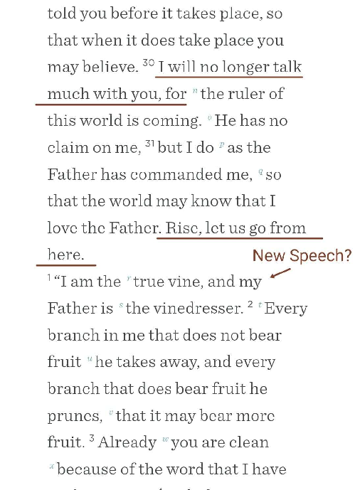

This shows that John chapters 15 to 17 have been squeezed in between

- 14 and 18, thus pushing these two apart. Raymond Brown stated regarding John 14:30 and the word “much”:

### “[much]. The evidence for omission is weak. yet a scribe, thinking the statement "I shall no longer speak with you" strange when three chapters of discourse were yet to follow, may have inserted the word. Without "much" the statement would have made perfect sense when Division 1 [John 13-14] was the whole Last discourse.”22

He is arguing that there is a clear mo ve for a scribe to insert the word “much” given that three more chapters of discourse were yet to follow. He states that the Syriac Sinai cus manuscript (dates to the 4th century) does not contain “much”, and the internal evidence is strong. Therefore, it is probable that the original reading was “I shall no longer speak with you”, and then a scribe inserted “much” to blunt the edge of the difficulty.

Another indica on that these chapters were inserted between 14 and 18 is to no ce the contradic on between John 13-14 and John 16.

“But now I am going to him who sent me, and none of you asks me, ‘Where are you going?’” John 16:5 While in John 13:36, says:

Simon Peter said unto him, Lord, whither goest thou? … Thomas said to him, “Lord, we do not know where you are going. How can we know the way?” John 14:5

- 22 Brown, R. E. (1970), The Gospel According to John XIII-XXI, Garden City, N.Y., Doubleday, p.651.

### Ehrman says the reason this contradic on is present is that the ques on of where Jesus is going was in the other source (John 13-14). Furthermore, Ehrman says in his blog:

### “There is a repe  on between chs.14 and 16 because they were, in fact, two accounts of the same event, joined together".

### He also states: “These sources didn’t all say the same thing or have the same view; and when they were combined, the combina on created some internal inconsistencies”

This is true as we will see in the Paraclete passages. John 15-16 shows that this person is a human being who will come while John 14 leans more towards the Holy Spirit.

For instance, in John 16:23 Jesus states: “Truly, truly, I say to you, whatever you ask of the Father in my name, he will give it to you” while John 14:13-14 “Whatever you ask in my name, this I will do….If you ask me anything in my name, I will do it”. here the two sources contradict each other again (similar to 16:5 and 13:36). One version of the event (cf. John 16:23, 15:16) states to pray to the Father, while the other version of the speech states to pray to Jesus (cf. John 14:13-14), so the iden ty of the Paraclete in the two sources may differ as well. This is why we see the Paraclete passages in the two sources are completely different.

Ehrman presents his solu on to this puzzle of John 14-16, he says in his blog:

### “The theory of sources can solve these problems. Suppose for the sake of argument that the author had two different accounts of what happened at Jesus’ last meal with his disciples. We can call the first account “A” and the second account “B”. Account “A” told the stories that are now located in chapters 13, 14 and 18; account “B” told the stories found in chapters 15, 16 and 17. Suppose that the author of the Fourth Gospel took the two accounts and spliced them together, inser ng account B into account A, between what is now the end of ch. 14 and the beginning of ch. 18. This would explain all the problems we have discussed. There is a repe  on between chs. 14 and 16 because they were in fact two accounts of the same event, joined together. Moreover, Jesus states that “no one asks me ‘where are you going?’” because in this source (account

### B, now chs. 15-17) no one had asked where he was going: the ques onsof Peter and Thomas were originally found in the other account, account

### A. Finally, in account A Jesus had said “Arise, let us go” and they immediately got up and went. In the final version of John they do not get up and go, but wait for three chapters, because account B was interposed between two verses (14:31 and 18:1) that stood together in account A.”

Ehrman stated in his blog that this isn’t a new idea, it is the standard view among biblical scholars.

Raymond Brown states in his commentary:

### “…. the over-all structure of the two [collec ons] is roughly the same. Both begin with the theme of Jesus’ imminent departure [John 13:33, John 16:5]. The ques on of where he is going [John 13:36, John 16:5] and the mo f of the sorrow of the disciples soon appear [John 14:1, John 16:6]. Each unit has two Paraclete passages; each promises that shortly the disciples will see Jesus again [John 14:19, John 16:16] …. each assures the disciples in Jesus’ name that whatever is asked will be granted [John 14:13-14, John 16:23]. In each Jesus is interpreted by ques ons from the disciples [John 14:22, John 16:17-18].”23 Is John 16 earlier than John 14?

The following arguments are presented by a German scholar by the name of Hermann Sasse as he argues that John 16 is an earlier form of the discourse. He states:

### “Assuming that 16 is an edi ng of 13 81-14 81, what could have caused the editor to ignore Peter's ques on "To where are you going?" and the follow-up ques ons of Thomas and Philip, and have Jesus say instead: " None of you ask me: where are you going?' If there is any connec on, any dependency, no ma er how loose, between the two versions - and that cannot be denied - then the only conceivable explana on is that the disciples, through the repeated ques ons in c. 14 to be exonerated of the accusa on made against them 16 5. And it is the same with the announcement of the apostasy and flight of the disciples 16 32, the absence of which in the corresponding passage 14 29 is also a mi ga on in favor of the

23

Brown, R. E. (1970), The Gospel According to John XIII-XXI, Garden City, N.Y., Doubleday, p.588.

### disciples. These observa ons show us that in 16 4b_33 the older, original version is preserved.”24

These arguments make a strong case for John 16 to be earlier. It does not make sense for John 16:5 to be later, John 13-14 seems to be vindica ng the disciples from the accusa on by Jesus in John 16. The theme of later sources a emp ng to vindicate the disciples is common in the gospels (see Mark 6:51-52 & Ma hew 14:32-33, Mark 4:41 & Ma hew 8:27). In Mark 14:37, Jesus rebukes the disciples for sleeping and not keeping awake for one hour, but Luke 22:45 states that they were sleeping for sorrow which does not make sense as grief does not cause a person to sleep (psalm 6:6), let alone a group of disciples. It has been pointed out in the New Interna onal Greek Testament Commentary by the New Testament scholar Howard Marshall that this is Luke’s way of exonera ng the disciples from Mark’s picture because Luke’s reasoning is unlikely25. As Marshall explains, the focus is much more on the prayer of Jesus than the failure of the disciples in Luke. Furthermore, he states that the idea of sleep because of grief is thought to be even psychologically improbable.

Moreover, in John 16:23, Jesus says to his disciples to pray to the Father, but in the parallel saying in John 14:13-14, Jesus says to them to pray to him (I.e. Jesus). In the earlier gospels, Jesus tells his followers to pray only to the Father as in the famous lord’s prayer in Luke 11:2-4. Therefore, John 16 seems to be closer to the earlier tradi on.

### Answering John 14

#### Examining John 14 also does not refute the Muslim argument that Jesus was predic ng prophet Muhammad. The Holy Spirit does not fulfill John 14:26's func ons, and there is a minor support for "Spirit of Truth" (Brown, p. 650) or just “the Spirit” according to the Syriac Sinai cus manuscript (it dates to the 4thcentury). John 14:26 is the only verse that

- 24 Sasse, H. (1925), Der Paraklet im Johannesevangelium, Verlag nicht emi elba, p. 267.

- 25 Marshall, H. I. (1978). The Gospel of Luke (The New Interna onal Greek Testament Commentary), Eerdmans, p.833.

### associates the Paraclete with the Holy Spirit, and this could be dubious since the rest of the Paraclete passages do not fit the Holy Spirit, but they fit a prophet. Professor Gary Burge states in his commentary:

### “A few manuscript variants omit “holy”, while others read “Spirit of truth” (harmonizing the verse with 14:17) ... some scholars have refused to iden fy the Paraclete as the Holy Spirit”26

The renowned biblical scholar Bruce Metzger stated, with regards John 7:39, that scribes had a habit of inser ng “Holy” with the word “Spirit”:

### “The tendency to add ἅγιον [holy] was both natural and widespread among Chris an scribes, whereas if the word had been present in the original, its dele on would be inexplicable... copyists introduced a variety of modifica ons.”27

### Raymond Brown (p.650) quoted biblical scholar C.K Barre  who argued that the shorter reading “The Spirit” is not impossible to be original and that “Holy” and “of Truth” are scribal clarifica ons.

### C.K. Barre  stated: “τὸ Πνεῦμα τὸ Ἅγιον so the majority of MSS.; a few assimilate to the τὸ Πνεῦμα τῆς ἀληθείας of v.17; 15.26; 16.13, sin omits τὸ Ἅγιον; this short reading may be original; it would account for the two variants.”

### Barre  says that the short reading “The Spirit” may be original because it would account for the variants.28 That means it could have been just “the Spirit”, and some scribes inserted “The Holy” and others inserted “of Truth”. Similar to Raymond Brown and Gary M Burge, Barre  states that the majority of manuscripts have “Holy” while a few has “of truth”, and the Syriac Sinai cus omits “holy” and has only “The Spirit”. Barre  is

- 26

Gary M. Burge, John The NIV Applica on Commentary, p. 398, see footnote 20.

- 27

Bruce M. Metzger, A Textual Commentary on the Greek New Testament, p. 218.

- 28

###### Barre . C. K. (1987). The Gospel According to ST. John: an Introduc on with Commentary and Notes on the Greek Text (2nd ed.). The Westminster Press, p. 467.

### correct that this short reading is not impossible given the two variants

### (Brown, p.650).The presence of two dis nct expansions in the manuscript tradi onstrongly suggests that the archetype lacked both modifiers. If theautograph had read “the Holy Spirit,” the later emergence of “the Spiritof truth” is difficult to explain; conversely, if the autograph read “the Spiritof truth,” the appearance of “Holy Spirit” is equally problema c. However,if the earliest form was simply τὸ πνεῦμα (“the Spirit”), then thedevelopment of both later expansions is natural: one group of scribesinserted “holy” for doctrinal clarifica on, while others added “of truth” toharmonize with John’s repeated use of this  tle in 14:17, 15:26, and16:13. It is also suspicious how only one verse has “holy” in the en reParaclete discourse.The Syriac Sinai cus is the same manuscript which omits “much” in John

- 14:30 as discussed above, and there is internal evidence that “much” may have been inserted. There is a clear incen ve to insert “much” in 14:30 by scribes when seeing 3 more chapters of speech were yet to follow, as Raymond Brown argued. He stated, “a scribe, thinking the statement ‘I shall no longer speak with you’ [in John 14:30] strange when three chapters of discourse were yet to follow, may have inserted the word [much]. Without "much" the statement would have made perfect sense when Division 1 [John 13-14] was the whole Last discourse [ini ally].”

### (Brown, p.651). Brown stated also that “….we have already suggested thatxiii 31-lliv 31 [John 13:31-John 14:31] represents substan ally thediscourse that stood in the early wri en form of the Gospel”, so without“much” John 14:30 would make perfect sense as Jesus stops speaking andleaves with the disciples immediately in the first edi on of the gospel.Therefore, the first edi on of the gospel plausibly lacked “much”. Thesame manuscript shows the same scribal phenomenon. If the SyriacSinai cus preserves a more original reading in 14:30 by omi ng aclarifying word that appears in Greek copies, it strengthens the possibilitythat it also preserves a more original reading in 14:26 by omi ng “Holy”in the early wri en form of the gospel. This demonstrates that in this

### same chapter the Syriac Sinai cus preserves a more original form by omi ng a later clarifying addi on. The parallel with John 14:26 is striking: in both cases, a shorter reading is internally more plausible. The phenomenon Brown iden fies in 14:30 thus reinforces the possibility that the simpler reading “the Spirit” in 14:26 may likewise represent an earlier stage of the text. When the same manuscript contains mul ple shorter readings that meet internal criteria for originality, this does not look accidental. It suggests a consistent pa ern.

### There is also another variant to discuss. John 7:8 reads in the majority and earliest manuscripts “You go up to this feast. I am not yet going up to this feast, for My  me has not yet fully come.” “Yet” is only omi ed in a few Greek manuscripts like Codex Sinai cus29. The point of men oning this variant is that “yet” is also omi ed in the Syriac Sinai cus30, which is the focus in this sec on. Without “yet”, Jesus seems to be lying as he goes to the feast in verse 10. If he lied, then that means he was not sinless, therefore, a scribe would more likely insert “yet”. Bruce Metzger in his textual commentary states: “The reading oupw [yet] was introduced at an early date (it is a ested by P66, P75)in order to alleviate the inconsistency between ver. 8 and ver. 10.”31 His reasoning is the same for John 14:30 and 14:26. He is arguing internally more than relying on the manuscripts. These three examples share the same scribal phenomenon. The Syriac Sinai cus preserves in these three places shorter and more internally plausible readings. Greek manuscripts, even very early ones some mes contain clarifying addi ons. Syriac Sinai cus repeatedly preserves readings that resist such smoothing, and scholars who were quoted recognize those readings as poten ally original. Just to be clear, the Commi ee that published Metzger’s commentary gave ra ng ‘C’ to this specific variant, and that means that they cannot make a decision

- 29

Center for New Testament Restora on (n.d.). John 7:8, retrieved from

https://greekcntr.org/collation/index.html?&v=43007008.

- 30

Lewis. A. S. A transla on of the Four Gospels from the Syriac of the Sinai c Palimpsest. Retrieved from https://share.google/mtZHxr07awx6U9Zl4. Accessed 24th December 2025. p. 176.

- 31

###### Metzger. B. (1994). A Textual Commentary on the Greek New Testament (2nd ed.). United Bible Socie es. p.185.

### (whether to omit or retain the variant) because of two possible reasons: either the insufficiency of the evidence or that the evidence on both sides is equal.

### Further internal evidence pertains to the context itself. Raymond Brown states that “the Paraclete and Jesus cannot be on earth together” (p. 711) based on John 16:7. This contradicts the other gospels where the Holy Spirit was present. Brown con nues “The promise of vs. 7 is fulfilled in [John 20:22] where the first ac on of the risen Jesus who has ascended to his Father (xx 17) is to breathe on his disciples and say, "Receive the Holy Spirit." The problem is that even 20:22 “Receive the Holy Spirit” contradicts 16:7 “If I depart, I will send him to you”, so either way it does not fit the Holy Spirit. It must be someone new. These observa ons strengthen the thesis that John 14:26 may have originally lacked ‘holy’.

### Another internal evidence is how John uses “the Spirit of Truth” elsewhere. In 1 John 4:1-6 (same author as the gospel of John), John speaks about “The Spirit of Truth” in verse 6, and he equates it with spirits/prophets from verses 1-2. The spirit/prophet that “confesses” that Jesus is the Christ is the Spirit of Truth in that passage, and the spirit/prophet who does not confess Christ is the spirit of error. A spirit does not “confess”. It is the prophet himself who confesses, hence John here iden fies prophets as spirits. He does not equate the Spirit of Truth with the Holy Spirit. A true prophet is the Spirit of Truth, and a false prophet is the spirit of error in the language of John. If so, then:

- 1- “The Spirit” in John 14:26

- 2- “The Spirit of Truth” in 14:17, 15:26, 16:13

- 3- “The Spirit of Truth” in 1 John 4:6 (associated with spirits/prophets vv. 1-2)

### In addi on, as discussed, more than one individual claimed to be this Paraclete in the early centuries of Chris anity, which is a clear mo ve to insert “Holy” very early on to refute these claimants. The earliest

### manuscript of John 14:26 is P66 from about 200 AD32 while Montanism started prior in the mid to late 2nd century. The Greek manuscript tradi on might have been influenced by human claimants of the Paraclete in the 2nd and 3rd centuries. The Montanist movement began in the late 2nd century (156–172 CE), decades before P66. If the Paraclete were clearly the Holy Spirit, Montanus could not claim to be the Paraclete. Why would followers of Montanus and Mani believe they were the Paraclete if the Paraclete is the Holy Spirit clearly? Montanists believed that Montanus was the instrument of the Paraclete, and that the Paraclete was different from the Holy Spirit. They believed “the Holy Ghost was in the Apostles, but the Paraclete was not” This is decades before P66 (as discussed in the claimants of the Paraclete sec on). This interes ngly presents the possibility that the text that was present at the  me of Montanus did not have “Holy” in 14:26. This plausibly caused the scribes to insert ‘Holy’ to block this claim. Bruce Metzger, in his commentary on the Syriac versions of the New Testament, states: “it is obvious that the Old Syriac manuscripts preserve many noteworthy readings, some of which are not witnessed elsewhere”33. This is true for the case of the Syriac Sinai cus as its readings are unique.

### Montanism provides a plausible historical context in which early scribes might have inserted ‘Holy’, in much the same way that narra ve tension in John 7:8 plausibly explains the early introduc on of “yet.”

### Now we will examine the Greek words John uses. John uses the Greek “allos” ἄλλον for the word “another” in verse 16, that is, another of the same type as Jesus34, (Jesus is the first Paraclete, cf. 1 John 2:1), rather than heteros, one of a different kind. This also explains why the masculine pronoun for the Paraclete was used, even in John 14:26. This is not

- 32

Aland. K. Aland. B. (1989) The Text of the New Testament: An Introduc on to the Cri cal Edi ons and to the Theory and Prac ce of Modern Textual Cri cism (2nd ed.), Eerdmans Publishing Company, p.57.

- 33

Metzger. B. M (1977) The Early Versions of the New Testament: Their Origin, Transmission, and Limita ons, Clarendon Press, p.42.

- 34

#### Bible Hub, Allos, retrieved from h ps://biblehub.com/greek/243.htm

### normally used for the “Holy Spirit” which is neuter in Greek, and John uses the masculine pronoun in John 16:13 where the antecedent is “Spirit of Truth” which is neuter (not the masculine “Parakletos”), hence this is inten onal. The Spirit of Truth should be understood as a “He” (i.e. a Man), and this will be elaborated and discussed more in this book. In John 16:8, John uses the Greek ελεγξει (“reprove”, “convict”, “expose”), and Pink’s commentary from StudyLight.org states: “Inward convic on is certainly not the meaning of the word rendered 'reprove.' It is rather a refuta on by proofs, convic ng by unanswerable arguments as an advocate, that is meant"35. This strongly points to the Paraclete as a tangible human person, not an inner intangible force. It is a public exposure, not an inner feeling.

### The significance of ἄλλος (‘another’) in John 14:16 becomes clearer when the Paraclete’s ac vity is examined in light of Jesus’ own self-descrip on elsewhere in the Gospel. Jesus states, ‘For I have not spoken on my own authority, but the Father who sent me has himself given me a commandment—what to say and what to speak’ (John 12:49). In a closely parallel formula on, the Paraclete is said to ‘not speak of himself, but whatsoever he shall hear, that shall he speak’ (John 16:13). In both cases, speech is mediated, subordinate to a higher sender. This shared feature is a characteris c of a prophe c role and highlights func onal con nuity between Jesus and the Paraclete. The speech here represents prophe  c human speech. Consequently, ‘another Paraclete’ here points to prophe c succession. Rather than presupposing later Trinitarian interpreta on of John 14:16 (the Trinity did not exist at the  me of John’s Gospel, cf. John 17:3, 5:26), this analysis treats ἄλλος (“another”) as a term indica ng con nuity and func on within the narra ve logic of the Gospel. The force of ἄλλος is clarified by the striking func onal parallel between Jesus’ own mode of speech and that ascribed to the Paraclete (cf. John 12:49, John 16:13).

35

Pink, A.W. "Commentary on John 16". "Pink's Commentary on John and Hebrews".

https://www.studylight.org/commentaries/eng/awp/john-16.html

### Another significant internal analysis pertains to the fact that John’s last discourse [John 14-16] was composed of two parallel sources as was discussed in this sec on. Bart Ehrman stated that ‘There is a repe  on between chs. 14 and 16 because they were in fact two accounts of the same event, joined together’. In par cular for our purposes here, we see this exemplified with John 14:26 and 15:26.Both sayings follow essen ally the same template:

- A. Paraclete  tle  “But the Helper/But when the Helper comes…”

- B. Sending formula  “whom the Father will send…” / “whom I will send… from the

Father…”

- C. Spirit-Reading  “the Spirit …” / “the Spirit of truth …”

- D. Func on clause  “he will teach/remind…” / “he will bear witness…”

### John 14:26 and 15:26 are the same saying in different forms. So, it’s very natural that 14:26 would have the simpler iden fica on (“the Spirit”), and

### 15:26 would supply a fuller characteriza on (“the Spirit of truth”),Whereas if the base form was:

-  14:26: the Spirit
-  15:26: the Spirit of truth

### then the pair looks like a deliberate Johannine move from generic to specific, which is a very plausible authorial pa  ern. John 15:26 naturally reads as an elaborate iden fica on within the same Johannine Paraclete tradi on. This parallelism supports the plausibility that 14:26 originally contained the simpler reading “the Spirit,” with later scribes clarifying the

### referent by inser ng “holy.”36 Note John’s use of ‘spirits’ as prophets and ‘the Spirit of Truth’ as a true prophet also enforces this argument.

### Taken together, the use of the masculine pronoun ἐκεῖνος in John 16:13 (despite the neuter ‘Spirit of Truth’), the use of ἄλλον (‘another’) in John

### 14:16 implying a Paraclete similar in type to Jesus himself, and theforensic verb ἐλέγξει (‘will convict/expose’) in John 16:8 collec velysuggest that the Johannine Paraclete is portrayed as a tangible, publicagent. While later Chris an interpreta on iden fies this figure with theHoly Spirit, the Johannine language itself plausibly allows for an originalunderstanding of the Paraclete as a human prophe c successor to Jesus.This is striking seeing that many scholars suggested that the “Paracletewas once an independent salvific figure, later confused with the HolySpirit” (Brown, p.1135). Moremore, a er presen ng the internalevidence, it also strengthens the idea that The Syriac Sinai cus preservesthe early stage of the text internally. The evidence relies on the Greekwords John uses as well as the internal evidence presented in the SyriacSinai cus and the internal evidence of John’s sources for John 14-16 andJohn 16:7.On text-cri cal grounds, it is highly plausible that an earlier form of John

- 14:26 reads: ‘But the Comforter, which is the Holy Ghost, whom the Father will send in my name …’, with the qualifier ‘Holy’ represen ng a later doctrinal clarifica on and ‘of truth’ to be a harmoniza on with

### 14:17, 15:26, and 16:13. This earlier form is a ested in the old Syriac andconsistent with Johannine usage elsewhere.

### John 14:26 is ambiguous on its own; its meaning is clarified decisively by John 16, where the Paraclete’s public, forensic, prophe c role is fully ar culated as will be demonstrated in due course. Once John 14:26 is shown to be textually open, the iden fica on of the Paraclete must be guided primarily by the detailed func onal descrip on in John 16. The

36

Similar Phenomenon can be observed in the shared/parallel material [the Q source] between Ma hew and Luke (cf. Ma hew 10:34, Luke 12:51).

### ques on then becomes which historical referent most plausibly fits these func ons.

John 14’s other sayings can also be addressed. John 14:17 can be read "will be among you" (NRSV footnotes) rather than "will be in you”. Interes ngly, “will be among you” can be a ributed to a human prophet. “Will be in you” can be metaphorical as Jesus repeatedly uses this phrase with the disciples yet the disciples are not literally inside Jesus. Prophet Muhammad is indeed with us forever since he is the last prophet (cf. Quran 33:40), so it is a metaphor. It does not necessarily mean he would be with us physically (cf. Luke 16:29). John 14:17 states the world cannot receive the Paraclete (KJV) because they neither see him nor know him. The Greek word of “see” here can also be translated as "consider" also.37 Hence, The NLT renders it as “The world cannot receive him because it isn’t looking for him and doesn’t recognize him”. The disciples “know him”, meaning in their knowledge of his coming, this is plausible. He “abides with you” (John 14:17 KJV: “dwelleth with you”) should be understood to be in the future because verse 16 uses the same phrase but in the future “that he may abide with you for ever” (John 14:16 KJV). Prophet Muhammad indeed taught us all things (with the Quran and the Sunnah), but the Holy Spirit did not do that. He reminded us of many teachings of Jesus (cf. John 14:26) regarding one God, forgiveness of God through his mercy and much more, as will be shown in due course. We will see how mainstream Chris anity contradicts what Jesus taught. The Quran and the Sunnah have a meaningful summary of Jesus' teachings. Prophet Muhammad was indeed sent in Jesus' name i.e in his place. Mark 13:5-6 has false messiahs coming in Jesus’ name, but this clearly means in his place (Barre , p. 467). This is similar to the Paraclete. Therefore, the WNT renders 14:26 as “whom the Father will send at my request”, and the NLT has it “when the Father sends the Advocate as my representa ve”.

### Explaining how John 16 does not refer to the Holy Spirit

37

bibleHub (n.d.). theoreo, retrieved from Strong's Greek: 2334. θεωρέω (theóreó) -- to behold, to observe, to look at, to perceive

In this part of the sec on, we will examine John 16 more closely. The disciples received the Holy Spirit while Jesus was with them (cf. John

- 20:22), but that opposes John 16:7 “if I go not away, the Comforter will not come unto you; but if I depart, I will send him unto you”. In John 20:17, Jesus says “I am not yet ascended to my Father”, and he gives them the Holy Spirit in John 20:22, so it is a clear contradic on if the Paraclete is the Holy Spirit. Jesus remains with the disciples in the following chapter (cf. John 21) while the disciples s ll have the Holy Spirit, contradic ng John 16:7.

John 16:7 implies that the Paraclete is superior to Jesus, yet no Chris an believes the Holy Spirit is superior. They believe they are co-equal. Therefore, the Muslim argument is stronger.

Some Chris ans reply by saying John 20:22 is only symbolic. However, there is no evidence for this interpreta on. As the Cambridge Greek Testament Commentary states:

“he breathed on them] The very same Greek verb (here only in N.T.) is used by the LXX. in Genesis 2:7 (Wisdom 15:11) of breathing life into Adam.38

The same Greek word is used in Genesis 2:7 in the Septuagint Old Testament (the Greek transla on), so are we to say that when God breathed life into Adam that it did not truly happen? There is no evidence for the Chris an interpreta on. There is no evidence for it to be just a symbolic process in this passage. Verse 23 says: “If you forgive the sins of any, they are forgiven them; if you withhold forgiveness from any, it is withheld.”. Thus, it shows they received the Holy Spirit.

Moreover, John 7:39 confirms this. John 7:39 states: “Now this he said about the Spirit, whom those who believed in him were to receive, for as

38

"Commentary on John 20". "Cambridge Greek Testament for Schools and Colleges". John 20 - Cambridge Greek Testament Commentary for Schools and Colleges Bible Commentaries - StudyLight.org, 1896.

yet the Spirit had not been given, because Jesus was not yet glorified [i.e. resurrected]”. Pe ’s Commentary argues:

### “It is significant that John here [in John 7:39] spoke in terms of ‘receiving the Spirit’ (‘the Spirit -- they -- would receive’) for this mirrors Jesus’ very words when He breathed on his disciples and said “receive the Holy Spirit” [John 20:22]. To John that would be the prime fulfilment of His words, when the Apostles as the first-fruits became fountains of living water preparatory for their outreach to the world….It is not good interpreta on to degrade that moment as being only ‘a symbolic act’, just to fit in with people’s theories. John could easily have men oned Pentecost [cf. Acts 2] had he wished to do so. But John had no doubt that the moment when he received the Spirit as promised in John 7:39, and

### when the ou low to the world began, was in that Upper Room where they had first seen the risen Lord.”39

John 7:39 is referring to John 20:22, they use the same phraseology. Chris ans believe that the Holy Spirit coming in the book of Acts is the fulfilment of the Paraclete promise, but the Holy Spirit in Acts is referring to Luke 24:49 (Luke and Acts are wri en by the same author). To John, the Holy Spirit coming in John 20:22 is what John 7:39 speaking about, as the above commentary argues. John disagrees with Luke concerning the coming of the Holy Spirit.

Thus, it is impossible for the Holy Spirit to be the Paraclete who will come a er Jesus leaves in John 16:7. The Paraclete in John 15-16 is called the

- 39 Pe , Peter. "Commentary on John 7". "Pe 's Commentary on the Bible ". https://www.studylight.org/commentaries/eng/pet/john-7.html. 2013.

“Spirit of Truth”, not the “Holy Spirit”, and the condi on of his coming contradicts the Holy Spirit in John 20:22 and 7:39. In addi on, Luke 1:41, 1:67 and 4:1 speak of Elizabeth, Zechariah and Jesus respec vely being “filled” with the Holy Spirit hence it makes no sense saying “If I do not go, he will not come”. It literally says “filled”, and “will not come to you” clearly means the Paraclete was not present in any sense yet which contradicts John 14:17 (i.e. the other version of the speech). “When the Advocate comes….” seems strange since the Holy Spirit was already there. Moreover, the original reading in John 14:17 is more likely to be “and is in you” rather than “will be in you”. It is much more likely that a scribe would change the present to the future. If this is true, it would contradict John

### 16:7. Ellico ’s commentary states:“But ye know him; for he dwelleth with you, and shall be in you. —The

be er text is,. . . . and is in you. The verbs are in the present tense.”40

The verbs in John 14:17 are also present, so this would affirm the same point again.

To illustrate this further, in Ma hew 12:28, Jesus says that it is “it is by the Spirit of God that I cast out demons”, and he “And he called the twelve (disciples)….. and gave them power over the unclean spirits.” (cf. Mark 6:7 KJV). Therefore, Jesus had already given the disciples the Holy Spirit when we read Ma hew and Mark since he said that he could drive out demons by the Holy Spirit, and he gave the same power to the disciples. John 16:7 “if I do not go away, the Comforter will not come unto you; but if I depart, I will send him unto you.”. The Comforter [Helper] cannot be the Holy Spirit.

In John 15-17 source, the pronouns for the Paraclete are consistently masculine, while in John 14:17 it is neuter. The Holy Spirit is never masculine in the bible except here. Why? The Paraclete is a man. The

- 40 Ellico , Charles John. "Commentary on John 14". "Ellico 's Commentary for English Readers". https://www.studylight.org/commentaries/eng/ebc/john-14.html. 1905.

Paraclete is not iden fied as the Holy Spirit in John 15-17 source. Moreover, on the plain reading of it, John 16 seems to be talking about a man and a prophet when one reads it. The spiritual descrip ons of the figure are notably absent in John 15-16 source.

The focus here is that the one in men oned John 15-16 refers to the Prophet Muhammad.

These are the two approaches to tackling this prophecy. You either exegete the two sources and argue that they both point to the Prophet Muhammad, or you use the evidence that the final discourse in John’s Gospel was composed of two dis nct sources. Both approaches lead to the same conclusion at the end.

# 5- Old Testament Prophecies

### Summary of the Muslim case concerning Old Testament prophecies

When one sees John 14 and John 15-16 are two different sources, then they can be read differently. A reader can easily connect the one spoken about in John 16 with Deuteronomy 18:18 where it speaks of a prophet like Moses ﷺ who will come.

“I will raise up for them a prophet like you from among their brothers. And I will put my words in his mouth, and he shall speak to them all that I command him.” Deuteronomy 18:18 “When a prophet speaketh in the name of the LORD, if the thing follow not, nor come to pass, that is the thing which the LORD hath not spoken” Deuteronomy 18:22 Or “If the prophet speaks in the LORD’s name but his predic on does not happen or come true, you will know that the LORD did not give that message, the prophet hath spoken it presumptuously: thou shalt not be afraid of him.” Deuteronomy 18:22 “For he shall not speak of himself; but whatsoever he shall hear, that shall he speak: and he will shew you things to come.” John 16:13

### Behold my servant, whom I uphold, my chosen, in whom my soul delights; I have put my Spirit upon him; he will bring forth jus ce (mišpāt) to the na ons…..

He will not grow faint or be discourageda  ll he has established jus ce in the earth; and the coastlands wait for his law. (Isaiah 42:1-4)

So, if one puts two and two together, there will be someone coming a er Jesus ﷺ who will be like Moses ﷺ. The point of similarity here is that both prophecies speak of someone or a prophet who will speak what he is commanded and foretell the future. The prophet of Deuteronomy 18:18 will clearly make true prophecies according to verse 22, and the Paraclete will do the same thing. The two prophecies refer to the same person.

Concerning Deuteronomy 18’s prophecy, in verse 15, it reads in the Masore c text (The standard Jewish text): “The Lord your God will raise up for you a prophet like me from among you (i.e. an Israelite), from your brothers—it is to him you shall listen”. The phrase “Among you” only exists in this version of the text, but the Septuagint (Greek transla on of the Old Testament, dated between 3rd century BC and 1st century) reads without “from among you”, and it is also quoted in the book of Acts in the New Testament without it (cf. Acts 3:22).

In Hebrew, Israel is personified as one person in verse 15. Therefore, when says “from your brothers”, it means the prophet would come from another na on (i.e. a na on that is a brother to Israel such as the Ishmaelites), not from Israel itself. The singular “Israel” is not the brother of itself. This is supported by the fact that Deuteronomy 34:10 also states this prophet would not come from Israel.

### In Deuteronomy 2:8, the term “brothers” refers to the descendants of Esau (Prophet Jacob’s brother) because both trace themselves to the prophet Isaac, hence in the same way, the term can refer to the Ishmaelites since the Israelites and Ishmaelites both trace to the prophet Abraham.

### Moreover, Deuteronomy 34:10 is translated in most Chris an bibles incorrectly. The well-respected Jewish website “Sefaria” and the Jewish Study Bible translate it as: “Never again did there arise in Israel a prophet like Moses—whom הוהי (God) singled out, face to face” (Deuteronomy 34:10). The Jewish commentator HaChaim comments on this verse: “The past tense םק means that as of the  me when these words were wri en no other comparable prophet had arisen. The addi on of the word דוע means that no comparable prophet would arise in the future either.”41 The Jewish Study Bible Similarly states the same when it highlights the contradic on between 34:10 and 18:15 (if 18:15 refers to an Israelite).42 In addi on,The famous Jewish Chumash Commentary states: “The Sages note the Torah’s statement [Deuteronomy 34:10] here that in Israel there will never be a Prophet like Moses implies that among the non-Jewish na ons there could be such a prophet”43

### God says in 18:18, that this prophet will be like the prophet Moses. The Collin’s dic onary of the bible states: “As a statesman and lawgiver Moses is the creator of the Jewish people. He found a loose conglomera on of Semi c people, none of whom had been anything but a slave, and whose ideas of religion were a complete confusion. He led them out and he hammered them into a na on, with a law and a na onal pride, and a compelling sense of being chosen by par cular God

- 41

Sefraia (n.d.). “HaChaim’s Commentary on Deuteronomy 34:10”, retrieved from

Deuteronomy 34:10 with Or HaChaim

- 42

Archive (n.d.). The Jewish Study Bible, Oxford University Press, retrieved from The Jewish Study Bible Featuring The Jewish Publica on Society TANAKH Transla on : Free Download, Borrow, and Streaming : Internet Archive, p.450

- 43

###### Artscroll Chumash Commentary on Deuteronomy (1999). Stone Edi on, Mesorah Publica ons, p. 187.

### who was supreme. The only Man in history who can be compared even remotely to him is Muhammad”44

Pu ng everything together, this means that he will be a lawgiver like Moses as the Old Testament repeatedly speaks about a lawgiver who will come. God says, “I will put my words in his mouth”, and the Quran is

### the only scripture that is the literal words from God in every mode of recita on. God speaks in the Quran in the first person, literally his words. God inspired Jesus to speak, but did he literally speak God’s words like the Quran? No, Jesus spoke by inspira on using his own words. Furthermore, God says in verse 19 “the words which he shall speak in my name”, and every chapter except one in the Quran begins with “in the name of Allah (God), the Most Gracious The Most Merciful”.

Prophet Muhammad did indeed speak to God face to face when he was taken up to heaven on the night of “جارعم”. God talked to Moses face to face on Earth while Prophet Muhammad talked to God in heaven. It is about quality, not quan ty. He also did miracles as Moses did (cf. Quran 54:1-3, 37:14-15, 6:124).

As for Isaiah 42, Christopher R. North in his commentary on Isaiah states that many commentators believe the “jus ce” (mišpāt) which will be brought forth by the servant of Isaiah 42 to the Gen les is be er explained as something similar to the Arabic word “Deen”45. He writes that the word signifies more than the law, but it is the right and true law, the complete expression of the law (cf. John 16:13), and as the true religion. The connec on between the Paraclete and the servant of Isaiah 42 is quite evident. Other Chris an commentaries state the same thing, for example:

In Barnes’ Notes Commentary on Isaiah 42:4:

44

Dow. L. J. (1964) Collin’s gem Dic onary of the Bible, pp. 402-403.

- 45 North, C. R. (1969), Suffering Servant in Deutero-Isaiah, (2nd ed.). Oxford University Press, p.141.

“Till he have set judgment - Un l he has secured the prevalence of the true religion in all the world”46

### His law [Isaiah 42:4] - His commands, the ins tu ons of his religion. The word ‘law’ is o en used in the Scriptures to denote the whole of religion.

The servant has a global mission. The law he brings is for the world. It is not the law of Moses but a new law. It says that the coastlands will wait

### for his law and that he will establish jus ce in the earth, and just within a century a er the Prophet’s death, Islam reached from northern China to Southern France. This has only happened with Islam, and this is the only law that reached every place as it also says, “Sing to the Lord a new song, his praise from the end of the earth” (Isaiah 42:10-11). This servant is “a light to the Gen les” (Isaiah 42:6 KJV), and the Quran states in 7:158 “Say, [O Muḥammad], ‘O mankind, indeed I am the Messenger of Allāh to you all’”. The Prophet Muhammad fits Isaiah 42:6 much more than the biblical Jesus who was sent only to the Israelites (cf. Ma hew

### 15:24) and called gen les dogs (cf. Ma hew 15:26), so all these nuancestogether point to the Prophet Muhammad.

In the Cambridge Bible for Schools and Colleges Commentary, it states on the word “judgment” or “jus ce”:

“This is the sense here; it means the religion of Jehovah regarded as a system of prac cal ordinances. All recent commentators instance the close parallel of the Arabic dîn, which denotes both a system of usages

and a religion. This the Servant shall “send forth” to the na ons by his prophe c word.”47

- 46 Barnes, Albert. "Commentary on Isaiah 42". "Barnes' Notes on the Whole Bible". https://www.studylight.org/commentaries/eng/bnb/isaiah-42.html. 1870.

- 47 Bible Hub, (n.d). Cambridge Bible for Schools and Colleges on Isaiah 42, retrieved from https://biblehub.com/commentaries/cambridge/isaiah/42.htm

### The word denotes a system of prac cal ordinances and instruc ons which only Islam has. Some cri cs even cri cize Islam for being too prac cal. Also, True complete religion/law implies true complete guidance (cf. John 16:13). God also says that he would magnify the law of this servant (cf. Isaiah 42:21).

The word implies bringing the “The true law of God”, and this corresponds to Psalm 9:20 in the Greek transla on of the Old Testament previously men oned. Psalm 9:20 states:

“Appoint, O Lord, a lawgiver over them: let the heathen know that they are men.”

The prophet David prays to God to appoint a lawgiver over the heathen to put them in their place.

This is clearly referring to what the servant of Isaiah 42 will do, it reads in verse 17:

### “They are turned back and u erly put to shame, who trust in carved idols, who say to metal images, you are our gods.”

Who is the only one who was a lawgiver and decimated idolatry as psalm 9 and Isaiah 42 state? There is a narra ve in Sahih Bukhari 2478: “The Prophet (ﷺ) entered Mecca and (at that  me) there were three hundred-and-sixty idols around the Ka`ba. He started stabbing the idols with a s ck he had in his hand and reci ng: "Truth (Islam) has come and Falsehood (disbelief) has vanished."

Another linguis c connec on is striking. Isaiah 42:19 reads “Who is blind but my servant, or deaf as my messenger whom I send? Who is blind as my dedicated one, or blind as the servant of the Lord?”

Ellico ’s commentary comments on the word “dedicated” or “perfect” (KJV) in the Hebrew: “Strictly speaking, the devoted, or surrendered

one. The Hebrew meshullam is interes ng, as connected with the modern Moslem and Islam, the man resigned to the will of God.”48

What a coincidence. It literally calls the servant a “Muslim” as the Hebrew word is linguis cally connected to the Arabic word ‘Muslim’.

However, some may object saying God calls this servant here blind and deaf. The well-respected Jewish scholar Ibn Ezra interprets this as the Jews are mocking the prophet Isaiah. He states: “Who is blind, etc. This verse proves the correctness of my explana on as to the prophet’s being mocked by his audience”, and he also states: “You are blind who say that none is so blind as the prophet.”49. Therefore, it is equally possible to interpret this as the Jews mocking the servant of Isaiah 42:1 who is the focus of this en re chapter, not Isaiah.

The lawgiver in Isaiah 42 and Psalm 9 is men oned by the prophet David in the Aramaic version of Psalm 84, and it reads “Blessings will cover the lawgiver”50, and the Greek Septuagint has it as “there the law-giver will grant blessings”51. The lawgiver is associated in this psalm with the valley of Baca. Baca is Makkah according to Quran 3:96. Who is the lawgiver who was associated with Baca? Only Prophet Muhammad. This psalm also tells us that pilgrimage takes place in Baca as the house of God, and it reads:

### “Blessed are those who dwell in Your house….. Blessed is the man whose strength is in You, whose heart is set on pilgrimage. As they pass through the Valley of Baca. They make it a spring;”52 (KJV)

- 48

Ellico , Charles John. "Commentary on Isaiah 42". "Ellico 's Commentary for English Readers". h ps://www.studylight.org/commentaries/eng/ebc/isaiah-42.html. 1905.

- 49

Sefaria (n.d.). Isaiah 42, retrieved from Isaiah 42:19 with Ibn Ezra

- 50

Bible Hub (n.d.). Psalm 84 Peshi a Holy Bible Translated, retrieved from Psalm 84 Peshitta Holy Bible Translated

- 51

Bible Hub (n.d.). Psalm 84 Brenton’s Septuagint Transla on, retrieved form Psalm 84 Brenton's Septuagint Translation

- 52

###### Bible Hub (n.d.). psalm 84 New King James Version, retrieved from Psalm 84 NKJV

It tells us that those pilgrims go from “Rampart to Rampart”53 and “Rampart” means “Ridge”54 as one synonym of it. “Ridge” means a high edge along a mountain55, which is why an Arabic transla on rightly translates it as “they go from mountain to mountain”56. This is the correct transla on. Muslims (in pilgrimage) go from Mount Safa to Mount Marwa. The Spring here can only be Zamzam which is in Mecca. The psalm men ons Zion, but in Hebrew, the word can mean “parched land”57, and Makkah is a parched land. It can also refer to a monument, and the Kaaba is a monument.58 In context, it makes sense that the word means parched land because the psalm is speaking about a dry valley (GNT) and a spring.

This is similar to Isaiah 60 where it speaks about Gen les and Kedar (Arabs) specifically offering sacrifices on God’s Altar. It reads:

“The Gen les shall come to your light, And kings to the brightness of your rising …..All the flocks of Kedar shall be gathered together to

you,….. and I will glorify the house of My glory.” Isaiah 60:7 (KJV)

It speaks about God’s house which can only be Makkah. Isaiah 60 also men ons “Zion”, but it also can refer to a parched land or a monument. Isaiah 42:11 men ons a specific loca on related to the servant of Isaiah 42; it reads: “Let the wilderness and its towns raise their voices; let the se lements where Kedar lives rejoice. Let the people of Sela sing for joy; let them shout from the mountaintops.” (Isaiah 42:11).

- 53

Sefaria (n.d.). Psalms 84, retrieved from Psalms 84:8 with Connections

- 54

Collins’ Dic onary (n.d.). Synonyms of ‘rampart’ in Bri sh English, retrieved from RAMPART Synonyms | Collins English Thesaurus (2)

- 55

Cambridge Dic onary (n.d.). ridge, retrieved from RIDGE | English meaning - Cambridge Dictionary

- 56

La Biblia Online (n.d.). ةكرتشملا ةيبرعلا ةمجرتلا– 84 ريمازملا, retrieved from - 84 ريمازملا ةكرتشملا ةيبرعلا ةمجرتلا

- 57

Net Bible(n.d.). Zion, retrieved from NETBible: Zion

- 58

###### Bible study tools (n.d.). Zion, retrieved from www.biblestudytools.com/dic onary/zion/

Kedar is one of the sons of Ishmael the father of the Arabs (Genesis 25:13). Ishmael’s descendants resided from Havilah to Shur in Genesis 25:18. Kedar is also associated with Arabia in Ezekiel 27:21. Havilah is located in the northwest part of Yemen59, and Shur is southwest Pales ne60. From Northwest Yemen to Southwest Pales ne is exactly the Western part of modern-day Saudi Arabia, also known as the “Hijaz” region. Hence, the “Sela” here refers to mount Sela in Madinah (the city of Prophet Muhammad ﷺ). Muslims are also the only people who shout from mountaintops at pilgrimage. The connec on between “Kedar” (Arabia) and “Sela” clearly pinpoints the loca on, that is, Madinah.

The Cop c Orthodox manuscript (Cop 8-4) comments on “Kedar” in Isaiah 21 as the tribe of Quraish (tribe of Prophet Muhammad ﷺ)61:

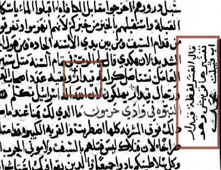

- 59

Orr, James, M.A., D.D. General Editor. "Entry for 'HAVILAH'". "Interna onal Standard Bible Encyclopedia". 1915. Retrieved from Havilah Meaning - Bible Definition and References (biblestudytools.com).

- 60

Bible Hub (n.d.). Shur: A Wilderness Southwest Pales ne, retrieved from Topical Bible: Shur: A Wilderness Southwest of Palestine (biblehub.com)

- 61

###### Cop c Orthodox Patriarchate (1648 AD), Cop 8 4, Archive retrieved from COP 8 4 : Center for the Preservation of Ancient Religious Texts, BYU : Free Download, Borrow, and Streaming : Internet Archive , p. 63.

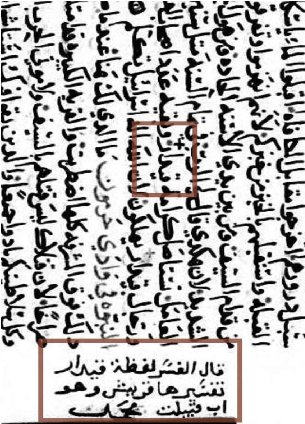

One of the Cop c Orthodox churches in Egypt wrote a commentary on the Old Testament, and it states that the tribe of Quraish came from “Kedar”.62

The Old Testament scholar Charles Foster in his book “The Historical Geography of Arabia” states:

### “Namely, of the land of Kedar; which every reader conversant with Arabian geography will recognize as a most accurate delinea on of the district of Hedjaz, including its famous ci es of Mekka and Medina.”63 In the Epistles of a well-known Jewish Scholar Moses ben Maimon, he clearly equates between Kedar and “Quraish” also as he states that Prophet Muhammad is a descendant of Kedar.64 The same source tells us that the Jewish scholar Radak also noted this.

#### The Cyclopedia of Biblical, Theological and Ecclesias cal Literature states on ‘Kedar’:

- 62

نيوكتلا رفس :ميدقلا دهعلا ريسفتل ةيسنكلا ةعوسوملا .(2006) .ةيسكذوثرﻷا ةيطبقلا صقرمرام ةسينك, p.189.

- 63

Foster, C (1844), The Historical Geography of Arabia Vol 1, London, Duncan and Malcom, p.242.

- 64

Maimonides (1204 AD), Crisis And Leadership: Epistles of Maimonides, The Jewish Publica on Society of America, p. 126, 147, retrieved from Maimonides - Crisis And Leadership : Maimonides : Free Download, Borrow, and Streaming : Internet Archive

### “A very ancient Arab tradi on states that Kedar se led in the Hejaz, the country round Mecca and Medina, and that his descendants have ever since ruled there (Abulfedae Hist. Anteislamica, ed. Fleischer, p. 192). From Kedar sprung, the dis nguished tribe of Koreish, to which Mohammed belonged (Caussin, Essai,i, 175 sq.).”65

Also, from the reference, it states that the Jewish Expression “Tongue of Kedar” refers to the Arabic language.

From Schaff’s Bible dic onary, it states that tradi on makes Prophet Muhammad a descendant of Kedar66:

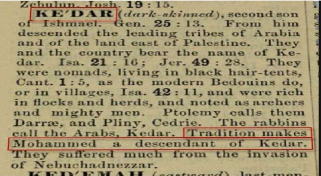

### The Jewish Encyclopedia states: “According to Mohammedan tradi on, Kedar ("Ḳaidhar") was the ancestor of Mohammed; and it is through him that Mohammed's descent is traced to Ishmael”67

### Given this evidence, the “Sela” here in Isaiah 42:11 must refer to Mount Sela in Madinah.

#### Deuteronomy 33:2 is another prophecy that men ons a lawgiver who would come in the land of Paran (land of Ishmael, cf. Genesis 21:21). It reads:

- 65

McClintock, John. Strong, James. Entry for 'Kedar'. Cyclopedia of Biblical, Theological and Ecclesias cal Literature. https://www.studylight.org/encyclopedias/eng/tce/k/kedar.html. Harper & Brothers. New York. 1870.

- 66

Schaff, Philip, Dr. "Biblical Defini on for 'kedar' in Schaffs Bible Dic onary".

bible-history.com - Schaff's

- 67

###### Jewish Encyclopaedia (n.d.). Entry for ‘Kedar’, retrieved from KEDAR JewishEncyclopedia.com

“And he said: "The Lord came from Sinai, and dawned on them from Seir; He shone forth from Mount Paran, and He came with ten thousands of saints; From His right hand came a fiery law for them.”

### The three loca ons here refer to three prophets. Sinai clearly refers to the prophet Moses, and Seir is in Pales ne, so it refers to Jesus. Paran refers to the Prophet Muhammad. The “LORD” some mes can refer to God representa ves or prophets. For example, in Exodus 7:17-19, the term “LORD” refers to the prophet Aaron.

### Using the same reasoning, since Ishmael’s descendants dw elt in the Hijaz region, it only makes sense that he himself dwelt there also. It seems that Ishmael dwelt in the middle of the Western part of Arabia and his descendants moved North and South from Paran (hence Genesis 25:18 says that they dwelt in Western Arabia). Genesis 21:19 tells us there was a well of water in Paran which can only be the Zamzam well in Mecca. Jewish Commentators like Rashi states that this passage is about God offering the Torah to the inhabitants of Seir and to the sons of Ishmael, but they refused, hence God came therefore to Israel (i.e. from Sinai where Moses received the Torah)68. This interpreta on has it backwards because the passage has the climax at Mount Paran, hence the revela on will reach its peak in Paran. It does not say they would refuse the revela on, rather, it shows God’s final revela on is in Paran. Rashi’s exegesis is not so far from the Muslim interpreta on here as well.

### Prophet Muhammad ﷺ is the only one who fits this as he came with ten thousand companions conquering Mecca.

#### Adam Clarke in his commentary states that:

68 Sefaria (n.d.). Deuteronomy 33, retrieved from Sefaria: a Living Library of Jewish Texts Online

### “Our version renders ten thousands of saints, a transla on which no circumstance of the history jus fies.69 Clarke does not translate it as “ten thousands of saints” because (in his es ma on) it is not known when this happened in history. However, we know that this happened at the conquest of Mecca. Eusebius (the prominent church historian) states:

Pharan. “a city beyond Arabia [ie beyond the capital of Arabia: Petra/Kadesh] adjoining the desert of the Saracens (who wander in the desert) through which the children or Israel went moving (camp) from Sinai. Located (we say) beyond Arabia on the south”70

He says that Paran is on the south of Petra (south of Perta, i.e. south of northern Arabia), which can only be Mecca because it is in the south.

### The Israeli academic Haseeb Shahada states that Paran in Genesis 21:21 refers to the Hijaz region (i.e. Western Saudi Arabia today).71

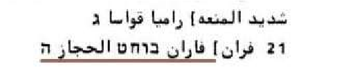

#### The Cop c Orthodox manuscript (Cop 3-4) states that Ishmael dwelt “in the wilderness of Hijaz” instead of “Paran”.72

- 69

Clarke, Adam. "Commentary on Deuteronomy 33". "The Adam Clarke Commentary". h ps://www.studylight.org/commentaries/eng/acc/deuteronomy-33.html. 1832.

- 70

Eusebius (325 AD), The Onomas con and the Exodus route, retrieved from The Onomas con by Eusebius (325AD) and the Exodus route

- 71

Shahada. H (1989 AD). The Arabic Transla on of the Samaritan Torah, Internet Archive, retrieved from ةداحش بيسح - نييرماسلا ةاروتلل ةيبرعلا ةمجرتلا : Free Download, Borrow, and Streaming : Internet Archive, p. 90.

- 72

Cop c Orthodox Patriarchate (17/18th Centuries), Cop 3 4, Archive, retrieved from COP 3 4 : Center for the Preserva on of Ancient Religious Texts, BYU : Free Download, Borrow, and Streaming : Internet Archive p. 22.

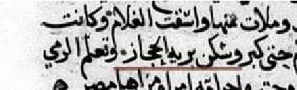

Ibn Ezra states on the well men oned in Genesis 16:14:

“BEER-LAHAI. Beer lahai means the well of him who will be alive next year. Compare, ko le-chai (so to life next year) (I Sam. 25:6). The well was so called because the Ishmaelites held annual fes vi es at this well. It is s ll in existence and is called the well of zamum (i.e. Zamzum in Mecca).”73

Linking this to Genesis 25:18 shows that the Ishmaelites lived in Mecca. The well here (in Mecca) also can be connected to the well in Paran in Genesis 21:19. In Rabbi Saadia Al Fayoumi’s transla on of Genesis 16:14, he translates the well to be on the way of “Al Hijaz” (Western Arabia) “يف زاجحلا رجح قيرط”74. Ibn Ezra also states in his commentary of Genesis

- 21:20: “HAVE I EVEN HERE SEEN HIM THAT SEETH ME? The angel first appeared

to her here. That is, she came to the same place where the angel had first appeared to her a er she had been cast out by Sarah when pregnant with Ishmael (Chap. 16). Perhaps the original reading in I.E. was: and he dwelt in the wilderness, the place where she (his mother) once said, “Have I even here seen Him that seeth me” (Weiser).”75

- 73

Sefaria (n.d.). Genesis 16, retrieved from Genesis 16:14 with Ibn Ezra

- 74

Al-Fayoumi, S. (n.d.). Arabic Commentary of the Torah, Archive, p. 109. Retrieved from يمويفلا فسوي نب نوؤاج نب ايدعس : ةيبرعلاب ةاروتلا ريسفت : Free Download, Borrow, and Streaming : Internet Archive

- 75

###### Sefaria (n.d.). Genesis 21, retrieved from Genesis 21:20 with Ibn Ezra

### Ibn Ezra quotes Genesis 16:13 (which men ons Zamzam) and states that the place here is the same as Genesis 21 that has Paran, and the website

Sefaria comments on Ibn Ezra’s exegesis in italics. Therefore, Ibn Ezra states that Ishmael drank from Zamzam and lived in Mecca. Similarly, one of the Arabic versions of the Bible “ "ةيعوسيلا ةينابهرلا ةمجرتلاstates the same76:

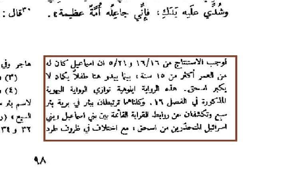

### It states that the same thing, that is, the well in Genesis 16 and 21 is the same based on the well a ested fact amongst scholars that the book of Genesis some mes has two versions of the same event.

### Gill’s Exposi on commentary on Genesis 16:14’s well puts this argument in nutshell as: “Aben Ezra says, the name of this well, at the  me he lived, was called Zemum, he doubtless means Zemzem, a well near Mecca, which the Arabs say is the well by which Hagar sat down with Ishmael, and where she was comforted by the angel, Genesis 21:19”77.

### This passage is speaking about a law in Paran (Mecca). However, there could be two Parans in the bible. Adam Clarke states that there could be two Parans, he states regarding the Paran in Deuteronomy 1:1:

- 76

Archive (n.d.). ةيعوسيلا ةمجرتلا سدقملا باتكلا , retrieved from ةمجرتلا سدقملا باتكلا ةيعوسيلا : Free Download, Borrow, and Streaming : Internet Archive

- 77

###### BibleHub (n.d.). Gill’s Exposi on on Genesis 16, retrieved from Genesis 16 Gill's Exposition

### “Paran — This could not have been the Paran, which was con guous to the Red Sea, and not far from Mount Horeb; for the place here men oned lay on the very borders of the promised land, at a vast distance from the former.”78

### The point here is that could be two places called “Paran”.

### The “ten thousand” in Deuteronomy 33 is similarly men oned in the song of Solomon 5:10. The recent book “Abraham Fulfilled” goes into great detail into this text. Briefly, song of Solomon 5:10-16 is generally seen by Jewish scholars to be allegorical depic ng the love between God and Israel and seen to refer to Christ by church fathers such as Ambrose of Millan and Gregory of Nyssa79. The Song of Solomon (in the targums) also has some future overtones because it speaks about the Messiah80 in Judaism. If so, why can’t it be about Muhammad ﷺ? The book is a collec on of poems put together as the Jewish study bible states81, hence it can refer to a future person to come. It men ons a descrip on of a person who is chief among “ten thousand” (conquest of Mecca), and his skin color is white with redness in it (Musnad Ahmad 944) as it reads “My beloved is white and ruddy, Chief among ten thousand” (KJV), and his hair is black and wavy (Sunan ibn Majah 3634) as “his hair is wavy and black as a raven” (KJV). Finally, the text men ons his name in the Hebrew text of verse 16 “ma·ḥă·mad·dîm”. In Hebrew, the word has the same le ers as the Arabic, that is, mem_het_mem_dalet. The “im” at the end is a plural of respect in Hebrew. The “im” ending can also be found in other names in the Hebrew bible such as Genesis 10:13 with the name םִי ַ֡ר ְצ ִמוּ “ū·miṣ·ra·yim”, and it is not translated here, so it is

- 78

Clarke, Adam. "Commentary on Deuteronomy 1". "The Adam Clarke Commentary". h ps://www.studylight.org/commentaries/eng/acc/deuteronomy-1.html. 1832.

- 79

Catena Bible (n.d.). Song of Songs 5:10, retrieved from Song of Songs 5:10 - Catena Bible & Commentaries

- 80

Sefaria (n.d.). Song of Songs 1:17, retrieved from Song of Songs 1:17 with Aramaic Targum to Song of Songs

- 81

###### Berlin, A. Bre ler, M (ed.). The Jewish Study Bible, Oxford University Press, p.1564.

### wri en as a name “Mizraim”. The word ma·ḥă·mad·dîm here only appears here once in this form in the bible. Moreover, here it makes sense to leave it as a name because the passage is speaking about a person. Given that some Jews believe their future Messiah is spoken about in Song of Solomon, it is not a weak interpreta on that Prophet Muhammad is spoken about also here.

Finally, in Song of Solomon 6:2, a loca on is given of this person; it reads:

“My lover has gone to his garden, where the balsam trees grow. (GNT)

Baca according to several commentaries was named like this because it is famous for balsam trees, and they link to Makkah. For example, the Cambridge Bible commentary states:

“Balsam-trees are said to love dry situa ons, growing plen fully for example in the arid valley of Mecca; and this is clearly the point of the reference”82

This commentary here comments on Psalm 84’s Baca, and it is reasonably a reference clearly to Song of Solomon 6:2 that men ons the loca on of this beloved. A loca on is given here, and it fits the Prophet Muhammad.

### The commentator Arnold Anderson “disputes the existence of such a valley on the pilgrim route and even the growth of balsam trees in Pales ne.”83

If the valley is not in Pales ne, it can only be in Mecca.

### The Name “Ahmad” in Isaiah 42:1

- 82

Bible Hub (n.d.). Cambridge Bible Commentary on Psalm 84, retrieved from Psalm 84 Cambridge Bible for Schools and Colleges

- 83

###### Tate. E. M. (September 29, 2015), Word Biblical Commentary, Psalms 51-100, Zondervan Academic, p. 353.

There is strong textual evidence that Isaiah 42:1 men oned the name “Ahmad” (Ahmad is one of the names of Prophet Muhammad ﷺ).

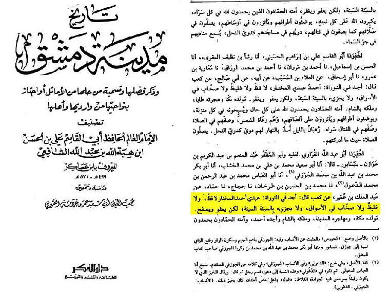

This is an Islamic source quo ng Isaiah 42:1, and it has the servant named “Ahmad”.

This is the word in ques on and how it appears in the standard Jewish text (which is called the Masore c text):

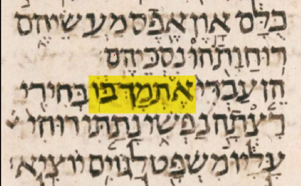

### The name of the Manuscript is Leningrad codex p.236 Isaiah 42:1.

The word in Hebrew “־ מָ ת ְֶ א” (Etmak). It is translated as “Whom I Uphold”. This word is very close to the Hebrew of “Ahmad” ‘דמחא’. If

### the original reading was Ahmad, it would be plausible that the scribes of the book of Isaiah made a mistake in copying.

### Firstly, whenever the bible uses the word “servant” and “chosen one” together, it always men ons the name of the servant. For instance, Psalms 89:3, Isaiah 44:1, Isaiah 45:4. Isaiah 42:1 is the only place where we find the word “servant” and “chosen one” but don’t find a name, and this is the place where we find a word that seems like “Ahmad” in text.

### Secondly, the Gospel of Ma hew quotes Isaiah 42, and the quota on from Ma hew does not have the word “whom I uphold” but has the word “Beloved” (ἀγαπητός in Greek).

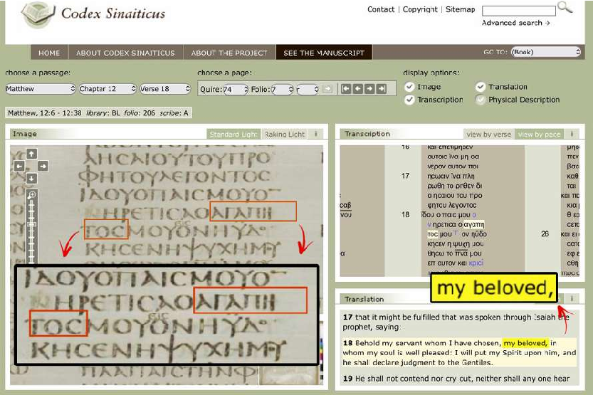

### The author of Ma hew translated the Hebrew word that was in his source to “beloved” in Greek. If the original reading of the Hebrew text was “Beloved”, the name “Ahmad” is the word that can be derived from “Beloved” in Hebrew.

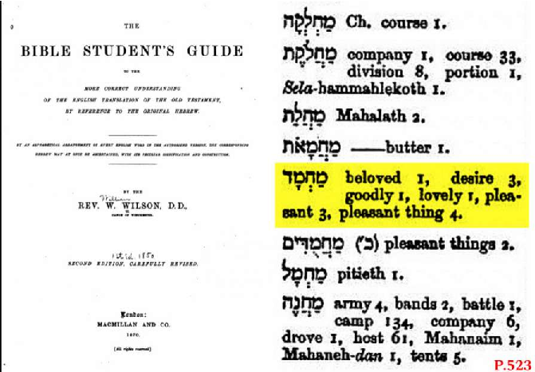

### Interes ngly, the word “־ מָ ת ְֶ א” (Etmak) cannot be derived from “Beloved”. Hence, the original word was Ahmad, and Ma hew had this reading, so he translated it as “Beloved” in his gospel. Therefore, the phrase “Whom I Uphold” is simply a mistake from the scribes. Also, if the original reading was “whom I Uphold”, then it would have been impossible for Ma hew to translate it as “beloved”. More importantly, the word “Beloved” in Hebrew is derived from the root “דמח” (hmd, the root of the name ‘Ahmad’) as can be seen in the above Hebrew Lexicon.

### The le ers in ques on from the word Etmak ־ מָ ת ְֶ א (I Uphold) are תְ and ־  (the rest of the le ers are the same in both Ahmad [דמחא] and Etmak) but if the original word meant Beloved in Hebrew we would use the le ers ח and ד instead which is the name "Ahmad" itself as ‘hmd’ has the same le ers ח and ד, and even Beloved has those two le ers as shown from the Hebrew Lexicon above.

### Some may object saying that the Hebrew word Etmak has the le er בו at the end. This le er is a pronoun. The Hebrew word strictly speaking means “I uphold him”, and this le er means the pronoun “him” in English. This is a legi mate objec on. However, it is plausible that this addi on by scribes to make sense of the sentence a er thinking it is Etmak. The “whom” in the English transla on is not in the original Hebrew. The Hebrew literally reads as “I Uphold Him”.

### An explicit revela on in Arabia

### The last prophecy from the Old Testament that will be discussed in this sec on is the passage from Isaiah 21:13-17. It reads: “The oracle concerning Arabia.

### In the thickets in Arabia you will lodge, O caravans of Dedanites. To the thirsty bring water. meet the fugi ve with bread, O inhabitants of the land of Tema. For they have fled from the swords, from the drawn sword, from the bent bow, and from the press of ba le. For thus the Lord said to me, “Within a year, according to the years of a hired worker, all the glory of Kedar will come to an end. And the remainder of the archers of the mighty men of the sons of Kedar will be few, for the Lord, the God of Israel, has spoken.” First thing to note here is the mistransla on of the first verse “The oracle concerning Arabia”, and this should read as “the oracle in Arabia”. The Hebrew word for “oracle” means “Prophecy” or “Revela on”84. The Arabic transla ons have the Arabic word for “Revela on” here, so it should read as “Revela on in Arabia”. In Hebrew, it reads “א ָ֖שּׂ ַמ ב ָ֑ר ְע ַבּ”. Isaiah chapters 21 to 22 talks about “oracles” related to different places, but here is the only place where Isaiah uses the preposi on “in” with regards Arabia. In all other places, he does not write “in”, so it can just mean a revela on “concerning” a place, not necessarily in that place. This is the only place where it men ons a

84

Bible Hub(n.d.). massa, retrieved from Strong's Hebrew: 4853. א ָשּׂ ַמ (massa') -- Burden, load, oracle, prophecy

### revela on “in” Arabia in Isaiah 21:13. Adam Clarke also noted this in his commentary on Isaiah 21:13, he says “from the singularity of the phraseology; for אשמ massa is generally prefixed to its object without a preposi on, as לבב אשמ massa babel; and never but in this place with the preposi on ב beth [in].”85

### Therefore, it is describing a revela on in Arabia. In brief, it is describing the Hijra (migra on) of the Prophet Muhammad here, “For they have fled from the swords, from the drawn sword, from the bent bow, and from the press of ba le.”, and “to the thirsty bring water. meet the fugi ve with bread” is speaking about people of Tema (Tema is a city north of Madinah) giving water and food to those who fled from the sword. This is speaking about the Prophet and his companion Abu Bakr fleeing from Mecca to Madinah. Then, within a year (or “three years” according to the dead sea scrolls86) a er this migra on “all the glory of Kedar (Quraish) will come to an end. And the remainder of the archers of the mighty men of the sons of Kedar will be few…”, and this happened at the ba le of Badr (within 3 years a er the migra on) when the Muslims defeated the idolaters of Quraish, and the “mighty men” and warriors such as Abu Jahl were killed.

### Finally, Ma hew Henry’s commentary states: “Within one year according to the years of a hireling (within one year precisely reckoned) this judgment shall come upon Kedar." If this fixing of the  me be of no great use to us now (because we find not either when the prophecy was delivered or when it was accomplished)”87. The commentator states that it is unknown when this prophecy was fulfilled, but we can see that it was fulfilled in the Hijra of the Prophet ﷺ.

- 85

Clarke, Adam. "Commentary on Isaiah 21". "The Adam Clarke Commentary". h ps://www.studylight.org/commentaries/eng/acc/isaiah-21.html. 1832.

- 86

Dead Sea Scrolls Bible Transla ons (n.d.). Isaiah 21 from Scroll 1Q Isaiaha, retrieved from

Biblical Dead Sea Scrolls - Isaiah 21

- 87

Henry, Ma hew. "Complete Commentary on Isaiah 21". "Henry's Complete Commentary on the Whole Bible". h ps://www.studylight.org/commentaries/eng/mhm/isaiah-21.html. 1706.

### Barnes Notes’ commentary explains the passage as: “The idea is, that the inhabitants of the land would be oppressed and pursued by an enemy; and that the Arabians……. would be driven from their homes; and be dependent on others; that they would wander through the vast deserts, deprived of the necessaries of life; and that they would be dependent on the charity of the people of Tema for the supply of their needs.” This is exactly what happened with the Hijra of the Prophet and his companions when they were driven out and oppressed. The same commentary tells us that “Tema is known as an oasis in the heart of Arabia, between Syria and Mecca.”88, so this means that Medina is located between Tema and Mecca. This can refer to the people of Medina receiving those who fled from the sword [from Mecca] although Tema and Medina are close but not the same place geographically.

88

Barnes, Albert. "Commentary on Isaiah 21". "Barnes' Notes on the Whole Bible". h ps://www.studylight.org/commentaries/eng/bnb/isaiah-21.html. 1870.

# 6- Could it be Someone else?

“I have yet many things to say unto you, but ye cannot bear them now. Howbeit when he, the Spirit of truth, is come, he will guide you into all truth: for he shall not speak of himself; but whatsoever he shall hear, that shall he speak: and he will shew you things to come.” John 16:12-13

As the Muslim scholar Ibn-AlQayyim argues, it is clear that the Paraclete is someone whom people, in general, will see and hear, not someone in the hearts of a small group of people. His func ons and quali es are of a human being who does these func ons. He convicts the world of sin, tells people what is yet to come, tes fies about Jesus ﷺ, praises Christ ﷺ, and he speaks what he hears. This does not apply to an intangible en ty that people do not see, rather someone who will speak to people and teach and guide them. Therefore, there is no reason to interpret these func ons as merely internal func ons when reading John 15 and 16 separately

Who Brought Complete Guidance?

Jesus ﷺ did not claim he came to bring all truth, but he says the one coming a er him will. Jesus ﷺ plainly says he is not the one who will deliver all truth, but someone will come and tell you many more things. There is a new revela on coming.

### Problems of Chris anity

Isn’t monotheism the greatest truth? Only Islam has the purest form of monotheism which is called Tawheed in Islam. The Quran takes away all the problems of Chris anity. For centuries, Chris an theologians have tried to explain the trinity and how it can be possible. Why can’t a 5-yearold understand it? Why does it have to take someone with at least a master’s degree in theology for him to a empt to explain it? Even then, it cannot be explained. No one has been able to explain how you can have 3 different persons who are each individually God but there is s ll one

God. Chris ans dis nguish between “a person” and “a being”, so they say God is three persons in one being. Isn’t a person a being? Yes. Anyone who is a “person” is a “being”. Why do Chris ans make a special case when it comes to God? This understanding developed over the centuries as will be shown. This is why Chris ans cannot present an analogy for the trinity, they always end up commi ng a heresy because there is no analogy for the trinity. It is not possible. All the difficul es and illogicali es of the two natures of Christ hypothesis don’t exist in Islam. For example, how could God be ignorant (Mark 13:32) yet s ll be God? Some Chris ans would respond by saying that Christ had two natures, divine and human, but this would result in commi ng the heresy of Nestorianism that says Christ is two persons (one divine who is all knowing and a human who lacks knowledge). This shows the logical impossibility of this theory. How could one person be all knowing and ignorant at the same  me? A person cannot possess two contradictory proper es. No one has been able to explain why God requires his innocent son to die to forgive the guilty. Why can’t he just forgive them? If God takes the payment, he has not forgiven anything. The Prophet Muhammad’s ﷺ message brings us to the true worldview. It is reasonable to the human mind. It is calling Chris ans back to the original picture. God is not the author of confusion (1 Corinthians 14:33 KJV).

Prophet Muhammad ﷺ brought the complete guidance John 16:12-13 “I have yet many things to say unto you, but ye cannot bear them now. Howbeit when he, the Spirit of truth, is come, he will guide you into all truth…. And he will shew you things to come” “Today I have perfected for you your religion (Deen) and have completed My favor upon you and approved Islam as your religion" Quran 5:3

### It is important to emphasize that both Prophet Jesus ﷺ and Prophet Muhammad ﷺ say that the religion before was not yet complete. Jesus ﷺ

### says it is not complete at his  me, and the one a er him will complete it,

### and the Quran says it is completed today. Isaiah 42 has the word “Jus ce” there when speaking of the servant. As it has been explained previously, it implies the complete expression of the true religion (Deen in Arabic). Not only does this show that the servant of Isaiah 42 and the Paraclete are the same person (because both bring all truth), but it also shows Jesus ﷺ as saying a human servant will come a er him to guide people into all truth.

With the Quran and the Sunnah of the Prophet Muhammad ﷺ, Islam is a complete way of life as it covers ma ers of theology, worship, family, morals, finances, law, and the unseen. The only religion and Sharia(dispensa on) that includes everything, from how to clean yourself to managing the affairs of all of humanity, is Islam. This is connected to the servant of Isaiah 42 bringing the true complete religion of God that is a system of prac cal ordinances.

A companion of the Prophet whose name is Abu Dhar Al-Ghifari said:

### “The Messenger of Allah, may Allah’s peace and blessings be upon him, has le  us, and no bird that moves its wings in the sky except that he gave us knowledge about. And the Prophet, may Allah’s peace and blessings be upon him, said, ‘There is nothing le  that gets you closer to Paradise and further from Hellfire except that it has been made clear to you.’89

### All those who claimed they were the Paraclete or last prophet did not demonstrate all truth. He is the only one who claimed (as revealed by Allah) to bring all truth (Quran 5:3) and demonstrated it. Islam is comprehensive guidance for life, but the New Testament does not teach a comprehensive guide for how to live your life.

#### Addi onally, the Prophet ﷺ stated:

ةينسلا رردلا, (n.d.). [Hadith from Mujma’ Al Zawied 8/266 (Authen c)], ةينسلا رردلا (dorar.net)

89

### “I am leaving you upon a (path of) brightness whose night is like its day. No one will deviate from it a er I am gone but one who is doomed…. I urge you to adhere to what you know of my Sunnah (cf. John 16:13) and the path of the Rightly Guided Caliphs, and cling stubbornly to it.90

### “O Messenger, announce that which has been revealed to you from your Lord, and if you do not, then you have not conveyed His message”. (Quran 5:67).

### All these cita ons clearly show how the Prophet ﷺ fulfilled John 16:13 literally.

### Jesus called him the Spirit of Truth because he stood for truth and is the embodiment of truth in a metaphorical sense. In Sahih Bukhari 6786, Aisha (May Allah be pleased with her) narrates:

### By Allah, he (the Prophet) never took revenge for himself concerning any ma er that was presented to him, but when Allah's Limits were transgressed, he would take revenge for Allah's Sake.91

### Moreover, the Quran in many places associates the Prophet with “the truth” (cf. 17:105, 61:9, 2:119) and many more:

### 17:105 “And with the truth We have sent it [i.e., the Qur’ān] down, and with the truth it has descended…..”

### 61:9 “It is He who sent His Messenger with guidance and the religion of truth to manifest it over all religion….”

- 90

Sunnah (n.d.). Sunan Ibn Majah 43, retrieved from Sunan Ibn Majah 43 - The Book of the Sunnah - ةمدقملا باتك - Sunnah.com - Sayings and Teachings of Prophet Muhammad ( ﷲ ىلص ملس و هيلع)

- 91

Sunnah.com (n.d.). Sahih al-Bukhari 6786, retrieved from Sahih al-Bukhari 6786 - Limits and Punishments set by Allah (Hudood) - دودحلا باتك - Sunnah.com - Sayings and Teachings of Prophet Muhammad (ملس و هيلع ﷲ ىلص)

### 2:119 “Indeed, we have sent you, [O Muḥammad], with the truth as a bringer of good  dings and a warner…”

### He is indeed “the Spirit of Truth”.

The Expositor’s Greek Testament Commentary states regarding the verb “guide”:

“into all the truth”. ὁδηγήσει ὑμᾶς “shall lead you,” “as a guide leads in the way, by steady advance, rather than by sudden revela on”.92

The Prophet Muhammad ﷺ received the Quran step by step, and by steady progress the “many things” were revealed. It is also well known how Alcohol was prohibited in stages in Islam. If a Chris an is asked “does the Holy Spirit speak to you and reveal to you new informa on and tell you the future?”, there is no direct answer given because it does not happen.

How could the disciples be strong enough to bear these many things only 40 days later a er the ascension of Jesus? What is the objec ve proof for this power which came to the disciples that made them bear these things? The text implies a revela on with a powerful impact and influence that will be delivered to people by the Paraclete which is why it is too much to bear for Jesus’ followers at that  me. This is why it is be er for the Paraclete to come than to have Jesus present on earth, so there is much more to this than what Chris ans think of the Holy Spirit coming in Acts 2. It applies to what is brought by the Prophet Muhammad ﷺ. We ask Chris ans, give us examples of new things the Holy Spirit taught you collec vely that Jesus ﷺ could not teach because the disciples could not bear them. Chris ans claim the Holy Spirit coming in Acts 2 is the fulfillment of Jesus’ predic on, but it is not clear how Acts 2 fulfills John 16.

92

Nicoll, William Robertson, M.A., L.L.D. "Commentary on John 16". The Expositor's Greek Testament. h ps://www.studylight.org/commentaries/eng/egt/john-16.html. 1897-1910.

Acts 2:22, 2:36, 3:13 denote low Christology which most Chris ans (i.e. trinitarians) do not accept. How can the ”Holy Spirit” in trinitarians be contradic ng the disciples in Acts?

Acts 2:1-4 states that the Holy Spirit enabled the disciples to speak other languages, but this does not happen today. Where does Jesus say the Paraclete will enable people to speak other languages in the first place? Has anyone actually spoken in other languages these days by the power of the Holy Spirit? Of course not. The Holy Spirit being the Paraclete is dubious.

### Problems in the New Testament’s teachings

What is the criminal jus ce system in the New Testament? Isn’t this an essen al aspect of “all truth”? Where is the teaching of hygiene? The teaching of managing financial life? The teaching of warfare? The only rules of warfare in the bible are in the Old Testament, but no Chris an would say the Old Testament rules of war are applicable today, and Chris ans say the Old Testament was only for that  me. Chris ans do not

follow a law revealed to them by God to maintain the order of a society, otherwise they would have accepted the Old Testament’s laws as applicable, but they do not. So, where is the guidance into “all truth” exactly? The “Turn the other cheek” and “do not resist an evil person” concepts in the New Testament are problema c and unrealis c because they tell people to not defend themselves (Ma hew 5:38-40). The prohibi on of second marriage in the New Testament creates all sorts of problems within society. People can only marry once in their life me in Chris anity (Mark 10:11-12). What if the husband is abusive? The wife s ll cannot divorce him and marry another man otherwise she would be commi ng adultery. The only excep on is that if one of them was sexually immoral (Ma hew 19:9), then the other can divorce his spouse, otherwise, it is not permissible. Moreover, a man cannot marry a divorced woman (Luke 16:18). This is literally “harmful” guidance inspired by the Holy Spirit since Chris ans believe the Holy Spirit inspired the gospels. The Holy Spirit did not only not guide anyone, but its guidance is harmful. The Holy Spirit did not prohibit alcohol and gambling as these are two of the

### poisons that are tearing down socie es today. These two poisons are addic ve, and God knows human nature and how harmful they are. Everyone who became an alcoholic started by saying “I only drink in modera on”. A study, conducted by the University of Oxford, finds that even moderate alcohol consump on is harmful.93 The Holy Spirit did not prohibit usury in the New Testament, but Chris ans might say that the Old Testament does. However, Chris ans always say they are not under the Mosaic law but under the law of Christ (see 1 Corinthians 9:21, Gala ans 6:2). Moreover, the Israelites but only prohibited charging interest to Israelites, but charging interest to a foreigner was acceptable (Deuteronomy 23:19-20, Exodus 22:25), so the problem remains. Usury is also one of the poisons that is causing so much pain and homelessness around the world. As we can see, the supposed guidance of the Holy Spirit cannot set up a country or even a community as it would fall apart immediately. Islam came with solu ons to all problems humanity is facing such as Alcoholism, racism, surplus women and many more. The Holy Spirit has not done anything for the past 2000 years.

Every Chris an claims he has the Holy Spirit, but Chris ans do not have an objec ve standard to determine if each Chris an is ge ng his "inspira ons" from the Holy Spirit. Chris ans have not demonstrated an objec ve criterion for the “inspira on” of the Holy Spirit. How can one dis nguish between Holy Spirit’s “inspira ons” and hallucina ons? Even Unitarians and people whom Chris ans call here cs claim inspira on from the Holy Spirit, it is problema c and subjec ve. why is the Holy Spirit giving different informa on or guidance to different Chris ans?

### Did Jesus ﷺ teach Chris anity?

### If the Holy Spirit is guiding Chris ans, why does Jesus affirm the monotheism of Moses in Mark 12:28-34? Why didn’t he introduce the

93

University of Oxford ( 2022 July 14), New study finds even moderate alcohol consump on may increase brain damage, poten ally through iron overload, Oxford Popula on Health, New study finds even moderate alcohol consumption may increase brain damage, potentially through iron overload — Nuffield Department of Population Health (ox.ac.uk).

### trinity to the Jews instead of agreeing with them? Why does Paul say Jesus came to abolish the law (Ephesians 2:14-15), and no one can be jus fied by the works of the law (Gala ans 2:15-17) but only by faith in Jesus’ death and resurrec on (Romans 10:9)? These oppose Jesus’ teaching in Ma hew 5:17-20. Jesus taught following the law is necessary for salva on (Ma . 5:19-20). Similarly, a man asked Jesus how to gain eternal life in Ma hew 19:17 “[Jesus said] If you would enter life, keep the commandments”. He taught his followers in Ma hew 23:2-3 to follow what the Pharisees (Jews of that  me) teach because the Pharisees sit in Moses’ seat (i.e they teach the Torah), but Chris ans nowadays have become so liberal that they cannot accept these teachings and would not follow the Old Testament. The prodigal son parable in Luke 15:11-32 is thoroughly an -Chris an (cf. Hebrews 9:22, 1 Timothy 2:5, Ephesians 1:7, Romans 5:9). Jesus’ view of salva on and the way to deal with sin is completely different to how Chris ans think (Romans 6:23, Romans 5:1215, cf. Luke 15:20-24, 18:9-14, 19:8-9). Bart Ehrman argued persuasively that Luke’s gospel does not teach vicarious atonement theology, disagreeing with the other gospels.94 Luke’s Jesus plainly contradicts that no on as shown. In the noted passages from Luke, Jesus teaches that God deligh ully and freely forgives the sins of his servants when they humbly repent to him of their sins, they can be jus fied before God if they do that (cf. Ephesians 1:7, Romans 5:9). So, does the Holy Spirit’s inspira on oppose Jesus? Jesus did not found Chris anity as it is today, it is a different religion en rely. This topic is discussed extensively in the book en tled “Edi ng Jesus: the Real Teachings of Jesus and Their Islamic Parallels”.

### The Church Fathers and the Bible

### One of the other major difficul es is the a esta on of the corrup on of the bible from the early church fathers as well as affirming books as inspired that are not in today’s bible. In the church father Jus n Martyr’s (100 – 165 AD) dialogue with Trypho, in chapters 71-73, Jus n accused

94

Ehrman, B. D. (2017, September 24), Did Luke have a Doctrine of Atonement?, The Bart Ehrman Blog, retrieved from Did Luke Have a Doctrine of the Atonement? Mailbag September 24, 2017 - The Bart Ehrman Blog

the Jews of removing many prophecies about Jesus from Old Testament (Greek transla on of the Old Testament)95, he says to Trypho in chapter 71:

### “I am far from pu ng reliance in your teachers….that they have altogether taken away many Scriptures from the transla ons effected by those seventy elders who were with Ptolemy”

### Trypho replies to Martyr: “We ask you first of all to tell us some of the Scriptures which you allege have been completely cancelled.”

Martyr then men ons few examples of these passages that were removed:

### “I shall do as you please. From the statements, then, which Esdras [Ezra] made in reference to the law of the passover, they have taken away the following: 'And Esdras said to the people, This passover is our Saviour and our refuge. And if you have understood, and your heart has taken it in, that we shall humble Him on a standard, and therea er hope in Him, then this place shall not be forsaken for ever, says the God of hosts. But if you will not believe Him, and will not listen to His declara on, you shall be a laughing-stock to the na ons.'”

So where is this scripture in the bible today? It does not exist in the Hebrew text nor in the Greek.

Another example from Martyr is:

Jus n Martyr, (n.d.). Dialogue with Trypho, chapters 71-73, retrieved from CHURCH FATHERS: Dialogue with Trypho, Chapters 69-88 (Justin Martyr) (newadvent.org)

95

### “And again, from the sayings of the same Jeremiah these have been cut out: 'The Lord God remembered His dead people of Israel who lay in the graves; and He descended to preach to them His own salva on.'

### This scripture is also lost and not found in the book of Jeremiah. The church father Irenaeus quotes this same passage in his book “Against Heresies” in lll.20.496, but he a ributes it to the prophet Isaiah.

Martyr con nues with another example: “And from the ninety-fi h (ninety-sixth) Psalm they have taken away this short saying of the words of David: 'From the wood.' For when the passage said, 'Tell among the na ons, the Lord has reigned from the wood,' they have le , 'Tell among the na ons, the Lord has reigned.”

Martyr accuses them of taking out the phrase “from the wood” (referring to the cross), but this phrase does not exist today in the bible today.

### Athanasius of Alexandria (293-373 AD) had a different bible canon than Chris ans have today97. He did not include the book of Esther as scripture in his canon of the Old Testament, and he only said that the book of Esther and other books are recommended to be read by new converts, but it is not scripture. All Chris ans believe in the book of Esther as scripture today. He included the book of Baruch and the epistle of Jeremiah in his canon which are accepted by Catholics and Orthodox but not Protestants. He did not include the other books Catholics and Orthodox accept such as 1 and 2 Maccabees and the others. Gregory of Nazianzus (330-390 AD) also omits the book of Esther.98

- 96

Irenaeus, (n.d.). Against Heresies 3.20, retrieved from CHURCH FATHERS: Against Heresies, III.20 (St. Irenaeus) (newadvent.org).

- 97

Athanasius (n.d.). Le er 39:4-7, retrieved from CHURCH FATHERS: Letter 39 (Athanasius) (newadvent.org)

- 98

###### Bruce, F.F. (1988), The Canon of Scripture, Downers Grove, Illinois: Inter-Varsity Press, p. 81.

### Irenaeus (130-202 AD) referred to the Shepherd of Hermas as “scripture” (Against Heresies 4.20.2)99. Similarly, Clement of Alexandria considered the Shepherd of Hermas to be divine revela on (Stromata 1.29)100. Clement of Alexandria (150-215 AD) also considered the epistle of Barnabas as authorita ve and wri en by the apostle Barnabas (Stromata 2.6-7, 20)101.

### It seems that Chris ans do not even have criteria to determine what is inspired and what is not. There are too many problems for the Holy Spirit to be the Paraclete. Did these church fathers have the Holy Spirit inside them? Moreover, “The Holy Spirit” tells Catholics the bible has 73 books while the same Holy Spirit tells Protestants it has 66 books?

Mainstream Islam today represents exactly what the Prophet Muhammad (peace be upon him) preached and what his companions preached. However, mainstream Chris anity does not even adhere to the teaching of Jesus in the bible as explained, and the beliefs of orthodox Chris anity clearly developed throughout the centuries as this will be ar culated in this book. The Holy Spirit certainly is not guiding anyone.

Is the Paraclete God? “For he shall not speak of himself; but whatsoever he shall hear, that shall he speak” John 16:13

Compare this to the language of God (the Holy Spirit) in the Old Testament in Isaiah for example where God (the Holy Spirit) repeatedly declares that he is the only God and there is no other god. In Isaiah 43-49, the Holy Spirit was speaking his own authority. The Holy Spirit was the one

- 99

Irenaeus, (n.d.). Against Heresies 4.20.2, retrieved from https://www.newadvent.org/fathers/0103420.htm.

- 100

- Clement of Alexandria (n.d.). Stromata 1.29, retrieved from

- https://www.newadvent.org/fathers/02101.htm.

101

Clement of Alexandria (n.d.). Stromata 2.6-7,20, retrieved from

- https://www.newadvent.org/fathers/02102.htm.

speaking in Isaiah according to Chris ans because he is part of the trinity. Therefore, the Paraclete cannot be the Holy Spirit.

### The plain reading of John 15-16 indicates the Paraclete is a human servant who is completely obedient to God and whom people will encounter and hear speak to them according to John 16:13. Where does John 16:13 say he will speak in the hearts of people? The plain text indicates that he will speak “To” people, not through them. Moreover, it does not seem like someone who is 100% God because God is not told what to say. Jesus makes the same statement about himself in John 12:49, therefore, the Paraclete operates the same way. The Paraclete foretells the future which is a job descrip on that fits a prophet. Jesus says the Paraclete would “declare” this revela on, and this strongly suggests the Paraclete is a human person, not some intangible spirit.

The Holy Spirit did not have a human nature, so why doesn’t he speak on his own if he is God? Philippians 2:6-9 is usually quoted to say that Jesus humbled himself and became a servant, so then Jesus speaks what God tells him, but the Holy Spirit does not have a human nature. This shows the Paraclete is a human prophet and not God.

### If the Holy Spirit is all-knowing then it should know of its own accord what to say, why does the Father have to tell it what to say? Hearing something to speak implies that the person did not know this revela on in the first place.

### The less known point about this verse, which went unno ced by Chris ans and Muslims, is that “for he shall not speak of himself; but whatsoever he shall hear, that shall he speak” removes the doubt of untrustworthiness of the Paraclete and ensures that this person is truthful. This can be undoubtedly said of a man claiming divine revela on from God, but can it be said of the Holy Spirit? The statement is meaningless and redundant if it is applied to the Holy Spirit. Why would Jesus need to ensure to them that the Holy Spirit is truthful? But it is suitable when speaking about a man coming a er Jesus who claims to receive revela on from God.

Who Told us of What is Yet to Come?

### This is probably the most objec ve part of the prophecy. Does the Holy Spirit tell Chris ans the future inside them? Has a Chris an ever come forward and predicted the future accurately by inspira on of the Holy Spirit? What prophecies the Holy Spirit made and have come true? Is there any person other than Prophet Muhammad ﷺ a er Christ ﷺ (of course, the Bible also ascribes false prophecies to Jesus) who foretold so many things, and his prophecies came true? This descrip on of someone foretelling the future fits only Prophet Muhammad ﷺ. Many prophecies are Fulfilled while others remain to be fulfilled. Every Muslim knows about the “signs of the hour” that the Prophet Muhammad ﷺ foretold.

There are many prophecies, here are some of his prophecies briefly:

### Every Muslim knows the fulfilled prophecy of the poor Arab Bedouins compe ng in making tall buildings (Sunan an-Nasa’I 4990)102. It is evident today as can be seen in UAE and KSA. It is a risky prophecy because he specifically specified the poor Arab Bedouins would do that, who were living in the desert, and he could have said the Romans or the Persians or the Indians would do that since they had tall buildings at that  me. This has happened with the discovery of oil which led these poor Arab Bedouins to flourish. The Prophet Muhammad ﷺ predicted that in the future, whenever sexual immorality becomes widespread, new diseases will appear that people have not heard of before (Sunan Ibn Majah 4019)103. We have seen that with HIV and nowadays with monkeypox. He predicted that interest would be so widespread to the point that no one can avoid even be affected by it (Sunan an-Nasa’I 4455)104. This is true as no one can avoid interest and usury en rely today. He said that his mosque would look like a white palace at the end  mes. In his  me, the Muslims were extremely poor and persecuted and fought from every side, and the mosque of the Prophet ﷺ was small and made of mud and palm

- 102

Sunnah.com (n.d.). Sunan an-Nasa’i 4990, retrieved from https://sunnah.com/nasai:4990.

- 103

Sunnah.com (n.d.). Sanan Ibn Majah 4019, retrieved from https://sunnah.com/ibnmajah:4019.

- 104

###### Sunnah.com (n.d.). Sunan an-Nasa’I 4455, retrieved from https://sunnah.com/nasai:4455.

### fronds. He must have had foreknowledge that Islam would become a global and powerful force105, and this is similar to another narra on where he said that the message of Islam will enter every house on the earth 106. This indeed has happened. The Prophet Muhammad ﷺ also stated that there will come a  me when someone tells a lie, and the lie would reach the ends of the world107. This can be seen clearly today in social media but was impossible 1400 years ago. He foretold that “sudden death” would appear.108 Sudden cardiac death has appeared in our  mes and is widespread109, unlike at the  me of the Prophet ﷺ.

He has indeed told us of what is yet to come in detail including the minor and major signs of the hour which are numerous, including the details of the coming of the An -Christ and more. The Holy Spirit fails in predic ng the future since the New Testament has false prophecies.

“This is what I mean, brothers: the appointed  me has grown very short. From now on, let those who have wives live as though they had none…. for the fashion of this world passeth away” 1 Corinthians 7:29,31 “Truly, I say to you, this genera on will not pass away un l all these things (including second coming) take place” Ma hew 24:34 “.. he is coming with the clouds, and every eye will see him, even those who pierced him” Rev 1:7

- 105

ةينسلا رردلا (n.d.). [Hadith from Mujma’ Al-Zawaed 3/311], retrieved from https://dorar.net/h/FNrzgJZR.

- 106

Sunnah.com (n.d.). Mishkat al-Masabih 42, retrieved from https://sunnah.com/mishkat:42.

- 107

Sunnah.com (n.d.). Sahih al-Bukhari 6096, retrieved from h ps://sunnah.com/bukhari:6096.

- 108

ةينسلا رردلا (n.d.). Sahih Al-Jamie 5899, retrieved from ىرَ ُي نأْ ةعاسلاِ بارتقاِ نَ مِ - ةيثيدحلا ةعوسوملا عماجلا حيحص :ردصم - ينابلﻷا :ثدحم - كلام نب سنأ :ةياور - ِةأجَفلا تومُ رَ هظَ َي نأو اْ ًقرط ُدجاسملاُ َذَخﱠتُت نأوْ نِ يْ َتَليْ َللِ : لاقُ ُيف ﻼً َبَق لﻼهلاُ

- 109

###### Cleveland Clinic (n.d.). Sudden Cardiac Death, retrieved from Sudden Cardiac Death: Signs and Causes

### Paul is saying Chris ans of his  me should not live as if they were married for the  me is short. He said this 2000 years ago! Revela on is saying even those who pierced Jesus to the cross will see him coming on the clouds, these people are long gone. Similar false predic ons are found in Ma hew 16:27-28 and 1 Thessalonians 4:15-16.

Acts records that the Holy Spirit made prophecies, but these supposed prophecies are fulfilled in the same book of Acts. So how do we know they are even genuine or made up? We don't have any examples of prophecies by the Holy Spirit fulfilled in our  mes, but we have many for the Prophet Muhammad ﷺ. In addi on, we can know that the so-called prophecies in Acts are made up because the New Testament also has false prophecies. The predic on of the end  me failed on part of the Holy Spirit. It fails to tell us things that will happen outside the New Testament. This is a major problem for it being the Paraclete objec vely.

#### The Paraclete Against Christendom (the World)

“And when he is come, he will reprove the world of sin, and of righteousness, and of judgment: Of sin, because they believe not on me; Of righteousness, because I go to my Father, and ye see me no more; Of judgment, because the prince of this world is judged.” John 16:8-11

The verb means as Raymond Brown states is to “Bring to light, Expose” and to “Convict someone of something”110. There are other meanings as will be shown. Rudolf Bultmann in his commentary states:

“He will uncover the world’s guilt. The image that comes before the eyes is that of a lawsuit of cosmic dimensions, taking place before the court of God. The world is accused, and the Paraclete is the prosecutor.”111 In the words of Cyril of Alexandria (376-444 AD) in his commentary:

- 110 Brown, R. E. (1970), The Gospel According to John XIII-XXI, Garden City, N.Y., Doubleday, p.705.
- 111 Bultmann, R. (1976), The Gospel of John A Commentary, Philadelphia Westminster Press, p.561.

### “The term world refers to those who are unceasingly involved in the pursuit of pleasure and who refuse to give up the devil’s wicked-ness, but it also refers no less to those who are sca ered and live throughout the world.”112

The term world can refer to people who are sca ered throughout the world, and it refers to Chris ans in this context, as Chris ans are sca ered globally, and this sec on will analyze the prophecy.

The basic idea is:

### “He will reprove the world of sin, and of righteousness, and of judgment. This is true, but the preposi on implies more. He will convict the world as respects these three; that is, will convict it of ignorance of their real nature.”113 “He will convict man that he is a sinner in rebellion against God, and that Jesus Christ demonstrated God’s standard of righteousness, and that he is des ned for hell”114

The verb implies the “world” is in dark shadows:

“Jesus is telling the disciples that they will carry on his work through the light of the Spirit by exposing the world’s darkened and deceived thinking.” (Hanneman, 2007)115

- 112 Elowsky J. C. (Ed.) (2015). Ancient Chris an Texts (Vol. 2), Intervarsity Press, Downers Groove, Illinois, p. 253.
- 113 Vincent, Marvin R. DD. "Commentary on John 16". "Vincent's Word Studies in the New Testament". h ps://www.studylight.org/commentaries/eng/vnt/john-16.html. Charles Schribner's Sons. New York, USA. 1887.

- 114 Evere , Gary H. "Commentary on John 16". Evere 's Study Notes on the Holy Scriptures. h ps://www.studylight.org/commentaries/eng/ghe/john-16.html. 2013.

- 115 Hanneman, J. (2007, 10 July), The Age of the Spirit, Peninsula Bible Church Cuper no, The Age of the Spirt – PBCC. Accessed 25th September 2022. Accessed 2nd October 2022.

### “This convic on, too, is an awakening from the darkness and ignorance

### of sin and unrighteousness under which men were exposed to judgment, and a bringing of them into the light of truth” (Exell ,1892)116 “He will reprove] or undeceive the world, by refu ng those odd conceits and erroneous opinions, that men had before drunk in, and were possessed of, ελεγξει [elégxō]” (Trapp, 1865-1868)117 “This means [the Paraclete] will cut off all their excuses and show that they have transgressed unpardonably” (John Chrysostom) “The verb presents the Spirit apparently as engaged in an argument or controversy with the world, ……convic ng and pu ng to shame” (cf. Godet, n.d.) “In this usage, the verb [in John 16:8] ἐλέγχω (elengchō) carries the connota on of condemning what is exposed. This is not a dispassionate exposé of unbelief, but rather a passionate demonstra on of the guilt of sin in the sinful world, together with God’s nega ve judgment against it” (De Jong, 2016)

- 116 Exell, Joseph S. "Commentary on John 16". Preacher's Complete Homile cal Commentary. h ps://www.studylight.org/commentaries/eng/phc/john-16.html. Funk & Wagnalls Company,

1892. Accessed 2nd October 2022.

- 117 Trapp, John. "Commentary on John 16". Trapp's Complete Commentary. John 16 - Trapp's Complete Commentary - Bible Commentaries - StudyLight.org. 1865-1868. Accessed 2nd October 2022.

### “He will reprove — ελεγξει [elégxō], He will demonstrate these ma ers so clearly as to leave no doubt on the minds of those who are simple of heart; and so fully as to confound and shut the mouths of those who are gainsayers” (Clarke, 1832)

### “The word convict is the same word for expose. If you will, to overcome somebody with, to bring to, the light. It's like light comes into darkness, and darkness can't handle it. It's completely overcome. The Holy Spirit will overcome the world.” (Wagner, 2013)118 Quran 3:12 Say to those who disbelieve, "You will be overcome and gathered together to Hell, and wretched is the res ng place." “Confron ng the dweller in darkness face to face, and reproving him of sin, in the earnest desire of pulling him out of the fire….this is the task of elenc cs [ελεγξει]” (Holstege, 2019)119

Some of these commentaries use the defini on of “Bring to light, expose” in their exegesis. He will awaken them from their darkness and odd conceits “concerning” the sin of unbelief in Christ, Christ’s righteousness and the future judgment on Satan. The “world” here is to be awakened from the darkness in respect to the three elements in John 16:8. The Spirit would “undeceive” the world implying the “world” is deceived. A connec on will be shown from this passage and Ma hew 7:21-23.

- 118 Wagner, T. (2013, August 4), The Spirit’s Coming as the Son Heads Home: Where He is Going and Who He is Sending, Watermark Community Church, The Spirit's Coming as the Son Heads Home: Where He is Going and Who (watermark.org). Accessed 2nd October 2022.

- 119 Holstege, D. (2019, January 15), Reproving the World of Sin: The Prac ce of Elenc cs, The Standard Bearer, Reproving the world of sin: The practice of elenctics – The Standard Bearer Magazine by Reformed Free Publishing Association | RFPA. Accessed 2nd October 2022.

### The meanings of the verb “expose” and Trapp’s exegesis of the verb and all other nuances from the above commentaries all prove that this is referring to Chris ans from an Islamic paradigm. Chris ans are called “the Misguided” in Surah 1:7.

Mar n Luther, who was the major catalyst for the Protestant reforma on, states in one of his sermons:

### “We see here that the world is accused of blindness and ignorance”120

Mar n Luther may not be necessarily authorita ve to all Chris ans, yet what he said here is similar to what all other commentaries say regarding the passage. The world is accused of blindness and ignorance in the following passage.

“And when he comes, he will reprove the world…. concerning sin, because they believe not on me.” John 16:8-9 Surely, disbelievers are those who say, “Allah is the MasīH [Jesus], son of Maryam” while the MasīH [Jesus] had said, “O children of Isrā’īl , worship Allah, my Lord and your Lord. In fact, whoever ascribes any partner to Allah, Allah has prohibited for him the Jannah (the Paradise), and his shelter is the Fire, and there will be no supporters for the unjust.” Quran 5:72

- 120 Sermons of Mar n Luther – Fourth Sunday A er Easter (Cantate), (n.d.). God Rules, retrieved from SERMONS OF MARTIN LUTHER - FOURTH SUNDAY AFTER EASTER (CANTATE). (godrules.net). Accessed 15th September 2022.

سِ مَلٱۡ لاَ قَوَ مَۖيَرۡمَ نُ بٱۡ حيُ سِ مَلٱۡ وَهُ َﱠ ٱنﱠِإاْوٓلاُقَ نيَ ذِلٱﱠ رَفَكَ دۡقَلَ ايحيُ دۡقَفَ ِﱠ ٱِبكِۡرشۡ يُ نمَ ۥهُنﱠِإمۡۖكُبﱠرَوَ يِّبرَ َﱠ ٱاوْ دُبُعٱۡ ليَ ءِـٰٓرَسِۡإيٓ ِنبََٰ راٖ صنَ أَ نۡمِ نيَ مِ ِلـٰظلﱠ ِلامَوَ راُۖنلٱﱠ هُٰىوَأۡمَوَ ةَنﱠجَ لٱۡ هِ يۡلَعَ ُﱠ ٱمَرﱠحَ (72 ةيآ ةدئاملا)

“Surely, disbelievers are those who say”, and it quotes Jesus ﷺ to demonstrate that they disbelieved in his message because what they are saying is in opposi on to when Jesus says, “Worship Allah, my Lord and your Lord…….” It exposes Chris ans for not believing in Christ’s message. Christ’s message is Tawheed (Strict Islamic Monotheism). Similarly, in

- Quran 4:171, Allah says to Chris ans to believe in Allah and his messengers including Jesus. Saying “Allah is the Messiah” is disbelief in Allah and his messengers who told them to worship Allah alone. This is supported by the Muslim scholar Al-Tabari in his commentary on Quran 4:171121. Tabari stated:

“’Believe in Allah and his messengers’ means: O people of the book, believe in the oneness of Allah and his lordship, that he has no son, and believe his messengers in what they brought to you from Allah, and what they told you, that is, Allah is one with no partner…”

Belief in the messengers is an ar cle of faith in Islam as stated in Quran 2:285. Quran 5:72 is about disbelief in Allah and his messengers (Jesus in this case) who told them that Allah is only one God with no partner.

- 121 يربطلا 105 مقر ةحفصلا ريسفت, (n.d.). ميركلا نآرقلا, retrieved from ءاسنلا ةروس نم 175 ىلإ 171 ةيﻵا ريسفت يربطلا ريسفت (surahquran.com)

Surah 5:72 starts with a convic on “اولاــق نيذــلا رــفك دــقل” or “Surely, disbelievers are those who say” as in a court of law and as a prosecu ng a orney.

Tafsir Al-Waseet states on this verse (a tafsir is a commentary on the Quran):

### “He [Allah] men oned what Eesa [Jesus] said in response to those who made him a god: “and the Messiah has said ‘worship Allah, my lord and your lord” ….and the “and” in “and the Messiah said” is factual, meaning: they said what they said, and the fact is that Eesa repudiated what they said.122

The language of Surah 5:72 is an exposing language “ Surely, disbelievers are those who say”. Exposing means that something was covered, and someone came and revealed it and showed it. Jews already admit they do not believe in Jesus, hence there is nothing to expose. It cannot apply to Jews or pagans.

In Pink’s Commentary on John in StudyLight.org, he quotes a bishop who states:

### “Inward convic on is certainly not the meaning of the word rendered 'reprove.' It is rather a refuta on by proofs, convic ng by unanswerable arguments as an advocate, that is meant”123

Hence, Inward convic on is not what is intended. This supports the idea that this is a human being who will carry out this convic on.

In Pe ’s Commentary on John 16:8:

- 122 طيسولا ريسفتلا – ةدئاملا ةروس نم 72 ةيﻵا ريسفت ,(n.d.). ميركلا نآرقلا, retrieved from نم 72 ةيﻵا ريسفت وه ﷲ نإ اولاق نيذلا رفك دقل | طيسولا ريسفتلا - ةدئاملاةروس (surahquran.com)

- 123 Pink, A.W. "Commentary on John 16". "Pink's Commentary on John and Hebrews". https://www.studylight.org/commentaries/eng/awp/john-16.html.

### “This means that He will make clear the sin of men’s unbelief……. Thus, through God’s people the Spirit will expose men’s unbelief, and cause them to be declared guilty.”124

- Quran 5:72 made this clear. This unbelief is hidden. To expose the unbelief in Christ ﷺ implies that the Paraclete will reveal the true meaning of not believing in Christ ﷺ. Henry’s Commentary states about John 16:8-9:

### “Because they believe not on me. The Spirit is sent to convince sinners of sin, not barely to tell them of it; in convic on there is more than this; it is to prove it upon them, and force them to own it”125

This also does not fit except Chris ans since Quran 5:72 proves their sin and forces them to own it. There is no need to “prove” this on Jews.

Gray’s Concise Bible Commentary states:

“John 16:8 is also mysterious. As commonly understood, it describes the ordinary opera on of the Holy Spirit in saving sinners, but there is more in it. Bishop Ryle thinks it means that when the Spirit came at Pentecost He would stop the mouths of enemies, and oblige them however unwillingly, to think of Christ and what He taught very differently from what they were thinking now.”126

- 124 Pe , Peter. "Commentary on John 16". "Pe 's Commentary on the Bible ". https://www.studylight.org/commentaries/eng/pet/john-16.html. 2013. Accessed 15th September 2022.

- 125 Henry, Ma hew. "Complete Commentary on John 16". "Henry's Complete Commentary on the Whole Bible". https://www.studylight.org/commentaries/eng/mhm/john-16.html. 1706.

- 126 Gray, James. "Commentary on John 16". Gray's Concise Bible Commentary. https://www.studylight.org/commentaries/eng/jgc/john-16.html. 1897-1910.

He would oblige them unwillingly to think of Christ and what he taught very differently from before which is what Quran 5:72 and 5:116-117 show. This commentary is clearly applying the “expose” defini on because exposing someone for not believing in Christ means to show Christ’s true teaching that this person disbelieves in and oblige that person to have a completely different concep on of Christ and his teaching. The Spirit will be engaged in a controversy with them (Godet, n.d.) about Jesus and what he taught.

For clarity, most of these commentaries, if not all, state that the “world” are all the Jews and gen les together, it has been just shown that this is not the case.

In The Orthodox Presbyterian Church’s website, it comments on the verb: “In this usage, the verb [in John 16:8] ἐλέγχω (elengchō) carries the

connota on of condemning what is exposed. This is not a dispassionate exposé of unbelief, but rather a passionate demonstra on of the guilt of sin in the sinful world, together with God’s nega ve judgment against it.”127

An exposé is the noun of the verb “expose”. The references show that the verb implies a passionate demonstra on and exposé of unbelief along with God’s nega ve judgment against it, this is present in Quran 5:72.

### In Barclay’s Daily Study Bible on the word “Convict”: “It is used for the cross-examina on of a witness, or a man on trial, or an opponent in an argument. “128

- 127 De Jong, B. L. (2016), ‘Exposing The Darkness: The Biblical Theological Founda on part 2’, The Orthodox Presbyterian Church, Ordained Servant: The Orthodox Presbyterian Church (opc.org). Accessed 14th September 2022.

- 128 Barclay, William. "Commentary on John 16:8". "William Barclay's Daily Study Bible". https://www.studylight.org/commentaries/dsb/john-16.html. 1956-1959

The idea of cross-examina on fits well with Quran 5:72 since it states, “Surely they have disbelieved who say…”. The idea of the term is to decide if the witness is telling the truth in a trial, and this matches Quran 5:72. As an official website from the UK defines cross-examina on:

### “The purpose of cross-examina on is to test the evidence of a witness, to expose weaknesses where they exist and, if so, to undermine the account the witness has given.”129

This is exactly what Quran 5:72 does, the tes mony of the guilty that “Allah is the Messiah, son of Mary”, and the Quran then shows the weakness of this posi on and undermines it.

Clarke’s commentary comments on the word for “convict”:

### “He will reprove — ελεγξει [elégxō], He will demonstrate these ma ers so clearly as to leave no doubt on the minds of those who are simple of heart; and so fully as to confound and shut the mouths of those who are gainsayers”130

### He will demonstrate that they do not believe in Christ ﷺ so clearly and so fully. It cannot be about Jews. At the end of exege ng John 16:8-11, we will see how the Quran demonstrated these ma ers so fully as to shut the mouths of the gainsayers.

In Grant’s commentary, he states the same as Clarke but adds: “[these ma ers] which God requires to be faced”131.

In the words of John Chrysostom (347-407 AD):

- 129 Cross-Examina on How the Evidence of a Witness is Tested on Trial, (n.d.). Defense Barrister, Retrieved from Cross-examination — Defence-Barrister.co.uk.

- 130 Clarke, Adam. "Commentary on John 16". "The Adam Clarke Commentary". https://www.studylight.org/commentaries/eng/acc/john-16.html. 1832.

- 131 Grant, L. M. "Commentary on John 16". Grant's Commentary on the Bible. https://www.studylight.org/commentaries/eng/lmg/john-16.html. 1897-1910.

### “This means [the Paraclete] will cut off all their excuses and show that they have transgressed unpardonably.”132

This is definitely present in Quran 5:72. B. F. Westco ’s Commentary on the word “convict”:

### “It involves the concep ons of authorita ve examina on, of unques onable proof, of decisive Judgment, and of puni ve power. He who "convicts" another places the truth of the case in dispute in a clear light before him so that it must be seen and acknowledged as truth. He who then rejects the conclusion which the exposi on involves, rejects it with his eyes open and at his peril.”133

Quran 5:72 is an authorita ve examina on and has decisive judgment. “Puni ve power" refers to the judicial aspect or its connec on to a type of governmental authority that can punish the guilty.

### The convic on would be so clearly shown to the point that anyone who rejects it would reject it with his eyes open and at his peril. The convic on of Quran 5:72 is so clear that Chris ans reject it with their eyes open.

### “And the Messiah said ‘O Children of Israel, worship Allah my Lord and your Lord…..” is the “unques onable proof” alluded to in this reference. It is a simple argument, yet it demolishes every concep on of Jesus Chris ans have had over the centuries because Jesus says “Worship Allah, my lord and your lord” thus he proved that he was a slave of Allah just like

- 132 John Chrysostom (n.d.). Homily 78 on the Gospel of John, retrieved from CHURCH FATHERS: Homily 78 on the Gospel of John (Chrysostom) (newadvent.org). Accessed 9th September 2022.

- 133 Westco , B. F, (1971) The Gospel according to St. John (Grand Rapids, Michigan: William B. Eerdmans Publishing Company), p. 228.

his people, and that he was not worthy of worship in any way. This is the meaning by “unques onable proof”.

The Biblical Illustrator Commentary states:

### “TO REPROVE MEN. By this is meant, not so much to save them as to silence them. Another advocate appears in court, whose pleadings would make it hard for men to resist the truth.”134

We will see in this sec on how the verses in the Quran that are the fulfilments of John 16:8-11 make it hard for Chris ans to resist the truth.

### The Pulpit Commentary states: “Meyer, Godet, Luthardt, Lange, Westco , S er, and Moulton agree that ἔλεγξει means more than "reprove," less than "convince.”135

The verb itself is weaker than the English word “convince”, but stronger than “reprove”. The verb does not necessarily imply conversion of the guilty party (Brown, p.711).

The Expositor’s Bible Commentary states in John 16:8-9:

### “KJV translates it “reprove”, but that rendering is not strong enough. The word is a legal term that means to pronounce a judicial verdict by which the guilt of the culprit at the bar of jus ce is defined and fixed….He creates an inescapable awareness of sin so that it cannot be dismissed…

136

- 134 Exell, Joseph S. "Commentary on "John 16". The Biblical Illustrator. https://www.studylight.org/commentaries/eng/tbi/john-16.html. 1905-1909. New York.

- 135 Exell, Joseph S; Spence-Jones, Henry Donald Maurice. "Commentary on John 16". The Pulpit Commentary. https://www.studylight.org/commentaries/eng/tpc/john-16.html. 1897.

- 136 Gaebelein E. F., (Ed.) (1981), The Expositor’s Bible Commentary Vol 9, Zondervan Publishing House, p. 157.

### The word means much more than “reprove”. Quran 5:72 is a judicial verdict. The Chris ans are the “culprits” and convicted criminals here in Quran 5:72.

Godet’s Commentary interprets the verb as:

### “The verb presents the Spirit apparently as engaged in an argument or controversy with the world, and as convincing the world of the truth of His view of the ma ers in ques on and of the error of its view. This convincing is also, perhaps, to be regarded as a convic ng and pu ng to shame.”137

### The verb has the Paraclete engaging in an argument or controversy with the world which points to the Quran engaging with Chris ans over the controversy about what Jesus taught, exposing their unbelief in Christ and revealing Christ’s true righteousness, so it all connects together. These are certainly the Chris ans. Moreover, Prophet Muhammad ﷺ is the only person who put Chris ans (the world) to shame as in Quran 5:72. Schaff’s Commentary tells us something similar:

### “The Advocate, working in the disciples, shall decide the controversy in such a manner that the world shall be silenced.”138

### The Prophet Muhammad is best suited for this descrip on because he indeed decided the controversy in a manner that the world is silenced as can be seen in Quran 5:72. This commentary interprets the “world” as the

- 137 Godet, Frédéric Louis. "Commentary on John 16". "Godet's Commentary on Selected Books". https://www.studylight.org/commentaries/eng/gsc/john-16.html. Accessed 5th September 2022.

- 138 Schaff, Philip. "Commentary on John 16". "Schaff's Popular Commentary on the New Testament". https://www.studylight.org/commentaries/eng/scn/john-16.html. 1879-90.

Jews, but it has been already shown it cannot apply to Jews at all. The unbelief is hidden.

The CPDV transla on has it like this:

### “…..he will argue against the world….about sin, because they have not believed in me”

### In Quran 1:7, Chris ans are connected to misguidance (Trapp 1865-1868) and Jews with anger. In a hadith (saying of the Prophet Muhammad ﷺ), the Prophet ﷺ elaborates on Surah 1 (Al-Fa ha) verse 7:

### “The Jews are those who Allah’s wrath with, and the Chris ans are astray” Jami at-Tirmidhi 2954 (Hasan) “Concerning righteousness, because I go to my Father, and ye see me no more.” John 16:10

Many commentaries connect it to the resurrec on, but they are wrong because the point is that "You will see me no longer". Jesus not being among them is the point, not the resurrec on.

### “Righteousness” is generally understood in this context as the righteousness of Christ ﷺ.

Poole’s, Barnes’, and Clarke’s commentaries summarize it as:

“Righteousness, by which all interpreters agree is meant the righteousness of Christ. Only some would have it to be understood of Christ’s personal righteousness, which is inherent in him.”139

- 139 Poole, Ma hew, "Commentary on John 16". Poole's English Annota ons on the Holy Bible. https://www.studylight.org/commentaries/eng/mpc/john-16.html. 1685.

“Of righteousness - This seems clearly to refer to the righteousness or innocence of Jesus himself.”140 “Of righteousness — Of my innocence and holiness.”141

And [beware the Day] when Allāh will say, "O Jesus, Son of Mary, did you say to the people, 'Take me and my mother as dei es besides Allāh?'" He will say, "Exalted are You! It was not for me to say that to which I have no right. If I had said it, You would have known it…. I said not to them except what You commanded me - to worship Allāh, my Lord and your Lord.…”(Quran 5:116-117, Saheeh Interna onal)

ىَ مِّاُوَ ىۡ ِنوۡذُخِ تاﱠ ِسانلﱠ ِلتَ لۡقُ تَ نۡاَءَ مَ يَرۡمَ نَ باۡ ىسَ يۡعِيٰ ُﱣ لاَ قَ ذِۡاوَ ىۡ ِلسَ يـۡلَامَ لَ وۡقُاَنۡاَىۤۡ ِلنُوۡكُيَ امَ كَ نَحٰبۡسُ لاَ قَ ِﱣ نِ وۡدُ نۡمِ نِ يۡهَلِٰا ىۡ ِفامَ مُلَعۡاَﻻَۤوَ ىۡ سِ فۡنَ ىۡ ِفامَ مُلَعۡتَ هؕٗتَمِۡلعَ دۡقَفَ هٗتُلۡقُ تُ نۡكُ نِۡاٍقّؕ حَ ِب نِ اَهِٖۤبىۡ ِنتَرۡمَاَاۤمَ ﻻﱠِامۡهُلَتُ لۡقُ امَ .بوۡيُغُلاۡ مُﻼﱠعَ تَ نۡاَكَ نﱠِاكَؕ سِ فۡنَ امﱠلَفَۚ مِۡهيِۡفتُ مۡدُ امﱠ ادًيِۡهشَ مِۡهيۡلَعَ تُ نۡكُوَۚ مۡكُبﱠرَوَ ىۡ ِّبرَ َﱣ اودُبُعاۡ ِدٌيِۡهشَ ءٍىۡ شَ لِّ كُ ىلٰعَ تَ نۡاَوَؕ مِۡهيۡلَعَ بَ يِۡقرلاﱠ تَ نۡاَتَ نۡكُ ىۡ ِنتَيۡفﱠوَتَ (117-116 ةدئاملا ةروس)

“I said not to them except what you commanded me” is intended to show Jesus’ ﷺ righteousness and the lack of righteousness of the Chris ans. In Arabic, it says “did you tell the people (Al-Nass in Arabic)….”so it also can be translated be as “mankind” which correlates with the “world” being

- 140 Barnes, Albert. "Commentary on John 16". "Barnes' Notes on the Whole Bible". https://www.studylight.org/commentaries/eng/bnb/john-16.html. 1870.

- 141 Clarke, Adam. "Commentary on John 16". "The Adam Clarke Commentary". https://www.studylight.org/commentaries/eng/acc/john-16.html. 1832.

convicted here, and this is the same for verse 11. The two passages here are connected:

### “Concerning righteousness, because I go to the Father, and you will see me no longer.” John 16:10 “And I was a witness over them as long as I was among them, but when you took me up, you were the watcher over them” Quran 5:117

The two passages match. The explana on Jesus gives in John 16:10 is the same as in Quran 5:117, Chris ans not seeing Jesus anymore means he is not a witness over them nor is he among them anymore just like Quran 5;117 says.

### In an academic paper published by Liberty University in the US, it states: “The Holy Spirit helps prosecute people concerning righteousness. Jesus said the Holy Spirit would convict “of righteousness, because I go to My Father, and you see Me no more” (John 16:10). Hence, ….Spirit helps people see themselves in rela onship to Jesus Christ. People do not measure up to Jesus Christ (‘I never said to them anything except what you commanded me, cf. Quran 5:117) who is God’s righteous standard, so the Holy Spirit helps them see their shortcomings.”142

#### In Andy Woods’ commentary on the passage, he explains why all interpreters explain this as Christ’s righteousness, he states:

- 142 Towns, L. E. (1994), The Names of the Holy Spirit, Liberty University, https://digitalcommons.liberty.edu/cgi/viewcontent.cgi? article=1145&context=towns_books. Accessed 2nd October 2022.

### “Of righteousness, because I go to my Father, and ye see me no more” (John 16:10) “Because Christ was returning to the Father, the world would no longer have a tangible representa on of Christ's righteousness. Such a representa on would instead be supplied in Christ's absence by the Spirit through His work in the hearts of unbelievers. Thus, the Spirit convicts the unbeliever of their lack of Christ's righteousness….”143

### Quran 5:117 “I never said to them anything except what you commanded me…” convicts the Chris ans of their lack of Christ’s righteousness. The Spirit of truth would bring a representa on of Christ’s righteousness to the world in Christ’s absence and convict them because Christ ﷺ said “concerning righteousness, because…. you will see me no longer”. Andy Woods’ exegesis is the correct one in context. The Spirit of truth helps people see their own righteousness in rela onship to Christ. Ellico ’s commentary states similarly:

### “And ye see me no more. —The word means, “look upon,” “behold.” The going to the Father would cause they should gaze upon His bodily presence no more; but the Spirit’s witness of Him….. would be, to them a truer presence of their Lord [i.e. Jesus] than any which physical eye could see. The eye of the spirit sees the reality; the eye of the body only looks upon the appearance.”144 This states the same as Andy Woods’ interpreta on but in different words.

#### Pe ’s Commentary states that:

- 143 Woods, A. (2011). The Work of the Holy Spirit Among the Unsaved, Spirit and Truth, The Work of the Holy Spirit Among the Unsaved. Accessed 11th September 2022.

- 144 Ellico , Charles John. "Commentary on John 16". "Ellico 's Commentary for English Readers". h ps://www.studylight.org/commentaries/eng/ebc/john-16.html. 1905.

“Alternately some would argue that the idea behind ‘righteousness’ here is of vindica on, and thus they see it as meaning that the Holy Spirit will vindicate Christ and establish His righteousness before the world… Indeed all may be seen together in that the Spirit will reveal true righteousness, including revealing the true righteousness of Christ which can be imputed to the believer.”145

In an academic work wri en by Kenneth James Reid, he writes:

### “The Spirit convicts the world of its false righteousness by bearing witness so that they may know the true righteousness of Christ”146

In an academic paper en tled “The Work of the Holy Spirit---Divine Guide and Teacher” wri en by Erika Roberg and published by Colorado Chris an University, she stated:

### “Jesus’ true righteousness was demonstrated for eternity, and the unrighteous nature of humankind was proved once for all”147

### In James Coffman Commentary: “The Spirit also convicts of righteousness by revealing the mystery of how

- 145 Pe , Peter. "Commentary on John 16". "Pe 's Commentary on the Bible ". https://www.studylight.org/commentaries/eng/pet/john-16.html. 2013. Accessed 1st October 2022.

- 146 Reid, K. J. (2015), Penal Subs tu onary Atonement as The Basis for New Covenant and New Crea on, The Southern Bap st Theological Seminary, 185, https://digital.library.sbts.edu/bitstream/handle/10392/4964/Reid_sbts_0207D_10256.pd f?sequence=1. Accessed 2nd October 2022.

- 147 Roberg, E. (n.d.). The Work of the Holy Spirit---Divine Guide and Teacher, Academia, https://www.academia.edu/38398298/The_Work_of_the_Holy_Spirit_Divine_Guide_and _Teacher_pdf?show_app_store_popup=true. Accessed 1st October 2022.

### a man may acquire a righteousness not his own, that being the righteousness of Christ.”148

### The Quran 5:116-117 vindicated Christ’s true righteousness and showed he was holy and innocent from what Chris ans ascribe to him; Christ says, “I said not to them except what you commanded me…”. Quran 5:116-117 showed the “true” righteousness of Christ.

In the Biblical Illustrator Commentary on John 16:10:

### “The personal righteousness of Christ was at stake in the controversy between Himself and the world, and everything depended on clearing that first of all. Only as it appreciated that could the world understand righteousness…..the Father was concerned to vindicate Himself and the Son of His good pleasure by some immediate and unanswerable demonstra on.”149

“O Jesus, son of Mary, did you tell the people ‘Take and me and my mother as gods besides Allah’? Christ’s righteousness was indeed at stake here in this controversy, and the Paraclete will clear the ma er first of all and bring the unanswerable demonstra on of the “true” righteousness of Christ.

In the same Commentary:

- 148 Coffman, James Burton. "Commentary on John 16:8". "Coffman's Commentaries on the Bible". https://www.studylight.org/commentaries/bcc/john-16.html. Abilene Chris an University Press, Abilene, Texas, USA. 1983-1999.

- 149 Exell, Joseph S. "Commentary on "John 16". The Biblical Illustrator. https://www.studylight.org/commentaries/eng/tbi/john-16.html. 1905-1909. New York.

### “Righteousness. Jesus was gone, and His Divine example no longer reproved their darkness, but the Holy Spirit a ested that righteousness, and compelled them to feel it. A fresh standard of morals was set up, and it has never been taken down; it stands in its place to rebuke, if not to improve.”150

### “I said not to them except what you commanded me…and I was a witness over them as long as I was among them” (Quran 5:117). This is the Spirit of truth’s a esta on of Jesus’ example and righteousness against the darkness of the Chris ans. Quran 5:116-117 cannot be taken down, and it stands in its place to convict and rebuke.

An old book en tled “The Mission of the Comforter” by the late writer Julius Charles Hare, he states regarding the “world” in this passage:

### “…..they who had lost the percep on of Christ’s righteousness…151

This describes exactly what the Quran does with Chris ans. It seems like when the Paraclete is said to be “refu ng those odd conceits and erroneous opinions, that men had before drunk in” (Trapp, 1865-1868). Chris ans had totally lost the percep on of Christ’s righteousness, and the Paraclete comes to reveal the true righteousness of Christ to them.

Pulpit Commentary interprets the verb and John 16:10 as:

### “The world's view of these things would be u erly subverted, the world would be silenced, convicted of being u erly in the wrong in its idea of righteousness as well as in its judgment upon the nature of sin. The idea of righteousness will be expanded and transfigured; the idea of sin will

- 150 Ibid.
- 151 Charles, J. H., & Plumptre, H. E. (Ed.). (1877), The Mission of the Comforter, London Macmilan, p. 145.

be deepened and intensified and brought home…with great eloquence and power ..”152

### The Prophet Muhammad ﷺ indeed u erly subverted the world’s (Chris ans’) view of these ma ers, he subverted their view on what it means to believe in Christ and on his true righteousness.

It can be seen how the Prophet Muhammad ﷺ, the Spirit of truth, brought that light that overcame the darkness of the Chris ans from these Quranic passages (5:72, 5:116-117). The Quran incidentally calls Chris ans “AlDaleen” meaning “the misguided”.

### A previous commentary stated: “This convic on, too, is an awakening from the darkness and ignorance

of sin and unrighteousness under which men were exposed to judgment, and a bringing of them into the light of truth” (Exell, 1892) This commentary and Trapp’s connect to a passage in Ma hew 7:21-23: “Not everyone who says to me, ‘Lord, Lord,’ will enter the kingdom of heaven, but only the one who does the will of my Father who is in heaven. Many will say to me on that day, ‘Lord, Lord, did we not prophesy in your name and in your name drive out demons and in your name perform many miracles?’ Then I will tell them plainly, ‘I never knew you. Away from me, you evildoers!” Ma hew 7:21-23

### The Greek word "Lord" can also mean "Master". However, these people clearly say it in a much-exaggerated way as the Chris ans do. These

- 152 Exell, Joseph S; Spence-Jones, Henry Donald Maurice. "Commentary on John 16". The Pulpit Commentary. https://www.studylight.org/commentaries/eng/tpc/john-16.html. 1897.

### people in Ma  7:21-23 (same as people in John 16:8) have drunk in an erroneous opinion and odd conceits about Jesus. The people of Ma  7:2123 are delusional and misguided, that is the same for the people in John

### 16:8. Both John 16:8 and Ma hew 7:21-23 point to Chris ans.

### The Paraclete will expose their hidden unbelief in Jesus. “He [The Paraclete] will reprove the world of sin…. of sin, because they believe not on me”.

### If Ma hew 7:21-23 is referring to some Chris ans but not all, then why would Jesus describe these people with a characteris c that literally fits all Chris ans (i.e. doing things in Jesus’ name)? The descrip on in Ma hew 7:22 should be dis nc ve. Muslims call Jesus “Master”, but these people are clearly saying it in a much exaggerated way, and Muslims do not do things in Jesus’ name. In 1 Peter 3:6, Sarah calls Abraham ‘Master’, so it is not a  tle of divinity. Therefore, Ma hew 7:22 is a dis nguishing quality of these people which only fits the Chris ans, not Muslims. The Greek word in Ma hew 7:21 according to Biblehub means:

### “(kýrios) likewise denotes an owner (master) exercising full rights.”153

### Muslims believe Jesus (peace be upon him) will descend as a just ruler and will break the cross and kill the pig etc. (Sahih al-Bukhari 2222)154. This matches Ma hew 7:21-23. In summary, Ma hew 7:22 applies to all Chris ans, but Muslims do not do it, so why would Jesus describe “some” Chris ans with that descrip on when literally every Chris an does the same thing? The interpreta on that was just provided fits the context. It is clear Jesus is coming back to rec fy the Chris ans.

#### This shows that the religion of Prophet Jesus and Prophet Muhammad (peace be upon them) is Tawheed (strict Islamic monotheism). This can be seen more clearly in Jesus’ statement in John 17:3 which precisely is the Islamic tes mony of faith at the  me of Jesus ﷺ. “And this is eternal life, that they know you (the Father), the only true God, and Jesus Christ

- 153 Bible Hub, (n.d.). Kurios, https://biblehub.com/greek/2962.htm

- 154 Sunnah.com (n.d.). Sahih al-Bukhari 2222, retrieved from https://sunnah.com/bukhari:2222.

### whom you have sent” (John 17:3) is similar to “there is no true God but Allah, and Muhammad is his messenger”. The disciples in John 17:3 did not need to believe in Prophet Muhammad ﷺ, but they only needed to believe in God and the messenger that was sent to them. John 17:4 con nues “I glorified you on earth, having accomplished the work that you gave me to do”, Jesus’ work that he came to accomplish was to teach people that the Father is the only true God as 17:3 states. He did not come to preach the trinity. Jesus had accomplished his work even before the crucifixion here.

Later trinitarian church fathers struggled explaining this passage in John

- 17:3. The church father Augus ne changed the text in his commentary to make it fit the trinity.155 He included Jesus in “the only true God”. This is how severe this verse was on the trinitarian church in the 4th century.

### Some may allude to John 17:5 as an objec on where Jesus sates: “And now, Father, glorify me in your own presence with the glory that I had with you before the world existed”. They would claim that Jesus here is speaking about his pre-existence. 2 Timothy 1:9 states Chris ans had been given the grace of Christ “before the ages began”. So, John 17:5 can be about predes ned glory. The church father Augus ne stated in his commentary that John 17:5 is about predes na on156. In context of John 17, The same glory in John 17:5 had been already given to future believers who were not born at that  me in John 17:22. No Chris an would say that he existed at that  me to receive that glory from Jesus, so this is also about predes na on in context, and John 17:5 is not about “divine glory” either because Jesus shares it with future believers. In addi on, there is support for the reading “the glory which was with you before the world began” among the La n church fathers and some of the Ethiopic manuscripts157.

- 155 Augus ne of Hippo, (n.d.). Tractate 105, retrieved from http://www.newadvent.org/fathers/1701105.htm.

- 156 Catena Bible (n.d.). Augus ne of Hippo on John 17:5, retrieved from Augustine of Hippo on John 17:5 - Catena Bible & Commentaries

- 157 Brown, R. E. (1970), The Gospel According to John XIII-XXI, Garden City, N.Y., Doubleday, p.743.

Malachi 2:10 states “Have we not all one father? hath not one God created us?”, so the God of the Old Testament is the Father who is a single person. Similarly, Isaiah 63:16 states “Thou, O LORD, art our father”, so it is evident here again that John 17:5 does not imply Jesus was preexistent with God from all eternity. Moreover, Malachi 3:6 states (KJV): “For I am the LORD, I change not.” God becoming a man is a change, God becoming ignorant (Mark 13:32) is a change.

### ““Of judgment, because the prince of this world is judged.” John 16:11 Or “Of judgment, because the prince of this world is judged.”

### Some commentaries link this to John 12:31, to answer this, in 4 points:

- 1- John 12:31 says Satan is “driven out” which refers to when Satan entered Judas in John 13:27, so he is driven out from Judas. John 14:30 then says the “prince of this world” is coming which in context refers to Judas coming to betray Jesus as biblical commentaries say. Judas immediately comes in John 18 (John 18 comes immediately a er John 14 in the ini al form of the gospel as explained, John 16 is a different source). Thus, John 12:31 has nothing to do with John 16:11.

- 2- John 16 says the world will be “convicted” of judgment that Satan is “judged” which shows that the Paraclete is warning the world of the final judgment that is coming in this context, it is not the same as John 12.

- 3- Moreover, the context shows that “judgment” here refers to the final judgment because of “sin” and “righteousness”, thus showing people to be sinful and unrighteous, hence condemning them. Bengel’s commentary states: “He who is ‘convicted concerning sin ,’ subsequently either passes over to the righteousness of Christ, or has

### his share in judgment (condemna on) with Satan.”158 The context is about the final judgment.

### 4- The other problem is that John 12:27-31 edits the prayer of Jesus inthe other gospels. It has Jesus deny that he would pray like he did inMa hew and Mark in the garden of Gethsemane. John even echoesthe words in Ma hew and Mark. Let us take a closer look:

John 12:27 “Now is my soul troubled. And what shall I say? ‘Father, save me from this hour’? But for this purpose I have come to this hour.” Ma hew 26:37-38 “he began to be sorrowful and troubled. Then he said to them “My soul is very sorrowful….he fell on his face and prayed, saying, “My Father, if it be possible, let this cup pass from me; nevertheless, not as I will, but as you will”. Mark 14:35-36 and [Jesus] prayed that, if it were possible, the hour might pass from him. And he said, “Abba, Father, all things are possible for you. Remove this cup fr om me. Yet not what I will, but what you will.”

### Jesus prays to God to save him from the crucifixion, and John 12:27-31 is responding to that prayer in Ma hew and Mark. In Mark, Jesus even shows more unwillingness to be crucified. Hence, the authen city of this passage in John 12:27-31 is highly unlikely. Incidentally, John does not have the garden of Gethsemane prayer. John edited it because that prayer was embarrassing to Chris ans at his  me. This is why the statements of Jesus in John about laying down his life are embellishments and unreliable as can be seen. Moreover, God promises to protect Jesus “When he calls to me, I will answer him (cf. Mark 14:36);

- 158 Bengel, Johann Albrecht. "Commentary on John 16". Bengel's Gnomon of the New Testament. h ps://www.studylight.org/commentaries/eng/jab/john-16.html. 1897.

### I will be with him in trouble; I will rescue him...” (Psalm 91:15) and “For he will command his angels concerning you to guard you in all your ways. On their hands they will bear you up…” (Psalm 91:11-12159, cf. Quran 4:158) referring to angels protec ng Jesus and raising him up to heaven. Overall, this is a compelling argument that shows Jesus was not crucified as stated in Quran 4:157.

Coming back to the verse in ques on, the Paraclete convicts them that they will be judged with Satan and exposes them to judgment (Vincent, 1887). As Robertson’s, Barnes’ and Pe ’s commentaries state:

“And of judgment (κα περ κρισεως). As certain to come as condemna on because of sin and the lack of [Christ’s] righteousness.”160 “Of judgment - That God is just, and will execute judgment. This is proved by what he immediately states.”161 He will convict the world of judgment --- because the prince of this world has been judged.’ This means that His work will be such that it demonstrates the judgment of ‘the prince of this world’.162

[Allah] said, "The truth [is My oath], and the truth I say That] I will surely fill Hell with you and those of them that follow you all together (Quran 38:84-85). As Ma hew Poole’s Commentary states, there are many interpreta ons of what is meant in this verse amongst interpreters. However, the correct interpreta on is that:

- 159 Jesus affirms Psalm 91 is about himself in Ma hew 4:6-7 sta ng “it is also wri en…”.
- 160 Robertson, A.T. "Commentary on John 16". "Robertson's Word Pictures of the New Testament". https://www.studylight.org/commentaries/eng/rwp/john-16.html. Broadman Press 1932,33. Renewal 1960.

- 161 Barnes, Albert. "Commentary on John 16". "Barnes' Notes on the Whole Bible". https://www.studylight.org/commentaries/eng/bnb/john-16.html. 1870.

- 162 Pe , Peter. "Commentary on John 16". "Pe 's Commentary on the Bible ". https://www.studylight.org/commentaries/eng/pet/john-16.html. 2013.

### “Others understand it of the judgment of condemna on: the world should by the Spirit be convinced, that they lay in wickedness, and exposed to eternal condemna on, when they should see their father the devil, who arrogates to himself the  tle of the prince of the world, and exercised a tyranny over them, cast out, and overcome.”163

### This is the correct interpreta on amongst interpreters because it is the most accurate to the text, and it does not have any presump ons. As Guzik’s Commentary states:

### “The judgment of Satan himself means that there will be a final reckoning between God and His rebellious creature [Satan]. The Holy Spirit warns the world of this coming judgment.”164

### The Quran demonstrates that there will be a final reckoning between God and Satan. The Quran also demonstrated the judgment on Satan that had happened in the past.

In one of the sermons on John by Lowell Johnson, He states about the Greek word of “judged”:

### “Jesus is not talking about future judgment. He’s talking about past judgment. - The Greek word is a perfect passive, and it means, Satan has been judged in the past, he con nues to be judged and he will be judged in the

- 163 Poole, Ma hew, "Commentary on John 16". Poole's English Annota ons on the Holy Bible. https://www.studylight.org/commentaries/eng/mpc/john-16.html. 1685.

- 164 Guzik, D. (2018). John 16 – The Depar ng Jesus’ Final Teaching, Enduring Word,Enduring Word Bible Commentary John Chapter 16. Accessed 8th March 2026.

### future. He stands condemned and will one day be condemned to the lake of fire.”165

The Quran demonstrates that Satan had already been judged, and there will be a final reckoning between God and Satan when Satan will be judged and thrown into hell on judgment day. In John Wesley's Explanatory Notes, it states:

### “The prince of this world is judged — And in consequence thereof dethroned, deprived of the power he had so long usurped over men. Yet those who reject the deliverance offered them will remain slaves of Satan s ll.166

Those who reject this convic on will remain as slaves of Satan “By your might I will surely mislead them all” (cf. Quran 38:82)

Cornelius a Lapide (1637 AD) quotes the church father Augus ne when commen ng on John 16:11, he says:

### “He [Satan] is judged, that is irrevocably doomed to the judgment of eternal fire, and by this judgment the world is reproved, because it is judged with its prince, whom it imitates in his pride and impiety…..let them be aware of the future judgment, lest they be condemned with the prince of this world [Satan] whom they do imitate”167 This is fulfilled  n the following Quranic passage:

- 165 Percept Aus n, (2021, January 30). Sermons on John-Lowell Johnson,Sermons on John-Lowell Johnson | Precept Austin. Accessed 8th March 2026.

- 166 Wesley, John. "Commentary on John 16". "John Wesley's Explanatory Notes on the Whole Bible". https://studylight.org/commentaries/eng/wen/john-16.html. 1765.

- 167 Catena Bible (n.d.). Cornelius a Lapide on John 16:11, retrieved from https://catenabible.com/com/5838d8f6205c248f42e52330

### [Allāh] said, "O Iblees, what prevented you from prostra ng to that which I created with My hands?1 Were you arrogant [then], or were you [already] among the haughty?" He said, "I am be er than him. You created me from fire and created him from clay." [Allah] said, "Then get out of it [i.e., Paradise], for indeed, you are expelled. And indeed, upon you is My curse un l the Day of Recompense." He said, "My Lord, then reprieve me un l the Day they are resurrected." [Allah] said, "So indeed, you are of those reprieved Un l the Day of the  me well-known." [Iblees] said, "By your might, I will surely mislead them all. Except, among them, Your chosen servants (those who follow Islamic Monotheism)." [Allah] said, "The truth [is My oath], and the truth I say That] I will surely fill Hell with you and those of them that follow you all together." Surah 38:75-85 (Saheeh Interna onal)

The Quran showed Satan and his followers had been already judged and condemned as a se led ma er. The Prophet Muhammad ﷺ demonstrated the judgment on Satan that had happened. Satan’s pride was defeated. Satan stands condemned and con nues to be judged (“And indeed, upon you is My curse un l the Day of Recompense"). He convicted them of the certain judgment to come. It shows there is a final reckoning between God and Satan. Satan says, “By your might, I will surely mislead them all”, and God says “I will surely fill hell with you and all those who follow you”, This is the judgment that the “world” is ignorant about, that is, when Satan refused to prostrate to Adam and was condemned with his followers, and the Paraclete came to convict, expose, and awaken people of this judgment.

### Now we can see how the Quran is to “Demonstrate these ma ers so clearly as to leave no doubt on the minds of those who are simple of

### heart and so fully as to confound and shut the mouths of those who are gainsayers” (Clarke’s commentary, 1832).

### The Na on of the Paraclete Jesus said to them, “Have you never read in the Scriptures “‘The stone that the builders rejected has become the cornerstone; this was the Lord's doing, and it is marvelous in our eyes’? 43 Therefore I tell you, the kingdom of God will be taken away from you and given to a people producing its fruits. 44 And the one who falls on this stone will be broken to pieces; and when it falls on anyone, it will crush him.” Ma hew 21:42-44 “Not everyone who says to me, ‘Lord, Lord,’ will enter the kingdom of heaven, but only the one who does the will of my Father who is in heaven. Many will say to me on that day, ‘Lord, Lord, did we not prophesy in your name and in your name drive out demons and in your name perform many miracles?’ Then I will tell them plainly, ‘I never knew you. Away from me, you evildoers!” Ma hew 7:21-23

The Prophet Muhammad ﷺ said he is that cornerstone (Sahih Muslim 2286c).168 The Prophet said “The similitude of mine and that of the Apostles before me is that of a person who built a house quite imposing and beau ful, but for one brick in one of its corners. People would go round it, apprecia ng the building, but saying: Why has the brick not been fixed here? He said: I am that brick and I am the last of the Apostles”

- 168 Sunnah.com (n.d.). Sahih Muslim 2286c, retrieved from https://sunnah.com/muslim:2286c

### The Prophet explicitly said he was that stone or cornerstone from Ma hew 21:42. This cornerstone cannot be Jesus because Jesus said in

### John 16:12-13:“I s ll have many things to say to you, but you cannot bear them now. When the Spirit of truth comes, he will guide you into all the truth…”, so heliterally says he is not the one to deliver all truth but the one a er himwill, so he cannot be that last brick/stone as the cornerstone, it can onlybe Prophet Muhammad who brought all truth a er Jesus. Ma hew21:43 makes sense when now with this exegesis, that is, the kingdom ofGod is to be given to the na on of Prophet Muhammad.

### This na on cannot be Chris ans since they are the people of John 16:8 and Ma hew 7:21-23. Moreover, it is speaking about “a na on” in the singular, not gen les in general, a specific na on. Ma hew 21:43 refers to Genesis 17:20 where God states that he would make Ishmael a “great na on”, so Jesus says this na on (the na on of Ishmael) will bring the fruits of the kingdom, and Genesis 17:20 incidentally says that Ishmael would be “frui ul”. What also confirms this is Deuteronomy 32:21 where God promises to make the Jews jealous by another na on (KJV: “provoke them to jealousy with those which are not a people”), and we know that Sarah, the mother of the Jews, was jealous of the mother of the Arabs Hajar. It is foreshadowing.

### Interes ngly, in Luke 6:40, Jesus states “The disciple is not above his master: but every one that is perfect shall be as his master.” (KJV). Recall Ellico ’s commentary on Isaiah 42 about the servant of God in verse 19 where the servant is also called “Perfect” (meshullam), and Ellico  connects the Hebrew word of “Perfect” with “Islam” and “Moslem”. Therefore, if Jesus spoke Luke 6:40 in Hebrew, he would have used the word “meshullam” too. Targum Jonathan also connects the Hebrew of “Perfect” with “Shelim”169 or “Silm” in Arabic which is the root word for “Islam”. Luke 6:40 shows that the disciple must be a “Muslim”.

- 169 Sefaria (n.d.). Targum Jonathan on Genesis 17:1, retrieved from Targum Jonathan on Genesis17:1 | Sefaria Library

### Taken together, Ma hew 7:21-23 and John 16:8 both point to Chris ans being condemned, and Ma hew 21:43 and Luke 6:40 point to Muslims being saved. Moreover, given that Jesus’ teachings about salva on, forgiveness of sins and God (as discussed briefly previously) in the first three gospels were Islamic (Luke 15:11-32, Luke 18:9-14, Luke 19:1-10, Luke 11:2-4, Ma hew 18:21-35, Ma hew 19:17, Mark 12:28-34, Mark

### 1:4-5, Mark 11:25), hence this coherently shows why Jesus will disownChris ans when he returns (cf. Ma hew 7:21-23), and Muslims have thekingdom of God.170 The only atonement verses in the first three gospelsare Mark 10:45 and Mark 14:24, which clearly reflect Paul’s teachingsand evidently contradict the overwhelming opposing teachings of Jesusfound elsewhere in the same gospels. The gospel of Mark may havebeen influenced by Paul whose le ers had already been wri en beforeMark was wri en.

The stone cannot be Jesus as verse 44 states the stone will crush anyone who falls on it and anyone it falls on while Jesus ﷺ was himself crushed according to Chris ans (Isaiah 53:5). However, the Prophet Muhammad ﷺ indeed defeated and crushed anyone that fought him. The kingdom of God would be given to his na on.

Who Tes fied and Truly Glorified Jesus ﷺ?

### The Paraclete "shall glorify me" and will "tes fy of me." Prophet Muhammad ﷺ did tes fy of Christ ﷺ and did indeed glorify him and raise him and his mother to their well-deserved posi ons of honor and piety.

#### “He shall glorify me: for he shall receive of mine, and shall shew it unto you.” John 16:14 “All things that the Father hath are mine: therefore said I, that he shall take of mine, and shall shew it unto you.” John 16:15

- 170 It can be argued persuasively also that Jesus was not crucified according to Psalm 91 and Mark 14:36 as was demonstrated previously.

### Brown stated in his commentary that verse 15 has been used to support the doctrine of the trinity, but he explained that this passage is speaking about the revela on being delivered to people171.

The GW transla on renders John 16:15 as “Everything the Father says is also what I say. That is why I said, ‘he will take what I say and tell it to you’. Here it is translated based on the context, which is about the revela on that the Paraclete will deliver. Jesus says whatever the Father says, therefore the Paraclete would declare new revela on that comes from the Father, and Jesus agrees with the Father. This is why Jesus said “therefore I said that he shall take of mine, and shall shew it unto you” in 16:15, it is about the revela on, so the full verse must be read. John 17:10 states something similar to John 16:15, but when read in context, it also refers to the revela on and the words given to Jesus from the Father (see

- John 17:7-8).

However, there is a ques on if this verse is original to the gospel of John since it is lacking in P66 (earliest manuscript of John 16) and Codex Sinai cus.172 Raymond Brown states as well that it is omi ed in P66.173 Scribes saw that the Paraclete is superior to Christ and would bring all truth that Christ ﷺ did not bring (John 16:7, 16:12-13), so they had to “correct” it. This is a problem for Chris ans, is the Holy Spirit superior to Jesus? John 16:7 and 16:12-13 are clear that the Paraclete is superior. As for John 16:15. Jesus was not all-knowing, was not immortal like God is, how could all things that the Father has belong to him? If this verse is original, it is speaking about the revela on in context.

### Prophet Muhammad ﷺ glorified Jesus ﷺ In Barnes’ Notes commentary:

- 171 Brown, R. E. (1970), The Gospel According to John XIII-XXI, Garden City, N.Y., Doubleday, p. 709.
- 172 Center for New Testament Restora on, (n.d.). retrieved from https://greekcntr.org/collation/index.htm.

- 173 Brown, R. E. (1970), The Gospel According to John XIII-XXI, Garden City, N.Y., Doubleday, p.709.

### Shall glorify me - Shall honor me. The nature of his influence shall be such as to exalt my character and work in view of the mind.174

The word has nothing to do with making someone a god. The Quran says about Jesus ﷺ:

### [Jesus] said, "Indeed, I am the servant of Allah. He has given me the Scripture and made me a prophet. And He has made me blessed wherever I am and has enjoined upon me prayer and zakat as long as I remain alive. And [made me] kind to my mother, and He has not made me a wretched tyrant. And peace is on me the day I was born and the day I will die and the day I am raised alive” That is Jesus, the son of Mary - the word of truth about which they are in dispute. Quran 19:30-34 (Saheeh Interna onal) “[Men on] when Allāh said, "O Jesus, indeed I will take you and raise you to Myself and purify [i.e., free] you from those who disbelieve” Quran 3:55 (Saheeh Interna onal) The Prophet Muhammad (peace be upon him) said: "He who bears witness that there is no true god except Allah, alone having no partner with Him, that Muhammad is His slave and His Messenger, that 'Isa (Jesus) is His slave and Messenger and he (Jesus) is His Word which He communicated to Maryam (Mary) and His spirit

- 174 Barnes, Albert. "Commentary on John 16". "Barnes' Notes on the Whole Bible". https://www.studylight.org/commentaries/eng/bnb/john-16.html. 1870.

### which He sent to her, that Jannah is true and Hell is true; Allah will make him enter Jannah accep ng whatever deeds he accomplished".175 " Satan touches every son of Adam on the day when his mother gives birth to him with the excep on of Mary and her son [Jesus]”176 The New Testament did not respond to the Jews' accusa on that Christ ﷺ

was illegi mate. The Jews mocked Christ ﷺ in John 8:41 saying “We were not born of sexual immorality”. The bible does not answer why the Jews did not execute Mary for fornica on. The Quran does.

### The Quranic passage does not only vindicate Jesus from the charge that he was illegi mate (Quran 19:30-34) but also responds to certain themes that are in the New Testament. The first one men oned is that Jesus is a blessing wherever he is as opposed to a curse (Gala ans 3:13). Gala ans does not say Jesus “took” the curse as many Chris ans claim, rather it says he himself is a curse and is cursed. Paul quotes the Torah to prove that Jesus is indeed cursed. The second one is that the passage says that God made Jesus ﷺ kind to his mother which brings to mind Jesus’ repulsion of his mother in Luke 11:27-28, Mark 3:32-33 and a colder incident in John

### 2:4. Quran 19:30-34 is the best model for Jesus ﷺ. It honors Jesus ﷺ abovethe alleged curse that’s ascribed to him in Gala ans and above thenega ve a tude towards his mother in the New Testament. SomeChris ans say that the word for ‘woman’ in Greek in John 2:4 does notdenote disrespect to his mother, but even if that were the case, it is notthe problem of saying “woman”, rather it was the way it was said,“Woman, what does this have to do with me?” which is disrespec ul. TheQuran responds “and [God made me] kind to my mother and has notmade me a wretched tyrant” (Quran 19:32).

- 175 Sunnah.com (n.d.). Riyad as-Salihin 412, retrieved from https://sunnah.com/riyadussalihin:412.

- 176 Sunnah.com (n.d.). Sahih Muslim 2366c, retrieved from https://sunnah.com/muslim:2366c.

### The Quran never a ributes to Jesus anything nega ve. The Quran calls Jesus ﷺ “pure” (i.e. devoid of any defects or sins) (Quran 19:19).

### Jesus also states in the verse “he shall take of mine, and shall shew it unto you”. This is demonstrated in the book “Edi ng Jesus: the Real Teachings of Jesus and Their Islamic Parallels”. The book demonstrates how the Quran and Sunnah clearly reflect Jesus’ teachings and parables in Ma hew, Mark and Luke. It evidently proves that the prophet Muhammad took what belongs to Jesus and declared it to us. There are many parables of Jesus that are repeated in the Quran and Sunnah. “Declare it to you” is hardly a spirit. This ac on requires a human being to do.

### Did the Holy Spirit tes fy about Jesus and what did the early church fathers say about him?

“But when the Comforter is come, whom I will send unto you from the Father, even the Spirit of truth, which proceedeth from the Father, he shall tes fy of me.” John 15:26

### The Paraclete will bear witness about Jesus ﷺ. Bearing witness and tes fying are always human func ons done by someone whom people see and hear. It is not done by an intangible being in the hearts of a small group. Moreover, how did the Holy Spirit tes fy about Jesus? This would imply that the Chris ans had a consistent view about Jesus ﷺ from the start, but the fact is that this is not the case. There have been Chris  ans in the first three centuries who believed all sorts of things regarding God and Jesus.

### For example, the 2nd century church father Jus n Martyr wrote around 150 AD about some Jews “who admit that [Jesus] is Christ, while holding

him to be man of men”177. Later, Irenaeus of Lyon wrote about a Jewish Chris an sect, the Ebionites, that:

### “They... repudiate the Apostle Paul, maintaining that he was an apostate from the law….they prac ce circumcision, preserve in the observance of those customs which are enjoyed by the law, and are so Judaic in they style of life, that they even adore Jerusalem as if it were the house of God”178

### In other words, they kept the law and rejected Paul and his theology, and they also did not believe in a trinity or the divinity of Jesus. The Ebionites are at least correct in rejec ng Paul and rejec ng Jesus’ divinity.

### According to the church historian Eusebius who lived in the 3rd-4th centuries, the Ebionites regarded Jesus as “plain and ordinary, a man esteemed as righteous through growth of Character and nothing more”, and a sect of the Ebionites “did not deny that the Lord was born of a virgin and the Holy Spirit but nevertheless shared their refusal to acknowledge his pre-existence as God the Word, and Wisdom”.179

### The “Didache” (also known as “The Teaching of the Twelve Apostles”) is a Jewish Chris an document a ributed to the apostles of Jesus. Most scholars nowadays date the Didache to the 1st century180. The Didache refers to Jesus as the servant of God 4  mes. It nowhere refers to him as “God” or “God incarnate”. Moreover, it lacks the theological understanding of Jesus’ sacrificial death and atonement that is presented by Paul and the other New Testament books. The Didache presents the

- 177 Jus n Martyr, (n.d.). Dialogue with Trypho, Chapter XLVIII, retrieved from Saint Justin Martyr: Dialogue with Trypho (Roberts-Donaldson) (earlychristianwritings.com).

- 178 Irenaeus, (n.d.). Against Heresies 1.26, retrieved from https://www.newadvent.org/fathers/0103.htm

- 179 Eusebius (1989), The History of the Church, London; New York: Penguin Books, pp. 90-91.
- 180 Cross, F. L. & Livingstone, E. A. (Eds.) (1997), The Oxford Dic onary of the Chris an Church, New York: Oxford University Press, p. 479.

### earliest Jewish Chris an beliefs in the 1st century, thus wri en in the same period as the canonical gospels, and it does not contradict the fundamental Islamic beliefs. It is true that the Didache has the trinitarian bap smal formula like in Ma hew 28:19, but this contradicts another statement in the Didache which only has “bap zed in the name of the Lord [i.e. Jesus]”. This has led some scholars to suggest that the trinitarian formula was introduced to the text at a later date181.

### Jewish Chris anity was eventually defeated by the gen le church that accepted Paul, and it vanished but “perhaps to be reborn in a different form as Islam”, in the words of the New Jerome Biblical Commentary182.

### The early church fathers before the council of Nicaea (when Jesus was declared equal to the Father) had here cal views according to mainstream Chris an theology today. For example,

### 1- Jus n Martyr’s (100-165 AD) second “God”:“The word is “another” God and “lord” under the creator of all things…"

(Dialogue with Trypho 56.4) “The one who appeared to the patriarchs is called “God” and “is dis nct from God, the Creator; dis nct, that is, in number, but not in mind" (Dialogue with Trypho 56.11)

#### 2- Jus n Martyr’s three ranked objects of worship

- 181 Milavec, A. (2003), The Didache: Faith, Hope, & Life of the Earliest Chris an Communi es, 50-70 C.E., Mahwah, NJ: Paulist Press, pp. 270-272.
- 182 Brown, R. E., & Fitzmyer, J. A., & Murphy, R. E. (Eds.), (1990), The New Jerome Biblical Commentary, Englewood Cliffs, NJ: Pren ce-Hall, p. 641.

### “In addi on to worshipping “The Maker of this universe,” that is, “God the Father and Master of all" "We worship him [Jesus] ra onally, having learned that he is the Son of the true God Himself, and holding him in the second place, and the prophe c spirit in the third rank” (First Apology 13)

### 3- Jus n Martyr: Impossible for the one God to be incarnate“….No one with even the slightest intelligence would dare to assert that

the creator and Father of all things le  his super-celes al realms to make himself visible in a li le spot on earth” (Dialogue with Trypho 60.2, see also Ch. 127.)

#### 4- Jus n Martyr: Jesus was created at a point in  me.“And since He [Jesus] was bego en of the Father by an act of will”

(Dialogue with Trypho 61) “And it is wri en in the book of Wisdom:….. The Lord created me the beginning of His ways for His works. From everlas ng He established me in the beginning…. He begets me before all the hills” (Dialogue with Trypho 129)

#### 5- Tertullian (155-220 AD): The Father is older and nobler than the Son“…How can it be anything, except the Father, should be older, and on

### this account indeed nobler, than the Son of God…” (Against Hermogenes 18)

### The Son is “second to God the Father” (Against Praxeas chapter 7), and the Spirit is “the Third degree of the divine majesty” (Against Praxeas chapter 30)

- 6- Irenaeus of Lyons (130-202 AD): The Father is the only true God “Wherefore I do also call upon thee, LORD God of Abraham …. And Israel,

who art the Father of our Lord Jesus Christ….. who art the only and the true God, above whom there is none other God….” (Against Heresies lll.6.4)

- 7- Irenaeus: The prophets, the apostles and Jesus did not declare any other God but only the Father

### “…neither the prophets, nor the apostles, nor the Lord Christ in his own person, did acknowledge any other Lord or God, but the God and Lord supreme: the prophets and the apostles confessing the Father and Son; but naming no other as God [than the Father], and confessing no other as Lord [than the Son]: and the Lord Himself [i.e. Jesus] handing down to His disciples, that He, the Father, is the only God and Lord, who alone is God and ruler of all; …[Jesus] did not declare to them another God”. (Against Heresies III.9.1, see Against Heresies IV.1.2 where Irenaeus uses John 17:3 as evidence) “Both the Lord [Jesus], then, and the apostles announce as the one only God the Father, Him who gave the law, who sent the prophets, who made all things.” (Against Heresies IV.36.6)

#### 8- Irenaeus: the Father alone excels in knowledge“when He plainly declares, “But of that day and that hour knoweth noman, no, not the angels which are in heaven, neither the Son, but the

Father.”[Mark 13:32] …the Son was not ashamed to ascribe the knowledge of that day to the Father only, but declared what was true regarding the ma er……For if any one should inquire the reason why the Father, who has fellowship with the Son in all things, has been declared by the Lord alone to know the hour and the day [of judgment]…..that we may learn through Him that the Father is above all things. For “the Father,” says He, “is greater than I.” [John

- 14:28] The Father, therefore, has been declared by our Lord to excel with respect to knowledge;” (Against Heresies II.28.6,8)

Irenaeus says even though the Father has fellowship with the Son in all things, the reason why the Father alone knows the hour is that “we may learn through him [Jesus] that the Father is above all things [including Jesus since he quotes John 14:28]. He clearly thinks that the Father is greater and more knowledgeable than Jesus. Some Chris ans claim that the Greek word “know” in Mark 13:32 implies that Jesus knew, but it is the Father’s role to “declare” the hour, and this is a weak rebu al since it would mean that angels and men also know the hour but would not declare it. Moreover, the same Greek word is used in Ma hew 22:29, and it evidently means to have knowledge. The verse also shows that the Holy Spirit and the “divine nature” of Christ do not know, only the Father knows.

#### 9- Ambrose of Milan (339-397 AD): Mark 13:32 was corrupted byhere cs:

### “It is wri en, they say: But of that day and that hour knows no man, no, not the angels which are in heaven, neither the Son, but the Father only. Mark 13:32 First of all the ancient Greek manuscripts do not contain the words, neither the Son. But it is not to be wondered at if they who have corrupted the sacred Scriptures, have also falsified this passage. The reason for which it seems to have been inserted is perfectly plain, so long as it is applied to unfold such blasphemy.”183

### Compare the opinion of a church father a er the council of Nicaea in 325 AD (the council when Christ was declared to be equal in substance with the Father), and the opinion of Irenaeus (130-202 AD) on Mark 13:32. Irenaeus affirmed what Mark 13:32 said. Ambrose claimed the passage was corrupted by here cs as they inserted “nor the Son”, but he is wrong because “nor the Son” in Mark 13:32 is original. It may not be original in Ma hew 24:36. It can be clearly seen how the beliefs of Chris ans about Jesus were developing.

#### 10- Clement of Alexandria (150-215 AD): the Father alone is the Almightyone.

“But the nature of the Son, which is nearest to Him [the Father] who is alone the Almighty One, is the most perfect… (Stromata Vll.2).

#### 11- Clement of Alexandria: the Father alone is ‘good’.

- 183 Ambrose of Milan (n.d.). Exposi on of the Chris an Faith V.192, retrieved from https://www.newadvent.org/fathers/34045.htm

### “conceived as Father, being good, is called that which alone He is — ‘good’; Ma hew 19:17 but as He is the Son in the Father, being his Word, from their mutual rela on, the name of power being measured by equality of love, He [Jesus] is called righteous….. Now, that the God and Father of our Lord Jesus is good…. He [Jesus] plainly says, ‘None is good, but My Father, who is in heaven.’ Ma hew 19:17 ……So that it is veritably clear that the God of all [i.e. the Father] is only one good, just Creator, and the Son [is] in the Father, to whom be glory for ever and ever….For before He became Creator He was God; He was good. And therefore, He wished to be Creator and Father. And the nature of all that love was the source of righteousness” (The Paedagogus l.8-9)

### Clement says the Father alone is ‘good’, and Jesus being called “righteous” is derived from the goodness of the Father since Jesus, in Clement’s words, “the Son in the Father, being his Word, from their mutual rela on…..”. For Clement, the Father was “the source of righteousness”, hence the Father was called ‘good’ alone. This means when Jesus says, “Why do you call me good? no one is good except God alone (i.e. the Father)” (Mark 10:18), he is denying that he is good like God (the Father) is. Jesus is ‘good’ for Clement (John 10:11) but not like his God the who is the source of goodness and righteousness (Mark 10:18).

- 12- Clement of Rome (35-99 AD): the Father alone is God and the highest and Jesus is his son.

### “Thee (the Father), who alone abidest Highest in the lo y, Holy in the holy;….Let all the Gen les know that Thou art the God alone, and

Jesus Christ is Thy Son, and we are Thy people and the sheep of Thy pasture.”184(1 Clement 59:3-4, Trans. by J.B Ligh oot)

### 13- Irenaeus: The Father is above Christ.“The Father is indeed above all, and He is the Head of Christ; but the

Word is through all things, and is Himself the Head of the Church” (Against Heresies V.18.2)

Chris ans would not agree that the Father alone is the highest in the lo y as Clement of Rome says nor would they agree that the Father alone is the Almighty as Clement of Alexandria says. The Father is above all including Christ for Irenaeus. They clearly believed Jesus to be less than the Father.

#### 14- Polycarp (69-155 AD): God Almighty is the God and Father of JesusChrist.

### “Peace from God Almighty, and from the Lord Jesus Christ…” ((Epistle of Polycarp to the Philippians Gree ng). “May the God and Father of our Lord Jesus Christ and Jesus Christ Himself, who is the Son of God, and our everlas ng High Priest, build you up in faith and truth” (Epistle of Polycarp to the Philippians ch.12).185

- 184 Clement of Rome (n.d.). First Clement 59:4, retrieved from First Clement: Clement of Rome (earlychristianwritings.com).

- 185 Polycarp (n.d). Epistle of Polycarp to the Philippians, retrieved from CHURCH FATHERS: Epistle to the Philippians (Polycarp) (newadvent.org)

The Holy Spirit is not guiding or tes fying about Jesus at all. Saying that the Holy Spirit tes fied, and glorified Christ ﷺ is subjec ve. There needs to be a consistent standard for Chris ans.

Prophet Muhammad ﷺ tes fied about Jesus ﷺ But when the Comforter is come, whom I will send unto you from the Father, even the Spirit of truth, which proceedeth from the Father, he shall tes fy of me.” John 15:26 [And men on] when the angels said, "O Mary, indeed Allāh gives you good  dings of a word from Him, whose name will be the Messiah, Jesus, the son of Mary - dis nguished in this world and the Herea er and among those brought near [to Allāh]. Quran 3:45 (Saheeh Interna onal)

It must be defined what is meant by “tes mony”, “witnesses must take an oath to agree or affirm to tell the truth”186, and tes mony is a declara on or pronouncement to establish a fact187 hence the GW transla on renders it as:

“…. He [the Spirit of truth] will declare the truth about me” John 15:26 GW

### This transla on gains strength especially a er looking at other statements of the Paraclete such as John 16:8-10 where the Paraclete is said to expose people’s unbelief in Jesus and reveal his true righteousness. John

### 15:26 (GW) clarifies what the implica on of John 16:8 is. There is no otherperson who fits this role other than the Prophet Muhammad ﷺ.

- 186 Offices of The United States A orneys (n.d.)., Discovery, United States Department of Jus ce, Discovery | USAO | Department of Jus ce

- 187 Merriam-Webster, (1828). “Tes fy”, In Merriam-Webster Dic onary. Tes fy Defini on & Meaning - Merriam-Webster.

- John 15:27 “And ye also shall bear witness, because ye have been with me from the beginning.” is actually in the present tense in the original Greek “You also are witnesses…”188. Therefore, the Paraclete’s tes mony has nothing to do with the disciples’ tes mony.

Is the Holy Spirit a Separate Person from the Father?

The Holy Spirit becomes personalized in these passages and only in these passages about the Paraclete, and where did that lead the Chris  ans? It eventually led them to believe the Holy Spirit is a separate person from God and then to the doctrine of the trinity. It is because they took statements that describe personal func ons referring to a human person (such as John 16:13) and applied them to the Holy Spirit. This is why unitarians say the Paraclete is the spirit of Jesus himself because they cannot reconcile this descrip on with their belief that the Holy Spirit, who is the Father himself according to them, does not speak on his own. However, Jesus is speaking about someone else, so it cannot be Jesus himself. The Holy Spirit has not been understood in the Jewish scriptures as a separate person but rather as the force of God himself.

### James D.G Dunn writes concerning the Holy Spirit:

### “Spirit of God is in no sense dis nct from God but is simply the power of God.”

- 188 Ellico , Charles John. "Commentary on John 15". "Ellico 's Commentary for English Readers". h ps://www.studylight.org/commentaries/eng/ebc/john-15.html. 1905.

### “for example, in 1 Samuel Saul’s state can be equally well described as ‘the Spirit of the Lord departed from Saul’ (16:14) and as ‘the Lord had departed from Saul’ (18:12)….. In Isa. 31:3 the power of ruah (spirit) is taken as a dis nguishing characteris c of God just as the weakness of flesh is the characteris c of men. And In Isa.30.1 and 40.13 ‘My Spirit’ and ‘the Spirit of the Lord’ simply denote the divine ‘I’. Par cularly, in Ezekiel ‘the Spirit’ is synonymous with ‘the hand of the Lord’ (Ezek 3:14; 8:1-3; 37.1). Finally, we may note Ps. 139:7 where ‘Your Spirit’ is set in synonymous parallelism with ‘your presence’. Clearly then for these writers ‘Spirit of God’ is simply a way of speaking of God accomplishing his purpose in his world…”189

The gospels of Ma hew and Luke specifically say that Jesus was conceived by the Holy Spirit, so why don’t Chris ans call the Holy Spirit “The Father”? This is because the Holy Spirit is not a separate person from the Father but is the power of the Father as men oned in the Old Testament. In Luke 1:35, The Holy Spirit is specifically equated with “The power of the most high”. Jesus ﷺ is not called “Son of the Holy Spirit”.

“For it is not you who speak, but the Spirit of your Father speaking through you", (Mathew 10:20)

Here it is speaking of the Holy Spirit, he says, "Spirit of your Father" speaking through the disciples, which supports the idea that the Holy Spirit is not a separate Person from the Father, but the Paraclete is a separate person who takes commands from God. The Holy Spirit is not a separate person from the Father no more is the spirit of Elijah a different person from Elijah (Luke 1:17). The “Spirit of God” and “Finger of God”

- 189 Dunn J. D. G. (2003), Christology in the Making, 2nd edi on, London, SCM Press, p. 133.

### are the same according to the Parallel passages of Ma hew 12:28 and Luke 11:20.

Is the Holy Spirit a “He”?

Raymond Brown stated that in John 14:17, the pronouns used are neuter (Holy Spirit is neuter) while in John 15:26, 16:7-15 the pronouns are masculine190. The Preacher Homile cal commentary states:

### “Pronoun ἐκεῖνος (masc.) shows that the Spirit is a person.”191

This demonstrates that the Paraclete was originally a human male person but later it got confused with the Holy Spirit. The Holy Spirit is simply the power of God, not a person as biblical scholar James Dunn explained above. This is the only passage in the New Testament where the Holy Spirit is referred to with masculine pronouns. A book en tled "A Biblical Theology of the Holy Spirit", states that:

### “When referring to the Spirit (a neuter noun), John prefers to use a masculine pronoun such as ekeinos (14:26, 15:26, 16:8, 16:13-14). Of course, this may be connected to his use of the masculine parakletos. But in 16:13, where parakletos is absent, s ll John writes ‘When the Spirit of truth comes, he (ekeinos) will guide you into all truth’.192

### Hence, the Spirit of truth is masculine here in this passage. It is unlikely for the pronoun to refer to the term Paraclete. Biblical scholar Daniel Wallace, an expert In the Greek of the New Testament, states:

### “It is difficult to find any text in which πνευμα(spirit) is gramma cally referred to with the masculine gender"193

- 190 Brown, R. E. (1970), The Gospel According to John XIII-XXI, Garden City, N.Y., Doubleday, p. 639.
- 191 Exell, Joseph S. "Commentary on John 16". Preacher's Complete Homile cal Commentary. h ps://www.studylight.org/commentaries/eng/phc/john-16.html. Funk & Wagnalls Company, 1892.

- 192 Burke, T., & Warrington, K. ed. (2014) A Biblical Theology of the Holy Spirit, Cascade Books, pp. 245-246.
- 193 Wallace B. D. Greek Grammar Beyond the Basics: An Exege cal Syntax of New

### In John 16:13, the gramma cal antecedent is not Parakletos. It is πνευμα(“Spirit”) which is neuter in Greek. Therefore, the masculine pronoun cannot be explained by grammar. It must be inten onal. The Paraclete should be understood as a “He” (i.e. a Man), not as the neuter Spirit of later Greek theology.

### 1 John 3:24 and 1 John 5:6 are examples where John refers to the Holy Spirit with neuter pronouns. This enforces the fact that the Paraclete is a man.

Brown stated in his commentary on John that many scholars believe that the Paraclete was once an independent salvific figure later confused with the Holy Spirit194. He states:

### “Chris an tradi on has iden fied this figure as the Holy Spirit, but scholars like Spi a. Delafosse. Windisch, Sasse, Bultmann, and Betz have doubted whether this iden fica on is true to the original picture and have suggested that the Paraclete was once an Independent salvific figure, later confused with the Holy Spirit”

### Some scholars believe he is a prophet a er Jesus. Hans Windisch states: “In John the figure of a prophet witnessing, giving counsel, teaching, and disclosing the future is really fused with the Paraclete.”195

#### In the same book, Windisch states the opinion of Hermann Sasse:

Testament Greek (Grand Rapids: Zondervan, 1996), 332.

- 194 Brown, R. E. (1970), The Gospel According to John XIII-XXI, Garden City, N.Y., Doubleday, p. 1135.
- 195 Windisch. H, (1968), The Spirit-Paraclete in the Fourth Gospel, Fortress Press, p. 17-18.

“Hermann Sasse argued that the Paraclete was a human personality, one filled with the Spirit, a prophet who would proclaim Christ and crea vely con nue his revela on – just what the author of the Fourth Gospel did. In that case, the evangelist himself would be the Paraclete, even though the final version of the book iden fies the Paraclete with the Spirit.”196

He says the Paraclete is the author of John himself. Scholars are usually biased. He is admi ng the Paraclete is a human and a prophet, yet he s ll maintains he is someone within Chris anity. It is clear that the author of John is not the Paraclete, and this view is too weak.

### It is important that we also consider the evolu on of the Chris an doctrines regarding this topic. In a book en tled “Deba ng Chris an Theism”, we read: “the church is promised a parakletos….Trinitarians have historically iden fied this figure with the Holy Spirit, understood as an equal member of the trinity; but the original text does not bear this sense. A more defensible claim would be that Christ is here predic ng the arrival of a subsequent human guide (later figures such as Montanus and Mani claimed to be the parakletos in this sense)”, and the author con nues “it is safe to assume that early Chris anity did not hold that the spirit of God was ‘God the Spirit’. The term simply signified the guiding or prophe c ac on of the incorporeal deity. even the Nicene Creed of 325 failed to indicate that the “Holy Spirit” was a third deity within the Godhead; this had to wait for the troubled council of Constan nople (381 CE).”197

###### 196 Ibid.

197

Moreland. J. P. (ed). Meister. C. (ed). Sweis. A. K. (ed.). (2013). Deba ng Chris an Theism, Oxford University Press, p. 352.

### This indicates that the Holy Spirit was not even understood to be a person in early Chris anity which means that the Paraclete is a human person as indicated by the data available.

# 7- Muslim Scholars’ Arguments for the Paraclete

This sec on will present some Muslim scholars’ arguments regarding this topic. Scholars like Ibn Taymiyah and Ibn Al-Qayyim presented their arguments. Ibn Al-Qayyim said (paraphrasing in English):

“These quali es and adjec ves from the Messiah (about the Paraclete) do not fit an unseen en ty in the hearts of some people which can’t be seen or heard, rather it applies to someone who can be seen and heard by people, tes fying about the Messiah. ….he will convict the world about sin, and guides into all truth, he will not speak on his own ; but only what he hears, and he will tell about what’s to come, and he will teach them what belongs to God. And this doesn’t apply to an angel which no one can see, and he isn’t knowledge and guidance in the hearts of some people, he can’t be anything except a great human speaking to people about what the Messiah has said, he can’t be except a human messenger.

This argument is correct especially given the fact of the mul ple sources in John and how the Paraclete seems like a human being in John 15-16. The second argument as Ibn Al-Qayyim con nues:

## “And he said : There is so much more I want to tell you, but you can’t bear it now. The reasonable ones will understand that these quali es only apply to Muhammed ﷺbecause he told about Allah and his a ributes, and his angels, and his kingdom… And the details of heaven and hell, things which most brains can’t comprehend the details of. Ali said : Tell people what they know, and leave what they can’t understand, do you want them to deny God and his messenger? And Ibn Abbas was asked by a man about a verse and he replied to him “you’ll disbelieve in my explana on which will make you a disbeliever in the verse” (knowing the man can’t comprehend it). He told the truth in what he said, we don’t see in the gospel the details about the a ributes of God and the details of his kingdom, and the details of the day of judgement except general descrip ons without these vast details. That’s why the Messiah said, “but you can’t bear it now”.

### Then the Messiah said : But when he, the Spirit of truth, comes, he will guide you into all the truth. This shows that the Paraclete will fulfill it

## without the Messiah, and that’s what happened because Muhammed ﷺ

## guided people into all truth un l God completed the religion And completed his favor(Quran 5:3 “Today I have perfected for you your religion and completed my favor upon you”), that’s why he’s the last one of the prophets; there’s no prophet a er him and Muhammad ﷺtold about what will happen before the hour and the judgement and all of its stages and heaven and hell…And Allah sent Muhammad ﷺclose to the final hour as he said ‘I was sent with the final hour like these (and he pointed to his index finger and middle finger), and when he used to men on the final hour, he would raise his voice and his face would become red saying “I am a simple warner”,..he told of things that would come in the future like no prophet ever did. Christ described him saying ‘He will declare to you the things to come’…. Who is the one who told of events about the future like the coming of the An -Christ, the sun rising from the west, the coming of Gog and Magog, and the descent of Christ son of Mary (and many other prophecies which came true in our  mes) …. and much more than that of the unseen before judgment day (and a er). ”198

#### The third argument is from Ibn Taymiyah, he said:

- 198 Ibn Al-Qayyim, n.d. ةميقلا ةبتكملا ,ىراصنلاو دوهيلا ةبوجأ يف ىرايحلا ةياده, pp. 130-140.

### “……It is known that this is not possible unless it is a tes mony that is heard by people, it is not something in the hearts of a small group of people. There is no one else who tes fied a tes mony about the Messiah

## which was heard by people in general except Muhammad ﷺ”199

- 199 Ibn Taymiyah, n.d. حيسملا نيد لدب نمل حيحصلا باوجلا, Vol. 4, ةيراجتلا دجملا عباطم, p. 15.

# 8- Meaning of Paraklētos

As the Oxford Lexico entry for the term Paraclete points out, the Greek compound Paraklētos (παράκλητος) can be understood in terms of the prefix Para (besides/alongside) and the passive verbal adjec ve Klētos, meaning "called" (from the κλέω spelling of καλέω - "to call")200. It is therefore straigh orward to understand why παράκλητος (called alongside) is consistently used to refer to a legal advocate in all Ancient Greek wri ngs outside of John's gospel.

The applica on of the etymology to John's gospel, on the other hand, has s rred much debate in scholarly circles. In his thesis, "The Work of the Holy Spirit in light of John 14-16" Glenn Nielsen provides a concise summary of the issue at hand201:

"The term παράκλητος is a crux exege ca, there being li le agreement in the various a empts to explain its meaning and origin. Scholars readily acknowledge that the most problema c issue with the term is its meaning, par cularly the ac ve elements ascribed to it considering its passive form. That is, there is a visible gap between the  tle "paraclete" and the func ons John assigns to it. The difficulty reveals itself in the a empt to translate the term. Some sugges ons are Comforter, Advocate, Intercessor, Convincer, Strengthener, Helper and Friend. But none have met with widespread approval. They all fail to capture accurately and comprehensively John's use of the  tle, a  tle to which he has given such roles as teacher, reminder, witness and convicter."

- 200 Lexico Dic onaries. n.d. PARACLETE | Lexico.com. [online] Available at: <h ps://www.lexico.com/defini on/paraclete>

- 201 Nielsen, G., 2005. The work of the Holy Spirit in light of John 14-16. Portland, OR: Theological Research Exchange Network (TREN), pp.20-21.

The issue is further outlined by Wilson Paroschi, who, in agreement with John Ashton, believes that the tradi onal rendering of Paraklētos as the passive form of the ac ve verb Parakaleō (meaning to call alongside) is not the intended meaning in John's gospel.

Having explained why the func ons of the Paraklētos in John's gospel do not match those of a legal advocate or a comforter, Paroschi concludes by sta ng "John Ashton is empha c in saying that 'none of the possible meanings of … [parakaleō], either ac ve or passive, squares precisely with the various func ons a ributed to the Paraclete in the Gospel,' and that 'these func ons cannot be reduced to or summed up in a single comprehensive term that could then be subs tuted for paraklētos.' If parakaleō does not provide a sa sfactory explana on, then the Johannine meaning of paraklētos perhaps has to be sought elsewhere."202

We believe that a plausible solu on to this "crux exege ca", which is also termed 'The Paraclete Problem' in academic literature, is that the term is not intended as a func on, but rather as a name for the prophesied figure. Indeed, the Qur'an tells us that Jesus ﷺ did prophecy the next prophet by name rather than func on, in the following verse:

{And [men on] when Jesus, the son of Mary, said, "O children of Israel, indeed I am the messenger of Allah to you confirming what came before me of the Torah and bringing good  dings of a messenger to come a er me, whose name is Ahmad." But when he came to them with clear evidences, they said, "This is obvious magic."} Qur'an 61:6

In the Qur'anic verse, Jesus ﷺ is quoted as prophesying a future messenger named "Ahmad", an Arabic word modeled on the compara ve af'al form from the root HMD, literally meaning "praised more than / in excess over". This meaning is confirmed in the exegesis of Fakhr Al-Razi

- 202 Paroschi, W., 2016. Another Paraclete: The Holy Spirit in John’s Gospel. p.14. Available at: <h ps://t.co/Vj2LqdZmn7>

for this verse, where he a ests the defini on "that he is praised for his sincerity and good manners more than others are praised"203 and is further corroborated in the exegesis of Ibn Ashur204.

When understood as a name rather than a func on, it is easy to see why the verbal adjec ve klētos would be a perfect fit for an honorific epithet. Indeed, klētos can either be derived from the root kléō (κλέω) with its meaning "to praise/glorify/make famous/celebrate", or it can be derived from the same root kléō but with another etymology from its alterna ve form of kaléō (καλέω), with the meaning "to call". If understood with the first etymology we have outlined above, Gregory Nagy confirms that the verb kléō (from which the adjec ve klētos is derived) is "usually translated as praise"205.

Klētos is indeed widely a ested in several epithets that appear in Homer's poetry, with the meaning of "praised/glorified/famed". We find it in the compounds Douriklētos, where Douri means 'spear', Polyklētos, where Poly is an adverb meaning 'much', Teleklētos, where Tele is an adverb meaning 'far', and Periklētos, where Peri is an adverb meaning 'all round'.

In the case of Paraklētos, the adverb Para would simply be taken in its sense of "more than/in excess over/over and above" as is a ested by the LSJ lexicon206, as well as Thayer's Greek Lexicon207. Therefore, the term Paraklētos could mean "praised more than / in excess over", a meaning

- 203 Al-Razi, F., n.d. بيغلا حيتافم. [online] Tafsir.app. Available at: <h ps://tafsir.app/alrazi/61/6> .
- 204 Ibn Ashur, A., n.d. ريوـنتلاو رــيرحتلا. [online] Tafsir.app. Available at: <h ps://tafsir.app/ibnaashoor/61/6>.

- 205 The Center for Hellenic Studies. n.d. Epilogue: The Hidden Meaning of κλέοc ἄφθιτον and śráva(s) ákṣitam - The Center for Hellenic Studies. [online] Available at: <h ps://chs.harvard.edu/chapter/epilogue-the-hidden-meaning-of%CE%BA%CE%BB%CE%AD%CE%BFc%E1%BC%84%CF%86%CE%B8%CE%B9%CF%84%CE%BF%CE%BD-and-sravas-aks%CC%A3ita m/>.
- 206 Perseus.tu s.edu. n.d. Henry George Liddell, Robert Sco , A Greek-English Lexicon,παρά. Available at: <h p://www.perseus.tu s.edu/hopper/text? doc=Perseus:text:1999.04.0057:entry=para/>.

- 207 Blue Le er Bible. n.d. G3844 - para - Thayer's Greek Lexicon (kjv). [online] Available at: <h ps://www.bluele erbible.org/lexicon/g3844/kjv/tr/0-1/> .

that matches the Arabic name Ahmad with great dexterity and precision,

- as both provide the compara ve no on of being praised more, without specifying who the comparison is with, and leaving it open to interpreta on. In exactly the same manner that the Arabic name Ahmad does not specify who the name holder is more praised than, since the name simply means "praised more than / in excess over", we find that this etymology for Paraklētos also leaves the other side of the comparison open to imagina on, which is precisely what provides the name Ahmad, and all other Arabic names modeled on the compara ve af'al form (e.g. Amjad, Ashraf, Akram) with their eloquence in meaning. The main challenge with the interpreta on is that klētos, with the meanings of "praised, glorified, famed", as derived from the root kléō, is consistently spelt not as κλητος, but rather as κλειτος, in most if not all modern lexicons. As we will demonstrate however, κλητος and κλειτος were simply two variant spellings for the same word in classical Greek wri ngs. Hesychius of Alexandria, in his lexicon da ng to the 5th or 6th century AD, defines κλητος as "The one who was summoned on behalf. Or the glorious.", using the word ἔνδοξος (glorious) to signify the alterna ve meaning as derived from the root kléō208. In his scholia on Homer's Iliad, Didymus Chalcenterus (1st century BC/AD) spells Douriklētos (spear-famed) as δουρῐκλητος. Didymus also defines the word using the adjec ve ἔνδοξος which further affirms that he intended the meaning of "praised/glorified/famed" rather than "called/summoned" with his κλητος spelling209. Furthermore, in a manuscript of the third epistle of John, we find a scribe describing John himself (Ioannes) with the adjec ve περικλητος

208 Frederici Maukii, S., n.d. Hesychii Alexandrini Lexicon. Available at:<h ps://play.google.com/store/books/details?id=vOkUAAAAQAAJ&rdid=bookvOkUAAAAQAAJ&rdot=1>, p.493. 209 Chalcenterus, D., n.d. Scholia palaia tōn pany dokimōn eis tēn Omerou Iliada. [S.l.] Available

- at: <h ps://play.google.com/books/reader?id=dA9ZuSrsqDIC&pg=GBS.PP210>, p.204.

(periklētos), and op ng for the same spelling of klētos we find in John's gospel, as one can see in P.166 of "Six Colla ons of New Testament Manuscripts"210.

Further examples of the κλητος spelling can be seen in some edi ons of Nicander of Colophon's Theriaca, where we find the spelling περικλητοι (periklētoi) for the plural of περικλητος (periklētos)211.

Finally, we also find further a esta ons in Ambrogio Marliani's Theatron Poli kon, where the singular περικλητον (periklēton) (P.177) and plural περικλητοι (periklētoi) (P.144) are both a ested212

As demonstrated in this book, A common scholarly view in contemporary biblical scholarship holds that John 14 and John 15-16 are variant forms of the same farewell discourse, each produced by a different author, and seemingly tracing back to a common source. In light of this view, our hypothesis would only be compa ble with the no on that John 15-16's rendi on most closely captures what was intended by the author who coined the term Paraklētos, as the usage of the term in John 14 be er matches a func on rather than an epithet, in contradic on to our hypothesis. This is par cularly the case with the introduc on of the figure

- as another Paraklēton, which is more naturally suited to a func on (e.g. advocate) instead of a  tle.

In New Testament Text and Language, Porter and Evans do share our view that Paraklētos carries a different meaning in each rendi on of the farewell discourse213:

- 210 Lake, K., 1932. Six colla ons of New Testament manuscripts. Cambridge: Harvard Univ. Press, p.166.
- 211 Colophonius, N., 1816. Nikandrou Kolofoniou Theriaka. impensis Gerh. Fleischeri Iun., p.161.
- 212 Marliani, A., 1776. Theatron Poli kon. Para Vernarthō Christophorō Preïtkopph kai hyiō., pp.144, 177.
- 213 Evans, C. & Porter, S., (1997). New Testament text and language. Sheffield: Sheffield Academic Press, p.166.

"If it seems improbable that different meanings of Paraklētos should be present in such close proximity, it may be replied that John 14 and John 15-16 are now widely regarded as variant forms of a final discourse, presumably composed to suit different situa ons".

It is worth no ng that the deriva on of Paraklētos we propose here finds strong support in the context of John 16:7, where Jesus explicitly tells the disciples that it is be er/to their advantage that he goes away, as this means that the "more praised" will come. When we understand Para in this compara ve sense, we find a natural solu on to the dilemma of why the arrival of the Paraclete is compara vely be er than Jesus remaining.

In conclusion, we believe that the scholarly debate around the etymology of Paraklētos in John's gospel is best approached by understanding the term as a compound formed from Para in its sense of "more than/in excess over/over and above" together with Klētos in its sense as an adjec ve used in a comprehensive range of poe c epithets throughout the history of Ancient Greece. The term can thus be understood as an Ancient Greek neologism, eruditely coined as a precise Greek transla on of the Arabic name Ahmad, having the same meaning in both Greek and Arabic "praised more than / in excess over". Of course, from an Islamic perspec ve, one would believe that the author who coined the transla on Paraklētos was transla ng a name u ered in Jesus' own vernacular, revealed to him as a precise Aramaic/Hebrew equivalent of the Arabic name Ahmad. This is consistent with many examples of the Qur'an coining an Arabic equivalent for a range of Hebrew/Aramaic prophet names, a phenomenon that is comprehensively demonstrated in Raoof Abo Sa'da's book 'The Onomas c Miracle in the Qur'an'.

# 9- Objec ons Answered

1- The Paraclete proceeds from the Father?

“Who proceeds from the Father” in some transla ons is translated as “who comes from the Father”, The Greek word “ekporeuomai” means literally to “go forth”.214 Thus, the meaning is that the Paraclete comes from God, not that he is part of God.

The Paraclete comes from God; there is no problem there. This no more implies preexistence than John 8:47 “Whoever is from God hears the words of God. The reason you do not hear them is that you are not from God”.

Nevertheless, the meaning here is that his mission is from God as some commentaries argue:

### “These words must be understood of the mission of the Spirit. What the disciples needed to know was that He came out from the Father”215

Cambridge Greek Testament commentary states that there is nothing in the word itself that limits the meaning to eternal procession which is why many transla ons do not translate it as “proceeds” but as “who comes from the Father”, it states:

“There seems to be nothing in the word itself to limit it to the Eternal Procession. On the other hand the preposi on used here (para = ‘from the side of’) is strongly in favour of the reference being to the mission.”216 Thus, its meaning is that the mission of the Paraclete is from God because he goes from “the side of” the Father. Thus, the verse should be translated as “who comes from the Father”.

- 214 Bible Hub, (n.d). ekporeuomai, retrieved from https://biblehub.com/greek/1607.htm.

- 215 Nicoll, William Robertson, M.A., L.L.D. "Commentary on John 15". The Expositor's Greek Testament. https://www.studylight.org/commentaries/eng/egt/john-15.html. 1897-1910.

- 216 "Commentary on John 15". "Cambridge Greek Testament for Schools and Colleges". https://www.studylight.org/commentaries/eng/cgt/john-15.html. 1896.

ICC New Testament states that Chris ans have long argued in the fourth century about the nature of the “procession” of the Holy Spirit, is it from the Son or from the Father? This verse has been used in the Chris an creeds as a descrip on of the Holy Spirit. It con nues:

“But to claim that this interpreta on (of the 4th century creeds) was present in the mind of Jn. Would be to import into the Gospel the controversies and doctrines of the fourth century…. [it] does not refer to the mysterious rela onships between the persons of the holy trinity, but only to the fact that the spirit bears witness of Jesus Christ has come from God.”217

### 2- Christ ﷺ sends the Prophet Muhammed ﷺ?

The context of John 16:7 does not imply superiority or authority. Prophet Muhammad ﷺ said:

““I am [the fulfillment of] the prayer of Abraham and the glad  dings of Jesus peace be upon them”218

In 15:26, Jesus states that he would “send” him “from the Father” and “who comes from the Father”, so he is the emissary of the Father.

### John 16:7 does not imply authority or superiority over the Paracletebecause John 16:7 implies the Paraclete is superior to Jesus, so it does notneed to be literal.

### Moreover, if we use John 14,15 and 16 as one unit then it is clear that Jesus sends the Paraclete by asking the Father (cf. John 14:16).

- 217 Bible Hub, (n.d.). ICC New Testament Commentary on John 15, retrieved from https://biblehub.com/commentaries/icc/john/15.htm.

- 218 ةينسلا رردلا (n.d.). [The source narrates different reliable hadiths regarding this quota on], رردلا ةينسلا (dorar.net)

### 3- The Holy Spirit came to the disciples at Pentecost in the book of Acts, so the Paraclete is the Holy Spirit?

Acts is authored by the same person who authored the gospel of Luke, and Luke says that the Holy Spirit will come to the disciples in Luke 24:49, but it does not men on the Paraclete, so the Holy Spirit coming in Acts is connected to Luke 24:49, not to the Paraclete in John. More importantly, Chris ans need to show from John 15-16 that he is the Holy Spirit. The descrip ons in John 15-16 do not fit the Holy Spirit. The Paraclete is not even called “the Holy Spirit” but “the Spirit of truth”. Holy Spirit coming in Acts is just a reference to Luke 24:49 which does not men on the Paraclete. The Holy Spirit in John came in John 20:22 (contradic ng John

- 16:7), but it came a er Jesus had ascended in Luke’s wri ngs.

### 4- Jesus was speaking to the disciples

This is a weak objec on. This is how prophecies work. Even in the predic ons of Prophet Muhammad ﷺ, he says “you” meaning his followers, not necessarily the people he was talking to. Plus, Chris ans believe the prophet of Deuteronomy 18 was Jesus ﷺ which was a prophecy made to Jews living 1400 years before Jesus. It is the same thing. “You” just means his followers. Jesus repeatedly says “when he comes…”, so he did not specify a  me frame for his coming.

### 5- The Greek word for “convict” exists elsewhere in the NewTestament, and it is translated as just “rebuke”.

The context allows for “expose, bring to light” and “convict”, and “rebuke” is a weak rendering of the Greek.

### 6- Jesus said “the Father” in the Paraclete passages, but God in Islam is not a father.

### It is possible that the previous na on called Allah “Father”, as noted by some Muslim scholars such as Ibn Kathir. He states on Surah 5 Ayah 18: “And the Jews and the Chris ans say, "We are the children of Allah and His loved ones.") They claim: "We are the followers of Allah's Prophets, who are His children, whom He takes care of. He also loves us.'' The

### People of the Book claim in their Book that Allah said to His servant Isra'il, "You are my firstborn.'' But they explained this statement in an improper manner and altered its meaning. Some of the People of the Book who later became Muslims refuted this false statement saying, "This statement only indicates honor and respect, as is common in their speech

- at that  me.'' The Chris ans claim that `Isa said to them, "I will go back to my father and your father,'' meaning, my Lord and your Lord. It is a fact that the Chris ans did not claim that they too are Allah's sons as they claimed about `Isa. (Say, "Why then does He punish you for your sins") meaning, if you were truly as you claim, Allah's children and loved ones, then why did He prepare the Fire because of your disbelief, lies and false claims”219

This could have been common language of their  me, but it is abrogated now.

### Similarly, it is prohibited in Islam to call someone “Lord” (rabb) other than Allah, but Prophet Yusuf calls his master as “Rabb” in Surah Yusuf Ayah 23, and this was permissible at his  me. Ibn Kathir comments on this verse:

He said: "I seek refuge in Allah! Truly, he is my Rabb! He made my living in a great comfort!'') as they used to call the chief and master a `Rabb', Yusuf said to her, `your husband is my master who provided me with comfortable living and was kind to me, so I will never betray him by commi ng immoral sins with his wife,'220

### 7- Ma hew 28:19, Romans 8:27, 2 Corinthians 13:14 are all examples indica ng the Spirit is separate from the Father.

#### Ma . 28:19 “Bap zing them in the name of the Father, the Son and the Holy Spirit” should be understood as performing the bap sm associate or to integrate the believers to being under the Father, the Son and Holy

- 219 The Quran (n.d.). Commentaries for 5:18, retrieved from Commentaries for 5.18

- 220 The Quran (n.d.). Commentaries for 12:23, retrieved from Ibn Kathir commentary for verse 12.23

Spirit. Paul equivocates “Bap sm in the name of Paul”, to being “of Paul” in 1 Cor. 1:12-14.

The Spirit searching mind of God (Romans 8:27) does not indicate Spirit is separate from God. 1 Corinthians 2:10-13 elaborates the meaning that the Spirit searches all things, just like how our spirit searches our mind, but our spirit isn’t separate person from us. Spirit of Christ in Romans 8:911 is equated with Jesus Christ himself. Therefore, Spirit interceding can easily refer to Jesus Christ who intercedes for Chris ans on their behalf.

“Fellowship of Holy Spirit” (2 Corinthians 13:14) is used by Chris ans to argue it is impossible to have fellowship with an impersonal being.” Fellowship of the Faith” (Philemon 1:6) does not indicate Faith is a personal being. Therefore, it is intended to indicate that spirit of God will dwell with them and unite the believers in fellowship in one spirit (Ephesians 4:4) not that they will have companionship with the spirit.

### 8- Jesus went to God a er he had died and then he gave them the Holy Spirit in John 20:22, so that is what John 16:7 is about.

This does not work as John 20:17 says (a er the alleged death and resurrec on) “I have not yet ascended to the Father….”, so he did not ascend and return because he explicitly said he had not ascended yet. Therefore, the contradic on of John 20:22 and 16:7 s ll stands. The Paraclete and Jesus cannot be on earth together. That is a major difficulty for the Paraclete to be the Holy Spirit.

### 9- John 17:3 does not mean Jesus is not God because Paul said we have one lord Jesus (1 Cor 8:6), so does that mean the Father is not lord?

The New Testament writers differen ate between the “Lord Jesus” (Romans 1:7) and the “Lord God” (Revela on 21:22). They are not used in the same sense.

### 10- The Syriac Sinai cus is a transla on and not in Greek.

Firstly, the argument of John 14:26 was not dependent on this manuscript alone. The argument depended on various other points that strengthen each other.

Lastly, why did the author of Ma hew in the New Testament write that Jesus fulfilled Isaiah 7:14 by claiming that it says “virgin” in his Greek transla on when the original Hebrew word “hā·‘al·māh” means “young woman”, not “virgin”?

### 11- The Chris ans who claimed the Paraclete was human arehere cs

Being a here c is subjec ve. What ma ers is the evidence. Mainstream Chris ans are here cs according to the Old Testament, this can be demonstrated easily, Jews have been saying that to Chris ans for a long  me. It can be shown that Chris ans are here cs from the New Testament gospels too. The early church fathers also had here cal theology according to trinitarian Chris anity today as was demonstrated. The evidence is overwhelming that this Paraclete originally referred to a man. Early Chris ans saying he is a human supports it from a historical perspec ve, and they used John 16 to argue their case, so Chris ans need to respond to their arguments instead of just accusing them of “heresy” which does not really answer the points.

### 12- John 16:13 is not speaking about foretelling future events but discernment of the truth of what Jesus taught.

John 16:13 explicitly says “he will shew you things to come”. The only reason Chris ans make this claim is because it is too “objec ve” for the Holy Spirit to fulfill it. They are aware the Holy Spirit did not fulfill it. John Chrysostom states:

“’And He will tell you things to come.’ He excited their minds, for the race of man is for nothing so greedy, as for learning the future. This, for instance, they con nually asked Him, Where are you going? Which is the

way? To free them therefore from this anxiety, He says, ‘He shall foretell you all things, so that you shall not meet with them without warning.’221

So, what did the Holy Spirit foretell about the future that has come true? And this is not an “appeal to authority” because only the interpreta ons that fit the text are used.

### 13- Turning the other cheek is hyperbolic and not meant to be taken literally.

What is the evidence? “You have heard it was said 'eye for an eye, tooth for a tooth' but I tell you, do not resist the one who is evil’ (Ma hew 5:38), So how is this a hyperbole? If it were it would have been meaningless because what is the point of men oning the Old Testament? He is abroga ng some Old Testament laws here, so how is it a hyperbole?

Furthermore, church fathers like John Chrysostom222 and Ephrem the Syrian223 understood it as it plainly says, not a metaphor. Chris ans would need to prove this modern interpreta on of hyperbole.

Moreover, in verse 42, Jesus says "Give to the one who begs from you, and do not refuse the one who would borrow from you', so Is that hyperbole too? It is clear they can't stay consistent.

A Chris an may now say that Christ did not abrogate the law but fulfills it. Chris ans have always said the Old Testament was for that  me only, so does that mean they admit all the laws and genocides (Numbers 31:1718, 1 Samuel 15:3) in the Old Testament are applicable today since Christ did not abrogate them or speak against them? If Chris an says that the New Testament does not oppose figh ng wars, then why do they reject

- 221 John Chrysostom (n.d.). Homily 78 on the Gospel of John, retrieved from CHURCH FATHERS: Homily 78 on the Gospel of John (Chrysostom) (newadvent.org)

- 222 John Chrysostom (n.d.). Homily 26 on First Corinthians.8, retrieved from CHURCH FATHERS: Homily 26 on First Corinthians (Chrysostom) (newadvent.org)

- 223 Ephraim the Syrian (n.d.). Homily on Admoni on and Repentance.15, retrieved from CHURCH FATHERS: Homily on Admonition and Repentance (Ephraim) (newadvent.org)

the God of the Old Testament’s teaching about warfare? They cannot have it both ways.

Also, why avoid Luke 19:27 in the New Testament? Jesus says, “But those mine enemies, which would not that I should reign over them, bring hither, and slay them before me.” (Luke 19:27), and this is part of a parable of Jesus’ return or second coming in context as noted by commentaries such as Ellico ’s224. It represents the “ul mate victory of the Christ over the unbelieving and rebellious”. Hence, when Jesus returns, he will order the killing of anyone who does not accept him as king, so why don’t Chris ans quote this teaching as a rule of warfare? Why don’t they Chris ans then follow Ma hew 15:3-4 where Jesus rebukes the Jews for not following the “command of God” of pu ng death anyone who curses his parents?

### 14- John 5:19 states Jesus can do all that God does, so why do you quote a gospel showing Jesus is God?

This is similar to the example shown about how John changed the idea that Jesus did not want to be crucified as in the previous gospels. Hence, John 12:27 solves this problem for John. It is similar here.

Mark 6:5 "And he [Jesus] could do no mighty work there...", and Ma hew 13:58 changes it to ".... And He did not do any mighty works there.". "Could not do" to "did not do".

Mark 14:36 "...Father, everything is possible for you. Remove this cup from me….". Mark 8:22-26 shows Jesus had limited power. Jesus was clearly not as powerful as God as John 5:19 claims. It improved from Mark to Ma hew to John.

John 1:1, which is usually quoted to prove Jesus’ divinity, does not have the definite ar cle in Greek when it says, “and the word was God”. It is

- 224 Ellico , Charles John. "Commentary on Luke 19". "Ellico 's Commentary for English Readers". https://www.studylight.org/commentaries/eng/ebc/luke-19.html. 1905.

qualita ve (i.e. it is an adjec ve here). If John wanted to say Jesus is God (i.e. the God of Israel), he would have included the definite ar cle.

Secondly, even John 5 does not show Jesus is equal to God. It shows he is completely subordinate. John 5:19 itself shows Jesus is completely dependent on the Father for all that he does. The Father shows him what he does so Jesus can do these works. This is the point, Jesus follows the Father, and does the Father follow the Son? No, so there is no equality here. Jesus cannot do anything unless the Father shows him, so he cannot be intrinsically God. This is s ll not trinitarian. John 5:26 “For as the Father has life in himself, so he has granted the Son also to have life in himself” and John 6:57 “As the living Father sent me, and I live because of the Father”, hence there is no equality here, the Father has “life” inherently, but Jesus was given life by the Father, so there is no equality. John’s gospel is s ll not trinitarian. That is a later development a er John although John does present Jesus as a very exalted being, but he is s ll not equal to God (John 14:28), and the Father is his God (John 20:17) and greater than all (John 10:29), and in the same source of John 15-17, the Father is the only true God (John 17:3). John 14:1 has Jesus dis nguishing himself from God, he says to his disciples “…. believe in God, believe also in me”. So, “God” and Jesus are two dis nct beings here.

The author who wrote John 20 explicitly says why he had wri en the gospel in verse 31, and it was not to show that Jesus is equal to the Father in a trinity or any of that later theology but to show that “Jesus is the Christ, the Son of God…”. Interes ngly, Jesus makes this point in John 10:33-36 when the Jews accused of him claiming to be God. His argument is basically “You Jews are called gods in your scriptures (Psalm 82:6), then why do you have a problem when I say, ‘I am the Son of God’? Therefore, it is clear that John does not present Jesus as equal to the Father, the Father is s ll above him and superior.

Lastly, why does the New Testament quote parts of apocryphal books as inspired like the book of Enoch and discard the rest of the book? The book of Jude quoted the book of Enoch which is an apocryphal book that Chris ans do not accept. So, Chris ans are inconsistent when they say to

Muslims “Why do you quote John 16 when such verse in this other passage contradicts Islam”.

A Chris an might quote John 1:18 that presumably calls Jesus “the unique God”, Bart Ehrman’s reasoning is persuasive regarding this textual issue, he states in his famous book “Misquo ng Jesus”:

“The textual problem has to do with the iden fica on of this "unique" one. Is he to be iden fied as the "unique God in the bosom of the Father" or as the "unique Son in the bosom of the Father"? It must be acknowledged that the first reading is the one found in the manuscripts that are the oldest and generally considered to be the best —those of the Alexandrian textual family. But it is striking that it is rarely found in manuscripts not associated with Alexandria. Could it be a textual variant created by a scribe in Alexandria and popularized there? If so, that would explain why the vast majority of manuscripts from everywhere else have the other reading, in which Jesus is not called the unique God, but the unique Son. There are other reasons for thinking that the la er reading is, in fact, the correct one. The Gospel of John uses this phrase "the unique Son" (some mes mistranslated as “only bego en Son") on several other occasions (see John 3:16,18); nowhere else does it speak of Christ as "the unique God." Moreover, what would it even mean to call Christ that? The term unique in Greek means "one of a kind." There can be only one who is one of a kind. The term unique God must refer to God the Father himself —otherwise he is not unique. But if the term refers to the Father, how can it be used of the Son? Given the fact that the more common (and understandable) phrase in the Gospel of John is "the unique Son," it appears that that was the text originally wri en in John 1:18. This itself is s ll a highly exalted view of Christ— he is the "unique Son who is in

#### the bosom of the Father." And he is the one who explains God to everyone else.225

- 225 Ehrman, B. D. (February 5, 2007) Misquo ng Jesus: The Story Behind Who Changed the Bible and Why, HarperOne, pp. 161-162.

# 10- The Gospel of Jesus

For this sec on, we would recommend reading the book “Edi ng Jesus: The Real Teachings of Jesus and Their Islamic Parallels”.

# 11- Invita on to Islam

A er presen ng all the evidence, we invite Chris ans to accept the truth of Islam. The Prophet Muhammad ﷺ stated:

“By Him in Whose hand is the life of Muhammad, he who amongst the community of Jews or Chris ans hears about me but does not affirm his belief in that with which I have been sent and dies in this state (of disbelief), he shall be but one of the denizens of Hell-Fire.”226

A Chris an who accepts Prophet Muhammad ﷺ gets two rewards for his deeds, the Prophet Muhammad ﷺ stated:

"Three kinds of people will have a double reward: A man from the People of the Book who believes in his Prophet and (also) believes in Muhammad….”227

- 226 Sunnah.com (n.d.). Sahih Muslim 153, retrieved from https://sunnah.com/muslim:153.

- 227 Sunnah.com (n.d.). Riyad as-Salihin 1365, retrieved from Riyad as-Salihin 1365 - The Book of Jihad - داهجلا باتك - Sunnah.com - Sayings and Teachings of Prophet Muhammad (ىلص ملس و هيلع ﷲ).

# References

